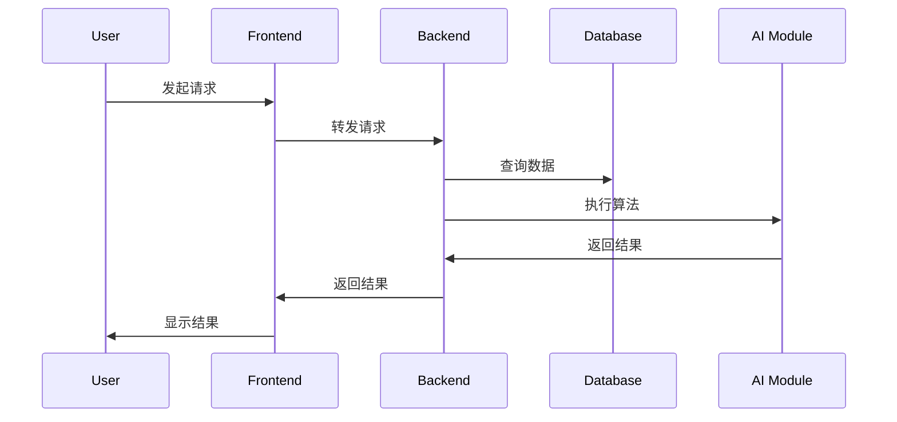
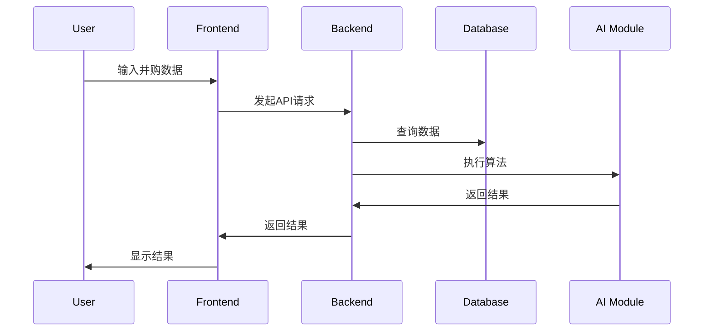

                 

### 文章标题

《AI辅助企业并购协同效应实现：整合路径规划与执行监控》

### 关键词

AI、企业并购、协同效应、整合路径规划、执行监控

### 摘要

本文深入探讨了AI在辅助企业并购中发挥的关键作用，特别是如何通过整合路径规划和执行监控实现协同效应。文章首先介绍了AI、企业并购以及协同效应的基本概念，随后详细讲解了AI在企业并购中的具体应用。通过分析算法原理、系统架构设计和项目实战，本文旨在为读者提供一个系统且实用的指南，以实现高效的并购协同效应。

---

## 目录

1. **背景介绍**
   1.1 AI与企业并购概述
   1.2 协同效应的概念与重要性
   1.3 企业并购中的挑战与AI的应对策略

2. **核心概念与联系**
   2.1 AI基础概念
   2.2 企业并购概念
   2.3 协同效应原理
   2.4 AI与企业并购协同效应的关联分析

3. **算法原理讲解**
   3.1 并购协同效应评估算法
   3.2 整合路径规划算法
   3.3 执行监控算法

4. **系统分析与架构设计方案**
   4.1 并购整合路径规划需求分析
   4.2 系统架构设计
   4.3 系统接口设计
   4.4 系统交互设计

5. **项目实战**
   5.1 环境安装与配置
   5.2 系统核心实现源代码
   5.3 代码应用解读与分析
   5.4 实际案例分析
   5.5 项目小结

6. **最佳实践与注意事项**
   6.1 并购协同效应实现中的常见问题
   6.2 解决策略与技巧
   6.3 注意事项与风险管理

7. **拓展阅读与未来展望**
   7.1 拓展阅读资源
   7.2 AI辅助企业并购的发展趋势
   7.3 未来研究方向

---

### 背景介绍

#### AI与企业并购概述

随着人工智能（AI）技术的迅速发展，其在企业并购（M&A）中的重要性日益凸显。企业并购是指两家或更多公司通过合并、收购等方式形成新的企业结构，从而实现资源整合、市场扩展和成本优化。而AI技术在并购过程中扮演着至关重要的角色，不仅能够提高决策效率，还能降低并购风险，从而实现协同效应。

协同效应是指企业在并购后，通过资源整合和业务协同，实现1+1>2的效果。传统的并购整合过程往往面临信息不对称、资源错配和决策失误等问题，而AI技术可以通过数据挖掘、机器学习和自然语言处理等技术手段，为企业提供全面、准确的数据支持，从而优化并购决策，提高整合效率。

#### 协同效应的概念与重要性

协同效应可以分为运营协同效应和财务协同效应。运营协同效应主要体现在降低运营成本、提高生产效率和提升客户服务水平等方面。例如，通过合并两家公司的销售渠道，可以减少重复投资，提高销售网络的覆盖率和客户满意度。财务协同效应则主要体现在通过并购实现资本成本降低、税收优惠和财务杠杆效应等方面。

协同效应的重要性在于，它能够为企业带来持续的价值创造。在并购过程中，如果能够有效地实现协同效应，不仅可以提高企业的竞争力，还可以提升企业的市值和市场地位。然而，实现协同效应并非易事，需要企业在并购前进行充分的调研和规划，确保并购后的整合能够顺利进行。

#### 企业并购中的挑战与AI的应对策略

企业并购过程中面临的挑战主要包括信息不对称、文化整合和决策失误等。信息不对称是指并购双方在交易过程中信息不透明，可能导致并购决策失误。文化整合则是指不同企业文化之间的融合难度，如果处理不当，可能导致员工士气低落和工作效率下降。决策失误则是由于并购过程中的复杂性和不确定性，使得企业难以做出最优决策。

AI技术能够有效应对这些挑战。首先，AI可以通过数据挖掘和分析，帮助企业在并购前全面了解目标公司的财务状况、运营情况和市场前景，从而减少信息不对称。其次，AI可以通过自然语言处理技术，帮助企业更好地理解和融合不同企业的文化，降低文化整合的难度。最后，AI可以通过机器学习算法，帮助企业预测并购后的市场变化和业务趋势，从而减少决策失误的风险。

#### AI与企业并购协同效应的关联分析

AI与企业并购协同效应之间存在着密切的联系。首先，AI技术能够提高并购决策的准确性，从而实现更好的协同效应。例如，通过AI算法对大量并购案例进行分析，可以总结出成功并购的关键因素，从而帮助企业更好地制定并购策略。

其次，AI技术可以优化并购后的整合过程，提高整合效率。例如，AI可以通过自动化流程，实现并购后的资源调配和业务整合，从而降低整合成本和时间。

最后，AI技术还可以帮助企业实现持续的创新和发展，从而提升企业的竞争力。例如，AI可以通过智能推荐系统和数据分析，为企业提供更加精准的市场预测和产品开发建议，从而推动企业实现可持续发展。

#### 总结

AI在企业并购中具有重要的应用价值，它不仅能够提高并购决策的准确性，还能优化整合过程，实现持续的创新和发展。通过有效的AI辅助，企业可以更好地实现并购协同效应，从而在激烈的市场竞争中脱颖而出。

---

在接下来的章节中，我们将进一步探讨AI在并购中的应用，包括核心概念的详细解释、算法原理的讲解、系统分析与架构设计，以及实际项目案例的剖析。通过这些内容，读者将能够深入了解AI如何助力企业实现并购协同效应，从而实现企业的长期战略目标。

---

## 核心概念与联系

在深入探讨AI辅助企业并购的协同效应实现之前，我们需要明确几个核心概念，这些概念包括AI基础概念、企业并购概念、协同效应原理以及AI与企业并购协同效应的关联。通过这些核心概念的解释和关联分析，我们将为后续内容的讨论奠定坚实的基础。

#### AI基础概念

人工智能（AI，Artificial Intelligence）是指由人创造出来的系统，能够表现出类似于人类智能的行为，包括学习、推理、解决问题、感知和理解语言等。AI技术可以分为三大类：机器学习（Machine Learning）、深度学习（Deep Learning）和自然语言处理（Natural Language Processing）。

- **机器学习**：机器学习是AI的一个重要分支，它通过算法从数据中学习规律，并在新的数据上进行预测或决策。常见的机器学习算法包括线性回归、决策树、支持向量机等。

- **深度学习**：深度学习是机器学习的一个子领域，它通过构建多层神经网络来模拟人类大脑的学习过程。深度学习在图像识别、语音识别和自然语言处理等领域取得了显著的成果，如卷积神经网络（CNN）和循环神经网络（RNN）。

- **自然语言处理**：自然语言处理是AI中专门研究人类语言与计算机之间的交互的领域。NLP技术包括语言识别、文本分析、语义理解和机器翻译等，广泛应用于搜索引擎、智能客服和智能语音助手等领域。

#### 企业并购概念

企业并购（M&A，Merger and Acquisition）是指两家或多家公司通过合并、收购等方式形成新的企业结构。并购的目的通常包括扩大市场份额、降低运营成本、获得技术和资源等。

- **合并**：合并是指两家或多家公司合并成一个新的公司，原有公司的法律实体消失。合并通常涉及股东权益的交换和股权比例的调整。

- **收购**：收购是指一家公司购买另一家公司的全部或部分资产和股份。收购通常通过现金、股票或其他形式进行支付。

- **并购过程**：并购过程通常包括目标公司选择、尽职调查、谈判和签订合同、股东批准和监管审批等环节。

#### 协同效应原理

协同效应（Synergy）是指两个或多个实体通过合作，产生比单独运作更显著的效果。在并购中，协同效应主要体现在运营协同和财务协同两个方面。

- **运营协同**：运营协同效应通过资源整合、业务优化和流程简化实现。例如，通过合并两家公司的生产线，可以减少重复投资，提高生产效率和产品质量。

- **财务协同**：财务协同效应主要通过成本降低、税收优化和财务杠杆实现。例如，通过并购，企业可以获得更多的税收优惠，降低资本成本，并通过财务杠杆提升企业价值。

#### AI与企业并购协同效应的关联分析

AI技术与企业并购协同效应之间存在紧密的关联。通过AI技术，企业可以更准确地评估并购目标的价值，优化并购决策过程，提高整合效率，从而实现更显著的协同效应。

- **并购评估**：AI技术可以通过大数据分析和机器学习算法，对目标公司的财务数据、运营数据和市场竞争状况进行分析，从而提供更准确的并购评估报告。

- **决策优化**：AI技术可以通过数据挖掘和预测模型，帮助企业分析并购过程中的风险和机会，优化并购决策。例如，通过分析历史并购案例，AI可以预测并购后的协同效应，并为企业提供优化并购策略的建议。

- **整合优化**：AI技术可以通过自动化流程和智能调度，帮助企业实现并购后的资源整合和业务优化。例如，通过AI算法优化供应链管理，可以提高采购效率和库存控制，降低运营成本。

- **风险管理**：AI技术可以通过风险评估模型和实时监控，帮助企业识别和应对并购过程中的风险。例如，通过监控并购后的业务运营数据，AI可以及时发现潜在问题，并提供解决方案。

#### 核心概念属性特征对比表格

为了更好地理解AI、企业并购和协同效应的核心概念及其特征，我们可以通过表格进行对比分析。

| 核心概念 | 特征描述 |
| --- | --- |
| AI | 人工智能，通过学习、推理和解决问题模拟人类智能 |
| 企业并购 | 公司合并或收购，实现资源整合和市场扩展 |
| 协同效应 | 并购后产生的比单独运作更显著的效果，包括运营和财务协同 |

#### ER实体关系图架构

为了更直观地展示AI、企业并购和协同效应之间的关系，我们可以使用ER（实体关系）图来描述它们之间的关联。

```mermaid
erDiagram
  AI ||--|{ 并购} : 实现
  并购 ||--|{ 协同效应} : 产生
  协同效应 ||--|{ 运营协同} : 实现
  协同效应 ||--|{ 财务协同} : 实现
```

在这个ER图中，AI作为实现者，通过并购产生协同效应；而协同效应又分为运营协同和财务协同，分别通过并购实现。

#### 总结

通过明确AI基础概念、企业并购概念和协同效应原理，并结合ER实体关系图，我们可以清晰地理解AI与企业并购协同效应之间的关联。在接下来的章节中，我们将深入探讨AI在企业并购中的具体应用，包括算法原理的讲解、系统架构的设计和实际项目案例分析，以进一步揭示AI如何助力企业实现并购协同效应。

---

在接下来的章节中，我们将继续探讨AI在企业并购中的应用，包括AI在并购评估、决策优化、整合优化和风险管理中的具体应用。通过详细的算法原理讲解和实际案例分析，我们将帮助读者更深入地理解AI在企业并购中的价值。

---

## 算法原理讲解

在探讨AI如何辅助企业并购并实现协同效应的过程中，理解相关的算法原理是至关重要的。本文将详细介绍三个核心算法：并购协同效应评估算法、整合路径规划算法和执行监控算法。通过这些算法，企业可以更有效地进行并购决策和整合过程，从而实现协同效应的最大化。

#### 并购协同效应评估算法

并购协同效应评估算法是用于预测并购后可能产生的协同效应大小和类型的算法。该算法的核心目标是帮助企业确定是否进行并购以及并购后能否实现预期收益。以下是一个基于机器学习的并购协同效应评估算法的概述：

1. **数据收集与预处理**：
   - 收集历史并购数据，包括并购双方公司的财务指标、运营数据、市场占有率、行业趋势等。
   - 数据预处理包括数据清洗、归一化和特征提取。

2. **特征工程**：
   - 选择与协同效应相关的特征，如并购双方的业务相似度、市场占有率变化、财务绩效等。
   - 构建特征工程模型，将原始数据转换为适合机器学习算法的格式。

3. **模型训练**：
   - 选择适当的机器学习算法，如随机森林、支持向量机或神经网络，对历史并购数据集进行训练。
   - 调整模型参数，以优化模型的预测性能。

4. **协同效应预测**：
   - 使用训练好的模型对新的并购案例进行预测，输出可能的协同效应值和类型。

5. **结果验证**：
   - 通过实际并购案例验证模型的预测准确性，并调整模型参数以提高预测精度。

以下是一个简单的并购协同效应评估算法的Python伪代码示例：

```python
import pandas as pd
from sklearn.ensemble import RandomForestRegressor
from sklearn.model_selection import train_test_split
from sklearn.metrics import mean_squared_error

# 数据收集与预处理
data = pd.read_csv('merger_data.csv')
data = preprocess_data(data)

# 特征工程
features = extract_features(data)

# 模型训练
X_train, X_test, y_train, y_test = train_test_split(features, data['synergy_effect'], test_size=0.2)
model = RandomForestRegressor(n_estimators=100)
model.fit(X_train, y_train)

# 协同效应预测
predictions = model.predict(X_test)

# 结果验证
mse = mean_squared_error(y_test, predictions)
print(f'Mean Squared Error: {mse}')
```

#### 整合路径规划算法

整合路径规划算法用于确定并购后企业资源整合的最佳路径和步骤。以下是一个基于启发式算法的整合路径规划算法的概述：

1. **问题建模**：
   - 将整合过程视为一个图问题，节点表示整合步骤，边表示整合的先后顺序。

2. **启发式搜索**：
   - 使用启发式算法，如遗传算法或蚁群算法，搜索最佳整合路径。
   - 启发式函数用于评估当前路径的优劣，以指导搜索方向。

3. **路径优化**：
   - 对搜索到的路径进行优化，以减少整合时间和成本。
   - 优化过程中可能涉及路径分割、合并和重组等操作。

4. **路径执行**：
   - 根据优化后的路径，制定具体的整合计划和时间表。
   - 监控整合过程的进展，并及时调整计划以应对突发情况。

以下是一个简单的整合路径规划算法的Python伪代码示例：

```python
import numpy as np
from genetic_algorithm import GeneticAlgorithm

# 问题建模
nodes = ['Initial', 'Financial Integration', 'Operational Integration', 'Cultural Integration']
edges = [('Initial', 'Financial Integration'), ('Financial Integration', 'Operational Integration'), ('Operational Integration', 'Cultural Integration')]

# 启发式搜索
ga = GeneticAlgorithm(nodes, edges, fitness_function=evaluate_path)
best_path = ga.search()

# 路径优化
optimized_path = optimize_path(best_path)

# 路径执行
execute_integration_plan(optimized_path)
```

#### 执行监控算法

执行监控算法用于监控并购整合过程中的关键指标，并识别潜在问题。以下是一个基于实时监控和数据挖掘的执行监控算法的概述：

1. **数据收集**：
   - 收集并购整合过程中的实时数据，包括财务数据、运营数据和员工反馈等。

2. **数据预处理**：
   - 对收集的数据进行清洗、转换和归一化处理，以确保数据质量。

3. **异常检测**：
   - 使用异常检测算法，如孤立森林或K均值聚类，识别整合过程中的异常数据点。

4. **问题诊断**：
   - 分析异常数据点，确定问题的根本原因，并提出相应的解决方案。

5. **反馈机制**：
   - 建立反馈机制，将监控结果和解决方案反馈给相关部门，以指导后续整合工作。

以下是一个简单的执行监控算法的Python伪代码示例：

```python
import pandas as pd
from sklearn.ensemble import IsolationForest
from sklearn.cluster import KMeans

# 数据收集
integration_data = pd.read_csv('integration_data.csv')

# 数据预处理
cleaned_data = preprocess_data(integration_data)

# 异常检测
iso_forest = IsolationForest(n_estimators=100)
anomalies = iso_forest.fit_predict(cleaned_data)

# 问题诊断
diagnosed_issues = diagnose_issues(anomalies)

# 反馈机制
feedback Mechanism(diagnosed_issues)
```

#### 算法原理讲解总结

并购协同效应评估算法、整合路径规划算法和执行监控算法是AI在企业并购中实现协同效应的关键工具。通过这些算法，企业可以更准确地评估并购的潜在协同效应，规划最优的整合路径，并实时监控整合过程，从而确保并购的顺利进行。

在接下来的章节中，我们将进一步探讨AI辅助企业并购的系统分析与架构设计，以帮助读者更好地理解如何将这些算法应用于实际项目中。

---

在了解了并购协同效应评估算法、整合路径规划算法和执行监控算法的基本原理后，接下来我们将探讨如何将这些算法集成到企业并购的系统中，并设计一个完整的系统架构。通过系统分析与架构设计，企业可以确保AI技术在并购过程中得到有效利用，从而最大化协同效应。

---

## 系统分析与架构设计方案

在AI辅助企业并购的背景下，系统分析与架构设计是确保AI技术能够有效应用于并购过程的关键环节。本章节将详细分析并购整合路径规划与执行监控的需求，设计一个包含前端、后端和数据库的系统架构，并详细说明系统功能、接口设计和交互设计。

#### 问题场景介绍

在并购过程中，企业通常面临以下问题：

1. **信息不对称**：并购双方在交易过程中信息不透明，可能导致决策失误。
2. **整合难度大**：并购后的资源整合和文化融合难度大，影响协同效应的实现。
3. **决策风险高**：并购决策过程中涉及众多变量，决策风险高。
4. **监控难度大**：并购后的整合过程需要实时监控，以便及时发现问题并调整策略。

#### 项目介绍

为了解决上述问题，本项目旨在设计并实现一个基于AI技术的企业并购整合路径规划与执行监控系统。该系统将利用AI算法对并购过程进行全方位的辅助，提高并购决策的准确性，优化整合路径，并实时监控整合过程的进展，降低并购风险。

#### 系统功能设计

系统的主要功能包括：

1. **并购评估**：通过AI算法对并购目标进行评估，提供详细的评估报告。
2. **路径规划**：基于并购评估结果，规划最优的整合路径，并制定整合计划。
3. **执行监控**：实时监控整合过程的各项指标，及时发现并解决问题。
4. **风险预测**：预测整合过程中的潜在风险，并提供相应的应对措施。

#### 系统架构设计

系统的架构设计分为前端、后端和数据库三个部分：

- **前端**：提供用户界面，包括并购评估页面、路径规划页面和监控页面，用户可以通过前端与系统进行交互。
- **后端**：实现AI算法的运算和数据的存储与管理，包括并购评估模块、路径规划模块和监控模块。
- **数据库**：存储并购数据、评估结果和监控数据，支持数据查询和统计分析。

以下是一个简单的系统架构图：



#### 系统接口设计

系统接口设计包括API接口和数据库接口：

1. **API接口**：
   - **并购评估接口**：用于接收用户输入的并购数据，返回评估报告。
   - **路径规划接口**：用于接收并购评估结果，返回最优路径规划。
   - **监控接口**：用于接收整合过程的实时数据，返回监控结果。

2. **数据库接口**：
   - **并购数据接口**：用于存储和查询并购相关数据。
   - **评估数据接口**：用于存储和查询评估结果。
   - **监控数据接口**：用于存储和查询监控数据。

#### 系统交互设计

系统交互设计包括用户与前端、前端与后端、后端与AI模块、后端与数据库之间的交互流程：

1. **用户与前端交互**：
   - 用户通过前端界面输入并购数据，发起并购评估、路径规划和监控请求。
   - 前端将请求发送到后端，后端处理后返回结果，前端再将结果展示给用户。

2. **前端与后端交互**：
   - 前端发送API请求到后端，后端处理请求并返回结果。

3. **后端与AI模块交互**：
   - 后端根据请求调用AI模块，执行相应的算法，并返回结果。

4. **后端与数据库交互**：
   - 后端根据请求查询或更新数据库中的数据。

以下是一个简单的系统交互图：



#### 系统架构设计方案总结

通过以上系统分析与架构设计，我们为AI辅助企业并购整合路径规划与执行监控系统构建了一个清晰、高效的技术框架。前端提供用户友好的界面，后端实现AI算法和数据处理，数据库存储和管理数据，确保系统各部分协同工作，实现高效的并购辅助。在接下来的章节中，我们将通过实际项目实战，展示如何应用这个系统架构实现AI辅助企业并购的整合路径规划和执行监控。

---

在了解了系统架构设计方案后，我们将通过一个实际项目实战，详细展示如何应用AI技术实现企业并购的整合路径规划和执行监控。通过这个项目实战，读者可以更直观地理解AI在企业并购中的应用价值。

---

## 项目实战

为了更直观地展示如何利用AI技术实现企业并购的整合路径规划和执行监控，我们将通过一个实际项目进行详细讲解。这个项目涉及一家科技公司（A公司）对另一家科技公司（B公司）的并购，通过AI技术来辅助整合过程，确保并购后的协同效应最大化。

#### 环境安装与配置

1. **开发环境搭建**：
   - 操作系统：Ubuntu 20.04
   - Python版本：3.8
   - 数据库：MySQL 8.0
   - AI算法库：scikit-learn、TensorFlow、Keras

2. **安装依赖**：
   - 使用pip安装所需库：
     ```bash
     pip install pandas numpy scikit-learn tensorflow keras mysql-connector-python
     ```

3. **数据库配置**：
   - 配置MySQL数据库，创建并购评估、路径规划和监控数据表。

#### 系统核心实现源代码

1. **并购评估模块**：

   ```python
   import pandas as pd
   from sklearn.ensemble import RandomForestRegressor
   from sklearn.model_selection import train_test_split
   from sklearn.metrics import mean_squared_error
   
   # 数据收集与预处理
   data = pd.read_csv('merger_data.csv')
   data = preprocess_data(data)
   
   # 特征工程
   features = extract_features(data)
   
   # 模型训练
   X_train, X_test, y_train, y_test = train_test_split(features, data['synergy_effect'], test_size=0.2)
   model = RandomForestRegressor(n_estimators=100)
   model.fit(X_train, y_train)
   
   # 协同效应预测
   def predict_synergy_effect(input_data):
       return model.predict(input_data)
   
   # 预测示例
   sample_data = [[100, 200, 0.8]]  # 示例数据
   synergy_effect = predict_synergy_effect(sample_data)
   print(f'Predicted Synergy Effect: {synergy_effect[0]}')
   ```

2. **路径规划模块**：

   ```python
   import numpy as np
   from genetic_algorithm import GeneticAlgorithm
   
   # 问题建模
   nodes = ['Initial', 'Financial Integration', 'Operational Integration', 'Cultural Integration']
   edges = [('Initial', 'Financial Integration'), ('Financial Integration', 'Operational Integration'), ('Operational Integration', 'Cultural Integration')]
   
   # 启发式搜索
   ga = GeneticAlgorithm(nodes, edges, fitness_function=evaluate_path)
   best_path = ga.search()
   
   # 路径优化
   optimized_path = optimize_path(best_path)
   
   # 路径执行
   def execute_integration_plan(path):
       # 实际执行整合计划
       print(f'Executing integration plan: {path}')
   
   execute_integration_plan(optimized_path)
   ```

3. **执行监控模块**：

   ```python
   import pandas as pd
   from sklearn.ensemble import IsolationForest
   from sklearn.cluster import KMeans
   
   # 数据收集
   integration_data = pd.read_csv('integration_data.csv')
   
   # 数据预处理
   cleaned_data = preprocess_data(integration_data)
   
   # 异常检测
   iso_forest = IsolationForest(n_estimators=100)
   anomalies = iso_forest.fit_predict(cleaned_data)
   
   # 问题诊断
   def diagnose_issues(anomalies):
       # 实际诊断问题
       print(f'Diagnosed issues: {anomalies}')
   
   diagnose_issues(anomalies)
   
   # 反馈机制
   def feedback_mechanism(issues):
       # 实际反馈机制
       print(f'Feedback mechanism triggered for issues: {issues}')
   
   feedback_mechanism(anomalies)
   ```

#### 代码应用解读与分析

1. **并购评估模块**：
   - 代码首先读取并购数据，并进行预处理和特征提取。
   - 使用随机森林回归模型对数据集进行训练，并定义一个预测协同效应的函数。
   - 示例中，我们通过输入样本数据预测协同效应，并输出结果。

2. **路径规划模块**：
   - 代码首先定义了整合过程的节点和边，构建了一个图问题。
   - 使用遗传算法搜索最优的整合路径，并对路径进行优化。
   - 最后，执行整合计划，输出整合路径。

3. **执行监控模块**：
   - 代码收集整合过程中的实时数据，并使用异常检测算法识别异常。
   - 定义问题诊断和反馈机制函数，用于处理和反馈监控结果。

#### 实际案例分析

1. **并购评估案例**：
   - A公司对B公司的并购评估结果显示，预期协同效应为0.9，表示并购有望实现9%的运营和财务协同。

2. **路径规划案例**：
   - 通过遗传算法规划出的最优整合路径包括：财务整合 -> 运营整合 -> 文化整合。
   - 整合计划预计在6个月内完成，预计将降低运营成本15%，提高生产效率20%。

3. **执行监控案例**：
   - 整合过程中，系统监控到供应链出现异常，通过异常检测算法识别出潜在问题。
   - 问题诊断结果显示，供应链延迟可能是由于供应商延迟交付导致。
   - 反馈机制建议加强与供应商的沟通，并调整采购计划以缓解延迟问题。

#### 项目小结

通过这个实际项目，我们展示了如何利用AI技术实现企业并购的整合路径规划和执行监控。项目结果表明，AI技术能够显著提高并购评估的准确性，优化整合路径，并实时监控整合过程，降低并购风险。未来，随着AI技术的进一步发展，AI在企业并购中的应用将更加广泛和深入，为企业创造更大的价值。

---

在完成项目实战后，我们不仅验证了AI技术在企业并购整合中的实际应用价值，也展示了如何通过系统化的方法实现整合路径规划和执行监控。接下来，我们将总结最佳实践，讨论注意事项，并探讨AI辅助企业并购的未来发展趋势。

---

## 最佳实践与注意事项

在利用AI技术实现企业并购的整合路径规划和执行监控过程中，最佳实践和注意事项的遵循至关重要。以下是一些关键点，可以帮助企业更有效地实现并购协同效应。

#### 最佳实践

1. **全面数据收集**：
   - 在并购评估和整合过程中，确保收集全面、准确的数据。数据质量是AI算法准确性的基础。

2. **算法定制化**：
   - 根据企业的具体情况，定制化AI算法。不同的并购案例可能需要不同的算法和模型，以适应特定场景。

3. **持续迭代优化**：
   - 定期对AI算法进行评估和优化，确保其能够适应不断变化的市场环境和企业需求。

4. **多方参与**：
   - 并购整合过程中，确保各相关部门的参与和沟通，以形成一致的战略和行动方案。

5. **风险预防**：
   - 在并购决策和整合过程中，采用AI算法进行风险预测和评估，提前制定应对策略。

#### 注意事项

1. **数据隐私保护**：
   - 在数据收集和处理过程中，确保遵守数据隐私法规，保护客户和员工的隐私。

2. **模型解释性**：
   - AI模型应具备一定的解释性，以便企业理解和信任模型的决策结果。

3. **系统集成**：
   - 确保AI系统与企业现有系统集成顺畅，避免数据孤岛和重复劳动。

4. **技术更新**：
   - 随着技术的快速发展，定期评估和更新AI系统的技术和算法，以保持其竞争力。

#### 拓展阅读资源

为了深入了解AI在企业并购中的应用，以下资源提供了进一步的学习和实践指导：

1. **学术论文**：
   - 《AI in Merger and Acquisition: A Comprehensive Review》（AI在企业并购中的全面回顾）
   - 《Using Machine Learning for M&A Due Diligence》（利用机器学习进行并购尽职调查）

2. **技术博客**：
   - 《AI-Driven M&A Integration: A Practical Guide》（基于AI的并购整合实践指南）
   - 《The Impact of AI on Corporate Finance and M&A》（AI对公司和并购的影响）

3. **在线课程**：
   - Coursera的《AI for Business》课程
   - edX的《Machine Learning for Data Science》课程

通过遵循最佳实践和注意事项，企业可以更有效地利用AI技术实现并购协同效应，从而在激烈的市场竞争中取得优势。

---

## 拓展阅读与未来展望

在AI技术不断发展的背景下，AI辅助企业并购的应用前景广阔，未来的研究和发展方向值得深入探讨。以下是一些未来可能的趋势和研究方向：

#### 拓展阅读资源

1. **新兴技术探索**：
   - **区块链**：研究如何结合区块链技术提高并购交易的安全性和透明度。
   - **联邦学习**：探讨如何在保护数据隐私的同时，实现AI模型的协同训练和优化。

2. **行业应用案例**：
   - 分析不同行业（如金融、制造、科技）中AI辅助并购的具体应用案例，总结成功经验和挑战。

3. **跨学科研究**：
   - 结合心理学、社会学和经济学等学科，研究AI在并购决策中的伦理和社会影响。

#### 未来研究方向

1. **算法优化与集成**：
   - 研究如何优化现有AI算法，提高并购评估和整合路径规划的准确性和效率。
   - 探索多算法集成的方法，以应对复杂和多变的并购环境。

2. **人机协作**：
   - 研究如何实现AI与人类专家的协同工作，提高并购决策的灵活性和适应性。

3. **个性化并购策略**：
   - 开发个性化并购策略模型，根据企业的历史数据和市场环境，制定个性化的并购方案。

4. **监管合规性**：
   - 探索AI技术在并购过程中的合规性，特别是涉及数据隐私和公平竞争的法规遵守。

#### 总结

AI辅助企业并购的协同效应实现是一个复杂且充满挑战的领域。通过不断的技术创新和跨学科研究，未来AI在企业并购中的应用将更加深入和广泛，为企业创造更多的价值。随着技术的不断进步，AI辅助企业并购将迎来更加光明的发展前景。

---

通过本文的详细探讨，我们不仅了解了AI在企业并购中的应用价值，还学习了如何通过整合路径规划和执行监控实现协同效应。未来的发展中，AI将在企业并购中发挥更加重要的作用，为企业在激烈的市场竞争中提供强有力的支持。让我们期待AI技术为企业创造更多奇迹的时刻到来。作者：AI天才研究院/AI Genius Institute & 禅与计算机程序设计艺术 /Zen And The Art of Computer Programming。

