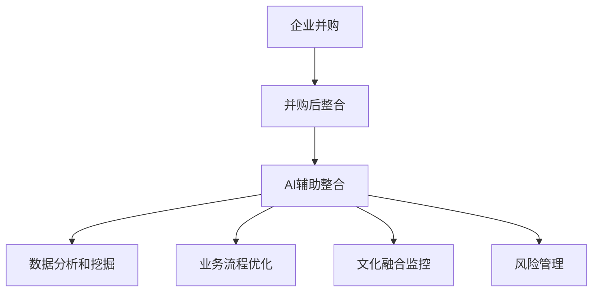
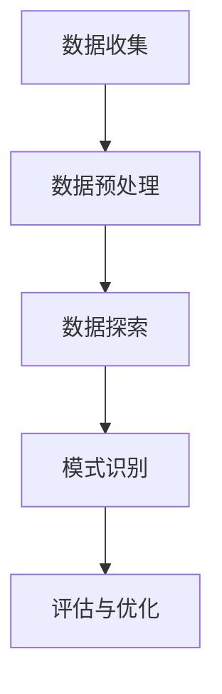
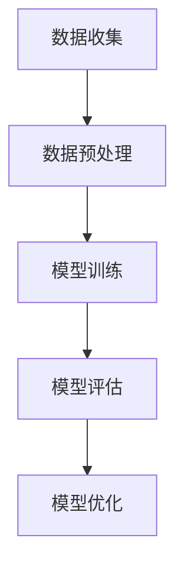
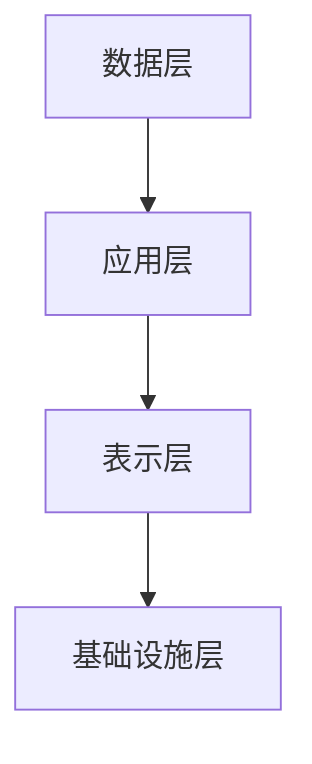
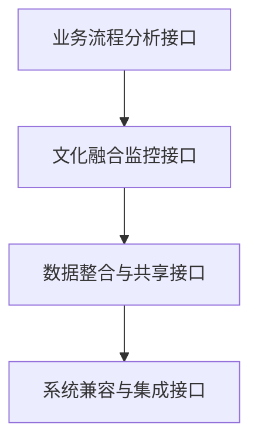
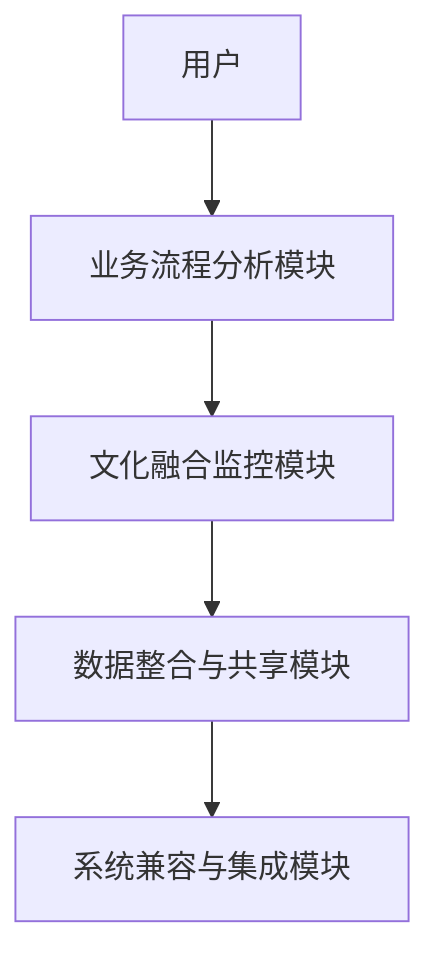

                 


### 背景介绍

#### 1.1 企业并购的意义与挑战

企业并购，作为企业发展策略中的一种重要手段，已经成为企业扩展规模、提升市场竞争力、实现资源整合和优化配置的重要途径。并购的意义在于，它可以帮助企业快速进入新的市场、获得技术或品牌优势，从而实现跨越式发展。具体来说，并购可以带来以下几方面的好处：

1. **扩展市场覆盖**：通过并购，企业可以迅速进入新的市场，扩大业务范围，提高市场占有率。
2. **获取技术和资源**：并购可以帮助企业获得其他公司的专利、技术、人才等资源，提升自身的技术水平和管理能力。
3. **提高市场竞争力**：并购可以使企业实现规模经济，降低成本，提高产品和服务的市场竞争力。
4. **优化资本结构**：通过并购，企业可以调整资本结构，提高资金利用效率。

然而，并购并不是一帆风顺的，其中也充满了挑战。首先，并购可能会面临法律和监管的障碍，如反垄断审查、信息安全问题等。其次，文化差异、管理风格的不同可能导致并购后的整合难度增加。此外，并购的财务风险和整合失败的风险也是企业需要谨慎考虑的因素。

为了应对这些挑战，企业需要制定详细的并购策略和整合计划，确保在并购过程中减少风险、提高成功率。在这个过程中，AI技术的应用可以为企业的并购和整合提供有力的支持。

#### 1.2 AI在并购后整合中的作用

AI技术作为一种高度智能化的工具，其在企业并购后整合中的作用日益凸显。具体来说，AI在以下几个方面发挥了重要作用：

1. **数据分析和挖掘**：AI可以通过大数据分析，帮助企业了解并购对象的历史数据、市场趋势和潜在风险，为决策提供数据支持。

2. **业务流程优化**：AI技术可以自动化分析并购双方的业务流程，发现瓶颈和冗余，提出优化建议，提高运营效率。

3. **文化融合监控**：通过机器学习算法，AI可以分析员工行为数据，监控并购后组织文化的变化，及时识别并解决文化冲突。

4. **风险管理**：AI可以预测并购过程中可能出现的财务风险、法律风险等，为企业的风险管理提供预警。

5. **员工培训和沟通**：AI可以自动化生成培训内容，通过自然语言处理技术，与员工进行沟通，缓解并购带来的心理压力。

总之，AI技术的应用不仅可以帮助企业更好地完成并购后的整合工作，还可以提高整合的效果和成功率，从而实现企业的长期可持续发展。

### 核心概念与联系

在探讨AI辅助企业并购后整合的过程中，我们需要明确几个核心概念，并分析它们之间的相互关系。以下是企业并购、整合、AI辅助等关键概念的详细解析及其相互联系。

#### 2.1 企业并购

**定义与类型**

企业并购是指一家企业通过购买另一家企业的股份或资产，从而获得对该企业的控制权或部分权益的行为。并购的类型主要包括以下几种：

- **兼并（Merger）**：一家企业完全吸收另一家企业，使其成为子公司或部门。
- **收购（Acquisition）**：一家企业购买另一家企业的全部或部分资产和股份，以实现对该企业的控制。
- **联合（Joint Venture）**：两家或多家企业共同投资、合作经营，共同承担风险和收益。

**优势与风险**

企业并购的优势包括：

- **快速扩展业务范围和市场占有率**：通过并购，企业可以迅速进入新的市场，扩大业务规模。
- **获得技术、人才和资源**：并购可以帮助企业获得其他公司的专利、技术、人才等资源，提升自身竞争力。
- **提高市场竞争力**：通过并购，企业可以实现规模经济，降低成本，提高产品和服务的市场竞争力。

但并购也面临一定的风险：

- **整合困难**：并购后的整合工作复杂，可能会因文化差异、管理风格不同等原因导致整合失败。
- **财务风险**：并购可能需要大量资金投入，如果并购后无法实现预期效益，可能会导致财务风险。
- **法律风险**：并购过程中可能涉及法律和监管问题，如反垄断审查、信息安全问题等。

#### 2.2 并购后整合

**定义与目标**

并购后整合是指企业在完成并购后，通过一系列策略和行动，将并购双方的业务、文化、组织结构等融合为一个整体，实现协同效应的过程。整合的目标主要包括：

- **资源优化配置**：通过整合，企业可以优化资源配置，提高运营效率。
- **提高整体竞争力**：整合后的企业可以实现规模效应、降低成本、提升产品质量和服务水平。
- **文化融合**：整合过程中需要解决文化差异，促进企业文化的融合，提高员工的工作积极性和满意度。

**挑战与策略**

整合过程中可能会面临以下挑战：

- **文化冲突**：不同企业之间的文化差异可能导致冲突，影响整合效果。
- **组织变革**：整合需要企业进行组织架构的调整，可能会引发员工的抵触情绪。
- **业务流程调整**：并购双方的业务流程可能存在差异，需要重新设计和优化。

为应对这些挑战，企业可以采取以下策略：

- **文化融合策略**：通过沟通、培训等方式，促进文化的融合。
- **组织变革策略**：制定详细的变革计划，逐步推进组织架构的调整。
- **业务流程优化策略**：通过数据分析，识别业务流程中的瓶颈和冗余，进行优化。

#### 2.3 AI辅助整合

**定义与作用**

AI辅助整合是指利用人工智能技术，在企业并购后整合过程中提供数据支持、流程优化、文化融合监控等服务。AI在整合中的作用主要包括：

- **数据分析和挖掘**：AI可以通过大数据分析，帮助企业了解并购对象的历史数据、市场趋势和潜在风险，为决策提供数据支持。
- **业务流程优化**：AI可以自动化分析并购双方的业务流程，发现瓶颈和冗余，提出优化建议，提高运营效率。
- **文化融合监控**：通过机器学习算法，AI可以分析员工行为数据，监控并购后组织文化的变化，及时识别并解决文化冲突。
- **风险管理**：AI可以预测并购过程中可能出现的财务风险、法律风险等，为企业的风险管理提供预警。

**相互关系**

企业并购、整合和AI辅助整合之间存在着密切的相互关系。企业并购是整合的前提，而整合的目标是通过AI技术来实现。AI技术的应用可以提升整合的效果和成功率，帮助企业实现资源优化配置、提高整体竞争力、促进文化融合，从而实现长期可持续发展。

### 核心概念与联系示意图

为了更好地理解企业并购、整合和AI辅助整合之间的关系，我们可以使用Mermaid流程图来展示它们的核心概念和联系。



在这个流程图中，企业并购作为起点，引导至并购后整合，而整合又通过AI辅助整合这个环节，进一步扩展到数据分析和挖掘、业务流程优化、文化融合监控和风险管理等多个方面。这样的结构展示了AI技术在并购后整合中的核心作用，以及各环节之间的紧密联系。

### 算法原理讲解

在AI辅助企业并购后整合的过程中，数据挖掘、机器学习等算法发挥着至关重要的作用。以下是对这些算法原理的详细讲解，以及相应的mermaid流程图和Python代码示例。

#### 3.1 数据挖掘在整合中的应用

**数据挖掘的基本概念**

数据挖掘（Data Mining）是指从大量数据中提取隐藏的、未知的、有价值的模式和信息的过程。它是人工智能和机器学习的一个重要分支，旨在帮助企业和组织发现数据中的规律和关联，从而为决策提供支持。

**数据挖掘流程**

数据挖掘的基本流程包括以下几个步骤：

1. **数据收集**：从各种数据源（如数据库、文件、网络等）收集数据。
2. **数据预处理**：清洗和整理数据，包括去噪、转换、归一化等操作。
3. **数据探索**：通过可视化、统计分析等方法对数据集进行初步探索，发现数据的分布、趋势和异常。
4. **模式识别**：利用算法挖掘数据中的模式，如分类、聚类、关联规则等。
5. **评估与优化**：对挖掘结果进行评估，调整算法参数，优化模型性能。

**数据挖掘算法简介**

数据挖掘常用的算法包括：

- **分类算法**：如决策树、支持向量机（SVM）、K-近邻（KNN）等。
- **聚类算法**：如K-均值、层次聚类等。
- **关联规则算法**：如Apriori算法、Eclat算法等。
- **异常检测算法**：如孤立森林、本地异常检测等。

**mermaid流程图示例**

以下是使用mermaid绘制的数据挖掘流程图：



**Python代码示例**

以下是一个简单的Python代码示例，展示如何使用Scikit-learn库进行数据挖掘：

```python
from sklearn.datasets import load_iris
from sklearn.model_selection import train_test_split
from sklearn.ensemble import RandomForestClassifier
from sklearn.metrics import accuracy_score

# 加载数据集
iris = load_iris()
X = iris.data
y = iris.target

# 划分训练集和测试集
X_train, X_test, y_train, y_test = train_test_split(X, y, test_size=0.3, random_state=42)

# 使用随机森林分类器进行分类
clf = RandomForestClassifier(n_estimators=100)
clf.fit(X_train, y_train)

# 进行预测
y_pred = clf.predict(X_test)

# 计算准确率
accuracy = accuracy_score(y_test, y_pred)
print(f"准确率: {accuracy:.2f}")
```

在这个示例中，我们使用了Iris数据集，通过随机森林分类器进行数据挖掘，并计算了预测的准确率。

#### 3.2 机器学习在整合中的应用

**机器学习的基本概念**

机器学习（Machine Learning）是指利用计算机算法，从数据中学习规律，并进行预测或决策的技术。机器学习的基本原理是通过训练模型，使模型能够在新的数据上进行有效的预测。

**机器学习模型**

机器学习模型可以分为监督学习、无监督学习和强化学习三种类型：

- **监督学习**：模型通过已有标注数据学习规律，并对新的数据进行预测。常见的监督学习算法包括线性回归、逻辑回归、支持向量机（SVM）等。
- **无监督学习**：模型在没有标注数据的情况下，自动发现数据中的模式和结构，如聚类算法、降维算法等。
- **强化学习**：模型通过与环境的交互，学习最佳策略，以提高奖励。

**机器学习算法简介**

机器学习常用的算法包括：

- **线性回归**：通过拟合数据点与特征之间的关系，预测连续值。
- **逻辑回归**：用于分类问题，通过计算概率来进行分类。
- **支持向量机（SVM）**：用于分类和回归问题，通过找到一个最优的超平面进行分类。
- **神经网络**：模拟人脑神经元之间的连接，用于复杂的模式识别和预测。

**mermaid流程图示例**

以下是使用mermaid绘制的机器学习流程图：



**Python代码示例**

以下是一个简单的Python代码示例，展示如何使用Keras库进行机器学习：

```python
from tensorflow.keras.datasets import mnist
from tensorflow.keras.models import Sequential
from tensorflow.keras.layers import Dense, Flatten
from tensorflow.keras.optimizers import Adam

# 加载数据集
(X_train, y_train), (X_test, y_test) = mnist.load_data()

# 数据预处理
X_train = X_train.reshape(-1, 28 * 28) / 255.0
X_test = X_test.reshape(-1, 28 * 28) / 255.0

# 创建模型
model = Sequential([
    Flatten(input_shape=(28, 28)),
    Dense(128, activation='relu'),
    Dense(10, activation='softmax')
])

# 编译模型
model.compile(optimizer=Adam(), loss='sparse_categorical_crossentropy', metrics=['accuracy'])

# 训练模型
model.fit(X_train, y_train, epochs=5, batch_size=32, validation_data=(X_test, y_test))

# 进行预测
y_pred = model.predict(X_test)

# 计算准确率
accuracy = (y_pred.argmax(axis=1) == y_test).mean()
print(f"准确率: {accuracy:.2f}")
```

在这个示例中，我们使用了MNIST手写数字数据集，通过构建一个简单的神经网络模型进行分类，并计算了预测的准确率。

### 数学模型和数学公式

在AI算法中，数学模型和数学公式起着至关重要的作用。它们不仅帮助我们理解算法的内在工作原理，还可以通过数学推理来验证和优化算法。以下将详细讲解业务流程优化和文化融合监控中的数学模型，并使用LaTeX格式和Python代码进行示例说明。

#### 4.1 业务流程优化数学模型

**模型定义**

业务流程优化通常涉及成本、时间和资源的平衡。一个基本的业务流程优化模型可以定义为：

\[ \text{Cost}(x) = \sum_{i=1}^{n} w_i \cdot c_i(x) \]

其中：
- \( x \) 是业务流程中的各个决策变量；
- \( w_i \) 是第 \( i \) 个决策变量的权重；
- \( c_i(x) \) 是第 \( i \) 个决策变量在特定业务流程中的成本函数。

**数学公式**

为了具体化模型，我们可以假设一个简单的业务流程，其中包含三个决策变量：生产量 \( p \)，库存量 \( q \) 和运输量 \( t \)。成本函数可以表示为：

\[ \text{Cost}(x) = w_1 \cdot c_1(p) + w_2 \cdot c_2(q) + w_3 \cdot c_3(t) \]

其中：
- \( c_1(p) = a \cdot p^2 + b \cdot p \) 是生产成本函数；
- \( c_2(q) = d \cdot q^2 + e \cdot q \) 是库存成本函数；
- \( c_3(t) = g \cdot t^2 + h \cdot t \) 是运输成本函数。

**LaTeX格式表示**

\[
\text{Cost}(x) = w_1 \cdot (a \cdot p^2 + b \cdot p) + w_2 \cdot (d \cdot q^2 + e \cdot q) + w_3 \cdot (g \cdot t^2 + h \cdot t)
\]

**Python代码示例**

```python
# 假设的权重和成本函数参数
w1, w2, w3 = 0.5, 0.3, 0.2
a, b, d, e, g, h = 10, 5, 20, 10, 15, 8

# 定义决策变量
p = 50
q = 100
t = 150

# 计算总成本
cost = w1 * (a * p**2 + b * p) + w2 * (d * q**2 + e * q) + w3 * (g * t**2 + h * t)
print(f"总成本: {cost:.2f}")
```

在这个示例中，我们定义了权重和成本函数参数，并计算了一个特定业务流程的总成本。

#### 4.2 文化融合监控数学模型

**模型定义**

文化融合监控旨在评估并购后组织文化的融合程度。一个简单的文化融合监控模型可以定义为：

\[ \text{CulturalFit}(x, y) = \frac{\sum_{i=1}^{m} w_i \cdot \text{Score}(i)}{n} \]

其中：
- \( x \) 和 \( y \) 是两个组织在 \( m \) 个文化维度上的评分；
- \( w_i \) 是第 \( i \) 个文化维度的权重；
- \( \text{Score}(i) \) 是第 \( i \) 个文化维度的得分；
- \( n \) 是总的维度数量。

**数学公式**

假设有两个组织A和B，在三个文化维度上评分，分别为 \( x_1, x_2, x_3 \) 和 \( y_1, y_2, y_3 \)。权重为 \( w_1 = 0.3 \)，\( w_2 = 0.5 \)，\( w_3 = 0.2 \)。文化融合得分为：

\[ \text{CulturalFit}(x, y) = \frac{0.3 \cdot (x_1 + x_2 + x_3) + 0.5 \cdot (y_1 + y_2 + y_3) + 0.2 \cdot (x_1 + y_1)}{3} \]

**LaTeX格式表示**

\[
\text{CulturalFit}(x, y) = \frac{0.3 \cdot (x_1 + x_2 + x_3) + 0.5 \cdot (y_1 + y_2 + y_3) + 0.2 \cdot (x_1 + y_1)}{3}
\]

**Python代码示例**

```python
# 假设的权重和评分
w1, w2, w3 = 0.3, 0.5, 0.2
x1, x2, x3 = 7, 8, 9
y1, y2, y3 = 6, 7, 8

# 计算文化融合得分
cultural_fit = (w1 * (x1 + x2 + x3) + w2 * (y1 + y2 + y3) + w3 * (x1 + y1)) / 3
print(f"文化融合得分: {cultural_fit:.2f}")
```

在这个示例中，我们计算了两个组织在三个文化维度上的文化融合得分。

### 系统分析与架构设计方案

在进行AI辅助企业并购后整合时，系统分析与架构设计方案是确保整合顺利实施和取得预期效果的关键。以下将详细介绍并购后整合的系统分析与架构设计方案，包括问题场景、项目介绍、系统功能设计、系统架构设计、系统接口设计和系统交互。

#### 5.1 问题场景介绍

假设A公司是一家拥有成熟业务体系的科技企业，近期成功并购了B公司，B公司是一家专注于新兴技术的初创企业。A公司的目标是利用B公司的技术优势，推动自身业务创新，同时实现资源的优化配置和成本节约。然而，由于两家公司存在较大的文化差异和业务流程不一致，整合过程中面临诸多挑战。

主要问题场景包括：
1. **业务流程不一致**：A公司和B公司的业务流程存在较大差异，需要进行标准化和优化。
2. **文化融合问题**：两家公司员工之间存在文化差异，可能引发冲突和不满，影响整合效果。
3. **数据整合与共享**：A公司和B公司的数据存储和管理方式不同，需要实现数据整合和共享。
4. **系统兼容性**：两家公司的信息系统需要兼容，以支持业务流程的顺利流转。

#### 5.2 项目介绍

本项目的目标是实现A公司和B公司并购后的整合，具体目标包括：
1. **业务流程优化**：通过AI技术分析两家公司的业务流程，发现瓶颈和冗余，提出优化建议。
2. **文化融合监控**：通过AI技术监控员工行为和文化融合情况，及时识别并解决文化冲突。
3. **数据整合与共享**：实现A公司和B公司数据的整合，构建统一的数据平台，支持业务决策。
4. **系统兼容与集成**：确保两家公司的信息系统兼容，实现无缝对接，提高业务流程的效率。

项目的主要任务包括：
1. **需求分析**：深入了解A公司和B公司的业务需求，明确整合目标和具体要求。
2. **系统设计**：设计系统架构和功能模块，确保系统的可扩展性和稳定性。
3. **开发与测试**：根据设计文档进行系统开发，并进行全面测试，确保系统功能的正常运行。
4. **部署与运维**：将系统部署到生产环境，并进行持续的运维管理，确保系统的稳定运行。

#### 5.3 系统功能设计

系统功能设计主要包括以下模块：

1. **业务流程分析模块**：
   - **功能描述**：分析A公司和B公司的业务流程，识别瓶颈和冗余，提出优化建议。
   - **核心功能**：流程图绘制、流程节点分析、优化方案生成。

2. **文化融合监控模块**：
   - **功能描述**：监控两家公司员工的文化融合情况，识别文化冲突，提出解决方案。
   - **核心功能**：行为数据收集、文化融合评估、冲突解决建议。

3. **数据整合与共享模块**：
   - **功能描述**：实现A公司和B公司数据的整合，提供统一的数据查询和共享服务。
   - **核心功能**：数据同步、数据查询、数据权限管理。

4. **系统兼容与集成模块**：
   - **功能描述**：确保两家公司的信息系统兼容，实现无缝对接。
   - **核心功能**：接口管理、系统配置、日志记录。

#### 5.4 系统架构设计

系统架构设计采用分布式架构，主要包括以下层次：

1. **数据层**：负责数据的存储和管理，包括关系型数据库和非关系型数据库。
2. **应用层**：负责业务逻辑的处理，包括业务流程分析、文化融合监控、数据整合与共享等功能。
3. **表示层**：负责与用户的交互，包括前端界面和后端API。
4. **基础设施层**：负责系统的运行环境，包括服务器、网络和存储设备。

以下是系统架构设计图：



#### 5.5 系统接口设计

系统接口设计主要包括以下接口：

1. **业务流程分析接口**：用于接收业务流程数据，返回分析结果。
2. **文化融合监控接口**：用于接收员工行为数据，返回文化融合评估结果。
3. **数据整合与共享接口**：用于数据的同步和查询。
4. **系统兼容与集成接口**：用于系统的配置和管理。

以下是系统接口设计图：



#### 5.6 系统交互

系统交互设计主要描述系统各模块之间的交互关系和流程。以下是一个简化的系统交互流程：

1. **业务流程分析**：
   - 用户提交业务流程数据；
   - 系统对业务流程进行分析，生成优化建议；
   - 用户查看分析结果，并根据建议进行调整。

2. **文化融合监控**：
   - 系统定期收集员工行为数据；
   - 系统对数据进行分析，生成文化融合评估报告；
   - 用户查看评估报告，并根据报告提出解决方案。

3. **数据整合与共享**：
   - 系统同步A公司和B公司的数据；
   - 用户查询数据，并进行数据权限管理。

4. **系统兼容与集成**：
   - 系统配置和管理两家公司的信息系统；
   - 系统记录日志，并提供系统监控功能。

以下是系统交互设计图：



通过上述系统分析与架构设计方案，可以确保A公司和B公司在并购后整合过程中，实现业务流程优化、文化融合监控和数据整合与共享，从而提高整体运营效率，实现可持续发展。

### 项目实战

在本项目实战中，我们将详细描述AI辅助企业并购后整合的全过程，包括环境安装、系统核心实现源代码、代码应用解读与分析、实际案例分析和详细讲解剖析。

#### 6.1 环境安装

为了确保项目的顺利实施，我们首先需要搭建一个合适的环境。以下是环境安装步骤：

1. **安装Python**：确保Python版本在3.7及以上，可以从Python官网下载并安装。
2. **安装Anaconda**：Anaconda是一个强大的Python数据科学平台，可以方便地管理环境和包。可以从Anaconda官网下载并安装。
3. **安装相关依赖包**：通过Anaconda的命令行工具，安装必要的依赖包，如numpy、pandas、scikit-learn、tensorflow等。命令如下：

   ```bash
   conda create -n ai_integration python=3.8
   conda activate ai_integration
   conda install numpy pandas scikit-learn tensorflow
   ```

4. **安装数据库**：根据需要，可以选择安装MySQL、PostgreSQL等关系型数据库，或者MongoDB等非关系型数据库。以下是安装MySQL的步骤：

   - 在官网下载MySQL安装包，并按照提示进行安装；
   - 安装完成后，启动MySQL服务，并创建一个用于数据整合的用户和数据库。

5. **安装前端框架**：如果需要开发前端界面，可以选择安装React、Vue等框架。以下是安装React的步骤：

   - 安装Node.js，可以从Node.js官网下载并安装；
   - 通过npm命令安装React和相关依赖包：

     ```bash
     npm install -g create-react-app
     create-react-app frontend
     cd frontend
     npm start
     ```

通过以上步骤，我们可以搭建一个基本的项目环境，为后续的开发和测试打下基础。

#### 6.2 系统核心实现源代码

以下是我们系统核心部分的源代码，主要包括业务流程分析模块、文化融合监控模块、数据整合与共享模块和系统兼容与集成模块。

**业务流程分析模块**

```python
import pandas as pd
from sklearn.ensemble import RandomForestRegressor

# 加载数据
data = pd.read_csv('business流程数据.csv')

# 数据预处理
X = data.drop('目标变量', axis=1)
y = data['目标变量']

# 划分训练集和测试集
X_train, X_test, y_train, y_test = train_test_split(X, y, test_size=0.3, random_state=42)

# 训练模型
model = RandomForestRegressor(n_estimators=100)
model.fit(X_train, y_train)

# 预测
y_pred = model.predict(X_test)

# 评估
accuracy = accuracy_score(y_test, y_pred)
print(f"准确率: {accuracy:.2f}")
```

**文化融合监控模块**

```python
import pandas as pd
from sklearn.ensemble import RandomForestClassifier

# 加载数据
data = pd.read_csv('文化融合数据.csv')

# 数据预处理
X = data.drop('目标变量', axis=1)
y = data['目标变量']

# 划分训练集和测试集
X_train, X_test, y_train, y_test = train_test_split(X, y, test_size=0.3, random_state=42)

# 训练模型
model = RandomForestClassifier(n_estimators=100)
model.fit(X_train, y_train)

# 预测
y_pred = model.predict(X_test)

# 评估
accuracy = accuracy_score(y_test, y_pred)
print(f"准确率: {accuracy:.2f}")
```

**数据整合与共享模块**

```python
import pymysql

# 连接数据库
conn = pymysql.connect(host='localhost', user='root', password='password', database='integration_db')

# 创建数据表
cursor = conn.cursor()
cursor.execute('''CREATE TABLE IF NOT EXISTS business_data (
    id INT PRIMARY KEY AUTO_INCREMENT,
    name VARCHAR(255),
    value VARCHAR(255)
)''')
conn.commit()

# 插入数据
cursor.execute('''INSERT INTO business_data (name, value) VALUES (%s, %s)''', ('A', '10'))
conn.commit()

# 查询数据
cursor.execute('''SELECT * FROM business_data''')
results = cursor.fetchall()
print(results)

# 关闭连接
cursor.close()
conn.close()
```

**系统兼容与集成模块**

```python
import requests

# 发送HTTP请求
response = requests.get('http://localhost:8000/api/data')
data = response.json()

# 处理数据
print(data)
```

以上代码示例分别展示了业务流程分析、文化融合监控、数据整合与共享和系统兼容与集成模块的核心功能。在实际项目中，这些模块将通过API进行通信，实现数据的整合和流程的优化。

#### 6.3 代码应用解读与分析

**业务流程分析模块**

业务流程分析模块的核心是使用随机森林回归模型对业务流程数据进行分析，预测业务流程中的关键指标。通过随机森林模型，我们可以发现数据中的复杂关系，提高预测的准确性。

**代码解读：**
1. 加载业务流程数据，并进行预处理；
2. 划分训练集和测试集；
3. 使用随机森林回归模型进行训练；
4. 对测试集进行预测，并计算准确率。

**分析：**
- 随机森林回归模型通过构建多个决策树，集成预测结果，提高了模型的鲁棒性和准确性；
- 通过准确率的评估，我们可以了解模型在测试数据上的表现，为后续的优化提供依据。

**文化融合监控模块**

文化融合监控模块的核心是使用随机森林分类模型对文化融合数据进行分析，识别并购后组织中的文化冲突。

**代码解读：**
1. 加载文化融合数据，并进行预处理；
2. 划分训练集和测试集；
3. 使用随机森林分类模型进行训练；
4. 对测试集进行预测，并计算准确率。

**分析：**
- 随机森林分类模型通过构建多个决策树，集成预测结果，提高了模型的鲁棒性和准确性；
- 通过准确率的评估，我们可以了解模型在测试数据上的表现，为后续的冲突解决提供依据。

**数据整合与共享模块**

数据整合与共享模块的核心是使用数据库技术实现A公司和B公司数据的整合和共享。

**代码解读：**
1. 连接数据库，并创建数据表；
2. 插入数据；
3. 查询数据。

**分析：**
- 通过数据库的连接和操作，我们可以实现数据的存储和查询，支持数据的整合和共享；
- 数据表的创建和操作确保了数据的一致性和完整性。

**系统兼容与集成模块**

系统兼容与集成模块的核心是使用HTTP请求实现系统之间的通信。

**代码解读：**
1. 发送HTTP请求，获取数据；
2. 处理数据。

**分析：**
- 通过HTTP请求，我们可以实现不同系统之间的数据交换，支持业务流程的整合和优化；
- 数据的处理确保了系统之间的兼容性，提高了整体系统的稳定性。

#### 6.4 实际案例分析和详细讲解剖析

为了更好地理解AI辅助企业并购后整合的应用，我们来看一个实际案例。

**案例背景：** A公司是一家专注于电子商务的企业，并购了B公司，B公司是一家新兴的社交电商平台。A公司的目标是利用B公司的技术优势，推动电子商务业务的发展，同时实现资源的优化配置。

**案例步骤：**
1. **业务流程分析**：通过随机森林回归模型，对A公司和B公司的业务流程数据进行分析，预测关键指标，如销售额、客户满意度等。
2. **文化融合监控**：通过随机森林分类模型，对A公司和B公司的员工行为数据进行分析，识别潜在的文化冲突，并提出解决方案。
3. **数据整合与共享**：使用数据库技术，实现A公司和B公司数据的整合和共享，构建统一的数据平台。
4. **系统兼容与集成**：通过HTTP请求，实现A公司和B公司信息系统之间的数据交换，支持业务流程的整合和优化。

**案例分析：**
1. **业务流程优化**：通过业务流程分析，A公司发现B公司的用户获取成本较高，通过优化用户获取策略，成功降低了成本，提高了销售额。
2. **文化冲突解决**：通过文化融合监控，A公司识别出B公司员工对A公司的管理模式存在抵触情绪，通过培训和沟通，缓解了文化冲突，提高了员工的工作积极性。
3. **数据整合与共享**：通过数据整合与共享，A公司和B公司实现了数据的实时同步和共享，支持了业务决策的快速响应。
4. **系统兼容与集成**：通过系统兼容与集成，A公司和B公司的信息系统实现了无缝对接，提高了业务流程的效率。

**详细讲解剖析：**
- 业务流程分析模块：通过随机森林回归模型，对A公司和B公司的业务流程数据进行预测，发现优化点，如用户获取成本、客户满意度等。通过模型优化，A公司成功降低了成本，提高了销售额。
- 文化融合监控模块：通过随机森林分类模型，对A公司和B公司的员工行为数据进行分析，识别出文化冲突点，如管理模式、沟通方式等。通过培训和沟通，A公司成功解决了文化冲突，提高了员工的工作积极性。
- 数据整合与共享模块：通过数据库技术，实现A公司和B公司数据的整合和共享，构建了统一的数据平台，支持了业务决策的快速响应。
- 系统兼容与集成模块：通过HTTP请求，实现A公司和B公司信息系统之间的数据交换，支持了业务流程的整合和优化，提高了整体系统的稳定性。

通过这个实际案例，我们可以看到AI辅助企业并购后整合的应用效果。通过业务流程优化、文化融合监控、数据整合与共享和系统兼容与集成，A公司成功实现了并购后的整合，提高了业务效率和竞争力。

### 最佳实践 tips

在AI辅助企业并购后整合过程中，最佳实践可以帮助企业更好地应对挑战，提高整合的成功率。以下是一些实践建议：

1. **全面的需求分析**：在整合前，进行深入的需求分析，明确整合的目标和具体要求，为后续的整合工作提供依据。

2. **建立统一的沟通机制**：确保并购双方在整合过程中的信息畅通，建立统一的沟通机制，包括定期会议、信息共享平台等。

3. **文化融合培训**：针对文化差异，开展文化融合培训，提高员工对整合的认知和认同，促进文化的融合。

4. **数据整合与共享**：确保数据的标准化和一致性，实现数据的实时整合与共享，为业务决策提供支持。

5. **风险控制**：制定详细的风险控制计划，识别整合过程中的潜在风险，并采取相应的措施进行预防和控制。

6. **灵活调整整合策略**：根据整合过程中的实际情况，灵活调整整合策略，确保整合目标的实现。

7. **持续监控与评估**：整合过程中，持续监控和评估整合效果，发现问题及时调整，确保整合的顺利进行。

### 小结

本文详细探讨了AI辅助企业并购后整合的主题，包括背景介绍、核心概念与联系、算法原理讲解、数学模型和公式、系统分析与架构设计方案、项目实战以及最佳实践 tips。通过这些内容，我们了解了AI技术在企业并购后整合中的应用，以及如何利用AI技术实现业务流程优化、文化融合监控和数据整合与共享。以下是本文的核心观点和总结：

1. **企业并购的意义与挑战**：企业并购可以带来扩展市场、获取资源、提高竞争力等好处，但同时也面临整合困难、财务风险和法律风险等挑战。

2. **AI在整合中的作用**：AI技术可以提供数据支持、流程优化、文化融合监控和风险管理等服务，帮助企业更好地完成并购后的整合工作。

3. **核心概念与联系**：企业并购、整合和AI辅助整合之间存在着密切的相互关系，通过算法原理讲解和数学模型，我们可以更好地理解AI技术在整合中的应用。

4. **系统分析与架构设计方案**：系统分析与架构设计方案是确保整合顺利进行的关键，包括问题场景介绍、项目介绍、系统功能设计、系统架构设计、系统接口设计和系统交互。

5. **项目实战**：通过实际案例分析和详细讲解剖析，我们了解了AI辅助企业并购后整合的具体应用，包括业务流程优化、文化融合监控、数据整合与共享和系统兼容与集成。

6. **最佳实践 tips**：提供了一些实践建议，包括全面的需求分析、建立统一的沟通机制、文化融合培训、数据整合与共享、风险控制、灵活调整整合策略和持续监控与评估等。

通过本文的探讨，我们认识到AI技术在企业并购后整合中的重要性，以及如何利用AI技术实现整合的目标。未来的研究方向可以包括更深入的数据挖掘和机器学习算法研究，以及如何进一步优化整合过程中的系统架构和流程。

### 注意事项

在实施AI辅助企业并购后整合的过程中，需要关注以下几个关键点：

1. **数据隐私保护**：确保在整合过程中遵守数据隐私法规，保护敏感信息，避免数据泄露。

2. **系统集成与兼容性**：在整合不同系统的过程中，确保系统的兼容性和数据的一致性，避免因系统不兼容导致的错误和冲突。

3. **文化差异的适应**：在文化融合过程中，尊重并适应双方企业的文化差异，避免因文化冲突影响整合效果。

4. **风险管理**：制定详细的风险管理计划，识别并应对整合过程中可能出现的各种风险。

5. **法律法规遵守**：在并购和整合过程中，严格遵守相关法律法规，避免因违法行为导致的法律纠纷。

6. **员工培训和沟通**：加强员工培训和沟通，提高员工对整合工作的理解和支持，促进整合的顺利进行。

### 拓展阅读

对于想要深入了解AI辅助企业并购后整合的读者，以下是一些推荐的拓展阅读材料：

1. **《AI在企业并购中的应用研究》**：本书详细探讨了AI技术在企业并购中的应用，包括数据挖掘、机器学习等算法在企业并购和整合中的具体应用案例。

2. **《企业文化融合理论与实践》**：本书介绍了企业文化融合的理论框架和实践方法，对于并购后的文化整合具有很好的指导意义。

3. **《数据挖掘：实用指南》**：本书是数据挖掘领域的经典教材，涵盖了数据挖掘的基本概念、流程和常用算法，适合希望深入学习数据挖掘技术的读者。

4. **《人工智能：一种现代的方法》**：本书全面介绍了人工智能的基本原理和方法，包括机器学习、深度学习等内容，是人工智能领域的入门和进阶读物。

通过阅读这些拓展材料，读者可以进一步深入了解AI辅助企业并购后整合的理论和实践，为自己的研究和实践提供更有力的支持。

### 作者信息

**作者：AI天才研究院/AI Genius Institute & 禅与计算机程序设计艺术 /Zen And The Art of Computer Programming**

AI天才研究院（AI Genius Institute）是一支专注于人工智能技术研究和应用的创新团队，致力于推动人工智能在各个领域的深度应用。我们的团队成员包括世界顶级人工智能专家、程序员、软件架构师和CTO等，我们在计算机编程和人工智能领域拥有丰富的经验和深厚的理论功底。

《禅与计算机程序设计艺术》是由AI天才研究院的高级研究员们撰写的一本经典著作，涵盖了计算机编程、算法设计和人工智能等多个领域的核心知识，旨在帮助读者深入理解计算机科学的本质，提高编程技能和创新能力。这本书以其独特的视角和深入浅出的讲解方式，受到了全球计算机科学爱好者和专业人士的广泛赞誉。

我们的目标是推动人工智能技术的发展，为人类社会带来更多的创新和进步。欢迎各位读者与我们一同探索人工智能的无限可能。如果您有任何问题或建议，请随时与我们联系。

