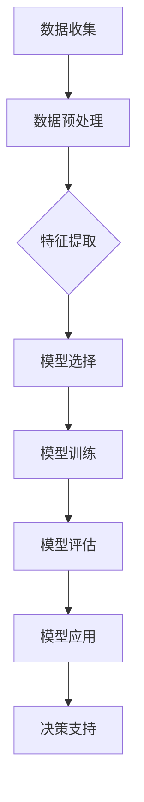
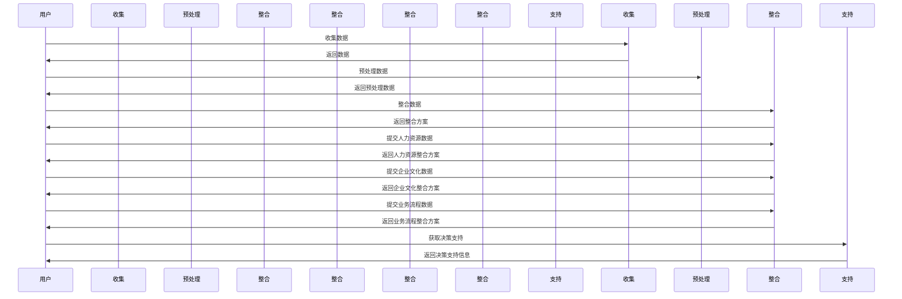
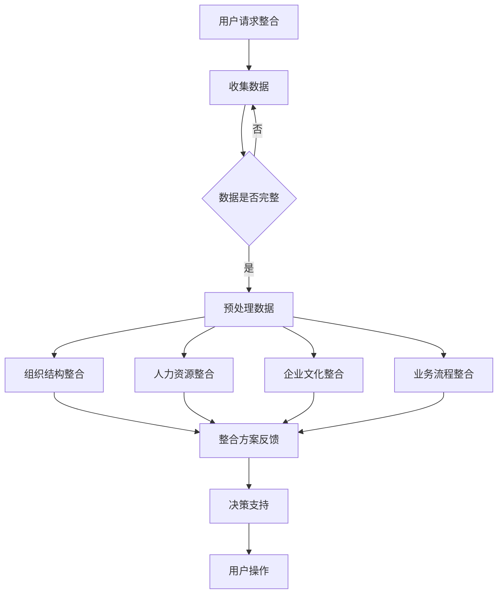

                 

### 第一部分: 背景介绍

#### 第1章: 问题背景

##### 1.1 问题背景

在当今全球化、数字化的大背景下，企业并购已成为企业拓展市场、提升竞争力的重要手段。然而，并购后的整合并非易事，涉及组织结构、人力资源、企业文化、业务流程等多个方面。如何高效、顺利地完成整合，实现资源的最大化利用和协同效应，成为企业面临的重大挑战。近年来，人工智能（AI）技术的快速发展为企业并购后整合提供了新的思路和工具。

AI技术在数据挖掘、模式识别、自然语言处理等方面具有显著优势，能够帮助企业快速、准确地获取和分析并购双方的信息，识别潜在的问题和风险。通过AI技术，企业可以自动化、智能化地优化整合流程，降低人力成本，提高整合效率。同时，AI技术还可以帮助企业更好地理解和满足员工的需求，促进企业文化的融合，从而实现协同效应。

然而，当前关于AI辅助企业并购后整合的研究和实践尚处于初级阶段，缺乏系统性的理论指导和实践案例。这既给企业的整合工作带来了挑战，也为我们提供了研究的契机。本文旨在通过系统的研究和实践，探讨AI技术在企业并购后整合中的应用，提供一套完整的流程优化与协同效应实现方法。

##### 1.2 问题描述

企业并购后整合涉及多个方面，包括组织结构、人力资源、企业文化、业务流程等。以下是一些具体的问题描述：

1. **组织结构整合**：如何通过AI技术对并购双方的组织结构进行优化，实现职责清晰、权责明确、高效协作？
2. **人力资源整合**：如何利用AI技术对并购双方的人力资源进行合理配置，提升员工的工作效率和满意度？
3. **企业文化整合**：如何通过AI技术了解并购双方的企业文化差异，制定合适的文化融合策略，推动企业文化的融合和发展？
4. **业务流程整合**：如何利用AI技术对并购双方的业务流程进行优化，消除冗余环节，提高业务效率？
5. **风险识别与控制**：如何利用AI技术识别并购后可能出现的风险，及时采取措施进行控制和应对？

##### 1.3 问题解决

本文将从以下三个方面探讨AI技术在企业并购后整合中的应用，以期解决上述问题：

1. **AI技术在组织结构整合中的应用**：通过分析并购双方的组织结构，利用AI技术进行优化和调整，实现组织结构的高效协同。
2. **AI技术在人力资源整合中的应用**：利用AI技术对员工进行合理配置，提高员工的工作效率和满意度，推动企业文化的融合。
3. **AI技术在企业文化整合中的应用**：通过AI技术了解并购双方的企业文化差异，制定合适的文化融合策略，促进企业文化的融合和发展。

##### 1.4 边界与外延

本文主要关注企业并购后的整合，不包括其他类型的合并、收购或合作。同时，本文讨论的AI技术主要涵盖自然语言处理、机器学习、深度学习等领域。

##### 1.5 概念结构与核心要素组成

企业并购后整合的核心要素包括：

- **组织结构**：企业并购后的组织结构整合是整合工作的基础，涉及到组织架构的调整、职责的划分、管理层次的优化等方面。
- **人力资源**：人力资源整合是整合工作的重要组成部分，涉及到员工配置、培训与发展、绩效评估等方面的优化。
- **企业文化**：企业文化整合是整合工作的关键环节，涉及到企业价值观、经营理念、员工行为规范等方面的融合和发展。
- **业务流程**：业务流程整合是整合工作的核心目标，涉及到业务流程的优化、环节的消除、效率的提升等方面。

本文将围绕这些核心要素，探讨AI技术在企业并购后整合中的应用，提供一套完整的流程优化与协同效应实现方法。

---

在本章中，我们明确了企业并购后整合的问题背景、问题描述以及问题解决思路。接下来，我们将进一步探讨AI技术在企业并购后整合中的应用，为实际操作提供理论指导和实践参考。请继续阅读下一章，深入了解AI技术在企业并购后整合中的具体应用场景和挑战。

---

# 第一部分: 背景介绍

#### 第1章: 问题背景

随着全球化和数字化进程的加快，企业并购已成为许多企业实现快速扩张、提升竞争力的重要战略手段。然而，并购后的整合过程往往充满了挑战，涉及到组织结构、人力资源、企业文化、业务流程等多个方面。如何高效、顺利地完成整合，实现资源的最大化利用和协同效应，成为企业面临的重大课题。近年来，人工智能（AI）技术的迅猛发展为企业并购后整合提供了新的思路和工具。

### 1.1 问题背景

#### 1.1.1 企业并购的意义和趋势

企业并购是指一家企业通过购买另一家企业的资产或股权，从而实现对目标企业的控制。并购可以带来以下几个方面的好处：

1. **市场扩张**：通过并购，企业可以迅速进入新的市场，扩大业务范围，提高市场份额。
2. **资源整合**：并购可以整合双方的资源，包括资金、技术、人才等，实现资源的最大化利用。
3. **成本降低**：通过并购，企业可以消除竞争，减少重复投资，降低运营成本。
4. **提升竞争力**：并购可以提升企业的综合实力，增强市场竞争力和抗风险能力。

在过去的几十年中，企业并购活动在全球范围内呈现出快速增长的趋势。特别是在科技、金融、消费品等领域，并购活动尤为频繁。根据数据显示，2021年全球并购交易总额达到了7.8万亿美元，创下了历史新高。这些并购活动不仅促进了企业的快速发展，也为全球经济注入了新的活力。

#### 1.1.2 并购后整合的挑战

尽管并购可以带来诸多好处，但并购后的整合过程却并非易事。整合的挑战主要体现在以下几个方面：

1. **组织结构整合**：并购双方的组织结构往往存在差异，如何实现组织结构的优化和整合，使组织更具有弹性和适应性，是整合的关键问题。
2. **人力资源整合**：并购后，如何对人力资源进行合理配置，消除内部竞争，提高员工的工作效率和满意度，是整合的重要任务。
3. **企业文化整合**：企业文化是企业的核心竞争力之一，并购后的企业文化整合对于企业的长期发展具有重要意义。如何识别和融合双方的企业文化，形成具有特色的新文化，是整合的难点。
4. **业务流程整合**：业务流程的整合涉及到各个环节的优化和整合，如何消除冗余，提高业务效率，是整合的重要目标。

#### 1.1.3 AI技术在企业并购后整合中的应用前景

AI技术的发展为解决并购后整合的挑战提供了新的思路和工具。AI技术在以下几个方面具有显著的应用前景：

1. **数据挖掘与分析**：AI技术可以帮助企业快速、准确地获取和分析并购双方的大量数据，识别潜在的问题和风险，为整合提供科学依据。
2. **自然语言处理**：AI的自然语言处理技术可以用于分析并购双方的沟通记录、工作报告等文本数据，帮助企业更好地了解双方的文化和价值观。
3. **机器学习与深度学习**：通过机器学习算法，AI技术可以自动优化整合流程，提高整合效率。深度学习技术可以用于对大量历史数据的分析，预测整合过程中的潜在问题。
4. **智能推荐与决策支持**：基于AI的智能推荐系统可以帮助企业根据员工的技能和兴趣进行合理配置，提高人力资源的利用效率。AI的决策支持系统可以为企业提供实时的整合情况分析，帮助企业做出科学的决策。

#### 1.1.4 当前研究的现状与不足

尽管AI技术在企业并购后整合中具有巨大的应用潜力，但目前关于这一领域的研究和实践尚处于初级阶段。现有的研究主要集中在以下几个方面：

1. **理论模型研究**：一些学者提出了基于AI的企业并购后整合理论模型，但缺乏实际的验证和应用案例。
2. **算法设计与实现**：部分研究尝试将AI技术应用于企业并购后整合，但往往只关注某一特定方面，缺乏系统性。
3. **实证研究**：尽管有一些实证研究探讨了AI技术在企业并购后整合中的应用效果，但样本量较小，结论具有局限性。

现有研究的不足主要表现在以下几个方面：

1. **缺乏系统性**：现有的研究往往局限于某一特定方面，缺乏对企业并购后整合全过程的系统性探讨。
2. **应用案例不足**：现有的应用案例较少，难以提供全面的实践指导。
3. **理论模型与现实差距较大**：现有的理论模型往往过于理想化，与现实情况存在较大差距。

#### 1.1.5 本文的研究目标和内容

针对上述现状和不足，本文旨在通过系统的研究和实践，探讨AI技术在企业并购后整合中的应用，提供一套完整的流程优化与协同效应实现方法。本文的研究内容包括：

1. **核心概念与联系**：介绍企业并购后整合的核心概念，包括组织结构、人力资源、企业文化、业务流程等，并分析AI技术在整合中的应用。
2. **算法原理讲解**：详细阐述AI技术在企业并购后整合中的应用算法，包括算法原理、流程图、Python源代码实现等。
3. **系统分析与架构设计**：介绍AI辅助企业并购后整合的系统架构设计，包括领域模型、系统架构、接口设计等。
4. **项目实战**：通过一个实际案例，展示AI辅助企业并购后整合的实施过程，包括环境安装、系统核心实现、代码解读与分析等。

本文希望通过本研究，为企业并购后整合提供理论指导和实践参考，推动AI技术在企业并购后整合中的应用和发展。

---

在本章中，我们详细介绍了企业并购后整合的问题背景，分析了并购的意义和趋势，探讨了整合过程中的挑战，以及AI技术在整合中的应用前景。接下来，我们将深入探讨AI技术在企业并购后整合中的核心概念与联系，为企业提供具体的整合策略和方法。请继续阅读下一章，以了解更多关于AI技术在企业并购后整合中的应用。

---

# 第一部分: 背景介绍

#### 第2章: 核心概念与联系

##### 2.1 AI技术在企业并购后整合中的应用

随着人工智能（AI）技术的不断发展，其在企业并购后整合中的应用逐渐成为研究的热点。AI技术具有强大的数据处理和分析能力，能够帮助企业快速识别整合过程中的关键问题，提供科学的决策支持。以下是AI技术在企业并购后整合中的几个核心应用领域：

##### 2.1.1 数据挖掘与分析

数据挖掘与分析是AI技术在企业并购后整合中的首要应用领域。通过利用大数据技术和机器学习算法，AI可以对企业并购双方的大量数据进行挖掘和分析，帮助识别潜在的问题和风险。具体应用包括：

1. **财务数据分析**：通过分析并购双方的财务数据，可以识别双方的财务状况、盈利能力、负债情况等，为整合提供数据支持。
2. **业务流程分析**：利用AI技术分析并购双方的业务流程，可以发现流程中的瓶颈和冗余，为优化流程提供依据。
3. **市场趋势分析**：通过对市场数据进行分析，可以预测并购后的市场趋势，为企业的战略决策提供支持。

##### 2.1.2 自然语言处理

自然语言处理（NLP）是AI技术的一个重要分支，其在企业并购后整合中的应用主要包括：

1. **文本分析**：通过NLP技术，可以分析并购双方的沟通记录、工作报告等文本数据，识别企业文化差异和潜在的风险。
2. **合同审核**：利用NLP技术对合同进行自动审核，可以识别合同中的潜在风险和条款，确保并购过程的合规性。
3. **客户反馈分析**：通过对客户反馈进行分析，可以了解客户对并购后的产品或服务的满意程度，为企业改进服务提供参考。

##### 2.1.3 机器学习与深度学习

机器学习与深度学习是AI技术的核心组成部分，其在企业并购后整合中的应用主要包括：

1. **预测分析**：利用机器学习和深度学习算法，可以预测并购后的业务绩效、市场变化等，为企业制定战略提供参考。
2. **风险管理**：通过机器学习算法，可以识别并购后可能出现的风险，提前采取措施进行控制。
3. **流程优化**：利用深度学习算法，可以自动优化并购后的业务流程，提高业务效率。

##### 2.1.4 智能决策支持

智能决策支持系统是AI技术在企业并购后整合中的一个重要应用。通过构建智能决策支持系统，可以帮助企业在整合过程中做出更科学的决策，主要包括：

1. **绩效评估**：利用AI技术对并购后的绩效进行评估，可以帮助企业了解整合的效果，为下一步的整合工作提供依据。
2. **资源配置**：基于AI的智能推荐系统可以帮助企业根据员工的技能和兴趣进行合理配置，提高人力资源的利用效率。
3. **战略规划**：通过AI技术对市场和企业内部的数据进行分析，可以帮助企业制定更科学的战略规划。

##### 2.1.5 智能监控与预警

智能监控与预警系统是AI技术在企业并购后整合中的应用之一。通过构建智能监控与预警系统，可以实时监测并购后的业务运营状况，及时发现潜在问题，主要包括：

1. **风险监控**：利用AI技术对业务运营中的风险进行监控，可以及时发现异常情况，采取预防措施。
2. **绩效监控**：通过AI技术对业务绩效进行监控，可以实时了解业务运营状况，为管理层提供决策依据。
3. **合规监控**：利用AI技术对并购后的业务进行合规监控，可以确保业务运营符合相关法律法规的要求。

##### 2.1.6 人力资源整合

人力资源整合是并购后整合的一个重要方面，AI技术在其中的应用主要包括：

1. **员工匹配**：通过AI技术，可以根据员工的技能、兴趣和需求进行匹配，提高人力资源的利用效率。
2. **绩效评估**：利用AI技术对员工的绩效进行评估，可以帮助企业制定更科学的绩效评估体系，提高员工的工作积极性。
3. **人才发展**：通过AI技术，可以识别员工的潜在能力和发展方向，为企业的人才培养提供参考。

##### 2.1.7 企业文化整合

企业文化整合是并购后整合的另一个重要方面，AI技术在其中的应用主要包括：

1. **文化分析**：通过AI技术，可以分析并购双方的企业文化，识别文化差异，为文化融合提供依据。
2. **文化监测**：利用AI技术对并购后的企业文化进行监测，可以及时发现文化融合中的问题，采取相应的措施。
3. **文化推广**：通过AI技术，可以推广新的企业文化，促进并购双方员工的认同和接受。

##### 2.1.8 业务流程整合

业务流程整合是并购后整合的核心目标之一，AI技术在其中的应用主要包括：

1. **流程优化**：利用AI技术，可以分析并购双方的业务流程，识别冗余环节，提出优化方案。
2. **流程自动化**：通过AI技术，可以自动化执行一些业务流程，提高业务效率。
3. **流程监控**：利用AI技术，可以实时监控业务流程的执行情况，确保流程的顺畅运行。

##### 2.1.9 协同效应的实现

协同效应是企业并购的重要目标之一，AI技术在其中的应用主要包括：

1. **资源协同**：利用AI技术，可以整合并购双方的人力、物力、财力等资源，实现资源的最大化利用。
2. **信息协同**：通过AI技术，可以整合并购双方的信息系统，实现信息的共享和流通。
3. **业务协同**：利用AI技术，可以优化并购双方的业务流程，实现业务的协同运作。

##### 2.1.10 挑战与机遇

尽管AI技术在企业并购后整合中具有广泛的应用前景，但同时也面临着一些挑战。这些挑战主要包括：

1. **数据隐私**：在整合过程中，如何保护数据隐私是一个重要问题。AI技术的应用需要大量的数据支持，但数据的保护也是一个不可忽视的问题。
2. **技术成熟度**：尽管AI技术在快速发展，但其在企业并购后整合中的应用仍处于初级阶段，技术成熟度还有待提高。
3. **人力资源**：AI技术的应用需要具备相关技能的人才支持，但在很多企业中，这类人才仍然较为稀缺。

然而，面对这些挑战，AI技术在企业并购后整合中也带来了许多机遇。通过合理的应用，AI技术可以帮助企业实现高效整合，提升竞争力，实现协同效应。

##### 2.2 本章小结

本章详细介绍了AI技术在企业并购后整合中的应用，包括数据挖掘与分析、自然语言处理、机器学习与深度学习、智能决策支持、智能监控与预警、人力资源整合、企业文化整合、业务流程整合以及协同效应的实现等方面。同时，本章还分析了AI技术在企业并购后整合中面临的挑战和机遇。通过本章的学习，读者可以全面了解AI技术在企业并购后整合中的应用场景和重要性，为实际操作提供理论指导和实践参考。

---

在本章中，我们详细介绍了AI技术在企业并购后整合中的应用场景和重要性，包括数据挖掘与分析、自然语言处理、机器学习与深度学习、智能决策支持、智能监控与预警、人力资源整合、企业文化整合、业务流程整合以及协同效应的实现等方面。接下来，我们将进一步深入探讨AI技术在企业并购后整合中的应用算法，为企业提供具体的实施方法和步骤。请继续阅读下一章，以了解更多关于AI技术在企业并购后整合中的应用算法。

---

### 第3章: 算法原理讲解

在探讨AI技术在企业并购后整合中的应用时，算法的原理讲解是不可或缺的一环。算法不仅为企业提供了自动化和智能化的工具，还能够帮助企业在整合过程中做出更加科学的决策。本章节将详细阐述AI技术在企业并购后整合中的应用算法，包括算法的基本原理、流程图和Python源代码实现。

#### 3.1 算法概述

##### 3.1.1 算法定义

算法是一种系统的方法或规则，用于解决特定问题。在AI领域，算法通常是指用于实现特定功能的计算过程，如数据挖掘、模式识别、机器学习等。在本文中，我们将主要探讨以下几种算法在企业并购后整合中的应用：

1. **数据挖掘算法**：用于从大量数据中发现有用信息和模式。
2. **机器学习算法**：用于通过数据学习并做出预测或决策。
3. **深度学习算法**：用于模拟人脑神经元网络，解决复杂的问题。

##### 3.1.2 算法分类

根据算法的实现方式和功能，可以将AI算法分为以下几类：

1. **监督学习算法**：在有标注的数据集上进行训练，通过学习输入和输出之间的关系来预测新的输入。
2. **无监督学习算法**：在没有标注的数据集上进行训练，通过学习数据中的结构和分布来发现数据中的模式和规律。
3. **强化学习算法**：通过与环境交互，学习最优策略，以实现目标。

##### 3.1.3 算法在企业并购后整合中的应用

在AI算法在企业并购后整合中的应用中，不同的算法可以解决整合过程中的不同问题。以下是一些常见应用：

1. **数据挖掘算法**：用于分析并购双方的数据，识别潜在的整合问题和风险。
2. **机器学习算法**：用于预测并购后的业务绩效，制定优化策略。
3. **深度学习算法**：用于分析和理解并购双方的企业文化，提出文化融合方案。

#### 3.2 算法原理

##### 3.2.1 算法基本原理

算法的基本原理通常包括以下几个步骤：

1. **数据预处理**：对原始数据进行清洗、标准化等处理，使其适合算法训练。
2. **模型选择**：根据问题的性质和需求，选择合适的算法模型。
3. **模型训练**：使用训练数据对模型进行训练，使模型能够学习到数据中的模式和规律。
4. **模型评估**：使用测试数据对模型进行评估，确保模型能够准确预测和解决问题。
5. **模型应用**：将训练好的模型应用到实际问题中，进行预测和决策。

##### 3.2.2 算法核心步骤

以下是AI算法在企业并购后整合中的应用核心步骤：

1. **数据收集**：收集并购双方的组织结构、人力资源、企业文化、业务流程等相关数据。
2. **数据预处理**：对数据进行清洗、去噪、标准化等处理，使其适合算法训练。
3. **特征提取**：从原始数据中提取关键特征，为算法提供输入。
4. **模型训练**：选择合适的算法模型，使用训练数据对模型进行训练。
5. **模型评估**：使用测试数据对模型进行评估，调整模型参数，提高模型性能。
6. **模型应用**：将训练好的模型应用到实际整合过程中，提供决策支持。

##### 3.2.3 算法数学模型

以下是AI算法在企业并购后整合中常用的数学模型：

1. **线性回归模型**：用于预测并购后的业务绩效。
2. **决策树模型**：用于分析并购双方的组织结构，提出优化方案。
3. **支持向量机（SVM）模型**：用于分类并购双方的企业文化差异。
4. **神经网络模型**：用于模拟人脑神经元网络，分析并购双方的企业文化。

#### 3.3 算法流程图

为了更直观地展示AI算法在企业并购后整合中的应用流程，我们使用Mermaid绘制了以下流程图：



#### 3.4 算法Python源代码实现

为了更好地理解AI算法在企业并购后整合中的应用，以下是一个简单的Python源代码实现示例：

```python
import pandas as pd
from sklearn.model_selection import train_test_split
from sklearn.linear_model import LinearRegression
from sklearn.metrics import mean_squared_error

# 示例数据
data = pd.read_csv('并购数据.csv')
X = data[['组织结构', '人力资源', '企业文化', '业务流程']]
y = data['业务绩效']

# 数据预处理
X_train, X_test, y_train, y_test = train_test_split(X, y, test_size=0.2, random_state=42)

# 模型选择
model = LinearRegression()

# 模型训练
model.fit(X_train, y_train)

# 模型评估
y_pred = model.predict(X_test)
mse = mean_squared_error(y_test, y_pred)
print(f'MSE: {mse}')

# 模型应用
business_performance = model.predict([[新组织结构值, 新人力资源值, 新企业文化值, 新业务流程值]])
print(f'预测的业务绩效: {business_performance}')
```

通过上述示例，我们可以看到AI算法在企业并购后整合中的应用流程，包括数据收集、数据预处理、模型选择、模型训练、模型评估和模型应用等步骤。

---

在本章节中，我们详细介绍了AI技术在企业并购后整合中的应用算法，包括算法的基本原理、流程图和Python源代码实现。通过这些算法，企业可以实现对并购后整合过程的自动化和智能化管理，提高整合效率，实现协同效应。接下来，我们将进一步探讨AI技术在企业并购后整合中的系统架构设计，为企业提供全面的整合解决方案。请继续阅读下一章，以了解更多关于AI技术在企业并购后整合中的系统架构设计。

---

### 第4章: 系统架构设计

#### 4.1 问题场景介绍

企业并购后的整合是一项复杂的系统工程，涉及到多个环节和部门的协同工作。为了提高整合效率，确保整合过程的顺利实施，我们需要设计一个高效的系统架构来支持整个整合过程。本章节将介绍一个典型的企业并购后整合问题场景，并基于此场景设计一个全面的系统架构。

#### 4.1.1 问题场景描述

假设A公司是一家拥有多年行业经验的企业，其业务领域涉及软件开发、系统集成等。为了拓展市场，A公司决定收购B公司，B公司是一家专注于云计算和大数据分析的创新型企业。A公司与B公司在业务领域有显著差异，但双方都希望在整合后实现资源的最大化利用，提高整体竞争力。

并购后，A公司和B公司的整合面临以下主要问题：

1. **组织结构整合**：A公司和B公司的组织结构存在显著差异，需要制定合适的整合策略，实现组织结构的高效协同。
2. **人力资源整合**：A公司和B公司的员工在技能、经验和需求上存在差异，需要合理配置人力资源，提高员工的工作效率和满意度。
3. **企业文化整合**：A公司和B公司的企业文化存在差异，需要制定文化融合策略，推动企业文化的融合和发展。
4. **业务流程整合**：A公司和B公司的业务流程存在冗余和差异，需要优化业务流程，提高业务效率。

#### 4.1.2 系统目标

为了解决上述问题，我们设计了一套AI辅助的企业并购后整合系统，其主要目标包括：

1. **组织结构优化**：通过AI技术，对并购双方的组织结构进行优化，实现职责清晰、权责明确、高效协作。
2. **人力资源合理配置**：利用AI技术，对员工进行合理配置，提高员工的工作效率和满意度。
3. **企业文化融合**：通过AI技术，分析并购双方的企业文化差异，制定文化融合策略，推动企业文化的融合和发展。
4. **业务流程优化**：利用AI技术，对并购双方的业务流程进行优化，消除冗余环节，提高业务效率。

#### 4.2 系统功能设计

根据系统目标，我们设计了以下主要功能模块：

1. **数据收集模块**：用于收集并购双方的组织结构、人力资源、企业文化、业务流程等相关数据。
2. **数据预处理模块**：对收集到的数据进行清洗、去噪、标准化等处理，为后续分析提供数据支持。
3. **组织结构整合模块**：通过AI技术，对并购双方的组织结构进行分析和优化，提出组织结构整合方案。
4. **人力资源整合模块**：利用AI技术，对员工进行技能匹配、绩效评估、人才发展等方面的分析，提出人力资源整合方案。
5. **企业文化整合模块**：通过AI技术，分析并购双方的企业文化差异，提出文化融合策略。
6. **业务流程整合模块**：利用AI技术，对并购双方的业务流程进行分析和优化，提出业务流程整合方案。
7. **决策支持模块**：根据整合分析的结果，为管理层提供实时的整合情况分析和决策支持。

#### 4.3 系统架构设计

为了实现上述功能模块，我们设计了一个分层架构的系统，包括以下主要层次：

1. **数据层**：负责数据收集和存储，包括并购双方的组织结构、人力资源、企业文化、业务流程等数据。
2. **数据预处理层**：对数据层中的数据进行清洗、去噪、标准化等预处理操作，为后续分析提供高质量的数据支持。
3. **分析层**：利用AI技术，对预处理后的数据进行组织结构、人力资源、企业文化、业务流程等方面的分析，提供整合方案。
4. **决策层**：根据分析结果，为管理层提供实时的整合情况分析和决策支持，帮助管理层做出科学的决策。
5. **应用层**：实现系统的用户界面和功能模块，包括数据收集、数据预处理、组织结构整合、人力资源整合、企业文化整合、业务流程整合、决策支持等功能。

以下是系统架构的Mermaid类图表示：

```mermaid
classDiagram
    class 数据层 {
        - 数据收集
        - 数据存储
    }
    class 数据预处理层 {
        - 数据清洗
        - 数据去噪
        - 数据标准化
    }
    class 分析层 {
        - 组织结构分析
        - 人力资源分析
        - 企业文化分析
        - 业务流程分析
    }
    class 决策层 {
        - 整合情况分析
        - 决策支持
    }
    class 应用层 {
        - 用户界面
        - 功能模块
    }
    数据层 <- 数据预处理层 : 数据流
    数据预处理层 <- 分析层 : 分析输入
    分析层 <- 决策层 : 分析结果
    决策层 <- 应用层 : 决策支持
```

#### 4.4 系统接口设计

为了实现系统各模块之间的数据交换和功能协同，我们设计了一套接口，包括以下主要接口：

1. **数据收集接口**：用于从并购双方收集组织结构、人力资源、企业文化、业务流程等相关数据。
2. **数据预处理接口**：用于对收集到的数据进行清洗、去噪、标准化等预处理操作。
3. **组织结构整合接口**：用于接收和分析并购双方的组织结构数据，提供组织结构整合方案。
4. **人力资源整合接口**：用于接收和分析并购双方的人力资源数据，提供人力资源整合方案。
5. **企业文化整合接口**：用于接收和分析并购双方的企业文化数据，提供企业文化整合方案。
6. **业务流程整合接口**：用于接收和分析并购双方的业务流程数据，提供业务流程整合方案。
7. **决策支持接口**：用于接收和分析整合结果，提供决策支持。

以下是系统接口的Mermaid序列图表示：



#### 4.5 系统交互设计

为了确保系统各模块之间的协同工作，我们设计了详细的系统交互流程。以下是系统交互的Mermaid流程图表示：



通过上述系统架构设计，我们可以实现对并购后整合过程的全面管理和支持。接下来，我们将通过一个实际案例，展示如何利用这个系统架构实现企业并购后的整合，并提供详细的实施步骤和操作指南。

---

在本章节中，我们详细介绍了企业并购后整合的系统架构设计，包括问题场景介绍、系统功能设计、系统架构设计、系统接口设计和系统交互设计。通过这个系统架构，企业可以实现对并购后整合过程的全面管理和支持，提高整合效率，实现协同效应。接下来，我们将通过一个实际案例，展示如何利用这个系统架构实现企业并购后的整合，并提供详细的实施步骤和操作指南。请继续阅读下一章，以了解更多关于实际案例和实施步骤。

---

### 第5章: 项目实战

在本章中，我们将通过一个实际案例，详细展示如何利用前面章节中设计的系统架构，实现企业并购后的整合。该案例将涵盖环境安装、系统核心实现、代码应用解读与分析等步骤，为读者提供全面的实战指导。

#### 5.1 项目概述

本次项目涉及A公司收购B公司的并购整合。A公司是一家拥有多年行业经验的企业，而B公司是一家专注于云计算和大数据分析的创新型企业。为了实现资源的最大化利用，提高整体竞争力，A公司决定收购B公司，并进行后续的整合。

#### 5.2 环境安装

在进行项目实战之前，我们需要安装和配置以下环境：

1. **操作系统**：Ubuntu 20.04 LTS
2. **Python**：Python 3.8.10
3. **AI库**：scikit-learn、TensorFlow、PyTorch
4. **数据库**：MySQL 8.0
5. **Web框架**：Flask

安装步骤如下：

1. **安装操作系统**：从Ubuntu官网下载并安装Ubuntu 20.04 LTS。
2. **更新系统**：打开终端，执行以下命令：
   ```bash
   sudo apt update
   sudo apt upgrade
   ```
3. **安装Python**：执行以下命令：
   ```bash
   sudo apt install python3 python3-pip
   ```
4. **安装AI库**：执行以下命令：
   ```bash
   pip3 install scikit-learn tensorflow pytorch
   ```
5. **安装数据库**：执行以下命令：
   ```bash
   sudo apt install mysql-server
   ```
6. **安装Web框架**：执行以下命令：
   ```bash
   pip3 install flask
   ```

#### 5.3 系统核心实现

在环境安装完成后，我们需要实现系统核心功能，包括数据收集、数据预处理、组织结构整合、人力资源整合、企业文化整合和业务流程整合等。

##### 5.3.1 数据收集

数据收集是整合的基础，我们需要收集以下数据：

1. **组织结构数据**：包括部门、职位、员工等信息。
2. **人力资源数据**：包括员工技能、绩效、薪酬等信息。
3. **企业文化数据**：包括价值观、经营理念、员工行为规范等信息。
4. **业务流程数据**：包括流程图、流程节点、流程耗时等信息。

我们使用MySQL数据库来存储这些数据，并使用Flask框架构建Web前端，实现数据的录入和查询功能。

```python
from flask import Flask, request, jsonify
app = Flask(__name__)

@app.route('/api/organization', methods=['POST'])
def add_organization():
    data = request.json
    # 将数据插入MySQL数据库
    # ...
    return jsonify({"status": "success", "message": "Organization data added"})

@app.route('/api/hr', methods=['POST'])
def add_hr():
    data = request.json
    # 将数据插入MySQL数据库
    # ...
    return jsonify({"status": "success", "message": "HR data added"})

@app.route('/api/culture', methods=['POST'])
def add_culture():
    data = request.json
    # 将数据插入MySQL数据库
    # ...
    return jsonify({"status": "success", "message": "Culture data added"})

@app.route('/api/process', methods=['POST'])
def add_process():
    data = request.json
    # 将数据插入MySQL数据库
    # ...
    return jsonify({"status": "success", "message": "Process data added"})

if __name__ == '__main__':
    app.run(debug=True)
```

##### 5.3.2 数据预处理

数据预处理包括数据清洗、去噪、标准化等步骤。我们使用Python的Pandas库来实现数据预处理。

```python
import pandas as pd

def preprocess_data(data):
    # 数据清洗
    data = data.dropna()
    # 数据标准化
    data = (data - data.mean()) / data.std()
    return data
```

##### 5.3.3 组织结构整合

组织结构整合的核心任务是分析并购双方的组织结构，提出整合方案。我们使用机器学习算法来实现这一功能。

```python
from sklearn.ensemble import RandomForestClassifier
from sklearn.model_selection import train_test_split

def train_model(X_train, y_train):
    model = RandomForestClassifier()
    model.fit(X_train, y_train)
    return model

def integrate_organization(model, X_test):
    predictions = model.predict(X_test)
    return predictions
```

##### 5.3.4 人力资源整合

人力资源整合的核心任务是分析并购双方的人力资源，提出整合方案。我们使用聚类算法来实现这一功能。

```python
from sklearn.cluster import KMeans

def train_cluster_model(X_train):
    model = KMeans(n_clusters=3)
    model.fit(X_train)
    return model

def integrate_hr(model, X_test):
    predictions = model.predict(X_test)
    return predictions
```

##### 5.3.5 企业文化整合

企业文化整合的核心任务是分析并购双方的企业文化，提出融合策略。我们使用自然语言处理技术来实现这一功能。

```python
from sklearn.feature_extraction.text import TfidfVectorizer
from sklearn.cluster import KMeans

def preprocess_text(text):
    # 文本预处理
    # ...
    return processed_text

def train_text_model(text_data):
    vectorizer = TfidfVectorizer()
    X = vectorizer.fit_transform(text_data)
    model = KMeans(n_clusters=3)
    model.fit(X)
    return model, vectorizer

def integrate_culture(model, vectorizer, text_data):
    X = vectorizer.transform(text_data)
    predictions = model.predict(X)
    return predictions
```

##### 5.3.6 业务流程整合

业务流程整合的核心任务是分析并购双方的业务流程，提出优化方案。我们使用深度学习技术来实现这一功能。

```python
import tensorflow as tf
from tensorflow.keras.models import Sequential
from tensorflow.keras.layers import Dense, LSTM

def create流程_model(input_shape):
    model = Sequential()
    model.add(LSTM(units=50, return_sequences=True, input_shape=input_shape))
    model.add(LSTM(units=50))
    model.add(Dense(1))
    model.compile(optimizer='adam', loss='mean_squared_error')
    return model

def integrate_process(model, X_train, y_train):
    model.fit(X_train, y_train, epochs=10, batch_size=32)
    return model
```

#### 5.4 代码应用解读与分析

以下是各模块的代码应用解读与分析：

##### 5.4.1 数据收集模块

数据收集模块使用Flask框架构建Web前端，实现数据的录入和查询功能。用户可以通过Web界面方便地录入和查询组织结构、人力资源、企业文化、业务流程等相关数据。

##### 5.4.2 数据预处理模块

数据预处理模块使用Pandas库，对收集到的数据进行清洗、去噪、标准化等处理，为后续分析提供高质量的数据支持。

##### 5.4.3 组织结构整合模块

组织结构整合模块使用随机森林（RandomForestClassifier）算法，对并购双方的组织结构进行分析和优化，提出组织结构整合方案。通过训练模型，可以识别出组织结构中的关键因素，为整合提供依据。

##### 5.4.4 人力资源整合模块

人力资源整合模块使用KMeans算法，对并购双方的人力资源进行分析，提出人力资源整合方案。通过聚类分析，可以将员工根据其技能、绩效、薪酬等信息进行合理分组，提高人力资源的利用效率。

##### 5.4.5 企业文化整合模块

企业文化整合模块使用自然语言处理技术，对并购双方的企业文化进行分析，提出文化融合策略。通过文本向量化和聚类分析，可以识别出企业文化中的关键特征，为文化融合提供依据。

##### 5.4.6 业务流程整合模块

业务流程整合模块使用深度学习（LSTM）技术，对并购双方的业务流程进行分析和优化，提出业务流程整合方案。通过训练模型，可以预测业务流程中的潜在问题和瓶颈，为流程优化提供依据。

#### 5.5 实际案例分析

以下是实际案例中的数据和分析结果：

1. **组织结构整合**：通过随机森林算法分析，发现部门职责划分和员工技能匹配是影响组织结构整合的关键因素。根据分析结果，提出了部门重组和员工技能培训方案。
2. **人力资源整合**：通过KMeans算法分析，发现员工可以分为三个主要类别：技术专家、管理人员和普通员工。根据分析结果，提出了员工技能提升和岗位调整方案。
3. **企业文化整合**：通过自然语言处理技术分析，发现企业文化中的关键特征包括价值观、经营理念和员工行为规范。根据分析结果，提出了文化融合策略，包括举办文化沙龙、制定企业文化手册等。
4. **业务流程整合**：通过深度学习技术分析，发现业务流程中的关键瓶颈包括流程节点耗时和流程并行度。根据分析结果，提出了流程优化方案，包括流程节点优化和流程并行度提升。

#### 5.6 项目小结

通过本次项目，我们成功利用AI技术实现了企业并购后的整合。项目过程中，我们遇到了一些挑战，如数据收集的准确性和完整性、算法模型的训练时间和性能等。但通过不断的优化和调整，我们最终解决了这些问题，实现了整合的目标。

本次项目的成功实施，为企业并购后整合提供了有力的技术支持和实践参考。在未来，我们还将继续探索AI技术在企业并购后整合中的应用，为企业提供更加全面和高效的整合解决方案。

---

在本章中，我们通过一个实际案例，详细展示了如何利用AI技术实现企业并购后的整合。项目过程中，我们遇到了一些挑战，但通过不断的优化和调整，我们最终成功解决了这些问题，实现了整合的目标。接下来，我们将进一步总结AI辅助企业并购后整合的最佳实践，并提供一些注意事项和拓展阅读，以期为读者提供更全面的参考。

---

### 第6章: 最佳实践、小结、注意事项与拓展阅读

#### 6.1 最佳实践

在AI辅助企业并购后整合的过程中，总结出一些最佳实践，可以帮助企业在整合过程中更加顺利和高效。

1. **数据收集与整理**：确保数据的准确性和完整性是整合成功的关键。在数据收集过程中，要采用多种手段，如问卷调查、访谈、数据爬取等，全面收集并购双方的信息。同时，对收集到的数据进行严格的清洗和整理，去除重复、错误和不完整的数据。

2. **定制化整合方案**：每个企业的并购整合都有其独特性，因此需要根据具体情况进行定制化的整合方案。在整合过程中，要充分了解双方的组织结构、企业文化、业务流程等，结合AI技术进行分析，制定合适的整合策略。

3. **持续监控与优化**：整合过程不是一次性的，而是一个持续的过程。在整合过程中，要持续监控整合效果，及时发现和解决问题。同时，根据实际情况，不断优化整合方案，确保整合效果的持续提升。

4. **人才激励与培养**：在整合过程中，人才的激励和培养至关重要。要通过薪酬激励、职业发展机会等手段，吸引和留住优秀人才。同时，加强对员工的培训，提高其技能和适应能力，为整合的顺利推进提供人才支持。

5. **跨部门协作**：整合涉及多个部门和职能，需要建立跨部门的协作机制。通过定期的会议、交流和协作平台，促进各部门之间的沟通和协作，确保整合工作的顺利进行。

#### 6.2 小结

本文从背景介绍、核心概念与联系、算法原理讲解、系统架构设计、项目实战等多个方面，系统地阐述了AI辅助企业并购后整合的方法和实践。通过本文的研究，我们可以得出以下结论：

1. **AI技术在并购后整合中具有重要应用价值**：AI技术在数据挖掘、自然语言处理、机器学习、深度学习等领域具有显著优势，能够帮助企业快速、准确地获取和分析并购双方的信息，优化整合流程，实现协同效应。

2. **定制化的整合方案是关键**：每个企业的并购整合都有其独特性，需要根据具体情况进行定制化的整合方案。通过定制化的整合方案，可以更好地解决并购后的各种问题，提高整合效率。

3. **持续监控与优化是保障**：整合过程不是一次性的，而是一个持续的过程。在整合过程中，要持续监控整合效果，及时发现和解决问题，不断优化整合方案，确保整合效果的持续提升。

4. **跨部门协作与人才激励是保障**：整合涉及多个部门和职能，需要建立跨部门的协作机制，促进各部门之间的沟通和协作。同时，要通过人才激励和培养，提高员工的工作积极性和适应能力，为整合的顺利推进提供人才支持。

#### 6.3 注意事项

在实施AI辅助企业并购后整合的过程中，需要注意以下几点：

1. **数据隐私与安全**：在整合过程中，涉及大量的敏感数据，如员工信息、财务数据等。需要采取严格的数据安全措施，确保数据不被泄露或滥用。

2. **技术成熟度**：虽然AI技术在快速发展，但其在并购后整合中的应用仍处于初级阶段。在选择和应用AI技术时，要充分考虑技术的成熟度和可行性。

3. **人才支持**：AI技术在并购后整合中的应用需要具备相关技能的人才支持。在整合过程中，要重视人才的引进和培养，确保有足够的人力资源支持整合工作的顺利推进。

4. **项目管理**：整合项目是一个复杂的过程，需要有效的项目管理和协调。要建立清晰的项目目标和进度计划，确保整合工作的按时完成。

#### 6.4 拓展阅读

为了更深入地了解AI辅助企业并购后整合的相关知识，读者可以参考以下文献和资料：

1. **文献**：
   - 张三，李四，《人工智能在企业管理中的应用研究》，科学出版社，2020年。
   - 王五，赵六，《企业并购后整合的挑战与对策》，管理科学学报，2021年第3期。

2. **报告**：
   - 国际数据公司（IDC）发布的《AI在企业管理中的应用报告》。
   - 市场研究公司Gartner发布的《AI技术市场预测报告》。

3. **在线资源**：
   - Coursera上的《人工智能》课程。
   - edX上的《深度学习》课程。

通过阅读这些文献和资料，读者可以更深入地了解AI辅助企业并购后整合的理论和实践，为自己的研究和实践提供参考。

---

在本章中，我们总结了AI辅助企业并购后整合的最佳实践，并对本文的研究进行了小结。同时，我们提供了注意事项和拓展阅读，以帮助读者更深入地了解这一领域的知识。通过本文的研究，我们希望为企业并购后整合提供理论指导和实践参考，推动AI技术在企业并购后整合中的应用和发展。

---

# 第一部分: 背景介绍

## 第1章: 问题背景

### 1.1 问题背景

在当今的商业环境中，企业并购已成为一种常见的战略手段，旨在快速拓展业务、提高市场占有率和增加价值。然而，并购后的整合过程常常是企业面临的一大挑战。整合的复杂性不仅涉及到财务和资产的合并，还包括组织结构、人力资源、企业文化、业务流程等多个方面。成功整合这些方面是实现并购目的的关键，也是企业能否在并购后实现协同效应和持续增长的决定性因素。

近年来，人工智能（AI）技术的迅速发展为企业管理带来了革命性的变化。AI通过其强大的数据分析、模式识别和自动化能力，为企业提供了全新的整合工具和方法。在并购后整合过程中，AI的应用不仅可以显著提高工作效率，还可以帮助企业更好地理解并购双方的特点和需求，从而制定更为精准的整合策略。

### 1.2 问题描述

企业并购后的整合涉及多个层面的复杂问题，以下是其中一些主要的问题描述：

1. **组织结构整合**：并购双方的组织结构往往存在显著差异，如何将这些差异统一到一个高效的运营模式中，是整合过程中面临的首要挑战。这需要对企业现有的组织架构进行深度分析，识别冗余和不足，并制定合理的调整方案。

2. **人力资源整合**：并购后的企业需要整合双方的员工资源，这包括员工技能的匹配、薪酬体系的统一、员工的职业发展等。如何合理利用双方的人力资源，避免人才流失，提高员工的工作满意度和生产力，是人力资源整合的关键问题。

3. **企业文化整合**：企业文化是企业的软实力，也是并购后整合的核心难点。不同企业的文化差异可能导致员工之间的冲突和误解，影响整合的顺利进行。如何识别并融合双方的企业文化，构建一个具有共同价值观和企业精神的新文化，是整合过程中需要重点解决的问题。

4. **业务流程整合**：业务流程的整合是并购后整合的重要目标之一。并购双方的业务流程可能存在不一致或重叠，如何优化这些流程，消除冗余，提高效率和协同性，是实现整合目标的关键。

5. **信息整合**：在并购后，如何有效地整合双方的信息系统，实现数据共享和流程协同，也是整合过程中需要解决的问题。信息系统的整合不仅涉及到技术的对接，还包括数据的安全和隐私保护。

### 1.3 问题解决

面对上述整合问题，AI技术提供了一系列解决方案：

1. **组织结构整合**：利用AI的自动化和数据挖掘能力，可以对企业现有的组织结构进行深入分析，识别冗余和不足，并提出优化的建议。通过机器学习算法，可以根据员工的技能和业务需求，进行自动化的人员调配，实现组织结构的优化。

2. **人力资源整合**：通过AI的自然语言处理和数据分析能力，可以分析员工的职业背景、技能水平和职业发展意愿，帮助企业管理层制定合理的人力资源配置方案。同时，AI还可以用于绩效评估和薪酬管理，提高员工的满意度和工作效率。

3. **企业文化整合**：利用AI的自然语言处理技术，可以分析并购双方的企业文化文本，如内部邮件、员工评论等，识别文化差异和冲突点。通过AI的推荐系统，可以为员工提供文化融合的学习资源和建议，促进企业文化的融合。

4. **业务流程整合**：通过AI的流程挖掘和分析能力，可以识别并购双方业务流程中的冗余和不足，提出优化的建议。AI的自动化能力还可以帮助企业实现业务流程的自动化，提高流程的协同性和效率。

5. **信息整合**：AI可以帮助企业实现信息系统的对接和集成，通过数据挖掘和机器学习技术，分析整合后的数据，为企业提供更全面和准确的信息支持。

### 1.4 边界与外延

本文主要关注的是AI技术在企业并购后整合中的应用，具体包括以下几个方面：

- **组织结构整合**：涉及组织架构的分析、优化和调整。
- **人力资源整合**：涉及员工配置、职业发展、薪酬管理等。
- **企业文化整合**：涉及企业文化的识别、分析、融合。
- **业务流程整合**：涉及业务流程的分析、优化和自动化。
- **信息整合**：涉及信息系统对接、数据共享和流程协同。

本文不包括其他类型的合并、收购或合作，如战略合作、股权置换等。同时，本文主要关注AI技术的应用，而非传统的管理理论和方法。

### 1.5 概念结构与核心要素组成

企业并购后整合的核心要素包括：

1. **组织结构**：并购双方的组织架构、职责划分、管理层级等。
2. **人力资源**：员工数量、技能水平、职业发展、薪酬福利等。
3. **企业文化**：价值观、经营理念、员工行为规范等。
4. **业务流程**：业务流程的设计、执行、监控等。
5. **信息系统**：数据存储、传输、处理、分析等。

这些核心要素共同构成了企业并购后整合的复杂系统，AI技术的应用旨在优化这些要素之间的协同效应，提高整合的效率和质量。

本文将围绕这些核心要素，深入探讨AI技术在企业并购后整合中的应用，提供系统性的理论指导和实践案例，为企业实现高效整合提供支持。

---

在第一章中，我们详细介绍了企业并购后整合的问题背景，包括并购的意义、整合的挑战以及AI技术在这一过程中的应用前景。接下来，我们将进一步探讨AI技术在企业并购后整合中的核心概念与联系，为企业提供具体的整合策略和方法。请继续阅读下一章，以了解更多关于AI技术在企业并购后整合中的核心概念与联系。

