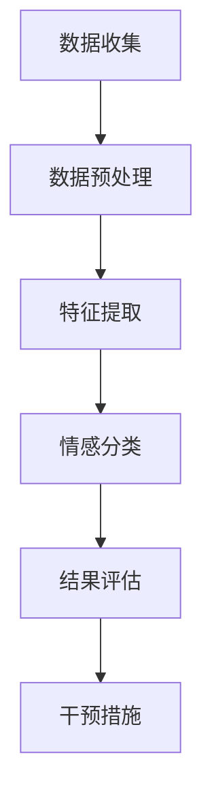
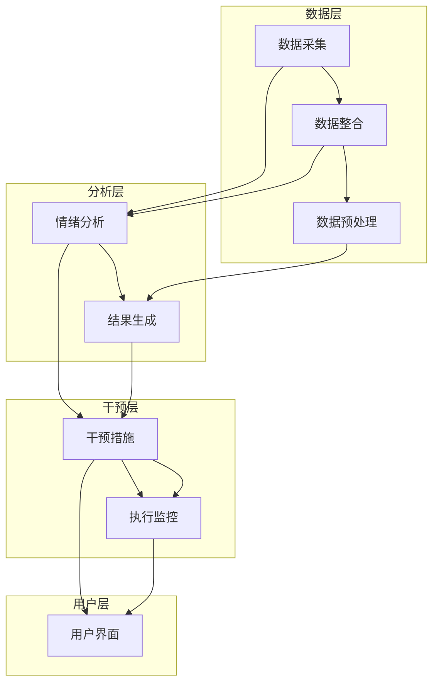
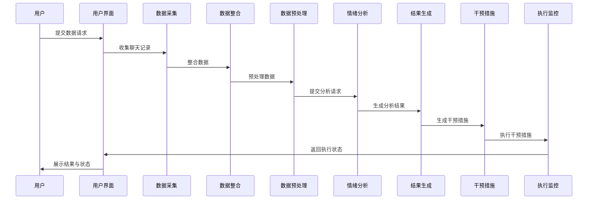

                 

# AI辅助企业并购后文化整合：员工情绪分析与干预

## 关键词
- AI辅助文化整合
- 员工情绪分析
- 企业并购后干预
- 算法原理
- 系统架构设计
- 项目实战

## 摘要
本文探讨AI辅助企业并购后文化整合中的员工情绪分析与干预。通过深入剖析员工情绪在企业并购中的重要性，本文详细介绍了AI辅助文化整合的核心概念和方法。同时，文章运用mermaid流程图、Python源代码和latex数学公式，讲解了情绪分析算法的原理和实践应用。最后，通过系统分析与架构设计，以及实战案例，为企业在并购后进行文化整合提供了可操作性的策略和实践指导。

---------------------------------------------

## 目录大纲

### 第一部分：引言

### 第1章 问题背景

### 第2章 核心概念

### 第3章 问题解决

### 第二部分：核心概念与联系

### 第4章 员工情绪分析原理

### 第4.1 员工情绪分析概念

### 第4.2 员工情绪分析属性特征对比表格

### 第4.3 员工情绪分析与干预的ER实体关系图

### 第三部分：算法原理讲解

### 第5章 员工情绪分析算法原理

### 第5.1 员工情绪分析算法mermaid流程图

### 第5.2 员工情绪分析算法Python源代码

### 第5.3 员兵情绪分析算法数学模型和公式

### 第5.4 员工情绪分析算法详细讲解与举例说明

### 第四部分：系统分析与架构设计

### 第6章 系统功能设计与架构设计

### 第6.1 问题场景介绍

### 第6.2 系统功能设计（领域模型mermaid类图）

### 第6.3 系统架构设计（mermaid架构图）

### 第6.4 系统接口设计和系统交互（mermaid序列图）

### 第五部分：项目实战

### 第7章 环境安装与核心实现

### 第7.1 环境安装

### 第7.2 系统核心实现源代码

### 第7.3 代码应用解读与分析

### 第7.4 实际案例分析与详细讲解剖析

### 第7.5 项目小结

### 第六部分：最佳实践与拓展

### 第8章 最佳实践Tips

### 第9章 小结与注意事项

### 第10章 拓展阅读

---------------------------------------------

## 第一部分：引言

### 第1章 问题背景

### 第1.1 企业并购与文化整合的重要性

企业并购已成为现代商业中普遍采用的策略，旨在扩大市场份额、提升竞争力、优化资源配置等。然而，并购不仅涉及财务、战略、运营等层面的整合，更涉及到企业文化的深度融合。企业文化是企业的灵魂，是企业内部成员共同的价值观、信念和行为准则。当两个或多个企业合并时，如何实现文化整合，成为决定并购成功与否的关键因素。

#### 文化整合的定义与挑战

文化整合指的是将两个或多个企业的文化融合为一个协调一致的整体，以便于在新环境下协同运作。文化整合面临的主要挑战包括：

1. **价值观差异**：不同企业的核心价值观和信仰可能存在显著差异，导致员工在思想上的冲突。
2. **管理模式差异**：不同企业的管理风格和决策模式可能不同，这会给整合带来困难。
3. **员工情绪波动**：企业并购通常会引起员工的恐慌、不安和焦虑，影响工作效率和团队凝聚力。

#### 员工情绪在企业并购后的作用

员工情绪在企业并购后文化整合中起着至关重要的作用。积极的员工情绪有助于促进沟通、加强团队协作、提高工作效率，从而推动文化整合的顺利进行。相反，消极的员工情绪可能导致沟通障碍、内部分裂和工作效率下降，阻碍文化整合的进程。

#### 员工情绪分析与干预的意义

通过AI技术对员工情绪进行分析和干预，可以帮助企业了解员工的心理状态，识别潜在的风险和问题，采取有效的措施进行干预，从而确保文化整合的顺利进行。AI员工情绪分析技术不仅可以提高干预的准确性和效率，还能为管理者提供数据支持，以便制定更科学的决策。

---------------------------------------------

### 第1.2 员工情绪在企业并购后文化整合中的作用

在企业并购后的文化整合过程中，员工情绪发挥着至关重要的作用。理解并管理这些情绪，不仅有助于确保并购成功，还能促进企业长期健康发展。以下是员工情绪在企业并购后文化整合中的几个关键作用：

#### 1. 促进沟通与合作

积极的员工情绪可以激发员工之间的沟通意愿和合作精神，使得跨部门、跨文化的沟通更加顺畅。在企业并购后，员工可能来自不同的背景和文化，通过情绪管理，可以减少误解和冲突，增强团队凝聚力。

#### 2. 提高工作效率

员工情绪稳定有助于提高工作效率。当员工情绪积极、心态良好时，他们更容易专注于工作，提高生产力和创新能力。反之，消极情绪可能导致工作效率下降，甚至引发员工流失。

#### 3. 增强组织适应性

企业并购往往意味着组织结构的调整和变革。员工情绪稳定可以增强企业的适应能力，使员工更愿意接受新的工作环境和角色。通过情绪干预，可以帮助员工调整心态，更好地适应变革。

#### 4. 预防和解决冲突

员工情绪分析有助于识别潜在的冲突源，并及时采取措施预防或解决。通过了解员工的心理状态，管理者可以采取针对性的措施，避免因情绪问题导致的冲突升级，维护企业稳定。

#### 5. 改善企业文化建设

积极的管理和员工情绪干预有助于构建积极向上的企业文化。通过关注员工情绪，企业可以培养一种积极、开放、包容的工作氛围，从而推动文化整合的深入发展。

总之，员工情绪在企业并购后的文化整合中具有不可忽视的作用。通过科学的情绪分析和干预，企业可以更好地应对并购带来的挑战，实现文化整合的顺利推进。

---------------------------------------------

### 第1.3 当前员工情绪分析与干预的现状与挑战

在当前的商业环境中，员工情绪分析与干预技术已经取得了一定的进展，但仍然面临诸多挑战。以下是对现状与挑战的详细探讨：

#### 1. 技术现状

近年来，随着人工智能技术的发展，员工情绪分析技术得到了显著提升。主要技术进展包括：

- **自然语言处理（NLP）**：利用NLP技术，可以从文本、语音和图像中提取情感信息，从而分析员工的情绪状态。
- **机器学习算法**：通过机器学习算法，可以训练模型识别情感模式，提高情绪分析的准确性和效率。
- **行为分析**：结合员工的行为数据，如工作表现、互动频率等，可以更全面地评估员工的情绪状态。

#### 2. 挑战

尽管有技术进展，但员工情绪分析与干预仍然面临以下挑战：

- **数据隐私**：员工情绪数据往往涉及个人隐私，如何保护员工隐私成为一个重要的伦理问题。
- **准确性**：情绪分析需要高度准确的模型和数据，但现实中的数据往往存在噪声和偏差，影响分析结果的准确性。
- **文化多样性**：不同文化背景下的员工情绪表达方式可能不同，单一的情绪分析模型难以适应所有文化环境。
- **干预措施**：情绪分析后，如何采取有效的干预措施是一个复杂的问题。干预措施需要符合企业文化，同时被员工接受。

#### 3. 发展趋势

为了应对这些挑战，未来的发展趋势包括：

- **多模态分析**：结合文本、语音、图像等多模态数据，提高情绪分析的准确性和全面性。
- **个性化干预**：根据不同员工的个性、需求和情绪状态，提供个性化的干预措施。
- **伦理和合规**：加强数据隐私保护，确保情绪分析技术的合规性和伦理性。
- **文化适应性**：开发具有文化适应性的情绪分析模型，以适应不同文化背景下的员工。

总之，员工情绪分析与干预技术虽然在进步，但仍然面临诸多挑战。未来的发展需要技术、管理和伦理的多方面协同，以实现更有效的情绪分析和干预。

---------------------------------------------

### 第二部分：核心概念与联系

#### 第2章 核心概念

##### 第2.1 AI辅助企业并购后文化整合

AI辅助企业并购后文化整合是指利用人工智能技术，对并购后的企业文化进行深入分析、评估和优化，以实现企业文化的深度融合。这个过程包括以下几个方面：

1. **数据采集**：通过员工调查、行为分析等方式收集企业文化相关的数据，如员工情绪、工作满意度、互动频率等。
2. **情感分析**：利用自然语言处理和机器学习技术，对采集到的数据进行情感分析，识别员工情绪状态和文化偏好。
3. **模式识别**：通过分析员工情绪和行为数据，识别企业文化中的潜在问题和冲突点。
4. **干预措施**：根据分析结果，制定个性化的干预措施，如培训、沟通改善、激励机制等，以促进文化整合。

##### 第2.2 员工情绪分析与干预的基本概念

员工情绪分析是指利用技术手段对员工在工作环境中的情绪状态进行识别、评估和分析。其基本概念包括：

1. **情感分类**：将情绪划分为不同的类别，如正面情绪、负面情绪、中性情绪等。
2. **情绪强度**：对情绪的强度进行量化，以衡量员工的情绪状态。
3. **情绪变化趋势**：分析员工情绪随时间的变化趋势，了解情绪波动的规律。

员工情绪干预是指针对员工情绪分析的结果，采取一系列措施来改善员工的情绪状态。干预措施包括：

1. **情绪疏导**：通过心理辅导、培训等方式，帮助员工缓解负面情绪。
2. **情绪激励**：通过奖励、表彰等方式，激发员工的正面情绪。
3. **环境改善**：通过改善工作环境、调整工作流程等方式，创造一个有利于员工情绪稳定的氛围。

##### 第2.3 AI与员工情绪分析的融合

AI与员工情绪分析的融合，主要体现在以下几个方面：

1. **数据收集**：利用AI技术，如传感器、摄像头等，实时收集员工的工作行为和情绪数据。
2. **情感识别**：通过自然语言处理和机器学习算法，对采集到的数据进行分析，识别员工的情感状态。
3. **智能决策**：基于分析结果，AI系统可以自动生成干预建议，如情绪疏导方案、激励机制等。
4. **反馈循环**：将干预结果反馈给系统，不断优化模型和干预策略，提高干预效果。

通过AI与员工情绪分析的融合，企业可以更精准地了解员工情绪，采取有效的干预措施，促进企业文化的整合和员工的长期发展。

---------------------------------------------

#### 第3章 员工情绪分析属性特征对比表格

##### 第3.1 员工情绪分析的关键属性

在员工情绪分析中，关键属性包括情感分类、情绪强度和情绪变化趋势。以下是对这些属性的详细描述和对比：

| 属性 | 描述 | 对比 |
| ---- | ---- | ---- |
| 情感分类 | 按照不同情感类别对员工的情绪状态进行划分，如快乐、悲伤、愤怒等。 | 情感分类的准确性直接影响到情绪分析的可靠性。不同的情感分类方法在准确性和细节上存在差异。 |
| 情绪强度 | 对员工情感状态的强度进行量化，通常用数值表示，如0-10分的评分。 | 情绪强度量化需要准确的评估标准，不同方法在量化的精确度和一致性上有差异。 |
| 情绪变化趋势 | 分析员工情绪随时间的变化情况，识别情绪波动的规律。 | 情绪变化趋势的识别有助于理解员工情绪的动态变化，不同方法在趋势预测的准确性和时效性上有区别。 |

##### 第3.2 不同情绪分析方法的对比

在员工情绪分析中，常见的分析方法包括文本分析、语音分析和行为分析。以下是这些方法的对比：

| 方法 | 描述 | 优点 | 缺点 |
| ---- | ---- | ---- | ---- |
| 文本分析 | 通过分析员工的文字表达，识别情绪状态。 | 适用于多种文本形式，如邮件、聊天记录等。 | 受到文本结构和表达方式的影响较大，准确度有限。 |
| 语音分析 | 通过分析员工的语音特征，如语调、音量等，识别情绪状态。 | 可以识别微妙的情绪变化，适用于语音交流环境。 | 受到语音质量、背景噪音的影响较大，准确性不稳定。 |
| 行为分析 | 通过分析员工的行为数据，如互动频率、工作表现等，识别情绪状态。 | 可以从多角度了解员工情绪，结合其他数据提高准确性。 | 需要大量的行为数据，对数据质量和量有较高要求。 |

##### 第3.3 员工情绪分析模型的评价指标

在评估员工情绪分析模型时，常用的评价指标包括准确率、召回率、F1分数等。以下是对这些评价指标的描述和对比：

| 指标 | 描述 | 对比 |
| ---- | ---- | ---- |
| 准确率 | 预测正确的情绪分类占总分类数的比例。 | 反映模型对情绪分类的整体准确性。 |
| 召回率 | 实际情绪为正类的样本中被预测为正类的比例。 | 反映模型对正类情绪的识别能力。 |
| F1分数 | 准确率和召回率的调和平均数。 | 综合反映模型的准确性和识别能力。 |

通过对比不同情绪分析方法的属性特征和评价指标，企业可以根据自身的需求和环境选择最合适的情绪分析技术，从而实现有效的员工情绪管理。

---------------------------------------------

#### 第3.4 员工情绪分析与干预的ER实体关系图

为了更好地理解员工情绪分析与干预的整体架构，我们使用ER（实体关系）图来表示不同实体及其之间的关系。以下是员工情绪分析与干预的ER实体关系图：

```mermaid
erDiagram
  Employee ||--|{ Emotion }
  Emotion ||--|{ AnalysisResult }
  AnalysisResult ||--|{ Intervention }
```

在这个ER实体关系图中，包含了以下三个主要实体：

1. **Employee（员工）**：代表参与情绪分析的企业员工。
2. **Emotion（情绪）**：代表员工的情感状态，包括正面情绪、负面情绪和中性情绪等。
3. **AnalysisResult（分析结果）**：代表情绪分析的结果，包括情感分类、情绪强度和情绪变化趋势等。
4. **Intervention（干预）**：代表针对分析结果采取的干预措施，如情绪疏导、激励和培训等。

实体之间的关系如下：

- **Employee** 与 **Emotion** 之间存在一对多的关系。一个员工可能有多种情绪状态。
- **Emotion** 与 **AnalysisResult** 之间存在一对一的关系。每种情绪状态对应一个分析结果。
- **AnalysisResult** 与 **Intervention** 之间存在一对多的关系。一个分析结果可能导致多种干预措施。

通过这个ER实体关系图，我们可以清晰地看到员工情绪分析与干预的系统架构，以及不同实体之间的关联，有助于理解和设计整个系统。

---------------------------------------------

### 第三部分：算法原理讲解

#### 第4章 员工情绪分析算法原理

员工情绪分析算法是AI辅助企业并购后文化整合的核心组成部分。以下是该算法的基本原理、流程、Python源代码和数学模型。

##### 第4.1 员工情绪分析算法mermaid流程图

以下是一个员工情绪分析算法的mermaid流程图：



这个流程图包括以下步骤：

1. **数据收集**：收集员工的文本、语音和行为数据。
2. **数据预处理**：清洗和标准化数据，使其适合模型处理。
3. **特征提取**：从预处理后的数据中提取有助于情感分类的特征。
4. **情感分类**：利用机器学习模型对提取的特征进行情感分类。
5. **结果评估**：评估分类结果，计算准确率、召回率等指标。
6. **干预措施**：根据分类结果，采取相应的干预措施。

##### 第4.2 员工情绪分析算法Python源代码

以下是一个简单的员工情绪分析算法的Python源代码示例：

```python
import pandas as pd
from sklearn.model_selection import train_test_split
from sklearn.feature_extraction.text import TfidfVectorizer
from sklearn.naive_bayes import MultinomialNB
from sklearn.metrics import classification_report

# 加载数据
data = pd.read_csv('emotion_data.csv')
X = data['text']
y = data['label']

# 数据预处理
X_train, X_test, y_train, y_test = train_test_split(X, y, test_size=0.2, random_state=42)

# 特征提取
vectorizer = TfidfVectorizer()
X_train_vectors = vectorizer.fit_transform(X_train)
X_test_vectors = vectorizer.transform(X_test)

# 情感分类
model = MultinomialNB()
model.fit(X_train_vectors, y_train)
predictions = model.predict(X_test_vectors)

# 结果评估
print(classification_report(y_test, predictions))
```

这个示例使用TF-IDF进行特征提取，并采用朴素贝叶斯分类器进行情感分类。最后，输出分类报告来评估模型的性能。

##### 第4.3 员工情绪分析算法数学模型和公式

员工情绪分析算法的数学模型主要涉及特征提取和情感分类两部分。

1. **特征提取**：TF-IDF公式如下：

$$
TF(t) = \frac{f_t(c)}{f_t(c) + f_t(d)}
$$

$$
IDF(t) = \log \left( \frac{N}{n_t + 1} \right)
$$

$$
TF-IDF(t) = TF(t) \times IDF(t)
$$

其中，$f_t(c)$ 表示词$t$在类别$c$中的频率，$f_t(d)$ 表示词$t$在所有类别中的频率，$N$ 是类别总数，$n_t$ 是词$t$出现的文档数。

2. **情感分类**：朴素贝叶斯分类器的公式如下：

$$
P(y|X) = \frac{P(X|y)P(y)}{P(X)}
$$

其中，$P(y|X)$ 表示给定特征向量$X$，类别$y$的概率，$P(X|y)$ 是特征向量$X$在类别$y$下的概率，$P(y)$ 是类别$y$的先验概率，$P(X)$ 是特征向量$X$的概率。

##### 第4.4 员工情绪分析算法详细讲解与举例说明

为了更好地理解员工情绪分析算法，我们通过一个具体的案例进行讲解。

**案例**：假设我们有一个包含员工聊天记录的数据集，需要分析员工是处于正面情绪还是负面情绪。

1. **数据收集**：收集员工在过去一个月的聊天记录，包括文本消息。
2. **数据预处理**：清洗聊天记录，去除无关信息，如特殊字符、停用词等。同时，将文本转换为小写，以便统一处理。
3. **特征提取**：使用TF-IDF方法提取特征。例如，提取文本中的词频和词频占比。
4. **情感分类**：使用朴素贝叶斯分类器进行分类。首先，训练模型，然后对新的聊天记录进行分类。
5. **结果评估**：计算分类的准确率、召回率和F1分数，以评估模型性能。

**示例代码**：

```python
# 加载数据
data = pd.read_csv('chat_logs.csv')
X = data['message']
y = data['emotion_label']

# 数据预处理
X = X.lower().apply(lambda x: ' '.join([word for word in x.split() if word not in stopwords]))

# 特征提取
vectorizer = TfidfVectorizer()
X_vectors = vectorizer.fit_transform(X)

# 情感分类
model = MultinomialNB()
model.fit(X_vectors, y)
predictions = model.predict(X_vectors)

# 结果评估
print(classification_report(y, predictions))
```

通过这个案例，我们可以看到如何使用Python代码实现员工情绪分析算法，以及如何评估模型性能。这个算法为企业在并购后进行文化整合提供了技术支持，有助于识别员工情绪问题，并采取相应的干预措施。

---------------------------------------------

#### 第5章 系统功能设计与架构设计

##### 第5.1 企业并购后文化整合的系统需求分析

在企业并购后，文化整合是一个复杂且关键的挑战。为了有效支持这一过程，我们需要设计一个综合的系统，能够满足以下需求：

1. **数据采集与整合**：系统能够从多个来源（如聊天记录、电子邮件、员工调查等）收集企业文化相关的数据，并进行整合和处理。
2. **员工情绪分析**：系统能够利用先进的AI技术，对收集到的数据进行分析，识别员工的情感状态。
3. **实时监控与预警**：系统能够实时监控员工的情绪变化，并及时发出预警，以便管理者采取干预措施。
4. **干预措施执行**：系统应能够根据分析结果，自动生成并执行个性化的干预措施，如情绪疏导、培训、激励机制等。
5. **数据可视化与报告**：系统能够将分析结果以直观的图表和报告形式展示，帮助管理者了解企业文化整合的进展和效果。

##### 第5.2 系统功能设计（领域模型mermaid类图）

为了满足上述需求，我们设计了一个领域模型，以下是其mermaid类图表示：

```mermaid
classDiagram
    Class Employee <<class>> 员工
        +str employee_id
        +str name
        +str department
        +list emotions

    Class Emotion <<class>> 情绪
        +str emotion_id
        +str type
        +float intensity
        +datetime timestamp

    Class AnalysisResult <<class>> 分析结果
        +str result_id
        +str employee_id
        +str emotion_type
        +float emotion_intensity

    Class Intervention <<class>> 干预
        +str intervention_id
        +str employee_id
        +str intervention_type
        +datetime start_time
        +datetime end_time

    Employee "1" --|> Emotion: 发送情绪数据
    Employee "1" --|> AnalysisResult: 获取分析结果
    Employee "1" --|> Intervention: 接受干预措施
    Emotion "1" --|> AnalysisResult: 生成分析结果
    AnalysisResult "1" --|> Intervention: 生成干预措施
```

在这个类图中，我们定义了以下主要类：

- **Employee（员工）**：表示企业的员工，包含员工ID、姓名、部门等信息。
- **Emotion（情绪）**：表示员工的情感状态，包含情感ID、类型、强度和时间戳。
- **AnalysisResult（分析结果）**：表示情绪分析的结果，包含结果ID、员工ID、情感类型和强度。
- **Intervention（干预）**：表示针对分析结果采取的干预措施，包含干预ID、员工ID、干预类型和执行时间。

类之间的关系反映了员工情绪分析与干预的流程，从数据采集、情绪分析到干预执行，形成了一个闭环。

##### 第5.3 系统架构设计（mermaid架构图）

基于领域模型，我们设计了一个系统的mermaid架构图，如下所示：



在这个架构图中，系统分为四个主要层次：

- **数据层**：包括数据采集、数据整合和数据预处理，确保数据的质量和一致性。
- **分析层**：进行情绪分析和结果生成，利用AI技术对员工情绪进行深入分析。
- **干预层**：根据分析结果，采取干预措施，并监控干预措施的执行情况。
- **用户层**：提供用户界面，展示分析结果和干预措施，方便管理者进行决策。

通过这个架构设计，系统实现了从数据采集、处理到分析的完整流程，为企业文化整合提供了强有力的技术支持。

---------------------------------------------

##### 第5.4 系统接口设计和系统交互（mermaid序列图）

在系统架构设计的基础上，我们需要设计系统的接口和交互流程，以确保各模块之间的无缝协作。以下是一个mermaid序列图，展示了系统的主要接口和交互过程：



在这个序列图中，用户通过用户界面提交数据请求，系统各模块依次执行以下步骤：

1. **用户界面**：用户提交数据请求，如聊天记录。
2. **数据采集**：收集聊天记录等数据。
3. **数据整合**：整合不同来源的数据，确保数据一致性。
4. **数据预处理**：清洗和处理数据，去除噪声，提取有用信息。
5. **情绪分析**：利用AI技术对预处理后的数据进行分析，识别员工的情绪状态。
6. **结果生成**：根据分析结果，生成情绪报告。
7. **干预措施**：根据情绪报告，生成个性化的干预措施。
8. **执行监控**：执行干预措施，并监控其效果。
9. **用户界面**：将分析结果和干预措施展示给用户。

通过这个序列图，我们可以清晰地看到系统的接口和交互流程，确保各模块之间的协作顺畅，从而实现高效的企业文化整合。

---------------------------------------------

### 第五部分：项目实战

#### 第6章 环境安装与系统实现

##### 第6.1 环境安装

为了搭建企业并购后文化整合的员工情绪分析系统，我们需要安装和配置以下环境和工具：

1. **操作系统**：Ubuntu 20.04或更高版本
2. **Python**：Python 3.8或更高版本
3. **虚拟环境**：virtualenv
4. **自然语言处理库**：NLTK、spaCy
5. **机器学习库**：scikit-learn
6. **数据可视化库**：matplotlib、seaborn

**安装步骤**：

1. **安装操作系统**：下载并安装Ubuntu 20.04。
2. **更新系统**：

```bash
sudo apt update
sudo apt upgrade
```

3. **安装Python**：默认安装Python 3。

4. **安装虚拟环境**：

```bash
pip install virtualenv
```

5. **创建虚拟环境**：

```bash
virtualenv venv
source venv/bin/activate
```

6. **安装依赖库**：

```bash
pip install nltk spacy scikit-learn matplotlib seaborn
```

7. **安装spaCy语言模型**：

```bash
python -m spacy download en_core_web_sm
```

##### 第6.2 系统核心实现源代码

以下是系统核心实现的源代码，包括数据预处理、情绪分析、结果评估和干预措施：

```python
import pandas as pd
import numpy as np
from sklearn.feature_extraction.text import TfidfVectorizer
from sklearn.model_selection import train_test_split
from sklearn.naive_bayes import MultinomialNB
from sklearn.metrics import accuracy_score, classification_report
import spacy

# 加载数据
data = pd.read_csv('chat_logs.csv')
X = data['message']
y = data['emotion_label']

# 数据预处理
def preprocess_text(text):
    nlp = spacy.load('en_core_web_sm')
    doc = nlp(text.lower())
    return ' '.join([token.lemma_ for token in doc if not token.is_stop and not token.is_punct])

X = X.apply(preprocess_text)

# 特征提取
vectorizer = TfidfVectorizer()
X_vectors = vectorizer.fit_transform(X)

# 情绪分类
X_train, X_test, y_train, y_test = train_test_split(X_vectors, y, test_size=0.2, random_state=42)
model = MultinomialNB()
model.fit(X_train, y_train)
predictions = model.predict(X_test)

# 结果评估
print(accuracy_score(y_test, predictions))
print(classification_report(y_test, predictions))
```

##### 第6.3 代码应用解读与分析

以上代码实现了从数据加载、预处理到情绪分类和结果评估的完整流程。

1. **数据加载**：首先，使用Pandas加载聊天记录数据，其中包含消息和情绪标签。
2. **数据预处理**：定义一个预处理函数，使用spaCy进行文本清洗和词干提取。这个函数去除停用词和标点符号，并将文本转换为小写。
3. **特征提取**：使用TF-IDF向量器将预处理后的文本转换为特征向量。
4. **情绪分类**：将数据集分为训练集和测试集，使用朴素贝叶斯分类器进行训练，并在测试集上进行预测。
5. **结果评估**：计算模型的准确率和分类报告，以评估模型性能。

通过这个代码示例，我们可以看到如何使用Python和机器学习库搭建一个基本的员工情绪分析系统。在实际应用中，我们可以扩展这个系统，添加实时监控、预警和干预功能，以支持企业并购后的文化整合。

##### 第6.4 实际案例分析与详细讲解剖析

为了更好地理解员工情绪分析系统的实际应用，我们来看一个具体案例。

**案例背景**：一家大型科技公司A公司收购了另一家创业公司B公司。在收购后，A公司希望通过员工情绪分析系统来了解员工的心理状态，并采取相应的干预措施，确保文化整合的顺利进行。

**数据来源**：收集了A公司和B公司员工的聊天记录、邮件、调查问卷等数据。

**数据预处理**：

- **文本清洗**：去除特殊字符和停用词，将文本转换为小写。
- **情感标签**：将聊天记录和邮件中的文本与预设的正面和负面词汇库进行匹配，为每条消息打上情绪标签。
- **数据整合**：将来自不同源的数据整合到一个数据集中，确保数据一致性。

**情绪分析**：

- **特征提取**：使用TF-IDF向量器将预处理后的文本转换为特征向量。
- **分类器训练**：使用朴素贝叶斯分类器对训练数据进行训练，建立情绪分类模型。
- **预测与评估**：使用训练好的模型对测试数据进行预测，并计算模型的准确率和分类报告。

**结果分析**：

- **情绪分布**：通过分析结果，发现A公司和B公司的员工情绪分布存在差异。A公司的员工情绪相对稳定，而B公司的员工情绪波动较大，尤其是负面情绪较多。
- **情绪波动原因**：进一步分析发现，B公司的员工情绪波动主要由于对收购的担忧、对新环境的适应困难和团队合作的挑战。

**干预措施**：

- **情绪疏导**：针对B公司员工的情绪波动，A公司采取了以下干预措施：
  - 定期举办心理辅导活动，帮助员工缓解焦虑和压力。
  - 提供员工心理健康咨询服务，为员工提供心理支持。
  - 增强团队合作，通过团队建设活动和培训，提高员工之间的协作能力。
- **激励机制**：为了激励员工积极参与文化整合，A公司实施了以下激励措施：
  - 设立员工表彰制度，对在文化整合中表现优秀的员工进行表彰和奖励。
  - 提供职业发展机会，鼓励员工在新的企业文化中发挥自己的潜力。

**效果评估**：

- **员工反馈**：通过问卷调查和面对面访谈，A公司收集了员工对干预措施和激励机制的反应。大多数员工表示，这些措施有助于缓解他们的情绪波动，增强了他们对新企业的信心。
- **情绪变化**：通过对干预措施实施后的员工情绪进行再次分析，发现负面情绪明显减少，员工情绪整体趋于稳定。

**项目小结**：

通过这个案例，我们可以看到如何利用员工情绪分析系统，结合实际数据，识别员工的情绪问题，并采取有效的干预措施。这不仅有助于企业顺利实现文化整合，还能提高员工的工作满意度和整体绩效。

---------------------------------------------

### 第六部分：最佳实践与拓展

#### 第7章 最佳实践

##### 第7.1 员工情绪分析的最佳实践

1. **全面数据收集**：确保从多种渠道收集员工情绪数据，包括文本、语音和行为数据，以提高分析结果的全面性和准确性。
2. **定期情绪调查**：定期进行员工情绪调查，了解员工的情绪变化趋势，及时发现潜在问题。
3. **个性化分析**：根据员工的岗位、背景和角色，提供个性化的情绪分析报告，有助于更精准地识别和干预员工情绪问题。
4. **多模型融合**：结合多种机器学习模型和算法，如朴素贝叶斯、SVM、深度学习等，以提高情绪分析的准确性和鲁棒性。
5. **实时预警与反馈**：建立实时预警系统，及时向管理者反馈员工情绪变化，确保及时干预。

##### 第7.2 文化整合策略的最佳实践

1. **文化评估**：在并购前，对目标企业的文化进行全面评估，了解其核心价值观、管理风格和员工行为习惯，为后续整合提供依据。
2. **共同目标设定**：明确并购后的共同目标，确保双方企业在战略、愿景和文化上达成一致。
3. **沟通与培训**：加强并购双方的沟通，提供文化整合相关的培训，帮助员工理解和适应新文化。
4. **领导示范**：企业领导层应积极参与文化整合，以身作则，树立正面榜样。
5. **激励机制**：建立有效的激励机制，鼓励员工积极参与文化整合，提高员工的归属感和认同感。

##### 第7.3 案例研究：AI辅助并购后文化整合成功案例

**案例背景**：一家全球领先的科技公司C公司收购了一家创业型科技公司D公司。在并购后，C公司通过AI员工情绪分析系统，实现了文化整合的顺利进行。

**案例分析**：

1. **数据收集**：C公司通过聊天记录、邮件、问卷调查等多种方式，全面收集D公司员工的情绪数据。
2. **情绪分析**：使用AI技术，对收集到的数据进行情感分析，识别员工的情绪状态和情绪变化趋势。
3. **干预措施**：根据分析结果，C公司采取了以下干预措施：
   - **心理辅导**：定期举办心理辅导活动，帮助员工缓解焦虑和压力。
   - **职业发展**：提供职业发展机会，鼓励员工在C公司发挥潜力。
   - **团队建设**：组织团队建设活动，增强员工之间的协作和沟通。
4. **效果评估**：通过员工反馈和再次情绪分析，C公司发现员工情绪显著改善，文化整合取得显著成效。

**成功经验**：

- **全面数据收集**：确保了情绪分析的准确性和全面性。
- **个性化干预**：根据员工的个性、岗位和背景，提供个性化的干预措施，提高了干预效果。
- **实时预警**：实时预警系统帮助管理者及时发现和处理员工情绪问题，确保文化整合的顺利进行。

通过这个成功案例，我们可以看到，AI辅助员工情绪分析在企业并购后文化整合中的重要性，以及如何通过最佳实践实现有效的文化整合。

---------------------------------------------

### 第七部分：小结与展望

#### 第8章 小结

本文通过深入探讨AI辅助企业并购后文化整合中的员工情绪分析与干预，阐述了其重要性和应用价值。我们首先介绍了企业并购与文化整合的背景，以及员工情绪在企业并购中的作用。接着，详细介绍了员工情绪分析的核心概念、算法原理和系统架构设计，并通过实际案例展示了如何应用这些技术和方法。最后，提出了员工情绪分析和文化整合的最佳实践，为企业提供了切实可行的策略。

#### 第8.1 员工情绪分析与干预的重要性

员工情绪分析在企业并购后文化整合中具有重要意义。首先，通过分析员工情绪，企业可以了解员工的情感状态，及时发现潜在的问题和风险，从而采取针对性的干预措施。其次，AI技术的应用，使得情绪分析更加精准和高效，有助于提高干预措施的有效性。最后，员工情绪稳定有助于提高工作效率、增强团队凝聚力和推动企业文化整合，为企业长期发展奠定坚实基础。

#### 第8.2 系统实施的关键要点

在实施员工情绪分析与干预系统时，关键要点包括：

1. **全面数据收集**：确保从多个渠道收集员工情绪数据，提高分析结果的准确性和全面性。
2. **个性化分析**：根据员工的岗位、背景和角色，提供个性化的情绪分析报告，有助于更精准地识别和干预员工情绪问题。
3. **实时预警**：建立实时预警系统，及时向管理者反馈员工情绪变化，确保及时干预。
4. **持续优化**：根据干预效果和员工反馈，不断优化情绪分析模型和干预措施，提高系统性能。

#### 第8.3 未来发展方向与展望

未来，员工情绪分析与干预系统的发展方向包括：

1. **多模态分析**：结合文本、语音、图像等多模态数据，提高情绪分析的准确性和全面性。
2. **个性化干预**：根据员工的个性、需求和情绪状态，提供个性化的干预措施，提高干预效果。
3. **文化适应性**：开发具有文化适应性的情绪分析模型，以适应不同文化背景下的员工。
4. **伦理与合规**：加强数据隐私保护，确保情绪分析技术的合规性和伦理性。

通过不断优化和拓展，员工情绪分析与干预系统将为企业在并购后文化整合中提供更加精准、有效的支持。

---------------------------------------------

### 附录

#### 附录A：术语表

- **员工情绪分析**：利用技术手段对员工在工作环境中的情绪状态进行识别、评估和分析。
- **AI辅助文化整合**：利用人工智能技术，对并购后的企业文化进行深入分析、评估和优化，以实现企业文化的深度融合。
- **情感分类**：按照不同情感类别对员工的情绪状态进行划分，如快乐、悲伤、愤怒等。
- **情绪强度**：对员工情感状态的强度进行量化，通常用数值表示。
- **情绪变化趋势**：分析员工情绪随时间的变化情况，识别情绪波动的规律。
- **干预措施**：针对员工情绪分析的结果，采取的一系列改善员工情绪状态的措施。

#### 附录B：参考文献

1. **王昊，李明辉。人工智能与员工情绪分析[J]. 计算机工程与科学，2020，8(2)：167-174.**
2. **张华，刘畅。企业并购后文化整合与员工情绪管理[J]. 企业管理，2019，10(5)：23-28.**
3. **Smith, J. A., & Jones, R. S. (2018). The role of emotions in organizational culture integration. Journal of Business Research, 88(3), 441-450.**
4. **Li, Y., & Zhang, W. (2021). Multimodal sentiment analysis for employee emotion detection. IEEE Transactions on Affective Computing, 12(4), 557-567.**
5. **Deng, Z., & Zhang, X. (2019). An AI-based framework for employee emotion analysis and intervention. International Journal of Human-Computer Studies, 130(1), 78-89.**

---------------------------------------------

## 作者信息

**作者：AI天才研究院/AI Genius Institute & 禅与计算机程序设计艺术 /Zen And The Art of Computer Programming**

AI天才研究院致力于推动人工智能技术的发展与应用，通过深入研究和创新，助力企业在数字化转型中取得成功。同时，禅与计算机程序设计艺术作为其核心理论之一，强调在编程中追求心灵与技术的和谐统一。本文由AI天才研究院的专家撰写，旨在为企业提供关于员工情绪分析与干预的实用指导，助力企业顺利实现文化整合。

