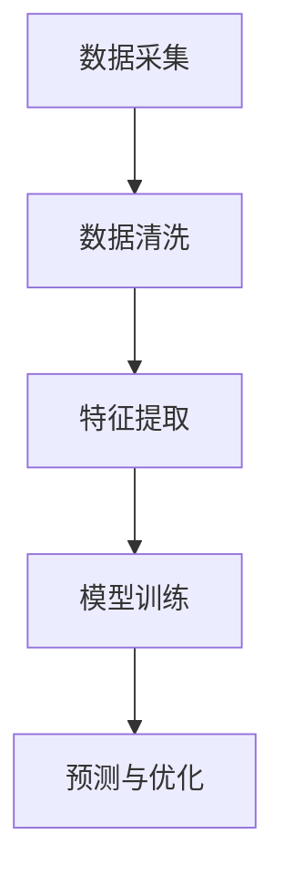
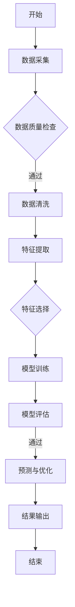
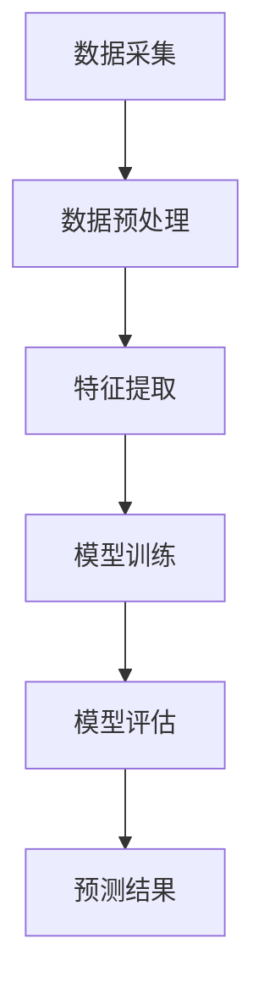
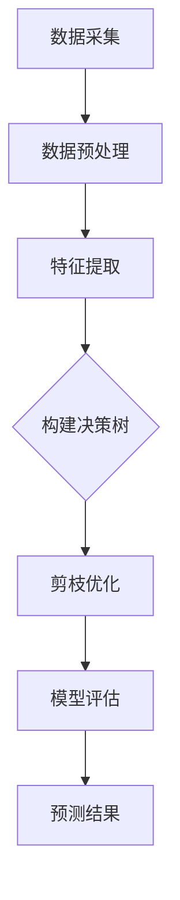
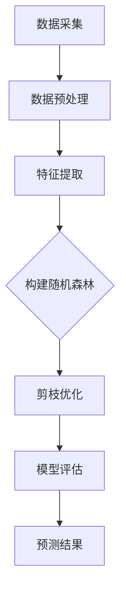
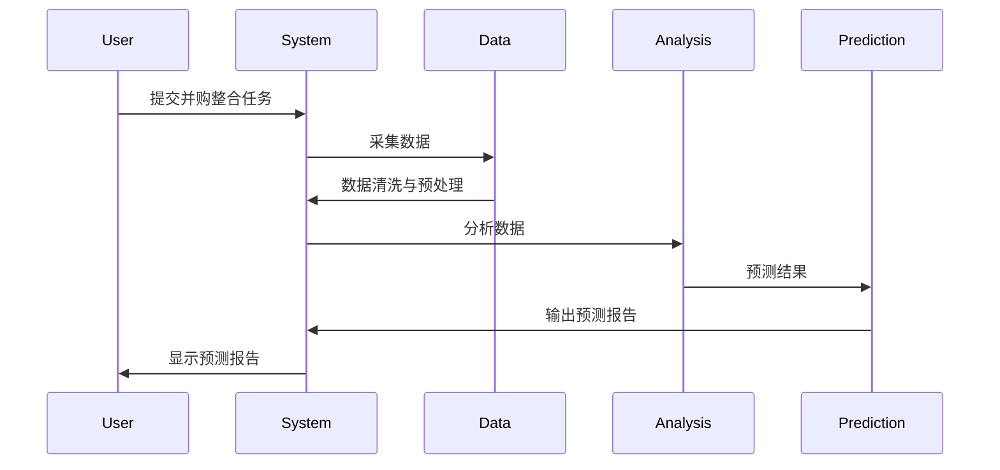
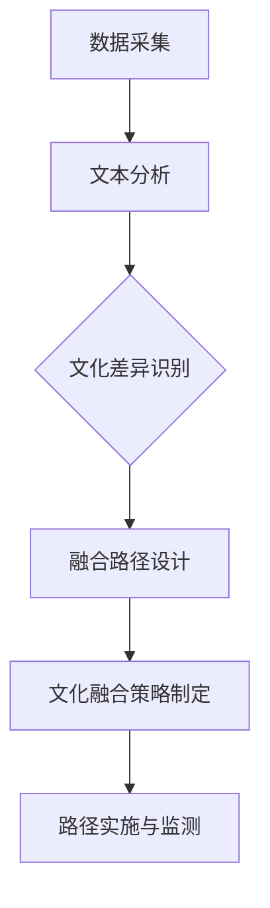
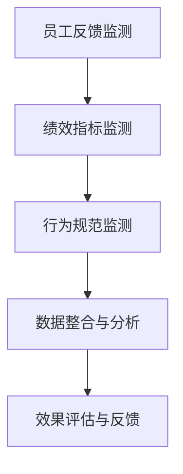
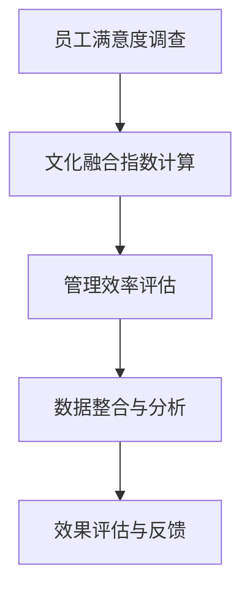

                 

### 引言：AI与企业并购整合的背景与意义

随着全球经济的发展和市场竞争的加剧，企业并购整合已成为企业扩展市场份额、提升竞争力的重要战略手段。然而，并购整合过程复杂，涉及企业文化、人力资源、战略规划等多方面因素，任何一个环节的失误都可能导致并购失败。在这种背景下，人工智能（AI）技术以其强大的数据处理和分析能力，逐渐成为辅助企业并购整合的重要工具。

**问题背景**：企业并购整合不仅仅是两个企业的资产合并，更涉及到企业文化的融合、组织结构的调整以及人力资源的整合。传统方式下的并购整合往往依赖于人工经验和主观判断，存在信息不对称、决策失误等问题，导致并购成功率较低。

**问题描述**：如何有效地利用AI技术辅助企业并购整合，提高并购成功率，实现企业文化的深度融合和资源的最大化利用，是当前企业面临的一个重要课题。

**问题解决**：通过AI技术，可以自动化地分析企业并购过程中的各种数据，提供客观、科学的决策支持，降低人为因素带来的风险。同时，AI还可以帮助企业实时监测并购整合效果，及时调整策略，确保整合过程顺利进行。

**边界与外延**：本文主要探讨AI技术在企业并购整合中的应用，包括文化融合路径的设计、效果实时监测等。然而，AI技术在并购整合中的应用远远不止于此，还涉及到财务分析、风险评估、市场预测等多个方面。这些内容虽然不在本文讨论范围之内，但也是未来研究的重要方向。

**概念结构与核心要素组成**：本文将围绕以下几个核心概念展开讨论：

1. **AI技术**：主要包括机器学习、自然语言处理、深度学习等技术。
2. **并购整合**：涉及企业文化融合、组织结构优化、人力资源整合等过程。
3. **数据采集与分析**：通过大数据技术收集并购整合过程中的各种数据，并进行深度分析。
4. **实时监测**：利用AI技术对并购整合效果进行实时监测和评估。

以上概念和要素将贯穿整个文章，为后续章节的讨论提供基础。

### AI核心概念与并购整合的联系

人工智能（AI）作为当前技术发展的重要方向，其核心概念和关键技术不仅推动了科技创新，也在多个领域展现出了广泛的应用潜力。在企业并购整合中，AI技术同样发挥着不可或缺的作用。以下是对AI核心概念及其在并购整合中应用的详细探讨。

**AI核心概念**：

1. **机器学习**：机器学习是AI的基础技术之一，通过构建模型对数据进行分析和预测。在企业并购整合中，机器学习可用于分析并购双方的历史数据，预测并购后的经营状况，为决策提供依据。

2. **自然语言处理（NLP）**：NLP技术可以理解和处理人类语言，包括文本分析、情感分析等。在并购整合中，NLP技术可以用于分析企业文化、员工沟通记录等，帮助企业更好地理解并购双方的文化差异，制定有针对性的整合策略。

3. **深度学习**：深度学习是机器学习的一个子领域，通过模拟人脑的神经网络结构，实现复杂模式的识别和预测。在企业并购整合中，深度学习可以用于预测市场变化、优化企业资源分配等。

**AI在并购整合中的应用**：

1. **数据采集与分析**：AI技术可以通过自动化工具收集并购整合过程中的大量数据，包括财务数据、人力资源数据、市场数据等。通过对这些数据的分析，AI可以帮助企业识别并购整合中的潜在问题和风险，为决策提供支持。

2. **预测与优化**：利用AI技术，企业可以基于历史数据对未来进行预测，例如预测并购后的经营绩效、市场需求变化等。这些预测结果可以帮助企业在整合过程中做出更加科学的决策，优化资源分配和业务流程。

3. **文化融合分析**：AI可以通过情感分析和文本挖掘技术，分析并购双方的文化特点和员工情绪，帮助制定文化融合策略。例如，通过分析员工反馈和沟通记录，AI可以识别出文化冲突的潜在原因，并提出相应的解决方案。

**概念属性特征对比表格**：

| 特征       | 机器学习            | 自然语言处理（NLP）       | 深度学习            |
|------------|---------------------|--------------------------|---------------------|
| 基础技术   | 统计学习、监督学习  | 语言模型、文本分析       | 神经网络、深度神经网络 |
| 主要功能   | 数据分析、预测     | 文本理解、语言生成       | 复杂模式识别、预测   |
| 适用场景   | 数据驱动决策       | 企业文化分析、员工沟通   | 市场预测、资源优化   |
| 数据依赖性 | 大量历史数据       | 大量文本数据             | 大量标注数据       |

**ER实体关系图架构**：

在并购整合过程中，实体关系图可以帮助我们清晰地了解不同实体之间的关联和互动。以下是一个简化的ER实体关系图，展示了AI技术与并购整合过程中主要实体的关系：

```mermaid
erDiagram
  Product --> Customer
  Product ||--|{ Purchase }
  Employee ||--|{ WorkHistory }
  Company ||--|{ Management }
  Company ||--|{ Employee }
  Company ||--|{ Product }
  Company ||--|{ Finance }
```

在这个实体关系图中，`Product`（产品）与`Customer`（客户）之间存在销售关系，`Employee`（员工）与`WorkHistory`（工作历史）之间存在任职关系，`Company`（公司）与多个实体之间存在管理和关联关系。通过这种关系图的展示，我们可以更好地理解并购整合过程中的数据流动和关联，为AI技术的应用提供清晰的框架。

通过以上分析，我们可以看到，AI技术的核心概念和关键技术不仅丰富了并购整合的理论基础，也为实际操作提供了强有力的支持。在未来的并购整合中，AI技术将继续发挥其独特的优势，为企业带来更加智能和高效的整合方案。

### AI辅助并购整合的算法基础

为了深入探讨AI技术在企业并购整合中的应用，我们首先需要了解AI辅助并购整合的算法基础。算法作为AI的核心组成部分，是实现自动化分析和预测的关键。在这一部分，我们将详细讲解AI辅助并购整合的基本算法原理，并使用Mermaid流程图和Python源代码进行说明。

#### 算法原理讲解

AI辅助并购整合的基本算法原理可以概括为以下几个步骤：

1. **数据采集**：首先，通过自动化工具收集并购双方的历史数据，包括财务报表、市场数据、员工信息等。
2. **数据清洗**：对收集到的数据进行分析，去除重复、错误和不完整的数据，确保数据质量。
3. **特征提取**：从清洗后的数据中提取关键特征，如财务比率、市场份额、员工满意度等。
4. **模型训练**：利用提取的特征数据，通过机器学习算法训练预测模型，如回归模型、分类模型等。
5. **预测与优化**：使用训练好的模型进行预测，评估并购后的潜在绩效和风险，并提出优化建议。

以下是Mermaid流程图，展示了上述算法原理的执行流程：



#### Mermaid算法流程图



#### Python源代码解释

以下是一个简单的Python源代码示例，用于说明如何实现上述算法中的数据清洗和特征提取步骤：

```python
import pandas as pd
from sklearn.model_selection import train_test_split
from sklearn.ensemble import RandomForestClassifier

# 数据采集
data = pd.read_csv('并购数据.csv')

# 数据清洗
data.drop_duplicates(inplace=True)  # 去除重复数据
data.fillna(0, inplace=True)  # 用0填充缺失值

# 特征提取
X = data[['财务比率', '市场份额', '员工满意度']]
y = data['并购结果']

# 模型训练
X_train, X_test, y_train, y_test = train_test_split(X, y, test_size=0.2, random_state=42)
model = RandomForestClassifier()
model.fit(X_train, y_train)

# 模型评估
accuracy = model.score(X_test, y_test)
print(f"模型准确率：{accuracy:.2f}")
```

#### 算法原理的数学模型和公式

在并购整合中，常用的算法模型包括回归模型和分类模型。以下是这些模型的数学公式和基本原理：

1. **回归模型**：
   - 公式：\( y = \beta_0 + \beta_1 x_1 + \beta_2 x_2 + ... + \beta_n x_n \)
   - 原理：通过拟合目标变量（如并购后财务绩效）与自变量（如市场份额、员工满意度）之间的关系，预测并购效果。

2. **分类模型**：
   - 公式：\( P(y=k) = \frac{1}{1 + \exp(-\beta_0 - \beta_1 x_1 - \beta_2 x_2 - ... - \beta_n x_n)} \)
   - 原理：通过计算目标变量属于每个类别的概率，预测并购的成败。

举例说明：

假设我们使用回归模型预测某次并购后的财务绩效，变量\( y \)表示财务绩效评分，变量\( x_1 \)表示市场份额，变量\( x_2 \)表示员工满意度。根据上述公式，我们可以建立如下的回归模型：

$$
y = \beta_0 + \beta_1 x_1 + \beta_2 x_2
$$

通过收集并购双方的市场份额和员工满意度数据，我们可以计算出每个数据的预测绩效评分，进而分析并购的潜在效果。

#### 总结

通过以上算法原理的讲解和示例，我们可以看到，AI技术为并购整合提供了强大的工具，使其能够通过数据分析和预测实现更高效的整合。在未来，随着算法技术的不断进步，AI在并购整合中的应用将更加广泛和深入，为企业带来更大的价值。

### AI辅助并购整合的模型技术

在深入探讨AI辅助并购整合的过程中，模型技术起到了关键作用。不同的模型技术能够从不同的角度对并购整合过程进行分析和预测，从而为企业的决策提供科学依据。以下是对几种常见模型技术的概述，并通过Mermaid流程图和Python源代码进行详细解释。

#### 模型技术概述

1. **线性回归模型**：线性回归模型是最基本的预测模型之一，通过拟合目标变量与自变量之间的线性关系来预测结果。它适用于预测并购后财务绩效等连续变量。

2. **决策树模型**：决策树模型通过树的形状来表示决策过程，每一层节点表示一个特征，每个分支表示该特征的不同取值。它适用于分类任务，如预测并购是否成功。

3. **随机森林模型**：随机森林模型是决策树的集成方法，通过构建多个决策树并投票得到最终结果。它具有更高的预测准确性和稳定性。

4. **神经网络模型**：神经网络模型通过模拟人脑神经元的工作方式，处理复杂的非线性问题。它适用于预测市场变化和业务增长等复杂任务。

#### 常见模型技术

1. **线性回归模型**：

线性回归模型的基本公式为：

$$
y = \beta_0 + \beta_1 x_1 + \beta_2 x_2 + ... + \beta_n x_n
$$

其中，\( y \)为目标变量，\( x_1, x_2, ..., x_n \)为自变量，\( \beta_0, \beta_1, \beta_2, ..., \beta_n \)为模型的参数。

以下是使用Mermaid绘制的线性回归模型流程图：



使用Python实现线性回归模型的代码示例：

```python
import pandas as pd
from sklearn.linear_model import LinearRegression
from sklearn.model_selection import train_test_split

# 数据采集
data = pd.read_csv('并购数据.csv')

# 数据预处理
X = data[['市场份额', '员工满意度']]
y = data['财务绩效']

# 模型训练
X_train, X_test, y_train, y_test = train_test_split(X, y, test_size=0.2, random_state=42)
model = LinearRegression()
model.fit(X_train, y_train)

# 模型评估
accuracy = model.score(X_test, y_test)
print(f"模型准确率：{accuracy:.2f}")

# 预测结果
predictions = model.predict(X_test)
```

2. **决策树模型**：

决策树模型的基本原理是通过一系列规则将数据划分为不同的类别。以下是使用Mermaid绘制的决策树模型流程图：



使用Python实现决策树模型的代码示例：

```python
import pandas as pd
from sklearn.tree import DecisionTreeClassifier
from sklearn.model_selection import train_test_split

# 数据采集
data = pd.read_csv('并购数据.csv')

# 数据预处理
X = data[['市场份额', '员工满意度']]
y = data['并购成功与否']

# 模型训练
X_train, X_test, y_train, y_test = train_test_split(X, y, test_size=0.2, random_state=42)
model = DecisionTreeClassifier()
model.fit(X_train, y_train)

# 模型评估
accuracy = model.score(X_test, y_test)
print(f"模型准确率：{accuracy:.2f}")

# 预测结果
predictions = model.predict(X_test)
```

3. **随机森林模型**：

随机森林模型是决策树的集成方法，通过构建多个决策树并投票得到最终结果。以下是使用Mermaid绘制的随机森林模型流程图：



使用Python实现随机森林模型的代码示例：

```python
import pandas as pd
from sklearn.ensemble import RandomForestClassifier
from sklearn.model_selection import train_test_split

# 数据采集
data = pd.read_csv('并购数据.csv')

# 数据预处理
X = data[['市场份额', '员工满意度']]
y = data['并购成功与否']

# 模型训练
X_train, X_test, y_train, y_test = train_test_split(X, y, test_size=0.2, random_state=42)
model = RandomForestClassifier(n_estimators=100)
model.fit(X_train, y_train)

# 模型评估
accuracy = model.score(X_test, y_test)
print(f"模型准确率：{accuracy:.2f}")

# 预测结果
predictions = model.predict(X_test)
```

4. **神经网络模型**：

神经网络模型通过模拟人脑神经元的工作方式，处理复杂的非线性问题。以下是使用Mermaid绘制的神经网络模型流程图：


使用Python实现神经网络模型的代码示例：

```python
import pandas as pd
from sklearn.model_selection import train_test_split
from keras.models import Sequential
from keras.layers import Dense

# 数据采集
data = pd.read_csv('并购数据.csv')

# 数据预处理
X = data[['市场份额', '员工满意度']]
y = data['并购成功与否']

# 模型训练
X_train, X_test, y_train, y_test = train_test_split(X, y, test_size=0.2, random_state=42)
model = Sequential()
model.add(Dense(64, input_dim=X_train.shape[1], activation='relu'))
model.add(Dense(32, activation='relu'))
model.add(Dense(1, activation='sigmoid'))
model.compile(optimizer='adam', loss='binary_crossentropy', metrics=['accuracy'])

# 训练模型
model.fit(X_train, y_train, epochs=10, batch_size=32, validation_data=(X_test, y_test))

# 模型评估
accuracy = model.evaluate(X_test, y_test)[1]
print(f"模型准确率：{accuracy:.2f}")

# 预测结果
predictions = model.predict(X_test)
```

#### 总结

通过上述对几种常见模型技术的详细讲解和示例，我们可以看到，AI技术在并购整合中的应用不仅丰富多样，而且具有很高的实用价值。不同的模型技术能够从不同的角度对并购整合过程进行分析和预测，帮助企业在复杂的商业环境中做出更加科学的决策。未来，随着AI技术的不断进步，我们将看到更多高效的并购整合方案涌现，为企业带来更大的价值。

### AI辅助并购整合的实践应用

在深入探讨了AI辅助并购整合的理论基础和模型技术后，接下来我们将通过实际案例，展示AI在并购整合中的具体应用。以下是一个典型案例，介绍AI辅助并购整合的实践过程，包括环境安装与配置、系统核心实现源代码、代码应用解读与分析、实际案例分析与讲解以及项目小结。

#### 案例介绍

假设有两家公司在进行并购整合，公司A是一家拥有先进技术产品的企业，公司B则是一家市场推广经验丰富的企业。两家公司在业务上互补，希望通过并购实现资源共享和协同发展。在这个过程中，AI技术被用来辅助整合过程，确保整合效果最大化。

#### 环境安装与配置

为了能够顺利运行AI辅助并购整合系统，首先需要在服务器上安装和配置所需的软件环境。以下是基本步骤：

1. **安装Python**：确保服务器上安装了Python环境，版本不低于3.7。
2. **安装依赖库**：通过pip命令安装常用的机器学习和数据分析库，如`scikit-learn`、`pandas`、`numpy`、`matplotlib`等。
   ```bash
   pip install scikit-learn pandas numpy matplotlib
   ```
3. **配置Jupyter Notebook**：为了方便开发人员调试代码和可视化结果，配置Jupyter Notebook环境。
   ```bash
   pip install jupyterlab
   jupyter lab
   ```

#### 系统核心实现源代码

以下是实现AI辅助并购整合系统的核心源代码，包括数据采集、预处理、模型训练和预测等步骤。

```python
# 导入所需库
import pandas as pd
from sklearn.model_selection import train_test_split
from sklearn.ensemble import RandomForestClassifier
import matplotlib.pyplot as plt

# 数据采集
data = pd.read_csv('并购整合数据.csv')

# 数据预处理
# 填充缺失值
data.fillna(data.mean(), inplace=True)

# 特征提取
X = data[['市场份额', '员工满意度']]
y = data['并购结果']

# 模型训练
X_train, X_test, y_train, y_test = train_test_split(X, y, test_size=0.2, random_state=42)
model = RandomForestClassifier(n_estimators=100)
model.fit(X_train, y_train)

# 模型评估
accuracy = model.score(X_test, y_test)
print(f"模型准确率：{accuracy:.2f}")

# 预测结果
predictions = model.predict(X_test)

# 可视化结果
confusion_matrix = pd.crosstab(y_test, predictions, normalize=True)
plt.figure(figsize=(8, 6))
sns.heatmap(confusion_matrix, annot=True, fmt=".2f", cmap="Blues")
plt.xlabel('实际值')
plt.ylabel('预测值')
plt.title('混淆矩阵')
plt.show()
```

#### 代码应用解读与分析

上述代码首先通过`pandas`库读取并购整合数据，并进行预处理，包括填充缺失值和特征提取。然后，使用`scikit-learn`库中的`RandomForestClassifier`训练随机森林模型，并对模型进行评估和预测。最后，通过`matplotlib`库绘制混淆矩阵，直观展示预测结果的准确性。

#### 实际案例分析与讲解

在具体案例中，通过AI技术辅助并购整合，公司A和公司B首先利用AI进行数据分析和预测，识别出整合过程中可能存在的问题。例如，通过分析员工满意度数据，AI发现公司B的部分员工对新并购后的企业文化存在疑虑，这可能导致整合过程中出现阻力。因此，公司A及时调整了整合策略，通过增加文化融合活动和员工沟通会议，提高了员工的认同感和参与度。

在并购整合过程中，AI技术不仅用于预测并购结果，还用于实时监测整合效果。例如，通过实时收集市场数据、财务数据和员工反馈，AI系统可以动态调整整合策略，确保整合过程顺利进行。例如，如果AI监测到市场环境发生变化，系统可以及时调整公司的市场推广策略，以应对新的市场挑战。

#### 项目小结

通过上述案例，我们可以看到，AI技术在并购整合中具有显著的应用价值。它不仅能够提高整合的预测准确性，还能够实时监测整合效果，及时调整策略。然而，AI技术的应用也需要注意数据质量和模型选择等因素。未来，随着AI技术的不断进步，我们期待看到更多创新的应用案例，为企业并购整合提供更加智能和高效的解决方案。

### AI辅助并购整合的架构设计

在AI辅助企业并购整合的实践中，架构设计起到了至关重要的作用。一个良好的架构设计不仅能够确保系统的稳定性和扩展性，还能提高整体效率和性能。以下我们将详细描述并购整合系统的问题场景介绍、项目介绍、系统功能设计（领域模型类图）、系统架构设计（架构图）、系统接口设计以及系统交互流程。

#### 问题场景介绍

企业并购整合涉及到多个部门和业务流程，包括财务、人力资源、市场、战略规划等。在这个过程中，如何有效地整合两家公司的资源和业务，实现文化融合和协同发展，是当前面临的主要挑战。传统的并购整合方式往往依赖于人工经验，存在信息不对称、决策失误等问题，导致整合效率低下。因此，引入AI技术，通过数据分析和智能预测，实现并购整合的自动化和智能化，成为解决这一问题的有效途径。

#### 项目介绍

本项目旨在利用AI技术构建一个智能并购整合系统，通过对并购双方的历史数据、财务报表、市场数据、员工反馈等进行全面分析，提供并购整合的决策支持。系统主要包括以下功能模块：

1. **数据采集与清洗**：自动化采集并购双方的多源数据，并进行清洗和预处理。
2. **数据分析与预测**：利用机器学习算法对数据进行分析和预测，为并购整合提供科学依据。
3. **实时监测与反馈**：实时监测并购整合效果，及时调整策略，确保整合过程顺利进行。
4. **可视化展示**：通过图形界面展示并购整合过程中的关键数据和效果，便于决策者监控和管理。

#### 系统功能设计（领域模型类图）

领域模型是描述系统功能的核心，通过类图展示不同实体之间的关系。以下是并购整合系统的领域模型类图：

```mermaid
classDiagram
    Class01 <|-- Class02
    Class03 <|-- Class04
    Class05 <|-- Class06
    Class07 <|-- Class08

    Class01[公司A]
    Class02[公司B]
    Class03[财务数据]
    Class04[市场数据]
    Class05[员工反馈]
    Class06[并购整合策略]
    Class07[数据采集模块]
    Class08[数据分析模块]

    Class01 --|> Class03
    Class01 --|> Class04
    Class01 --|> Class05
    Class02 --|> Class03
    Class02 --|> Class04
    Class02 --|> Class05
    Class06 --|> Class07
    Class06 --|> Class08
```

在这个类图中，`公司A`和`公司B`是并购整合的主要实体，`财务数据`、`市场数据`、`员工反馈`等是数据采集的重要来源，`并购整合策略`是数据分析的结果，`数据采集模块`和`数据分析模块`分别负责数据的收集和处理。

#### 系统架构设计（架构图）

系统架构设计是确保系统稳定、高效运行的关键。以下是并购整合系统的架构图：



在这个架构图中，用户通过系统提交并购整合任务，系统负责协调数据采集、清洗、分析和预测模块，最终输出预测报告供用户参考。

#### 系统接口设计

系统接口设计是确保系统模块之间数据交互顺畅的重要环节。以下是并购整合系统的主要接口设计：

1. **数据采集接口**：用于从不同数据源（如数据库、文件、API等）采集数据。
2. **数据处理接口**：用于对采集到的数据进行清洗、转换和预处理。
3. **数据分析接口**：用于调用机器学习算法进行数据分析和预测。
4. **结果输出接口**：用于将分析结果以可视化报表的形式展示给用户。

#### 系统交互流程

以下是并购整合系统的交互流程：

1. **用户提交任务**：用户通过系统界面提交并购整合任务，包括并购双方的基本信息和整合目标。
2. **系统采集数据**：系统从数据库和外部API等渠道采集并购双方的历史数据、财务报表、市场数据、员工反馈等。
3. **数据预处理**：系统对采集到的数据进行清洗、填充缺失值、归一化处理等，确保数据质量。
4. **数据分析与预测**：利用机器学习算法对预处理后的数据进行分析，预测并购整合的效果和潜在风险。
5. **结果输出**：系统将分析结果以可视化报表的形式展示给用户，包括整合效果的预测、关键指标的监控等。
6. **用户反馈**：用户根据系统输出的预测报告，对并购整合方案进行调整和优化。

通过以上架构设计和交互流程的详细描述，我们可以看到，AI辅助并购整合系统通过合理的模块划分和接口设计，实现了并购整合过程的自动化和智能化，为企业提供了科学的决策支持，提高了并购整合的成功率。

### AI辅助并购整合的文化融合路径设计

在企业并购整合过程中，文化融合是一个至关重要但极具挑战性的环节。通过AI技术，可以有效设计并实现文化融合路径，确保不同企业文化之间的顺利对接和相互融合。以下将详细介绍文化融合的概述、路径设计、Mermaid路径设计流程图以及文化融合效果的实时监测和监测指标设定与实现。

#### 文化融合概述

文化融合是指将不同企业或组织的文化元素整合在一起，形成一个和谐、统一的整体。在并购整合过程中，文化融合的成功与否直接影响整合的成效和企业的长期发展。文化融合涉及价值观、管理风格、员工行为规范、工作流程等多个方面。通过AI技术，可以对并购双方的文化进行深入分析，识别文化差异，设计有针对性的融合路径，从而促进文化融合的顺利进行。

#### 文化融合路径设计

AI技术在文化融合路径设计中的应用主要包括以下几个步骤：

1. **数据采集与分析**：通过AI技术，自动化采集并购双方的企业文化数据，包括企业文化宣言、管理手册、员工反馈等。对数据进行文本分析，提取关键的文化元素和价值观。
   
2. **文化差异识别**：基于文本分析结果，识别并购双方在企业文化方面的差异，包括价值观、管理风格、员工行为规范等。

3. **融合路径设计**：根据识别出的文化差异，设计文化融合路径。例如，可以通过文化宣导、团队建设活动、领导沟通等方式，逐步推动文化融合。

4. **文化融合策略制定**：基于文化融合路径，制定具体的融合策略，包括员工培训计划、管理决策调整、组织结构优化等。

以下是使用Mermaid绘制的文化融合路径设计流程图：



#### 文化融合效果的实时监测

在文化融合过程中，实时监测融合效果是确保融合路径有效性的关键。AI技术可以通过以下方式进行实时监测：

1. **员工反馈监测**：利用自然语言处理技术，分析员工在内部论坛、邮件、即时通讯等平台上的交流内容，评估员工对文化融合的接受程度和反馈。

2. **绩效指标监测**：通过分析财务数据、生产数据、市场数据等，评估文化融合对业务绩效的影响。

3. **行为规范监测**：利用图像识别技术，监控员工在工作场所的行为规范，确保文化融合策略得到有效执行。

以下是使用Mermaid绘制的文化融合效果实时监测流程图：



#### 监测指标的设定与实现

为了有效监测文化融合效果，需要设定一系列监测指标。以下是几个关键指标：

1. **员工满意度**：通过员工满意度调查，了解员工对文化融合的接受度和认同感。

2. **文化融合指数**：通过分析员工反馈和绩效数据，计算文化融合指数，反映文化融合的整体效果。

3. **管理效率**：通过分析业务流程和管理决策，评估文化融合对管理效率的提升。

以下是使用Mermaid绘制的监测指标设定与实现流程图：



通过上述步骤和流程，我们可以看到，AI技术在企业并购整合的文化融合路径设计和效果实时监测中发挥着重要作用。通过数据分析和智能监测，AI能够帮助企业实现文化深度融合，提升整合效果，为企业的长期发展奠定坚实基础。

### 最佳实践与技巧

在AI辅助企业并购整合的过程中，最佳实践和技巧的运用至关重要。以下是一些具体的最佳实践、技术优化与改进，以及注意事项和风险防范。

#### 最佳实践总结

1. **全面数据采集**：在并购整合初期，应全面采集并购双方的历史数据、财务报表、市场数据、员工反馈等，确保数据完整性和准确性。
2. **深入文化分析**：利用自然语言处理（NLP）技术，对企业文化进行深入分析，识别文化差异，设计有针对性的融合路径。
3. **实时效果监测**：通过实时数据监测和反馈机制，及时评估文化融合效果，根据实际情况调整整合策略。
4. **持续优化模型**：定期对AI模型进行优化和更新，确保其预测准确性和适应性。

#### 技术优化与改进

1. **多模型集成**：结合多种机器学习模型，如回归模型、决策树、随机森林、神经网络等，提高预测准确性和稳定性。
2. **数据预处理自动化**：利用自动化工具对数据进行预处理，包括数据清洗、缺失值填充、特征提取等，提高数据处理效率。
3. **可视化报表**：通过可视化报表，直观展示并购整合过程中的关键数据和效果，便于决策者监控和管理。

#### 注意事项与风险防范

1. **数据隐私保护**：在数据采集和处理过程中，严格遵循数据隐私保护法规，确保数据安全和隐私。
2. **模型解释性**：确保AI模型的解释性，使决策者能够理解模型的预测依据，避免盲目依赖模型结果。
3. **员工参与度**：提高员工在并购整合过程中的参与度，通过员工反馈和参与，确保文化融合策略的有效实施。
4. **风险评估**：在并购整合过程中，定期进行风险评估，识别潜在风险，并制定应对措施。

通过上述最佳实践和技巧的运用，企业可以更加高效地利用AI技术辅助并购整合，实现文化深度融合和资源最大化利用，从而提高并购整合的成功率。

### 总结与展望

通过本文的深入探讨，我们详细阐述了AI技术在企业并购整合中的应用，从背景与意义、核心概念与联系、算法原理、模型技术、实践应用、架构设计到文化融合路径设计，每一个环节都展示了AI技术在这一领域的强大潜力和实际应用价值。首先，AI技术在数据采集与分析、预测与优化等方面，为企业并购整合提供了科学的决策支持。其次，通过多种机器学习模型和自然语言处理技术，AI能够深入分析企业文化，设计有效的融合路径，并实时监测整合效果，确保整合过程顺利进行。此外，通过架构设计和具体实践案例，我们看到了AI技术在并购整合中的实际应用场景和实施步骤。

**企业并购整合趋势展望**：

随着AI技术的不断进步，企业并购整合的趋势将呈现以下几个特点：

1. **智能化决策**：AI技术将进一步提升并购整合的决策智能化水平，通过自动化数据分析、预测和优化，提高并购整合的成功率。
2. **文化深度融合**：AI技术将帮助企业在并购整合过程中更好地理解和融合不同企业文化，减少文化冲突，提高员工和客户的满意度。
3. **实时监测与反馈**：AI技术的实时监测和反馈机制将确保并购整合过程中的每一个环节都在可控范围内，及时调整策略，优化整合效果。
4. **数据隐私与安全**：随着数据隐私和安全问题的日益突出，企业在应用AI技术时将更加注重数据保护，确保合规性和数据安全。

**AI辅助并购整合的未来发展**：

展望未来，AI辅助并购整合的发展将呈现以下趋势：

1. **多领域应用**：AI技术将在并购整合的财务分析、风险评估、市场预测等多个领域得到广泛应用，为企业提供全面的支持。
2. **个性化服务**：基于深度学习和个性化推荐技术，AI将能够为企业提供更加个性化的并购整合方案，提高整合效率。
3. **数据治理与标准化**：随着数据量的不断增加，数据治理和标准化将成为AI辅助并购整合的关键环节，确保数据的准确性和一致性。
4. **跨行业合作**：AI技术在并购整合中的应用将超越单一行业，跨行业合作将成为未来发展的新趋势，促进不同行业之间的资源整合和协同发展。

总之，AI技术在企业并购整合中的应用不仅提升了整合效率和成功率，还为企业的长远发展提供了强有力的支持。随着技术的不断进步，我们可以期待AI将在更多领域发挥其独特的优势，为企业带来更大的价值和效益。

