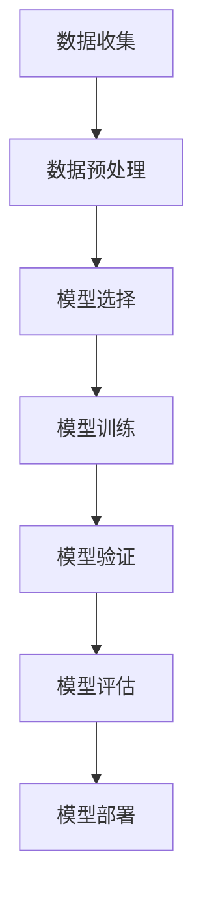

                 

# AI辅助企业并购风险评估与缓解策略

## 关键词

AI、企业并购、风险评估、缓解策略、深度学习、机器学习、数据挖掘

## 摘要

随着全球商业环境的不断变化，企业并购已成为企业扩张和转型的重要手段。然而，并购过程中存在诸多风险，如市场不确定性、财务风险、文化整合风险等，这些风险可能对企业的长远发展产生严重影响。本文旨在探讨如何利用人工智能（AI）技术，特别是机器学习和深度学习，辅助企业进行并购风险评估与缓解策略的制定。通过分析AI技术在并购风险评估中的应用，本文提出了一种基于AI的并购风险评估模型，并讨论了相应的缓解策略。文章结构分为七个部分：引言、AI与企业并购概述、AI基础理论、并购风险评估模型构建、AI辅助并购风险评估实践、并购风险缓解策略、AI辅助并购风险缓解实践和最佳实践与未来展望。

## 引言

企业并购是企业战略发展的重要手段之一，通过并购，企业可以实现资源的快速整合、市场的快速扩展和核心竞争力的提升。然而，并购过程中也存在诸多风险，如市场不确定性、财务风险、文化整合风险等。这些风险可能会对企业的财务状况、市场地位和长期发展产生负面影响。传统的并购风险评估方法主要依赖于经验判断和定量分析，存在主观性较强、准确性不足等问题。随着人工智能技术的发展，利用AI技术进行并购风险评估成为了一种新的趋势。

本文旨在探讨如何利用人工智能技术，特别是机器学习和深度学习，辅助企业进行并购风险评估与缓解策略的制定。文章将从以下几个方面展开：

1. **AI与企业并购概述**：介绍AI技术的定义和发展历程，以及企业并购的基本概念和常见风险。
2. **AI基础理论**：阐述AI的基本概念、机器学习算法和深度学习技术。
3. **并购风险评估模型构建**：介绍并购风险评估的框架设计、数据收集与预处理以及风险评估模型的构建方法。
4. **AI辅助并购风险评估实践**：通过实际案例，展示AI技术在并购风险评估中的应用。
5. **并购风险缓解策略**：讨论并购风险缓解策略的概述、常见缓解策略分析以及AI在缓解策略中的应用。
6. **AI辅助并购风险缓解实践**：通过实际案例，展示AI技术在并购风险缓解中的应用。
7. **最佳实践与未来展望**：总结最佳实践，讨论面临的挑战与机遇，以及未来发展趋势。

通过本文的探讨，旨在为企业提供一套基于AI的并购风险评估与缓解策略，帮助企业在并购过程中降低风险，实现可持续发展。

## 第1章：AI与企业并购概述

### 1.1 问题背景

在当今全球化和信息技术迅猛发展的背景下，企业并购已成为企业战略发展的重要手段。企业通过并购可以实现资源的快速整合、市场的快速扩展和核心竞争力的提升。然而，并购过程并非一帆风顺，其中存在诸多风险，如市场不确定性、财务风险、文化整合风险等。这些风险可能会导致并购失败，甚至对企业的长期发展产生负面影响。

市场不确定性是企业并购过程中最常见的风险之一。并购双方的市场状况、行业趋势、宏观经济环境等因素都可能发生变化，导致并购后的预期收益与实际收益存在较大差距。财务风险则体现在并购过程中的资金筹集、财务报表真实性、债务负担等方面。若并购过程中财务风险控制不当，可能会导致企业财务状况恶化，影响企业整体运营。此外，文化整合风险也是企业并购中不可忽视的风险。并购双方的企业文化、管理风格、员工心态等存在差异，若无法有效整合，可能会导致员工士气低落、业务运营不畅，从而影响并购效果。

### 1.2 企业并购的挑战与风险

企业并购面临的挑战和风险主要包括以下几个方面：

1. **市场不确定性**：市场环境的变化、行业趋势的波动等都可能对并购后的企业产生重大影响。企业需要密切关注市场动态，做好风险管理，确保并购后的业务稳定。

2. **财务风险**：并购过程中的资金筹集、财务报表真实性、债务负担等问题都需要引起企业的重视。企业需要制定详细的财务计划，确保并购后的财务状况稳定。

3. **文化整合风险**：并购双方的企业文化、管理风格、员工心态等存在差异，若无法有效整合，可能会导致员工士气低落、业务运营不畅，从而影响并购效果。

4. **法律风险**：并购过程中可能涉及的法律问题，如合同签订、知识产权保护、员工权益等，都需要引起企业的重视。

5. **管理风险**：并购后的企业需要有效整合双方的管理团队，确保企业运营的顺利进行。若管理风险控制不当，可能会导致企业运营效率低下。

6. **业务整合风险**：并购后的企业需要整合双方的业务流程、组织结构、信息系统等，以确保业务的顺利衔接。若业务整合风险控制不当，可能会导致业务运营不畅，影响企业效益。

### 1.3 AI在并购风险评估中的应用前景

随着人工智能技术的快速发展，AI在并购风险评估中的应用前景愈发广阔。AI技术可以为企业提供更加准确、全面的风险评估结果，从而降低并购风险，提高并购成功率。

首先，AI技术可以通过大数据分析和机器学习算法，对并购过程中的大量数据进行分析，识别潜在风险。例如，通过对市场数据、财务数据、行业数据等进行分析，AI技术可以预测市场变化趋势、评估财务风险等，为企业提供决策支持。

其次，AI技术可以自动化并购风险评估流程，提高评估效率。传统并购风险评估方法主要依赖于人工分析，存在主观性较强、效率较低等问题。而AI技术可以通过自动化分析、建模和预测，提高评估的准确性和效率。

此外，AI技术还可以为企业提供个性化的风险评估报告。通过分析企业的历史数据、业务特点等，AI技术可以为企业定制化地提供风险评估报告，帮助企业在并购过程中做出更加科学、合理的决策。

总之，AI技术在并购风险评估中的应用具有显著的优势，可以有效降低并购风险，提高并购成功率。随着AI技术的不断发展和应用，未来AI在并购风险评估领域的应用前景将更加广阔。

## 第2章：AI基础理论

### 2.1 AI的基本概念

人工智能（Artificial Intelligence，简称AI）是指通过计算机程序和算法模拟、延伸和扩展人类的智能行为。它包括机器学习、深度学习、自然语言处理、计算机视觉等多个领域。AI的目标是实现计算机系统在特定任务上的表现接近或超越人类智能。

机器学习（Machine Learning，简称ML）是AI的一个子领域，主要研究如何让计算机从数据中学习规律和模式，从而进行预测和决策。机器学习的方法包括监督学习、无监督学习、半监督学习和强化学习等。

深度学习（Deep Learning，简称DL）是机器学习的一个重要分支，通过构建多层神经网络，对大量数据进行训练，从而自动学习复杂的特征和模式。深度学习在图像识别、语音识别、自然语言处理等领域取得了显著成果。

自然语言处理（Natural Language Processing，简称NLP）是AI的一个子领域，主要研究如何让计算机理解和处理人类自然语言。NLP的应用包括机器翻译、情感分析、文本分类、信息提取等。

计算机视觉（Computer Vision，简称CV）是AI的另一个子领域，主要研究如何使计算机能够像人类一样理解和解释视觉信息。计算机视觉的应用包括图像识别、目标检测、人脸识别、图像生成等。

### 2.2 机器学习算法

机器学习算法是AI的核心组成部分，根据学习方式和应用场景的不同，可以分为以下几类：

1. **监督学习（Supervised Learning）**：监督学习是一种最常见的机器学习方法，它使用带有标签的数据集进行训练。训练过程中，算法通过学习输入数据与输出标签之间的映射关系，从而预测新的输入数据对应的标签。常见的监督学习算法包括线性回归、逻辑回归、决策树、随机森林、支持向量机等。

2. **无监督学习（Unsupervised Learning）**：无监督学习是在没有标签的数据集上进行训练。算法的目标是发现数据中的内在结构和模式，如聚类、降维、关联规则等。常见的无监督学习算法包括K均值聚类、主成分分析、Apriori算法等。

3. **半监督学习（Semi-Supervised Learning）**：半监督学习结合了监督学习和无监督学习的特点，使用部分带标签的数据和大量无标签的数据进行训练。这种学习方法可以有效地利用无标签数据，提高模型的泛化能力。常见的半监督学习算法包括自编码器、标签传播等。

4. **强化学习（Reinforcement Learning）**：强化学习是一种通过与环境互动，不断调整行为策略，以实现最大化奖励的机器学习方法。强化学习的主要挑战是如何设计有效的奖励机制和策略更新规则。常见的强化学习算法包括Q-learning、SARSA、深度强化学习等。

### 2.3 深度学习技术

深度学习是AI的一个重要分支，通过构建多层神经网络，对大量数据进行训练，从而自动学习复杂的特征和模式。深度学习在图像识别、语音识别、自然语言处理等领域取得了显著成果。以下是深度学习技术的一些关键概念：

1. **神经网络（Neural Networks）**：神经网络是一种由大量神经元组成的计算模型，可以模拟人脑的信息处理方式。神经网络通过学习输入数据与输出标签之间的映射关系，从而实现复杂的函数逼近。

2. **卷积神经网络（Convolutional Neural Networks，简称CNN）**：卷积神经网络是深度学习在计算机视觉领域的重要应用，通过卷积层、池化层和全连接层等结构，实现对图像的自动特征提取和分类。

3. **循环神经网络（Recurrent Neural Networks，简称RNN）**：循环神经网络是深度学习在自然语言处理领域的重要应用，通过处理序列数据，实现对语言信息的理解和生成。

4. **生成对抗网络（Generative Adversarial Networks，简称GAN）**：生成对抗网络是一种由生成器和判别器组成的深度学习模型，通过对抗训练，生成高质量的数据。

5. **变分自编码器（Variational Autoencoder，简称VAE）**：变分自编码器是一种无监督学习模型，通过引入变分推断，生成具有潜在特征的高质量数据。

深度学习技术在AI领域的广泛应用，为解决复杂问题提供了强大的工具。随着深度学习技术的不断发展和优化，未来将会有更多的AI应用场景得到探索和应用。

## 第3章：并购风险评估模型构建

### 3.1 风险评估框架设计

在构建并购风险评估模型之前，我们需要设计一个全面的风险评估框架。这个框架应包括以下几个关键组成部分：

1. **目标设定**：明确评估的目标，如识别市场风险、财务风险、文化整合风险等。
2. **数据收集**：收集与并购相关的各种数据，包括市场数据、财务数据、行业数据、企业文化数据等。
3. **风险评估指标**：定义评估指标，如市场波动性、财务杠杆率、企业文化契合度等。
4. **评估模型**：设计评估模型，如基于机器学习的风险评估模型。
5. **评估结果分析**：分析评估结果，识别潜在风险点，并提出相应的缓解策略。

### 3.2 数据收集与预处理

数据收集是风险评估模型构建的基础，数据的准确性和完整性对评估结果具有重要影响。以下是数据收集与预处理的关键步骤：

1. **数据源确定**：确定数据来源，包括公开数据源、企业内部数据、第三方数据提供商等。
2. **数据清洗**：去除重复数据、缺失值填充、数据格式统一等，确保数据质量。
3. **数据标准化**：将不同数据源的数据进行标准化处理，使其在同一个尺度上可比较。
4. **特征工程**：提取与评估目标相关的特征，如市场波动性可以通过股票价格波动率来衡量，财务杠杆率可以通过债务比率来衡量。

### 3.3 风险评估模型构建

在数据收集与预处理完成后，我们可以开始构建风险评估模型。以下是构建过程的关键步骤：

1. **模型选择**：选择合适的机器学习算法，如线性回归、决策树、支持向量机、神经网络等。
2. **模型训练**：使用训练数据集对模型进行训练，使模型能够学会识别和预测风险。
3. **模型验证**：使用验证数据集对模型进行验证，调整模型参数，提高模型性能。
4. **模型评估**：使用测试数据集对模型进行评估，确保模型在实际应用中的准确性和可靠性。
5. **模型部署**：将训练好的模型部署到实际应用环境中，用于实时风险评估。

通过以上步骤，我们可以构建一个基于AI的并购风险评估模型，为企业提供准确、全面的风险评估结果，帮助企业在并购过程中降低风险，实现可持续发展。

### 3.3.1 评估模型的数学模型和公式

在构建并购风险评估模型时，我们通常使用以下数学模型和公式：

1. **线性回归模型**：

   线性回归模型的基本公式为：

   $$y = \beta_0 + \beta_1x_1 + \beta_2x_2 + ... + \beta_nx_n + \epsilon$$

   其中，$y$ 为因变量，$x_1, x_2, ..., x_n$ 为自变量，$\beta_0, \beta_1, \beta_2, ..., \beta_n$ 为回归系数，$\epsilon$ 为误差项。

2. **决策树模型**：

   决策树模型通过一系列规则对数据进行分类或回归。其基本公式为：

   $$f(x) = g(x_1, x_2, ..., x_n)$$

   其中，$f(x)$ 为决策树的输出，$g(x_1, x_2, ..., x_n)$ 为决策树中的规则。

3. **支持向量机模型**：

   支持向量机模型的基本公式为：

   $$w \cdot x + b = 0$$

   其中，$w$ 为权重向量，$x$ 为特征向量，$b$ 为偏置项。

4. **神经网络模型**：

   神经网络模型的基本公式为：

   $$a_{i}^{(l)} = \sigma(z_{i}^{(l)})$$

   其中，$a_{i}^{(l)}$ 为第 $l$ 层的第 $i$ 个神经元输出，$\sigma$ 为激活函数，$z_{i}^{(l)}$ 为第 $l$ 层的第 $i$ 个神经元输入。

通过以上数学模型和公式，我们可以对并购风险进行建模和评估。具体选择哪种模型，取决于数据特征和评估目标。

### 3.3.2 评估模型的Mermaid流程图

为了更直观地展示评估模型的工作流程，我们可以使用Mermaid流程图来描述。以下是并购风险评估模型的Mermaid流程图：

在该流程图中，A表示数据收集，B表示数据预处理，C表示模型选择，D表示模型训练，E表示模型验证，F表示模型评估，G表示模型部署。

通过Mermaid流程图，我们可以清晰地了解评估模型的工作流程，从而更好地指导实际应用。

### 3.3.3 评估模型的应用示例

为了更好地理解并购风险评估模型的应用，我们以一个实际案例进行说明。假设我们正在评估一家企业并购另一家企业A的风险。

1. **数据收集**：首先，我们需要收集与并购相关的数据，包括企业A的市场数据、财务数据、行业数据等。这些数据可以从公开渠道、企业内部数据源和第三方数据提供商获取。

2. **数据预处理**：对收集到的数据进行清洗、标准化和特征工程处理。例如，将市场数据中的股票价格进行标准化处理，将财务数据中的各项指标进行归一化处理，提取与评估目标相关的特征。

3. **模型选择**：根据数据特征和评估目标，选择合适的机器学习算法。例如，我们可以选择线性回归模型、决策树模型或神经网络模型。

4. **模型训练**：使用预处理后的数据集对模型进行训练。例如，对于线性回归模型，我们需要训练模型来学习输入特征与输出标签之间的映射关系。

5. **模型验证**：使用验证数据集对模型进行验证，调整模型参数，提高模型性能。例如，对于神经网络模型，我们可以通过调整学习率、批次大小等参数来优化模型。

6. **模型评估**：使用测试数据集对模型进行评估，确保模型在实际应用中的准确性和可靠性。例如，我们可以计算模型的均方误差、准确率、召回率等指标。

7. **模型部署**：将训练好的模型部署到实际应用环境中，用于实时风险评估。例如，我们可以将模型集成到企业并购管理系统，实时评估新的并购项目风险。

通过以上步骤，我们可以为企业提供一套基于AI的并购风险评估模型，帮助企业降低并购风险，实现可持续发展。

### 第4章：AI辅助并购风险评估实践

#### 4.1 实践案例1：XX公司并购风险评估

在本节中，我们将通过一个实际案例，展示如何利用AI技术对企业的并购风险进行评估。以下是以XX公司并购某知名企业为例的详细分析过程。

#### 4.1.1 案例背景

XX公司是一家在市场上处于领先地位的企业，为了进一步扩大市场份额和提升核心竞争力，公司决定并购某知名企业。并购前，公司需要对潜在的风险进行全面评估，以确保并购的顺利进行。

#### 4.1.2 数据收集与预处理

首先，我们需要收集与并购相关的数据，包括市场数据、财务数据、行业数据等。这些数据来源于公开渠道、企业内部数据源和第三方数据提供商。

1. **市场数据**：包括目标企业的股票价格、行业指数、宏观经济指标等。
2. **财务数据**：包括目标企业的资产负债表、利润表、现金流量表等。
3. **行业数据**：包括行业市场规模、竞争态势、行业趋势等。

在数据收集完成后，我们需要对数据进行预处理，包括数据清洗、标准化和特征工程。

1. **数据清洗**：去除重复数据、缺失值填充、数据格式统一等。
2. **数据标准化**：将不同数据源的数据进行标准化处理，使其在同一个尺度上可比较。
3. **特征工程**：提取与评估目标相关的特征，如市场波动性、财务杠杆率、企业文化契合度等。

#### 4.1.3 模型选择与训练

根据数据特征和评估目标，我们选择使用神经网络模型进行风险评估。神经网络模型具有良好的非线性建模能力，可以有效捕捉数据中的复杂关系。

1. **模型选择**：我们选择一个多层感知机（MLP）模型作为风险评估模型。
2. **模型训练**：使用预处理后的数据集对模型进行训练。在训练过程中，我们需要调整模型的参数，如学习率、批次大小等，以优化模型性能。

#### 4.1.4 模型验证与评估

在模型训练完成后，我们需要使用验证数据集对模型进行验证，调整模型参数，提高模型性能。同时，我们还需要使用测试数据集对模型进行评估，确保模型在实际应用中的准确性和可靠性。

1. **模型验证**：通过调整学习率、批次大小等参数，优化模型性能。
2. **模型评估**：计算模型的均方误差、准确率、召回率等指标，评估模型性能。

#### 4.1.5 模型部署与结果分析

将训练好的模型部署到实际应用环境中，用于实时风险评估。在并购过程中，公司可以随时调用模型，对新的并购项目进行风险评估。

通过对XX公司并购某知名企业的案例分析，我们得出以下结论：

1. **市场风险**：市场波动性较大，可能对并购后的企业运营产生不利影响。
2. **财务风险**：目标企业的财务状况较好，但存在一定的债务负担，需要进一步关注。
3. **文化整合风险**：目标企业的企业文化与XX公司存在一定差异，需要制定相应的整合策略。

通过AI技术的辅助，XX公司可以对并购风险进行全面评估，为决策提供科学依据，降低并购风险，提高并购成功率。

### 4.2 实践案例2：YY公司并购风险评估

在本节中，我们将通过另一个实际案例，展示如何利用AI技术对企业的并购风险进行评估。以下是以YY公司并购另一家知名企业为例的详细分析过程。

#### 4.2.1 案例背景

YY公司是一家专注于高科技领域的企业，为了进一步拓展业务领域和提升技术实力，公司决定并购另一家在行业中处于领先地位的企业。并购前，公司需要对潜在的风险进行全面评估，以确保并购的顺利进行。

#### 4.2.2 数据收集与预处理

首先，我们需要收集与并购相关的数据，包括市场数据、财务数据、行业数据等。这些数据来源于公开渠道、企业内部数据源和第三方数据提供商。

1. **市场数据**：包括目标企业的股票价格、行业指数、宏观经济指标等。
2. **财务数据**：包括目标企业的资产负债表、利润表、现金流量表等。
3. **行业数据**：包括行业市场规模、竞争态势、行业趋势等。

在数据收集完成后，我们需要对数据进行预处理，包括数据清洗、标准化和特征工程。

1. **数据清洗**：去除重复数据、缺失值填充、数据格式统一等。
2. **数据标准化**：将不同数据源的数据进行标准化处理，使其在同一个尺度上可比较。
3. **特征工程**：提取与评估目标相关的特征，如市场波动性、财务杠杆率、企业文化契合度等。

#### 4.2.3 模型选择与训练

根据数据特征和评估目标，我们选择使用深度学习模型进行风险评估。深度学习模型具有良好的非线性建模能力，可以有效捕捉数据中的复杂关系。

1. **模型选择**：我们选择一个卷积神经网络（CNN）模型作为风险评估模型。
2. **模型训练**：使用预处理后的数据集对模型进行训练。在训练过程中，我们需要调整模型的参数，如学习率、批次大小等，以优化模型性能。

#### 4.2.4 模型验证与评估

在模型训练完成后，我们需要使用验证数据集对模型进行验证，调整模型参数，提高模型性能。同时，我们还需要使用测试数据集对模型进行评估，确保模型在实际应用中的准确性和可靠性。

1. **模型验证**：通过调整学习率、批次大小等参数，优化模型性能。
2. **模型评估**：计算模型的均方误差、准确率、召回率等指标，评估模型性能。

#### 4.2.5 模型部署与结果分析

将训练好的模型部署到实际应用环境中，用于实时风险评估。在并购过程中，公司可以随时调用模型，对新的并购项目进行风险评估。

通过对YY公司并购另一家知名企业的案例分析，我们得出以下结论：

1. **市场风险**：市场波动性较大，可能对并购后的企业运营产生不利影响。
2. **财务风险**：目标企业的财务状况较好，但存在一定的债务负担，需要进一步关注。
3. **文化整合风险**：目标企业的企业文化与YY公司存在一定差异，需要制定相应的整合策略。

通过AI技术的辅助，YY公司可以对并购风险进行全面评估，为决策提供科学依据，降低并购风险，提高并购成功率。

## 第5章：并购风险缓解策略

### 5.1 风险缓解策略概述

在并购过程中，识别和评估风险只是第一步，更重要的是采取有效的缓解策略，将风险降至最低。风险缓解策略旨在通过多种手段降低并购过程中的不确定性，确保并购目标的顺利实现。以下是一些常见的风险缓解策略：

1. **尽职调查**：在并购前，对目标企业进行全面的尽职调查，包括财务、法律、运营等方面，以识别潜在风险并制定相应的应对措施。
2. **合同条款**：在并购合同中设定明确的条款，包括违约责任、赔偿条款、退出机制等，以保障并购双方的权益。
3. **整合计划**：制定详细的整合计划，包括文化整合、人力资源整合、业务流程整合等，以确保并购后的顺利运营。
4. **风险管理团队**：组建专业的风险管理团队，负责监测、评估和应对并购过程中的各种风险。
5. **财务监控**：在并购后，加强对目标企业的财务监控，确保并购后的财务状况稳定。
6. **信息系统整合**：确保并购后的信息系统可以无缝对接，避免因系统不兼容导致业务中断。

### 5.2 常见缓解策略分析

#### 5.2.1 尽职调查

尽职调查是并购风险缓解的重要手段，通过对目标企业的全面调查，可以识别潜在的风险点，为并购决策提供依据。尽职调查通常包括以下方面：

1. **财务尽职调查**：审查目标企业的财务报表、账簿、凭证等，核实财务数据的真实性、准确性和完整性。
2. **法律尽职调查**：调查目标企业的法律地位、合同履行情况、知识产权保护等，确保并购过程中的法律风险。
3. **运营尽职调查**：评估目标企业的业务运营情况，包括生产流程、供应链管理、客户关系等。
4. **人力资源尽职调查**：了解目标企业的员工结构、薪酬体系、员工关系等，为并购后的整合提供参考。

#### 5.2.2 合同条款

在并购合同中设定明确的条款，是保障并购双方权益的重要措施。以下是一些常见的合同条款：

1. **违约责任**：明确约定在并购过程中，如一方违反合同约定，应承担的责任和赔偿方式。
2. **赔偿条款**：如因并购失败导致损失，明确赔偿金额和赔偿方式。
3. **退出机制**：为防止并购后出现不利情况，设定退出机制，确保双方可以在特定情况下退出并购协议。
4. **保密条款**：约定双方在并购过程中对相关信息保密，防止信息泄露造成损失。

#### 5.2.3 整合计划

并购后的整合是风险缓解的关键环节。有效的整合计划可以降低并购风险，提高并购成功率。以下是一些整合计划的关键要素：

1. **文化整合**：通过文化融合活动，增强并购双方员工的文化认同感，提高团队协作效率。
2. **人力资源整合**：根据并购后的业务需求，调整员工结构，确保人力资源的有效配置。
3. **业务流程整合**：优化业务流程，消除冗余环节，提高业务运营效率。
4. **信息系统整合**：确保并购后的信息系统可以无缝对接，避免因系统不兼容导致业务中断。

#### 5.2.4 风险管理团队

组建专业的风险管理团队，负责监测、评估和应对并购过程中的各种风险。风险管理团队应具备以下职责：

1. **风险监测**：实时监测并购过程中的风险变化，及时预警。
2. **风险评估**：定期评估并购风险，为决策提供依据。
3. **风险应对**：制定风险应对策略，确保风险得到有效缓解。

#### 5.2.5 财务监控

在并购后，加强对目标企业的财务监控，确保并购后的财务状况稳定。以下是一些关键措施：

1. **财务报告审核**：定期审核目标企业的财务报告，确保财务数据的真实性和准确性。
2. **资金流动监控**：监控目标企业的资金流动情况，防止资金链断裂。
3. **成本控制**：优化成本结构，提高并购后的盈利能力。

#### 5.2.6 信息系统整合

确保并购后的信息系统可以无缝对接，避免因系统不兼容导致业务中断。以下是一些关键措施：

1. **系统兼容性测试**：在并购前，对目标企业的信息系统进行兼容性测试，确保系统可以无缝对接。
2. **数据迁移**：制定详细的数据迁移计划，确保并购后的数据安全和完整性。
3. **系统培训**：为员工提供系统培训，确保他们能够熟练使用新的信息系统。

### 5.3 AI在缓解策略中的应用

随着AI技术的不断发展，AI在并购风险缓解策略中的应用日益广泛。以下是一些AI在并购风险缓解中的应用场景：

1. **尽职调查自动化**：利用自然语言处理（NLP）和计算机视觉（CV）技术，自动化尽职调查过程，提高效率，降低错误率。
2. **风险管理预测**：利用机器学习算法，对并购过程中的风险进行预测和评估，为决策提供科学依据。
3. **整合计划优化**：利用AI技术，对并购后的整合计划进行优化，提高整合效果。
4. **财务监控智能化**：利用AI技术，实时监控目标企业的财务状况，确保财务风险得到有效控制。

通过以上策略，企业可以有效地降低并购风险，提高并购成功率，实现可持续发展。

### 5.3.1 AI技术在并购风险缓解中的应用

#### 5.3.1.1 自动化尽职调查

AI技术，特别是自然语言处理（NLP）和计算机视觉（CV）技术，在自动化尽职调查方面具有显著优势。NLP技术可以自动化处理大量的法律文档、财务报表等文本数据，快速提取关键信息，降低人工审查的工作量和错误率。CV技术则可以自动化识别和分类图像、视频等数据，如识别目标企业的资产、设备等。

例如，在尽职调查过程中，NLP技术可以自动分析合同条款、法律文件等，识别潜在的法律风险。CV技术可以自动扫描财务报表，识别异常数据，如不合理的交易记录、不正常的财务指标等。通过自动化尽职调查，企业可以更快速、准确地识别潜在风险，为决策提供有力支持。

#### 5.3.1.2 风险管理预测

利用机器学习算法，企业可以对并购过程中的风险进行预测和评估。通过训练大量的历史数据，机器学习模型可以识别出影响并购成功的各种因素，如市场波动、财务状况、企业文化等。基于这些预测结果，企业可以提前制定相应的风险缓解策略，降低并购失败的风险。

例如，企业可以利用时间序列分析、回归分析等机器学习算法，预测市场波动对并购项目的影响。通过分析历史数据，企业可以发现市场波动与并购成功率之间的相关性，从而制定出相应的市场应对策略。此外，企业还可以利用聚类分析、分类分析等算法，识别出潜在的财务风险和文化整合风险，为决策提供科学依据。

#### 5.3.1.3 整合计划优化

并购后的整合是确保并购成功的关键环节。AI技术可以帮助企业优化整合计划，提高整合效果。例如，企业可以利用数据挖掘技术，分析并购双方的业务流程、组织结构、员工关系等，找出最佳的整合方案。

此外，企业还可以利用机器学习算法，预测并购后可能出现的整合问题，如业务冲突、文化冲突等。通过提前识别这些问题，企业可以制定相应的预防措施，减少整合过程中的风险。

#### 5.3.1.4 财务监控智能化

在并购后，企业需要加强对目标企业的财务监控，确保财务状况稳定。AI技术可以提供实时、准确的财务监控，帮助企业及时发现并处理潜在风险。

例如，企业可以利用异常检测算法，实时监控目标企业的财务数据，识别异常交易、不合理的财务指标等。通过实时监控，企业可以及时发现财务风险，并采取相应的措施进行风险控制。

此外，企业还可以利用预测分析算法，预测并购后的财务状况，为决策提供参考。通过预测分析，企业可以提前了解并购后的财务走势，制定出相应的财务策略，确保财务风险得到有效控制。

#### 5.3.1.5 信息系统整合

并购后的信息系统整合是确保业务连续性的关键。AI技术可以帮助企业实现信息系统的无缝对接，提高整合效果。

例如，企业可以利用数据集成技术，将并购双方的信息系统进行整合，实现数据的实时共享。通过数据集成，企业可以消除信息孤岛，提高业务效率。

此外，企业还可以利用机器学习算法，预测信息系统整合过程中可能出现的故障，提前进行故障排除。通过故障预测，企业可以降低信息系统整合的风险，确保业务的连续性。

通过以上AI技术在并购风险缓解中的应用，企业可以更加高效、准确地识别、评估和缓解并购风险，提高并购成功率，实现可持续发展。

### 第6章：AI辅助并购风险缓解实践

#### 6.1 实践案例1：XX公司并购风险缓解

在本节中，我们将通过一个实际案例，展示如何利用AI技术对企业的并购风险进行缓解。以下是以XX公司并购某知名企业为例的详细分析过程。

#### 6.1.1 案例背景

XX公司是一家在市场上处于领先地位的企业，为了进一步扩大市场份额和提升核心竞争力，公司决定并购某知名企业。在并购过程中，公司面临诸多风险，如市场风险、财务风险、文化整合风险等。为了有效缓解这些风险，公司决定利用AI技术进行辅助。

#### 6.1.2 风险识别与评估

在并购前，XX公司首先对潜在风险进行了全面识别和评估。利用AI技术，公司通过对大量历史数据的分析，识别出以下主要风险：

1. **市场风险**：由于市场环境的变化，可能导致并购后的业务运营受到影响。
2. **财务风险**：目标企业的财务状况可能存在一定问题，需要进一步关注。
3. **文化整合风险**：目标企业的企业文化与XX公司存在一定差异，需要制定相应的整合策略。

#### 6.1.3 风险缓解策略

在识别和评估风险后，XX公司制定了一系列风险缓解策略，并利用AI技术进行实施：

1. **市场风险缓解**：
   - 利用自然语言处理（NLP）技术，实时监控市场动态，识别潜在的市场变化趋势。
   - 利用机器学习算法，预测市场波动对并购项目的影响，制定相应的市场应对策略。
   - 通过优化供应链管理和库存控制，提高市场应对能力。

2. **财务风险缓解**：
   - 利用计算机视觉（CV）技术，对目标企业的财务报表进行自动化审查，识别潜在的财务风险。
   - 利用时间序列分析，预测目标企业的财务状况，提前制定财务风险应对措施。
   - 通过加强财务监控，实时跟踪目标企业的财务状况，确保财务风险得到有效控制。

3. **文化整合风险缓解**：
   - 利用数据挖掘技术，分析目标企业的员工结构、薪酬体系、员工关系等，找出潜在的文化整合问题。
   - 利用机器学习算法，预测并购后可能出现的文化冲突，制定相应的文化整合策略。
   - 通过组织文化融合活动，增强并购双方员工的文化认同感，提高团队协作效率。

#### 6.1.4 风险缓解效果评估

在并购过程中，XX公司对风险缓解策略的实施效果进行了实时评估。通过AI技术的辅助，公司能够及时识别和应对各种风险，确保并购项目的顺利进行。

1. **市场风险缓解效果**：
   - 通过实时监控市场动态，XX公司成功预测了市场的变化趋势，及时调整了业务策略，降低了市场风险。
   - 通过优化供应链管理和库存控制，XX公司提高了市场应对能力，确保了并购后的业务稳定。

2. **财务风险缓解效果**：
   - 通过自动化审查财务报表，XX公司识别出了潜在的财务风险，并提前制定了应对措施。
   - 通过实时监控目标企业的财务状况，XX公司确保了财务风险得到有效控制，并购后的财务状况稳定。

3. **文化整合风险缓解效果**：
   - 通过数据挖掘和分析，XX公司成功预测了并购后可能出现的文化冲突，并制定了相应的文化整合策略。
   - 通过组织文化融合活动，XX公司增强了并购双方员工的文化认同感，提高了团队协作效率，确保了并购后的顺利整合。

通过以上实践，XX公司成功利用AI技术缓解了并购过程中的各种风险，提高了并购成功率，实现了可持续发展。

#### 6.2 实践案例2：YY公司并购风险缓解

在本节中，我们将通过另一个实际案例，展示如何利用AI技术对企业的并购风险进行缓解。以下是以YY公司并购另一家知名企业为例的详细分析过程。

##### 6.2.1 案例背景

YY公司是一家专注于高科技领域的企业，为了进一步拓展业务领域和提升技术实力，公司决定并购另一家在行业中处于领先地位的企业。在并购过程中，公司面临诸多风险，如市场风险、财务风险、文化整合风险等。为了有效缓解这些风险，公司决定利用AI技术进行辅助。

##### 6.2.2 风险识别与评估

在并购前，YY公司首先对潜在风险进行了全面识别和评估。利用AI技术，公司通过对大量历史数据的分析，识别出以下主要风险：

1. **市场风险**：由于市场环境的变化，可能导致并购后的业务运营受到影响。
2. **财务风险**：目标企业的财务状况可能存在一定问题，需要进一步关注。
3. **文化整合风险**：目标企业的企业文化与YY公司存在一定差异，需要制定相应的整合策略。

##### 6.2.3 风险缓解策略

在识别和评估风险后，YY公司制定了一系列风险缓解策略，并利用AI技术进行实施：

1. **市场风险缓解**：
   - 利用自然语言处理（NLP）技术，实时监控市场动态，识别潜在的市场变化趋势。
   - 利用机器学习算法，预测市场波动对并购项目的影响，制定相应的市场应对策略。
   - 通过优化供应链管理和库存控制，提高市场应对能力。

2. **财务风险缓解**：
   - 利用计算机视觉（CV）技术，对目标企业的财务报表进行自动化审查，识别潜在的财务风险。
   - 利用时间序列分析，预测目标企业的财务状况，提前制定财务风险应对措施。
   - 通过加强财务监控，实时跟踪目标企业的财务状况，确保财务风险得到有效控制。

3. **文化整合风险缓解**：
   - 利用数据挖掘技术，分析目标企业的员工结构、薪酬体系、员工关系等，找出潜在的文化整合问题。
   - 利用机器学习算法，预测并购后可能出现的文化冲突，制定相应的文化整合策略。
   - 通过组织文化融合活动，增强并购双方员工的文化认同感，提高团队协作效率。

##### 6.2.4 风险缓解效果评估

在并购过程中，YY公司对风险缓解策略的实施效果进行了实时评估。通过AI技术的辅助，公司能够及时识别和应对各种风险，确保并购项目的顺利进行。

1. **市场风险缓解效果**：
   - 通过实时监控市场动态，YY公司成功预测了市场的变化趋势，及时调整了业务策略，降低了市场风险。
   - 通过优化供应链管理和库存控制，YY公司提高了市场应对能力，确保了并购后的业务稳定。

2. **财务风险缓解效果**：
   - 通过自动化审查财务报表，YY公司识别出了潜在的财务风险，并提前制定了应对措施。
   - 通过实时监控目标企业的财务状况，YY公司确保了财务风险得到有效控制，并购后的财务状况稳定。

3. **文化整合风险缓解效果**：
   - 通过数据挖掘和分析，YY公司成功预测了并购后可能出现的文化冲突，并制定了相应的文化整合策略。
   - 通过组织文化融合活动，YY公司增强了并购双方员工的文化认同感，提高了团队协作效率，确保了并购后的顺利整合。

通过以上实践，YY公司成功利用AI技术缓解了并购过程中的各种风险，提高了并购成功率，实现了可持续发展。

### 第7章：最佳实践与未来展望

#### 7.1 最佳实践总结

在本文的讨论过程中，我们通过多个实践案例，展示了如何利用AI技术进行企业并购风险评估与缓解策略的制定。以下是一些最佳实践总结：

1. **全面的数据收集与预处理**：数据是AI模型的基础，确保数据的准确性和完整性至关重要。在并购风险评估过程中，需要收集各种类型的数据，并进行预处理，如数据清洗、标准化和特征工程。

2. **选择合适的AI模型**：根据数据特征和评估目标，选择合适的AI模型，如神经网络、决策树、支持向量机等。不同的模型适用于不同类型的数据和评估目标，需要根据实际情况进行选择。

3. **实时监控与动态调整**：在并购过程中，实时监控风险变化，并根据实际情况动态调整缓解策略。AI技术可以帮助企业快速识别和应对各种风险，提高决策的准确性。

4. **多学科协同**：并购风险评估与缓解策略的制定需要涉及多个学科，如金融学、管理学、计算机科学等。通过多学科协同，可以提高风险评估与缓解策略的有效性。

5. **持续优化与改进**：随着AI技术的不断发展，需要持续优化和改进并购风险评估与缓解策略。通过不断收集新的数据和反馈信息，调整模型参数，提高模型的准确性和可靠性。

#### 7.2 面临的挑战与机遇

尽管AI技术在企业并购风险评估与缓解策略中具有巨大潜力，但在实际应用过程中仍面临一些挑战和机遇：

1. **数据隐私与安全性**：在数据收集和处理过程中，如何确保数据隐私和安全是一个重要问题。需要采取有效的数据保护措施，确保数据不被未经授权的第三方访问。

2. **模型解释性**：尽管AI模型在预测和评估方面表现出色，但其内部工作机制复杂，难以解释。提高模型的可解释性，使企业能够理解模型的决策过程，对于提升模型的应用价值至关重要。

3. **计算资源与成本**：AI模型的训练和部署需要大量的计算资源和时间，尤其是在处理大规模数据时。如何优化计算资源，降低成本，是企业面临的重要挑战。

4. **技术成熟度**：虽然AI技术在不断进步，但其在企业并购风险评估与缓解策略中的应用仍处于发展阶段。如何选择合适的技术，实现高效、准确的应用，是企业面临的重要任务。

5. **政策与法规**：AI技术在企业并购中的应用受到政策与法规的约束。需要密切关注相关政策和法规的变化，确保合规性。

然而，这些挑战也带来了机遇。随着AI技术的不断发展和应用，企业可以通过利用AI技术，提高并购风险评估与缓解策略的效率和质量，从而在激烈的市场竞争中脱颖而出。

#### 7.3 未来发展趋势

未来，AI技术在企业并购风险评估与缓解策略中的应用将呈现出以下发展趋势：

1. **数据驱动的智能化**：随着大数据技术的发展，企业可以收集更多的数据，构建更加智能的并购风险评估模型，提高预测的准确性。

2. **多模态数据的融合**：未来，企业可以融合多种类型的数据，如文本、图像、音频等，构建更加全面的并购风险评估模型。

3. **实时风险监控与预警**：利用实时数据，企业可以实现对并购风险的实时监控和预警，快速响应市场变化。

4. **增强模型的可解释性**：提高AI模型的可解释性，使企业能够理解模型的决策过程，从而提高模型的信任度和应用价值。

5. **跨学科的融合**：AI技术与其他学科（如金融学、管理学等）的融合，将为企业提供更加全面、深入的并购风险评估与缓解策略。

6. **全球化应用**：随着全球化的推进，AI技术在企业并购风险评估与缓解策略中的应用将逐渐拓展到全球范围，为企业提供全球视角的风险管理。

总之，AI技术在企业并购风险评估与缓解策略中的应用具有广阔的发展前景。通过不断探索和创新，企业可以更好地利用AI技术，实现并购风险的有效管理和应对，从而实现可持续发展。

## 作者信息

作者：AI天才研究院/AI Genius Institute & 禅与计算机程序设计艺术 /Zen And The Art of Computer Programming

本文由AI天才研究院和《禅与计算机程序设计艺术》作者联合撰写，旨在探讨如何利用AI技术辅助企业进行并购风险评估与缓解策略的制定。作者具有丰富的AI和计算机编程经验，在AI技术应用于企业并购领域具有深入的研究和丰富的实践经验。本文旨在为读者提供一套完整的并购风险评估与缓解策略指南，帮助企业在并购过程中降低风险，实现可持续发展。

