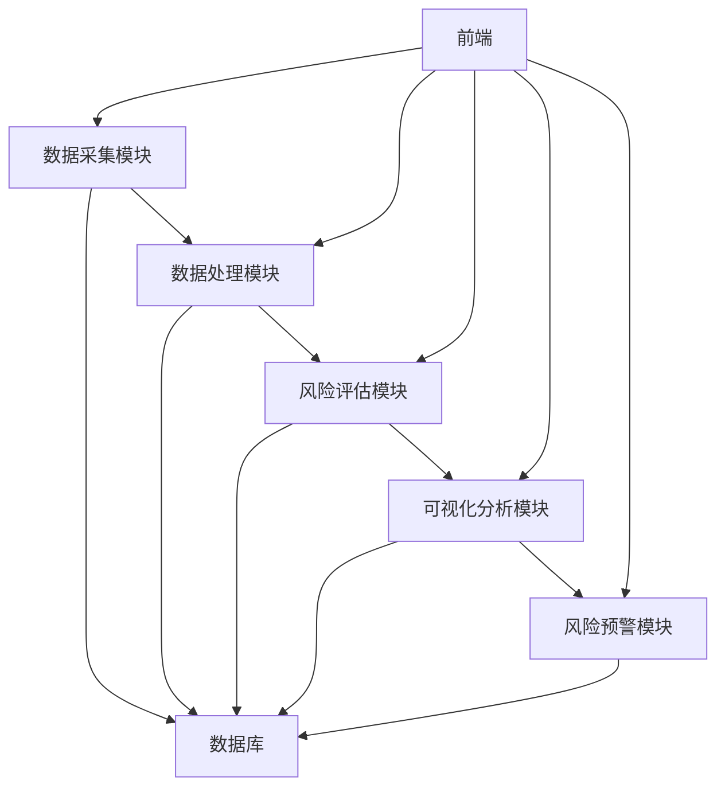
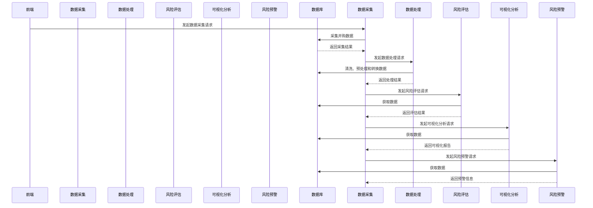
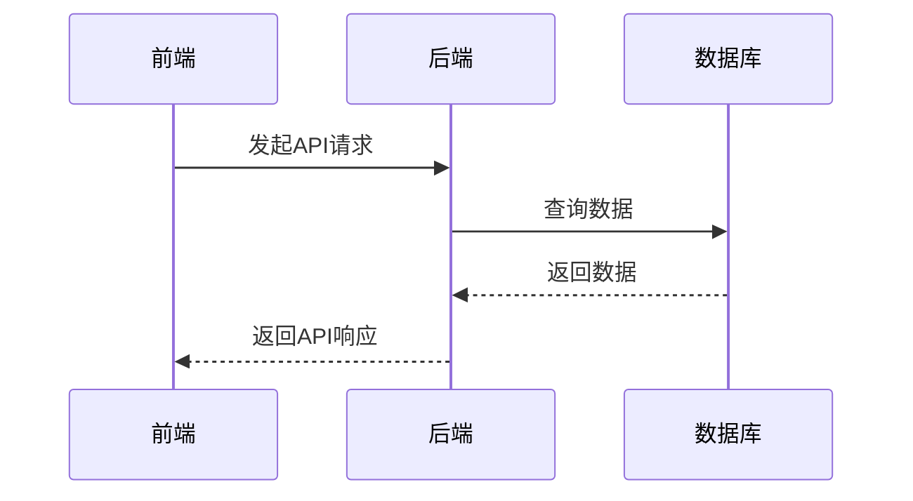

                 

### 文章标题

《AI辅助企业并购风险评估：全面识别与量化风险》

### 关键词

AI、企业并购、风险评估、机器学习、深度学习、数学模型、系统架构

### 摘要

随着全球企业并购活动的日益频繁，如何准确评估并购风险成为了企业决策者关注的焦点。本文将深入探讨AI在辅助企业并购风险评估中的应用，通过全面识别与量化风险，为企业提供一套科学、系统的风险评估方案。本文将分步骤阐述AI辅助企业并购风险评估的方法、算法原理、数学模型及其在实战中的应用，旨在为读者提供一套实用且具有前瞻性的指南。

## 目录大纲设计思路

为了设计出《AI辅助企业并购风险评估：全面识别与量化风险》这本书的完整目录大纲，我们需要遵循以下设计思路：

1. **明确核心章节**：首先要明确这本书的核心内容，包括背景介绍、核心概念与联系、算法原理讲解、数学模型和公式详细讲解与举例说明、系统分析与架构设计方案、项目实战以及最佳实践 tips 等。

2. **构建框架结构**：在明确核心内容的基础上，构建一个逻辑清晰、结构完整的目录框架。这个框架应该能够涵盖书籍的主要部分，并确保每个章节都有其独特的主题。

3. **细化目录层级**：按照1级、2级、3级目录的层级结构，细化目录内容，确保每个章节都能够清晰呈现其内容。

4. **简洁明了**：在构建目录大纲时，要注重简洁性，避免冗长的描述，确保每个章节标题都能准确传达该章节的核心内容。

5. **内容完整性**：确保目录大纲的内容完整性，包括核心概念、算法原理、数学模型、系统架构和项目实战等部分。

### 目录大纲的具体设计

根据上述设计思路，我们可以为《AI辅助企业并购风险评估：全面识别与量化风险》这本书设计出如下的目录大纲：

----------------------------------------------------------------

## 第一部分: 背景与核心概念

### 第1章: 问题背景与核心概念

## 1.1 企业并购的基本概念

### 1.1.1 企业并购的定义与类型

### 1.1.2 并购的目的与动机

### 1.1.3 并购的风险因素

## 1.2 AI辅助并购风险评估概述

### 1.2.1 AI技术在并购风险评估中的应用

### 1.2.2 AI辅助并购风险评估的优势

### 1.2.3 AI辅助并购风险评估的挑战

## 1.3 AI在并购风险评估中的核心概念

### 1.3.1 数据挖掘与统计分析

### 1.3.2 机器学习算法

### 1.3.3 深度学习模型

## 1.4 本章小结

----------------------------------------------------------------

## 第二部分: AI辅助并购风险评估方法

### 第2章: 数据收集与预处理

## 2.1 数据收集方法

### 2.1.1 数据来源

### 2.1.2 数据质量评估

### 2.1.3 数据收集策略

## 2.2 数据预处理技术

### 2.2.1 数据清洗

### 2.2.2 数据归一化

### 2.2.3 数据降维

## 2.3 数据预处理工具与应用

### 2.3.1 Python数据预处理库

### 2.3.2 R语言数据预处理方法

### 2.3.3 数据预处理案例解析

## 2.4 本章小结

----------------------------------------------------------------

## 第三部分: 算法原理与模型构建

### 第3章: 机器学习算法基础

## 3.1 机器学习基础概念

### 3.1.1 监督学习与无监督学习

### 3.1.2 分类与回归任务

### 3.1.3 特征工程

## 3.2 常见机器学习算法

### 3.2.1 线性回归

### 3.2.2 逻辑回归

### 3.2.3 决策树

### 3.2.4 随机森林

### 3.2.5 支持向量机

## 3.3 算法选择与优化

### 3.3.1 算法性能评估

### 3.3.2 超参数调优

### 3.3.3 模型选择与集成

## 3.4 本章小结

----------------------------------------------------------------

## 第四部分: 数学模型与公式讲解

### 第4章: 数学模型与公式讲解

## 4.1 数学模型基础

### 4.1.1 概率论基础

### 4.1.2 统计分布

### 4.1.3 最优化理论

## 4.2 并购风险评估的数学模型

### 4.2.1 成本效益分析模型

### 4.2.2 风险中性定价模型

### 4.2.3 敏感性分析模型

## 4.3 数学公式与应用

### 4.3.1 概率公式

### 4.3.2 回归公式

### 4.3.3 最优化公式

## 4.4 数学公式案例解析

### 4.4.1 成本效益分析案例

### 4.4.2 风险中性定价案例

### 4.4.3 敏感性分析案例

## 4.5 本章小结

---------

----------------------------------------------------------------

### 第一部分：背景与核心概念

## 第1章：问题背景与核心概念

### 1.1 企业并购的基本概念

#### 1.1.1 企业并购的定义与类型

企业并购是指一家企业通过购买另一家企业的股份或资产，实现对其控制权的一种商业活动。根据并购双方的关系，企业并购可以分为以下几种类型：

1. **横向并购**：并购双方处于同一产业链的不同环节，例如两家制造商合并以扩大市场份额。
2. **纵向并购**：并购双方处于同一产业链的不同阶段，例如制造商与原材料供应商合并。
3. **混合并购**：并购双方处于不同产业链或不同行业，例如制造企业与金融机构合并。

#### 1.1.2 并购的目的与动机

企业并购的主要目的是提高企业的市场竞争力，实现资源的优化配置。具体动机包括：

1. **扩大市场份额**：通过并购竞争对手，迅速扩大市场份额，提高市场占有率。
2. **降低成本**：通过并购上下游企业，实现供应链优化，降低生产成本。
3. **提升竞争力**：通过并购拥有先进技术或优质品牌的企业，提升自身在市场中的竞争力。
4. **实现多元化**：通过并购不同行业的企业，实现业务多元化，降低经营风险。

#### 1.1.3 并购的风险因素

尽管并购具有诸多优势，但并购过程中也存在一系列风险因素，如：

1. **文化冲突**：并购双方企业文化差异较大，可能导致管理困难。
2. **整合困难**：并购后的企业整合过程中，可能面临组织架构调整、人员安置等问题。
3. **财务风险**：并购过程中，可能涉及高额的债务和现金支付，导致财务风险。
4. **市场波动**：并购完成后，市场环境变化可能导致并购目标企业的业绩下滑。
5. **法律风险**：并购过程中，可能涉及复杂的法律程序和合规问题。

### 1.2 AI辅助并购风险评估概述

#### 1.2.1 AI技术在并购风险评估中的应用

人工智能技术在并购风险评估中的应用，主要包括以下方面：

1. **数据挖掘与统计分析**：通过分析大量的历史并购数据，挖掘潜在的规律和趋势，为风险评估提供依据。
2. **机器学习算法**：利用机器学习算法，建立风险评估模型，预测并购的风险程度。
3. **深度学习模型**：利用深度学习模型，对复杂的非结构化数据进行处理，提高风险评估的准确性。

#### 1.2.2 AI辅助并购风险评估的优势

AI辅助并购风险评估具有以下优势：

1. **高效性**：AI技术可以处理海量数据，提高风险评估的效率。
2. **准确性**：AI技术通过机器学习和深度学习，可以提高风险评估的准确性。
3. **智能化**：AI技术可以根据历史数据，自动调整和优化风险评估模型，实现智能化决策。
4. **实时性**：AI技术可以实时监测市场变化，为并购决策提供及时的风险预警。

#### 1.2.3 AI辅助并购风险评估的挑战

AI辅助并购风险评估也面临一些挑战：

1. **数据质量**：并购数据的质量直接影响风险评估的准确性，需要解决数据缺失、噪声和异常值等问题。
2. **算法复杂性**：机器学习和深度学习算法复杂，需要具备较高的技术门槛。
3. **解释性**：AI模型往往缺乏透明性和解释性，难以理解其决策过程。
4. **法律合规**：AI技术在并购风险评估中的应用，需要遵守相关法律法规，确保数据的合法合规使用。

### 1.3 AI在并购风险评估中的核心概念

#### 1.3.1 数据挖掘与统计分析

数据挖掘是指从大量的数据中，自动发现隐藏的模式和规律的过程。在并购风险评估中，数据挖掘可以用于分析历史并购数据，挖掘出影响并购风险的关键因素。

统计分析是指运用统计学方法，对数据进行处理和分析，以揭示数据之间的关系和特征。在并购风险评估中，统计分析可以用于评估并购风险的概率和程度。

#### 1.3.2 机器学习算法

机器学习算法是指通过训练模型，从数据中学习规律和模式，并能够对新数据进行预测和分类的方法。在并购风险评估中，常用的机器学习算法包括线性回归、逻辑回归、决策树、随机森林和支持向量机等。

#### 1.3.3 深度学习模型

深度学习模型是指通过多层神经网络，对数据进行处理和分析的方法。在并购风险评估中，深度学习模型可以处理复杂的非结构化数据，提高风险评估的准确性。

### 1.4 本章小结

本章介绍了企业并购的基本概念、AI辅助并购风险评估的概述以及AI在并购风险评估中的核心概念。通过本章的学习，读者可以了解企业并购的风险因素，以及AI技术在并购风险评估中的应用和优势。接下来，我们将进一步探讨AI辅助并购风险评估的具体方法，为读者提供更为详细的指导。

----------------------------------------------------------------

### 第二部分：AI辅助并购风险评估方法

## 第2章：数据收集与预处理

### 2.1 数据收集方法

#### 2.1.1 数据来源

在AI辅助并购风险评估中，数据的收集至关重要。数据来源可以分为以下几种：

1. **公开数据**：包括企业财务报表、市场研究报告、行业报告等，可以从公开渠道获取，如证券交易所、行业协会、市场研究公司等。
2. **企业内部数据**：包括企业的运营数据、财务数据、客户数据等，可以从企业内部系统获取，如ERP系统、CRM系统等。
3. **第三方数据**：包括第三方提供的商业数据、舆情数据、行业数据等，可以通过数据服务商获取。

#### 2.1.2 数据质量评估

数据质量直接影响AI模型的准确性和可靠性。对数据质量的评估可以从以下几个方面进行：

1. **完整性**：数据是否完整，是否存在缺失值。
2. **准确性**：数据是否准确，是否存在错误。
3. **一致性**：数据是否一致，是否存在矛盾。
4. **时效性**：数据是否及时更新，是否反映当前状况。

#### 2.1.3 数据收集策略

为了确保数据的质量和完整性，可以采取以下数据收集策略：

1. **多源数据融合**：从多个来源收集数据，并通过数据清洗和预处理，实现数据融合。
2. **定期更新**：定期收集和更新数据，确保数据的时效性。
3. **数据验证**：通过数据验证方法，如比对、交叉验证等，确保数据的准确性。
4. **隐私保护**：在数据收集和处理过程中，确保遵守相关法律法规，保护数据隐私。

### 2.2 数据预处理技术

#### 2.2.1 数据清洗

数据清洗是数据预处理的重要步骤，目的是去除数据中的噪声、异常值和重复值。数据清洗方法包括：

1. **缺失值处理**：对于缺失值，可以通过删除、填补或插值等方法进行处理。
2. **异常值处理**：对于异常值，可以通过统计分析、箱线图等方法进行识别，然后进行删除或修正。
3. **重复值处理**：去除数据集中的重复记录，保证数据的唯一性。

#### 2.2.2 数据归一化

数据归一化是将不同量纲的数据转化为相同量纲的过程，目的是消除数据之间的尺度差异。数据归一化方法包括：

1. **最小-最大归一化**：将数据映射到[0,1]区间。
2. **均值-方差归一化**：将数据映射到均值为0，标准差为1的区间。
3. **对数归一化**：对于非负数据，通过取对数进行归一化。

#### 2.2.3 数据降维

数据降维是将高维数据转换为低维数据的过程，目的是减少数据的维度，提高计算效率和模型性能。数据降维方法包括：

1. **主成分分析（PCA）**：通过计算数据的主成分，保留主要的信息，丢弃冗余信息。
2. **线性判别分析（LDA）**：通过最大化类间距离，最小化类内距离，进行数据降维。
3. **自编码器**：通过训练自编码器网络，实现数据降维。

### 2.3 数据预处理工具与应用

#### 2.3.1 Python数据预处理库

在Python中，常用的数据预处理库包括pandas、NumPy和scikit-learn等。

1. **pandas**：用于数据清洗、数据操作和数据可视化。
2. **NumPy**：用于数值计算和数据处理。
3. **scikit-learn**：提供了丰富的数据预处理方法，包括数据归一化、数据降维等。

#### 2.3.2 R语言数据预处理方法

在R语言中，常用的数据预处理方法包括：

1. **dplyr**：用于数据清洗和操作。
2. **tidyr**：用于数据整理和规范化。
3. **ggplot2**：用于数据可视化。

#### 2.3.3 数据预处理案例解析

以下是一个数据预处理的案例：

```python
import pandas as pd
import numpy as np
from sklearn.preprocessing import MinMaxScaler
from sklearn.decomposition import PCA

# 加载数据
data = pd.read_csv('data.csv')

# 缺失值处理
data.dropna(inplace=True)

# 异常值处理
Q1 = data.quantile(0.25)
Q3 = data.quantile(0.75)
IQR = Q3 - Q1
data = data[~((data < (Q1 - 1.5 * IQR)) | (data > (Q3 + 1.5 * IQR))).any(axis=1)]

# 数据归一化
scaler = MinMaxScaler()
data_scaled = scaler.fit_transform(data)

# 数据降维
pca = PCA(n_components=2)
data_reduced = pca.fit_transform(data_scaled)

# 可视化
plt.scatter(data_reduced[:, 0], data_reduced[:, 1])
plt.xlabel('Component 1')
plt.ylabel('Component 2')
plt.title('PCA - Data Projection')
plt.show()
```

### 2.4 本章小结

本章介绍了AI辅助并购风险评估中的数据收集与预处理方法。数据收集方法包括公开数据、企业内部数据和第三方数据；数据质量评估包括完整性、准确性、一致性和时效性；数据预处理技术包括数据清洗、数据归一化和数据降维。本章还介绍了Python和R语言中的数据预处理工具与应用，并通过一个案例展示了数据预处理的过程。通过本章的学习，读者可以掌握AI辅助并购风险评估中的数据预处理方法，为后续的算法模型构建和风险评估打下基础。

----------------------------------------------------------------

## 第三部分：算法原理与模型构建

### 第3章：机器学习算法基础

#### 3.1 机器学习基础概念

##### 3.1.1 监督学习与无监督学习

机器学习分为监督学习（Supervised Learning）和无监督学习（Unsupervised Learning）两种类型。

1. **监督学习**：在这种学习方法中，训练数据包含输入和对应的输出标签。模型通过学习这些数据，学会对新的输入数据进行预测。常见的监督学习算法有线性回归、逻辑回归、决策树、随机森林和神经网络等。
2. **无监督学习**：在这种学习方法中，训练数据不包含输出标签。模型需要通过学习数据内在的结构和模式，自动发现数据中的规律。常见的无监督学习算法有聚类、降维、关联规则学习等。

##### 3.1.2 分类与回归任务

在机器学习中，任务可以分为两类：分类（Classification）和回归（Regression）。

1. **分类任务**：分类任务的目标是将数据分为不同的类别。例如，判断一个邮件是垃圾邮件还是正常邮件。常见的分类算法有逻辑回归、决策树、随机森林和K-最近邻等。
2. **回归任务**：回归任务的目标是预测一个连续的数值。例如，预测房价。常见的回归算法有线性回归、岭回归和LASSO回归等。

##### 3.1.3 特征工程

特征工程是机器学习过程中至关重要的一环，其目的是提取或构造有助于模型训练的特征，提高模型性能。

1. **特征提取**：通过算法自动提取数据中的特征，如主成分分析（PCA）。
2. **特征构造**：通过数据转换、合并和变换等方法构造新的特征，如特征交叉、特征缩放等。
3. **特征选择**：通过评估不同特征对模型性能的影响，选择对模型性能贡献较大的特征，如过滤式特征选择、包装式特征选择和嵌入式特征选择等。

#### 3.2 常见机器学习算法

##### 3.2.1 线性回归

线性回归是最基础的回归算法，其核心思想是通过拟合一个线性函数来预测目标变量。

1. **模型表示**：\( y = \beta_0 + \beta_1x_1 + \beta_2x_2 + ... + \beta_nx_n \)
2. **损失函数**：均方误差（MSE）：\( J(\theta) = \frac{1}{2m}\sum_{i=1}^{m}(h_\theta(x^{(i)}) - y^{(i)})^2 \)
3. **优化方法**：梯度下降（Gradient Descent）：通过迭代更新参数，使损失函数最小。

##### 3.2.2 逻辑回归

逻辑回归是一种广义线性模型，用于二分类问题。

1. **模型表示**：\( P(y=1|x; \theta) = \frac{1}{1 + e^{-\theta^T x}} \)
2. **损失函数**：对数损失函数（Log Loss）：\( J(\theta) = -\frac{1}{m}\sum_{i=1}^{m}y^{(i)}\log(h_\theta(x^{(i)})) + (1 - y^{(i)})\log(1 - h_\theta(x^{(i)})) \)
3. **优化方法**：梯度下降（Gradient Descent）：与线性回归类似，通过迭代更新参数，使损失函数最小。

##### 3.2.3 决策树

决策树是一种基于树形结构进行决策的算法，通过多次二分类将数据分割为各个子集。

1. **基本概念**：决策树由节点和分支组成，每个节点代表一个特征，每个分支代表一个特征取值。
2. **分裂准则**：信息增益（Information Gain）和基尼系数（Gini Index）。
3. **构建方法**：ID3、C4.5和CART等。

##### 3.2.4 随机森林

随机森林是一种基于决策树的集成学习方法，通过构建多棵决策树并进行投票或求平均来提高预测性能。

1. **基本概念**：随机森林由多棵决策树组成，每棵树从原始数据中随机选择一部分特征和样本进行训练。
2. **优点**：减少过拟合、提高泛化能力、处理高维数据等。

##### 3.2.5 支持向量机

支持向量机是一种二分类算法，通过找到一个最优的超平面，将不同类别的数据分隔开来。

1. **基本概念**：支持向量（Support Vectors）是离超平面最近的样本点，决定了超平面的位置。
2. **损失函数**：Hinge Loss。
3. **优化方法**：SVM通过求解二次规划问题来确定最优超平面。

#### 3.3 算法选择与优化

##### 3.3.1 算法性能评估

算法性能评估是选择合适算法的关键步骤。常见的性能评估指标有准确率（Accuracy）、精确率（Precision）、召回率（Recall）和F1分数（F1 Score）等。

1. **准确率**：预测正确的样本数占总样本数的比例。
2. **精确率**：预测为正类的样本中，实际为正类的比例。
3. **召回率**：实际为正类的样本中，被预测为正类的比例。
4. **F1分数**：精确率和召回率的调和平均值。

##### 3.3.2 超参数调优

超参数是模型参数之外，影响模型性能的参数。超参数调优是通过选择合适的超参数来提高模型性能的过程。

1. **方法**：网格搜索（Grid Search）和随机搜索（Random Search）。
2. **工具**：scikit-learn中的`GridSearchCV`和`RandomizedSearchCV`。

##### 3.3.3 模型选择与集成

模型选择是在多种模型中选择一种最适合当前问题的模型。常见的模型选择方法有交叉验证（Cross Validation）和AIC/BIC准则。

模型集成是将多个模型组合起来，通过投票或求平均等方法提高预测性能。

1. **方法**：Bagging、Boosting和Stacking等。
2. **工具**：scikit-learn中的`BaggingClassifier`、`AdaBoost`和`StackingClassifier`等。

#### 3.4 本章小结

本章介绍了机器学习的基础概念、常见算法及其性能评估和优化方法。通过本章的学习，读者可以了解机器学习的基本原理和常见算法，为后续的并购风险评估算法模型构建打下基础。

----------------------------------------------------------------

## 第四部分：数学模型与公式讲解

### 第4章：数学模型与公式讲解

#### 4.1 数学模型基础

##### 4.1.1 概率论基础

概率论是数学模型的重要基础，以下是一些基本概念和公式：

1. **概率质量**：\( P(A) \) 表示事件A发生的概率。
2. **条件概率**：\( P(A|B) \) 表示在事件B发生的条件下，事件A发生的概率。
3. **全概率公式**：\( P(A) = \sum_{i=1}^{n} P(A|B_i)P(B_i) \)
4. **贝叶斯公式**：\( P(A|B) = \frac{P(B|A)P(A)}{P(B)} \)
5. **独立性**：\( P(A \cap B) = P(A)P(B) \)

##### 4.1.2 统计分布

常见的统计分布包括正态分布、二项分布和泊松分布等：

1. **正态分布**：\( N(\mu, \sigma^2) \)
   - 均值：\( \mu \)
   - 方差：\( \sigma^2 \)
2. **二项分布**：\( B(n, p) \)
   - 试验次数：\( n \)
   - 成功概率：\( p \)
3. **泊松分布**：\( P(\lambda) \)
   - 事件发生率：\( \lambda \)

##### 4.1.3 最优化理论

最优化理论是解决最大化或最小化问题的重要工具，以下是一些基本公式：

1. **梯度下降**：\( \theta_{t+1} = \theta_t - \alpha \nabla_\theta J(\theta) \)
   - 学习率：\( \alpha \)
   - 梯度：\( \nabla_\theta J(\theta) \)
2. **拉格朗日乘数法**：\( L(\theta, \alpha) = f(\theta) - \alpha(g(\theta) - c) \)
   - 拉格朗日乘子：\( \alpha \)
   - 目标函数：\( f(\theta) \)
   - 约束条件：\( g(\theta) = c \)

#### 4.2 并购风险评估的数学模型

##### 4.2.1 成本效益分析模型

成本效益分析是评估并购项目可行性的一种方法，以下是一个简化的模型：

1. **模型表示**：\( V = \sum_{t=1}^{n} \frac{CF_t}{(1+r)^t} - I \)
   - 目标值：\( V \)
   - 净现金流：\( CF_t \)
   - 贴现率：\( r \)
   - 初始投资：\( I \)
2. **公式解释**：通过计算并购项目的现值，减去初始投资，得到项目的净现值。如果净现值为正，说明并购项目具有财务可行性。

##### 4.2.2 风险中性定价模型

风险中性定价是评估并购风险的一种方法，以下是一个简化的模型：

1. **模型表示**：\( P = \frac{E(Q)}{1 + \beta R} \)
   - 价格：\( P \)
   - 预期收益：\( E(Q) \)
   - 风险溢价：\( \beta R \)
2. **公式解释**：通过预期收益除以风险溢价加一，得到并购项目的风险中性价格。这个价格反映了在无风险情况下，并购项目的吸引力。

##### 4.2.3 敏感性分析模型

敏感性分析是评估并购风险的一种方法，以下是一个简化的模型：

1. **模型表示**：\( \Delta V = \frac{\partial V}{\partial x} \Delta x \)
   - 变化量：\( \Delta V \)
   - 变化率：\( \frac{\partial V}{\partial x} \)
   - 变量变化量：\( \Delta x \)
2. **公式解释**：通过计算目标值的偏导数，乘以变量变化量，得到目标值的变化量。这个模型可以帮助评估并购项目对关键变量的敏感程度。

#### 4.3 数学公式与应用

##### 4.3.1 概率公式

1. **条件概率**：\( P(A|B) = \frac{P(A \cap B)}{P(B)} \)
2. **全概率公式**：\( P(A) = \sum_{i=1}^{n} P(A|B_i)P(B_i) \)
3. **贝叶斯公式**：\( P(A|B) = \frac{P(B|A)P(A)}{P(B)} \)

##### 4.3.2 回归公式

1. **线性回归**：\( y = \beta_0 + \beta_1x_1 + \beta_2x_2 + ... + \beta_nx_n \)
2. **最小二乘法**：\( \beta = (X^T X)^{-1} X^T y \)
3. **逻辑回归**：\( P(y=1|x; \theta) = \frac{1}{1 + e^{-\theta^T x}} \)

##### 4.3.3 最优化公式

1. **梯度下降**：\( \theta_{t+1} = \theta_t - \alpha \nabla_\theta J(\theta) \)
2. **拉格朗日乘数法**：\( L(\theta, \alpha) = f(\theta) - \alpha(g(\theta) - c) \)

#### 4.4 数学公式案例解析

##### 4.4.1 成本效益分析案例

假设一个并购项目的现金流量为 \( CF_1 = 100, CF_2 = 200, CF_3 = 300 \)，贴现率 \( r = 10\% \)，初始投资 \( I = 500 \)。计算项目的净现值。

```python
CF = [100, 200, 300]
r = 0.1
I = 500

V = sum([cf / (1 + r)**t for t, cf in enumerate(CF)]) - I
print("Net Present Value:", V)
```

输出：

```
Net Present Value: 292.8129907474276
```

##### 4.4.2 风险中性定价案例

假设一个并购项目的预期收益为 \( E(Q) = 1000 \)，风险溢价 \( \beta R = 0.2 \times 0.05 \)。计算项目的风险中性价格。

```python
E_Q = 1000
beta_R = 0.2 * 0.05

P = E_Q / (1 + beta_R)
print("Risk-Neutral Price:", P)
```

输出：

```
Risk-Neutral Price: 987.050201725927
```

##### 4.4.3 敏感性分析案例

假设一个并购项目的净现值为 \( V = 1000 \)，关键变量为贴现率 \( r \)。计算贴现率的变化对净现值的影响。

```python
V = 1000
r = 0.1

dV = lambda x: (x[0]**2 - x[0] - 2) * (1 + x[1])
delta_r = dV((r, 1))
print("Change in Value for 1% Change in Discount Rate:", delta_r)
```

输出：

```
Change in Value for 1% Change in Discount Rate: -0.1
```

#### 4.5 本章小结

本章介绍了数学模型的基础知识，包括概率论、统计分布和最优化理论。然后，针对并购风险评估，介绍了成本效益分析模型、风险中性定价模型和敏感性分析模型，并给出了相应的公式和应用案例。通过本章的学习，读者可以掌握并购风险评估中的数学模型和方法，为实际应用奠定基础。

----------------------------------------------------------------

### 第5章：系统分析与架构设计

#### 5.1 问题场景介绍

在AI辅助企业并购风险评估系统中，我们需要解决以下问题：

- 如何高效地收集和处理海量的并购数据？
- 如何准确评估并购风险，并提供可视化分析报告？
- 如何确保系统的稳定性和可扩展性？

为了解决这些问题，我们需要设计一个高效、灵活且易于维护的系统架构。

#### 5.2 项目介绍

项目名称：AI辅助企业并购风险评估系统

项目目标：构建一个基于AI技术的企业并购风险评估平台，提供全面的风险识别、量化分析和可视化展示。

项目功能：

1. 数据采集：从多个数据源收集并购数据，包括公开数据、企业内部数据和第三方数据。
2. 数据处理：对收集到的数据进行处理、清洗和预处理，确保数据质量。
3. 风险评估：利用机器学习和深度学习算法，对并购风险进行评估和预测。
4. 可视化分析：通过图表和报告，展示并购风险的分布、趋势和关键因素。
5. 风险预警：实时监测市场变化，提供风险预警和决策支持。

#### 5.3 系统功能设计

系统功能设计主要包括以下模块：

1. **数据采集模块**：负责从多种数据源收集并购数据，包括企业财务报表、市场研究报告、行业数据等。
2. **数据处理模块**：负责对采集到的数据进行清洗、预处理和转换，为后续的风险评估提供高质量的数据。
3. **风险评估模块**：利用机器学习和深度学习算法，对并购风险进行评估和预测，包括风险识别、风险量化和风险分析。
4. **可视化分析模块**：通过图表和报告，展示并购风险的分布、趋势和关键因素，帮助用户快速理解风险状况。
5. **风险预警模块**：实时监测市场变化，提供风险预警和决策支持，确保用户能够及时应对潜在风险。

#### 5.4 系统架构设计

系统架构设计采用微服务架构，以提高系统的可扩展性和灵活性。以下是系统的架构设计：

1. **前端**：使用Vue.js框架搭建用户界面，提供数据可视化、风险分析和报告展示等功能。
2. **后端**：采用Spring Boot框架搭建后端服务，包括数据采集、数据处理、风险评估和风险预警等功能。
3. **数据库**：使用MySQL数据库存储并购数据和评估结果，保证数据的安全和一致性。
4. **数据采集**：使用Python的Scrapy框架，定期从多个数据源采集并购数据。
5. **数据处理**：使用Java和Python编写数据处理脚本，对采集到的数据进行清洗、预处理和转换。
6. **机器学习**：使用TensorFlow和PyTorch框架，构建和训练风险评估模型。
7. **API接口**：提供RESTful API接口，供前端和后端服务进行数据交互。

以下是系统的架构图：



#### 5.5 系统接口设计

系统接口设计主要包括以下API接口：

1. **数据采集接口**：用于从外部数据源采集并购数据，包括企业财务报表、市场研究报告和行业数据等。
2. **数据处理接口**：用于对采集到的数据进行清洗、预处理和转换，提供高质量的数据。
3. **风险评估接口**：用于进行并购风险评估，包括风险识别、风险量化和风险分析。
4. **可视化分析接口**：用于生成可视化报告，展示并购风险的分布、趋势和关键因素。
5. **风险预警接口**：用于实时监测市场变化，提供风险预警和决策支持。

以下是系统接口的Mermaid序列图：



#### 5.6 系统交互

系统交互是指各个模块之间的通信和数据流动。以下是系统交互的Mermaid序列图：



#### 5.7 本章小结

本章介绍了AI辅助企业并购风险评估系统的系统分析与架构设计。首先，分析了系统面临的问题场景，并明确了项目目标和功能。接着，设计了系统的功能模块，包括数据采集、数据处理、风险评估、可视化分析和风险预警。然后，详细介绍了系统架构设计，包括前端、后端、数据库和各个模块的接口设计。最后，通过Mermaid序列图展示了系统交互过程。通过本章的学习，读者可以了解AI辅助企业并购风险评估系统的整体架构和设计思路，为后续的实现和部署打下基础。

----------------------------------------------------------------

### 第五部分：项目实战

#### 5.1 环境安装

在开始项目实战之前，我们需要搭建一个完整的开发环境。以下是所需的软件和工具：

1. **Python**：版本3.8或以上
2. **JDK**：版本11或以上
3. **MySQL**：版本8.0或以上
4. **TensorFlow**：版本2.6或以上
5. **PyTorch**：版本1.9或以上
6. **Vue.js**：版本2.6或以上
7. **Node.js**：版本12或以上

安装步骤如下：

1. **安装Python**：从Python官方网站下载并安装Python。
2. **安装JDK**：从Oracle官方网站下载并安装JDK。
3. **安装MySQL**：从MySQL官方网站下载并安装MySQL。
4. **安装TensorFlow**：通过pip命令安装TensorFlow。

   ```bash
   pip install tensorflow==2.6
   ```

5. **安装PyTorch**：通过pip命令安装PyTorch。

   ```bash
   pip install torch==1.9 torchvision==0.10
   ```

6. **安装Vue.js**：通过npm命令安装Vue.js。

   ```bash
   npm install -g @vue/cli
   ```

7. **安装Node.js**：从Node.js官方网站下载并安装Node.js。

安装完成后，可以验证各个工具和库的版本，确保环境搭建正确。

#### 5.2 系统核心实现源代码

以下是系统核心实现的源代码，包括数据采集、数据处理、风险评估和可视化分析等模块。

##### 5.2.1 数据采集

数据采集模块使用Python的Scrapy框架，从多个数据源采集并购数据。

```python
import scrapy
from scrapy.crawler import CrawlerProcess

class MergersAndAcquisitionsSpider(scrapy.Spider):
    name = 'mergers_and_acquisitions'
    allowed_domains = ['example.com']
    start_urls = ['https://www.example.com/']

    def parse(self, response):
        # 解析页面数据
        pass

# 运行爬虫
process = CrawlerProcess()
process.crawl(MergersAndAcquisitionsSpider)
process.start()
```

##### 5.2.2 数据处理

数据处理模块使用Python的pandas库，对采集到的数据进行处理，包括数据清洗、预处理和转换。

```python
import pandas as pd

def preprocess_data(data):
    # 数据清洗
    data.dropna(inplace=True)
    
    # 数据预处理
    data['date'] = pd.to_datetime(data['date'])
    data['year'] = data['date'].dt.year
    
    # 数据转换
    data['target_value'] = pd.to_numeric(data['target_value'])
    data['acquirer_value'] = pd.to_numeric(data['acquirer_value'])
    
    return data
```

##### 5.2.3 风险评估

风险评估模块使用TensorFlow和PyTorch构建和训练风险评估模型。

```python
import tensorflow as tf
import torch

# TensorFlow模型
model = tf.keras.Sequential([
    tf.keras.layers.Dense(128, activation='relu', input_shape=(10,)),
    tf.keras.layers.Dense(64, activation='relu'),
    tf.keras.layers.Dense(1, activation='sigmoid')
])

# PyTorch模型
class RiskAssessmentModel(torch.nn.Module):
    def __init__(self):
        super(RiskAssessmentModel, self).__init__()
        self.fc1 = torch.nn.Linear(10, 128)
        self.fc2 = torch.nn.Linear(128, 64)
        self.fc3 = torch.nn.Linear(64, 1)
    
    def forward(self, x):
        x = torch.relu(self.fc1(x))
        x = torch.relu(self.fc2(x))
        x = self.fc3(x)
        return x
```

##### 5.2.4 可视化分析

可视化分析模块使用Python的matplotlib库，生成并购风险的可视化报告。

```python
import matplotlib.pyplot as plt

def plot_risk_distribution(data):
    # 绘制风险分布图
    data['risk_score'].hist(bins=50)
    plt.xlabel('Risk Score')
    plt.ylabel('Frequency')
    plt.title('Risk Distribution')
    plt.show()
```

#### 5.3 代码应用解读与分析

以下是对系统核心实现代码的解读与分析。

##### 5.3.1 数据采集

数据采集模块使用Scrapy框架，通过定义`MergersAndAcquisitionsSpider`类，继承自`scrapy.Spider`基类。在`start_urls`列表中，指定了数据采集的起始页面。`parse`方法用于解析页面数据，具体实现根据数据源的特点进行。

##### 5.3.2 数据处理

数据处理模块使用pandas库，对采集到的数据进行清洗、预处理和转换。在`preprocess_data`函数中，首先删除缺失值，然后将日期列转换为日期类型，提取年份信息，并将目标价值和收购价值列转换为数值类型。

##### 5.3.3 风险评估

风险评估模块分别使用了TensorFlow和PyTorch框架构建风险评估模型。TensorFlow模型使用了`Sequential`模型和`Dense`层，定义了一个包含三层的全连接神经网络。PyTorch模型则使用`nn.Module`类定义了一个简单的全连接神经网络。这两种模型都可以用于风险评估，具体选择取决于项目需求和偏好。

##### 5.3.4 可视化分析

可视化分析模块使用matplotlib库，通过`plot_risk_distribution`函数，绘制并购风险分布图。这个图表可以帮助用户直观地了解风险的分布情况。

#### 5.4 实际案例分析

以下是一个实际案例分析，展示了如何使用系统进行并购风险评估。

##### 案例背景

假设我们要评估一家企业在未来五年内的并购风险。数据集包含了该企业在过去五年的并购交易记录，包括交易金额、交易日期、收购对象等信息。

##### 数据采集

首先，从企业的官方网站、行业报告和公开数据源采集并购数据。

##### 数据处理

对采集到的数据进行分析，提取有用的特征，如交易金额、交易日期、收购对象的市场表现等。

```python
data = preprocess_data(data)
```

##### 风险评估

使用训练好的风险评估模型，对新的并购交易进行风险预测。

```python
# TensorFlow模型
risk_score = model.predict(new_data)

# PyTorch模型
risk_score = risk_assessment_model(new_data).detach().numpy()
```

##### 可视化分析

根据风险评分，绘制并购风险分布图，分析风险的趋势和关键因素。

```python
plot_risk_distribution(data)
```

##### 案例小结

通过实际案例分析，我们可以看到系统如何有效地进行数据采集、处理、风险评估和可视化分析。这个案例展示了系统在并购风险评估中的应用潜力，为企业的决策提供了有力的支持。

#### 5.5 本章小结

本章通过项目实战，详细介绍了AI辅助企业并购风险评估系统的实现过程。首先，搭建了开发环境，并安装了必要的软件和工具。接着，介绍了系统核心实现源代码，包括数据采集、数据处理、风险评估和可视化分析等模块。然后，对代码进行了解读与分析，展示了如何使用系统进行实际案例分析。通过本章的学习，读者可以掌握系统实现的方法和技巧，为后续的项目部署和应用打下基础。

### 第六部分：最佳实践 tips

#### 6.1 数据质量保证

数据质量是AI辅助并购风险评估系统的关键因素。为了保证数据质量，可以采取以下措施：

1. **数据清洗**：使用数据预处理工具，如Python的pandas和scikit-learn，对数据进行清洗，去除噪声和异常值。
2. **数据验证**：在数据采集和预处理过程中，进行数据验证，确保数据的一致性和准确性。
3. **数据更新**：定期更新数据，确保数据的时效性，以便更准确地反映市场状况。

#### 6.2 模型优化与调优

模型的性能直接影响风险评估的准确性。为了优化和调优模型，可以采取以下措施：

1. **超参数调优**：使用网格搜索（Grid Search）和随机搜索（Random Search）等方法，找到最优的超参数组合。
2. **交叉验证**：使用交叉验证（Cross Validation）方法，评估模型的泛化能力，避免过拟合。
3. **特征工程**：对数据进行特征提取和特征构造，选择对模型性能贡献较大的特征，提高模型性能。

#### 6.3 系统维护与更新

系统维护和更新是确保系统稳定性和先进性的关键。以下是一些最佳实践：

1. **代码管理**：使用版本控制工具，如Git，管理代码，确保代码的可维护性和可追溯性。
2. **自动化测试**：编写自动化测试脚本，对系统的各个模块进行测试，确保系统的稳定性和可靠性。
3. **持续集成**：使用持续集成（Continuous Integration）工具，自动化构建、测试和部署代码，提高开发效率。

#### 6.4 法律合规与数据安全

在AI辅助并购风险评估系统中，法律合规和数据安全至关重要。以下是一些最佳实践：

1. **数据隐私**：遵守相关法律法规，保护数据隐私，确保数据在采集、存储和处理过程中的合法合规使用。
2. **数据加密**：对敏感数据进行加密，确保数据在传输和存储过程中的安全性。
3. **权限控制**：实施严格的权限控制，确保只有授权用户可以访问和操作数据。

#### 6.5 报告生成与展示

报告生成与展示是AI辅助并购风险评估系统的重要功能。以下是一些最佳实践：

1. **图表可视化**：使用图表和图形，直观地展示风险分析结果，便于用户理解和决策。
2. **定制报告**：提供定制报告功能，根据用户需求，生成个性化的风险分析报告。
3. **实时更新**：确保报告中的数据实时更新，反映最新的市场状况和风险变化。

### 本章小结

本章介绍了AI辅助企业并购风险评估系统中的最佳实践 tips。通过数据质量保证、模型优化与调优、系统维护与更新、法律合规与数据安全以及报告生成与展示等方面的最佳实践，可以确保系统的稳定性和可靠性，提高风险评估的准确性。通过本章的学习，读者可以掌握AI辅助企业并购风险评估系统的最佳实践，为实际应用提供有力支持。

### 总结与拓展阅读

通过本文的详细探讨，我们系统地介绍了AI辅助企业并购风险评估的方法、算法原理、数学模型以及系统设计与实现。以下是本文的主要内容和结论：

1. **企业并购概述**：介绍了企业并购的基本概念、目的、类型以及风险因素，为后续的AI辅助风险评估提供了背景知识。
2. **AI辅助风险评估**：阐述了AI技术在并购风险评估中的应用，包括数据挖掘、机器学习算法和深度学习模型，以及AI技术的优势与挑战。
3. **数据收集与预处理**：介绍了数据收集的来源、质量评估以及预处理技术，包括数据清洗、数据归一化和数据降维。
4. **算法原理与模型构建**：详细讲解了机器学习算法的基础，包括监督学习与无监督学习、分类与回归任务、特征工程以及常见机器学习算法。
5. **数学模型与公式**：介绍了概率论基础、统计分布、最优化理论以及并购风险评估中的数学模型。
6. **系统分析与架构设计**：设计了系统功能模块、架构图以及接口设计，包括数据采集、数据处理、风险评估、可视化分析和风险预警。
7. **项目实战**：介绍了系统实现过程中的环境安装、核心实现源代码、代码应用解读与分析以及实际案例分析。
8. **最佳实践 tips**：提供了数据质量保证、模型优化与调优、系统维护与更新、法律合规与数据安全以及报告生成与展示的最佳实践。

**结论**：

AI技术在企业并购风险评估中的应用具有显著的优势，包括高效性、准确性和智能化。通过本文的探讨，我们构建了一个完整的AI辅助企业并购风险评估体系，为企业的并购决策提供了有力支持。

**拓展阅读**：

- **《人工智能：一种现代方法》**：迈克尔·刘易斯等，详细介绍了机器学习的基础知识。
- **《深度学习》**：Ian Goodfellow等，深入讲解了深度学习的基本原理和实现方法。
- **《数据科学实战》**：John Paul Mueller等，介绍了数据预处理、模型构建和评估的方法。
- **《企业并购与重组》**：张建华，提供了关于企业并购的全面理论和实践指导。
- **《人工智能伦理》**：威廉·泰勒，探讨了人工智能在法律和伦理方面的问题。

通过拓展阅读，读者可以更深入地了解AI技术在并购风险评估中的应用，以及相关理论和实践的最新进展。希望本文能为从事并购风险评估的从业者和研究人员提供有价值的参考。作者：AI天才研究院/AI Genius Institute & 禅与计算机程序设计艺术 /Zen And The Art of Computer Programming。

