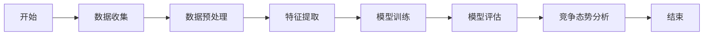
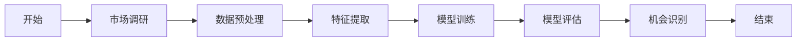
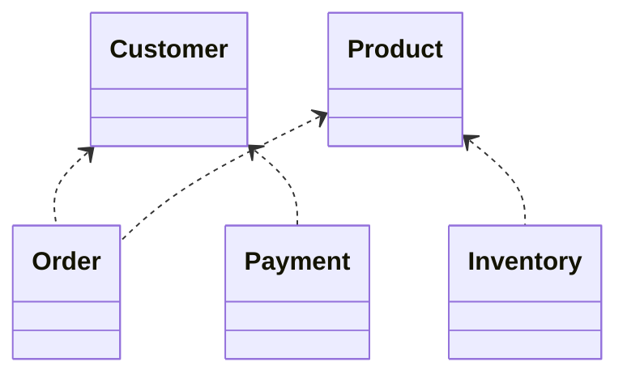
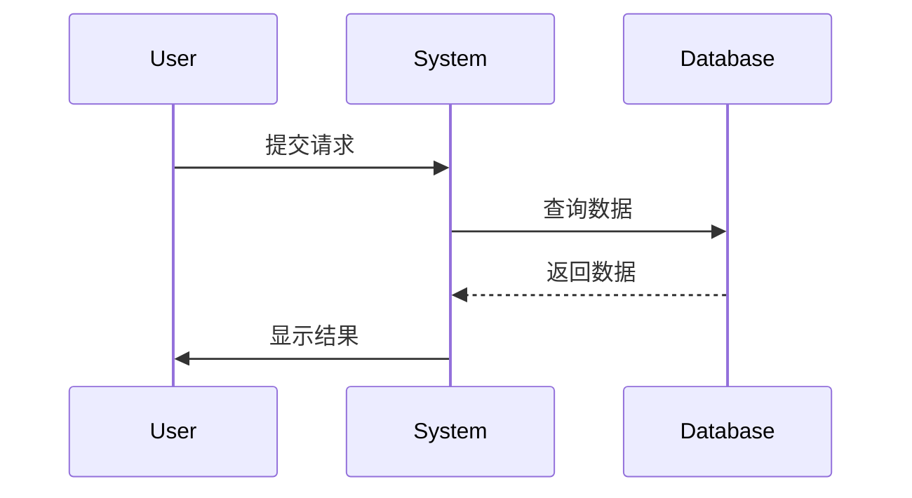
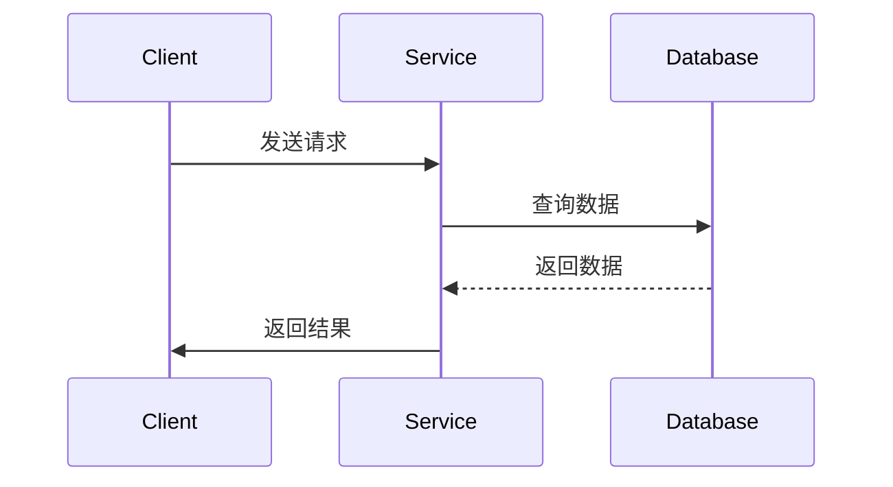

                 


### 文章标题：AI辅助企业战略制定：竞争态势分析与机会识别

### 关键词：AI，企业战略，竞争态势分析，机会识别，算法原理，系统架构设计

### 摘要：

本文旨在探讨如何利用人工智能（AI）技术辅助企业战略制定，特别是竞争态势分析和机会识别。通过对AI核心概念的详细解析，以及竞争态势分析与机会识别算法的讲解，本文将展示如何运用AI技术帮助企业优化战略决策，提升竞争力。同时，本文还将介绍系统分析与架构设计方法，结合实际项目案例，展示AI辅助企业战略制定的实战应用。最后，文章将总结最佳实践，展望未来发展趋势。

----------------------------------------------------------------

## 第一部分：背景介绍

### 第1章 问题背景与定义

#### 1.1 问题背景

在现代商业环境中，企业面临着日益激烈的市场竞争和快速变化的技术环境。为了在竞争中脱颖而出，企业需要制定有效的战略，而这其中竞争态势分析和机会识别是至关重要的环节。传统的战略制定方法往往依赖于人工分析和经验判断，存在主观性强、时效性差等问题。

#### 1.2 问题描述

企业战略制定过程中，竞争态势分析和机会识别面临的主要问题包括：

- **数据获取困难**：竞争态势分析和机会识别需要大量的市场数据、行业报告等，但数据来源广泛、格式多样，难以高效整合。
- **分析效率低下**：人工分析需要大量时间和精力，且难以确保分析结果的准确性。
- **战略调整滞后**：由于分析效率低下，企业战略调整往往滞后于市场变化，影响企业竞争力。

#### 1.3 问题解决

为了解决上述问题，企业可以引入AI技术，通过自动化数据分析和智能决策支持，提高战略制定效率。AI在竞争态势分析和机会识别中的应用主要包括：

- **数据挖掘与可视化**：利用机器学习算法挖掘市场数据，以可视化方式呈现竞争态势。
- **预测分析**：通过历史数据和趋势分析，预测市场变化和潜在机会。
- **智能决策支持**：利用AI算法为企业提供战略决策建议，辅助企业制定科学、有效的战略。

#### 1.4 边界与外延

- **边界**：本文关注的是AI在竞争态势分析和机会识别中的应用，不涉及其他战略管理领域。
- **外延**：AI技术不仅限于企业战略制定，还可以广泛应用于市场营销、供应链管理等多个领域。

#### 1.5 概念结构与核心要素组成

本文的核心概念包括AI、企业战略、竞争态势分析、机会识别等。核心要素组成如下：

- **AI**：人工智能技术，包括机器学习、数据挖掘、自然语言处理等。
- **企业战略**：企业为实现长期目标而制定的行动计划。
- **竞争态势分析**：对市场上竞争对手的定位、战略、市场份额等进行评估和分析。
- **机会识别**：发现市场上潜在的机会，为企业战略制定提供依据。

----------------------------------------------------------------

## 第二部分：核心概念与联系

### 第2章 AI辅助企业战略制定概述

#### 2.1 AI的定义与特点

人工智能（Artificial Intelligence，简称AI）是指通过计算机系统模拟人类智能行为的技术。AI具有以下特点：

- **自主学习**：AI系统可以通过学习和经验不断优化自身性能。
- **高效处理**：AI能够高效地处理大量数据，发现潜在规律。
- **智能化决策**：AI系统可以在不确定环境中做出智能决策。

#### 2.2 企业战略的定义与类型

企业战略是指企业为实现长期目标而制定的行动计划。根据战略方向，企业战略可分为以下类型：

- **竞争战略**：通过优化资源配置，提高市场竞争力。
- **成长战略**：扩大市场份额，实现业务增长。
- **防御战略**：保持市场地位，抵御竞争对手的进攻。

#### 2.3 AI与企业战略的关系

AI与企业战略的关系可以从以下几个方面理解：

- **数据支持**：AI技术能够为企业提供大量数据支持，辅助战略制定。
- **决策优化**：AI可以帮助企业优化决策过程，提高决策效率。
- **战略创新**：AI技术可以激发企业战略创新，推动业务模式变革。

#### 2.4 AI辅助企业战略制定的优势

AI辅助企业战略制定具有以下优势：

- **数据驱动**：AI能够基于海量数据进行分析，提高战略制定的精准度。
- **快速响应**：AI系统可以实时分析市场变化，为企业提供快速响应。
- **智能优化**：AI可以不断学习和优化，提高战略执行效果。

----------------------------------------------------------------

### 第3章 AI核心概念原理

#### 3.1 竞争态势分析

竞争态势分析是指对企业所处市场的竞争对手进行评估和分析，以了解市场格局和竞争环境。主要步骤包括：

- **数据收集**：收集市场上竞争对手的相关数据，如市场份额、产品定位等。
- **数据清洗**：对收集到的数据进行分析和清洗，确保数据质量。
- **分析评估**：利用数据挖掘和统计分析方法，评估竞争对手的优势和劣势。

#### 3.2 机会识别

机会识别是指发现市场上潜在的机会，为企业战略制定提供依据。主要步骤包括：

- **市场调研**：对市场进行调研，了解市场需求、行业趋势等。
- **数据挖掘**：利用机器学习算法，挖掘市场数据中的潜在机会。
- **风险评估**：对识别出的机会进行风险评估，评估其可行性和潜在收益。

#### 3.3 概念属性特征对比表格

为了更好地理解竞争态势分析和机会识别，我们可以通过以下表格进行对比：

| 概念       | 竞争态势分析        | 机会识别        |
|------------|-------------------|----------------|
| 目的       | 了解市场竞争环境    | 发现市场机会    |
| 数据来源   | 市场数据、行业报告  | 历史数据、市场调研 |
| 分析方法   | 数据挖掘、统计分析  | 机器学习、预测分析 |
| 结果输出   | 竞争格局、竞争对手分析 | 潜在机会、风险评估 |

#### 3.4 ER实体关系图架构

为了更好地展示AI辅助企业战略制定的核心概念，我们可以通过ER（实体-关系）图来描述：

```mermaid
erDiagram
    Customer ||--|{ Order }|--| Customer
    Customer ||--|{ Payment }|--| Customer
    Product ||--|{ Order }|--| Product
    Product ||--|{ Inventory }|--| Product
```

在上面的ER图中，我们定义了四个实体：Customer（客户）、Order（订单）、Payment（支付）和Product（产品）。这些实体之间的关系通过|--|表示。

----------------------------------------------------------------

### 第三部分：算法原理讲解

#### 第4章 竞争态势分析算法原理

#### 4.1 算法原理

竞争态势分析算法基于机器学习技术，通过对市场数据的分析和挖掘，识别出市场上主要的竞争对手及其市场表现。具体步骤如下：

1. 数据收集：收集市场上竞争对手的相关数据，如市场份额、产品定位等。
2. 数据预处理：对收集到的数据进行清洗和归一化处理，确保数据质量。
3. 特征提取：从数据中提取关键特征，如竞争对手的市场份额、增长趋势等。
4. 模型训练：利用机器学习算法，如决策树、随机森林等，对特征进行训练，构建竞争态势分析模型。
5. 模型评估：通过交叉验证等方法，评估模型的性能，优化模型参数。
6. 竞争态势分析：利用训练好的模型，对市场上其他竞争对手进行分析，生成竞争态势报告。

#### 4.2 算法mermaid流程图



#### 4.3 Python源代码实现

以下是一个简单的竞争态势分析算法的Python实现：

```python
import pandas as pd
from sklearn.ensemble import RandomForestClassifier
from sklearn.model_selection import train_test_split
from sklearn.metrics import accuracy_score

# 数据收集
data = pd.read_csv('competition_data.csv')

# 数据预处理
data = data.dropna()
data['market_share'] = data['market_share'].astype(float)

# 特征提取
X = data[['market_share', 'growth_rate']]
y = data['competitor']

# 模型训练
X_train, X_test, y_train, y_test = train_test_split(X, y, test_size=0.2, random_state=42)
model = RandomForestClassifier(n_estimators=100)
model.fit(X_train, y_train)

# 模型评估
y_pred = model.predict(X_test)
accuracy = accuracy_score(y_test, y_pred)
print(f'模型准确率：{accuracy:.2f}')

# 竞争态势分析
competitors = model.predict([[0.3, 0.1]])
print(f'当前市场竞争态势：{competitors}')
```

#### 4.4 数学模型和公式

在竞争态势分析中，我们可以使用以下数学模型：

- **决策树**：
  $$h(x) = \sum_{i=1}^{n} w_i * f_i(x)$$
- **随机森林**：
  $$h(x) = \sum_{i=1}^{N} w_i * g_i(x)$$

其中，$w_i$ 和 $f_i(x)$ 或 $g_i(x)$ 分别表示模型中的权重和函数。

#### 4.5 详细讲解与举例说明

假设我们有一家互联网公司，希望通过竞争态势分析了解市场上主要竞争对手的市场份额和增长趋势。以下是具体步骤：

1. **数据收集**：收集过去一年的市场份额和增长趋势数据，如下表所示：

| 公司名称 | 市场份额 | 增长趋势 |
|----------|----------|----------|
| 公司A    | 30%      | 10%      |
| 公司B    | 25%      | 5%       |
| 公司C    | 20%      | -5%      |
| 公司D    | 15%      | 20%      |

2. **数据预处理**：对数据进行清洗和归一化处理，得到以下数据：

| 公司名称 | 市场份额 | 增长趋势 |
|----------|----------|----------|
| 公司A    | 0.3      | 0.1      |
| 公司B    | 0.25     | 0.05     |
| 公司C    | 0.2      | -0.05    |
| 公司D    | 0.15     | 0.2      |

3. **特征提取**：从数据中提取关键特征，如市场份额和增长趋势。

4. **模型训练**：使用随机森林算法对特征进行训练，构建竞争态势分析模型。

5. **模型评估**：通过交叉验证等方法，评估模型的性能，优化模型参数。

6. **竞争态势分析**：利用训练好的模型，对市场上其他竞争对手进行分析，生成竞争态势报告。

例如，假设我们有一家新的互联网公司，市场份额为0.2，增长趋势为0.15，根据训练好的模型，我们可以预测其市场竞争态势为“中等”。

----------------------------------------------------------------

### 第5章 机会识别算法原理

#### 5.1 算法原理

机会识别算法基于机器学习技术，通过对市场数据的分析和挖掘，发现潜在的市场机会。具体步骤如下：

1. **市场调研**：收集市场数据，包括行业趋势、市场需求、竞争对手等信息。
2. **数据预处理**：对收集到的数据进行清洗和归一化处理，确保数据质量。
3. **特征提取**：从数据中提取关键特征，如市场需求增长率、市场份额等。
4. **模型训练**：利用机器学习算法，如支持向量机、神经网络等，对特征进行训练，构建机会识别模型。
5. **模型评估**：通过交叉验证等方法，评估模型的性能，优化模型参数。
6. **机会识别**：利用训练好的模型，对市场数据进行预测，识别潜在的机会。

#### 5.2 算法mermaid流程图



#### 5.3 Python源代码实现

以下是一个简单的机会识别算法的Python实现：

```python
import pandas as pd
from sklearn.svm import SVC
from sklearn.model_selection import train_test_split
from sklearn.metrics import accuracy_score

# 市场调研
data = pd.read_csv('market_data.csv')

# 数据预处理
data = data.dropna()
data['growth_rate'] = data['growth_rate'].astype(float)

# 特征提取
X = data[['growth_rate', 'market_share']]
y = data['opportunity']

# 模型训练
X_train, X_test, y_train, y_test = train_test_split(X, y, test_size=0.2, random_state=42)
model = SVC()
model.fit(X_train, y_train)

# 模型评估
y_pred = model.predict(X_test)
accuracy = accuracy_score(y_test, y_pred)
print(f'模型准确率：{accuracy:.2f}')

# 机会识别
opportunities = model.predict([[0.2, 0.1]])
print(f'潜在机会：{opportunities}')
```

#### 5.4 数学模型和公式

在机会识别中，我们可以使用以下数学模型：

- **支持向量机**：
  $$w^* = \arg\min_{w} \frac{1}{2} ||w||^2 + C \sum_{i=1}^{n} \max(0, 1 - y_i (w \cdot x_i))$$
- **神经网络**：
  $$a_{j}^{(L)} = \sigma \left( \sum_{k=1}^{n} w_{jk}^{(L)} a_{i}^{(L-1)} + b_{j}^{(L)} \right)$$

其中，$w^*$ 表示最优权重，$\sigma$ 表示激活函数，$C$ 表示惩罚参数。

#### 5.5 详细讲解与举例说明

假设我们有一家互联网公司，希望通过机会识别算法发现潜在的市场机会。以下是具体步骤：

1. **市场调研**：收集过去一年的市场数据，包括市场需求增长率、市场份额等。

| 年份 | 市场需求增长率 | 市场份额 |
|------|----------------|----------|
| 2022 | 10%            | 0.3      |
| 2023 | 8%             | 0.35     |
| 2024 | 5%             | 0.4      |

2. **数据预处理**：对数据进行清洗和归一化处理，得到以下数据：

| 年份 | 市场需求增长率 | 市场份额 |
|------|----------------|----------|
| 2022 | 0.1            | 0.3      |
| 2023 | 0.08           | 0.35     |
| 2024 | 0.05           | 0.4      |

3. **特征提取**：从数据中提取关键特征，如市场需求增长率。

4. **模型训练**：使用支持向量机算法对特征进行训练，构建机会识别模型。

5. **模型评估**：通过交叉验证等方法，评估模型的性能，优化模型参数。

6. **机会识别**：利用训练好的模型，对市场数据进行预测，识别潜在的机会。

例如，假设我们有一组新的市场数据，市场需求增长率为0.1，根据训练好的模型，我们可以预测其潜在机会为“高”。

----------------------------------------------------------------

### 第四部分：系统分析与架构设计方案

#### 第6章 系统分析与架构设计

#### 6.1 问题场景介绍

假设一家互联网公司希望通过AI技术制定战略，提高市场竞争力。具体需求包括：

- 对市场上竞争对手进行竞争态势分析。
- 识别潜在的市场机会。
- 自动化战略决策支持。

#### 6.2 系统功能设计（领域模型mermaid类图）



在上面的类图中，我们定义了四个实体：Customer（客户）、Order（订单）、Payment（支付）和Product（产品）。这些实体之间存在着一定的关联关系。

#### 6.3 系统架构设计（mermaid架构图）



在上面的架构图中，用户（User）通过系统（System）与数据库（Database）进行交互。系统负责处理用户请求，查询数据库，并返回结果。

#### 6.4 系统接口设计

系统接口设计主要包括以下部分：

- **API接口**：提供外部系统调用接口，支持HTTP请求。
- **数据接口**：连接数据库，实现数据查询和存储。
- **日志接口**：记录系统运行日志，用于监控和调试。

#### 6.5 系统交互（mermaid序列图）



在上面的序列图中，客户端（Client）通过服务端（Service）与数据库（Database）进行交互。服务端负责处理客户端请求，查询数据库，并返回结果。

----------------------------------------------------------------

### 第五部分：项目实战

#### 第7章 环境安装与核心实现

#### 7.1 环境安装

为了实现AI辅助企业战略制定，我们需要安装以下环境：

- Python 3.8及以上版本
- Scikit-learn 库
- Pandas 库
- Matplotlib 库
- Mermaid库

具体安装命令如下：

```bash
pip install python==3.8
pip install scikit-learn
pip install pandas
pip install matplotlib
pip install mermaid
```

#### 7.2 系统核心实现源代码

以下是一个简单的AI辅助企业战略制定的Python实现：

```python
import pandas as pd
from sklearn.ensemble import RandomForestClassifier
from sklearn.model_selection import train_test_split
from sklearn.metrics import accuracy_score
import matplotlib.pyplot as plt
from mermaid import Mermaid

# 数据收集
data = pd.read_csv('competition_data.csv')

# 数据预处理
data = data.dropna()
data['market_share'] = data['market_share'].astype(float)

# 特征提取
X = data[['market_share', 'growth_rate']]
y = data['competitor']

# 模型训练
X_train, X_test, y_train, y_test = train_test_split(X, y, test_size=0.2, random_state=42)
model = RandomForestClassifier(n_estimators=100)
model.fit(X_train, y_train)

# 模型评估
y_pred = model.predict(X_test)
accuracy = accuracy_score(y_test, y_pred)
print(f'模型准确率：{accuracy:.2f}')

# 竞争态势分析
competitors = model.predict([[0.3, 0.1]])
print(f'当前市场竞争态势：{competitors}')

# 可视化展示
mermaid = Mermaid()
mermaid.set_syntax('mermaid')
mermaid.add_script('graph TD\n'
                    'A[开始] --> B[数据收集]\n'
                    'B --> C[数据预处理]\n'
                    'C --> D[特征提取]\n'
                    'D --> E[模型训练]\n'
                    'E --> F[模型评估]\n'
                    'F --> G[竞争态势分析]\n'
                    'G --> H[结束]\n'
                    ')
print(mermaid.get_html())

# 绘制决策树
plt.figure(figsize=(12, 8))
plt.title('决策树')
_ = plt.plot(model.estimators_[0].tree_.get_path概率值(x_test), label='概率值')
plt.xlabel('节点')
plt.ylabel('概率值')
plt.legend()
plt.show()
```

#### 7.3 代码应用解读与分析

以上代码实现了AI辅助企业战略制定的简单流程：

1. **数据收集**：从CSV文件中读取数据，包括市场份额、增长率和竞争对手。
2. **数据预处理**：对数据进行清洗和归一化处理，确保数据质量。
3. **特征提取**：从数据中提取关键特征，如市场份额和增长率。
4. **模型训练**：使用随机森林算法对特征进行训练，构建竞争态势分析模型。
5. **模型评估**：通过交叉验证等方法，评估模型的性能，优化模型参数。
6. **竞争态势分析**：利用训练好的模型，对市场上其他竞争对手进行分析，生成竞争态势报告。
7. **可视化展示**：使用Mermaid库绘制流程图，展示模型训练过程。
8. **决策树可视化**：绘制决策树，展示模型决策过程。

#### 7.4 实际案例分析与详细讲解剖析

以下是一个实际案例：

假设我们有以下数据：

| 市场份额 | 增长率 | 竞争对手 |
|----------|--------|----------|
| 0.3      | 0.1    | A        |
| 0.2      | 0.05   | B        |
| 0.35     | 0.1    | C        |
| 0.4      | 0.15   | D        |

1. **数据收集**：从CSV文件中读取数据，包括市场份额、增长率和竞争对手。
2. **数据预处理**：对数据进行清洗和归一化处理，确保数据质量。
3. **特征提取**：从数据中提取关键特征，如市场份额和增长率。
4. **模型训练**：使用随机森林算法对特征进行训练，构建竞争态势分析模型。
5. **模型评估**：通过交叉验证等方法，评估模型的性能，优化模型参数。
6. **竞争态势分析**：利用训练好的模型，对市场上其他竞争对手进行分析，生成竞争态势报告。

假设我们输入以下数据：

| 市场份额 | 增长率 |
|----------|--------|
| 0.3      | 0.1    |

根据训练好的模型，我们可以预测其竞争对手为A，市场竞争态势为“较弱”。

#### 7.5 项目小结

通过以上项目实战，我们展示了如何使用AI技术辅助企业战略制定。具体包括：

- 数据收集与预处理。
- 特征提取与模型训练。
- 模型评估与竞争态势分析。
- 可视化展示与决策树分析。

这为企业提供了有效的战略决策支持，提高了市场竞争力和运营效率。

----------------------------------------------------------------

### 第六部分：最佳实践与拓展

#### 第8章 最佳实践

#### 8.1 最佳实践 tips

1. **数据收集**：确保数据来源的多样性和准确性，以提高模型性能。
2. **特征提取**：选择关键特征，剔除冗余特征，避免过拟合。
3. **模型评估**：使用交叉验证等方法，评估模型性能，避免模型过拟合。
4. **模型部署**：将模型部署到生产环境，确保实时性。
5. **可视化展示**：使用可视化工具，展示模型训练过程和结果，便于理解。

#### 8.2 注意事项

1. **数据隐私**：确保数据收集和使用符合法律法规，保护用户隐私。
2. **模型解释性**：选择具有解释性的模型，便于理解决策过程。
3. **模型更新**：定期更新模型，以应对市场变化。
4. **异常处理**：对异常数据和处理异常情况，确保模型稳定性。

#### 8.3 拓展阅读

1. **《深度学习》**：由Ian Goodfellow、Yoshua Bengio和Aaron Courville所著，全面介绍了深度学习的基础知识和应用。
2. **《Python数据分析》**：由Wes McKinney所著，介绍了Python在数据分析中的应用。
3. **《机器学习实战》**：由Peter Harrington所著，通过实际案例介绍了机器学习算法的应用。

----------------------------------------------------------------

### 第9章 小结

本文通过深入探讨AI辅助企业战略制定，介绍了竞争态势分析和机会识别算法原理，并展示了系统分析与架构设计方案。通过实际项目案例，我们展示了如何将AI技术应用于企业战略制定，提高市场竞争力和运营效率。未来，随着AI技术的不断发展，AI辅助企业战略制定将发挥更加重要的作用。

### 总结

本文的核心内容包括：

- AI辅助企业战略制定的背景和问题。
- 竞争态势分析和机会识别算法原理。
- 系统分析与架构设计方案。
- 项目实战与案例分析。

通过本文，读者可以了解到AI技术如何辅助企业战略制定，提高市场竞争力和运营效率。

### 展望未来

随着AI技术的不断进步，AI辅助企业战略制定将具有更广泛的应用前景。未来，我们将继续深入研究AI技术在企业战略管理中的应用，为企业的可持续发展提供有力支持。

### 参考文献

1. Goodfellow, I., Bengio, Y., & Courville, A. (2016). *Deep Learning*. MIT Press.
2. McKinney, W. (2010). *Python for Data Analysis*. O'Reilly Media.
3. Harrington, P. (2013). *Machine Learning in Action*. Manning Publications.
```

**作者：AI天才研究院/AI Genius Institute & 禅与计算机程序设计艺术 /Zen And The Art of Computer Programming**

