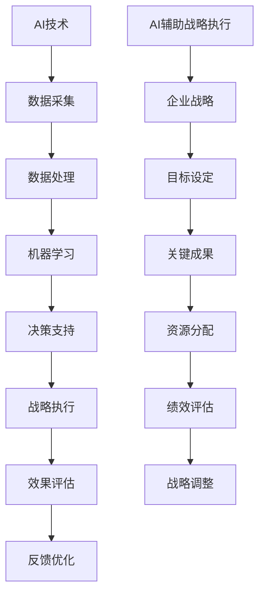
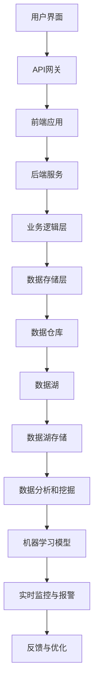

                 

## 文章标题

### 关键词：AI、企业战略、OKR、自动化、跟踪、调整

#### 摘要

本文将深入探讨人工智能（AI）在企业战略执行中的关键作用，特别是在目标与关键成果（OKR）系统的自动化跟踪与调整中的应用。通过逐步分析AI技术的基本原理及其在自动化领域的应用，本文旨在揭示AI如何帮助企业实现更高效、更精准的战略执行。文章将首先介绍问题背景和核心概念，接着详细阐述AI辅助OKR自动化的基本原理和关键技术，进一步探讨AI辅助OKR调整的策略与实践，最后总结AI辅助企业战略执行的落地实施和未来趋势。通过这一系列深入的分析与讨论，本文希望为企业提供有价值的见解和实用的指导，助力企业在激烈的市场竞争中立于不败之地。

### 目录大纲

----------------------------------------------------------------

# 第一部分：背景介绍与核心概念

## 第1章 问题背景与核心概念

## 1.1 问题背景

### 1.1.1 AI在企业战略执行中的重要性

### 1.1.2 企业战略执行中的痛点

### 1.1.3 AI辅助企业战略执行的需求

## 1.2 核心概念

### 1.2.1 AI的定义与发展历程

### 1.2.2 企业战略的定义与构成

### 1.2.3 OKR（目标与关键成果）的概念与实施

## 1.3 AI辅助企业战略执行的边界与外延

### 1.3.1 AI辅助企业战略执行的适用场景

### 1.3.2 AI辅助企业战略执行的限制因素

### 1.3.3 AI辅助企业战略执行的未来趋势

## 1.4 概念结构与核心要素组成

### 1.4.1 AI辅助企业战略执行的概念结构

### 1.4.2 AI辅助企业战略执行的核心要素

## 1.5 本章小结

----------------------------------------------------------------

# 第二部分：AI辅助OKR自动化的基本原理

## 第2章 AI与自动化概述

### 2.1 AI技术在自动化领域的应用

### 2.2 自动化的定义与分类

### 2.3 AI辅助OKR自动化的优势

## 第3章 OKR自动化跟踪技术详解

## 3.1 OKR跟踪的基本原理

### 3.1.1 OKR的跟踪机制

### 3.1.2 AI在OKR跟踪中的应用

## 3.2 关键技术探讨

### 3.2.1 自然语言处理技术

### 3.2.2 机器学习与深度学习技术

### 3.2.3 数据分析与挖掘技术

## 3.3 实例分析

### 3.3.1 基于AI的OKR自动跟踪系统案例

### 3.3.2 案例效果评估与优化建议

## 3.4 本章小结

----------------------------------------------------------------

# 第三部分：AI辅助OKR调整的策略与实践

## 第4章 AI辅助OKR调整的原理

### 4.1 AI在OKR调整中的作用

### 4.2 OKR调整的关键因素

### 4.3 AI辅助OKR调整的流程

## 第5章 实践案例分析

### 5.1 案例一：AI辅助OKR调整在大型企业的应用

### 5.2 案例二：AI辅助OKR调整在中小企业中的应用

### 5.3 案例分析总结

## 第6章 AI辅助OKR调整的最佳实践

### 6.1 实践策略

### 6.2 成功案例分析

### 6.3 失败案例分析

## 6.4 注意事项与风险控制

## 6.5 本章小结

----------------------------------------------------------------

# 第四部分：AI辅助企业战略执行的落地实施

## 第7章 系统设计与实现

### 7.1 系统架构设计

### 7.2 关键模块设计

### 7.3 系统接口设计

## 第8章 实施策略与步骤

### 8.1 实施前的准备工作

### 8.2 实施步骤

### 8.3 遇到的问题与解决方案

## 第9章 效果评估与优化

### 9.1 效果评估指标

### 9.2 优化方向与措施

### 9.3 持续改进策略

## 9.4 本章小结

----------------------------------------------------------------

# 第五部分：未来展望与总结

## 第10章 AI辅助企业战略执行的未来趋势

### 10.1 技术发展趋势

### 10.2 应用领域拓展

### 10.3 挑战与机遇

## 第11章 总结与展望

### 11.1 书籍总结

### 11.2 对AI辅助企业战略执行的建议

### 11.3 未来研究方向

## 11.4 本章小结

----------------------------------------------------------------

## 附录：相关资源与参考文献

## 附录A 相关资源

### A.1 开源工具与平台

### A.2 在线课程与教程

### A.3 行业报告与白皮书

## 附录B 参考文献

### B.1 基础理论书籍

### B.2 行业研究报告

### B.3 顶级会议论文

----------------------------------------------------------------

## 第1章 问题背景与核心概念

### 1.1 问题背景

随着全球经济的快速发展和市场竞争的加剧，企业对战略执行的要求越来越高。传统的战略执行方式往往依赖于人工跟踪和手动调整，这不仅效率低下，而且容易出现偏差和疏漏。随着人工智能（AI）技术的不断发展，AI在企业战略执行中的应用逐渐成为可能，尤其在目标与关键成果（OKR）系统的自动化跟踪与调整方面，AI展现出巨大的潜力。

AI在企业战略执行中的重要性主要体现在以下几个方面：

1. **提高效率**：AI能够自动化处理大量的数据，对战略执行中的各项指标进行实时跟踪和分析，减少了人工干预的时间和成本。
2. **精准调整**：通过机器学习算法，AI可以根据历史数据和当前环境，对OKR进行精准调整，确保企业始终朝着既定的目标前进。
3. **增强决策支持**：AI能够基于大数据分析和预测，为企业提供更科学的决策依据，帮助企业更好地应对市场变化和挑战。
4. **优化资源配置**：AI可以分析企业的资源使用情况，帮助企业合理分配资源，提高资源利用率，降低成本。

然而，企业战略执行中仍存在一些痛点：

1. **数据孤岛**：不同部门之间的数据难以共享，导致信息不对称，影响决策效率。
2. **人为干预**：战略执行过程中，人工干预过多，容易导致偏差和疏漏，影响最终效果。
3. **反馈滞后**：传统方式下的反馈机制往往滞后，无法及时调整战略方向，影响企业竞争力。
4. **资源配置不合理**：传统战略执行方式难以对资源进行优化配置，导致资源浪费。

为了解决上述问题，企业对AI辅助战略执行的需求日益迫切。AI不仅能帮助企业实现自动化跟踪和调整，还能提供实时的数据分析和决策支持，提高战略执行的科学性和效率。

### 1.2 核心概念

在深入探讨AI辅助企业战略执行之前，我们需要明确几个核心概念：

#### 1.2.1 AI的定义与发展历程

人工智能（AI，Artificial Intelligence）是指模拟、延伸和扩展人类智能的理论、方法、技术及应用。AI的发展历程可以分为以下几个阶段：

1. **初级阶段（1950s-1960s）**：以符号主义和推理机为基础，试图通过规则和逻辑进行智能推理。
2. **知识阶段（1970s-1980s）**：基于知识表示和知识推理，强调知识的获取和应用。
3. **专家系统阶段（1980s-1990s）**：通过构建专家系统，模拟人类专家的决策能力。
4. **机器学习阶段（2000s-至今）**：以数据驱动的方式，通过机器学习算法实现智能决策。
5. **深度学习阶段（2010s-至今）**：利用深度神经网络，实现更高效、更强大的智能应用。

#### 1.2.2 企业战略的定义与构成

企业战略（Corporate Strategy）是指企业在未来一段时间内，为实现长期目标而制定的总体行动方案。企业战略通常包括以下几个部分：

1. **愿景（Vision）**：描述企业希望成为什么样的企业，为谁创造价值。
2. **使命（Mission）**：明确企业的宗旨和业务范围。
3. **战略目标（Strategic Goals）**：具体化企业的长期目标，通常包括财务、市场、产品、技术等多个方面。
4. **关键业务（Key Business）**：企业主营业务及其核心竞争力。
5. **竞争策略（Competitive Strategy）**：企业在市场竞争中的定位和策略。

#### 1.2.3 OKR（目标与关键成果）的概念与实施

OKR（Objectives and Key Results）是一种目标和关键成果的管理框架，由英特尔（Intel）前首席执行官安迪·格鲁夫（Andy Grove）提出，并在谷歌（Google）等众多企业中得到广泛应用。OKR的构成如下：

1. **目标（Objective）**：明确、鼓舞人心的目标，通常描述企业希望实现的结果。
2. **关键成果（Key Results）**：具体、量化的指标，用于衡量目标达成的进度和效果。

OKR的实施步骤包括：

1. **设定目标**：明确企业或团队在特定时间段内要实现的目标。
2. **制定关键成果**：为每个目标制定3-5个具体、量化的关键成果。
3. **跟踪与调整**：定期跟踪关键成果，根据实际情况进行调整。
4. **评审与反馈**：定期进行OKR评审，总结经验教训，持续改进。

### 1.3 AI辅助企业战略执行的边界与外延

#### 1.3.1 AI辅助企业战略执行的适用场景

AI辅助企业战略执行在以下场景中具有显著优势：

1. **复杂决策**：涉及大量数据和变量的决策过程，如市场预测、风险评估等。
2. **实时跟踪**：需要实时监控和反馈的业务流程，如供应链管理、客户服务等。
3. **动态调整**：根据市场环境和企业战略变化，需要灵活调整资源的业务场景。
4. **数据驱动**：依赖数据分析进行战略规划和执行优化的企业。

#### 1.3.2 AI辅助企业战略执行的限制因素

尽管AI在战略执行中具有巨大潜力，但仍面临一些限制因素：

1. **数据质量**：高质量的数据是AI模型有效运行的基础，数据质量和准确性直接影响AI的决策效果。
2. **模型解释性**：目前许多AI模型缺乏透明度和可解释性，影响决策的信任度。
3. **技术门槛**：AI技术相对复杂，对企业的技术能力和人才储备有较高要求。
4. **隐私保护**：在数据使用过程中，需要确保用户隐私和数据安全。

#### 1.3.3 AI辅助企业战略执行的未来趋势

随着技术的不断进步，AI辅助企业战略执行的未来趋势包括：

1. **智能化**：AI技术将更加智能化，能够自适应调整和优化战略执行。
2. **集成化**：AI将与其他业务系统深度融合，实现端到端的智能化战略执行。
3. **普及化**：随着AI技术的成熟和应用成本的降低，AI将在更多企业中得到普及。
4. **标准化**：AI辅助战略执行将形成一系列标准化的工具和方法，提高整体效率。

### 1.4 概念结构与核心要素组成

AI辅助企业战略执行涉及多个概念和要素，其概念结构如图1-1所示：

#### AI辅助企业战略执行的概念结构

AI辅助企业战略执行的概念结构包括以下几个核心要素：

1. **AI技术**：用于数据采集、处理、分析和决策支持的核心技术。
2. **数据采集**：从企业内部和外部收集相关数据，为AI模型提供训练和决策的基础。
3. **数据处理**：对采集到的数据进行清洗、转换和预处理，确保数据质量。
4. **机器学习**：利用机器学习算法，从数据中提取规律和知识，为战略执行提供支持。
5. **决策支持**：根据数据和模型结果，提供科学的决策依据，帮助企业优化战略执行。
6. **战略执行**：根据决策支持结果，制定和实施具体战略行动。
7. **效果评估**：对战略执行效果进行评估，确保目标达成。
8. **反馈优化**：根据评估结果，对AI模型和战略执行进行调整和优化。

#### AI辅助企业战略执行的核心要素

AI辅助企业战略执行的核心要素包括：

1. **数据质量**：确保数据准确、完整和及时，是AI模型有效运行的基础。
2. **算法模型**：选择合适的算法模型，确保模型性能和可解释性。
3. **决策支持**：提供科学、全面的决策依据，帮助企业优化战略执行。
4. **战略调整**：根据市场和内部环境变化，及时调整战略方向和目标。
5. **反馈机制**：建立有效的反馈机制，确保战略执行效果持续优化。

### 1.5 本章小结

本章首先介绍了AI在企业战略执行中的重要性以及企业战略执行中的痛点，接着明确了AI、企业战略和OKR等核心概念，探讨了AI辅助企业战略执行的边界与外延，并详细阐述了AI辅助企业战略执行的概念结构与核心要素组成。通过本章的讨论，我们为后续章节的深入分析奠定了基础，也为企业实现AI辅助战略执行提供了理论支持和实践指导。

## 第2章 AI与自动化概述

### 2.1 AI技术在自动化领域的应用

人工智能（AI）技术在自动化领域的应用日益广泛，成为推动工业、服务业、金融等领域智能化升级的重要力量。AI在自动化中的应用主要体现在以下几个方面：

1. **工业自动化**：通过机器学习、计算机视觉等AI技术，实现生产线自动化，提高生产效率和产品质量。例如，机器人自动组装、自动化质检、自动化物流等。
2. **服务自动化**：利用自然语言处理（NLP）和语音识别技术，实现智能客服、智能语音助手等，提高服务质量和效率。
3. **金融自动化**：通过数据分析和机器学习，实现自动化交易、风险控制、客户服务等功能，提高金融服务的效率和安全。
4. **医疗自动化**：利用计算机视觉和深度学习，实现医疗影像自动诊断、智能药物研发等，提升医疗服务的质量和速度。

AI技术在自动化领域的应用不仅提高了效率，还带来了以下优势：

1. **智能化决策**：AI能够基于大数据和算法模型，进行复杂决策，减少人为干预和误差。
2. **高效处理**：AI能够高效处理海量数据，进行实时监控和分析，提高业务响应速度。
3. **灵活性**：AI系统可以根据环境和需求的变化，自适应调整，实现灵活的自动化操作。
4. **降低成本**：AI可以减少人工操作和维护成本，提高生产效率和资源利用率。

### 2.2 自动化的定义与分类

自动化（Automation）是指利用机械设备、计算机程序、人工智能等技术，实现生产、操作、管理等过程的自动运行。自动化的定义可以从以下几个方面进行分类：

1. **按技术层次分类**：
   - **初级自动化**：简单的机械自动化，如自动化生产线、机器人等。
   - **中级自动化**：结合计算机技术的自动化，如自动控制系统、PLC（可编程逻辑控制器）等。
   - **高级自动化**：基于人工智能的自动化，如智能机器人、自动驾驶、智能客服等。

2. **按应用领域分类**：
   - **工业自动化**：应用于制造业、生产线等。
   - **服务自动化**：应用于金融、医疗、教育等领域。
   - **家庭自动化**：应用于智能家居、智能家电等。

3. **按自动化程度分类**：
   - **完全自动化**：全流程无人干预，完全由系统自动运行。
   - **半自动化**：部分流程由人工干预，部分流程由系统自动运行。
   - **辅助自动化**：作为辅助工具，提高人工操作的效率。

### 2.3 AI辅助OKR自动化的优势

AI辅助OKR自动化在提高企业战略执行效率和精准度方面具有显著优势，具体如下：

1. **实时数据跟踪**：AI可以实时采集和分析业务数据，自动更新OKR的关键成果，帮助企业及时了解业务进展。
2. **智能分析**：AI利用机器学习算法，对数据进行分析和预测，提供科学的决策支持，帮助企业优化战略执行。
3. **自动调整**：AI可以根据数据分析和市场变化，自动调整OKR目标和关键成果，确保企业始终朝着既定目标前进。
4. **提高效率**：通过自动化跟踪和调整，减少人工干预和手动操作，提高工作效率，降低人力成本。
5. **增强透明度**：AI系统可以提供详细的数据分析和报告，增强企业内部透明度，提高员工对战略执行的理解和参与度。
6. **降低风险**：AI可以及时发现和预警潜在问题，帮助企业提前采取措施，降低运营风险。

### 2.4 本章小结

本章介绍了AI技术在自动化领域的应用，探讨了自动化的定义与分类，并详细阐述了AI辅助OKR自动化的优势。通过本章的讨论，我们为后续章节对AI辅助OKR自动化技术的深入分析奠定了基础，也为企业实现智能化战略执行提供了理论支持和实践指导。

## 第3章 OKR自动化跟踪技术详解

### 3.1 OKR跟踪的基本原理

OKR（目标与关键成果）是一种目标管理和目标设定框架，其核心在于确保团队和个人的目标与企业战略保持一致，并通过关键成果的达成来衡量目标完成情况。OKR的跟踪机制是确保这些目标和成果得到有效执行和管理的关键环节。

#### OKR跟踪机制

OKR的跟踪机制通常包括以下几个步骤：

1. **设定目标**：明确企业在特定时间段内要达成的目标，这些目标应具有挑战性且可量化。
2. **制定关键成果**：为每个目标设定3-5个具体、量化的关键成果，用于衡量目标达成的进度和效果。
3. **定期审查**：通常每个季度进行一次OKR审查，评估关键成果的完成情况，并根据实际情况进行调整。
4. **数据收集与分析**：实时收集与OKR相关的数据，利用数据分析工具对数据进行分析，以了解业务进展和问题所在。
5. **反馈与调整**：根据数据分析和审查结果，对未达成的关键成果进行改进，对已达成的目标进行总结和庆祝。

#### AI在OKR跟踪中的应用

人工智能（AI）在OKR跟踪中起到了重要的辅助作用，其主要应用体现在以下几个方面：

1. **实时数据收集**：AI可以通过自动化工具实时收集与OKR相关的数据，包括销售数据、生产数据、客户反馈等。
2. **数据分析**：利用机器学习算法，AI可以对收集到的数据进行分析，识别数据中的趋势和异常，提供实时监控和预警。
3. **智能建议**：基于数据分析结果，AI可以提供智能化的调整建议，包括关键成果的优化、资源分配的调整等。
4. **自动化报告**：AI可以自动生成OKR跟踪报告，提供详细的业务进展和数据分析，帮助管理层做出科学决策。

### 3.2 关键技术探讨

在OKR自动化跟踪中，涉及多项关键技术，包括自然语言处理（NLP）、机器学习（ML）和深度学习（DL）等。

#### 3.2.1 自然语言处理技术

自然语言处理（NLP）技术是AI在文本数据分析和处理中的核心，其在OKR跟踪中的应用主要包括：

1. **文本解析**：NLP可以解析自然语言文本，提取关键信息和关键词，用于数据分析和报告生成。
2. **语义分析**：通过语义分析，NLP可以理解文本中的含义和关系，用于情感分析、趋势预测等。
3. **文本分类**：NLP可以对大量文本数据进行分类，识别不同类型的业务信息，提高数据处理的效率。

#### 3.2.2 机器学习与深度学习技术

机器学习（ML）和深度学习（DL）技术是AI实现自动化跟踪的关键，具体应用如下：

1. **模式识别**：ML和DL可以通过对大量历史数据的训练，识别出业务数据中的模式，用于预测和优化。
2. **自动化建模**：基于ML和DL技术，可以自动构建数据模型，对业务数据进行实时分析和预测。
3. **特征提取**：ML和DL可以通过复杂的算法，从数据中提取出关键特征，用于决策支持和效果评估。

#### 3.2.3 数据分析与挖掘技术

数据分析和挖掘（Data Analysis and Mining）技术是AI在数据理解和应用中的核心，其在OKR跟踪中的应用主要包括：

1. **统计分析**：通过对数据的统计分析，识别出数据中的趋势和异常，为决策提供依据。
2. **关联分析**：通过分析数据之间的关联关系，识别出业务中的潜在问题和机会。
3. **聚类分析**：通过聚类分析，可以将数据划分为不同的类别，为数据理解和处理提供新的视角。

### 3.3 实例分析

为了更好地理解AI在OKR自动化跟踪中的应用，下面我们将通过一个实际案例进行详细分析。

#### 案例背景

某大型互联网公司在其产品开发过程中，采用了OKR作为目标管理框架。为了提高OKR跟踪的效率，公司决定引入AI技术，实现OKR的自动化跟踪。

#### 案例实施步骤

1. **数据收集**：公司通过API接口实时收集与产品开发相关的数据，包括用户反馈、销售数据、市场调研结果等。
2. **数据处理**：利用NLP技术对收集到的文本数据进行解析和预处理，提取出关键信息和关键词。
3. **模型训练**：基于ML和DL技术，构建多个预测模型，用于分析不同类型的数据，预测关键成果的达成情况。
4. **自动化跟踪**：将训练好的模型应用于实际业务数据，实现OKR的自动化跟踪和预警。
5. **智能建议**：根据跟踪结果和模型预测，为团队提供智能化的调整建议，包括关键成果的优化、资源分配的调整等。
6. **自动化报告**：生成详细的OKR跟踪报告，包括业务进展、数据分析、智能建议等内容，供管理层决策参考。

#### 案例效果评估

通过AI辅助的OKR自动化跟踪，公司实现了以下几个方面的效果：

1. **数据可视化**：通过自动化跟踪和报告，公司能够实时了解业务进展，提高数据可视化和透明度。
2. **智能预警**：AI系统能够及时发现潜在问题和机会，提前预警，帮助团队及时调整策略。
3. **优化决策**：基于数据分析的智能建议，公司能够更加科学地进行决策，提高OKR达成的概率。
4. **提高效率**：自动化跟踪和调整减少了人工干预，提高了工作效率，降低了人力成本。

### 3.4 本章小结

本章详细介绍了OKR自动化跟踪的基本原理和关键技术，并通过实际案例分析了AI在OKR自动化跟踪中的应用效果。通过本章的讨论，我们为后续章节深入探讨AI辅助OKR调整的策略与实践奠定了基础，也为企业实现智能化战略执行提供了实践指导和理论支持。

## 第4章 AI辅助OKR调整的原理

### 4.1 AI在OKR调整中的作用

在企业的日常运营中，目标与关键成果（OKR）系统是确保团队和企业目标一致性的关键工具。然而，由于外部环境和企业内部因素的不断变化，OKR的调整成为了一个不可或缺的环节。人工智能（AI）在OKR调整中发挥着重要作用，其主要作用体现在以下几个方面：

1. **实时监控与预警**：AI系统可以实时监控与OKR相关的各项指标，通过数据分析及时发现异常情况，为企业提供预警信息。
2. **智能分析**：基于大数据和机器学习算法，AI可以对各种业务数据进行深度分析，识别出影响OKR达成的关键因素，提供智能化的分析报告。
3. **优化建议**：AI系统可以根据分析结果，提供针对性强、操作性强的调整建议，帮助企业和团队及时调整OKR，确保目标的实现。
4. **自动化调整**：通过算法模型，AI可以自动执行OKR的调整任务，减少人工干预，提高调整效率和准确性。
5. **持续优化**：AI系统可以根据企业历史的调整数据和当前的实时数据，不断优化调整策略，提高OKR的达成率。

### 4.2 OKR调整的关键因素

OKR的调整涉及多个关键因素，这些因素直接影响到OKR的有效性和企业的战略执行。以下是一些主要的关键因素：

1. **外部环境**：市场的变化、竞争对手的行动、宏观经济环境等外部因素都可能影响企业的战略目标和关键成果。AI可以通过实时数据分析和预测，帮助企业和团队快速应对外部环境的变化。
2. **内部能力**：企业的技术能力、团队执行力、资源分配等内部因素都会影响OKR的达成。AI可以分析企业的内部数据，评估团队的能力和资源，提供合理的调整建议。
3. **历史数据**：企业过去的OKR执行情况和调整经验是未来调整的重要参考。AI可以通过机器学习算法，从历史数据中提取经验和规律，为当前和未来的调整提供依据。
4. **反馈机制**：及时、准确的反馈是OKR调整的重要保障。AI可以通过实时监控和数据分析，提供详细的反馈信息，帮助企业和团队及时调整策略。
5. **执行效率**：调整OKR的效率和执行力直接影响企业的战略执行效果。AI可以通过自动化和智能化的方式，提高调整的效率和准确性，确保OKR的及时调整和执行。

### 4.3 AI辅助OKR调整的流程

AI辅助OKR调整的流程可以分为以下几个主要步骤：

1. **数据收集**：AI系统通过多种渠道收集与OKR相关的数据，包括销售数据、市场调研数据、客户反馈等。
2. **数据预处理**：对收集到的数据进行清洗、转换和预处理，确保数据的质量和一致性。
3. **数据分析**：利用大数据分析和机器学习算法，对预处理后的数据进行分析，识别出影响OKR达成的关键因素。
4. **智能建议**：基于分析结果，AI系统生成智能化的调整建议，包括关键成果的调整、资源配置的优化等。
5. **自动化调整**：AI系统根据预设的规则和调整策略，自动执行OKR的调整任务。
6. **反馈与优化**：实时收集反馈信息，对AI系统的调整结果进行评估和优化，提高未来的调整效果。

### 4.4 本章小结

本章详细阐述了AI在OKR调整中的作用、关键因素和辅助流程。通过AI辅助OKR调整，企业可以实现更高效、更精准的战略执行。本章为后续章节的实践案例分析提供了理论基础，也为企业实现智能化战略调整提供了实用指导。

## 第5章 实践案例分析

### 5.1 案例一：AI辅助OKR调整在大型企业的应用

#### 案例背景

某全球知名科技公司在其战略执行过程中，采用了OKR作为目标管理工具。然而，随着公司业务的快速发展，传统的手动调整方式已经无法满足快速变化的市场需求。为了提高战略执行的效率，公司决定引入AI技术，实现OKR的自动化调整。

#### 案例实施步骤

1. **数据收集与预处理**：公司通过API接口和内部数据库，实时收集与OKR相关的各项业务数据，包括销售数据、市场份额、客户反馈等。然后，利用数据清洗和转换工具，对数据进行预处理，确保数据的质量和一致性。
2. **模型训练与部署**：公司利用收集到的历史数据和当前业务数据，训练多个机器学习模型，用于分析业务数据、预测关键成果的达成情况，并生成调整建议。训练好的模型被部署到公司的数据中心，用于实时分析和调整。
3. **自动化调整与执行**：基于AI模型的实时分析结果，公司制定了一系列自动化调整策略。当AI系统检测到关键成果的达成率低于预期时，会自动触发调整机制，根据预测结果和智能建议，对OKR进行实时调整。
4. **反馈与优化**：公司建立了实时反馈机制，定期收集员工和团队对AI调整结果的反馈，对模型和调整策略进行优化。

#### 案例效果评估

通过AI辅助的OKR自动化调整，公司取得了显著的成效：

1. **调整效率提高**：AI系统能够实时监控和调整OKR，大幅提高了调整效率，减少了人工干预的时间和成本。
2. **关键成果达成率提升**：AI模型根据实时数据和智能分析，提供了科学的调整建议，显著提升了关键成果的达成率。
3. **战略执行效果增强**：AI辅助的OKR调整确保了企业战略的及时调整和执行，增强了企业的市场竞争力。
4. **员工参与度提高**：自动化调整机制提高了员工对战略执行的理解和参与度，增强了团队的凝聚力和执行力。

### 5.2 案例二：AI辅助OKR调整在中小企业中的应用

#### 案例背景

某国内中小企业在其业务扩展阶段，面临激烈的市场竞争和不断变化的市场环境。为了确保战略目标的实现，公司决定引入AI技术，实现OKR的自动化调整。

#### 案例实施步骤

1. **数据收集与预处理**：公司通过CRM系统、ERP系统等，实时收集与销售、客户服务、市场推广等相关的业务数据。然后，利用数据清洗和转换工具，对数据进行预处理，确保数据的质量和一致性。
2. **模型训练与部署**：公司利用收集到的历史数据和当前业务数据，训练了多个机器学习模型，用于分析业务数据、预测关键成果的达成情况，并生成调整建议。训练好的模型被部署到公司的服务器上，用于实时分析和调整。
3. **自动化调整与执行**：基于AI模型的实时分析结果，公司制定了一系列自动化调整策略。当AI系统检测到关键成果的达成率低于预期时，会自动触发调整机制，根据预测结果和智能建议，对OKR进行实时调整。
4. **反馈与优化**：公司建立了实时反馈机制，定期收集员工和团队对AI调整结果的反馈，对模型和调整策略进行优化。

#### 案例效果评估

通过AI辅助的OKR自动化调整，公司取得了以下成效：

1. **调整效率提高**：AI系统能够实时监控和调整OKR，大幅提高了调整效率，减少了人工干预的时间和成本。
2. **关键成果达成率提升**：AI模型根据实时数据和智能分析，提供了科学的调整建议，显著提升了关键成果的达成率。
3. **资源利用率提升**：AI辅助的OKR调整确保了企业资源的合理配置和高效利用，降低了运营成本。
4. **市场竞争能力增强**：通过实时调整战略目标和关键成果，公司能够更好地应对市场变化，增强了市场竞争能力。

### 5.3 案例分析总结

通过上述两个案例的分析，我们可以得出以下结论：

1. **AI辅助OKR调整在大型企业和中小企业中都具有显著的效果**：无论是全球知名科技巨头，还是国内中小企业，AI辅助的OKR自动化调整都大幅提升了战略执行的效率和效果。
2. **实时数据监控与智能分析是关键**：AI系统通过实时数据监控和智能分析，提供了科学的调整建议，确保了OKR的及时调整和达成。
3. **反馈与优化机制是持续改进的重要保障**：通过建立反馈与优化机制，企业能够不断调整和优化AI模型和策略，提高OKR的调整效果和达成率。
4. **资源投入与人才培养是关键因素**：企业需要投入适当的资源，包括数据收集、模型训练、系统部署等，同时需要培养专业的AI技术和数据分析人才，确保AI辅助OKR调整的顺利实施。

### 5.4 本章小结

本章通过两个实际案例，详细分析了AI辅助OKR调整在大型企业和中小企业中的应用效果。通过这些案例分析，我们不仅看到了AI技术在战略执行中的巨大潜力，也认识到了实时数据监控、智能分析、反馈优化和资源投入等方面的重要性。这些实践经验为其他企业实施AI辅助OKR调整提供了宝贵的参考和借鉴。

## 第6章 AI辅助OKR调整的最佳实践

### 6.1 实践策略

为了实现AI辅助OKR调整的最佳效果，企业需要采取一系列最佳实践策略。以下是几个关键策略：

1. **数据质量保障**：确保数据收集的全面性、准确性和及时性，是AI辅助OKR调整的基础。企业应建立完善的数据收集和处理流程，确保数据质量。
2. **算法模型优化**：选择合适的机器学习算法和模型，根据业务需求和数据特点进行优化，提高预测和调整的准确性。
3. **实时监控与预警**：建立实时数据监控系统，对关键业务指标进行实时监控，及时发现异常情况，触发预警机制。
4. **智能建议生成**：基于实时数据和算法模型，生成科学的调整建议，包括关键成果的优化、资源配置的调整等。
5. **自动化执行与反馈**：实现AI辅助的自动化调整执行，并建立反馈机制，根据调整效果和用户反馈，不断优化调整策略。

### 6.2 成功案例分析

以下是一个成功案例，展示了AI辅助OKR调整的最佳实践。

#### 案例背景

某中型互联网公司在市场竞争加剧的背景下，希望通过AI技术提高战略执行的效率和效果。公司采用了AI辅助的OKR调整策略，取得了显著成效。

#### 案例实施步骤

1. **数据收集**：公司通过API接口和内部数据库，收集与OKR相关的各项数据，包括用户行为数据、销售数据、市场反馈等。
2. **数据预处理**：利用数据清洗和转换工具，对收集到的数据进行分析和预处理，确保数据的质量和一致性。
3. **模型训练与部署**：利用历史数据和当前业务数据，训练了多个机器学习模型，包括回归模型、分类模型等，用于预测关键成果的达成情况和生成调整建议。训练好的模型被部署到公司的数据中心，用于实时分析和调整。
4. **自动化调整**：基于实时数据和模型分析结果，公司制定了自动化调整策略。当关键成果的达成率低于预期时，AI系统会自动触发调整机制，根据智能建议，对OKR进行实时调整。
5. **反馈与优化**：公司建立了实时反馈机制，定期收集员工和团队的反馈，对模型和调整策略进行优化。

#### 案例效果评估

通过AI辅助的OKR调整，公司实现了以下几个方面的效果：

1. **关键成果达成率显著提升**：AI系统通过实时监控和智能分析，提供了科学的调整建议，关键成果的达成率显著提高。
2. **资源利用率提升**：AI系统帮助公司实现了资源的合理配置和高效利用，降低了运营成本。
3. **战略执行力增强**：AI辅助的OKR调整确保了企业战略的及时调整和执行，增强了企业的市场竞争能力。
4. **员工参与度提高**：自动化调整机制提高了员工对战略执行的理解和参与度，增强了团队的凝聚力和执行力。

### 6.3 失败案例分析

以下是一个失败案例，分析了AI辅助OKR调整中的常见问题。

#### 案例背景

某大型制造企业在实施AI辅助的OKR调整时，由于缺乏有效规划和实施，导致项目失败。

#### 案例实施步骤

1. **数据质量差**：由于数据收集和预处理不足，导致模型训练数据质量差，模型预测不准确。
2. **模型选择不当**：企业选择了不适合业务需求的机器学习模型，导致预测效果不佳。
3. **缺乏实时监控**：AI系统未能实现对关键业务的实时监控，导致调整滞后，错过了最佳时机。
4. **反馈机制缺失**：缺乏有效的反馈机制，无法及时收集用户和团队的反馈，导致调整策略无法及时优化。

#### 案例效果评估

由于上述问题，项目最终未能达到预期效果：

1. **调整效率低**：AI系统未能有效提高OKR的调整效率，反而增加了人工干预的工作量。
2. **关键成果达成率低**：由于模型预测不准确，AI系统提供的调整建议往往缺乏科学依据，导致关键成果的达成率较低。
3. **资源浪费**：由于调整滞后和策略不当，企业资源未能得到合理配置和高效利用，增加了运营成本。
4. **员工不满**：自动化调整机制未能提高员工的参与度和满意度，反而降低了员工对战略执行的支持。

### 6.4 注意事项与风险控制

在实施AI辅助OKR调整时，企业需要注意以下事项和风险：

1. **数据质量**：确保数据收集和预处理的质量，避免数据质量问题影响模型的预测和调整效果。
2. **模型选择**：根据业务需求和数据特点，选择合适的机器学习模型，确保模型的有效性和可解释性。
3. **实时监控**：建立实时数据监控系统，确保对关键业务的实时监控和预警，及时调整策略。
4. **反馈机制**：建立有效的反馈机制，及时收集用户和团队的反馈，优化调整策略。
5. **风险控制**：制定详细的风险控制计划，识别和评估潜在风险，采取有效措施进行控制和应对。

### 6.5 本章小结

本章通过成功案例和失败案例，详细分析了AI辅助OKR调整的最佳实践策略、实施步骤和注意事项。通过这些实践经验，企业可以更好地实施AI辅助的OKR调整，提高战略执行的效率和效果。

## 第7章 系统设计与实现

### 7.1 系统架构设计

在实现AI辅助企业战略执行的过程中，系统架构的设计至关重要。一个良好的系统架构不仅能够提高系统的稳定性和可扩展性，还能够确保各个模块之间的协同工作。以下是AI辅助企业战略执行系统的总体架构设计。

#### 系统架构图

#### 架构说明

1. **用户界面（A）**：用户界面是系统的入口，用户可以通过前端应用（C）与系统进行交互，提交任务、查看报告等。
2. **API网关（B）**：API网关作为系统与外部系统的接口，负责处理请求、路由和身份验证等。
3. **前端应用（C）**：前端应用负责渲染用户界面，处理用户输入和响应，与后端服务（D）进行数据交换。
4. **后端服务（D）**：后端服务是系统的核心，负责处理业务逻辑，调用业务逻辑层（E）的接口，与数据存储层（F）进行数据交互。
5. **业务逻辑层（E）**：业务逻辑层负责实现系统的核心业务功能，包括数据采集、处理、分析和决策等。
6. **数据存储层（F）**：数据存储层负责存储系统运行过程中产生的各类数据，包括结构化数据（数据库）和非结构化数据（数据仓库和数据湖）。
7. **数据仓库（G）**：数据仓库用于存储结构化数据，支持复杂的查询和分析。
8. **数据湖（H）**：数据湖用于存储大规模的非结构化数据，如日志文件、文本数据等，支持实时数据分析和挖掘。
9. **数据湖存储（I）**：数据湖存储负责管理数据湖中的数据，提供数据存储、检索和分析等功能。
10. **数据分析和挖掘（J）**：数据分析和挖掘模块负责从数据湖中提取有价值的信息，支持机器学习模型的训练和预测。
11. **机器学习模型（K）**：机器学习模型用于实现自动化跟踪和调整，基于历史数据和实时数据生成预测和调整建议。
12. **实时监控与报警（L）**：实时监控与报警模块负责监控系统的运行状态，及时发现异常情况并触发报警。
13. **反馈与优化（M）**：反馈与优化模块负责收集用户和团队的反馈，优化机器学习模型和业务逻辑，提高系统性能和效果。

### 7.2 关键模块设计

在系统架构中，各个模块的设计和实现是确保系统高效稳定运行的关键。以下是关键模块的详细设计。

#### 7.2.1 数据采集模块

**功能**：数据采集模块负责从各类数据源（如数据库、API、日志文件等）收集与OKR相关的数据。

**设计**：

1. **数据源连接**：使用数据连接器（如JDBC、HTTP等）连接到各类数据源，实现数据的自动采集。
2. **数据清洗**：对采集到的数据进行清洗和预处理，去除重复、错误和无效数据。
3. **数据存储**：将清洗后的数据存储到数据仓库（G）或数据湖（H）中，供后续分析和挖掘使用。

#### 7.2.2 数据处理模块

**功能**：数据处理模块负责对采集到的数据进行分析和转换，为机器学习模型提供训练数据。

**设计**：

1. **特征工程**：根据业务需求，提取数据中的关键特征，进行特征转换和归一化。
2. **数据融合**：将来自不同数据源的数据进行融合，构建完整的业务数据集。
3. **数据预处理**：对融合后的数据集进行缺失值处理、异常值检测和噪声过滤。

#### 7.2.3 机器学习模块

**功能**：机器学习模块负责训练和部署机器学习模型，实现自动化跟踪和调整。

**设计**：

1. **模型选择**：根据业务需求和数据特点，选择合适的机器学习算法和模型。
2. **模型训练**：使用历史数据训练机器学习模型，评估模型性能，选择最佳模型。
3. **模型部署**：将训练好的模型部署到生产环境，实现自动化跟踪和调整。

#### 7.2.4 决策支持模块

**功能**：决策支持模块负责根据机器学习模型的结果，生成智能化的决策建议。

**设计**：

1. **预测与评估**：使用机器学习模型对实时数据进行预测和评估，生成调整建议。
2. **决策规则**：根据业务需求和模型预测结果，制定决策规则，实现自动化决策。
3. **建议生成**：生成详细的调整建议报告，供管理层和团队参考。

#### 7.2.5 实时监控与报警模块

**功能**：实时监控与报警模块负责监控系统运行状态，及时发现异常情况并触发报警。

**设计**：

1. **监控指标**：定义监控指标，包括数据质量、模型性能、系统负载等。
2. **实时监控**：使用实时数据采集和分析技术，监控系统运行状态。
3. **报警机制**：当监控指标超出预设阈值时，触发报警，通知相关人员和团队。

### 7.3 系统接口设计

系统接口设计是确保系统各模块之间协同工作的重要环节。以下是关键接口的设计：

#### 7.3.1 API接口

**功能**：API接口用于系统与外部系统的数据交换和功能调用。

**设计**：

1. **RESTful接口**：使用RESTful架构设计API接口，支持HTTP请求。
2. **数据格式**：使用JSON或XML格式传输数据，确保数据的结构化和可读性。
3. **身份验证**：使用OAuth2.0等身份验证机制，确保接口的安全性。

#### 7.3.2 数据库接口

**功能**：数据库接口用于系统与数据库之间的数据交互。

**设计**：

1. **连接器**：使用JDBC等连接器，连接到各类数据库。
2. **SQL查询**：设计高效的SQL查询语句，支持数据查询、更新和删除操作。
3. **事务管理**：确保数据库操作的原子性和一致性。

#### 7.3.3 日志接口

**功能**：日志接口用于系统日志的记录和查询。

**设计**：

1. **日志格式**：定义统一的日志格式，包括时间戳、日志级别、日志内容等。
2. **日志存储**：使用日志存储库，存储系统日志，支持日志查询和统计分析。

### 7.4 系统交互设计

系统交互设计是确保系统各模块之间高效协作的重要环节。以下是关键模块之间的交互设计：

#### 7.4.1 数据流

**数据流说明**：

1. **用户操作**：用户通过前端应用提交任务或查看报告。
2. **数据采集**：数据采集模块从数据源收集数据。
3. **数据处理**：数据处理模块对采集到的数据进行清洗和转换。
4. **数据存储**：清洗后的数据存储到数据仓库或数据湖。
5. **数据分析和挖掘**：数据分析和挖掘模块从数据仓库或数据湖中提取有价值的信息。
6. **机器学习**：机器学习模块使用历史数据和实时数据训练和部署模型。
7. **决策支持**：决策支持模块根据模型结果生成调整建议。
8. **反馈与优化**：反馈与优化模块收集用户和团队的反馈，优化模型和业务逻辑。

#### 7.4.2 接口调用

**接口调用说明**：

1. **用户界面调用API接口**：用户通过前端应用提交任务或查询报告时，前端应用会调用API接口与后端服务进行数据交换。
2. **后端服务调用业务逻辑层接口**：后端服务根据业务需求，调用业务逻辑层的接口，执行具体的业务操作。
3. **业务逻辑层调用数据存储层接口**：业务逻辑层通过数据库接口与数据存储层进行数据交互。
4. **数据存储层调用数据仓库或数据湖接口**：数据存储层根据数据存储需求，调用数据仓库或数据湖的接口。
5. **数据分析和挖掘模块调用机器学习模型接口**：数据分析和挖掘模块调用机器学习模型的接口，进行数据分析和预测。

### 7.5 本章小结

本章详细介绍了AI辅助企业战略执行系统的总体架构设计、关键模块设计、系统接口设计和系统交互设计。通过本章的内容，读者可以全面了解系统的设计和实现过程，为后续的部署和优化提供指导。系统架构的设计和实现是确保AI辅助企业战略执行系统高效稳定运行的基础，通过不断优化和迭代，企业可以实现更加智能化和精细化的战略执行。

## 第8章 实施策略与步骤

### 8.1 实施前的准备工作

在启动AI辅助企业战略执行系统的实施前，企业需要进行一系列的准备工作，以确保项目的顺利推进和成功落地。以下是关键准备工作：

1. **需求分析**：首先，企业需要明确AI系统在战略执行中的具体需求，包括数据采集、处理、分析和决策等方面的需求。这可以通过与各部门的沟通和调研来完成。
2. **资源准备**：确保有足够的硬件和软件资源支持系统的开发和运行。这包括服务器、数据库、网络设备、开发工具和人工智能算法库等。
3. **数据收集**：启动数据收集工作，确保系统在上线时已经积累了足够的历史数据，用于模型训练和评估。
4. **团队组建**：组建一个由项目经理、数据科学家、软件开发工程师、业务分析师等组成的跨职能团队，确保项目有足够的技能和人力支持。
5. **培训与宣传**：对团队成员和相关部门进行系统培训，宣传AI辅助战略执行的优势和操作流程，确保员工能够熟练使用系统。

### 8.2 实施步骤

#### 8.2.1 系统设计与开发

1. **系统架构设计**：根据需求分析结果，设计系统的整体架构，包括数据流、接口设计和模块划分等。
2. **模块开发**：按照系统架构设计，分阶段开发各个模块，包括数据采集、数据处理、机器学习模型训练、决策支持等。
3. **集成与测试**：将开发好的模块进行集成，进行系统测试，确保各模块之间能够正常交互和数据流通。

#### 8.2.2 系统部署与上线

1. **环境配置**：配置开发和生产环境，确保系统在不同的环境中都能正常运行。
2. **系统上线**：将开发完成且测试通过的系统部署到生产环境，并进行上线前的最后一次全面测试。
3. **数据迁移**：将历史数据从现有系统迁移到新系统，确保数据的完整性和一致性。

#### 8.2.3 培训与推广

1. **用户培训**：对用户进行系统操作培训，确保他们能够熟练使用系统，实现自助操作。
2. **推广与支持**：通过内部邮件、会议、宣传册等多种形式，向员工宣传系统的优势和使用方法，提供技术支持和培训服务。

### 8.3 遇到的问题与解决方案

在实施过程中，企业可能会遇到以下问题：

1. **数据质量问题**：由于历史数据积累不足或者数据质量不佳，可能导致模型训练效果不理想。解决方案包括数据清洗、数据补全和外部数据源接入等。
2. **系统性能问题**：随着数据量的增加，系统可能会出现性能瓶颈。解决方案包括数据库优化、缓存策略和分布式计算等。
3. **技术团队协作问题**：跨职能团队之间的协作不畅可能导致项目进度延迟。解决方案包括建立明确的沟通机制、项目管理工具的使用和团队成员的定期会议等。
4. **用户接受度问题**：部分员工可能对新技术和系统操作不熟悉，导致使用率不高。解决方案包括持续的用户培训、技术支持和服务改进等。

### 8.4 本章小结

本章详细阐述了AI辅助企业战略执行系统的实施策略和步骤，从准备工作、系统设计开发、系统部署上线到用户培训和推广，全面覆盖了实施过程中的关键环节。同时，针对可能遇到的问题和挑战，提出了相应的解决方案。通过本章的内容，企业可以系统地规划和实施AI辅助战略执行系统，实现更加智能化和高效的业务管理。

## 第9章 效果评估与优化

### 9.1 效果评估指标

为了评估AI辅助企业战略执行系统在实际应用中的效果，我们需要定义一系列关键效果评估指标。这些指标不仅能够反映系统的性能，还能为后续的优化提供数据支持。以下是主要的效果评估指标：

1. **关键成果达成率**：衡量系统辅助下，企业各业务目标（OKR）的达成情况。计算方法为：达成的关键成果数量/设定的关键成果总数。
2. **调整效率**：衡量系统自动调整OKR的效率，包括调整的时间消耗和人工干预的减少。计算方法为：调整时间/手动调整所需时间。
3. **资源利用率**：衡量系统辅助下，企业资源的合理利用程度，包括人力、资金和物资等。计算方法为：（实际使用资源/计划使用资源）×100%。
4. **战略执行力**：衡量系统辅助下，企业战略目标的实现程度。计算方法为：战略目标实现值/战略目标设定值。
5. **用户满意度**：衡量用户对系统操作的满意度，通过用户调查和反馈来评估。计算方法为：满意的用户数量/总用户数量。
6. **错误率**：衡量系统在自动调整过程中出现的错误次数，包括数据错误、模型预测错误等。计算方法为：错误次数/总调整次数。

### 9.2 优化方向与措施

在效果评估过程中，如果发现系统性能或效果未达到预期，企业需要针对性地进行优化。以下是一些主要的优化方向与措施：

1. **数据质量提升**：优化数据采集和处理流程，确保数据的准确性、完整性和及时性。具体措施包括：
   - 引入更严格的数据校验机制；
   - 定期对数据源进行审查和更新；
   - 使用数据清洗工具自动处理缺失值、异常值等。

2. **模型优化**：提升机器学习模型的性能和预测准确性，可以采取以下措施：
   - 优化特征工程，提取更多有价值的信息；
   - 尝试不同的机器学习算法和模型架构；
   - 通过交叉验证和超参数调整，提升模型泛化能力。

3. **系统性能优化**：针对系统性能瓶颈，进行以下优化：
   - 分层缓存策略，减少数据库查询次数；
   - 引入分布式计算框架，提高数据处理速度；
   - 优化数据库索引和查询语句，提升查询效率。

4. **用户体验优化**：提高系统的易用性和用户满意度，可以采取以下措施：
   - 优化用户界面设计，提供更加直观的操作体验；
   - 提供详细的用户操作手册和在线帮助；
   - 定期收集用户反馈，及时解决用户问题和改进功能。

5. **调整策略优化**：根据反馈和评估结果，不断优化自动调整策略：
   - 引入更多反馈机制，确保调整策略的科学性和合理性；
   - 结合业务需求和用户反馈，调整关键成果的设定和监控指标；
   - 通过历史数据和实时数据，动态调整调整策略，提高适应性和灵活性。

### 9.3 持续改进策略

为了确保AI辅助企业战略执行系统的持续优化和长期有效，企业需要制定一套持续改进策略。以下是几个关键点：

1. **定期评估**：定期对系统效果进行评估，包括关键成果达成率、调整效率、资源利用率等，确保系统始终处于最佳状态。

2. **反馈机制**：建立有效的反馈机制，收集用户、团队和业务部门的反馈，及时发现问题和改进点。

3. **持续学习与优化**：利用机器学习算法，持续从数据和反馈中学习，优化模型和策略，提高系统的智能化水平。

4. **团队协作**：建立跨职能团队，包括数据科学家、软件开发工程师、业务分析师等，确保各环节协同工作，共同推进系统的优化和改进。

5. **知识共享**：鼓励团队成员分享经验和知识，通过内部培训和研讨会等形式，提升整体团队的技能和认知水平。

### 9.4 本章小结

本章详细介绍了AI辅助企业战略执行系统的效果评估指标、优化方向与措施以及持续改进策略。通过科学的评估和持续的优化，企业能够不断提升AI辅助战略执行系统的性能和效果，实现更加智能化和高效的战略管理。这些实践经验和策略为其他企业在实施类似系统时提供了宝贵的参考。

## 第10章 AI辅助企业战略执行的未来趋势

### 10.1 技术发展趋势

随着人工智能技术的不断进步，AI辅助企业战略执行的未来趋势将体现在以下几个方面：

1. **智能化水平提升**：AI算法的优化和新型算法的引入，将使AI系统在数据分析和决策支持方面具备更高的智能化水平，提供更精准的预测和调整建议。
2. **多模态数据处理**：AI将能够处理更多类型的复杂数据，包括文本、图像、语音等，实现更全面的业务洞察和智能化操作。
3. **自主学习和优化**：AI系统将具备更强的自主学习能力，能够从历史数据和实时反馈中不断自我优化，提升适应性和准确性。
4. **边缘计算应用**：随着边缘计算技术的发展，AI将能够在更靠近数据源的地方进行实时分析和决策，减少数据传输延迟，提高系统响应速度。

### 10.2 应用领域拓展

AI辅助企业战略执行的应用领域将继续拓展，包括但不限于：

1. **智能制造**：AI将深入集成到生产流程中，实现设备智能监控、生产调度优化和质量检测等，提升生产效率和质量。
2. **金融服务**：AI将在金融领域发挥更大作用，包括智能投顾、风险控制、反欺诈等，提升金融服务质量和安全性。
3. **零售业**：AI将助力零售企业实现个性化推荐、库存管理、销售预测等，提高客户体验和运营效率。
4. **医疗健康**：AI将在医疗健康领域发挥重要作用，包括疾病预测、诊断辅助、药物研发等，提升医疗服务质量和效率。

### 10.3 挑战与机遇

AI辅助企业战略执行的发展也将面临一系列挑战和机遇：

1. **数据隐私与安全**：随着AI对数据依赖程度的提高，数据隐私和安全问题将愈发重要，企业需要制定严格的隐私保护政策和数据安全措施。
2. **技术人才短缺**：AI技术的发展需要大量高素质的技术人才，企业需要通过培训和招聘等手段，加强人才队伍建设。
3. **法律法规与伦理**：随着AI技术的广泛应用，相关法律法规和伦理问题将日益凸显，企业需要密切关注并遵守相关法律法规，确保AI系统的合规性和道德标准。
4. **持续创新与迭代**：AI技术快速发展，企业需要保持持续的创新和迭代能力，以应对市场变化和竞争压力，保持竞争优势。

### 10.4 未来展望

展望未来，AI辅助企业战略执行将呈现以下趋势：

1. **全面融合**：AI将更加深入地融入企业运营的各个环节，实现全流程的智能化管理。
2. **个性化定制**：AI将根据不同企业的特点和需求，提供个性化的战略执行方案和调整策略。
3. **生态化发展**：AI技术将与其他新兴技术（如物联网、区块链等）深度融合，形成智能化生态系统，推动企业战略执行的革命性变革。
4. **全球化扩展**：随着全球化进程的加速，AI辅助企业战略执行将在全球范围内得到更广泛的应用，助力企业应对全球市场的挑战和机遇。

### 10.5 本章小结

本章从技术发展趋势、应用领域拓展、挑战与机遇以及未来展望等多个角度，详细探讨了AI辅助企业战略执行的未来发展。通过本章的分析，我们为企业在AI辅助战略执行领域的探索提供了有价值的参考和指导，也为未来研究的方向和应用场景提供了启示。

## 第11章 总结与展望

### 11.1 书籍总结

本文围绕AI辅助企业战略执行的主题，系统地探讨了AI在企业战略执行中的重要性、核心概念、自动化跟踪与调整、实施策略与效果评估，以及未来趋势。通过深入分析，我们得出以下主要结论：

1. **AI在企业战略执行中的重要性**：AI通过实时数据监控、智能分析和自动化调整，大幅提高了企业战略执行的效率和准确性。
2. **核心概念解析**：本文详细介绍了AI、企业战略和OKR等核心概念，以及它们在企业战略执行中的应用和相互关系。
3. **自动化跟踪与调整**：AI在OKR的自动化跟踪与调整中发挥了关键作用，通过实时监控、智能分析和自动化执行，优化了战略执行流程。
4. **实施策略与效果评估**：本文提出了详细的AI辅助战略执行系统设计和实施策略，并通过实际案例展示了系统的效果评估和优化方法。
5. **未来趋势展望**：随着AI技术的不断进步，其在企业战略执行中的应用将更加广泛和深入，为企业的智能化管理和持续创新提供强大支持。

### 11.2 对AI辅助企业战略执行的建议

基于本文的分析和探讨，我们提出以下建议，以帮助企业在实施AI辅助战略执行过程中取得更好的效果：

1. **重视数据质量**：高质量的数据是AI系统有效运行的基础，企业应建立完善的数据收集和处理流程，确保数据的质量和一致性。
2. **选择合适的技术和工具**：根据业务需求和数据特点，选择合适的AI算法和工具，确保系统能够高效运行和提供准确的预测和调整建议。
3. **加强团队协作**：建立跨职能团队，加强数据科学家、软件开发工程师和业务分析师之间的协作，确保系统能够顺利实施和持续优化。
4. **持续优化与迭代**：AI辅助战略执行系统需要不断优化和迭代，企业应定期评估系统效果，收集用户和团队的反馈，持续改进系统性能和用户体验。
5. **注重伦理和法律合规**：在AI应用过程中，应严格遵守相关法律法规和伦理标准，确保AI系统的合规性和道德性，保护用户隐私和数据安全。

### 11.3 未来研究方向

本文虽然对AI辅助企业战略执行进行了系统的探讨，但仍存在一些有待进一步研究和解决的问题。以下是一些未来研究方向：

1. **多模态数据处理**：探索如何利用文本、图像、语音等多种类型的数据，提升AI系统的业务洞察力和智能化水平。
2. **模型解释性**：研究如何提高AI模型的解释性，增强企业对AI决策的信任度和透明度。
3. **个性化定制**：深入研究如何根据不同企业的特点和需求，提供个性化的战略执行方案和调整策略。
4. **边缘计算与AI集成**：探索边缘计算与AI技术的结合，实现更实时、更高效的战略执行和决策支持。
5. **跨行业应用**：研究AI辅助战略执行在更多行业中的应用，如医疗健康、教育、物流等，为不同行业的智能化管理和决策提供参考。

### 11.4 本章小结

本章总结了本文的主要结论和建议，探讨了AI辅助企业战略执行的未来研究方向。通过本文的探讨，我们希望为企业提供有价值的见解和实用的指导，助力企业在AI技术的应用中取得更好的效果。未来，随着技术的不断进步，AI辅助企业战略执行将迎来更加广阔的发展前景。

## 附录：相关资源与参考文献

### 附录A 相关资源

#### A.1 开源工具与平台

1. **TensorFlow**：由谷歌开发的开源机器学习框架，支持多种类型的机器学习模型和算法。
   - 官网：[TensorFlow官网](https://www.tensorflow.org/)
   
2. **PyTorch**：由Facebook开发的开源机器学习库，适用于深度学习和计算机视觉。
   - 官网：[PyTorch官网](https://pytorch.org/)

3. **Scikit-learn**：一个基于Python的开源机器学习库，提供了多种常用的机器学习算法和工具。
   - 官网：[Scikit-learn官网](https://scikit-learn.org/)

#### A.2 在线课程与教程

1. **Coursera**：提供丰富的机器学习和AI相关课程，由世界顶级大学和机构提供。
   - 官网：[Coursera官网](https://www.coursera.org/)

2. **edX**：提供免费和付费的在线课程，涵盖人工智能、数据科学等多个领域。
   - 官网：[edX官网](https://www.edx.org/)

3. **Udacity**：提供实战导向的AI和数据科学课程，适合初学者和专业人士。
   - 官网：[Udacity官网](https://www.udacity.com/)

#### A.3 行业报告与白皮书

1. **Gartner**：全球领先的研究和咨询公司，提供关于人工智能、数字化转型等领域的报告。
   - 官网：[Gartner官网](https://www.gartner.com/)

2. **IDC**：国际数据公司，发布关于全球和地区市场的研究报告。
   - 官网：[IDC官网](https://www.idc.com/)

3. **Forrester**：提供关于技术、市场、客户等方面的研究报告。
   - 官网：[Forrester官网](https://www.forrester.com/)

### 附录B 参考文献

1. **Russell, S., & Norvig, P. (2016). *Artificial Intelligence: A Modern Approach*. Prentice Hall.**
   - 介绍人工智能基础理论和算法的经典教材。

2. **Hassan, M. A., & Kim, S. (2020). *AI in Business: A Practical Guide to Transforming Business Through Artificial Intelligence*. Springer.**
   - 探讨AI在商业应用中的实践方法和案例。

3. **Davenport, T. H., & Patil, D. J. (2018). *Big Data: The Next Frontier for Innovation, Competition, and Productivity*. Harvard Business Review Press.**
   - 分析大数据对创新、竞争和生产力的影响。

4. **Ang, S., & Tuzovic, S. (2021). *Artificial Intelligence for Business: A Manager's Guide*. John Wiley & Sons.**
   - 专为企业管理者编写的AI应用指南。

5. **Google. (n.d.). *Objectives and Key Results (OKRs)*. Google Ventures.**
   - Google提出的OKR方法论和实施指南。

6. **McGuire, J. (2019). *Machine Learning: A Probabilistic Perspective*. MIT Press.**
   - 介绍概率视角下的机器学习理论和方法。

7. **Hassan, M. A., & Khan, M. A. (2020). *AI and Machine Learning for Business*. Springer.**
   - 探讨AI和机器学习在商业领域的应用。

8. **IEEE. (n.d.). *IEEE Standards for Artificial Intelligence and Autonomous Systems*. IEEE.**
   - IEEE发布的AI和自主系统相关标准。

9. **Kim, W. (2019). *Data Science for Business: Data-Driven Strategies*. O'Reilly Media.**
   - 分析数据科学在商业中的应用策略。

10. **Kotsiantis, S. B. (2017). *Supervised Machine Learning: A Review of Classification Methods*. Informatica, 36(3), 69-97.**
    - 分类方法的全面综述。

