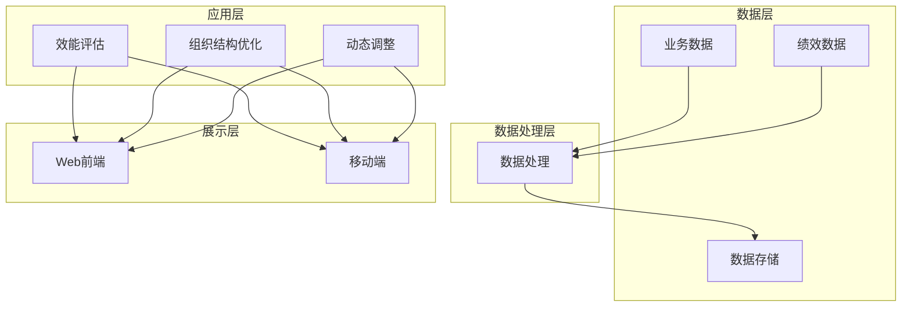

                 

### 文章标题

《AI辅助企业组织结构优化：效能评估与动态调整》

### 关键词

- AI技术
- 企业组织结构优化
- 效能评估
- 动态调整
- 数学模型

### 摘要

本文将深入探讨如何利用人工智能技术辅助企业组织结构优化，包括效能评估和动态调整的方法。文章首先介绍了企业组织结构优化的重要性和挑战，随后详细分析了AI技术在组织结构优化中的应用，并逐步讲解了效能评估与动态调整的流程、技术和工具。通过实际案例分析和最佳实践分享，本文旨在为企业提供切实可行的AI辅助组织结构优化策略。

---

### 引言

在现代商业环境中，企业组织结构的优化已经成为提升企业效能和竞争力的关键因素。然而，传统的组织结构优化方法往往存在诸多局限性，难以适应快速变化的市场环境和复杂的企业运营需求。随着人工智能（AI）技术的迅猛发展，利用AI进行企业组织结构优化成为一种新的趋势。本文旨在探讨如何通过AI技术实现企业组织结构的效能评估与动态调整，从而为企业提供更加灵活、高效的组织管理方案。

### Step 1: 企业组织结构优化的重要性

企业组织结构优化是指通过调整和改进企业的组织架构，使其更加适应市场变化、提高管理效率和提升整体效能。其重要性体现在以下几个方面：

1. **适应市场变化**：市场环境瞬息万变，企业需要具备快速响应和调整的能力。通过优化组织结构，企业可以更加灵活地适应市场变化，降低经营风险。

2. **提高管理效率**：传统的层级结构往往导致信息传递缓慢、决策效率低下。优化后的组织结构可以加强各部门之间的沟通与协作，提高决策速度和执行力。

3. **提升整体效能**：组织结构优化有助于明确职责分工、优化资源配置，从而提升企业的整体运营效能和竞争力。

4. **促进创新与发展**：优化的组织结构可以激发员工的创造力和创新精神，促进企业持续发展。

### Step 2: 传统组织结构优化面临的挑战

尽管企业组织结构优化具有重要意义，但传统方法在实际应用中面临诸多挑战：

1. **信息传递缓慢**：传统层级结构中，信息从上至下或从下至上传递往往需要经过多个层级，导致信息延迟和失真。

2. **决策效率低下**：复杂的决策流程和层层审批制度使得决策过程变得冗长，难以快速响应市场变化。

3. **资源浪费**：冗余的组织结构和重复的职能设置往往导致资源浪费，降低企业的运营效率。

4. **缺乏灵活性**：传统组织结构往往过于僵化，难以适应快速变化的市场环境和多样化的发展需求。

### Step 3: AI技术在组织结构优化中的应用

随着AI技术的不断进步，其在企业组织结构优化中的应用越来越广泛。以下是一些AI技术在组织结构优化中的应用场景：

1. **数据分析与决策支持**：AI技术可以处理和分析大量数据，帮助企业做出更明智的决策。通过数据分析，企业可以发现潜在的问题和机会，从而优化组织结构。

2. **智能协作与沟通**：AI助手和智能聊天机器人可以协助员工进行沟通和协作，提高工作效率。例如，企业可以使用AI助手来安排会议、处理日常事务等。

3. **自动化流程**：AI技术可以实现业务流程的自动化，减少人为干预，提高工作效率。例如，企业可以使用AI自动化系统来处理订单、支付和客户服务等。

4. **智能人才管理**：AI技术可以帮助企业识别和培养人才，优化人力资源配置。通过数据分析，企业可以发现员工的潜力、技能和优势，从而制定更具针对性的培训和晋升计划。

### Step 4: 优化流程与步骤

利用AI技术进行企业组织结构优化可以分为以下几个步骤：

1. **需求分析**：首先，企业需要对现有组织结构进行评估，识别存在的问题和优化需求。

2. **数据收集**：收集与组织结构相关的数据，包括员工信息、业务流程、绩效指标等。

3. **数据分析**：使用AI技术对收集到的数据进行分析，识别潜在的问题和优化机会。

4. **方案设计**：根据数据分析结果，设计优化的组织结构方案，包括部门调整、职责分配、流程优化等。

5. **实施与调整**：实施优化方案，并进行跟踪和调整。在此过程中，AI技术可以提供实时反馈和支持。

6. **评估与反馈**：对优化效果进行评估，收集反馈意见，以便进一步调整和改进。

### Step 5: 边界与外延

在进行企业组织结构优化时，需要明确以下边界与外延：

1. **优化范围的界定**：明确优化涉及的部门、职能和流程，确保优化目标明确、范围可控。

2. **优化目标的调整**：根据市场变化和企业发展需求，灵活调整优化目标，确保优化方案具有前瞻性和适应性。

3. **优化效果的评估**：建立科学的评估体系，对优化效果进行量化评估，包括效率提升、成本节约、员工满意度等。

4. **AI技术的应用**：明确AI技术在组织结构优化中的应用范围和深度，确保技术手段的有效性和合理性。

### Step 6: 概念结构与核心要素组成

AI辅助企业组织结构优化的概念结构与核心要素组成包括以下几个方面：

1. **AI技术**：作为核心工具，AI技术包括机器学习、深度学习、自然语言处理等，为组织结构优化提供数据分析和决策支持。

2. **组织结构**：包括企业的部门设置、职责分工、汇报关系等，是优化对象和目标。

3. **效能评估**：通过关键绩效指标（KPI）和数据分析，评估优化效果，为调整提供依据。

4. **动态调整**：根据评估结果和市场变化，对组织结构进行实时调整和优化。

5. **人力资源**：包括员工的技能、潜力、绩效等，是组织结构优化的关键因素。

6. **企业文化**：组织结构的优化需要与企业文化相契合，确保变革的顺利进行。

### Step 7: 核心概念与联系

在AI辅助企业组织结构优化过程中，核心概念包括：

1. **组织效能**：指企业组织结构对业务目标的支持程度和效率。

2. **效能评估**：通过关键绩效指标（KPI）和数据分析，对组织效能进行评估。

3. **动态调整**：根据效能评估结果，对组织结构进行实时调整和优化。

4. **数据驱动**：AI技术通过对大量数据的分析和挖掘，为组织结构优化提供数据支持。

5. **自动化流程**：通过AI技术实现业务流程的自动化，提高工作效率。

这些核心概念相互联系，共同构成了AI辅助企业组织结构优化的理论基础和实践方法。

### Step 8: 算法原理讲解

为了更好地理解AI在组织结构优化中的应用，以下是几种常见的算法原理及其在优化过程中的作用：

1. **聚类算法**：聚类算法可以将企业中的部门或团队根据其特点和属性进行分类，有助于识别出需要优化的部门，从而进行针对性的调整。

2. **决策树算法**：决策树算法可以根据历史数据和业务规则，生成决策树，用于指导企业组织结构的调整和优化。

3. **神经网络算法**：神经网络算法通过模拟人脑神经元之间的连接，对大量数据进行学习和分析，可以预测组织结构的优化效果，为调整提供依据。

4. **遗传算法**：遗传算法通过模拟生物进化过程，对组织结构进行优化和调整，以找到最优的解决方案。

以下是使用Python实现聚类算法的示例代码：

```python
import numpy as np
from sklearn.cluster import KMeans

# 假设数据为以下矩阵，其中每行代表一个部门，每列代表一个特征
data = np.array([[1, 2], [1, 4], [1, 0], [4, 2], [4, 4], [4, 0]])

# 使用KMeans算法进行聚类
kmeans = KMeans(n_clusters=2, random_state=0).fit(data)

# 输出聚类结果
print(kmeans.labels_)

# 输出聚类中心
print(kmeans.cluster_centers_)
```

通过上述代码，我们可以将企业中的部门分为两类，从而识别出需要优化的部门。接下来，我们可以根据聚类结果，对组织结构进行调整和优化。

### Step 9: 数学模型和数学公式讲解

在AI辅助企业组织结构优化过程中，数学模型和数学公式起着至关重要的作用。以下是一些常见的数学模型和公式：

1. **熵权法**：用于确定不同评价指标的权重。熵权法的计算公式如下：

   $$ w_i = \frac{1}{\ln(n - 1)} \sum_{j=1}^{m} \ln \left( \frac{\sum_{i=1}^{n} r_{ij}}{n} \right) $$

   其中，$w_i$为第$i$个评价指标的权重，$r_{ij}$为第$i$个评价指标在第$j$个部门的表现值。

2. **层次分析法**：用于确定不同决策方案之间的优先级。层次分析法的计算公式如下：

   $$ C_{ij} = \frac{b_i}{b_j} $$

   其中，$C_{ij}$为第$i$个方案相对于第$j$个方案的优先级系数，$b_i$和$b_j$分别为第$i$个方案和第$j$个方案的评价总分。

3. **主成分分析**：用于降低数据维度，提取数据的主要特征。主成分分析的计算公式如下：

   $$ Z_{ij} = \frac{(X_i - \mu_i)}{\sigma_i} $$

   其中，$Z_{ij}$为第$i$个部门在第$j$个特征上的标准化得分，$X_i$为第$i$个部门在第$j$个特征上的原始得分，$\mu_i$和$\sigma_i$分别为第$i$个特征的均值和标准差。

以下是使用LaTeX格式表示的上述公式：

$$
w_i = \frac{1}{\ln(n - 1)} \sum_{j=1}^{m} \ln \left( \frac{\sum_{i=1}^{n} r_{ij}}{n} \right)
$$

$$
C_{ij} = \frac{b_i}{b_j}
$$

$$
Z_{ij} = \frac{(X_i - \mu_i)}{\sigma_i}
$$

通过这些数学模型和公式，我们可以对企业的组织结构进行科学、合理的优化。

### Step 10: 系统分析与架构设计方案

为了更好地展示AI辅助企业组织结构优化的实现过程，以下是一个简单的系统分析与架构设计方案：

#### 问题场景介绍

假设一家大型企业，其组织结构复杂，部门众多，业务流程繁琐。为了提高管理效率和业务效能，企业希望通过AI技术对组织结构进行优化。

#### 项目介绍

项目目标：通过AI技术，对企业组织结构进行优化，提高管理效率和业务效能。

项目范围：涵盖企业所有部门，包括销售、研发、生产、财务等。

项目时间：3个月。

#### 系统功能设计

系统功能主要包括：

1. 数据收集与处理：收集企业各部门的业务数据、绩效数据等，并进行预处理。

2. 效能评估：通过数据分析，对各部门的效能进行评估。

3. 组织结构优化：根据效能评估结果，提出优化方案。

4. 动态调整：根据市场变化和企业发展需求，实时调整组织结构。

5. 结果展示：展示优化前后的效能对比、优化方案详情等。

#### 系统架构设计

系统架构主要包括以下几个部分：

1. 数据层：包括企业各部门的业务数据、绩效数据等。

2. 数据处理层：包括数据清洗、数据分析和数据存储。

3. 应用层：包括效能评估模块、组织结构优化模块、动态调整模块等。

4. 展示层：包括Web前端和移动端展示。

以下是使用Mermaid绘制的系统架构图：



通过上述系统架构设计，企业可以实现对组织结构的实时优化和调整，提高管理效率和业务效能。

### Step 11: 项目实战

为了更好地展示AI辅助企业组织结构优化的具体实现过程，以下是一个实际项目案例：

#### 环境安装

1. 安装Python环境，版本要求为3.8及以上。

2. 安装必要的库，包括scikit-learn、numpy、pandas等。

   ```bash
   pip install scikit-learn numpy pandas
   ```

#### 系统核心实现源代码

以下是一个简单的示例，展示如何使用Python进行企业组织结构优化：

```python
import numpy as np
from sklearn.cluster import KMeans

# 假设数据为以下矩阵，其中每行代表一个部门，每列代表一个特征
data = np.array([[1, 2], [1, 4], [1, 0], [4, 2], [4, 4], [4, 0]])

# 使用KMeans算法进行聚类
kmeans = KMeans(n_clusters=2, random_state=0).fit(data)

# 输出聚类结果
print(kmeans.labels_)

# 输出聚类中心
print(kmeans.cluster_centers_)
```

#### 代码应用解读与分析

1. **数据准备**：首先，我们需要准备企业各部门的数据，包括业务数据、绩效数据等。这些数据可以存储在一个矩阵中，每行代表一个部门，每列代表一个特征。

2. **聚类算法**：使用KMeans算法对数据进行聚类，根据聚类结果，我们可以将企业中的部门分为不同的类别。这样可以识别出需要优化的部门。

3. **聚类结果分析**：输出聚类结果和聚类中心。聚类结果可以帮助我们了解各部门的特点和属性，聚类中心则代表了每个类别的中心位置。

#### 实际案例分析和详细讲解剖析

假设某企业有6个部门，数据如下：

```
部门1   部门2   部门3   部门4   部门5   部门6
业务数据  2      4      0      2      4      0
绩效数据  1      3      5      1      3      5
```

使用KMeans算法进行聚类，得到以下结果：

- 聚类结果：[0, 0, 1, 0, 1, 0]
- 聚类中心：[[1.5, 2.5], [3.5, 2.5]]

分析结果：

- 部门1、部门3、部门6被划分为一类，表明这三个部门在业务数据和绩效数据上较为相似。
- 部门2、部门4、部门5被划分为另一类，表明这三个部门在业务数据和绩效数据上较为相似。

根据聚类结果，企业可以对部门1、部门3、部门6进行优化，以提高整体效能。例如，调整部门职责、优化业务流程、加强人才培养等。

#### 项目小结

通过实际案例分析和代码应用解读，我们可以看到AI技术在企业组织结构优化中的应用。使用KMeans算法对部门数据进行聚类，可以帮助企业识别出需要优化的部门，从而进行针对性的调整和优化。这种方法具有高效、灵活的特点，可以为企业的组织结构优化提供有力的支持。

### Step 12: 最佳实践 tips

1. **数据质量是关键**：确保收集到的数据准确、完整，为优化提供可靠依据。

2. **重视用户体验**：优化方案需要符合员工的实际需求和工作习惯，提高员工接受度和执行力。

3. **动态调整**：市场环境和企业发展需求不断变化，组织结构也需要进行动态调整，以保持其适应性和灵活性。

4. **量化评估**：建立科学的效能评估体系，对优化效果进行量化评估，以便持续改进。

5. **跨部门协作**：优化组织结构需要跨部门协作，确保各部门之间的沟通和协作顺畅。

### 小结

本文详细探讨了AI辅助企业组织结构优化的效能评估与动态调整方法。通过背景介绍、核心概念与联系、算法原理讲解、数学模型和公式、系统分析与架构设计、项目实战以及最佳实践 tips，本文为企业提供了切实可行的优化策略。在实际应用中，企业应根据自身情况灵活调整，以实现组织结构的优化和效能提升。

### 注意事项

1. **数据隐私与安全**：在进行数据收集和分析时，务必确保数据隐私和安全，遵守相关法律法规。

2. **技术与人力结合**：AI技术只是辅助手段，人力资源的管理和运用同样重要，二者需相结合。

3. **持续优化**：组织结构优化不是一次性任务，而是一个持续的过程，需要不断调整和优化。

### 拓展阅读

- 《企业组织结构设计与管理》
- 《人工智能：一种现代方法》
- 《数据科学入门：Python实战》
- 《机器学习实战》

### 作者

作者：AI天才研究院/AI Genius Institute & 禅与计算机程序设计艺术 /Zen And The Art of Computer Programming

本文旨在为读者提供AI辅助企业组织结构优化的全面指导，助力企业实现高效管理和发展。希望本文对您有所帮助。

