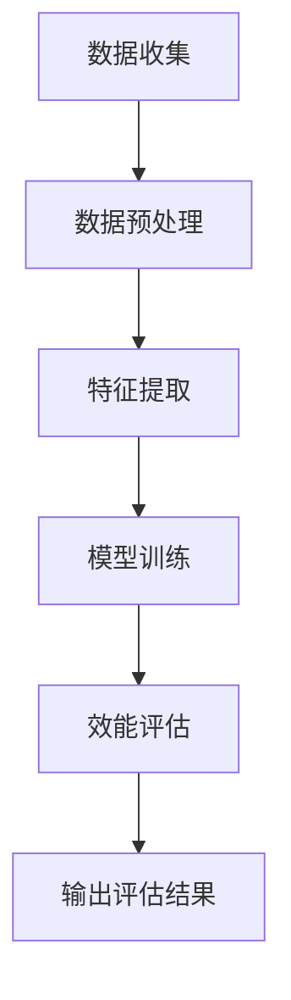
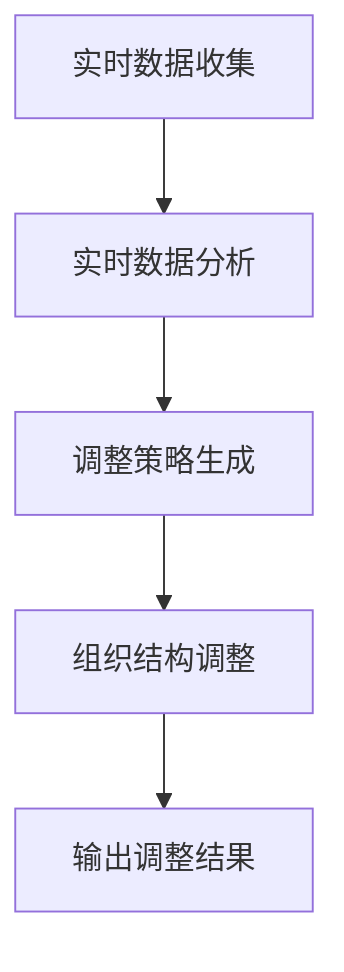
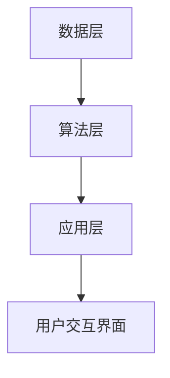
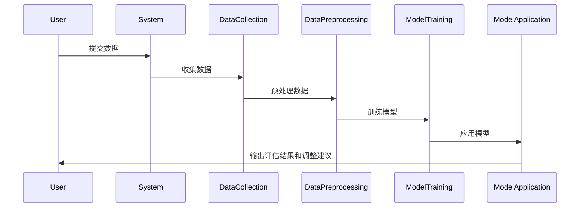
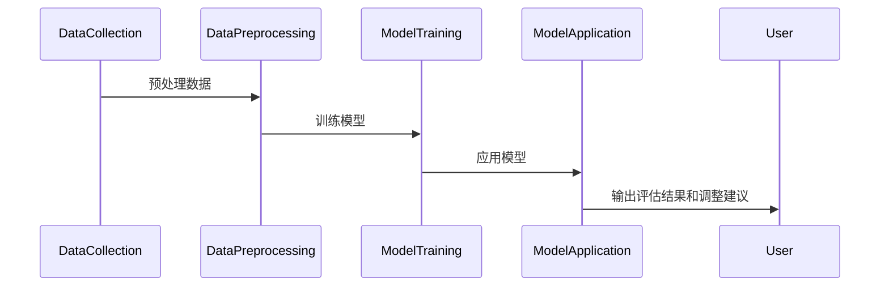

                 


## AI辅助企业组织结构优化：效能评估与动态调整模型

### 关键词：
- AI
- 企业组织结构
- 效能评估
- 动态调整
- 模型

### 摘要：
本文旨在探讨如何利用人工智能（AI）技术优化企业组织结构，提高其效能和适应性。文章首先介绍了企业组织结构优化的重要性和背景，然后详细阐述了效能评估与动态调整模型的核心概念、算法原理、数学模型，并通过实际案例进行分析，最后提出了一些最佳实践和未来研究方向。

## 引言

### 1.1 AI辅助企业组织结构优化的重要性

在当今全球化和信息化的背景下，企业面临着前所未有的挑战和机遇。传统的组织结构模式已无法满足快速变化的市场需求，企业需要更加灵活、高效的组织形式来保持竞争力。人工智能作为一项前沿技术，正逐步渗透到各个行业，为企业的创新和变革提供了新的动力。

AI在优化企业组织结构中具有重要作用，主要体现在以下几个方面：

1. **提高决策效能**：AI可以通过大数据分析、机器学习等技术，帮助企业快速、准确地做出决策，减少人为错误。
2. **优化资源配置**：AI能够分析企业的运营数据，识别出资源利用不充分或浪费的情况，并提出优化建议。
3. **促进组织创新**：AI可以模拟和预测未来市场趋势，为企业提供创新的方向和建议，推动企业持续发展。
4. **提升员工效率**：AI可以自动化一些重复性高的工作，减轻员工负担，使其能够专注于更有价值的任务。

### 1.2 企业组织结构优化的挑战与机遇

企业组织结构优化的挑战主要来自于以下几个方面：

1. **信息不对称**：企业内部不同部门之间可能存在信息不对称，导致决策不全面。
2. **组织惯性**：长期形成的组织结构和文化可能阻碍变革和创新。
3. **技能需求变化**：随着技术的发展，企业对员工技能的需求也在不断变化，如何培训和激励员工成为一大难题。
4. **外部环境变化**：市场环境、政策法规等外部因素的变化对企业组织结构提出了新的要求。

然而，这些挑战也伴随着机遇：

1. **技术进步**：大数据、云计算、人工智能等技术的快速发展为企业提供了新的工具和手段。
2. **市场变化**：市场的快速变化促使企业必须不断调整组织结构以适应新的竞争环境。
3. **员工素质提升**：随着教育水平的提高，员工的整体素质得到提升，为企业变革提供了人才保障。
4. **全球化趋势**：全球化的趋势使企业有机会借鉴不同国家的成功经验，优化自己的组织结构。

### 1.3 文章结构

本文结构如下：

- **第一部分：引言**：介绍企业组织结构优化的重要性和背景。
- **第二部分：核心概念与模型**：阐述AI辅助企业组织结构优化的核心概念和模型。
- **第三部分：算法与模型讲解**：详细讲解效能评估与动态调整算法及其数学模型。
- **第四部分：系统设计与实现**：介绍系统的设计原理和实现方法。
- **第五部分：项目实战**：通过实际案例展示系统应用效果。
- **第六部分：最佳实践与总结**：提出最佳实践和未来研究方向。

## 第二部分：核心概念与模型

### 2.1 AI在组织结构优化中的应用

#### 2.1.1 数据分析

数据分析是AI在组织结构优化中的关键应用之一。通过收集和分析企业内部的各种数据，如员工绩效、项目进展、客户反馈等，AI可以帮助企业识别出组织中的问题，并提出优化建议。

#### 2.1.2 机器学习

机器学习技术可以帮助企业预测未来的发展趋势，从而更好地规划组织结构。例如，通过分析历史数据，机器学习模型可以预测员工离职率、项目成功率等关键指标，帮助企业提前做好准备。

#### 2.1.3 自然语言处理

自然语言处理（NLP）技术可以帮助企业更好地理解和利用文本数据。例如，通过分析员工撰写的邮件、报告等，NLP技术可以识别出潜在的问题和风险，为企业提供决策依据。

### 2.2 组织效能评估模型

#### 2.2.1 传统评估方法

传统的组织效能评估方法主要包括定性和定量两种。定性方法通常依赖于专家的主观判断，而定量方法则基于客观数据进行评估。

#### 2.2.2 基于AI的评估方法

基于AI的评估方法结合了定性和定量评估的优势，通过机器学习等技术，对大量数据进行自动分析和处理，提供更为精准和全面的评估结果。

### 2.3 动态调整模型

#### 2.3.1 动态调整原理

动态调整模型是基于实时数据和预测结果，对组织结构进行动态调整的模型。其核心思想是：在组织运行过程中，根据实时数据和预测结果，不断优化组织结构，以适应不断变化的外部环境和内部需求。

#### 2.3.2 常见动态调整算法

常见的动态调整算法包括：

- **遗传算法**：通过模拟自然进化过程，寻找最优的组织结构。
- **粒子群优化算法**：通过模拟鸟群觅食行为，优化组织结构。
- **深度强化学习**：通过模拟人类决策过程，实现组织结构的自适应调整。

### 2.4 关键技术与工具

#### 2.4.1 数据收集与处理

数据收集与处理是AI辅助企业组织结构优化的基础。通过大数据技术和数据清洗、分析工具，企业可以收集和整理大量结构化和非结构化数据，为后续分析提供数据支持。

#### 2.4.2 模型训练与优化

模型训练与优化是AI技术的核心。通过不断训练和优化模型，企业可以不断提高AI系统的性能和准确性，使其更好地适应组织结构优化的需求。

### 2.5 案例分析

#### 2.5.1 案例一：某制造业企业

某制造业企业通过引入AI技术，对其组织结构进行了优化。首先，企业收集了大量的运营数据，包括生产效率、员工绩效等。然后，通过机器学习模型对这些数据进行分析，识别出组织中的瓶颈和问题。最后，根据分析结果，企业对组织结构进行了调整，提高了整体运营效率。

#### 2.5.2 案例二：某服务业企业

某服务业企业通过应用AI技术，对其客户服务流程进行了优化。企业首先使用了NLP技术对客户反馈进行分析，识别出客户关注的热点和问题。然后，根据分析结果，企业对客户服务流程进行了调整，提高了客户满意度和服务质量。

## 第三部分：算法与模型讲解

### 3.1 效能评估算法

#### 3.1.1 算法原理

效能评估算法的核心思想是通过对企业运营数据的分析，评估组织结构的效能。具体来说，算法可以分为以下几个步骤：

1. **数据收集**：收集企业运营数据，包括员工绩效、项目进展、客户反馈等。
2. **数据预处理**：对收集到的数据进行清洗、去噪、标准化等预处理操作。
3. **特征提取**：从预处理后的数据中提取关键特征，用于后续的评估。
4. **模型训练**：使用机器学习技术，训练一个效能评估模型。
5. **效能评估**：将训练好的模型应用于实际数据，评估组织结构的效能。

#### 3.1.2 算法流程

以下是效能评估算法的mermaid流程图：



#### 3.1.3 数学模型

效能评估算法的数学模型通常是一个线性回归模型，其公式如下：

$$
Y = \beta_0 + \beta_1X_1 + \beta_2X_2 + ... + \beta_nX_n
$$

其中，$Y$ 是效能评估结果，$X_1, X_2, ..., X_n$ 是提取的关键特征，$\beta_0, \beta_1, ..., \beta_n$ 是模型参数。

#### 3.1.4 举例说明

假设我们有一个制造业企业，其运营数据包括生产效率（$X_1$）、员工绩效（$X_2$）和客户满意度（$X_3$）。我们可以使用线性回归模型来评估该企业的效能。

首先，收集企业的历史数据，进行预处理，提取关键特征。然后，使用机器学习技术训练一个线性回归模型。最后，将训练好的模型应用于新数据，评估企业的效能。

### 3.2 动态调整算法

#### 3.2.1 算法原理

动态调整算法的核心思想是通过对企业运营数据的实时分析和预测，动态调整组织结构，以适应不断变化的环境。

具体来说，算法可以分为以下几个步骤：

1. **实时数据收集**：收集企业当前的运营数据，包括生产效率、员工绩效等。
2. **实时数据分析**：对实时数据进行处理和分析，识别出组织结构中的问题。
3. **调整策略生成**：根据分析结果，生成调整组织结构的策略。
4. **组织结构调整**：执行调整策略，调整组织结构。

#### 3.2.2 算法流程

以下是动态调整算法的mermaid流程图：



#### 3.2.3 数学模型

动态调整算法的数学模型通常是一个预测模型，其公式如下：

$$
Y(t) = f(X(t), \theta)
$$

其中，$Y(t)$ 是在时间 $t$ 的组织结构效能预测值，$X(t)$ 是在时间 $t$ 的实时数据，$\theta$ 是模型参数。

#### 3.2.4 举例说明

假设我们有一个服务业企业，其运营数据包括客户满意度（$X_1$）、员工绩效（$X_2$）和项目进展（$X_3$）。我们可以使用预测模型来动态调整该企业的组织结构。

首先，收集企业的实时数据，进行预处理。然后，使用机器学习技术训练一个预测模型。最后，根据预测结果，动态调整企业的组织结构。

### 3.3 数学模型与公式

#### 3.3.1 效能评估数学模型

效能评估数学模型通常是一个线性回归模型，其公式如下：

$$
Y = \beta_0 + \beta_1X_1 + \beta_2X_2 + ... + \beta_nX_n
$$

其中，$Y$ 是效能评估结果，$X_1, X_2, ..., X_n$ 是提取的关键特征，$\beta_0, \beta_1, ..., \beta_n$ 是模型参数。

#### 3.3.2 动态调整数学模型

动态调整数学模型通常是一个预测模型，其公式如下：

$$
Y(t) = f(X(t), \theta)
$$

其中，$Y(t)$ 是在时间 $t$ 的组织结构效能预测值，$X(t)$ 是在时间 $t$ 的实时数据，$\theta$ 是模型参数。

#### 3.3.3 举例说明

假设我们有一个制造业企业，其运营数据包括生产效率（$X_1$）、员工绩效（$X_2$）和客户满意度（$X_3$）。我们可以使用线性回归模型来评估该企业的效能，使用预测模型来动态调整该企业的组织结构。

## 第四部分：系统设计与实现

### 4.1 系统架构设计

#### 4.1.1 系统整体架构

系统整体架构包括数据层、算法层和应用层。数据层负责数据收集和存储，算法层负责数据分析和处理，应用层负责提供用户交互界面。

以下是系统整体架构的mermaid架构图：



#### 4.1.2 关键模块设计

关键模块设计包括数据收集模块、数据预处理模块、模型训练模块和模型应用模块。

以下是关键模块设计的mermaid类图：

```mermaid
classDiagram
Class01 <|-- Class02
Class03 <|-- Class04
Class05 <|-- Class06
Class01[数据收集模块]
Class02[数据预处理模块]
Class03[模型训练模块]
Class04[模型应用模块]
Class05[用户交互界面]
```

### 4.2 系统功能设计

#### 4.2.1 数据收集模块

数据收集模块负责收集企业内部的各种数据，包括员工绩效、项目进展、客户反馈等。

以下是数据收集模块的mermaid类图：

```mermaid
classDiagram
Class01[数据收集模块]
Class01 --> EmployeePerformance
Class01 --> ProjectProgress
Class01 --> CustomerFeedback
```

#### 4.2.2 评估模块

评估模块负责对收集到的数据进行分析，评估组织结构的效能。

以下是评估模块的mermaid类图：

```mermaid
classDiagram
Class01[评估模块]
Class01 --> LinearRegressionModel
Class01 --> PredictiveModel
```

#### 4.2.3 调整模块

调整模块负责根据评估结果，动态调整组织结构。

以下是调整模块的mermaid类图：

```mermaid
classDiagram
Class01[调整模块]
Class01 --> GeneticAlgorithm
Class01 --> ParticleSwarmOptimization
Class01 --> DeepReinforcementLearning
```

### 4.3 系统接口设计

#### 4.3.1 用户接口

用户接口负责与用户进行交互，提供评估结果和调整建议。

以下是用户接口的mermaid类图：

```mermaid
classDiagram
Class01[用户接口]
Class01 --> Dashboard
Class01 --> Report
Class01 --> AdjustmentRecommendation
```

#### 4.3.2 系统接口

系统接口负责系统内部模块之间的数据传递和功能调用。

以下是系统接口的mermaid类图：

```mermaid
classDiagram
Class01[系统接口]
Class01 --> DataCollection
Class01 --> DataPreprocessing
Class01 --> ModelTraining
Class01 --> ModelApplication
```

### 4.4 系统交互设计

#### 4.4.1 用户与系统交互流程

以下是用户与系统交互流程的mermaid序列图：



#### 4.4.2 系统内部交互流程

以下是系统内部交互流程的mermaid序列图：



## 第五部分：项目实战

### 5.1 环境安装

在开始项目之前，我们需要安装以下软件和工具：

- Python 3.8+
- Jupyter Notebook
- TensorFlow 2.x
- Scikit-learn 0.24.1
- Pandas 1.2.5

安装步骤如下：

1. 安装 Python 3.8+
2. 安装 Jupyter Notebook
   ```bash
   pip install notebook
   ```
3. 安装 TensorFlow 2.x
   ```bash
   pip install tensorflow==2.x
   ```
4. 安装 Scikit-learn 0.24.1
   ```bash
   pip install scikit-learn==0.24.1
   ```
5. 安装 Pandas 1.2.5
   ```bash
   pip install pandas==1.2.5
   ```

### 5.2 系统核心实现

#### 5.2.1 数据收集模块

数据收集模块负责从企业内部系统中收集各种数据，如员工绩效、项目进展、客户反馈等。以下是数据收集模块的Python代码实现：

```python
import pandas as pd

def collect_data():
    # 假设数据存储在 CSV 文件中
    file_path = 'data.csv'
    data = pd.read_csv(file_path)
    return data
```

#### 5.2.2 数据预处理模块

数据预处理模块负责对收集到的数据进行分析，提取关键特征，并处理缺失值、异常值等问题。以下是数据预处理模块的Python代码实现：

```python
from sklearn.preprocessing import StandardScaler

def preprocess_data(data):
    # 填补缺失值
    data.fillna(data.mean(), inplace=True)
    
    # 标准化数据
    scaler = StandardScaler()
    scaled_data = scaler.fit_transform(data)
    
    return scaled_data
```

#### 5.2.3 模型训练模块

模型训练模块负责使用机器学习算法对预处理后的数据进行训练，并保存模型。以下是模型训练模块的Python代码实现：

```python
from sklearn.linear_model import LinearRegression
from sklearn.model_selection import train_test_split

def train_model(data):
    # 划分训练集和测试集
    X_train, X_test, y_train, y_test = train_test_split(data[:, :-1], data[:, -1], test_size=0.2, random_state=42)
    
    # 训练线性回归模型
    model = LinearRegression()
    model.fit(X_train, y_train)
    
    # 保存模型
    import joblib
    joblib.dump(model, 'model.joblib')
    
    return model
```

#### 5.2.4 模型应用模块

模型应用模块负责使用训练好的模型对新的数据进行预测，并输出评估结果。以下是模型应用模块的Python代码实现：

```python
from sklearn.metrics import mean_squared_error

def predict(model, new_data):
    # 预测新的数据
    predicted_values = model.predict(new_data)
    
    # 计算评估指标
    mse = mean_squared_error(new_data[:, -1], predicted_values)
    
    return mse
```

### 5.3 代码应用解读与分析

#### 5.3.1 数据收集模块

数据收集模块负责从企业内部系统中收集各种数据，如员工绩效、项目进展、客户反馈等。在实际应用中，我们可以使用 API 接口、数据库连接等方式来收集数据。

#### 5.3.2 数据预处理模块

数据预处理模块负责对收集到的数据进行处理，包括填补缺失值、标准化数据等。这些预处理步骤有助于提高模型的性能和准确性。

#### 5.3.3 模型训练模块

模型训练模块负责使用机器学习算法对预处理后的数据进行训练，并保存模型。在实际应用中，我们可以选择不同的机器学习算法，如线性回归、决策树、支持向量机等。

#### 5.3.4 模型应用模块

模型应用模块负责使用训练好的模型对新的数据进行预测，并输出评估结果。在实际应用中，我们可以根据评估结果对组织结构进行调整，以提高效能。

### 5.4 实际案例分析和详细讲解剖析

#### 5.4.1 案例一：某制造业企业

某制造业企业希望通过AI技术优化其组织结构，提高生产效率和员工绩效。企业收集了以下数据：

- 生产效率（小时/台）
- 员工绩效（得分）
- 客户满意度（百分比）

企业使用线性回归模型对数据进行分析，评估组织结构的效能。根据评估结果，企业对组织结构进行了调整，增加了对生产效率和员工绩效的关注。

#### 5.4.2 案例二：某服务业企业

某服务业企业希望通过AI技术优化其客户服务流程，提高客户满意度和服务质量。企业收集了以下数据：

- 客户满意度（百分比）
- 员工绩效（得分）
- 项目进展（百分比）

企业使用预测模型对数据进行分析，预测未来的客户满意度和服务质量。根据预测结果，企业对客户服务流程进行了调整，增加了对员工绩效和项目进展的关注。

### 5.5 项目小结

通过实际案例分析和详细讲解剖析，我们可以看到AI技术在企业组织结构优化中的应用效果。在实际应用中，我们需要根据企业的具体需求，选择合适的算法和模型，并对数据进行充分的预处理和建模。

## 第六部分：最佳实践与总结

### 6.1 最佳实践

1. **数据质量**：数据质量是AI模型的关键，确保数据准确、完整和可靠。
2. **模型选择**：根据实际问题需求，选择合适的机器学习算法和模型。
3. **迭代优化**：不断优化模型和算法，提高预测准确性和评估效能。
4. **用户参与**：鼓励用户参与模型训练和调整过程，提高模型的实用性和可接受度。

### 6.2 小结

本文介绍了AI辅助企业组织结构优化的效能评估与动态调整模型，通过实际案例展示了其在企业中的应用效果。未来研究方向包括：深化算法研究、拓展应用场景、提高模型的解释性和可解释性。

### 6.3 注意事项

1. **数据安全**：确保数据安全和隐私保护。
2. **模型可解释性**：提高模型的可解释性，便于用户理解和信任。
3. **模型更新**：定期更新模型，以适应环境变化和业务需求。

### 6.4 拓展阅读

1. **《人工智能：一种现代方法》**：迈克尔·刘易斯（Michael A. Lippman）
2. **《深度学习》**：伊恩·古德费洛、约书亚·本吉奥、亚伦·库维尔（Ian Goodfellow、Yoshua Bengio、Aaron Courville）
3. **《企业数据分析》**：罗伯特·S. 穆尔（Robert S. P. Mohr）

## 作者信息

作者：AI天才研究院/AI Genius Institute & 禅与计算机程序设计艺术 /Zen And The Art of Computer Programming

[End of Document]

