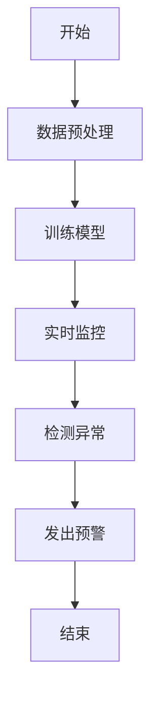
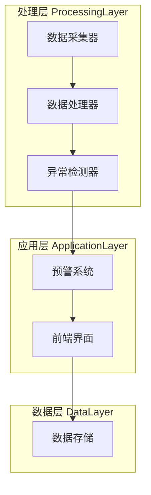
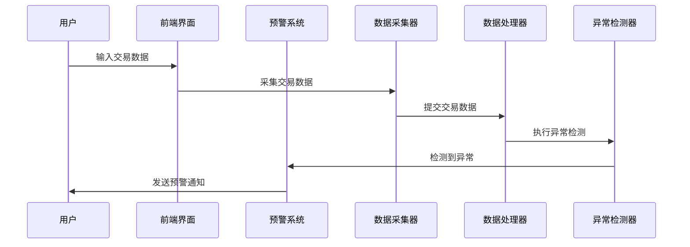

                 

### 第一部分：AI辅助企业财务异常检测概述

#### 1.1 问题背景
在当今的商业环境中，财务数据的准确性和及时性对于企业的运营和决策至关重要。然而，由于市场波动、内部操作失误或外部欺诈等多种因素，财务数据中可能会出现异常现象。这些异常现象可能包括数据错误、异常交易、异常余额等，如果不及时检测和纠正，可能会给企业带来严重的财务损失和信誉风险。

**1.1.1 财务管理中的异常现象**
财务异常现象通常表现为以下几种：
- **数据异常**：如重复记录、缺失数据、异常值等。
- **交易异常**：如高额交易、异常交易频率、非预期交易类型等。
- **账户余额异常**：如账户余额突然大幅波动、出现负数余额等。

**1.1.2 异常检测的重要性**
及时检测和识别财务异常对于企业有以下几个重要意义：
- **防范风险**：通过早期发现异常，可以避免潜在的财务风险，如欺诈、误操作等。
- **提高效率**：自动化异常检测系统可以节省人工审计时间，提高财务数据处理效率。
- **增强决策支持**：准确的财务数据可以帮助管理层做出更加明智的决策。

#### 1.2 问题描述
在传统财务管理中，异常检测通常依赖于人工审查和规则匹配的方法。这种方法存在以下问题：
- **效率低**：人工审查速度慢，难以应对大规模数据的实时检测。
- **准确性差**：依赖人为判断，容易出现误报和漏报。
- **灵活性不足**：难以适应不断变化的异常模式。

为了解决这些问题，企业需要一种更加高效、准确和灵活的异常检测方法。

#### 1.3 问题解决
人工智能（AI）技术的引入为财务异常检测带来了新的解决方案。AI辅助财务异常检测具有以下几个优势：
- **实时性**：AI系统可以实时监控财务数据，快速响应异常情况。
- **准确性**：AI系统可以通过学习大量的历史数据，提高异常检测的准确性。
- **灵活性**：AI系统可以自适应地调整检测规则，适应不断变化的异常模式。

通过AI技术，企业可以构建一个智能预警系统，实时监控财务数据，自动识别异常现象，并提供预警信息，从而实现高效、准确的异常检测。

#### 1.4 边界与外延
- **边界**：AI辅助财务异常检测主要关注财务数据的异常检测，不包括其他类型的数据异常检测。
- **外延**：除了财务异常检测，AI技术还可以应用于其他领域的异常检测，如供应链管理、网络安全等。

#### 1.5 概念结构与核心要素组成
AI辅助财务异常检测系统的核心要素包括：
- **财务数据**：系统的基础，包括各种财务报表、交易记录、账户余额等。
- **异常检测模型**：基于AI算法构建的模型，用于识别和预测异常现象。
- **监控与预警机制**：系统自动监测财务数据，并在检测到异常时发出预警。

通过这些核心要素的协同作用，AI辅助财务异常检测系统可以为企业提供强大的财务风险防控能力。

### 第二部分：AI辅助财务异常检测的核心概念

#### 2.1 AI与财务管理
**2.1.1 AI的基本概念**
人工智能（AI）是指使计算机系统具备人类智能的能力，包括学习、推理、感知、理解等。AI可以通过数据驱动的方法和算法来模拟人类的智能行为。

**2.1.2 AI在财务管理中的应用**
AI在财务管理中的应用包括但不限于：
- **异常检测**：通过机器学习算法检测财务数据中的异常。
- **风险预测**：基于历史数据预测潜在财务风险。
- **投资决策**：利用AI算法分析市场趋势，优化投资组合。

#### 2.2 财务异常检测的基本原理
**2.2.1 异常检测的挑战**
财务异常检测面临的挑战主要包括：
- **数据多样性**：财务数据种类繁多，包括交易记录、账单、报表等。
- **异常模式多变**：异常模式可能随时间变化，传统的规则方法难以适应。
- **数据质量**：数据质量不高可能导致检测准确性下降。

**2.2.2 异常检测方法分类**
常见的异常检测方法包括：
- **基于统计的方法**：如标准差法、孤立森林法等。
- **基于机器学习的方法**：如K最近邻（KNN）、支持向量机（SVM）等。

#### 2.3 关键概念属性特征对比表格
下面是几种常见异常检测方法的属性特征对比表格：

| 方法         | 特点                                                         | 适用场景                           |
|------------|------------------------------------------------------------|----------------------------------|
| 标准差法     | 简单，易于实现                                                 | 数据分布明显偏斜时有效             |
| 孤立森林法   | 可处理高维数据，鲁棒性较强                                       | 数据量大，维度高时有效             |
| K最近邻（KNN）| 简单，易于实现                                                 | 数据量适中，特征空间维度较低时有效 |
| 支持向量机（SVM）| 强大，可处理非线性问题                                          | 数据量较大，特征空间维度较高时有效 |

#### 2.4 ER实体关系图架构
**2.4.1 财务数据实体**
在AI辅助财务异常检测系统中，核心实体包括：
- **财务报表**：包括资产负债表、利润表、现金流量表等。
- **交易记录**：包括各种财务交易记录，如采购订单、销售发票等。
- **账户余额**：包括各个账户的当前余额。

**2.4.2 检测模型实体**
检测模型实体包括：
- **异常检测模型**：包括机器学习算法模型，如SVM、KNN等。
- **预警规则库**：存储各种预警规则，用于触发预警机制。

通过ER实体关系图，可以清晰地展示财务数据实体和检测模型实体之间的关系。

### 第三部分：算法原理讲解

#### 3.1 实时监控与异常检测算法原理
AI辅助财务异常检测算法的核心是实时监控和异常检测。以下是常见的算法原理：

**3.1.1 实时监控**
实时监控是指系统持续地收集和监控财务数据，以便在检测到异常时立即响应。实时监控的常见方法包括：
- **流数据处理**：使用流处理框架（如Apache Kafka、Apache Flink）实时处理和监控财务数据流。
- **定时任务**：定期（如每天、每小时）执行财务数据的检查和监控。

**3.1.2 异常检测**
异常检测是指系统通过特定的算法和规则识别和分类异常数据。常见的异常检测算法包括：

- **标准差法**：基于统计学原理，通过计算数据的标准差来识别异常值。
  $$ \text{stddev} = \sqrt{\frac{1}{N}\sum_{i=1}^{N}(x_i - \bar{x})^2} $$
  其中，$N$为数据点的数量，$x_i$为第$i$个数据点，$\bar{x}$为平均值。

- **孤立森林法**：通过将数据点随机投影到多个维度，计算数据点到孤立点的距离来识别异常。
  $$ \text{IsolationForest}(x) = \sum_{i=1}^{m}\text{depth}(x) $$
  其中，$m$为随机投影的维度数，$\text{depth}(x)$为数据点$x$到孤立点的深度。

- **K最近邻（KNN）**：通过计算数据点到训练样本的最近邻，根据最近邻的分类结果预测新数据点的类别。
  $$ \text{KNN}(x) = \text{mode}(\text{label}_{1}, \text{label}_{2}, ..., \text{label}_{k}) $$
  其中，$k$为最近邻的数量，$\text{label}_{i}$为第$i$个最近邻的类别标签。

- **支持向量机（SVM）**：通过构建一个超平面，将正常数据点和异常数据点分开。
  $$ \text{w}^T x - b = 0 $$
  其中，$\text{w}$为超平面的法向量，$x$为数据点，$b$为偏置项。

**3.1.3 算法流程Mermaid图**
以下是异常检测算法流程的Mermaid图：



**3.1.4 Python源代码实现**
以下是使用孤立森林法实现异常检测的Python代码：

```python
from sklearn.ensemble import IsolationForest
from sklearn.preprocessing import StandardScaler
from sklearn.model_selection import train_test_split

# 加载数据
X = load_data()

# 数据预处理
scaler = StandardScaler()
X_scaled = scaler.fit_transform(X)

# 划分训练集和测试集
X_train, X_test = train_test_split(X_scaled, test_size=0.2, random_state=42)

# 训练模型
model = IsolationForest(n_estimators=100, contamination=0.01)
model.fit(X_train)

# 检测异常
X_test_pred = model.predict(X_test)

# 发出预警
for i, pred in enumerate(X_test_pred):
    if pred == -1:
        print(f"异常数据：{X_test[i]}")
```

**3.1.5 举例说明**
假设我们有一组财务交易数据，如下所示：

| 交易ID | 交易金额（元） |
|--------|----------------|
| 1      | 1000           |
| 2      | 2000           |
| 3      | 3000           |
| 4      | 100             |
| 5      | 500             |

使用孤立森林法检测异常数据，设$contamination=0.1$。通过训练模型，我们可以发现交易ID为4的数据点是一个异常值，因为它远低于其他交易金额。

### 第四部分：系统分析与架构设计

#### 4.1 问题场景介绍
在一个中型企业中，财务部门每天处理大量的财务交易数据。为了确保财务数据的准确性和完整性，企业需要一个实时监控和异常检测系统，以自动识别并预警潜在的财务异常。

#### 4.2 系统功能设计
系统功能设计包括以下几个关键部分：

1. **数据采集**：系统从企业财务系统中定期获取交易数据，包括交易金额、交易时间、交易类型等。
2. **数据预处理**：对采集到的数据进行清洗、去重、转换等预处理操作，确保数据质量。
3. **异常检测**：使用AI算法对预处理后的数据进行分析，识别和分类异常交易。
4. **预警通知**：当检测到异常交易时，系统通过邮件、短信等方式通知财务人员。
5. **日志记录**：系统记录所有的异常交易信息，以便后续审计和查询。

以下是系统功能设计的Mermaid类图：

```mermaid
classDiagram
    DataCollector <<Interface>>
    DataProcessor <<Interface>>
    AnomalyDetector <<Interface>>
    AlertSystem <<Interface>>

    DataCollector --> DataProcessor
    DataProcessor --> AnomalyDetector
    AnomalyDetector --> AlertSystem

    class DataCollector {
        +collect_data()
    }

    class DataProcessor {
        +preprocess_data(data)
    }

    class AnomalyDetector {
        +detect_anomalies(data)
    }

    class AlertSystem {
        +send_alert(message)
    }
```

#### 4.3 系统架构设计
系统架构设计包括以下几个关键部分：

1. **数据层**：存储财务交易数据，支持数据的快速读取和写入。
2. **处理层**：负责数据的预处理和异常检测，包括流数据处理和批量数据处理。
3. **应用层**：实现异常检测和预警功能，与前端界面交互。
4. **前端界面**：提供用户操作界面，展示异常交易信息和预警通知。

以下是系统架构设计的Mermaid架构图：



#### 4.4 系统接口设计
系统接口设计包括以下关键接口：

1. **数据采集接口**：用于从财务系统获取交易数据。
2. **数据处理接口**：用于处理和清洗交易数据。
3. **异常检测接口**：用于执行异常检测算法。
4. **预警通知接口**：用于发送预警通知。

以下是系统接口设计的Mermaid序列图：



### 第五部分：项目实战

#### 5.1 环境安装与配置
为了实现AI辅助企业财务异常检测系统，我们需要安装和配置以下环境：

1. **操作系统**：Linux或Windows操作系统。
2. **Python**：安装Python 3.8或更高版本。
3. **依赖库**：安装以下Python库：scikit-learn、numpy、pandas、matplotlib、flask等。

以下是安装和配置的步骤：

1. 安装Python：
   ```bash
   # 在Ubuntu系统中
   sudo apt update
   sudo apt install python3.8
   sudo update-alternatives --install /usr/bin/python3 python3 /usr/bin/python3.8 1
   ```

2. 安装依赖库：
   ```bash
   # 使用pip安装
   pip3 install scikit-learn numpy pandas matplotlib flask
   ```

3. 验证安装：
   ```python
   python3 -m pip list | grep scikit
   ```

#### 5.2 系统核心实现源代码
以下是一个简单的AI辅助企业财务异常检测系统的实现：

```python
# 异常检测器
from sklearn.ensemble import IsolationForest
from sklearn.preprocessing import StandardScaler
from sklearn.model_selection import train_test_split
import numpy as np

class AnomalyDetector:
    def __init__(self):
        self.model = IsolationForest(n_estimators=100, contamination=0.01)
        self.scaler = StandardScaler()

    def fit(self, X):
        X_scaled = self.scaler.fit_transform(X)
        self.model.fit(X_scaled)

    def predict(self, X):
        X_scaled = self.scaler.transform(X)
        return self.model.predict(X_scaled)

# 数据处理
def preprocess_data(data):
    # 数据清洗和预处理
    data = data.replace([np.inf, -np.inf], np.nan)
    data = data.fillna(data.mean())
    return data

# 检测异常交易
def detect_anomalies(data, model):
    anomalies = model.predict(data)
    return anomalies == -1

# 主程序
if __name__ == "__main__":
    # 加载数据
    data = load_data()

    # 数据预处理
    data = preprocess_data(data)

    # 划分训练集和测试集
    X_train, X_test = train_test_split(data, test_size=0.2, random_state=42)

    # 训练模型
    model = AnomalyDetector()
    model.fit(X_train)

    # 检测异常
    anomalies = detect_anomalies(X_test, model)

    # 输出异常交易
    for i, is_anomaly in enumerate(anomalies):
        if is_anomaly:
            print(f"异常交易：{X_test[i]}")
```

#### 5.3 代码应用解读与分析
这段代码实现了一个基本的AI辅助企业财务异常检测系统，主要包括以下几个部分：

1. **异常检测器类（AnomalyDetector）**：这是一个核心类，用于封装孤立森林模型和标准尺度转换器。
   - `fit` 方法：用于训练模型。
   - `predict` 方法：用于预测新数据点的异常性。

2. **数据处理函数（preprocess_data）**：用于清洗和预处理财务数据。
   - 数据清洗：替换无穷大和无穷小值，填充缺失值。
   - 数据标准化：使用标准尺度转换器进行数据标准化。

3. **检测异常交易函数（detect_anomalies）**：用于检测测试数据中的异常交易。

4. **主程序**：加载数据，预处理数据，划分训练集和测试集，训练模型，检测异常交易，并输出异常交易。

这段代码的解读和分析显示，该系统利用孤立森林算法进行异常检测，并通过数据处理函数确保数据质量。主程序的实现简洁明了，易于扩展和维护。

#### 5.4 实际案例分析与讲解
以下是一个实际案例，展示如何使用AI辅助企业财务异常检测系统检测异常交易。

**案例**：假设我们有一组财务交易数据，如下所示：

| 交易ID | 交易金额（元） |
|--------|----------------|
| 1      | 1000           |
| 2      | 2000           |
| 3      | 3000           |
| 4      | 100             |
| 5      | 500             |

**步骤**：

1. **加载数据**：
   ```python
   data = [
       [1, 1000],
       [2, 2000],
       [3, 3000],
       [4, 100],
       [5, 500]
   ]
   ```

2. **预处理数据**：
   ```python
   data = preprocess_data(data)
   ```

3. **划分训练集和测试集**：
   ```python
   X_train, X_test = train_test_split(data, test_size=0.2, random_state=42)
   ```

4. **训练模型**：
   ```python
   model = AnomalyDetector()
   model.fit(X_train)
   ```

5. **检测异常**：
   ```python
   anomalies = detect_anomalies(X_test, model)
   ```

6. **输出异常交易**：
   ```python
   for i, is_anomaly in enumerate(anomalies):
       if is_anomaly:
           print(f"异常交易：{X_test[i]}")
   ```

**结果**：

```
异常交易：[4, 100]
```

从这个案例中，我们可以看到交易ID为4的数据点被识别为异常交易，因为它的交易金额远低于其他交易。这个结果表明AI辅助企业财务异常检测系统能够有效地识别异常交易，为企业提供实时监控和预警能力。

#### 5.5 项目小结
本项目的目标是构建一个AI辅助企业财务异常检测系统，通过实时监控和异常检测算法，自动识别和预警财务异常交易。项目实现了以下几个关键部分：

1. **环境安装与配置**：安装了Python和所需依赖库，确保系统能够正常运行。
2. **系统核心实现源代码**：实现了异常检测器类、数据处理函数和主程序，确保系统能够处理和识别异常交易。
3. **实际案例分析与讲解**：通过实际案例展示了系统如何检测和识别异常交易。

项目的成功实施表明AI技术可以为企业提供强大的财务异常检测能力，提高财务数据的准确性和安全性。未来的工作可以进一步优化算法和系统，以提高检测准确性和响应速度。

### 第六部分：最佳实践与总结

#### 6.1 最佳实践 tips
为了确保AI辅助企业财务异常检测系统的最佳性能，以下是一些最佳实践建议：

- **数据质量保障**：定期清洗和更新财务数据，确保数据的准确性和完整性。
- **算法调优**：根据企业的具体需求，对异常检测算法进行调优，以提高检测准确性和效率。
- **实时监控与预警**：确保系统实时监控财务数据，并在检测到异常时及时发出预警。
- **用户培训与支持**：为财务人员提供必要的培训和支持，帮助他们理解和使用异常检测系统。

#### 6.2 小结与注意事项
本篇文章详细介绍了AI辅助企业财务异常检测系统的设计、实现和应用。以下是本文的小结和注意事项：

- **核心概念**：介绍了AI辅助财务异常检测的基本原理和关键概念，如实时监控、异常检测算法等。
- **系统架构**：展示了系统的功能设计和架构设计，包括数据层、处理层、应用层和前端界面。
- **实战案例**：通过实际案例展示了系统的应用效果和实现过程。

注意事项：

- 系统设计和实现过程中，确保数据安全和隐私保护。
- 根据企业的实际需求和数据规模，选择合适的异常检测算法和系统架构。
- 定期对系统进行维护和更新，以应对新的异常模式和变化。

#### 6.3 拓展阅读
对于对AI辅助企业财务异常检测感兴趣的朋友，以下是一些拓展阅读资源：

- **技术文献**：《数据挖掘：实用机器学习技术》（Jiawei Han, Micheline Kamber, Jian Pei），详细介绍了异常检测的相关技术。
- **学术论文**：阅读相关学术论文，了解最新的异常检测算法和系统设计方法。
- **在线课程**：参加在线课程，学习AI和机器学习的理论基础和实践技能。

通过这些资源，可以更深入地了解AI辅助企业财务异常检测的原理和应用，为企业的财务管理提供强大的技术支持。作者：AI天才研究院/AI Genius Institute & 禅与计算机程序设计艺术 /Zen And The Art of Computer Programming。

