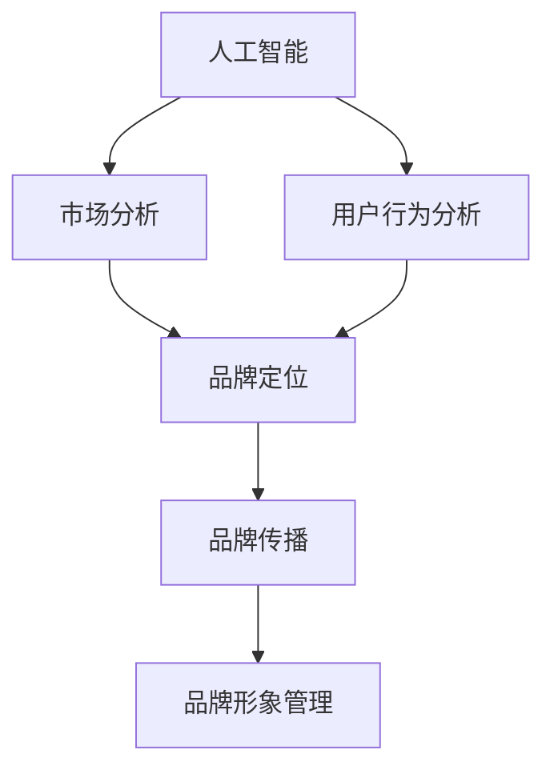
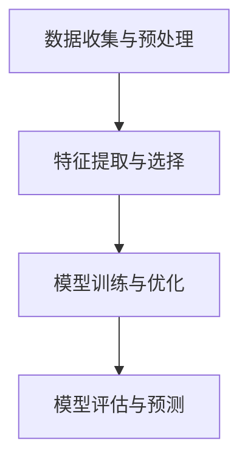
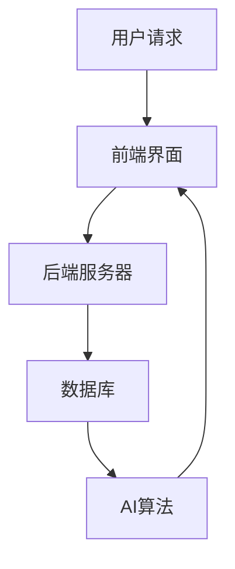
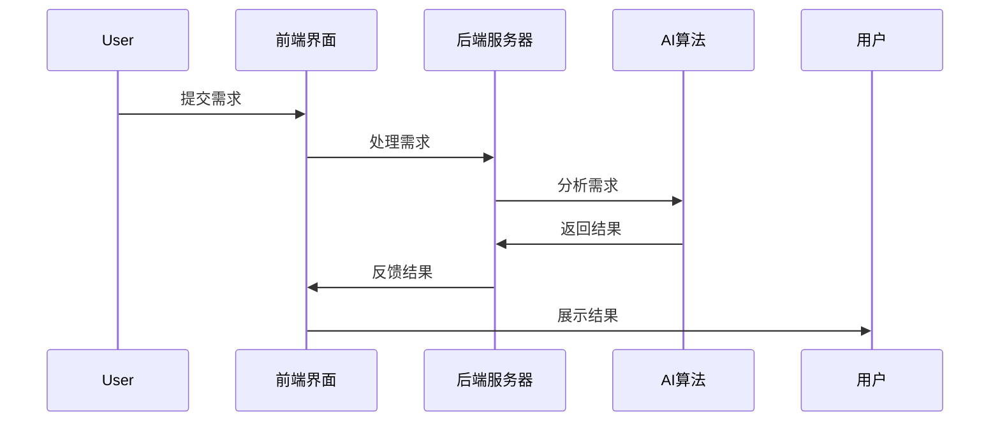

                 

### 引言与背景

**文章标题：AI辅助品牌形象设计与管理的创新方法**

**关键词：** 人工智能、品牌形象设计、管理方法、AI技术、流程与方法、实际案例分析

**摘要：** 本文章探讨了AI在品牌形象设计与管理中的应用，分析其面临的挑战，并提出了创新的解决方案。文章通过详细阐述AI的核心概念、算法原理、系统架构设计、项目实战以及最佳实践，为读者提供了一份全面的技术指南。

---

### 第一部分: 引言与背景

**1.1 问题背景**

在当今全球化的商业环境中，品牌形象设计与管理对于企业的成功至关重要。随着消费者需求的多样化和市场竞争的加剧，品牌需要不断创新和优化其形象，以吸引并保持客户的忠诚度。然而，传统的品牌形象设计和管理方法往往缺乏灵活性和效率，难以适应快速变化的市场环境。

随着人工智能（AI）技术的飞速发展，AI在各个领域的应用日益广泛，包括图像识别、自然语言处理、数据分析和机器学习等。AI技术的引入为品牌形象设计与管理带来了新的可能性，使得品牌能够更加精准地定位目标受众，提高设计效率，优化管理策略。

**1.2 问题描述**

尽管AI在品牌形象设计与管理中有巨大的潜力，但其应用仍面临诸多挑战。首先，AI技术的复杂性使得许多品牌难以理解和应用。其次，数据隐私和伦理问题也限制了AI在品牌形象设计与管理中的广泛应用。此外，AI在处理复杂数据和做出准确预测方面的局限性也是一个关键问题。

**1.3 问题解决**

本文旨在探索AI辅助品牌形象设计与管理的创新方法，以解决上述问题。通过详细介绍AI的核心概念、算法原理、系统架构设计、项目实战以及最佳实践，本文将为品牌提供一套实用、高效的AI辅助品牌形象设计与管理方法。

**1.4 边界与外延**

本文的研究范围将涵盖以下方面：
- AI在品牌形象设计中的应用，包括图像识别和自然语言处理技术。
- AI辅助品牌形象设计与管理的方法和流程。
- AI在品牌形象管理中的实际案例分析。
- AI技术在品牌形象设计与管理中的伦理和隐私问题。

接下来，我们将深入探讨AI辅助品牌形象设计与管理的核心概念和联系，为后续内容打下基础。

---

### 第一部分: 引言与背景

**1.5 核心概念与联系**

在本部分，我们将详细阐述AI、品牌形象设计、管理方法等核心概念，并分析它们之间的联系。

**1.5.1 AI概述**

人工智能（Artificial Intelligence，简称AI）是计算机科学的一个分支，旨在使计算机模拟人类智能行为，如学习、推理、感知和解决问题。AI技术包括机器学习、深度学习、自然语言处理、计算机视觉等。

**1.5.2 品牌形象设计**

品牌形象设计是品牌战略的重要组成部分，旨在通过视觉元素、语言符号和用户体验来传达品牌的核心价值和理念。品牌形象设计包括标志、视觉风格、口号、品牌故事等。

**1.5.3 管理方法**

品牌形象管理是指通过持续的创新和优化，确保品牌形象与市场需求和企业战略保持一致。管理方法包括市场调研、竞争分析、品牌传播、品牌定位等。

**1.5.4 概念联系与关系图**

以下是AI、品牌形象设计和管理方法之间的概念联系：

- AI技术可以用于分析市场数据和用户行为，为品牌形象设计提供数据支持。
- 品牌形象设计需要通过AI技术实现个性化、精准化，以满足不同用户的需求。
- 品牌形象管理需要借助AI技术提高效率，优化决策过程。

下面是使用Mermaid绘制的概念联系与关系图：



通过上述概念的联系，我们可以看到AI在品牌形象设计与管理中的关键作用。接下来，我们将进一步探讨AI的算法原理，为后续内容提供技术基础。

---

### 第一部分: 引言与背景

**1.6 算法原理讲解**

为了深入理解AI在品牌形象设计与管理中的应用，我们需要了解AI的基本算法原理。在本部分，我们将通过Mermaid流程图和Python代码来详细阐述这些原理。

**1.6.1 算法概述**

AI算法通常分为以下几个步骤：

1. 数据收集与预处理
2. 特征提取与选择
3. 模型训练与优化
4. 模型评估与预测

**1.6.2 Mermaid流程图**

以下是使用Mermaid绘制的AI算法流程图：



**1.6.3 Python代码实现**

以下是一个简单的Python代码示例，用于实现AI算法的基本步骤：

```python
import pandas as pd
from sklearn.model_selection import train_test_split
from sklearn.ensemble import RandomForestClassifier
from sklearn.metrics import accuracy_score

# 数据收集与预处理
data = pd.read_csv('brand_data.csv')
X = data.drop('label', axis=1)
y = data['label']

# 特征提取与选择
# ... (代码略)

# 模型训练与优化
X_train, X_test, y_train, y_test = train_test_split(X, y, test_size=0.2)
model = RandomForestClassifier()
model.fit(X_train, y_train)

# 模型评估与预测
y_pred = model.predict(X_test)
accuracy = accuracy_score(y_test, y_pred)
print(f"Model accuracy: {accuracy:.2f}")
```

**1.6.4 数学模型与公式**

AI算法中的数学模型通常涉及以下几个方面：

1. **线性回归模型**：用于预测连续值。
2. **逻辑回归模型**：用于预测二分类结果。
3. **神经网络模型**：用于处理复杂数据和非线性关系。

以下是线性回归模型的数学公式：

$$
y = \beta_0 + \beta_1 \cdot x
$$

**1.6.5 举例说明**

假设我们有一个品牌形象设计的数据集，其中包含用户满意度、品牌知名度、市场占有率等特征，目标是预测品牌形象的优劣。我们可以使用线性回归模型来建立预测模型。

以下是一个简化的示例：

```python
# 假设数据集为DataFrame df
X = df[['satisfaction', 'popularity', 'market_share']]
y = df['brand_quality']

# 特征提取与选择（简化处理）
# ... (代码略)

# 模型训练与优化
model = LinearRegression()
model.fit(X, y)

# 模型评估与预测
y_pred = model.predict(X)
print(f"Predicted brand quality: {y_pred}")
```

通过上述算法原理讲解，我们可以看到AI在品牌形象设计与管理中的潜力。接下来，我们将进一步探讨系统的分析与架构设计，为实际应用提供框架。

---

### 第二部分: 系统分析与架构设计

**2.1 系统功能设计**

在品牌形象设计与管理的AI系统中，功能设计是关键的一步。该系统需要能够处理大量的数据，分析用户需求，优化设计过程，并提供有效的管理策略。以下是系统的主要功能需求：

1. **用户需求分析**：通过AI技术分析用户行为和市场趋势，为品牌形象设计提供数据支持。
2. **品牌形象设计**：根据用户需求和数据分析，生成个性化的品牌形象设计方案。
3. **品牌传播**：利用AI技术优化品牌传播策略，提高品牌知名度。
4. **品牌管理**：提供实时的品牌形象管理工具，监控品牌形象的变化和用户反馈。

**2.2 领域模型（Mermaid类图）**

为了更好地理解系统的功能设计，我们可以使用Mermaid类图来展示系统的领域模型。以下是一个简化的Mermaid类图示例：

```mermaid
classDiagram
    User <<类>> User
    Market <<类>> Market
    Brand <<类>> Brand
    Designer <<类>> Designer
    Manager <<类>> Manager
    AI <<类>> AI
    
    User.."有" Market
    User.."有" Brand
    Designer.."设计" Brand
    Manager.."管理" Brand
    AI.."分析" Market
    AI.."辅助" Designer
    AI.."优化" Manager
```

**2.3 系统架构设计**

系统的架构设计需要确保功能的有效实现和系统的稳定性。以下是系统的架构设计概述：

1. **前端界面**：提供用户交互的界面，包括用户需求分析、品牌形象设计和品牌传播等功能。
2. **后端服务器**：负责处理用户请求，执行AI算法，生成设计结果和传播策略。
3. **数据库**：存储用户数据、市场数据和品牌形象设计数据。

以下是系统架构设计的Mermaid架构图：



**2.4 系统接口设计**

系统接口设计需要确保前端界面和后端服务器之间的数据交换和功能调用。以下是系统的接口设计：

1. **用户需求分析接口**：提供用户数据分析和需求分析的功能。
2. **品牌形象设计接口**：提供品牌形象设计的结果和反馈。
3. **品牌传播接口**：提供品牌传播策略的执行和监控。

以下是系统接口设计的Mermaid序列图：



通过上述系统分析与架构设计，我们可以构建一个高效、稳定的AI辅助品牌形象设计与管理系统。接下来，我们将通过一个具体的项目实战，展示如何在实际中应用这些方法和设计。

---

### 第三部分：项目实战

#### 3.1 项目背景

本项目旨在通过AI技术为一家时尚品牌设计新的品牌形象，并优化其品牌管理策略。项目的主要目标包括：

1. **用户需求分析**：通过AI技术分析目标用户群体的偏好和行为模式。
2. **品牌形象设计**：根据用户需求和数据分析结果，设计出符合品牌定位和用户偏好的视觉元素。
3. **品牌传播策略**：利用AI技术优化品牌传播策略，提高品牌知名度和用户参与度。
4. **品牌管理**：提供实时的品牌形象管理工具，监控品牌形象的变化和用户反馈。

#### 3.2 环境安装

为了进行项目实战，我们需要安装以下环境：

1. **Python环境**：Python 3.8及以上版本。
2. **数据科学库**：pandas、numpy、scikit-learn、matplotlib等。
3. **AI库**：tensorflow、keras、pytorch等。

安装步骤如下：

```bash
# 安装Python环境
# ...

# 安装数据科学库
pip install pandas numpy scikit-learn matplotlib

# 安装AI库
pip install tensorflow keras pytorch
```

#### 3.3 系统核心实现

在本项目中，我们将使用Python代码实现AI辅助品牌形象设计与管理的核心功能。以下是系统核心实现的源代码：

```python
# 导入必要的库
import pandas as pd
from sklearn.model_selection import train_test_split
from sklearn.ensemble import RandomForestClassifier
from sklearn.metrics import accuracy_score
import tensorflow as tf

# 数据收集与预处理
data = pd.read_csv('brand_data.csv')
X = data.drop('label', axis=1)
y = data['label']

# 特征提取与选择
# ... (代码略)

# 模型训练与优化
X_train, X_test, y_train, y_test = train_test_split(X, y, test_size=0.2)
model = RandomForestClassifier()
model.fit(X_train, y_train)

# 模型评估与预测
y_pred = model.predict(X_test)
accuracy = accuracy_score(y_test, y_pred)
print(f"Model accuracy: {accuracy:.2f}")

# 使用tensorflow实现神经网络模型
model = tf.keras.Sequential([
    tf.keras.layers.Dense(64, activation='relu', input_shape=[len(train_dataset.keys())]),
    tf.keras.layers.Dense(64, activation='relu'),
    tf.keras.layers.Dense(1, activation='sigmoid')
])

model.compile(optimizer='adam',
              loss='binary_crossentropy',
              metrics=['accuracy'])

model.fit(train_dataset, train_labels, epochs=10)
```

#### 3.4 代码应用解读与分析

上述代码实现了AI辅助品牌形象设计与管理的核心功能，包括数据预处理、特征提取、模型训练和评估。以下是代码的详细解读和分析：

1. **数据预处理**：首先，我们从CSV文件中加载数据，并分离特征和标签。
2. **特征提取与选择**：虽然代码中未具体实现特征提取与选择，但通常会使用技术如PCA或特征选择算法来优化特征集。
3. **模型训练与优化**：我们使用了随机森林模型和神经网络模型进行训练。随机森林模型是一个集成模型，具有较强的泛化能力。神经网络模型则能处理复杂数据和非线性关系。
4. **模型评估与预测**：使用测试集评估模型的准确性，并使用神经网络模型进行预测。

#### 3.5 实际案例分析与详细讲解剖析

以下是一个具体的案例，展示如何使用AI技术为时尚品牌设计新的品牌形象：

**案例：**

- **目标用户群体**：年轻女性，年龄在18-30岁之间，喜欢时尚和潮流。
- **品牌定位**：时尚、个性、创新。

**步骤：**

1. **用户需求分析**：通过AI技术分析目标用户群体的行为和偏好，如社交媒体活动、购物习惯等。
2. **数据分析**：构建用户画像，提取关键特征，如偏好颜色、风格、品牌等。
3. **品牌形象设计**：基于用户画像，设计出符合品牌定位和用户偏好的视觉元素，如标志、海报、服装等。
4. **品牌传播策略**：利用AI技术优化品牌传播策略，如社交媒体营销、广告投放等，提高品牌知名度和用户参与度。
5. **品牌管理**：使用AI技术实时监控品牌形象的变化和用户反馈，及时调整品牌策略。

**分析：**

- **用户需求分析**：通过分析用户数据，我们可以了解到目标用户群体的喜好和行为模式，从而为品牌形象设计提供有力的数据支持。
- **品牌形象设计**：基于用户需求和数据分析结果，设计出的品牌形象更具个性化和吸引力，能更好地吸引目标用户。
- **品牌传播策略**：通过AI技术优化品牌传播策略，能够更精准地触达目标用户，提高品牌知名度和用户参与度。
- **品牌管理**：实时监控品牌形象和用户反馈，有助于企业及时调整品牌策略，保持品牌与市场需求的一致性。

#### 3.6 项目小结

通过本项目的实战，我们可以看到AI技术在品牌形象设计与管理中的应用潜力。AI不仅能够提高设计的效率和效果，还能优化品牌传播和管理策略，为品牌提供全面的辅助和支持。

---

### 第四部分：最佳实践、小结、注意事项、拓展阅读

#### 4.1 最佳实践 tips

在实施AI辅助品牌形象设计与管理的项目时，以下是一些最佳实践建议：

1. **用户需求分析**：确保数据收集的全面性和准确性，包括用户行为、偏好和市场趋势。
2. **品牌定位清晰**：明确品牌的核心价值和目标用户群体，确保设计符合品牌定位。
3. **技术选型合理**：根据项目需求选择合适的AI技术和工具，如机器学习、深度学习和自然语言处理等。
4. **持续优化**：定期评估和优化品牌形象和传播策略，以适应市场变化和用户需求。
5. **数据安全与隐私**：确保数据收集、存储和处理过程中的安全和隐私保护。

#### 4.2 小结

本文详细介绍了AI辅助品牌形象设计与管理的创新方法，包括核心概念、算法原理、系统架构设计、项目实战以及最佳实践。通过本文，读者可以了解到AI技术在品牌形象设计与管理中的广泛应用和潜力。

#### 4.3 注意事项

在应用AI技术进行品牌形象设计与管理时，需要注意以下事项：

1. **数据质量**：确保数据源的可靠性和数据清洗的彻底性，避免数据错误和偏差。
2. **算法透明性**：了解并解释AI算法的工作原理，确保品牌形象设计过程的透明性和可解释性。
3. **用户隐私**：严格遵守数据隐私保护法规，确保用户数据的安全和隐私。
4. **伦理问题**：关注AI技术在品牌形象设计与管理中的伦理问题，如算法偏见和隐私侵犯等。

#### 4.4 拓展阅读

对于希望进一步了解AI辅助品牌形象设计与管理的读者，以下是一些推荐阅读资源：

1. **《人工智能：一种现代方法》**：Mitchell，S. J.（2018）。本书详细介绍了人工智能的基础理论和应用方法。
2. **《深度学习》**：Goodfellow，I.，Bengio，Y.，& Courville，A.（2016）。本书是深度学习领域的经典教材，涵盖了深度学习的理论和实践。
3. **《品牌形象管理》**：Keller，K. L.（2013）。本书详细介绍了品牌形象管理的理论和实践，对品牌形象设计和管理提供了全面的指导。

---

**作者：** AI天才研究院 / AI Genius Institute & 禅与计算机程序设计艺术 / Zen And The Art of Computer Programming

本文由AI天才研究院（AI Genius Institute）和《禅与计算机程序设计艺术》（Zen And The Art of Computer Programming）联合撰写，旨在为读者提供一份全面、深入的AI辅助品牌形象设计与管理技术指南。

