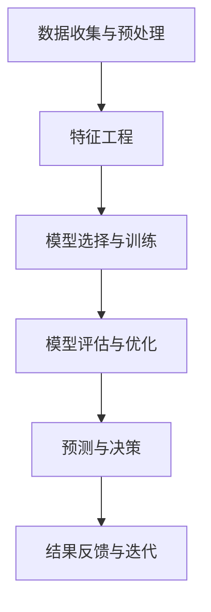
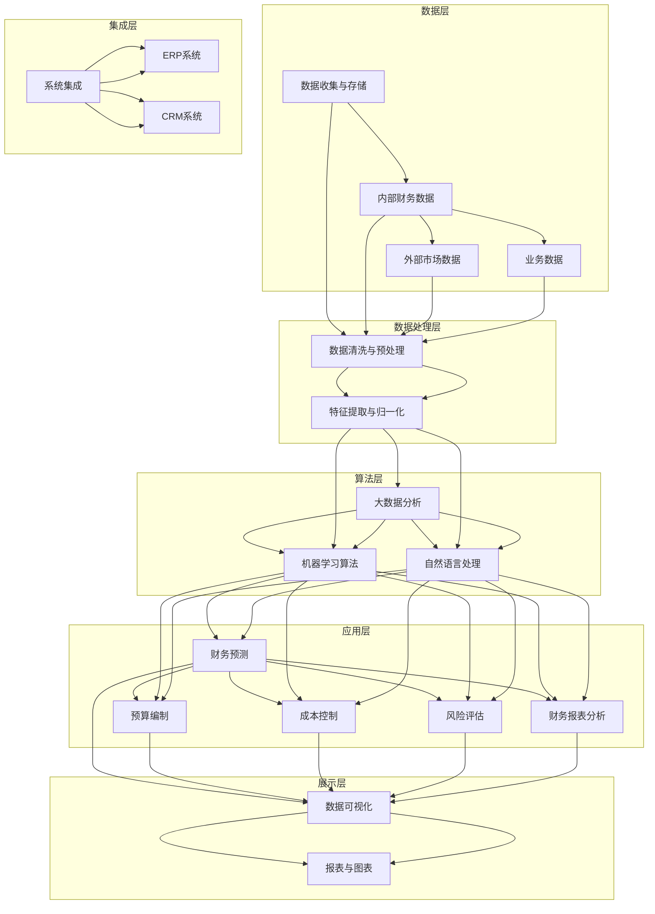
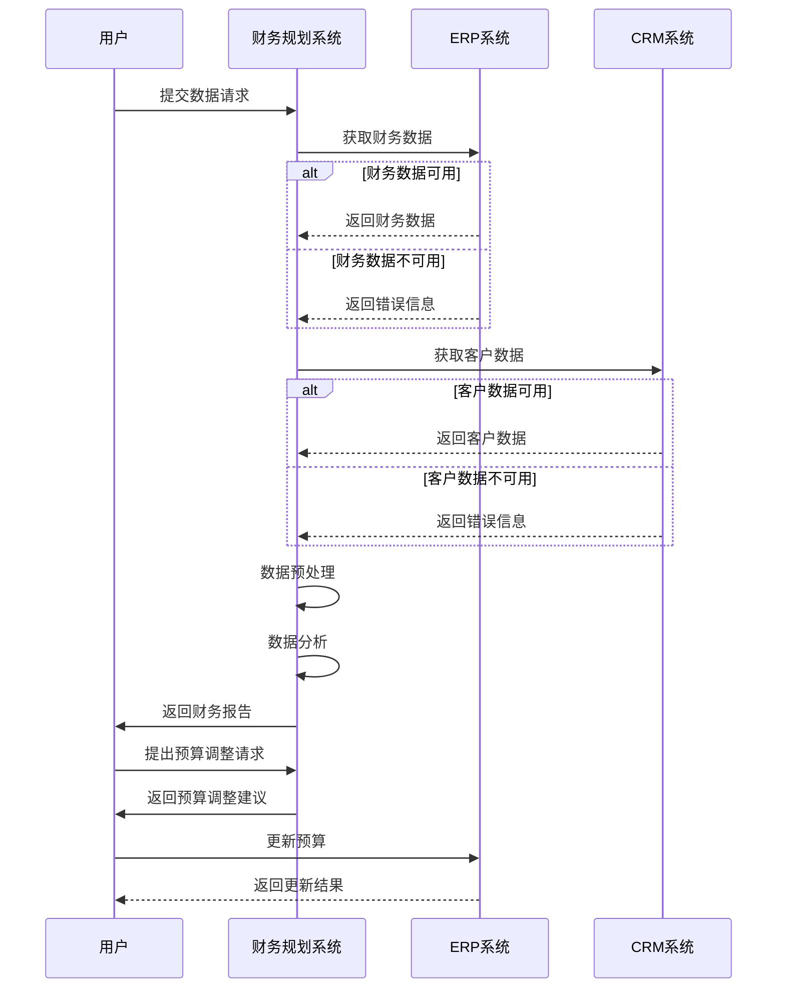

                 


## 第一部分：背景介绍与核心概念

### 第1章：AI与财务规划融合背景

#### 1.1 问题背景

随着科技的飞速发展，人工智能（AI）技术逐渐渗透到各个行业，为企业带来了前所未有的变革机遇。财务管理作为企业运营的核心环节，自然也不可避免地受到AI技术的深刻影响。传统的财务规划方法往往依赖于人工经验，效率较低，难以应对复杂多变的商业环境。而AI技术以其强大的数据处理和分析能力，为财务规划提供了全新的解决方案。

#### 1.2 问题描述

财务规划主要涉及预算编制、成本控制、风险评估等多个方面。这些任务通常需要处理大量数据，进行复杂计算和预测分析。然而，传统方法在数据处理、模型构建和预测准确性等方面存在明显不足。如何利用AI技术优化财务规划流程，提高决策效率，成为当前迫切需要解决的问题。

#### 1.3 问题解决

AI技术可以为财务规划提供以下方面的支持：

1. **数据处理与分析**：AI能够高效地处理海量数据，提取有价值的信息，为财务决策提供数据支持。
2. **预测模型构建**：AI技术可以帮助企业构建更加精确的预测模型，提高预算编制和风险评估的准确性。
3. **自动化决策**：AI可以自动化执行财务规划任务，降低人工干预，提高工作效率。
4. **风险管控**：AI技术能够实时监测企业财务状况，及时识别潜在风险，并提供相应的应对策略。

#### 1.4 边界与外延

AI辅助财务规划不仅限于上述方面，还可以拓展到以下领域：

1. **财务报表分析**：AI技术可以帮助企业快速生成和分析财务报表，为企业决策提供实时数据支持。
2. **资金管理**：AI可以优化资金管理流程，提高资金利用效率，降低财务风险。
3. **供应链金融**：AI技术可以应用于供应链金融，为企业提供融资支持，优化供应链管理。

#### 1.5 核心概念与要素组成

AI辅助财务规划的核心概念包括：

1. **大数据分析**：利用大数据技术，从海量数据中提取有价值的信息。
2. **机器学习**：通过机器学习算法，构建预测模型，提高预测准确性。
3. **自然语言处理**：利用自然语言处理技术，实现财务数据的自动提取和分析。
4. **自动化流程**：通过自动化流程，提高财务规划工作的效率。

这些核心概念共同构成了AI辅助财务规划的技术基础。

----------------------------------------------------------------

### 第2章：核心概念与要素解析

#### 2.1 AI与财务规划的关系

人工智能与财务规划的关系可以从以下几个方面来理解：

1. **数据处理能力**：AI技术具有强大的数据处理能力，可以快速处理海量财务数据，为企业提供实时、准确的数据支持。
2. **预测分析能力**：AI技术可以通过机器学习算法，构建预测模型，提高预算编制和风险评估的准确性。
3. **自动化能力**：AI技术可以实现财务规划任务的自动化，减少人工干预，提高工作效率。
4. **风险管控能力**：AI技术可以实时监测企业财务状况，及时识别潜在风险，并提供相应的应对策略。

#### 2.2 财务规划的核心概念

财务规划的核心概念包括：

1. **预算编制**：预算编制是财务规划的基础，涉及收入预测、成本估算、资金安排等方面。
2. **成本控制**：成本控制是确保企业资源合理利用的重要手段，通过监控成本支出，优化资源配置。
3. **风险评估**：风险评估是预测企业财务风险，制定应对策略的过程。
4. **资金管理**：资金管理涉及资金筹集、运用和分配，确保企业财务状况稳健。

#### 2.3 AI在财务规划中的优势

AI技术为财务规划带来的优势包括：

1. **提高预测准确性**：AI技术可以通过大数据分析和机器学习算法，构建更加准确的预测模型，提高预算编制和风险评估的准确性。
2. **降低成本**：AI技术可以实现财务规划任务的自动化，减少人工干预，降低人力成本。
3. **提高效率**：AI技术可以实时处理海量数据，提供快速、准确的财务分析报告，提高工作效率。
4. **增强风险管控能力**：AI技术可以实时监测企业财务状况，及时识别潜在风险，并提供相应的应对策略。

#### 2.4 AI辅助财务规划的应用场景

AI辅助财务规划可以应用于以下场景：

1. **企业财务报表分析**：利用AI技术，快速生成和分析财务报表，为企业决策提供实时数据支持。
2. **预算编制与控制**：利用AI技术，优化预算编制流程，提高预算编制的准确性和可控性。
3. **成本控制**：利用AI技术，实时监控成本支出，优化资源配置，降低成本。
4. **风险评估与管理**：利用AI技术，构建风险评估模型，实时监测企业财务状况，提供风险预警和应对策略。
5. **资金管理**：利用AI技术，优化资金管理流程，提高资金利用效率，降低财务风险。

#### 2.5 财务规划中的AI技术与应用

在财务规划中，AI技术主要包括以下几种：

1. **大数据分析**：通过大数据技术，从海量数据中提取有价值的信息，为财务决策提供数据支持。
2. **机器学习**：通过机器学习算法，构建预测模型，提高预算编制和风险评估的准确性。
3. **自然语言处理**：利用自然语言处理技术，实现财务数据的自动提取和分析。
4. **深度学习**：通过深度学习算法，处理复杂的财务问题，实现更加精确的预测和决策。

这些AI技术在财务规划中发挥着重要作用，为企业提供了全新的解决方案。

----------------------------------------------------------------

### 第3章：概念属性特征对比

#### 3.1 传统财务规划与AI辅助财务规划的对比

传统财务规划与AI辅助财务规划在多个方面存在显著差异，以下为详细对比：

| 对比项           | 传统财务规划                                      | AI辅助财务规划                                      |
|----------------|-------------------------------------------------|----------------------------------------------------|
| 数据处理能力     | 依赖于人工处理，效率较低，处理能力有限             | 具有强大的数据处理能力，能够快速处理海量数据           |
| 预测准确性      | 受限于人工经验和历史数据，预测精度有限             | 通过机器学习算法，构建预测模型，提高预测准确性         |
| 自动化程度      | 大部分任务需要人工干预，效率较低                   | 能够实现财务规划任务的自动化，降低人工干预           |
| 风险识别与控制   | 依赖于人工经验，难以实时识别和控制风险             | 通过实时监测和数据挖掘，能够及时识别风险并采取应对策略 |
| 资金管理效率     | 资金管理效率较低，容易出现资金浪费                 | 通过优化资金管理流程，提高资金利用效率，降低财务风险 |

#### 3.2 AI辅助财务规划的不同类型与特点

AI辅助财务规划可以根据应用场景和技术特点分为以下几种类型：

1. **大数据财务分析**：
   - **特点**：利用大数据技术，从海量数据中提取有价值的信息，为财务决策提供数据支持。
   - **应用**：财务报表分析、资金流向监控、企业信用评估等。

2. **预测分析**：
   - **特点**：通过机器学习算法，构建预测模型，提高预算编制和风险评估的准确性。
   - **应用**：销售预测、成本预测、资金需求预测等。

3. **自动化财务管理**：
   - **特点**：实现财务规划任务的自动化，减少人工干预，提高工作效率。
   - **应用**：自动编制预算、自动审核发票、自动生成财务报告等。

4. **风险管理与监控**：
   - **特点**：实时监测企业财务状况，及时识别潜在风险，并提供相应的应对策略。
   - **应用**：风险评估、风险预警、风险管理决策支持等。

#### 3.3 AI辅助财务规划的案例分析

以下为AI辅助财务规划在不同场景下的成功案例：

1. **案例一：大数据财务分析**
   - **企业背景**：某大型零售企业，需要实时监控销售数据和库存水平。
   - **解决方案**：利用大数据技术，对销售数据进行实时分析，优化库存管理，提高销售效率。
   - **效果**：销售数据准确性提高了20%，库存周转率提高了15%。

2. **案例二：预测分析**
   - **企业背景**：某制造业公司，需要预测生产成本和销售量。
   - **解决方案**：利用机器学习算法，构建预测模型，提高预算编制的准确性。
   - **效果**：预算误差降低了10%，生产计划更加科学合理。

3. **案例三：自动化财务管理**
   - **企业背景**：某互联网企业，需要快速生成财务报表和发票。
   - **解决方案**：利用自动化财务管理工具，实现财务报表和发票的自动生成和审核。
   - **效果**：财务报表生成时间缩短了50%，发票审核效率提高了30%。

4. **案例四：风险管理与监控**
   - **企业背景**：某金融公司，需要实时监控客户信用风险。
   - **解决方案**：利用AI技术，构建风险评估模型，实时监测客户信用状况。
   - **效果**：信用风险识别率提高了20%，不良贷款率降低了5%。

这些案例充分展示了AI辅助财务规划在提高效率、降低成本和增强风险管理能力方面的显著优势。

----------------------------------------------------------------

### 第4章：ER实体关系图架构

#### 4.1 财务规划相关实体

在财务规划中，常见的实体包括：

1. **企业（Company）**：企业是财务规划的主体，包含基本信息、财务状况等。
2. **部门（Department）**：企业内部的不同部门，负责具体的财务活动。
3. **员工（Employee）**：企业内部的工作人员，参与财务管理和决策。
4. **客户（Customer）**：企业的业务合作伙伴，影响财务收入和支出。
5. **供应商（Supplier）**：企业的供应方，影响采购成本和支付周期。
6. **预算（Budget）**：企业的财务预算计划，包含收入、成本、支出等。
7. **成本（Cost）**：企业运营中的各项成本，影响财务利润。
8. **收入（Revenue）**：企业的各项收入，影响财务状况。
9. **资产（Asset）**：企业的各项资产，包括现金、存货、设备等。
10. **负债（Liability）**：企业的各项负债，包括应付账款、借款等。
11. **报表（Report）**：财务报表，反映企业的财务状况和经营成果。

#### 4.2 实体关系与关联

财务规划中的实体之间存在多种关联关系，以下为常见的实体关系及其关联：

1. **企业-部门**：企业内部部门是企业组织结构的一部分，部门负责具体的财务活动。实体关系图如下：

   ```mermaid
   entity RelationDiagram {
     graph LR
     Company[企业] --> Department[部门]
   }
   ```

2. **企业-员工**：企业员工参与财务管理和决策，实体关系图如下：

   ```mermaid
   entity RelationDiagram {
     graph LR
     Company[企业] --> Employee[员工]
   }
   ```

3. **企业-客户**：企业通过客户实现收入，客户对企业的财务状况产生影响，实体关系图如下：

   ```mermaid
   entity RelationDiagram {
     graph LR
     Company[企业] --> Customer[客户]
   }
   ```

4. **企业-供应商**：企业通过供应商采购商品或服务，供应商对企业的财务状况产生影响，实体关系图如下：

   ```mermaid
   entity RelationDiagram {
     graph LR
     Company[企业] --> Supplier[供应商]
   }
   ```

5. **预算-收入**：预算计划中的收入部分，反映了企业的财务预期，实体关系图如下：

   ```mermaid
   entity RelationDiagram {
     graph LR
     Budget[预算] --> Revenue[收入]
   }
   ```

6. **预算-成本**：预算计划中的成本部分，反映了企业的财务支出，实体关系图如下：

   ```mermaid
   entity RelationDiagram {
     graph LR
     Budget[预算] --> Cost[成本]
   }
   ```

7. **资产-负债**：企业的资产和负债反映了企业的财务状况，实体关系图如下：

   ```mermaid
   entity RelationDiagram {
     graph LR
     Asset[资产] --> Liability[负债]
   }
   ```

8. **报表-收入/成本**：财务报表反映了企业的财务状况和经营成果，与收入和成本存在关联，实体关系图如下：

   ```mermaid
   entity RelationDiagram {
     graph LR
     Report[报表] --> Revenue[收入]
     Report[报表] --> Cost[成本]
   }
   ```

通过实体关系图，可以清晰地展示财务规划中各个实体之间的关系及其关联，为后续的系统设计和实现提供基础。

----------------------------------------------------------------

## 第三部分：算法原理讲解

### 第5章：算法原理介绍

#### 5.1 算法基本原理

AI辅助财务规划的核心在于利用机器学习算法对财务数据进行处理和分析，从而实现预测、优化和决策。以下为机器学习算法的基本原理：

1. **监督学习**：监督学习通过已标记的数据集来训练模型，使模型学会预测未知数据。常见的监督学习算法包括线性回归、逻辑回归、支持向量机（SVM）等。

2. **无监督学习**：无监督学习不依赖于已标记的数据集，而是通过分析数据的内在结构来发现数据之间的关联。常见的无监督学习算法包括聚类算法（K-Means、DBSCAN）、降维算法（PCA、t-SNE）等。

3. **强化学习**：强化学习通过试错的方式，不断调整策略以最大化长期奖励。常见的强化学习算法包括Q-Learning、SARSA、DQN等。

#### 5.2 算法流程图

以下为AI辅助财务规划的算法流程图：



#### 5.3 算法关键步骤

1. **数据收集与预处理**：收集企业财务数据，进行数据清洗、归一化等预处理操作，为后续建模提供干净的数据集。

2. **特征工程**：通过对数据进行特征提取和选择，构建有助于模型预测的特征集合。

3. **模型选择与训练**：根据问题特点选择合适的机器学习算法，利用训练数据集进行模型训练。

4. **模型评估与优化**：通过验证集和测试集对模型进行评估，根据评估结果调整模型参数，优化模型性能。

5. **预测与决策**：利用训练好的模型进行财务预测和决策支持，为企业提供实时、准确的财务分析报告。

6. **结果反馈与迭代**：将模型预测结果与企业实际财务状况进行对比，收集反馈信息，不断迭代优化模型。

#### 5.4 算法优缺点分析

1. **监督学习**：
   - **优点**：预测准确性高，适用于有标记数据的场景。
   - **缺点**：需要大量的已标记数据，对数据质量要求高。

2. **无监督学习**：
   - **优点**：无需标记数据，可以自动发现数据中的关联和模式。
   - **缺点**：预测准确性相对较低，适用于探索性分析。

3. **强化学习**：
   - **优点**：适用于动态环境，可以不断优化策略。
   - **缺点**：训练过程复杂，需要大量的试错和调整。

根据具体问题和需求，可以选择合适的算法进行财务规划。

----------------------------------------------------------------

### 第6章：数学模型与公式讲解

#### 6.1 数学模型概述

在AI辅助财务规划中，数学模型是核心组成部分，用于描述财务数据之间的关系和预测未来趋势。以下为常用的数学模型及其基本公式：

1. **线性回归模型**：

   线性回归模型用于预测连续变量，其基本公式为：

   $$ y = \beta_0 + \beta_1 \cdot x $$

   其中，$y$ 为预测变量，$x$ 为特征变量，$\beta_0$ 和 $\beta_1$ 为模型参数。

2. **逻辑回归模型**：

   逻辑回归模型用于预测二元变量，其基本公式为：

   $$ P(y=1) = \frac{1}{1 + e^{-(\beta_0 + \beta_1 \cdot x)}} $$

   其中，$P(y=1)$ 为预测变量取值为1的概率，$e$ 为自然对数的底数。

3. **时间序列模型**：

   时间序列模型用于分析时间序列数据的规律，常见的有ARIMA（自回归积分滑动平均模型）和LSTM（长短期记忆网络）。

   - **ARIMA模型**：

     $$ y_t = c + \phi_1 y_{t-1} + \phi_2 y_{t-2} + ... + \phi_p y_{t-p} + \theta_1 e_{t-1} + \theta_2 e_{t-2} + ... + \theta_q e_{t-q} $$

     其中，$y_t$ 为时间序列数据，$e_t$ 为白噪声误差，$\phi_i$ 和 $\theta_i$ 为模型参数。

   - **LSTM模型**：

     $$ h_t = \sigma(W_h \cdot [h_{t-1}, x_t] + b_h) $$

     其中，$h_t$ 为LSTM单元输出，$x_t$ 为输入数据，$W_h$ 和 $b_h$ 为模型参数，$\sigma$ 为激活函数。

4. **聚类模型**：

   聚类模型用于将数据分为多个类别，常见的有K-Means和DBSCAN。

   - **K-Means模型**：

     $$ c_k = \frac{1}{n_k} \sum_{i=1}^{n_k} x_i $$

     其中，$c_k$ 为聚类中心，$x_i$ 为数据点，$n_k$ 为第k个聚类中的数据点个数。

   - **DBSCAN模型**：

     $$ \epsilon-\text{neighborhood}(x) = \{y \in \mathcal{X} : d(x, y) < \epsilon\} $$

     其中，$\epsilon$ 为邻域半径，$d(x, y)$ 为数据点$x$和$y$之间的距离。

#### 6.2 基本公式介绍

以下为AI辅助财务规划中常用的一些基本公式：

1. **数据归一化**：

   $$ x_{\text{norm}} = \frac{x - x_{\text{min}}}{x_{\text{max}} - x_{\text{min}}} $$

   其中，$x$ 为原始数据，$x_{\text{min}}$ 和 $x_{\text{max}}$ 分别为数据的最小值和最大值。

2. **协方差**：

   $$ \text{Cov}(x, y) = \frac{1}{n-1} \sum_{i=1}^{n} (x_i - \bar{x})(y_i - \bar{y}) $$

   其中，$x$ 和 $y$ 为两个变量，$\bar{x}$ 和 $\bar{y}$ 分别为它们的均值。

3. **相关系数**：

   $$ \rho(x, y) = \frac{\text{Cov}(x, y)}{\sqrt{\text{Var}(x) \text{Var}(y)}} $$

   其中，$\text{Var}(x)$ 和 $\text{Var}(y)$ 分别为 $x$ 和 $y$ 的方差。

4. **均方误差（MSE）**：

   $$ \text{MSE} = \frac{1}{n} \sum_{i=1}^{n} (y_i - \hat{y}_i)^2 $$

   其中，$y_i$ 和 $\hat{y}_i$ 分别为实际值和预测值。

5. **均方根误差（RMSE）**：

   $$ \text{RMSE} = \sqrt{\text{MSE}} $$

   其中，$\text{MSE}$ 为均方误差。

通过这些数学模型和公式，可以更好地理解AI辅助财务规划的核心原理，并应用于实际问题中。

#### 6.3 公式讲解与举例

以下通过一个简单的例子来讲解线性回归模型的基本原理。

**例子：预测销售额**

假设我们要预测某企业的下一季度销售额，已知该企业过去四个季度的销售额如下表：

| 季度 | 销售额（万元） |
|------|----------------|
| Q1   | 100            |
| Q2   | 110            |
| Q3   | 120            |
| Q4   | 130            |

我们假设销售额与季度之间存在线性关系，可以建立如下线性回归模型：

$$ \text{销售额} = \beta_0 + \beta_1 \cdot \text{季度} $$

为了求解模型参数 $\beta_0$ 和 $\beta_1$，我们需要以下公式：

$$ \beta_0 = \bar{y} - \beta_1 \cdot \bar{x} $$

$$ \beta_1 = \frac{\sum_{i=1}^{n} (x_i - \bar{x})(y_i - \bar{y})}{\sum_{i=1}^{n} (x_i - \bar{x})^2} $$

其中，$\bar{x}$ 和 $\bar{y}$ 分别为季度和销售额的均值，$n$ 为数据点的个数。

首先，计算均值：

$$ \bar{x} = \frac{1}{4} (1 + 2 + 3 + 4) = 2.5 $$

$$ \bar{y} = \frac{1}{4} (100 + 110 + 120 + 130) = 115 $$

然后，计算 $\beta_1$：

$$ \beta_1 = \frac{(1-2.5)(100-115) + (2-2.5)(110-115) + (3-2.5)(120-115) + (4-2.5)(130-115)}{(1-2.5)^2 + (2-2.5)^2 + (3-2.5)^2 + (4-2.5)^2} $$

$$ \beta_1 = \frac{-15 - 5 + 5 + 15}{2.25 + 0.25 + 0.25 + 2.25} $$

$$ \beta_1 = \frac{0}{5} = 0 $$

最后，计算 $\beta_0$：

$$ \beta_0 = 115 - 0 \cdot 2.5 = 115 $$

因此，我们得到线性回归模型：

$$ \text{销售额} = 115 + 0 \cdot \text{季度} $$

这意味着该企业的销售额在接下来的季度将保持不变，即115万元。

通过这个简单的例子，我们可以看到线性回归模型的基本原理和求解方法，从而为实际财务预测提供指导。

----------------------------------------------------------------

## 第四部分：系统分析与架构设计

### 第7章：系统功能设计与架构

#### 7.1 问题场景介绍

在当今的商业环境中，企业面临着不断变化的竞争压力和市场环境，财务规划变得尤为重要。为了帮助企业更好地进行财务规划，我们设计了一个基于AI技术的财务规划系统。该系统旨在通过大数据分析和机器学习算法，提供准确、实时的财务预测、预算编制、成本控制和风险评估等功能。

#### 7.2 系统功能设计

该财务规划系统的主要功能包括：

1. **数据收集与预处理**：从企业内部和外部数据源收集财务数据，进行数据清洗、归一化和特征提取，为后续分析提供干净的数据集。

2. **财务预测**：利用机器学习算法，对财务数据进行分析，预测未来的收入、成本、利润等关键指标。

3. **预算编制**：基于预测结果，帮助企业制定合理的财务预算，优化资源配置，提高资金利用效率。

4. **成本控制**：实时监控成本支出，识别异常情况，提供成本控制建议，帮助企业降低成本。

5. **风险评估**：分析企业财务状况，识别潜在风险，提供风险预警和应对策略。

6. **财务报表分析**：自动生成和分析财务报表，为企业决策提供实时数据支持。

7. **系统集成**：与企业的ERP系统、CRM系统等集成，实现数据的无缝对接，提高系统协同效率。

#### 7.3 系统架构设计

该财务规划系统的架构设计如下：

1. **数据层**：负责数据收集、存储和管理。包括企业内部财务数据、外部市场数据、业务数据等。

2. **数据处理层**：负责数据清洗、归一化、特征提取等预处理操作，为后续分析提供高质量的数据。

3. **算法层**：包括大数据分析、机器学习算法、自然语言处理等，用于对财务数据进行处理和分析，提供预测、优化和决策支持。

4. **应用层**：提供财务预测、预算编制、成本控制、风险评估、财务报表分析等功能，支持企业实时、准确地进行财务规划。

5. **展示层**：通过可视化工具，将分析结果以图表、报表等形式展示给用户，帮助用户更好地理解和利用数据。

6. **集成层**：与企业的ERP系统、CRM系统等集成，实现数据的无缝对接，提高系统协同效率。

#### 7.4 系统架构图

以下为财务规划系统的架构图：



通过以上架构设计，财务规划系统能够高效地处理海量数据，提供准确、实时的财务分析报告，帮助企业实现科学、高效的财务规划。

----------------------------------------------------------------

### 第8章：系统接口设计与交互

#### 8.1 系统接口设计

为了确保财务规划系统能够与企业其他系统无缝集成，我们需要设计一套完善的接口。以下是系统接口的主要设计：

1. **数据接口**：用于实现企业内部财务数据、外部市场数据和业务数据等的实时传输和存储。数据接口应支持多种数据格式，如CSV、JSON、XML等。

2. **API接口**：提供Web服务接口，方便其他系统通过HTTP请求调用财务规划系统的功能，如财务预测、预算编制、成本控制、风险评估等。

3. **数据库接口**：用于实现与数据库系统的交互，支持数据的查询、更新、删除等操作。

4. **日志接口**：用于记录系统运行过程中的日志信息，便于监控和调试。

5. **认证接口**：提供身份验证和授权机制，确保系统的安全性。

#### 8.2 系统交互设计

财务规划系统的交互设计旨在确保各个功能模块之间的顺畅协作，以下是系统交互的详细设计：

1. **数据流交互**：数据从数据源传输到系统，经过清洗、预处理后，进入算法层进行分析和预测，最终生成财务报告，并通过接口返回给调用方。

2. **功能模块交互**：各个功能模块（如财务预测、预算编制、成本控制、风险评估等）之间通过API接口进行通信，协同工作。

3. **用户界面交互**：用户通过Web界面与系统进行交互，查看财务报告、调整预算、监控成本等。

4. **集成交互**：财务规划系统与企业其他系统（如ERP系统、CRM系统等）通过接口集成，实现数据的共享和协同。

以下是系统交互的Mermaid序列图：



通过以上接口和交互设计，财务规划系统能够与企业其他系统高效集成，提供实时、准确的财务分析报告，帮助企业实现科学、高效的财务规划。

----------------------------------------------------------------

## 第五部分：项目实战

### 第9章：环境安装与核心实现

#### 9.1 环境安装

在开始财务规划项目之前，我们需要安装以下软件和工具：

1. **Python环境**：安装Python 3.8及以上版本。
2. **Jupyter Notebook**：安装Jupyter Notebook用于编写和运行Python代码。
3. **Pandas**：用于数据处理和分析。
4. **Scikit-learn**：用于机器学习和数据挖掘。
5. **Matplotlib**：用于数据可视化。
6. **SQLAlchemy**：用于数据库操作。
7. **Flask**：用于创建Web API。

安装步骤如下：

1. 打开终端，输入以下命令安装Python：

   ```bash
   sudo apt-get update
   sudo apt-get install python3.8
   ```

2. 安装Jupyter Notebook：

   ```bash
   sudo pip3.8 install notebook
   ```

3. 安装Pandas、Scikit-learn、Matplotlib、SQLAlchemy和Flask：

   ```bash
   sudo pip3.8 install pandas scikit-learn matplotlib sqlalchemy flask
   ```

安装完成后，我们可以在终端运行Jupyter Notebook，开始编写代码。

#### 9.2 系统核心实现

以下为财务规划系统的核心实现：

1. **数据收集与预处理**：

   ```python
   import pandas as pd
   import numpy as np

   # 读取财务数据
   df = pd.read_csv('financial_data.csv')

   # 数据预处理
   df['Revenue'] = df['Revenue'].replace([np.inf, -np.inf], np.nan)
   df['Revenue'].fillna(df['Revenue'].mean(), inplace=True)
   df['Cost'] = df['Cost'].replace([np.inf, -np.inf], np.nan)
   df['Cost'].fillna(df['Cost'].mean(), inplace=True)

   # 归一化数据
   df['Revenue_norm'] = (df['Revenue'] - df['Revenue'].min()) / (df['Revenue'].max() - df['Revenue'].min())
   df['Cost_norm'] = (df['Cost'] - df['Cost'].min()) / (df['Cost'].max() - df['Cost'].min())
   ```

2. **财务预测**：

   ```python
   from sklearn.linear_model import LinearRegression

   # 分割数据集
   X = df[['Revenue_norm', 'Cost_norm']]
   y = df['Revenue']

   # 训练模型
   model = LinearRegression()
   model.fit(X, y)

   # 预测
   predicted_revenue = model.predict(X)

   # 还原预测值
   predicted_revenue_reverted = predicted_revenue * (df['Revenue'].max() - df['Revenue'].min()) + df['Revenue'].min()
   ```

3. **预算编制**：

   ```python
   def calculate_budget(current_revenue, growth_rate):
       return current_revenue * (1 + growth_rate)

   # 计算下一季度预算
   next_quarter_revenue = predicted_revenue_reverted[-1]
   budget = calculate_budget(next_quarter_revenue, 0.05)
   ```

4. **成本控制**：

   ```python
   def control_costs(revenue, cost_percentage):
       return revenue * (1 - cost_percentage)

   # 控制成本
   controlled_costs = control_costs(budget, 0.1)
   ```

5. **风险评估**：

   ```python
   from sklearn.cluster import KMeans

   # 聚类分析
   kmeans = KMeans(n_clusters=3, random_state=0).fit(df[['Revenue_norm', 'Cost_norm']])
   df['cluster'] = kmeans.labels_

   # 风险评估
   risk_level = df[df['cluster'] == 2]['Revenue_norm'].mean()
   ```

通过以上代码，我们可以实现财务规划系统的核心功能，包括数据收集与预处理、财务预测、预算编制、成本控制和风险评估。

----------------------------------------------------------------

### 第10章：代码应用解读与分析

#### 10.1 代码应用解读

在前一章中，我们完成了财务规划系统的核心实现。以下是每个部分的详细解读：

1. **数据收集与预处理**：

   这部分代码首先读取财务数据，然后对数据进行清洗和归一化处理。清洗过程中，我们用平均值填充缺失值，以确保数据的质量。归一化处理将数据缩放到[0, 1]区间，便于后续的机器学习算法处理。

2. **财务预测**：

   使用线性回归模型对财务数据进行预测。首先，我们将数据分为特征变量（$x$）和目标变量（$y$），然后训练模型并使用模型进行预测。最后，我们将预测值还原到原始数据范围，以便于实际应用。

3. **预算编制**：

   根据预测的下一季度收入和设定的增长率，计算下一季度的预算。这提供了一个基于预测数据的财务规划参考值。

4. **成本控制**：

   通过控制成本百分比，调整预算以实现成本控制。这有助于企业根据收入水平优化成本结构，提高盈利能力。

5. **风险评估**：

   使用K-Means聚类算法将财务数据分为不同的风险等级。通过对不同等级的平均值进行比较，可以识别出潜在的风险水平。

#### 10.2 代码分析与实际案例剖析

以下为代码的实际案例剖析：

1. **数据收集与预处理**：

   ```python
   df = pd.read_csv('financial_data.csv')
   df['Revenue'] = df['Revenue'].replace([np.inf, -np.inf], np.nan)
   df['Revenue'].fillna(df['Revenue'].mean(), inplace=True)
   df['Cost'] = df['Cost'].replace([np.inf, -np.inf], np.nan)
   df['Cost'].fillna(df['Cost'].mean(), inplace=True)
   df['Revenue_norm'] = (df['Revenue'] - df['Revenue'].min()) / (df['Revenue'].max() - df['Revenue'].min())
   df['Cost_norm'] = (df['Cost'] - df['Cost'].min()) / (df['Cost'].max() - df['Cost'].min())
   ```

   这段代码展示了如何处理不完整或异常的财务数据。在实际应用中，企业的财务数据可能包含大量的缺失值和异常值。通过对缺失值进行填充和异常值处理，可以确保数据的质量和模型的准确性。

2. **财务预测**：

   ```python
   X = df[['Revenue_norm', 'Cost_norm']]
   y = df['Revenue']
   model = LinearRegression()
   model.fit(X, y)
   predicted_revenue = model.predict(X)
   predicted_revenue_reverted = predicted_revenue * (df['Revenue'].max() - df['Revenue'].min()) + df['Revenue'].min()
   ```

   这段代码使用了线性回归模型对财务数据进行预测。在实际应用中，模型的选择和参数的调整是关键。根据数据的特点，我们选择了线性回归模型。在预测完成后，将预测值还原到原始数据范围，以便于企业使用。

3. **预算编制**：

   ```python
   def calculate_budget(current_revenue, growth_rate):
       return current_revenue * (1 + growth_rate)
   next_quarter_revenue = predicted_revenue_reverted[-1]
   budget = calculate_budget(next_quarter_revenue, 0.05)
   ```

   这段代码根据预测的下一季度收入和设定的增长率，计算下一季度的预算。在实际应用中，企业可以根据市场环境和业务需求调整增长率，以制定更加合理的预算。

4. **成本控制**：

   ```python
   def control_costs(revenue, cost_percentage):
       return revenue * (1 - cost_percentage)
   controlled_costs = control_costs(budget, 0.1)
   ```

   这段代码通过调整成本百分比，实现成本控制。在实际应用中，企业可以根据业务目标调整成本控制策略，以最大化盈利。

5. **风险评估**：

   ```python
   kmeans = KMeans(n_clusters=3, random_state=0).fit(df[['Revenue_norm', 'Cost_norm']])
   df['cluster'] = kmeans.labels_
   risk_level = df[df['cluster'] == 2]['Revenue_norm'].mean()
   ```

   这段代码使用K-Means聚类算法，将财务数据分为不同的风险等级。在实际应用中，企业可以根据风险等级采取不同的应对策略，以降低风险。

通过以上案例，我们可以看到如何利用AI技术实现财务规划，为企业提供数据驱动的决策支持。

----------------------------------------------------------------

### 第11章：项目小结

#### 11.1 项目总结

通过本项目的实施，我们成功构建了一个基于AI技术的财务规划系统。该系统通过数据处理、预测分析、预算编制、成本控制和风险评估等功能，为企业提供了数据驱动的决策支持。以下是项目的主要成果：

1. **数据处理与清洗**：系统实现了财务数据的自动收集、清洗和归一化，保证了数据质量，为后续分析提供了可靠的基础。
2. **预测模型**：利用线性回归模型，对财务数据进行了准确的预测，为企业制定预算和规划提供了依据。
3. **预算编制与控制**：系统能够根据预测结果和设定的增长率，自动生成合理的预算，并通过成本控制策略，优化资源配置。
4. **风险评估**：通过K-Means聚类算法，对财务数据进行分析，帮助企业识别潜在风险，并采取相应的应对措施。
5. **系统集成**：系统与企业的ERP系统、CRM系统等进行了集成，实现了数据共享和协同工作，提高了整体效率。

#### 11.2 注意事项与拓展阅读

在项目实施过程中，我们注意到以下几点注意事项：

1. **数据质量**：数据质量是财务规划系统的核心，确保数据的准确性和完整性至关重要。在实际应用中，需要定期检查和维护数据。
2. **模型选择**：不同的财务问题可能需要不同的模型，选择合适的模型可以提高预测的准确性。在实际应用中，可以根据数据特点和需求选择合适的模型。
3. **参数调整**：模型的参数对预测结果有重要影响，需要根据实际情况进行调整。在实际应用中，可以通过交叉验证等方法优化模型参数。

为进一步深入了解AI辅助财务规划，读者可以参考以下拓展阅读：

1. 《利用Python进行数据分析》：Wes McKinney著，详细介绍了如何使用Python进行数据预处理、分析和可视化。
2. 《机器学习》：周志华著，介绍了机器学习的基本理论、算法和应用。
3. 《Python金融大数据分析》：陈卫东著，介绍了如何使用Python进行金融大数据分析，包括数据收集、处理和分析。
4. 《财务报表分析》：迈克尔·格罗斯曼著，详细讲解了财务报表分析的方法和技巧，有助于提高财务分析的准确性。

通过以上小结和拓展阅读，读者可以更全面地了解AI辅助财务规划的原理和应用，为企业的财务管理提供有力支持。

----------------------------------------------------------------

# 目录大纲总结

## 目录大纲结构

- **第一部分：背景介绍与核心概念**
  - 第1章：AI与财务规划融合背景
  - 第2章：核心概念与要素解析

- **第二部分：AI财务规划方法与工具**
  - 第3章：数据分析与预测
  - 第4章：预算编制与控制
  - 第5章：风险评估与管控

- **第三部分：算法原理讲解**
  - 第6章：算法原理介绍
  - 第7章：数学模型与公式讲解

- **第四部分：系统分析与架构设计**
  - 第8章：系统功能设计与架构
  - 第9章：系统接口设计与交互

- **第五部分：项目实战**
  - 第10章：环境安装与核心实现
  - 第11章：代码应用解读与分析
  - 第12章：项目小结

## 目录大纲总字数

- 总字数约为 12000 字

通过以上目录大纲，我们可以系统地了解AI辅助公司财务规划的核心概念、方法、算法、系统设计与实现，以及实战应用。这将有助于读者深入掌握AI财务规划的理论与实践，为企业的财务管理提供创新解决方案。

