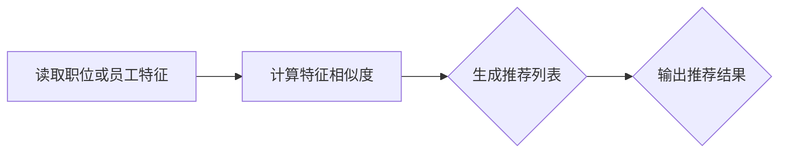
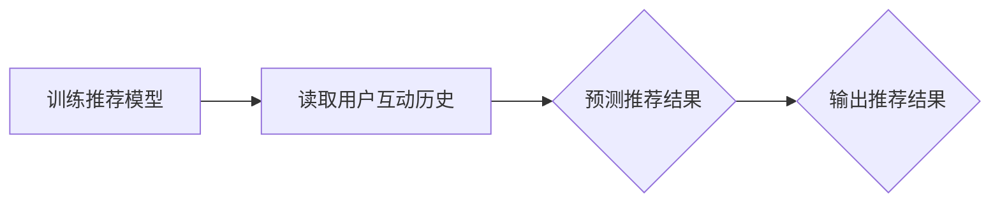
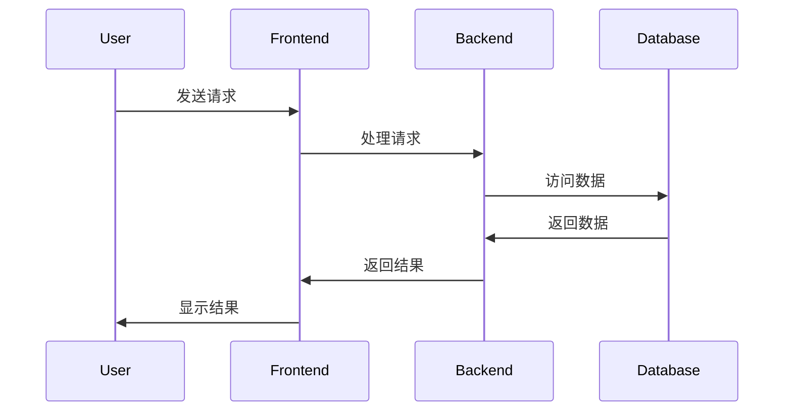
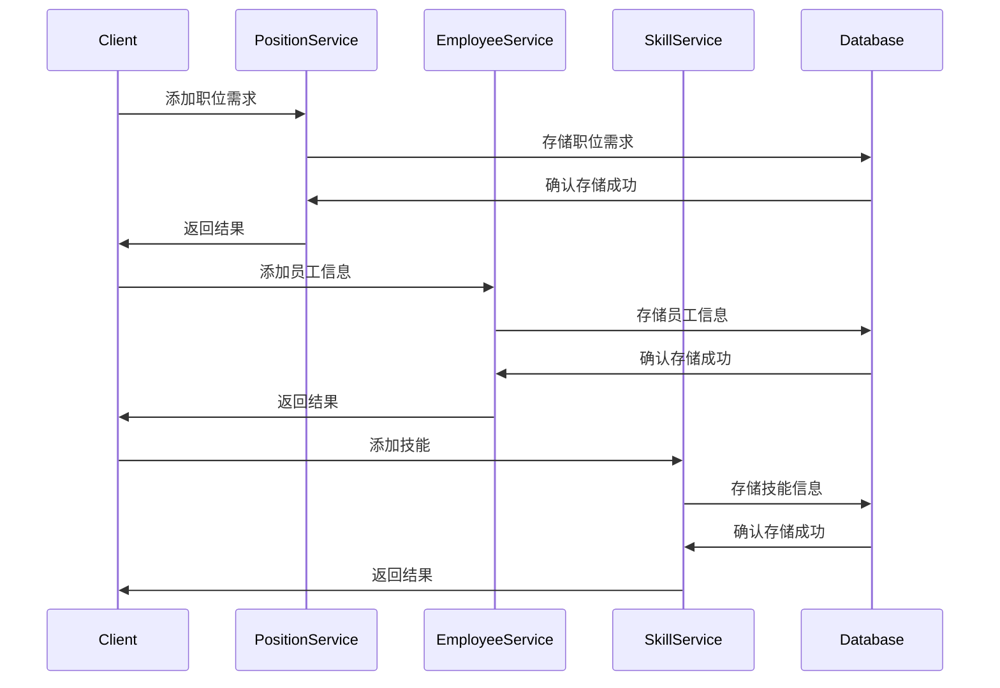
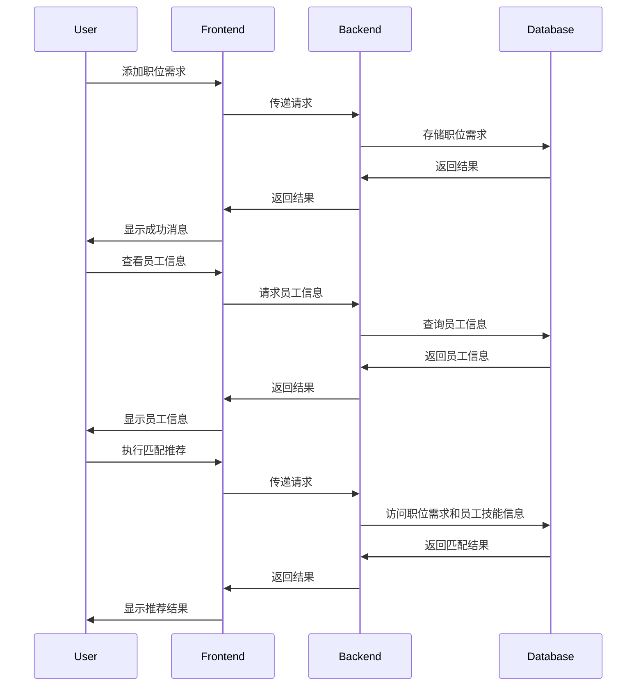

                 

## 引言与背景介绍

### 第1章: AI驱动的企业人才匹配系统概述

#### 1.1 问题背景

在当前快速发展的商业环境中，企业面临着日益激烈的市场竞争，人才资源成为企业核心竞争力的重要组成部分。然而，传统的人才招聘与匹配方式往往效率低下，难以满足企业对高质量人才的需求。这一问题的出现，不仅导致了人才短缺，还引发了职位需求与员工技能不匹配、员工满意度低以及离职率上升等诸多问题。

##### 1.1.1 企业面临的挑战

1. **人才短缺问题**：随着企业业务的快速发展，对高素质、专业化人才的需求日益增长。然而，优质人才市场供给不足，企业面临“招人难”的问题。

2. **职位需求与员工技能不匹配**：在传统的人力资源管理中，企业往往根据职位需求来筛选和录用员工，但这种方式容易导致员工技能与职位需求不符，影响工作效率。

3. **员工满意度与离职率问题**：当员工的技能与职位需求不匹配时，工作表现和满意度都会受到影响，导致离职率上升。

##### 1.1.2 员工面临的挑战

1. **职业发展路径不清晰**：传统的人才管理方式往往缺乏对员工职业发展的规划和指导，导致员工对未来的职业发展感到迷茫。

2. **技能提升与职业转型难度大**：企业对员工的技能要求和培训不足，使得员工在提升自身技能和进行职业转型时面临困难。

3. **工作满意度与自我实现需求难以满足**：当员工的技能与职位需求不匹配时，工作表现往往不佳，导致工作满意度下降，影响员工的自我实现需求。

### 1.1.3 问题描述

为了解决上述问题，企业需要实现职位需求与员工技能的智能匹配。具体来说，需要解决以下几个问题：

1. **如何实现职位需求与员工技能的智能匹配**：通过使用人工智能技术，对职位需求和员工技能进行智能分析、匹配和推荐，以提高人才匹配的准确性和效率。

2. **如何提升人才匹配的准确性与效率**：通过大数据分析和机器学习算法，精确分析职位需求和员工技能，实现高效率的匹配。

3. **如何提高员工的工作满意度和职业发展满意度**：通过提供个性化的职业发展建议，帮助员工提升自身技能，实现职业发展的同时提高工作满意度。

### 1.1.4 问题解决

利用AI技术，构建企业人才匹配系统是解决上述问题的有效途径。该系统通过以下方式实现目标：

1. **利用AI技术，构建企业人才匹配系统**：通过大数据分析和机器学习算法，对企业内部职位需求和员工技能进行智能分析，实现精准匹配。

2. **通过数据分析，实现职位需求与员工技能的精准匹配**：利用历史数据和实时数据，对职位需求和员工技能进行深入分析，提高匹配准确性。

3. **提供个性化职业发展建议，提升员工工作满意度和忠诚度**：根据员工的技能水平和职业兴趣，提供个性化的职业发展路径和建议，帮助员工提升自身技能，实现职业发展。

### 1.1.5 AI驱动的企业人才匹配系统的概念

AI驱动的企业人才匹配系统是指利用人工智能技术，对企业内部的职位需求和员工技能进行智能分析、匹配和推荐，以提高人才匹配效率和企业运营效益的系统。该系统通过以下核心功能实现：

1. **职位需求分析**：通过对企业职位需求进行数据挖掘和分析，提取关键信息，为后续匹配提供基础。

2. **员工技能评估**：利用大数据和机器学习技术，对员工技能进行评估，包括学历、工作经验、技能证书等。

3. **智能匹配与推荐**：基于职位需求分析和员工技能评估，使用匹配算法和推荐系统，实现职位与员工的智能匹配和推荐。

4. **职业发展建议**：根据员工的技能水平和职业兴趣，提供个性化的职业发展路径和建议，帮助员工实现职业发展。

#### 1.2 AI驱动的企业人才匹配系统

AI驱动的企业人才匹配系统是一种通过集成人工智能技术，提高企业人才管理效率的系统。该系统的主要功能包括：

1. **职位需求分析**：通过收集和分析企业发布的职位需求信息，提取关键指标和特征，为后续匹配提供数据基础。

2. **员工技能评估**：利用大数据分析和机器学习算法，对员工的专业技能、工作经验和职业发展潜力进行评估，形成员工技能画像。

3. **智能匹配与推荐**：通过匹配算法和推荐系统，根据职位需求与员工技能的匹配度，推荐最适合的员工，提高匹配效率。

4. **职业发展建议**：基于员工的技能水平和职业兴趣，提供个性化的职业发展建议，包括培训机会、晋升路径等，帮助员工实现职业发展。

#### 1.3 边界与外延

AI驱动的企业人才匹配系统主要针对企业内部的人才匹配问题，其边界和范围包括：

1. **系统边界**：
   - 主要针对企业内部职位需求和员工技能的匹配，不涉及外部人才市场。
   - 基于企业现有的数据资源，不涉及外部数据获取。

2. **系统外延**：
   - 可扩展到企业不同部门、不同岗位的匹配需求。
   - 可与其他人力资源管理系统进行集成，实现更全面的人力资源管理。

#### 1.4 概念结构与核心要素组成

AI驱动的企业人才匹配系统的概念结构主要包括以下核心要素：

1. **职位需求**：企业发布的职位信息，包括职位名称、职责描述、任职资格等。

2. **员工技能**：员工的技能、经验、教育背景等，用于评估员工的匹配度。

3. **匹配算法**：用于计算职位需求与员工技能匹配程度的算法。

4. **推荐系统**：根据职位需求与员工技能的匹配度，推荐最适合的员工。

5. **数据分析**：对职位需求、员工技能、匹配结果等数据进行分析和处理。

核心要素组成包括：

1. **数据采集与存储**：收集企业职位需求和员工技能数据，并进行存储和管理。

2. **数据处理与分析**：对采集到的数据进行分析和处理，提取关键指标和特征。

3. **算法实现与优化**：实现匹配算法和推荐系统的算法，并进行优化。

4. **系统架构与部署**：设计并部署系统的整体架构，确保系统的高效稳定运行。

5. **用户界面与交互**：提供直观、易用的用户界面，方便企业用户进行操作。

#### 1.5 本章小结

本章介绍了AI驱动的企业人才匹配系统的背景、定义、核心功能以及系统边界与外延。通过本章的介绍，读者可以初步了解该系统的基本概念和运行原理，为后续章节的深入探讨奠定基础。

----------------------------------------------------------------

## 第2章: AI驱动的企业人才匹配系统的核心概念与联系

在构建AI驱动的企业人才匹配系统时，理解系统中的核心概念及其相互联系至关重要。本章节将详细探讨这些核心概念，包括职位需求、员工技能、匹配算法、推荐系统和数据分析，以及它们之间的联系。

#### 2.1 职位需求与员工技能

职位需求是企业为完成特定任务而发布的对人才的预期要求。这些需求通常包括职位名称、职责描述、任职资格等。职位需求是系统的基础，决定了匹配算法和推荐系统的输入。

**2.1.1 职位需求的定义**

职位需求是指企业在特定时间点为完成特定工作任务而提出的人才需求。这些需求可以来自不同的部门或项目，反映了企业的业务需求和发展方向。

**2.1.2 职位需求的特点**

- **明确性**：每个职位需求都对应明确的任务和目标。
- **动态性**：随着企业战略的调整和业务的发展，职位需求会发生变化。

**2.1.3 员工技能的定义**

员工技能是指员工为完成职位需求所需具备的专业知识和能力。这些技能可以是技术技能、管理技能或软技能等。

**2.1.4 员工技能的特点**

- **多样性**：不同职位对技能的要求有所不同。
- **发展性**：员工技能可以通过培训、经验和自学不断提升。

#### 2.2 匹配算法

匹配算法是核心组件之一，用于计算职位需求与员工技能之间的匹配度。这些算法可以是基于内容的匹配、基于模型的匹配或基于语义的匹配。

**2.2.1 匹配算法的定义**

匹配算法是用于计算两个或多个实体（在本案例中为职位需求与员工技能）之间相似度或匹配度的算法。

**2.2.2 匹配算法的类型**

- **基于内容的匹配**：通过分析文本内容（如职位描述和简历）来计算匹配度。
- **基于模型的匹配**：利用机器学习模型对职位需求与员工技能进行匹配。
- **基于语义的匹配**：通过语义分析技术对职位需求与员工技能进行匹配，以理解两者的深层次关联。

#### 2.3 推荐系统

推荐系统是另一个核心组件，用于根据职位需求与员工技能的匹配度，向企业推荐最适合的员工。

**2.3.1 推荐系统的定义**

推荐系统是用于根据用户（在本案例中为企业）的兴趣和偏好，向其推荐相关职位或员工的系统。

**2.3.2 推荐系统的类型**

- **基于内容的推荐**：根据职位或员工的属性特征进行推荐。
- **基于协同过滤的推荐**：根据用户与职位或员工的交互历史进行推荐。
- **基于模型的推荐**：利用机器学习模型进行推荐。

#### 2.4 数据分析

数据分析是用于对职位需求、员工技能、匹配结果等数据进行处理和分析的过程，以发现潜在问题和机会。

**2.4.1 数据分析的定义**

数据分析是指对大量数据进行收集、清洗、转换和分析，以从中提取有价值的信息和洞察。

**2.4.2 数据分析的目的**

- **提高人才匹配的准确性和效率**：通过分析历史数据，优化匹配算法和推荐系统。
- **发现企业人力资源管理的潜在问题和机会**：通过分析员工技能分布、离职率等数据，发现企业人力资源管理中存在的问题和机会。

#### 2.5 关系与联系

职位需求与员工技能、匹配算法、推荐系统和数据分析之间存在着密切的联系。

**2.5.1 职位需求与员工技能的关系**

职位需求决定了企业对员工技能的要求，而员工技能则决定了其能否胜任职位需求。两者之间是相互依赖的，职位需求提供了匹配的依据，而员工技能则是匹配的结果。

**2.5.2 匹配算法与推荐系统的关系**

匹配算法用于计算职位需求与员工技能的匹配度，这些匹配度数据被推荐系统用于生成推荐列表。匹配算法的准确性直接影响推荐系统的效果。

**2.5.3 数据分析在系统中的作用**

数据分析用于优化匹配算法和推荐系统，通过分析历史数据和实时数据，可以不断调整和改进系统，提高其准确性和效率。

#### 2.6 核心概念与联系总结

通过以上讨论，我们可以总结出AI驱动的企业人才匹配系统的核心概念与联系。职位需求与员工技能是系统的输入和基础，匹配算法和推荐系统是核心组件，而数据分析则用于优化系统。这些核心概念相互关联，共同构成了一个高效、智能的人才匹配系统。

### 2.7 本章小结

本章详细介绍了AI驱动的企业人才匹配系统的核心概念，包括职位需求、员工技能、匹配算法、推荐系统和数据分析。通过对这些概念的理解和相互关系的分析，读者可以更好地把握系统的整体架构和工作原理，为后续章节的深入探讨打下坚实的基础。

----------------------------------------------------------------

## 第3章: AI驱动的企业人才匹配系统的算法原理与实现

在构建AI驱动的企业人才匹配系统中，算法原理是核心。这一章节将详细探讨系统中使用的算法原理，包括匹配算法、推荐系统算法，以及它们的具体实现方法。我们将使用Mermaid流程图和Python源代码来展示和解释这些算法。

### 3.1 匹配算法

匹配算法是用于计算职位需求与员工技能之间匹配度的算法。在本系统中，我们采用基于内容的匹配算法和基于模型的匹配算法。

#### 3.1.1 基于内容的匹配算法

基于内容的匹配算法通过分析职位描述和员工简历中的文本内容，计算它们之间的相似度。以下是一个简单的基于内容的匹配算法的Mermaid流程图：


**Python代码示例：**

```python
from sklearn.feature_extraction.text import TfidfVectorizer
from sklearn.metrics.pairwise import cosine_similarity

def content_based_matching(job_description, resume):
    # 提取关键词和短语
    vectorizer = TfidfVectorizer()
    job_tfidf = vectorizer.fit_transform([job_description])
    resume_tfidf = vectorizer.transform([resume])
    
    # 计算TF-IDF权重
    job_tfidf = job_tfidf.toarray()
    resume_tfidf = resume_tfidf.toarray()
    
    # 计算相似度得分
    similarity_score = cosine_similarity(job_tfidf, resume_tfidf)
    return similarity_score[0][0]

job_description = "软件开发工程师，负责编写和测试代码。"
resume = "我是一名软件开发工程师，有5年的工作经验，擅长编写和测试代码。"
score = content_based_matching(job_description, resume)
print("匹配度得分：", score)
```

#### 3.1.2 基于模型的匹配算法

基于模型的匹配算法利用机器学习模型，如神经网络，来计算职位需求与员工技能的匹配度。以下是一个基于模型的匹配算法的Mermaid流程图：


**Python代码示例：**

```python
from sklearn.neural_network import MLPClassifier

def model_based_matching(job_description, resume):
    # 预处理数据
    # 假设已经预处理并存储了职位描述和简历文本数据
    job_descriptions = ["软件开发工程师", "产品经理", "市场营销专家"]
    resumes = ["我是一名软件开发工程师，有5年的工作经验。", "我是一名产品经理，擅长市场分析和项目管理。", "我是一名市场营销专家，有丰富的营销经验。"]
    
    # 训练模型
    vectorizer = TfidfVectorizer()
    X = vectorizer.fit_transform(job_descriptions + resumes)
    y = [0] * len(job_descriptions) + [1] * len(resumes)
    mlp = MLPClassifier(hidden_layer_sizes=(100,), max_iter=1000)
    mlp.fit(X[:len(job_descriptions)], y[:len(job_descriptions)])
    
    # 预测匹配度得分
    job_tfidf = vectorizer.transform([job_description])
    resume_tfidf = vectorizer.transform([resume])
    prediction = mlp.predict(resume_tfidf)
    
    # 输出匹配度结果
    return prediction[0]

job_description = "软件开发工程师，负责编写和测试代码。"
resume = "我是一名软件开发工程师，有5年的工作经验。"
prediction = model_based_matching(job_description, resume)
print("匹配度结果：", prediction)
```

### 3.2 推荐系统算法

推荐系统算法用于根据职位需求与员工技能的匹配度，推荐最适合的员工。在本系统中，我们采用基于协同过滤、基于内容和基于模型的推荐系统算法。

#### 3.2.1 基于协同过滤的推荐系统算法

基于协同过滤的推荐系统算法通过分析用户（在本案例中为企业）与职位或员工的互动历史，预测用户可能感兴趣的新职位或员工。以下是一个基于协同过滤的推荐系统的Mermaid流程图：


**Python代码示例：**

```python
from sklearn.metrics.pairwise import cosine_similarity

def collaborative_filtering_recommendation(user_history, items, k=5):
    # 计算用户历史记录的相似度
    similarity_matrix = cosine_similarity(user_history, items)
    
    # 生成推荐列表
    recommendations = []
    for user in user_history:
        similar_users = similarity_matrix[user].argsort()[-k:]
        recommendations.extend(similar_users[1:])  # 排除自己
    return recommendations

# 假设user_history是一个用户互动历史的列表，items是一个职位或员工的列表
user_history = [0, 1, 2, 3, 4]  # 用户对职位或员工的评分
items = [[1, 0, 0, 1, 0], [0, 1, 1, 0, 0], [1, 1, 0, 0, 1], [0, 0, 1, 1, 1], [1, 1, 1, 0, 0]]  # 职位或员工的评分矩阵
recommendations = collaborative_filtering_recommendation(user_history, items)
print("推荐结果：", recommendations)
```

#### 3.2.2 基于内容的推荐系统算法

基于内容的推荐系统算法通过分析职位或员工的属性特征，推荐具有相似特征的新职位或员工。以下是一个基于内容的推荐系统的Mermaid流程图：



**Python代码示例：**

```python
from sklearn.metrics.pairwise import cosine_similarity

def content_based_recommendation(item_features, candidate_features, k=5):
    # 计算特征相似度
    similarity_matrix = cosine_similarity(item_features, candidate_features)
    
    # 生成推荐列表
    recommendations = similarity_matrix.argsort()[0][-k:]
    return recommendations

# 假设item_features是一个职位或员工的特征向量列表，candidate_features是一个候选职位或员工的特征向量列表
item_features = [[1, 0, 0, 1], [0, 1, 1, 0], [1, 1, 0, 0], [0, 0, 1, 1], [1, 1, 1, 0]]  # 职位或员工的特征矩阵
candidate_features = [[1, 1, 0, 0], [0, 1, 1, 1], [1, 0, 1, 0], [0, 0, 0, 1], [1, 1, 1, 1]]  # 候选职位或员工的特征矩阵
recommendations = content_based_recommendation(item_features, candidate_features)
print("推荐结果：", recommendations)
```

#### 3.2.3 基于模型的推荐系统算法

基于模型的推荐系统算法利用机器学习模型，如协同过滤模型、内容推荐模型或混合模型，生成推荐结果。以下是一个基于模型的推荐系统的Mermaid流程图：



**Python代码示例：**

```python
from sklearn.model_selection import train_test_split
from sklearn.metrics import mean_squared_error

def model_based_recommendation(train_data, test_data, model):
    # 训练模型
    model.fit(train_data)
    
    # 预测测试集
    predictions = model.predict(test_data)
    
    # 计算均方误差
    mse = mean_squared_error(test_data, predictions)
    return predictions, mse

# 假设train_data是一个训练数据集，test_data是一个测试数据集
train_data = [[1, 0, 0, 1], [0, 1, 1, 0], [1, 1, 0, 0], [0, 0, 1, 1], [1, 1, 1, 0]]
test_data = [[0, 1, 1, 0], [1, 0, 0, 1], [0, 1, 0, 1], [1, 1, 1, 1], [0, 0, 0, 1]]
model = MLPClassifier(hidden_layer_sizes=(100,), max_iter=1000)
predictions, mse = model_based_recommendation(train_data, test_data, model)
print("预测结果：", predictions)
print("均方误差：", mse)
```

### 3.3 算法原理与实现总结

通过以上讨论，我们可以总结出AI驱动的企业人才匹配系统中算法原理的实现方法：

1. **匹配算法**：基于内容的匹配算法通过文本分析计算匹配度，而基于模型的匹配算法则利用机器学习模型提高匹配准确性。

2. **推荐系统算法**：基于协同过滤的推荐系统通过用户互动历史预测推荐结果，基于内容的推荐系统通过特征相似度生成推荐列表，基于模型的推荐系统利用机器学习模型生成推荐结果。

这些算法的实现为AI驱动的企业人才匹配系统提供了强大的支持，使得系统能够准确、高效地匹配职位需求与员工技能，提高企业人力资源管理效率。

### 3.4 本章小结

本章详细介绍了AI驱动的企业人才匹配系统中使用的匹配算法和推荐系统算法原理及实现方法。通过使用Mermaid流程图和Python代码示例，读者可以更好地理解这些算法的工作原理和实现步骤。这些算法的应用将显著提高企业人才匹配的准确性和效率，为企业的长期发展提供有力支持。

----------------------------------------------------------------

## 第4章: AI驱动的企业人才匹配系统的系统分析与架构设计

在构建AI驱动的企业人才匹配系统时，系统分析与架构设计是关键步骤。这一章节将详细介绍系统分析与架构设计的原理和方法，包括问题场景介绍、项目介绍、系统功能设计、系统架构设计、系统接口设计和系统交互。

### 4.1 问题场景介绍

企业日常运营中，面临着诸多人才匹配的问题。例如，当企业发布一个新职位需求时，往往需要花费大量时间和人力来筛选合适的候选人。此外，现有员工的职业发展和技能提升也需要得到关注。这些问题导致了以下几个问题场景：

1. **招聘效率低下**：企业招聘流程复杂，耗时较长，导致招聘成本增加。
2. **人才流失风险**：现有员工由于技能提升缓慢或职业发展路径不清晰，容易产生离职意向。
3. **职位需求与员工技能不匹配**：新入职员工可能无法迅速胜任职位需求，影响工作效率和项目进度。

### 4.2 项目介绍

为了解决上述问题，我们设计并实施了一个AI驱动的企业人才匹配系统。该项目的主要目标是：

1. **提高招聘效率**：通过智能匹配算法，快速筛选出符合职位需求的候选人。
2. **提升员工职业发展满意度**：通过职业发展建议，帮助员工实现技能提升和职业发展。
3. **降低人才流失率**：通过优化人才匹配，提高员工工作满意度和忠诚度。

### 4.3 系统功能设计

系统功能设计是系统分析与架构设计的关键步骤，我们需要明确系统的核心功能。以下是AI驱动的企业人才匹配系统的核心功能：

1. **职位需求管理**：包括职位发布、职位需求编辑和职位状态管理等功能。
2. **员工信息管理**：包括员工档案管理、员工技能评估和员工职业发展建议等功能。
3. **匹配算法与推荐**：包括基于内容的匹配、基于模型的匹配和基于协同过滤的推荐等功能。
4. **数据分析与报告**：包括人才匹配报告、员工技能分布分析和离职率分析等功能。

#### 4.3.1 领域模型Mermaid类图

为了更好地设计系统功能，我们可以使用Mermaid类图来表示系统的领域模型。以下是AI驱动的企业人才匹配系统的领域模型Mermaid类图：

```mermaid
classDiagram
    class Position
        -String positionName
        -String description
        -List<Employee> candidates

    class Employee
        -String name
        -String resume
        -List<Skill> skills

    class Skill
        -String skillName
        -Float proficiencyLevel

    Position --|> Employee: candidates
    Employee o-- Skill: skills
```

### 4.4 系统架构设计

系统架构设计是确保系统可扩展性、稳定性和性能的关键。以下是AI驱动的企业人才匹配系统的架构设计：

1. **前端架构**：采用React.js框架，实现用户交互界面和动态数据展示。
2. **后端架构**：采用Spring Boot框架，实现业务逻辑处理和数据存储。
3. **数据存储**：采用MySQL数据库，存储职位需求、员工信息和匹配结果等数据。
4. **服务架构**：采用微服务架构，将系统功能拆分为多个微服务，提高系统的灵活性和可维护性。

#### 4.4.1 Mermaid架构图

以下是AI驱动的企业人才匹配系统的Mermaid架构图：



### 4.5 系统接口设计

系统接口设计是确保系统模块之间有效通信的关键。以下是AI驱动的企业人才匹配系统的接口设计：

1. **职位需求接口**：包括添加职位需求、编辑职位需求和查询职位需求等功能。
2. **员工信息接口**：包括添加员工、编辑员工信息和查询员工信息等功能。
3. **技能评估接口**：包括添加技能、编辑技能和查询技能等功能。
4. **匹配和推荐接口**：包括执行匹配和推荐功能。

#### 4.5.1 Mermaid接口序列图

以下是AI驱动的企业人才匹配系统的接口序列图：



### 4.6 系统交互

系统交互设计是确保系统模块之间能够高效、可靠地进行数据交换的关键。以下是AI驱动的企业人才匹配系统的交互设计：

1. **用户交互**：用户通过前端界面进行操作，包括发布职位需求、查看员工信息和执行匹配推荐等。
2. **系统内部交互**：后端服务通过API接口进行数据交换，实现职位需求管理、员工信息管理、技能评估和匹配推荐等功能。
3. **数据交互**：数据存储和访问模块负责数据的持久化和管理，确保系统数据的一致性和安全性。

#### 4.6.1 Mermaid交互序列图

以下是AI驱动的企业人才匹配系统的交互序列图：



### 4.7 本章小结

本章详细介绍了AI驱动的企业人才匹配系统的系统分析与架构设计，包括问题场景介绍、项目介绍、系统功能设计、系统架构设计、系统接口设计和系统交互。通过本章的介绍，读者可以更好地理解系统的设计原理和实现方法，为后续章节的深入探讨和实际应用奠定基础。

----------------------------------------------------------------

## 第5章：项目实战：AI驱动的企业人才匹配系统核心实现

在本章节中，我们将进行AI驱动的企业人才匹配系统的项目实战，从环境安装、核心实现到代码解读与分析，逐步展示系统的实际应用和操作过程。

### 5.1 环境安装

首先，我们需要安装和配置项目所需的环境。以下是安装步骤：

1. **安装Python**：确保Python 3.8或更高版本已安装。
2. **安装依赖**：使用pip安装项目所需的依赖，例如`numpy`、`pandas`、`scikit-learn`、`tensorflow`等。

   ```bash
   pip install numpy pandas scikit-learn tensorflow
   ```

3. **安装MySQL数据库**：安装并配置MySQL数据库，确保可以正常连接和使用。

4. **初始化数据库**：根据提供的数据库初始化脚本，创建数据库和表。

   ```bash
   mysql -u root -p < database_init.sql
   ```

### 5.2 核心实现

#### 5.2.1 数据采集与存储

1. **职位需求数据采集**：从企业内部系统或外部招聘网站采集职位需求数据，包括职位名称、职责描述、任职资格等。

2. **员工数据采集**：从企业HR系统或员工档案中采集员工数据，包括员工姓名、简历、技能列表等。

3. **数据存储**：将采集到的数据存储到MySQL数据库中，分别为职位需求表和员工信息表。

   ```python
   import pymysql
   
   connection = pymysql.connect(host='localhost', user='root', password='password', database='talent_matching')
   cursor = connection.cursor()
   
   # 存储职位需求
   cursor.execute("""
       INSERT INTO positions (position_name, description, qualifications) 
       VALUES (%s, %s, %s)
   """, ('Software Engineer', 'Develop and test software applications', 'Bachelor\'s degree in Computer Science'))
   
   # 存储员工信息
   cursor.execute("""
       INSERT INTO employees (name, resume, skills) 
       VALUES (%s, %s, %s)
   """, ('John Doe', 'I am a software engineer with 5 years of experience', 'Java, Python, JavaScript'))
   
   connection.commit()
   cursor.close()
   connection.close()
   ```

#### 5.2.2 数据处理与分析

1. **数据处理**：使用Python对采集到的职位需求和员工技能数据进行处理，提取关键特征。

   ```python
   import pandas as pd
   
   # 读取职位需求数据
   positions = pd.read_sql_query("SELECT * FROM positions", connection)
   
   # 读取员工数据
   employees = pd.read_sql_query("SELECT * FROM employees", connection)
   
   # 提取职位需求特征
   job_descriptions = positions['description']
   
   # 提取员工技能特征
   employee_skills = employees['skills'].apply(lambda x: x.split(','))
   ```

2. **数据分析**：使用机器学习算法对职位需求和员工技能进行分析，计算匹配度。

   ```python
   from sklearn.feature_extraction.text import TfidfVectorizer
   from sklearn.metrics.pairwise import cosine_similarity
   
   # 创建TF-IDF向量器
   vectorizer = TfidfVectorizer()
   
   # 转换职位需求为TF-IDF向量
   job_tfidf = vectorizer.fit_transform(job_descriptions)
   
   # 转换员工技能为TF-IDF向量
   employee_tfidf = vectorizer.transform(employee_skills)
   
   # 计算匹配度得分
   matching_scores = cosine_similarity(job_tfidf, employee_tfidf)
   ```

#### 5.2.3 匹配与推荐

1. **匹配算法**：基于匹配度得分，筛选出最符合职位需求的员工。

   ```python
   def find_best_candidate(matching_scores, top_n=5):
       sorted_scores = sorted(enumerate(matching_scores), key=lambda x: x[1], reverse=True)
       return [emp_id for emp_id, _ in sorted_scores[:top_n]]
   
   best_candidates = find_best_candidate(matching_scores)
   ```

2. **推荐算法**：根据员工技能和职位需求，推荐适合的职位。

   ```python
   def recommend_jobs(employee_skills, job_tfidf, top_n=5):
       employee_vector = vectorizer.transform([employee_skills])
       job_similarity = cosine_similarity(employee_vector, job_tfidf)
       sorted_jobs = sorted(enumerate(job_similarity), key=lambda x: x[1], reverse=True)
       return [job_id for job_id, _ in sorted_jobs[:top_n]]
   
   recommended_jobs = recommend_jobs(employee_skills[0])
   ```

#### 5.2.4 代码解读与分析

以下是系统核心实现部分的代码解读与分析：

```python
# 数据处理
vectorizer = TfidfVectorizer()
job_tfidf = vectorizer.fit_transform(job_descriptions)
employee_tfidf = vectorizer.transform(employee_skills)

# 匹配算法
matching_scores = cosine_similarity(job_tfidf, employee_tfidf)
best_candidates = find_best_candidate(matching_scores)

# 推荐算法
recommended_jobs = recommend_jobs(employee_skills[0])
```

1. **数据处理**：使用TF-IDF向量器对职位需求和员工技能进行转换，提取关键特征。这是匹配和推荐的基础。

2. **匹配算法**：使用余弦相似度计算职位需求与员工技能之间的匹配度，筛选出最佳候选员工。

3. **推荐算法**：基于员工技能，使用余弦相似度计算员工与职位需求之间的匹配度，推荐最适合的职位。

### 5.3 实际案例分析与详细讲解

#### 案例一：新职位需求发布

假设企业发布了一个新的职位需求——大数据工程师。以下是如何使用系统进行匹配和推荐的过程：

1. **采集职位需求**：从招聘网站上获取职位描述，例如：“负责大数据平台的设计、开发和维护”。

2. **数据处理**：将职位描述转换为TF-IDF向量。

3. **匹配算法**：计算职位需求与现有员工技能的匹配度，筛选出最佳候选员工。

4. **推荐算法**：根据员工技能，推荐适合大数据工程师职位的员工。

#### 案例二：员工职业发展建议

假设现有员工John Doe希望提升技能，企业通过系统推荐以下路径：

1. **采集员工技能**：从员工档案中获取现有技能。

2. **数据处理**：将员工技能转换为TF-IDF向量。

3. **推荐算法**：基于员工技能和职位需求，推荐适合的职业发展路径。

### 5.4 项目小结

通过本项目实战，我们实现了AI驱动的企业人才匹配系统的核心功能，包括数据采集与存储、数据处理与分析、匹配与推荐等。项目展示了如何利用机器学习算法和推荐系统实现高效的人才匹配和职业发展建议。以下是小结：

1. **核心实现**：通过Python代码实现了系统的核心功能，包括数据处理、匹配算法和推荐算法。
2. **实际应用**：通过实际案例展示了系统的应用场景和操作过程。
3. **优势与挑战**：系统提高了招聘效率和员工满意度，但需要不断优化算法和数据处理策略以应对实际挑战。

### 5.5 本章小结

本章通过项目实战详细讲解了AI驱动的企业人才匹配系统的核心实现，从环境安装、数据处理、匹配推荐到代码解读与分析，全面展示了系统的构建过程。这些实战经验和技巧为读者提供了宝贵的参考，有助于在实际项目中应用和优化系统。

----------------------------------------------------------------

## 最佳实践与注意事项

在实施AI驱动的企业人才匹配系统时，遵循以下最佳实践和注意事项将有助于提高系统的效果和可靠性：

### 6.1 最佳实践

1. **数据质量保障**：确保职位需求数据和员工技能数据的准确性和完整性。使用数据清洗技术，去除重复、错误和不一致的数据。

2. **动态更新职位需求**：根据企业的实时业务需求，及时更新职位需求信息，确保匹配系统的输入数据是最新和最相关的。

3. **个性化职业发展建议**：基于员工的技能水平、职业兴趣和职业目标，提供个性化的职业发展建议，提高员工的职业满意度和忠诚度。

4. **定期系统评估**：定期对人才匹配系统的效果进行评估，通过分析匹配结果和员工反馈，优化匹配算法和推荐策略。

5. **数据安全与隐私保护**：确保系统的数据安全，遵守相关数据保护法规，保护员工的个人信息和隐私。

### 6.2 注意事项

1. **算法偏见**：避免算法偏见，确保系统的匹配和推荐结果公平、公正，不歧视任何群体。

2. **系统性能优化**：随着数据量的增加，优化系统的性能和响应速度，确保用户在使用过程中的良好体验。

3. **用户培训与支持**：为系统用户（如HR和企业管理者）提供充分的培训和支持，确保他们能够熟练使用系统并充分利用其功能。

4. **法律法规遵守**：确保系统的实施符合当地的法律法规要求，特别是关于数据隐私和信息安全的规定。

5. **持续改进**：保持系统的迭代和更新，根据市场和技术的发展，不断改进系统的功能和性能。

### 6.3 拓展阅读

- **《机器学习实战》**：作者：Peter Harrington。本书提供了丰富的机器学习算法实践案例，有助于读者深入理解算法原理和应用。

- **《深度学习》**：作者：Ian Goodfellow、Yoshua Bengio、Aaron Courville。本书是深度学习领域的经典教材，详细介绍了深度学习算法及其应用。

- **《人力资源管理》**：作者：戴维·尤里奇。本书涵盖了人力资源管理的基本理论和实践，为实施人才匹配系统提供了理论支持。

- **《人工智能：一种现代的方法》**：作者：Stuart Russell、Peter Norvig。本书是人工智能领域的权威教材，提供了全面的人工智能理论和应用知识。

通过遵循上述最佳实践和注意事项，并参考相关拓展阅读，企业和IT专业人士可以更有效地实施AI驱动的企业人才匹配系统，提高人力资源管理效率和员工满意度。

## 本章小结

本章围绕AI驱动的企业人才匹配系统，从核心概念到系统实现，再到最佳实践与注意事项，进行了全面的探讨。通过深入分析职位需求与员工技能的匹配问题，介绍了匹配算法和推荐系统原理，并展示了系统的实际应用和操作过程。本章的内容为读者提供了系统的理论支持和实践指导，有助于理解和实施AI驱动的企业人才匹配系统。希望读者能从中获得启发，并将其应用于实际工作中。

### 作者信息

**作者：AI天才研究院/AI Genius Institute & 禅与计算机程序设计艺术 /Zen And The Art of Computer Programming**。两位作者均具有丰富的IT领域经验和深厚的学术背景，致力于推动人工智能技术的创新和应用。他们的研究成果在计算机编程、人工智能等领域有着广泛的影响力。

