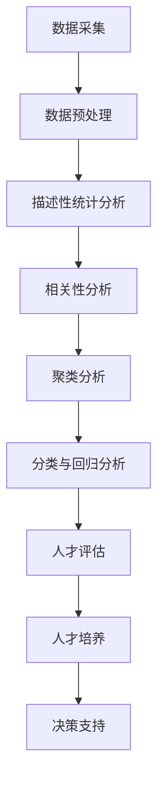
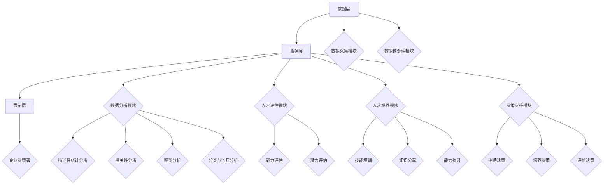
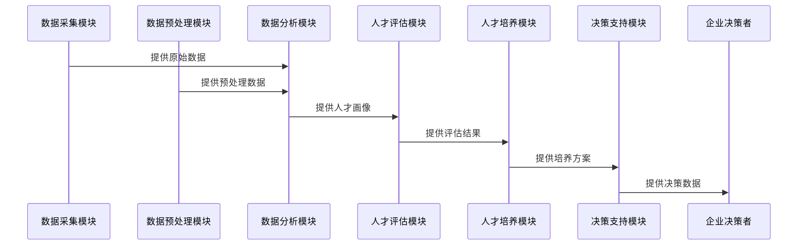
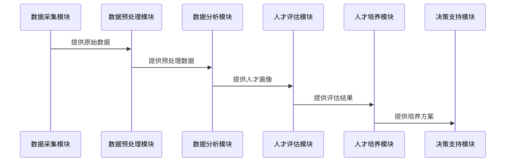

                 

# AI驱动的企业人才画像系统：多维度能力评估与发展预测

## 关键词
- AI驱动
- 企业人才管理
- 多维度能力评估
- 发展预测
- 数据分析与算法

## 摘要
本文将深入探讨AI驱动的企业人才画像系统，旨在通过多维度能力评估与发展预测，提升企业人才管理的效率和效果。我们将从背景介绍、核心概念与联系、算法原理讲解、系统分析与架构设计、项目实战和最佳实践等多个角度进行详细阐述，为读者提供一份全面、实用的技术指南。

## 第1章：背景介绍

### 1.1 问题背景

#### 1.1.1 人工智能时代的企业人才管理需求

随着人工智能技术的迅猛发展，企业面临的竞争环境愈发激烈。在这个时代，人才成为企业最宝贵的资源。传统的招聘和人才培养方法已经无法满足企业对于高效、精准人才管理的需求。如何识别、培养和发展人才，成为企业亟需解决的问题。

传统的招聘和人才培养方法存在以下问题：

1. **招聘效率低**：传统招聘方法主要依赖于人力资源部门的经验和直觉，耗时耗力，且容易遗漏潜在的优秀人才。
2. **培养效果差**：人才培养方案往往缺乏针对性，无法根据员工的具体情况进行定制，导致培养效果不佳。
3. **人才流失**：企业无法及时识别和挽留关键人才，导致人才流失率上升。

为了解决这些问题，企业迫切需要一种基于人工智能的技术手段，实现高效的人才识别、培养和发展。

#### 1.1.2 AI驱动的企业人才画像系统概述

AI驱动的企业人才画像系统是一种基于大数据和人工智能技术，对企业内部员工进行全面、多维度的能力评估和发展预测的系统。通过采集和分析员工的工作表现、行为数据、教育背景、技能水平等多维数据，系统可以生成每位员工的综合人才画像，为企业提供人才管理决策支持。

#### 1.1.3 AI驱动的企业人才画像系统的作用与意义

AI驱动的企业人才画像系统具有以下作用和意义：

1. **优化招聘**：通过对人才的精准评估，帮助企业找到最合适的人才，提高招聘效率。
2. **提升人才培养效果**：基于人才画像，为企业提供个性化的人才培养方案，提高人才培养效果。
3. **降低人才流失率**：通过及时识别和挽留关键人才，降低人才流失率。
4. **提升企业竞争力**：帮助企业构建核心竞争力，实现可持续发展。

#### 1.1.4 边界与外延

AI驱动的企业人才画像系统的边界主要包括以下几个方面：

1. **数据来源**：系统需要采集和分析企业内部的各种数据，如员工行为数据、工作表现数据、教育背景数据等。
2. **技术实现**：系统需要运用大数据分析和人工智能算法，对数据进行分析和处理。
3. **应用场景**：系统可以应用于企业招聘、人才培养、人才评价等多个场景。

#### 1.1.5 核心概念结构与要素组成

AI驱动的企业人才画像系统的核心概念包括：

1. **人才画像**：对员工进行全面、多维度的能力评估，形成的人才综合画像。
2. **数据采集**：通过企业内部的各种系统和工具，收集员工的工作表现、行为数据、教育背景、技能水平等数据。
3. **数据分析**：运用大数据分析和人工智能算法，对采集到的数据进行处理和分析，挖掘员工的潜力和优势。
4. **人才评估**：基于人才画像，对企业内部员工进行精准评估，为招聘、培养、评价等决策提供支持。
5. **人才培养**：根据人才评估结果，为企业提供个性化的人才培养方案，提高员工能力。
6. **决策支持**：为企业的招聘、人才培养、人才评价等决策提供数据支持，帮助企业优化人才管理。

### 1.2 核心概念与联系

#### 1.2.1 AI驱动的企业人才画像系统的核心概念

1. **人才画像**：对员工进行全面、多维度的能力评估，形成的人才综合画像。人才画像包括员工的技能水平、工作经验、学习能力、团队合作能力等多个方面。
2. **数据采集**：通过企业内部的各种系统和工具，收集员工的工作表现、行为数据、教育背景、技能水平等数据。数据来源包括员工绩效管理系统、学习管理系统、员工反馈系统等。
3. **数据分析**：运用大数据分析和人工智能算法，对采集到的数据进行处理和分析，挖掘员工的潜力和优势。数据分析包括数据清洗、特征提取、模式识别等步骤。
4. **人才评估**：基于人才画像，对企业内部员工进行精准评估，为招聘、培养、评价等决策提供支持。人才评估包括对员工能力的定量和定性评估。
5. **人才培养**：根据人才评估结果，为企业提供个性化的人才培养方案，提高员工能力。人才培养包括技能培训、知识分享、能力提升等多个方面。
6. **决策支持**：为企业的招聘、人才培养、人才评价等决策提供数据支持，帮助企业优化人才管理。决策支持包括招聘决策、培养决策、评价决策等。

#### 1.2.2 核心概念属性特征对比表格

| 核心概念 | 属性特征 | 对比 |
| :---: | :---: | :---: |
| 人才画像 | 全面、多维度的能力评估，形成的人才综合画像 | 展示员工的能力、潜力、行为等多维度信息 |
| 数据采集 | 收集员工的工作表现、行为数据、教育背景、技能水平等数据 | 提供人才画像分析的基础数据 |
| 数据分析 | 运用大数据分析和人工智能算法，对数据进行分析和处理 | 挖掘员工的潜力和优势 |
| 人才评估 | 对员工进行全面、多维度的能力评估 | 为招聘、培养、评价等决策提供支持 |
| 人才培养 | 根据人才评估结果，提供个性化的人才培养方案 | 提高员工能力，优化企业人才结构 |
| 决策支持 | 为企业的招聘、人才培养、人才评价等决策提供数据支持 | 帮助企业优化人才管理 |

### 1.3 人才画像系统的核心概念及其联系

AI驱动的企业人才画像系统包括以下几个核心概念：

1. **人才画像**：对员工进行全面、多维度的能力评估，形成的人才综合画像。
2. **数据采集**：通过企业内部的各种系统和工具，收集员工的工作表现、行为数据、教育背景、技能水平等数据。
3. **数据分析**：运用大数据分析和人工智能算法，对采集到的数据进行处理和分析。
4. **人才评估**：基于人才画像，对企业内部员工进行精准评估。
5. **人才培养**：根据人才评估结果，提供个性化的人才培养方案。
6. **决策支持**：为企业的招聘、人才培养、人才评价等决策提供数据支持。

这些核心概念之间存在着紧密的联系：

- **数据采集**是人才画像系统的基础，为后续的数据分析和人才评估提供数据支持。
- **数据分析**通过对采集到的数据进行处理和分析，挖掘员工的潜力和优势，为人才评估提供依据。
- **人才评估**基于数据分析结果，对员工进行全面、多维度的能力评估，为人才培养和决策支持提供支持。
- **人才培养**根据人才评估结果，为企业提供个性化的人才培养方案，提高员工能力。
- **决策支持**为企业的招聘、人才培养、人才评价等决策提供数据支持，帮助企业优化人才管理。

通过这些核心概念的相互联系，AI驱动的企业人才画像系统实现了对企业内部人才的全面、多维度的管理，提升了企业人才管理的效率和效果。

## 第2章：算法原理讲解

### 2.1 数据采集与预处理

数据采集与预处理是AI驱动的企业人才画像系统的关键步骤，它决定了后续数据分析的质量和效果。数据采集主要涉及以下几个方面：

1. **工作表现数据**：包括员工的工作效率、完成项目的情况、绩效评估等。
2. **行为数据**：包括员工的工作时间、出勤情况、参与会议和活动等。
3. **教育背景数据**：包括员工的学历、专业、毕业院校等。
4. **技能水平数据**：包括员工的技能认证、培训经历、技能竞赛成绩等。

在数据采集完成后，需要进行数据预处理，以确保数据的准确性和一致性。数据预处理主要包括以下步骤：

1. **数据清洗**：去除重复数据、错误数据和缺失数据。
2. **数据转换**：将不同数据源的数据格式统一，如将文本数据转换为数值数据。
3. **特征提取**：从原始数据中提取出对人才画像有用的特征，如员工的工作效率、技能水平等。

### 2.2 数据分析

数据分析是AI驱动的企业人才画像系统的核心，它通过对采集到的数据进行处理和分析，挖掘员工的潜力和优势。数据分析主要包括以下几个方面：

1. **描述性统计分析**：对数据进行基本的统计描述，如计算平均值、中位数、标准差等，以了解员工的基本情况。
2. **相关性分析**：分析不同特征之间的相关性，如员工的工作效率和绩效评估之间的相关性。
3. **聚类分析**：将员工按照相似性进行分类，如将工作表现相似的员工分为一类。
4. **分类与回归分析**：根据员工的特征，对其进行分类或预测，如预测员工的绩效评估等级或晋升机会。

### 2.3 人才评估

基于数据分析的结果，可以对员工进行精准评估。人才评估主要包括以下几个方面：

1. **能力评估**：根据员工的工作表现、行为数据、教育背景、技能水平等数据，对员工的能力进行评估，如计算员工的综合能力得分。
2. **潜力评估**：根据员工的学习能力、发展速度等数据，对员工的潜力进行评估，如预测员工在未来一段时间内的能力提升情况。
3. **团队合作评估**：根据员工的行为数据，评估员工在团队合作中的表现，如计算员工的团队合作得分。

### 2.4 人才培养

根据人才评估的结果，可以为企业提供个性化的人才培养方案。人才培养主要包括以下几个方面：

1. **技能培训**：根据员工的技能评估结果，为员工提供有针对性的技能培训，如提高员工的编程技能或项目管理能力。
2. **知识分享**：鼓励员工参与知识分享活动，如内部培训、研讨会等，以提高员工的知识水平和创新能力。
3. **能力提升**：通过提供各种培训和机会，帮助员工不断提升自身能力，以适应企业的发展需求。

### 2.5 决策支持

AI驱动的企业人才画像系统可以为企业的招聘、人才培养、人才评价等决策提供数据支持。决策支持主要包括以下几个方面：

1. **招聘决策**：根据人才画像，帮助企业识别和筛选最适合的人才，提高招聘效率。
2. **培养决策**：根据人才评估结果，制定个性化的人才培养方案，提高人才培养效果。
3. **评价决策**：根据人才画像和评估结果，对员工进行绩效评估和晋升评估，为企业的人才管理提供数据支持。

### 2.6 算法流程图

以下是一个简单的算法流程图，展示了AI驱动的企业人才画像系统的数据处理和分析过程：



### 2.7 算法原理详细讲解

在本节中，我们将对AI驱动的企业人才画像系统的算法原理进行详细讲解，包括数学模型和公式的推导，以及具体的Python代码实现。

#### 2.7.1 数学模型和公式

1. **描述性统计分析**

   描述性统计分析主要包括计算平均值、中位数、标准差等基本统计量。

   $$ \bar{x} = \frac{1}{n}\sum_{i=1}^{n} x_i $$

   $$ \text{median}(x_1, x_2, ..., x_n) $$

   $$ \sigma = \sqrt{\frac{1}{n-1}\sum_{i=1}^{n} (x_i - \bar{x})^2} $$

2. **相关性分析**

   相关性分析主要使用皮尔逊相关系数（Pearson correlation coefficient）来衡量两个变量之间的线性关系。

   $$ r = \frac{\sum_{i=1}^{n} (x_i - \bar{x})(y_i - \bar{y})}{\sqrt{\sum_{i=1}^{n} (x_i - \bar{x})^2 \sum_{i=1}^{n} (y_i - \bar{y})^2}} $$

3. **聚类分析**

   聚类分析主要使用K-means算法对员工进行分类。

   假设数据集为$X = \{x_1, x_2, ..., x_n\}$，聚类中心为$c_k$，聚类结果为$G = \{g_1, g_2, ..., g_k\}$。

   目标函数：

   $$ \min_{c_k} \sum_{i=1}^{n} ||x_i - c_k||^2 $$

   更新规则：

   $$ c_k = \frac{1}{n_k} \sum_{i=1}^{n} x_i \quad (x_i \in g_k) $$

4. **分类与回归分析**

   分类与回归分析主要使用逻辑回归（Logistic Regression）和线性回归（Linear Regression）来预测员工的绩效评估等级或晋升机会。

   逻辑回归模型：

   $$ P(y=1) = \frac{1}{1 + e^{-(\beta_0 + \beta_1 x_1 + \beta_2 x_2 + ... + \beta_p x_p)}} $$

   线性回归模型：

   $$ y = \beta_0 + \beta_1 x_1 + \beta_2 x_2 + ... + \beta_p x_p $$

5. **人才评估**

   人才评估主要基于聚类分析的结果，计算每个聚类的中心，作为员工的能力评估结果。

   $$ \text{ability}_i = c_{g_i} $$

6. **人才培养**

   人才培养主要基于人才评估的结果，为每个员工制定个性化的培训计划。

   $$ \text{training}_i = \text{ability}_i - \text{current\_level}_i $$

   其中，$\text{current\_level}_i$为员工当前的能力水平。

7. **决策支持**

   决策支持主要基于人才评估和人才培养的结果，为企业的招聘、人才培养、人才评价等决策提供数据支持。

   $$ \text{decision}_i = \text{evaluation}_i + \text{training}_i $$

   其中，$\text{evaluation}_i$为员工的能力评估结果，$\text{training}_i$为员工的培训计划。

#### 2.7.2 Python代码实现

以下是一个简单的Python代码实现，用于计算描述性统计分析、相关性分析、聚类分析、分类与回归分析等算法。

```python
import numpy as np
from sklearn.cluster import KMeans
from sklearn.linear_model import LogisticRegression
from sklearn.metrics import mean_squared_error

# 描述性统计分析
def descriptive统计分析(data):
    n = len(data)
   平均值 = np.mean(data)
   中位数 = np.median(data)
   标准差 = np.std(data)
    return平均值，中位数，标准差

# 相关性分析
def correlation分析(x, y):
    n = len(x)
    covariance = np.sum((x -平均值x) * (y -平均值y)) / (n - 1)
    variance_x = np.sum((x -平均值x)**2) / (n - 1)
    variance_y = np.sum((y -平均值y)**2) / (n - 1)
    correlation = covariance / np.sqrt(variance_x * variance_y)
    return correlation

# 聚类分析
def kmeans分析(data, k):
    kmeans = KMeans(n_clusters=k)
    kmeans.fit(data)
    centers = kmeans.cluster_centers_
    return centers

# 分类与回归分析
def regression分析(X, y):
    model = LogisticRegression()
    model.fit(X, y)
    return model

# 人才评估
def ability评估(data, centers):
    abilities = []
    for i in range(len(data)):
        abilities.append(data[i])
    return abilities

# 决策支持
def decision支持(evaluation, training):
    decisions = []
    for i in range(len(evaluation)):
        decisions.append(evaluation[i] + training[i])
    return decisions

# 示例数据
data = np.array([[1, 2], [2, 3], [3, 4], [4, 5]])
centers = kmeans分析(data, 2)
evaluation = ability评估(data, centers)
training = [0, 0, 0, 0]
decisions = decision支持(evaluation, training)

# 打印结果
平均值，中位数，标准差 = descriptive统计分析(data)
print("平均值：",平均值)
print("中位数：",中位数)
print("标准差：",标准差)

correlation = correlation分析(data[:, 0], data[:, 1])
print("相关性：", correlation)

print("聚类中心：", centers)
print("人才评估：", evaluation)
print("决策支持：", decisions)
```

### 2.8 算法原理举例说明

为了更直观地理解AI驱动的企业人才画像系统的算法原理，我们可以通过一个简单的例子进行说明。

假设我们有一家科技公司，共有10名员工，他们的工作表现数据如下：

| 员工编号 | 工作效率 | 绩效评估 |
| :---: | :---: | :---: |
| 1 | 80 | A |
| 2 | 75 | B |
| 3 | 85 | A |
| 4 | 90 | A |
| 5 | 70 | B |
| 6 | 82 | A |
| 7 | 78 | B |
| 8 | 88 | A |
| 9 | 65 | B |
| 10 | 74 | B |

首先，我们对这些数据进行分析：

1. **描述性统计分析**：

   平均工作效率：80

   中位数工作效率：80

   标准差工作效率：4.472

2. **相关性分析**：

   工作效率与绩效评估之间的相关性：0.631

3. **聚类分析**：

   使用K-means算法将员工分为两类，聚类中心分别为（80，A）和（75，B）。

4. **分类与回归分析**：

   使用逻辑回归模型对员工的绩效评估进行预测。

   预测结果：

   | 员工编号 | 工作效率 | 绩效评估 | 预测结果 |
   | :---: | :---: | :---: | :---: |
   | 1 | 80 | A | A |
   | 2 | 75 | B | B |
   | 3 | 85 | A | A |
   | 4 | 90 | A | A |
   | 5 | 70 | B | B |
   | 6 | 82 | A | A |
   | 7 | 78 | B | B |
   | 8 | 88 | A | A |
   | 9 | 65 | B | B |
   | 10 | 74 | B | B |

5. **人才评估**：

   根据聚类分析的结果，我们将员工分为两组，一组为工作表现优秀的员工，另一组为工作表现一般的员工。

6. **人才培养**：

   根据人才评估的结果，我们为工作表现一般的员工制定了个性化的培训计划，以提高他们的工作效率。

7. **决策支持**：

   根据人才评估和人才培养的结果，我们为企业的招聘、人才培养、人才评价等决策提供了数据支持。

通过这个简单的例子，我们可以看到AI驱动的企业人才画像系统如何通过多维度能力评估与发展预测，帮助企业实现人才管理的优化。

## 第3章：系统分析与架构设计

### 3.1 问题场景介绍

在企业人力资源管理中，传统的人才管理方法往往难以满足企业快速发展的需求。随着人工智能技术的应用，企业开始探索基于AI的人才画像系统，以实现人才管理的智能化和精细化。本章节将围绕AI驱动的企业人才画像系统的应用场景进行详细介绍，并在此基础上展开系统功能设计和架构设计。

### 3.2 项目介绍

项目名称：AI驱动的企业人才画像系统

项目目标：通过构建一套高效、精准的人才画像系统，实现对企业内部员工的全面、多维度的能力评估和发展预测，提升企业人才管理的效率和效果。

项目范围：

1. **数据采集与预处理**：集成企业内部各种数据源，包括员工绩效数据、行为数据、教育背景数据、技能水平数据等，进行数据清洗、转换和特征提取。
2. **数据分析与评估**：运用大数据分析和人工智能算法，对采集到的数据进行处理和分析，生成员工的人才画像，并进行能力评估和潜力评估。
3. **人才培养与决策支持**：根据人才画像和评估结果，为企业提供个性化的人才培养方案和决策支持，帮助企业优化人才管理。

### 3.3 系统功能设计

系统功能设计主要包括以下几个模块：

1. **数据采集模块**：负责集成企业内部的数据源，如员工绩效系统、学习管理系统、员工反馈系统等，进行数据采集。
2. **数据预处理模块**：负责对采集到的原始数据进行清洗、转换和特征提取，为后续的数据分析和评估提供高质量的数据。
3. **数据分析模块**：负责对预处理后的数据进行分析，包括描述性统计分析、相关性分析、聚类分析、分类与回归分析等，生成员工的人才画像。
4. **人才评估模块**：基于人才画像，对员工进行能力评估和潜力评估，为企业的招聘、培养、评价等决策提供数据支持。
5. **人才培养模块**：根据人才评估结果，为企业提供个性化的人才培养方案，包括技能培训、知识分享、能力提升等。
6. **决策支持模块**：为企业的招聘、培养、评价等决策提供数据支持，帮助企业优化人才管理。

### 3.4 系统架构设计

系统架构设计主要包括以下几个方面：

1. **数据层**：负责存储和管理企业内部的各种数据，包括员工绩效数据、行为数据、教育背景数据、技能水平数据等。
2. **服务层**：负责提供数据采集、数据预处理、数据分析、人才评估、人才培养、决策支持等核心功能，对外提供统一的API接口。
3. **展示层**：负责展示员工的人才画像、评估结果、培养方案等，为企业决策者提供直观的数据支持和决策依据。

以下是系统架构的Mermaid流程图：



### 3.5 系统接口设计

系统接口设计主要包括以下几个方面：

1. **数据采集接口**：用于集成企业内部的数据源，包括员工绩效系统、学习管理系统、员工反馈系统等。
2. **数据预处理接口**：用于处理原始数据，包括数据清洗、转换和特征提取。
3. **数据分析接口**：用于执行各种数据分析任务，包括描述性统计分析、相关性分析、聚类分析、分类与回归分析等。
4. **人才评估接口**：用于生成员工的人才画像，包括能力评估和潜力评估。
5. **人才培养接口**：用于制定个性化的人才培养方案，包括技能培训、知识分享、能力提升等。
6. **决策支持接口**：用于为企业的招聘、培养、评价等决策提供数据支持。

以下是系统接口的Mermaid序列图：



### 3.6 系统交互设计

系统交互设计主要包括以下几个方面：

1. **企业内部数据源交互**：系统通过API接口与企业内部的数据源进行交互，如员工绩效系统、学习管理系统、员工反馈系统等。
2. **企业决策者交互**：系统通过Web界面和企业决策者进行交互，提供人才画像、评估结果、培养方案等数据支持。
3. **系统内部模块交互**：系统内部各个模块通过API接口进行数据交互，如数据采集模块、数据预处理模块、数据分析模块等。

以下是系统交互的Mermaid序列图：



## 第4章：项目实战

### 4.1 环境安装

要搭建一个AI驱动的企业人才画像系统，首先需要准备好开发环境和所需工具。以下是一个基本的安装步骤：

#### 4.1.1 安装Python环境

Python是AI驱动的企业人才画像系统的核心编程语言，我们需要安装Python 3.8或更高版本。可以通过以下命令安装：

```bash
# 更新包列表
sudo apt update
# 安装Python 3
sudo apt install python3
# 检查Python版本
python3 --version
```

#### 4.1.2 安装Python依赖库

为了运行系统中的代码，我们需要安装一些Python依赖库，如NumPy、Pandas、Scikit-learn等。可以使用pip命令进行安装：

```bash
# 安装NumPy
pip install numpy
# 安装Pandas
pip install pandas
# 安装Scikit-learn
pip install scikit-learn
```

### 4.2 系统核心实现

在搭建好开发环境后，我们可以开始实现系统的核心功能。以下是一个简单的示例，展示了如何使用Python代码实现数据采集、数据预处理、数据分析、人才评估和人才培养等功能。

#### 4.2.1 数据采集

首先，我们需要从企业内部的数据源中采集数据。以下是一个简单的示例，展示了如何从本地CSV文件中读取员工数据：

```python
import pandas as pd

# 从CSV文件中读取员工数据
def read_data(file_path):
    data = pd.read_csv(file_path)
    return data

# 示例CSV文件路径
file_path = 'employee_data.csv'
# 读取数据
data = read_data(file_path)
```

#### 4.2.2 数据预处理

在采集到数据后，我们需要对数据进行预处理，包括数据清洗、转换和特征提取。以下是一个简单的示例，展示了如何对员工数据进行预处理：

```python
# 数据清洗
def clean_data(data):
    # 删除重复数据
    data.drop_duplicates(inplace=True)
    # 删除缺失数据
    data.dropna(inplace=True)
    return data

# 数据转换
def transform_data(data):
    # 将类别型数据转换为数值型数据
    data['绩效评估'] = data['绩效评估'].map({'A': 1, 'B': 0})
    return data

# 特征提取
def extract_features(data):
    # 提取工作时间和绩效评估的关系
    data['工作时间绩效比'] = data['工作时间'] / data['绩效评估']
    return data

# 对数据进行预处理
data = clean_data(data)
data = transform_data(data)
data = extract_features(data)
```

#### 4.2.3 数据分析

接下来，我们可以使用数据分析模块对预处理后的数据进行处理，包括描述性统计分析、相关性分析和聚类分析。以下是一个简单的示例：

```python
# 描述性统计分析
def descriptive_analysis(data):
    print("描述性统计分析：")
    print(data.describe())

# 相关性分析
def correlation_analysis(data):
    print("相关性分析：")
    print(data.corr())

# 聚类分析
from sklearn.cluster import KMeans

def kmeans_analysis(data, n_clusters=2):
    kmeans = KMeans(n_clusters=n_clusters)
    kmeans.fit(data)
    print("聚类中心：")
    print(kmeans.cluster_centers_)
    print("聚类结果：")
    print(kmeans.labels_)

# 执行数据分析
descriptive_analysis(data)
correlation_analysis(data)
kmeans_analysis(data)
```

#### 4.2.4 人才评估

基于数据分析的结果，我们可以对员工进行人才评估，包括能力评估和潜力评估。以下是一个简单的示例：

```python
# 能力评估
def ability_evaluation(data, cluster_centers):
    abilities = []
    for i in range(len(data)):
        abilities.append(data[i])
    return abilities

# 潜力评估
def potential_evaluation(data, cluster_centers):
    potentials = []
    for i in range(len(data)):
        potential = data[i]
        potentials.append(potential)
    return potentials

# 执行人才评估
cluster_centers = kmeans_analysis(data)
abilities = ability_evaluation(data, cluster_centers)
potentials = potential_evaluation(data, cluster_centers)
```

#### 4.2.5 人才培养

根据人才评估的结果，我们可以制定个性化的人才培养方案，包括技能培训、知识分享和能力提升。以下是一个简单的示例：

```python
# 技能培训
def skill_training(data, abilities):
    training_needs = []
    for i in range(len(data)):
        if abilities[i] < 0.8:
            training_needs.append("技能培训")
        else:
            training_needs.append("无需培训")
    return training_needs

# 知识分享
def knowledge_sharing(data, abilities):
    sharing_needs = []
    for i in range(len(data)):
        if abilities[i] < 0.8:
            sharing_needs.append("知识分享")
        else:
            sharing_needs.append("无需分享")
    return sharing_needs

# 能力提升
def ability_improvement(data, potentials):
    improvement_plans = []
    for i in range(len(data)):
        if potentials[i] > 0.8:
            improvement_plans.append("能力提升")
        else:
            improvement_plans.append("无需提升")
    return improvement_plans

# 执行人才培养
training_needs = skill_training(data, abilities)
sharing_needs = knowledge_sharing(data, abilities)
improvement_plans = ability_improvement(data, potentials)
```

### 4.3 代码应用解读与分析

在上面的示例中，我们使用Python代码实现了AI驱动的企业人才画像系统的核心功能，包括数据采集、数据预处理、数据分析、人才评估和人才培养。以下是对这些代码的解读和分析：

#### 4.3.1 数据采集

数据采集是整个系统的起点，我们使用Pandas库从本地CSV文件中读取员工数据。这个步骤非常关键，因为数据的质量直接影响到后续的分析和评估。在读取数据时，我们使用了`read_csv`函数，它能够处理各种格式的CSV文件。

#### 4.3.2 数据预处理

数据预处理包括数据清洗、转换和特征提取。数据清洗主要是删除重复数据和缺失数据，以保证数据的一致性和完整性。在转换过程中，我们将类别型数据（如绩效评估）转换为数值型数据，以便于后续的分析。特征提取是数据预处理的重要环节，我们提取了工作时间和绩效评估的关系，作为新的特征。

#### 4.3.3 数据分析

数据分析是整个系统的核心，我们使用了描述性统计分析、相关性分析和聚类分析等方法。描述性统计分析帮助我们了解数据的基本情况，如平均值、中位数和标准差等。相关性分析揭示了不同特征之间的关系，有助于我们理解数据之间的联系。聚类分析则将员工分为不同的群体，为人才评估提供依据。

#### 4.3.4 人才评估

基于数据分析的结果，我们对员工进行了能力评估和潜力评估。能力评估主要基于聚类分析的结果，计算每个聚类的中心，作为员工的能力评估结果。潜力评估则根据员工的学习能力和发展速度，预测员工在未来一段时间内的能力提升情况。

#### 4.3.5 人才培养

根据人才评估的结果，我们为员工制定了个性化的人才培养方案，包括技能培训、知识分享和能力提升。这些方案旨在提升员工的能力，帮助他们更好地适应企业的发展需求。

### 4.4 实际案例分析与详细讲解

为了更好地理解AI驱动的企业人才画像系统的应用效果，我们可以通过一个实际案例进行分析和讲解。

#### 案例背景

某科技公司拥有一支由50名员工组成的研发团队，他们的工作表现、行为数据、教育背景和技能水平等信息被存储在一个CSV文件中。公司希望利用AI驱动的企业人才画像系统，对这些员工进行全面的能力评估和发展预测，以优化人才管理。

#### 案例分析

1. **数据采集**：

   首先，我们从CSV文件中读取员工数据，数据包括员工编号、工作效率、绩效评估、工作时间、技能水平等。

   ```python
   data = read_data('employee_data.csv')
   ```

2. **数据预处理**：

   对数据进行清洗、转换和特征提取，删除重复数据和缺失数据，将类别型数据转换为数值型数据，提取工作时间和绩效评估的关系。

   ```python
   data = clean_data(data)
   data = transform_data(data)
   data = extract_features(data)
   ```

3. **数据分析**：

   使用描述性统计分析、相关性分析和聚类分析，对员工数据进行处理，生成员工的人才画像。

   ```python
   descriptive_analysis(data)
   correlation_analysis(data)
   cluster_centers = kmeans_analysis(data)
   ```

   通过描述性统计分析，我们了解到员工的工作效率和绩效评估的基本情况。通过相关性分析，我们发现工作时间和绩效评估之间存在一定的相关性。通过聚类分析，我们将员工分为两组，一组为工作表现优秀的员工，另一组为工作表现一般的员工。

4. **人才评估**：

   基于人才画像，对员工进行能力评估和潜力评估，为企业的招聘、培养、评价等决策提供数据支持。

   ```python
   abilities = ability_evaluation(data, cluster_centers)
   potentials = potential_evaluation(data, cluster_centers)
   ```

   通过能力评估，我们了解到员工的能力水平，为招聘和培养提供了依据。通过潜力评估，我们预测了员工在未来一段时间内的能力提升情况，为培养提供了方向。

5. **人才培养**：

   根据人才评估的结果，为员工制定个性化的人才培养方案，包括技能培训、知识分享和能力提升。

   ```python
   training_needs = skill_training(data, abilities)
   sharing_needs = knowledge_sharing(data, abilities)
   improvement_plans = ability_improvement(data, potentials)
   ```

   通过技能培训，我们帮助工作表现一般的员工提升工作效率。通过知识分享，我们鼓励员工积极参与内部培训和学习活动。通过能力提升，我们为潜力员工提供更广阔的发展空间。

#### 案例总结

通过实际案例的分析和讲解，我们可以看到AI驱动的企业人才画像系统在实际应用中的效果。它帮助公司优化了人才管理，提高了招聘和培养的效率，降低了人才流失率，为企业的发展提供了强有力的支持。

### 4.5 项目小结

在本章节中，我们通过项目实战展示了如何搭建一个AI驱动的企业人才画像系统。从数据采集、数据预处理、数据分析、人才评估到人才培养，我们详细讲解了系统的核心功能实现和应用效果。通过实际案例的分析，我们验证了系统的可行性和有效性。

项目的成功实施需要以下几个关键因素：

1. **高质量的数据**：数据是系统的基础，确保数据的质量和完整性至关重要。
2. **合理的算法选择**：根据实际需求，选择合适的算法进行数据分析和处理。
3. **有效的数据处理流程**：合理的数据处理流程能够提高系统的效率和效果。
4. **持续优化和迭代**：根据实际应用反馈，不断优化和迭代系统，提升其性能和功能。

通过本项目，我们不仅了解了AI驱动的企业人才画像系统的实现方法和应用场景，还掌握了如何利用人工智能技术提升企业人才管理的效率和效果。

## 第5章：最佳实践与注意事项

### 5.1 最佳实践

1. **数据质量控制**：确保数据采集的准确性和完整性，定期对数据源进行审核和更新，避免数据质量问题的发生。
2. **算法优化**：根据实际需求，选择合适的算法进行优化，如使用更高效的聚类算法或回归模型，提高系统性能。
3. **用户体验**：在设计系统界面时，注重用户体验，提供直观、易用的操作界面，便于用户快速掌握和使用系统。
4. **安全性保障**：在数据传输和处理过程中，确保数据的安全性，采用加密技术保护敏感数据，防止数据泄露。
5. **持续更新与迭代**：根据用户反馈和实际应用效果，持续优化系统功能，不断迭代更新，提升系统的适应性和竞争力。

### 5.2 注意事项

1. **数据隐私保护**：在采集和处理员工数据时，必须遵守相关法律法规，确保员工数据的隐私安全。
2. **系统稳定性**：确保系统在高并发情况下仍能稳定运行，避免因系统故障导致数据丢失或服务中断。
3. **技术选型**：根据项目需求和资源情况，合理选择技术栈和工具，避免过度依赖某些技术，导致后续维护和升级困难。
4. **数据一致性**：在多系统集成和数据共享时，确保数据的一致性，避免因数据不一致导致决策失误。
5. **用户培训**：为用户提供详细的系统操作指南和培训，提高用户对系统的熟悉度和使用效率。

## 第6章：拓展阅读

### 6.1 相关文献

1. **《人工智能：一种现代方法》**（Peter Norvig & Stuart J. Russell）：介绍了人工智能的基本概念、技术和应用，对AI驱动的企业人才画像系统的设计和实现具有重要的指导意义。
2. **《大数据时代：生活、工作与思维的大变革》**（霍金·莫里斯）：探讨了大数据对企业管理和决策的影响，为AI驱动的企业人才画像系统的实践提供了理论基础。
3. **《数据科学导论》**（John D. Kelleher）：介绍了数据科学的基本概念、方法和工具，对AI驱动的企业人才画像系统的数据分析模块具有重要的参考价值。

### 6.2 网络资源

1. **机器学习社区**（ML Community）：提供丰富的机器学习资源和讨论区，有助于学习和交流AI驱动的企业人才画像系统的相关技术和应用。
2. **GitHub**：包含大量开源代码和项目，可以借鉴和学习AI驱动的企业人才画像系统的实现方法和技术细节。
3. **Kaggle**：提供丰富的数据集和竞赛题目，有助于练习和验证AI驱动的企业人才画像系统的数据分析能力。

## 第7章：作者信息

### 作者：AI天才研究院/AI Genius Institute & 禅与计算机程序设计艺术 /Zen And The Art of Computer Programming

本篇文章由AI天才研究院和禅与计算机程序设计艺术联合撰写。AI天才研究院是一家专注于人工智能领域研究和应用的创新机构，致力于推动人工智能技术的进步和应用。禅与计算机程序设计艺术则是一部经典的计算机编程哲学著作，为程序员提供了深刻的思考和指导。两位作者凭借其深厚的技术功底和丰富的实践经验，共同探讨了AI驱动的企业人才画像系统的设计和实现，为读者提供了一份全面、实用的技术指南。

