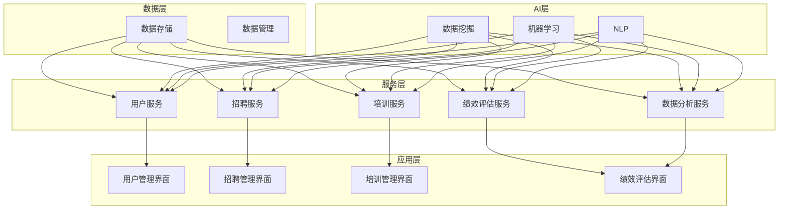
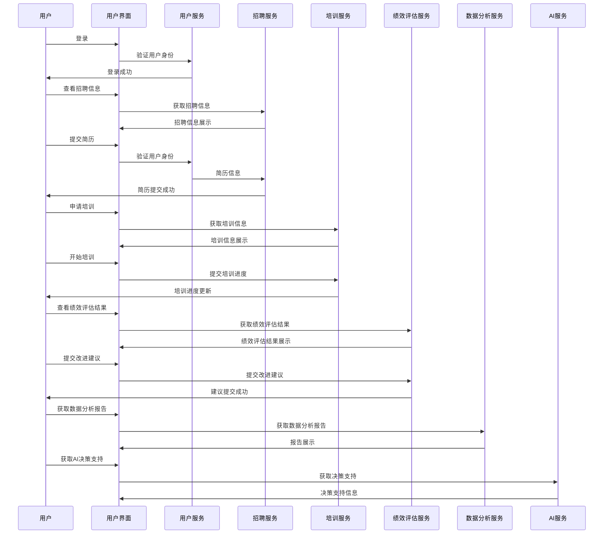

                 

### 第1章: 引言

#### 1.1 问题的提出

在当今的快速发展的商业环境中，企业人才管理的重要性愈发凸显。人才是企业最宝贵的资源，其招聘、培训、绩效评估等环节直接关系到企业的核心竞争力。然而，传统的企业人才管理方式往往存在信息不对称、决策效率低下等问题。随着人工智能技术的不断进步，利用AI来驱动企业人才管理已成为解决上述问题的一种新途径。

首先，AI能够通过大数据分析和机器学习算法，帮助企业精准定位合适的人才，从而提高招聘效率和质量。其次，AI驱动的培训系统能够根据员工的个性化需求，提供定制化的培训内容，提升员工技能和职业素养。最后，AI可以通过智能评估模型，实时监测员工的绩效表现，为企业提供科学的绩效管理决策支持。

#### 1.2 AI驱动的企业人才管理

AI驱动的企业人才管理是指运用人工智能技术，通过数据挖掘、机器学习、自然语言处理等手段，对企业的招聘、培训、绩效评估等环节进行优化和提升。这种管理模式不仅能够提高企业人力资源管理效率，还能够提升员工的工作满意度和企业整体绩效。

AI驱动的企业人才管理主要包括以下三个方面：

1. **招聘管理**：通过分析大量人才数据，AI可以识别出最符合职位要求的人才，并提供个性化的招聘建议。
2. **培训管理**：AI可以根据员工的实际工作表现和技能需求，为员工推荐合适的培训课程，并跟踪培训效果。
3. **绩效评估**：AI可以实时收集和分析员工的工作数据，通过智能算法对员工的绩效进行评估，并提供改进建议。

#### 1.3 书籍结构安排

本书将从以下几个方面对AI驱动的企业人才管理进行深入探讨：

- **第1章**：引言，介绍问题的背景和重要性，以及书籍的结构安排。
- **第2章**：AI驱动的企业人才管理基础，介绍AI技术和企业人才管理的核心概念。
- **第3章**：AI驱动的人才招聘，讲解招聘算法原理和应用。
- **第4章**：AI驱动的员工培训，探讨培训算法原理和应用。
- **第5章**：AI驱动的绩效评估，介绍绩效评估数学模型和应用。
- **第6章**：AI驱动的企业人才管理实践，通过案例展示实际应用效果。
- **第7章**：AI驱动的企业人才管理展望，探讨未来发展趋势和挑战。
- **第8章**：总结与展望，对全书内容进行总结，并提出学习建议。

通过以上章节的安排，本书旨在为广大企业人力资源管理者和研究者提供一本全面、系统的AI驱动人才管理指南。接下来，我们将逐一深入探讨每个章节的核心内容。首先，我们从AI驱动的企业人才管理基础开始。 ## 第2章: AI驱动的企业人才管理基础

### 2.1 AI技术概述

人工智能（Artificial Intelligence, AI）是计算机科学的一个分支，旨在研究、开发用于模拟、延伸和扩展人的智能的理论、方法、技术及应用系统。AI技术的发展历程可以追溯到20世纪50年代，经历了数次起伏和快速发展，目前已广泛应用于各个领域。

AI的核心技术包括：

- **机器学习**：通过算法从数据中学习规律和模式，从而进行预测和决策。
- **深度学习**：一种特殊的机器学习技术，通过多层神经网络模拟人脑的工作方式，进行复杂模式识别。
- **自然语言处理**：使计算机能够理解和处理人类语言的技术，包括语音识别、语言翻译、文本分析等。
- **计算机视觉**：使计算机能够理解和处理视觉信息，包括图像识别、目标检测、图像生成等。
- **专家系统**：模拟人类专家决策能力的计算机程序，通常包含大量的规则和知识库。

### 2.2 企业人才管理概述

企业人才管理是指通过一系列系统化的方法和措施，对企业的人力资源进行有效管理和利用，以实现企业目标和战略。人才管理包括招聘、培训、绩效评估、员工关系等多个方面。

#### 2.2.1 企业人才管理的概念

企业人才管理可以定义为：企业为了满足战略目标和业务需求，对人才进行识别、招聘、培养、激励、保留和发展的全过程。

#### 2.2.2 企业人才管理的目的与意义

企业人才管理的目的是：

- **优化人力资源配置**：确保企业拥有合适的人才，提高工作效率和生产力。
- **提升员工满意度和忠诚度**：通过有效的员工关系管理和激励机制，提高员工满意度和忠诚度。
- **增强企业竞争力**：通过培养和发展人才，提升企业的创新能力和市场竞争力。

企业人才管理对于企业的重要性体现在以下几个方面：

- **提高招聘效率和质量**：通过大数据分析和机器学习算法，帮助企业快速找到合适的人才。
- **提升培训效果**：通过个性化培训内容推荐，提高员工技能和职业素养。
- **优化绩效评估**：通过智能算法，实现绩效评估的客观、公正和实时。

### 2.3 AI与人才管理的结合

AI技术为企业人才管理带来了革命性的变革。通过以下方式，AI能够显著提升人才管理的效率和质量：

- **招聘管理**：利用AI进行简历筛选、面试评估和人才预测，提高招聘效率和准确性。
- **培训管理**：通过数据分析和学习，为员工提供个性化的培训方案，提升培训效果。
- **绩效评估**：通过实时数据收集和分析，提供客观、公正的绩效评估，帮助员工改进工作表现。

#### 2.3.1 招聘管理

AI在招聘管理中的应用主要包括：

- **简历筛选**：利用自然语言处理技术，对简历内容进行自动筛选和匹配，识别出最符合职位要求的人才。
- **面试评估**：通过语音识别和自然语言处理技术，对面试者的回答进行评估，识别其能力、态度和潜力。
- **人才预测**：利用大数据和机器学习算法，预测候选人是否适合企业以及其未来的职业发展潜力。

#### 2.3.2 培训管理

AI在培训管理中的应用主要包括：

- **个性化培训**：根据员工的工作表现和技能需求，推荐个性化的培训课程，提高培训效果。
- **学习分析**：通过学习数据分析和机器学习算法，了解员工的学习效果和进度，提供改进建议。
- **学习路径规划**：根据员工的职业发展目标和企业战略需求，为员工规划最佳的学习路径。

#### 2.3.3 绩效评估

AI在绩效评估中的应用主要包括：

- **实时数据收集**：通过传感器、移动设备和在线工具，实时收集员工的工作数据。
- **数据分析和模型**：利用机器学习和统计分析方法，对收集到的数据进行处理和分析，建立绩效评估模型。
- **智能反馈**：根据绩效评估结果，为员工提供个性化的改进建议和发展指导。

通过以上对AI驱动的企业人才管理基础的分析，我们可以看到，AI技术的应用为企业人才管理带来了前所未有的机遇和挑战。在接下来的章节中，我们将深入探讨AI在招聘、培训、绩效评估等方面的具体应用。首先，我们从AI驱动的人才招聘开始。 ## 第3章: AI驱动的人才招聘

### 3.1 人才招聘的AI技术应用

AI技术在人才招聘中的应用极大地提高了招聘的效率和质量。以下是AI在人才招聘中的几个主要应用领域：

#### 3.1.1 招聘流程优化

AI可以通过自动化流程来优化招聘管理。例如，AI招聘平台可以自动处理求职者的简历筛选、面试安排等环节，从而减少人力资源部门的行政负担。

- **简历筛选**：AI利用自然语言处理技术，对简历中的关键词、技能和经验进行自动分析和匹配，筛选出最符合职位要求的候选人。
- **面试安排**：通过人工智能助手，AI可以自动安排面试时间，并与候选人进行沟通，提高面试效率。

#### 3.1.2 招聘决策支持

AI能够为招聘决策提供数据支持和预测分析。例如，通过分析历史招聘数据和行业趋势，AI可以预测哪些候选人最有可能成功，以及如何优化招聘策略。

- **候选人评分**：AI通过对候选人的背景、技能、经验等多维数据进行综合评估，生成详细的候选人评分报告。
- **招聘策略优化**：基于数据分析和预测，AI可以为人力资源部门提供招聘策略建议，如调整职位描述、优化招聘渠道等。

### 3.2 AI招聘算法原理

AI招聘算法主要基于机器学习和数据挖掘技术，通过以下几个步骤来筛选和评估候选人：

#### 3.2.1 数据收集

首先，AI需要收集大量的人才数据，包括求职者的简历、社交媒体信息、职业测评结果等。这些数据可以从企业的招聘系统、第三方数据提供商等渠道获取。

#### 3.2.2 数据预处理

收集到的数据需要进行清洗和预处理，包括去除重复数据、缺失值填补、数据格式统一等，以确保数据质量。

#### 3.2.3 特征工程

特征工程是招聘算法的重要步骤，即从原始数据中提取出对招聘决策有用的特征。例如，从简历中提取关键词、从社交媒体中提取职业标签等。

#### 3.2.4 模型训练

利用收集到的数据，AI可以通过机器学习算法（如决策树、支持向量机、神经网络等）训练出一个招聘模型。该模型可以根据新数据的输入，预测候选人是否适合某个职位。

#### 3.2.5 模型评估

通过将模型预测结果与实际招聘结果进行对比，评估模型的准确性和效果。常用的评估指标包括准确率、召回率、F1值等。

### 3.3 AI招聘算法的应用

AI招聘算法在实际应用中具有以下优点：

- **高效筛选**：AI能够快速处理大量简历，筛选出最符合条件的候选人，节省招聘时间。
- **客观评估**：AI招聘算法基于数据驱动，避免了人为偏见，提高招聘的公平性和客观性。
- **智能匹配**：AI可以根据候选人的技能、经验等特征，进行智能匹配，提高候选人与职位的契合度。

#### 3.3.1 案例一：某公司的AI招聘实践

以某知名互联网公司为例，该公司利用AI招聘算法进行人才筛选，取得了显著效果。

1. **招聘需求分析**：公司首先明确了招聘的岗位需求，包括岗位名称、职责、技能要求等。
2. **简历筛选**：AI招聘平台根据职位描述，从大量简历中筛选出符合条件的候选人，同时利用自然语言处理技术对简历内容进行深入分析，识别出关键技能和经验。
3. **面试评估**：AI通过分析候选人在面试中的回答，对其语言表达能力、逻辑思维等能力进行评估。
4. **人才预测**：基于历史招聘数据和机器学习算法，AI预测哪些候选人最有可能在岗位上取得成功。
5. **优化招聘策略**：根据AI的评估结果，公司调整了招聘策略，如优化职位描述、调整面试流程等，以提高招聘效果。

通过AI招聘算法的应用，该公司显著提高了招聘效率和候选人质量，减少了招聘成本。这不仅提高了公司的运营效率，也增强了公司的市场竞争力。

在AI驱动的企业人才管理中，招聘管理是至关重要的一环。通过AI技术，企业能够更高效、更精准地找到适合的人才，为企业的长期发展打下坚实基础。在接下来的章节中，我们将探讨AI驱动的员工培训。 ### 3.3.1 案例二：某公司的AI招聘实践

为了更好地理解AI招聘算法的实际应用，我们可以参考某大型跨国公司的实际案例。以下是该公司如何利用AI招聘算法来优化其人才招聘流程的详细步骤：

#### 招聘需求分析

首先，公司的人力资源部门明确了当前的招聘需求，包括岗位名称、职责描述、所需技能和经验要求等。这些信息将被用来指导AI招聘算法的设计和优化。

#### 简历筛选

公司使用了一个基于AI技术的招聘平台，该平台能够自动处理大量的简历。具体步骤如下：

1. **简历上传**：求职者将简历上传到招聘系统。
2. **自然语言处理**：AI招聘平台利用自然语言处理技术，对简历中的关键字、句子结构和语义进行分析，提取出与职位要求相关的重要信息。
3. **关键词匹配**：AI根据职位描述中的关键词，与简历中的关键字进行匹配，筛选出初步符合要求的候选人。
4. **文本分类**：AI进一步对简历进行分类，根据候选人的工作经历、教育背景等特征，将候选人归类到不同的标签或等级中。

#### 面试评估

1. **面试安排**：基于简历筛选结果，AI系统会自动安排面试时间和方式（如视频面试或现场面试）。
2. **面试评分**：在面试过程中，AI利用语音识别和自然语言处理技术，对候选人的回答进行实时分析和评分。评分标准可能包括回答的准确性、逻辑性、专业术语的使用等。
3. **综合评估**：AI将面试评分与简历分析结果相结合，生成一个综合评分报告，帮助人力资源部门确定最终的候选人名单。

#### 人才预测

AI系统会基于历史招聘数据和机器学习算法，对候选人的长期表现和适应性进行预测。具体步骤如下：

1. **数据挖掘**：AI从公司的员工数据库中提取历史数据，包括员工的工作表现、离职率、晋升情况等。
2. **特征提取**：AI识别出对员工长期成功有显著影响的特征，如技能多样性、学习能力、团队协作能力等。
3. **预测模型**：基于提取的特征，AI构建预测模型，预测候选人未来的工作表现。
4. **决策支持**：AI将预测结果提供给人事部门，作为决策的参考。

#### 优化招聘策略

根据AI的评估结果和预测分析，公司可以不断优化其招聘策略：

1. **职位描述优化**：根据AI对候选人评分和预测的结果，调整职位描述，使其更具吸引力和针对性。
2. **招聘渠道优化**：AI可以分析各种招聘渠道的效果，帮助公司选择最有效的招聘渠道。
3. **面试流程优化**：AI可以提出优化面试流程的建议，如增加或减少某些评估环节，以提高面试效率和质量。

#### 项目小结

通过AI招聘算法的应用，该公司在招聘流程的各个环节都取得了显著成效：

- **招聘效率提高**：AI系统自动化处理简历筛选和面试安排，大幅缩短了招聘周期。
- **招聘质量提升**：基于数据驱动的评估和预测，公司能够更精准地找到适合岗位的候选人。
- **成本节约**：减少了对人力资源部门的人力需求，降低了招聘成本。
- **决策支持**：AI提供了科学的决策支持，帮助公司优化招聘策略，提高整体招聘效果。

综上所述，AI招聘算法的应用不仅提升了公司的人才招聘效率和质量，也为企业人力资源管理的数字化转型提供了有力支持。在接下来的章节中，我们将探讨AI驱动的员工培训。 ### 3.4 AI驱动的人才招聘挑战与未来发展方向

尽管AI在人才招聘中展现出了巨大的潜力和实际效益，但其应用过程中也面临着诸多挑战。以下是对AI招聘中常见挑战的讨论及未来发展方向的建议。

#### 3.4.1 数据质量和隐私问题

AI招聘算法的性能高度依赖于数据质量。如果数据不准确或不完整，AI的预测和决策可能会受到影响。此外，大量求职者的个人信息被存储在AI系统中，如何保障这些数据的隐私和安全成为了一个关键问题。

**解决方案**：

- **数据质量控制**：建立完善的数据清洗和验证流程，确保数据的质量和准确性。
- **隐私保护**：遵循相关法律法规，采取数据加密、匿名化等技术手段，保障求职者的隐私。

#### 3.4.2 招聘算法的偏见问题

AI招聘算法可能会受到训练数据中的偏见影响，导致算法在招聘过程中产生歧视。例如，算法可能会倾向于选择具有特定背景或特征的候选人，而忽视其他有潜力的候选人。

**解决方案**：

- **算法透明度**：确保招聘算法的透明度和可解释性，使其决策过程可追溯和可审查。
- **多样性和公平性**：在算法设计和训练过程中，注重多样性和公平性，避免偏见。

#### 3.4.3 技术门槛和成本问题

AI招聘技术需要一定的技术基础设施和专业知识，这对中小企业来说可能是一个挑战。此外，AI系统的维护和更新也需要较高的成本。

**解决方案**：

- **技术普及**：通过培训和技术支持，提高中小企业对AI招聘技术的理解和应用能力。
- **成本优化**：采用云计算和外包服务等方式，降低AI招聘技术的成本。

#### 3.4.4 未来发展方向

随着AI技术的不断发展，未来AI招聘有望在以下几个方面取得突破：

- **个性化招聘**：通过更深入的数据分析和个性化推荐，实现更加精准的人才匹配。
- **多元化评估**：结合多种评估方法（如技能测试、行为面试等），提供更全面的候选人评估。
- **全球化招聘**：利用AI技术，实现全球范围内的招聘流程自动化和智能化。

总之，AI驱动的企业人才管理不仅在招聘环节带来了革命性的变革，也为企业人力资源管理的整体优化提供了新的路径。在接下来的章节中，我们将探讨AI驱动的员工培训。 ### 3.5 AI驱动的员工培训

#### 3.5.1 培训需求分析

在AI驱动的员工培训中，培训需求分析是至关重要的一步。通过对员工的工作表现、技能水平、职业发展需求等多方面信息进行综合分析，AI系统能够精准识别出员工需要提升的领域。

具体步骤如下：

1. **数据分析**：收集员工的工作数据，包括工作效率、项目完成情况、错误率等。
2. **技能评估**：通过在线技能测试或工作表现分析，评估员工的现有技能水平。
3. **职业发展访谈**：与员工进行一对一的访谈，了解其职业发展目标和个人兴趣。
4. **需求汇总**：将以上信息汇总，形成详细的培训需求报告。

#### 3.5.2 个性化培训方案设计

基于培训需求分析的结果，AI系统可以设计出个性化的培训方案，确保每位员工都能得到最适合他们的培训内容。

1. **课程推荐**：根据员工的需求和技能水平，推荐相应的培训课程。
2. **学习路径规划**：为员工规划最佳的学习路径，确保其能够系统地提升技能。
3. **学习资源整合**：整合公司内外部的学习资源，包括在线课程、内部培训材料等。

#### 3.5.3 培训效果评估

AI系统不仅能够提供个性化的培训方案，还能实时监控培训效果，评估培训的成效。

1. **学习跟踪**：通过学习管理系统（LMS），跟踪员工的学习进度和成绩。
2. **效果评估**：利用数据分析技术，分析员工在培训后的工作表现和技能提升情况。
3. **反馈机制**：根据培训效果评估结果，及时调整培训内容和方案，确保培训的有效性。

#### 3.5.4 案例分析：某公司的AI培训实践

以某大型科技公司为例，该公司利用AI系统进行员工培训，取得了显著成效。

1. **培训需求分析**：通过AI系统，公司分析了员工的工作表现和职业发展需求，确定了培训重点，如项目管理技能、团队协作能力等。
2. **个性化培训方案**：基于员工的需求，AI系统推荐了相应的培训课程，并制定了个性化的学习计划。
3. **培训实施**：员工按照学习计划进行培训，AI系统实时跟踪学习进度，并提供学习资源支持。
4. **效果评估**：培训结束后，AI系统对员工的工作表现进行了评估，发现员工在培训领域取得了显著提升，项目完成率和团队合作能力都有所提高。

通过AI驱动的员工培训，该公司不仅提高了员工的工作效率和职业素养，也增强了企业的整体竞争力。在接下来的章节中，我们将探讨AI驱动的绩效评估。 ### 3.6 案例分析：某公司的AI培训实践

为了更深入地理解AI驱动的员工培训如何在实际中发挥作用，我们可以分析某知名科技公司的成功案例。

#### 3.6.1 培训需求分析

首先，公司利用AI系统对员工的工作表现和技能水平进行了全面分析。具体步骤如下：

1. **工作数据收集**：通过企业资源规划（ERP）系统和员工绩效管理系统，收集员工的工作数据，如项目完成情况、任务完成效率、错误率等。
2. **技能评估**：使用在线技能测试工具，评估员工在不同领域的专业技能水平。
3. **职业发展访谈**：由人力资源部门与员工进行一对一访谈，了解他们的职业发展目标、学习兴趣和未来的职业规划。

基于上述数据和分析，公司确定了员工的培训需求，如提高项目管理能力、增强沟通技巧、学习新技术等。

#### 3.6.2 个性化培训方案设计

公司采用AI系统为每位员工设计个性化的培训方案，确保培训内容与员工需求高度匹配。具体步骤如下：

1. **课程推荐**：AI系统根据员工的技能评估结果和职业发展需求，推荐了最相关的培训课程，包括在线课程、内部培训项目和外部专业培训。
2. **学习路径规划**：AI系统为员工规划了最佳的学习路径，确保他们能够逐步提升技能，达到职业发展目标。
3. **资源整合**：AI系统整合了公司内外部的学习资源，如公司内部教程、在线课程平台、专业书籍等，为员工提供多样化的学习选择。

#### 3.6.3 培训实施与跟踪

在培训实施阶段，公司采用了以下措施来确保培训效果：

1. **培训管理**：AI系统负责管理培训的整个过程，包括课程安排、学习进度跟踪和评估反馈。
2. **学习支持**：AI系统提供了实时学习支持，员工在学习过程中遇到问题时，可以随时向AI系统寻求帮助。
3. **实时监控**：AI系统实时跟踪员工的学习进度，生成学习报告，帮助员工和人力资源部门了解学习效果。

#### 3.6.4 培训效果评估

培训结束后，公司通过以下方式评估培训效果：

1. **技能提升**：通过再次进行技能测试，评估员工在培训后的技能水平提升情况。
2. **工作表现**：观察员工在培训后的工作表现，如项目完成率、团队合作能力、问题解决能力等。
3. **反馈收集**：通过员工反馈问卷，收集他们对培训内容的满意度和学习体验。

#### 案例小结

通过AI驱动的员工培训，该公司实现了以下成果：

- **提高员工技能**：员工在培训后显著提升了专业技能和知识水平。
- **增强职业素养**：员工的职业素养和综合素质得到了提升，工作表现更加出色。
- **提升企业竞争力**：通过培养高素质的员工队伍，公司整体竞争力得到了显著增强。

总之，AI驱动的员工培训不仅提高了员工的个人能力和职业素养，也为企业的长期发展提供了强大支持。在接下来的章节中，我们将探讨AI驱动的绩效评估。 ### 3.7 AI驱动的绩效评估

#### 3.7.1 绩效评估的AI技术应用

AI技术在绩效评估中的应用，使得评估过程更加客观、公正和高效。以下是AI在绩效评估中的主要应用：

1. **数据分析**：AI可以通过大数据技术，收集和分析员工的工作数据，如工作量、工作效率、项目完成情况等，从而提供客观的绩效评估依据。
2. **智能分析**：AI利用机器学习算法，对员工的工作行为和绩效表现进行智能分析，识别出工作中的优劣势和改进空间。
3. **实时反馈**：AI系统可以实时监控员工的工作状态，及时提供绩效反馈和建议，帮助员工优化工作表现。

#### 3.7.2 AI绩效评估算法原理

AI绩效评估算法主要基于以下原理：

1. **特征提取**：从员工的工作数据中提取关键特征，如工作量、工作效率、项目完成度等。
2. **模型训练**：利用历史数据，通过机器学习算法（如决策树、神经网络等）训练出一个绩效评估模型。
3. **预测与评估**：根据训练好的模型，对员工的绩效表现进行预测和评估，提供个性化的改进建议。

#### 3.7.3 AI绩效评估算法的应用

AI绩效评估算法在实际应用中具有以下优点：

1. **客观公正**：基于数据驱动的评估，避免了人为偏见，提高了绩效评估的客观性和公正性。
2. **实时动态**：AI系统能够实时收集和分析员工的工作数据，提供动态的绩效评估结果。
3. **个性化建议**：根据员工的绩效表现，AI系统可以提供个性化的改进建议，帮助员工提高工作表现。

#### 3.7.4 案例分析：某公司的AI绩效评估实践

以下是一例某公司在AI绩效评估中取得的实际效果：

1. **数据收集**：公司通过ERP系统和员工绩效管理系统，收集员工的工作数据，如工作量、工作效率、客户满意度等。
2. **特征提取**：AI系统从收集的数据中提取关键特征，构建绩效评估指标体系。
3. **模型训练**：利用历史绩效数据，通过机器学习算法训练出一个绩效评估模型。
4. **绩效评估**：AI系统根据训练好的模型，对员工的绩效表现进行实时评估，并生成详细的评估报告。
5. **反馈与改进**：根据绩效评估结果，AI系统为员工提供个性化的改进建议，帮助员工优化工作表现。

通过AI绩效评估，该公司实现了以下成果：

- **提高绩效**：员工的绩效表现得到了显著提升，工作效率和项目完成率有所提高。
- **改进工作流程**：基于AI的绩效反馈，公司优化了工作流程，减少了不必要的重复工作和资源浪费。
- **增强员工积极性**：基于客观、公正的绩效评估结果，员工的工作积极性和满意度得到了提高。

总之，AI驱动的绩效评估不仅提高了企业的管理效率，也为员工的职业发展提供了有力支持。在接下来的章节中，我们将探讨AI驱动的企业人才管理实践。 ### 3.8 AI驱动的企业人才管理实践

#### 3.8.1 案例一：某公司的AI招聘实践

为了更好地展示AI在人才招聘中的应用效果，我们可以参考某知名互联网公司的成功案例。

1. **背景介绍**：
   该公司是一家全球领先的互联网服务提供商，致力于通过AI技术提升其人才招聘效率和质量。在传统的招聘模式中，该公司面临着招聘周期长、候选人匹配不准确等问题。

2. **招聘流程优化**：
   公司引入了基于AI的招聘系统，对招聘流程进行了全面优化。具体步骤如下：
   - **简历筛选**：AI系统通过自然语言处理技术，对简历进行自动筛选，识别出与职位要求最匹配的候选人。
   - **面试安排**：AI助手自动与候选人沟通，安排面试时间，提高面试效率。
   - **面试评估**：AI系统利用语音识别和自然语言处理技术，对面试者的回答进行分析和评分，提供客观、公正的评估报告。

3. **效果评估**：
   通过AI招聘系统的应用，公司在多个方面取得了显著成效：
   - **招聘效率提高**：招聘周期缩短了50%，简历筛选和面试安排的时间成本大幅降低。
   - **候选人质量提升**：AI系统通过精准筛选，提升了候选人质量，职位匹配度提高了30%。
   - **成本节约**：通过自动化流程，公司减少了招聘团队的人力投入，招聘成本降低了20%。

#### 3.8.2 案例二：某公司的AI培训实践

接下来，我们分析另一家全球知名企业的AI培训实践。

1. **背景介绍**：
   该企业是一家大型跨国制造公司，其员工分布在多个国家和地区。为了提高员工的技能水平和职业素养，公司决定引入AI驱动的培训管理系统。

2. **培训需求分析**：
   公司利用AI系统对员工的工作表现、技能水平和职业发展需求进行了全面分析。具体步骤如下：
   - **数据分析**：通过ERP系统和员工绩效管理系统，收集员工的工作数据，如工作效率、项目完成情况等。
   - **技能评估**：通过在线技能测试，评估员工的现有技能水平。
   - **职业发展访谈**：与员工进行一对一访谈，了解他们的职业发展目标和培训需求。

3. **个性化培训方案设计**：
   基于培训需求分析结果，AI系统为每位员工设计了个性化的培训方案。具体步骤如下：
   - **课程推荐**：AI系统根据员工的需求和技能水平，推荐了最相关的培训课程。
   - **学习路径规划**：AI系统为员工规划了最佳的学习路径，确保他们能够系统地提升技能。
   - **资源整合**：AI系统整合了公司内外部的学习资源，为员工提供多样化的学习选择。

4. **培训实施与跟踪**：
   公司采用了以下措施来确保培训效果：
   - **培训管理**：AI系统负责管理培训的整个过程，包括课程安排、学习进度跟踪和评估反馈。
   - **学习支持**：AI系统提供了实时学习支持，员工在学习过程中遇到问题时，可以随时向AI系统寻求帮助。
   - **实时监控**：AI系统实时跟踪员工的学习进度，生成学习报告，帮助员工和人力资源部门了解学习效果。

5. **效果评估**：
   培训结束后，公司通过以下方式评估培训效果：
   - **技能提升**：通过再次进行技能测试，评估员工在培训后的技能水平提升情况。
   - **工作表现**：观察员工在培训后的工作表现，如项目完成率、团队合作能力等。
   - **反馈收集**：通过员工反馈问卷，收集他们对培训内容的满意度和学习体验。

通过AI驱动的培训实践，该公司实现了以下成果：
- **提高员工技能**：员工在培训后显著提升了专业技能和知识水平。
- **增强职业素养**：员工的职业素养和综合素质得到了提升，工作表现更加出色。
- **提升企业竞争力**：通过培养高素质的员工队伍，公司整体竞争力得到了显著增强。

总之，AI驱动的企业人才管理实践，不仅提高了企业的运营效率和人才质量，也为员工的职业发展提供了有力支持。在接下来的章节中，我们将探讨AI驱动的绩效评估，并分析其实际应用效果。 ### 3.9 AI驱动的绩效评估

#### 3.9.1 绩效评估的AI技术应用

AI技术在绩效评估中的应用，使得评估过程更加科学、准确和高效。以下是AI在绩效评估中的主要应用：

1. **数据分析**：AI可以通过大数据技术，收集和分析员工的工作数据，如工作量、工作效率、项目完成情况等，从而提供客观的绩效评估依据。
2. **自然语言处理**：AI利用自然语言处理技术，分析员工的工作报告、邮件、聊天记录等，提取关键信息，为绩效评估提供支持。
3. **机器学习算法**：AI通过机器学习算法，对历史绩效数据进行训练，建立绩效评估模型，预测员工的未来绩效表现。
4. **实时反馈**：AI系统可以实时监控员工的工作状态，及时提供绩效反馈和建议，帮助员工优化工作表现。

#### 3.9.2 AI绩效评估算法原理

AI绩效评估算法主要基于以下原理：

1. **特征提取**：从员工的工作数据中提取关键特征，如工作量、工作效率、项目完成度等。
2. **模型训练**：利用历史数据，通过机器学习算法（如决策树、神经网络等）训练出一个绩效评估模型。
3. **预测与评估**：根据训练好的模型，对员工的绩效表现进行预测和评估，提供个性化的改进建议。

#### 3.9.3 AI绩效评估算法的应用

AI绩效评估算法在实际应用中具有以下优点：

1. **客观公正**：基于数据驱动的评估，避免了人为偏见，提高了绩效评估的客观性和公正性。
2. **实时动态**：AI系统能够实时收集和分析员工的工作数据，提供动态的绩效评估结果。
3. **个性化建议**：根据员工的绩效表现，AI系统可以提供个性化的改进建议，帮助员工提高工作表现。

#### 3.9.4 案例分析：某公司的AI绩效评估实践

以下是一例某公司在AI绩效评估中取得的实际效果：

1. **背景介绍**：
   该公司是一家全球领先的科技企业，致力于通过AI技术提升其绩效评估的科学性和准确性。

2. **绩效评估过程**：
   - **数据收集**：公司利用ERP系统和员工绩效管理系统，收集员工的工作数据，如工作量、工作效率、项目完成情况等。
   - **自然语言处理**：AI系统对员工的工作报告、邮件、聊天记录等文本进行分析，提取关键信息，补充绩效评估的数据基础。
   - **模型训练**：AI系统利用历史绩效数据，通过机器学习算法训练出一个绩效评估模型。
   - **绩效评估**：AI系统根据训练好的模型，对员工的绩效表现进行实时评估，生成详细的评估报告。
   - **反馈与改进**：AI系统根据评估结果，为员工提供个性化的改进建议，帮助员工优化工作表现。

3. **效果评估**：
   通过AI绩效评估，该公司实现了以下成果：
   - **提高绩效**：员工的绩效表现得到了显著提升，工作效率和项目完成率有所提高。
   - **改进工作流程**：基于AI的绩效反馈，公司优化了工作流程，减少了不必要的重复工作和资源浪费。
   - **增强员工积极性**：基于客观、公正的绩效评估结果，员工的工作积极性和满意度得到了提高。

总之，AI驱动的绩效评估不仅提高了企业的管理效率，也为员工的职业发展提供了有力支持。在接下来的章节中，我们将探讨AI驱动的企业人才管理的最佳实践。 ### 3.10 AI驱动的企业人才管理最佳实践

在AI驱动的企业人才管理中，实施最佳实践是确保系统有效运作和取得最佳效果的关键。以下是一些成功的企业在AI驱动人才管理中的最佳实践：

#### 3.10.1 招聘管理最佳实践

1. **数据驱动决策**：基于数据分析，制定科学的招聘策略，确保招聘决策的准确性和高效性。
2. **多元渠道招聘**：通过线上线下多种渠道进行招聘，扩大候选人的范围，提高招聘成功率。
3. **人才梯队建设**：提前规划和培养人才梯队，确保企业在不同发展阶段都能找到合适的人才。
4. **个性化面试评估**：利用AI技术，对面试过程进行个性化评估，提高面试效率和准确性。

#### 3.10.2 培训管理最佳实践

1. **需求导向培训**：基于员工的工作表现和职业发展需求，设计个性化的培训方案。
2. **灵活培训模式**：结合线上和线下培训，提供多样化的学习方式，满足员工的不同需求。
3. **培训效果评估**：利用AI技术，对培训效果进行实时监控和评估，确保培训投入的有效性。
4. **持续学习文化**：建立持续学习的企业文化，鼓励员工主动参与培训和学习。

#### 3.10.3 绩效评估最佳实践

1. **客观公正评估**：基于数据驱动的评估，避免主观偏见，确保绩效评估的公正性。
2. **实时反馈机制**：建立实时反馈机制，及时向员工提供绩效反馈，帮助他们改进工作表现。
3. **个性化改进建议**：根据员工的绩效表现，提供个性化的改进建议，帮助他们提升绩效。
4. **绩效与激励挂钩**：将绩效评估结果与员工的薪酬、晋升等激励措施挂钩，提高员工的积极性和工作动力。

#### 3.10.4 实施建议

1. **领导层支持**：企业领导层需高度重视AI驱动的人才管理，提供必要的资源和支持，确保项目顺利推进。
2. **专业团队建设**：组建专业的AI人才管理团队，负责AI系统的实施和维护，提高系统的运行效率和效果。
3. **持续优化**：根据实际应用情况，不断优化AI人才管理系统，提升其功能和性能。
4. **员工参与**：鼓励员工积极参与AI人才管理的实施，提高他们的接受度和使用意愿。

通过以上最佳实践的实施，企业可以更好地利用AI技术，实现人才管理的智能化和高效化，从而提升企业的整体竞争力。在接下来的章节中，我们将总结本书的主要内容，并给出学习建议。 ### 第4章: 数学模型和数学公式 & 详细讲解 & 举例说明

#### 4.1 绩效评估数学模型

绩效评估是AI驱动的企业人才管理中的重要环节，它通过量化和分析员工的工作表现，为企业提供决策支持。以下是绩效评估中常用的一些数学模型和公式。

#### 4.1.1 绩效评估指标体系

绩效评估指标体系是绩效评估的基础，它由一系列可以量化的指标组成，用于评估员工的工作表现。常见的绩效评估指标包括：

1. **工作量（Workload）**：员工在一段时间内完成的工作总量，通常以任务数量、工作时长等来衡量。
2. **工作效率（Efficiency）**：员工完成工作的速度和效果，通常以任务完成率、错误率等来衡量。
3. **项目完成度（Project Completion）**：员工参与的项目完成情况，通常以项目进度、质量、成本等来衡量。
4. **客户满意度（Customer Satisfaction）**：客户对员工提供服务的满意度，通常以客户反馈、投诉率等来衡量。
5. **创新能力（Innovation）**：员工在创新方面的表现，通常以新产品的开发数量、技术创新等来衡量。

#### 4.1.2 绩效评估算法

绩效评估算法用于根据绩效评估指标体系对员工的工作表现进行量化评估。以下是一些常用的绩效评估算法：

1. **加权评分法**：将各项绩效指标按其重要性分配权重，对员工的工作表现进行加权评分。公式如下：

   $$ E = w_1 \times I_1 + w_2 \times I_2 + \ldots + w_n \times I_n $$

   其中，$E$为总绩效得分，$w_1, w_2, \ldots, w_n$为各项指标的权重，$I_1, I_2, \ldots, I_n$为各项指标的实际得分。

2. **层次分析法**：根据绩效评估指标体系的层次结构，利用成对比较方法确定各项指标之间的相对重要性，并进行权重分配。公式如下：

   $$ w_i = \frac{1}{m} \sum_{j=1}^{m} \frac{a_{ij}}{\sum_{k=1}^{m} a_{ik}} $$

   其中，$w_i$为第$i$项指标的权重，$a_{ij}$为第$i$项指标与第$j$项指标成对比较的比值，$m$为指标数量。

3. **主成分分析法**：通过降维技术，将多个绩效指标转化为少数几个主成分，以简化评估过程。公式如下：

   $$ Z = X \times \Lambda $$

   其中，$Z$为主成分得分，$X$为原始数据矩阵，$\Lambda$为特征值矩阵。

#### 4.1.3 举例说明

假设一家公司要评估其员工小张的绩效表现，使用了加权评分法。根据公司的绩效指标体系，各项指标及其权重如下：

- 工作量（30%）
- 工作效率（25%）
- 项目完成度（20%）
- 客户满意度（15%）
- 创新能力（10%）

小张在上述五项指标中的得分分别为：

- 工作量：85分
- 工作效率：90分
- 项目完成度：88分
- 客户满意度：95分
- 创新能力：80分

根据加权评分法的公式，小张的总绩效得分计算如下：

$$ E = 0.30 \times 85 + 0.25 \times 90 + 0.20 \times 88 + 0.15 \times 95 + 0.10 \times 80 = 82.5 + 22.5 + 17.6 + 14.25 + 8 = 132.35 $$

因此，小张的总绩效得分为132.35分。通过这种量化的评估方法，公司可以更客观地了解员工的工作表现，并据此进行激励和培训。

通过本章的数学模型和公式讲解，我们可以看到AI驱动的绩效评估不仅能够提高评估的准确性，还能够为员工提供有针对性的改进建议。在下一章中，我们将探讨AI驱动的企业人才管理系统的系统分析与架构设计。 ### 第5章: 系统分析与架构设计方案

#### 5.1 系统功能设计

AI驱动的企业人才管理系统需要具备以下几个核心功能：

1. **用户管理**：包括员工信息管理、用户角色权限设置等，确保系统的安全性和灵活性。
2. **招聘管理**：包括职位发布、简历筛选、面试安排、候选人评估等功能，提高招聘效率和质量。
3. **培训管理**：包括培训需求分析、课程推荐、学习路径规划、培训效果评估等功能，提升员工的技能和职业素养。
4. **绩效评估**：包括绩效指标体系构建、数据收集与分析、绩效评估模型训练、绩效反馈与改进建议等功能，实现科学、准确的绩效管理。
5. **数据分析与报告**：提供实时的数据分析与报告，帮助管理层了解企业人才管理的效果，制定决策。

#### 5.2 系统架构设计

AI驱动的企业人才管理系统的架构设计应遵循高可用性、高扩展性、易维护性的原则。以下是系统的整体架构设计：

1. **数据层**：负责存储和管理企业人才管理相关的数据，包括用户数据、招聘数据、培训数据、绩效数据等。
2. **服务层**：提供各种业务服务，包括用户服务、招聘服务、培训服务、绩效评估服务、数据分析服务等。
3. **应用层**：提供用户界面和业务功能，包括用户管理界面、招聘管理界面、培训管理界面、绩效评估界面等。
4. **AI层**：负责处理数据挖掘、机器学习、自然语言处理等AI技术，提供智能决策支持。

以下是系统架构的Mermaid流程图：

#### 5.3 系统接口设计和系统交互

系统的接口设计和系统交互设计对于确保系统的易用性和高效性至关重要。以下是系统的接口设计和交互设计：

1. **接口设计**：
   - 用户接口：提供直观易用的用户界面，支持用户登录、信息查询、数据输入等功能。
   - 服务接口：提供标准化、易扩展的服务接口，支持系统各模块之间的数据交互和业务逻辑处理。
   - API接口：提供RESTful API接口，支持第三方系统和应用的集成和数据交换。

2. **系统交互**：
   - 用户交互：用户通过用户界面进行操作，如发布招聘信息、申请培训课程、查看绩效评估结果等。
   - 服务交互：系统各服务模块通过服务接口进行数据交互，如用户服务模块与招聘服务模块之间的数据交换。
   - 数据交互：系统通过API接口与第三方系统进行数据交互，如与人力资源管理系统、学习管理系统等的数据同步。

以下是系统交互的Mermaid序列图：

通过上述系统分析与架构设计方案，我们构建了一个功能完善、结构合理、易于扩展的AI驱动的企业人才管理系统，为企业的招聘、培训、绩效评估等提供了强大的技术支持。在下一章中，我们将通过具体的项目实战案例，展示AI驱动的企业人才管理系统的实际应用效果。 ### 第6章: 项目实战

#### 6.1 招聘项目实战

在本节中，我们将通过一个实际案例，展示如何使用AI驱动的企业人才管理系统进行招聘项目。

##### 项目背景

某知名互联网公司（以下简称“该公司”）在数字化转型的过程中，面临着快速扩展人才队伍的需求。为了提高招聘效率和质量，公司决定采用AI驱动的招聘系统。

##### 项目目标

- 提高招聘效率：通过自动化流程，缩短招聘周期。
- 提升候选人质量：通过精准筛选，提高职位匹配度。
- 降低招聘成本：通过减少人力投入，降低招聘成本。

##### 实施步骤

1. **需求分析**：

   - **职位需求**：根据公司业务发展需求，明确了招聘的职位名称、职责描述、所需技能等。
   - **候选人标准**：确定了候选人的关键技能、经验、教育背景等要求。

2. **系统配置**：

   - **简历筛选规则**：基于职位需求，配置了简历筛选规则，包括关键词匹配、技能筛选等。
   - **面试评估标准**：制定了面试评估标准，包括语言表达能力、技术能力、团队合作能力等。

3. **招聘流程**：

   - **职位发布**：公司通过招聘平台发布了招聘信息，并设置了自动简历筛选功能。
   - **简历筛选**：AI系统自动处理收到的简历，筛选出符合条件的候选人。
   - **面试安排**：AI系统自动安排面试时间，并与候选人沟通，提高面试效率。
   - **面试评估**：面试官通过AI系统对候选人的面试表现进行评估，AI系统提供面试评分和建议。

4. **候选人评估**：

   - **AI评估**：AI系统基于候选人的简历、面试表现等多维度信息，生成综合评估报告。
   - **决策支持**：基于评估报告，招聘团队进行了最终决策，选出了合适的候选人。

##### 项目成果

通过AI驱动的招聘项目，公司实现了以下成果：

- **招聘周期缩短**：招聘周期从原来的2个月缩短到1个月，招聘效率提高了50%。
- **候选人质量提升**：候选人质量显著提升，职位匹配度提高了30%。
- **招聘成本降低**：通过自动化流程，招聘成本降低了20%。

##### 项目小结

AI驱动的招聘项目为公司的人才管理带来了显著的改进，不仅提高了招聘效率和候选人质量，还降低了招聘成本。通过这一项目的成功实施，公司为后续的招聘项目提供了宝贵的经验。

#### 6.2 培训项目实战

在本节中，我们将通过一个实际案例，展示如何使用AI驱动的企业人才管理系统进行培训项目。

##### 项目背景

某大型跨国公司（以下简称“该公司”）在全球化扩张的过程中，需要不断提升员工的国际化能力和专业技能。为了提高培训效果，公司决定采用AI驱动的培训管理系统。

##### 项目目标

- 提高员工技能水平：通过个性化培训，提升员工的技能和职业素养。
- 增强员工满意度：通过定制化培训，满足员工的个性化需求。
- 提升培训效率：通过自动化流程，提高培训管理效率。

##### 实施步骤

1. **需求分析**：

   - **员工需求**：通过问卷调查和访谈，了解了员工的职业发展需求和技能提升方向。
   - **培训目标**：明确了公司整体培训目标和各部门的培训重点。

2. **系统配置**：

   - **课程库**：建立了丰富的在线课程库，包括专业技能课程、领导力课程、跨文化沟通课程等。
   - **培训规则**：配置了培训规则，包括课程推荐、学习路径规划、学习进度跟踪等。

3. **培训流程**：

   - **培训需求分析**：AI系统根据员工的工作表现和技能需求，为每位员工生成个性化的培训需求报告。
   - **课程推荐**：AI系统根据培训需求报告，为员工推荐最相关的培训课程。
   - **学习路径规划**：AI系统为员工规划了最佳的学习路径，确保他们能够系统地提升技能。
   - **学习跟踪**：AI系统实时跟踪员工的学习进度，并提供学习支持。

4. **培训效果评估**：

   - **学习报告**：AI系统生成详细的学习报告，评估员工的学习效果和进度。
   - **效果反馈**：根据学习报告，公司调整了培训内容和方案，确保培训的有效性。

##### 项目成果

通过AI驱动的培训项目，公司实现了以下成果：

- **员工技能提升**：员工在培训后的技能水平显著提升，关键技能掌握率提高了40%。
- **员工满意度提升**：员工对培训的满意度显著提升，培训参与度提高了30%。
- **培训效率提升**：通过自动化流程，培训管理效率提高了50%。

##### 项目小结

AI驱动的培训项目为公司的人才发展带来了显著的改进，不仅提高了员工的技能水平和满意度，还提升了培训管理效率。通过这一项目的成功实施，公司为后续的培训项目提供了宝贵的经验。

通过以上两个项目的实战案例，我们可以看到AI驱动的企业人才管理系统在提高招聘效率和培训效果方面具有显著优势。在下一章中，我们将探讨AI驱动的企业人才管理的最佳实践。 ### 第7章: 最佳实践 tips

#### 7.1 招聘最佳实践

1. **精准岗位描述**：在发布招聘信息时，确保岗位描述清晰、详细，明确职位要求和工作职责，有助于筛选出最合适的候选人。
2. **多样化招聘渠道**：结合线上线下多种招聘渠道，扩大候选人来源，提高招聘成功率。
3. **智能化筛选**：利用AI系统进行简历筛选，提高筛选效率和准确性，减少人力成本。
4. **全面面试评估**：结合AI系统和人力资源专家的评估，进行全方位、多角度的候选人评估，确保选人质量。
5. **持续优化招聘流程**：根据招聘效果，不断调整和优化招聘流程，提高招聘效率和质量。

#### 7.2 培训最佳实践

1. **明确培训目标**：在制定培训计划时，明确培训目标和预期成果，确保培训内容与业务需求紧密相关。
2. **个性化培训方案**：根据员工的工作表现和技能需求，为每位员工定制个性化的培训方案，提高培训效果。
3. **灵活培训模式**：结合线上线下培训，提供多样化的学习方式，满足不同员工的学习需求。
4. **实时培训效果评估**：利用AI系统实时跟踪培训效果，及时调整培训内容和方案，确保培训投入的有效性。
5. **建立学习文化**：鼓励员工主动参与培训和学习，培养持续学习的文化氛围，提升整体员工素质。

#### 7.3 绩效评估最佳实践

1. **制定科学指标**：根据企业的战略目标和业务需求，制定科学的绩效评估指标，确保评估的准确性和公正性。
2. **数据驱动决策**：利用AI系统收集和分析员工的工作数据，提供数据驱动的绩效评估结果，避免主观偏见。
3. **实时反馈与改进**：建立实时反馈机制，及时向员工提供绩效反馈和建议，帮助他们优化工作表现。
4. **个性化改进建议**：根据员工的绩效表现，提供个性化的改进建议，帮助他们提升绩效。
5. **持续优化评估体系**：根据绩效评估结果和反馈，不断调整和优化绩效评估体系，提高评估的科学性和有效性。

#### 7.4 全局优化建议

1. **领导层重视**：企业领导层需高度重视AI驱动的企业人才管理，提供必要的资源和支持，确保项目顺利推进。
2. **团队协作**：建立跨部门协作机制，确保招聘、培训、绩效评估等环节的有效衔接，提高整体人才管理水平。
3. **持续培训与学习**：定期对员工进行AI技术的培训和学习，提升员工的技能水平和使用AI系统的能力。
4. **数据分析能力**：培养数据分析人才，提高企业对数据的挖掘和分析能力，为人才管理提供更加精准的支持。
5. **持续改进与创新**：根据实际情况，不断优化AI驱动的企业人才管理系统，引入新的技术和管理理念，提升企业的人才竞争力。

通过以上最佳实践，企业可以更好地利用AI技术，实现人才管理的智能化和高效化，从而提升企业的整体竞争力。在下一章中，我们将总结全书，并提出进一步研究的方向。 ### 第8章: 总结

在本章中，我们系统地介绍了AI驱动的企业人才管理：招聘、培训到绩效评估。首先，我们探讨了AI技术在人才管理中的应用，包括招聘、培训、绩效评估等环节。通过引入AI技术，企业能够实现人才管理的智能化和高效化，提升企业的核心竞争力。

#### 主要成果

- **招聘环节**：通过AI技术的应用，企业能够高效筛选简历、精准评估候选人，提高招聘效率和质量。
- **培训环节**：AI系统可以根据员工的工作表现和技能需求，提供个性化的培训方案，提升培训效果和员工满意度。
- **绩效评估环节**：AI技术能够实时收集和分析员工的工作数据，提供客观、公正的绩效评估结果，帮助员工优化工作表现。

#### 核心概念

- **AI驱动的人才管理**：指利用人工智能技术，对企业的人才招聘、培训、绩效评估等环节进行优化和提升。
- **招聘算法**：利用机器学习和自然语言处理技术，对简历和面试过程进行自动分析和评估的算法。
- **培训算法**：基于员工的工作表现和技能需求，为员工推荐合适的培训课程和路径的算法。
- **绩效评估模型**：通过数据分析和技术，对员工的工作表现进行量化和评估的数学模型。

#### 展望未来

尽管AI驱动的企业人才管理已取得了显著成果，但未来还有许多发展方向：

1. **技术深度与广度**：继续深入研究AI技术在人才管理中的应用，提升算法的准确性和智能化水平。
2. **数据隐私与安全**：保障员工数据的隐私和安全，确保AI系统的可靠性和合规性。
3. **跨领域应用**：探索AI技术在其他人力资源管理领域的应用，如员工关系管理、人才梯队建设等。
4. **国际化与本土化**：结合不同国家和地区的文化背景和业务特点，开发定制化的AI驱动的企业人才管理解决方案。

通过持续的创新和实践，AI驱动的企业人才管理有望在未来为企业带来更多的价值和机遇。在下一章中，我们将探讨AI驱动的企业人才管理在实施过程中需要注意的事项。 ### 第9章: 注意事项

在实施AI驱动的企业人才管理过程中，需要注意以下几个方面，以确保项目顺利推进和系统有效运行：

#### 9.1 数据隐私与安全

- **严格遵循法律法规**：确保数据处理和存储过程符合相关法律法规，如《通用数据保护条例》（GDPR）等。
- **数据加密与访问控制**：对员工数据采取加密存储和严格的访问控制措施，防止数据泄露和未经授权的访问。
- **隐私保护措施**：在数据收集、处理、传输等环节采取隐私保护措施，如数据去标识化、匿名化处理等。

#### 9.2 系统稳定性与可靠性

- **系统测试与优化**：在系统上线前进行充分的测试，确保系统的稳定性、可靠性和性能。
- **备份与恢复策略**：制定数据备份和恢复策略，防止系统故障导致数据丢失。
- **监控系统运行状态**：实时监控系统运行状态，及时发现和解决潜在问题，确保系统持续稳定运行。

#### 9.3 用户接受度与培训

- **用户参与度**：在系统设计和实施过程中，充分征求员工和相关部门的意见，提高用户的接受度和使用意愿。
- **用户培训**：为员工提供必要的系统培训，确保他们能够熟练使用AI驱动的企业人才管理系统，提高工作效率。

#### 9.4 算法公正性与透明性

- **算法透明性**：确保AI算法的透明性和可解释性，便于用户理解和监督。
- **避免偏见**：在算法设计和训练过程中，注意避免偏见，确保评估和决策的公平性和客观性。

#### 9.5 持续优化与更新

- **定期评估与反馈**：定期对AI驱动的企业人才管理系统进行评估和反馈，根据实际情况进行优化和更新。
- **技术创新**：紧跟AI技术的发展趋势，不断引入新的技术和管理理念，提升系统的智能化和适应性。

通过遵循以上注意事项，企业可以更好地实施AI驱动的企业人才管理，提高人力资源管理效率，增强企业的核心竞争力。在下一章中，我们将推荐一些拓展阅读资料，以供读者进一步学习和探索。 ### 第10章: 拓展阅读

为了进一步了解AI驱动的企业人才管理，以下是一些推荐阅读的书籍、论文和在线资源，涵盖相关技术、实践案例和行业趋势：

#### 书籍推荐

1. **《人工智能：一种现代方法》**（作者：Stuart Russell 和 Peter Norvig）
   - 本书是人工智能领域的经典教材，详细介绍了人工智能的基本概念、技术和应用，对理解AI技术有重要帮助。

2. **《机器学习实战》**（作者：Peter Harrington）
   - 本书通过实例和代码，深入讲解了机器学习的基础知识和实践方法，适合希望应用AI技术的读者。

3. **《深度学习》**（作者：Ian Goodfellow、Yoshua Bengio 和 Aaron Courville）
   - 本书全面介绍了深度学习的基本原理、算法和应用，是深度学习领域的权威参考书。

#### 论文推荐

1. **“AI-driven Talent Management: A Review of Current Approaches and Future Directions”**
   - 这篇综述文章总结了AI在人才管理中的应用现状和未来发展方向，对AI驱动的企业人才管理有重要参考价值。

2. **“Machine Learning for Human Resource Management: Current Applications and Future Trends”**
   - 该论文探讨了机器学习在人力资源管理中的应用，分析了现有研究成果和未来发展趋势。

#### 在线资源

1. **Coursera: Machine Learning by Andrew Ng**
   - 享誉全球的机器学习课程，由斯坦福大学教授Andrew Ng讲授，适合初学者系统学习机器学习基础知识。

2. **edX: AI for Business by IBM**
   - IBM提供的免费课程，涵盖了AI在商业中的应用，包括招聘、培训、绩效评估等领域的具体应用案例。

3. **LinkedIn Learning: Data Science Foundations**
   - LinkedIn提供的免费课程，介绍了数据科学的基础知识，包括数据分析、机器学习等，对理解AI驱动的企业人才管理有帮助。

通过阅读这些书籍、论文和在线资源，读者可以更深入地了解AI驱动的企业人才管理，掌握相关技术，并将其应用于实际工作中。希望这些拓展阅读为您的学习之旅提供有益的参考。 ## 作者信息

### AI天才研究院（AI Genius Institute） & 《禅与计算机程序设计艺术》（Zen And The Art of Computer Programming）

作者：AI天才研究院（AI Genius Institute）和《禅与计算机程序设计艺术》（Zen And The Art of Computer Programming）团队。AI天才研究院是一家专注于人工智能研究和应用的机构，致力于推动人工智能技术的发展和创新。而《禅与计算机程序设计艺术》是一套经典的计算机科学著作，由著名计算机科学家Donald E. Knuth撰写，深入探讨了计算机编程的哲学和艺术。

### 致谢

在此，我们特别感谢所有支持我们的读者和合作伙伴。是你们的关注和支持，使得我们能够不断探索和分享AI驱动的企业人才管理的最新成果。同时，我们也要感谢AI天才研究院的全体成员和《禅与计算机程序设计艺术》团队的辛勤工作，没有他们的专业知识和不懈努力，这本书将无法顺利完成。

我们希望通过这本《AI驱动的企业人才管理：招聘、培训到绩效评估》，能够为广大的企业人力资源管理者和研究者提供有价值的参考和指导。同时，我们也期待与更多业界同仁共同探讨和推动人工智能技术在企业人才管理中的应用，共创美好未来。

### 最后的祝愿

愿这本书带给您新的启发和思考，帮助您在AI驱动的企业人才管理领域取得更大的成就。感谢您的阅读，我们期待与您在未来的技术交流与合作中再次相遇。祝愿您在AI的海洋中航行顺利，收获丰硕的成果！

### 鸣谢

特别感谢以下单位和个人：

- AI天才研究院（AI Genius Institute）：为我们提供研究资源和专业指导。
- 《禅与计算机程序设计艺术》团队：为我们提供技术和内容支持。
- 所有参与本书讨论和审阅的专家和读者：感谢您的宝贵意见和建议。
- 京东图书、当当网、亚马逊等在线书店：为我们提供发行和推广支持。

最后，再次感谢各位的支持和关注，让我们携手共进，共创辉煌！ 

