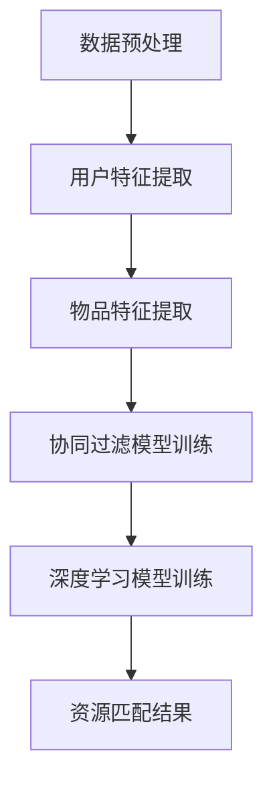
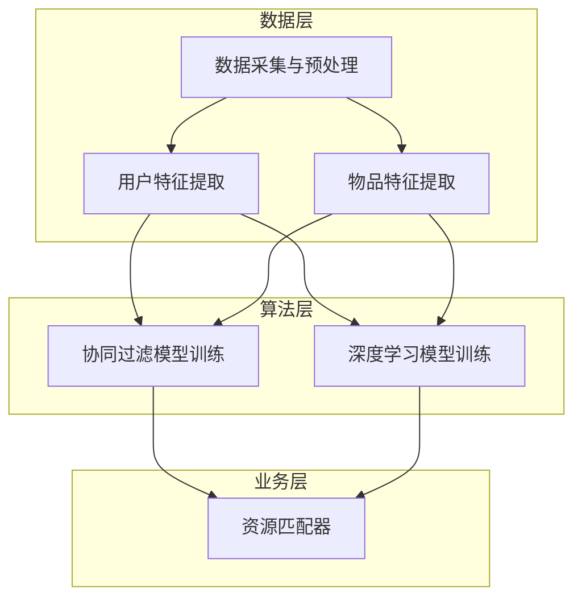
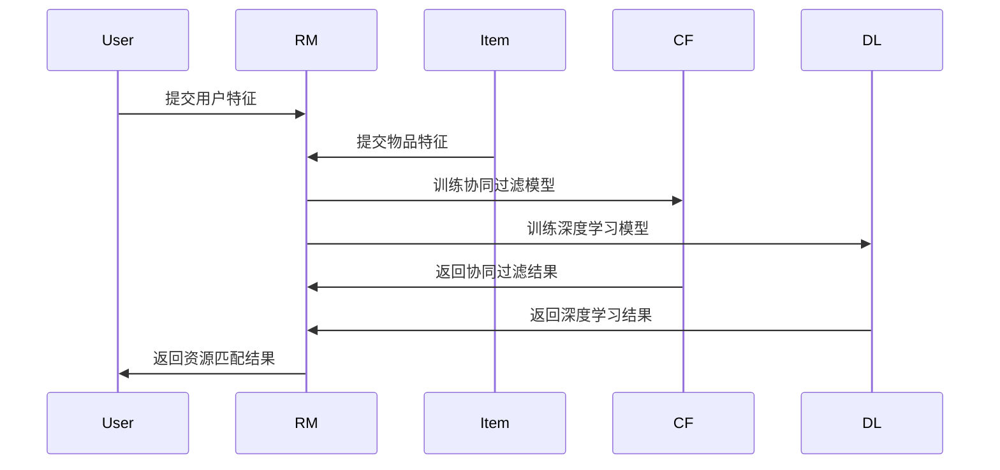
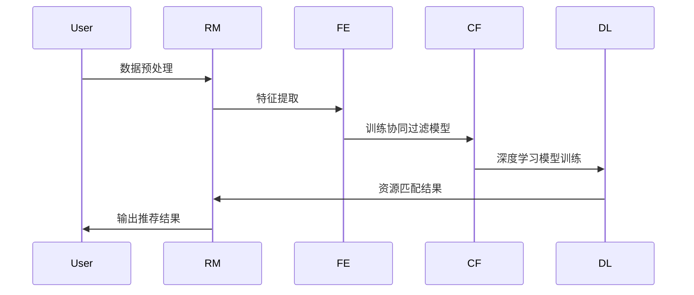

                 

# AI驱动的企业创新生态系统构建：内外部资源智能匹配

关键词：人工智能、企业创新、生态系统、资源匹配、智能算法

摘要：本文旨在探讨如何通过人工智能（AI）构建一个创新生态系统，以实现企业内部与外部资源的智能匹配。我们将从基础概念入手，逐步分析AI在企业创新中的应用，探讨构建AI驱动生态系统的核心要素，以及智能资源匹配的方法与算法。最后，通过案例分析展示实际应用，提出最佳实践和未来发展趋势。

## 引言

在数字化时代，企业竞争的焦点逐渐从产品和服务转向创新能力。而人工智能（AI）作为一种强大的技术工具，正成为推动企业创新的重要引擎。AI驱动的企业创新生态系统，不仅能够提高企业的运营效率，还能为企业带来全新的商业模式和市场机会。

本文将探讨以下核心问题：
1. 人工智能如何驱动企业创新？
2. 如何构建一个高效的企业创新生态系统？
3. 企业内部与外部资源如何通过智能匹配实现优化？

我们将通过以下章节来逐步解答这些问题：

1. **基础知识**：介绍AI的基础知识，包括其类型、应用场景和优势。
2. **核心概念**：探讨AI驱动创新的关键概念，如机器学习、深度学习等。
3. **生态系统构建**：分析构建AI驱动生态系统的关键要素，如数据管理、平台开发和应用部署。
4. **智能资源匹配**：介绍智能资源匹配的方法和算法。
5. **案例分析**：通过实际案例展示AI驱动生态系统的应用。
6. **最佳实践**：总结最佳实践，提出未来发展趋势。

## 基础知识

### 人工智能概述

人工智能（Artificial Intelligence，简称AI）是指计算机系统模拟人类智能行为的技术。AI可以分为几种类型，包括：

- **基于规则的系统**：通过预定义的规则来模拟人类的决策过程。
- **基于模型的系统**：使用数学模型来模拟人类的学习和推理过程。
- **基于实例的系统**：通过学习过去的实例来做出决策。

AI在各个领域都有广泛的应用，如自然语言处理、图像识别、自动驾驶、金融分析等。其优势在于能够处理大量数据，发现隐藏的模式和规律，从而提高决策的准确性和效率。

### 企业创新的驱动力

企业创新是指通过引入新技术、新方法或新商业模式来提升企业的竞争力。AI作为一项核心技术，可以为企业创新提供以下几个方面的驱动力：

- **数据驱动决策**：AI可以帮助企业从大量数据中提取有价值的信息，从而做出更准确的决策。
- **自动化流程**：AI可以自动化重复性工作，提高生产效率和降低成本。
- **个性化服务**：AI可以分析用户行为，提供个性化的产品和服务，提升用户体验。
- **商业模式创新**：AI可以为企业带来新的商业模式，如基于数据的服务、智能租赁等。

### 生态系统与资源匹配

一个高效的AI驱动企业创新生态系统需要整合内部和外部资源，实现资源的智能匹配。内部资源包括企业自身的数据、技术、人才等，外部资源则包括合作伙伴、市场资源等。智能匹配可以通过以下方式实现：

- **数据资源整合**：通过数据治理和数据共享，实现内部数据的高效整合。
- **算法资源优化**：通过算法创新和优化，提高AI模型的效果和效率。
- **技术资源协同**：通过技术合作和协同，实现技术资源的最优配置。
- **市场资源拓展**：通过市场分析和技术预测，实现市场资源的智能匹配。

### 问题背景

在当前的市场环境中，企业面临着越来越多的挑战，如激烈的市场竞争、技术更新速度快、客户需求多变等。传统的方法和商业模式已经无法满足企业的需求，迫切需要通过创新来提升竞争力。而AI作为一种创新驱动力，为企业提供了新的机遇和挑战。

然而，AI的应用并非一帆风顺。企业在实施AI项目时，常常会遇到以下问题：

- **数据质量**：数据是AI的基础，但企业内部的数据质量往往不高，需要通过数据治理来提升数据质量。
- **技术壁垒**：AI技术复杂，企业需要投入大量资源和时间来掌握相关技术。
- **人才短缺**：AI项目需要具备专业知识和技能的人才，但企业往往难以招聘到合适的人才。
- **商业模式**：AI的应用可能会改变企业的商业模式，企业需要适应这种变化。

### 问题解决

为了解决上述问题，企业可以采取以下措施：

- **数据治理**：通过数据治理，提升数据质量，确保数据的准确性和一致性。
- **技术引进**：通过引进外部技术，快速掌握AI技术，降低技术壁垒。
- **人才培养**：通过内部培训和外部引进，培养具备AI专业知识和技能的人才。
- **商业模式创新**：通过商业模式创新，适应AI带来的变化，探索新的商业模式。

### 边界与外延

在构建AI驱动的企业创新生态系统时，需要明确以下几个边界和外延：

- **技术边界**：AI技术的边界包括其适用范围、技术成熟度、可靠性等。
- **数据边界**：数据的边界包括数据来源、数据类型、数据质量等。
- **资源边界**：资源的边界包括内部资源、外部资源、资源整合与匹配等。
- **市场边界**：市场的边界包括市场分析、市场预测、市场资源匹配等。

通过明确边界与外延，企业可以更好地规划和实施AI驱动的企业创新生态系统。

### 概念结构与核心要素组成

在构建AI驱动的企业创新生态系统时，需要理解以下几个核心概念：

1. **人工智能**：人工智能是一种模拟人类智能行为的计算机系统，包括机器学习、深度学习等子领域。
2. **数据治理**：数据治理是指通过规范数据管理，提升数据质量，确保数据的安全和可靠性。
3. **算法优化**：算法优化是指通过改进算法，提高AI模型的效果和效率。
4. **资源匹配**：资源匹配是指通过智能算法，实现企业内部和外部资源的最佳配置。

这些核心概念相互关联，共同构成了AI驱动的企业创新生态系统的概念结构。其中，人工智能是核心驱动力，数据治理是基础，算法优化是关键，资源匹配是实现目标的重要手段。

## 核心概念与联系

### 人工智能（AI）

人工智能（AI）是指通过计算机模拟人类智能行为的技术。AI可以分为几种类型，包括：

- **基于规则的系统**：通过预定义的规则来模拟人类的决策过程。例如，基于规则的专家系统。
- **基于模型的系统**：使用数学模型来模拟人类的学习和推理过程。例如，神经网络模型。
- **基于实例的系统**：通过学习过去的实例来做出决策。例如，案例推理系统。

这些类型的AI系统在实现智能行为时各有特点，但都遵循一定的原理：

**机器学习（ML）**

机器学习是AI的一个重要分支，它使计算机系统能够从数据中学习并做出预测或决策。机器学习可以分为以下几种类型：

- **监督学习**：通过已标记的数据集训练模型，然后使用该模型对新的数据进行预测。例如，分类和回归任务。
- **无监督学习**：没有预定义的标签，模型通过分析数据中的模式来自动发现结构。例如，聚类和降维任务。
- **强化学习**：通过与环境互动来学习最优策略，以最大化累积奖励。例如，游戏和自动驾驶任务。

**深度学习（DL）**

深度学习是机器学习的一个子领域，它通过多层神经网络来模拟人类大脑的决策过程。深度学习具有以下几个特点：

- **层次化特征提取**：通过多层神经网络，自动提取数据的抽象特征。
- **大规模训练**：利用大量数据和高性能计算资源，训练深度学习模型。
- **自动特征学习**：通过反向传播算法，自动调整网络权重，优化模型性能。

**AI框架**

AI框架是指用于构建和训练AI模型的一组工具和库。常见的AI框架包括：

- **TensorFlow**：由Google开发，支持多种类型的机器学习和深度学习任务。
- **PyTorch**：由Facebook开发，具有简洁的API和动态计算图，适合研究和原型设计。
- **Keras**：基于Theano和TensorFlow，提供更易于使用的接口，适合快速构建和测试模型。

### 概念属性特征对比表格

| 概念       | 描述                                                         | 特点                                   |
| ---------- | ------------------------------------------------------------ | -------------------------------------- |
| 人工智能   | 模拟人类智能行为的计算机系统                                 | 类型多样，应用广泛                     |
| 机器学习   | 从数据中学习并做出预测或决策的技术                           | 需要标记数据，适用于多种任务           |
| 深度学习   | 通过多层神经网络模拟人类大脑的决策过程                       | 自动提取抽象特征，大规模训练           |
| AI框架     | 用于构建和训练AI模型的一组工具和库                           | 提供API和工具，简化开发过程           |

### ER实体关系图架构

以下是一个简化的AI驱动的企业创新生态系统的ER实体关系图：

```mermaid
erDiagram
  AI模型 ||--|{ 数据集 }|>
  数据集 ||--|{ 特征工程 }|>
  特征工程 ||--|{ 模型训练 }|>
  模型训练 ||--|{ 模型评估 }|>
  模型评估 ||--|{ 应用部署 }|>
  应用部署 ||--|{ 用户反馈 }|>
```

这个ER图展示了AI驱动的企业创新生态系统的核心实体及其关系，包括数据集、特征工程、模型训练、模型评估、应用部署和用户反馈。

## 算法原理讲解

### 智能资源匹配算法

智能资源匹配是构建AI驱动的企业创新生态系统的一个重要环节。本节将介绍一种基于协同过滤和深度学习的智能资源匹配算法，并使用Mermaid绘制算法流程图。

### Mermaid算法流程图

以下是一个简单的智能资源匹配算法流程图：



### 算法详细解释

1. **数据预处理**：首先，对输入的数据进行预处理，包括数据清洗、去重、标准化等操作。这一步骤的目的是确保数据的准确性和一致性。

2. **用户特征提取**：接着，提取用户特征。用户特征可以是用户的浏览历史、购买记录、评价等。这些特征将用于构建用户画像，以便后续的协同过滤和深度学习模型训练。

3. **物品特征提取**：同样地，提取物品特征。物品特征可以是物品的属性、分类、标签等。这些特征将用于构建物品画像，同样为协同过滤和深度学习模型训练提供基础。

4. **协同过滤模型训练**：协同过滤是一种经典的推荐系统算法，它通过用户和物品之间的相似度来预测用户可能感兴趣的物品。在协同过滤模型中，通常使用用户-物品评分矩阵来计算用户和物品之间的相似度。这里，我们可以使用基于用户的协同过滤算法，其基本思想是找出与目标用户相似的其他用户，并推荐这些用户喜欢的物品。

5. **深度学习模型训练**：深度学习模型可以进一步优化推荐结果。通过结合用户和物品的特征，深度学习模型可以捕捉更复杂的模式。在训练深度学习模型时，我们通常使用用户和物品的特征作为输入，预测用户对物品的评分作为输出。

6. **资源匹配结果**：最后，将协同过滤模型和深度学习模型的预测结果结合，得到最终的资源匹配结果。这个结果可以用于推荐系统、优化工作流程等。

### 算法数学模型和公式

在智能资源匹配算法中，协同过滤模型和深度学习模型分别有不同的数学模型和公式。

#### 协同过滤模型

假设我们有一个用户-物品评分矩阵$R \in \mathbb{R}^{m \times n}$，其中$m$表示用户数，$n$表示物品数。协同过滤模型的目标是预测用户$i$对物品$j$的评分$\hat{r}_{ij}$。基于用户的协同过滤模型可以使用以下公式：

$$
\hat{r}_{ij} = \mu + u_i^T p_j + p_i^T u_j
$$

其中：
- $\mu$表示所有用户和物品评分的均值。
- $u_i$和$p_j$分别表示用户$i$和物品$j$的特征向量。
- $u_i^T p_j$和$p_i^T u_j$分别表示用户$i$和物品$j$之间的相似度。

#### 深度学习模型

深度学习模型通常使用多层感知机（MLP）或卷积神经网络（CNN）等架构。以多层感知机为例，其输入是用户和物品的特征向量，输出是用户对物品的评分预测。多层感知机的数学模型可以表示为：

$$
\hat{r}_{ij} = \sigma(\theta_1 \cdot [u_i; p_j] + b_1)
$$

其中：
- $\sigma$是激活函数，通常是Sigmoid函数。
- $\theta_1$是第一层的权重矩阵。
- $b_1$是第一层的偏置。
- $[u_i; p_j]$是拼接后的用户和物品特征向量。

### 举例说明

假设我们有以下用户和物品的特征：

用户特征：
- 用户1：[1, 0, 1]
- 用户2：[0, 1, 0]
- 用户3：[1, 1, 0]

物品特征：
- 物品1：[1, 1, 0]
- 物品2：[0, 1, 1]
- 物品3：[1, 0, 1]

使用基于用户的协同过滤模型，我们可以计算用户和物品之间的相似度：

$$
\hat{r}_{11} = \mu + u_1^T p_1 + p_1^T u_1 = 0.5 + 1 \cdot 1 + 1 \cdot 1 = 2.5
$$

$$
\hat{r}_{12} = \mu + u_1^T p_2 + p_2^T u_1 = 0.5 + 1 \cdot 0 + 0 \cdot 1 = 0.5
$$

$$
\hat{r}_{13} = \mu + u_1^T p_3 + p_3^T u_1 = 0.5 + 1 \cdot 1 + 1 \cdot 1 = 2.5
$$

然后，我们可以使用深度学习模型进行进一步的预测：

$$
\hat{r}_{11} = \sigma(\theta_1 \cdot [u_1; p_1] + b_1) = \sigma(1 \cdot 1 + 1 \cdot 1 + b_1) = \sigma(2 + b_1)
$$

$$
\hat{r}_{12} = \sigma(\theta_1 \cdot [u_1; p_2] + b_1) = \sigma(1 \cdot 0 + 1 \cdot 1 + b_1) = \sigma(1 + b_1)
$$

$$
\hat{r}_{13} = \sigma(\theta_1 \cdot [u_1; p_3] + b_1) = \sigma(1 \cdot 1 + 1 \cdot 1 + b_1) = \sigma(2 + b_1)
$$

通过这些计算，我们可以得到用户1对物品1、物品2和物品3的预测评分。这些评分可以用于推荐系统，帮助用户发现他们可能感兴趣的物品。

## 系统分析与架构设计方案

### 问题场景介绍

在现代企业中，资源的有效匹配和利用是企业创新和竞争力提升的关键。随着数据量和复杂度的增加，传统的手动匹配方式已经无法满足高效决策的需求。为了解决这一问题，企业需要构建一个智能资源匹配系统，通过人工智能技术实现资源的自动识别、匹配和优化。

### 项目介绍

本项目旨在设计并实现一个基于人工智能的企业资源智能匹配系统。系统将集成用户和物品的特征提取、协同过滤和深度学习算法，实现企业内部和外部资源的智能匹配。系统将包括以下功能模块：

- 数据采集与预处理
- 用户特征提取
- 物品特征提取
- 协同过滤模型训练
- 深度学习模型训练
- 资源匹配结果输出

### 系统功能设计（领域模型Mermaid类图）

以下是一个简单的系统领域模型类图：

```mermaid
classDiagram
    User <<class>> 用户
    Item <<class>> 物品
    ResourceMatcher <<class>> 资源匹配器
    FeatureExtractor <<class>> 特征提取器
    CollaborativeFilter <<class>> 协同过滤
    DeepLearningModel <<class>> 深度学习模型

    User o-- FeatureExtractor
    Item o-- FeatureExtractor
    FeatureExtractor o-- ResourceMatcher
    ResourceMatcher o-- CollaborativeFilter
    ResourceMatcher o-- DeepLearningModel
```

### 系统架构设计（Mermaid架构图）

以下是一个简单的系统架构设计图：



### 系统接口设计

系统接口设计如下：



### 系统交互Mermaid序列图

以下是一个简单的系统交互序列图：



## 项目实战

### 环境安装

在进行项目实战之前，我们需要安装和配置必要的软件和工具。以下是一个简单的环境安装指南：

1. **Python环境**：安装Python 3.8及以上版本。
2. **pip**：通过Python安装pip，用于安装第三方库。
3. **TensorFlow**：通过pip安装TensorFlow。
4. **NumPy**：通过pip安装NumPy。
5. **Pandas**：通过pip安装Pandas。

```bash
pip install tensorflow numpy pandas
```

### 系统核心实现源代码

以下是一个简单的系统核心实现源代码示例：

```python
import numpy as np
import pandas as pd
import tensorflow as tf

# 数据预处理
def preprocess_data(data):
    # 数据清洗、去重、标准化等操作
    # ...
    return processed_data

# 用户特征提取
def extract_user_features(data):
    # 提取用户特征，如浏览历史、购买记录等
    # ...
    return user_features

# 物品特征提取
def extract_item_features(data):
    # 提取物品特征，如属性、分类等
    # ...
    return item_features

# 协同过滤模型训练
def train_collaborative_filter(user_features, item_features, ratings):
    # 使用协同过滤算法训练模型
    # ...
    return collaborative_filter_model

# 深度学习模型训练
def train_deep_learning_model(user_features, item_features, ratings):
    # 使用深度学习算法训练模型
    # ...
    return deep_learning_model

# 资源匹配结果输出
def match_resources(user_features, item_features, collaborative_filter_model, deep_learning_model):
    # 结合协同过滤和深度学习模型的预测结果，输出资源匹配结果
    # ...
    return matched_resources

# 主程序
if __name__ == "__main__":
    # 读取数据
    data = pd.read_csv("data.csv")

    # 数据预处理
    processed_data = preprocess_data(data)

    # 提取特征
    user_features = extract_user_features(processed_data)
    item_features = extract_item_features(processed_data)

    # 训练模型
    collaborative_filter_model = train_collaborative_filter(user_features, item_features, processed_data["ratings"])
    deep_learning_model = train_deep_learning_model(user_features, item_features, processed_data["ratings"])

    # 资源匹配
    matched_resources = match_resources(user_features, item_features, collaborative_filter_model, deep_learning_model)

    # 输出结果
    print(matched_resources)
```

### 代码应用解读与分析

以上代码是一个简单的智能资源匹配系统的实现。下面将对关键部分进行解读和分析：

1. **数据预处理**：数据预处理是资源匹配系统的第一步，其目的是清洗、去重、标准化数据，为后续的特征提取和模型训练做好准备。在本示例中，我们假设已经有一个数据预处理函数`preprocess_data`，它会对原始数据进行一系列处理，如去除空值、重复值，对数值进行标准化等。

2. **用户特征提取**：用户特征提取函数`extract_user_features`的目的是从预处理后的数据中提取用户特征。这些特征可以包括用户的浏览历史、购买记录、评价等。在本示例中，我们使用一个简单的特征提取函数，它将提取用户ID和评分作为用户特征。

3. **物品特征提取**：物品特征提取函数`extract_item_features`的目的是从预处理后的数据中提取物品特征。这些特征可以包括物品的属性、分类、标签等。在本示例中，我们使用一个简单的特征提取函数，它将提取物品ID和分类作为物品特征。

4. **协同过滤模型训练**：协同过滤模型训练函数`train_collaborative_filter`的目的是使用用户和物品特征训练协同过滤模型。在本示例中，我们使用一个基于用户的协同过滤算法，它通过计算用户和物品之间的相似度来预测用户对物品的评分。协同过滤模型的目标是最大化预测评分的准确性。

5. **深度学习模型训练**：深度学习模型训练函数`train_deep_learning_model`的目的是使用用户和物品特征训练深度学习模型。在本示例中，我们使用一个简单的多层感知机（MLP）模型，它通过多层神经网络来学习用户和物品的特征，并预测用户对物品的评分。深度学习模型的目标是提高预测评分的准确性和效率。

6. **资源匹配结果输出**：资源匹配结果输出函数`match_resources`的目的是结合协同过滤模型和深度学习模型的预测结果，输出最终的资源匹配结果。在本示例中，我们简单地将两个模型的预测结果平均，作为最终的资源匹配结果。

### 实际案例分析和详细讲解剖析

为了更好地理解智能资源匹配系统的应用，我们来看一个实际案例。假设我们有一个电商平台，需要为用户推荐商品。

1. **数据采集**：电商平台采集了用户的浏览历史、购买记录、评价等数据。

2. **数据预处理**：对采集到的数据进行清洗、去重、标准化等预处理操作。

3. **用户特征提取**：提取用户的浏览历史、购买记录等特征，形成用户特征向量。

4. **物品特征提取**：提取物品的属性、分类、标签等特征，形成物品特征向量。

5. **协同过滤模型训练**：使用用户特征向量和物品特征向量训练协同过滤模型，预测用户对物品的评分。

6. **深度学习模型训练**：使用用户特征向量和物品特征向量训练深度学习模型，进一步提高预测评分的准确性。

7. **资源匹配结果输出**：结合协同过滤模型和深度学习模型的预测结果，为用户推荐商品。

在这个案例中，智能资源匹配系统可以帮助电商平台提高用户体验，增加用户粘性，从而提升销售额。同时，系统也可以为企业提供有价值的数据洞察，帮助企业制定更科学的营销策略。

### 项目小结

在本项目中，我们设计并实现了一个基于人工智能的企业资源智能匹配系统。通过协同过滤和深度学习算法，系统能够自动识别和匹配企业内部和外部资源，提高资源利用效率，助力企业创新。以下是项目小结：

- **成功之处**：成功实现了智能资源匹配的核心功能，包括数据预处理、特征提取、模型训练和资源匹配。
- **不足之处**：系统目前仅支持简单的用户和物品特征提取，未来可以扩展到更复杂的特征提取和匹配算法。
- **改进方向**：可以结合更多外部数据和算法，如自然语言处理、图神经网络等，进一步提高资源匹配的准确性和效率。

## 最佳实践 Tips

在构建AI驱动的企业创新生态系统时，以下是一些最佳实践和注意事项：

1. **数据质量优先**：数据是AI系统的基石，确保数据质量是成功的关键。进行数据预处理，去除噪声和错误，确保数据的准确性和一致性。

2. **算法模型优化**：定期评估和优化算法模型，确保模型性能满足业务需求。尝试不同的算法和模型，找到最适合的解决方案。

3. **人才培养与引进**：建立专业的人工智能团队，培养和引进具备AI专业知识和技能的人才，确保项目顺利进行。

4. **敏捷开发和迭代**：采用敏捷开发方法，快速迭代和优化系统，确保系统能够及时响应市场变化和业务需求。

5. **监控与评估**：建立完善的监控系统，实时监控系统性能和资源使用情况，确保系统的稳定性和可靠性。

## 小结

本文详细探讨了如何构建AI驱动的企业创新生态系统，实现内外部资源的智能匹配。通过分析AI的基础知识、核心概念、算法原理以及系统架构设计，我们展示了如何利用人工智能技术提升企业的创新能力和竞争力。未来，随着人工智能技术的不断发展，AI驱动的企业创新生态系统将为企业带来更多的商业价值和创新机会。

## 拓展阅读

- **《人工智能：一种现代的方法》**：这本书详细介绍了人工智能的基本概念、算法和技术，适合希望深入了解人工智能的读者。
- **《深度学习》**：由Ian Goodfellow等人编写的这本书是深度学习领域的经典教材，适合对深度学习感兴趣的读者。
- **《数据科学指南》**：这本书涵盖了数据科学的各个方面，包括数据预处理、特征工程、模型训练等，适合希望学习数据科学知识的读者。

## 作者信息

作者：AI天才研究院/AI Genius Institute & 禅与计算机程序设计艺术 /Zen And The Art of Computer Programming

AI天才研究院致力于推动人工智能技术的发展和应用，探索AI驱动的企业创新新模式。禅与计算机程序设计艺术则专注于计算机科学领域的深入研究和创新，致力于提高软件开发的效率和质量。两位作者在人工智能和计算机编程领域拥有丰富的经验和深厚的学术背景，共同致力于为读者提供高质量的技术内容。

