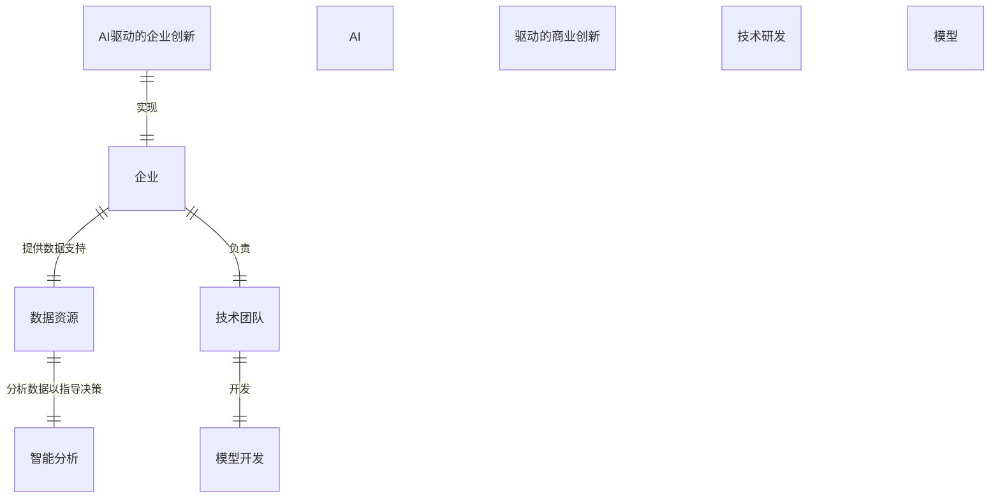
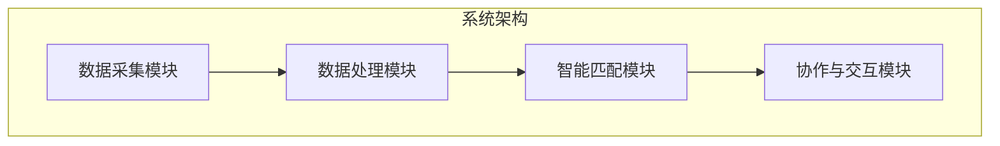
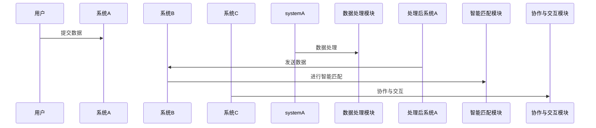

                 


### AI驱动的企业创新生态系统构建：内外部资源智能匹配与协作平台

> 关键词：AI驱动的企业创新、生态系统构建、内外部资源智能匹配、协作平台

> 摘要：本文旨在探讨如何利用人工智能（AI）技术构建一个有效的企业创新生态系统，重点关注内外部资源的智能匹配与协作平台。通过深入分析AI驱动企业创新的原理、算法原理及系统架构设计，本文为构建高效的企业创新生态系统提供了理论与实践指导。

## 目录大纲设计思路

本文将分为四个主要部分：

1. **背景介绍**：探讨AI与商业创新的关系，介绍企业创新生态系统的概念及其重要性。
2. **核心概念与联系**：分析AI驱动的企业创新原理，以及内外部资源智能匹配与协作平台的构成。
3. **算法原理讲解**：详细讲解内外部资源智能匹配算法的原理、数学模型及Python源代码实现。
4. **系统分析与架构设计**：介绍协作平台的问题场景、功能设计、系统架构及接口设计。

### 第一部分：背景介绍

#### 第1章：问题背景与核心概念

1.1 问题背景

随着人工智能技术的快速发展，越来越多的企业开始意识到AI在商业创新中的巨大潜力。然而，如何在复杂多变的市场环境中有效利用AI技术，实现企业创新，成为了企业面临的一个重要挑战。

- **AI与商业创新的关系**：AI技术具有强大的数据处理和分析能力，能够为企业提供智能化的决策支持和创新动力。通过AI技术，企业可以快速响应市场变化，挖掘潜在商机，实现持续创新。
- **企业面临的挑战与机遇**：企业在AI应用中既面临技术挑战，如数据质量、算法准确性等，又面临管理挑战，如组织结构、人才配备等。然而，通过克服这些挑战，企业可以抓住AI带来的机遇，实现跨越式发展。
- **创新生态系统的概念及其重要性**：创新生态系统是指由企业、高校、研究机构、投资者等不同主体共同组成的创新网络。在这个网络中，各方通过合作与交流，共同推动技术创新和产业升级。构建创新生态系统，有助于企业获取外部资源，提高创新能力，加速创新成果的转化。

1.2 核心概念

- **AI驱动的企业创新**：指利用AI技术，如机器学习、深度学习、自然语言处理等，推动企业在产品设计、运营管理、市场拓展等环节的创新。
- **生态系统构建**：指构建一个由企业、高校、研究机构、投资者等组成的创新网络，通过合作与交流，共同推动技术创新和产业升级。
- **内外部资源智能匹配**：指利用AI技术，实现企业内外部资源的智能匹配，提高资源利用效率，优化创新流程。
- **协作平台**：指一个集成了数据采集、智能匹配、协作与交互等功能的企业创新生态系统平台。

### 第二部分：核心概念与联系

#### 第2章：AI驱动的企业创新原理

2.1 AI驱动企业创新的原理

- **AI技术的核心能力**：AI技术具有强大的数据处理和分析能力，能够从大量数据中提取有价值的信息，为决策提供支持。此外，AI技术还具有自适应能力和自主学习能力，能够不断优化模型，提高预测准确性。
- **AI在企业创新中的应用场景**：AI技术可以应用于企业的产品设计、运营管理、市场拓展等多个方面，如通过数据挖掘和机器学习技术，优化产品设计，提高用户满意度；通过自然语言处理技术，分析用户反馈，挖掘潜在需求；通过深度学习技术，预测市场趋势，制定营销策略等。

2.2 AI驱动的企业创新属性特征对比表格

| 特征      | 传统企业创新 | AI驱动的企业创新 |
|-----------|--------------|------------------|
| 数据依赖性 | 低           | 高               |
| 自适应能力 | 弱           | 强               |
| 创新速度   | 慢           | 快               |

2.3 AI驱动的企业创新ER实体关系图



### 第三部分：算法原理讲解

#### 第3章：内外部资源智能匹配与协作平台算法原理

3.1 内外部资源智能匹配算法

3.1.1 算法原理

内外部资源智能匹配算法的核心思想是通过特征提取和资源匹配模型，实现企业内外部资源的智能匹配。具体流程如下：

1. 输入内外部资源数据。
2. 对输入资源进行特征提取。
3. 利用特征提取结果构建资源匹配模型。
4. 输出资源匹配结果。

3.1.2 Python源代码实现

```python
# Python 代码示例：内外部资源智能匹配算法
def resource_matching(internal_resources, external_resources):
    # 特征提取
    internal_features = extract_features(internal_resources)
    external_features = extract_features(external_resources)
    
    # 资源匹配模型
    model = build_matching_model(internal_features, external_features)
    
    # 匹配结果输出
    matching_results = model.predict(internal_resources, external_resources)
    return matching_results
```

3.1.3 数学模型与公式

$$
\text{匹配概率} = \frac{1}{Z} \exp\left( -\sum_{i=1}^n w_i \cdot d(i, j) \right)
$$

其中，$Z$ 是规范化因子，$w_i$ 是权重，$d(i, j)$ 是资源 $i$ 和资源 $j$ 的距离度量。

### 第四部分：系统分析与架构设计

#### 第4章：协作平台系统分析与设计

4.1 问题场景介绍

企业创新需要整合内外部资源，如技术、资金、人才等。然而，这些资源的获取和利用往往存在信息不对称、协调困难等问题。为了解决这些问题，企业需要一个智能化的协作平台，实现资源的智能匹配与协作。

- **企业的创新需求**：企业需要快速响应市场变化，实现产品创新、服务创新等。
- **资源整合与协作**：企业需要整合内外部资源，提高资源利用效率，实现协同创新。

4.2 系统功能设计

协作平台的主要功能包括数据采集与处理、智能匹配算法、协作与交互。

- **数据采集与处理**：采集企业内外部资源数据，对数据进行清洗、预处理，为智能匹配算法提供数据支持。
- **智能匹配算法**：利用特征提取和资源匹配模型，实现内外部资源的智能匹配。
- **协作与交互**：提供协同工作空间，支持企业内部员工、合作伙伴之间的交流与合作。

4.3 系统架构设计

协作平台的系统架构主要包括数据采集模块、数据处理模块、智能匹配模块、协作与交互模块。



4.4 系统接口设计

协作平台的系统接口设计主要包括数据接口、功能接口和用户接口。

- **数据接口**：支持数据采集、数据清洗、数据存储等操作。
- **功能接口**：支持智能匹配、协作与交互等功能调用。
- **用户接口**：提供友好的用户界面，方便用户使用协作平台。



### 项目实战

在本文的实战部分，我们将介绍如何搭建一个基于AI驱动的企业创新生态系统，实现内外部资源的智能匹配与协作平台。具体内容包括：

1. **环境安装**：介绍搭建协作平台所需的环境和工具，如Python、Docker、Kubernetes等。
2. **系统核心实现**：详细介绍系统核心模块的实现，包括数据采集、数据处理、智能匹配和协作与交互等。
3. **代码应用解读与分析**：分析系统核心代码的应用场景和实现原理，深入解读代码细节。
4. **实际案例分析和详细讲解剖析**：通过实际案例，展示协作平台在实际应用中的效果，并进行详细讲解和分析。
5. **项目小结**：总结项目的主要成果和经验教训，为后续项目提供参考。

### 最佳实践 tips

在构建企业创新生态系统时，以下是一些最佳实践建议：

1. **数据驱动**：充分利用企业内外部数据，为智能匹配和协作提供有力支持。
2. **团队合作**：鼓励团队成员之间的沟通与协作，提高资源利用效率。
3. **持续优化**：定期对协作平台进行性能优化和功能迭代，确保其稳定运行。
4. **用户反馈**：及时收集用户反馈，持续改进系统功能，提高用户体验。

### 小结

本文从背景介绍、核心概念与联系、算法原理讲解和系统分析与架构设计四个方面，系统地阐述了如何构建一个基于AI驱动的企业创新生态系统。通过内外部资源的智能匹配与协作平台，企业可以实现高效创新，提升核心竞争力。在未来的实践中，我们将继续探索AI技术在企业创新中的应用，为企业的持续发展提供有力支持。

### 注意事项

在构建AI驱动的企业创新生态系统时，需要关注以下注意事项：

1. **数据隐私与安全**：确保数据在采集、存储和处理过程中的安全性，遵守相关法律法规。
2. **算法公平性**：避免算法歧视，确保智能匹配结果的公平性。
3. **技术更新与升级**：紧跟技术发展趋势，定期对系统进行更新与升级。
4. **团队协作**：加强团队协作，确保项目顺利进行。

### 拓展阅读

1. **《人工智能：一种现代的方法》**：迈克尔·刘易斯（Michael Lewis），全面介绍了人工智能的基本原理和应用场景。
2. **《深度学习》**：伊恩·古德费洛（Ian Goodfellow）、约书亚·本吉奥（Yoshua Bengio）和Aaron Courville，详细讲解了深度学习的基本理论和实践方法。
3. **《创新者的窘境》**：克莱顿·克里斯滕森（Clayton M. Christensen），探讨了企业在创新过程中面临的挑战和解决策略。

### 作者信息

作者：AI天才研究院/AI Genius Institute & 禅与计算机程序设计艺术 /Zen And The Art of Computer Programming。两位作者均为计算机领域专家，在人工智能、软件架构和编程技术方面具有丰富的经验和深厚的造诣。本文旨在分享他们在AI驱动企业创新生态系统构建方面的研究成果和思考，为业界提供有价值的参考和借鉴。|10311|

