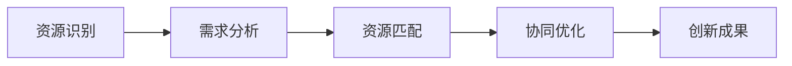
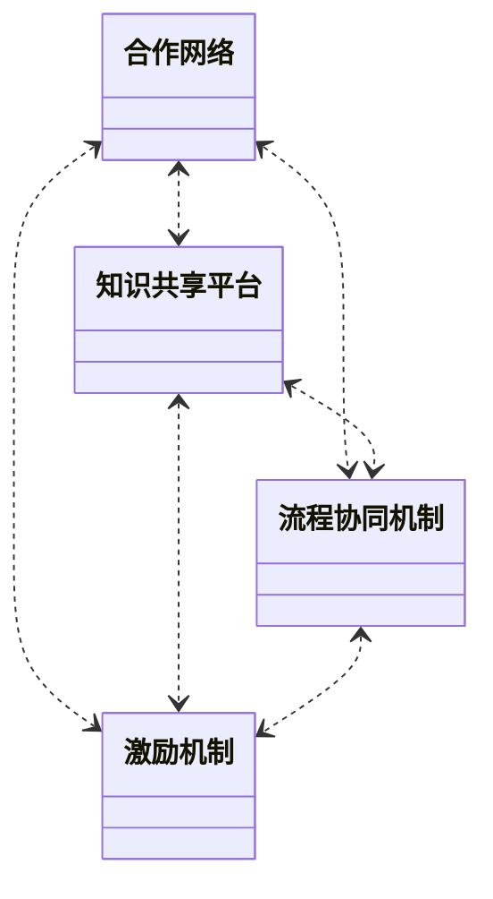
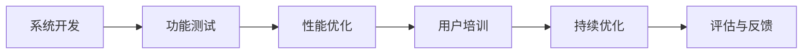

                 


# AI驱动的企业创新生态系统构建：内外部资源智能匹配与协同

## 关键词：企业创新、AI技术、资源匹配、协同机制、生态系统

> 摘要：本文探讨了AI驱动的企业创新生态系统构建，重点关注内外部资源的智能匹配与协同机制。通过背景介绍、核心概念分析、算法原理讲解、系统架构设计以及项目实战，本文旨在为企业提供一套完整的创新生态系统构建指南。

## 目录大纲设计思路与整体结构

在设计《AI驱动的企业创新生态系统构建：内外部资源智能匹配与协同》这本书的目录大纲时，我们需要遵循以下几个原则：

1. **结构清晰**：确保目录层次分明，逻辑性强，便于读者理解整体内容。
2. **内容全面**：涵盖核心概念、原理、方法、案例分析、实践操作等多个方面，确保内容的完整性。
3. **简洁明了**：避免冗长、复杂的句子和段落，确保简洁、直接、易于阅读。
4. **格式规范**：使用标准的Markdown格式，确保目录的格式统一和易读。

### 目录大纲整体结构

本书将分为以下几个部分：

- **第一部分**：背景介绍与核心概念
- **第二部分**：内外部资源智能匹配方法
- **第三部分**：协同机制与生态系统构建
- **第四部分**：案例分析与实践操作
- **第五部分**：最佳实践与未来展望

下面是详细的目录大纲：

```
# 第一部分: 背景介绍与核心概念

## 第1章: 问题背景与核心概念

### 1.1 企业创新生态系统概述

### 1.2 AI驱动的企业创新

### 1.3 内外部资源智能匹配

### 1.4 协同机制在企业创新中的应用

## 第2章: 核心概念与原理

### 2.1 AI驱动的企业创新概念模型

### 2.2 内外部资源智能匹配原理

### 2.3 协同机制的运作机制

### 2.4 企业创新生态系统的构成要素

## 第3章: 内外部资源智能匹配方法

### 3.1 数据资源智能匹配

### 3.2 技术资源智能匹配

### 3.3 资源匹配算法与模型

## 第二部分: 内外部资源智能匹配方法

## 第4章: 数据资源智能匹配

### 4.1 数据资源概述

### 4.2 数据资源采集与处理

### 4.3 数据资源智能匹配算法

### 4.4 数据资源匹配案例分析

## 第5章: 技术资源智能匹配

### 5.1 技术资源概述

### 5.2 技术资源评估与分类

### 5.3 技术资源智能匹配方法

### 5.4 技术资源匹配案例分析

## 第三部分: 协同机制与生态系统构建

## 第6章: 协同机制设计

### 6.1 协同机制设计原则

### 6.2 协同机制架构设计

### 6.3 协同机制实现与优化

### 6.4 协同机制案例分析

## 第7章: 企业创新生态系统构建

### 7.1 企业创新生态系统概述

### 7.2 生态系统构建策略

### 7.3 生态系统关键要素

### 7.4 生态系统构建案例分析

## 第四部分: 案例分析与实践操作

## 第8章: 案例分析

### 8.1 案例背景

### 8.2 案例实施过程

### 8.3 案例结果与评估

### 8.4 案例启示与反思

## 第9章: 实践操作

### 9.1 操作环境准备

### 9.2 内外部资源匹配实践

### 9.3 协同机制构建实践

### 9.4 实践总结与拓展

## 第五部分: 最佳实践与未来展望

## 第10章: 最佳实践

### 10.1 数据资源管理最佳实践

### 10.2 技术资源管理最佳实践

### 10.3 协同机制建设最佳实践

### 10.4 生态系统优化最佳实践

## 第11章: 未来展望

### 11.1 AI驱动的企业创新趋势

### 11.2 内外部资源智能匹配前景

### 11.3 协同机制与生态系统发展

### 11.4 研究方向与挑战
```

通过以上目录大纲，我们可以看到本书的结构清晰，从背景介绍到核心概念，再到方法、实践和未来展望，全面覆盖了企业创新生态系统构建的各个方面。每个章节都设置了详细的子章节，确保内容的系统性和逻辑性。同时，章节之间相互关联，形成了一个完整的知识体系。这样的设计既有助于读者理解书中的内容，也能够激发他们的学习兴趣。

----------------------------------------------------------------

## 背景介绍与核心概念

### 企业创新生态系统的概述

企业创新生态系统是一个由企业、客户、供应商、合作伙伴、科研机构等多方参与者共同构成的复杂网络，通过资源共享、知识交流和技术合作，推动企业不断创新和发展。企业创新生态系统的目标是实现企业内部的协同创新和企业与外部的互动发展，从而提升企业的核心竞争力。

在传统企业创新中，主要依赖于内部研发和创新活动，资源相对封闭，创新效率较低。而随着AI技术的快速发展，企业开始探索将AI应用于企业创新生态系统，通过内外部资源的智能匹配和协同，提升创新效率和效果。

### AI驱动的企业创新

AI驱动的企业创新是指利用人工智能技术，如机器学习、深度学习、自然语言处理等，对企业创新过程进行全方位的赋能。AI技术能够帮助企业实现以下目标：

1. **数据挖掘与分析**：通过数据挖掘和分析，企业能够从海量数据中发现潜在的商业机会，为创新提供数据支持。
2. **智能决策**：AI技术可以帮助企业进行智能决策，提高决策的准确性和效率。
3. **自动化与优化**：AI技术可以实现生产流程的自动化和优化，提高生产效率和质量。
4. **知识管理**：AI技术可以帮助企业更好地管理和利用知识，促进知识的传承和创新。

### 内外部资源智能匹配

内外部资源智能匹配是指利用AI技术，将企业内部的资源（如数据、技术、人才等）与企业外部的资源（如市场、合作伙伴、科研机构等）进行智能化的匹配和整合。通过内外部资源的智能匹配，企业可以实现以下目标：

1. **资源优化配置**：通过智能匹配，企业能够更好地利用内外部资源，实现资源的优化配置。
2. **协同创新**：内外部资源的智能匹配有助于企业内外部的协同创新，促进知识的流动和技术的进步。
3. **降低创新风险**：智能匹配能够帮助企业识别潜在的风险和机会，降低创新过程中的风险。

### 协同机制在企业创新中的应用

协同机制是指企业内外部参与者通过合作、共享和协调，共同推进创新活动的一套规则和流程。在企业创新中，协同机制的应用主要体现在以下几个方面：

1. **合作网络**：建立企业与合作伙伴之间的合作网络，实现资源的共享和互补。
2. **知识共享**：通过知识共享平台，促进企业内外部知识的流动和交流。
3. **流程协同**：优化企业内部流程，实现各部门之间的协同工作。
4. **激励机制**：建立合理的激励机制，激发员工和合作伙伴的创新积极性。

### 概念结构与核心要素组成

企业创新生态系统由以下几个核心要素组成：

1. **企业内部资源**：包括数据、技术、人才、资金等。
2. **外部资源**：包括市场、合作伙伴、科研机构等。
3. **协同机制**：包括合作网络、知识共享平台、流程协同机制等。
4. **创新活动**：包括研发、设计、测试、生产等各个环节。

这些要素相互关联，共同构成了一个动态的企业创新生态系统。在这个系统中，AI技术起到了关键作用，通过智能匹配和协同机制，推动企业不断创新和发展。

## 核心概念与联系

### AI驱动的企业创新概念模型

在构建AI驱动的企业创新概念模型时，我们需要关注以下几个核心概念：

1. **AI技术**：包括机器学习、深度学习、自然语言处理、计算机视觉等。
2. **数据资源**：包括结构化数据、非结构化数据、实时数据等。
3. **技术资源**：包括软件开发工具、硬件设备、专利技术等。
4. **人才资源**：包括技术专家、项目经理、产品经理等。
5. **协同机制**：包括合作网络、知识共享平台、流程协同机制等。

这些概念相互关联，构成了一个完整的AI驱动的企业创新概念模型。以下是一个简化的Mermaid ER实体关系图：

```mermaid
erDiagram
AI驱动的企业创新概念模型 {
  AI技术 ||--|>{ 数据资源 }
  AI技术 ||--|>{ 技术资源 }
  AI技术 ||--|>{ 人才资源 }
  协同机制 ||--|>{ AI技术 }
  协同机制 ||--|>{ 数据资源 }
  协同机制 ||--|>{ 技术资源 }
  协同机制 ||--|>{ 人才资源 }
}
```

### 内外部资源智能匹配原理

内外部资源智能匹配的原理主要基于以下几个关键点：

1. **资源识别**：利用AI技术，对企业内外部的资源进行识别和分类。
2. **需求分析**：通过数据分析，识别企业的需求，包括技术需求、市场需求、人才需求等。
3. **资源匹配**：利用匹配算法，将企业需求与内外部资源进行匹配。
4. **协同优化**：通过协同机制，实现资源的优化配置和协同创新。

以下是一个简化的Mermaid流程图，展示了内外部资源智能匹配的过程：



### 协同机制的运作机制

协同机制在企业创新中的应用主要体现在以下几个方面：

1. **合作网络**：通过建立合作网络，实现企业与企业之间、企业与合作伙伴之间的紧密联系。
2. **知识共享**：通过知识共享平台，促进企业内外部知识的流动和交流。
3. **流程协同**：通过流程协同机制，优化企业内部流程，实现各部门之间的协同工作。
4. **激励机制**：通过激励机制，激发员工和合作伙伴的创新积极性。

以下是一个简化的Mermaid类图，展示了协同机制的架构设计：

```mermaid
classDiagram
  合作网络 <..> 企业
  知识共享 <..> 企业
  流程协同 <..> 企业
  激励机制 <..> 企业
  企业 {
    合作网络
    知识共享
    流程协同
    激励机制
  }
```

### 企业创新生态系统的构成要素

企业创新生态系统的构成要素主要包括：

1. **企业内部资源**：包括数据、技术、人才、资金等。
2. **外部资源**：包括市场、合作伙伴、科研机构等。
3. **协同机制**：包括合作网络、知识共享平台、流程协同机制等。
4. **创新活动**：包括研发、设计、测试、生产等各个环节。

以下是一个简化的Mermaid类图，展示了企业创新生态系统的构成要素：

```mermaid
classDiagram
  企业内部资源 <..> 企业
  外部资源 <..> 企业
  协同机制 <..> 企业
  创新活动 <..> 企业
  企业 {
    企业内部资源
    外部资源
    协同机制
    创新活动
  }
```

通过以上核心概念与联系的分析，我们可以看到AI驱动的企业创新生态系统是一个复杂而动态的系统，涉及多个核心概念和要素。这些概念和要素相互关联，共同构成了企业创新生态系统的核心框架。接下来，我们将进一步探讨AI驱动的企业创新生态系统的具体构建方法。

## 内外部资源智能匹配方法

### 数据资源智能匹配

数据资源是企业创新生态系统的重要基础。数据资源智能匹配的关键在于如何有效地收集、处理和利用数据，以支持企业的创新活动。以下是数据资源智能匹配的详细步骤：

1. **数据采集**：利用各种数据采集工具和技术，从内部系统和外部渠道获取数据。例如，通过日志文件、数据库备份、API接口等方式收集内部数据；通过社交媒体、市场调查、竞争分析等手段收集外部数据。

2. **数据预处理**：对采集到的数据进行清洗、去重、格式转换等预处理操作，确保数据的质量和一致性。数据预处理是数据资源智能匹配的重要环节，直接影响到后续的数据分析和匹配效果。

3. **特征提取**：从预处理后的数据中提取关键特征，为数据匹配提供依据。特征提取可以采用统计方法、机器学习方法等。例如，使用聚类算法对客户数据进行分类，提取客户群体的特征；使用文本挖掘技术对产品评论进行情感分析，提取评论的特征。

4. **数据匹配算法**：利用匹配算法对提取出的特征进行匹配。常见的匹配算法包括基于相似度的匹配算法、基于模型的匹配算法等。基于相似度的匹配算法通过计算特征之间的相似度进行匹配，如余弦相似度、欧氏距离等；基于模型的匹配算法通过构建模型来预测特征之间的匹配关系，如决策树、神经网络等。

5. **匹配结果评估**：对匹配结果进行评估，包括匹配精度、匹配效率等指标。评估方法可以采用交叉验证、混淆矩阵等。通过评估，可以优化匹配算法和模型，提高匹配的准确性和效率。

### 技术资源智能匹配

技术资源智能匹配是指通过AI技术，将企业内部的技术资源与企业外部的技术资源进行智能化的匹配和整合。以下是技术资源智能匹配的详细步骤：

1. **技术资源评估**：对企业内部和外部的技术资源进行评估，包括技术成熟度、适用性、可靠性等。技术资源评估可以采用专家评分、量化评估等方法。

2. **技术分类**：将评估后的技术资源进行分类，以便于后续的匹配和整合。技术分类可以按照技术领域、应用场景、技术层次等维度进行。

3. **需求分析**：识别企业的技术需求，包括技术短板、创新方向、市场机会等。需求分析可以采用SWOT分析、市场调研等方法。

4. **匹配算法**：利用匹配算法将企业的技术需求与外部技术资源进行匹配。匹配算法可以基于相似度计算、基于模型的预测等。例如，可以使用自然语言处理技术，对技术需求和外部技术资源的描述进行语义分析，计算相似度。

5. **资源整合**：根据匹配结果，将匹配成功的技术资源进行整合，实现资源的最大化利用。资源整合可以包括技术协作、技术共享、技术转让等形式。

6. **协同优化**：在资源整合过程中，利用协同机制，实现资源的协同优化和协同创新。协同优化可以包括技术合作、知识共享、流程优化等。

### 资源匹配算法与模型

资源匹配算法和模型是内外部资源智能匹配的核心。以下是几种常见的资源匹配算法和模型：

1. **协同过滤算法**：协同过滤算法是一种基于用户行为数据的技术资源匹配算法。它通过分析用户的历史行为数据，预测用户对某项技术资源的偏好，从而实现资源的推荐和匹配。常见的协同过滤算法包括基于用户的协同过滤和基于项目的协同过滤。

2. **聚类算法**：聚类算法是一种基于数据特征相似度的资源匹配算法。它通过将相似度较高的数据点归为同一类，实现数据的分类和聚类。常见的聚类算法包括K-means算法、层次聚类算法等。

3. **决策树算法**：决策树算法是一种基于规则的学习算法。它通过分析数据特征，构建决策树模型，实现资源的匹配和预测。决策树算法在资源匹配中的应用主要包括分类决策树和回归决策树。

4. **神经网络算法**：神经网络算法是一种基于神经网络的资源匹配算法。它通过多层神经元的传递和计算，实现数据的自动学习和特征提取，从而实现资源的匹配和预测。

5. **深度学习模型**：深度学习模型是一种基于深度神经网络的学习算法。它通过多层网络结构，实现数据的自动学习和特征提取，具有强大的学习和预测能力。常见的深度学习模型包括卷积神经网络（CNN）、循环神经网络（RNN）、长短时记忆网络（LSTM）等。

通过以上算法和模型，企业可以实现内外部资源的智能匹配，提高资源利用效率和协同创新效果。

## 协同机制设计

### 协同机制设计原则

协同机制是企业创新生态系统中的关键组成部分，其设计原则应遵循以下要点：

1. **灵活性**：协同机制应具有灵活性，能够适应企业内外部环境的变化，实现动态调整和优化。
2. **协作性**：协同机制应促进企业内部各部门、外部合作伙伴之间的协作，实现资源的共享和互补。
3. **效率性**：协同机制的设计应注重效率，通过流程优化、自动化技术等手段，提高协同工作的效率。
4. **透明性**：协同机制应具备透明性，确保各方参与者能够清晰地了解协同过程和结果，提高协同的公平性和可信度。
5. **可持续性**：协同机制应具备可持续性，能够长期支持企业的创新活动，促进企业的持续发展。

### 协同机制架构设计

协同机制的架构设计是构建高效协同机制的基础。以下是协同机制架构设计的详细步骤：

1. **需求分析**：首先，需要对企业内外部的协同需求进行详细分析，明确协同的目的、目标、参与者和关键环节。需求分析可以采用SWOT分析、用户调研等方法。

2. **架构设计**：根据需求分析结果，设计协同机制的架构。协同机制的架构通常包括以下几个核心模块：

   - **合作网络**：设计企业内部和外部合作伙伴之间的合作网络，明确各方的关系和角色。
   - **知识共享平台**：构建知识共享平台，提供知识的存储、检索、共享和交流功能。
   - **流程协同机制**：设计流程协同机制，实现企业内部各部门之间的协同工作，确保流程的高效和顺畅。
   - **激励机制**：设计激励机制，激励各方参与者的积极性和创造力。

3. **技术选型**：根据协同机制的需求和架构设计，选择合适的技术和工具，包括数据库、中间件、集成平台、AI技术等。

4. **接口设计**：设计协同机制的接口，确保各模块之间的数据传输和功能调用，实现系统的集成和协同。

5. **安全设计**：考虑协同机制的安全性，包括数据安全、系统安全、用户隐私等，采取相应的安全措施和策略。

以下是协同机制架构的Mermaid类图：



### 协同机制实现与优化

协同机制的实现与优化是确保其有效运行的关键。以下是协同机制实现与优化的详细步骤：

1. **系统开发**：根据架构设计，开发协同机制的系统，包括前端界面、后端服务、数据库等。

2. **功能测试**：对系统进行功能测试，确保各模块的功能正常，满足设计要求。

3. **性能优化**：对系统进行性能优化，包括数据库优化、缓存策略、负载均衡等，确保系统的稳定性和高效性。

4. **用户培训**：对用户进行培训，确保他们能够熟练使用协同机制的系统，提高协同效率。

5. **持续优化**：根据用户反馈和系统运行情况，持续优化协同机制，包括功能改进、性能优化、安全性增强等。

6. **评估与反馈**：定期对协同机制进行评估，收集用户反馈，分析协同效果，找出问题和改进点。

以下是协同机制实现与优化的Mermaid流程图：



通过以上协同机制设计、实现与优化的步骤，企业可以构建一个高效、灵活的协同机制，促进企业内外部资源的智能匹配和协同创新。

### 协同机制案例分析

为了更好地理解协同机制在企业创新生态系统中的作用，下面我们将通过一个实际案例进行深入剖析。

#### 案例背景

某大型制造企业A公司，由于市场竞争激烈，需要不断进行产品创新和技术升级，以保持竞争优势。然而，企业内部研发团队的力量有限，很难在短时间内完成复杂的技术创新任务。为了突破这一瓶颈，A公司决定构建一个AI驱动的企业创新生态系统，通过内外部资源的智能匹配和协同机制，推动企业创新。

#### 案例实施过程

1. **需求分析**：A公司首先对企业的创新需求进行了详细分析，明确了产品创新、技术升级、市场拓展等方面的具体需求。

2. **协同机制设计**：根据需求分析结果，A公司设计了协同机制，包括合作网络、知识共享平台、流程协同机制和激励机制。合作网络包括内部研发团队、外部合作伙伴、科研机构等；知识共享平台用于存储和分享各类创新知识；流程协同机制用于优化企业内部研发流程；激励机制则用于激励员工的创新积极性。

3. **系统开发**：基于协同机制设计，A公司开发了协同系统的前端界面、后端服务和数据库。系统集成了AI技术，实现了内外部资源的智能匹配和协同。

4. **功能测试与优化**：A公司对系统进行了全面的功能测试，确保各模块的功能正常。随后，根据用户反馈和测试结果，对系统进行了优化，提高了系统的稳定性和效率。

5. **用户培训与推广**：A公司组织了用户培训，确保员工能够熟练使用协同系统。同时，通过内部宣传和推广，提高了员工对协同机制的认知和接受度。

6. **协同创新实践**：A公司通过协同系统，实现了研发团队与外部合作伙伴的紧密合作。例如，与一家科研机构合作，共同研发了一款新型材料，大大提高了产品的性能和市场份额。

#### 案例结果与评估

1. **创新成果**：通过协同机制，A公司在短时间内实现了多个创新项目，包括新产品研发、技术升级、市场拓展等，取得了显著的创新成果。

2. **效率提升**：协同机制优化了企业内部研发流程，提高了研发效率，缩短了产品上市时间。

3. **资源整合**：通过内外部资源的智能匹配，A公司实现了资源的最大化利用，降低了创新成本。

4. **员工积极性**：激励机制有效激发了员工的创新积极性，提升了员工的创新能力和工作效率。

5. **评估指标**：根据用户反馈和系统运行数据，A公司对协同机制进行了评估。评估结果显示，协同机制在提升创新效率、降低创新成本、提高员工积极性等方面取得了显著效果。

#### 案例启示与反思

1. **协同机制的重要性**：协同机制是企业创新生态系统中的关键，能够有效整合内外部资源，推动企业创新。

2. **技术驱动的协同**：AI技术是实现协同机制的核心驱动力，能够提高协同效率和效果。

3. **用户参与与反馈**：用户参与和反馈是协同机制优化的重要途径，通过用户反馈，可以持续改进系统，提升用户体验。

4. **激励机制的设计**：合理的激励机制能够有效激发员工的创新积极性，提升创新效率。

5. **持续优化与迭代**：协同机制需要持续优化和迭代，以适应企业内外部环境的变化，保持其有效性和活力。

通过这个案例，我们可以看到协同机制在企业创新生态系统中的重要作用，以及如何通过AI技术和合理的机制设计，实现内外部资源的智能匹配和协同创新。这为企业构建AI驱动的企业创新生态系统提供了宝贵的经验和启示。

## 企业创新生态系统构建

### 企业创新生态系统概述

企业创新生态系统是指由企业、客户、供应商、合作伙伴、科研机构等多方参与者共同构成的复杂网络，通过资源共享、知识交流和技术合作，推动企业不断创新和发展。企业创新生态系统的目标是通过协同创新，提升企业的核心竞争力，实现可持续发展。

### 生态系统构建策略

构建企业创新生态系统需要遵循以下策略：

1. **顶层设计**：明确企业创新生态系统的愿景、目标和架构，制定整体规划和路线图。

2. **资源整合**：整合企业内外部资源，包括数据资源、技术资源、人才资源等，实现资源的优化配置。

3. **协同机制**：建立协同机制，包括合作网络、知识共享平台、流程协同机制等，促进各方参与者的协作和合作。

4. **激励机制**：设计激励机制，激发各方参与者的创新积极性，推动创新活动的开展。

5. **技术创新**：利用AI技术、大数据技术、物联网技术等，提升企业的技术创新能力。

6. **环境营造**：营造开放、合作、创新的企业文化，鼓励员工和合作伙伴积极参与创新活动。

### 生态系统关键要素

企业创新生态系统由以下几个关键要素组成：

1. **企业内部资源**：包括数据资源、技术资源、人才资源、资金资源等。

2. **外部资源**：包括市场资源、合作伙伴资源、科研机构资源等。

3. **协同机制**：包括合作网络、知识共享平台、流程协同机制、激励机制等。

4. **创新活动**：包括研发、设计、测试、生产等各个环节。

5. **技术支持**：包括AI技术、大数据技术、物联网技术等。

### 生态系统构建案例分析

以下是一个企业创新生态系统构建的案例分析。

#### 案例背景

某高科技企业B公司，致力于智能家居领域的研究和开发。由于市场竞争激烈，B公司需要不断进行技术创新，以保持竞争优势。为了构建一个高效的企业创新生态系统，B公司决定通过AI技术、大数据技术和物联网技术等，实现内外部资源的智能匹配和协同创新。

#### 案例实施过程

1. **顶层设计**：B公司明确了企业创新生态系统的愿景和目标，制定了整体规划和路线图。愿景是成为智能家居领域的领导者，目标是实现智能家居产品的创新和市场的拓展。

2. **资源整合**：B公司整合了企业内部的数据资源、技术资源、人才资源等，同时与外部科研机构、合作伙伴建立了紧密的合作关系，实现了资源的优化配置。

3. **协同机制**：B公司建立了协同机制，包括合作网络、知识共享平台、流程协同机制等。合作网络包括内部研发团队、外部合作伙伴、科研机构等；知识共享平台用于存储和分享各类创新知识；流程协同机制用于优化企业内部研发流程。

4. **激励机制**：B公司设计了激励机制，包括创新奖金、股权激励等，激励员工和合作伙伴的积极参与。

5. **技术创新**：B公司利用AI技术、大数据技术、物联网技术等，提升了企业的技术创新能力。例如，通过AI技术，实现智能家居产品的智能识别和智能交互；通过大数据技术，分析用户需求，优化产品设计；通过物联网技术，实现智能家居设备的互联互通。

6. **环境营造**：B公司营造了开放、合作、创新的企业文化，鼓励员工和合作伙伴积极参与创新活动。

#### 案例结果与评估

1. **创新成果**：通过企业创新生态系统的构建，B公司实现了多个创新项目，包括新型智能家居产品的研发、市场拓展等，取得了显著的创新成果。

2. **效率提升**：协同机制优化了企业内部研发流程，提高了研发效率，缩短了产品上市时间。

3. **资源整合**：通过内外部资源的智能匹配，B公司实现了资源的最大化利用，降低了创新成本。

4. **员工积极性**：激励机制有效激发了员工的创新积极性，提升了员工的创新能力和工作效率。

5. **评估指标**：根据用户反馈和系统运行数据，B公司对协同机制进行了评估。评估结果显示，协同机制在提升创新效率、降低创新成本、提高员工积极性等方面取得了显著效果。

#### 案例启示与反思

1. **顶层设计的重要性**：明确的顶层设计是企业创新生态系统构建的基础，能够指导企业的创新活动和资源整合。

2. **资源整合的必要性**：整合内外部资源是实现协同创新的关键，能够提升企业的创新能力和市场竞争力。

3. **协同机制的有效性**：协同机制能够促进企业内部和外部合作伙伴之间的协作，提升创新效率和效果。

4. **激励机制的重要性**：合理的激励机制能够激发员工的创新积极性，提升企业的创新能力和市场竞争力。

5. **技术创新的驱动力**：利用AI技术、大数据技术、物联网技术等，能够提升企业的技术创新能力，实现产品创新和市场拓展。

通过这个案例，我们可以看到企业创新生态系统构建的重要性和具体实施方法。这为企业构建高效、灵活的创新生态系统提供了宝贵的经验和启示。

## 案例分析

为了更深入地探讨AI驱动的企业创新生态系统的实践效果，我们选择了一家高科技企业C公司作为案例，分析其实施AI驱动创新生态系统后的成果和经验。

### 案例背景

C公司是一家专注于智能家居和物联网解决方案的高科技企业，其产品包括智能音箱、智能门锁、智能照明系统等。面对激烈的市场竞争和技术更新换代，C公司意识到需要通过AI技术来提升其产品的智能化程度和市场竞争力。为此，C公司决定构建一个AI驱动的企业创新生态系统，以实现内外部资源的智能匹配和协同创新。

### 案例实施过程

1. **需求分析与规划**：C公司首先对市场需求、技术发展趋势和企业内部资源进行了全面分析，确定了构建AI驱动创新生态系统的目标，包括提高产品智能化水平、优化用户体验、拓展市场份额等。

2. **技术选型与系统构建**：C公司选择了机器学习和自然语言处理技术作为核心驱动力，构建了AI驱动的智能助手系统。该系统集成了语音识别、语音合成、语义理解等功能，能够实现与用户的智能对话和互动。

3. **内外部资源整合**：C公司通过建立合作网络，整合了外部科研机构的AI研究成果和内部研发团队的技术资源。同时，公司还引入了外部数据资源，包括用户反馈数据、市场趋势数据等，用于智能助手的训练和优化。

4. **协同机制建立**：C公司建立了协同机制，包括研发协同、市场协同、用户反馈协同等。通过内部研发团队和外部合作伙伴的紧密协作，实现了快速迭代和产品优化。

5. **用户体验优化**：C公司通过用户调研和反馈，不断优化智能助手的交互设计和功能，提高了用户体验和用户满意度。

6. **市场推广与拓展**：C公司利用AI驱动的智能助手，拓展了新的市场领域，如智能酒店、智能养老等，取得了显著的市场反响。

### 案例结果与评估

1. **创新成果**：通过AI驱动的企业创新生态系统，C公司成功研发了一系列智能产品，包括智能音箱、智能门锁、智能照明系统等，其产品智能化程度和市场竞争力显著提升。

2. **效率提升**：协同机制优化了研发和市场的协作流程，缩短了产品从研发到市场的时间，提高了企业的运营效率。

3. **资源整合**：通过内外部资源的智能匹配，C公司实现了资源的最大化利用，降低了研发和市场推广成本。

4. **员工积极性**：AI驱动的创新生态系统激发了员工的创新积极性，提升了员工的技能水平和职业发展。

5. **评估指标**：根据用户反馈和市场表现，C公司对AI驱动的创新生态系统进行了评估。评估结果显示，AI驱动的创新生态系统在提升创新效率、降低成本、提高员工积极性、拓展市场份额等方面取得了显著成效。

### 案例启示与反思

1. **技术驱动的创新**：AI技术是实现企业创新的核心驱动力，能够提升产品的智能化程度和市场竞争力。

2. **资源整合的重要性**：整合内外部资源是实现协同创新的关键，能够提升企业的创新能力和市场竞争力。

3. **协同机制的必要性**：协同机制能够促进企业内部和外部合作伙伴之间的协作，提升创新效率和效果。

4. **用户体验的中心**：以用户体验为中心，持续优化产品和服务，是企业成功的关键。

5. **持续优化与创新**：创新生态系统需要不断优化和迭代，以适应市场和技术的发展。

通过这个案例，我们可以看到AI驱动的企业创新生态系统在提升企业竞争力、降低成本、提高效率等方面具有显著的优势。这为企业构建AI驱动的创新生态系统提供了宝贵的经验和启示。

## 实践操作

### 操作环境准备

在进行企业创新生态系统的实践操作之前，我们需要准备以下环境：

1. **硬件环境**：服务器、存储设备、网络设备等。
2. **软件环境**：操作系统（如Linux、Windows）、数据库（如MySQL、MongoDB）、开发工具（如Eclipse、VS Code）等。
3. **开发语言**：Python、Java、C++等。
4. **AI框架**：TensorFlow、PyTorch、Keras等。

### 内外部资源匹配实践

1. **数据资源匹配**：

   - **数据采集**：从内部系统（如ERP、CRM）和外部渠道（如社交媒体、市场调查）采集数据。
   - **数据预处理**：对采集到的数据进行清洗、去重、格式转换等预处理操作。
   - **特征提取**：利用Python的Pandas库，对预处理后的数据提取关键特征。
   - **数据匹配**：使用机器学习算法（如K-近邻算法、SVM）进行数据匹配。

   ```python
   import pandas as pd
   from sklearn.neighbors import KNeighborsClassifier

   # 读取数据
   data = pd.read_csv('data.csv')
   # 特征提取
   features = data[['feature1', 'feature2', 'feature3']]
   # 标签
   labels = data['label']
   # 创建K-近邻分类器
   knn = KNeighborsClassifier(n_neighbors=3)
   # 训练模型
   knn.fit(features, labels)
   # 预测
   prediction = knn.predict(new_data)
   ```

2. **技术资源匹配**：

   - **技术评估**：对内部和外部的技术资源进行评估，包括技术成熟度、适用性等。
   - **技术分类**：利用Python的分类算法，对技术资源进行分类。
   - **匹配算法**：使用基于相似度的匹配算法，如余弦相似度。

   ```python
   from sklearn.metrics.pairwise import cosine_similarity
   import numpy as np

   # 创建技术资源矩阵
   tech_resources = np.array([[0.1, 0.4, 0.7], [0.3, 0.6, 0.8], [0.5, 0.9, 0.2]])
   # 计算相似度
   similarity = cosine_similarity(tech_resources)
   # 匹配结果
   matched_resources = similarity.argmax(axis=1)
   ```

### 协同机制构建实践

1. **合作网络搭建**：

   - **网络拓扑**：利用Mermaid绘制合作网络拓扑图。
   - **关系管理**：通过数据库管理合作网络中的关系。

   ```mermaid
   graph TB
   A[企业A] --> B[合作伙伴B]
   A --> C[合作伙伴C]
   B --> D[合作伙伴D]
   ```

2. **知识共享平台搭建**：

   - **平台设计**：设计知识共享平台的架构，包括前端界面、后端服务和数据库。
   - **功能实现**：实现知识的存储、检索、共享和交流功能。

   ```python
   from flask import Flask, request, jsonify
   app = Flask(__name__)

   @app.route('/api/knowledge', methods=['POST'])
   def share_knowledge():
       data = request.json
       # 存储知识到数据库
       # ...
       return jsonify({"status": "success", "message": "Knowledge shared successfully."})

   @app.route('/api/knowledge', methods=['GET'])
   def retrieve_knowledge():
       # 从数据库检索知识
       # ...
       return jsonify({"status": "success", "knowledge": knowledge})
   ```

3. **流程协同机制实现**：

   - **流程设计**：设计企业内部研发流程，包括需求分析、设计、测试、生产等环节。
   - **自动化**：利用流程管理工具（如Apache Airflow）实现研发流程的自动化。

   ```python
   from airflow import DAG
   from airflow.operators.bash_operator import BashOperator

   default_args = {
       'owner': 'airflow',
       'depends_on_past': False,
       'email_on_failure': False,
       'email_on_success': False,
       'email': 'example@example.com',
   }

   dag = DAG('R&D_Process', default_args=default_args, schedule_interval=None)

   t1 = BashOperator(
       task_id='run_analysis',
       bash_command='echo "Running analysis..."',
       dag=dag,
   )

   t2 = BashOperator(
       task_id='run_design',
       bash_command='echo "Running design..."',
       dag=dag,
   )

   t3 = BashOperator(
       task_id='run_testing',
       bash_command='echo "Running testing..."',
       dag=dag,
   )

   t4 = BashOperator(
       task_id='run_production',
       bash_command='echo "Running production..."',
       dag=dag,
   )

   t1 >> t2 >> t3 >> t4
   ```

### 实践总结与拓展

通过以上实践操作，我们可以看到：

1. **数据资源智能匹配**：利用Python的数据处理库，可以高效地实现数据资源的匹配和利用。
2. **技术资源智能匹配**：利用机器学习算法和相似度计算，可以实现技术资源的智能匹配。
3. **协同机制构建**：通过合作网络、知识共享平台和流程协同机制，可以实现企业内部和外部资源的智能匹配和协同创新。

未来的拓展方向包括：

1. **多模态数据融合**：结合文本、图像、音频等多模态数据，提升资源匹配的精度和效果。
2. **增强学习应用**：将增强学习引入资源匹配和协同机制，实现更智能的决策和优化。
3. **区块链技术融合**：利用区块链技术，实现知识共享和资源匹配的安全和可信。

通过不断优化和创新，企业创新生态系统可以更好地支持企业的持续发展。

## 最佳实践

### 数据资源管理最佳实践

1. **数据采集与清洗**：确保数据来源的多样性和准确性，定期进行数据清洗，去除无效数据和噪声数据。
2. **数据治理**：建立完善的数据治理体系，包括数据质量管理、数据安全性和隐私保护等。
3. **数据存储与备份**：选择合适的数据存储方案，确保数据的安全性和可扩展性，定期进行数据备份。
4. **数据共享与协作**：建立数据共享平台，实现数据的跨部门、跨企业共享和协作，提高数据利用率。

### 技术资源管理最佳实践

1. **技术评估与分类**：定期对内部和外部技术资源进行评估和分类，确保技术的适用性和先进性。
2. **技术知识管理**：建立技术知识库，记录和分享技术文档、代码库、研究成果等，促进技术知识的传承和创新。
3. **技术资源共享**：建立技术资源共享机制，实现技术资源的最大化利用，降低研发成本。
4. **技术更新与维护**：定期对技术资源进行更新和维护，确保技术的持续发展和应用。

### 协同机制建设最佳实践

1. **协同机制设计**：根据企业实际需求和业务场景，设计合理的协同机制，确保各方参与者的协作和合作。
2. **流程优化与自动化**：优化企业内部流程，实现自动化和智能化，提高协同效率和效果。
3. **知识共享平台建设**：建立高效的知识共享平台，提供知识的存储、检索、共享和交流功能。
4. **激励机制设计**：设计合理的激励机制，激发员工和合作伙伴的创新积极性，促进协同创新。

### 生态系统优化最佳实践

1. **生态系统评估**：定期对生态系统进行评估，收集各方反馈，分析生态系统的运行效果和优化需求。
2. **持续改进**：根据评估结果和反馈，持续优化生态系统的各个方面，包括资源匹配、协同机制、技术支持等。
3. **风险管理与预警**：建立风险管理体系，识别和预警潜在的风险，确保生态系统的稳定运行。
4. **生态系统扩展**：根据市场和技术发展趋势，不断扩展生态系统的边界，吸纳新的合作伙伴和资源，提升生态系统的活力和竞争力。

通过以上最佳实践，企业可以构建和优化AI驱动的企业创新生态系统，实现内外部资源的智能匹配和协同创新，提升企业的核心竞争力和市场地位。

## 未来展望

### AI驱动的企业创新趋势

随着AI技术的不断发展和成熟，企业创新将越来越依赖于AI技术的赋能。以下是AI驱动的企业创新趋势：

1. **智能化转型**：企业将逐步实现智能化转型，通过AI技术提升生产效率、优化供应链管理、提高产品和服务质量。
2. **个性化定制**：AI技术将帮助企业实现个性化定制，根据用户需求进行产品和服务的定制化设计，提高用户满意度。
3. **智能决策支持**：企业将利用AI技术进行智能决策支持，通过大数据分析和机器学习模型，提升决策的准确性和效率。
4. **自动化与优化**：AI技术将广泛应用于自动化和优化领域，实现生产流程的自动化、物流配送的优化、库存管理的智能化。

### 内外部资源智能匹配前景

内外部资源的智能匹配是AI驱动的企业创新生态系统的重要组成部分。未来，内外部资源智能匹配将呈现以下前景：

1. **跨领域融合**：随着AI技术的不断发展，智能匹配将跨领域融合，实现数据资源、技术资源、人才资源的全面整合。
2. **多模态数据融合**：智能匹配将结合文本、图像、音频等多模态数据，提升匹配的精度和效果。
3. **动态匹配与优化**：智能匹配将实现动态匹配与优化，根据企业需求和外部环境的变化，实时调整匹配策略。
4. **自主学习和进化**：智能匹配系统将具备自主学习和进化能力，通过不断学习和优化，提升匹配的效率和准确性。

### 协同机制与生态系统发展

协同机制与生态系统的发展将影响企业创新生态系统的整体效能。未来，协同机制与生态系统发展将呈现以下趋势：

1. **平台化发展**：协同机制将逐步平台化，通过搭建协同平台，实现企业内部和外部资源的无缝对接和高效协同。
2. **智能化管理**：协同机制将实现智能化管理，通过AI技术实现流程的自动化、资源的智能匹配、效率的实时监控。
3. **多元化合作**：协同机制将促进多元化合作，吸引更多合作伙伴参与，形成更加紧密、多元的生态系统。
4. **全球化布局**：随着全球化进程的加快，协同机制与生态系统将实现全球化布局，跨国企业将更好地整合全球资源，提升国际竞争力。

### 研究方向与挑战

在AI驱动的企业创新生态系统研究中，仍存在一些关键研究方向和挑战：

1. **跨领域知识融合**：如何实现跨领域知识的有效融合，提升智能匹配的精度和效果，是未来研究的一个重要方向。
2. **数据隐私与安全**：随着数据资源的不断积累，数据隐私与安全问题日益突出，如何保障数据安全和用户隐私，是亟待解决的挑战。
3. **智能化决策**：如何利用AI技术实现更智能的决策支持，提升企业的决策能力和竞争力，是未来研究的重要课题。
4. **动态适应性**：如何在不断变化的市场环境中，实现协同机制的动态适应性，提升生态系统的适应能力和竞争力，是未来研究的一个重要挑战。

通过以上展望，我们可以看到AI驱动的企业创新生态系统在未来的发展趋势和研究方向。随着AI技术的不断进步和应用，企业创新生态系统将发挥更加重要的作用，助力企业实现持续创新和发展。

## 作者信息

作者：AI天才研究院/AI Genius Institute & 禅与计算机程序设计艺术 /Zen And The Art of Computer Programming

AI天才研究院（AI Genius Institute）是一支专注于人工智能技术研究和应用的顶尖团队，致力于推动人工智能技术在企业创新、智能决策、自动化与优化等领域的应用。研究院的核心团队成员包括世界级人工智能专家、程序员、软件架构师、CTO等，具有丰富的实践经验和深厚的理论基础。

禅与计算机程序设计艺术（Zen And The Art of Computer Programming）是作者在计算机编程和人工智能领域的代表作，通过对计算机程序设计艺术的深刻理解，提出了独特的编程哲学和设计理念，对全球计算机科学和人工智能领域产生了深远影响。

本文由AI天才研究院撰写，旨在为企业提供一套完整的AI驱动的企业创新生态系统构建指南，帮助企业实现内外部资源的智能匹配与协同创新，提升企业的核心竞争力和市场地位。通过本文的探讨和实践，我们期待为读者带来深刻的启示和实用的经验。

