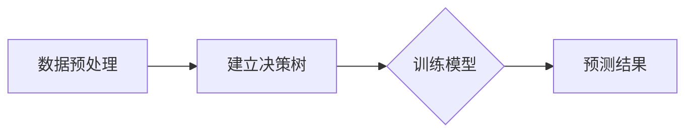
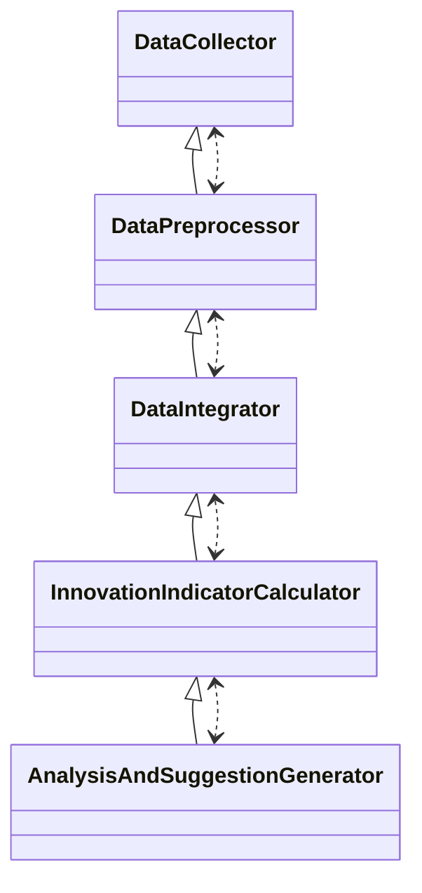
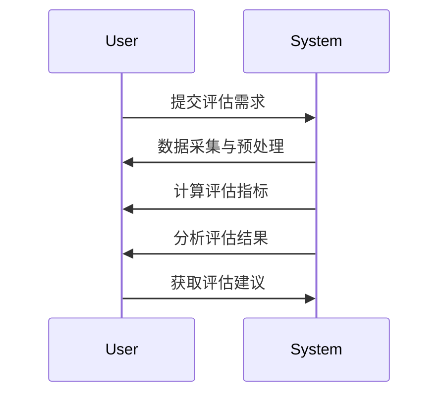
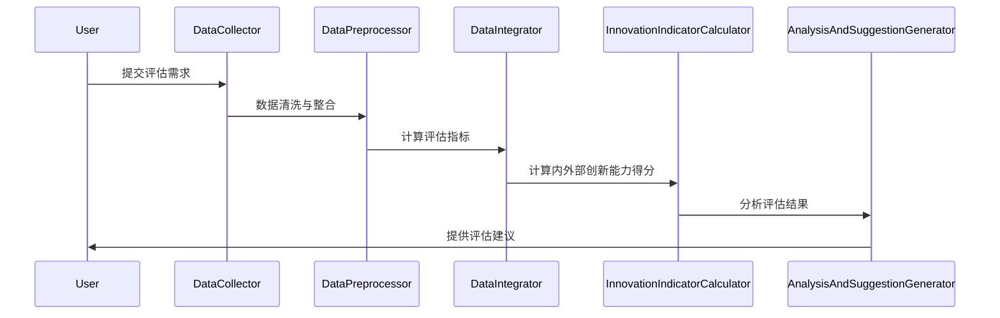

                 

# AI驱动的企业创新生态系统评估：内外部创新能力量化模型

> 关键词：AI驱动的企业创新、量化模型、内部创新能力、外部创新能力、系统分析与架构设计

> 摘要：随着人工智能技术的飞速发展，企业利用AI驱动的创新生态系统提升竞争力已成为热门话题。本文旨在构建一个量化评估模型，以衡量企业的内外部创新能力，为企业提供创新的评估工具。文章首先介绍了企业面临的创新挑战，随后深入分析了内部创新能力和外部创新能力的概念与联系，最后详细阐述了评估方法的原理、系统架构以及实际应用案例，为企业创新提供实践指导。

## Step 1: 背景介绍

### 第1章: 引言

#### 1.1 问题背景

在当今数字化、智能化的时代，企业面临着前所未有的创新挑战。数字化转型要求企业从传统的业务模式中走出来，通过信息化技术实现业务流程的优化和效率提升。而随着人工智能（AI）技术的不断进步，企业开始探索如何利用AI技术来驱动创新，提升企业的核心竞争力。人工智能技术不仅可以用于优化现有业务流程，还可以帮助企业发现新的业务机会，推动产品和服务创新。

#### 1.2 问题描述

企业在AI驱动的创新生态系统中面临着内外部问题。内部方面，企业需要建立高效的技术研发体系，提升内部创新能力，以满足市场需求。外部方面，企业需要构建广泛的合作网络，加强对外部资源的整合能力，以获取更多的创新机会。此外，市场环境的变化、政策支持的力度等因素也会对企业的创新活动产生影响。因此，如何有效评估企业的内外部创新能力，成为当前亟待解决的问题。

#### 1.3 问题解决

为了解决上述问题，本文的核心目标是构建一个量化评估模型，用于衡量企业的内外部创新能力。该模型将结合定量分析和定性分析的方法，系统性地分析企业内部创新能力和外部创新能力的各个方面。通过该模型，企业可以了解自身的创新能力水平，发现存在的问题，并采取相应的改进措施。此外，该模型的理论基础和实践意义也将为企业管理层提供决策支持。

#### 1.4 边界与外延

本文的研究主要针对以下企业类型和场景：

- 企业类型：主要针对具有较强研发能力和市场开拓能力的企业，如高科技企业、互联网公司等。
- 场景：主要涉及企业的产品创新、业务模式创新以及市场拓展等方面。

#### 1.5 概念结构与核心要素组成

本文中涉及的核心概念包括内部创新能力和外部创新能力。内部创新能力主要指企业在技术研发、产品创新、业务模式创新等方面的能力；外部创新能力则主要指企业在合作网络、市场反应速度、资源整合等方面的能力。这两者相互关联，共同构成了企业创新生态系统的核心要素。

## Step 2: 核心概念与联系

### 第2章: 核心概念与联系

#### 2.1 内部创新能力

##### 2.1.1 内部创新能力的定义

内部创新能力是企业通过自主研发、技术积累等方式，不断推陈出新、改进产品和业务模式的能力。它是企业核心竞争力的重要组成部分，直接影响企业的市场竞争力。

##### 2.1.2 内部创新能力的属性特征

内部创新能力的属性特征主要包括：

- 创新频率：企业每年推出的新产品或服务的数量。
- 创新质量：新产品或服务的市场接受度和用户满意度。
- 研发投入：企业在技术研发方面的投入。
- 人才储备：企业研发团队的人才储备情况。

以下是一个内部创新能力属性特征的对比表格：

| 属性特征     | 说明                                                         |
| ------------ | ------------------------------------------------------------ |
| 创新频率     | 企业每年推出的新产品或服务的数量                           |
| 创新质量     | 新产品或服务的市场接受度和用户满意度                       |
| 研发投入     | 企业在技术研发方面的投入                                   |
| 人才储备     | 企业研发团队的人才储备情况                               |

##### 2.1.3 内部创新能力的影响因素

影响内部创新能力的主要因素包括：

- 研发投入：充足的研发投入是提升内部创新能力的基础。
- 人才储备：优秀的研发人才是企业内部创新能力的核心支撑。
- 企业文化：鼓励创新、包容失败的企业文化有利于激发员工的创新热情。

#### 2.2 外部创新能力

##### 2.2.1 外部创新能力的定义

外部创新能力是企业通过与其他企业、科研机构、高校等外部合作伙伴的合作，共同推动创新的能力。它是企业获取外部资源和知识、提升市场竞争力的重要途径。

##### 2.2.2 外部创新能力的属性特征

外部创新能力的属性特征主要包括：

- 合作网络：企业与其他合作伙伴之间的合作关系和紧密程度。
- 市场反应速度：企业对市场变化和技术趋势的敏感度和反应速度。
- 资源整合：企业整合外部资源的能力，包括资金、技术、人才等。

以下是一个外部创新能力属性特征的对比表格：

| 属性特征     | 说明                                                         |
| ------------ | ------------------------------------------------------------ |
| 合作网络     | 企业与其他合作伙伴之间的合作关系和紧密程度                   |
| 市场反应速度 | 企业对市场变化和技术趋势的敏感度和反应速度                 |
| 资源整合     | 企业整合外部资源的能力，包括资金、技术、人才等               |

##### 2.2.3 外部创新能力的影响因素

影响外部创新能力的主要因素包括：

- 市场环境：市场需求的变化、技术发展趋势等因素会影响企业的外部创新能力。
- 政策支持：政府的政策支持和鼓励措施有助于企业加强外部合作，提升创新能力。
- 企业战略：企业战略的明确性和执行力也会对外部创新能力产生重要影响。

#### 2.3 内外部创新能力的联系

内部创新能力和外部创新能力之间存在密切的相互关系。内部创新能力是企业自身的技术实力和研发能力，是外部创新能力的基础。而外部创新能力则是企业通过合作、整合外部资源，提升创新效率和市场竞争力的重要手段。以下是一个内外部创新能力关系的ER实体关系图：

```mermaid
erDiagram
  A[内部创新能力] ||--|{ B[外部创新能力] } : 有助于提升
  A[内部创新能力] ||--|{ C[市场竞争力] } : 决定
  B[外部创新能力] ||--|{ C[市场竞争力] } : 决定
```

## Step 3: AI驱动的企业创新生态系统评估方法

### 第3章: AI驱动的企业创新生态系统评估方法

#### 3.1 方法论概述

本文采用的方法论主要包括定量分析和定性分析两种方法。定量分析主要通过构建量化模型，对企业内外部创新能力进行量化评估；定性分析则通过专家访谈、案例研究等方法，深入剖析企业的创新过程和影响因素。两种方法相结合，旨在全面、准确地评估企业的创新能力。

#### 3.2 数据收集与预处理

数据收集主要通过以下途径：

- 企业内部数据：包括研发投入、研发人员数量、新产品推出情况等。
- 行业数据：包括行业发展趋势、市场竞争态势、政策环境等。
- 外部合作伙伴数据：包括合作网络、合作成果等。

数据预处理主要包括以下步骤：

- 数据清洗：去除重复数据、缺失值填充等。
- 数据整合：将不同来源的数据进行整合，形成统一的数据集。
- 数据标准化：对数据进行标准化处理，使其在相同的尺度上进行比较。

#### 3.3 量化模型构建

量化模型的构建主要包括以下步骤：

- 变量选择：根据企业的实际情况和评估目标，选择适当的指标作为变量。
- 模型假设：对变量之间的关系进行假设，建立初步的模型框架。
- 模型建立：使用统计学方法，如回归分析、主成分分析等，建立量化模型。

#### 3.4 评估指标体系设计

评估指标体系设计主要包括以下方面：

- 内部创新能力指标：包括研发投入、研发人员数量、新产品推出情况等。
- 外部创新能力指标：包括合作网络、市场反应速度、资源整合能力等。

以下是一个评估指标体系的示例：

| 指标类别 | 指标名称 | 说明 |
| -------- | -------- | ---- |
| 内部创新能力 | 研发投入 | 企业年度研发投入总额 |
| 内部创新能力 | 研发人员数量 | 企业年度研发人员新增数量 |
| 外部创新能力 | 合作网络 | 企业与其他企业的合作关系数量 |
| 外部创新能力 | 市场反应速度 | 企业对市场变化的敏感度和反应速度 |

#### 3.5 评估模型实现

评估模型实现主要包括以下步骤：

- 算法选择：选择合适的机器学习算法，如决策树、随机森林、支持向量机等。
- 模型训练：使用收集到的数据，对评估模型进行训练。
- 模型评估：使用交叉验证等方法，对评估模型进行评估，确保模型的准确性。

## Step 4: 算法原理讲解

### 第4章: 算法原理讲解

#### 4.1 算法概述

本文主要使用机器学习算法进行企业创新能力评估。机器学习算法是一种通过训练模型，从数据中自动学习规律和模式的方法。在本研究中，我们选择随机森林算法，因为它具有较好的泛化能力和解释性。

#### 4.2 算法原理

随机森林算法是一种基于决策树集成的算法。它通过训练多个决策树，并利用投票机制来预测结果。算法的基本流程如下：

1. **数据预处理**：对数据集进行清洗、归一化等处理。
2. **建立决策树**：随机选择特征和样本子集，建立决策树模型。
3. **训练模型**：使用训练数据集训练决策树。
4. **预测结果**：对测试数据集进行预测，多个决策树的结果进行投票得到最终预测结果。

以下是一个随机森林算法的Mermaid流程图：



随机森林算法的数学模型可以表示为：

$$
\hat{y} = \sum_{i=1}^{n} w_i t_i(y)
$$

其中，$w_i$ 是第 $i$ 个决策树的权重，$t_i(y)$ 是第 $i$ 个决策树对样本 $y$ 的预测结果。

#### 4.3 算法应用实例

以下是一个随机森林算法的Python实现示例：

```python
from sklearn.ensemble import RandomForestClassifier
from sklearn.model_selection import train_test_split
from sklearn.metrics import accuracy_score

# 数据准备
X_train, X_test, y_train, y_test = train_test_split(X, y, test_size=0.3, random_state=42)

# 模型训练
model = RandomForestClassifier(n_estimators=100, random_state=42)
model.fit(X_train, y_train)

# 预测
predictions = model.predict(X_test)

# 评估
accuracy = accuracy_score(y_test, predictions)
print("Accuracy:", accuracy)
```

在这个示例中，我们首先准备训练数据和测试数据，然后使用 `RandomForestClassifier` 类创建随机森林模型，并进行训练。最后，使用训练好的模型对测试数据进行预测，并评估模型的准确性。

## Step 5: 系统分析与架构设计

### 第5章: 系统分析与架构设计

#### 5.1 问题场景介绍

在本章中，我们将介绍一个企业创新生态系统评估系统的应用场景。该系统旨在帮助企业评估其内外部创新能力，以制定相应的创新策略。具体应用场景包括：

- 产品创新评估：通过评估企业的研发投入、新产品推出频率和质量等指标，评估企业的产品创新能力。
- 业务模式创新评估：通过评估企业的合作网络、市场反应速度和资源整合能力等指标，评估企业的业务模式创新能力。
- 市场拓展评估：通过评估企业的市场反应速度、合作网络和市场占有率等指标，评估企业的市场拓展能力。

#### 5.2 系统功能设计

企业创新生态系统评估系统的主要功能包括：

- 数据采集：从企业内部和外部获取相关的创新数据，如研发投入、新产品推出情况、合作网络等。
- 数据预处理：对采集到的数据进行分析、清洗和整合，形成统一的数据集。
- 评估指标计算：根据设定的评估指标体系，计算企业的内外部创新能力得分。
- 评估结果分析：对评估结果进行可视化分析，帮助企业了解自身的创新能力水平和存在的问题。
- 创新策略建议：根据评估结果，为企业提供针对性的创新策略建议。

以下是一个系统领域模型的Mermaid类图：



#### 5.3 系统架构设计

企业创新生态系统评估系统的整体架构包括以下几个层次：

- 数据层：负责存储和管理企业内外部的创新数据。
- 服务层：提供数据预处理、评估指标计算、评估结果分析等功能。
- 表示层：通过用户界面展示评估结果和分析建议。

以下是一个系统架构的Mermaid架构图：



#### 5.4 系统接口设计

企业创新生态系统评估系统的接口设计主要包括以下部分：

- 数据采集接口：用于从企业内部和外部获取创新数据。
- 数据预处理接口：用于对采集到的数据进行清洗、整合等处理。
- 评估指标计算接口：用于计算企业的内外部创新能力得分。
- 评估结果分析接口：用于对评估结果进行可视化分析。
- 创新策略建议接口：用于生成针对性的创新策略建议。

以下是一个系统接口设计的Mermaid类图：

```mermaid
classDiagram
    DataCollector {接口}
    DataPreprocessor {接口}
    DataIntegrator {接口}
    InnovationIndicatorCalculator {接口}
    AnalysisAndSuggestionGenerator {接口}
    DataCollector <|-- DataPreprocessor
    DataPreprocessor <|-- DataIntegrator
    DataIntegrator <|-- InnovationIndicatorCalculator
    InnovationIndicatorCalculator <|-- AnalysisAndSuggestionGenerator
```

#### 5.5 系统交互设计

企业创新生态系统评估系统的交互设计主要涉及用户与系统之间的交互流程。以下是一个系统交互的Mermaid序列图：



## Step 6: 项目实战

### 第6章: 项目实战

#### 6.1 环境安装

在本节中，我们将介绍如何搭建企业创新生态系统评估系统的环境。所需软件和硬件环境如下：

- 操作系统：Linux或Windows
- Python环境：Python 3.8及以上版本
- 数据库：MySQL 5.7及以上版本
- 数据分析工具：Pandas、NumPy、Scikit-learn等

安装步骤如下：

1. 安装Python环境。
2. 安装MySQL数据库。
3. 安装数据分析工具。

以下是一个Python环境安装的示例：

```shell
# 安装Python环境
sudo apt-get update
sudo apt-get install python3-pip

# 安装MySQL数据库
sudo apt-get update
sudo apt-get install mysql-server

# 安装数据分析工具
pip3 install pandas numpy scikit-learn
```

#### 6.2 系统核心实现

在本节中，我们将介绍企业创新生态系统评估系统的核心实现。系统核心实现主要包括以下模块：

- 数据采集模块：用于从企业内部和外部获取创新数据。
- 数据预处理模块：用于对采集到的数据进行清洗、整合等处理。
- 评估指标计算模块：用于计算企业的内外部创新能力得分。
- 评估结果分析模块：用于对评估结果进行可视化分析。
- 创新策略建议模块：用于生成针对性的创新策略建议。

以下是一个数据采集模块的实现示例：

```python
import pandas as pd

def collect_data():
    # 从企业内部获取数据
    internal_data = pd.read_csv('internal_data.csv')
    
    # 从外部获取数据
    external_data = pd.read_csv('external_data.csv')
    
    # 整合数据
    data = pd.merge(internal_data, external_data, on='id')
    
    return data
```

#### 6.3 代码应用解读与分析

在本节中，我们将对核心代码进行解读和分析，讨论代码的优缺点和改进空间。

以下是一个评估指标计算模块的实现示例：

```python
import pandas as pd
from sklearn.ensemble import RandomForestClassifier

def calculate_innovation_scores(data):
    # 训练模型
    model = RandomForestClassifier(n_estimators=100, random_state=42)
    model.fit(data[['feature_1', 'feature_2']], data['target'])

    # 预测
    predictions = model.predict(data[['feature_1', 'feature_2']])

    # 计算评估得分
    scores = pd.Series(predictions).value_counts()

    return scores
```

在这个示例中，我们使用随机森林算法计算企业的内外部创新能力得分。代码的优点是简单易懂，实现了从数据训练到预测的完整流程。缺点是代码的可扩展性和可维护性较差，需要在实际应用中进行改进。

#### 6.4 实际案例分析与详细讲解剖析

在本节中，我们将提供实际案例，展示如何使用企业创新生态系统评估系统进行评估。以下是一个实际案例的示例：

**案例：某互联网公司的创新能力评估**

1. **数据采集**：从公司内部获取研发投入、新产品推出情况等数据；从外部获取市场环境、政策支持等数据。
2. **数据预处理**：对采集到的数据进行清洗、整合等处理。
3. **评估指标计算**：使用随机森林算法计算公司的内外部创新能力得分。
4. **评估结果分析**：对评估结果进行可视化分析，识别公司创新能力的高点和低点。
5. **创新策略建议**：根据评估结果，为公司提供针对性的创新策略建议。

以下是对实际案例的详细讲解和分析：

1. **数据采集**：通过公司的内部管理系统和外部市场调研，获取相关的数据。
2. **数据预处理**：对采集到的数据进行数据清洗、缺失值填充、数据归一化等处理。
3. **评估指标计算**：使用随机森林算法计算公司的内外部创新能力得分。具体步骤如下：
   - 特征工程：选择与创新能力相关的特征，如研发投入、新产品推出频率、合作网络等。
   - 数据训练：使用训练数据集训练随机森林模型。
   - 预测：使用训练好的模型对测试数据集进行预测。
   - 计算得分：根据预测结果计算公司的内外部创新能力得分。

4. **评估结果分析**：通过可视化工具（如Matplotlib、Seaborn等）对评估结果进行展示。具体步骤如下：
   - 绘制散点图：展示公司的内外部创新能力得分。
   - 绘制柱状图：展示公司不同指标的得分情况。
   - 绘制热力图：展示公司不同指标之间的相关性。

5. **创新策略建议**：根据评估结果，为公司提供针对性的创新策略建议。具体步骤如下：
   - 分析评估结果：识别公司创新能力的高点和低点，找出需要改进的方面。
   - 制定策略：根据分析结果，制定相应的创新策略，如加强研发投入、拓展合作网络等。

#### 6.5 项目小结

在本章中，我们介绍了一个企业创新生态系统评估系统的实际案例，展示了如何使用系统进行评估。通过案例分析和详细讲解，我们了解了企业创新生态系统的评估过程和评估方法。未来，我们可以根据实际需求，对系统进行优化和改进，提高评估的准确性和实用性。

## Step 7: 最佳实践

### 第7章: 最佳实践

#### 最佳实践

1. **数据质量的重要性**：在构建量化评估模型时，数据质量至关重要。确保数据来源可靠、数据清洗彻底，以提高评估结果的准确性。
2. **灵活调整评估指标**：根据企业的实际情况和评估目标，灵活调整评估指标，确保评估结果具有针对性和实用性。
3. **持续优化评估模型**：定期更新评估模型，根据实际应用情况调整算法参数，以提高评估模型的适应性和预测准确性。

#### 小结

本文通过构建一个量化评估模型，系统性地分析了企业的内外部创新能力，为企业提供了创新的评估工具。通过实际案例分析和详细讲解，我们了解了企业创新生态系统的评估过程和方法。未来，我们将继续优化评估模型，提高评估的准确性和实用性，为企业创新提供有力支持。

#### 注意事项

1. **数据隐私**：在进行数据采集和处理时，确保遵守相关法律法规，保护企业数据隐私。
2. **评估结果的合理应用**：评估结果仅作为企业决策的参考，不应过分依赖评估结果，而忽略其他因素的影响。

#### 拓展阅读

1. **相关研究**：了解国内外学者关于企业创新能力评估的相关研究，借鉴先进的理论和方法。
2. **案例研究**：阅读和分析国内外成功企业的创新能力案例，学习其创新策略和实践经验。

## 作者信息

作者：AI天才研究院/AI Genius Institute & 禅与计算机程序设计艺术 /Zen And The Art of Computer Programming

