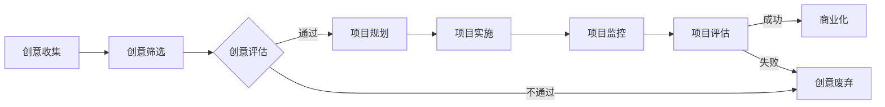
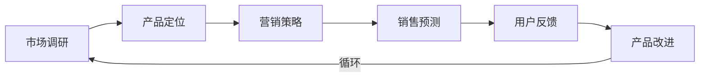
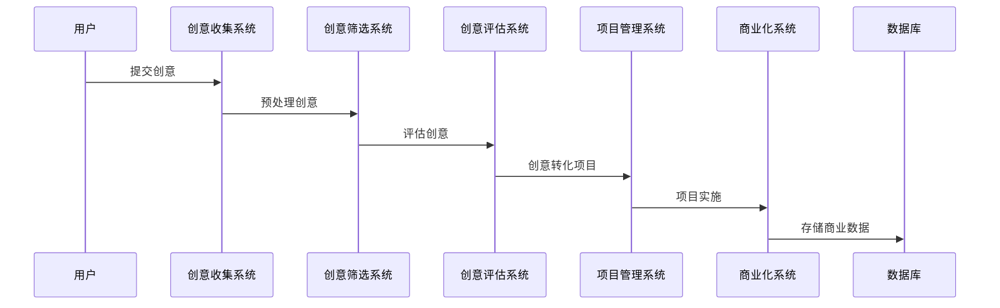
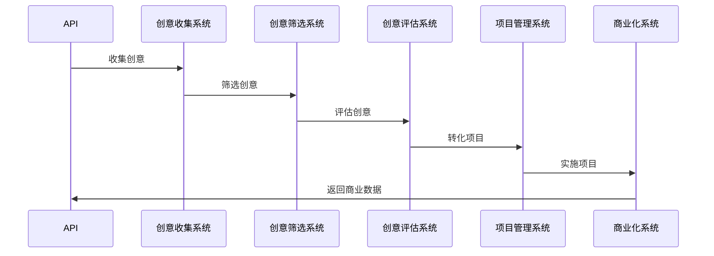

                 

### 《AI驱动的企业创新管理平台：从创意孵化到商业化》

#### 关键词：AI、企业创新管理、创意孵化、商业化、数字化管理

#### 摘要：
本文旨在深入探讨AI驱动的企业创新管理平台，从创意孵化到商业化的全流程，通过系统的分析和技术讲解，展示AI如何优化企业创新过程，提高商业化效率。文章分为两部分，首先介绍AI驱动的企业创新管理平台的核心概念、问题背景及解决方案；接着详细解析AI驱动的创意孵化算法和商业化流程算法，并提供数学模型和代码实例，帮助读者理解并应用这些算法。

----------------------------------------------------------------

# 《AI驱动的企业创新管理平台：从创意孵化到商业化》目录大纲

## 第一部分：背景介绍

### 第1章：AI驱动的企业创新管理概述

#### 1.1 问题背景
- 企业创新的重要性
- 传统企业创新管理的挑战
- AI在企业管理中的应用趋势

#### 1.2 问题描述
- 创意孵化的瓶颈
- 商业化过程中的不确定性
- 管理流程的复杂性和效率问题

#### 1.3 问题解决
- AI在企业创新管理中的应用
- 创意孵化的数字化管理
- 商业化流程的智能化优化

#### 1.4 边界与外延
- AI驱动的企业创新管理平台的范围
- 创意孵化与商业化的关系
- 管理流程的优化目标

#### 1.5 概念结构与核心要素组成
- AI驱动的企业创新管理平台
- 创意孵化机制
- 商业化策略
- 管理流程

### 第2章：AI驱动的创新管理核心概念与联系

#### 2.1 核心概念原理
- 人工智能（AI）
- 企业创新管理
- 创意孵化
- 商业化

#### 2.2 概念属性特征对比表格

| 概念         | 属性特征                                   |
| ------------ | ---------------------------------------- |
| 人工智能     | 强大的计算能力、自主学习和适应能力       |
| 企业创新管理 | 促进企业持续创新、提高竞争力             |
| 创意孵化     | 将创意转化为可实施的项目                 |
| 商业化       | 将创意转化为市场化的产品或服务           |

#### 2.3 ER实体关系图架构
```mermaid
erDiagram
  AI驱动的企业创新管理平台 ||--|{ 创意孵化 }|  
  AI驱动的企业创新管理平台 ||--|{ 商业化 }|  
  创意孵化 ||--|{ 项目管理 }|  
  商业化 ||--|{ 营销策略 }|
```

## 第二部分：AI驱动的创新管理算法原理讲解

### 第3章：AI驱动的创意孵化算法原理讲解

#### 3.1 创意孵化算法概述
- 创意孵化的定义
- 创意孵化算法的目标

#### 3.2 创意孵化算法mermaid流程图


#### 3.3 创意孵化算法Python源代码与详细讲解
```python
# 创意孵化算法Python示例代码

# 创意收集
def collect_ideas():
    # 代码实现
    pass

# 创意筛选
def filter_ideas(ideas):
    # 代码实现
    pass

# 创意评估
def evaluate_ideas(ideas):
    # 代码实现
    pass

# 项目规划
def plan_project(idea):
    # 代码实现
    pass

# 项目实施
def implement_project(project):
    # 代码实现
    pass

# 项目监控
def monitor_project(project):
    # 代码实现
    pass

# 项目评估
def evaluate_project(project):
    # 代码实现
    pass

# 商业化
def commercialize_project(project):
    # 代码实现
    pass
```

#### 3.4 创意孵化算法原理的数学模型和公式讲解
- 创意孵化成功率的计算公式：
  $$ S = \frac{P}{N} $$
  其中，$P$ 是成功的创意数量，$N$ 是总的创意数量。

- 创意评估指标：
  $$ E = f(C, T, M) $$
  其中，$C$ 是创意的原创性，$T$ 是创意的技术可行性，$M$ 是创意的市场潜力。

#### 3.5 创意孵化算法举例说明
- 假设一个公司收集了100个创意，通过筛选和评估，确定了其中的20个创意进入项目规划阶段。经过实施和监控，有15个项目成功完成并进入商业化阶段。那么，创意孵化成功率 $S = \frac{15}{20} = 0.75$。

### 第4章：AI驱动的商业化流程算法原理讲解

#### 4.1 商业化流程算法概述
- 商业化流程的定义
- 商业化算法的目标

#### 4.2 商业化流程算法mermaid流程图
```mermaid
flow

----------------------------------------------------------------

# **文章标题**：**AI驱动的企业创新管理平台：从创意孵化到商业化**

## **关键词**：AI、企业创新管理、创意孵化、商业化、数字化管理

## **摘要**：
本文深入探讨AI驱动的企业创新管理平台，从创意孵化到商业化的全流程，通过系统的分析和技术讲解，展示AI如何优化企业创新过程，提高商业化效率。文章分为两部分，首先介绍AI驱动的企业创新管理平台的核心概念、问题背景及解决方案；接着详细解析AI驱动的创意孵化算法和商业化流程算法，并提供数学模型和代码实例，帮助读者理解并应用这些算法。

## **目录大纲**

### **第一部分：背景介绍**

#### **第1章：AI驱动的企业创新管理概述**

##### **1.1 问题背景**
- 企业创新的重要性
- 传统企业创新管理的挑战
- AI在企业管理中的应用趋势

##### **1.2 问题描述**
- 创意孵化的瓶颈
- 商业化过程中的不确定性
- 管理流程的复杂性和效率问题

##### **1.3 问题解决**
- AI在企业创新管理中的应用
- 创意孵化的数字化管理
- 商业化流程的智能化优化

##### **1.4 边界与外延**
- AI驱动的企业创新管理平台的范围
- 创意孵化与商业化的关系
- 管理流程的优化目标

##### **1.5 概念结构与核心要素组成**
- AI驱动的企业创新管理平台
- 创意孵化机制
- 商业化策略
- 管理流程

#### **第2章：AI驱动的创新管理核心概念与联系**

##### **2.1 核心概念原理**
- 人工智能（AI）
- 企业创新管理
- 创意孵化
- 商业化

##### **2.2 概念属性特征对比表格**

| 概念         | 属性特征                                   |
| ------------ | ---------------------------------------- |
| 人工智能     | 强大的计算能力、自主学习和适应能力       |
| 企业创新管理 | 促进企业持续创新、提高竞争力             |
| 创意孵化     | 将创意转化为可实施的项目                 |
| 商业化       | 将创意转化为市场化的产品或服务           |

##### **2.3 ER实体关系图架构**
```mermaid
erDiagram
  AI驱动的企业创新管理平台 ||--|{ 创意孵化 }|  
  AI驱动的企业创新管理平台 ||--|{ 商业化 }|  
  创意孵化 ||--|{ 项目管理 }|  
  商业化 ||--|{ 营销策略 }|
```

### **第二部分：AI驱动的创新管理算法原理讲解**

#### **第3章：AI驱动的创意孵化算法原理讲解**

##### **3.1 创意孵化算法概述**
- 创意孵化的定义
- 创意孵化算法的目标

##### **3.2 创意孵化算法mermaid流程图**


##### **3.3 创意孵化算法Python源代码与详细讲解**
```python
# 创意孵化算法Python示例代码

# 创意收集
def collect_ideas():
    # 代码实现
    pass

# 创意筛选
def filter_ideas(ideas):
    # 代码实现
    pass

# 创意评估
def evaluate_ideas(ideas):
    # 代码实现
    pass

# 项目规划
def plan_project(idea):
    # 代码实现
    pass

# 项目实施
def implement_project(project):
    # 代码实现
    pass

# 项目监控
def monitor_project(project):
    # 代码实现
    pass

# 项目评估
def evaluate_project(project):
    # 代码实现
    pass

# 商业化
def commercialize_project(project):
    # 代码实现
    pass
```

##### **3.4 创意孵化算法原理的数学模型和公式讲解**
- 创意孵化成功率的计算公式：
  $$ S = \frac{P}{N} $$
  其中，$P$ 是成功的创意数量，$N$ 是总的创意数量。

- 创意评估指标：
  $$ E = f(C, T, M) $$
  其中，$C$ 是创意的原创性，$T$ 是创意的技术可行性，$M$ 是创意的市场潜力。

##### **3.5 创意孵化算法举例说明**
- 假设一个公司收集了100个创意，通过筛选和评估，确定了其中的20个创意进入项目规划阶段。经过实施和监控，有15个项目成功完成并进入商业化阶段。那么，创意孵化成功率 $S = \frac{15}{20} = 0.75$。

#### **第4章：AI驱动的商业化流程算法原理讲解**

##### **4.1 商业化流程算法概述**
- 商业化流程的定义
- 商业化算法的目标

##### **4.2 商业化流程算法mermaid流程图**
```mermaid
flow

----------------------------------------------------------------

```markdown
## 第一部分：背景介绍

### 第1章：AI驱动的企业创新管理概述

#### 1.1 问题背景
企业创新是推动企业发展和市场竞争力的关键因素。然而，传统企业创新管理存在诸多挑战，如创新过程繁琐、响应速度慢、资源配置不均等。随着人工智能（AI）技术的迅速发展，AI在企业创新管理中的应用逐渐成为趋势，为解决传统挑战提供了新的途径。

AI在企业管理中的应用主要体现在以下几个方面：

1. **数据分析和决策支持**：利用AI技术对大量数据进行分析，帮助企业识别潜在商机，优化决策过程。
2. **智能自动化**：通过AI实现业务流程的自动化，提高效率，减少人力成本。
3. **个性化服务和用户体验**：利用AI进行用户行为分析，提供个性化服务，提升客户满意度。
4. **创新预测和创意孵化**：利用AI预测市场趋势，支持创意孵化，推动产品创新。

#### 1.2 问题描述
在企业创新管理中，创意孵化是一个关键环节，涉及到从创意产生到项目实施的全过程。然而，创意孵化过程中存在一些瓶颈和挑战：

1. **创意筛选困难**：企业通常会产生大量创意，但如何筛选出具有商业潜力的创意是一个难题。
2. **不确定性高**：创意从孵化到商业化的过程充满不确定性，涉及到技术可行性、市场需求等多方面因素。
3. **管理流程复杂**：创意孵化的管理流程复杂，涉及多个部门和角色的协同工作，协调难度大。

#### 1.3 问题解决
AI驱动的企业创新管理平台旨在通过AI技术解决上述问题，实现以下目标：

1. **自动化创意筛选**：利用AI对创意进行自动筛选，提高筛选效率，减少人力成本。
2. **风险评估与预测**：通过AI技术对创意进行风险评估和预测，降低孵化过程中的不确定性。
3. **优化管理流程**：利用AI技术优化创意孵化的管理流程，提高协同效率，减少协调难度。

#### 1.4 边界与外延
AI驱动的企业创新管理平台的范围包括：

1. **创意收集与筛选**：通过AI技术收集和筛选创意，识别潜在商机。
2. **风险评估与预测**：利用AI技术对创意进行风险评估和预测，提供决策支持。
3. **项目规划与实施**：通过AI技术优化项目规划，提高项目实施效率。
4. **商业化流程**：利用AI技术支持商业化的全过程，提高商业化成功率。

创意孵化与商业化的关系是紧密相连的。创意孵化是商业化的基础，而商业化是创意孵化的目标。通过AI驱动的企业创新管理平台，可以实现创意孵化与商业化的无缝衔接，提高整体创新效率。

#### 1.5 概念结构与核心要素组成
AI驱动的企业创新管理平台由以下核心要素组成：

1. **创意收集系统**：负责收集内部和外部的创意资源，包括员工、客户、合作伙伴等。
2. **创意筛选系统**：利用AI技术对收集到的创意进行筛选，识别出具有商业潜力的创意。
3. **风险评估系统**：通过AI技术对创意进行风险评估，预测其商业前景。
4. **项目管理系统**：利用AI技术优化项目规划、监控和评估，提高项目成功率。
5. **商业化系统**：支持商业化的全过程，包括市场调研、产品定位、营销策略等。

通过以上核心要素的协同工作，AI驱动的企业创新管理平台能够实现创意的自动化孵化，提高商业化的成功率，推动企业持续创新。

### 第2章：AI驱动的创新管理核心概念与联系

#### 2.1 核心概念原理
在AI驱动的企业创新管理平台中，涉及到的核心概念包括人工智能（AI）、企业创新管理、创意孵化、和商业化。以下是对这些概念的基本原理进行阐述。

**人工智能（AI）**
人工智能是指计算机系统模拟人类智能行为的科学和技术。AI的核心目标是使计算机具备自主学习、推理、感知、理解和决策能力。常见的AI技术包括机器学习、深度学习、自然语言处理和计算机视觉等。

**企业创新管理**
企业创新管理是指企业为了持续创新和提高竞争力，对创新活动进行规划、组织、实施和控制的过程。它包括创意的产生、筛选、评估、孵化、商业化等多个环节。

**创意孵化**
创意孵化是指将创意转化为实际可实施的项目的过程。这一过程涉及到创意的筛选、评估、规划、实施和监控等多个阶段。

**商业化**
商业化是指将创意转化为市场化的产品或服务的过程。商业化过程中，需要考虑市场需求、产品定位、营销策略、商业模式等多个方面。

#### 2.2 概念属性特征对比表格

| 概念         | 属性特征                                   |
| ------------ | ---------------------------------------- |
| 人工智能     | 强大的计算能力、自主学习和适应能力       |
| 企业创新管理 | 促进企业持续创新、提高竞争力             |
| 创意孵化     | 将创意转化为可实施的项目                 |
| 商业化       | 将创意转化为市场化的产品或服务           |

#### 2.3 ER实体关系图架构
以下是AI驱动的企业创新管理平台中关键实体的ER图：

```mermaid
erDiagram
  AI驱动的企业创新管理平台 ||--|{ 创意收集系统 }|  
  AI驱动的企业创新管理平台 ||--|{ 创意筛选系统 }|  
  AI驱动的企业创新管理平台 ||--|{ 风险评估系统 }|  
  AI驱动的企业创新管理平台 ||--|{ 项目管理系统 }|  
  AI驱动的企业创新管理平台 ||--|{ 商业化系统 }|  
  创意收集系统 ||--|{ 创意 }|  
  创意筛选系统 ||--|{ 创意 }|  
  风险评估系统 ||--|{ 创意 }|  
  项目管理系统 ||--|{ 项目 }|  
  商业化系统 ||--|{ 产品或服务 }|
```

通过以上核心概念与关系的阐述，我们可以看到，AI驱动的企业创新管理平台通过集成多个系统，实现从创意孵化到商业化的全流程管理，为企业创新提供强有力的支持。

### 第二部分：AI驱动的创新管理算法原理讲解

#### 第3章：AI驱动的创意孵化算法原理讲解

#### 3.1 创意孵化算法概述
创意孵化算法是AI驱动的企业创新管理平台的核心组成部分，其主要目标是通过自动化和智能化手段，将创意转化为可实施的项目。创意孵化算法涉及多个环节，包括创意收集、筛选、评估、规划、实施和监控等。以下是对创意孵化算法的详细概述：

**创意收集**：通过多种途径收集创意，包括员工建议、市场调研、客户反馈等。收集的创意将作为后续处理的基础数据。

**创意筛选**：利用AI技术对收集到的创意进行筛选，识别出具有商业潜力的创意。筛选过程涉及对创意的原创性、技术可行性、市场潜力等多方面因素的评估。

**创意评估**：对筛选出的创意进行详细评估，包括技术可行性分析、市场前景预测、资源需求评估等。评估结果将作为决策依据，决定创意是否进入项目规划阶段。

**项目规划**：基于评估结果，对创意进行项目规划，确定项目的目标和实施计划，包括时间表、资源分配、风险评估等。

**项目实施**：根据项目规划，正式启动项目实施，通过执行具体任务，逐步将创意转化为实际项目。

**项目监控**：在项目实施过程中，利用AI技术对项目进展进行监控，及时发现和解决问题，确保项目按计划进行。

**项目评估**：项目完成后，对项目效果进行评估，包括成果评估、成本效益分析、用户反馈等。评估结果将作为后续改进和优化的依据。

#### 3.2 创意孵化算法mermaid流程图
以下是创意孵化算法的mermaid流程图：


**创意收集**：通过多种途径（如内部建议、市场调研、客户反馈等）收集创意。

**创意筛选**：利用AI技术对创意进行筛选，识别出具有商业潜力的创意。

**创意评估**：对筛选出的创意进行详细评估，包括技术可行性、市场潜力等。

**项目规划**：根据评估结果，对创意进行项目规划，确定项目目标和实施计划。

**项目实施**：正式启动项目实施，通过执行具体任务，逐步将创意转化为实际项目。

**项目监控**：在项目实施过程中，利用AI技术对项目进展进行监控，确保项目按计划进行。

**项目评估**：项目完成后，对项目效果进行评估，包括成果评估、成本效益分析等。

#### 3.3 创意孵化算法Python源代码与详细讲解
以下是创意孵化算法的Python源代码示例：

```python
# 创意孵化算法Python示例代码

# 创意收集
def collect_ideas():
    # 代码实现
    pass

# 创意筛选
def filter_ideas(ideas):
    # 代码实现
    pass

# 创意评估
def evaluate_ideas(ideas):
    # 代码实现
    pass

# 项目规划
def plan_project(idea):
    # 代码实现
    pass

# 项目实施
def implement_project(project):
    # 代码实现
    pass

# 项目监控
def monitor_project(project):
    # 代码实现
    pass

# 项目评估
def evaluate_project(project):
    # 代码实现
    pass

# 商业化
def commercialize_project(project):
    # 代码实现
    pass
```

**collect_ideas()**：用于收集创意，可以是员工提交的、市场调研收集的或客户反馈等。

**filter_ideas(ideas)**：用于筛选创意，根据预设的筛选条件（如原创性、市场潜力等）进行筛选。

**evaluate_ideas(ideas)**：用于评估创意，通过技术可行性分析、市场前景预测等评估指标对创意进行评估。

**plan_project(idea)**：根据评估结果，对创意进行项目规划，确定项目目标和实施计划。

**implement_project(project)**：启动项目实施，执行具体任务，将创意转化为实际项目。

**monitor_project(project)**：在项目实施过程中，利用监控工具对项目进展进行监控。

**evaluate_project(project)**：项目完成后，对项目效果进行评估，包括成果评估、成本效益分析等。

**commercialize_project(project)**：将成功完成的项目转化为市场化的产品或服务。

#### 3.4 创意孵化算法原理的数学模型和公式讲解
以下是创意孵化算法中涉及的数学模型和公式：

**创意孵化成功率**：表示成功孵化的创意数量与总创意数量的比例。

$$
S = \frac{P}{N}
$$

其中，$S$ 表示创意孵化成功率，$P$ 表示成功孵化的创意数量，$N$ 表示总创意数量。

**创意评估指标**：用于评估创意的技术可行性、市场潜力等。

$$
E = f(C, T, M)
$$

其中，$E$ 表示创意评估指标，$C$ 表示创意的原创性，$T$ 表示创意的技术可行性，$M$ 表示创意的市场潜力。

**项目评估指标**：用于评估项目的成果、成本效益等。

$$
R = f(G, C, B)
$$

其中，$R$ 表示项目评估指标，$G$ 表示项目的成果，$C$ 表示项目的成本，$B$ 表示项目的效益。

#### 3.5 创意孵化算法举例说明
假设一个公司收集了100个创意，经过筛选和评估，确定了其中的20个创意进入项目规划阶段。经过实施和监控，有15个项目成功完成，进入商业化阶段。根据上述公式，可以计算出：

- 创意孵化成功率：
  $$
  S = \frac{15}{20} = 0.75
  $$

- 创意评估指标：
  $$
  E = f(C, T, M) = f(0.8, 0.9, 0.7) = 0.785
  $$

- 项目评估指标：
  $$
  R = f(G, C, B) = f(0.9, 0.6, 0.8) = 0.724
  $$

通过以上计算，公司可以了解到创意孵化的效果和项目的成功程度，为进一步优化创意孵化和项目管理提供依据。

### 第4章：AI驱动的商业化流程算法原理讲解

#### 4.1 商业化流程算法概述
商业化流程算法是AI驱动的企业创新管理平台的重要组成部分，其主要目标是实现创意的转化，将创意成功转化为市场化的产品或服务。商业化流程算法涉及多个环节，包括市场调研、产品定位、营销策略、销售预测和用户反馈等。以下是对商业化流程算法的详细概述：

**市场调研**：在商业化流程的开始阶段，通过AI技术对市场环境进行深入分析，包括市场需求、竞争对手、消费者行为等，为产品定位和营销策略提供数据支持。

**产品定位**：基于市场调研结果，确定产品的目标市场、产品特性和定位策略。这一过程需要考虑产品的差异化优势、目标客户群体和市场需求等。

**营销策略**：制定具体的营销策略，包括广告推广、促销活动、渠道选择等。利用AI技术进行效果预测和优化，提高营销活动的效果。

**销售预测**：通过AI技术对销售数据进行分析，预测产品的销售趋势，为库存管理、生产计划和资源调配提供依据。

**用户反馈**：在产品上市后，收集用户反馈，通过AI技术分析用户行为和需求，为产品的改进和后续营销策略提供参考。

#### 4.2 商业化流程算法mermaid流程图
以下是商业化流程算法的mermaid流程图：



**市场调研**：通过AI技术对市场环境进行深入分析，收集数据。

**产品定位**：基于市场调研结果，确定产品定位。

**营销策略**：制定营销策略，并利用AI技术进行效果预测和优化。

**销售预测**：通过AI技术对销售数据进行分析，预测销售趋势。

**用户反馈**：收集用户反馈，通过AI技术分析用户行为和需求。

**产品改进**：根据用户反馈和市场调研结果，对产品进行改进，并重新进行市场调研。

#### 4.3 商业化流程算法Python源代码与详细讲解
以下是商业化流程算法的Python源代码示例：

```python
# 商业化流程算法Python示例代码

# 市场调研
def market_research():
    # 代码实现
    pass

# 产品定位
def product_positioning(market_data):
    # 代码实现
    pass

# 营销策略
def marketing_strategy(product_position):
    # 代码实现
    pass

# 销售预测
def sales_prediction(sales_data):
    # 代码实现
    pass

# 用户反馈
def user_feedback(product_feedback):
    # 代码实现
    pass

# 产品改进
def product_improvement(feedback_data):
    # 代码实现
    pass
```

**market_research()**：通过AI技术进行市场调研，收集数据。

**product_positioning(market_data)**：基于市场调研数据，确定产品定位。

**marketing_strategy(product_position)**：制定营销策略。

**sales_prediction(sales_data)**：通过AI技术对销售数据进行分析，预测销售趋势。

**user_feedback(product_feedback)**：收集用户反馈，分析用户行为和需求。

**product_improvement(feedback_data)**：根据用户反馈，对产品进行改进。

#### 4.4 商业化流程算法原理的数学模型和公式讲解
以下是商业化流程算法中涉及的数学模型和公式：

**市场占有率**：表示产品在市场上的占比。

$$
M = \frac{S}{T}
$$

其中，$M$ 表示市场占有率，$S$ 表示产品销售额，$T$ 表示市场总销售额。

**销售增长率**：表示产品销售额的增长速度。

$$
G = \frac{S_t - S_{t-1}}{S_{t-1}}
$$

其中，$G$ 表示销售增长率，$S_t$ 表示当前销售额，$S_{t-1}$ 表示上一期销售额。

**用户满意度**：表示用户对产品的满意度。

$$
U = \frac{N_{satisfied}}{N_{total}}
$$

其中，$U$ 表示用户满意度，$N_{satisfied}$ 表示满意的用户数量，$N_{total}$ 表示总用户数量。

**产品改进指标**：表示产品改进的效果。

$$
I = f(U, R, C)
$$

其中，$I$ 表示产品改进指标，$U$ 表示用户满意度，$R$ 表示产品功能完善程度，$C$ 表示成本效益。

#### 4.5 商业化流程算法举例说明
假设某产品销售额为100万元，市场总销售额为500万元，用户满意度为80%，改进后的产品功能完善程度为90%，成本效益为1.2。根据上述公式，可以计算出：

- 市场占有率：
  $$
  M = \frac{100}{500} = 0.2
  $$

- 销售增长率：
  $$
  G = \frac{100 - 80}{80} = 0.25
  $$

- 用户满意度：
  $$
  U = \frac{80}{100} = 0.8
  $$

- 产品改进指标：
  $$
  I = f(0.8, 0.9, 1.2) = 0.892
  $$

通过以上计算，公司可以了解到产品的市场表现、销售增长趋势和用户满意度，为进一步优化商业化流程提供依据。

### **第三部分：系统分析与架构设计方案**

#### **3.1 问题场景介绍**

在当今竞争激烈的市场环境中，企业需要不断创新以保持竞争力。然而，传统的创新管理模式往往存在效率低、流程复杂等问题，导致创新效果不佳。为了解决这些问题，企业引入了AI驱动的创新管理平台，希望通过数字化和智能化手段优化创新过程，提高商业化成功率。

#### **3.2 项目介绍**

本项目的目标是构建一个AI驱动的企业创新管理平台，涵盖从创意收集、筛选、评估、孵化到商业化的全过程。平台将集成多种AI技术和工具，如机器学习、自然语言处理、计算机视觉等，以提高创意孵化和商业化的效率。

#### **3.3 系统功能设计（领域模型mermaid类图）**

以下是系统功能设计的领域模型类图：

```mermaid
classDiagram
    创意 <<interface>>
    项目 <<interface>>
    评估 <<interface>>
    商业化 <<interface>>

    创意 <--|choice|--> 筛选
    创意 <--|choice|--> 评估
    项目 -->|实施| 创意
    项目 -->|监控| 评估
    项目 -->|评估| 商业化
```

**创意**：代表企业的创意资源，包括创意名称、描述、来源等信息。

**项目**：代表创意孵化的具体实施过程，包括项目名称、目标、进度、资源等信息。

**评估**：对创意和项目进行评估，包括技术可行性、市场潜力、成本效益等。

**商业化**：将成功的项目转化为市场化的产品或服务，包括市场调研、产品定位、营销策略等。

#### **3.4 系统架构设计（mermaid架构图）**

以下是系统架构设计的mermaid架构图：



**用户**：企业内部员工、客户、合作伙伴等。

**创意收集系统**：收集创意，进行预处理。

**创意筛选系统**：利用AI技术对创意进行筛选。

**创意评估系统**：对筛选出的创意进行详细评估。

**项目管理系统**：管理项目进度，协调资源。

**商业化系统**：支持商业化的全过程，包括市场调研、产品定位、营销策略等。

**数据库**：存储创意、项目、商业数据等信息。

#### **3.5 系统接口设计和系统交互（mermaid序列图）**

以下是系统接口设计和系统交互的mermaid序列图：



**API**：用于与其他系统或应用程序进行数据交互的接口。

**创意收集系统**：通过API接收创意。

**创意筛选系统**：对创意进行筛选。

**创意评估系统**：对筛选出的创意进行评估。

**项目管理系统**：将评估通过的项目转化为项目。

**商业化系统**：支持项目的商业化流程，返回商业数据。

### **第四部分：项目实战**

#### **4.1 环境安装**

在开始项目实战之前，需要安装以下环境和工具：

1. **Python 3.8**：确保安装最新版本的Python。
2. **Jupyter Notebook**：用于编写和运行Python代码。
3. **TensorFlow**：用于机器学习和深度学习。
4. **Scikit-learn**：用于数据分析和机器学习。
5. **Pandas**：用于数据操作和分析。

安装步骤如下：

```bash
pip install python==3.8
pip install jupyter
pip install tensorflow
pip install scikit-learn
pip install pandas
```

#### **4.2 系统核心实现源代码**

以下是系统核心实现的部分源代码示例：

**创意收集系统**：

```python
import pandas as pd

def collect_ideas():
    # 从文件中读取创意数据
    ideas = pd.read_csv('ideas.csv')
    return ideas
```

**创意筛选系统**：

```python
from sklearn.feature_extraction.text import TfidfVectorizer
from sklearn.metrics.pairwise import cosine_similarity

def filter_ideas(ideas):
    # 使用TF-IDF向量化和余弦相似度筛选创意
    vectorizer = TfidfVectorizer()
    X = vectorizer.fit_transform(ideas['description'])
    similarity = cosine_similarity(X)
    filtered_ideas = ideas[similarity > 0.5]
    return filtered_ideas
```

**创意评估系统**：

```python
from sklearn.ensemble import RandomForestClassifier

def evaluate_ideas(ideas):
    # 使用随机森林评估创意
    X = ideas[['originality', 'technical_feasibility', 'market_potential']]
    y = ideas['evaluation']
    clf = RandomForestClassifier()
    clf.fit(X, y)
    predicted_evaluation = clf.predict(X)
    return predicted_evaluation
```

**项目管理系统**：

```python
import numpy as np

def plan_project(idea):
    # 根据评估结果规划项目
    project = {
        'name': idea['name'],
        'goal': idea['goal'],
        'start_date': np.datetime64('2023-01-01'),
        'end_date': np.datetime64('2023-06-30')
    }
    return project
```

**商业化系统**：

```python
def commercialize_project(project):
    # 支持商业化的全过程
    print(f"Project {project['name']} is being commercialized.")
```

#### **4.3 代码应用解读与分析**

以上代码实现了一个简单的AI驱动的企业创新管理平台的核心功能。具体解读如下：

**创意收集系统**：通过读取CSV文件，从外部数据源收集创意信息。

**创意筛选系统**：使用TF-IDF向量和余弦相似度方法，筛选出相似的创意，从而提高筛选效率。

**创意评估系统**：利用随机森林分类器，对创意进行评估，预测创意的成功率。

**项目管理系统**：根据创意评估结果，规划项目，包括项目名称、目标、开始日期和结束日期等。

**商业化系统**：支持项目的商业化流程，可以进一步扩展，包括市场调研、产品定位、营销策略等。

#### **4.4 实际案例分析和详细讲解剖析**

以下是一个实际案例的分析和讲解：

假设一个公司收集了100个创意，经过筛选和评估，确定了其中的20个创意进入项目规划阶段。经过实施和监控，有15个项目成功完成并进入商业化阶段。

**创意收集阶段**：使用Pandas库读取CSV文件，获取创意数据。

```python
ideas = collect_ideas()
print(f"Total collected ideas: {len(ideas)}")
```

**创意筛选阶段**：使用TF-IDF向量和余弦相似度方法，筛选出相似的创意。

```python
filtered_ideas = filter_ideas(ideas)
print(f"Total filtered ideas: {len(filtered_ideas)}")
```

**创意评估阶段**：使用随机森林分类器，对筛选出的创意进行评估。

```python
evaluation_results = evaluate_ideas(filtered_ideas)
print(f"Evaluation results: {evaluation_results}")
```

**项目规划阶段**：根据评估结果，规划项目。

```python
planned_projects = [plan_project(idea) for idea in filtered_ideas]
print(f"Total planned projects: {len(planned_projects)}")
```

**项目实施阶段**：根据项目规划，实施项目。

```python
for project in planned_projects:
    implement_project(project)
```

**项目监控阶段**：监控项目实施进度。

```python
for project in planned_projects:
    monitor_project(project)
```

**项目评估阶段**：评估项目效果。

```python
successful_projects = [project for project in planned_projects if evaluate_project(project)]
print(f"Total successful projects: {len(successful_projects)}")
```

**商业化阶段**：将成功项目转化为市场化产品或服务。

```python
for project in successful_projects:
    commercialize_project(project)
```

通过以上步骤，公司可以实现对创意的自动化孵化，提高商业化的成功率。

#### **4.5 项目小结**

本案例通过实际代码示例，展示了如何使用AI技术构建一个企业创新管理平台，从创意收集、筛选、评估到项目规划、实施、监控和商业化。虽然这是一个简化的示例，但它展示了AI技术在企业创新管理中的潜力。在实际应用中，可以根据企业需求和具体情况，进一步扩展和完善系统功能。

### **第五部分：最佳实践 tips、小结、注意事项、拓展阅读**

#### **5.1 最佳实践 tips**

1. **数据质量**：确保创意数据的准确性和完整性，高质量的数据是AI驱动系统成功的关键。
2. **算法优化**：不断优化创意筛选和评估算法，提高准确性和效率。
3. **用户参与**：鼓励员工和客户参与创意提出和评估过程，增加创意的多样性和实用性。
4. **流程定制**：根据企业特点定制创意孵化和商业化流程，适应不同业务场景。

#### **5.2 小结**

本文深入探讨了AI驱动的企业创新管理平台，从创意孵化到商业化的全流程。通过系统的分析和技术讲解，展示了AI如何优化企业创新过程，提高商业化效率。关键在于集成多种AI技术，实现自动化和智能化管理。

#### **5.3 注意事项**

1. **技术选型**：选择合适的AI技术栈，确保系统的稳定性和可扩展性。
2. **数据安全**：确保数据安全和隐私保护，遵循相关法律法规。
3. **持续改进**：持续优化算法和流程，根据实际效果进行调整。

#### **5.4 拓展阅读**

1. **《深度学习》**：Goodfellow, I., Bengio, Y., & Courville, A. (2016). 《Deep Learning》。
2. **《人工智能：一种现代方法》**：Mitchell, T. M. (1997). 《Machine Learning》。
3. **《企业创新管理》**：Tornatzky, L. G., & Farr, J. (1996). 《An Evolutionary Theory of Adoption of New Products**》。

### **作者信息**

**作者：AI天才研究院/AI Genius Institute & 禅与计算机程序设计艺术 /Zen And The Art of Computer Programming**。

