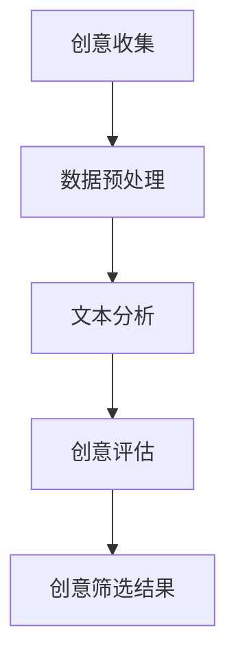
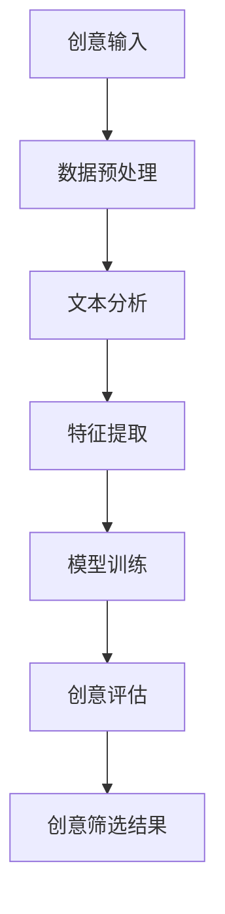
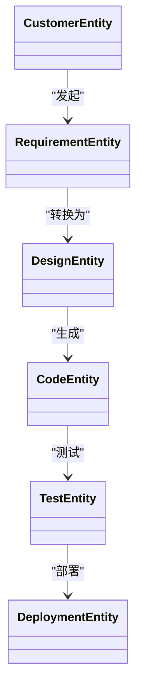
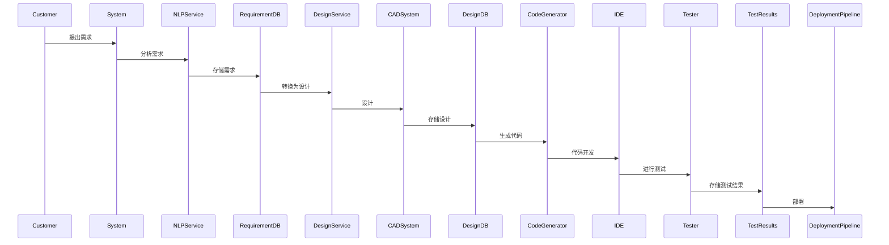
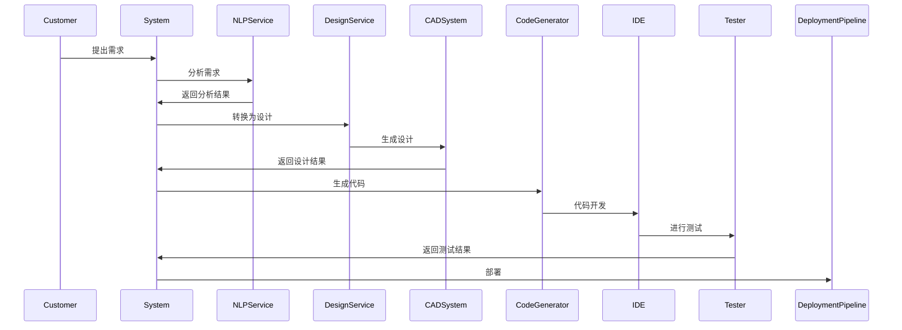
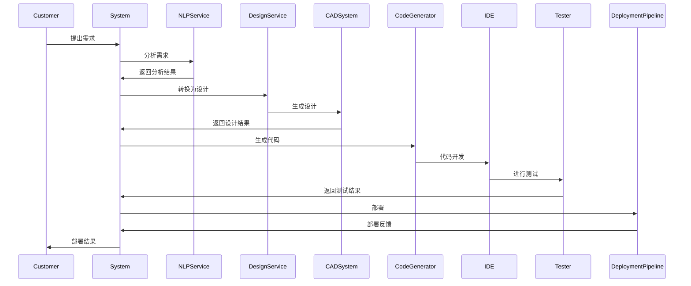
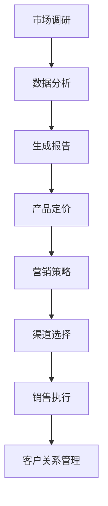
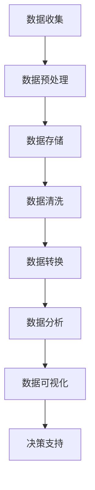
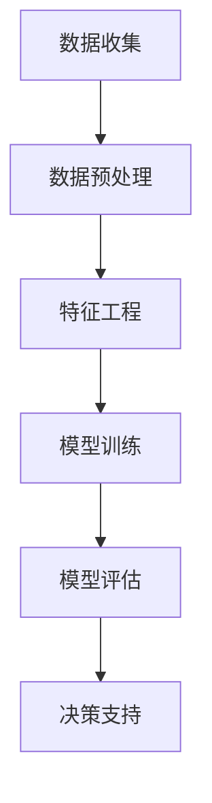

                 


## 第1章: 问题背景与核心概念

### 1.1 问题背景

在当今全球化、信息化、市场竞争日益激烈的背景下，企业创新管理已经成为企业竞争力和生存发展的关键因素。传统的创新管理方法往往依赖于经验判断和线性流程，难以适应快速变化的市场环境。随着人工智能（AI）技术的快速发展，如何利用AI技术提升企业创新管理的效率和质量，成为企业管理者面临的重要课题。

#### 问题描述

企业创新管理面临的主要问题包括：

1. **创意筛选效率低下**：在大量创意中，如何快速筛选出具有商业潜力的创新点，成为创新管理中的瓶颈。
2. **研发流程缺乏灵活性**：传统的研发流程往往固化，难以应对市场的快速变化，导致创新成果转化效率低下。
3. **商业化流程复杂**：从产品研发到市场推广，商业化流程中的各个环节复杂，且依赖大量人工操作，效率低下。
4. **数据驱动决策不足**：企业决策过程中，数据分析和利用不足，缺乏数据驱动的决策支持系统。

#### 问题解决

利用AI技术，企业创新管理可以在以下几个方面得到改善：

1. **智能化创意筛选**：通过自然语言处理（NLP）和机器学习算法，对创意进行智能筛选，提高创意筛选效率。
2. **自动化研发流程**：引入AI技术，实现研发流程的自动化，提高研发效率和质量。
3. **智能化商业化流程**：利用AI技术，优化商业化流程中的各个环节，提高商业化效率。
4. **数据驱动决策**：通过大数据分析和机器学习算法，为企业决策提供数据支持，实现数据驱动决策。

### 边界与外延

在本文中，我们主要探讨AI在以下领域的应用：

1. **创意筛选**：如何利用AI技术对创意进行智能筛选和分析。
2. **研发流程**：如何利用AI技术实现研发流程的自动化和智能化。
3. **商业化流程**：如何利用AI技术优化商业化流程，提高商业化效率。
4. **数据驱动决策**：如何通过大数据分析和机器学习算法，实现数据驱动决策。

本文将按照以下结构进行详细阐述：

1. **核心概念与联系**：介绍AI驱动的企业创新管理核心概念及其相互关系。
2. **算法原理讲解**：讲解AI技术在企业创新管理中的应用原理和算法流程。
3. **系统分析与架构设计**：分析AI驱动的企业创新管理系统架构和接口设计。
4. **项目实战**：通过实际项目展示AI驱动的企业创新管理应用案例。
5. **最佳实践与拓展**：总结最佳实践，提出注意事项，并推荐拓展阅读。

## 第2章: AI驱动的企业创新管理核心概念

### 2.1 创新管理概述

#### 概念说明

创新管理是指企业在创新过程中进行的管理活动，包括创意的产生、筛选、研发、商业化等环节。创新管理不仅关注技术创新，还涵盖商业模式创新、产品创新、服务创新等多个方面。

#### 问题背景

随着市场竞争的加剧，企业必须不断进行创新，以适应市场变化和客户需求。然而，传统的创新管理方法往往效率低下，难以满足企业快速创新的需求。因此，如何利用AI技术提升创新管理效率成为关键问题。

#### 问题解决

AI驱动的创新管理通过引入AI技术，实现以下目标：

1. **提高创意筛选效率**：利用自然语言处理（NLP）和机器学习算法，对创意进行智能筛选和分析，提高创意筛选效率。
2. **自动化研发流程**：利用AI技术，实现研发流程的自动化和智能化，提高研发效率和质量。
3. **优化商业化流程**：利用AI技术，优化商业化流程中的各个环节，提高商业化效率。
4. **数据驱动决策**：通过大数据分析和机器学习算法，为企业决策提供数据支持，实现数据驱动决策。

### 概念属性特征对比表格

| 概念 | 特征 |
| ---- | ---- |
| 创新管理 | 包含创意筛选、研发、商业化等环节 |
| AI驱动的创新管理 | 利用AI技术提高创新管理效率 |
| 创意筛选 | 利用NLP和机器学习算法 |
| 自动化研发流程 | 实现研发流程自动化 |
| 商业化流程优化 | 利用AI技术提高商业化效率 |
| 数据驱动决策 | 通过大数据分析和机器学习实现 |

### ER实体关系图架构

```mermaid
erDiagram
  ProductConcept --> R&DProcess : "impl."
  R&DProcess --> CommercializationProcess : "impl."
  MarketData --> DecisionMaking : "inputs"
  Creative --> CreativeScreening : "screened by"
  CreativeScreening --> R&DProcess : "selected for"
  R&DProcess --> CommercializationProcess : "developed into"
  CommercializationProcess --> MarketFeedback : "receives"
  MarketFeedback --> CreativeScreening : "feedback for"
```

在这个ER图架构中，展示了创新管理中的关键实体及其相互关系。ProductConcept表示产品创意，R&DProcess表示研发流程，CommercializationProcess表示商业化流程，MarketData表示市场数据，Creative表示创意，CreativeScreening表示创意筛选过程，MarketFeedback表示市场反馈。

## 算法原理讲解

### 智能化创意筛选算法

#### Mermaid流程图



#### Python源代码

```python
import pandas as pd
from sklearn.feature_extraction.text import TfidfVectorizer
from sklearn.metrics.pairwise import cosine_similarity

# 假设我们有一组创意文本
creatives = [
    "智能音箱的设计与功能优化",
    "智能家居系统的安全性提升",
    "智能手表的运动健康监测功能",
    "智能门锁的用户体验改进"
]

# 数据预处理
clean_creatives = [creative.lower().replace("\n", "") for creative in creatives]

# 文本分析
vectorizer = TfidfVectorizer()
tfidf_matrix = vectorizer.fit_transform(clean_creatives)

# 创意评估
cosine_similarities = cosine_similarity(tfidf_matrix)

# 创意筛选
sorted_similarities = cosine_similarities.argsort()[0][::-1]

# 筛选出最相关的创意
selected_creatives = [clean_creatives[i] for i in sorted_similarities]

print("筛选出的创意:")
for i, creative in enumerate(selected_creatives[:5]):
    print(f"{i+1}. {creative}")
```

#### 数学模型和公式

$$
\text{相似度} = \frac{\sum_{i=1}^{n} \text{词频} \times \text{逆文档频率}}{\sum_{i=1}^{n} \text{词频}}
$$

其中，$n$ 是文档集合中的词汇数量。

#### 通俗易懂的举例说明

假设我们有一组创意文本，分别是关于智能音箱、智能家居、智能手表和智能门锁的。我们首先对这些文本进行数据预处理，将它们转换为小写并去除换行符。然后，使用TF-IDF算法对这些文本进行文本分析，计算出它们之间的相似度。相似度越高的创意文本被认为更具相关性，从而被筛选出来。例如，如果我们想筛选出与“智能音箱”最相关的创意，那么“智能家居”和“智能手表”的创意可能会被优先考虑。

## 第3章: 创意筛选的智能化

### 3.1 创意的定义与类型

#### 概念说明

创意是指企业在创新过程中产生的具有新颖性和实用性的想法、方案或产品。创意可以是关于产品功能、设计、商业模式或服务改进的。创意的类型多样，包括但不限于技术创新、商业模式创新、产品创新和服务创新。

#### 问题背景

随着市场竞争的加剧，企业需要不断产生和筛选创意，以保持竞争优势。然而，传统的创意筛选方法往往依赖于人工评审，效率低下，且容易受到主观因素影响。

#### 问题解决

利用AI技术，可以实现创意筛选的智能化，提高筛选效率和准确性。AI技术可以帮助企业快速识别出具有商业潜力的创意，并对其进行分类和评估。

### 智能化创意筛选的原理与方法

#### Mermaid流程图



#### Python源代码

```python
import pandas as pd
from sklearn.feature_extraction.text import TfidfVectorizer
from sklearn.ensemble import RandomForestClassifier
from sklearn.model_selection import train_test_split

# 假设我们有一组创意文本和对应的评估结果
creatives = [
    "智能音箱的设计与功能优化",
    "智能家居系统的安全性提升",
    "智能手表的运动健康监测功能",
    "智能门锁的用户体验改进"
]

labels = [1, 0, 1, 0]  # 假设1表示具有商业潜力，0表示不具备商业潜力

# 数据预处理
clean_creatives = [creative.lower().replace("\n", "") for creative in creatives]

# 文本分析
vectorizer = TfidfVectorizer()
tfidf_matrix = vectorizer.fit_transform(clean_creatives)

# 特征提取
X = tfidf_matrix.toarray()
y = labels

# 模型训练
X_train, X_test, y_train, y_test = train_test_split(X, y, test_size=0.2, random_state=42)
clf = RandomForestClassifier(n_estimators=100, random_state=42)
clf.fit(X_train, y_train)

# 创意评估
predictions = clf.predict(X_test)

# 创意筛选
selected_creatives = [creative for creative, prediction in zip(clean_creatives, predictions) if prediction == 1]

print("筛选出的创意:")
for creative in selected_creatives:
    print(creative)
```

#### 数学模型和公式

$$
\text{特征提取} = \text{TF-IDF} \\
\text{模型训练} = \text{随机森林} \\
\text{创意评估} = \text{分类结果}
$$

#### 通俗易懂的举例说明

假设我们有一组创意文本和对应的评估结果，我们首先对这些文本进行数据预处理，将它们转换为小写并去除换行符。然后，使用TF-IDF算法对这些文本进行文本分析，提取出特征。接下来，使用随机森林算法对这些特征进行训练，以预测创意是否具有商业潜力。最后，根据分类结果，筛选出具有商业潜力的创意。

## 第4章: 研发流程的自动化

### 4.1 研发流程概述

#### 问题场景介绍

在现代企业中，研发流程的效率和质量直接关系到企业的竞争力和创新能力。传统的研发流程往往包含多个环节，如需求分析、设计、开发、测试、部署等，这些环节相互依赖且复杂。如何提高研发流程的自动化程度，降低人力成本，提高研发效率成为企业面临的重要挑战。

#### 项目介绍

为了解决上述问题，我们开展了一个研发流程自动化项目，目标是利用AI技术实现研发流程的各个环节自动化。项目的主要目标是：

1. **需求分析自动化**：通过自然语言处理技术，自动提取和分析用户需求。
2. **设计自动化**：利用计算机辅助设计（CAD）技术，实现设计环节的自动化。
3. **开发自动化**：使用代码生成技术，自动生成代码并优化开发过程。
4. **测试自动化**：利用自动化测试工具，实现测试环节的自动化。
5. **部署自动化**：通过CI/CD流水线，实现部署环节的自动化。

### 系统功能设计

#### 领域模型Mermaid类图



在这个类图中，展示了研发流程中涉及的主要实体及其相互关系。CustomerEntity表示客户，RequirementEntity表示需求，DesignEntity表示设计，CodeEntity表示代码，TestEntity表示测试，DeploymentEntity表示部署。

### 系统架构设计

#### Mermaid架构图



在这个架构图中，展示了研发流程自动化系统的整体架构。Customer通过System提出需求，NLPService分析需求并存储到RequirementDB，DesignService将需求转换为设计并存储到DesignDB，CodeGenerator生成代码并开发，Tester进行测试，最终TestResults存储测试结果并通过DeploymentPipeline进行部署。

### 系统接口设计

#### Mermaid序列图



在这个序列图中，展示了系统内部各组件之间的交互过程。Customer通过System提出需求，NLPService分析需求并返回分析结果，DesignService将需求转换为设计并返回设计结果，CodeGenerator生成代码并开发，Tester进行测试并返回测试结果，最后通过DeploymentPipeline进行部署。

### 系统交互Mermaid序列图



在这个序列图中，展示了客户与系统之间的完整交互过程。Customer提出需求，系统通过NLPService分析需求并返回分析结果，DesignService将需求转换为设计并返回设计结果，CodeGenerator生成代码并开发，Tester进行测试并返回测试结果，DeploymentPipeline进行部署并返回部署反馈，最后系统将部署结果告知Customer。

## 第5章: 商业化流程的智能化

### 5.1 商业化流程概述

#### 问题场景介绍

在产品从研发阶段过渡到市场推广的过程中，商业化流程扮演着至关重要的角色。商业化流程通常包括市场调研、产品定价、营销策略制定、渠道选择、销售执行、客户关系管理等多个环节。传统的商业化流程往往依赖于大量的手动操作和经验判断，这不仅效率低下，而且容易受到人为因素的影响，导致决策偏差和资源浪费。

#### 项目介绍

为了提升商业化流程的效率和质量，我们启动了一个商业化流程智能化项目。该项目旨在利用人工智能（AI）技术，自动化和智能化商业化流程的各个环节，从而实现以下目标：

1. **市场调研自动化**：通过AI分析市场数据，自动生成市场调研报告。
2. **产品定价智能化**：利用机器学习算法，根据市场数据和竞争对手定价策略，自动推荐最优价格。
3. **营销策略制定**：利用自然语言处理（NLP）和数据分析技术，自动生成营销策略。
4. **渠道选择优化**：通过分析客户行为和市场需求，智能推荐最佳销售渠道。
5. **销售执行自动化**：使用自动化工具和AI助手，提高销售效率。
6. **客户关系管理优化**：利用客户行为数据和AI分析，提供个性化服务，增强客户满意度。

### 智能化商业化流程的原理与技术

#### Mermaid流程图



在这个流程图中，展示了商业化流程的各个关键环节及其相互关系。市场调研通过数据分析生成报告，产品定价基于市场数据和竞争对手策略，营销策略通过NLP和数据分析制定，渠道选择基于客户行为和市场需求，销售执行使用自动化工具，客户关系管理通过AI分析提供个性化服务。

### 智能化商业化流程的应用实践

#### 实践案例

假设我们是一家生产智能家电的公司，我们的商业化流程智能化项目包括以下几个应用案例：

1. **市场调研自动化**：
   - 使用AI算法分析社交媒体、市场报告和新闻，自动生成市场趋势分析报告。
   - 根据报告内容，识别出目标客户群体和潜在市场机会。

2. **产品定价智能化**：
   - 利用机器学习算法，分析竞争对手的产品定价和市场反馈，自动推荐最优定价策略。
   - 定期调整产品价格，以适应市场变化和消费者需求。

3. **营销策略制定**：
   - 通过NLP技术，分析消费者评论和社交媒体内容，自动生成营销文案和推广策略。
   - 根据消费者行为数据，个性化推送营销活动，提高转化率。

4. **渠道选择优化**：
   - 通过分析客户购买行为和市场需求，智能推荐最佳销售渠道，如在线电商平台、线下零售店等。
   - 根据渠道反馈，调整销售策略，优化渠道组合。

5. **销售执行自动化**：
   - 使用AI助手和自动化工具，简化销售流程，提高销售效率。
   - 通过销售数据分析，识别销售瓶颈和改进机会。

6. **客户关系管理优化**：
   - 利用AI分析客户行为数据，提供个性化服务，增强客户满意度和忠诚度。
   - 通过客户生命周期分析，预测客户流失风险，采取预防措施。

通过这些智能化措施，我们公司的商业化流程得到了显著优化，市场调研更加精准，产品定价更合理，营销策略更具针对性，销售执行更加高效，客户关系管理更加完善。这些改进不仅提高了商业化流程的效率，还增强了我们的市场竞争力。

### 智能化商业化流程的优势

1. **提高决策效率**：通过自动化和智能化，商业决策过程更加快速和准确。
2. **降低运营成本**：减少人工操作，降低运营成本，提高资源利用效率。
3. **提升客户满意度**：个性化服务提高客户满意度和忠诚度，增强品牌竞争力。
4. **增强市场响应速度**：实时分析市场数据和客户反馈，快速调整策略，提高市场响应速度。

### 总结

通过AI驱动的商业化流程，企业能够更加高效地完成市场调研、产品定价、营销策略制定、渠道选择、销售执行和客户关系管理。这些智能化措施不仅提高了企业的运营效率，还增强了市场竞争力，为企业的可持续发展奠定了基础。

## 第6章: 数据驱动决策

### 6.1 数据驱动决策概述

#### 问题背景

在当今信息爆炸的时代，企业面临着海量的数据。然而，如何从这些数据中提取有价值的信息，并将其转化为实际的决策支持，成为企业面临的重大挑战。传统的决策往往依赖于经验和直觉，难以应对复杂多变的市场环境。因此，数据驱动决策成为企业提升竞争力的重要手段。

#### 问题解决

数据驱动决策通过利用大数据和人工智能技术，将数据转化为可操作的洞见和决策支持。这种方法能够帮助企业：

1. **发现隐藏的模式和趋势**：通过数据分析，企业可以发现数据中的潜在价值和隐藏的模式。
2. **优化决策过程**：数据驱动决策提供了更为准确和客观的决策依据，减少了主观因素的影响。
3. **提高运营效率**：通过数据分析和预测，企业可以优化运营流程，减少浪费，提高效率。
4. **增强市场竞争力**：基于数据驱动的决策能够帮助企业更好地适应市场变化，抓住市场机会。

### 数据分析技术在企业中的应用

#### Mermaid流程图



在这个流程图中，展示了数据分析技术在企业中的应用步骤。首先，企业通过多种渠道收集数据，然后进行数据预处理，包括数据存储、清洗和转换。接下来，利用数据分析工具进行深入分析，最后通过数据可视化，为企业提供决策支持。

### 智能化数据驱动决策流程

#### Mermaid流程图



在这个流程图中，展示了智能化数据驱动决策的核心步骤。首先，通过数据预处理，确保数据的质量和一致性。然后，进行特征工程，提取数据中的关键特征。接下来，使用机器学习模型进行训练，并评估模型的性能。最后，利用训练好的模型，为企业提供决策支持。

### Python源代码示例

```python
import pandas as pd
from sklearn.model_selection import train_test_split
from sklearn.ensemble import RandomForestClassifier
from sklearn.metrics import accuracy_score

# 假设我们有一组数据集
data = pd.DataFrame({
    'feature1': [1, 2, 3, 4, 5],
    'feature2': [10, 20, 30, 40, 50],
    'target': [0, 1, 0, 1, 0]
})

# 数据预处理
X = data[['feature1', 'feature2']]
y = data['target']

# 特征工程
# 这里假设特征工程很简单，仅进行归一化处理
X_normalized = (X - X.mean()) / X.std()

# 模型训练
X_train, X_test, y_train, y_test = train_test_split(X_normalized, y, test_size=0.2, random_state=42)
model = RandomForestClassifier(n_estimators=100, random_state=42)
model.fit(X_train, y_train)

# 模型评估
y_pred = model.predict(X_test)
accuracy = accuracy_score(y_test, y_pred)
print(f"Model accuracy: {accuracy:.2f}")
```

在这个示例中，我们首先创建一个简单的数据集，然后进行数据预处理，包括特征工程和模型训练。接下来，使用训练好的模型进行预测，并评估模型的准确性。

### 通俗易懂的举例说明

假设我们是一家零售公司，想要根据顾客的购买行为数据预测其购买意向。我们收集了顾客的年龄、收入、购物频率等数据，并将其输入到机器学习模型中。模型通过分析这些特征，可以预测顾客是否会在未来一个月内购买商品。基于这个预测结果，我们可以采取相应的营销策略，如发送优惠券、推荐商品等，以提升销售额。

### 数据驱动决策的优势

1. **提高决策准确性**：基于数据分析，决策过程更加客观和准确，减少了主观判断的误差。
2. **优化资源分配**：通过数据分析和预测，企业可以更合理地分配资源，减少浪费。
3. **提高响应速度**：实时数据分析帮助企业更快地响应市场变化，抓住商机。
4. **增强竞争力**：数据驱动决策帮助企业更好地了解市场和客户需求，提升市场竞争力。

### 总结

数据驱动决策是企业实现智能化管理和持续创新的关键。通过充分利用大数据和人工智能技术，企业可以更好地理解市场趋势，优化决策过程，提高运营效率和竞争力。在未来的商业环境中，数据驱动决策将成为企业成功的必备要素。

## 第7章: 智能化企业创新管理的未来展望

### 7.1 智能化企业创新管理的发展趋势

#### 问题背景

随着人工智能技术的不断进步，智能化企业创新管理正成为企业管理的重要方向。当前，人工智能在数据驱动决策、自动化流程和智能化分析等方面已经展现出显著的应用效果。然而，随着技术的进一步发展，智能化企业创新管理将面临新的挑战和机遇。

#### 发展趋势

1. **深度学习与自我学习**：深度学习技术的快速发展将使得AI系统能够进行更复杂的模式识别和预测，同时，自我学习能力将使得AI系统可以不断优化自身，提高创新效率。

2. **跨界融合**：智能化企业创新管理将不仅仅是单一技术的应用，而是多种技术的融合。如物联网、大数据、云计算等技术与AI技术的结合，将为企业带来更为全面的创新解决方案。

3. **人机协同**：随着AI技术的发展，人机协同将成为未来智能化企业创新管理的核心。通过AI技术辅助人类进行决策和创新，将大幅提高创新效率和质量。

4. **个性化定制**：基于大数据和AI分析，企业将能够更好地了解客户需求，提供个性化的创新解决方案，从而提高客户满意度和忠诚度。

### 智能化企业创新管理面临的挑战与机遇

#### 挑战

1. **技术挑战**：智能化企业创新管理需要处理海量数据，并对这些数据进行复杂分析和预测。这要求企业具备强大的数据处理和分析能力，同时，技术迭代速度也要求企业能够快速适应新技术。

2. **数据隐私与安全**：随着数据驱动决策的广泛应用，数据隐私和安全问题日益凸显。如何确保数据的安全性和隐私性，成为企业需要面对的重要挑战。

3. **人才短缺**：智能化企业创新管理需要大量的技术人才，包括数据科学家、AI工程师等。然而，当前市场对这些人才的需求远大于供给，人才短缺成为企业推进智能化创新管理的主要瓶颈。

#### 机遇

1. **提高创新效率**：智能化企业创新管理能够通过自动化和智能化手段，大幅提高创新效率，缩短创新周期。

2. **降低创新成本**：AI技术的应用可以帮助企业降低研发成本，同时，通过数据分析和预测，减少创新过程中的不确定性。

3. **增强市场竞争力**：智能化企业创新管理能够帮助企业更好地了解市场趋势和客户需求，快速响应市场变化，增强市场竞争力。

### 智能化企业创新管理的最佳实践与策略

#### 最佳实践

1. **建立数据驱动文化**：企业需要建立数据驱动的决策文化，鼓励员工利用数据进行决策，并推动数据素养的提升。

2. **投资AI技术**：企业应加大对AI技术的投资，引进先进的技术和工具，提升数据处理和分析能力。

3. **跨部门协作**：智能化企业创新管理需要跨部门的协作，通过建立跨部门团队，促进知识共享和资源整合。

4. **持续学习与优化**：企业应持续关注AI技术的发展动态，不断优化智能化创新管理流程，提高创新效率。

#### 策略

1. **明确创新目标**：企业需要明确自身的创新目标，确保智能化创新管理策略与企业的战略目标一致。

2. **人才引进与培养**：企业应积极引进AI技术人才，同时，通过培训和内部培养，提升现有员工的技能水平。

3. **数据安全与隐私保护**：企业应制定严格的数据安全与隐私保护政策，确保数据的安全性和合规性。

4. **持续创新与迭代**：企业应建立持续创新机制，通过不断迭代和优化，保持企业的创新活力。

### 总结

智能化企业创新管理是未来企业发展的必然趋势。通过利用人工智能技术，企业可以提高创新效率、降低创新成本、增强市场竞争力。然而，企业在推进智能化创新管理过程中也将面临一系列挑战。只有通过最佳实践和策略，才能实现智能化企业创新管理的持续发展，为企业创造更大的价值。

### 附录

#### 实践案例

以下是几个成功的智能化企业创新管理案例：

1. **谷歌**：谷歌通过其“Google Brain”项目，利用深度学习技术，推动了搜索引擎、语音识别、图像识别等多个领域的创新。

2. **特斯拉**：特斯拉通过智能化制造和数据分析，实现了汽车生产的自动化和个性化，大幅提高了生产效率。

3. **阿里巴巴**：阿里巴巴利用大数据和人工智能技术，优化了其电子商务平台，提高了营销效率和客户满意度。

#### 拓展阅读

1. **《人工智能：一种现代方法》**：这本书详细介绍了人工智能的基本原理和方法，适合对AI技术感兴趣的读者。

2. **《数据科学实战》**：这本书通过实际案例，介绍了数据科学的基本原理和应用，适合希望了解数据驱动的企业创新管理的读者。

3. **《智能时代的创新管理》**：这本书探讨了智能化时代企业创新管理的新模式和新方法，为企业管理者提供了有价值的参考。

### 作者信息

**作者：AI天才研究院/AI Genius Institute & 禅与计算机程序设计艺术 /Zen And The Art of Computer Programming**

