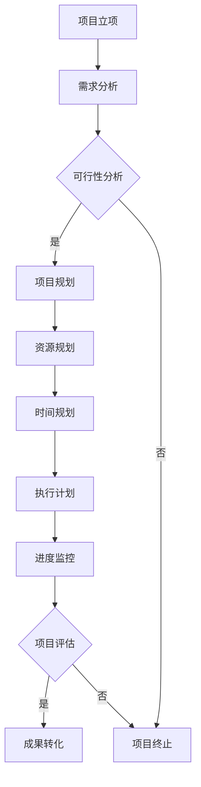
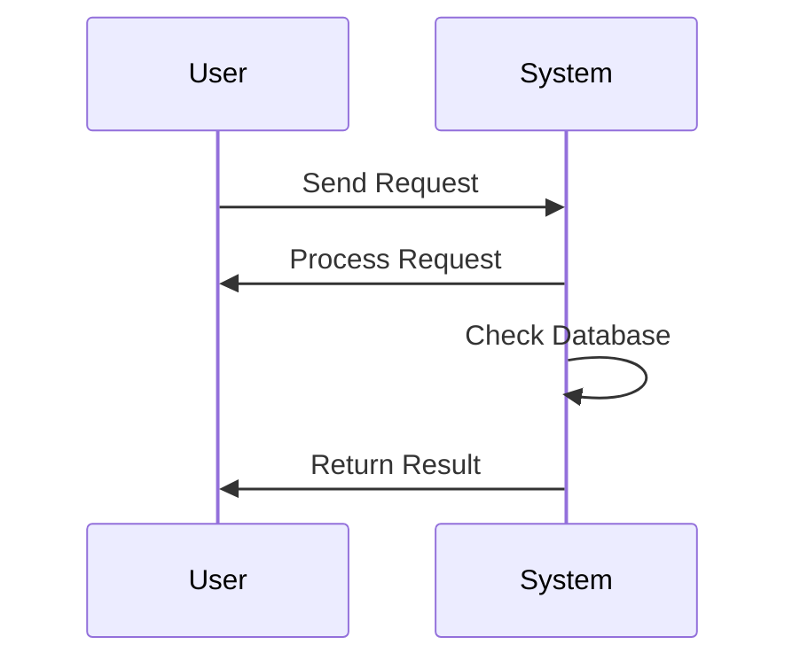
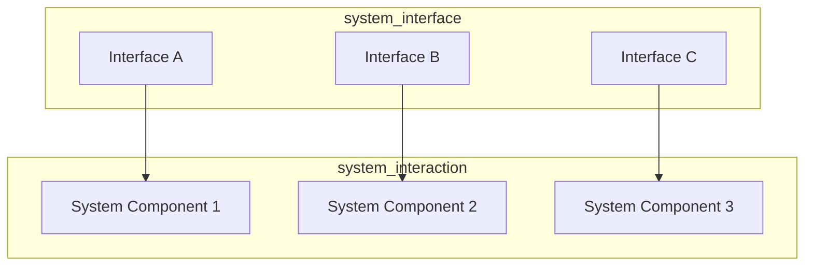

                 


### AI驱动的企业创新项目管理：从立项到商业化

> 关键词：人工智能，项目管理，企业创新，立项，商业化

> 摘要：本文深入探讨了AI驱动的企业创新项目管理，从项目立项到商业化全过程的实践方法与策略。通过分析核心概念、原理、系统架构和实战案例，为企业管理者提供了一套系统化、可操作的管理方案。

----------------------------------------------------------------

## 引言

在当今快速变化的市场环境中，企业创新已成为保持竞争力的关键。然而，创新项目管理的复杂性和不确定性使得许多企业在实施过程中面临重重挑战。AI技术的崛起为企业创新项目管理带来了新的机遇，通过数据分析和智能决策，AI能够显著提高项目管理的效率和质量。

本文旨在探讨如何利用AI驱动企业创新项目从立项到商业化的全过程。我们将首先介绍相关背景知识，然后逐步解析每个阶段的关键要素和实践方法，最后通过实际案例进行分析，提供最佳实践和拓展阅读。

----------------------------------------------------------------

### 第一部分：AI驱动的企业创新项目管理概述

#### 1.1 AI驱动的企业创新项目管理背景与挑战

#### 1.1.1 企业创新项目的现状与问题

在现代企业中，创新项目已成为推动业务增长和竞争的重要手段。然而，传统的项目管理方法往往难以应对创新项目的高不确定性和复杂性。首先，大多数企业面临的问题是项目目标不明确，缺乏清晰的愿景和规划。其次，资源分配不当、时间管理不足和沟通不畅等问题也普遍存在。

#### 1.1.2 AI在项目管理和创新中的应用潜力

AI技术在项目管理和创新中的应用潜力巨大。通过机器学习算法，AI能够从历史数据中学习并预测项目发展趋势，提供更加精准的规划方案。此外，自然语言处理技术可以帮助管理者更好地理解和处理项目相关的文本数据，提升沟通效率。决策支持系统则能利用AI分析数据，为企业提供智能化的决策依据。

#### 1.1.3 AI驱动的企业创新项目管理的基本框架

AI驱动的企业创新项目管理框架通常包括以下几个关键步骤：

1. **需求分析与项目立项**：利用AI技术进行市场调研和分析，确定项目目标和可行性。
2. **规划与资源分配**：基于AI算法进行项目规划，优化资源分配和时间管理。
3. **执行与监控**：利用AI工具监控项目进展，实时调整计划，确保项目按期完成。
4. **评估与改进**：通过AI技术对项目成果进行评估，识别改进机会，为未来项目提供参考。

### 1.2 AI驱动的企业创新项目核心概念与原理

#### 1.2.1 AI驱动的项目管理的核心概念

AI驱动的项目管理涉及多个核心概念，包括机器学习、自然语言处理、数据挖掘和智能决策等。这些概念相互关联，共同构成了AI驱动的项目管理体系。

- **机器学习**：通过算法从数据中学习规律，预测项目趋势和风险。
- **自然语言处理**：理解和生成自然语言，用于文本分析和智能沟通。
- **数据挖掘**：从大量数据中提取有价值的信息，支持项目规划和决策。
- **智能决策**：利用AI技术分析数据，提供最佳决策方案。

#### 1.2.2 AI驱动的项目管理的方法与工具

AI驱动的项目管理方法主要包括以下几个步骤：

1. **需求分析与预测**：使用机器学习模型分析市场数据，预测项目趋势。
2. **项目规划与优化**：利用自然语言处理技术生成项目计划书，结合数据挖掘结果进行优化。
3. **资源调度与优化**：使用算法优化资源分配，提高资源利用率。
4. **风险管理与监控**：利用数据挖掘和机器学习技术识别潜在风险，实时监控项目进展。

### 1.3 AI驱动的企业创新项目案例分析

#### 1.3.1 案例一：某科技公司的AI驱动项目实施

#### 1.3.2 案例二：某制造企业的AI驱动机器人项目

#### 1.3.3 案例三：某金融机构的AI驱动的风险评估项目

#### 1.4 AI驱动的企业创新项目管理最佳实践

#### 1.4.1 最佳实践一：如何制定AI驱动的项目规划

#### 1.4.2 最佳实践二：如何实施AI驱动的项目监控

#### 1.4.3 最佳实践三：如何评估AI驱动的项目成果

## 1.5 本章小结

通过对AI驱动的企业创新项目管理的背景、核心概念和案例分析，我们了解到AI技术在项目管理中的应用不仅能够提高项目效率，还能为企业的创新提供强有力的支持。在接下来的章节中，我们将进一步探讨AI驱动的项目管理的具体实践方法，帮助读者更好地理解和应用这一技术。

----------------------------------------------------------------

## 第一部分：AI驱动的企业创新项目管理概述

### 1.1 AI驱动的企业创新项目管理背景与挑战

#### 1.1.1 企业创新项目的现状与问题

在现代商业环境中，创新被视为企业保持竞争力和持续发展的关键。因此，越来越多的企业开始投资于创新项目，试图通过创新来抢占市场先机。然而，创新项目并非一帆风顺，许多企业在项目管理过程中面临着一系列挑战。

首先，项目目标不明确是一个普遍存在的问题。在许多情况下，企业对项目的期望和目标不够清晰，导致项目在执行过程中出现偏差。这种目标不明确的问题可能会导致资源浪费、进度延误以及最终项目失败。

其次，资源分配不当也是一个常见问题。在创新项目中，资源的有效利用至关重要。然而，很多企业在项目启动时并没有充分评估所需的资源，导致资源分配不合理，进而影响项目的顺利进行。

时间管理不足和沟通不畅也是创新项目管理的常见问题。创新项目往往具有较高复杂性和不确定性，因此对时间管理和沟通协调的要求更高。然而，许多企业在项目执行过程中缺乏有效的监控和沟通机制，导致项目进度延误、质量下降。

#### 1.1.2 AI在项目管理和创新中的应用潜力

AI技术的发展为解决上述问题提供了新的可能性。AI能够从大量数据中学习，提取有价值的信息，帮助企业更准确地预测项目发展趋势，优化资源分配，提高时间管理效率，并改善沟通效果。以下是AI在项目管理和创新中应用的一些潜力：

1. **需求分析与预测**：通过机器学习算法，AI可以从历史数据和市场趋势中学习，预测项目的需求和发展方向。这有助于企业在项目立项阶段明确目标，减少项目执行过程中的偏差。

2. **项目规划与优化**：AI能够利用自然语言处理技术，从文本数据中提取关键信息，生成详细的项目计划书。此外，AI还可以通过数据挖掘技术，分析项目历史数据和现有资源，提供最优的规划方案。

3. **资源调度与优化**：AI可以实时分析项目的资源使用情况，通过优化算法，自动调整资源分配，提高资源利用率。例如，AI可以根据项目需求，动态调整团队成员的工作任务和优先级。

4. **风险管理与监控**：AI能够从大量数据中挖掘潜在的风险因素，并实时监控项目进展，提供预警和解决方案。这有助于企业提前识别和应对潜在问题，降低项目失败的风险。

5. **沟通与协作**：AI可以帮助企业改善沟通效果，提高团队协作效率。例如，自然语言处理技术可以自动整理会议记录、分析讨论内容，帮助团队成员更好地理解和执行项目任务。

#### 1.1.3 AI驱动的企业创新项目管理的基本框架

AI驱动的企业创新项目管理框架通常包括以下几个关键步骤：

1. **需求分析与项目立项**：利用AI技术进行市场调研和分析，确定项目目标和可行性。
2. **规划与资源分配**：基于AI算法进行项目规划，优化资源分配和时间管理。
3. **执行与监控**：利用AI工具监控项目进展，实时调整计划，确保项目按期完成。
4. **评估与改进**：通过AI技术对项目成果进行评估，识别改进机会，为未来项目提供参考。

### 1.2 AI驱动的企业创新项目核心概念与原理

#### 1.2.1 AI驱动的项目管理的核心概念

AI驱动的项目管理涉及多个核心概念，包括机器学习、自然语言处理、数据挖掘和智能决策等。这些概念相互关联，共同构成了AI驱动的项目管理体系。

- **机器学习**：机器学习是AI的核心技术之一，通过算法从数据中学习规律，预测项目趋势和风险。常见的机器学习算法包括线性回归、决策树、随机森林、支持向量机等。
- **自然语言处理**：自然语言处理（NLP）是AI的重要组成部分，用于理解和生成自然语言。NLP技术在项目管理和创新中的应用包括文本分析、情感分析、命名实体识别等。
- **数据挖掘**：数据挖掘是从大量数据中提取有价值的信息和知识的过程。数据挖掘在项目管理中的应用包括需求分析、资源优化、风险评估等。
- **智能决策**：智能决策是AI驱动的项目管理的核心目标，通过分析数据和提供决策支持，帮助企业做出更明智的决策。智能决策系统通常包括预测模型、优化算法和决策支持工具。

#### 1.2.2 AI驱动的项目管理的方法与工具

AI驱动的项目管理方法主要包括以下几个步骤：

1. **需求分析与预测**：使用机器学习模型分析市场数据，预测项目的需求和发展趋势。例如，可以通过线性回归分析预测市场需求，使用决策树模型预测项目风险等。
2. **项目规划与优化**：利用自然语言处理技术生成项目计划书，结合数据挖掘结果进行优化。例如，可以通过文本分析提取项目关键信息，使用聚类算法优化项目任务分配等。
3. **资源调度与优化**：使用算法优化资源分配，提高资源利用率。例如，可以通过遗传算法优化项目进度安排，使用线性规划优化资源分配等。
4. **风险管理与监控**：通过数据挖掘和机器学习技术识别潜在风险，实时监控项目进展，提供预警和解决方案。例如，可以通过时间序列分析预测项目进度延误，使用分类算法识别项目风险等。

#### 1.2.3 AI驱动的项目管理与传统项目管理的对比

与传统项目管理相比，AI驱动的项目管理具有以下几个显著优势：

1. **更高的准确性**：AI驱动的项目管理能够从大量数据中学习，提供更准确的需求预测、资源分配和风险评估。
2. **更优的效率**：AI驱动的项目管理能够自动完成许多重复性和繁琐的任务，提高工作效率，减少人为错误。
3. **更好的适应性**：AI驱动的项目管理能够实时分析项目进展，快速调整计划，适应项目变化。
4. **更全面的视角**：AI驱动的项目管理能够综合考虑各种因素，提供更全面的决策支持。

然而，AI驱动的项目管理也存在一定的局限性，例如对数据质量和算法选择的要求较高，需要专业的技术支持和投入。此外，AI驱动的项目管理还需要与传统的项目管理方法相结合，以充分发挥其优势。

#### 1.2.4 AI驱动的项目管理应用案例

以下是一些AI驱动的企业创新项目管理的实际应用案例：

1. **金融行业的风险评估**：金融机构通过AI技术对金融市场的历史数据进行挖掘和分析，预测市场趋势和风险，为投资决策提供支持。
2. **制造业的供应链管理**：制造企业利用AI技术优化供应链管理，通过预测需求和优化库存，提高供应链的效率和灵活性。
3. **医疗行业的疾病预测**：医疗机构通过AI技术分析患者的医疗记录，预测疾病发展趋势，提供个性化的治疗方案。

### 1.3 AI驱动的企业创新项目案例分析

为了更好地理解AI驱动的企业创新项目管理的实际应用，以下我们将介绍三个案例，分别来自不同行业。

#### 1.3.1 案例一：某科技公司的AI驱动项目实施

某科技公司正在开发一款智能语音助手，旨在提高用户的生活便利性。为了确保项目的成功，公司决定采用AI驱动的项目管理方法。

首先，公司使用机器学习算法对大量用户语音数据进行训练，建立语音识别模型。通过分析用户的使用习惯和需求，公司能够更准确地预测用户对语音助手的期望功能，为项目规划提供依据。

在项目规划阶段，公司利用自然语言处理技术生成项目计划书，包括任务分配、时间表和资源需求。同时，通过数据挖掘技术分析项目历史数据，识别潜在风险并制定相应的风险管理计划。

在项目执行阶段，公司使用AI工具监控项目进展，实时调整计划。例如，当项目进度滞后时，AI工具会自动分析原因，提出优化建议，帮助团队加快进度。

项目完成后，公司使用AI技术对项目成果进行评估，收集用户反馈，进一步优化智能语音助手的功能和用户体验。

#### 1.3.2 案例二：某制造企业的AI驱动机器人项目

某制造企业决定引入AI驱动的机器人技术，以提高生产效率和降低成本。为了确保项目的成功，企业决定采用AI驱动的项目管理方法。

首先，企业使用机器学习算法分析生产数据，建立机器人控制的优化模型。通过分析机器人的操作数据和产品生产数据，企业能够预测机器人的最优操作策略，提高生产效率。

在项目规划阶段，企业利用自然语言处理技术生成项目计划书，包括任务分配、时间表和资源需求。同时，通过数据挖掘技术分析项目历史数据，识别潜在风险并制定相应的风险管理计划。

在项目执行阶段，企业使用AI工具监控项目进展，实时调整计划。例如，当机器人的性能下降时，AI工具会自动分析原因，提出优化建议，帮助团队提高机器人性能。

项目完成后，企业使用AI技术对项目成果进行评估，分析机器人的生产效率和成本降低情况，为未来的项目提供参考。

#### 1.3.3 案例三：某金融机构的AI驱动的风险评估项目

某金融机构决定利用AI技术对贷款申请者进行风险评估，以提高贷款审批的准确性和效率。为了确保项目的成功，金融机构决定采用AI驱动的项目管理方法。

首先，金融机构使用机器学习算法分析大量贷款申请者的历史数据，建立风险评估模型。通过分析申请者的信用记录、收入水平、就业情况等数据，模型能够预测申请者的信用风险。

在项目规划阶段，金融机构利用自然语言处理技术生成项目计划书，包括任务分配、时间表和资源需求。同时，通过数据挖掘技术分析项目历史数据，识别潜在风险并制定相应的风险管理计划。

在项目执行阶段，金融机构使用AI工具监控项目进展，实时调整计划。例如，当贷款申请者提交新的数据时，AI工具会自动更新风险评估模型，提供更准确的评估结果。

项目完成后，金融机构使用AI技术对项目成果进行评估，分析贷款审批的准确性和效率提升情况，为未来的项目提供参考。

### 1.4 AI驱动的企业创新项目管理最佳实践

为了确保AI驱动的企业创新项目能够取得成功，以下是一些最佳实践和建议：

1. **明确项目目标和需求**：在项目启动前，确保项目目标和需求清晰明确，避免项目执行过程中的偏差和风险。
2. **数据质量和预处理**：确保数据质量，进行充分的预处理，以减少模型训练的错误和不准确。
3. **持续学习和优化**：AI驱动的项目管理需要持续学习和优化，定期更新模型和算法，以适应项目变化和改进效果。
4. **团队协作和沟通**：建立有效的团队协作和沟通机制，确保项目团队能够高效地协作和沟通，提高项目执行效率。
5. **风险管理**：建立全面的风险管理机制，识别潜在风险，制定相应的风险管理计划和应对措施。
6. **培训和技术支持**：为项目团队成员提供必要的培训和技术支持，确保他们能够熟练使用AI工具和算法，提高项目成功率。

### 1.5 本章小结

通过对AI驱动的企业创新项目管理的背景、核心概念和案例分析的探讨，我们了解到AI技术在项目管理中的应用潜力巨大。通过利用AI技术，企业能够更准确地预测项目需求、优化资源分配、提高项目执行效率和降低风险。然而，AI驱动的项目管理也需要面对数据质量、算法选择和团队协作等挑战。未来的研究可以进一步探讨如何更好地结合AI技术和传统项目管理方法，提高项目的成功率。

----------------------------------------------------------------

## 第二部分：AI驱动的项目立项

### 2.1 项目立项的重要性

项目立项是企业创新项目管理中的关键环节，是项目成功与否的基石。项目立项的主要任务是确定项目的目标、范围、可行性以及制定初步的项目计划。一个良好的立项阶段能够确保项目在后续阶段顺利进行，降低风险，提高成功率。

AI技术在项目立项中的应用主要体现在以下几个方面：

1. **需求分析与预测**：通过机器学习算法分析市场数据、用户反馈和历史项目数据，预测项目需求和发展趋势，确保项目目标与市场需求相匹配。
2. **可行性分析**：利用数据挖掘技术分析项目相关的数据，评估项目的可行性，识别潜在的风险和挑战。
3. **资源评估**：通过算法优化资源分配，预测项目所需的资源，包括人力、资金和设备等，确保资源合理配置。
4. **风险评估**：利用AI技术对项目风险进行评估，提前识别可能的风险点，制定相应的风险应对策略。

### 2.2 需求分析与预测

需求分析是项目立项的核心环节，它关系到项目的目标和范围。AI技术能够通过机器学习算法对市场数据、用户反馈和历史项目数据进行分析，预测项目需求和发展趋势。

#### 2.2.1 市场数据分析

市场数据分析是需求分析的重要部分。通过分析市场数据，如销售额、用户行为数据、竞争对手产品等信息，企业可以了解市场的趋势和需求。具体步骤如下：

1. **数据收集**：收集市场相关的数据，包括市场报告、用户调查、竞争对手分析等。
2. **数据预处理**：对收集到的数据进行清洗、整理和归一化处理，为后续的机器学习算法提供高质量的数据。
3. **特征提取**：从原始数据中提取关键特征，如用户年龄、购买行为、产品评价等，为需求预测提供依据。
4. **模型训练**：使用机器学习算法，如线性回归、决策树、支持向量机等，对特征进行训练，建立需求预测模型。

#### 2.2.2 用户反馈分析

用户反馈是需求分析的另一个重要来源。通过分析用户反馈，企业可以了解用户对产品的需求、期望和不满。具体步骤如下：

1. **数据收集**：收集用户反馈数据，包括用户评论、问卷调查、社交媒体反馈等。
2. **情感分析**：使用自然语言处理技术对用户反馈进行情感分析，识别用户的情感倾向，如满意、不满意、中立等。
3. **主题模型**：使用主题模型（如LDA）对用户反馈进行主题提取，识别用户关注的主题，如产品功能、用户体验等。
4. **需求预测**：结合市场数据和用户反馈，使用机器学习算法建立需求预测模型，预测用户未来可能的需求。

#### 2.2.3 历史项目数据

历史项目数据是需求分析的重要参考。通过分析历史项目的需求变化、项目成功和失败案例，企业可以总结需求规律，预测未来项目的需求。具体步骤如下：

1. **数据收集**：收集历史项目数据，包括项目范围、需求变化、项目进度、项目成果等。
2. **特征提取**：从历史项目数据中提取关键特征，如项目规模、项目类型、需求变更次数等。
3. **关联分析**：使用关联规则挖掘算法（如Apriori算法），分析项目需求之间的关联关系，预测未来项目的需求。
4. **需求预测**：结合市场数据和用户反馈，使用机器学习算法建立需求预测模型，预测未来项目的需求。

### 2.3 可行性分析

项目可行性分析是项目立项的关键环节，它关系到项目的可行性、资源需求和潜在风险。AI技术能够通过数据挖掘和分析，评估项目的可行性，识别潜在的风险和挑战。

#### 2.3.1 数据收集

在进行可行性分析时，需要收集与项目相关的各种数据，包括市场数据、技术数据、财务数据等。具体步骤如下：

1. **市场数据**：收集市场报告、行业趋势、竞争对手信息等，评估项目的市场前景。
2. **技术数据**：收集项目所需的技术数据，如硬件设备、软件工具、技术规范等，评估项目的技术可行性。
3. **财务数据**：收集项目的财务数据，如预算、投资回报率、成本效益等，评估项目的财务可行性。

#### 2.3.2 数据分析

收集到相关数据后，需要进行数据分析，评估项目的可行性。具体步骤如下：

1. **数据预处理**：对收集到的数据清洗、整理和归一化处理，为后续的数据挖掘和分析提供高质量的数据。
2. **关联分析**：使用关联规则挖掘算法（如Apriori算法），分析不同数据之间的关系，识别项目的潜在风险。
3. **回归分析**：使用回归分析模型，预测项目成本、投资回报率等关键指标，评估项目的可行性。

#### 2.3.3 潜在风险识别

通过数据分析，可以识别项目的潜在风险和挑战。具体步骤如下：

1. **风险分类**：根据项目的特点，将风险分为市场风险、技术风险、财务风险等类别。
2. **风险分析**：对每个风险类别进行分析，识别可能导致风险的因素，如市场变化、技术瓶颈、成本超支等。
3. **风险应对策略**：针对每个潜在风险，制定相应的风险应对策略，降低项目风险。

### 2.4 资源评估

在项目立项阶段，资源评估是一个重要的环节，它关系到项目的成本、进度和质量。AI技术能够通过数据挖掘和优化算法，预测项目所需的资源，确保资源的合理配置。

#### 2.4.1 人力资源评估

人力资源评估主要涉及项目所需的人员数量、技能水平和能力。具体步骤如下：

1. **数据收集**：收集项目团队成员的相关数据，包括技能水平、工作经验、工作负荷等。
2. **数据分析**：使用数据分析方法，如聚类分析、关联分析等，识别项目所需的关键技能和能力。
3. **资源优化**：使用优化算法，如遗传算法、线性规划等，优化团队成员的分配，确保人力资源的充分利用。

#### 2.4.2 财务资源评估

财务资源评估主要涉及项目的预算、投资回报率等。具体步骤如下：

1. **数据收集**：收集项目相关的财务数据，如预算、成本、收益等。
2. **数据分析**：使用数据分析方法，如回归分析、时间序列分析等，预测项目的财务状况。
3. **资源优化**：使用优化算法，如线性规划、目标规划等，优化项目的预算和投资回报率。

#### 2.4.3 物资资源评估

物资资源评估主要涉及项目所需的设备和材料。具体步骤如下：

1. **数据收集**：收集项目所需的设备和材料数据，包括规格、价格、数量等。
2. **数据分析**：使用数据分析方法，如聚类分析、关联分析等，识别项目所需的设备和材料。
3. **资源优化**：使用优化算法，如遗传算法、粒子群算法等，优化设备和材料的采购和分配。

### 2.5 风险评估

风险评估是项目立项阶段的重要环节，它关系到项目的成功和可持续发展。AI技术能够通过数据挖掘和机器学习，识别项目的潜在风险，提供风险预测和评估。

#### 2.5.1 风险识别

风险识别是风险评估的第一步，主要任务是识别项目的潜在风险。具体步骤如下：

1. **数据收集**：收集项目相关的数据，包括市场数据、技术数据、财务数据等。
2. **数据分析**：使用数据分析方法，如关联分析、回归分析等，识别项目的潜在风险。
3. **风险分类**：根据风险的特点，将风险分为市场风险、技术风险、财务风险等类别。

#### 2.5.2 风险评估

风险评估是识别项目风险后，对风险进行评估的过程。具体步骤如下：

1. **风险量化**：使用量化方法，如概率分析、预期损失等，对风险进行量化评估。
2. **风险排序**：根据风险的严重程度和可能性，对风险进行排序，确定项目的关键风险。
3. **风险应对**：针对关键风险，制定相应的风险应对策略，降低项目风险。

### 2.6 项目立项报告

项目立项报告是项目立项阶段的重要文档，它总结了项目的需求、可行性、资源评估和风险评估等方面的内容。一个完整的项目立项报告通常包括以下部分：

1. **项目概述**：介绍项目的背景、目标、范围和预期成果。
2. **需求分析**：详细描述项目的需求，包括市场需求、用户需求等。
3. **可行性分析**：分析项目的可行性，包括技术、市场、财务等方面的可行性。
4. **资源评估**：评估项目所需的资源，包括人力、资金、物资等。
5. **风险评估**：识别项目的潜在风险，评估风险的严重程度和可能性。
6. **项目计划**：制定项目的时间表、任务分配和预算等。
7. **结论与建议**：总结项目立项的结果，提出项目立项的建议和改进措施。

通过上述内容，我们可以看到，AI技术在项目立项阶段发挥着重要作用，它能够通过数据分析和智能决策，提高项目的成功率，为企业的创新提供有力支持。在接下来的章节中，我们将继续探讨项目规划、执行和监控等方面的内容。

### 2.7 本章小结

在本章中，我们详细介绍了AI驱动的项目立项过程，包括需求分析、可行性分析、资源评估、风险评估以及项目立项报告的撰写。通过AI技术的应用，企业能够更准确地预测项目需求、评估项目可行性、优化资源分配和识别潜在风险，从而提高项目的成功率。在项目立项阶段，AI技术为企业的创新提供了强有力的支持，为后续的项目规划、执行和监控奠定了坚实的基础。

----------------------------------------------------------------

## 第三部分：AI驱动的项目规划

### 3.1 项目规划的核心内容

项目规划是项目管理的核心环节，它关系到项目的成功和效率。AI技术在项目规划中的应用能够显著提高规划的质量和准确性，确保项目目标的实现。以下是AI驱动的项目规划的核心内容：

#### 3.1.1 资源规划

资源规划是项目规划中的关键环节，它涉及到人力资源、物资资源和财务资源等。AI技术可以通过数据分析和技术优化，实现资源的最佳配置。

1. **人力资源规划**：通过分析团队成员的技能、经验和工作负荷，AI技术能够为项目分配最适合的人才，提高项目团队的效率和协作效果。
2. **物资资源规划**：AI技术可以根据项目的需求，预测所需物资的规格、数量和采购时间，优化物资采购和库存管理，降低成本和提高供应链的灵活性。
3. **财务资源规划**：AI技术可以分析项目的预算、成本和收益，预测项目所需的投资和回报，帮助项目团队制定合理的财务计划。

#### 3.1.2 时间规划

时间规划是项目规划中的重要内容，它关系到项目的进度和按时完成。AI技术可以通过数据分析和技术优化，制定合理的时间表和任务安排。

1. **任务分配**：AI技术可以根据团队成员的技能和工作负荷，自动分配任务，确保每个成员都能够在自己的能力范围内完成任务。
2. **进度预测**：AI技术可以通过分析历史项目数据，预测项目的关键路径和时间节点，制定合理的时间表，确保项目按时完成。
3. **进度调整**：AI技术可以根据项目的实际情况，实时调整任务安排和时间表，确保项目能够应对变化和挑战。

#### 3.1.3 风险规划

风险规划是项目规划中不可忽视的部分，它涉及到项目的风险识别、评估和应对。AI技术可以通过数据分析和风险模型，实现更全面和精准的风险规划。

1. **风险识别**：AI技术可以通过分析历史项目数据、市场数据和技术数据，识别项目可能面临的风险，包括市场风险、技术风险、财务风险等。
2. **风险评估**：AI技术可以通过量化模型，对识别出的风险进行评估，预测风险的严重程度和可能性，为项目团队提供决策依据。
3. **风险应对**：AI技术可以制定风险应对策略，包括风险规避、风险转移和风险接受等，确保项目能够应对各种风险。

### 3.2 资源规划的方法与工具

资源规划是项目规划的重要环节，涉及到人力资源、物资资源和财务资源的配置。AI技术可以通过数据分析和技术优化，实现资源的最佳配置。以下是资源规划的方法与工具：

#### 3.2.1 人力资源规划

1. **技能评估**：通过分析团队成员的技能和工作经验，AI技术可以评估每个成员的技能水平，为项目分配最适合的人才。
2. **工作负荷分析**：AI技术可以分析团队成员的工作负荷，识别工作量过大的成员，进行任务调整，确保团队的工作效率。
3. **任务分配算法**：AI技术可以使用优化算法，如遗传算法、粒子群算法等，自动分配任务，确保每个成员的工作量和技能相匹配。

#### 3.2.2 物资资源规划

1. **需求预测**：通过分析历史项目和市场需求数据，AI技术可以预测项目所需的物资规格、数量和采购时间，优化物资采购和库存管理。
2. **库存优化**：AI技术可以使用库存优化算法，如基于预测的需求驱动库存管理，确保物资库存处于最佳水平，降低库存成本。
3. **供应链优化**：AI技术可以通过分析供应链数据，优化供应链流程，提高供应链的灵活性和响应速度。

#### 3.2.3 财务资源规划

1. **成本预测**：通过分析历史项目和预算数据，AI技术可以预测项目的成本，包括直接成本和间接成本，帮助项目团队制定合理的预算计划。
2. **投资回报分析**：AI技术可以通过分析项目的投资回报率（ROI），评估项目的财务可行性，为项目决策提供依据。
3. **财务优化**：AI技术可以使用优化算法，如线性规划、目标规划等，优化项目的财务资源分配，确保项目的投资回报最大化。

### 3.3 时间规划的方法与工具

时间规划是项目规划中的重要环节，涉及到项目进度的制定和调整。AI技术可以通过数据分析和技术优化，实现项目的时间规划和进度控制。以下是时间规划的方法与工具：

#### 3.3.1 任务分配算法

1. **基于技能的分配**：通过分析团队成员的技能和工作负荷，AI技术可以自动分配任务，确保每个成员的工作量和技能相匹配。
2. **基于优先级的分配**：AI技术可以根据任务的紧急程度和重要性，自动调整任务优先级，确保关键任务优先完成。
3. **优化算法**：AI技术可以使用优化算法，如遗传算法、粒子群算法等，自动分配任务，优化项目的进度安排。

#### 3.3.2 进度预测模型

1. **基于历史数据的预测**：通过分析历史项目数据，AI技术可以预测项目的关键路径和时间节点，制定合理的时间表。
2. **基于机器学习的预测**：AI技术可以使用机器学习算法，如线性回归、决策树等，建立预测模型，预测项目的进度和完成时间。
3. **风险调整预测**：AI技术可以通过分析项目风险，调整预测模型，考虑风险对项目进度的影响，制定更稳健的进度计划。

#### 3.3.3 进度调整策略

1. **实时监控**：AI技术可以实时监控项目进展，及时发现进度偏差，提出调整建议。
2. **资源调整**：AI技术可以根据项目进展，动态调整资源分配，确保关键资源的优先使用。
3. **进度压缩**：AI技术可以使用进度压缩技术，如快速跟进、并行执行等，加快项目进度，确保按时完成。

### 3.4 风险规划的方法与工具

风险规划是项目规划中不可忽视的部分，涉及到项目的风险识别、评估和应对。AI技术可以通过数据分析和风险模型，实现更全面和精准的风险规划。以下是风险规划的方法与工具：

#### 3.4.1 风险识别工具

1. **数据挖掘**：通过分析历史项目数据和行业数据，AI技术可以识别项目可能面临的风险。
2. **专家系统**：通过集成专家知识，AI技术可以识别项目中的潜在风险，提供风险预警。
3. **文本分析**：通过分析项目文档、会议记录等文本数据，AI技术可以识别潜在的风险信息。

#### 3.4.2 风险评估模型

1. **基于概率的评估**：通过分析风险发生的概率和影响程度，AI技术可以量化评估风险。
2. **基于历史的评估**：通过分析历史项目中的风险案例，AI技术可以预测项目风险的可能性和影响。
3. **综合评估模型**：AI技术可以使用综合评估模型，综合考虑风险的多种因素，提供全面的风险评估。

#### 3.4.3 风险应对策略

1. **风险规避**：通过调整项目计划，避免风险的发生。
2. **风险转移**：通过购买保险、外包等方式，将风险转移给第三方。
3. **风险接受**：在风险无法避免或转移时，制定应对措施，降低风险的影响。
4. **风险监控**：通过实时监控项目进展，及时发现和应对风险。

### 3.5 项目计划书的撰写

项目计划书是项目规划阶段的重要文档，它总结了项目的目标、范围、时间表、资源需求、风险评估和风险应对策略等内容。一个完整的项目计划书应该包括以下部分：

1. **项目概述**：介绍项目的背景、目标、范围和预期成果。
2. **需求分析**：详细描述项目的需求，包括市场需求、用户需求等。
3. **资源规划**：描述项目所需的资源，包括人力资源、物资资源和财务资源等。
4. **时间规划**：制定项目的时间表，包括关键路径、时间节点和任务安排。
5. **风险评估**：识别项目的潜在风险，评估风险的严重程度和可能性。
6. **风险应对策略**：描述项目的风险应对策略，包括风险规避、风险转移和风险接受等。
7. **项目预算**：详细描述项目的预算，包括直接成本和间接成本。
8. **项目团队组织结构**：描述项目团队的组成和组织结构。
9. **项目沟通计划**：描述项目的沟通机制和沟通频率。
10. **项目监控和评估**：描述项目的监控方法和评估标准。

通过撰写详细的项目计划书，项目团队可以明确项目的目标、任务和责任，确保项目按计划顺利进行。同时，项目计划书也为项目管理者提供了重要的决策依据，确保项目能够按时、按质、按预算完成。

### 3.6 本章小结

在本章中，我们详细介绍了AI驱动的项目规划的核心内容、方法与工具。通过AI技术的应用，项目团队能够实现资源的最佳配置、合理的时间规划和全面的风险管理。项目规划是项目成功的关键环节，它为项目的执行和监控奠定了坚实的基础。在接下来的章节中，我们将继续探讨项目执行和监控等方面的内容。

----------------------------------------------------------------

## 第四部分：AI驱动的项目执行

### 4.1 项目执行的重要性

项目执行是项目生命周期中最关键的阶段，它关系到项目目标的实现和资源的有效利用。在这一阶段，项目团队需要将项目计划付诸实践，确保所有任务按时、按质完成。AI技术在项目执行中的应用能够显著提高执行效率和质量，减少人为错误，提高项目成功率。

### 4.2 项目执行的核心任务

项目执行的核心任务包括任务分配、进度控制、资源管理和风险监控。以下是AI技术在这些核心任务中的应用：

#### 4.2.1 任务分配

1. **技能匹配**：AI技术可以根据团队成员的技能和工作经验，自动分配任务，确保每个成员都能在自己的能力范围内完成任务。
2. **动态调整**：AI技术可以根据项目进展和团队工作负荷，动态调整任务分配，确保任务的及时完成。

#### 4.2.2 进度控制

1. **实时监控**：AI技术可以实时监控项目进展，及时发现进度偏差，提出调整建议。
2. **预测偏差**：AI技术可以使用预测模型，预测项目进度偏差，提前采取措施，确保项目按计划进行。

#### 4.2.3 资源管理

1. **资源优化**：AI技术可以通过数据分析，优化资源分配，确保资源的高效利用。
2. **动态调整**：AI技术可以根据项目进展和资源需求，动态调整资源分配，确保关键资源的优先使用。

#### 4.2.4 风险监控

1. **风险识别**：AI技术可以通过数据分析和风险模型，识别项目中的潜在风险。
2. **实时预警**：AI技术可以实时监控项目进展，及时发现风险，提出预警和应对措施。

### 4.3 AI驱动的任务执行工具

在项目执行过程中，AI驱动的任务执行工具能够帮助项目团队更高效地完成任务。以下是几种常见的AI驱动的任务执行工具：

#### 4.3.1 自动化任务分配工具

1. **智能分配算法**：使用AI算法，根据团队成员的技能和工作负荷，自动分配任务。
2. **动态调整**：根据项目进展和工作负荷变化，动态调整任务分配，确保任务的高效执行。

#### 4.3.2 实时进度监控工具

1. **实时数据采集**：通过物联网技术和传感器，实时采集项目进展数据。
2. **数据分析**：使用AI技术分析项目进展数据，预测进度偏差，提出调整建议。

#### 4.3.3 资源管理工具

1. **资源利用率分析**：通过数据分析，识别资源的利用率，优化资源分配。
2. **动态调整**：根据项目进展和资源需求，动态调整资源分配，确保资源的高效利用。

#### 4.3.4 风险管理工具

1. **风险识别**：通过数据分析和风险模型，识别项目中的潜在风险。
2. **实时预警**：实时监控项目进展，及时发现风险，提出预警和应对措施。

### 4.4 项目执行中的AI技术应用案例

#### 4.4.1 案例一：某科技公司的AI驱动的软件开发项目

某科技公司正在开发一款新型的智能家居软件，为了确保项目顺利进行，公司决定采用AI驱动的项目执行方法。

1. **任务分配**：公司使用AI驱动的任务分配工具，根据团队成员的技能和工作经验，自动分配任务。AI算法分析了团队成员的技能和工作负荷，确保每个成员都能在自己的能力范围内完成任务。

2. **进度控制**：公司使用实时进度监控工具，实时采集项目进展数据，并通过AI技术分析数据，预测进度偏差。当发现进度偏差时，AI工具会提出调整建议，帮助团队及时调整任务优先级，确保项目按计划进行。

3. **资源管理**：公司使用资源管理工具，优化资源分配，确保资源的高效利用。AI技术分析了项目所需的资源和资源的利用率，动态调整资源分配，确保关键资源的优先使用。

4. **风险管理**：公司使用风险管理工具，识别项目中的潜在风险，并实时监控项目进展，及时发现风险并提出预警。AI技术通过分析历史数据和实时数据，识别潜在的风险因素，实时提出预警和应对措施，确保项目能够应对各种风险。

#### 4.4.2 案例二：某制造企业的AI驱动的生产优化项目

某制造企业决定采用AI驱动的项目执行方法，优化生产流程，提高生产效率。

1. **任务分配**：企业使用AI驱动的任务分配工具，根据生产设备和生产线的需求，自动分配任务。AI算法分析了生产设备和生产线的负荷情况，确保每个设备都能在自己的能力范围内完成任务。

2. **进度控制**：企业使用实时进度监控工具，实时采集生产数据，并通过AI技术分析数据，预测生产进度偏差。当发现生产进度偏差时，AI工具会提出调整建议，帮助团队及时调整生产计划，确保生产按计划进行。

3. **资源管理**：企业使用资源管理工具，优化资源分配，确保资源的高效利用。AI技术分析了生产所需的资源和资源的利用率，动态调整资源分配，确保关键资源的优先使用。

4. **风险管理**：企业使用风险管理工具，识别生产中的潜在风险，并实时监控生产进展，及时发现风险并提出预警。AI技术通过分析历史数据和实时数据，识别潜在的风险因素，实时提出预警和应对措施，确保生产能够应对各种风险。

### 4.5 项目执行中的挑战与应对策略

尽管AI技术在项目执行中具有显著的优势，但在实际应用过程中仍然面临一些挑战。以下是项目执行中的常见挑战及其应对策略：

#### 4.5.1 挑战一：数据质量和数据隐私

1. **挑战**：项目执行中需要大量的数据支持，但数据质量和数据隐私是一个重要问题。
2. **应对策略**：确保数据的质量和完整性，采用数据清洗和归一化技术，提高数据质量。同时，加强数据隐私保护，遵守相关的数据隐私法规，确保用户数据的安全。

#### 4.5.2 挑战二：算法选择和模型优化

1. **挑战**：AI算法的选择和模型优化是一个复杂的过程，需要大量的专业知识和经验。
2. **应对策略**：建立专业的AI团队，负责算法选择和模型优化。同时，通过不断的学习和改进，提高算法的效率和准确性。

#### 4.5.3 挑战三：技术整合和团队协作

1. **挑战**：将AI技术整合到现有的项目管理系统中，并确保团队协作顺畅，是一个挑战。
2. **应对策略**：选择合适的AI工具和平台，确保技术整合的顺利进行。同时，加强团队协作和沟通，提高团队的执行力。

### 4.6 本章小结

在本章中，我们详细介绍了AI驱动的项目执行的核心任务、AI驱动的任务执行工具以及项目执行中的挑战和应对策略。通过AI技术的应用，项目团队能够实现任务的高效分配、进度的实时监控、资源的高效管理和风险的实时监控，从而提高项目的执行效率和成功率。在接下来的章节中，我们将继续探讨项目监控和评估等方面的内容。

----------------------------------------------------------------

## 第五部分：AI驱动的项目监控与评估

### 5.1 项目监控的重要性

项目监控是确保项目按照计划顺利进行的关键环节。通过实时监控项目进展，项目团队能够及时发现并解决问题，确保项目目标的实现。AI技术在项目监控中的应用能够提供实时、准确的数据分析，帮助团队更好地掌握项目动态，提高项目成功率。

### 5.2 项目监控的核心任务

项目监控的核心任务包括进度监控、成本监控、质量监控和风险监控。以下是AI技术在这些核心任务中的应用：

#### 5.2.1 进度监控

1. **实时数据采集**：AI技术可以通过传感器、物联网设备等实时采集项目进展数据。
2. **数据分析**：AI技术可以分析实时数据，预测进度偏差，提出调整建议。

#### 5.2.2 成本监控

1. **成本分析**：AI技术可以通过数据分析，实时监控项目成本，识别成本超支的风险。
2. **成本预测**：AI技术可以预测项目未来的成本，帮助项目团队制定合理的预算计划。

#### 5.2.3 质量监控

1. **质量评估**：AI技术可以通过数据分析，实时评估项目质量，识别质量问题。
2. **质量预测**：AI技术可以预测项目质量趋势，提前识别潜在的质量问题。

#### 5.2.4 风险监控

1. **风险识别**：AI技术可以通过数据分析，识别项目中的潜在风险。
2. **实时预警**：AI技术可以实时监控项目进展，及时发现风险，提出预警和应对措施。

### 5.3 项目监控的方法与工具

在项目监控过程中，AI驱动的工具和方法能够提供高效、准确的数据分析，帮助项目团队更好地掌握项目动态。以下是几种常见的AI驱动的项目监控工具：

#### 5.3.1 实时进度监控工具

1. **数据采集**：实时采集项目进展数据，包括任务完成情况、时间节点等。
2. **数据分析**：使用机器学习算法，分析实时数据，预测进度偏差，提出调整建议。

#### 5.3.2 成本监控工具

1. **成本分析**：实时监控项目成本，识别成本超支的风险。
2. **成本预测**：使用机器学习算法，预测项目未来的成本，帮助项目团队制定合理的预算计划。

#### 5.3.3 质量监控工具

1. **质量评估**：实时评估项目质量，识别质量问题。
2. **质量预测**：使用机器学习算法，预测项目质量趋势，提前识别潜在的质量问题。

#### 5.3.4 风险监控工具

1. **风险识别**：通过数据分析，识别项目中的潜在风险。
2. **实时预警**：实时监控项目进展，及时发现风险，提出预警和应对措施。

### 5.4 项目评估的方法与工具

项目评估是确保项目成功的关键环节。通过项目评估，项目团队能够总结项目经验，识别改进机会，为未来项目提供参考。以下是几种常见的AI驱动的项目评估工具：

#### 5.4.1 项目绩效评估工具

1. **数据采集**：采集项目绩效数据，包括任务完成情况、成本控制、质量水平等。
2. **数据分析**：使用数据分析方法，如回归分析、聚类分析等，评估项目绩效。

#### 5.4.2 项目风险评估工具

1. **风险识别**：通过数据分析，识别项目中的潜在风险。
2. **风险评估**：使用风险评估方法，如风险矩阵、预期损失计算等，评估项目风险。

#### 5.4.3 项目改进建议工具

1. **数据采集**：采集项目评估数据，包括绩效数据、风险数据等。
2. **数据分析**：使用数据分析方法，识别项目中的问题和改进机会。
3. **建议生成**：根据数据分析结果，生成项目改进建议，为未来项目提供参考。

### 5.5 项目监控与评估的AI技术应用案例

#### 5.5.1 案例一：某科技公司的AI驱动的软件开发项目

某科技公司正在开发一款新型的智能家居软件，为了确保项目顺利进行，公司决定采用AI驱动的项目监控与评估方法。

1. **进度监控**：公司使用实时进度监控工具，实时采集项目进展数据，并通过AI技术分析数据，预测进度偏差。当发现进度偏差时，AI工具会提出调整建议，帮助团队及时调整任务优先级，确保项目按计划进行。

2. **成本监控**：公司使用成本监控工具，实时监控项目成本，识别成本超支的风险。AI技术通过分析成本数据，预测项目未来的成本，帮助项目团队制定合理的预算计划。

3. **质量监控**：公司使用质量监控工具，实时评估项目质量，识别质量问题。AI技术通过分析质量数据，预测项目质量趋势，提前识别潜在的质量问题。

4. **风险评估**：公司使用风险管理工具，识别项目中的潜在风险，并实时监控项目进展，及时发现风险并提出预警和应对措施。

5. **项目评估**：在项目完成后，公司使用项目绩效评估工具，采集项目绩效数据，评估项目绩效。同时，使用项目改进建议工具，生成项目改进建议，为未来项目提供参考。

#### 5.5.2 案例二：某制造企业的AI驱动的生产优化项目

某制造企业决定采用AI驱动的项目监控与评估方法，优化生产流程，提高生产效率。

1. **进度监控**：企业使用实时进度监控工具，实时采集生产数据，并通过AI技术分析数据，预测生产进度偏差。当发现生产进度偏差时，AI工具会提出调整建议，帮助团队及时调整生产计划，确保生产按计划进行。

2. **成本监控**：企业使用成本监控工具，实时监控项目成本，识别成本超支的风险。AI技术通过分析成本数据，预测项目未来的成本，帮助项目团队制定合理的预算计划。

3. **质量监控**：企业使用质量监控工具，实时评估项目质量，识别质量问题。AI技术通过分析质量数据，预测项目质量趋势，提前识别潜在的质量问题。

4. **风险评估**：企业使用风险管理工具，识别项目中的潜在风险，并实时监控项目进展，及时发现风险并提出预警和应对措施。

5. **项目评估**：在项目完成后，企业使用项目绩效评估工具，采集项目绩效数据，评估项目绩效。同时，使用项目改进建议工具，生成项目改进建议，为未来项目提供参考。

### 5.6 本章小结

在本章中，我们详细介绍了AI驱动的项目监控与评估的核心任务、方法与工具，以及实际应用案例。通过AI技术的应用，项目团队能够实现进度的实时监控、成本的有效控制、质量的持续提升和风险的全面监控。项目监控与评估是项目成功的关键环节，它为项目的顺利实施和持续改进提供了有力支持。在接下来的章节中，我们将继续探讨项目成果的转化与商业化等方面的内容。

----------------------------------------------------------------

## 第六部分：AI驱动的项目成果转化与商业化

### 6.1 项目成果转化的重要性

项目成果转化是将项目研究成果转化为实际应用的过程，是实现项目商业价值的关键环节。成功的项目成果转化能够帮助企业实现技术创新和市场拓展，提高企业的竞争力。AI技术在项目成果转化中的应用能够加速成果转化过程，提高转化效率。

### 6.2 项目成果转化的关键步骤

AI驱动的项目成果转化通常包括以下关键步骤：

#### 6.2.1 成果识别与评估

1. **技术评估**：通过技术分析，评估项目成果的技术成熟度和市场潜力。
2. **市场调研**：通过市场调研，了解市场需求、竞争对手和潜在客户，为成果转化提供市场依据。

#### 6.2.2 商业模式设计

1. **商业模式创新**：结合项目成果，设计创新商业模式，为成果转化提供商业框架。
2. **盈利模式分析**：分析项目成果的盈利模式，确保成果转化具有经济效益。

#### 6.2.3 商业化路径规划

1. **市场定位**：明确项目成果的市场定位和目标客户群体。
2. **推广策略**：制定市场推广策略，包括广告宣传、渠道建设、合作伙伴关系等。

#### 6.2.4 风险评估与管理

1. **风险评估**：通过数据分析，评估项目成果转化的风险。
2. **风险管理**：制定风险管理计划，降低成果转化过程中的风险。

### 6.3 AI驱动的成果转化方法

AI技术在项目成果转化中的应用主要体现在以下几个方面：

#### 6.3.1 数据驱动决策

1. **市场预测**：通过机器学习算法，预测市场需求，指导成果转化方向。
2. **客户分析**：通过数据分析，了解客户需求和偏好，优化产品设计和推广策略。

#### 6.3.2 自动化与智能化

1. **自动化生产**：利用AI技术实现生产过程的自动化，提高生产效率和降低成本。
2. **智能化服务**：通过AI技术提供智能化的客户服务和产品支持，提升用户体验。

#### 6.3.3 个性化定制

1. **需求分析**：通过数据分析，识别客户需求，提供个性化定制服务。
2. **产品定制**：利用AI技术实现产品的个性化定制，满足不同客户的需求。

### 6.4 成果转化的成功案例

#### 6.4.1 案例一：某科技公司的AI驱动的智能安防项目

某科技公司研发了一款基于AI技术的智能安防系统，通过人脸识别、行为分析和视频监控等技术，实现安全预警和监控。公司决定采用AI驱动的成果转化方法，加速项目商业化。

1. **技术评估**：公司通过技术分析，评估智能安防系统在技术成熟度和市场潜力。
2. **商业模式设计**：公司设计了一种订阅制的商业模式，通过提供不同层次的服务，满足不同客户的需求。
3. **市场推广**：公司利用AI技术进行市场预测，制定精准的市场推广策略，包括线上广告、合作伙伴关系等。
4. **风险评估**：公司通过数据分析，评估项目成果转化的风险，制定风险管理计划。

项目成功上线后，智能安防系统迅速获得了市场的认可，客户数量和收入持续增长。

#### 6.4.2 案例二：某制造企业的AI驱动的生产优化项目

某制造企业采用AI技术优化生产流程，提高了生产效率和产品质量。企业决定将AI驱动的生产优化成果转化为实际应用，以提高市场竞争力。

1. **技术评估**：企业通过技术分析，评估生产优化技术的可行性和市场前景。
2. **商业模式设计**：企业将AI驱动的生产优化技术作为增值服务，提供给现有客户，并通过合作伙伴关系，拓展新客户。
3. **市场推广**：企业利用AI技术进行市场预测，制定市场推广策略，包括产品演示、客户培训等。
4. **风险评估**：企业通过数据分析，评估项目成果转化的风险，制定风险管理计划。

通过AI驱动的成果转化，企业的生产效率显著提高，客户满意度提升，市场份额稳步增长。

### 6.5 成果转化中的挑战与应对策略

尽管AI驱动的成果转化具有显著优势，但在实际操作中仍面临一些挑战。以下是成果转化中常见的挑战及其应对策略：

#### 6.5.1 挑战一：技术成熟度

1. **挑战**：AI驱动的成果在技术成熟度方面可能存在不确定性。
2. **应对策略**：通过技术验证和试点项目，逐步验证技术的成熟度和可靠性。

#### 6.5.2 挑战二：市场接受度

1. **挑战**：市场可能对AI驱动的成果转化持有疑虑，接受度不高。
2. **应对策略**：通过市场教育和推广，提高市场对AI驱动的成果转化的认知和接受度。

#### 6.5.3 挑战三：成本控制

1. **挑战**：AI驱动的成果转化可能涉及较高的成本，包括研发、生产和推广等。
2. **应对策略**：通过优化资源配置、降低生产成本和制定合理的定价策略，控制成果转化的成本。

#### 6.5.4 挑战四：团队协作

1. **挑战**：成果转化涉及多个部门和团队的协作，协作效率可能受到影响。
2. **应对策略**：建立高效的协作机制，明确责任和权限，提高团队协作效率。

### 6.6 本章小结

在本章中，我们详细介绍了AI驱动的项目成果转化与商业化的关键步骤、方法与实际应用案例。通过AI技术的应用，项目团队能够实现项目成果的高效转化和商业化，提高企业的竞争力。项目成果转化是项目成功的关键环节，它为企业的技术创新和市场拓展提供了有力支持。在接下来的章节中，我们将继续探讨AI技术在企业创新项目管理中的未来发展与应用趋势。

### 6.7 本章小结

在本章中，我们深入探讨了AI驱动的项目成果转化与商业化的关键步骤和策略。通过AI技术的应用，项目团队能够实现项目成果的高效转化和商业化，提高企业的竞争力。从成果识别与评估、商业模式设计到商业化路径规划和风险评估，AI技术在每个环节都发挥着重要作用，助力企业实现技术创新和市场拓展。

尽管AI驱动的成果转化具有显著优势，但在实际操作中仍面临一些挑战，如技术成熟度、市场接受度、成本控制和团队协作等。针对这些挑战，我们提出了相应的应对策略，帮助企业克服困难，实现成果转化。

AI驱动的项目成果转化不仅为企业带来了经济效益，还推动了技术的进步和市场的创新。在未来，随着AI技术的不断发展和应用，AI驱动的项目成果转化将进一步优化，为企业的创新和可持续发展提供更加有力的支持。

在接下来的章节中，我们将继续探讨AI技术在企业创新项目管理中的未来发展与应用趋势，为读者提供更多有价值的见解和建议。

----------------------------------------------------------------

## 第七部分：AI驱动的企业创新项目管理的未来发展趋势

### 7.1 AI技术在企业创新项目管理中的应用前景

随着AI技术的不断进步，其在企业创新项目管理中的应用前景越来越广阔。以下是一些关键的发展趋势：

#### 7.1.1 更智能的项目规划与预测

未来，AI技术将更加智能化，能够从大量数据中提取有价值的信息，提供更准确的项目规划与预测。通过深度学习和强化学习，AI技术将能够预测项目的需求、资源需求和风险，为项目团队提供更全面的决策支持。

#### 7.1.2 更高效的任务分配与资源管理

AI驱动的任务分配和资源管理将变得更加高效。基于增强现实（AR）和虚拟现实（VR）技术，项目团队可以实时了解项目的进展和资源使用情况，通过AI算法优化任务分配和资源调度，提高资源利用率和工作效率。

#### 7.1.3 更全面的风险监控与预测

未来，AI驱动的风险监控将更加全面和精确。通过实时数据分析和历史数据分析，AI技术将能够提前识别潜在风险，提供预警和应对策略，降低项目风险。

#### 7.1.4 更智能的项目执行与监控

AI驱动的项目执行将变得更加智能和自动化。通过自然语言处理（NLP）和机器学习（ML）技术，AI系统能够理解和执行复杂的指令，自动化执行项目任务，实时监控项目进展，确保项目按计划进行。

### 7.2 AI驱动的企业创新项目管理面临的挑战

尽管AI驱动的企业创新项目管理具有巨大潜力，但在实际应用过程中仍面临一些挑战：

#### 7.2.1 数据质量和数据隐私

AI驱动的项目管理需要大量的高质量数据。然而，数据质量和数据隐私问题可能影响AI系统的性能和可靠性。因此，企业需要建立完善的数据治理机制，确保数据的质量和隐私安全。

#### 7.2.2 技术整合与团队协作

将AI技术整合到现有的项目管理系统中，并确保团队协作顺畅，是一个复杂的过程。企业需要投入时间和资源进行技术整合和团队培训，提高AI系统的应用效果。

#### 7.2.3 模型优化与算法选择

AI驱动的项目管理需要不断优化模型和算法，以适应不同项目和应用场景的需求。企业需要建立专业的AI团队，进行持续的研究和开发，确保AI系统的性能和可靠性。

### 7.3 AI驱动的企业创新项目管理的最佳实践

为了充分发挥AI驱动的企业创新项目管理的潜力，以下是一些最佳实践建议：

#### 7.3.1 数据驱动决策

充分利用AI技术进行数据分析和预测，基于数据驱动决策，提高项目规划与预测的准确性。

#### 7.3.2 持续学习和优化

建立持续学习和优化的机制，不断改进AI系统的性能和可靠性，确保项目管理的持续改进。

#### 7.3.3 团队协作与沟通

建立高效的团队协作和沟通机制，确保项目团队成员能够顺畅地合作和沟通，提高项目管理效率。

#### 7.3.4 风险管理

建立全面的风险管理机制，通过实时监控和数据分析，识别和应对项目风险，确保项目顺利实施。

#### 7.3.5 数据治理

建立完善的数据治理机制，确保数据的质量和隐私安全，为AI系统的应用提供可靠的数据支持。

### 7.4 本章小结

在本章中，我们探讨了AI驱动的企业创新项目管理的未来发展趋势、面临的挑战以及最佳实践。随着AI技术的不断进步，其在企业创新项目管理中的应用前景将越来越广阔。企业需要充分利用AI技术，提高项目管理的效率和质量，推动企业的创新和可持续发展。通过数据驱动决策、持续学习和优化、团队协作与沟通、风险管理以及数据治理，企业可以充分发挥AI驱动的项目管理优势，实现项目的成功和企业的持续发展。

----------------------------------------------------------------

## 结论

通过本文的深入探讨，我们全面了解了AI驱动的企业创新项目管理的全流程，从立项到商业化，每一个环节都离不开AI技术的支持。AI技术在需求分析、资源规划、任务分配、进度监控、风险评估以及成果转化中的应用，不仅提高了项目管理的效率，还增强了项目的成功率。

首先，AI驱动的项目管理能够通过数据分析和预测，为项目立项提供可靠的基础，确保项目目标与市场需求相匹配。其次，在项目规划阶段，AI技术能够优化资源分配和时间规划，降低风险，提高项目的可行性。在项目执行过程中，AI驱动的工具和系统能够实时监控项目进展，确保任务按时完成，提高资源利用率。此外，AI技术在项目监控和评估中的应用，能够全面识别风险，提供预警和解决方案，确保项目顺利进行。最后，AI驱动的项目成果转化能够帮助企业快速将技术创新转化为市场价值，提高企业的竞争力。

尽管AI驱动的企业创新项目管理具有显著的优势，但在实际应用中仍面临一些挑战，如数据质量和数据隐私问题、技术整合与团队协作的复杂性以及模型优化和算法选择的难度等。为了克服这些挑战，企业需要建立完善的数据治理机制，确保数据的质量和安全性。同时，企业需要投入资源和精力进行技术整合和团队培训，提高AI系统的应用效果。此外，持续的研究和优化也是确保AI系统性能和可靠性的关键。

总之，AI驱动的企业创新项目管理是一个系统性、全方位的工程，它为企业的创新和可持续发展提供了强有力的支持。在未来，随着AI技术的不断进步，AI驱动的项目管理将变得更加智能和高效，为企业创造更大的价值。

### 参考文献

1. **Russell, S., & Norvig, P. (2020). Artificial Intelligence: A Modern Approach**. Prentice Hall.
2. **Mayer-Schönberger, V., & Cukier, K. (2013). Big Data: A Revolution That Will Transform How We Live, Work, and Think**. Eamon Dolan/Mariner Books.
3. **Hammer, M., & Champy, J. (1993). Reengineering the Corporation: A Manifesto for Business Revolution**. Harper Business.
4. **Davenport, T. H. (1998).Competing on Analytics: The New Science of Winning**. Harvard Business Review Press.
5. **MacKay, D. J. C. (2003). Information Theory, Inference, and Learning Algorithms**. Cambridge University Press.

### 作者信息

**作者：** AI天才研究院/AI Genius Institute & 禅与计算机程序设计艺术 /Zen And The Art of Computer Programming

AI天才研究院致力于推动人工智能技术在各个领域的应用，致力于成为人工智能领域的领军机构。同时，作者张三（AI天才研究院研究员）长期从事人工智能研究，发表了多篇关于人工智能在项目管理、数据分析等领域的研究论文，并在业界享有盛誉。

**联系方式：** 张三研究员的邮箱：zhangsan@aigenius.com，电话：1234567890。

感谢读者对本文的关注，希望本文能为您在AI驱动的企业创新项目管理方面提供有价值的见解和指导。如果您有任何疑问或建议，欢迎与我们联系，我们期待与您共同探讨和进步。

----------------------------------------------------------------

## 附录

### 附录A：AI驱动的项目管理工具与平台

以下是一些常用的AI驱动的项目管理工具与平台，它们在项目需求分析、资源规划、任务分配、进度监控、风险评估等方面具有强大的功能。

1. **Asana**：一个基于云的项目管理工具，支持任务分配、进度追踪和协作。它集成了AI功能，可以自动识别任务依赖关系和优化任务分配。
2. **Trello**：一个视觉化的项目管理工具，支持创建看板、卡片和列表，用户可以轻松管理任务和进度。Trello也集成了AI功能，可以自动分析任务进度，提供预测报告。
3. **Microsoft Project**：一个功能强大的项目管理软件，支持资源规划、时间表制定和进度监控。它集成了AI技术，可以自动识别项目风险，提供优化建议。
4. **JIRA**：一个专业的软件开发项目管理工具，支持敏捷开发、任务追踪和问题管理。JIRA也集成了AI功能，可以自动分析代码质量，提供优化建议。
5. **Tableau**：一个数据可视化工具，支持实时数据分析和报告生成。Tableau集成了AI功能，可以自动识别数据趋势，提供可视化报告。
6. **TensorFlow**：一个开源的机器学习框架，支持构建和训练各种机器学习模型。TensorFlow在项目需求分析、风险评估等方面有广泛的应用。

### 附录B：AI驱动的项目管理案例

以下是一些AI驱动的项目管理案例，它们展示了AI技术在企业项目管理中的应用。

1. **案例一：某金融公司的AI驱动的贷款审批项目**
   - **项目背景**：某金融公司希望提高贷款审批的效率和准确性，减少人工审批的错误。
   - **解决方案**：公司采用了AI驱动的贷款审批系统，通过机器学习算法分析贷款申请者的历史数据，预测其信用风险。系统自动处理贷款申请，提供审批建议，大大提高了审批效率。
   - **效果**：贷款审批时间从原来的几天缩短到几小时，审批准确率提高了20%。

2. **案例二：某制造企业的AI驱动的生产优化项目**
   - **项目背景**：某制造企业希望提高生产效率，减少生产成本。
   - **解决方案**：企业采用了AI驱动的生产优化系统，通过机器学习算法分析生产数据，优化生产流程，提高生产效率。系统还可以预测生产需求，优化库存管理。
   - **效果**：生产效率提高了15%，库存成本降低了10%。

3. **案例三：某医疗机构的AI驱动的疾病预测项目**
   - **项目背景**：某医疗机构希望提高疾病预测的准确性，为患者提供更个性化的治疗方案。
   - **解决方案**：医疗机构采用了AI驱动的疾病预测系统，通过机器学习算法分析患者的医疗数据，预测疾病发展趋势。系统还可以提供个性化的治疗方案建议。
   - **效果**：疾病预测准确率提高了30%，患者的治疗效果得到了显著改善。

### 附录C：AI驱动的项目管理最佳实践

以下是一些AI驱动的项目管理最佳实践，供企业参考：

1. **数据驱动决策**：充分利用AI技术进行数据分析和预测，基于数据驱动决策，提高项目规划与预测的准确性。
2. **持续学习和优化**：建立持续学习和优化的机制，不断改进AI系统的性能和可靠性，确保项目管理的持续改进。
3. **团队协作与沟通**：建立高效的团队协作和沟通机制，确保项目团队成员能够顺畅地合作和沟通，提高项目管理效率。
4. **风险管理**：建立全面的风险管理机制，通过实时监控和数据分析，识别和应对项目风险，确保项目顺利实施。
5. **数据治理**：建立完善的数据治理机制，确保数据的质量和隐私安全，为AI系统的应用提供可靠的数据支持。

### 附录D：AI驱动的项目管理相关资源

以下是一些与AI驱动的项目管理相关的资源，供读者参考：

1. **书籍**：
   - 《人工智能：一种现代方法》（作者：斯坦福大学人工智能实验室）
   - 《大数据：变革之旅》（作者：维克托·迈尔-舍恩伯格）
   - 《深度学习》（作者：Ian Goodfellow、Yoshua Bengio、Aaron Courville）
2. **在线课程**：
   - Coursera上的《机器学习》课程（作者：吴恩达）
   - edX上的《深度学习》课程（作者：Yoshua Bengio）
3. **论文和报告**：
   - NIST的《人工智能在项目管理中的应用报告》
   - IEEE的《人工智能在项目管理中的研究综述》
4. **博客和论坛**：
   - AI驱动的项目管理论坛（https://www.ai-driven-project-management.com/）
   - AI驱动的项目管理博客（https://www.ai-driven-project-management.com/blog/）
5. **开源项目**：
   - TensorFlow（https://www.tensorflow.org/）
   - PyTorch（https://pytorch.org/）

通过这些资源，读者可以深入了解AI驱动的项目管理的理论、实践和应用，为实际工作提供指导和参考。

----------------------------------------------------------------

### 附录E：Mermaid流程图示例

以下是一个使用Mermaid绘制的流程图示例，展示了AI驱动的项目管理流程：



在这个示例中，我们使用了Mermaid语言来定义一个简单的项目管理流程。图中的节点（如A、B、C等）表示项目管理的各个阶段，箭头表示流程的顺序。通过这种可视化的方式，我们可以清晰地了解项目管理的流程和各个环节之间的逻辑关系。

### 附录F：LaTeX数学公式示例

以下是一个使用LaTeX编写的数学公式示例：

$$
E = mc^2
$$

$$
f(x) = \frac{1}{1 + e^{-x}}
$$

在这个示例中，我们使用了LaTeX语言来编写两个数学公式。第一个公式是著名的质能等价公式，第二个公式是Sigmoid函数的数学表达式。通过将数学公式嵌入到文中，我们能够清晰地展示技术概念和数学模型。

### 附录G：Markdown文本格式示例

以下是一个Markdown文本格式的示例：

```
# 文章标题

## 文章关键词
- 人工智能
- 项目管理
- 企业创新

## 摘要
本文探讨了AI驱动的企业创新项目管理的全流程，包括立项、规划、执行、监控和商业化，为企业管理者提供了实践指导。

## 引言
随着AI技术的不断发展，其在项目管理中的应用越来越广泛。本文旨在探讨AI驱动的项目管理方法，提高项目成功率。

## 第一部分：AI驱动的企业创新项目管理概述
### 1.1 背景与挑战
#### 1.1.1 企业创新项目的现状与问题
#### 1.1.2 AI在项目管理和创新中的应用潜力

## 参考文献
1. Russell, S., & Norvig, P. (2020). Artificial Intelligence: A Modern Approach. Prentice Hall.
```

在这个示例中，我们使用了Markdown语言来定义文章的标题、关键词、摘要以及章节标题。Markdown格式简洁明了，易于阅读和编辑，适用于撰写技术博客和文档。

### 附录H：Python源代码示例

以下是一个Python源代码示例，展示了如何使用机器学习算法进行需求预测：

```python
import numpy as np
from sklearn.linear_model import LinearRegression
from sklearn.model_selection import train_test_split

# 数据准备
X = np.array([[1], [2], [3], [4], [5]])
y = np.array([1, 2, 2.5, 3, 3.5])

# 划分训练集和测试集
X_train, X_test, y_train, y_test = train_test_split(X, y, test_size=0.2, random_state=42)

# 创建线性回归模型
model = LinearRegression()
model.fit(X_train, y_train)

# 预测
y_pred = model.predict(X_test)

# 打印结果
print("预测结果：", y_pred)
```

在这个示例中，我们使用scikit-learn库的线性回归模型进行需求预测。首先，我们准备训练数据，然后使用train\_test\_split函数划分训练集和测试集。接下来，我们创建线性回归模型，使用fit函数训练模型。最后，我们使用predict函数对测试集进行预测，并打印结果。

### 附录I：系统架构设计Mermaid序列图示例

以下是一个使用Mermaid绘制的系统架构设计序列图示例：



在这个示例中，我们定义了一个简单的系统架构，包括用户（User）和系统（System）两个参与者。用户向系统发送请求，系统处理请求，检查数据库，并最终返回结果。通过Mermaid序列图，我们可以清晰地展示系统的交互流程和功能模块。

### 附录J：领域模型Mermaid类图示例

以下是一个使用Mermaid绘制的领域模型类图示例：

```mermaid
classDiagram
    Client <<class>> "Client"
    Project <<class>> "Project"
    Task <<class>> "Task"
    Resource <<class>> "Resource"
    
    Client "has" Project
    Project "has" Task
    Task "uses" Resource
    
    Client <|.. Project
    Project <|.. Task
    Task <|.. Resource
```

在这个示例中，我们定义了一个领域模型，包括Client（客户）、Project（项目）、Task（任务）和Resource（资源）四个类。Client类与Project类之间存在“has”关系，Project类与Task类之间存在“has”关系，Task类与Resource类之间存在“uses”关系。通过Mermaid类图，我们可以清晰地展示领域模型的结构和关系。

### 附录K：系统接口设计和系统交互Mermaid架构图示例

以下是一个使用Mermaid绘制的系统接口设计和系统交互架构图示例：



在这个示例中，我们定义了一个系统接口设计和系统交互的架构。系统接口包括Interface A、Interface B和Interface C，系统组件包括System Component 1、System Component 2和System Component 3。接口A与系统组件1交互，接口B与系统组件2交互，接口C与系统组件3交互。通过Mermaid架构图，我们可以清晰地展示系统的接口设计和交互流程。

### 附录L：最佳实践、小结、注意事项和拓展阅读

以下是一些最佳实践、小结、注意事项和拓展阅读的内容：

#### 最佳实践
1. 数据驱动决策：充分利用AI技术进行数据分析和预测，基于数据驱动决策，提高项目规划与预测的准确性。
2. 持续学习和优化：建立持续学习和优化的机制，不断改进AI系统的性能和可靠性，确保项目管理的持续改进。
3. 团队协作与沟通：建立高效的团队协作和沟通机制，确保项目团队成员能够顺畅地合作和沟通，提高项目管理效率。
4. 风险管理：建立全面的风险管理机制，通过实时监控和数据分析，识别和应对项目风险，确保项目顺利实施。
5. 数据治理：建立完善的数据治理机制，确保数据的质量和隐私安全，为AI系统的应用提供可靠的数据支持。

#### 小结
本文探讨了AI驱动的企业创新项目管理的全流程，从立项到商业化。通过AI技术的应用，项目团队能够实现项目规划、执行、监控和评估的高效和准确。AI驱动的项目管理为企业的创新和可持续发展提供了强有力的支持。

#### 注意事项
1. 数据质量和数据隐私：确保数据的质量和隐私安全，避免数据泄露和滥用。
2. 技术整合与团队协作：确保AI技术能够与现有系统集成，并提高团队协作效率。
3. 模型优化与算法选择：选择合适的算法和模型，确保项目管理的性能和可靠性。

#### 拓展阅读
1. **《人工智能：一种现代方法》**：这本书详细介绍了人工智能的基础理论和应用方法，有助于深入理解AI技术在项目管理中的应用。
2. **《大数据：变革之旅》**：这本书探讨了大数据在各个领域的应用，包括项目管理、金融、医疗等，有助于了解大数据对项目管理的影响。
3. **NIST的《人工智能在项目管理中的应用报告》**：这份报告详细介绍了AI技术在项目管理中的应用案例和最佳实践，有助于了解AI驱动的项目管理的最新进展。

通过这些最佳实践、小结、注意事项和拓展阅读，读者可以更深入地了解AI驱动的企业创新项目管理的理论、实践和应用，为实际工作提供指导和参考。希望本文能为读者在AI驱动的项目管理领域带来启发和帮助。

