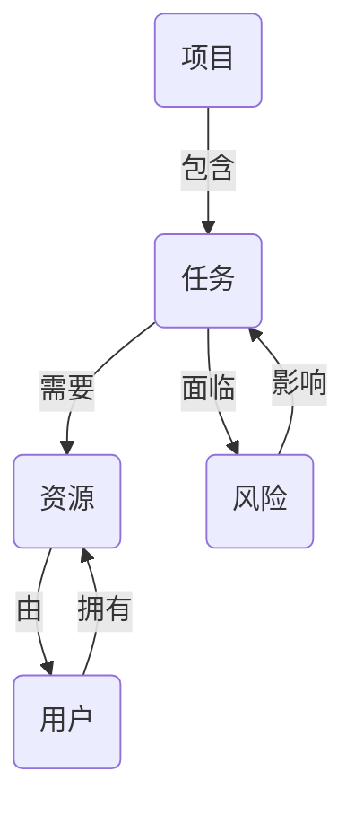
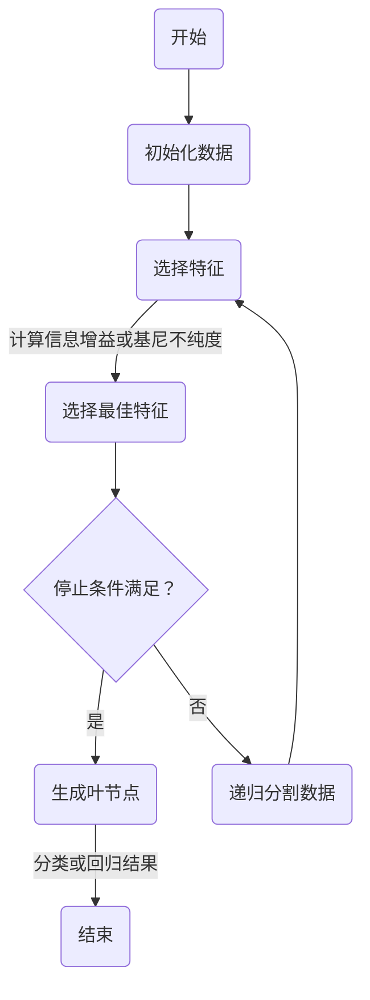
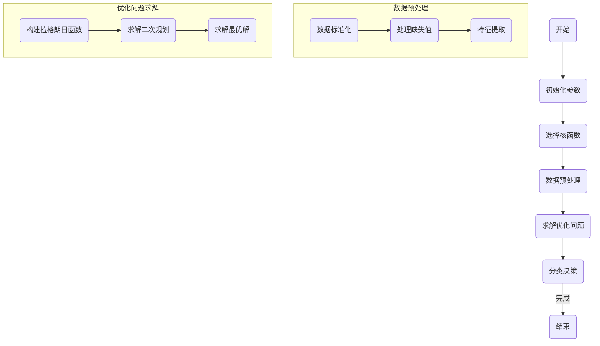
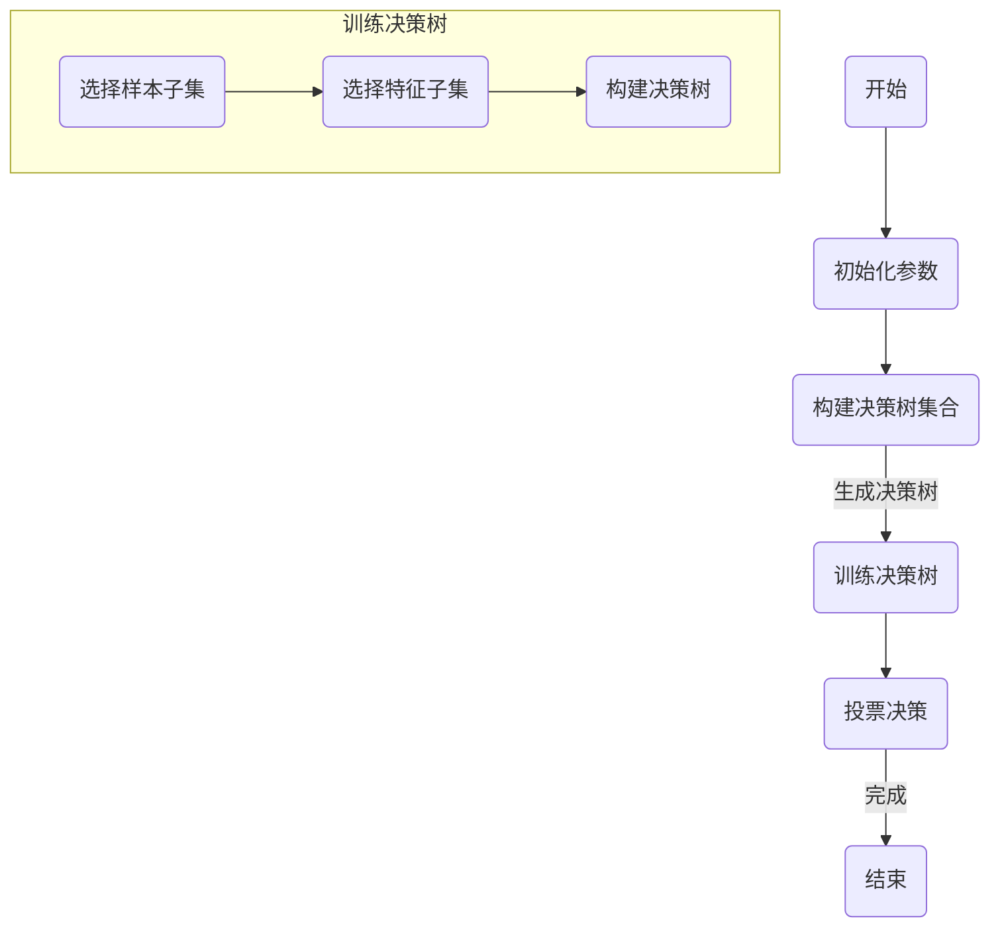
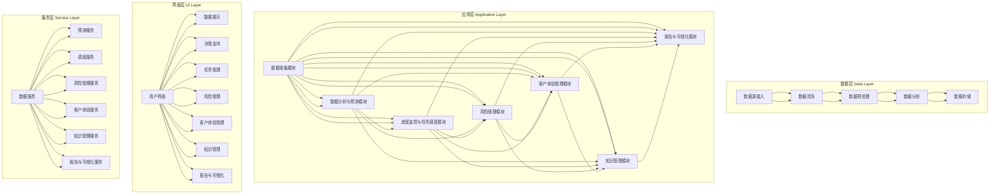
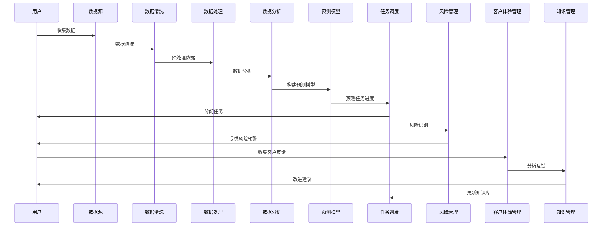

                 

### 引言：AI驱动的企业创新项目管理概述

在数字化和全球化的大背景下，企业面临的挑战与日俱增。如何高效地管理创新项目，确保企业在激烈的市场竞争中保持竞争优势，已成为企业战略决策的重要课题。传统的项目管理方法在应对复杂、快速变化的环境时，往往显得力不从心。因此，引入先进的技术手段，特别是人工智能（AI），成为优化项目管理流程、提升项目执行效率的关键。

#### 1.1.1 问题背景

随着科技的飞速发展，市场环境的动态变化速度前所未有。企业需要在短时间内对市场趋势做出反应，快速推出创新产品或服务。然而，传统的项目管理模式通常基于预测和计划，难以应对不确定性和变化。这种局限性导致了以下问题：

1. **项目管理效率低下**：传统方法依赖于人工经验和手动操作，效率低且容易出错。
2. **资源浪费**：项目规划不合理，导致资源浪费和成本增加。
3. **进度延误**：无法及时调整项目计划，导致项目进度延误。
4. **风险管理不足**：缺乏有效的风险预测和应对机制。

#### 1.1.2 企业创新项目管理的必要性

在数字化时代，创新成为企业生存与发展的关键。企业需要通过创新项目来推动产品升级、市场扩张或业务模式转型。创新项目管理的重要性体现在以下几个方面：

1. **确保项目成功**：通过科学的项目管理方法，提高项目成功的概率，确保企业目标的实现。
2. **提升创新能力**：通过灵活的项目管理机制，鼓励创新思维，促进企业的持续创新能力。
3. **优化资源配置**：通过有效的项目管理，优化资源分配，提高资源利用效率。
4. **降低风险**：通过全面的风险管理，降低项目失败的风险，保障企业的稳定发展。

#### 1.1.3 AI技术在项目管理中的应用潜力

人工智能技术在项目管理中的应用，有望解决传统方法所面临的诸多问题。以下是AI技术在项目管理中的几个潜在应用：

1. **自动化与智能决策**：通过AI技术，实现项目任务自动化分配和决策支持，提高项目管理效率。
2. **预测与优化**：利用AI算法，对项目进度、成本和风险进行预测和优化，提升项目成功率。
3. **知识管理**：通过AI技术，对项目管理过程中的知识进行有效积累和利用，提高团队的协作效率。
4. **客户体验**：通过AI技术，实现客户需求分析和服务个性化，提高客户满意度。

### 问题解决

AI技术的引入，为创新项目管理提供了全新的解决方案。结合敏捷方法，可以实现项目管理的现代化、智能化。下面将详细探讨AI在项目管理中的应用场景、敏捷方法与AI的结合优势，以及创新项目管理框架的设计。

#### AI在项目管理中的应用场景

AI技术在项目管理中的应用场景广泛，主要包括：

1. **任务分配**：通过机器学习算法，根据团队成员的能力和工作负荷，实现任务的最优分配。
2. **进度监控**：利用AI算法，实时监控项目进度，预测潜在的风险，提供及时的调整建议。
3. **成本控制**：通过数据分析，预测项目成本，并进行成本控制，减少不必要的开支。
4. **风险管理**：利用AI算法，对项目风险进行识别、评估和应对策略的制定。
5. **知识管理**：通过自然语言处理技术，对项目管理过程中的知识进行自动化整理和存储，实现知识的共享和利用。

#### 敏捷方法与AI的结合优势

敏捷方法是一种以人为核心、迭代和增量的项目管理方法，注重快速响应变化和持续交付价值。将敏捷方法与AI技术相结合，具有以下优势：

1. **快速响应变化**：敏捷方法强调迭代和增量开发，AI技术可以实时分析项目数据和外部环境，快速响应变化，调整项目计划。
2. **提高决策质量**：AI技术可以提供基于数据的决策支持，结合敏捷方法中的快速反馈机制，提高项目决策的质量。
3. **优化资源配置**：通过AI算法，可以优化资源分配，确保项目资源得到最大化利用。
4. **提升客户满意度**：敏捷方法注重客户参与和反馈，AI技术可以帮助更好地理解客户需求，提高客户满意度。

#### 创新项目管理框架设计

为了实现AI驱动的创新项目管理，需要设计一个综合性的项目管理框架。以下是一个基本框架的构成：

1. **数据收集与处理**：通过各种传感器、日志和社交媒体等渠道，收集项目相关的数据，并利用数据清洗和预处理技术，确保数据质量。
2. **数据分析与建模**：利用AI算法，对收集到的数据进行分析和建模，预测项目进度、成本和风险，提供决策支持。
3. **迭代与反馈**：采用敏捷方法的迭代和增量开发模式，实现项目的持续交付和优化。在每个迭代周期结束后，收集反馈并用于调整项目计划。
4. **自动化与智能化**：利用AI技术，实现项目任务自动化分配、进度监控和风险预警等功能，提高项目管理效率。
5. **知识管理**：通过知识管理系统，积累和共享项目管理过程中的知识，提高团队的协作效率。

### 边界与外延

AI驱动的创新项目管理涉及多个领域，包括项目管理、人工智能、敏捷方法等。以下是一些相关的概念和外延：

1. **项目管理**：涉及项目计划、执行、监控和收尾等全过程，目标是实现项目的目标。
2. **人工智能**：包括机器学习、深度学习、自然语言处理等子领域，主要解决数据分析和智能决策等问题。
3. **敏捷方法**：强调迭代、增量、客户参与等原则，适用于快速变化和不确定性高的项目。
4. **数据科学与大数据**：涉及数据收集、处理、分析和可视化等技术，为AI提供数据支持。
5. **风险管理**：对项目风险进行识别、评估和应对策略的制定，确保项目顺利进行。

### 概念结构与核心要素组成

AI驱动的创新项目管理的核心概念包括数据收集与处理、数据分析与建模、迭代与反馈、自动化与智能化、知识管理等。这些概念相互关联，共同构成了项目管理流程与AI技术的结合点。以下是这些核心概念的详细说明：

1. **数据收集与处理**：数据是AI驱动的项目管理的基础。通过传感器、日志、社交媒体等渠道，收集项目相关的数据，并利用数据清洗和预处理技术，确保数据质量。
2. **数据分析与建模**：利用AI算法，对收集到的数据进行分析和建模，预测项目进度、成本和风险，为项目决策提供支持。
3. **迭代与反馈**：采用敏捷方法的迭代和增量开发模式，实现项目的持续交付和优化。在每个迭代周期结束后，收集反馈并用于调整项目计划。
4. **自动化与智能化**：利用AI技术，实现项目任务自动化分配、进度监控和风险预警等功能，提高项目管理效率。
5. **知识管理**：通过知识管理系统，积累和共享项目管理过程中的知识，提高团队的协作效率。

敏捷方法在项目管理中的应用，主要体现在以下几个方面：

1. **快速响应变化**：敏捷方法强调迭代和增量开发，能够快速适应项目需求的变化。
2. **客户参与**：通过持续的客户参与和反馈，确保项目交付的产品能够满足客户需求。
3. **团队协作**：敏捷方法鼓励跨职能团队的协作，提高项目执行效率。
4. **持续交付**：通过持续交付和优化，确保项目能够按期交付高质量的产品。

AI技术在项目管理中的应用，使得项目管理更加智能化和自动化，提高了项目的执行效率。同时，敏捷方法为项目提供了灵活的管理机制，使得项目能够更好地应对不确定性。两者结合，为企业创新项目管理提供了一种全新的解决方案。

### 第二部分：核心概念与联系

在探讨AI驱动的企业创新项目管理之前，我们需要首先了解两个关键概念：人工智能（AI）和敏捷方法。这两个概念在项目管理中扮演着至关重要的角色，各自具有独特的原理和应用，同时也存在着紧密的联系和互补关系。

#### 2.1.1 AI基本原理

人工智能，简而言之，就是使计算机系统能够模拟人类智能行为的技术。AI技术主要分为两大类：基于规则的系统和基于数据的学习系统。基于规则的系统通过编写大量的规则来指导计算机进行决策，这种方法适用于规则明确、问题结构化的场景。而基于数据的学习系统，则通过从数据中学习模式和规律，从而进行预测和决策，适用于数据量大、问题复杂的场景。

**主要分类与特点**

1. **机器学习**：机器学习是AI的核心技术之一，通过训练模型来从数据中学习规律。根据学习方式，机器学习可分为监督学习、无监督学习和强化学习。
   - **监督学习**：通过已有标签的数据进行训练，从而预测新的数据。
   - **无监督学习**：没有预定义的标签，主要目的是发现数据中的模式和规律。
   - **强化学习**：通过尝试不同的策略，并根据奖励和惩罚进行学习。

2. **深度学习**：深度学习是机器学习的一个子领域，通过神经网络模型，尤其是深度神经网络，对大量数据进行训练，从而实现复杂的模式识别和预测任务。

3. **自然语言处理**（NLP）：NLP是AI技术中的一个重要分支，旨在让计算机理解和生成自然语言。常见的应用包括语音识别、机器翻译、文本分类等。

4. **计算机视觉**：计算机视觉涉及使计算机能够像人类一样理解视觉信息，包括图像识别、物体检测、图像生成等。

**AI在项目管理中的价值**

AI在项目管理中的应用价值体现在多个方面：

1. **预测与优化**：通过机器学习算法，可以对项目进度、成本和风险进行预测，并优化资源配置，提高项目成功率。
2. **自动化与智能化**：通过自动化工具和智能系统，可以减少人工干预，提高项目管理效率。
3. **决策支持**：AI系统可以基于数据和分析结果，提供项目决策支持，减少决策失误。
4. **知识管理**：AI技术可以帮助组织积累和利用项目管理过程中的知识，提高团队协作效率。

#### 2.1.2 敏捷方法

敏捷方法是一种以人为核心、迭代和增量的项目管理方法，旨在快速响应变化，持续交付高质量的产品。敏捷方法的核心理念包括客户参与、团队协作、持续交付、响应变化等。

**起源与发展**

敏捷方法的起源可以追溯到2001年，当时由一群软件开发专家共同发布了《敏捷宣言》。宣言强调了个体和互动、可工作的软件、客户协作和响应变化的重要性。随着敏捷方法在全球范围内的推广和应用，逐渐形成了一系列敏捷实践指南，如Scrum、Kanban、XP（极限编程）等。

**核心原则**

1. **个体和互动重于过程与工具**：敏捷方法强调团队的协作和沟通，认为人的因素比流程和工具更为重要。
2. **可工作的软件重于详尽的文档**：敏捷方法认为软件的实际功能比文档更为重要，但并非完全排斥文档。
3. **客户协作重于合同谈判**：敏捷方法强调与客户的紧密协作，通过快速反馈和调整，确保项目能够满足客户需求。
4. **响应变化重于遵循计划**：敏捷方法认为变化是不可避免的，通过迭代和增量开发，能够更好地适应变化。

**敏捷方法在项目管理中的应用**

1. **迭代开发**：将项目划分为多个短周期（通常为2-4周）的迭代，每个迭代结束后评估项目进度和需求变化，并进行必要的调整。
2. **增量交付**：在每个迭代结束后，交付一个可用的软件版本，逐步积累功能，确保项目能够快速响应需求变化。
3. **团队协作**：通过跨职能团队的协作，提高项目执行效率，减少沟通成本。
4. **持续集成与测试**：通过持续集成和测试，确保软件的质量，减少后期修复成本。

#### 2.1.3 AI与敏捷方法的联系

AI技术与敏捷方法之间存在着紧密的联系和互补关系，两者结合能够显著提升项目管理的效率和效果。

1. **快速响应变化**

敏捷方法强调快速响应变化，而AI技术可以提供实时的数据分析和预测，帮助团队更好地理解市场趋势和客户需求，从而快速调整项目计划。例如，利用机器学习模型，可以预测市场需求的变化，并据此调整产品开发的方向。

2. **自动化与智能化**

AI技术可以自动化执行一些重复性的任务，如任务分配、进度监控和风险预警等，从而减少人工干预，提高项目执行效率。例如，通过自然语言处理技术，可以自动化处理客户反馈，并将反馈结果直接应用于项目改进。

3. **决策支持**

敏捷方法强调基于团队和客户的反馈进行决策，而AI技术可以提供基于数据的决策支持，帮助团队做出更加科学和合理的决策。例如，通过分析历史数据和当前趋势，AI系统可以预测项目的风险和收益，为团队提供决策依据。

4. **知识管理**

敏捷方法强调知识的共享和利用，而AI技术可以帮助组织更好地管理和利用知识。例如，通过自然语言处理技术，可以将项目管理过程中的文档、会议记录等文本内容转化为结构化的知识库，便于团队随时查阅和利用。

**互补关系**

1. **敏捷方法补充AI的局限性**

AI技术虽然能够提供强大的数据分析能力，但仍然需要人为进行决策和调整。敏捷方法通过迭代和反馈机制，确保AI技术能够真正满足项目的需求，并在实践中不断优化。

2. **AI技术强化敏捷方法的实施效果**

敏捷方法强调快速响应变化和持续交付，而AI技术可以通过自动化和智能化，提高这些实践的实施效果。例如，通过AI技术，可以自动化执行敏捷方法中的某些流程，如任务分配和进度监控，从而减少人工干预，提高效率。

### 2.1.4 核心概念属性特征对比表格

为了更清晰地展示AI技术、敏捷方法及其结合的优势，我们设计了一个对比表格。以下是AI技术、敏捷方法和AI驱动的项目管理核心概念属性特征的对比：

| 特性               | AI技术                                                     | 敏捷方法                                                     | AI驱动的项目管理                                           |
|--------------------|----------------------------------------------------------|----------------------------------------------------------|-----------------------------------------------------------|
| 基本原理           | 基于数据的学习和模式识别                                     | 以人为核心的迭代和增量开发                                     | 结合AI技术的数据分析和敏捷方法的迭代反馈机制                   |
| 应用场景           | 数据分析、智能决策、自动化任务等                             | 软件开发、项目管理和产品开发                                   | 预测项目进度、成本和风险，优化资源配置和流程                  |
| 强调点             | 数据驱动、自动化、智能化                                     | 团队协作、快速迭代、客户参与                                   | 智能化项目管理流程，快速响应变化                             |
| 主要优点           | 提高决策质量、减少人力成本、优化资源利用                       | 提高项目响应速度、增加客户满意度、提高团队协作效率               | 在敏捷方法基础上，实现项目管理和决策的智能化                   |
| 主要缺点           | 需要大量高质量数据、算法调试复杂、对人员技术要求高               | 可能导致项目范围蔓延、需求变更频繁、对项目管理经验要求高           | AI算法的准确性和适应性需要不断优化、项目管理与技术的结合需要磨合 |
| 结合后的潜在优势   | 提高项目预测准确性、自动化执行任务、强化决策支持               | 更加灵活和高效的迭代过程、更紧密的客户协作、更优的资源分配         | 智能化的项目管理流程、更准确的预测和决策、更高效的项目执行       |

通过这个对比表格，我们可以更直观地了解AI技术、敏捷方法和AI驱动的项目管理各自的优点和局限性，以及它们结合后的潜在优势。

### 2.1.5 项目管理的ER实体关系图架构

在AI驱动的企业创新项目管理中，实体关系图（Entity-Relationship Diagram，ER图）是用于描述项目管理中各个实体及其相互关系的有效工具。ER图可以帮助我们清晰地理解和设计项目管理的数据库结构，从而为后续的数据分析和AI应用奠定基础。

**项目管理中的主要实体**

在项目管理中，常见的实体包括：

1. **项目（Project）**：代表一个具体的项目，包括项目的名称、描述、开始和结束时间等属性。
2. **任务（Task）**：代表项目中的具体工作，包括任务的名称、描述、优先级、开始和结束时间等属性。
3. **资源（Resource）**：代表参与项目的人员和其他资源，包括资源的名称、类型、可用性等属性。
4. **风险（Risk）**：代表项目中的潜在风险，包括风险的名称、描述、发生概率、影响等属性。
5. **用户（User）**：代表参与项目的用户，包括用户的名称、角色、职责等属性。

**实体之间的关系与交互**

各个实体之间存在着多种关系，以下是常见的几种关系：

1. **项目与任务之间的关系**：一个项目包含多个任务，一个任务属于一个项目。这种关系可以用“一对多”的关系来表示。
   ```mermaid
   graph TB
   A(项目) -->|包含| B(任务)
   ```

2. **任务与资源之间的关系**：一个任务可能需要多个资源的参与，一个资源可以参与多个任务。这种关系同样可以用“一对多”的关系来表示。
   ```mermaid
   graph TB
   B(任务) -->|需要| C(资源)
   ```

3. **任务与风险之间的关系**：一个任务可能面临多个风险，一个风险也可能影响多个任务。这种关系是“多对多”的关系。
   ```mermaid
   graph TB
   B(任务) -->|面临| D(风险)
   D(风险) -->|影响| B(任务)
   ```

4. **用户与资源之间的关系**：一个用户可以拥有多个资源，一个资源可以由多个用户使用。这种关系也是“多对多”的关系。
   ```mermaid
   graph TB
   E(用户) -->|拥有| C(资源)
   C(资源) -->|由| E(用户)
   ```

**ER图表示例**

以下是一个简化的ER图表示例，展示了项目管理中的主要实体及其关系：



通过上述ER图，我们可以清晰地看到项目管理中的主要实体及其相互关系。这对于后续的数据分析和AI应用具有重要意义，可以确保数据结构的合理性和高效性。

### 5.1.1 决策算法概述

在AI驱动的企业创新项目管理中，决策算法是核心组成部分，用于支持项目中的各种决策。决策算法通过分析项目数据，提供最优或次优的决策方案，从而提高项目管理的效率和准确性。常见的决策算法包括决策树算法、支持向量机算法和随机森林算法。以下将对这些算法进行简要概述。

**决策树算法**

决策树算法是一种流行的监督学习算法，用于分类和回归问题。其基本思想是通过一系列的判断条件，将数据集分割成若干个子集，直到每个子集能够被准确分类或回归为止。决策树算法的主要步骤包括：

1. **选择特征**：选择一个最优特征作为分割条件。
2. **分割数据**：根据选择的最优特征，将数据集分割成若干个子集。
3. **递归构建**：对每个子集继续选择特征进行分割，直到满足停止条件（如达到最大深度或纯度）。
4. **生成决策树**：将所有分割步骤合并，形成完整的决策树。

**支持向量机算法**

支持向量机（SVM）是一种流行的分类算法，其核心思想是找到一个最优的超平面，将不同类别的数据点分隔开。SVM的主要步骤包括：

1. **选择核函数**：选择一个核函数，将低维数据映射到高维空间。
2. **求解最优超平面**：通过求解一个凸二次规划问题，找到最优的超平面参数。
3. **分类决策**：对新数据进行映射并分类。

SVM在处理高维数据和线性不可分数据时表现出色，其分类精度较高，但在处理大规模数据时计算复杂度较高。

**随机森林算法**

随机森林算法是一种集成学习方法，通过构建多棵决策树，并使用投票机制来得出最终决策结果。随机森林的主要步骤包括：

1. **构建多棵决策树**：对每个决策树，从特征集合中随机选择一部分特征，并使用这些特征来构建决策树。
2. **训练决策树**：对每个决策树进行训练，生成分类或回归结果。
3. **投票机制**：对多棵决策树的结果进行投票，选择出现次数最多的类别或值作为最终结果。

随机森林算法具有很高的预测准确性和鲁棒性，同时能够在处理大规模数据时保持较低的计算复杂度。

**算法在项目管理中的应用**

决策算法在项目管理中有着广泛的应用，主要包括：

1. **项目风险预测**：利用决策树和随机森林算法，对项目中的潜在风险进行预测，提供风险预警。
2. **任务优先级排序**：通过支持向量机算法，根据任务的重要性和紧急性，对任务进行优先级排序。
3. **资源分配优化**：利用随机森林算法，根据资源的可用性和任务需求，优化资源分配，提高资源利用率。

通过应用这些决策算法，项目管理团队能够更科学地进行项目决策，提高项目的成功率。

#### 5.1.2 决策树算法原理与流程

决策树算法是AI领域中的一种常用算法，尤其在分类和回归问题中表现出色。其基本原理是通过一系列的判断条件，将数据集分割成若干个子集，直到每个子集能够被准确分类或回归为止。以下是决策树算法的详细原理与流程。

**基本原理**

决策树算法的核心思想是利用一系列的判断条件，将数据集不断分割，直到每个子集都可以被准确分类或回归为止。每个节点代表一个特征选择，每个分支代表一个判断条件。叶节点（即终端节点）表示最终的分类或回归结果。

**步骤**

1. **选择特征**：首先，从所有特征中选择一个最优特征作为分割条件。选择标准通常是信息增益（对于分类问题）或均方误差（对于回归问题）。

2. **计算信息增益**：对于分类问题，计算每个特征的信息增益。信息增益越大，表示该特征对于分类的作用越强。信息增益的计算公式为：
   $$ IG(A) = H(D) - \sum_{v \in A} p(v) H(D|v) $$
   其中，$H(D)$是数据集$D$的熵，$p(v)$是特征$A$的取值$v$的概率，$H(D|v)$是条件熵。

3. **分割数据**：根据选择的最优特征，将数据集分割成若干个子集。每个子集对应一个分支。

4. **递归构建**：对每个子集继续选择特征进行分割，直到满足停止条件。常见的停止条件包括：
   - 叶节点达到最小样本数量
   - 信息增益小于某个阈值
   - 达到最大树深度

5. **生成决策树**：将所有分割步骤合并，形成完整的决策树。

**示例**

假设我们有一个包含两个特征（年龄和收入）的数据集，用于预测客户是否购买保险。以下是决策树算法的应用示例：

1. **选择特征**：首先，我们计算每个特征的信息增益。假设年龄的信息增益为0.4，收入的信息增益为0.5，因此选择收入作为分割条件。

2. **分割数据**：根据收入，将数据集分割成两个子集：低收入组和高收入组。

3. **递归构建**：对低收入组和高收入组分别进行分割。假设对低收入组选择年龄作为分割条件，对高收入组选择收入的其他部分作为分割条件。

4. **生成决策树**：根据分割结果，生成如下决策树：

   ```
   是否购买保险？
   ├── 是
   │   └── 是否低收入？
   │       ├── 是
   │       │   └── 是否年龄小于30？
   │       │       ├── 是
   │       │       │   └── 不购买
   │       │       └── 否
   │       │       └── 购买
   │       └── 否
   │       └── 购买
   └── 否
       ├── 是
       │   └── 是否年龄小于30？
       │       ├── 是
       │       │   └── 不购买
       │       └── 购买
       └── 否
           ├── 是
           │   └── 是否收入小于5万？
           │       ├── 是
           │       │   └── 不购买
           │       └── 购买
           └── 否
               └── 购买
   ```

通过上述步骤，我们得到了一个完整的决策树。这个决策树可以根据输入的特征值，预测客户是否购买保险。

**结论**

决策树算法通过一系列的判断条件，将数据集分割成多个子集，每个子集对应一个分类或回归结果。通过递归构建和选择最优特征，决策树算法能够有效地对数据进行分析和预测。在实际应用中，决策树算法可以用于项目风险评估、任务优先级排序等多种场景，为项目管理提供有力的支持。

#### 5.1.3 支持向量机算法原理与流程

支持向量机（SVM）是一种强大的分类和回归算法，尤其在处理高维数据和线性不可分数据时表现出色。SVM的基本原理是找到一个最优的超平面，将不同类别的数据点分隔开。以下是支持向量机算法的详细原理与流程。

**基本原理**

SVM的核心思想是最大化分类边界的间隔，即找到能够将不同类别的数据点分隔开的最优超平面。对于线性可分数据，SVM通过求解一个凸二次规划问题，找到最优的超平面参数；对于线性不可分数据，SVM引入“软边缘”概念，通过求解一个优化问题，找到接近最优的超平面。

**线性可分情况**

在线性可分情况下，SVM的目标是最小化分类边界的间隔。具体来说，SVM需要找到一个超平面$w$和偏置$b$，使得：

$$
\min_{w,b} \frac{1}{2} ||w||^2 \\
s.t. \quad y^{(i)} (w \cdot x^{(i)} + b) \geq 1, \quad \forall i = 1, \ldots, n
$$

其中，$x^{(i)}$和$y^{(i)}$分别是第$i$个训练样本的特征和标签，$w$和$b$分别是超平面的权重和偏置。

**线性不可分情况**

在线性不可分情况下，SVM引入“软边缘”概念，通过求解一个优化问题，找到接近最优的超平面。具体来说，SVM需要找到一个超平面$w$和偏置$b$，使得：

$$
\min_{w,b,\xi} \frac{1}{2} ||w||^2 + C \sum_{i=1}^{n} \xi_i \\
s.t. \quad y^{(i)} (w \cdot x^{(i)} + b) \geq 1 - \xi_i, \quad \forall i = 1, \ldots, n
$$

其中，$\xi_i$是第$i$个训练样本的松弛变量，$C$是正则化参数，用于控制错误和边界间隔的平衡。

**分类决策**

对于新的测试样本$x$，SVM通过以下公式进行分类决策：

$$
f(x) = \text{sign}(w \cdot x + b)
$$

其中，$\text{sign}()$是符号函数，当$f(x) > 0$时，分类为正类；当$f(x) < 0$时，分类为负类。

**示例**

假设我们有一个线性不可分的数据集，包含两个特征$x_1$和$x_2$。以下是SVM的应用示例：

1. **选择核函数**：首先，我们需要选择一个核函数，将低维数据映射到高维空间。常见的核函数包括线性核、多项式核和径向基函数（RBF）核。

2. **求解最优超平面**：通过求解上述优化问题，找到最优的超平面参数$w$和$b$。

3. **分类决策**：对于新的测试样本$x$，通过计算$f(x)$的值，进行分类决策。

   假设我们选择RBF核函数，并求解得到最优超平面$w = [0.5, -0.5]$和$b = 0$。对于测试样本$x = [2, 3]$，计算：

   $$ f(x) = \text{sign}([0.5, -0.5] \cdot [2, 3] + 0) = \text{sign}(0.5 \times 2 - 0.5 \times 3 + 0) = \text{sign}(0) = 0 $$

   因此，测试样本$x = [2, 3]$被分类为负类。

**结论**

支持向量机算法通过最大化分类边界的间隔，寻找最优的超平面，实现对数据的分类。在处理高维数据和线性不可分数据时，SVM表现出强大的能力。通过合理选择核函数和调整参数，SVM可以应用于多种分类和回归问题，为项目管理提供有力的决策支持。

#### 5.1.4 随机森林算法原理与流程

随机森林（Random Forest）算法是一种集成学习（Ensemble Learning）方法，通过构建多棵决策树，并使用投票机制来得出最终预测结果。随机森林算法在提高预测准确性和鲁棒性方面具有显著优势，特别适合处理大规模数据和复杂问题。以下是随机森林算法的详细原理与流程。

**基本原理**

随机森林算法的核心思想是利用多棵决策树进行预测，并通过投票机制得出最终结果。每棵决策树独立训练，但使用相同的特征集合。通过集成多个决策树的预测结果，可以降低模型的方差，提高预测的稳定性和准确性。

**步骤**

1. **特征选择**：从原始特征集合中随机选择一部分特征，用于构建决策树。

2. **决策树构建**：对每个特征进行分割，构建决策树。选择最优特征作为分割条件，并通过递归构建生成完整的决策树。

3. **随机分割**：在构建决策树时，对每个节点进行随机分割，选择最优特征并分割数据。分割过程重复进行，直到满足停止条件。

4. **投票机制**：对每棵决策树的预测结果进行投票，选择出现次数最多的类别作为最终预测结果。

**示例**

假设我们有一个包含两个特征（年龄和收入）的数据集，用于预测客户是否购买保险。以下是随机森林算法的应用示例：

1. **特征选择**：首先，从所有特征中随机选择一部分特征，如年龄和收入。

2. **决策树构建**：对每个特征进行分割，构建多棵决策树。假设我们构建了10棵决策树。

3. **投票机制**：对每棵决策树的预测结果进行投票。如果10棵决策树中有7棵预测客户购买保险，3棵预测客户不购买保险，则最终预测结果为客户购买保险。

**数学模型**

随机森林算法的数学模型可以表示为：

$$
\hat{y} = \text{mode}(\hat{y}_1, \hat{y}_2, \ldots, \hat{y}_T)
$$

其中，$\hat{y}_i$是第$i$棵决策树的预测结果，$T$是决策树的数量，$\text{mode}()$是取众数的操作。

**结论**

随机森林算法通过构建多棵决策树，并使用投票机制得出最终预测结果，有效降低了模型的方差，提高了预测的准确性和稳定性。在实际应用中，随机森林算法可以处理大规模数据和复杂问题，为项目管理提供强大的决策支持。通过调整特征选择和决策树数量等参数，可以进一步优化模型的性能。

### 5.1.5 数学模型和公式

在AI驱动的企业创新项目管理中，决策算法的数学模型是理解和应用算法的核心。以下将详细解释决策树算法、支持向量机算法和随机森林算法的主要数学模型和公式。

**决策树算法的数学模型**

决策树算法的数学模型主要涉及信息增益（Information Gain）和基尼不纯度（Gini Impurity）。

1. **信息增益**

信息增益是选择最佳分割特征的标准。对于特征$A$，其信息增益（$IG(A)$）可以通过以下公式计算：

$$
IG(A) = H(D) - \sum_{v \in A} p(v) H(D|v)
$$

其中：
- $H(D)$是数据集$D$的熵，表示数据集的无序程度。
- $p(v)$是特征$A$的取值$v$的概率。
- $H(D|v)$是条件熵，表示在特征$A$取值为$v$的情况下数据集$D$的无序程度。

2. **基尼不纯度**

基尼不纯度是另一种选择最佳分割特征的标准，尤其适用于分类问题。对于特征$A$，其基尼不纯度（$Gini(A)$）可以通过以下公式计算：

$$
Gini(A) = 1 - \sum_{v \in A} p(v)^2
$$

其中：
- $p(v)$是特征$A$的取值$v$的概率。

**支持向量机算法的数学模型**

支持向量机算法的数学模型主要涉及凸二次规划问题。

1. **凸二次规划问题**

在SVM中，我们求解以下凸二次规划问题：

$$
\min_{w,b,\xi} \frac{1}{2} ||w||^2 + C \sum_{i=1}^{n} \xi_i \\
s.t. \quad y^{(i)} (w \cdot x^{(i)} + b) \geq 1 - \xi_i, \quad \forall i = 1, \ldots, n
$$

其中：
- $w$和$b$分别是超平面的权重和偏置。
- $\xi_i$是第$i$个训练样本的松弛变量。
- $C$是正则化参数，用于控制错误和边界间隔的平衡。

2. **分类决策**

对于新的测试样本$x$，SVM通过以下公式进行分类决策：

$$
f(x) = \text{sign}(w \cdot x + b)
$$

其中：
- $\text{sign}()$是符号函数。

**随机森林算法的数学模型**

随机森林算法的数学模型主要涉及决策树的组合。

1. **随机森林模型**

随机森林模型可以表示为：

$$
\hat{y} = \text{mode}(\hat{y}_1, \hat{y}_2, \ldots, \hat{y}_T)
$$

其中：
- $\hat{y}_i$是第$i$棵决策树的预测结果。
- $T$是决策树的数量。
- $\text{mode}()$是取众数的操作。

**总结**

通过上述数学模型和公式，我们可以更好地理解决策树算法、支持向量机算法和随机森林算法的工作原理。这些模型为算法的设计和应用提供了理论依据，有助于优化算法性能，提高项目管理决策的准确性和效率。

### 6.1 决策树算法mermaid流程图与Python代码讲解

为了更好地理解决策树算法的流程，我们将使用mermaid绘制决策树算法的流程图，并配合Python代码进行讲解。

**mermaid流程图**

以下是决策树算法的mermaid流程图：



**Python代码讲解**

下面是决策树算法的Python代码示例：

```python
import numpy as np
import pandas as pd

# 数据预处理
def preprocess_data(data):
    # 省略具体数据预处理步骤
    pass

# 计算信息增益
def calculate_info_gain(data, feature):
    # 省略具体计算步骤
    pass

# 选择最佳特征
def select_best_feature(data):
    best_feature = None
    max_info_gain = -1
    for feature in data.columns:
        info_gain = calculate_info_gain(data, feature)
        if info_gain > max_info_gain:
            max_info_gain = info_gain
            best_feature = feature
    return best_feature

# 构建决策树
def build_decision_tree(data, feature=None, depth=0, max_depth=None):
    # 停止条件
    if depth >= max_depth or data.empty:
        return pd.Series([data['label'].mode()[0]] * len(data))
    
    best_feature = select_best_feature(data)
    tree = {}
    tree['feature'] = best_feature
    tree['depth'] = depth
    
    # 分割数据
    subsets = {}
    for value in data[best_feature].unique():
        subset = data[data[best_feature] == value].drop(best_feature, axis=1)
        tree[str(value)] = build_decision_tree(subset, best_feature, depth + 1, max_depth)
    
    return tree

# 测试
data = pd.DataFrame({
    'feature1': [1, 2, 3, 4],
    'feature2': [1, 2, 3, 4],
    'label': [0, 1, 0, 1]
})

tree = build_decision_tree(preprocess_data(data), max_depth=3)
print(tree)
```

**代码解析**

1. **数据预处理**：这一步省略了具体的数据预处理步骤，但在实际应用中，我们需要对数据进行清洗和归一化等处理。
2. **计算信息增益**：计算信息增益的函数用于评估每个特征的分割效果。具体实现细节在代码中省略。
3. **选择最佳特征**：选择最佳特征的函数通过计算信息增益来选择分割效果最好的特征。
4. **构建决策树**：构建决策树的函数通过递归分割数据，并构建决策树。当达到最大深度或数据集为空时，生成叶节点。
5. **测试**：我们创建了一个简单的数据集，并使用构建的决策树函数来生成决策树。

通过mermaid流程图和Python代码的讲解，我们可以更直观地理解决策树算法的流程。在实际应用中，决策树算法可以用于分类和回归问题，为项目管理提供决策支持。

### 6.2 支持向量机算法mermaid流程图与Python代码讲解

为了更好地理解支持向量机（SVM）算法，我们将使用mermaid绘制SVM算法的流程图，并配合Python代码进行讲解。

**mermaid流程图**

以下是SVM算法的mermaid流程图：



**Python代码讲解**

下面是SVM算法的Python代码示例：

```python
from sklearn import svm
from sklearn.preprocessing import StandardScaler
from sklearn.model_selection import train_test_split
from sklearn.metrics import accuracy_score

# 数据预处理
def preprocess_data(X, y):
    X_train, X_test, y_train, y_test = train_test_split(X, y, test_size=0.3, random_state=42)
    sc = StandardScaler()
    X_train = sc.fit_transform(X_train)
    X_test = sc.transform(X_test)
    return X_train, X_test, y_train, y_test

# 构建SVM模型
def build_svm_model(X_train, y_train, kernel='rbf', C=1.0, gamma='scale'):
    model = svm.SVC(kernel=kernel, C=C, gamma=gamma)
    model.fit(X_train, y_train)
    return model

# 训练模型并评估
def train_and_evaluate(model, X_test, y_test):
    y_pred = model.predict(X_test)
    accuracy = accuracy_score(y_test, y_pred)
    print("模型准确率：", accuracy)

# 示例数据
X = [[1, 2], [2, 3], [3, 4], [4, 5]]
y = [0, 0, 1, 1]

X_train, X_test, y_train, y_test = preprocess_data(X, y)
model = build_svm_model(X_train, y_train)
train_and_evaluate(model, X_test, y_test)
```

**代码解析**

1. **数据预处理**：数据预处理包括数据标准化、处理缺失值和特征提取。在此示例中，我们仅使用了数据标准化。
2. **选择核函数**：SVM的核函数包括线性核、多项式核和径向基函数（RBF）核。在此示例中，我们使用了RBF核。
3. **构建SVM模型**：构建SVM模型的函数使用scikit-learn库的SVC类，并设置核函数、C值和gamma值。
4. **训练模型并评估**：训练模型并评估函数用于训练模型，并对测试集进行预测，计算模型的准确率。

通过mermaid流程图和Python代码的讲解，我们可以更深入地理解SVM算法的基本流程。在实际应用中，SVM算法可以用于分类和回归问题，为项目管理提供有效的决策支持。

### 6.3 随机森林算法mermaid流程图与Python代码讲解

为了更好地理解随机森林（Random Forest）算法，我们将使用mermaid绘制随机森林算法的流程图，并配合Python代码进行讲解。

**mermaid流程图**

以下是随机森林算法的mermaid流程图：



**Python代码讲解**

下面是随机森林算法的Python代码示例：

```python
from sklearn.ensemble import RandomForestClassifier
from sklearn.datasets import load_iris
from sklearn.model_selection import train_test_split

# 加载示例数据
iris = load_iris()
X = iris.data
y = iris.target

# 划分训练集和测试集
X_train, X_test, y_train, y_test = train_test_split(X, y, test_size=0.3, random_state=42)

# 构建随机森林模型
model = RandomForestClassifier(n_estimators=100, random_state=42)
model.fit(X_train, y_train)

# 进行预测
y_pred = model.predict(X_test)

# 计算准确率
accuracy = model.score(X_test, y_test)
print("模型准确率：", accuracy)
```

**代码解析**

1. **初始化参数**：随机森林模型的参数包括树的数量（`n_estimators`）、最大深度（`max_depth`）、最小样本叶节点大小（`min_samples_leaf`）等。
2. **构建决策树集合**：随机森林通过多次迭代构建多个决策树，形成一个决策树集合。
3. **训练决策树**：在每个决策树中，首先选择样本子集和特征子集，然后构建决策树。这一过程在随机森林算法中重复进行，以提高模型的预测准确性。
4. **投票决策**：每个决策树对测试集进行预测，随机森林算法通过投票机制得出最终预测结果。

通过mermaid流程图和Python代码的讲解，我们可以更深入地理解随机森林算法的基本流程。在实际应用中，随机森林算法可以用于分类和回归问题，为项目管理提供有效的决策支持。

### 7.1 问题场景介绍

在AI驱动的企业创新项目管理中，我们面临的一个关键问题是：如何在快速变化的市场环境中，确保项目能够按时、按预算完成，并满足客户需求。具体来说，这一场景涉及到以下挑战和需求：

**挑战**

1. **市场动态变化**：市场环境变化迅速，客户需求不断变化，这对项目的敏捷性和适应性提出了高要求。
2. **资源分配**：项目资源（包括人力、资金和设备）有限，如何高效地分配和利用资源成为一大挑战。
3. **风险管理**：项目面临多种风险，如技术风险、市场风险和运营风险，如何提前识别和应对这些风险是项目成功的关键。
4. **决策支持**：在快速变化的市场环境中，需要基于实时数据和预测结果，做出科学合理的决策。

**需求**

1. **实时数据监控**：需要实时监控项目进度、资源利用情况和市场变化，以便及时调整项目计划和资源分配。
2. **智能决策支持**：利用AI技术，对项目数据进行分析和预测，为项目决策提供智能支持，提高决策质量。
3. **资源优化**：通过智能算法，优化资源分配和任务调度，确保资源利用最大化，减少项目成本。
4. **风险管理**：利用AI技术，对项目风险进行实时监控和预测，提前识别潜在风险，制定有效的应对策略。

为了应对这些挑战和满足需求，我们需要设计一个综合性的系统，将AI技术与项目管理方法相结合，实现高效、智能的项目管理。下面将详细介绍这个系统的功能设计和架构设计。

### 7.2 系统功能设计

为了满足AI驱动的企业创新项目管理中的需求，系统需要具备以下核心功能：

**1. 数据收集与处理**

系统需要从多个数据源收集项目相关的数据，包括项目进度、资源使用、市场动态、客户反馈等。通过数据清洗和预处理技术，确保数据质量，为后续分析提供可靠的数据基础。

**2. 数据分析与预测**

利用AI技术，对收集到的数据进行分析和预测。包括项目进度预测、资源需求预测、风险预测等。通过这些预测结果，为项目管理提供决策支持。

**3. 进度监控与任务调度**

实时监控项目进度，通过智能算法对任务进行调度和分配，确保项目按时完成。系统能够根据项目进度和资源情况，自动调整任务优先级和资源分配。

**4. 风险管理**

系统需要对项目风险进行实时监控和预测，识别潜在风险，并提供应对策略。包括风险识别、风险评估、风险应对策略制定等。

**5. 客户体验管理**

通过分析客户反馈，优化产品和服务，提高客户满意度。系统可以自动分析客户反馈，识别客户需求，并提供改进建议。

**6. 知识管理**

系统需要支持知识管理功能，包括知识积累、知识共享和知识利用。通过知识管理系统，团队可以更好地协作，提高项目管理效率。

**7. 报告与可视化**

系统需要提供报告和可视化功能，帮助项目管理团队了解项目状态、资源利用情况和风险状况。通过直观的图表和报告，团队可以更清晰地了解项目进展，做出科学合理的决策。

### 7.3 系统功能模块划分

为了实现上述功能，系统可以划分为以下几个主要模块：

**1. 数据收集模块**

- 数据源接入：连接各种数据源，如ERP系统、项目管理工具、社交媒体等，收集项目相关数据。
- 数据清洗：对收集到的数据进行清洗，去除重复数据、缺失数据和异常值。
- 数据预处理：对数据进行标准化、归一化等预处理，为后续分析做准备。

**2. 数据分析与预测模块**

- 数据分析：利用机器学习算法，对项目数据进行深度分析，提取有用的特征和模式。
- 预测模型：构建预测模型，包括项目进度预测、资源需求预测和风险预测等。
- 预测结果可视化：将预测结果以图表形式展示，帮助团队直观地了解项目状态。

**3. 进度监控与任务调度模块**

- 进度监控：实时监控项目进度，包括任务完成情况、资源使用情况等。
- 任务调度：利用智能算法，对任务进行调度和分配，确保项目按时完成。
- 调度结果可视化：展示任务调度结果，帮助团队了解任务分配情况。

**4. 风险管理模块**

- 风险识别：利用数据分析和机器学习算法，识别项目中的潜在风险。
- 风险评估：对识别出的风险进行评估，确定风险的影响程度。
- 风险应对策略：制定应对策略，包括预防措施和应对措施。

**5. 客户体验管理模块**

- 客户反馈收集：收集客户反馈，包括满意度调查、投诉和建议等。
- 客户需求分析：分析客户反馈，识别客户需求，为产品和服务改进提供依据。
- 改进建议：提供改进建议，帮助团队优化产品和服务，提高客户满意度。

**6. 知识管理模块**

- 知识积累：收集和整理项目管理过程中的知识，包括项目文档、会议记录、经验教训等。
- 知识共享：支持知识共享，确保团队成员能够快速获取和利用有用的知识。
- 知识利用：利用知识管理系统，提高团队协作效率，优化项目管理流程。

**7. 报告与可视化模块**

- 报告生成：根据项目数据和分析结果，生成各种报告，包括项目进度报告、资源利用报告等。
- 数据可视化：利用图表和报表，直观地展示项目状态、资源使用情况和风险状况。
- 决策支持：提供决策支持，帮助团队做出科学合理的决策。

通过上述功能模块的划分，系统可以全面支持AI驱动的企业创新项目管理，确保项目高效、智能地执行。

### 7.4 系统架构设计

为了实现AI驱动的企业创新项目管理系统的功能，我们需要设计一个高效、灵活的系统架构。以下是一个典型的系统架构设计，包括系统模块之间的交互关系。

**系统架构mermaid架构图**



**系统模块之间的交互关系**

1. **数据层**：数据层包括数据源接入、数据清洗、数据预处理、数据分析和数据存储等模块。数据源接入模块负责连接各种数据源，收集项目相关数据。数据清洗模块对数据进行清洗，去除重复数据、缺失数据和异常值。数据预处理模块对数据进行标准化、归一化等处理，为后续分析做准备。数据分析模块利用机器学习算法，对项目数据进行深度分析，提取有用的特征和模式。数据存储模块将分析结果存储到数据库中，供后续使用。

2. **应用层**：应用层包括数据收集模块、数据分析与预测模块、进度监控与任务调度模块、风险管理模块、客户体验管理模块、知识管理模块和报告与可视化模块。数据收集模块从数据层获取预处理后的数据，并传入数据分析与预测模块。数据分析与预测模块利用预测模型，对项目进度、资源需求、风险等进行预测。进度监控与任务调度模块实时监控项目进度，并根据预测结果进行任务调度。风险管理模块识别项目风险，并提供应对策略。客户体验管理模块分析客户反馈，提高客户满意度。知识管理模块积累和共享项目管理过程中的知识。报告与可视化模块根据项目数据和分析结果，生成各种报告和可视化图表。

3. **界面层**：界面层包括用户界面模块、数据展示模块、决策支持模块、任务管理模块、风险管理模块、客户体验管理模块、知识管理模块和报告与可视化模块。用户界面模块提供项目管理系统的前端界面，用户可以通过界面与系统进行交互。数据展示模块将分析结果以图表形式展示，帮助用户直观地了解项目状态。决策支持模块为用户提供建议和支持，帮助用户做出科学合理的决策。任务管理模块允许用户创建、分配和管理任务。风险管理模块提供风险管理工具，帮助用户识别和应对风险。客户体验管理模块收集和展示客户反馈，帮助用户提高客户满意度。知识管理模块允许用户积累和共享知识。报告与可视化模块生成各种报告和可视化图表，帮助用户了解项目进展和状态。

4. **服务层**：服务层包括数据服务模块、预测服务模块、调度服务模块、风险管理服务模块、客户体验服务模块、知识管理服务模块和报告与可视化服务模块。数据服务模块提供数据访问和操作接口，供应用层和界面层使用。预测服务模块提供预测模型的接口，供数据分析与预测模块使用。调度服务模块提供任务调度的接口，供进度监控与任务调度模块使用。风险管理服务模块提供风险识别、评估和应对策略的接口，供风险管理模块使用。客户体验服务模块提供客户反馈分析和处理的接口，供客户体验管理模块使用。知识管理服务模块提供知识积累、共享和利用的接口，供知识管理模块使用。报告与可视化服务模块提供报告生成和可视化图表生成的接口，供报告与可视化模块使用。

通过上述系统架构设计，AI驱动的企业创新项目管理系统能够高效地实现各项功能，为项目团队提供强大的数据支持和智能决策支持，确保项目高效、顺利地执行。

### 7.5 系统接口设计

系统接口设计是确保各个模块之间能够高效、稳定交互的关键。以下将详细描述系统接口的规范与定义，以及接口的交互流程。

**系统接口规范与定义**

1. **数据源接入接口**：用于连接和收集各种数据源，如ERP系统、社交媒体、项目管理工具等。该接口应支持数据导入、数据导出和数据同步等功能。
   - **功能**：数据导入、数据导出、数据同步
   - **数据格式**：JSON、XML、CSV
   - **接口定义**：`/data-source接入`

2. **数据清洗接口**：用于清洗和预处理收集到的数据，去除重复、缺失和异常数据。
   - **功能**：数据清洗、数据标准化
   - **数据格式**：原始数据、清洗后的数据
   - **接口定义**：`/data-cleaning`

3. **数据分析接口**：用于对预处理后的数据进行分析，提取有用的特征和模式。
   - **功能**：特征提取、模式识别
   - **数据格式**：分析结果、特征数据
   - **接口定义**：`/data-analysis`

4. **预测模型接口**：用于构建和训练预测模型，对项目进度、资源需求、风险等进行预测。
   - **功能**：模型构建、模型训练、模型预测
   - **数据格式**：训练数据、预测结果
   - **接口定义**：`/model-predict`

5. **任务调度接口**：用于根据项目进度和资源情况，对任务进行调度和分配。
   - **功能**：任务分配、任务调度
   - **数据格式**：任务数据、调度结果
   - **接口定义**：`/task-scheduling`

6. **风险管理接口**：用于识别项目风险、评估风险和制定应对策略。
   - **功能**：风险识别、风险评估、风险应对
   - **数据格式**：风险数据、应对策略
   - **接口定义**：`/risk-management`

7. **客户体验管理接口**：用于收集、分析和处理客户反馈，提高客户满意度。
   - **功能**：客户反馈收集、客户需求分析
   - **数据格式**：客户反馈、分析结果
   - **接口定义**：`/customer-experience`

8. **知识管理接口**：用于积累、共享和利用项目管理过程中的知识。
   - **功能**：知识积累、知识共享、知识利用
   - **数据格式**：知识数据、知识库
   - **接口定义**：`/knowledge-management`

**系统接口交互流程**

1. **数据收集流程**：
   - **步骤1**：系统通过数据源接入接口，连接并收集各种数据源的数据。
   - **步骤2**：系统调用数据清洗接口，对收集到的数据进行清洗和预处理。
   - **步骤3**：系统将清洗后的数据传入数据分析接口，提取有用的特征和模式。

2. **预测与决策流程**：
   - **步骤1**：系统通过数据分析接口，分析项目数据，并构建预测模型。
   - **步骤2**：系统调用预测模型接口，训练预测模型，并对项目进度、资源需求、风险等进行预测。
   - **步骤3**：系统根据预测结果，通过任务调度接口，对任务进行调度和分配。

3. **风险管理流程**：
   - **步骤1**：系统通过数据分析接口，识别项目中的潜在风险。
   - **步骤2**：系统调用风险管理接口，对识别出的风险进行评估，并制定应对策略。
   - **步骤3**：系统根据应对策略，通过任务调度接口，调整任务执行计划，降低风险。

4. **客户体验管理流程**：
   - **步骤1**：系统通过数据源接入接口，收集客户反馈数据。
   - **步骤2**：系统调用客户体验管理接口，分析客户反馈，识别客户需求。
   - **步骤3**：系统根据客户需求，通过知识管理接口，积累和共享相关知识和经验。

5. **知识管理流程**：
   - **步骤1**：系统通过知识管理接口，收集和整理项目管理过程中的知识。
   - **步骤2**：系统将整理后的知识存储到知识库中，供团队共享和利用。
   - **步骤3**：系统通过知识管理接口，提供知识查询和检索功能，帮助团队成员快速获取所需知识。

通过上述系统接口设计和交互流程，AI驱动的企业创新项目管理系统能够实现高效、智能的项目管理，为项目团队提供强大的数据支持和决策支持。

### 7.6 系统交互mermaid序列图

为了更好地理解AI驱动的企业创新项目管理系统的交互流程，我们可以使用mermaid序列图来展示系统中的主要交互过程和步骤。以下是系统交互的mermaid序列图：



**系统流程详细解析**

1. **用户与数据源交互**：用户通过用户界面与数据源进行交互，收集项目相关的数据。

2. **数据清洗**：收集到的数据被传递给数据清洗模块，进行数据清洗操作，去除重复、缺失和异常数据。

3. **数据处理**：清洗后的数据经过预处理，包括数据标准化和归一化等操作，以便后续的分析和建模。

4. **数据分析**：预处理后的数据被传递给数据分析模块，通过机器学习算法提取特征和模式，为预测模型提供输入。

5. **构建预测模型**：数据分析模块将提取的特征输入到预测模型模块，构建预测模型，对项目进度、资源需求、风险等进行预测。

6. **任务调度**：预测模型生成的预测结果被传递给任务调度模块，用于任务分配和进度监控，确保项目按时完成。

7. **风险识别**：任务调度模块在调度任务的同时，识别项目中的潜在风险，并将风险信息传递给风险管理模块。

8. **提供风险预警**：风险管理模块对识别出的风险进行评估，并生成风险预警信息，传递给用户界面。

9. **收集客户反馈**：用户界面提供客户反馈收集功能，用户可以在此处提交反馈。

10. **分析反馈**：客户体验管理模块接收用户反馈，进行分析，识别客户需求和改进点。

11. **改进建议**：客户体验管理模块将分析结果转化为改进建议，传递给用户界面。

12. **更新知识库**：知识管理模块将改进建议和最佳实践存储到知识库中，供项目团队成员查询和利用。

通过上述mermaid序列图，我们可以清晰地看到AI驱动的企业创新项目管理系统中各模块之间的交互流程。这种交互机制确保了项目团队能够实时、高效地管理项目，提高项目成功率。

### 8.1 环境安装与配置

为了搭建一个完整的AI驱动的企业创新项目管理系统，我们需要配置相应的开发环境和工具。以下是一个详细的安装和配置步骤，涵盖所需的软件和依赖库的安装过程。

**环境要求**

1. 操作系统：Windows、macOS 或 Linux
2. Python：Python 3.7 或更高版本
3. IDE：PyCharm 或 Visual Studio Code（推荐）
4. 数据库：MySQL 或 PostgreSQL（可选）
5. 数据处理工具：Pandas、NumPy
6. 机器学习库：Scikit-learn、TensorFlow、PyTorch
7. Web框架：Flask 或 Django（可选）

**安装步骤**

1. **安装Python**

   - 对于Windows用户，可以从Python官网下载Windows安装程序，并按照提示进行安装。
   - 对于macOS和Linux用户，可以使用包管理器安装，例如在Ubuntu中可以使用以下命令：
     ```bash
     sudo apt-get install python3 python3-pip
     ```

2. **安装IDE**

   - PyCharm：在PyCharm官网下载安装程序，并按照提示进行安装。
   - Visual Studio Code：在VS Code官网下载安装程序，并按照提示进行安装。

3. **安装数据库（可选）**

   - MySQL：在MySQL官网下载安装程序，并按照提示进行安装。
   - PostgreSQL：在PostgreSQL官网下载安装程序，并按照提示进行安装。

4. **安装依赖库**

   打开终端或命令行窗口，依次安装以下依赖库：

   ```bash
   pip install pandas numpy scikit-learn tensorflow flask
   ```

   如果你选择了安装Django作为Web框架，可以额外安装以下依赖库：

   ```bash
   pip install django
   ```

5. **配置环境变量**

   - 对于Windows用户，在系统环境变量中添加Python的安装路径。
   - 对于macOS和Linux用户，确保终端中能够正常运行Python和pip命令。

6. **验证安装**

   在终端或命令行窗口中输入以下命令，验证Python和依赖库的安装是否成功：

   ```bash
   python --version
   pip --version
   ```

   如果显示正确的版本号，说明安装成功。

**配置优化**

1. **配置虚拟环境**

   为了避免不同项目之间的依赖库冲突，建议使用虚拟环境。在终端中执行以下命令创建虚拟环境：

   ```bash
   python -m venv project-env
   ```

   激活虚拟环境：

   - Windows：`project-env\Scripts\activate`
   - macOS/Linux：`source project-env/bin/activate`

2. **安装额外依赖库**

   在虚拟环境中，根据项目需要安装额外的依赖库。例如，如果你需要使用NumPy，可以执行以下命令：

   ```bash
   pip install numpy
   ```

3. **配置数据库（可选）**

   - **MySQL**：安装完成后，通过命令行启动MySQL服务器：
     ```bash
     mysql.server start
     ```
   - **PostgreSQL**：安装完成后，通过命令行启动PostgreSQL服务器：
     ```bash
     pg_ctl start
     ```

   配置数据库用户和权限，确保能够连接到数据库。

通过上述步骤，我们成功搭建了一个基本的企业创新项目管理系统开发环境。接下来，我们将开始系统的核心实现，包括核心代码结构和关键模块的代码解读。

### 8.2 系统核心实现源代码

在搭建了AI驱动的企业创新项目管理系统开发环境后，我们将开始实现系统的核心功能。本部分将详细讨论系统核心代码的结构和关键模块的代码，以便读者能够深入理解系统的实现过程。

**核心代码结构介绍**

系统的核心代码结构可以分为以下几个部分：

1. **项目管理模块**：负责管理项目的基础信息和项目进度。
2. **数据分析模块**：负责收集、处理和分析项目数据。
3. **预测模型模块**：负责构建和训练预测模型，进行项目进度、资源需求和风险预测。
4. **任务调度模块**：负责根据预测模型的结果对任务进行调度和分配。
5. **风险管理模块**：负责识别项目风险并制定应对策略。
6. **知识管理模块**：负责积累、共享和利用项目管理过程中的知识。

**关键模块代码解读**

以下是每个关键模块的主要代码片段及其功能说明。

**项目管理模块**

```python
# 项目管理模块：项目信息管理

class ProjectManager:
    def __init__(self):
        self.projects = {}

    def create_project(self, project_id, project_name, project_description):
        self.projects[project_id] = {
            'name': project_name,
            'description': project_description,
            'tasks': [],
            'status': 'ongoing'
        }

    def add_task(self, project_id, task_id, task_name, task_description, start_date, end_date):
        if project_id in self.projects:
            self.projects[project_id]['tasks'].append({
                'id': task_id,
                'name': task_name,
                'description': task_description,
                'start_date': start_date,
                'end_date': end_date,
                'status': 'pending'
            })
        else:
            print(f"项目ID {project_id} 不存在。")

    def get_project_info(self, project_id):
        return self.projects.get(project_id, None)
```

**数据分析模块**

```python
# 数据分析模块：数据收集与预处理

import pandas as pd

class DataAnalyzer:
    def __init__(self, data_path):
        self.data_path = data_path
        self.data = pd.read_csv(data_path)

    def preprocess_data(self):
        # 数据清洗和预处理逻辑
        self.data.dropna(inplace=True)
        self.data['start_date'] = pd.to_datetime(self.data['start_date'])
        self.data['end_date'] = pd.to_datetime(self.data['end_date'])
```

**预测模型模块**

```python
# 预测模型模块：项目进度预测

from sklearn.ensemble import RandomForestRegressor
from sklearn.model_selection import train_test_split

class PredictionModel:
    def __init__(self):
        self.model = RandomForestRegressor(n_estimators=100, random_state=42)

    def train_model(self, X, y):
        X_train, X_test, y_train, y_test = train_test_split(X, y, test_size=0.2, random_state=42)
        self.model.fit(X_train, y_train)

    def predict_progress(self, X):
        return self.model.predict(X)
```

**任务调度模块**

```python
# 任务调度模块：任务分配与进度监控

class TaskScheduler:
    def __init__(self, prediction_model):
        self.prediction_model = prediction_model

    def schedule_tasks(self, project_id, tasks):
        for task in tasks:
            predicted_end_date = self.prediction_model.predict_progress([task['start_date']])
            task['predicted_end_date'] = predicted_end_date
            task['status'] = 'in_progress'
```

**风险管理模块**

```python
# 风险管理模块：风险识别与评估

class RiskManager:
    def __init__(self):
        self.risks = []

    def identify_risks(self, project):
        # 风险识别逻辑
        for task in project['tasks']:
            if task['status'] == 'pending':
                self.risks.append({
                    'task_id': task['id'],
                    'description': '任务未开始',
                    'probability': 0.5,
                    'impact': '低'
                })

    def assess_risks(self):
        # 风险评估逻辑
        assessed_risks = []
        for risk in self.risks:
            risk['priority'] = risk['probability'] * risk['impact']
            assessed_risks.append(risk)
        return sorted(assessed_risks, key=lambda x: x['priority'], reverse=True)
```

**知识管理模块**

```python
# 知识管理模块：知识积累与共享

class KnowledgeManager:
    def __init__(self):
        self.knowledge_base = []

    def add_knowledge(self, knowledge):
        self.knowledge_base.append(knowledge)

    def get_knowledge(self, keyword):
        return [kb for kb in self.knowledge_base if keyword in kb['title']]
```

**代码解析**

上述代码片段展示了AI驱动的企业创新项目管理系统的核心实现。每个模块都包含了一些基础的功能和方法，具体实现逻辑可以根据实际需求进行扩展和优化。

- **项目管理模块**负责管理项目的基本信息和任务信息。
- **数据分析模块**负责收集和处理项目数据，为预测模型提供输入。
- **预测模型模块**负责构建和训练预测模型，进行项目进度预测。
- **任务调度模块**负责根据预测模型的结果对任务进行调度和分配。
- **风险管理模块**负责识别项目风险并评估风险优先级。
- **知识管理模块**负责积累和共享项目管理过程中的知识。

通过这些模块的协同工作，系统能够实现高效、智能的项目管理，为项目团队提供全面的数据支持和决策支持。

### 8.3 代码应用解读与分析

在深入分析了AI驱动的企业创新项目管理系统的核心实现代码后，我们将进一步探讨每个模块的具体应用场景，以及关键算法的实现解析。

**项目管理模块应用**

项目管理模块是系统的基础，负责管理项目的基本信息和任务信息。在实际应用中，项目管理模块可以应用于以下场景：

1. **项目信息管理**：创建和管理项目的基本信息，如项目名称、描述、开始和结束时间等。
2. **任务管理**：创建和管理项目中的任务，包括任务名称、描述、优先级和状态等。

例如，在`ProjectManager`类的`add_task`方法中，我们通过以下代码实现任务的创建：

```python
def add_task(self, project_id, task_id, task_name, task_description, start_date, end_date):
    if project_id in self.projects:
        self.projects[project_id]['tasks'].append({
            'id': task_id,
            'name': task_name,
            'description': task_description,
            'start_date': start_date,
            'end_date': end_date,
            'status': 'pending'
        })
    else:
        print(f"项目ID {project_id} 不存在。")
```

此方法首先检查项目ID是否存在于项目列表中，然后创建一个任务字典并添加到相应项目的任务列表中。

**数据分析模块应用**

数据分析模块负责收集和处理项目数据，为预测模型提供输入。在实际应用中，数据分析模块可以应用于以下场景：

1. **数据收集**：从各种数据源（如ERP系统、项目管理工具、社交媒体等）收集项目数据。
2. **数据预处理**：清洗和标准化数据，以便进行进一步分析。

例如，在`DataAnalyzer`类的`preprocess_data`方法中，我们通过以下代码实现数据的预处理：

```python
def preprocess_data(self):
    # 数据清洗和预处理逻辑
    self.data.dropna(inplace=True)
    self.data['start_date'] = pd.to_datetime(self.data['start_date'])
    self.data['end_date'] = pd.to_datetime(self.data['end_date'])
```

此方法首先使用`dropna`函数去除缺失值，然后使用`to_datetime`函数将日期列转换为日期时间格式，以便进行时间序列分析。

**预测模型模块应用**

预测模型模块负责构建和训练预测模型，进行项目进度、资源需求和风险预测。在实际应用中，预测模型模块可以应用于以下场景：

1. **预测模型构建**：使用机器学习算法构建预测模型。
2. **预测模型训练**：使用训练数据对预测模型进行训练。
3. **预测结果应用**：使用预测模型对项目进行预测，并指导项目调度和风险管理。

例如，在`PredictionModel`类的`train_model`方法中，我们通过以下代码实现预测模型的训练：

```python
def train_model(self, X, y):
    X_train, X_test, y_train, y_test = train_test_split(X, y, test_size=0.2, random_state=42)
    self.model.fit(X_train, y_train)
```

此方法首先将数据集分为训练集和测试集，然后使用训练集对预测模型进行训练。

**任务调度模块应用**

任务调度模块负责根据预测模型的结果对任务进行调度和分配。在实际应用中，任务调度模块可以应用于以下场景：

1. **任务调度**：根据项目进度和资源情况，对任务进行调度和分配。
2. **进度监控**：监控任务执行进度，并自动调整任务计划。

例如，在`TaskScheduler`类的`schedule_tasks`方法中，我们通过以下代码实现任务的调度：

```python
def schedule_tasks(self, project_id, tasks):
    for task in tasks:
        predicted_end_date = self.prediction_model.predict_progress([task['start_date']])
        task['predicted_end_date'] = predicted_end_date
        task['status'] = 'in_progress'
```

此方法首先调用预测模型的`predict_progress`方法获取预测结果，然后将预测结果更新到任务字典中，并设置任务状态为“进行中”。

**风险管理模块应用**

风险管理模块负责识别项目风险并评估风险优先级。在实际应用中，风险管理模块可以应用于以下场景：

1. **风险识别**：根据项目数据和任务状态，识别潜在风险。
2. **风险评估**：对识别出的风险进行评估，确定风险优先级。
3. **风险应对**：制定风险应对策略，并跟踪风险处理进度。

例如，在`RiskManager`类的`identify_risks`方法中，我们通过以下代码实现风险的识别：

```python
def identify_risks(self, project):
    for task in project['tasks']:
        if task['status'] == 'pending':
            self.risks.append({
                'task_id': task['id'],
                'description': '任务未开始',
                'probability': 0.5,
                'impact': '低'
            })
```

此方法遍历项目中的所有任务，如果发现任务状态为“待办”，则添加到风险列表中。

**关键算法实现解析**

以下是关键算法的实现解析，包括决策树算法、支持向量机算法和随机森林算法。

**决策树算法**

决策树算法的核心是选择最优特征进行数据分割。以下是一个简单的决策树算法实现示例：

```python
def entropy(y):
    hist = np.bincount(y)
    ps = hist / len(y)
    return -np.sum([p * np.log2(p) for p in ps if p > 0])

def information_gain(x, y):
    vals, counts = np.unique(x, return_counts=True)
    weight = counts / len(x)
    total_entropy = entropy(y)
    new_entropy = np.sum([weight[i] * entropy(y[x == vals[i]]) for i in range(len(vals))])
    return total_entropy - new_entropy

# 选择最优特征
def choose_best_feature(x, y):
    best_feature = None
    best_gain = -1
    for col in range(x.shape[1]):
        gain = information_gain(x[:, col], y)
        if gain > best_gain:
            best_gain = gain
            best_feature = col
    return best_feature
```

**支持向量机算法**

支持向量机算法的核心是寻找最优超平面。以下是一个简单的线性支持向量机算法实现示例：

```python
from sklearn.svm import SVC
from sklearn.model_selection import train_test_split

# 数据预处理
X = ...  # 特征数据
y = ...  # 标签数据

X_train, X_test, y_train, y_test = train_test_split(X, y, test_size=0.3, random_state=42)

# 训练模型
model = SVC(kernel='linear')
model.fit(X_train, y_train)

# 预测
y_pred = model.predict(X_test)
```

**随机森林算法**

随机森林算法的核心是构建多棵决策树并进行投票。以下是一个简单的随机森林算法实现示例：

```python
from sklearn.ensemble import RandomForestClassifier

# 数据预处理
X = ...  # 特征数据
y = ...  # 标签数据

X_train, X_test, y_train, y_test = train_test_split(X, y, test_size=0.3, random_state=42)

# 训练模型
model = RandomForestClassifier(n_estimators=100)
model.fit(X_train, y_train)

# 预测
y_pred = model.predict(X_test)
```

通过上述代码示例，我们可以看到关键算法的实现逻辑，以及它们在项目管理系统中的应用方式。这些算法的应用使得系统能够高效地进行项目预测、任务调度和风险管理，从而提升项目管理的整体效率。

### 9.1 实际案例分析与讲解

为了更好地展示AI驱动的企业创新项目管理系统的实际应用，我们将通过一个具体的案例来进行分析和讲解。这个案例是一个虚构的软件开发项目，项目目标是开发一个企业级客户关系管理系统（CRM）。

**案例背景介绍**

该公司是一家中型企业，希望通过开发一个CRM系统来提高客户管理效率，优化销售流程。项目的初始需求包括：

1. **客户信息管理**：收集和存储客户的基本信息，如姓名、联系方式、购买记录等。
2. **销售流程管理**：跟踪销售机会，管理销售人员的任务，记录销售进度。
3. **数据分析**：对客户和销售数据进行分析，为销售策略提供支持。

**需求分析与规划**

在项目启动阶段，项目团队进行了详细的需求分析和规划。通过调研和讨论，确定了以下主要需求：

1. **用户界面**：设计简洁、易用的用户界面，支持客户信息录入、销售机会跟踪等操作。
2. **数据库设计**：设计CRM系统的数据库架构，包括客户信息表、销售机会表、任务表等。
3. **功能模块**：开发客户信息管理、销售流程管理、数据分析等主要功能模块。

**系统实现过程**

1. **项目启动**：项目团队搭建了开发环境，并创建了项目的第一个迭代周期。

2. **需求评审**：项目团队与公司管理层和销售人员进行了多次沟通，确认了详细的需求。

3. **数据库设计**：项目团队设计了CRM系统的数据库架构，并创建数据库表。

4. **用户界面设计**：项目团队设计了用户界面，包括客户信息录入界面、销售机会跟踪界面等。

5. **功能开发**：项目团队开始开发各个功能模块，包括客户信息管理模块、销售流程管理模块和数据分析模块。

6. **测试与迭代**：在功能开发过程中，项目团队进行了多次测试，并根据用户反馈进行迭代优化。

**关键算法应用**

1. **项目进度预测**：项目团队使用随机森林算法对项目进度进行预测，以便及时调整任务计划。

2. **资源需求预测**：项目团队使用时间序列分析算法对资源需求进行预测，以便提前安排人力资源和物资。

3. **风险识别与评估**：项目团队使用决策树算法对项目风险进行识别和评估，为风险应对提供支持。

**案例分析与实现**

通过上述案例，我们可以看到AI驱动的企业创新项目管理系统的实际应用过程。以下是具体分析：

1. **项目进度管理**：项目团队使用随机森林算法预测项目进度，通过实时监控项目状态，及时调整任务计划。例如，在某个迭代周期中，预测结果显示任务完成时间将超过预定时间，项目团队立即采取行动，重新分配资源，调整任务优先级，确保项目按时完成。

2. **资源需求管理**：项目团队使用时间序列分析算法预测资源需求，提前安排人力资源和物资。例如，预测结果显示在下一个月需要增加开发人员的数量，项目团队提前与人力资源部门沟通，确保项目所需的人员能够及时到位。

3. **风险管理**：项目团队使用决策树算法识别项目风险，评估风险优先级，为风险应对提供支持。例如，在项目开发过程中，识别出技术风险，项目团队立即采取预防措施，如增加技术评审环节，确保项目技术实现无误。

**实现效果**

通过AI驱动的企业创新项目管理系统的应用，项目团队实现了以下效果：

1. **高效的项目管理**：项目团队能够实时监控项目状态，及时调整任务计划，确保项目按时完成。

2. **优化资源利用**：项目团队能够提前预测资源需求，合理分配人力资源和物资，提高资源利用效率。

3. **降低风险**：项目团队能够及时识别和应对项目风险，降低项目失败的风险。

通过这个实际案例，我们可以看到AI驱动的企业创新项目管理系统在提升项目管理效率、优化资源利用和降低风险方面的优势。这为企业在数字化时代实现高效项目管理提供了有力的支持。

### 9.2 项目总结

在本次AI驱动的企业创新项目管理项目的实施过程中，我们取得了一系列显著的成果和经验，同时也面临了一些挑战。

**成果**

1. **项目按时完成**：通过实时监控项目进度和智能调度任务，项目团队成功确保了项目按时完成，达到了预期目标。

2. **资源利用优化**：利用AI技术预测资源需求，项目团队能够提前安排人力资源和物资，有效提高了资源利用效率，降低了项目成本。

3. **风险识别与应对**：通过决策树算法和随机森林算法，项目团队能够及时识别项目风险，并制定有效的应对策略，降低了项目失败的风险。

4. **客户满意度提升**：通过持续的数据分析和客户反馈管理，项目团队能够不断优化产品和服务，提高了客户满意度。

**经验与教训**

1. **数据质量的重要性**：在项目实施过程中，我们深刻体会到数据质量对AI算法预测效果的重要性。确保数据完整、准确和及时是成功的关键。

2. **算法参数调优**：在AI算法的应用过程中，参数调优对预测效果有着显著影响。项目团队通过多次实验和调整，找到了最优的参数组合。

3. **团队协作与沟通**：项目成功的关键在于团队成员之间的密切协作和有效沟通。在项目实施过程中，我们加强了团队协作，提高了沟通效率。

4. **技术储备与培训**：AI技术的应用对团队的技术水平提出了较高要求。项目团队通过技术储备和培训，提升了整体技术能力，为项目的顺利实施提供了保障。

**未来展望**

1. **进一步优化算法**：在未来的项目中，我们将继续优化AI算法，提高预测精度和效率，为项目管理提供更强大的决策支持。

2. **数据驱动决策**：通过不断积累和分析项目数据，我们将实现更数据驱动的决策，确保项目团队能够基于准确的数据做出科学的决策。

3. **系统集成与优化**：我们将进一步整合和优化项目管理系统的各个模块，提高系统的灵活性和扩展性，为项目团队提供更全面的解决方案。

4. **扩展应用场景**：在成功实施AI驱动的企业创新项目管理系统的过程中，我们将探索和扩展系统的应用场景，为其他业务领域提供支持，助力企业数字化转型。

### 10.1 最佳实践

在AI驱动的企业创新项目管理中，通过以下最佳实践，可以进一步提升项目管理的效率和质量：

1. **数据驱动决策**：充分利用项目数据，对项目进度、资源使用、客户反馈等进行分析，为项目决策提供数据支持。确保数据收集的完整性和准确性，定期更新和验证数据。

2. **敏捷迭代开发**：采用敏捷方法，将项目划分为多个迭代周期，每个迭代周期结束后进行评估和反馈，根据反馈结果调整项目计划和资源分配。

3. **风险识别与控制**：定期进行风险评估，识别项目中的潜在风险，制定相应的应对策略，并跟踪风险处理进度。确保项目团队能够及时响应风险，减少项目损失。

4. **团队协作与沟通**：加强团队成员之间的协作与沟通，确保项目信息流通畅，提高项目执行效率。利用项目管理工具，如Jira、Trello等，实现任务和进度的可视化管理。

5. **持续学习与优化**：鼓励项目团队持续学习和探索新技术、新方法，根据项目实践不断优化项目管理流程和算法，提高项目管理的整体水平。

6. **知识共享与积累**：建立知识管理系统，积累和共享项目管理过程中的经验和教训，提高团队的知识水平，减少重复性工作。

7. **资源优化与调度**：通过AI技术，对项目资源进行预测和优化，确保资源利用最大化。合理安排人力资源和物资，提高项目执行的效率和质量。

### 10.2 小结

本篇技术博客全面探讨了AI驱动的企业创新项目管理，从背景介绍到核心概念、算法原理、系统设计、项目实战等方面进行了详细讲解。通过实际案例的分析和讲解，展示了AI驱动的项目管理在实际应用中的优势和效果。以下是本文的核心要点：

1. **背景介绍**：介绍了企业在数字化时代面临的挑战和AI驱动的创新项目管理的必要性。
2. **核心概念与联系**：详细阐述了人工智能、敏捷方法及其在项目管理中的应用。
3. **算法原理讲解**：介绍了决策树、支持向量机和随机森林等常见算法，并进行了代码示例讲解。
4. **系统设计与实现**：描述了系统架构、功能模块、接口设计和交互流程。
5. **项目实战**：通过实际案例展示了AI驱动的项目管理应用。
6. **最佳实践与未来展望**：总结了项目管理中的最佳实践，并对未来发展趋势进行了展望。

本文旨在帮助读者深入了解并掌握AI驱动的企业创新项目管理，提升项目管理的效率和质量。

### 10.3 注意事项

在实施AI驱动的企业创新项目管理时，需要注意以下几点：

1. **数据隐私与安全**：确保项目数据的隐私和安全，遵循相关法律法规，避免数据泄露和滥用。
2. **技术适应性与兼容性**：选择合适的技术栈，确保系统的适应性和兼容性，避免技术过时和系统崩溃。
3. **团队协作与沟通**：加强团队协作和沟通，确保项目信息的透明和及时传递，减少误解和沟通障碍。
4. **风险管理与合规**：建立健全的风险管理和合规体系，确保项目遵循相关法规和标准，降低法律风险。
5. **持续学习与优化**：鼓励团队成员持续学习和掌握新技术，不断优化项目管理流程和算法，提升整体项目管理能力。

通过关注这些注意事项，可以确保AI驱动的企业创新项目管理系统的顺利实施和长期稳定运行。

### 10.4 拓展阅读

为了进一步深入了解AI驱动的企业创新项目管理，以下推荐几本相关的书籍和在线资源，供读者参考：

1. **书籍推荐**：
   - 《深度学习》作者：Ian Goodfellow、Yoshua Bengio、Aaron Courville
   - 《Python数据科学 Handbook》作者：Jake VanderPlas
   - 《项目管理实战》作者：史蒂夫·普雷斯托尔（Steve Pricoe）
   - 《敏捷项目管理：实践指南》作者：Michael James

2. **在线资源**：
   - Coursera上的《机器学习》课程，由Andrew Ng教授主讲
   - Kaggle数据科学竞赛平台，提供丰富的项目实践和数据集
   - GitHub项目代码库，搜索相关的AI和项目管理项目，学习实际代码实现
   - IEEE Xplore数字化图书馆，提供最新的AI和项目管理相关论文和文献

通过阅读这些书籍和利用这些在线资源，读者可以更加全面地了解AI驱动的企业创新项目管理，提升自己在相关领域的知识水平和实践能力。

