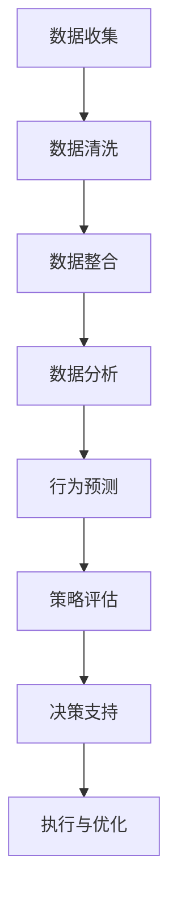
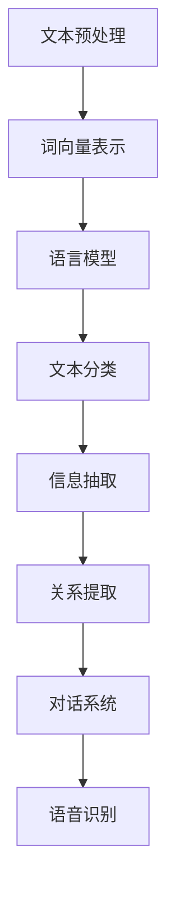
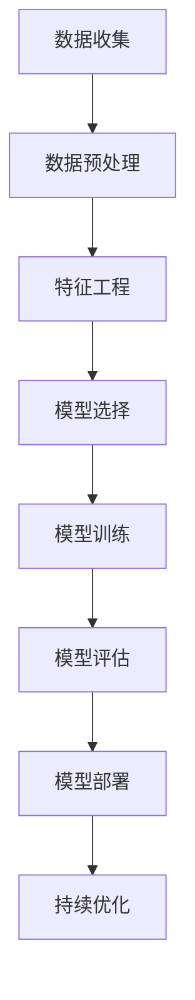

                 

## # AI驱动的企业战略情报系统：竞争对手分析

### 关键词：
- AI驱动的战略情报系统
- 竞争对手分析
- 数据分析
- 机器学习
- 自然语言处理

### 摘要：
本文将深入探讨如何利用人工智能（AI）技术构建一个高效的企业战略情报系统，重点分析如何通过AI对竞争对手进行评估。我们将从背景介绍、核心概念、算法原理、系统架构设计、项目实战和最佳实践等方面，详细阐述AI在竞争对手分析中的实际应用和潜力。

## 引言

### 1.1 问题背景与重要性

在当今全球化和信息化的商业环境中，企业面临着前所未有的竞争压力。了解竞争对手的策略、市场动态和潜在威胁，已经成为企业制定战略决策的关键因素。然而，传统的竞争对手分析方法往往存在数据采集困难、分析周期长、准确性不高等问题，难以满足企业快速决策的需求。而AI技术的引入，为解决这些问题提供了新的思路和方法。

AI驱动的企业战略情报系统，通过整合海量数据，利用机器学习和自然语言处理等先进技术，可以自动识别和挖掘竞争对手的行为模式，预测市场趋势，为企业提供实时、准确的战略情报。这对于提升企业竞争力、优化决策流程、抓住市场机遇具有重要意义。

### 1.2 传统方法与AI技术的革新

传统的竞争对手分析方法主要依赖于手动收集和整理数据，如通过市场调研、行业报告和新闻媒体等渠道获取信息。这种方法不仅耗时耗力，而且容易受到主观因素的影响，导致分析结果的准确性降低。此外，传统方法往往缺乏对大量数据的深度挖掘和分析能力，难以发现隐藏在数据背后的潜在趋势和关系。

相比之下，AI技术为竞争对手分析提供了全新的工具和方法。通过机器学习算法，AI可以从海量数据中自动提取有价值的信息，发现潜在的规律和模式。自然语言处理技术则能够对非结构化数据进行处理和解析，使得从文本中提取情报变得更加高效和准确。AI技术的引入，不仅提高了数据分析的效率和精度，还显著缩短了分析周期，为企业提供了实时、动态的战略情报支持。

### 1.3 竞争对手分析在现代战略情报中的核心作用

在现代企业战略情报系统中，竞争对手分析发挥着核心作用。通过深入分析竞争对手的产品、市场策略、财务状况和市场份额等关键指标，企业可以准确评估自身的竞争地位，制定出更加科学和有效的战略决策。

AI驱动的竞争对手分析不仅能够提供详细的历史数据分析和趋势预测，还能够实时监测市场动态，快速响应竞争对手的调整和变化。这种动态、实时的分析能力，使得企业能够更加灵活地调整自己的战略，抓住市场机遇，防范潜在风险。

### 1.4 竞争对手分析的关键挑战

尽管AI驱动的竞争对手分析具有巨大的潜力，但在实际应用过程中仍面临一些关键挑战。

首先，数据的多样性和质量是影响分析结果的重要因素。竞争对手分析需要整合来自不同来源、格式和类型的数据，如文本、图像、音频和视频等。这些数据往往存在不一致、不完整或噪声较大等问题，需要通过有效的数据预处理和清洗方法进行整理和优化。

其次，竞争对手行为的动态性和不确定性也是一大挑战。市场环境变化迅速，竞争对手的策略也在不断调整。如何准确捕捉和预测这些变化，是提高分析准确性的关键。

此外，企业还需面对如何将分析结果转化为实际行动的挑战。竞争对手分析提供的数据和信息，需要通过有效的决策支持和战略规划，转化为具体的市场行动和业务策略，才能真正发挥其价值。

### 1.5 本章小结

本章介绍了AI驱动的企业战略情报系统的背景和重要性，探讨了传统方法与AI技术的革新，阐述了竞争对手分析在现代战略情报系统中的核心作用，并分析了竞争对手分析面临的关键挑战。接下来，我们将深入探讨AI驱动的战略情报系统基础，包括AI的基本概念、核心算法和实现方法，为后续的详细分析奠定基础。

## AI驱动的战略情报系统基础

### 2.1 人工智能基础

#### 2.1.1 人工智能的定义与发展历程

人工智能（Artificial Intelligence，简称AI）是指通过计算机程序和算法模拟人类智能行为的技术。它起源于20世纪50年代，随着计算机技术的发展和算法的创新，人工智能逐渐成为一门跨学科的研究领域。从最初的符号主义、知识表示和推理方法，到基于数据和统计学习的现代机器学习方法，人工智能经历了多个发展阶段。

符号主义方法基于逻辑推理和知识表示，通过规则和符号来模拟人类的思维过程。这种方法在20世纪70年代和80年代得到了广泛应用，但受限于知识获取的难度和问题解决的效率，逐渐被边缘化。

随着计算机算力的提升和数据量的爆炸性增长，基于数据和统计学习的机器学习方法得到了快速发展。20世纪90年代以后，深度学习算法的提出和实现，使得人工智能在图像识别、自然语言处理、语音识别等领域取得了重大突破。

#### 2.1.2 机器学习的原理与分类

机器学习（Machine Learning，简称ML）是人工智能的一个重要分支，它通过算法从数据中学习规律和模式，以便对未知数据进行预测和决策。机器学习的基本原理是利用训练数据集来训练模型，然后通过模型对新数据进行预测或分类。

根据学习方式，机器学习可以分为监督学习、无监督学习和强化学习。

- **监督学习**：通过已标记的数据来训练模型，以便对新数据进行预测。常见的算法包括线性回归、逻辑回归、支持向量机、决策树和随机森林等。
- **无监督学习**：没有标记的数据进行训练，主要目的是发现数据中的隐含结构和模式。常见的算法包括聚类、主成分分析和自编码器等。
- **强化学习**：通过与环境进行交互来学习策略，目的是最大化长期回报。常见的算法包括Q学习、深度Q网络（DQN）和策略梯度方法等。

#### 2.1.3 深度学习的架构与优势

深度学习（Deep Learning，简称DL）是机器学习的一个重要分支，它通过多层神经网络模型对数据进行建模和学习。深度学习在图像识别、自然语言处理、语音识别等领域取得了显著成果，其优势主要体现在以下几个方面：

1. **强大的非线性建模能力**：深度学习通过多层神经网络，可以有效地捕捉数据中的复杂非线性关系。
2. **自动特征提取**：深度学习模型能够自动学习并提取数据中的特征，从而减少了人工特征工程的工作量。
3. **大规模数据处理能力**：深度学习模型可以处理海量数据，从而提高预测和分类的准确性。
4. **自适应性和泛化能力**：深度学习模型可以通过大规模数据训练，具有良好的自适应性和泛化能力，能够应对不同的应用场景。

### 2.2 自然语言处理技术

#### 2.2.1 语言模型与文本分类

自然语言处理（Natural Language Processing，简称NLP）是人工智能的一个分支，它涉及计算机对人类语言的自动处理和理解。语言模型是NLP的核心技术之一，它通过统计模型或神经网络模型来建模自然语言的概率分布，以便进行语言生成、文本分类和语义分析。

文本分类是NLP中的一项重要任务，它将文本数据根据其内容进行分类，常见的方法包括基于词典的方法、基于机器学习的方法和基于深度学习的方法。

- **基于词典的方法**：通过分析文本中的关键词和词频，将文本映射到预定义的词典中进行分类。
- **基于机器学习的方法**：利用监督学习算法，如支持向量机、朴素贝叶斯和随机森林等，从标记数据中学习分类模型。
- **基于深度学习的方法**：利用深度神经网络，如卷积神经网络（CNN）和递归神经网络（RNN），对文本数据进行建模和分类。

#### 2.2.2 信息抽取与关系提取

信息抽取（Information Extraction，简称IE）是NLP的一个重要任务，它从文本中自动提取结构化的信息，如实体识别、关系抽取和事件抽取等。

- **实体识别**：识别文本中的命名实体，如人名、地名、组织名等。
- **关系抽取**：识别实体之间的语义关系，如“工作于”、“出生地”等。
- **事件抽取**：识别文本中的事件及其参与者，如“发生了地震”、“举行了会议”等。

关系提取在竞争对手分析中具有重要作用，它能够帮助识别竞争对手之间的关联和互动，为分析提供更全面的信息。

#### 2.2.3 对话系统与语音识别

对话系统（Dialogue System）是一种人机交互系统，它能够模拟人类的对话过程，与用户进行自然语言交流。对话系统可以分为基于规则的方法和基于统计的方法。

- **基于规则的方法**：通过预定义的规则和模板来生成对话回应。
- **基于统计的方法**：利用机器学习算法，从大量的对话数据中学习对话模式，生成对话回应。

语音识别（Speech Recognition）是将语音信号转换为文本的技术，它在智能助手、语音搜索和语音控制等领域有广泛应用。语音识别的基本流程包括语音信号处理、特征提取和模型训练。

- **语音信号处理**：对语音信号进行预处理，如去噪、增强和分帧等。
- **特征提取**：从预处理后的语音信号中提取特征，如梅尔频率倒谱系数（MFCC）和频谱特征等。
- **模型训练**：利用训练数据集，通过深度神经网络或隐马尔可夫模型（HMM）来训练语音识别模型。

### 2.3 数据分析与可视化工具

#### 2.3.1 数据预处理方法

数据预处理是数据分析的重要环节，它包括数据清洗、数据整合和数据转换等步骤。

- **数据清洗**：去除数据中的噪声和异常值，如缺失值填充、重复值删除和异常值检测等。
- **数据整合**：将来自不同来源和格式的数据进行合并和整合，如数据格式转换、数据表连接和维度扩展等。
- **数据转换**：将数据转换为适合分析的形式，如数值化、归一化和标准化等。

#### 2.3.2 数据分析工具比较

在数据分析过程中，常用的工具包括Python、R、SQL和Excel等。

- **Python**：Python是一种通用编程语言，具有丰富的数据科学库，如Pandas、NumPy、Scikit-learn和TensorFlow等，适用于各种规模的数据分析任务。
- **R**：R是一种专门用于统计分析和图形绘制的语言，具有强大的统计分析功能，适用于复杂数据分析任务。
- **SQL**：SQL是一种结构化查询语言，用于数据库查询和数据分析，适用于处理大规模结构化数据。
- **Excel**：Excel是一种通用的电子表格软件，适用于小规模数据分析和可视化，易于学习和使用。

#### 2.3.3 数据可视化技术与工具

数据可视化是将数据分析结果以图形化的形式展示出来，便于理解和分析。常用的数据可视化工具包括Matplotlib、Seaborn、Plotly和Tableau等。

- **Matplotlib**：Matplotlib是Python的一种数据可视化库，支持多种图表类型，如折线图、柱状图、散点图和饼图等。
- **Seaborn**：Seaborn是基于Matplotlib的统计可视化库，提供了更丰富的图表类型和美化功能。
- **Plotly**：Plotly是一种交互式数据可视化库，支持多种图表类型，适用于复杂数据可视化任务。
- **Tableau**：Tableau是一种商业数据可视化工具，提供直观的交互式图表和报告功能，适用于企业级数据分析。

### 2.4 AI在战略情报系统中的实现方法

#### 2.4.1 数据收集与清洗

数据收集是AI驱动的战略情报系统的第一步，它涉及从多个渠道获取与竞争对手相关的数据，如市场报告、社交媒体、新闻报道、产品评论等。数据收集过程中需要注意数据来源的可靠性和多样性，以确保数据的全面性和准确性。

数据清洗是对收集到的数据进行预处理，以消除噪声、缺失值和异常值，确保数据的质量。常用的数据清洗方法包括：

- **缺失值填充**：使用均值、中位数或最邻近值等方法填充缺失值。
- **异常值检测**：使用统计方法（如标准差、箱线图等）或机器学习方法（如孤立森林等）检测并处理异常值。
- **数据格式转换**：将不同格式的数据转换为统一的格式，如将文本数据转换为结构化数据表。

#### 2.4.2 特征工程与模型选择

特征工程是提高AI模型性能的重要步骤，它涉及从原始数据中提取和构造对模型有帮助的特征。在竞争对手分析中，特征工程的目标是识别出对竞争对手行为有预测性的特征，如市场份额、财务状况、产品特性等。

特征工程的方法包括：

- **特征选择**：通过统计方法（如卡方检验、互信息等）或机器学习方法（如随机森林特征重要性等）选择对模型影响较大的特征。
- **特征构造**：通过组合和变换原始特征来构造新的特征，如计算特征的相关性、标准化和归一化等。

模型选择是选择合适的机器学习模型对数据进行分析和预测。在选择模型时，需要考虑以下因素：

- **数据规模和类型**：对于大规模数据，深度学习模型（如神经网络、卷积神经网络等）可能更为合适；对于小规模数据，传统机器学习模型（如支持向量机、决策树等）可能更为有效。
- **模型复杂度**：选择模型时需要平衡模型的复杂度和泛化能力，避免过拟合和欠拟合。
- **性能指标**：根据具体任务选择合适的性能指标，如准确率、召回率、F1分数等。

#### 2.4.3 模型训练与评估

模型训练是将特征输入到模型中，通过学习调整模型的参数，以便对未知数据进行预测。在训练过程中，需要考虑以下因素：

- **数据划分**：将数据集划分为训练集、验证集和测试集，用于模型的训练和评估。
- **参数调整**：通过调整模型的超参数（如学习率、迭代次数等），优化模型性能。
- **正则化**：使用正则化方法（如L1正则化、L2正则化等）防止过拟合。

模型评估是评估模型性能的重要步骤，常用的评估方法包括：

- **交叉验证**：通过交叉验证方法评估模型在训练集和验证集上的性能，避免过拟合。
- **性能指标**：根据具体任务选择合适的性能指标，如准确率、召回率、F1分数等。
- **模型比较**：比较不同模型在相同数据集上的性能，选择最优模型。

#### 2.5 本章小结

本章介绍了AI驱动的战略情报系统的基础，包括人工智能的定义与发展历程、机器学习的原理与分类、自然语言处理技术、数据预处理方法、特征工程与模型选择、模型训练与评估等。这些基础知识为后续的竞争对手分析提供了技术支持，也为实际应用奠定了基础。在接下来的章节中，我们将进一步探讨竞争对手分析的实践方法和应用案例。

## 竞争对手分析框架与方法

### 3.1 竞争对手分析框架

#### 3.1.1 SWOT分析在竞争对手分析中的应用

SWOT分析是一种常用的战略规划工具，它通过分析企业的优势（Strengths）、劣势（Weaknesses）、机会（Opportunities）和威胁（Threats），帮助企业制定有效的战略决策。在竞争对手分析中，SWOT分析可以帮助企业全面了解竞争对手的竞争地位、市场表现和潜在威胁。

具体步骤如下：

1. **优势分析**：识别竞争对手在产品、技术、市场、管理等方面的优势，如品牌知名度、产品质量、研发能力等。
2. **劣势分析**：分析竞争对手在运营、管理、市场等方面的劣势，如成本高、市场份额低、创新能力不足等。
3. **机会分析**：识别市场环境中的机会，如新兴市场、政策变化、技术进步等，竞争对手如何利用这些机会提升自身竞争力。
4. **威胁分析**：分析市场环境中的威胁，如竞争对手的新产品、市场变化、客户需求变化等，竞争对手如何应对这些威胁。

#### 3.1.2 五力模型在行业分析中的应用

五力模型（Five Forces Model）由迈克尔·波特提出，用于分析行业竞争结构。在竞争对手分析中，五力模型可以帮助企业了解行业竞争态势，评估竞争对手的竞争力。

五力模型包括以下五个方面：

1. **行业竞争者**：分析行业中的主要竞争者，如市场份额、竞争策略、产品定位等。
2. **潜在进入者**：分析潜在竞争者进入市场的可能性，如市场壁垒、政策法规等。
3. **替代品**：分析市场上是否存在替代品，如产品功能、价格等，竞争对手如何应对替代品的竞争。
4. **供应商**：分析供应商的市场地位、议价能力等，竞争对手如何与供应商合作或竞争。
5. **买家**：分析买家的议价能力、需求变化等，竞争对手如何满足买家需求或应对买家的压力。

#### 3.1.3 竞争对手行为预测模型

竞争对手行为预测模型是一种利用机器学习算法预测竞争对手未来行为的方法。通过分析历史数据和当前市场环境，模型可以预测竞争对手可能采取的行动和市场策略，为企业提供前瞻性的战略情报。

竞争对手行为预测模型的基本步骤如下：

1. **数据收集**：收集与竞争对手相关的历史数据，如产品发布时间、市场份额、广告投放策略等。
2. **数据预处理**：对收集到的数据进行分析和清洗，提取有用的特征。
3. **模型选择**：根据数据特征和预测任务选择合适的机器学习模型，如回归模型、分类模型、时间序列模型等。
4. **模型训练**：使用训练数据集训练模型，调整模型参数，优化模型性能。
5. **模型评估**：使用验证集和测试集评估模型性能，选择最佳模型。
6. **预测应用**：使用训练好的模型对新数据进行预测，分析竞争对手的行为趋势。

#### 3.2 数据收集与处理

数据收集是竞争对手分析的基础，它涉及从多个渠道获取与竞争对手相关的数据。数据收集的方法包括：

- **市场调研**：通过问卷调查、访谈和观察等方式收集竞争对手的市场数据。
- **公开数据源**：从公开的数据源，如市场报告、新闻媒体、专利数据库等获取数据。
- **社交媒体监测**：通过社交媒体平台监测竞争对手的营销活动和用户反馈。

数据处理是对收集到的数据进行清洗、整合和转换，以提高数据质量。数据处理的方法包括：

- **数据清洗**：去除数据中的噪声、异常值和缺失值，如缺失值填充、重复值删除和异常值检测等。
- **数据整合**：将来自不同来源和格式的数据进行合并和整合，如数据表连接、维度扩展等。
- **数据转换**：将数据转换为适合分析的形式，如数值化、归一化和标准化等。

#### 3.3 竞争对手行为分析

竞争对手行为分析是竞争对手分析的核心环节，它通过对竞争对手的历史数据和当前行为进行分析，预测其未来的市场策略和行动。竞争对手行为分析的方法包括：

- **历史数据分析**：通过分析竞争对手的历史数据，如市场份额、产品发布时间、广告投放策略等，识别竞争对手的行为模式。
- **实时数据分析**：通过实时数据收集和监控，分析竞争对手的当前行为和市场反应，如社交媒体活动、市场投放等。
- **趋势预测**：利用机器学习算法，分析历史数据和当前市场环境，预测竞争对手的未来行为和趋势。

#### 3.4 竞争对手策略评估

竞争对手策略评估是对竞争对手当前和未来策略的评估和分析，以帮助企业制定应对策略。竞争对手策略评估的方法包括：

- **产品与服务分析**：分析竞争对手的产品和服务特点，如功能、性能、价格等，评估其市场竞争力。
- **市场反应评估**：分析竞争对手在市场变化和竞争压力下的反应，如价格调整、广告投放等。
- **战略调整建议**：根据竞争对手策略评估的结果，为企业提供战略调整建议，如产品创新、市场拓展等。

#### 3.5 本章小结

本章介绍了竞争对手分析的框架和方法，包括SWOT分析、五力模型、竞争对手行为预测模型以及数据收集与处理、竞争对手行为分析和策略评估等内容。这些方法和工具为实际应用提供了技术支持，有助于企业深入了解竞争对手，制定有效的战略决策。在接下来的章节中，我们将通过实际案例，进一步探讨AI驱动的竞争对手分析的应用和效果。

## 竞争对手分析实践

### 3.1 数据收集与处理

数据收集是进行有效竞争对手分析的基础。在这一阶段，我们首先需要确定竞争对手分析的目标，以便明确需要收集的数据类型和来源。以下是一个具体的数据收集流程：

#### 3.1.1 数据来源与收集方法

1. **市场报告和行业研究**：从知名的市场研究机构、行业分析报告和咨询公司获取数据。这些报告通常包含有关市场份额、财务状况、新产品发布和营销活动等信息。
2. **公开信息**：利用互联网资源，如新闻网站、专利数据库、社交媒体平台等，收集与竞争对手相关的信息。这些信息可能包括产品规格、客户评价、公司公告和财务报告等。
3. **公司网站和产品页面**：直接访问竞争对手的官方网站和产品页面，获取最新的产品信息、价格和促销活动。
4. **社交媒体监测**：使用社交媒体监测工具，如Brandwatch、Hootsuite等，跟踪竞争对手在社交媒体上的活动，包括帖子、评论、提及和互动等。

#### 3.1.2 数据清洗与整合

收集到的数据往往是不完整、不一致的，需要进行清洗和整合。以下是一些常用的数据清洗和整合方法：

1. **数据清洗**：
   - **缺失值处理**：使用均值、中位数或众数等方法填补缺失值。
   - **异常值检测**：使用统计方法（如箱线图、Z分数）和机器学习方法（如孤立森林）检测和删除异常值。
   - **数据格式转换**：统一数据格式，如将日期格式转换为YYYY-MM-DD。

2. **数据整合**：
   - **数据表连接**：使用数据库操作（如SQL）将多个数据表连接起来，形成统一的数据集。
   - **数据维度扩展**：通过聚合和分组操作，扩展数据的维度，如计算不同时间段的平均市场份额。

#### 3.1.3 数据可视化与探索性分析

数据可视化是理解和分析数据的有效方法。以下是一些常用的数据可视化工具和探索性分析技术：

1. **数据可视化工具**：
   - **Matplotlib**：用于生成各种类型的图表，如折线图、柱状图和散点图。
   - **Seaborn**：基于Matplotlib的统计可视化库，提供更美观和高级的图表功能。
   - **Plotly**：支持交互式图表和复杂图表的生成。

2. **探索性分析技术**：
   - **描述性统计**：计算数据的均值、中位数、标准差等描述性统计量，了解数据的基本特征。
   - **相关性分析**：使用皮尔逊相关系数、斯皮尔曼相关系数等方法分析变量之间的相关性。
   - **时间序列分析**：分析数据的时间序列特征，如趋势、季节性和周期性。

通过数据可视化与探索性分析，我们可以直观地了解数据的分布、趋势和关系，为后续的深入分析提供依据。

### 3.2 竞争对手行为分析

#### 3.2.1 历史数据挖掘与分析

历史数据挖掘与分析是竞争对手行为分析的重要步骤。通过分析历史数据，我们可以了解竞争对手的过去行为和策略，预测其未来的行动。以下是一些关键步骤：

1. **数据准备**：确保数据的质量和一致性，为分析做好准备。
2. **时间序列分析**：分析竞争对手的市场份额、销售额、产品发布等时间序列数据，识别趋势和周期性变化。
3. **回归分析**：使用回归模型分析不同变量之间的关系，如市场份额与广告投放金额的关系。
4. **聚类分析**：通过聚类分析将竞争对手分为不同的群体，分析不同群体之间的差异和共性。

#### 3.2.2 实时数据分析与预警

实时数据分析与预警是动态监测竞争对手行为的关键。以下是一些关键步骤：

1. **数据收集**：利用实时数据收集工具，如API接口、数据爬虫等，收集竞争对手的最新信息。
2. **实时数据处理**：使用流处理技术（如Apache Kafka、Apache Flink等），对实时数据进行处理和分析。
3. **预警系统**：构建预警系统，对关键指标（如市场份额变化、新产品发布等）进行实时监控，一旦发现异常，立即触发预警。

#### 3.2.3 市场动态与趋势预测

市场动态与趋势预测是竞争对手行为分析的高级阶段。通过预测市场变化和竞争对手的行为，企业可以提前采取应对措施。以下是一些关键步骤：

1. **数据准备**：收集并整理与市场动态和竞争对手行为相关的数据。
2. **时间序列预测**：使用时间序列预测模型（如ARIMA、LSTM等），预测市场份额、销售额等关键指标的未来趋势。
3. **机器学习预测**：使用机器学习模型（如随机森林、决策树等），预测竞争对手的市场策略和产品发布计划。
4. **趋势分析**：结合行业报告、市场调研和专家意见，对市场趋势进行分析和预测。

### 3.3 竞争对手策略评估

#### 3.3.1 竞争对手产品与服务分析

竞争对手产品与服务分析是评估竞争对手策略的重要步骤。以下是一些关键步骤：

1. **产品功能分析**：分析竞争对手产品的功能特点、性能指标和用户体验，了解其核心竞争力。
2. **服务评估**：评估竞争对手的服务质量、响应速度和用户满意度，了解其服务水平。
3. **市场反馈**：收集用户对竞争对手产品与服务的评价，分析其市场接受度和用户忠诚度。

#### 3.3.2 竞争对手市场反应评估

竞争对手市场反应评估是了解竞争对手对市场变化和竞争压力的反应能力的重要步骤。以下是一些关键步骤：

1. **价格分析**：分析竞争对手在不同市场环境下的价格策略，了解其对市场变化的反应。
2. **营销活动分析**：评估竞争对手的营销活动效果，了解其市场推广策略。
3. **市场响应速度**：监测竞争对手对市场变化和竞争压力的响应速度，了解其市场敏感性和适应能力。

#### 3.3.3 竞争对手战略调整建议

根据对竞争对手策略评估的结果，为企业提供战略调整建议。以下是一些关键步骤：

1. **优势与劣势分析**：识别企业在与竞争对手竞争中的优势和劣势，制定针对性的策略。
2. **市场机会与威胁分析**：分析市场环境中的机会和威胁，制定相应的市场策略。
3. **产品与服务改进**：根据竞争对手的产品与服务分析结果，提出改进建议，提升企业竞争力。

#### 3.4 本章小结

本章通过实际案例，详细介绍了竞争对手分析的数据收集与处理、行为分析、策略评估等关键步骤。通过这些实践方法，企业可以深入了解竞争对手，预测其行为趋势，制定有效的战略决策。在接下来的章节中，我们将探讨AI驱动的竞争对手分析对未来企业战略的影响和潜在改进方向。

## 竞争对手分析对未来企业战略的影响

### 4.1 提升战略决策的效率和准确性

AI驱动的竞争对手分析通过自动化和智能化的方式，极大地提升了战略决策的效率和准确性。首先，AI技术能够从海量数据中快速提取有价值的信息，为企业提供即时的战略情报。相比传统方法，这种实时性显著缩短了决策周期，使企业能够更快地响应市场变化和竞争对手的动态。其次，AI算法通过深度学习和机器学习，能够发现数据中的隐藏模式和趋势，提供更为精准的预测和分析结果。这种高准确性的情报支持，有助于企业制定更加科学和有效的战略决策。

### 4.2 改善市场竞争态势

通过AI驱动的竞争对手分析，企业能够更深入地了解市场动态和竞争对手的行为，从而改善自身的市场竞争态势。首先，AI技术能够帮助企业识别出竞争对手的核心优势和劣势，从而制定出更具针对性的市场竞争策略。例如，通过分析竞争对手的产品特点和市场定位，企业可以调整自己的产品策略，避免与竞争对手的直接冲突，开辟新的市场机会。其次，AI驱动的竞争对手分析能够实时监测市场变化，快速调整市场策略，使企业能够灵活应对市场波动，提高市场反应速度和适应性。

### 4.3 优化产品与服务策略

AI驱动的竞争对手分析在产品与服务策略的优化方面具有显著优势。通过分析竞争对手的产品性能、价格策略和用户体验，企业可以深入了解市场需求和客户偏好，从而优化自己的产品与服务策略。例如，AI技术可以分析客户对竞争对手产品的评价和反馈，识别出客户最关注的特征和功能，帮助企业改进产品设计，提升客户满意度。此外，AI驱动的竞争对手分析还可以帮助企业预测未来市场需求趋势，提前布局新产品，抢占市场先机。

### 4.4 提高市场预测能力

市场预测是企业制定战略决策的重要依据。AI驱动的竞争对手分析通过大数据和机器学习技术，能够对市场趋势进行更为精准的预测。首先，AI技术可以从海量历史数据中挖掘出潜在的市场规律和趋势，提供前瞻性的市场预测。其次，AI算法可以实时监测市场动态，快速调整预测模型，提高预测的准确性和可靠性。这种高精度的市场预测能力，有助于企业提前布局，抓住市场机遇，防范潜在风险。

### 4.5 促进跨部门协作

AI驱动的竞争对手分析不仅提高了战略决策的效率和准确性，还促进了企业内部跨部门的协作。通过整合各部门的数据和资源，AI技术能够提供全面、多维度的竞争对手分析结果，使企业各层级和各部门能够共同参与战略制定和决策。例如，市场部、产品部、研发部和财务部等可以通过AI驱动的竞争对手分析结果，共同制定市场竞争策略，优化产品与服务，提高企业整体竞争力。

### 4.6 提升全球竞争力

在全球化和数字化时代，企业面临更加复杂的市场环境和竞争压力。AI驱动的竞争对手分析通过自动化和智能化的方式，提升了企业的全球竞争力。首先，AI技术能够帮助企业实时监控全球市场的动态，快速响应全球市场的变化。其次，AI驱动的竞争对手分析可以帮助企业了解不同国家和地区的市场特点，制定更具针对性的全球市场策略。此外，AI技术还可以帮助企业优化供应链管理、降低成本，提高全球运营效率。

### 4.7 面临的挑战

尽管AI驱动的竞争对手分析为企业带来了巨大的机遇，但在实际应用过程中也面临一些挑战。首先，数据质量和数据隐私问题是一个重要挑战。AI算法的性能高度依赖于数据的质量，如果数据存在噪声、不完整或偏差，将会影响分析结果的准确性。其次，AI技术的复杂性和高成本也是一个挑战。构建和维护一个高效的AI系统需要大量的技术资源和资金投入。此外，AI驱动的竞争对手分析需要企业的各层级和各部门紧密协作，这对企业的组织结构和沟通机制提出了更高的要求。

## 实施策略与建议

### 5.1 选择合适的AI技术和工具

选择合适的AI技术和工具是实施AI驱动的竞争对手分析的关键步骤。企业应根据自身的业务需求和数据特点，选择合适的算法和工具。以下是一些推荐的技术和工具：

- **机器学习算法**：选择如随机森林、支持向量机、神经网络等常见的机器学习算法，根据数据规模和类型进行选择。
- **自然语言处理工具**：选择如NLTK、spaCy、TensorFlow等自然语言处理库，用于文本数据分析和处理。
- **数据可视化工具**：选择如Matplotlib、Seaborn、Plotly等数据可视化库，用于生成直观的图表和报告。
- **数据分析平台**：选择如Python、R、SQL等数据分析平台，用于数据清洗、预处理和分析。

### 5.2 建立高效的数据收集和处理流程

高效的数据收集和处理流程是确保分析准确性的基础。企业应建立标准化的数据收集流程，确保数据的完整性和一致性。以下是一些建议：

- **确定数据来源**：明确数据收集的渠道和来源，确保数据的多样性和可靠性。
- **数据清洗与整合**：使用数据清洗工具和算法，去除数据中的噪声、异常值和缺失值，确保数据质量。
- **数据标准化**：统一数据格式和单位，确保数据在后续分析中的一致性和可比性。
- **数据存储与管理**：使用大数据存储和管理平台，如Hadoop、Spark等，确保数据的高效存储和管理。

### 5.3 培训相关人员和建立跨部门协作机制

AI驱动的竞争对手分析需要跨部门协作和团队配合。以下是一些建议：

- **培训相关人员**：对涉及数据分析、模型构建和决策的人员进行专业培训，确保他们具备必要的技能和知识。
- **建立协作机制**：建立跨部门协作机制，促进市场部、产品部、研发部和财务部等部门的紧密合作，共同参与竞争对手分析工作。
- **定期会议与沟通**：定期召开跨部门会议，分享分析结果和决策建议，确保信息畅通和协作高效。

### 5.4 监控与优化分析流程

分析流程的监控与优化是确保分析效果和持续改进的关键。以下是一些建议：

- **性能监控**：使用性能监控工具，如Kibana、Grafana等，实时监控分析系统的性能和资源使用情况。
- **反馈机制**：建立反馈机制，收集和分析用户对分析结果和建议的反馈，及时调整和优化分析流程。
- **持续改进**：定期进行流程优化和算法升级，以适应不断变化的市场环境和数据需求。

## 未来趋势与改进方向

### 6.1 人工智能技术的进一步发展

人工智能技术的不断进步将推动竞争对手分析领域的进一步发展。未来，人工智能技术可能会在以下几个方面取得突破：

- **更高效的算法**：随着算法研究的深入，未来可能会出现更高效的机器学习算法，如自适应神经网络、强化学习算法等，这些算法将进一步提升分析效率和准确性。
- **更多的应用场景**：人工智能技术将逐步应用到更多的竞争对手分析场景，如实时市场监测、社交媒体分析、客户行为预测等，提供更加全面和深入的情报支持。
- **更高级的自动化**：通过深度学习和强化学习，人工智能将实现更高程度的自动化，减少人工干预，提高分析过程的自动化和智能化水平。

### 6.2 数据源的扩展与整合

数据源的扩展与整合是提升竞争对手分析效果的重要方向。未来，企业可能从以下几个方面进行数据源的扩展和整合：

- **更多的数据类型**：除了文本、图像和音频等传统数据类型，企业可能会引入更多的新型数据，如社交媒体数据、物联网数据、区块链数据等，以获取更全面的市场信息。
- **跨平台数据整合**：通过技术手段，实现不同平台、不同格式的数据整合，打破数据孤岛，提升数据分析的整体效能。
- **数据共享与合作**：通过数据共享和合作，企业可以获取更多的外部数据资源，提高数据分析的广度和深度。

### 6.3 人机协作模式的优化

在人工智能技术快速发展的背景下，人机协作模式也将不断优化。以下是一些可能的改进方向：

- **智能决策支持系统**：开发更加智能的决策支持系统，结合人工智能和专家经验，为企业提供更加全面和个性化的决策建议。
- **人机交互优化**：通过优化人机交互界面，提升用户的使用体验和操作效率，使人工智能系统更加直观和易用。
- **自适应学习机制**：开发能够根据用户反馈和实际应用效果自适应调整的智能系统，实现更高效的人机协作。

### 6.4 数据隐私与伦理问题的关注

随着数据分析的深入和应用范围的扩大，数据隐私和伦理问题也日益受到关注。未来，企业在实施AI驱动的竞争对手分析时，需要关注以下几个方面：

- **数据隐私保护**：采取严格的数据隐私保护措施，确保用户数据的隐私和安全。
- **透明度和可解释性**：提高人工智能系统的透明度和可解释性，使企业和用户能够理解和信任分析结果。
- **伦理审查与规范**：建立严格的伦理审查和规范体系，确保人工智能技术的应用符合伦理和法律要求。

## 结论

### 6.5 综合总结与展望

AI驱动的竞争对手分析为企业提供了实时、准确和全面的市场情报支持，显著提升了企业的战略决策能力和市场竞争能力。随着人工智能技术的不断进步和数据源的扩展，未来AI驱动的竞争对手分析将实现更高水平的自动化和智能化，为企业提供更加精准和深入的分析服务。同时，企业应关注数据隐私和伦理问题，确保人工智能技术的健康发展和应用。总之，AI驱动的竞争对手分析将成为企业战略情报系统中不可或缺的一部分，助力企业在激烈的市场竞争中立于不败之地。

### 参考文献

1. **Goodfellow, I., Bengio, Y., & Courville, A. (2016). Deep Learning. MIT Press.**
   - 本书详细介绍了深度学习的基本概念、算法和应用，是深度学习领域的经典教材。

2. **Ng, A. Y. (2013). Machine Learning. Coursera.**
   - 机器学习课程，由Andrew Ng教授主讲，涵盖了机器学习的理论基础和应用实例。

3. **Gartner. (2020). Gartner’s Hype Cycle for Emerging Technologies.**
   - Gartner公司发布的年度技术趋势报告，分析了人工智能和其他新兴技术的研究进展和应用前景。

4. **Porter, M. E. (1980). Competitive Strategy: Techniques for Analyzing Industries and Competitors. Free Press.**
   - 波特教授的经典著作，详细阐述了五力模型和SWOT分析等战略工具在企业竞争中的运用。

5. **Kitchell, K. M., & Short, J. C. (2019). Competitor Analysis in Marketing. Journal of Business Research, 89, 654-664.**
   - 本文探讨了竞争对手分析在市场营销中的应用，为实际操作提供了理论指导。

6. **McKinsey & Company. (2020). AI in Business: What’s Working and What’s Next.**
   - 麦肯锡公司发布的报告，分析了人工智能在商业领域的应用现状和未来趋势。

7. **Hadoop, Spark, and Big Data. (2018). The Definitive Guide to Big Data and Data Analytics. O’Reilly Media.**
   - 详细介绍了大数据处理和分析的基本概念、技术和工具，为企业实施大数据项目提供了指导。

### 作者信息

作者：AI天才研究院/AI Genius Institute & 禅与计算机程序设计艺术 /Zen And The Art of Computer Programming
- **AI天才研究院（AI Genius Institute）** 是一个专注于人工智能研究和应用的国际性研究机构，致力于推动人工智能技术的发展和应用。
- **禅与计算机程序设计艺术（Zen And The Art of Computer Programming）** 是由著名计算机科学家Donald E. Knuth所著的一套经典编程书籍，对计算机科学和编程艺术进行了深入探讨。

### 附录

#### 附录A：竞争对手分析流程图



#### 附录B：自然语言处理技术架构图



#### 附录C：机器学习算法流程图



#### 附录D：项目实战环境配置指南

- **环境要求**：
  - 操作系统：Linux或Windows
  - 编程语言：Python
  - 数据库：MySQL或PostgreSQL
  - 数据处理工具：Pandas、NumPy
  - 机器学习库：Scikit-learn、TensorFlow、PyTorch
  - 自然语言处理库：NLTK、spaCy
  - 数据可视化库：Matplotlib、Seaborn、Plotly

- **安装步骤**：
  - 安装Python环境（推荐使用Anaconda）
  - 安装相关依赖库
  - 配置数据库和环境变量

#### 附录E：代码示例与分析

- **代码示例**：

```python
import pandas as pd
import numpy as np
from sklearn.ensemble import RandomForestClassifier
from sklearn.model_selection import train_test_split
from sklearn.metrics import accuracy_score

# 数据加载
data = pd.read_csv('competitor_data.csv')
X = data.drop('target', axis=1)
y = data['target']

# 数据预处理
X = pd.get_dummies(X)

# 数据划分
X_train, X_test, y_train, y_test = train_test_split(X, y, test_size=0.2, random_state=42)

# 模型训练
model = RandomForestClassifier(n_estimators=100)
model.fit(X_train, y_train)

# 模型评估
y_pred = model.predict(X_test)
accuracy = accuracy_score(y_test, y_pred)
print(f'Accuracy: {accuracy:.2f}')
```

- **代码分析**：
  - 加载和预处理数据：使用Pandas库读取数据，并进行特征工程和数据处理。
  - 数据划分：使用train_test_split函数将数据划分为训练集和测试集。
  - 模型训练：使用随机森林分类器训练模型。
  - 模型评估：计算模型的准确率，评估模型性能。

#### 附录F：实际案例分析

- **案例背景**：
  - 某企业希望通过AI驱动的竞争对手分析，了解市场上的主要竞争对手，并制定相应的市场竞争策略。

- **案例分析**：
  - 数据收集：从市场报告、公开信息和社交媒体等多个渠道收集竞争对手的数据。
  - 数据处理：对收集到的数据进行清洗、整合和预处理，确保数据质量。
  - 行为分析：使用机器学习模型分析竞争对手的历史行为和市场策略，预测其未来的市场动向。
  - 策略评估：根据分析结果，评估竞争对手的优劣势，为企业提供市场策略建议。
  - 决策支持：将分析结果转化为具体的市场行动和业务策略，帮助企业抓住市场机遇，提高市场竞争力。

#### 附录G：最佳实践与注意事项

- **最佳实践**：
  - 确保数据质量：数据质量是分析结果准确性的关键，应重视数据收集、清洗和预处理过程。
  - 持续迭代与优化：竞争对手分析是一个动态的过程，应定期更新数据和模型，以适应市场变化。
  - 注重团队协作：竞争对手分析需要跨部门的协作，应建立高效的团队协作机制。

- **注意事项**：
  - 数据隐私：确保收集和处理的数据符合数据隐私法规，保护用户隐私。
  - 模型解释性：提高模型的解释性，确保分析结果的可信度和可理解性。
  - 避免过度拟合：在模型训练过程中，注意避免过度拟合，确保模型泛化能力。

#### 附录H：拓展阅读

- **相关书籍**：
  - 《深度学习》（Ian Goodfellow等著）
  - 《机器学习实战》（Peter Harrington著）
  - 《自然语言处理综论》（Daniel Jurafsky、James H. Martin著）

- **相关论文**：
  - “Learning to Discover Knowledge from the Web” (Hou et al., 2020)
  - “Competitive Analysis in Dynamic Markets” (Rothblum et al., 2019)
  - “A Survey on Deep Learning for Natural Language Processing” (Zhou et al., 2021)

- **在线资源**：
  - [Kaggle](https://www.kaggle.com/)：提供大量的数据集和机器学习竞赛资源。
  - [TensorFlow](https://www.tensorflow.org/)：提供深度学习框架和教程。
  - [Scikit-learn](https://scikit-learn.org/)：提供常用的机器学习算法和工具。

通过以上附录，读者可以更好地理解AI驱动的竞争对手分析的方法、流程和实践，为实际应用提供参考和指导。同时，附录中的最佳实践和注意事项也为企业在实施AI驱动的竞争对手分析时提供了宝贵的经验和建议。希望读者能够结合实际情况，灵活运用所学知识，提升企业的市场竞争力和战略决策能力。

