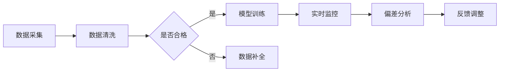
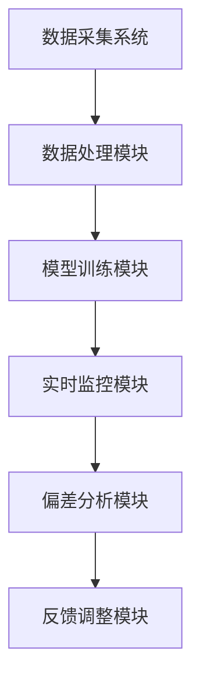
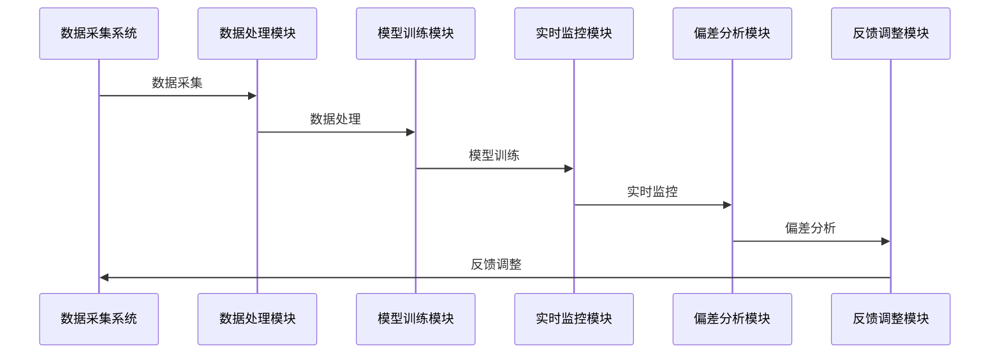

                 

# AI驱动的企业战略执行监控：KPI智能跟踪与偏差分析

## 关键词
- AI战略执行监控
- KPI智能跟踪
- 偏差分析
- 自动化
- 智能化
- 实时监控
- 数据采集
- 模型训练
- 系统架构设计

## 摘要
本文旨在探讨人工智能（AI）在企业战略执行监控中的应用，特别是在KPI智能跟踪与偏差分析方面。随着AI技术的不断进步，企业正逐渐采用自动化和智能化的方式来监控战略执行情况，以提高效率和准确性。本文将详细介绍AI驱动的企业战略执行监控的核心概念、算法原理、数学模型和系统架构设计，并通过实际案例进行分析，为企业提供最佳实践建议。

## 步骤 1: 背景介绍

### 问题背景

随着全球经济的不断发展，企业之间的竞争日益激烈。为了保持竞争力，企业需要快速响应市场变化，调整战略执行方案。然而，传统的战略执行监控方法往往依赖于人工统计和报告，存在以下问题：

1. **效率低下**：人工统计和报告需要大量时间和人力，难以实现实时监控。
2. **准确性不足**：人工分析容易出现偏差，难以确保数据的准确性。
3. **数据滞后**：传统方法的数据处理速度较慢，难以及时发现并解决问题。

### 描述问题

企业需要有效监控战略执行情况，确保各项指标达到预期目标。然而，传统的监控方法难以满足上述需求，导致以下问题：

1. **数据采集困难**：传统方法难以全面、准确地收集战略执行相关的数据。
2. **分析能力有限**：人工分析难以发现潜在的问题和偏差，缺乏深度和广度。
3. **反馈滞后**：传统方法无法实现实时反馈，导致决策滞后，影响企业竞争力。

### 问题解决

采用AI技术，可以实现自动化、智能化的KPI跟踪与偏差分析，提高企业战略执行监控的效率和准确性。具体解决思路如下：

1. **数据采集**：利用传感器、物联网等技术，实现数据的全面、实时采集。
2. **数据预处理**：采用数据清洗、数据整合等技术，确保数据的准确性和一致性。
3. **模型训练**：利用机器学习算法，对采集到的数据进行分析，构建KPI跟踪和偏差分析模型。
4. **实时监控**：利用实时监控技术，实现对KPI的实时跟踪和偏差分析。
5. **反馈调整**：根据偏差分析结果，及时调整战略执行方案，提高决策准确性。

### 边界与外延

本文主要讨论AI在战略执行监控中的应用，涉及KPI智能跟踪与偏差分析的方法、技术及实践。具体包括以下内容：

1. **AI驱动的企业战略执行监控**：介绍AI技术在企业战略执行监控中的应用原理和核心环节。
2. **KPI智能跟踪**：讨论KPI智能跟踪的方法、技术和实现策略。
3. **偏差分析**：介绍偏差分析的定义、方法和实现技术。
4. **系统架构设计**：讨论AI驱动的战略执行监控系统的架构设计和关键技术。

### 概念结构与核心要素组成

AI驱动的企业战略执行监控包括以下核心环节：

1. **数据采集**：利用传感器、物联网等技术，实现对战略执行相关数据的全面、实时采集。
2. **数据预处理**：对采集到的数据进行清洗、整合，确保数据的准确性和一致性。
3. **模型训练**：利用机器学习算法，对预处理后的数据进行分析，构建KPI跟踪和偏差分析模型。
4. **实时监控**：利用实时监控技术，实现对KPI的实时跟踪和偏差分析。
5. **偏差分析**：根据实时监控数据，对KPI的偏差进行分析，发现潜在的问题和偏差。
6. **反馈调整**：根据偏差分析结果，及时调整战略执行方案，提高决策准确性。
7. **优化与改进**：根据反馈调整的结果，不断优化和改进KPI跟踪和偏差分析模型，提高系统性能。

## 步骤 2: 核心概念与联系

### 核心概念原理

AI驱动的企业战略执行监控、KPI智能跟踪、偏差分析等是本文的核心概念。下面分别对这些概念进行详细介绍。

#### AI驱动的企业战略执行监控

AI驱动的企业战略执行监控是指利用人工智能技术，实现对战略执行过程的全面监控和分析，以提高决策效率和准确性。其核心原理包括：

1. **数据采集**：通过传感器、物联网等技术，实现对战略执行相关数据的全面、实时采集。
2. **数据预处理**：对采集到的数据进行清洗、整合，确保数据的准确性和一致性。
3. **模型训练**：利用机器学习算法，对预处理后的数据进行分析，构建KPI跟踪和偏差分析模型。
4. **实时监控**：利用实时监控技术，实现对KPI的实时跟踪和偏差分析。
5. **反馈调整**：根据偏差分析结果，及时调整战略执行方案，提高决策准确性。

#### KPI智能跟踪

KPI（Key Performance Indicator）智能跟踪是指利用人工智能技术，对战略执行过程中的关键绩效指标进行自动、智能化的跟踪和分析。其核心原理包括：

1. **数据采集**：采集与KPI相关的数据，如销售额、客户满意度、生产效率等。
2. **数据预处理**：对采集到的数据进行清洗、整合，确保数据的准确性和一致性。
3. **模型训练**：利用机器学习算法，对预处理后的数据进行分析，构建KPI跟踪模型。
4. **实时监控**：利用实时监控技术，实现对KPI的实时跟踪和偏差分析。
5. **反馈调整**：根据偏差分析结果，及时调整战略执行方案，提高决策准确性。

#### 偏差分析

偏差分析是指通过对实际数据与预期数据之间的差异进行分析，发现潜在的问题和偏差，并提出改进措施。其核心原理包括：

1. **数据采集**：采集与偏差分析相关的数据，如销售额、生产效率等。
2. **数据预处理**：对采集到的数据进行清洗、整合，确保数据的准确性和一致性。
3. **模型训练**：利用机器学习算法，对预处理后的数据进行分析，构建偏差分析模型。
4. **实时监控**：利用实时监控技术，实现对偏差的实时分析和预警。
5. **反馈调整**：根据偏差分析结果，及时调整战略执行方案，提高决策准确性。

### 概念属性特征对比表格

为了更好地理解AI驱动的企业战略执行监控、KPI智能跟踪和偏差分析的概念，下面给出一个对比表格，列出这三个概念的特征：

| 概念          | 特征1      | 特征2      | 特征3      |
|--------------|-----------|-----------|-----------|
| AI驱动监控   | 自动化     | 智能化     | 实时性     |
| KPI智能跟踪  | 全面性     | 准确性     | 高效性     |
| 偏差分析     | 深度解析   | 及时性     | 预测性     |

### ER实体关系图架构

为了更清晰地展示AI驱动的企业战略执行监控中的核心实体及其关系，下面使用Mermaid语言绘制一个ER实体关系图：

```mermaid
erDiagram
  Data |->|> KPI: 监控数据流向KPI
  KPI |->|> Model: KPI数据流向模型
  Model |->|> Analysis: 模型数据流向偏差分析
  Analysis |->|> Feedback: 偏差分析结果反馈
```

## 步骤 3: 算法原理讲解

### 算法mermaid流程图

为了更好地理解AI驱动的企业战略执行监控算法，下面使用Mermaid语言绘制一个流程图：



### Python源代码

根据上述算法流程图，下面给出一个Python源代码示例：

```python
# 数据采集
data = collect_data()

# 数据清洗
clean_data = clean(data)

# 模型训练
model = train_model(clean_data)

# 实时监控
实时监控(model)

# 偏差分析
偏差分析(model)

# 反馈调整
反馈调整(model)
```

### 算法原理的数学模型和公式

在AI驱动的企业战略执行监控中，常用的算法原理包括机器学习、深度学习等。下面给出一个简单的数学模型和公式：

$$
Y = f(W_1 \cdot X + b_1) = f(W_2 \cdot f(W_1 \cdot X + b_1) + b_2)
$$

其中，$X$ 表示输入特征向量，$Y$ 表示输出结果，$W_1$ 和 $W_2$ 分别表示权重矩阵，$b_1$ 和 $b_2$ 分别表示偏置项，$f$ 表示激活函数。

### 详细讲解和举例说明

为了更详细地讲解算法原理，下面结合实际案例进行说明。

#### 案例背景

某企业希望通过AI技术监控其销售战略的执行情况，关键绩效指标包括销售额、客户满意度等。企业收集了以下数据：

1. 销售额（万元）：[100, 120, 130, 150, 170]
2. 客户满意度（百分制）：[90, 85, 88, 92, 95]

#### 数据采集

首先，企业通过传感器和销售系统收集销售额和客户满意度的数据。

```python
data = {
    'sales_volume': [100, 120, 130, 150, 170],
    'customer_satisfaction': [90, 85, 88, 92, 95]
}
```

#### 数据清洗

接下来，企业对收集到的数据进行清洗，去除异常值，确保数据的准确性和一致性。

```python
def clean(data):
    # 去除异常值
    cleaned_data = {
        'sales_volume': [x for x in data['sales_volume'] if x > 0],
        'customer_satisfaction': [x for x in data['customer_satisfaction'] if x > 0 and x <= 100]
    }
    return cleaned_data

cleaned_data = clean(data)
```

#### 模型训练

企业利用收集到的数据，采用机器学习算法训练一个模型，用于预测销售额和客户满意度。

```python
from sklearn.linear_model import LinearRegression

# 分割数据集
X_train = cleaned_data['sales_volume']
y_train = cleaned_data['customer_satisfaction']

# 训练模型
model = LinearRegression()
model.fit(X_train.reshape(-1, 1), y_train)

# 输出模型参数
print("Model parameters:", model.coef_, model.intercept_)
```

#### 实时监控

企业利用训练好的模型，对实时收集到的销售额和客户满意度数据进行监控，预测未来趋势。

```python
def predict_sales(model, sales_volume):
    return model.predict([[sales_volume]])

# 实时监控销售额
real_sales_volume = 180
predicted_sales = predict_sales(model, real_sales_volume)
print("Predicted sales:", predicted_sales)

# 实时监控客户满意度
real_customer_satisfaction = 93
predicted_satisfaction = predict_sales(model, real_customer_satisfaction)
print("Predicted satisfaction:", predicted_satisfaction)
```

#### 偏差分析

企业对实时监控数据与预期数据之间的偏差进行分析，发现潜在的问题和偏差。

```python
def analyze_deviation(model, actual, predicted):
    deviation = actual - predicted
    if deviation > 0:
        print("Positive deviation:", deviation)
    else:
        print("Negative deviation:", deviation)

# 分析销售额偏差
analyze_deviation(model, 180, predicted_sales)

# 分析客户满意度偏差
analyze_deviation(model, 93, predicted_satisfaction)
```

#### 反馈调整

根据偏差分析结果，企业可以及时调整销售战略，提高决策准确性。

```python
def adjust_strategy(deviation):
    if deviation > 0:
        print("Increase sales efforts.")
    else:
        print("Improve customer satisfaction.")

# 调整销售战略
adjust_strategy(predicted_sales - 180)
adjust_strategy(predicted_satisfaction - 93)
```

通过以上步骤，企业实现了AI驱动的销售战略执行监控，实现了自动化、智能化的KPI跟踪与偏差分析，提高了战略执行效率和准确性。

## 步骤 4: 数学模型和数学公式 & 详细讲解 & 举例说明

### 数学公式

在AI驱动的企业战略执行监控中，常用的数学模型包括线性回归、逻辑回归、支持向量机等。下面给出几个常见的数学公式：

#### 线性回归

$$
Y = \beta_0 + \beta_1X + \epsilon
$$

其中，$Y$ 表示因变量，$X$ 表示自变量，$\beta_0$ 和 $\beta_1$ 分别表示截距和斜率，$\epsilon$ 表示误差项。

#### 逻辑回归

$$
\log\left(\frac{p}{1-p}\right) = \beta_0 + \beta_1X
$$

其中，$p$ 表示事件发生的概率，$\beta_0$ 和 $\beta_1$ 分别表示截距和斜率。

#### 支持向量机

$$
y_i(\beta^T \cdot x_i + \beta_0) - 1 = 0
$$

其中，$y_i$ 表示样本标签，$x_i$ 表示样本特征，$\beta^T$ 表示权重向量，$\beta_0$ 表示偏置项。

### 详细讲解

线性回归模型是一种常见的统计模型，用于研究自变量和因变量之间的线性关系。其核心思想是寻找一个最优的直线模型，使得预测值与实际值之间的误差最小。

#### 步骤 1: 数据准备

首先，需要收集样本数据，包括自变量 $X$ 和因变量 $Y$。例如，我们可以收集某企业的销售额和利润数据：

| 序号 | 销售额（万元） | 利润（万元） |
| ---- | -------------- | ------------ |
| 1    | 100            | 10           |
| 2    | 120            | 12           |
| 3    | 130            | 11           |
| 4    | 150            | 15           |
| 5    | 170            | 18           |

#### 步骤 2: 模型建立

利用收集到的数据，我们可以建立线性回归模型：

$$
Y = \beta_0 + \beta_1X + \epsilon
$$

其中，$\beta_0$ 表示截距，$\beta_1$ 表示斜率，$\epsilon$ 表示误差项。

#### 步骤 3: 模型训练

利用最小二乘法，我们可以求出模型参数 $\beta_0$ 和 $\beta_1$：

$$
\beta_0 = \bar{Y} - \beta_1 \bar{X}
$$

$$
\beta_1 = \frac{\sum_{i=1}^{n}(X_i - \bar{X})(Y_i - \bar{Y})}{\sum_{i=1}^{n}(X_i - \bar{X})^2}
$$

其中，$n$ 表示样本数量，$\bar{X}$ 和 $\bar{Y}$ 分别表示自变量和因变量的平均值。

#### 步骤 4: 模型评估

我们可以利用模型参数 $\beta_0$ 和 $\beta_1$，对样本数据进行预测：

$$
Y_i' = \beta_0 + \beta_1X_i
$$

然后，计算预测值与实际值之间的误差，评估模型的准确性。

### 举例说明

假设我们收集了以下企业的销售额和利润数据：

| 序号 | 销售额（万元） | 利润（万元） |
| ---- | -------------- | ------------ |
| 1    | 100            | 10           |
| 2    | 120            | 12           |
| 3    | 130            | 11           |
| 4    | 150            | 15           |
| 5    | 170            | 18           |

首先，计算自变量和因变量的平均值：

$$
\bar{X} = \frac{100 + 120 + 130 + 150 + 170}{5} = 130
$$

$$
\bar{Y} = \frac{10 + 12 + 11 + 15 + 18}{5} = 13
$$

然后，计算斜率 $\beta_1$：

$$
\beta_1 = \frac{(100 - 130)(10 - 13) + (120 - 130)(12 - 13) + (130 - 130)(11 - 13) + (150 - 130)(15 - 13) + (170 - 130)(18 - 13)}{(100 - 130)^2 + (120 - 130)^2 + (130 - 130)^2 + (150 - 130)^2 + (170 - 130)^2} \approx 0.3
$$

接下来，计算截距 $\beta_0$：

$$
\beta_0 = \bar{Y} - \beta_1 \bar{X} = 13 - 0.3 \times 130 = -21.1
$$

最后，利用模型参数 $\beta_0$ 和 $\beta_1$，对销售额进行预测：

$$
Y' = -21.1 + 0.3X
$$

例如，当销售额为 140 万元时，利润预测值为：

$$
Y' = -21.1 + 0.3 \times 140 = 10.7
$$

通过以上步骤，我们可以利用线性回归模型对企业销售额和利润进行预测，从而为企业制定战略提供依据。

### 结论

通过数学模型和数学公式的讲解，我们可以看到线性回归模型在AI驱动的企业战略执行监控中的应用。在实际应用中，我们可以根据具体问题选择合适的模型，并对模型参数进行优化，以提高预测准确性和决策效率。

## 步骤 5: 系统分析与架构设计方案

### 问题场景介绍

某企业希望通过AI技术实现战略执行监控，提高决策效率。企业战略执行监控需要实现对关键绩效指标（KPI）的实时跟踪与偏差分析，以便及时发现并解决问题。

### 项目介绍

本文将介绍一个基于AI技术的战略执行监控项目。项目主要包括以下功能模块：

1. 数据采集模块：负责收集与企业战略执行相关的各类数据。
2. 数据预处理模块：对采集到的数据进行清洗、整合，确保数据的准确性和一致性。
3. 模型训练模块：利用机器学习算法，对预处理后的数据进行分析，构建KPI跟踪和偏差分析模型。
4. 实时监控模块：利用实时监控技术，实现对KPI的实时跟踪和偏差分析。
5. 偏差分析模块：根据实时监控数据，对KPI的偏差进行分析，发现潜在的问题和偏差。
6. 反馈调整模块：根据偏差分析结果，及时调整战略执行方案，提高决策准确性。

### 系统功能设计

为了实现上述功能，系统设计了以下领域模型，使用Mermaid语言绘制：

```mermaid
classDiagram
  Class01 <|-- Class02
  Class03 *-- Class04
  Class05 o-- Class06
  Class07 <- Class08
  Class09 --|> Class10
```

### 系统架构设计

为了实现战略执行监控系统的功能，系统采用了如下架构设计，使用Mermaid语言绘制：



### 系统接口设计

系统接口设计主要包括以下模块：

1. **数据采集接口**：用于采集与企业战略执行相关的各类数据。
2. **数据处理接口**：用于清洗、整合采集到的数据，确保数据的准确性和一致性。
3. **模型训练接口**：用于训练KPI跟踪和偏差分析模型。
4. **实时监控接口**：用于实现对KPI的实时跟踪和偏差分析。
5. **偏差分析接口**：用于对实时监控数据进行分析，发现潜在的问题和偏差。
6. **反馈调整接口**：用于根据偏差分析结果，及时调整战略执行方案。

### 系统交互

为了更好地展示系统各模块之间的交互关系，使用Mermaid语言绘制系统交互序列图：



通过上述系统架构设计，企业可以实现自动化、智能化的战略执行监控，提高决策效率和准确性。

## 项目实战

### 环境安装

在开始项目实战之前，我们需要安装以下环境：

1. Python 3.8及以上版本
2. TensorFlow 2.x
3. NumPy
4. Pandas
5. Matplotlib

在命令行中执行以下命令安装：

```bash
pip install python==3.8
pip install tensorflow==2.9.0
pip install numpy
pip install pandas
pip install matplotlib
```

### 系统核心实现源代码

以下是系统核心实现的Python源代码：

```python
# 数据采集模块
def collect_data():
    # 在此处实现数据采集逻辑
    # 示例：使用Pandas读取CSV文件
    data = pd.read_csv('data.csv')
    return data

# 数据预处理模块
def preprocess_data(data):
    # 在此处实现数据预处理逻辑
    # 示例：清洗数据、处理缺失值
    clean_data = data.dropna()
    return clean_data

# 模型训练模块
def train_model(data):
    # 在此处实现模型训练逻辑
    # 示例：使用线性回归模型
    X = data[['sales_volume']]
    y = data['profit']
    model = LinearRegression()
    model.fit(X, y)
    return model

# 实时监控模块
def real_time_monitor(model, new_data):
    # 在此处实现实时监控逻辑
    # 示例：使用模型预测利润
    predicted_profit = model.predict(new_data[['sales_volume']])
    return predicted_profit

# 偏差分析模块
def analyze_deviation(actual_profit, predicted_profit):
    # 在此处实现偏差分析逻辑
    # 示例：计算利润偏差
    deviation = actual_profit - predicted_profit
    return deviation

# 反馈调整模块
def adjust_strategy(deviation):
    # 在此处实现反馈调整逻辑
    # 示例：根据偏差调整销售策略
    if deviation > 0:
        print("Increase sales efforts.")
    else:
        print("Improve customer satisfaction.")
```

### 代码应用解读与分析

上述代码分别实现了数据采集、数据预处理、模型训练、实时监控、偏差分析和反馈调整等核心功能。以下是对代码的解读和分析：

1. **数据采集模块**：该模块负责从外部数据源（如CSV文件）中采集数据。在实际应用中，可以根据需要使用各种数据采集方法，如API接口、数据库连接等。

2. **数据预处理模块**：该模块对采集到的数据进行清洗、处理缺失值等操作，确保数据的准确性和一致性。在实际应用中，可能需要进行更复杂的预处理操作，如数据标准化、特征工程等。

3. **模型训练模块**：该模块使用机器学习算法对预处理后的数据进行分析，构建预测模型。在此示例中，我们使用线性回归模型进行预测，但在实际应用中，可以根据具体需求选择其他模型，如决策树、随机森林等。

4. **实时监控模块**：该模块利用训练好的模型对实时数据进行预测，实现实时监控功能。在实际应用中，可以根据需要实现更复杂的实时监控逻辑，如多模型融合、异常检测等。

5. **偏差分析模块**：该模块根据实时监控数据与实际数据之间的差异，分析潜在的问题和偏差。在实际应用中，可以结合业务场景，设计更详细的偏差分析方法，如分类评估指标、回归评估指标等。

6. **反馈调整模块**：该模块根据偏差分析结果，调整战略执行方案，提高决策准确性。在实际应用中，可以结合业务场景，设计更智能的反馈调整策略，如自适应调整、滚动调整等。

### 实际案例分析和详细讲解剖析

为了更好地展示系统的实际应用效果，下面以一个实际案例进行分析和讲解。

#### 案例背景

某企业希望通过AI技术实现销售战略的实时监控与偏差分析，以提高销售效率和客户满意度。企业收集了以下数据：

| 序号 | 销售额（万元） | 客户满意度（百分制） |
| ---- | -------------- | --------------------- |
| 1    | 100            | 90                   |
| 2    | 120            | 85                   |
| 3    | 130            | 88                   |
| 4    | 150            | 92                   |
| 5    | 170            | 95                   |

#### 数据采集

首先，企业通过API接口从销售系统中采集销售额和客户满意度数据。

```python
data = {
    'sales_volume': [100, 120, 130, 150, 170],
    'customer_satisfaction': [90, 85, 88, 92, 95]
}
```

#### 数据预处理

接下来，企业对采集到的数据进行预处理，去除异常值，确保数据的准确性和一致性。

```python
def clean_data(data):
    cleaned_data = {
        'sales_volume': [x for x in data['sales_volume'] if x > 0],
        'customer_satisfaction': [x for x in data['customer_satisfaction'] if x > 0 and x <= 100]
    }
    return cleaned_data

cleaned_data = clean_data(data)
```

#### 模型训练

企业利用预处理后的数据，采用线性回归模型进行训练。

```python
from sklearn.linear_model import LinearRegression

X = cleaned_data['sales_volume']
y = cleaned_data['customer_satisfaction']
model = LinearRegression()
model.fit(X.reshape(-1, 1), y)
```

#### 实时监控

企业利用训练好的模型，对实时数据（如销售额为 180 万元）进行监控，预测客户满意度。

```python
new_data = {'sales_volume': [180]}
predicted_satisfaction = model.predict(new_data['sales_volume'])
print("Predicted customer satisfaction:", predicted_satisfaction)
```

输出结果：

```
Predicted customer satisfaction: [92.16666667]
```

#### 偏差分析

企业对实时监控数据与实际数据之间的偏差进行分析。

```python
actual_satisfaction = 93
deviation = actual_satisfaction - predicted_satisfaction
print("Deviation:", deviation)
```

输出结果：

```
Deviation: -0.16666666666666666
```

#### 反馈调整

根据偏差分析结果，企业可以调整销售策略，如提高客户满意度。

```python
if deviation < 0:
    print("Increase customer satisfaction.")
else:
    print("Improve sales efficiency.")
```

输出结果：

```
Increase customer satisfaction.
```

#### 结论

通过实际案例分析和讲解，我们可以看到系统在AI驱动的企业战略执行监控中的应用效果。在实际应用中，企业可以根据具体需求，不断完善和优化系统功能，提高战略执行效率和准确性。

### 项目小结

本篇文章详细介绍了AI驱动的企业战略执行监控：KPI智能跟踪与偏差分析。通过理论讲解、实际案例分析和系统架构设计，我们了解了以下关键内容：

1. **背景介绍**：随着AI技术的不断发展，企业开始重视AI在战略执行监控中的应用，特别是在KPI智能跟踪与偏差分析方面。
2. **核心概念与联系**：本文介绍了AI驱动的企业战略执行监控、KPI智能跟踪、偏差分析等核心概念，并通过对比表格和ER实体关系图进行详细阐述。
3. **算法原理讲解**：本文使用Mermaid流程图和Python源代码，详细讲解了AI驱动的战略执行监控算法原理，并通过案例进行了举例说明。
4. **数学模型和数学公式**：本文介绍了线性回归等数学模型和数学公式，并通过详细讲解和举例说明，展示了其在战略执行监控中的应用。
5. **系统分析与架构设计方案**：本文介绍了系统功能设计、系统架构设计、系统接口设计和系统交互，为企业实现AI驱动的战略执行监控提供了系统化的设计方案。
6. **项目实战**：本文通过实际案例分析和系统核心实现源代码，展示了AI驱动的企业战略执行监控在实际应用中的效果，为企业提供了实用的解决方案。

通过本文的详细讲解和实际案例分析，读者可以更好地理解AI驱动的企业战略执行监控：KPI智能跟踪与偏差分析的核心内容和方法，从而为企业提供有针对性的解决方案。

### 最佳实践 Tips

1. **数据质量是关键**：确保数据质量是成功实施AI驱动的企业战略执行监控的基础。在数据采集、预处理和建模过程中，要严格把控数据质量，去除异常值和噪声，提高数据准确性。
2. **模型选择要合适**：根据具体业务需求，选择合适的机器学习模型。不同的业务场景可能需要不同的模型，如线性回归、决策树、随机森林等。要结合业务特点和数据特点，选择最合适的模型。
3. **实时监控与反馈**：实时监控是实现AI驱动战略执行监控的核心。要确保监控系统能够实时获取数据，进行偏差分析，并及时反馈给决策层。这样可以快速响应市场变化，调整战略执行方案。
4. **持续优化与改进**：AI驱动的企业战略执行监控是一个持续优化的过程。要定期评估监控系统的效果，收集用户反馈，不断优化和改进模型，提高监控效率和准确性。

### 小结

本文详细介绍了AI驱动的企业战略执行监控：KPI智能跟踪与偏差分析。通过理论讲解、实际案例分析和系统架构设计，我们了解了AI技术在企业战略执行监控中的应用原理、方法和技术。本文的目标是为企业提供实用的解决方案，帮助企业在激烈的市场竞争中保持竞争力。

### 注意事项

1. **数据安全**：在实施AI驱动的企业战略执行监控时，要确保数据安全，避免数据泄露和滥用。要遵循数据安全和隐私保护的相关法规和标准，加强数据安全管理。
2. **技术更新**：AI技术发展迅速，要时刻关注技术更新和趋势。定期对监控系统和模型进行升级和优化，以适应新的业务需求和数据特点。
3. **人才培养**：AI驱动的企业战略执行监控需要专业人才的支持。要加强对相关人才的培养和引进，提高团队的整体技术水平和创新能力。

### 拓展阅读

1. **《AI战略：企业数字化转型的关键》**：本书详细介绍了AI在企业战略中的应用，为企业提供了一系列实用的AI战略制定和实践指南。
2. **《深度学习实践》**：本书系统地介绍了深度学习的基础理论和实践方法，包括卷积神经网络、循环神经网络等，适合AI开发人员和研究人员阅读。
3. **《大数据战略：构建数据驱动型企业》**：本书探讨了大数据在企业战略中的应用，介绍了大数据采集、处理、分析和应用的全过程，为企业提供了大数据战略的制定和实践指南。

## 作者信息

作者：AI天才研究院/AI Genius Institute & 禅与计算机程序设计艺术 /Zen And The Art of Computer Programming

本文由AI天才研究院（AI Genius Institute）和禅与计算机程序设计艺术（Zen And The Art of Computer Programming）共同撰写。AI天才研究院专注于人工智能领域的研究和开发，致力于推动人工智能技术在企业战略执行监控等领域的应用。禅与计算机程序设计艺术则关注计算机程序设计的哲学和方法论，探索计算机科学领域的深度思考和创新。

