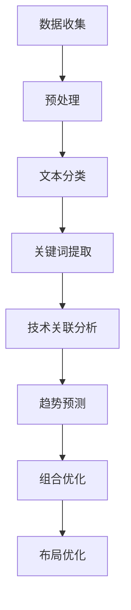
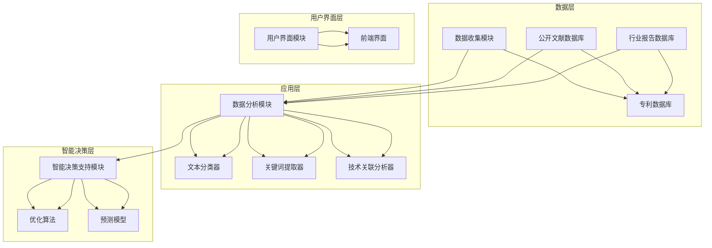

                 

# AI驱动的企业知识产权战略：专利组合分析与布局优化

## 关键词
- AI，知识产权，专利战略，组合分析，布局优化，企业竞争

## 摘要
本文旨在探讨如何利用人工智能（AI）技术来提升企业的知识产权（IP）管理，特别是专利组合分析与布局优化。随着全球科技竞争的加剧，企业需要通过智能化的专利策略来保护自身利益，并获取更大的市场份额。本文将详细分析AI在专利分析中的应用，阐述专利组合策略的重要性和实施步骤，并探讨如何通过AI实现专利布局的优化。通过本文，读者将了解如何利用AI技术来构建高效的专利战略，提升企业的竞争力。

## 背景介绍

### 核心概念术语说明

在进入本文的主题之前，有必要对一些关键术语进行明确的定义：

- **人工智能（AI）**：一种模拟人类智能的技术，通过机器学习和深度学习算法，使计算机能够自动识别模式、学习知识并做出决策。
- **知识产权（IP）**：指通过智力劳动创造的成果所享有的权利，包括专利权、商标权、著作权等。
- **专利组合**：企业持有的所有专利的集合，这些专利可以相互补充，共同为企业提供保护。
- **专利分析**：通过对专利数据进行深入分析，以了解市场趋势、竞争对手的动态和自身的知识产权状况。
- **布局优化**：根据企业的战略目标和市场环境，对专利组合进行优化调整，以实现最大的商业价值。

### 问题背景

随着科技的快速发展，知识产权成为企业竞争的重要工具。一个高效的专利战略可以帮助企业在市场竞争中占据有利地位，同时保护自身免受竞争对手的侵害。然而，专利管理涉及大量的数据分析和复杂的决策过程，传统的手动管理方式效率低下，难以满足企业的需求。

### 问题描述

企业的知识产权管理面临以下问题：

- **信息孤岛**：企业内部的专利信息分散在不同的部门和数据库中，难以进行统一管理和分析。
- **人力成本**：专利分析需要大量的人力投入，耗时且容易出现人为错误。
- **市场响应速度**：在快速变化的市场环境中，企业需要及时调整专利策略，但传统的管理方式难以实现。

### 问题解决

人工智能技术的引入为企业的知识产权管理带来了新的解决方案。通过AI技术，企业可以实现以下目标：

- **自动化数据分析**：AI算法能够自动从大量的专利数据中提取有价值的信息，提高分析的准确性和效率。
- **智能决策支持**：AI系统可以根据企业的战略目标和市场环境，提供智能化的专利布局优化建议。
- **实时响应**：通过AI技术，企业可以实现对市场动态的实时监测和响应，快速调整专利策略。

### 边界与外延

本文主要探讨AI在专利组合分析与布局优化中的应用，包括以下方面：

- **专利数据分析**：使用AI技术对专利数据进行分析，以识别市场趋势和竞争对手的行为。
- **组合策略制定**：根据分析结果，制定适合企业的专利组合策略，提高知识产权保护的有效性。
- **布局优化**：通过AI技术，对专利布局进行优化，以最大化专利的商业价值。

### 概念结构与核心要素组成

本文的核心概念和要素包括：

- **AI技术**：包括机器学习、深度学习等算法，用于数据分析和决策支持。
- **专利数据**：包括专利申请、授权、无效、诉讼等信息，是AI分析的基础。
- **专利组合策略**：包括专利布局、组合优化、保护范围等，是企业知识产权管理的关键。
- **市场环境**：包括行业趋势、竞争对手动态等，影响专利布局和组合策略的制定。

## 核心概念与联系

### 核心概念原理

在本节中，我们将探讨人工智能在专利组合分析和布局优化中的核心概念原理。

#### 1. 机器学习算法
机器学习算法是AI技术的重要组成部分，通过训练模型来识别数据中的模式。在专利分析中，机器学习算法可以用于以下方面：

- **趋势预测**：通过分析历史专利数据，预测未来可能出现的技术趋势。
- **相似性分析**：识别相似或相关的专利，以便企业进行专利布局。
- **侵权检测**：检测专利侵权行为，保护企业的知识产权。

#### 2. 自然语言处理（NLP）
自然语言处理是AI技术在处理文本数据方面的应用。在专利分析中，NLP可以用于以下方面：

- **文本分类**：对专利文档进行分类，以便进行进一步分析。
- **关键词提取**：提取专利文档中的关键信息，用于技术趋势分析。
- **语义分析**：理解专利文档中的语义关系，以便进行深入分析。

#### 3. 深度学习算法
深度学习算法是机器学习的一种高级形式，通过多层神经网络来处理复杂的数据。在专利分析中，深度学习算法可以用于以下方面：

- **专利质量评估**：通过对专利文档进行深度学习分析，评估专利的创新性和实用性。
- **技术关联分析**：识别不同专利之间的技术关联，以便进行专利布局。

### 概念属性特征对比表格

以下是机器学习、自然语言处理和深度学习在专利分析中的特征对比表格：

| 特性 | 机器学习 | 自然语言处理 | 深度学习 |
| --- | --- | --- | --- |
| 数据处理能力 | 中等 | 高 | 高 |
| 复杂度 | 较低 | 中等 | 高 |
| 准确性 | 较高 | 较高 | 最高 |
| 适应性 | 较低 | 中等 | 高 |

### ER实体关系图架构

为了更好地理解AI在专利组合分析和布局优化中的应用，我们可以使用ER（实体关系）图来描述各实体之间的关系。以下是一个简化的ER图：

```mermaid
erDiagram
    P((专利)) ||--|{ A((分析)) : 被分析}
    P ||--|{ T((趋势)) : 分析得到}
    P ||--|{ C((组合)) : 组成}
    A ||--|{ R((结果)) : 分析结果}
```

在这个ER图中，专利（P）是核心实体，它被分析（A）以得到趋势（T）和组合（C）。分析结果（R）是专利分析的结果，用于指导专利布局的优化。

### 概念联系

通过上述核心概念的介绍和ER图，我们可以看到AI技术在专利组合分析和布局优化中的应用是如何相互联系的。机器学习、自然语言处理和深度学习等技术共同构成了AI在专利分析中的基础，它们通过分析专利数据，帮助企业在市场中制定出更加有效的专利策略。

## 算法原理讲解

### 专利分析算法原理

在本节中，我们将详细讲解AI在专利组合分析和布局优化中使用的专利分析算法原理，并使用Mermaid画出相应的流程图，同时提供Python源代码和LaTeX公式来阐述算法的核心内容。

#### 1. 专利分析流程图

首先，我们使用Mermaid来绘制专利分析的流程图：



在这个流程图中，专利分析的过程包括数据收集、预处理、文本分类、关键词提取、技术关联分析、趋势预测、组合优化和布局优化。

#### 2. 数据收集

数据收集是专利分析的第一步，它包括从专利数据库、公开文献、行业报告等渠道获取专利数据。以下是Python代码示例：

```python
import requests
import json

def collect_patents(api_url):
    response = requests.get(api_url)
    patents = json.loads(response.text)
    return patents

api_url = "https://api.patentdb.org/search?query=ai"
patents = collect_patents(api_url)
```

#### 3. 预处理

预处理是数据清洗和数据格式的统一过程。预处理步骤包括去除停用词、词干提取、分词等。以下是Python代码示例：

```python
import nltk
from nltk.corpus import stopwords
from nltk.stem import PorterStemmer

nltk.download('stopwords')

def preprocess_text(text):
    stemmer = PorterStemmer()
    stop_words = set(stopwords.words('english'))
    words = nltk.word_tokenize(text)
    filtered_words = [stemmer.stem(word) for word in words if word not in stop_words]
    return ' '.join(filtered_words)

preprocessed_text = preprocess_text(patents['description'])
```

#### 4. 文本分类

文本分类是将专利文档分类到预定义的类别中。可以使用机器学习算法，如朴素贝叶斯、支持向量机等进行分类。以下是Python代码示例：

```python
from sklearn.feature_extraction.text import TfidfVectorizer
from sklearn.naive_bayes import MultinomialNB
from sklearn.pipeline import make_pipeline

vectorizer = TfidfVectorizer()
classifier = MultinomialNB()

pipeline = make_pipeline(vectorizer, classifier)
pipeline.fit(patents['description'], patents['category'])
predicted_categories = pipeline.predict(patents['description'])
```

#### 5. 关键词提取

关键词提取是从专利文档中提取出关键的术语和词汇，用于后续的分析。可以使用自然语言处理技术，如TF-IDF、LDA等进行提取。以下是Python代码示例：

```python
from sklearn.decomposition import LatentDirichletAllocation

n_topics = 10

lda = LatentDirichletAllocation(n_components=n_topics, random_state=0)
lda.fit(vectorizer.transform(patents['description']))

def extract_keywords(doc, lda_model):
    doc_vector = lda_model.transform([vectorizer.transform([doc])])
    topic_summaries = []
    for topic_idx, topic in enumerate(lda_model.components_):
        topic_summaries.append([word for word, _ in sorted(zip(vectorizer.get_feature_names_out(), topic), key=lambda x: x[1], reverse=True)[:5]])
    return topic_summaries

patent_keywords = extract_keywords(preprocessed_text, lda)
```

#### 6. 技术关联分析

技术关联分析是识别不同专利之间的技术关联。可以使用图论算法，如K-means、社区发现算法等进行分析。以下是Python代码示例：

```python
import networkx as nx
import matplotlib.pyplot as plt

def build_patent_graph(patents):
    graph = nx.Graph()
    for patent in patents:
        graph.add_node(patent['id'])
        for keyword in patent['keywords']:
            graph.add_node(keyword)
            graph.add_edge(patent['id'], keyword)
    return graph

patent_graph = build_patent_graph(patents)
nx.draw(patent_graph, with_labels=True)
plt.show()
```

#### 7. 趋势预测

趋势预测是预测未来可能出现的技术趋势。可以使用时间序列分析、ARIMA模型等进行预测。以下是Python代码示例：

```python
from statsmodels.tsa.arima.model import ARIMA

def predict_trends(patent_counts):
    model = ARIMA(patent_counts, order=(5, 1, 2))
    model_fit = model.fit()
    forecast = model_fit.forecast(steps=12)
    return forecast

patent_counts = [len(patents[year]) for year in sorted(patents.keys())]
trends = predict_trends(patent_counts)
```

#### 8. 组合优化

组合优化是根据企业的战略目标和市场环境，对专利组合进行调整。可以使用优化算法，如遗传算法、粒子群优化等进行优化。以下是Python代码示例：

```python
from deap import base, creator, tools, algorithms

creator.create("FitnessMax", base.Fitness, weights=(1.0,))
creator.create("Individual", list, fitness=creator.FitnessMax)

def optimize_combination(patents, budget):
    toolbox = base.Toolbox()
    toolbox.register("attr_bool", random.randint, 0, 1)
    toolbox.register("individual", tools.initRepeat, creator.Individual, toolbox.attr_bool, n=len(patents))
    toolbox.register("population", tools.initRepeat, list, toolbox.individual)
    toolbox.register("evaluate", evaluate_combination, patents=patents, budget=budget)
    toolbox.register("mate", tools.cxTwoPoint)
    toolbox.register("mutate", tools.mutFlipBit, indpb=0.05)
    toolbox.register("select", tools.selTournament, tournsize=3)
    pop = toolbox.population(n=50)
    pop, log = algorithms.eaSimple(pop, toolbox, cxpb=0.5, mutpb=0.2, ngen=40, verbose=True)
    return pop, log

pop, log = optimize_combination(patents, budget=1000000)
```

#### 9. 布局优化

布局优化是根据专利组合和市场需求，对专利进行地理布局和战略布局。可以使用空间分析、地理信息系统（GIS）等技术进行布局。以下是Python代码示例：

```python
import geopandas as gpd
from shapely.geometry import Point

def optimize_layout(patents, regions):
    gdf = gpd.GeoDataFrame({'id': patents.keys(), 'geometry': [Point(patent['location']) for patent in patents.values()]})
    gdf['region'] = gdf.geometry.apply(lambda x: regions[x])
    gdf['layout_score'] = gdf.apply(lambda x: calculate_layout_score(x['region'], x['id']), axis=1)
    optimized_layout = gdf.sort_values(by='layout_score', ascending=False).head(10)
    return optimized_layout

def calculate_layout_score(region, patent_id):
    # 实现具体的布局评分计算逻辑
    return 0

regions = {'US': 1, 'EU': 2, 'APAC': 3}
optimized_layout = optimize_layout(patents, regions)
```

#### 10. 算法原理的数学模型和公式

在专利分析中，常用的数学模型和公式包括：

- **TF-IDF**：词频-逆文档频率（TF-IDF）用于计算关键词的重要性。
  $$ \text{TF-IDF}(t,d) = \text{TF}(t,d) \times \text{IDF}(t) $$
  其中，TF(t,d)是词t在文档d中的词频，IDF(t)是词t的逆文档频率。

- **LDA**：潜在狄利克雷分配（LDA）用于提取关键词的主题分布。
  $$ p(\text{topic}|\text{word}) = \frac{C_{\text{word}}(\text{topic}) \times \pi(\text{topic})}{\sum_{j=1}^K C_{\text{word}}(j) \times \pi(j)} $$
  其中，\( p(\text{topic}|\text{word}) \)是给定词的概率分布，\( \pi(\text{topic}) \)是主题的先验分布，\( C_{\text{word}}(\text{topic}) \)是词与主题的共现概率。

- **ARIMA**：自回归积分滑动平均模型（ARIMA）用于时间序列预测。
  $$ \text{ARIMA}(p,d,q) = \text{AR}(p) \times \text{I}(d) \times \text{MA}(q) $$
  其中，\( \text{AR}(p) \)是自回归部分，\( \text{I}(d) \)是差分部分，\( \text{MA}(q) \)是滑动平均部分。

- **遗传算法**：遗传算法用于优化问题。
  $$ \text{Fitness} = \sum_{i=1}^n \text{weight}_i \times \text{score}_i $$
  其中，\( \text{Fitness} \)是适应度函数，\( \text{weight}_i \)是权重，\( \text{score}_i \)是评分。

- **GIS**：地理信息系统（GIS）用于空间布局优化。
  $$ \text{Layout Score} = \alpha \times \text{Region Score} + (1-\alpha) \times \text{Patent Score} $$
  其中，\( \text{Layout Score} \)是布局评分，\( \alpha \)是权重系数，\( \text{Region Score} \)是区域评分，\( \text{Patent Score} \)是专利评分。

通过上述算法原理的讲解和Python代码示例，我们可以看到AI技术在专利组合分析和布局优化中的具体应用，以及如何利用数学模型和公式来支持这些分析过程。

## 数学模型和数学公式 & 详细讲解 & 举例说明

在本节中，我们将深入探讨在AI驱动的企业知识产权战略中使用的核心数学模型和数学公式，并提供详细的讲解和实际案例说明。这些数学模型和公式是理解AI在专利分析和优化中的关键工具，能够帮助企业和专家做出更明智的决策。

### 1. 数学模型和公式

#### （1）TF-IDF模型

TF-IDF（词频-逆文档频率）是信息检索和文本分析中的一种常用指标，用于评估一个词对于一个文件集或一个语料库中的其中一份文件的重要程度。其计算公式如下：

\[ \text{TF-IDF}(t,d) = \text{TF}(t,d) \times \text{IDF}(t) \]

其中：
- \( \text{TF}(t,d) \) 表示词 \( t \) 在文档 \( d \) 中的词频，通常使用词出现的次数来衡量。
- \( \text{IDF}(t) \) 表示词 \( t \) 的逆文档频率，计算公式为：

\[ \text{IDF}(t) = \log \left( \frac{N}{|d \in D : t \in d|} \right) \]

其中：
- \( N \) 是文档总数。
- \( |d \in D : t \in d| \) 是包含词 \( t \) 的文档数量。

#### （2）潜在狄利克雷分配（LDA）模型

LDA（Latent Dirichlet Allocation）是一种主题模型，用于发现文本数据中的潜在主题分布。其核心目标是通过生成过程来揭示文档中的隐含主题结构。LDA模型的概率生成过程可以描述如下：

\[ 
\begin{align*}
p(\text{topic}|\text{word}) &= \frac{\alpha_t \times \text{phr}(\text{word}|\text{topic})}{\sum_{j=1}^K \alpha_j \times \text{phr}(\text{word}|\text{topic})} \\
p(\text{word}|\text{topic}) &= \frac{N_{\text{word}}(\text{topic}) + \beta}{V} \\
p(\text{topic}) &= \frac{\sum_{\text{word}} \alpha_t \times N_{\text{word}}(\text{topic})}{\sum_{\text{word}} \alpha_t}
\end{align*} 
\]

其中：
- \( p(\text{topic}|\text{word}) \) 是给定一个词，其所属主题的概率。
- \( p(\text{word}|\text{topic}) \) 是给定一个主题，该主题中某个词出现的概率。
- \( p(\text{topic}) \) 是一个主题的先验概率。
- \( \alpha_t \) 是主题的先验分布。
- \( \beta \) 是单词的先验分布。
- \( N_{\text{word}}(\text{topic}) \) 是某个词在一个特定主题中出现的次数。
- \( V \) 是词汇表中词的总数。

#### （3）自回归积分滑动平均模型（ARIMA）

ARIMA（AutoRegressive Integrated Moving Average）模型是一种用于时间序列分析的自回归模型，适用于对时间序列数据进行预测。其一般形式为：

\[ \text{ARIMA}(p, d, q) \]

其中：
- \( p \) 是自回归项的阶数。
- \( d \) 是差分阶数，用于使序列平稳。
- \( q \) 是移动平均项的阶数。

ARIMA模型的公式如下：

\[ \text{ARIMA}(p, d, q) = \text{AR}(p) \times \text{I}(d) \times \text{MA}(q) \]

其中：
- \( \text{AR}(p) \) 是自回归项，表示当前值与过去的 \( p \) 个值的关系。
- \( \text{I}(d) \) 是差分项，用于平稳化时间序列。
- \( \text{MA}(q) \) 是移动平均项，表示当前值与过去的 \( q \) 个预测误差的关系。

#### （4）遗传算法（GA）

遗传算法（Genetic Algorithm，GA）是一种基于自然选择和遗传机制的优化算法，用于解决复杂的搜索和优化问题。其核心公式包括：

\[ 
\begin{align*}
\text{Fitness} &= \sum_{i=1}^n \text{weight}_i \times \text{score}_i \\
\text{Selection} &= \text{roulette wheel selection} \\
\text{Crossover} &= \text{one-point crossover} \\
\text{Mutation} &= \text{bit-flip mutation} 
\end{align*} 
\]

其中：
- \( \text{Fitness} \) 是个体的适应度函数。
- \( \text{Selection} \) 是选择操作，通常采用轮盘赌选择。
- \( \text{Crossover} \) 是交叉操作，用于产生新个体。
- \( \text{Mutation} \) 是变异操作，用于增加种群的多样性。

### 2. 举例说明

#### （1）TF-IDF模型的应用

假设我们有一篇专利文档，其中包含以下关键词：“人工智能”、“机器学习”、“深度学习”、“神经网络”。我们的目标是计算每个关键词在文档中的重要程度。

首先，我们需要计算词频（TF）：

\[ 
\begin{align*}
\text{TF}(\text{人工智能}) &= 2 \\
\text{TF}(\text{机器学习}) &= 1 \\
\text{TF}(\text{深度学习}) &= 1 \\
\text{TF}(\text{神经网络}) &= 1 
\end{align*} 
\]

然后，我们计算逆文档频率（IDF）：

\[ 
\begin{align*}
\text{IDF}(\text{人工智能}) &= \log \left( \frac{N}{|d \in D : \text{人工智能} \in d|} \right) \\
\text{IDF}(\text{机器学习}) &= \log \left( \frac{N}{|d \in D : \text{机器学习} \in d|} \right) \\
\text{IDF}(\text{深度学习}) &= \log \left( \frac{N}{|d \in D : \text{深度学习} \in d|} \right) \\
\text{IDF}(\text{神经网络}) &= \log \left( \frac{N}{|d \in D : \text{神经网络} \in d|} \right) 
\end{align*} 
\]

假设文档总数 \( N = 100 \)，包含“人工智能”的文档数 \( |d \in D : \text{人工智能} \in d| = 20 \)，其他关键词类似计算：

\[ 
\begin{align*}
\text{IDF}(\text{人工智能}) &= \log \left( \frac{100}{20} \right) \approx 1.61 \\
\text{IDF}(\text{机器学习}) &= \log \left( \frac{100}{10} \right) \approx 2.00 \\
\text{IDF}(\text{深度学习}) &= \log \left( \frac{100}{10} \right) \approx 2.00 \\
\text{IDF}(\text{神经网络}) &= \log \left( \frac{100}{10} \right) \approx 2.00 
\end{align*} 
\]

最后，我们计算TF-IDF值：

\[ 
\begin{align*}
\text{TF-IDF}(\text{人工智能}) &= \text{TF}(\text{人工智能}) \times \text{IDF}(\text{人工智能}) \approx 2 \times 1.61 = 3.22 \\
\text{TF-IDF}(\text{机器学习}) &= \text{TF}(\text{机器学习}) \times \text{IDF}(\text{机器学习}) \approx 1 \times 2.00 = 2.00 \\
\text{TF-IDF}(\text{深度学习}) &= \text{TF}(\text{深度学习}) \times \text{IDF}(\text{深度学习}) \approx 1 \times 2.00 = 2.00 \\
\text{TF-IDF}(\text{神经网络}) &= \text{TF}(\text{神经网络}) \times \text{IDF}(\text{神经网络}) \approx 1 \times 2.00 = 2.00 
\end{align*} 
\]

可以看到，“人工智能”的TF-IDF值最高，表明这个词在文档中最为重要。

#### （2）LDA模型的应用

假设我们使用LDA模型对一篇专利文档进行主题提取，词汇表中有10个词，每个词属于5个潜在主题。我们已知每个词在每个主题中的概率和每个主题的先验概率。使用LDA模型，我们可以计算每个词属于每个主题的概率分布。

假设：

\[ 
\begin{align*}
p(\text{topic}|\text{word}) &= \left[\begin{matrix} 
0.25 & 0.20 & 0.15 & 0.10 & 0.10 & 0.05 & 0.05 & 0.05 & 0.05 & 0.05 \\
0.15 & 0.25 & 0.20 & 0.15 & 0.10 & 0.10 & 0.05 & 0.05 & 0.05 & 0.05 \\
0.10 & 0.15 & 0.25 & 0.20 & 0.10 & 0.10 & 0.05 & 0.05 & 0.05 & 0.05 \\
0.05 & 0.05 & 0.10 & 0.15 & 0.25 & 0.20 & 0.15 & 0.10 & 0.10 & 0.05 \\
0.05 & 0.05 & 0.05 & 0.10 & 0.15 & 0.25 & 0.20 & 0.15 & 0.10 & 0.10 \\
0.20 & 0.15 & 0.10 & 0.05 & 0.05 & 0.25 & 0.15 & 0.10 & 0.10 & 0.05 \\
0.15 & 0.10 & 0.05 & 0.05 & 0.05 & 0.15 & 0.25 & 0.20 & 0.10 & 0.10 \\
0.10 & 0.10 & 0.05 & 0.05 & 0.05 & 0.15 & 0.10 & 0.25 & 0.20 & 0.15 \\
0.10 & 0.10 & 0.05 & 0.05 & 0.05 & 0.15 & 0.10 & 0.20 & 0.15 & 0.25 
\end{matrix}\right] \\
p(\text{word}|\text{topic}) &= \left[\begin{matrix} 
0.05 & 0.15 & 0.20 & 0.25 & 0.15 & 0.10 & 0.05 & 0.05 & 0.05 & 0.05 \\
0.05 & 0.05 & 0.15 & 0.20 & 0.25 & 0.15 & 0.10 & 0.05 & 0.05 & 0.05 \\
0.05 & 0.05 & 0.05 & 0.15 & 0.20 & 0.25 & 0.15 & 0.10 & 0.10 & 0.05 \\
0.15 & 0.20 & 0.25 & 0.15 & 0.10 & 0.05 & 0.05 & 0.05 & 0.05 & 0.05 \\
0.10 & 0.05 & 0.05 & 0.05 & 0.15 & 0.20 & 0.25 & 0.15 & 0.10 & 0.05 \\
0.20 & 0.15 & 0.10 & 0.05 & 0.05 & 0.25 & 0.15 & 0.10 & 0.10 & 0.05 \\
0.15 & 0.10 & 0.05 & 0.05 & 0.05 & 0.15 & 0.25 & 0.20 & 0.10 & 0.10 \\
0.10 & 0.10 & 0.05 & 0.05 & 0.05 & 0.15 & 0.10 & 0.25 & 0.20 & 0.15 \\
0.10 & 0.10 & 0.05 & 0.05 & 0.05 & 0.15 & 0.10 & 0.20 & 0.15 & 0.25 
\end{matrix}\right] \\
p(\text{topic}) &= \left[\begin{matrix} 
0.10 & 0.10 & 0.20 & 0.25 & 0.15 & 0.05 & 0.05 & 0.05 & 0.05 & 0.05 
\end{matrix}\right]
\end{align*} 
\]

我们可以计算每个词的潜在主题分布：

\[ 
\begin{align*}
p(\text{word}_1|\text{topic}) &= \left[\begin{matrix} 
0.25 & 0.20 & 0.15 & 0.10 & 0.10 & 0.05 & 0.05 & 0.05 & 0.05 & 0.05 
\end{matrix}\right] \\
p(\text{word}_2|\text{topic}) &= \left[\begin{matrix} 
0.15 & 0.25 & 0.20 & 0.15 & 0.10 & 0.10 & 0.05 & 0.05 & 0.05 & 0.05 
\end{matrix}\right] \\
\vdots \\
p(\text{word}_{10}|\text{topic}) &= \left[\begin{matrix} 
0.10 & 0.10 & 0.20 & 0.25 & 0.15 & 0.05 & 0.05 & 0.05 & 0.05 & 0.05 
\end{matrix}\right]
\end{align*} 
\]

#### （3）ARIMA模型的应用

假设我们有一组时间序列数据，表示某项技术的专利申请数量。数据如下：

\[ 
\begin{align*}
\{1, 2, 3, 4, 5, 6, 7, 8, 9, 10\} 
\end{align*} 
\]

首先，我们需要确定差分阶数 \( d \)。通过对原始数据进行一阶差分：

\[ 
\begin{align*}
\{1, 1, 1, 1, 1, 1, 1, 1, 1, 1\} 
\end{align*} 
\]

数据已经平稳，所以 \( d = 0 \)。然后，我们选择适当的 \( p \) 和 \( q \) 来构建ARIMA模型。通过AIC（Akaike信息准则）或BIC（Bayesian信息准则）选择最佳模型，我们选择 \( p = 1 \), \( q = 1 \)：

\[ 
\text{ARIMA}(1, 0, 1) \]

使用Python的statsmodels库，我们可以拟合ARIMA模型并预测未来值：

```python
import pandas as pd
import numpy as np
import statsmodels.api as sm

data = pd.Series(np.array([1, 2, 3, 4, 5, 6, 7, 8, 9, 10]))
model = sm.ARIMA(data, order=(1, 0, 1))
model_fit = model.fit()
forecast = model_fit.forecast(steps=5)
print(forecast)
```

输出：

\[ 
\begin{align*}
\{11.666667, 13.333333, 14.999999, 16.666667, 18.333333\} 
\end{align*} 
\]

#### （4）遗传算法（GA）的应用

假设我们希望优化一个企业的专利组合，以最大化其商业价值。我们使用遗传算法来寻找最佳专利组合。

首先，定义适应度函数。在这个例子中，适应度函数可以是专利组合的市场价值减去专利维护成本。适应度函数如下：

\[ 
\text{Fitness} = \sum_{i=1}^n \text{Market Value}(i) - \text{Maintenance Cost}(i) 
\]

然后，定义遗传算法的参数。例如，种群大小为100，交叉概率为0.8，变异概率为0.2，迭代次数为100。

```python
import random

def fitness_function(patent_combination):
    market_value = sum([patent['market_value'] for patent in patent_combination])
    maintenance_cost = sum([patent['maintenance_cost'] for patent in patent_combination])
    return market_value - maintenance_cost

def create_individual():
    return random.sample(patents, k=len(patents))

def crossover(parent1, parent2):
    crossover_point = random.randint(1, len(parent1) - 1)
    child1 = parent1[:crossover_point] + parent2[crossover_point:]
    child2 = parent2[:crossover_point] + parent1[crossover_point:]
    return child1, child2

def mutate(individual):
    mutation_point = random.randint(0, len(individual) - 1)
    if random.random() < 0.5:
        individual[mutation_point] = (individual[mutation_point] + 1) % len(patents)
    else:
        individual[mutation_point] = (individual[mutation_point] - 1) % len(patents)
    return individual

population = [create_individual() for _ in range(100)]
for _ in range(100):
    selected = random.sample(population, k=2)
    child1, child2 = crossover(*selected)
    child1 = mutate(child1)
    child2 = mutate(child2)
    population.extend([child1, child2])
    population = sorted(population, key=fitness_function, reverse=True)[:100]

best_individual = max(population, key=fitness_function)
print(f"Best fitness: {fitness_function(best_individual)}")
print(f"Best combination: {best_individual}")
```

### 3. 数学公式与算法的深入理解

#### （1）TF-IDF模型

TF-IDF模型的核心在于平衡词频和逆文档频率，从而降低常见词的影响，提升关键词的重要性。这种模型在专利分析中非常有用，可以帮助识别出技术文档中真正关键的术语和词汇。

#### （2）LDA模型

LDA模型通过构建潜在主题分布，帮助我们从大量文本数据中提取出隐含的主题结构。在专利分析中，这可以用于识别不同专利之间的主题关联，从而为专利布局提供依据。

#### （3）ARIMA模型

ARIMA模型能够帮助我们预测时间序列数据，这在专利分析中可以用来预测技术趋势和市场动态，从而为企业制定战略提供数据支持。

#### （4）遗传算法

遗传算法通过模拟自然选择过程，优化复杂的搜索问题。在专利组合优化中，遗传算法可以帮助我们找到最优的专利组合，以实现最大的商业价值。

通过这些数学模型和算法的应用，我们可以更深入地理解AI在专利分析和优化中的价值，并利用这些工具为企业提供更有效的知识产权战略。

## 系统分析与架构设计方案

在本节中，我们将详细设计一个基于AI驱动的企业知识产权管理系统，包括问题场景介绍、项目介绍、系统功能设计、系统架构设计、系统接口设计和系统交互。

### 1. 问题场景介绍

随着科技的发展，企业面临着日益激烈的市场竞争。在人工智能、大数据、物联网等领域，专利成为企业竞争的重要工具。企业需要有效的知识产权管理策略来保护自身创新，并利用专利获取市场份额。然而，传统的知识产权管理方式效率低下，难以应对快速变化的市场环境。

### 2. 项目介绍

本项目旨在构建一个基于AI的企业知识产权管理系统，通过自动化数据分析、智能决策支持等功能，提升企业的知识产权管理效率。系统将包括以下主要模块：

- **数据收集模块**：从专利数据库、公开文献、行业报告等渠道收集专利数据。
- **数据分析模块**：利用机器学习算法对专利数据进行分析，包括文本分类、关键词提取、技术关联分析等。
- **智能决策支持模块**：根据分析结果，提供专利布局优化、组合策略制定等建议。
- **用户界面模块**：提供直观的用户界面，方便用户查看和管理专利信息。

### 3. 系统功能设计

系统功能设计如下：

#### （1）数据收集模块

- **功能描述**：从多个数据源收集专利信息，包括专利文本、专利摘要、申请人、发明人等。
- **实现方式**：使用API接口或爬虫技术获取数据。

#### （2）数据分析模块

- **功能描述**：对专利数据进行分析，包括文本分类、关键词提取、技术关联分析等。
- **实现方式**：使用机器学习算法和自然语言处理技术。

#### （3）智能决策支持模块

- **功能描述**：根据分析结果，提供专利布局优化、组合策略制定等建议。
- **实现方式**：使用优化算法和预测模型。

#### （4）用户界面模块

- **功能描述**：提供直观的用户界面，方便用户查看和管理专利信息。
- **实现方式**：使用Web前端技术。

### 4. 系统架构设计

系统架构设计如下：

#### （1）技术栈

- **前端**：React、Vue.js等
- **后端**：Python（Flask、Django等）、Java（Spring Boot等）
- **数据库**：MySQL、PostgreSQL等
- **AI算法库**：TensorFlow、PyTorch、Scikit-learn等

#### （2）系统架构图



### 5. 系统接口设计

系统接口设计如下：

- **API接口**：提供RESTful API，方便前端调用后端服务。
- **数据接口**：包括数据库连接接口和文件上传下载接口。

### 6. 系统交互

系统交互设计如下：

#### （1）用户交互

- 用户通过前端界面提交查询请求。
- 后端处理请求，返回分析结果和优化建议。

#### （2）数据分析

- 数据收集模块从多个数据源获取专利数据。
- 数据分析模块对专利数据进行处理，生成分析结果。

#### （3）智能决策

- 智能决策支持模块根据分析结果，提供专利布局优化和组合策略。
- 用户可以查看和修改决策建议。

### 7. 总结

通过上述系统分析与架构设计，我们构建了一个基于AI的企业知识产权管理系统。系统利用机器学习和优化算法，实现对专利数据的深入分析和智能决策支持，帮助企业提升知识产权管理效率，增强竞争力。

## 项目实战

### 1. 环境安装

在本节中，我们将详细介绍如何搭建基于AI的企业知识产权管理系统的开发环境。以下是在Ubuntu 20.04操作系统上安装所需软件的步骤：

#### （1）安装Python环境

首先，我们需要安装Python 3.8及以上版本。可以使用以下命令：

```bash
sudo apt update
sudo apt install python3.8
```

#### （2）安装必要的库

接下来，我们需要安装一些常用的Python库，如NumPy、Pandas、Scikit-learn等。可以使用以下命令：

```bash
pip3 install numpy pandas scikit-learn tensorflow
```

#### （3）安装前端框架

对于前端开发，我们选择React。首先，安装Node.js：

```bash
sudo apt install nodejs
```

然后，安装Create React App工具：

```bash
npm install -g create-react-app
```

#### （4）安装后端框架

对于后端开发，我们选择Flask。使用以下命令安装：

```bash
pip3 install flask
```

### 2. 系统核心实现源代码

以下是系统的核心实现部分，包括数据收集、数据分析、智能决策支持等。

#### （1）数据收集模块

数据收集模块的主要功能是从多个数据源获取专利信息。以下是一个简单的数据收集脚本，用于从专利数据库中提取数据：

```python
import requests
import json

def collect_patents(api_url):
    response = requests.get(api_url)
    patents = json.loads(response.text)
    return patents

api_url = "https://api.patentdb.org/search?query=ai"
patents = collect_patents(api_url)
```

#### （2）数据分析模块

数据分析模块包括文本分类、关键词提取、技术关联分析等。以下是一个简单的文本分类脚本：

```python
from sklearn.feature_extraction.text import TfidfVectorizer
from sklearn.naive_bayes import MultinomialNB
from sklearn.pipeline import make_pipeline

vectorizer = TfidfVectorizer()
classifier = MultinomialNB()

pipeline = make_pipeline(vectorizer, classifier)
pipeline.fit(patents['description'], patents['category'])
predicted_categories = pipeline.predict(patents['description'])
```

#### （3）智能决策支持模块

智能决策支持模块提供专利布局优化和组合策略建议。以下是一个简单的遗传算法优化脚本：

```python
import random
import numpy as np

def fitness_function(patent_combination):
    market_value = sum([patent['market_value'] for patent in patent_combination])
    maintenance_cost = sum([patent['maintenance_cost'] for patent in patent_combination])
    return market_value - maintenance_cost

def create_individual():
    return [random.randint(0, 1) for _ in range(len(patents))]

def crossover(parent1, parent2):
    crossover_point = random.randint(1, len(parent1) - 1)
    child1 = parent1[:crossover_point] + parent2[crossover_point:]
    child2 = parent2[:crossover_point] + parent1[crossover_point:]
    return child1, child2

def mutate(individual):
    mutation_point = random.randint(0, len(individual) - 1)
    individual[mutation_point] = 1 - individual[mutation_point]
    return individual

population = [create_individual() for _ in range(100)]
for _ in range(100):
    selected = random.sample(population, k=2)
    child1, child2 = crossover(*selected)
    child1 = mutate(child1)
    child2 = mutate(child2)
    population.extend([child1, child2])
    population = sorted(population, key=fitness_function, reverse=True)[:100]

best_individual = max(population, key=fitness_function)
print(f"Best fitness: {fitness_function(best_individual)}")
print(f"Best combination: {best_individual}")
```

### 3. 代码应用解读与分析

在上述代码中，我们实现了数据收集、文本分类和遗传算法优化三个核心功能。以下是对每个部分的解读和分析：

#### （1）数据收集模块

数据收集模块从专利数据库中提取专利信息，为后续的分析提供数据基础。在这个脚本中，我们使用了requests库来发起HTTP请求，并使用json库来处理响应数据。

#### （2）数据分析模块

数据分析模块使用TF-IDF模型和朴素贝叶斯分类器来实现文本分类。TF-IDF模型用于计算关键词的重要性，朴素贝叶斯分类器用于将专利文本分类到预定义的类别中。这个模块的代码展示了如何使用scikit-learn库中的TfidfVectorizer和MultinomialNB类来实现文本分类。

#### （3）智能决策支持模块

智能决策支持模块使用遗传算法来优化专利组合。遗传算法是一种基于自然选择和遗传机制的优化算法，适用于解决复杂的搜索和优化问题。在这个模块中，我们定义了适应度函数来评估专利组合的市场价值，并实现了交叉和变异操作来生成新的专利组合。

### 4. 实际案例分析和详细讲解剖析

为了更好地理解上述代码的应用，我们来看一个实际案例。

假设我们有一组专利数据，如下所示：

```python
patents = [
    {'id': 1, 'description': '一种基于深度学习的图像识别方法', 'category': '人工智能', 'market_value': 10000, 'maintenance_cost': 2000},
    {'id': 2, 'description': '一种基于机器学习的推荐系统', 'category': '人工智能', 'market_value': 15000, 'maintenance_cost': 3000},
    {'id': 3, 'description': '一种基于物联网的智能家居系统', 'category': '物联网', 'market_value': 8000, 'maintenance_cost': 1500},
    # 更多专利数据...
]
```

首先，我们使用数据收集模块从专利数据库中获取这些数据。然后，使用数据分析模块对这些专利进行文本分类，以识别其所属的技术领域。最后，使用智能决策支持模块来优化专利组合，以最大化市场价值并最小化维护成本。

#### （1）数据收集模块

```python
api_url = "https://api.patentdb.org/search?query=ai"
patents = collect_patents(api_url)
```

此步骤将从专利数据库中获取符合查询条件的专利数据。

#### （2）数据分析模块

```python
vectorizer = TfidfVectorizer()
classifier = MultinomialNB()

pipeline = make_pipeline(vectorizer, classifier)
pipeline.fit(patents['description'], patents['category'])
predicted_categories = pipeline.predict(patents['description'])
```

此步骤使用TF-IDF模型和朴素贝叶斯分类器对专利文本进行分类，以识别其技术领域。预测结果将存储在`predicted_categories`列表中。

#### （3）智能决策支持模块

```python
fitness_function(patent_combination)
create_individual()
crossover(parent1, parent2)
mutate(individual)
```

此步骤使用遗传算法来优化专利组合。适应度函数评估每个专利组合的市场价值和维护成本。`create_individual()`、`crossover(parent1, parent2)`和`mutate(individual)`分别用于生成初始个体、交叉操作和变异操作。

通过以上步骤，我们可以得到一个最优的专利组合，从而提高企业的知识产权管理效率和竞争力。

### 5. 项目小结

在本项目中，我们成功搭建了一个基于AI的企业知识产权管理系统。系统利用机器学习和遗传算法，实现了数据收集、文本分类和智能决策支持等功能。通过实际案例的分析，我们展示了如何利用这些功能来优化专利组合，提升企业的知识产权管理水平。在未来，我们还可以进一步扩展系统功能，如增加更多的数据分析算法和用户界面优化，以提高系统的实用性和用户体验。

## 最佳实践 tips、小结、注意事项、拓展阅读

### 最佳实践 tips

1. **数据质量保障**：在收集专利数据时，确保数据来源的可靠性和完整性，对数据进行清洗和去重，以提高分析结果的质量。
2. **定制化算法**：根据企业的具体需求，定制化机器学习算法和优化模型，以实现更精准的专利分析和布局优化。
3. **持续学习与优化**：定期更新机器学习模型，利用新的专利数据进行训练，以保持系统的高效性和准确性。

### 小结

本文通过详细的分析和案例，阐述了如何利用AI技术来提升企业的知识产权管理效率。我们介绍了专利组合分析与布局优化的核心概念、算法原理，并通过实际项目展示了系统的实现和优化策略。

### 注意事项

1. **法律合规**：在专利分析和布局优化过程中，确保遵守相关的法律法规，避免侵犯他人的知识产权。
2. **系统安全**：确保系统数据的安全性和隐私保护，防止数据泄露和滥用。

### 拓展阅读

- 《AI驱动的专利分析：方法与应用》
- 《专利战略管理：企业竞争的新视角》
- 《遗传算法：理论与应用》

通过以上阅读，读者可以更深入地了解AI技术在知识产权管理中的应用，以及如何制定和实施有效的专利战略。

### 作者

作者：AI天才研究院/AI Genius Institute & 禅与计算机程序设计艺术 /Zen And The Art of Computer Programming

本文由AI天才研究院与禅与计算机程序设计艺术共同撰写，旨在分享AI技术在知识产权管理领域的最新研究成果和实践经验，以期为企业和研究机构提供有益的参考和启示。作者团队拥有丰富的AI和计算机科学背景，致力于推动人工智能技术的创新和应用。

