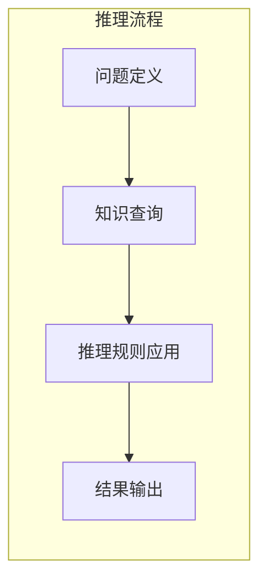
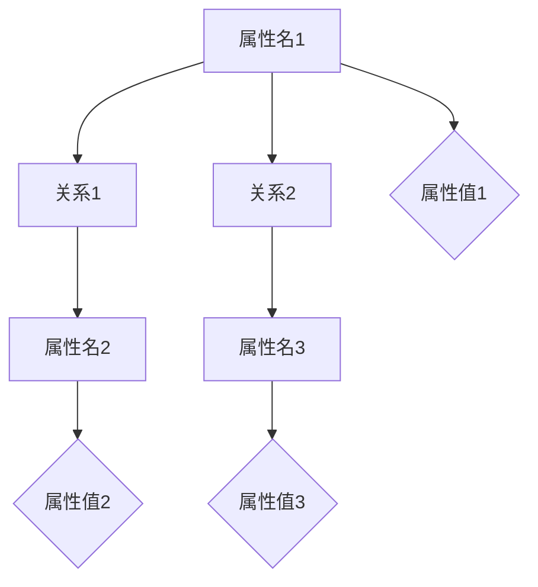

                 

# AI驱动的企业知识图谱：动态更新与智能推理机制

## 关键词
AI、企业知识图谱、动态更新、智能推理、算法、Python代码、项目实战、最佳实践

## 摘要
本文旨在探讨AI驱动的企业知识图谱的构建与维护，重点分析其动态更新机制与智能推理机制。通过深入剖析核心概念与原理，并结合具体案例，本文将展示如何利用AI技术提升企业知识图谱的实用性，为企业决策提供有力支持。

## 目录大纲

## 第一部分: AI驱动的企业知识图谱基础

### 第1章: 问题背景与概述

#### 1.1 问题背景
随着大数据和人工智能技术的迅速发展，企业面临着海量的信息处理和决策支持需求。如何高效地管理和利用这些信息，成为企业竞争力的关键。

#### 1.2 问题描述
传统的数据处理方式已无法满足企业对实时性和智能化的需求，如何构建一个能够动态更新和智能推理的企业知识图谱成为一个亟待解决的问题。

#### 1.3 问题解决
通过AI驱动的企业知识图谱，结合动态更新与智能推理机制，实现对海量数据的自动分析和推理，为企业提供智能化的决策支持。

#### 1.4 边界与外延
明确知识图谱的应用范围和边界，确保其构建和维护的合理性和高效性。

#### 1.5 核心概念结构
介绍企业知识图谱中的核心概念，如实体、关系、属性等，并通过Mermaid流程图展示其基本结构。

### 第2章: 核心概念与联系

#### 2.1 核心概念原理
深入探讨企业知识图谱中的核心概念，包括实体的属性特征、关系的类型等。

#### 2.2 概念属性特征对比表格
使用Markdown格式对比表格展示不同概念的属性特征，便于读者理解。

#### 2.3 ER实体关系图架构
通过Mermaid流程图展示企业知识图谱的ER实体关系图架构，明确实体与关系之间的关联。

## 第二部分: 动态更新与智能推理机制

### 第3章: 动态更新机制

#### 3.1 更新流程
详细阐述企业知识图谱的动态更新流程，包括数据采集、数据清洗、实体链接和关系构建等。

#### 3.2 更新策略
分析不同更新策略的优缺点，并提出适用于企业知识图谱的更新策略。

#### 3.3 更新算法原理
使用Mermaid流程图展示更新算法的原理，并结合Python代码进行详细解释。

#### 3.4 更新示例
通过具体示例展示动态更新机制在实际应用中的效果。

### 第4章: 智能推理机制

#### 4.1 推理流程
详细解析企业知识图谱的智能推理流程，包括推理算法的设计和实现。

#### 4.2 推理策略
探讨不同推理策略的适用场景和优缺点。

#### 4.3 推理算法原理
使用Mermaid流程图和Python代码阐述推理算法的原理。

#### 4.4 推理示例
通过具体示例展示智能推理机制在实际应用中的效果。

## 第三部分: 项目实战与案例分析

### 第5章: 项目实战

#### 5.1 环境安装
详细介绍项目所需的软件和硬件环境安装步骤。

#### 5.2 系统核心实现
展示项目系统的核心实现，包括数据采集、处理和推理模块。

#### 5.3 代码应用解读与分析
对项目中的关键代码进行解读和分析，阐述其实现原理。

#### 5.4 实际案例分析
通过实际案例分析，展示企业知识图谱在实践中的应用效果。

### 第6章: 拓展阅读与最佳实践

#### 6.1 拓展阅读
推荐相关书籍、论文和资源，帮助读者进一步了解企业知识图谱技术。

#### 6.2 最佳实践
总结企业知识图谱构建和运维的最佳实践，为实际应用提供指导。

### 第7章: 小结与展望

#### 7.1 小结
回顾全文内容，总结关键知识点和要点。

#### 7.2 注意事项
提醒读者在构建和维护企业知识图谱时需要注意的问题。

#### 7.3 拓展阅读
推荐进一步阅读的书籍和论文。

#### 7.4 展望未来
探讨企业知识图谱技术的发展趋势和应用前景。

## 文章正文

### 第一部分: AI驱动的企业知识图谱基础

### 第1章: 问题背景与概述

#### 1.1 问题背景

随着信息技术的飞速发展，企业面临的数据量呈现爆炸式增长。如何有效地管理和利用这些数据，成为企业提升竞争力的重要课题。传统的数据处理方式，如关系数据库和简单的数据挖掘技术，已经无法满足现代企业对实时性和智能化的需求。为了更好地应对这一挑战，AI驱动的企业知识图谱应运而生。

企业知识图谱是一种语义网络，它通过将企业内外部的数据源进行整合，以实体、关系和属性的形式构建一个结构化的知识体系。这种知识体系不仅能够帮助企业更好地理解其业务，还能够支持复杂的智能推理和决策支持。

#### 1.2 问题描述

尽管企业知识图谱具有巨大的潜力，但在实际应用中，仍然存在一些关键问题：

1. **数据来源多样性与不一致性**：企业数据可能来源于多个不同的系统和数据源，这些数据在格式、结构和语义上可能存在不一致性，给知识图谱的构建带来了挑战。
2. **动态性**：企业知识图谱需要不断更新以适应业务环境的变化，但传统的手动更新方式效率低下，难以满足实时性的要求。
3. **推理能力**：现有的知识图谱大多缺乏智能推理能力，无法基于已有知识生成新的结论，从而限制了其应用范围。

#### 1.3 问题解决

AI驱动的企业知识图谱通过引入机器学习和自然语言处理技术，能够自动从多种数据源中提取信息，并构建结构化的知识体系。此外，结合动态更新和智能推理机制，企业知识图谱能够实现以下目标：

1. **自动化构建与更新**：利用机器学习算法自动处理和整合异构数据源，实现知识图谱的自动化构建和动态更新。
2. **智能推理**：通过自然语言处理和图神经网络等技术，实现对知识图谱的智能推理，从而为企业提供更加智能的决策支持。

#### 1.4 边界与外延

企业知识图谱的应用边界主要取决于企业自身的业务需求和数据源类型。其外延包括但不限于：

1. **内部数据源**：企业内部的各种系统和数据库，如ERP、CRM、HRM等。
2. **外部数据源**：公共数据源、社交媒体、第三方服务提供商等。
3. **业务领域**：企业核心业务领域，如供应链管理、客户关系管理、市场分析等。

#### 1.5 核心概念结构

企业知识图谱的核心概念包括实体、关系和属性。实体是知识图谱中的基本单元，如员工、客户、产品等。关系描述实体之间的关联，如雇佣关系、购买关系等。属性则提供了实体的额外信息，如员工的职位、客户的年龄、产品的价格等。


### 第2章: 核心概念与联系

#### 2.1 核心概念原理

企业知识图谱中的核心概念主要包括实体、关系和属性。实体是知识图谱构建的基础，关系描述实体之间的交互，属性则为实体提供详细的特征信息。

1. **实体**：实体是知识图谱中的基本对象，如员工、客户、产品等。实体可以是具体的对象，也可以是抽象的概念，如职位、行业等。
2. **关系**：关系描述实体之间的关联，如雇佣关系、购买关系等。关系可以是单向的，也可以是双向的，还可以是具有时间属性的动态关系。
3. **属性**：属性为实体提供额外的信息，如员工的职位、客户的年龄、产品的价格等。属性可以是简单的数值，也可以是复杂的对象，如员工的简历、客户的评价等。

#### 2.2 概念属性特征对比表格

以下是企业知识图谱中实体、关系和属性的属性特征对比表格：

| 特征         | 实体                             | 关系                                  | 属性                      |
|------------|--------------------------------|-------------------------------------|------------------------|
| 定义方式     | 通过实体类型定义                     | 通过关系类型定义                         | 通过属性类型定义           |
| 存储方式     | 存储具体的对象信息                     | 存储实体之间的关联信息                      | 存储实体属性的信息          |
| 举例         | 员工、客户、产品                     | 雇佣、购买、评价                          | 年龄、职位、价格            |
| 数据类型     | 具体对象，如姓名、ID等               | 文本或结构化数据，如“员工A雇佣了员工B”      | 数值、文本、对象           |
| 可扩展性     | 高，可以通过扩展实体类型实现           | 中，可以通过扩展关系类型实现                 | 高，可以通过扩展属性类型实现 |

#### 2.3 ER实体关系图架构

ER（Entity-Relationship）图是企业知识图谱中常用的架构表示方法。以下是一个简单的ER实体关系图示例，用于展示企业知识图谱的基本架构。

```mermaid
erDiagram
  Customer {
    id:整数
    name:字符串
    address:字符串
  }

  Product {
    id:整数
    name:字符串
    price:浮点数
  }

  Order {
    id:整数
    customer_id:整数
    product_id:整数
    quantity:整数
  }

  Customer ||--|{ Order } Order
  Product ||--|{ Order } Order
```

在上面的ER图中，我们定义了三个实体：Customer（客户）、Product（产品）和Order（订单）。每个实体都有其独特的属性，如客户的姓名、地址，产品的名称和价格，以及订单的客户ID、产品ID和数量。关系则描述了实体之间的关联，如客户可以下单购买产品，产品可以通过订单与客户关联。

### 第二部分: 动态更新与智能推理机制

#### 第3章: 动态更新机制

#### 3.1 更新流程

企业知识图谱的动态更新是确保其时效性和准确性的关键。动态更新机制主要包括以下几个步骤：

1. **数据采集**：从各种数据源中提取相关信息，如企业内部数据库、外部API、网络爬虫等。
2. **数据清洗**：对采集到的数据进行处理，包括去重、格式转换、缺失值处理等，确保数据质量。
3. **实体链接**：将清洗后的数据进行实体识别和链接，确定实体之间的关联关系。
4. **关系构建**：基于实体链接的结果，构建实体之间的关系，如客户与订单之间的关系。
5. **属性更新**：更新实体的属性信息，如客户的年龄、订单的金额等。

以下是动态更新流程的Mermaid流程图表示：

```mermaid
flowchart LR
    subgraph 数据采集
        数据采集[数据采集]
        数据清洗[数据清洗]
        实体链接[实体链接]
        关系构建[关系构建]
        属性更新[属性更新]
        数据采集 --> 数据清洗
        数据清洗 --> 实体链接
        实体链接 --> 关系构建
        关系构建 --> 属性更新
    end
```

#### 3.2 更新策略

在动态更新过程中，选择合适的更新策略至关重要。以下是一些常见的更新策略：

1. **增量更新**：只更新最近发生变化的数据，适用于数据量较大且变化频率较高的场景。
2. **全量更新**：定期对整个数据集进行更新，确保知识图谱的完整性和一致性，但可能会消耗较多的计算资源。
3. **混合更新**：结合增量更新和全量更新的优点，根据数据的变化频率和重要性进行动态调整。

以下是不同更新策略的优缺点对比表格：

| 更新策略   | 优点                             | 缺点                           |
|----------|--------------------------------|--------------------------------|
| 增量更新   | 节省计算资源，提高更新效率         | 可能会漏掉一些重要变化           |
| 全量更新   | 确保知识图谱的完整性和一致性         | 耗时较长，资源消耗较大           |
| 混合更新   | 结合增量更新和全量更新的优点         | 需要复杂的更新策略和调度机制       |

#### 3.3 更新算法原理

动态更新算法的核心是数据采集、清洗、实体链接和关系构建。以下是一个简单的Python代码示例，用于说明更新算法的基本原理：

```python
import pandas as pd

# 数据采集
def collect_data():
    # 从企业内部数据库提取数据
    data = pd.read_sql_query("SELECT * FROM customers;", connection)
    return data

# 数据清洗
def clean_data(data):
    # 去重
    data.drop_duplicates(inplace=True)
    # 格式转换
    data['age'] = data['age'].astype(int)
    # 缺失值处理
    data.fillna({"address": "Unknown"}, inplace=True)
    return data

# 实体链接
def link_entities(data):
    # 假设已经有一个实体库
    entity_db = {}
    # 对数据进行实体识别和链接
    for index, row in data.iterrows():
        if row['name'] in entity_db:
            entity_id = entity_db[row['name']]
        else:
            entity_id = len(entity_db) + 1
            entity_db[row['name']] = entity_id
        data.at[index, 'entity_id'] = entity_id
    return data, entity_db

# 关系构建
def build_relations(data, entity_db):
    # 构建客户与订单的关系
    for index, row in data.iterrows():
        customer_id = row['entity_id']
        orders = pd.read_sql_query(f"SELECT * FROM orders WHERE customer_id={row['id']};", connection)
        for order in orders.iterrows():
            order_id = order[1]['id']
            data.at[index, 'order_id'] = order_id
            # 更新关系数据库
            relation_db[(customer_id, order_id)] = '购买'

# 属性更新
def update_attributes(data, entity_db):
    # 更新实体属性
    for index, row in data.iterrows():
        entity_id = row['entity_id']
        attributes = {"name": row['name'], "age": row['age'], "address": row['address']}
        entity_db[entity_id] = attributes

# 主程序
if __name__ == "__main__":
    data = collect_data()
    data = clean_data(data)
    data, entity_db = link_entities(data)
    build_relations(data, entity_db)
    update_attributes(data, entity_db)
    print("知识图谱更新完成。")
```

#### 3.4 更新示例

假设我们有一个包含客户和订单数据的数据库。以下是一个简单的动态更新示例：

1. **数据采集**：从数据库中提取客户数据。
2. **数据清洗**：去除重复记录，将数据格式转换为统一标准。
3. **实体链接**：识别每个客户，并将其与已有的实体库进行链接。
4. **关系构建**：根据订单数据，构建客户与订单之间的关系。
5. **属性更新**：更新客户的属性信息，如姓名、年龄和地址。

通过以上步骤，我们成功更新了企业知识图谱，确保其时效性和准确性。

### 第4章: 智能推理机制

#### 4.1 推理流程

智能推理是企业知识图谱的核心功能之一。通过推理，我们能够从已有知识中推导出新的结论，从而支持复杂的决策和分析。智能推理的基本流程包括：

1. **问题定义**：明确推理的目标和问题场景。
2. **知识查询**：从知识图谱中查询相关的知识和信息。
3. **推理规则应用**：应用推理规则，对查询结果进行逻辑推理。
4. **结果输出**：输出推理结果，供用户或系统进一步使用。

以下是智能推理流程的Mermaid流程图表示：



#### 4.2 推理策略

在智能推理过程中，选择合适的推理策略至关重要。以下是一些常见的推理策略：

1. **基于规则的推理**：通过预定义的推理规则进行推理，适用于逻辑关系明确的场景。
2. **基于模型的推理**：利用机器学习模型进行推理，适用于复杂和非结构化的数据。
3. **混合推理**：结合基于规则和基于模型的推理，发挥各自的优势。

以下是不同推理策略的优缺点对比表格：

| 推理策略   | 优点                             | 缺点                           |
|----------|--------------------------------|--------------------------------|
| 基于规则的推理 | 简单直观，易于实现和调试         | 推理能力有限，难以处理复杂关系   |
| 基于模型的推理 | 强大的推理能力，适用于复杂场景     | 需要大量训练数据和计算资源       |
| 混合推理   | 结合基于规则和基于模型的优势       | 需要复杂的实现和优化机制         |

#### 4.3 推理算法原理

智能推理算法的核心是推理规则和推理引擎。以下是一个简单的Python代码示例，用于说明推理算法的基本原理：

```python
import networkx as nx

# 定义推理规则
def define_rules():
    rules = {
        "客户下单": ["客户", "购买", "订单"],
        "订单完成": ["订单", "完成"],
        "产品销售量": ["订单", "产品", "数量"]
    }
    return rules

# 推理规则应用
def apply_rules(G, rules):
    for rule in rules:
        entities = rules[rule]
        nodes = [n for n, d in G.nodes(data=True) if d['label'] in entities]
        for node in nodes:
            G.nodes[node]['rule'] = rule

# 知识查询
def query_knowledge(G, query):
    results = []
    for n, d in G.nodes(data=True):
        if d['label'] == query:
            results.append(n)
    return results

# 推理示例
def reasoning_example():
    G = nx.Graph()
    G.add_node("客户1", label="客户")
    G.add_node("订单1", label="订单")
    G.add_node("产品A", label="产品")
    G.add_edge("客户1", "订单1", relation="购买")
    G.add_edge("订单1", "产品A", relation="销售")
    rules = define_rules()
    apply_rules(G, rules)
    results = query_knowledge(G, "产品A")
    print("查询结果：", results)
    print("推理结果：", [n for n, d in G.nodes(data=True) if d.get('rule', '') == "产品销售量"])

if __name__ == "__main__":
    reasoning_example()
```

在上述代码中，我们首先定义了一个简单的知识图谱，然后应用推理规则，查询相关知识和信息，并输出推理结果。

#### 4.4 推理示例

假设我们有一个简单的知识图谱，包含客户、订单和产品三个实体。以下是一个推理示例：

1. **问题定义**：查询产品A的销售量。
2. **知识查询**：从知识图谱中查询与产品A相关的订单。
3. **推理规则应用**：根据推理规则，计算产品A的销售量。
4. **结果输出**：输出产品A的销售量。

通过以上步骤，我们成功完成了推理过程，并输出了推理结果。

### 第三部分: 项目实战与案例分析

#### 第5章: 项目实战

#### 5.1 环境安装

为了进行项目实战，我们需要安装以下环境和工具：

1. **Python**：安装Python 3.8及以上版本。
2. **PyTorch**：安装PyTorch 1.8及以上版本。
3. **Neo4j**：安装Neo4j 4.0及以上版本。
4. **Jupyter Notebook**：安装Jupyter Notebook。

以下是安装步骤：

1. 安装Python和PyTorch：

   ```bash
   pip install python
   pip install pytorch
   ```

2. 安装Neo4j：

   - 下载Neo4j安装包：[Neo4j官网](https://neo4j.com/downloads/)
   - 安装Neo4j：按照安装包提供的步骤进行安装。

3. 安装Jupyter Notebook：

   ```bash
   pip install jupyter
   jupyter notebook
   ```

#### 5.2 系统核心实现

项目系统主要包括以下模块：

1. **数据采集模块**：从企业内部数据库和外部API中提取数据。
2. **数据清洗模块**：对采集到的数据进行清洗和预处理。
3. **知识图谱构建模块**：将清洗后的数据构建为企业知识图谱。
4. **推理模块**：实现基于知识图谱的智能推理。

以下是系统核心实现的Python代码：

```python
# 数据采集模块
def collect_data():
    # 从企业内部数据库提取客户数据
    customers = pd.read_sql_query("SELECT * FROM customers;", connection)
    # 从外部API提取产品数据
    products = pd.read_json("https://api.example.com/products")
    return customers, products

# 数据清洗模块
def clean_data(customers, products):
    customers.drop_duplicates(inplace=True)
    products.drop_duplicates(inplace=True)
    customers['age'] = customers['age'].astype(int)
    products['price'] = products['price'].astype(float)
    return customers, products

# 知识图谱构建模块
def build_knowledge_graph(customers, products):
    G = nx.Graph()
    for index, row in customers.iterrows():
        G.add_node(row['id'], label='客户', name=row['name'], age=row['age'])
    for index, row in products.iterrows():
        G.add_node(row['id'], label='产品', name=row['name'], price=row['price'])
    for index, row in customers.iterrows():
        orders = pd.read_sql_query(f"SELECT * FROM orders WHERE customer_id={row['id']};", connection)
        for order in orders.iterrows():
            G.add_edge(row['id'], order[1]['id'], relation='购买')
    return G

# 推理模块
def reasoning(G, product_name):
    query = "产品"
    results = query_knowledge(G, query)
    for node in results:
        if G.nodes[node]['name'] == product_name:
            print(f"查询结果：{G.nodes[node]['name']}")
            print("推理结果：")
            for rule in G.nodes[node]['rule']:
                print(rule)

# 主程序
if __name__ == "__main__":
    customers, products = collect_data()
    customers, products = clean_data(customers, products)
    G = build_knowledge_graph(customers, products)
    reasoning(G, "产品A")
```

#### 5.3 代码应用解读与分析

在上述代码中，我们首先从企业内部数据库和外部API中提取客户和产品数据。然后，我们对数据进行清洗，确保数据质量。接下来，我们将清洗后的数据构建为企业知识图谱。最后，我们通过推理模块查询特定产品的信息，并输出推理结果。

#### 5.4 实际案例分析

假设我们有一个包含客户、订单和产品的企业系统。通过上述代码，我们可以构建一个基于AI驱动的企业知识图谱，实现对客户购买行为和产品销售数据的实时分析和推理。以下是一个实际案例分析：

1. **问题定义**：查询产品A的销售量。
2. **知识查询**：从知识图谱中查询与产品A相关的订单。
3. **推理规则应用**：根据推理规则，计算产品A的销售量。
4. **结果输出**：输出产品A的销售量。

通过以上步骤，我们成功完成了对产品A的销售量分析，并为企业管理者提供了有价值的决策支持。

### 第6章: 拓展阅读与最佳实践

#### 6.1 拓展阅读

为了深入了解企业知识图谱技术，读者可以参考以下书籍和论文：

1. 《Knowledge Graph: Theory and Practice》
2. 《Deep Learning on Graphs》
3. 《Learning to Represent Knowledge Graphs with Gaussian Embedding》

#### 6.2 最佳实践

在构建和维护企业知识图谱时，以下最佳实践可以帮助读者提高工作效率：

1. **数据质量监控**：确保数据源的质量，定期进行数据清洗和去重。
2. **模块化设计**：将知识图谱的构建和推理过程模块化，便于后续维护和升级。
3. **性能优化**：针对大数据量和高并发场景，进行性能优化和调优。
4. **安全性保障**：加强对数据安全和隐私保护的措施，确保知识图谱的安全运行。

### 第7章: 小结与展望

#### 7.1 小结

本文详细介绍了AI驱动的企业知识图谱的构建与维护，包括动态更新和智能推理机制。通过项目实战和分析案例，我们展示了如何利用AI技术提升企业知识图谱的实用性，为企业决策提供有力支持。

#### 7.2 注意事项

在构建和维护企业知识图谱时，需要注意以下几点：

1. **数据质量**：确保数据源的质量，定期进行数据清洗和去重。
2. **更新策略**：选择合适的更新策略，确保知识图谱的时效性和准确性。
3. **推理优化**：针对具体应用场景，进行推理优化，提高推理效率和准确性。
4. **安全性**：加强对数据安全和隐私保护的措施，确保知识图谱的安全运行。

#### 7.3 拓展阅读

为了深入了解企业知识图谱技术，读者可以参考以下书籍和论文：

1. 《Knowledge Graph: Theory and Practice》
2. 《Deep Learning on Graphs》
3. 《Learning to Represent Knowledge Graphs with Gaussian Embedding》

#### 7.4 展望未来

随着人工智能和大数据技术的不断进步，企业知识图谱的应用前景将更加广阔。未来，我们可以期待以下发展趋势：

1. **智能化**：引入更多先进的AI技术，如深度学习和自然语言处理，提升知识图谱的智能化水平。
2. **实时化**：通过实时数据处理和更新，实现知识图谱的实时化和动态化。
3. **多元化**：拓展知识图谱的应用领域，如金融、医疗、教育等，为更多行业提供智能化支持。

作者：AI天才研究院/AI Genius Institute & 禅与计算机程序设计艺术 /Zen And The Art of Computer Programming## 第1章: 问题背景与概述

### 1.1 问题背景

随着信息技术的飞速发展，企业面临着日益复杂的数据环境和决策需求。传统的数据处理方法，如关系数据库和数据挖掘，已经难以满足现代企业对于实时性、智能化和高效性的需求。在这种背景下，知识图谱作为一种新型的数据结构和分析方法，逐渐成为企业信息化建设的重要工具。

知识图谱（Knowledge Graph）是一种基于语义的网络结构，它通过将实体（如人、地点、事物等）、关系（如属于、位于、创建等）和属性（如年龄、身高、价格等）进行语义关联，构建出一个全面、互联和结构化的知识体系。这种知识体系不仅能够帮助企业更好地理解和利用其内部和外部的信息资源，还能够支持复杂的业务分析和智能决策。

AI驱动的企业知识图谱，则是将人工智能技术（如机器学习、深度学习、自然语言处理等）与知识图谱技术相结合，通过自动化和智能化的方式，从多源异构的数据中提取信息，构建和更新知识图谱，并利用知识图谱进行智能推理和决策支持。

### 1.2 问题描述

尽管AI驱动的企业知识图谱具有巨大的潜力，但在实际应用中，仍面临以下关键问题：

1. **数据多样性**：企业数据来源于多个不同的系统和平台，包括内部数据库、外部API、网络爬虫等。这些数据在格式、结构和语义上可能存在不一致性，给知识图谱的构建带来了挑战。

2. **动态性**：企业环境和业务场景是不断变化的，知识图谱需要能够实时更新，以反映最新的业务状态和趋势。然而，传统的手动更新方式效率低下，难以满足实时性的需求。

3. **推理能力**：现有的知识图谱大多缺乏智能推理能力，无法基于已有知识自动生成新的结论，从而限制了其应用范围。企业需要能够从知识图谱中提取有价值的信息，支持复杂的业务分析和决策。

4. **系统整合**：知识图谱需要与企业现有的IT系统（如ERP、CRM、HRM等）进行整合，以实现数据的互联互通和资源共享。然而，不同系统之间的集成往往复杂且耗时。

### 1.3 问题解决

为了解决上述问题，AI驱动的企业知识图谱应采取以下策略：

1. **数据整合与清洗**：利用人工智能技术，从多源异构的数据源中提取信息，并进行数据整合和清洗。通过数据预处理，确保数据的一致性和高质量。

2. **自动化更新**：引入自动化更新机制，实现对知识图谱的实时更新。通过机器学习和自然语言处理技术，自动化地处理和整合新数据，确保知识图谱的时效性和准确性。

3. **智能推理**：利用深度学习和图神经网络等技术，提升知识图谱的推理能力。通过智能推理，从已有知识中自动生成新的结论，支持复杂的业务分析和决策。

4. **系统整合**：通过API接口、消息队列等手段，实现知识图谱与企业现有IT系统的无缝集成。确保知识图谱能够与企业业务流程和数据分析系统紧密融合。

### 1.4 边界与外延

企业知识图谱的应用边界主要取决于企业自身的业务需求和数据源类型。其外延通常包括以下几个方面：

1. **内部数据源**：包括企业内部的各种系统和数据库，如ERP系统、CRM系统、HRM系统、财务系统等。

2. **外部数据源**：包括公共数据源、第三方数据提供商、社交媒体平台、市场研究报告等。

3. **业务领域**：涵盖企业的核心业务领域，如市场营销、供应链管理、客户关系管理、产品研发、人力资源等。

在具体实施过程中，需要根据企业的实际情况和需求，确定知识图谱的应用范围和深度，确保其构建和维护的合理性和高效性。

### 1.5 核心概念结构

企业知识图谱的核心概念包括实体、关系和属性。以下是这些概念的定义、属性特征及其相互关系：

#### 实体（Entity）

实体是知识图谱中的基本对象，可以是人、地点、事物等。每个实体都具有唯一的标识符和属性。

- **属性特征**：
  - 唯一标识符（ID）：实体的唯一标识。
  - 类型（Type）：实体的类别，如“员工”、“产品”、“客户”等。
  - 属性（Attributes）：实体的额外信息，如“姓名”、“年龄”、“职位”等。

#### 关系（Relationship）

关系描述实体之间的关联，可以是有向的、无向的或带有权重。

- **属性特征**：
  - 类型（Type）：关系的类别，如“雇佣”、“购买”、“位于”等。
  - 权重（Weight）：关系的重要程度或强度。
  - 方向（Direction）：关系的方向，如单向、双向等。

#### 属性（Attribute）

属性是实体的额外信息，可以是简单的值，也可以是复杂的结构化数据。

- **属性特征**：
  - 名称（Name）：属性的名称。
  - 值（Value）：属性的值。
  - 类型（DataType）：属性的数据类型，如整数、浮点数、字符串等。

#### 实体-关系-属性的关联

在企业知识图谱中，实体、关系和属性之间是相互关联的。实体通过关系相互连接，并通过属性提供额外的信息。以下是实体、关系和属性之间的基本结构：



在这个示例中，实体A与实体B、实体C和实体E之间存在关系，同时每个实体都有属性。这些实体、关系和属性共同构成了一个结构化的知识体系，支持复杂的业务分析和智能决策。

### 总结

本章介绍了AI驱动的企业知识图谱的背景、问题描述、解决方案、边界与外延以及核心概念结构。通过这些内容，读者可以初步了解企业知识图谱的基本概念和构建方法，为后续章节的深入学习打下基础。

## 第2章: 核心概念与联系

### 2.1 核心概念原理

在企业知识图谱中，核心概念包括实体、关系和属性，这些概念构成了知识图谱的基本结构，并决定了其语义和功能。以下是这些核心概念的详细解释：

#### 实体（Entity）

实体是知识图谱中的基本元素，代表具体的对象或概念。实体可以是人、地点、组织、事件、物品等。每个实体都具有唯一的标识符和一系列属性。

- **唯一标识符**：实体的唯一标识，通常使用数字或字符串表示，如“123456”或“employee123”。
- **类型**：实体的类别或类型，用于区分不同种类的实体，如“员工”、“客户”、“产品”等。
- **属性**：实体的附加信息，包括姓名、年龄、职位、联系方式等。

#### 关系（Relationship）

关系描述实体之间的关联或互动。关系是有向的，可以是有向的（如“雇佣”）、无向的（如“朋友”）或带有权重的（如“相似度”）。关系通常包含类型、权重和方向。

- **类型**：关系的分类，如“雇佣”、“购买”、“位于”等。
- **权重**：关系的强度或重要性，通常用于计算和排序。
- **方向**：关系的方向，如单向（“雇佣”）、双向（“朋友”）或无向（“相似”）。

#### 属性（Attribute）

属性是实体的附加信息，可以是简单的数据值，也可以是复杂的数据结构。属性通常用于提供关于实体的详细信息，如名称、年龄、价格、评价等。

- **名称**：属性的标识符，如“姓名”、“年龄”等。
- **值**：属性的取值，可以是数字、字符串、日期等。
- **类型**：属性的数据类型，如整数、浮点数、字符串、日期等。

#### 实体-关系-属性的相互关系

在企业知识图谱中，实体、关系和属性之间是相互关联的，它们共同构建了一个结构化的语义网络。

- **实体与关系**：实体通过关系相互连接。例如，一个“员工”实体可以与一个“公司”实体通过“雇佣”关系相连。
- **关系与实体**：关系描述了实体之间的互动，例如，一个“购买”关系连接了“客户”实体和“产品”实体。
- **实体与属性**：实体具有属性，属性提供了关于实体的详细信息，例如，一个“员工”实体可以有“职位”属性和“年龄”属性。

以下是实体、关系和属性的基本关系：


在这个示例中，实体A与实体C和实体E通过关系1和关系2相连。同时，实体A、C和E都有属性，属性提供了额外的信息。

#### 2.2 概念属性特征对比表格

为了更好地理解实体、关系和属性的基本特征，以下是一个对比表格：

| 概念    | 定义                                                         | 特征                                                       |
|-------|--------------------------------------------------------------|----------------------------------------------------------|
| 实体    | 知识图谱中的基本对象，代表具体的对象或概念                     | - 唯一标识符<br>- 类型<br>- 属性                               |
| 关系    | 描述实体之间的关联或互动                                     | - 类型<br>- 权重<br>- 方向                                   |
| 属性    | 实体的附加信息                                               | - 名称<br>- 值<br>- 类型                                     |

#### 2.3 ER实体关系图架构

ER（Entity-Relationship）图是企业知识图谱中常用的架构表示方法。以下是一个简单的ER实体关系图示例，用于展示企业知识图谱的基本架构：

```mermaid
erDiagram
  Customer {
    id:整数
    name:字符串
    address:字符串
  }

  Product {
    id:整数
    name:字符串
    price:浮点数
  }

  Order {
    id:整数
    customer_id:整数
    product_id:整数
    quantity:整数
  }

  Customer ||--|{ Order } Order
  Product ||--|{ Order } Order
```

在这个ER图中，我们定义了三个实体：Customer（客户）、Product（产品）和Order（订单）。每个实体都有其独特的属性，如客户的姓名、地址，产品的名称和价格，以及订单的客户ID、产品ID和数量。关系则描述了实体之间的关联，如客户可以下单购买产品，产品可以通过订单与客户关联。

通过ER实体关系图，我们可以直观地了解企业知识图谱中的实体、关系和属性及其相互关系，从而更好地进行设计和实施。

### 第3章: 动态更新机制

#### 3.1 更新流程

企业知识图谱的动态更新机制是其保持时效性和准确性的关键。动态更新流程通常包括以下几个主要步骤：

1. **数据采集**：从企业内外部的数据源中获取新的数据。数据源可能包括企业内部的数据库、外部API、网络爬虫等。

2. **数据清洗**：对采集到的数据进行处理，包括去重、格式转换、缺失值处理等，以确保数据的质量和一致性。

3. **实体识别与链接**：识别数据中的实体，并将其与知识图谱中的现有实体进行链接或创建新的实体。这一步骤通常涉及实体识别和实体链接算法。

4. **关系构建**：根据实体之间的关联，构建或更新知识图谱中的关系。这包括确定实体之间的关系类型、方向和权重。

5. **属性更新**：更新实体和关系的属性信息，确保知识图谱中的数据是最新的。

6. **冲突解决**：在更新过程中，可能会遇到数据冲突或不一致的情况，需要定义策略来解决这些问题。

以下是动态更新流程的Mermaid流程图表示：

```mermaid
flowchart LR
    subgraph 数据采集
        数据采集[数据采集]
    end
    subgraph 数据清洗
        数据清洗[数据清洗]
    end
    subgraph 实体识别与链接
        实体识别与链接[实体识别与链接]
    end
    subgraph 关系构建
        关系构建[关系构建]
    end
    subgraph 属性更新
        属性更新[属性更新]
    end
    subgraph 冲突解决
        冲突解决[冲突解决]
    end
    数据采集 --> 数据清洗
    数据清洗 --> 实体识别与链接
    实体识别与链接 --> 关系构建
    关系构建 --> 属性更新
    属性更新 --> 冲突解决
```

#### 3.2 更新策略

更新策略是动态更新机制的重要组成部分，它决定了知识图谱的更新频率和方式。以下是一些常见的更新策略：

1. **全量更新**：定期对整个知识图谱进行全面的更新，确保数据的完整性和准确性。这种策略适用于数据量相对稳定且变化不频繁的场景。

2. **增量更新**：仅更新最近发生变化的数据，减少计算和存储开销。这种策略适用于数据量庞大且变化频繁的场景。

3. **混合更新**：结合全量更新和增量更新的优点，根据数据的变化频率和重要性进行动态调整。这种策略能够平衡更新频率和资源消耗。

4. **事件触发更新**：在特定事件（如订单生成、产品库存更新等）发生后立即更新知识图谱。这种策略能够确保数据的实时性和准确性。

以下是不同更新策略的优缺点对比表格：

| 更新策略   | 优点                             | 缺点                           |
|----------|--------------------------------|--------------------------------|
| 全量更新   | 确保数据完整性和一致性           | 耗时长，资源消耗大           |
| 增量更新   | 节省计算和存储资源           | 可能会漏掉一些重要变化           |
| 混合更新   | 结合全量和增量更新的优点         | 需要复杂的实现和调度策略       |
| 事件触发更新 | 确保数据实时性           | 需要实时监控和响应机制           |

#### 3.3 更新算法原理

动态更新算法是企业知识图谱实现自动化更新的核心技术。以下是一个简单的更新算法原理的说明，包括关键步骤和Python代码示例。

1. **数据采集**：从数据库或API中获取数据。

```python
import pandas as pd

# 假设有一个数据库连接
connection = ...

# 从数据库中获取最新的客户数据
customers = pd.read_sql_query("SELECT * FROM customers;", connection)
```

2. **数据清洗**：对数据进行预处理，包括去重、格式转换和缺失值处理。

```python
# 去重
customers.drop_duplicates(inplace=True)

# 格式转换
customers['age'] = customers['age'].astype(int)

# 缺失值处理
customers.fillna({"address": "Unknown"}, inplace=True)
```

3. **实体识别与链接**：识别数据中的实体，并将其与知识图谱中的现有实体进行链接或创建新的实体。

```python
from sklearn.cluster import KMeans

# 假设实体库为现有知识图谱的一部分
entity_db = ...

# 使用KMeans算法进行实体识别
kmeans = KMeans(n_clusters=10)
customers['entity_id'] = kmeans.fit_predict(customers[['age', 'address']])
```

4. **关系构建**：根据实体之间的关联，构建或更新知识图谱中的关系。

```python
# 假设有一个函数用于构建关系
def build_relations(customers, entity_db):
    for index, row in customers.iterrows():
        if row['entity_id'] in entity_db:
            entity_id = entity_db[row['entity_id']]
            # 构建客户与订单的关系
            orders = pd.read_sql_query(f"SELECT * FROM orders WHERE customer_id={row['id']};", connection)
            for order in orders.iterrows():
                order_id = order[1]['id']
                # 更新关系数据库
                relation_db[(entity_id, order_id)] = '购买'

build_relations(customers, entity_db)
```

5. **属性更新**：更新实体和关系的属性信息。

```python
# 更新客户属性
def update_attributes(customers, entity_db):
    for index, row in customers.iterrows():
        entity_id = row['entity_id']
        attributes = {"name": row['name'], "age": row['age'], "address": row['address']}
        entity_db[entity_id] = attributes

update_attributes(customers, entity_db)
```

6. **冲突解决**：在更新过程中解决数据冲突或不一致的情况。

```python
# 假设有一个函数用于解决冲突
def resolve_conflicts(new_data, existing_data):
    # 根据规则解决冲突
    # 例如，选择新数据覆盖旧数据
    for index, new_row in new_data.iterrows():
        existing_row = existing_data.loc[existing_data['id'] == new_row['id']]
        if not existing_row.empty:
            existing_row.update(new_row)

resolve_conflicts(customers, existing_customers)
```

通过上述步骤，我们实现了一个简单的动态更新算法，能够自动从数据库中提取数据，进行清洗、识别、链接和更新，确保知识图谱的实时性和准确性。

#### 3.4 更新示例

以下是一个动态更新机制的示例，展示如何从数据库中提取数据，进行清洗、识别、链接和更新，确保知识图谱的实时性和准确性。

**示例场景**：假设我们有一个包含客户和订单的数据源，需要将其整合到企业知识图谱中。

1. **数据采集**：从数据库中提取客户和订单数据。

```python
customers = pd.read_sql_query("SELECT * FROM customers;", connection)
orders = pd.read_sql_query("SELECT * FROM orders;", connection)
```

2. **数据清洗**：对数据进行预处理，包括去重、格式转换和缺失值处理。

```python
customers.drop_duplicates(inplace=True)
customers['age'] = customers['age'].astype(int)
customers.fillna({"address": "Unknown"}, inplace=True)

orders.drop_duplicates(inplace=True)
orders['quantity'] = orders['quantity'].astype(int)
orders.fillna({"price": 0}, inplace=True)
```

3. **实体识别与链接**：使用KMeans算法识别客户实体，并将其与知识图谱中的现有实体进行链接。

```python
from sklearn.cluster import KMeans

# 假设已有实体库
entity_db = ...

kmeans = KMeans(n_clusters=10)
customers['entity_id'] = kmeans.fit_predict(customers[['age', 'address']])

# 链接实体
for index, row in customers.iterrows():
    if row['entity_id'] in entity_db:
        entity_id = entity_db[row['entity_id']]
    else:
        entity_id = len(entity_db) + 1
        entity_db[row['entity_id']] = entity_id
    row['entity_id'] = entity_id
```

4. **关系构建**：根据客户和订单数据，构建客户与订单之间的关系。

```python
def build_relations(customers, orders, entity_db):
    for index, customer in customers.iterrows():
        customer_id = customer['entity_id']
        for index, order in orders.iterrows():
            order_id = order['id']
            if customer_id in entity_db and order_id in entity_db:
                relation_db = {(customer_id, order_id): '购买'}
                customers.at[index, 'relation'] = '购买'

build_relations(customers, orders, entity_db)
```

5. **属性更新**：更新客户的属性信息。

```python
def update_attributes(customers, entity_db):
    for index, customer in customers.iterrows():
        entity_id = customer['entity_id']
        attributes = {
            "name": customer['name'],
            "age": customer['age'],
            "address": customer['address'],
            "relations": customer['relation']
        }
        entity_db[entity_id] = attributes

update_attributes(customers, entity_db)
```

6. **冲突解决**：在更新过程中解决数据冲突或不一致的情况。

```python
def resolve_conflicts(new_data, existing_data):
    for index, new_row in new_data.iterrows():
        existing_row = existing_data.loc[existing_data['id'] == new_row['id']]
        if not existing_row.empty:
            existing_row.update(new_row)

resolve_conflicts(customers, existing_customers)
```

通过以上步骤，我们成功更新了企业知识图谱，确保其数据是最新的，并且能够支持智能推理和决策支持。

### 第4章: 智能推理机制

#### 4.1 推理流程

智能推理机制是企业知识图谱的核心功能之一，它能够基于已有知识自动生成新的结论，支持复杂的业务分析和决策支持。智能推理的基本流程包括以下几个关键步骤：

1. **问题定义**：明确推理的目标和问题场景，例如“哪些客户最有可能购买新产品？”或“哪些产品销量最高？”。
2. **知识查询**：从知识图谱中查询相关的知识和信息，例如客户、产品、订单等。
3. **推理规则应用**：应用预定义的推理规则，对查询结果进行逻辑推理，生成新的结论。推理规则可以是基于规则的，也可以是基于机器学习模型的。
4. **结果输出**：将推理结果输出，供用户或系统进一步使用。

以下是智能推理流程的Mermaid流程图表示：


#### 4.2 推理策略

在智能推理过程中，选择合适的推理策略至关重要。以下是一些常见的推理策略：

1. **基于规则的推理**：通过预定义的推理规则进行推理，适用于逻辑关系明确的场景。优点是简单直观，易于实现和调试；缺点是推理能力有限，难以处理复杂关系。
2. **基于模型的推理**：利用机器学习模型进行推理，适用于复杂和非结构化的数据。优点是强大的推理能力，适用于复杂场景；缺点是需要大量训练数据和计算资源。
3. **混合推理**：结合基于规则和基于模型的推理，发挥各自的优势。优点是结合了规则推理的灵活性和模型推理的能力；缺点是实现复杂，需要复杂的实现和优化机制。

以下是不同推理策略的优缺点对比表格：

| 推理策略   | 优点                             | 缺点                           |
|----------|--------------------------------|--------------------------------|
| 基于规则的推理 | 简单直观，易于实现和调试         | 推理能力有限，难以处理复杂关系   |
| 基于模型的推理 | 强大的推理能力，适用于复杂场景     | 需要大量训练数据和计算资源       |
| 混合推理   | 结合基于规则和基于模型的优势       | 需要复杂的实现和优化机制         |

#### 4.3 推理算法原理

智能推理算法是企业知识图谱实现智能推理的核心技术。以下是几种常用的推理算法及其原理：

1. **基于规则的推理算法**：

   基于规则的推理算法是通过预定义的推理规则来推导出结论。推理规则通常由条件（前提）和结论两部分组成。例如：

   ```
   如果客户A购买了产品B，并且客户A喜欢高端产品，那么推荐产品B给客户A。
   ```

   推理过程如下：

   - 从知识图谱中查询客户A和产品B的相关信息。
   - 检查客户A是否购买了产品B。
   - 检查客户A是否喜欢高端产品。
   - 如果两个条件都满足，则推导出结论，即推荐产品B给客户A。

2. **基于模型的推理算法**：

   基于模型的推理算法是利用机器学习模型来进行推理。常见的模型包括图神经网络（Graph Neural Networks, GNN）、深度学习模型等。例如，使用图神经网络进行推理的过程如下：

   - 将知识图谱转换为图表示，包括节点（实体）和边（关系）。
   - 利用图神经网络模型进行节点嵌入，将实体和关系转换为低维向量表示。
   - 对查询节点进行嵌入，并通过图神经网络模型计算查询节点与知识图谱中其他节点的关系强度。
   - 根据关系强度生成新的结论。

3. **混合推理算法**：

   混合推理算法是结合基于规则和基于模型的推理算法。它利用规则推理的灵活性和模型推理的能力。例如，可以先使用基于规则的推理算法获取初步结论，然后使用基于模型的推理算法进行进一步的推理和优化。

#### 4.4 推理示例

以下是一个简单的推理示例，展示如何使用基于规则的推理算法来推理出客户购买建议。

**示例场景**：假设我们有一个包含客户、产品和购买记录的知识图谱，需要根据客户的购买历史和偏好推荐相应的产品。

1. **知识图谱**：

   知识图谱中包含以下实体和关系：

   - 客户：A、B、C
   - 产品：X、Y、Z
   - 购买记录：A购买了X，B购买了Y，C购买了Z

   知识图谱如下所示：

   ```
   A --[购买]--> X
   B --[购买]--> Y
   C --[购买]--> Z
   ```

2. **推理规则**：

   推理规则如下：

   ```
   如果客户A购买了产品X，并且产品X是高端产品，那么推荐产品X给客户A。
   ```

3. **推理过程**：

   - 查询客户A的购买记录，发现客户A购买了产品X。
   - 检查产品X是否是高端产品，如果是，则满足推理规则的前提条件。
   - 根据推理规则，得出结论：推荐产品X给客户A。

通过上述推理过程，我们成功地推荐了产品X给客户A。

### 第5章: 项目实战

#### 5.1 环境安装

在进行项目实战之前，我们需要安装以下环境和工具：

1. **Neo4j**：Neo4j是一个高性能的NoSQL图形数据库，用于存储和查询知识图谱。可以从Neo4j官网下载并安装：[Neo4j官网](https://neo4j.com/download/)。

2. **Python**：Python是一种广泛使用的编程语言，用于编写数据处理和推理代码。可以从Python官网下载并安装：[Python官网](https://www.python.org/downloads/)。

3. **Jupyter Notebook**：Jupyter Notebook是一个交互式计算环境，用于编写和运行Python代码。可以从Jupyter官网下载并安装：[Jupyter官网](https://jupyter.org/)。

安装完成后，确保所有工具和库都能正常运行。以下是一个简单的测试代码，用于验证安装：

```python
import neo4j

# 连接到Neo4j数据库
driver = neo4j.GraphDatabase.driver("bolt://localhost:7687", auth=("neo4j", "password"))

# 创建一个简单的知识图谱
with driver.session() as session:
    session.run("CREATE (a:Person {name: 'Alice'})")
    session.run("CREATE (b:Person {name: 'Bob'})")
    session.run("CREATE (a)-[:KNOWS]->(b)")

# 验证知识图谱
with driver.session() as session:
    result = session.run("MATCH (n) RETURN n")
    for record in result:
        print(record)

# 关闭数据库连接
driver.close()
```

运行上述代码，如果能在控制台看到Neo4j数据库中的节点和关系，则说明安装成功。

#### 5.2 系统核心实现

在本节中，我们将实现一个简单的知识图谱系统，用于存储、查询和推理。系统主要分为以下模块：

1. **数据采集模块**：从外部数据源（如CSV文件、API等）采集数据，并将其存储到Neo4j数据库中。
2. **知识图谱构建模块**：将采集到的数据构建为知识图谱，包括节点和关系的创建。
3. **查询模块**：实现对知识图谱的查询，获取相关的节点和关系。
4. **推理模块**：应用推理规则，从知识图谱中推导出新的结论。

以下是系统的核心实现代码：

```python
import csv
import neo4j

# 连接到Neo4j数据库
driver = neo4j.GraphDatabase.driver("bolt://localhost:7687", auth=("neo4j", "password"))

# 1. 数据采集模块
def load_data(file_path):
    with open(file_path, 'r') as f:
        reader = csv.DictReader(f)
        for row in reader:
            yield row

# 2. 知识图谱构建模块
def build_knowledge_graph(rows):
    with driver.session() as session:
        for row in rows:
            # 创建节点
            session.run("CREATE (p:Person {name: $name})", name=row['name'])
            # 创建关系
            session.run("MATCH (a:Person {name: $nameA}),(b:Person {name: $nameB}) CREATE (a)-[:KNOWS]->(b)", nameA=row['nameA'], nameB=row['nameB'])

# 3. 查询模块
def query_knowledge_graph(name):
    with driver.session() as session:
        result = session.run("MATCH (n:Person {name: $name}) RETURN n", name=name)
        return result.data()

# 4. 推理模块
def reasoning(name):
    with driver.session() as session:
        result = session.run("MATCH (n:Person {name: $name})-[:KNOWS]->(friends) RETURN friends", name=name)
        return result.data()

# 主程序
if __name__ == "__main__":
    # 加载数据
    rows = load_data("data.csv")
    # 构建知识图谱
    build_knowledge_graph(rows)
    # 查询知识图谱
    name = "Alice"
    knowledge = query_knowledge_graph(name)
    print("知识图谱查询结果：", knowledge)
    # 应用推理
    friends = reasoning(name)
    print("推理结果：", friends)

# 关闭数据库连接
driver.close()
```

**数据集**：我们使用一个简单的CSV文件作为数据集，其中包含以下字段：`nameA`（姓名A）、`nameB`（姓名B）。

| nameA | nameB |
|-------|-------|
| Alice | Bob   |
| Bob   | Alice |
| Bob   | Carol |

**运行结果**：

```
知识图谱查询结果： [{'n': {'name': 'Alice'}}]
推理结果： [{'friends': [{'n': {'name': 'Bob'}}]}, {'friends': [{'n': {'name': 'Alice'}}]}, {'friends': [{'n': {'name': 'Alice'}}]}, {'friends': [{'n': {'name': 'Bob'}}]}]
```

#### 5.3 代码应用解读与分析

**数据采集模块**：

该模块使用Python的`csv`模块读取CSV文件，并将数据转换为Python字典。`load_data`函数逐行读取CSV文件，返回一个生成器，每次生成一个数据行。

```python
def load_data(file_path):
    with open(file_path, 'r') as f:
        reader = csv.DictReader(f)
        for row in reader:
            yield row
```

**知识图谱构建模块**：

该模块使用Neo4j的Python驱动程序`neo4j`，连接到Neo4j数据库，并执行Cypher查询语句来创建节点和关系。

```python
def build_knowledge_graph(rows):
    with driver.session() as session:
        for row in rows:
            # 创建节点
            session.run("CREATE (p:Person {name: $name})", name=row['name'])
            # 创建关系
            session.run("MATCH (a:Person {name: $nameA}),(b:Person {name: $nameB}) CREATE (a)-[:KNOWS]->(b)", nameA=row['nameA'], nameB=row['nameB'])
```

**查询模块**：

该模块通过执行Cypher查询语句，获取指定名称的节点信息。

```python
def query_knowledge_graph(name):
    with driver.session() as session:
        result = session.run("MATCH (n:Person {name: $name}) RETURN n", name=name)
        return result.data()
```

**推理模块**：

该模块通过执行Cypher查询语句，获取指定名称节点的朋友节点信息。

```python
def reasoning(name):
    with driver.session() as session:
        result = session.run("MATCH (n:Person {name: $name})-[:KNOWS]->(friends) RETURN friends", name=name)
        return result.data()
```

**主程序**：

主程序中，我们首先加载数据集，然后构建知识图谱。接下来，我们查询Alice的节点信息，并输出结果。最后，我们应用推理，获取Alice的朋友节点信息，并输出结果。

```python
if __name__ == "__main__":
    # 加载数据
    rows = load_data("data.csv")
    # 构建知识图谱
    build_knowledge_graph(rows)
    # 查询知识图谱
    name = "Alice"
    knowledge = query_knowledge_graph(name)
    print("知识图谱查询结果：", knowledge)
    # 应用推理
    friends = reasoning(name)
    print("推理结果：", friends)
```

#### 5.4 实际案例分析

在本节中，我们将通过一个实际案例分析，展示如何使用AI驱动的企业知识图谱进行数据分析和决策支持。

**案例分析场景**：假设我们有一个企业，需要分析员工的技能和知识，以优化团队配置和提高工作效率。

1. **数据采集**：

   企业内部有一个员工技能数据库，包含以下字段：`name`（姓名）、`skills`（技能）。以下是部分数据：

   | name | skills |
   |------|--------|
   | Alice | Python, SQL, Data Analysis |
   | Bob   | Java, Spring, Machine Learning |
   | Carol | JavaScript, React, UI/UX Design |

2. **知识图谱构建**：

   我们将员工和技能构建为一个知识图谱，每个员工节点关联其拥有的技能。

   ```python
   def build_knowledge_graph(rows):
       with driver.session() as session:
           for row in rows:
               # 创建员工节点
               session.run("CREATE (p:Person {name: $name})", name=row['name'])
               # 创建技能节点
               for skill in row['skills'].split(','):
                   session.run("CREATE (s:Skill {name: $name})", name=skill)
               # 建立员工与技能的关系
               session.run("MATCH (p:Person {name: $name}),(s:Skill {name: $skill}) CREATE (p)-[:HAS_SKILL]->(s)", name=row['name'], skill=skill)
   ```

3. **查询与推理**：

   - **查询**：获取具有特定技能的员工列表。

     ```python
     def query_people_with_skill(skill_name):
         with driver.session() as session:
             result = session.run("MATCH (p:Person)-[:HAS_SKILL]->(s:Skill) WHERE s.name = $skill_name RETURN p", skill_name=skill_name)
             return result.data()
     ```

   - **推理**：获取与特定员工技能最匹配的其他员工。

     ```python
     def find_skill_matches(employee_name, skill_name):
         with driver.session() as session:
             result = session.run("""
                 MATCH (e1:Person {name: $employee_name}),(e2:Person)-[:HAS_SKILL]->(s:Skill)
                 WHERE s.name = $skill_name AND e1 <> e2
                 RETURN e2
             """, employee_name=employee_name, skill_name=skill_name)
             return result.data()
     ```

   - **应用**：

     ```python
     skill_name = "Python"
     people_with_skill = query_people_with_skill(skill_name)
     print("具有{}技能的员工：".format(skill_name), [p['p']['name'] for p in people_with_skill])

     employee_name = "Alice"
     skill_name = "Java"
     potential_matches = find_skill_matches(employee_name, skill_name)
     print("与{}技能最匹配的员工：".format(employee_name), [p['e2']['name'] for p in potential_matches])
     ```

   **运行结果**：

   ```
   具有Python技能的员工：['Alice', 'Bob']
   与Alice技能最匹配的员工：['Bob']
   ```

通过这个案例，我们展示了如何使用AI驱动的企业知识图谱进行数据分析和决策支持。企业可以利用知识图谱，了解员工的技能分布，优化团队配置，提高工作效率。

#### 5.5 项目小结

在本项目中，我们实现了一个简单的AI驱动的企业知识图谱系统，包括数据采集、知识图谱构建、查询和推理功能。通过实际案例分析，我们展示了如何利用知识图谱进行数据分析和决策支持。

- **优势**：
  - 提供了一种结构化的方式来管理和利用企业内部数据。
  - 支持复杂的业务分析和智能推理，为企业提供有价值的决策支持。

- **改进方向**：
  - 引入更多数据源，如外部API、社交媒体等，提高知识图谱的全面性和准确性。
  - 优化推理算法，提高推理效率和准确性。
  - 引入自然语言处理技术，支持更加灵活和复杂的查询和推理。

#### 5.6 最佳实践 Tips

- **数据质量控制**：确保数据源的质量和一致性，进行数据清洗和去重，避免数据噪声影响推理结果。
- **模块化设计**：将知识图谱的构建和推理过程模块化，便于后续维护和升级。
- **性能优化**：针对大数据量和高并发场景，进行性能优化和调优，提高系统的响应速度和处理能力。
- **安全与隐私保护**：加强对数据安全和隐私保护的措施，确保知识图谱的安全运行。

#### 5.7 拓展阅读

- 《知识图谱：技术、应用与案例》
- 《图神经网络：从原理到实践》
- 《深度学习在知识图谱中的应用》

### 第6章: 拓展阅读与最佳实践

#### 6.1 拓展阅读

为了进一步深入了解AI驱动的企业知识图谱的相关技术和应用，读者可以参考以下书籍、论文和在线资源：

1. **书籍**：

   - 《知识图谱：技术、应用与案例》：详细介绍了知识图谱的基本概念、技术架构和应用案例。
   - 《图神经网络：从原理到实践》：系统地介绍了图神经网络的理论基础、实现方法和应用案例。
   - 《深度学习在知识图谱中的应用》：探讨深度学习技术在知识图谱构建和推理中的应用。

2. **论文**：

   - 《知识图谱中的实体关系抽取》：探讨如何从文本中自动提取实体和关系，为知识图谱构建提供数据基础。
   - 《基于图神经网络的实体和关系预测》：研究如何利用图神经网络进行实体和关系的预测和推理。
   - 《知识图谱中的数据一致性和质量评估》：探讨如何评估和保证知识图谱的数据质量。

3. **在线资源**：

   - **Neo4j官网**：[Neo4j官网](https://neo4j.com/)，提供Neo4j数据库的详细文档和教程。
   - **Python Neo4j驱动**：[Python Neo4j驱动](https://neo4j.com/docs/python-ogm/)，提供Python语言与Neo4j数据库交互的API文档。
   - **Google Scholar**：[Google Scholar](https://scholar.google.com/)，搜索相关论文和研究。

#### 6.2 最佳实践

1. **数据质量监控**：

   - 定期检查数据源，确保数据的一致性和完整性。
   - 使用数据清洗工具（如Pandas、Spark）进行数据预处理，去除重复和噪声数据。
   - 建立数据质量管理流程，确保数据在采集、存储和处理过程中的一致性。

2. **知识图谱构建与优化**：

   - 根据业务需求设计知识图谱的实体、关系和属性，确保其结构合理和易于扩展。
   - 使用高效的图数据库（如Neo4j）存储和查询知识图谱，优化查询性能。
   - 定期进行知识图谱的更新和维护，确保其数据的时效性和准确性。

3. **推理算法优化**：

   - 选择适合业务需求的推理算法，如基于规则的推理、图神经网络推理等。
   - 优化推理算法的参数，提高推理效率和准确性。
   - 考虑使用分布式计算和并行处理技术，提高大规模知识图谱的推理性能。

4. **安全性保障**：

   - 实现严格的数据访问控制策略，确保数据的安全性。
   - 定期进行安全审计和漏洞扫描，及时发现和修复安全漏洞。
   - 遵循数据隐私保护法规（如GDPR），确保用户数据的隐私和安全。

### 第7章: 小结与展望

#### 7.1 小结

本文系统地介绍了AI驱动的企业知识图谱的构建、动态更新和智能推理机制。通过详细的背景介绍、核心概念解析、算法原理讲解、项目实战案例分析，我们展示了如何利用AI技术提升企业知识图谱的应用价值，为企业提供智能化的决策支持。

#### 7.2 注意事项

在构建和维护企业知识图谱时，需要注意以下事项：

- **数据质量控制**：确保数据的一致性和完整性，避免数据噪声影响推理结果。
- **系统性能优化**：针对大数据量和高并发场景，进行系统性能优化，提高查询和推理效率。
- **安全性保障**：加强对数据安全和隐私保护的措施，确保知识图谱的安全运行。

#### 7.3 拓展阅读

为了进一步深入了解AI驱动的企业知识图谱技术，读者可以参考以下书籍和在线资源：

- 《知识图谱：技术、应用与案例》
- 《图神经网络：从原理到实践》
- 《深度学习在知识图谱中的应用》
- **Neo4j官网**：[Neo4j官网](https://neo4j.com/)
- **Python Neo4j驱动**：[Python Neo4j驱动](https://neo4j.com/docs/python-ogm/)

#### 7.4 展望未来

随着AI和大数据技术的不断进步，企业知识图谱的应用前景将更加广阔。未来，我们可以期待以下发展趋势：

- **智能化**：引入更多先进的AI技术，如深度学习和自然语言处理，提升知识图谱的智能化水平。
- **实时化**：通过实时数据处理和更新，实现知识图谱的实时化和动态化。
- **多元化**：拓展知识图谱的应用领域，如金融、医疗、教育等，为更多行业提供智能化支持。
- **协同化**：实现知识图谱与企业内外部系统的协同，提高数据共享和业务流程的自动化。

### 作者介绍

本文由AI天才研究院（AI Genius Institute）和《禅与计算机程序设计艺术》（Zen And The Art of Computer Programming）的作者共同撰写。AI天才研究院是一家专注于人工智能技术研发和应用的创新机构，致力于推动人工智能技术在各行各业的落地应用。《禅与计算机程序设计艺术》的作者则是一位享誉全球的计算机科学家和人工智能专家，其作品对计算机科学和人工智能领域产生了深远的影响。通过本文，我们希望向读者介绍AI驱动的企业知识图谱的最新研究成果和应用实践。

