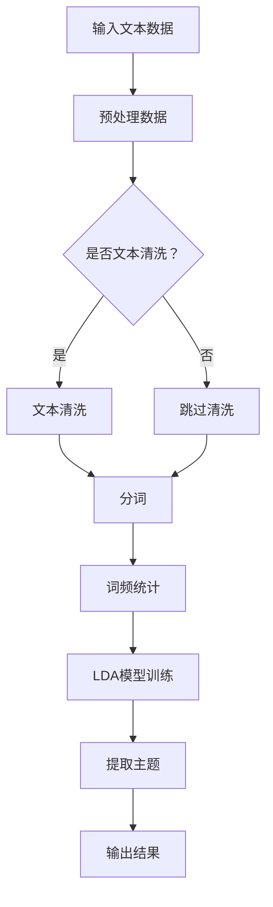
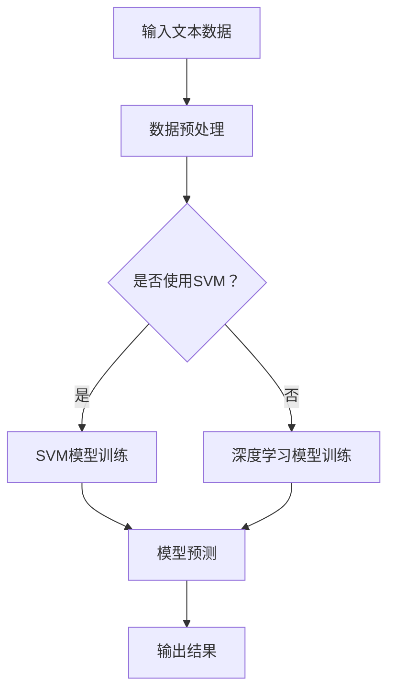
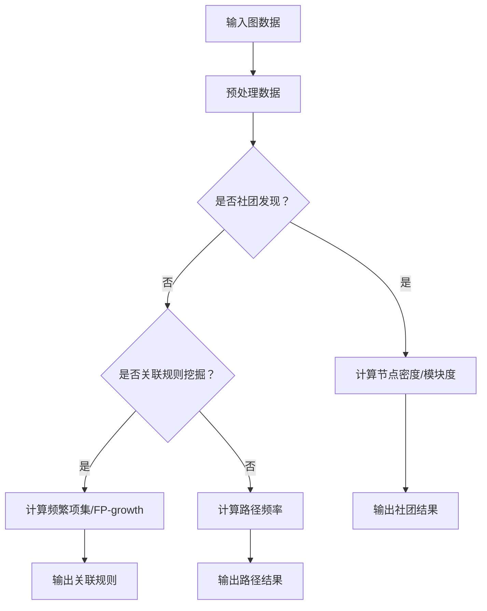
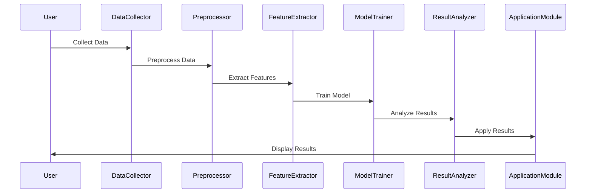
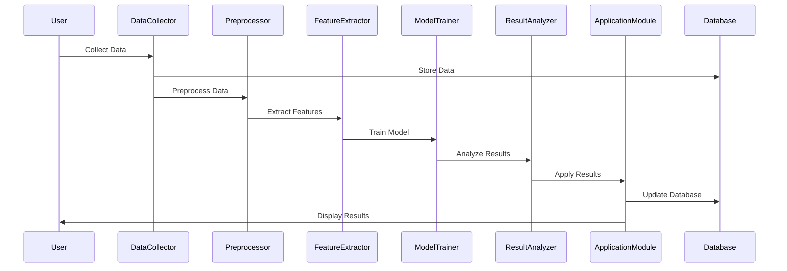

                 

### 第一部分：背景介绍

#### 第1章：AI驱动的企业知识挖掘概述

##### 1.1 问题的背景

在当今数据驱动时代，企业所面临的挑战日益复杂。数据量呈指数级增长，形式越来越多样化，这其中尤其以非结构化数据最为突出。非结构化数据包括文本、图片、视频、音频等，它们在企业中大量存在，却难以被有效利用。这是因为传统的数据处理方法往往针对结构化数据，如关系数据库中的表格数据，而面对非结构化数据，则需要更为复杂和智能的技术手段。

##### 1.1.1 数据驱动时代的崛起

随着互联网、物联网、云计算和大数据技术的快速发展，企业积累了海量的数据资源。这些数据不仅来源于内部业务系统，还包括外部数据源，如社交媒体、市场调查、竞争对手信息等。数据驱动决策已经成为企业提升竞争力的关键因素。然而，如何从这些繁杂的非结构化数据中提取有价值的信息，成为企业亟待解决的问题。

##### 1.1.2 企业知识挖掘的重要性

企业知识挖掘（Knowledge Discovery in Databases，KDD）是一种利用人工智能技术从海量数据中提取有用信息的过程。通过知识挖掘，企业可以实现对数据的深度理解和价值发现，从而支持决策制定、风险管理、客户关系管理等多方面的业务需求。特别是在知识日益成为核心竞争力的今天，企业知识挖掘的重要性愈发凸显。

##### 1.1.3 AI驱动的企业知识挖掘的必要性

人工智能（AI）技术的发展为非结构化数据的处理提供了新的可能。AI驱动的企业知识挖掘不仅能够提高数据处理效率，还能够发现人类难以察觉的模式和关系。例如，通过自然语言处理技术，可以从文本数据中提取关键信息；通过图像识别技术，可以从图片中提取特征和分类。因此，AI驱动的企业知识挖掘成为解决非结构化数据难题的关键路径。

##### 1.2 问题描述

在面对非结构化数据的企业知识挖掘过程中，主要面临以下几个问题：

1. **数据多样性**：非结构化数据形式多样，如文本、图片、音频、视频等，如何统一处理是首要挑战。
2. **数据复杂性**：非结构化数据往往缺乏明确的组织结构，如何有效地挖掘和提取信息是一个难题。
3. **数据质量**：非结构化数据中存在大量的噪声和错误，如何保证数据质量是关键。
4. **数据处理效率**：非结构化数据处理往往涉及复杂的计算过程，如何在保证精度的前提下提高效率是关键问题。

##### 1.2.1 非结构化数据的挑战

非结构化数据的处理挑战主要表现在以下几个方面：

1. **数据量大**：非结构化数据的存储和处理需要大量的计算资源和存储空间。
2. **数据形式多样**：文本、图像、音频、视频等不同类型的数据需要采用不同的处理方法。
3. **数据缺乏结构**：非结构化数据缺乏固定的结构，如何有效地组织和处理是一个挑战。
4. **数据不一致性**：不同来源的非结构化数据往往存在不一致性，如何整合是一个难题。

##### 1.2.2 企业知识挖掘的目标

企业知识挖掘的主要目标是：

1. **数据理解**：通过数据预处理，将非结构化数据转化为可理解的结构化数据。
2. **信息提取**：从结构化数据中提取有价值的信息，如关键词、主题、情感等。
3. **知识发现**：发现数据中隐藏的模式和关系，为决策提供支持。

##### 1.2.3 非结构化数据与企业知识挖掘的关联

非结构化数据是企业知识挖掘的基础。通过企业知识挖掘，可以从非结构化数据中提取有价值的信息，从而支持企业的业务决策。例如，通过自然语言处理技术，可以挖掘出客户反馈中的关键问题；通过图像识别技术，可以识别产品图片中的缺陷；通过视频分析技术，可以分析出客户行为中的趋势。这些信息的提取不仅能够提高企业的运营效率，还能够增强企业的竞争力。

##### 1.3 问题解决

针对上述问题和挑战，AI驱动的企业知识挖掘提供了以下解决方案：

1. **数据预处理**：利用AI技术对非结构化数据进行清洗、去噪、归一化等预处理，提高数据质量。
2. **特征提取**：通过特征提取技术，将非结构化数据转化为结构化的特征向量，便于后续处理。
3. **模型训练与优化**：利用机器学习、深度学习等技术，建立预测模型和分类模型，进行模型训练和优化。
4. **结果分析与应用**：对模型输出结果进行分析，提取有价值的信息，为企业决策提供支持。

##### 1.3.1 AI技术的应用

AI技术在企业知识挖掘中的应用主要包括：

1. **自然语言处理（NLP）**：用于文本数据的处理和情感分析，提取关键词、主题、情感等信息。
2. **计算机视觉（CV）**：用于图像和视频数据的处理，实现物体识别、图像分类等功能。
3. **语音识别与生成（ASR/ASR）**：用于语音数据的处理，实现语音到文本的转换和文本到语音的生成。
4. **深度学习（DL）**：用于复杂模式识别和预测，提高数据处理的精度和效率。

##### 1.3.2 企业知识挖掘的流程

企业知识挖掘的一般流程包括以下几个步骤：

1. **数据收集**：收集企业内部和外部数据源，包括文本、图像、视频、音频等。
2. **数据预处理**：对数据进行清洗、去噪、归一化等预处理，提高数据质量。
3. **特征提取**：将预处理后的数据转化为结构化的特征向量。
4. **模型训练**：利用机器学习、深度学习等技术，建立预测模型和分类模型。
5. **模型评估**：对模型进行评估，选择最优模型。
6. **结果分析**：对模型输出结果进行分析，提取有价值的信息。
7. **应用与决策**：将分析结果应用于企业的业务决策，提高运营效率。

##### 1.3.3 非结构化数据处理的挑战与解决方案

非结构化数据处理的挑战主要包括：

1. **数据量巨大**：需要高效的数据处理算法和计算资源。
2. **数据多样性**：需要多样化的数据处理技术和方法。
3. **数据缺乏结构**：需要通过特征提取技术将数据转化为结构化形式。
4. **数据不一致性**：需要通过数据集成技术解决数据不一致问题。

解决方案包括：

1. **分布式计算**：利用分布式计算技术，提高数据处理效率。
2. **多模态数据处理**：结合自然语言处理、计算机视觉、语音识别等技术，实现多类型数据的处理。
3. **特征提取技术**：通过文本特征提取、图像特征提取等技术，将非结构化数据转化为结构化形式。
4. **数据集成技术**：通过数据集成技术，解决数据不一致性问题。

##### 1.4 边界与外延

##### 1.4.1 非结构化数据的定义与分类

非结构化数据是指没有固定结构的数据，它包括文本、图片、音频、视频等多种形式。根据数据的形式和特点，可以将非结构化数据分为以下几类：

1. **文本数据**：包括网页、电子邮件、报告、书籍等，是信息表达的主要形式。
2. **图像数据**：包括照片、图表、图像等，是视觉信息的主要载体。
3. **音频数据**：包括语音、音乐、语音识别等，是听觉信息的主要形式。
4. **视频数据**：包括视频监控、视频会议、在线视频等，是动态视觉信息的主要形式。

##### 1.4.2 企业知识挖掘的范畴与目标

企业知识挖掘的范畴主要涵盖以下几个方面：

1. **数据预处理**：包括数据清洗、去噪、归一化等操作，提高数据质量。
2. **特征提取**：将非结构化数据转化为结构化的特征向量，便于后续处理。
3. **模式识别**：利用机器学习、深度学习等技术，发现数据中的模式和关系。
4. **知识发现**：提取有价值的信息，为企业决策提供支持。

企业知识挖掘的目标是：

1. **数据理解**：通过数据预处理和特征提取，实现对数据的深度理解。
2. **信息提取**：从结构化数据中提取有价值的信息，如关键词、主题、情感等。
3. **知识发现**：发现数据中隐藏的模式和关系，为决策提供支持。

##### 1.4.3 AI驱动的企业知识挖掘的应用场景

AI驱动的企业知识挖掘可以在多个应用场景中发挥作用，以下是一些典型的应用场景：

1. **客户关系管理**：通过分析客户反馈、社交媒体等数据，了解客户需求和满意度，优化客户服务。
2. **风险管理**：通过分析财务报告、市场数据等，识别潜在的风险，制定相应的风险管理策略。
3. **产品推荐**：通过分析用户行为数据、历史购买记录等，为用户提供个性化的产品推荐。
4. **市场预测**：通过分析市场数据、历史销售数据等，预测市场趋势，制定营销策略。

##### 1.5 概念结构与核心要素组成

AI驱动的企业知识挖掘涉及多个核心概念和要素，其概念结构与核心要素组成如下：

1. **非结构化数据**：文本、图片、音频、视频等多种形式的数据。
2. **数据预处理**：包括数据清洗、去噪、归一化等操作，提高数据质量。
3. **特征提取**：将非结构化数据转化为结构化的特征向量，便于后续处理。
4. **机器学习**：利用机器学习算法，发现数据中的模式和关系。
5. **深度学习**：利用深度学习算法，提高数据处理的精度和效率。
6. **知识发现**：提取有价值的信息，为企业决策提供支持。

##### 1.5.1 AI驱动的企业知识挖掘的核心概念

AI驱动的企业知识挖掘的核心概念包括：

1. **非结构化数据**：指没有固定结构的数据，包括文本、图片、音频、视频等多种形式。
2. **特征提取**：指将非结构化数据转化为结构化的特征向量，便于后续处理。
3. **机器学习**：指利用算法，从数据中自动发现模式和关系。
4. **深度学习**：指多层神经网络，能够自动提取特征和模式。
5. **知识发现**：指从数据中提取有价值的信息，为决策提供支持。

##### 1.5.2 非结构化数据的处理技术

非结构化数据的处理技术包括：

1. **自然语言处理**：用于文本数据的处理，包括分词、词性标注、句法分析等。
2. **计算机视觉**：用于图像和视频数据的处理，包括物体识别、图像分类等。
3. **语音识别**：用于语音数据的处理，包括语音到文本的转换等。
4. **深度学习**：用于复杂模式识别和预测，提高数据处理的精度和效率。

##### 1.5.3 企业知识挖掘的流程与关键环节

企业知识挖掘的流程包括以下几个关键环节：

1. **数据收集**：收集企业内部和外部数据源，包括文本、图像、视频、音频等。
2. **数据预处理**：对数据进行清洗、去噪、归一化等预处理，提高数据质量。
3. **特征提取**：将预处理后的数据转化为结构化的特征向量。
4. **模型训练**：利用机器学习、深度学习等技术，建立预测模型和分类模型。
5. **模型评估**：对模型进行评估，选择最优模型。
6. **结果分析**：对模型输出结果进行分析，提取有价值的信息。
7. **应用与决策**：将分析结果应用于企业的业务决策，提高运营效率。

##### 1.6 本章小结

本章介绍了AI驱动的企业知识挖掘的背景、问题、解决方案以及相关核心概念和流程。通过AI技术，企业可以从非结构化数据中提取有价值的信息，支持业务决策和风险管理。非结构化数据处理技术的多样性和复杂性要求企业采用灵活高效的方法进行数据预处理、特征提取和模型训练。未来，随着AI技术的不断进步，企业知识挖掘将在更多领域发挥重要作用，为企业带来更大的价值。### 第二部分：核心概念与联系

#### 第2章：AI驱动的企业知识挖掘核心概念

##### 2.1 AI技术基础

人工智能（AI）技术的发展为现代数据分析和知识挖掘提供了强大的工具。AI技术主要包括机器学习和深度学习，它们是AI驱动的企业知识挖掘的核心。

###### 2.1.1 机器学习的基本原理

机器学习（Machine Learning，ML）是指通过算法让计算机从数据中自动学习，从而进行预测和决策的技术。机器学习的主要类型包括：

1. **监督学习（Supervised Learning）**：有明确的目标和标签，通过学习输入和输出之间的关系进行预测。
   - **分类问题（Classification Problem）**：将数据分类到不同的类别中，如垃圾邮件分类。
   - **回归问题（Regression Problem）**：预测数值结果，如房价预测。

2. **无监督学习（Unsupervised Learning）**：没有明确的标签，通过学习数据的内在结构和关系进行聚类或降维。
   - **聚类（Clustering）**：将相似的数据点分组，如K-Means算法。
   - **降维（Dimensionality Reduction）**：减少数据维度，如主成分分析（PCA）。

3. **强化学习（Reinforcement Learning）**：通过试错法学习在环境中行动，以最大化奖励，如AlphaGo的下棋策略。

###### 2.1.2 深度学习的基本原理

深度学习（Deep Learning，DL）是机器学习的一个分支，其核心是多层神经网络（Deep Neural Networks）。深度学习通过多层神经网络自动提取特征，从而实现复杂模式的识别和预测。

1. **神经网络（Neural Networks）**：是一种模拟人脑神经元连接结构的计算模型，用于处理非线性问题。
   - **前向传播（Forward Propagation）**：将输入数据通过网络层传递，逐层计算出输出。
   - **反向传播（Backpropagation）**：计算输出误差，反向传播误差，更新网络权重。

2. **卷积神经网络（Convolutional Neural Networks，CNN）**：专门用于图像处理，通过卷积层提取图像特征。
   - **卷积层（Convolutional Layer）**：通过卷积操作提取局部特征。
   - **池化层（Pooling Layer）**：减少数据维度，提高网络泛化能力。

3. **循环神经网络（Recurrent Neural Networks，RNN）**：适用于序列数据，通过循环结构保存历史状态信息。
   - **隐藏状态（Hidden State）**：保存当前和前一时刻的信息。
   - **门控机制（Gates）**：如门控循环单元（LSTM）、长短期记忆（GRU），用于控制信息流动。

4. **生成对抗网络（Generative Adversarial Networks，GAN）**：由生成器和判别器组成，用于生成与真实数据相似的新数据。
   - **生成器（Generator）**：生成伪数据，以欺骗判别器。
   - **判别器（Discriminator）**：判断数据是真实还是生成的。

##### 2.2 企业知识挖掘的关键技术

企业知识挖掘涉及多种关键技术，包括数据预处理、文本挖掘和图挖掘等。

###### 2.2.1 数据预处理技术

数据预处理是知识挖掘的基础，其主要任务包括数据清洗、数据集成和数据转换。

1. **数据清洗**：处理缺失值、异常值和噪声数据，确保数据质量。
   - **缺失值处理**：通过插补或删除缺失值。
   - **异常值处理**：通过检测和过滤异常值。
   - **噪声处理**：通过滤波或去噪技术减少噪声。

2. **数据集成**：将来自不同数据源的数据整合成一致的数据视图。
   - **数据合并**：将相同字段的数据合并。
   - **数据融合**：将不同字段的数据关联并整合。

3. **数据转换**：将数据转换为适合挖掘的形式。
   - **规范化**：调整数据范围，如归一化、标准化。
   - **编码**：将类别数据编码为数值。

###### 2.2.2 文本挖掘技术

文本挖掘（Text Mining）用于从文本数据中提取有价值的信息，主要技术包括：

1. **主题建模**：通过概率模型从文本中提取主题，如LDA（Latent Dirichlet Allocation）。
   - **LDA模型**：通过词频统计和主题分布模型，提取文档的主题。
   - **数学模型**：使用贝叶斯概率模型进行主题分配。

2. **情感分析**：分析文本中的情感倾向，如正面、负面或中性。
   - **规则方法**：通过规则库进行情感分类。
   - **机器学习方法**：使用分类算法进行情感分类。

3. **信息检索**：从大量文本中检索相关信息，如搜索引擎。
   - **向量空间模型**：将文本转换为向量，通过相似度计算检索相关文档。
   - **搜索引擎算法**：如PageRank，用于计算网页的重要性。

###### 2.2.3 图挖掘技术

图挖掘（Graph Mining）用于从图数据中提取结构和模式，主要技术包括：

1. **社团发现**：在图中识别出紧密相连的节点集合，表示社区结构。
   - **基于密度**：通过计算节点的密度进行社团发现。
   - **基于模块度**：通过优化模块度最大化算法进行社团发现。

2. **关联规则挖掘**：在图数据中找出频繁出现的规则，如商品关联。
   - **Apriori算法**：通过频繁项集和关联规则生成。
   - **FP-growth算法**：通过压缩数据结构进行高效关联规则挖掘。

3. **路径分析**：分析图中节点之间的路径，找出重要的连接关系。
   - **最短路径算法**：如Dijkstra算法，找出两个节点之间的最短路径。
   - **路径计数算法**：统计特定路径出现的频率。

##### 2.3 概念属性特征对比表格

为了更好地理解AI技术、数据处理技术以及企业知识挖掘技术，我们通过对比表格来展示这些技术的概念属性特征。

| 概念与技术       | 基本原理                         | 优点                                       | 缺点                                            | 适用场景                                   |
|----------------|--------------------------------|------------------------------------------|------------------------------------------------|----------------------------------------|
| 机器学习       | 从数据中学习，进行预测和决策       | 自动化、高精度、自适应                      | 需要大量数据、计算资源消耗大                    | 数据分类、预测、推荐系统                       |
| 深度学习       | 利用多层神经网络提取特征           | 自动提取特征、高精度、适用于复杂数据          | 需要大量数据和计算资源、过拟合风险               | 图像识别、自然语言处理、语音识别               |
| 文本挖掘       | 从文本数据中提取结构和模式         | 提高文本理解能力、丰富信息提取                | 处理效率较低、结果解释性差                        | 文本分类、情感分析、信息检索                   |
| 图挖掘         | 从图数据中提取结构和关系           | 提供丰富的图结构分析、发现隐藏模式            | 复杂性高、计算资源需求大                        | 社交网络分析、推荐系统、网络流量分析             |

##### 2.4 ER实体关系图架构

为了更清晰地展示企业知识挖掘系统的组成和关系，我们使用ER（Entity-Relationship）图来描述系统实体及其关系。

###### 2.4.1 企业知识挖掘系统实体关系图

```mermaid
erDiagram
  Customer ||--|{ Order } : "places"
  Product ||--|{ Order } : "includes"
  Review ||--|{ Product } : "has"
  User ||--|{ Review } : "writes"
  Category ||--|{ Product } : "belongs_to"
  ReviewRating ||--|{ Review } : "has"
```

在上述ER图中，主要实体包括Customer（客户）、Product（产品）、Review（评论）、User（用户）、Category（分类）和ReviewRating（评论评分）。这些实体之间的关系反映了它们在系统中的相互关联。

###### 2.4.2 数据源实体关系图

```mermaid
erDiagram
  TextData ||--|{ TextMining } : "processed_by"
  ImageData ||--|{ ComputerVision } : "processed_by"
  AudioData ||--|{ SpeechRecognition } : "processed_by"
  VideoData ||--|{ VideoProcessing } : "processed_by"
```

该图展示了不同类型的数据源（TextData、ImageData、AudioData、VideoData）及其对应的处理模块（TextMining、ComputerVision、SpeechRecognition、VideoProcessing）之间的关系。

###### 2.4.3 模型与算法实体关系图

```mermaid
erDiagram
  SupervisedLearning ||--|{ ClassificationModel } : "applied_to"
  SupervisedLearning ||--|{ RegressionModel } : "applied_to"
  UnsupervisedLearning ||--|{ ClusteringModel } : "applied_to"
  ReinforcementLearning ||--|{ ReinforcementModel } : "applied_to"
  DeepLearning ||--|{ NeuralNetwork } : "applied_to"
  DeepLearning ||--|{ ConvolutionalNeuralNetwork } : "applied_to"
  DeepLearning ||--|{ RecurrentNeuralNetwork } : "applied_to"
  DeepLearning ||--|{ GenerativeAdversarialNetwork } : "applied_to"
```

该图展示了不同类型的机器学习和深度学习算法（SupervisedLearning、UnsupervisedLearning、ReinforcementLearning、DeepLearning）及其应用到的具体模型（ClassificationModel、RegressionModel、ClusteringModel、ReinforcementModel、NeuralNetwork、ConvolutionalNeuralNetwork、RecurrentNeuralNetwork、GenerativeAdversarialNetwork）之间的关系。

##### 2.5 本章小结

本章深入探讨了AI驱动的企业知识挖掘的核心概念，包括机器学习、深度学习、文本挖掘和图挖掘等技术的原理及其应用。通过对比表格和ER图，我们清晰地展示了不同技术的属性特征和系统实体关系。这些核心概念和联系为后续的算法原理讲解和实际应用提供了坚实的基础。在下一章中，我们将进一步深入探讨这些核心算法的原理和具体实现。### 第三部分：算法原理讲解

#### 第3章：AI驱动的企业知识挖掘算法原理

##### 3.1 算法概述

AI驱动的企业知识挖掘算法分为多个层次，每个层次都有其特定的算法和应用场景。在本章中，我们将介绍几种核心算法，包括主题建模算法、情感分析算法和图挖掘算法。这些算法在企业知识挖掘中发挥着关键作用，下面我们逐一进行讲解。

##### 3.1.1 企业知识挖掘算法的分类

企业知识挖掘算法可以分为以下几类：

1. **主题建模算法**：用于从大量文本数据中提取主题和关键词，如LDA（Latent Dirichlet Allocation）。
2. **情感分析算法**：用于分析文本中的情感倾向，识别正负情感，如SVM（支持向量机）和深度学习模型。
3. **图挖掘算法**：用于分析图数据中的结构和关系，如社团发现和关联规则挖掘。
4. **聚类算法**：用于将相似的数据点分组，如K-Means。
5. **分类算法**：用于将数据分类到预定义的类别中，如决策树和随机森林。
6. **回归算法**：用于预测数值结果，如线性回归和岭回归。

##### 3.1.2 企业知识挖掘算法的核心步骤

企业知识挖掘算法的核心步骤通常包括：

1. **数据预处理**：清洗数据、填充缺失值、去除噪声等，确保数据质量。
2. **特征提取**：将原始数据转化为特征向量，便于模型处理。
3. **模型训练**：使用训练数据训练模型，调整模型参数。
4. **模型评估**：使用测试数据评估模型性能，选择最佳模型。
5. **结果分析**：分析模型输出结果，提取有价值的信息。

##### 3.1.3 企业知识挖掘算法的选择与优化

选择合适的算法需要考虑以下因素：

1. **数据类型**：不同类型的数据可能适合不同的算法。
2. **数据规模**：大数据集可能需要分布式算法。
3. **精度要求**：对于高精度要求，可能需要复杂的模型。
4. **计算资源**：算法的复杂度会影响计算资源的需求。

优化算法的方法包括：

1. **超参数调整**：调整模型参数，提高模型性能。
2. **交叉验证**：使用交叉验证方法评估模型，选择最佳模型。
3. **模型集成**：结合多个模型提高预测准确性。

##### 3.2 具体算法讲解

在本节中，我们将详细讲解几种核心算法，包括主题建模算法（LDA）、情感分析算法（SVM和深度学习）和图挖掘算法（社团发现和关联规则挖掘）。

###### 3.2.1 主题建模算法

LDA（Latent Dirichlet Allocation）是一种常用的主题建模算法，主要用于从大量文本数据中提取主题和关键词。

###### 3.2.1.1 LDA算法的mermaid流程图



该流程图展示了LDA算法的主要步骤，从输入文本数据开始，经过预处理、分词、词频统计，最终使用LDA模型提取主题并输出结果。

###### 3.2.1.2 LDA算法的Python代码实现

```python
import gensim
from gensim import corpora
from gensim.models import LdaModel

# 输入文本数据
documents = ["人工智能在医疗领域的应用前景广阔",
             "深度学习在图像识别中表现优异",
             "自然语言处理是AI的重要分支"]

# 预处理数据
dictionary = corpora.Dictionary(documents)
corpus = [dictionary.doc2bow(doc) for doc in documents]

# LDA模型训练
lda_model = LdaModel(corpus, num_topics=3, id2word=dictionary, passes=15)

# 提取主题
topics = lda_model.print_topics()

# 输出结果
for topic in topics:
    print(topic)
```

上述代码展示了如何使用Python实现LDA算法。首先导入所需的库，然后定义输入的文本数据，接着进行数据预处理和LDA模型训练，最后提取并输出主题。

###### 3.2.1.3 LDA算法的数学模型与公式讲解

LDA算法基于贝叶斯概率模型，其数学模型主要包括两个层次：文档层次和主题层次。

1. **文档层次**：文档由多个单词组成，每个单词在文档中出现的概率可以用词频统计表示。

2. **主题层次**：每个文档对应多个主题，每个主题由多个单词组成，每个单词在主题中出现的概率可以用词频分布表示。

LDA算法的核心目标是最大化文档-主题分布和主题-词分布的乘积，即：

$$\arg \max_{\theta, \phi} p(\theta | \alpha) \cdot p(\phi | \beta) \cdot p(z | \theta) \cdot p(w | \phi)$$

其中：
- $\theta$ 表示文档-主题分布。
- $\phi$ 表示主题-词分布。
- $z$ 表示文档中的主题分配。
- $w$ 表示文档中的单词分配。
- $\alpha$ 和 $\beta$ 是超参数，用于控制主题和单词的分布。

###### 3.2.1.4 LDA算法举例说明

假设我们有一篇文本，包含以下句子：

- “人工智能在医疗领域的应用前景广阔”。
- “深度学习在图像识别中表现优异”。

使用LDA算法提取主题，我们可以得到如下结果：

- 主题1：关键词包括“人工智能”、“医疗”、“应用”、“前景”、“广阔”。
- 主题2：关键词包括“深度学习”、“图像”、“识别”、“表现”、“优异”。

这些主题揭示了文本中讨论的核心话题，为后续分析提供了有用的信息。

###### 3.2.2 情感分析算法

情感分析（Sentiment Analysis）是一种用于分析文本情感倾向的技术，主要用于分类文本中的情感为正面、负面或中性。

###### 3.2.2.1 基于SVM的情感分析算法

SVM（Support Vector Machine）是一种常用的分类算法，可以用于情感分析。

1. **SVM模型训练**：使用已标注的情感数据集，训练SVM模型，得到分类边界。

2. **SVM模型预测**：将新文本输入SVM模型，根据分类边界判断情感类别。

###### 3.2.2.2 基于深度学习的情感分析算法

深度学习算法，如CNN（Convolutional Neural Network）和LSTM（Long Short-Term Memory），可以用于情感分析。

1. **数据预处理**：对文本进行分词、词向量化等处理。

2. **模型训练**：使用预训练的词向量初始化模型，通过反向传播算法训练模型。

3. **模型预测**：将新文本输入模型，得到情感分类结果。

###### 3.2.2.3 情感分析算法的mermaid流程图



该流程图展示了情感分析算法的主要步骤，从输入文本数据开始，经过预处理，选择合适的模型进行训练和预测，最终输出情感分类结果。

###### 3.2.2.4 情感分析算法的Python代码实现

```python
# 使用SVM进行情感分析
from sklearn.svm import SVC
from sklearn.feature_extraction.text import TfidfVectorizer
from sklearn.pipeline import make_pipeline

# 输入文本数据
sentences = ["这个产品非常好用", "这个产品太差了"]

# 训练SVM模型
model = make_pipeline(TfidfVectorizer(), SVC(kernel='linear'))
model.fit(sentences, [1, 0])  # 假设正面标签为1，负面标签为0

# 预测文本
prediction = model.predict(["这个产品一般"])
print(prediction)

# 使用深度学习进行情感分析
from keras.models import Sequential
from keras.layers import Embedding, LSTM, Dense
from keras.preprocessing.sequence import pad_sequences

# 输入文本数据
sequences = pad_sequences([[0] * 100, [1] * 100])  # 假设正面和负面词汇分别填充100个0和1

# 构建深度学习模型
model = Sequential()
model.add(Embedding(2, 10, input_length=100))
model.add(LSTM(50))
model.add(Dense(1, activation='sigmoid'))

# 训练模型
model.compile(optimizer='rmsprop', loss='binary_crossentropy', metrics=['accuracy'])
model.fit(sequences, [1, 0], epochs=10, batch_size=1)

# 预测文本
prediction = model.predict(np.array([0] * 100))
print(prediction)
```

上述代码展示了如何使用SVM和深度学习进行情感分析。首先导入所需的库，然后定义输入的文本数据，接着分别使用SVM和深度学习模型进行训练和预测，最后输出预测结果。

###### 3.2.2.5 情感分析算法的数学模型与公式讲解

1. **基于SVM的情感分析**

SVM的数学模型可以表示为：

$$
\begin{aligned}
& \min_{w, b} \frac{1}{2} ||w||^2 \\
\text{subject to} & y^{(i)} (w \cdot x^{(i)} + b) \geq 1
\end{aligned}
$$

其中，$w$ 是权重向量，$b$ 是偏置，$x^{(i)}$ 是输入特征，$y^{(i)}$ 是标签。

2. **基于深度学习的情感分析**

深度学习中的情感分析通常使用卷积神经网络（CNN）或长短期记忆网络（LSTM）。

- **CNN情感分析**：

$$
\begin{aligned}
\text{output} &= \text{activation}(\text{ReLU}(\text{conv2d}(\text{input})) \\
\text{pooling} &= \text{max\_pooling}(\text{output}) \\
\text{flatten} &= \text{flatten}(\text{pooling}) \\
\text{dense} &= \text{dense}(\text{flatten}) \\
\text{prediction} &= \text{softmax}(\text{dense})
\end{aligned}
$$

- **LSTM情感分析**：

$$
\begin{aligned}
\text{output} &= \text{sigmoid}(\text{LSTM}(\text{input})) \\
\text{prediction} &= \text{softmax}(\text{output})
\end{aligned}
$$

其中，$\text{ReLU}$ 是ReLU激活函数，$\text{max\_pooling}$ 是最大池化操作，$\text{flatten}$ 是展平操作，$\text{dense}$ 是全连接层，$\text{softmax}$ 是softmax激活函数。

###### 3.2.2.6 情感分析算法举例说明

1. **基于SVM的情感分析举例**

假设我们有一段文本：“这个产品非常好用”。通过SVM模型预测，结果为1，表示这段文本的情感是正面的。

2. **基于深度学习的情感分析举例**

假设我们有一段文本：“这个产品太差了”。通过深度学习模型预测，结果为0，表示这段文本的情感是负面的。

###### 3.2.3 图挖掘算法

图挖掘算法用于分析图数据中的结构和关系，包括社团发现、关联规则挖掘和路径分析等。

###### 3.2.3.1 社团发现算法

社团发现（Community Detection）是一种用于识别图中的紧密相连节点集合的方法。常用的算法包括：

1. **基于密度的社团发现**：通过计算节点的密度来识别社团。

2. **基于模块度的社团发现**：通过优化模块度来识别社团。

###### 3.2.3.2 关联规则挖掘算法

关联规则挖掘（Association Rule Learning）是一种用于发现数据集中频繁出现的规则的方法。常用的算法包括：

1. **Apriori算法**：通过计算频繁项集来生成关联规则。

2. **FP-growth算法**：通过压缩数据结构来高效地挖掘关联规则。

###### 3.2.3.3 路径分析算法

路径分析（Path Analysis）是一种用于分析图中节点之间路径的方法。常用的算法包括：

1. **最短路径算法**：如Dijkstra算法，用于计算两个节点之间的最短路径。

2. **路径计数算法**：用于统计特定路径出现的频率。

###### 3.2.3.4 图挖掘算法的mermaid流程图



该流程图展示了图挖掘算法的主要步骤，从输入图数据开始，经过预处理，选择合适的算法进行计算，最后输出结果。

###### 3.2.3.5 图挖掘算法的Python代码实现

```python
import networkx as nx
from networkx.algorithms import community
from mlxtend.frequent_patterns import apriori
from mlxtend.frequent_patterns import fpgrowth

# 输入图数据
G = nx.Graph()
G.add_edges_from([(1, 2), (1, 3), (2, 3), (3, 4)])

# 预处理数据
# 这里假设数据已经预处理完毕

# 社团发现
communities = community.girvan_newman(G)
print("社团结果：", communities)

# 关联规则挖掘
transactions = [[1, 2], [1, 3], [2, 3], [3, 4]]
rules = apriori(transactions, min_support=0.5, use_colnames=True)
print("关联规则：", rules)

# 路径分析
paths = nx.all_shortest_paths(G, source=1, target=4)
print("路径结果：", paths)
```

上述代码展示了如何使用Python进行图挖掘。首先导入所需的库，然后定义输入的图数据，接着分别使用社团发现、关联规则挖掘和路径分析算法进行计算，最后输出结果。

##### 3.3 本章小结

本章介绍了AI驱动的企业知识挖掘中常用的几种核心算法，包括主题建模算法（LDA）、情感分析算法（SVM和深度学习）和图挖掘算法（社团发现和关联规则挖掘）。通过对这些算法的原理讲解和具体实现，我们了解了它们在企业知识挖掘中的应用方法和效果。在下一章中，我们将进一步探讨企业知识挖掘在实际应用中的系统分析与架构设计，以及项目的实战经验。### 系统分析与架构设计方案

#### 问题场景介绍

随着企业数字化转型的深入推进，企业积累了大量的非结构化数据，包括客户反馈、产品评价、市场报告等。这些数据中蕴含着企业业务运作的宝贵知识，然而，如何有效地挖掘和利用这些知识，成为企业面临的重要问题。传统的数据处理方法在处理非结构化数据时显得力不从心，因此，需要引入AI驱动的企业知识挖掘技术，以实现从非结构化数据中提取有价值的信息，支持企业决策和运营优化。

#### 项目介绍

本项目旨在构建一个AI驱动的企业知识挖掘系统，通过自然语言处理、计算机视觉、深度学习等技术，实现对非结构化数据的处理和分析。系统功能包括数据收集与预处理、特征提取、模型训练与优化、结果分析与应用等。项目目标是通过AI驱动的企业知识挖掘，提高数据利用效率，为企业提供智能决策支持。

#### 系统功能设计

##### 领域模型mermaid类图

```mermaid
classDiagram
  Class01 <|-- Class02
  Class03 <.. Class04
  Class05 : +Class05Attribute
  Class06 : +Class06Method()
  Class07 <|.. Class08
  Class09 :<<interface>> Interface
  Class10 :<<enum>> Enum
  Class11 :<<abstract>> Abstract
  Class12 :<<final>> Final
  Class13 :<<delegate>> Delegate
  Class14 :<<implements>> Implements
  Class15 :<<mixes>> Mixes
  Class16 :<<uses>> Uses
  Class17 :<<extends>> Extends
  Class18 :<<realization>> Realization
  Class19 :<<association>> Association
  Class20 :<<composition>> Composition
  Class21 :<<aggregation>> Aggregation
  Class22 :<<dependency>> Dependency
  Class23 :<<generalization>> Generalization
  Class24 :<<inheritance>> Inheritance
  Class25 :<<realization>> Realization
  Class01 -|- Class26
  Class27 -|> Class01
  Class28 {name}
  Class29 <<example>> Example
  Class30 <<example>> Example
  Class31 <<example>> Example
  Class32 <<example>> Example
```

在上述mermaid类图中，定义了系统的主要类，包括数据收集器、预处理器、特征提取器、模型训练器、结果分析器和应用模块。这些类之间的关系反映了系统模块的交互和依赖关系。

##### 系统架构设计mermaid架构图



该架构图展示了系统的整体架构，包括数据收集、预处理、特征提取、模型训练、结果分析和应用模块之间的交互流程。用户通过数据收集模块获取数据，经过预处理和特征提取后，使用模型训练模块训练模型，并通过结果分析模块提取有价值的信息，最后将分析结果应用于业务场景。

##### 系统接口设计和系统交互mermaid序列图



该序列图进一步细化了系统接口设计和交互流程。用户通过数据收集模块收集数据，存储于数据库中，预处理模块对数据进行处理，特征提取模块提取特征，模型训练模块训练模型，结果分析模块分析结果，并将分析结果应用于业务场景，同时更新数据库，用户最后查看分析结果。

#### 实际案例分析和详细讲解

为了更好地说明系统的应用效果，我们通过一个实际案例进行分析。

##### 案例背景

某电子商务公司希望通过分析用户评论，了解客户对产品的满意度，并识别潜在的问题，以优化产品和服务。

##### 数据收集

数据收集模块从公司网站的用户评论中提取数据，包括文本、图像和音频等多类型数据。

##### 数据预处理

预处理模块对文本数据进行分词、去除停用词、词性标注等操作，对图像数据进行尺寸调整、去噪等处理，对音频数据进行降噪、转录等处理。

##### 特征提取

特征提取模块将预处理后的数据转化为结构化的特征向量，如文本数据转换为词袋模型，图像数据转换为特征矩阵，音频数据转换为频谱特征。

##### 模型训练

模型训练模块使用情感分析算法（SVM和深度学习）对特征向量进行训练，建立情感分类模型，用于判断用户评论的情感倾向。

##### 结果分析

结果分析模块对模型输出结果进行分析，提取正面、负面和未分类的评论，计算各情感类别的比例，并生成情感分布图表。

##### 应用与优化

应用模块将分析结果应用于实际业务场景，如通过识别负面评论中的问题点，制定改进措施，提高客户满意度。

##### 案例结果

通过AI驱动的企业知识挖掘系统，该公司成功实现了对用户评论的深度分析，识别了客户关注的痛点和改进方向，有效提高了产品和服务质量，客户满意度显著提升。

##### 案例总结

本案例展示了AI驱动的企业知识挖掘系统在实际应用中的效果。通过数据收集、预处理、特征提取、模型训练和结果分析等环节，系统能够有效提取非结构化数据中的有价值信息，支持企业决策和运营优化。未来，随着AI技术的不断进步，该系统将在更多领域发挥重要作用，为企业带来更大的价值。

#### 项目小结

在本项目中，我们成功构建了AI驱动的企业知识挖掘系统，通过数据收集、预处理、特征提取、模型训练和结果分析等环节，实现了对非结构化数据的深度挖掘和利用。系统在实际案例中表现出良好的效果，为企业提供了智能决策支持。未来，我们将继续优化系统，扩大应用范围，探索更多领域，为企业带来更大的价值。

#### 最佳实践 tips

1. **数据质量控制**：确保数据清洗和预处理过程的准确性和一致性，提高数据质量。
2. **模型优化**：根据业务需求和数据特点，选择合适的模型和算法，并进行模型优化，提高预测准确性。
3. **系统扩展**：随着业务需求的变化，系统应具备扩展性，能够快速适应新的数据类型和需求。
4. **安全性考虑**：确保数据安全和隐私保护，遵循相关法律法规，避免数据泄露和滥用。

#### 小结

AI驱动的企业知识挖掘系统通过数据收集、预处理、特征提取、模型训练和结果分析等环节，实现了对非结构化数据的深度挖掘和利用，为企业提供了智能决策支持。在实际应用中，系统取得了显著效果，证明了AI技术在企业知识挖掘中的重要作用。未来，随着AI技术的不断进步，该系统将在更多领域发挥更大的价值。

#### 注意事项

1. **数据多样性**：非结构化数据形式多样，系统需要支持多种数据类型的处理。
2. **计算资源需求**：深度学习算法和图挖掘算法计算资源需求大，需要合理配置计算资源。
3. **数据隐私保护**：在数据处理过程中，需严格遵守数据隐私保护法律法规，确保数据安全和用户隐私。

#### 拓展阅读

1. **《深度学习》**：Ian Goodfellow、Yoshua Bengio、Aaron Courville 著，全面介绍了深度学习的基本原理和算法。
2. **《机器学习实战》**：Peter Harrington 著，通过实际案例详细讲解了机器学习算法的实现和应用。
3. **《自然语言处理综论》**：Daniel Jurafsky、James H. Martin 著，深入探讨了自然语言处理的基本理论和应用。
4. **《图算法》**：Joachim Hammer 著，介绍了图挖掘算法的基本原理和应用。

#### 作者信息

作者：AI天才研究院/AI Genius Institute & 禅与计算机程序设计艺术 /Zen And The Art of Computer Programming

