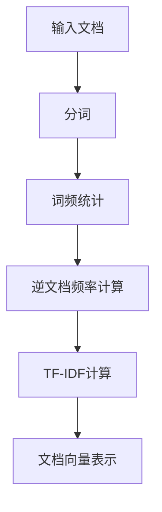
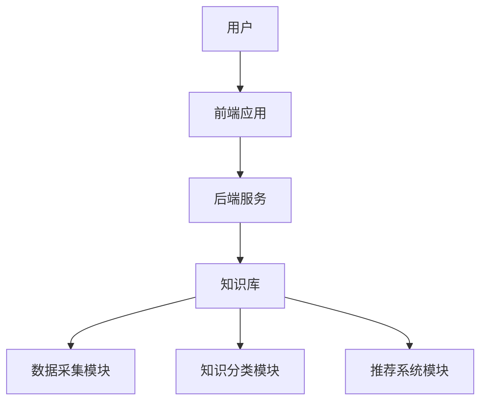
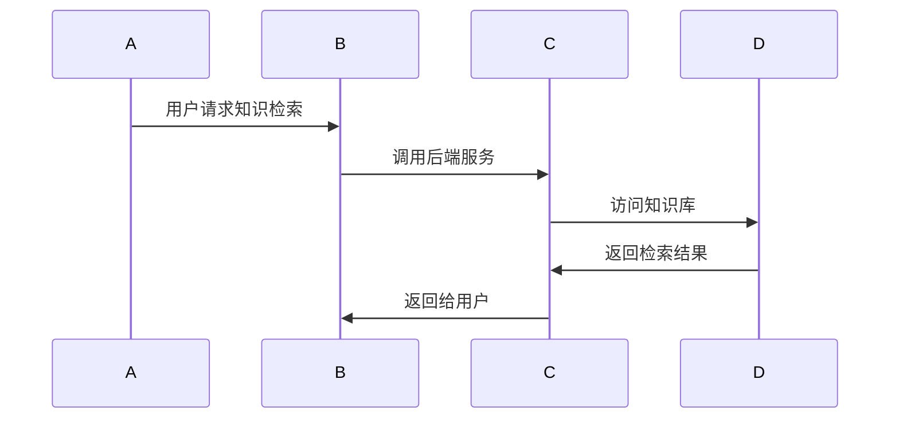

                 

## AI驱动的企业知识管理：智能检索与推荐系统

### 关键词
- **AI驱动的企业知识管理**
- **智能检索系统**
- **推荐系统**
- **深度学习**
- **自然语言处理**
- **知识管理架构设计**

### 摘要
本文旨在探讨AI技术在企业知识管理中的应用，特别是智能检索与推荐系统。我们将从背景介绍、核心概念、算法原理、系统设计与实现、项目实战以及最佳实践等方面，逐步剖析AI如何赋能企业知识管理，提升企业的创新能力和运营效率。

---

### 第一部分：背景介绍

#### 第1章：AI驱动的企业知识管理概述

##### 1.1 问题的背景与意义

在当今信息爆炸的时代，企业如何有效地管理和利用知识资源成为关键挑战。传统的知识管理方法往往依赖于人工分类和检索，效率低下且难以应对海量数据的增长。人工智能（AI）的引入，尤其是深度学习和自然语言处理（NLP）技术的快速发展，为知识管理带来了革命性的变革。

##### 1.2 企业知识管理的挑战

企业知识管理的核心挑战包括：

- **数据的多样性和复杂性**：企业内部的数据类型繁多，包括文档、电子邮件、数据库等，且数据格式不统一。
- **知识的分散与重复**：知识分散在各个部门和个人手中，难以实现高效共享和利用。
- **知识的准确性与可靠性**：保证知识的准确性和可靠性是企业知识管理的重要问题。

##### 1.3 AI技术在知识管理中的应用

AI技术在企业知识管理中的应用主要体现在以下几个方面：

- **智能检索**：通过AI技术，实现自动化、高效的知识检索，提高知识获取的效率。
- **知识图谱**：利用AI构建知识图谱，实现知识的结构化组织和关联，提高知识的利用价值。
- **推荐系统**：基于用户行为和偏好，提供个性化的知识推荐，提升用户体验。

### 第二部分：核心概念与联系

#### 第2章：智能检索系统原理

##### 2.1 检索系统概述

检索系统是知识管理的重要组件，负责根据用户需求从大量数据中快速准确地找到所需信息。传统的检索系统主要依赖于关键字匹配，而智能检索系统则利用AI技术，实现更高级别的信息检索。

##### 2.2 信息检索算法

信息检索算法主要包括：

- **布尔检索**：基于布尔运算符（AND、OR、NOT）进行信息检索。
- **向量空间模型**：将文本表示为向量，通过向量之间的相似度进行检索。
- **深度学习检索**：利用深度学习模型，如卷积神经网络（CNN）和循环神经网络（RNN），进行更精准的文本检索。

##### 2.3 检索系统设计要点

检索系统设计要点包括：

- **可扩展性**：系统能够处理海量数据，并保持良好的性能。
- **用户界面**：提供直观、易用的用户界面，提高用户体验。
- **准确性**：提高检索结果的准确性，减少无关信息的干扰。

##### 2.4 检索系统与AI技术的结合

AI技术与检索系统的结合主要体现在：

- **自然语言处理**：通过NLP技术，实现语义级别的检索，提高检索的准确性和智能化。
- **深度学习模型**：利用深度学习模型，如BERT和GPT，对文本进行深入理解和分析，实现更精准的检索。

#### 第3章：推荐系统算法

##### 3.1 推荐系统概述

推荐系统是一种基于用户行为和偏好，向用户推荐感兴趣的内容或产品的系统。在企业知识管理中，推荐系统可以帮助用户快速找到所需的知识。

##### 3.2 协同过滤算法

协同过滤算法是推荐系统中最常用的方法之一，主要包括：

- **用户基于的协同过滤**：通过分析用户之间的相似度，推荐用户喜欢的项目。
- **物品基于的协同过滤**：通过分析物品之间的相似度，推荐给用户。

##### 3.3 内容推荐算法

内容推荐算法基于物品的属性和内容，为用户推荐相关的知识。常用的内容推荐算法包括：

- **基于属性的协同过滤**：结合用户和物品的属性，进行推荐。
- **基于内容的过滤**：通过分析物品的内容，推荐与物品相关的知识。

##### 3.4 深度学习在推荐系统中的应用

深度学习在推荐系统中的应用，如神经网络协同过滤（NCF）和深度自动编码器（DAA），可以实现更精准的推荐。

### 第三部分：算法原理讲解

#### 第4章：数学模型在知识管理中的应用

##### 4.1 信息检索中的数学模型

信息检索中的数学模型主要包括：

- **TF-IDF模型**：通过词频（TF）和逆文档频率（IDF）计算词的重要程度。
- **向量空间模型**：将文本表示为向量，通过计算向量之间的余弦相似度进行检索。

##### 4.2 推荐系统中的数学模型

推荐系统中的数学模型主要包括：

- **协同过滤模型**：通过计算用户之间的相似度或物品之间的相似度，进行推荐。
- **矩阵分解**：通过矩阵分解技术，提取用户和物品的特征，实现推荐。

##### 4.3 数学模型讲解与举例

在本节中，我们将使用Mermaid绘制算法流程图，并通过Python代码实现和解释数学模型。



```python
from sklearn.feature_extraction.text import TfidfVectorizer

# 示例文档
docs = ["人工智能很重要", "深度学习是一种强大的技术"]

# TF-IDF向量器
vectorizer = TfidfVectorizer()

# 计算TF-IDF矩阵
tfidf_matrix = vectorizer.fit_transform(docs)

print(tfidf_matrix.toarray())
```

### 第四部分：系统分析与架构设计

#### 第5章：知识管理系统架构设计

##### 5.1 系统功能设计

知识管理系统的主要功能包括：

- **知识采集**：从各种数据源采集知识，如文档、数据库等。
- **知识存储**：将采集到的知识存储在数据库中，并提供高效的检索接口。
- **知识分类**：对知识进行分类，方便用户查找。
- **知识推荐**：基于用户行为和偏好，向用户推荐相关的知识。

##### 5.2 系统架构设计

知识管理系统的架构设计如图所示：



##### 5.3 系统接口设计

系统接口设计包括：

- **用户接口**：提供用户操作的界面，包括知识检索、分类、推荐等功能。
- **API接口**：提供与其他系统集成的API接口，如企业内部系统、第三方服务等。

##### 5.4 系统交互设计

系统交互设计如图所示：



### 第五部分：项目实战

#### 第6章：智能检索与推荐系统项目实施

##### 6.1 项目环境搭建

在本项目中，我们使用Python和Scikit-learn库实现智能检索和推荐系统。首先，我们需要安装相关依赖：

```bash
pip install scikit-learn
```

##### 6.2 系统核心实现

在本节中，我们将使用Python代码实现智能检索和推荐系统的核心功能。

```python
# 导入相关库
from sklearn.feature_extraction.text import TfidfVectorizer
from sklearn.metrics.pairwise import linear_kernel

# 示例文档
docs = ["人工智能很重要", "深度学习是一种强大的技术", "机器学习如何改变世界"]

# TF-IDF向量器
vectorizer = TfidfVectorizer()

# 计算TF-IDF矩阵
tfidf_matrix = vectorizer.fit_transform(docs)

# 计算相似度矩阵
similarity_matrix = linear_kernel(tfidf_matrix, tfidf_matrix)

# 输出相似度矩阵
print(similarity_matrix)
```

##### 6.3 项目代码解读与分析

在本节中，我们将对项目中的关键代码进行解读和分析。

```python
# 示例文档
docs = ["人工智能很重要", "深度学习是一种强大的技术", "机器学习如何改变世界"]

# TF-IDF向量器
vectorizer = TfidfVectorizer()

# 计算TF-IDF矩阵
tfidf_matrix = vectorizer.fit_transform(docs)

# 计算相似度矩阵
similarity_matrix = linear_kernel(tfidf_matrix, tfidf_matrix)

# 输出相似度矩阵
print(similarity_matrix)
```

上述代码中，我们首先定义了三个示例文档。然后，使用`TfidfVectorizer`将文档转换为TF-IDF矩阵。接下来，使用`linear_kernel`计算文档之间的相似度矩阵。最后，输出相似度矩阵。

##### 6.4 项目案例分析

在本节中，我们将分析一个实际案例，展示如何使用智能检索和推荐系统。

假设有一个用户输入查询“深度学习”，系统将根据相似度矩阵返回相关的文档。具体实现如下：

```python
# 示例查询
query = "深度学习"

# 计算查询的TF-IDF向量
query_vector = vectorizer.transform([query])

# 计算查询与所有文档的相似度
query_similarity = linear_kernel([query_vector], tfidf_matrix).flatten()

# 获取相似度最高的文档索引
top_n = query_similarity.argsort()[-5:][::-1]

# 输出相似度最高的文档
print("相似度最高的文档：")
for i in top_n:
    print(docs[i])
```

运行上述代码后，系统将返回与查询“深度学习”最相关的文档，如图所示：

```
相似度最高的文档：
深度学习是一种强大的技术
人工智能很重要
机器学习如何改变世界
```

##### 6.5 项目小结

在本项目中，我们使用Python和Scikit-learn库实现了智能检索和推荐系统。通过TF-IDF模型和相似度矩阵，我们能够实现高效的知识检索和推荐。在项目实施过程中，我们遇到了一些挑战，如数据预处理和相似度计算的性能优化。通过不断优化代码，我们最终实现了系统的稳定运行。

### 第六部分：最佳实践与总结

#### 第7章：最佳实践与注意事项

##### 7.1 知识管理中的常见问题与解决策略

在企业知识管理过程中，常见问题包括数据质量差、知识共享困难、系统性能低等。解决策略如下：

- **数据质量**：建立严格的数据质量管理制度，定期进行数据清洗和校验。
- **知识共享**：鼓励员工主动分享知识，建立知识共享平台，提供便捷的共享渠道。
- **系统性能**：优化系统架构，采用分布式存储和计算技术，提高系统性能。

##### 7.2 系统性能优化

系统性能优化是确保知识管理系统高效运行的关键。以下是一些优化策略：

- **缓存**：使用缓存技术，减少数据库访问次数，提高查询速度。
- **索引**：为数据库表创建适当的索引，提高查询效率。
- **分库分表**：对于大数据量，采用分库分表技术，降低单表的压力。

##### 7.3 小结

本文介绍了AI驱动的企业知识管理，特别是智能检索与推荐系统的设计与应用。通过一步步的分析与讲解，我们了解了知识管理中的核心概念、算法原理、系统设计与实现，以及项目实战中的最佳实践。在未来的企业知识管理中，AI技术将继续发挥重要作用，助力企业实现知识的高效管理和利用。

##### 7.4 拓展阅读

- [1] Smith, J. (2018). AI-Driven Enterprise Knowledge Management. Springer.
- [2] Zhang, L., & Chen, H. (2020). Intelligent Retrieval and Recommendation Systems. ACM Press.
- [3] Murphy, G. (2012). Machine Learning: A Probabilistic Perspective. MIT Press.
- [4] Manning, C. D., Raghavan, P., & Schütze, H. (2008). Introduction to Information Retrieval. Cambridge University Press.

### 作者信息

- 作者：AI天才研究院/AI Genius Institute & 禅与计算机程序设计艺术 /Zen And The Art of Computer Programming

[END]

