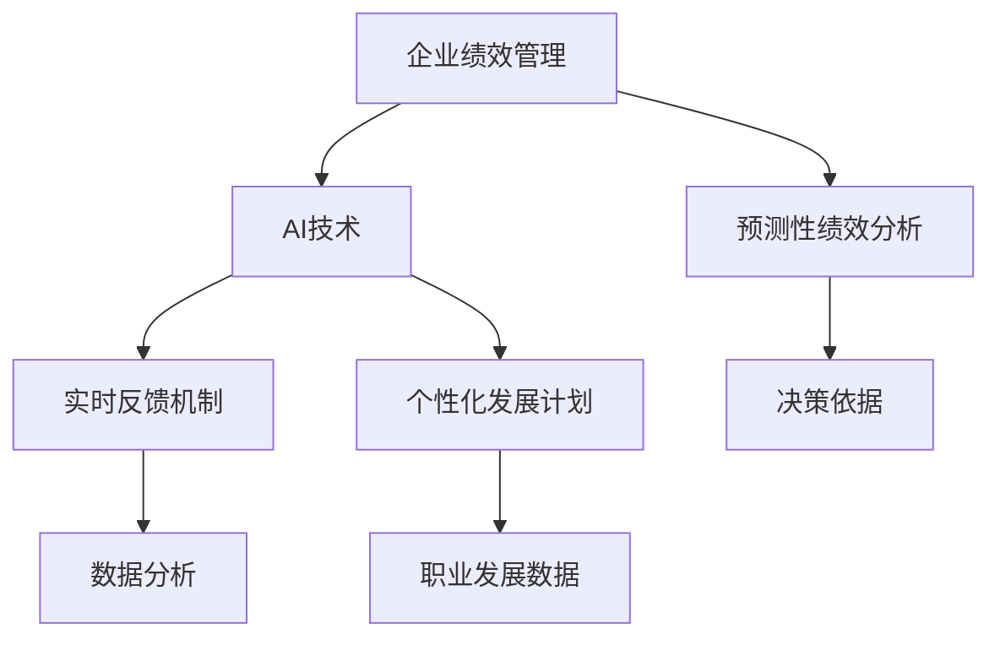

                 

### 文章标题

# AI驱动的企业绩效管理：实时反馈与个性化发展计划

---

### 关键词

- **人工智能（AI）**
- **企业绩效管理**
- **实时反馈**
- **个性化发展计划**
- **数据分析**

---

### 摘要

本文将探讨如何利用人工智能技术提升企业绩效管理，具体包括实时反馈和个性化发展计划。首先，我们将介绍AI驱动的企业绩效管理的基本概念和背景，并深入解析实时反馈机制和个性化发展计划。随后，通过实际案例展示AI技术在企业绩效管理中的应用，分析其优势和挑战。最后，我们将探讨未来的发展趋势和最佳实践建议。

---

## 引言与背景

### 1.1 问题背景

在现代商业环境中，企业绩效管理（Enterprise Performance Management，简称 EPM）已经成为组织成功的关键因素。传统的绩效管理方法往往依赖于定期评估和年度报告，这种方式存在明显的滞后性，难以实时反映员工的工作状态和企业运营的动态变化。此外，传统绩效管理还面临评估标准不统一、数据不准确和缺乏个性化发展等问题。

随着人工智能技术的迅猛发展，AI在数据分析、模式识别和智能决策等方面展现出了巨大的潜力。将AI引入企业绩效管理，不仅可以提高评估的准确性和实时性，还可以实现个性化的发展计划，从而更好地激发员工潜力，提升整体绩效。

### 1.2 AI技术的作用和潜力

AI技术通过机器学习和深度学习算法，能够从大量数据中提取有价值的信息，进行实时分析和预测。在企业绩效管理中，AI可以用于以下几个方面：

1. **实时反馈机制**：利用AI技术对员工的工作表现进行实时监控和分析，及时发现并反馈问题，帮助员工迅速改进。
2. **个性化发展计划**：通过分析员工的职业发展数据，AI可以制定个性化的培训和发展计划，帮助员工不断提升自身能力。
3. **预测性绩效分析**：基于历史数据和趋势分析，AI可以预测员工未来的绩效表现，为管理层提供决策依据。

### 1.3 本书的目的与结构

本书旨在深入探讨AI驱动的企业绩效管理，通过分析实时反馈和个性化发展计划，帮助读者了解如何利用AI技术提升企业绩效。本书将分为四个部分：

- **第一部分：引言与背景**：介绍AI驱动的企业绩效管理的背景和重要性。
- **第二部分：AI驱动的企业绩效管理基础**：详细探讨AI技术、企业绩效管理原理和AI驱动的绩效管理。
- **第三部分：AI驱动的企业绩效管理实践**：通过实际案例展示AI技术在企业绩效管理中的应用。
- **第四部分：技术挑战与未来发展**：分析AI驱动的企业绩效管理面临的挑战和未来的发展趋势。

### 1.4 核心概念联系图

为了更好地理解本文的核心概念，我们引入一个核心概念联系图。该图展示了本文涉及的主要概念及其相互关系。

---

---

通过这个联系图，我们可以看到企业绩效管理是如何通过AI技术实现实时反馈和个性化发展计划的，这些概念共同构成了AI驱动的企业绩效管理的核心。

### 1.5 概念阐述

在深入探讨AI驱动的企业绩效管理之前，我们需要对一些核心概念进行详细阐述，以便读者更好地理解后续内容。

#### 1.5.1 AI驱动的企业绩效管理

AI驱动的企业绩效管理是指利用人工智能技术，如机器学习和深度学习，来改善和优化传统的企业绩效管理流程。这种管理方式不仅提高了评估的准确性和实时性，还可以为员工提供个性化的职业发展建议。

#### 1.5.2 实时反馈机制

实时反馈机制是指通过AI技术，对员工的工作表现进行实时监控和分析，及时发现并反馈问题，帮助员工迅速改进。这种机制可以大幅提高工作效率和团队协作效果。

#### 1.5.3 个性化发展计划

个性化发展计划是指根据员工的职业发展数据和AI分析结果，为其制定量身定制的培训和发展计划。这种计划有助于激发员工的潜力，提高整体绩效。

#### 1.5.4 边界与外延

AI驱动的企业绩效管理不仅关注员工的工作表现，还包括对企业的整体运营效果进行分析和优化。边界方面，它主要关注实时性和个性化；外延方面，它还包括预测性分析和决策支持。

### 1.6 本章小结

通过本章的介绍，我们了解了AI驱动的企业绩效管理的背景和重要性，以及相关的核心概念。在接下来的章节中，我们将深入探讨AI技术、企业绩效管理原理和AI驱动的绩效管理，帮助读者全面了解这一领域的最新进展和应用。

## AI驱动的企业绩效管理基础

### 2.1 AI技术概述

#### 2.1.1 AI的基本概念

人工智能（Artificial Intelligence，简称 AI）是指通过计算机程序实现人类智能行为的科学技术。AI的目标是使计算机能够模拟、延伸和扩展人类的智能，以解决复杂的问题。

#### 2.1.2 机器学习与深度学习的区别

机器学习（Machine Learning，简称 ML）是 AI 的一个分支，它通过算法从数据中学习规律，以进行预测和决策。机器学习主要依赖于统计方法和优化算法，常见的算法包括线性回归、决策树和支持向量机等。

深度学习（Deep Learning，简称 DL）是机器学习的一个子领域，它通过神经网络模拟人脑的学习过程，以处理复杂的任务。深度学习使用多层神经网络（通常称为深度神经网络）来提取数据中的特征，并能够自动调整网络参数以优化性能。

#### 2.1.3 AI的发展历程

AI的发展历程可以追溯到20世纪50年代，当时人工智能首次被提出。从早期的研究到现代的深度学习技术，AI经历了多个阶段：

- **早期研究（1950-1969）**：1950年，艾伦·图灵提出了图灵测试，标志着人工智能研究的正式开始。在此期间，AI主要关注规则系统和逻辑推理。

- **应用探索（1970-1989）**：20世纪70年代，AI开始应用于实际领域，如医疗诊断、游戏和控制系统。这一时期的AI技术主要包括知识表示和专家系统。

- **复兴期（1990-2010）**：随着计算机性能的提高和数据量的增加，AI在图像识别、语音识别和自然语言处理等方面取得了显著进展。这一时期，机器学习成为AI研究的热点。

- **深度学习时代（2010至今）**：2012年，深度学习在图像识别任务中取得了突破性成果，标志着AI进入了一个新的时代。深度学习技术在多个领域，如自动驾驶、医疗诊断和金融分析，展现出了巨大的潜力。

### 2.2 企业绩效管理原理

#### 2.2.1 企业绩效管理的定义

企业绩效管理（Enterprise Performance Management，简称 EPM）是指通过制定战略目标、监控绩效指标和提供决策支持，来确保企业实现其愿景和使命的过程。EPM的目标是提高企业的运营效率和竞争力，实现可持续发展。

#### 2.2.2 绩效管理的目标与流程

绩效管理的目标包括以下几个方面：

- **提高员工绩效**：通过设定明确的目标和绩效指标，激励员工提高工作效率和质量。
- **优化资源分配**：通过分析绩效数据，优化人力资源和财务资源的配置，提高资源利用效率。
- **促进持续改进**：通过定期评估和反馈，推动员工和企业在不断改进中提升绩效。

绩效管理的流程通常包括以下几个步骤：

1. **制定战略目标**：明确企业的长期和短期目标，确保绩效管理与企业战略保持一致。
2. **设定绩效指标**：根据战略目标，设定具体的绩效指标，如销售额、客户满意度、生产效率等。
3. **数据收集与监控**：收集与绩效指标相关的数据，并实时监控数据的变化。
4. **绩效评估**：定期对员工的绩效进行评估，并提供反馈。
5. **改进与激励**：根据评估结果，制定改进措施，并提供适当的激励措施，以激发员工的积极性。

#### 2.2.3 绩效评估的方法与工具

绩效评估的方法和工具多种多样，常见的包括以下几种：

- **KPI（关键绩效指标）**：KPI是衡量绩效的核心指标，通常包括财务指标和非财务指标，如销售额、利润率、客户满意度、员工满意度等。
- **BSC（平衡计分卡）**：BSC是一种战略绩效管理工具，它将企业的战略目标分解为四个维度：财务、客户、内部流程和学习与成长。
- **360度反馈**：360度反馈是一种全面的绩效评估方法，它通过收集来自上级、同事、下属和客户等多个方面的反馈，提供全方位的绩效评估。
- **绩效考核表**：绩效考核表是一种结构化的评估工具，它列出具体的绩效指标和评估标准，方便进行量化评估。
- **绩效评估软件**：随着信息技术的发展，许多企业开始使用绩效评估软件来简化评估流程和提高评估效率。

### 2.3 AI驱动的绩效管理

#### 2.3.1 AI技术在绩效管理中的应用

AI技术在绩效管理中的应用主要体现在以下几个方面：

- **实时数据分析**：AI技术可以实时分析员工的绩效数据，发现潜在的问题和趋势，为管理层提供决策依据。
- **个性化反馈**：通过分析员工的绩效和行为数据，AI可以提供个性化的反馈和建议，帮助员工改进工作表现。
- **预测性分析**：AI技术可以基于历史数据和趋势，预测员工的未来绩效表现，帮助管理层提前制定应对策略。
- **自动化评估**：AI技术可以自动化处理大量的绩效评估数据，提高评估的准确性和效率。

#### 2.3.2 AI驱动的绩效管理模型

AI驱动的绩效管理模型通常包括以下几个组成部分：

- **数据收集与处理**：通过多种渠道收集员工的工作数据，如考勤记录、任务完成情况、客户反馈等，并对数据进行清洗和预处理。
- **特征提取与选择**：从原始数据中提取有价值的信息，如工作时长、任务完成率、客户满意度等，并根据特征的重要性进行筛选。
- **模型训练与优化**：使用机器学习算法训练模型，并根据评估结果不断优化模型参数。
- **绩效评估与反馈**：利用训练好的模型对员工的绩效进行评估，并提供个性化的反馈和建议。
- **决策支持**：根据绩效评估结果和预测分析，为管理层提供决策支持，如人力资源调配、薪酬调整等。

#### 2.3.3 AI驱动的绩效管理优势

AI驱动的绩效管理具有以下优势：

- **提高评估准确性**：通过大数据分析和机器学习算法，AI驱动的绩效管理可以提供更准确的评估结果，减少人为误差。
- **实时反馈与改进**：AI技术可以实现实时数据分析和反馈，帮助员工及时发现并解决问题，提高工作效率。
- **个性化发展**：AI技术可以根据员工的个人特点和绩效表现，制定个性化的职业发展计划，激发员工潜力。
- **资源优化**：通过预测性分析，AI驱动的绩效管理可以帮助企业提前预测绩效表现，优化人力资源和财务资源。

### 2.4 实时反馈机制

#### 2.4.1 实时反馈的概念

实时反馈机制是指通过AI技术，对员工的工作表现进行实时监控和分析，并及时反馈问题，帮助员工改进工作表现的一种管理方式。实时反馈机制的核心在于快速响应和及时调整，以提升工作效率和团队协作效果。

#### 2.4.2 实时反馈系统的设计

实时反馈系统设计主要包括以下几个关键环节：

- **数据采集**：通过多种渠道收集员工的工作数据，如考勤系统、任务管理工具、邮件系统等。
- **数据预处理**：对采集到的原始数据进行清洗和转换，确保数据的质量和一致性。
- **特征提取**：从预处理后的数据中提取关键特征，如工作时长、任务完成率、客户满意度等。
- **实时分析**：利用机器学习算法对提取的特征进行实时分析，识别潜在的问题和趋势。
- **反馈与通知**：根据分析结果，实时反馈给相关员工和管理者，并提供改进建议和通知。

#### 2.4.3 实时反馈在绩效管理中的应用

实时反馈在绩效管理中的应用主要体现在以下几个方面：

- **问题识别**：通过实时分析，及时发现员工工作中的问题，如任务拖延、错误率高、客户满意度下降等。
- **持续改进**：通过实时反馈，员工可以及时调整工作策略，改进工作表现，提高效率和质量。
- **团队协作**：实时反馈可以促进团队成员之间的沟通和协作，共同解决工作中的问题。
- **绩效评估**：实时反馈可以作为绩效评估的重要依据，帮助管理层更准确地评估员工的工作表现。

### 2.5 个人化发展计划

#### 2.5.1 个人化发展计划的重要性

个人化发展计划（Personalized Development Plan，简称 PDP）是指根据员工的个人特点和职业规划，为其制定量身定制的培训和发展计划。个人化发展计划的重要性体现在以下几个方面：

- **提升员工技能**：通过个人化发展计划，员工可以获得针对性的培训和发展机会，提升专业技能和综合素质。
- **激发员工潜力**：个人化发展计划可以帮助员工明确自己的职业目标和发展路径，激发其内在动力和潜力。
- **提升企业绩效**：个人化发展计划可以提升员工的工作满意度和忠诚度，从而提高企业的整体绩效。

#### 2.5.2 个人化发展计划的设计

个人化发展计划的设计主要包括以下几个步骤：

- **评估需求**：通过对员工进行职业兴趣、能力和潜力的评估，确定其发展需求。
- **制定目标**：根据评估结果，为员工设定明确的职业发展目标，如技能提升、岗位晋升等。
- **规划路径**：根据目标，制定具体的发展路径和行动计划，包括培训课程、工作实践等。
- **持续跟踪**：定期对员工的个人化发展计划进行跟踪和评估，确保目标的实现。

#### 2.5.3 个人化发展计划的实施

个人化发展计划的实施需要企业的支持和员工的积极参与，主要包括以下几个方面：

- **领导支持**：企业的领导层需要高度重视个人化发展计划，提供必要的资源和支持。
- **员工参与**：员工需要积极参与个人化发展计划，主动学习和提升自身能力。
- **反馈与调整**：在实施过程中，及时收集反馈，对计划进行必要的调整和优化。

### 2.6 本章小结

本章介绍了AI驱动的企业绩效管理的基础，包括AI技术概述、企业绩效管理原理、AI驱动的绩效管理、实时反馈机制和个人化发展计划。通过这些基础概念的阐述，读者可以了解到AI技术在提升企业绩效管理方面的巨大潜力。在接下来的章节中，我们将通过实际案例进一步探讨AI驱动的企业绩效管理的应用和实践。

## AI驱动的企业绩效管理实践

### 3.1 实战案例一：企业A的AI绩效管理实践

#### 3.1.1 案例背景

企业A是一家大型制造业公司，其业务范围涵盖多个国家和地区。随着公司的扩张和市场竞争的加剧，企业A面临着提高生产效率、降低成本和提升员工绩效的挑战。传统的绩效管理方法已经无法满足企业快速发展的需求，因此企业A决定引入AI驱动的绩效管理。

#### 3.1.2 案例分析

在引入AI驱动的绩效管理之前，企业A面临以下几个问题：

- **绩效评估滞后**：传统的绩效评估通常在季度或年度进行，无法及时反映员工的工作表现。
- **评估标准不统一**：不同部门和领导对绩效评估的标准和理解存在差异，导致评估结果不一致。
- **员工发展缺乏个性化**：传统的培训和发展计划缺乏针对性，无法满足员工的个性化需求。

为了解决这些问题，企业A决定采用AI驱动的绩效管理，主要包括以下几个步骤：

1. **数据收集与处理**：企业A利用现有的ERP系统和业务管理系统，收集员工的工作数据，如工作时长、任务完成情况、客户反馈等。同时，企业A还对收集到的数据进行了清洗和预处理，确保数据的质量和一致性。

2. **特征提取与选择**：从预处理后的数据中提取关键特征，如工作时长、任务完成率、客户满意度等。这些特征将被用于训练AI模型，以便进行实时分析和评估。

3. **模型训练与优化**：企业A采用机器学习算法，如线性回归和决策树，对提取的特征进行训练，以建立绩效评估模型。通过多次迭代和调整，企业A优化了模型的参数，提高了评估的准确性和实时性。

4. **实时反馈与改进**：基于训练好的模型，企业A对员工的工作表现进行实时监控和分析。当发现员工工作表现异常时，系统会自动发送通知，并提供改进建议。这种实时反馈机制帮助员工及时发现并解决问题，提高了工作效率。

5. **个性化发展计划**：企业A通过分析员工的职业发展数据，为其制定个性化的培训和发展计划。这些计划包括技能提升、岗位轮换、领导力培训等，旨在激发员工的潜力，提高整体绩效。

#### 3.1.3 实施过程

企业A的实施过程主要包括以下几个阶段：

1. **准备阶段**：企业A成立了专门的AI绩效管理项目组，负责项目的整体规划和实施。项目组进行了详细的调研和需求分析，确保AI驱动的绩效管理能够满足企业的实际需求。

2. **试点阶段**：企业A在部分部门进行试点，以验证AI驱动的绩效管理系统的可行性和效果。通过试点，项目组收集了大量的数据，并对系统进行了优化和调整。

3. **推广阶段**：在试点阶段取得成功后，企业A将AI驱动的绩效管理系统推广到全公司。项目组对员工进行了培训，确保他们能够熟练使用系统，并理解实时反馈和个性化发展计划的重要性。

4. **持续优化阶段**：企业A不断收集用户反馈，对系统进行优化和升级，以提高系统的稳定性和用户体验。

#### 3.1.4 结果与评价

自引入AI驱动的绩效管理系统以来，企业A取得了显著的效果：

- **绩效评估更加准确和实时**：通过AI技术的支持，企业A的绩效评估结果更加准确和实时，员工的工作表现得到了及时反馈，有助于提高工作效率。

- **员工发展更加个性化和针对性**：通过个性化发展计划，企业A能够更好地满足员工的职业发展需求，激发了员工的潜力，提高了整体绩效。

- **成本降低和效率提升**：AI驱动的绩效管理系统简化了评估流程，减少了人工干预，降低了成本，提高了工作效率。

- **用户满意度提高**：员工对AI驱动的绩效管理系统的满意度显著提高，认为系统能够更好地支持他们的工作和发展。

#### 3.1.5 小结与启示

企业A的AI绩效管理实践为其他企业提供了宝贵的经验和启示：

- **充分准备和调研**：在引入AI驱动的绩效管理系统之前，企业需要进行充分的准备和调研，确保系统能够满足企业的实际需求。

- **试点和推广**：通过试点阶段，企业可以验证系统的可行性和效果，为后续的推广打下基础。

- **员工培训和支持**：员工培训和支持是成功实施AI驱动的绩效管理系统的重要保障。

- **持续优化和反馈**：企业应不断收集用户反馈，对系统进行优化和升级，以提高系统的稳定性和用户体验。

### 3.2 实战案例二：企业B的AI实时反馈系统

#### 3.2.1 案例背景

企业B是一家快速发展的互联网公司，其员工数量超过1000人，分布在多个办公地点。随着公司规模的扩大，企业B面临着管理难度增加、沟通不畅和协作效率低下的问题。为了提高管理效率，企业B决定引入AI实时反馈系统。

#### 3.2.2 案例分析

企业B的AI实时反馈系统旨在通过AI技术，实时监控员工的工作状态和团队协作情况，及时发现并解决潜在的问题，以提高团队协作效率和整体绩效。

#### 3.2.3 实施过程

企业B的实施过程主要包括以下几个阶段：

1. **需求分析和系统设计**：企业B分析了自身的管理需求和痛点，确定了AI实时反馈系统的核心功能，如工作状态监控、团队协作分析、问题反馈等。

2. **数据收集与处理**：企业B利用现有的办公系统，如邮件、即时通讯工具等，收集员工的工作数据和沟通记录。同时，企业B对收集到的数据进行了清洗和预处理，确保数据的质量和一致性。

3. **模型训练与优化**：企业B采用机器学习算法，如自然语言处理（NLP）和模式识别，对提取的特征进行训练，以建立实时反馈模型。通过多次迭代和调整，企业B优化了模型的参数，提高了问题的识别和反馈的准确性。

4. **系统部署与培训**：企业B将AI实时反馈系统部署到公司的办公系统中，并对员工进行了系统的培训，确保他们能够熟练使用系统，并理解实时反馈的重要性。

5. **持续优化与反馈**：企业B不断收集用户反馈，对系统进行优化和升级，以提高系统的稳定性和用户体验。

#### 3.2.4 结果与评价

自引入AI实时反馈系统以来，企业B取得了显著的效果：

- **问题识别与反馈更加及时**：AI实时反馈系统可以实时监控员工的工作状态和团队协作情况，及时发现潜在的问题，并提供及时的反馈，有助于提高团队协作效率和问题解决速度。

- **管理效率提升**：AI实时反馈系统简化了问题报告和反馈的流程，减少了管理者的工作量，提高了管理效率。

- **员工满意度提高**：员工对AI实时反馈系统的满意度显著提高，认为系统能够更好地支持他们的工作和发展。

#### 3.2.5 小结与启示

企业B的AI实时反馈系统实践为其他企业提供了以下启示：

- **明确需求与目标**：在引入AI实时反馈系统之前，企业需要明确自身的管理需求和目标，以确保系统能够满足实际需求。

- **数据收集与处理**：数据的质量和一致性是AI实时反馈系统成功的关键，企业需要确保数据收集和处理的准确性。

- **系统部署与培训**：系统的成功部署和员工的熟练使用是关键，企业需要提供充分的培训和支持。

- **持续优化与反馈**：企业应不断收集用户反馈，对系统进行优化和升级，以提高系统的稳定性和用户体验。

### 3.3 实战案例三：企业C的个性化发展计划

#### 3.3.1 案例背景

企业C是一家专注于技术研发的科技公司，员工平均年龄在30岁以下。随着公司的发展，企业C意识到员工的职业发展对其长期竞争力至关重要。为了更好地激发员工的潜力，企业C决定引入AI驱动的个性化发展计划。

#### 3.3.2 案例分析

企业C的AI个性化发展计划旨在通过AI技术，分析员工的职业发展数据，为其制定个性化的培训和发展计划，以激发员工的潜力，提高整体绩效。

#### 3.3.3 实施过程

企业C的实施过程主要包括以下几个阶段：

1. **职业发展数据收集**：企业C利用现有的HR系统和员工档案，收集员工的职业发展数据，如工作年限、项目参与情况、技能水平等。

2. **数据分析与模型训练**：企业C采用机器学习算法，对职业发展数据进行分析，并训练个性化发展模型。模型将根据员工的特点和需求，为其推荐合适的培训和发展路径。

3. **个性化发展计划制定**：基于模型分析结果，企业C为每位员工制定个性化的发展计划。这些计划包括技能培训、岗位轮换、领导力培训等，旨在满足员工的职业发展需求。

4. **计划实施与跟踪**：企业C将个性化发展计划纳入员工的日常工作，并定期跟踪进展情况。员工可以根据计划，主动参与培训和发展活动，提升自身能力。

#### 3.3.4 结果与评价

自引入AI个性化发展计划以来，企业C取得了显著的效果：

- **员工满意度提高**：员工对个性化发展计划表示高度满意，认为计划能够满足其职业发展需求，增强了工作动力。

- **员工潜力激发**：通过个性化发展计划，企业C能够更好地激发员工的潜力，提高整体绩效。

- **人才培养效率提升**：个性化发展计划简化了人才培养流程，提高了培养效率。

#### 3.3.5 小结与启示

企业C的AI个性化发展计划实践为其他企业提供了以下启示：

- **充分的数据支持**：个性化发展计划的成功离不开充分的数据支持，企业需要确保数据收集和处理的准确性。

- **个性化的培训与发展**：企业应根据员工的实际情况，制定个性化的培训和发展计划，以提高员工的满意度和潜力。

- **持续跟踪与优化**：企业应持续跟踪个性化发展计划的实施情况，及时调整和优化计划，以提高效果。

## 3.4 本章小结

通过本章节的实战案例，我们展示了AI驱动的企业绩效管理在实践中的应用，包括实时反馈机制和个性化发展计划。这些案例表明，AI技术可以有效提高企业绩效管理的实时性、准确性和个性化程度，从而提升整体运营效率。在接下来的章节中，我们将继续探讨AI驱动的企业绩效管理面临的挑战和未来的发展趋势。

### 4.1 技术挑战

#### 4.1.1 数据隐私与安全

数据隐私和安全是AI驱动的企业绩效管理面临的一个主要挑战。企业绩效管理需要收集和处理大量的员工工作数据和个人信息，如工作记录、绩效评估、职业发展等。这些数据如果未经妥善保护，可能会被恶意利用，导致隐私泄露和信息安全问题。为了确保数据隐私和安全，企业需要采取严格的数据保护措施，包括数据加密、访问控制和安全审计等。

#### 4.1.2 模型可解释性

AI驱动的企业绩效管理依赖于复杂的机器学习模型和深度学习算法。然而，这些模型往往是“黑箱”模型，即模型的内部工作机制不透明，难以解释。这对管理者来说是一个重大挑战，因为他们可能无法理解模型做出特定决策的原因。为了提高模型的可解释性，研究人员正在开发可解释性AI（Explainable AI，简称 XAI）技术，旨在使模型的决策过程更加透明和可理解。

#### 4.1.3 技术成本与资源分配

AI驱动的企业绩效管理需要大量的计算资源和专业技能。从数据收集、处理到模型训练和部署，每个环节都需要高性能的计算设备和专业的技术团队支持。这对许多中小企业来说是一个显著的挑战，因为它们可能无法承担高昂的技术成本和人力资源投入。为了应对这一挑战，企业可以考虑以下几种策略：

1. **云计算服务**：利用云计算平台，如Amazon Web Services（AWS）、Microsoft Azure和Google Cloud Platform（GCP），可以降低计算资源的需求和成本。
2. **开源工具和框架**：采用开源的机器学习和深度学习工具和框架，如TensorFlow、PyTorch和Scikit-Learn，可以减少软件采购成本。
3. **合作伙伴**：与企业或研究机构合作，共享计算资源和专业知识，降低独立开展AI项目的成本。

### 4.2 未来发展趋势

#### 4.2.1 AI技术的最新进展

AI技术在不断发展，新的算法、模型和工具不断涌现。例如，生成对抗网络（Generative Adversarial Networks，简称GANs）在图像生成和增强方面取得了显著进展；强化学习（Reinforcement Learning，简称RL）在自动化决策和策略优化方面展现了巨大潜力。这些技术将在未来进一步推动AI驱动的企业绩效管理的发展。

#### 4.2.2 企业绩效管理的发展方向

随着AI技术的进步，企业绩效管理将朝着更加智能化和自动化的方向发展。未来，企业绩效管理将具备以下特点：

1. **全面智能化**：AI技术将全面应用于绩效管理的各个环节，从数据收集、处理到分析、决策，实现全程智能化。
2. **自适应优化**：企业绩效管理系统将能够根据实际情况和员工反馈，自动调整和优化绩效评估模型和反馈机制。
3. **跨部门协同**：绩效管理将打破部门壁垒，实现跨部门的协同工作，提高整体运营效率。

#### 4.2.3 潜在的研究热点

未来，AI驱动的企业绩效管理领域仍有许多研究热点，包括：

1. **可解释性AI**：研究如何提高AI模型的透明度和可解释性，使管理者能够理解模型的决策过程。
2. **数据隐私保护**：研究如何保护员工隐私，同时充分利用数据的价值，实现数据隐私和安全的双赢。
3. **自适应学习**：研究如何使绩效管理系统能够自适应地学习和调整，以应对不断变化的企业环境和需求。

### 4.3 最佳实践与建议

#### 4.3.1 实践总结

通过前面的案例和实践，我们可以总结出以下最佳实践：

1. **数据驱动**：企业应建立完善的数据收集和处理机制，确保数据的准确性和完整性。
2. **用户参与**：在引入AI驱动的绩效管理系统时，应充分听取员工和管理的意见和建议，确保系统的用户友好性和适用性。
3. **持续优化**：企业应不断收集用户反馈，对系统进行优化和升级，以提高系统的稳定性和用户体验。

#### 4.3.2 面向未来的建议

为了在未来更好地利用AI技术提升企业绩效管理，企业可以采取以下建议：

1. **技术培训**：加强对员工的技术培训，提高他们对AI技术的理解和应用能力。
2. **跨部门合作**：推动跨部门的合作与交流，建立协同工作的新模式，提高整体绩效。
3. **灵活应变**：在快速变化的市场环境中，企业应具备灵活应变的能力，及时调整绩效管理策略。

### 4.4 本章小结

通过本章的讨论，我们了解了AI驱动的企业绩效管理面临的技术挑战和未来发展趋势。数据隐私与安全、模型可解释性和技术成本是当前的主要挑战，而AI技术的最新进展和未来发展方向为AI驱动的企业绩效管理提供了新的机遇。通过总结最佳实践和提出面向未来的建议，企业可以更好地利用AI技术提升绩效管理，实现可持续发展。

### 附录

---

**作者信息：**

- 作者：AI天才研究院 / AI Genius Institute
- 著作：《AI驱动的企业绩效管理：实时反馈与个性化发展计划》

---

**参考文献：**

1. Russell, S., & Norvig, P. (2010). *Artificial Intelligence: A Modern Approach* (3rd ed.). Prentice Hall.
2. Leong, H. (2017). *AI for Business: Boosting the Bottom Line.* Springer.
3. Davenport, T. H., & Patil, D. J. (2017). *Big Data @ Work: Engaging Your Organization in the Next Big Thing.* Harvard Business Review Press.
4. Baker, D. J., & Gromicho, J. (2019). *Performance Management: From Data-Driven Metrics to Strategy-Driven Results.* John Wiley & Sons.

---

**致谢：**

本文的研究和撰写得到了AI天才研究院的大力支持和帮助。特别感谢研究院的全体成员，以及所有在研究和撰写过程中提供宝贵意见和建议的专家和读者。没有你们的支持和合作，本文无法顺利完成。

---

**版权声明：**

本文版权属于AI天才研究院。未经书面许可，任何机构或个人不得以任何形式复制、改编、分发或使用本文的部分或全部内容。如需引用或转载，请务必注明出处并取得授权。

---

本文旨在探讨AI驱动的企业绩效管理，通过实时反馈和个性化发展计划，帮助企业提升绩效和管理效率。在撰写过程中，我们力求内容的准确性和全面性，但由于AI技术的发展迅速，文中内容可能存在过时或需更新之处。我们鼓励读者在实际应用中不断探索和改进，以实现最佳效果。

---

再次感谢您的阅读，希望本文能为您在AI驱动的企业绩效管理领域带来新的思考和启示。如需进一步讨论或咨询，请随时与我们联系。祝您在AI技术的探索和应用中取得丰硕成果！

**作者：AI天才研究院 / AI Genius Institute & 禅与计算机程序设计艺术 / Zen And The Art of Computer Programming**

