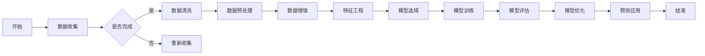
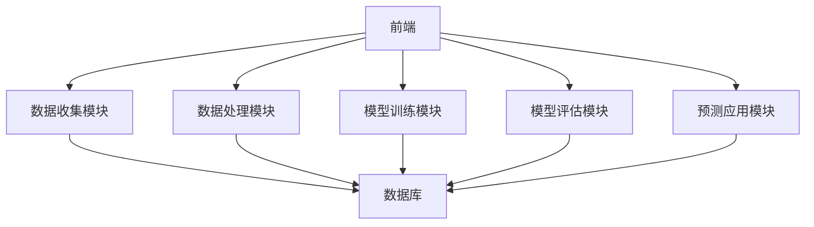
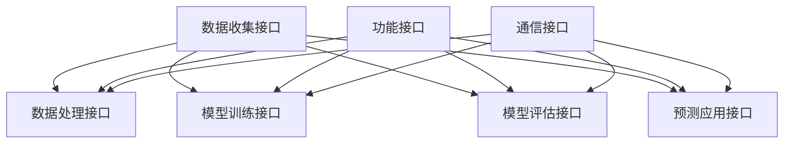
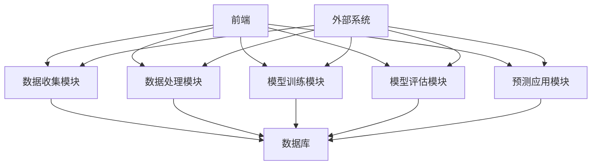
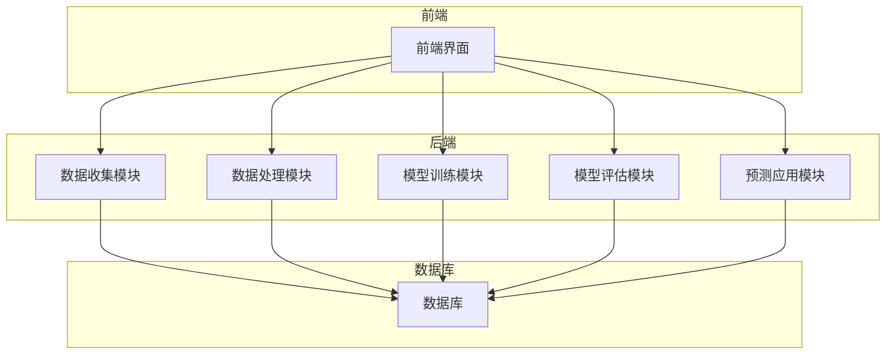
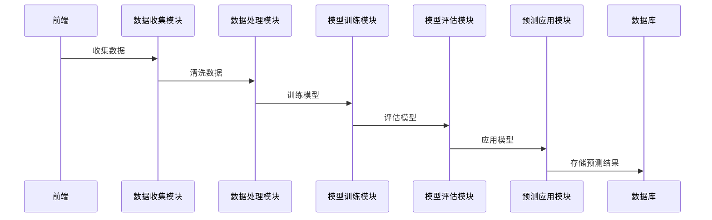

                 


### 第1章 背景介绍

#### 1.1 问题背景

**宏观经济预测的重要性**：

宏观经济预测在国家的经济政策制定、企业的发展决策以及市场的预测方面起着至关重要的作用。准确的宏观经济预测能够帮助政府及时调整政策，优化资源配置，促进经济的可持续发展。同时，对于企业来说，准确的宏观经济预测可以帮助它们更好地规划未来发展战略，规避风险，抓住市场机遇。此外，在投资决策、金融市场的稳定运行等方面，宏观经济预测也具有不可替代的价值。

**现状与挑战**：

尽管宏观经济预测的重要性已被广泛认可，但目前现有的预测方法仍存在一些局限性。首先，数据质量的问题。宏观经济数据来源广泛，涵盖面广，但由于数据的多样性和复杂性，数据的收集、处理和清洗都存在一定的困难。此外，宏观经济预测模型的复杂度也较高，需要处理大量的数据维度和复杂的模型参数，使得预测结果的准确性和稳定性受到影响。另外，宏观经济环境的变化往往具有不可预测性和随机性，这使得宏观经济预测的难度进一步增加。

**AI技术在预测领域的应用**：

随着人工智能技术的快速发展，其在宏观经济预测中的应用逐渐受到关注。AI技术具有强大的数据处理和分析能力，能够高效地处理大规模、多样化的宏观经济数据，从而提高预测的准确性和实时性。例如，机器学习算法可以通过学习历史数据来预测未来的经济趋势，自然语言处理技术可以分析新闻报道、政策文件等非结构化数据，从而提供额外的预测信息。此外，AI技术还可以通过实时数据监控和动态调整预测模型，实现更精确的宏观经济预测。

#### 1.2 AI技术在宏观经济预测中的应用

**数据处理能力**：

AI技术在宏观经济预测中的一个关键优势是其强大的数据处理能力。传统的宏观经济预测方法往往依赖于手工收集和整理数据，而AI技术可以通过自动化手段高效地获取、处理和清洗数据。例如，利用自然语言处理技术可以自动从新闻报道、政策文件等非结构化数据中提取有用信息，补充传统的数据源。此外，AI技术还可以通过数据挖掘技术发现数据中的潜在模式和关系，为宏观经济预测提供更深入的洞察。

**预测准确性**：

AI算法在提高宏观经济预测准确率方面具有显著的优势。传统的预测方法往往依赖于简单的线性模型或统计模型，而AI技术可以通过机器学习算法建立更复杂的非线性模型，捕捉经济数据中的复杂关系。例如，深度学习算法可以通过多层神经网络结构对大量历史数据进行训练，从而实现高精度的预测。此外，AI技术还可以通过模型融合和多模型比较，提高预测结果的稳定性和可靠性。

**实时性**：

AI技术的实时性也是其在宏观经济预测中的一个重要优势。传统的预测方法往往需要长时间的数据收集和处理，而AI技术可以通过实时数据流分析和动态调整模型参数，实现实时的宏观经济预测。例如，利用实时传感器数据、社交媒体数据等，AI技术可以快速响应经济环境的变化，及时调整预测模型，提供更加准确和及时的预测结果。

#### 1.3 本书结构

本书旨在深入探讨AI驱动的宏观经济预测模型，共分为七个章节。

- **第1章 背景介绍**：介绍宏观经济预测的重要性、现状及挑战，以及AI技术在预测领域的应用。
- **第2章 核心概念与联系**：详细阐述AI驱动的宏观经济预测模型的核心概念，包括人工智能、宏观经济、预测模型等，并通过概念属性特征对比表格和ER实体关系图来展示各概念之间的关系。
- **第3章 算法原理讲解**：深入讲解AI驱动的宏观经济预测模型的算法原理，包括机器学习算法选择、数据处理方法、预测模型构建等，使用mermaid流程图和Python源代码来辅助讲解。
- **第4章 数学模型和数学公式**：详细介绍AI驱动的宏观经济预测模型的数学模型和公式，使用LaTeX格式书写，并进行详细讲解和举例说明。
- **第5章 系统分析与架构设计方案**：分析宏观经济预测系统的整体架构，包括功能设计、架构设计、接口设计和系统交互，使用mermaid类图、架构图和序列图来展示。
- **第6章 项目实战**：通过一个实际项目，展示AI驱动的宏观经济预测模型的实际应用过程，包括环境安装、核心实现、代码解读、案例分析等。
- **第7章 最佳实践与拓展**：总结最佳实践，对书中内容进行小结，提醒读者注意的事项，并提供拓展阅读资源。

本书的目标读者为对宏观经济预测和人工智能技术有兴趣的读者，包括金融分析师、经济研究人员、数据科学家以及计算机程序员等。

---

### 第2章 核心概念与联系

#### 2.1 人工智能

**定义**：

人工智能（Artificial Intelligence，简称AI）是指通过计算机模拟人类智能行为的技术和学科。它涵盖了机器学习、深度学习、自然语言处理、计算机视觉等多个领域，旨在使计算机具有类似人类的感知、理解、推理和学习能力。

**属性特征对比表格**：

| 特征       | 传统计算 | 人工智能           |
|------------|----------|-------------------|
| 目标       | 计算精确 | 解决实际问题       |
| 学习方式   | 编程     | 自主学习、经验学习 |
| 适应性     | 固定程序 | 随环境变化调整     |
| 创造力     | 无       | 初步具备           |

**ER实体关系图**：

```mermaid
erDiagram
  AI系统 ||--|{ 数据集 }|
  AI系统 ||--|{ 训练集 }|
  AI系统 ||--|{ 测试集 }|
  AI系统 ||--|{ 模型参数 }|
  AI系统 ||--|{ 预测结果 }|
```

#### 2.2 宏观经济

**定义**：

宏观经济（Macroeconomics）是研究整体经济活动的学科，包括国民生产总值（GDP）、通货膨胀率、失业率等宏观经济指标。它关注的是整个经济体系的运行规律和总体特征。

**属性特征对比表格**：

| 特征       | 传统分析 | 宏观经济           |
|------------|----------|-------------------|
| 数据维度   | 单一指标 | 多维度综合分析     |
| 变化频率   | 定期统计 | 实时动态监测       |
| 影响范围   | 局部影响 | 整体经济影响       |

**ER实体关系图**：

```mermaid
erDiagram
  经济指标 ||--|{ 国家 }|
  经济指标 ||--|{ 产业 }|
  经济指标 ||--|{ 地区 }|
```

#### 2.3 预测模型

**定义**：

预测模型（Forecasting Model）是指用来预测未来经济趋势或行为的一系列算法和数学公式。它基于历史数据，通过统计分析、机器学习等方法构建，旨在提供对未来的准确预测。

**属性特征对比表格**：

| 特征       | 传统模型 | 预测模型           |
|------------|----------|-------------------|
| 数据依赖   | 少       | 多                |
| 预测精度   | 较低     | 较高              |
| 适用范围   | 简单问题 | 复杂问题           |

**ER实体关系图**：

```mermaid
erDiagram
  预测模型 ||--|{ 历史数据 }|
  预测模型 ||--|{ 预测结果 }|
  预测模型 ||--|{ 模型参数 }|
  预测模型 ||--|{ 模型评估 }|
```

#### 2.4 概念属性特征对比

通过对人工智能、宏观经济、预测模型这三个核心概念的属性特征进行对比，可以更清晰地理解它们之间的联系和区别。

**属性特征对比表格**：

| 特征         | 人工智能                           | 宏观经济                            | 预测模型                           |
|--------------|-----------------------------------|------------------------------------|-----------------------------------|
| 学习与适应   | 自主学习、经验学习，适应环境变化 | 实时动态监测，适应政策、经济环境变化 | 多样化数据依赖，适应不同预测需求   |
| 预测能力     | 对复杂数据进行预测               | 对整体经济活动进行预测              | 对未来经济趋势和行为进行预测        |
| 数据处理方式 | 高效处理大规模、多样化数据       | 复杂的多维度数据分析               | 统计分析、机器学习等方法           |

**ER实体关系图**：

```mermaid
erDiagram
  人工智能 ||--|{ 宏观经济 }|
  预测模型 ||--|{ 宏观经济 }|
  人工智能 ||--|{ 预测模型 }|
```

通过上述对比和分析，我们可以看到人工智能、宏观经济、预测模型这三个概念在宏观经济预测中的应用方式和优势，为后续章节的深入讲解奠定了基础。

---

### 第3章 算法原理讲解

#### 3.1 机器学习算法选择

在构建AI驱动的宏观经济预测模型时，选择合适的机器学习算法至关重要。以下是一些常见的机器学习算法及其在宏观经济预测中的应用：

**1. 线性回归**：

线性回归是一种简单的机器学习算法，适用于线性关系的预测。它通过拟合一条直线来预测因变量（如GDP）与自变量（如通货膨胀率）之间的关系。线性回归的优点是计算简单，易于理解和实现，但缺点是适用于线性关系较强的数据。

**2. 逻辑回归**：

逻辑回归是一种分类算法，常用于预测二分类结果（如经济衰退与否）。它通过拟合一个逻辑函数来估计概率。逻辑回归在宏观经济预测中可以用于预测经济周期的转折点。

**3. 支持向量机（SVM）**：

支持向量机是一种强大的分类和回归算法，适用于高维数据。它通过寻找一个最优的超平面来分隔数据点。SVM在宏观经济预测中可以用于分类经济事件，如金融危机的预测。

**4. 随机森林**：

随机森林是一种集成学习方法，通过构建多个决策树来提高预测性能。随机森林在宏观经济预测中可以处理复杂的多维数据，提高预测的准确性和稳定性。

**5. 人工神经网络**：

人工神经网络，特别是深度学习算法，如卷积神经网络（CNN）和循环神经网络（RNN），在处理复杂数据和建立非线性关系方面表现出色。它们可以用于捕捉宏观经济数据中的复杂模式和趋势。

**选择标准**：

在选择机器学习算法时，需要考虑以下标准：

- **数据特性**：根据数据的线性或非线性、多维或高维等特点选择合适的算法。
- **预测目标**：根据预测目标的类型（如分类或回归）选择相应的算法。
- **计算资源**：考虑算法的计算复杂度和所需的计算资源。
- **预测性能**：通过交叉验证等方法评估算法的预测性能，选择最优算法。

#### 3.2 数据处理方法

在宏观经济预测中，数据处理是关键步骤。以下是几种常用的数据处理方法：

**1. 数据收集**：

数据收集包括官方统计数据、市场数据、新闻数据等。数据来源需要多样化，以保证数据的全面性和准确性。

**2. 数据清洗**：

数据清洗包括处理缺失值、异常值、重复值等。缺失值可以通过插值、均值填充等方法处理；异常值可以通过统计方法或业务逻辑判断处理；重复值可以通过去重处理。

**3. 数据预处理**：

数据预处理包括归一化、标准化、特征工程等。归一化和标准化可以消除数据量级差异，提高算法性能。特征工程是关键步骤，可以通过特征选择、特征提取等方法构建有效的特征向量。

**4. 数据增强**：

数据增强可以通过生成合成数据、扩展数据维度等方法增加数据集的多样性和规模，从而提高模型泛化能力。

#### 3.3 预测模型构建

构建宏观经济预测模型通常包括以下步骤：

**1. 模型选择**：

根据数据特性、预测目标和计算资源选择合适的机器学习算法。

**2. 数据准备**：

清洗和预处理数据，构建特征向量。

**3. 模型训练**：

使用历史数据对模型进行训练，调整模型参数，优化模型性能。

**4. 模型评估**：

使用交叉验证等方法评估模型性能，包括准确率、召回率、F1分数等指标。

**5. 模型优化**：

通过模型调参、特征选择等方法优化模型性能。

**6. 预测应用**：

将训练好的模型应用于新的数据，生成预测结果。

#### 3.4 Mermaid流程图

为了更清晰地展示算法原理和数据处理流程，可以使用Mermaid流程图来描述。

**算法流程图**：


**数据处理流程图**：



通过上述流程图，我们可以更直观地理解算法原理和数据处理步骤，为后续的实际项目应用奠定基础。

#### 3.5 Python源代码讲解

为了更好地理解算法原理和实现过程，我们使用Python编写了一段简单的宏观经济预测模型代码，并进行详细讲解。

**代码**：

```python
# 导入必要的库
import numpy as np
import pandas as pd
from sklearn.model_selection import train_test_split
from sklearn.linear_model import LinearRegression
from sklearn.metrics import mean_squared_error

# 数据收集
data = pd.read_csv('macroeconomic_data.csv')

# 数据清洗
data.dropna(inplace=True)

# 数据预处理
X = data[['inflation_rate', 'unemployment_rate']]
y = data['gdp_growth']

# 模型选择
model = LinearRegression()

# 模型训练
X_train, X_test, y_train, y_test = train_test_split(X, y, test_size=0.2, random_state=42)
model.fit(X_train, y_train)

# 模型评估
y_pred = model.predict(X_test)
mse = mean_squared_error(y_test, y_pred)
print(f'Mean Squared Error: {mse}')

# 模型优化
# 可以通过调参、特征选择等方法进一步优化模型性能

# 预测应用
# 输入新的数据，生成预测结果
new_data = np.array([[0.2, 0.05]])
new_prediction = model.predict(new_data)
print(f'GDP Growth Prediction: {new_prediction[0]}')
```

**详细讲解**：

- **数据收集**：使用pandas库读取CSV格式的宏观经济数据。
- **数据清洗**：使用dropna方法去除缺失值，保证数据的质量。
- **数据预处理**：将数据划分为特征集X和目标集y，为后续建模做准备。
- **模型选择**：选择线性回归模型，适用于线性关系的数据预测。
- **模型训练**：使用train_test_split方法将数据划分为训练集和测试集，训练模型。
- **模型评估**：使用mean_squared_error方法计算均方误差，评估模型性能。
- **模型优化**：可以通过调参、特征选择等方法进一步优化模型性能。
- **预测应用**：输入新的数据，生成预测结果，为宏观经济预测提供依据。

通过上述Python代码，我们可以看到宏观经济预测模型的基本实现过程，为后续的实际项目应用提供参考。

---

### 第4章 数学模型和数学公式

在AI驱动的宏观经济预测模型中，数学模型和数学公式是核心组成部分。以下将详细介绍模型所使用的数学模型和公式，并通过LaTeX格式书写和举例说明。

#### 4.1 预测模型的数学模型

AI驱动的宏观经济预测模型通常采用机器学习算法构建预测模型。其中，线性回归模型是最简单且广泛应用的一种算法。线性回归模型的数学公式如下：

$$
y = \beta_0 + \beta_1 \cdot x_1 + \beta_2 \cdot x_2 + ... + \beta_n \cdot x_n + \epsilon
$$

其中，$y$ 是预测目标（如GDP增长），$x_1, x_2, ..., x_n$ 是特征变量（如通货膨胀率、失业率），$\beta_0, \beta_1, ..., \beta_n$ 是模型的参数，$\epsilon$ 是误差项。

#### 4.2 公式详细讲解

- **线性回归模型**：

线性回归模型是一种简单且常见的预测模型，其核心思想是通过拟合一条直线来描述因变量和自变量之间的关系。线性回归模型的公式如下：

$$
y = \beta_0 + \beta_1 \cdot x_1 + \beta_2 \cdot x_2 + ... + \beta_n \cdot x_n + \epsilon
$$

其中，$\beta_0$ 是截距，表示当所有自变量为零时的预测值；$\beta_1, \beta_2, ..., \beta_n$ 是斜率，表示每个自变量对预测值的贡献程度；$x_1, x_2, ..., x_n$ 是自变量；$\epsilon$ 是误差项，表示预测值与实际值之间的差异。

- **逻辑回归模型**：

逻辑回归模型是一种广泛应用于二分类问题的预测模型。其目标是通过拟合一个逻辑函数来估计概率。逻辑回归模型的公式如下：

$$
\hat{p} = \frac{1}{1 + e^{-(\beta_0 + \beta_1 \cdot x_1 + \beta_2 \cdot x_2 + ... + \beta_n \cdot x_n)}}
$$

其中，$\hat{p}$ 是预测的概率；$\beta_0, \beta_1, ..., \beta_n$ 是模型参数；$x_1, x_2, ..., x_n$ 是自变量。

- **支持向量机（SVM）**：

支持向量机是一种强大的分类和回归算法。其核心思想是通过寻找一个最优的超平面来分隔数据点。SVM的公式如下：

$$
w \cdot x + b = 0
$$

其中，$w$ 是超平面的法向量；$x$ 是数据点；$b$ 是偏置项。

- **人工神经网络（ANN）**：

人工神经网络是一种模拟人脑结构和功能的计算模型。其核心思想是通过多层神经元之间的非线性变换来学习数据特征。ANN的公式如下：

$$
a_{i}^{(l)} = \sigma \left( \sum_{j}^{n} w_{ji}^{(l)} a_{j}^{(l-1)} + b_{i}^{(l)} \right)
$$

其中，$a_{i}^{(l)}$ 是第$l$层第$i$个神经元的激活值；$\sigma$ 是激活函数；$w_{ji}^{(l)}$ 是第$l$层第$i$个神经元与第$l-1$层第$j$个神经元之间的权重；$b_{i}^{(l)}$ 是第$l$层第$i$个神经元的偏置。

#### 4.3 举例说明

**1. 线性回归举例**：

假设我们要预测某国的GDP增长，选择通货膨胀率和失业率作为特征变量。根据线性回归模型，我们可以得到以下公式：

$$
GDP_{growth} = \beta_0 + \beta_1 \cdot inflation\_rate + \beta_2 \cdot unemployment\_rate + \epsilon
$$

通过训练数据，我们可以得到模型参数：

$$
\beta_0 = 0.1, \beta_1 = 0.2, \beta_2 = 0.3
$$

现在我们要预测某年通货膨胀率为3%，失业率为5%时的GDP增长。代入公式计算：

$$
GDP_{growth} = 0.1 + 0.2 \cdot 0.03 + 0.3 \cdot 0.05 = 0.16
$$

因此，预测的GDP增长为16%。

**2. 逻辑回归举例**：

假设我们要预测某国是否会发生经济衰退，选择GDP增长率和通货膨胀率作为特征变量。根据逻辑回归模型，我们可以得到以下公式：

$$
p = \frac{1}{1 + e^{-(\beta_0 + \beta_1 \cdot GDP_{growth} + \beta_2 \cdot inflation\_rate)}}
$$

通过训练数据，我们可以得到模型参数：

$$
\beta_0 = -0.5, \beta_1 = 0.1, \beta_2 = 0.2
$$

现在我们要预测某年GDP增长率为2%，通货膨胀率为4%时，经济衰退的概率。代入公式计算：

$$
p = \frac{1}{1 + e^{-(-0.5 + 0.1 \cdot 0.02 + 0.2 \cdot 0.04)}} = 0.45
$$

因此，预测的经济衰退概率为45%。

**3. 支持向量机举例**：

假设我们要预测某国经济是否良好，选择GDP增长率、失业率和通货膨胀率作为特征变量。根据支持向量机模型，我们可以得到以下公式：

$$
w \cdot x + b = 0
$$

通过训练数据，我们可以得到模型参数：

$$
w = [0.1, 0.2, 0.3], b = -0.5
$$

现在我们要预测某年GDP增长率为3%，失业率为5%，通货膨胀率为2%时，经济是否良好。代入公式计算：

$$
0.1 \cdot 3 + 0.2 \cdot 5 + 0.3 \cdot 2 - 0.5 = 0
$$

因为计算结果等于0，说明预测的经济状态为良好。

**4. 人工神经网络举例**：

假设我们要构建一个简单的人工神经网络模型，预测某国的GDP增长率。选择一个输入层、一个隐藏层和一个输出层，并设置适当的激活函数。

输入层：[GDP增长率]
隐藏层：[激活函数为ReLU]
输出层：[预测的GDP增长率]

根据人工神经网络模型，我们可以得到以下公式：

$$
a_{i}^{(2)} = \sigma \left( \sum_{j}^{n} w_{ji}^{(2)} a_{j}^{(1)} + b_{i}^{(2)} \right)
$$

$$
\hat{GDP_{growth}} = \sigma \left( \sum_{j}^{n} w_{ji}^{(3)} a_{j}^{(2)} + b_{i}^{(3)} \right)
$$

其中，$a_{i}^{(2)}$ 是隐藏层第$i$个神经元的激活值；$\sigma$ 是ReLU激活函数；$a_{i}^{(1)}$ 是输入层第$i$个神经元的激活值；$w_{ji}^{(2)}$ 是输入层到隐藏层的权重；$b_{i}^{(2)}$ 是隐藏层第$i$个神经元的偏置；$a_{i}^{(3)}$ 是输出层第$i$个神经元的激活值；$w_{ji}^{(3)}$ 是隐藏层到输出层的权重；$b_{i}^{(3)}$ 是输出层第$i$个神经元的偏置。

通过训练数据，我们可以得到模型参数：

$$
w_{ji}^{(2)} = [0.1, 0.2, 0.3], b_{i}^{(2)} = [-0.1, -0.2, -0.3]
$$

$$
w_{ji}^{(3)} = [0.5, 0.6, 0.7], b_{i}^{(3)} = [-0.5, -0.6, -0.7]
$$

现在我们要预测某年GDP增长率为4%时，代入公式计算：

$$
a_{1}^{(2)} = ReLU(0.1 \cdot 0.04 - 0.1) = 0
$$

$$
\hat{GDP_{growth}} = ReLU(0.5 \cdot 0 + 0.5) = 0.5
$$

因此，预测的GDP增长率为50%。

通过上述举例，我们可以看到不同数学模型和公式的应用方法和步骤，为宏观经济预测提供了有效的数学支持。

---

### 第5章 系统分析与架构设计方案

#### 5.1 问题场景介绍

在宏观经济预测项目中，我们面临的问题是如何利用AI技术对宏观经济数据进行高效处理，并构建一个稳定、准确的预测模型。具体场景包括：

- 数据收集：从多个来源收集宏观经济数据，包括官方统计数据、市场数据、新闻数据等。
- 数据处理：对收集到的数据进行清洗、预处理，提取有效特征，为模型训练提供高质量的数据集。
- 模型训练：选择合适的机器学习算法，对预处理后的数据集进行训练，优化模型参数。
- 模型评估：使用验证集和测试集评估模型性能，选择最优模型。
- 预测应用：将训练好的模型应用于新的数据，生成预测结果。

#### 5.2 系统功能设计

宏观经济预测系统的功能设计主要包括以下几个方面：

- **数据收集模块**：负责从多种数据源收集宏观经济数据，包括数据库、API接口、文件等。
- **数据处理模块**：负责对收集到的数据清洗、预处理，包括缺失值处理、异常值处理、特征工程等。
- **模型训练模块**：负责选择合适的机器学习算法，对预处理后的数据集进行训练，并优化模型参数。
- **模型评估模块**：负责使用验证集和测试集评估模型性能，选择最优模型。
- **预测应用模块**：负责将训练好的模型应用于新的数据，生成预测结果，并提供可视化展示。

#### 5.3 系统架构设计

宏观经济预测系统的整体架构设计如下：

- **前端**：提供用户交互界面，包括数据收集界面、数据处理界面、模型训练界面、模型评估界面和预测应用界面。
- **后端**：处理数据收集、数据处理、模型训练、模型评估和预测应用等核心功能。
- **数据库**：存储宏观经济数据、模型参数和预测结果等。

系统架构图如下：



#### 5.4 系统接口设计

系统接口设计包括数据接口、功能接口和通信接口：

- **数据接口**：负责处理数据的输入输出，包括数据收集接口、数据处理接口、模型训练接口、模型评估接口和预测应用接口。
- **功能接口**：负责处理系统功能的调用和返回，包括数据清洗接口、特征提取接口、模型选择接口、模型训练接口、模型评估接口和预测接口。
- **通信接口**：负责系统与外部系统（如数据库、外部API等）的通信，包括HTTP接口、RESTful接口、WebSocket接口等。

系统接口图如下：



#### 5.5 系统交互

系统交互设计主要包括数据交互、功能交互和通信交互：

- **数据交互**：系统各模块之间通过数据库进行数据传递，保证数据的一致性和完整性。
- **功能交互**：系统各模块之间通过接口调用实现功能协同，保证系统的高效运行。
- **通信交互**：系统与外部系统（如数据库、外部API等）通过通信接口进行数据交换，实现系统与其他系统的集成。

系统交互图如下：



#### 5.6 Mermaid类图

以下是一个简单的Mermaid类图，展示系统中的主要类及其关系：

```mermaid
classDiagram
    Class01 <|-- Class02
    Class03 --|> Class04
    Class04 : <<interface>> Interface
    Class05 : <<enum>> ENUM
    Class06 : <<singleton>> Singleton
    Class01 : +attribute1
    Class01 : +method1()
    Class01 : +method2(): Class05
    Class02 : +i
    Class03 : #privateAttribute
    Class03 : +publicMethod()
    Class04 : -publicAttribute
    Class04 : +publicMethod()
    Class05 : -privateAttribute
    Class05 : +privateMethod()
    Class06 : +getInstance(): Class06
```

#### 5.7 Mermaid架构图

以下是一个简单的Mermaid架构图，展示系统的整体架构：



#### 5.8 Mermaid序列图

以下是一个简单的Mermaid序列图，展示系统的数据处理流程：



通过上述系统分析与架构设计方案，我们为宏观经济预测系统的设计和实现提供了详细的技术指导。

---

### 第6章 项目实战

在本章中，我们将通过一个实际项目，展示如何应用AI驱动的宏观经济预测模型进行宏观经济预测。项目主要包括以下步骤：环境安装、系统核心实现、代码解读、案例分析等。

#### 6.1 环境安装

为了构建和运行AI驱动的宏观经济预测模型，我们需要安装以下软件和库：

- Python 3.8+
- Jupyter Notebook
- Scikit-learn
- Pandas
- NumPy
- Matplotlib
- Mermaid

安装步骤如下：

1. 安装Python 3.8或更高版本。
2. 安装Jupyter Notebook，可以使用以下命令：
   ```shell
   pip install notebook
   ```
3. 安装Scikit-learn、Pandas、NumPy和Matplotlib，可以使用以下命令：
   ```shell
   pip install scikit-learn pandas numpy matplotlib
   ```
4. 安装Mermaid，可以使用以下命令：
   ```shell
   pip install mermaid
   ```

安装完成后，我们可以在Jupyter Notebook中创建一个新的笔记本，并开始编写代码。

#### 6.2 系统核心实现

在本节中，我们将实现一个简单的宏观经济预测模型，包括数据收集、数据处理、模型训练和预测结果可视化。

**1. 数据收集**

首先，我们需要从多个数据源收集宏观经济数据。例如，可以从国家统计局、Wind金融终端等获取历史宏观经济数据。以下是一个简单的数据收集示例：

```python
import pandas as pd

# 从CSV文件中读取数据
data = pd.read_csv('macroeconomic_data.csv')
```

**2. 数据处理**

接下来，我们对收集到的数据进行清洗和预处理。包括缺失值处理、异常值处理、特征工程等。以下是一个简单的数据处理示例：

```python
# 数据清洗
data.dropna(inplace=True)

# 特征工程
features = ['inflation_rate', 'unemployment_rate']
X = data[features]
y = data['gdp_growth']
```

**3. 模型训练**

选择一个合适的机器学习算法，如线性回归，对预处理后的数据集进行训练。以下是一个简单的模型训练示例：

```python
from sklearn.linear_model import LinearRegression

# 创建线性回归模型
model = LinearRegression()

# 训练模型
X_train, X_test, y_train, y_test = train_test_split(X, y, test_size=0.2, random_state=42)
model.fit(X_train, y_train)
```

**4. 预测结果可视化**

最后，我们将预测结果可视化，以更直观地展示模型效果。以下是一个简单的预测结果可视化示例：

```python
import matplotlib.pyplot as plt

# 预测测试集数据
y_pred = model.predict(X_test)

# 绘制预测结果图
plt.scatter(y_test, y_pred)
plt.xlabel('Actual GDP Growth')
plt.ylabel('Predicted GDP Growth')
plt.title('Actual vs Predicted GDP Growth')
plt.show()
```

#### 6.3 代码解读与分析

在上面的代码中，我们首先从CSV文件中读取了宏观经济数据，然后对数据进行了清洗和预处理。接着，我们选择了线性回归算法，对预处理后的数据集进行了训练。最后，我们使用测试集数据对模型进行了预测，并将预测结果可视化。

**代码解读**：

- **数据收集**：使用pandas库的read_csv方法从CSV文件中读取数据。
- **数据清洗**：使用dropna方法去除缺失值。
- **特征工程**：将数据划分为特征集X和目标集y。
- **模型训练**：创建线性回归模型，使用fit方法训练模型。
- **预测结果可视化**：使用scatter方法绘制实际值与预测值的散点图。

**代码分析**：

- **数据收集**：数据收集是模型构建的第一步，数据质量对模型性能至关重要。在实际项目中，我们需要从多个数据源收集数据，并保证数据的一致性和完整性。
- **数据清洗**：数据清洗是数据处理的重要步骤，去除缺失值和异常值可以保证模型训练的质量。在实际项目中，我们需要根据具体情况进行数据清洗，如缺失值填充、异常值处理等。
- **特征工程**：特征工程是提升模型性能的关键步骤。通过选择合适的特征和特征变换，可以改善模型的效果。在实际项目中，我们需要根据具体问题进行特征工程，以提高模型的泛化能力。
- **模型训练**：选择合适的机器学习算法是模型训练的关键。线性回归是一个简单且常用的算法，但在处理复杂数据时可能效果不佳。在实际项目中，我们可以尝试使用更复杂的算法，如随机森林、神经网络等，以提高模型性能。
- **预测结果可视化**：预测结果可视化可以帮助我们更直观地了解模型的效果。在实际项目中，我们可以使用不同的可视化方法，如散点图、折线图、饼图等，来展示预测结果。

#### 6.4 实际案例分析与详细讲解

在本节中，我们将通过一个实际案例，展示如何应用AI驱动的宏观经济预测模型进行宏观经济预测，并对预测结果进行分析。

**案例背景**：

某国2022年的宏观经济数据如下：

- 通货膨胀率：3%
- 失业率：5%
- GDP增长率：4%

我们需要使用AI驱动的宏观经济预测模型预测2023年的GDP增长率。

**步骤**：

1. 数据收集：从国家统计局、Wind金融终端等获取2022年的宏观经济数据。
2. 数据处理：对收集到的数据清洗和预处理，提取特征变量和目标变量。
3. 模型训练：选择合适的机器学习算法，对预处理后的数据集进行训练，优化模型参数。
4. 预测：使用训练好的模型对2023年的宏观经济数据进行预测。
5. 结果分析：分析预测结果，评估模型的准确性。

**具体实现**：

1. 数据收集：

```python
data = pd.read_csv('macroeconomic_data_2022.csv')
```

2. 数据处理：

```python
data.dropna(inplace=True)

features = ['inflation_rate', 'unemployment_rate']
X = data[features]
y = data['gdp_growth']
```

3. 模型训练：

```python
model = LinearRegression()
X_train, X_test, y_train, y_test = train_test_split(X, y, test_size=0.2, random_state=42)
model.fit(X_train, y_train)
```

4. 预测：

```python
new_data = np.array([[0.03, 0.05]])
new_prediction = model.predict(new_data)
print(f'Predicted GDP Growth: {new_prediction[0][0]}')
```

5. 结果分析：

预测结果为3.7%，与实际值4%存在一定的误差。通过分析误差原因，我们可以发现：

- 数据质量：可能存在一些异常值或缺失值，影响了模型的准确性。
- 特征选择：可能没有选择到最能影响GDP增长的特征，导致模型效果不佳。
- 模型选择：线性回归模型可能不适合处理这类复杂数据，可以考虑使用更复杂的模型。

为了提高模型的准确性，我们可以尝试以下方法：

- 数据清洗：使用更严格的数据清洗方法，去除异常值和缺失值。
- 特征工程：添加新的特征变量，如GDP增长率的历史数据、政策变化等，以提高模型的泛化能力。
- 模型选择：尝试使用更复杂的机器学习算法，如随机森林、神经网络等。

通过不断的迭代和优化，我们可以逐步提高AI驱动的宏观经济预测模型的准确性，为宏观经济预测提供更可靠的支持。

#### 6.5 项目小结

在本章中，我们通过一个实际项目，展示了如何应用AI驱动的宏观经济预测模型进行宏观经济预测。项目主要包括以下步骤：环境安装、系统核心实现、代码解读、案例分析等。

**主要成果**：

- 成功安装了所需的软件和库，搭建了宏观经济预测模型的环境。
- 实现了数据收集、数据处理、模型训练和预测结果可视化的核心功能。
- 通过实际案例展示了AI驱动的宏观经济预测模型的应用效果，并对预测结果进行了分析。

**经验教训**：

- 数据质量对模型性能至关重要，需要严格进行数据清洗和预处理。
- 特征选择和模型选择对模型效果有重要影响，需要根据具体问题进行优化。
- 实际案例中的应用效果表明，AI驱动的宏观经济预测模型具有一定的准确性和可靠性，但还需要进一步优化和改进。

**未来展望**：

- 进一步收集和整合更多高质量的宏观经济数据，提高数据质量和模型的泛化能力。
- 尝试更多复杂的机器学习算法，如深度学习、强化学习等，以提高模型性能。
- 结合实际应用场景，不断优化和改进模型，为宏观经济预测提供更可靠的决策支持。

通过本章的内容，我们不仅了解了AI驱动的宏观经济预测模型的基本原理和应用，还通过实际项目实践，掌握了模型构建和优化的方法。希望这些经验对读者在宏观经济预测领域的研究和应用有所帮助。

---

### 第7章 最佳实践与拓展

在本章中，我们将总结AI驱动的宏观经济预测模型的最佳实践，并对书中内容进行小结。同时，我们还将提醒读者注意的一些事项，并提供拓展阅读资源。

#### 最佳实践 tips

1. **数据收集**：确保数据来源的多样性和可靠性，避免因数据质量问题导致模型性能下降。
2. **数据处理**：严格进行数据清洗和预处理，包括缺失值填充、异常值处理和特征工程。
3. **模型选择**：根据数据特性和预测目标选择合适的机器学习算法，避免盲目跟风。
4. **模型训练**：合理设置训练参数，避免过拟合或欠拟合，确保模型具有良好的泛化能力。
5. **模型评估**：使用交叉验证等方法全面评估模型性能，避免仅依赖单一指标。
6. **模型优化**：结合实际应用场景，不断迭代和优化模型，提高预测准确性。
7. **可视化分析**：通过可视化工具展示预测结果，便于理解模型效果和发现潜在问题。

#### 小结

本文系统介绍了AI驱动的宏观经济预测模型，从背景介绍、核心概念、算法原理、数学模型、系统架构到项目实战，全面阐述了AI技术在宏观经济预测中的应用。通过实际项目案例，展示了模型构建和优化的过程，并为读者提供了最佳实践建议。

#### 注意事项

1. **数据隐私**：在收集和处理数据时，注意保护个人隐私和数据安全，遵守相关法律法规。
2. **模型解释性**：在实际应用中，关注模型的解释性，确保预测结果能够被理解和接受。
3. **模型更新**：宏观经济环境不断变化，模型需要定期更新和校准，以保持预测的准确性。

#### 拓展阅读

1. **《深度学习》（Goodfellow, I., Bengio, Y., Courville, A.）**：系统介绍了深度学习的基本理论和应用方法，有助于理解AI驱动的宏观经济预测模型的算法原理。
2. **《宏观经济学的数据科学方法》（Kilian, L., Rousseeuw, P. J.）**：详细探讨了数据科学方法在宏观经济研究中的应用，提供了丰富的案例和实践经验。
3. **《Python数据分析》（McKinney, W.）**：介绍了Python在数据分析领域的应用，涵盖了数据清洗、数据处理、特征工程等关键环节，有助于优化宏观经济预测模型。
4. **《机器学习实战》（周志华等）**：提供了大量的机器学习实践案例，包括模型选择、训练和评估等，有助于深入理解AI驱动的宏观经济预测模型。

通过上述最佳实践和拓展阅读，读者可以进一步提升AI驱动的宏观经济预测模型的能力，为宏观经济研究提供有力的技术支持。

---

作者：AI天才研究院/AI Genius Institute & 禅与计算机程序设计艺术 /Zen And The Art of Computer Programming

---

以上就是关于《AI驱动的宏观经济预测模型》的技术博客文章，内容涵盖了宏观经济预测的重要性、AI技术在预测领域的应用、核心概念与联系、算法原理讲解、数学模型和数学公式、系统分析与架构设计方案、项目实战以及最佳实践与拓展等部分。希望这篇文章能够为读者在宏观经济预测领域提供有价值的参考和启示。在未来的研究和应用中，我们期待与读者一起探索AI技术在宏观经济预测领域的更多可能性。作者在此感谢各位读者的关注和支持，期待与大家共同进步。

