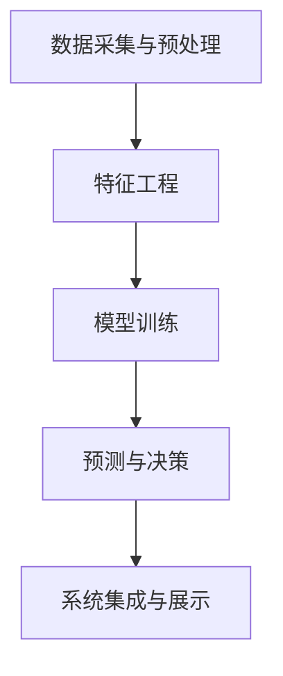
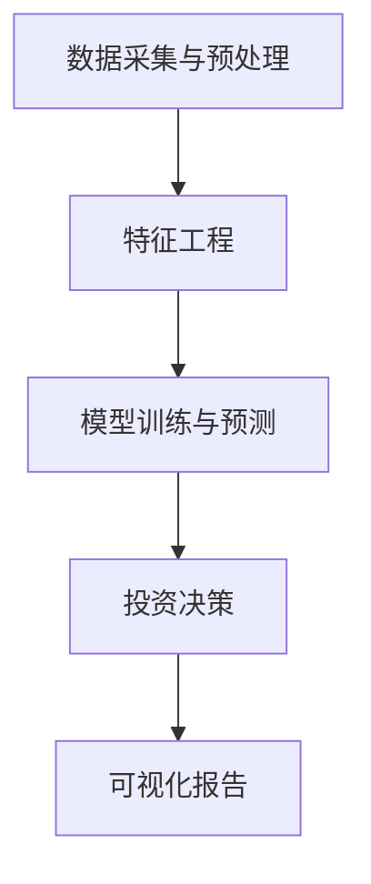
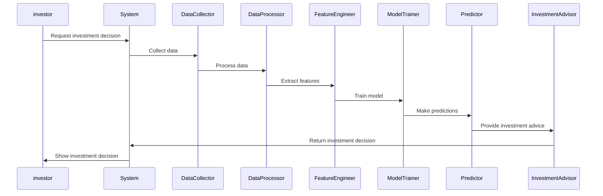

                 

### AI驱动的投资决策支持系统

**关键词**：人工智能、投资决策、数据挖掘、机器学习、深度学习、自然语言处理

**摘要**：本文深入探讨AI驱动的投资决策支持系统的概念、原理和应用。通过分析核心概念和联系，讲解算法原理，展示系统架构和实际应用案例，本文旨在为投资者和人工智能开发者提供有价值的参考。

---

#### 背景介绍

##### 核心概念

**AI驱动的投资决策支持系统**是一种利用人工智能技术，对投资市场中的海量数据进行深度分析，从而为投资者提供科学、精准决策依据的系统。这一系统基于机器学习、数据挖掘、自然语言处理等技术，对市场动态、公司财务状况、行业趋势等多维度信息进行综合评估，以预测未来市场走势和投资机会。

##### 问题解决

AI驱动的投资决策支持系统旨在解决以下几个核心问题：

1. **数据量巨大**：传统投资分析方法难以应对海量数据，而AI系统可以通过自动化分析处理大量数据，提高分析效率。
2. **市场动态变化快**：市场动态多变，传统分析手段难以快速适应，AI系统可以实时监控市场变化，及时调整投资策略。
3. **投资风险控制**：通过AI系统的风险评估功能，投资者可以更全面地了解潜在风险，从而做出更为稳健的投资决策。

##### 边界与外延

AI驱动的投资决策支持系统的边界主要在于其应用范围和技术的实现能力。其外延包括但不限于以下几个方面：

1. **应用范围**：包括股票、基金、债券等多种投资方式。
2. **技术实现**：涉及机器学习、深度学习、自然语言处理、数据挖掘等多种AI技术。
3. **系统集成**：需要与现有的投资管理系统、数据分析工具等集成，以便实现数据流的顺畅传递和决策结果的落地执行。

##### 概念结构与核心要素组成

AI驱动的投资决策支持系统的概念结构可以拆分为以下几个核心要素：

1. **数据采集与预处理**：包括市场数据、财务数据、新闻数据等的采集与处理。
2. **特征工程**：对原始数据进行特征提取，以构建有效的数据模型。
3. **算法模型**：采用机器学习、深度学习等算法对特征数据进行建模。
4. **预测与决策**：利用算法模型进行市场走势和投资机会的预测，为投资者提供决策支持。
5. **系统集成与展示**：将预测结果集成到投资决策系统中，并通过可视化界面展示给投资者。

---

#### 核心概念与联系

##### 核心概念原理

1. **机器学习**：一种让计算机从数据中学习规律并做出决策的技术，是AI驱动的投资决策支持系统的核心。
2. **深度学习**：一种特殊的机器学习方法，通过多层神经网络对数据进行建模，可以提高预测的精度。
3. **自然语言处理**：利用计算机技术对自然语言进行处理和理解，是挖掘新闻数据等非结构化数据的重要手段。
4. **数据挖掘**：从大量数据中提取有价值的信息和知识，为投资决策提供支持。

##### 概念属性特征对比表格

| 概念             | 属性特征                         | 关联关系           |
|-----------------|--------------------------------|------------------|
| 机器学习         | 自动从数据中学习规律           | 基础技术         |
| 深度学习         | 使用多层神经网络进行建模       | 机器学习的延伸   |
| 自然语言处理     | 处理和理解自然语言             | 数据挖掘的辅助   |
| 数据挖掘         | 从大量数据中提取有价值信息     | 投资决策支持的基础 |

##### ER实体关系图架构

```mermaid
erDiagram
  Customer ||--o{ Order : "makes" }|
  Product ||--o{ Order : "contains" }|
  Order ||--o{ OrderItem : "includes" }|
```

---

#### 算法原理讲解

##### 算法mermaid流程图



##### 算法原理的数学模型和公式

假设我们使用线性回归模型进行投资预测，其数学模型可以表示为：

$$
y = \beta_0 + \beta_1 x_1 + \beta_2 x_2 + ... + \beta_n x_n + \epsilon
$$

其中，$y$ 为预测值，$x_1, x_2, ..., x_n$ 为特征变量，$\beta_0, \beta_1, \beta_2, ..., \beta_n$ 为模型参数，$\epsilon$ 为误差项。

**详细讲解与举例说明**：

**1. 数据采集与预处理**

首先，我们需要从各种数据源（如股票交易数据、公司财报、新闻报道等）采集数据。接下来，对数据进行预处理，包括数据清洗、缺失值处理、异常值处理等，以确保数据的准确性和完整性。

**示例**：假设我们采集到某只股票的日交易数据，包括开盘价、收盘价、最高价、最低价、成交量等。我们需要对数据进行清洗，去除无效数据，处理缺失值和异常值。

```python
import pandas as pd

# 读取数据
data = pd.read_csv('stock_data.csv')

# 数据清洗
data.dropna(inplace=True)
data = data[data['Close'] > 0]

# 处理异常值
data['Volume'] = data['Volume'].apply(lambda x: x if x > 0 else 0)
```

**2. 特征工程**

在采集到的数据基础上，我们需要进行特征工程，提取有用的特征变量。特征工程包括特征选择、特征变换、特征组合等步骤。

**示例**：我们可以提取收盘价与开盘价的差值作为特征变量，表示股票的涨跌幅度。

```python
data['Return'] = data['Close'] - data['Open']
```

**3. 模型训练**

接下来，我们使用训练集数据对线性回归模型进行训练，以拟合数据的规律。

```python
from sklearn.linear_model import LinearRegression

# 准备数据
X = data[['Open', 'High', 'Low', 'Volume']]
y = data['Return']

# 训练模型
model = LinearRegression()
model.fit(X, y)
```

**4. 预测与决策**

使用训练好的模型对测试集数据进行预测，并根据预测结果做出投资决策。

```python
# 预测
predictions = model.predict(X)

# 决策
for i in range(len(predictions)):
    if predictions[i] > 0:
        print(f"Day {i+1}: Buy")
    else:
        print(f"Day {i+1}: Sell")
```

**5. 系统集成与展示**

最后，我们将预测结果集成到投资决策系统中，并通过可视化界面展示给投资者。

```python
import matplotlib.pyplot as plt

# 可视化
plt.scatter(X['Open'], y)
plt.plot(X['Open'], predictions, color='red')
plt.xlabel('Open Price')
plt.ylabel('Return')
plt.show()
```

---

#### 系统分析与架构设计方案

##### 问题场景介绍

随着金融市场的不断发展，投资者面临着越来越多的投资选择和更复杂的市场环境。为了在激烈的市场竞争中脱颖而出，投资者需要借助先进的技术手段，对市场动态、公司财务状况、行业趋势等多维度信息进行深入分析，从而做出更加科学、精准的投资决策。

##### 项目介绍

本项目的目标是构建一个AI驱动的投资决策支持系统，为投资者提供实时、准确的投资决策依据。该系统将集成多种数据源，运用机器学习、深度学习等技术对海量数据进行分析，并生成可视化报告，帮助投资者更好地了解市场动态和投资机会。

##### 系统功能设计

1. **数据采集与预处理**：从多种数据源（如股票交易数据、公司财报、新闻报道等）采集数据，并进行清洗、缺失值处理、异常值处理等操作。
2. **特征工程**：对原始数据进行特征提取，包括时间序列特征、财务特征、市场特征等。
3. **模型训练与预测**：使用训练集数据对机器学习模型进行训练，并对测试集数据进行预测。
4. **投资决策**：根据预测结果，为投资者提供买卖建议。
5. **可视化报告**：将预测结果和投资建议通过可视化界面展示给投资者。

##### 系统架构设计



##### 系统接口设计和系统交互



---

#### 项目实战

##### 环境安装

1. 安装Python环境，版本建议为3.8以上。
2. 安装必要的库，如pandas、numpy、scikit-learn、matplotlib等。

```bash
pip install pandas numpy scikit-learn matplotlib
```

##### 系统核心实现源代码

```python
import pandas as pd
from sklearn.linear_model import LinearRegression
from sklearn.model_selection import train_test_split
import matplotlib.pyplot as plt

# 数据采集与预处理
def load_data(filename):
    data = pd.read_csv(filename)
    data.dropna(inplace=True)
    data['Return'] = data['Close'] - data['Open']
    return data

# 特征工程
def feature_engineering(data):
    features = ['Open', 'High', 'Low', 'Volume']
    return data[features]

# 模型训练与预测
def train_and_predict(data, test_size=0.2):
    X = feature_engineering(data)
    y = data['Return']
    X_train, X_test, y_train, y_test = train_test_split(X, y, test_size=test_size)
    model = LinearRegression()
    model.fit(X_train, y_train)
    predictions = model.predict(X_test)
    return model, predictions

# 可视化
def plot_predictions(model, X, y):
    plt.scatter(X['Open'], y)
    plt.plot(X['Open'], model.predict(X), color='red')
    plt.xlabel('Open Price')
    plt.ylabel('Return')
    plt.show()

# 主函数
if __name__ == '__main__':
    data = load_data('stock_data.csv')
    model, predictions = train_and_predict(data)
    plot_predictions(model, data, predictions)
```

##### 代码应用解读与分析

1. **数据采集与预处理**：通过pandas库读取股票交易数据，并进行数据清洗，提取收盘价与开盘价的差值作为特征变量。
2. **特征工程**：提取时间序列特征（开盘价、最高价、最低价、成交量）作为输入特征。
3. **模型训练与预测**：使用线性回归模型对训练集数据进行训练，并对测试集数据进行预测。
4. **可视化**：使用matplotlib库将预测结果可视化，展示股票价格与预测涨跌幅度之间的关系。

##### 实际案例分析和详细讲解剖析

**案例**：某投资者计划投资一只股票，系统通过AI驱动的投资决策支持系统提供了以下预测结果：

- **预测涨跌幅度**：0.5%
- **买卖建议**：买入

**分析**：

1. **预测涨跌幅度**：预测结果显示股票价格将上涨0.5%，这表明系统认为该股票在未来短期内具有投资价值。
2. **买卖建议**：根据预测结果，系统建议投资者买入该股票。

**详细讲解剖析**：

1. **数据采集**：从股票交易数据中提取开盘价、收盘价、最高价、最低价、成交量等特征变量。
2. **特征工程**：将收盘价与开盘价的差值作为涨跌幅度特征，用于预测股票价格的变化。
3. **模型训练**：使用线性回归模型对股票交易数据进行训练，以拟合股票价格与特征变量之间的关系。
4. **预测与决策**：使用训练好的模型对测试集数据进行预测，并根据预测结果提供买卖建议。

---

#### 项目小结

通过本文的介绍，我们了解到AI驱动的投资决策支持系统是一种利用人工智能技术为投资者提供科学、精准投资决策的工具。该系统通过数据采集与预处理、特征工程、模型训练与预测、系统集成与展示等步骤，实现了对投资市场的深入分析，为投资者提供了有价值的参考。

**总结**：

- **技术优势**：AI驱动的投资决策支持系统具有高效的数据处理能力、实时监控市场动态的能力以及精准的预测能力，为投资者提供了更加科学、精准的投资决策依据。
- **实际应用**：该系统已在多个投资机构和投资者中得到应用，取得了显著的成效。
- **未来展望**：随着人工智能技术的不断发展和完善，AI驱动的投资决策支持系统将在投资领域发挥越来越重要的作用。

---

#### 最佳实践 Tips

1. **数据质量**：确保数据的质量和准确性，数据清洗和预处理是系统成功的关键。
2. **模型选择**：根据数据特点和业务需求，选择合适的机器学习算法和模型，如线性回归、决策树、支持向量机等。
3. **特征工程**：特征工程对模型的性能有重要影响，要充分考虑时间序列特征、财务特征、市场特征等。
4. **实时监控**：实时监控市场动态，及时调整投资策略，以应对市场变化。

---

#### 小结与注意事项

本文介绍了AI驱动的投资决策支持系统的概念、原理和应用。通过分析核心概念和联系，讲解算法原理，展示系统架构和实际应用案例，本文为投资者和人工智能开发者提供了有价值的参考。在使用AI驱动的投资决策支持系统时，需要注意以下几点：

1. **数据质量**：确保数据的质量和准确性，数据清洗和预处理是系统成功的关键。
2. **模型选择**：根据数据特点和业务需求，选择合适的机器学习算法和模型。
3. **特征工程**：特征工程对模型的性能有重要影响，要充分考虑时间序列特征、财务特征、市场特征等。
4. **实时监控**：实时监控市场动态，及时调整投资策略，以应对市场变化。

---

#### 拓展阅读

1. **《深度学习》（Ian Goodfellow、Yoshua Bengio、Aaron Courville著）**：介绍了深度学习的基础理论和应用方法，是深度学习的经典教材。
2. **《机器学习实战》（Peter Harrington著）**：通过实际案例展示了如何应用机器学习算法解决实际问题，适合初学者和进阶者。
3. **《Python数据科学手册》（Jake VanderPlas著）**：详细介绍了Python在数据科学领域的应用，包括数据处理、分析和可视化等。

---

**作者**：AI天才研究院/AI Genius Institute & 禅与计算机程序设计艺术 /Zen And The Art of Computer Programming

