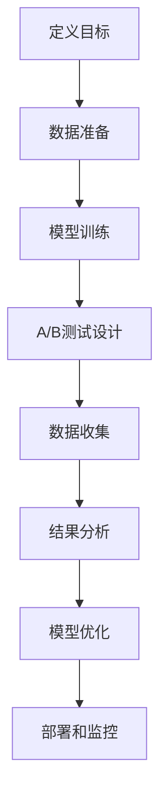
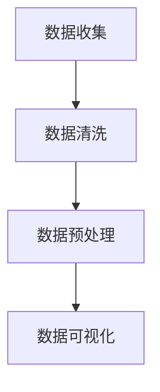
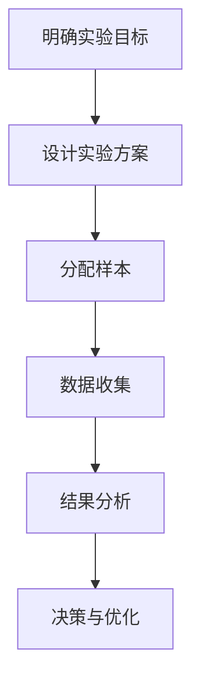
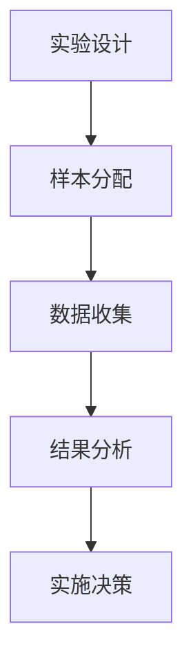
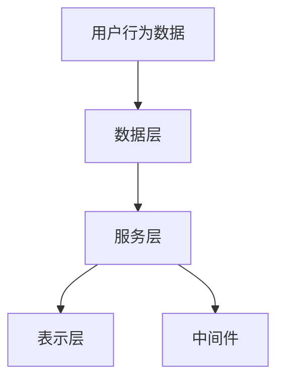
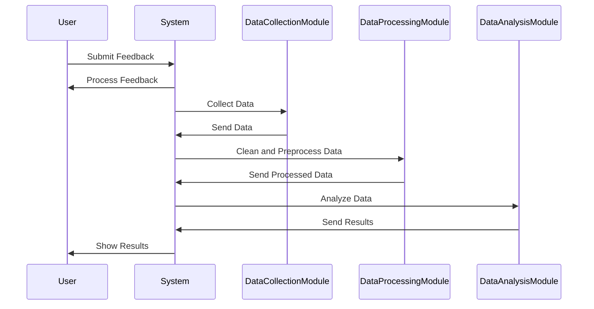

                 


## A/B Testing: Optimizing AI Agent's User Experience

### Introduction

A/B testing is a fundamental tool in the field of data science and artificial intelligence (AI). It's a method used to compare two versions of a product, feature, or service to determine which one performs better. This book, "A/B Testing: Optimizing AI Agent's User Experience," delves into the intricacies of A/B testing, focusing on its application in enhancing the user experience of AI agents. The importance of this topic cannot be overstated, as user experience is a key determinant of user engagement and retention in the increasingly competitive AI landscape.

In this comprehensive guide, we will explore the various aspects of A/B testing, starting from the basic theories and methodologies, through advanced statistical techniques, to real-world case studies. We will examine how A/B testing can be effectively utilized to optimize the user experience of AI agents, ensuring that they are intuitive, efficient, and satisfying to use. By the end of this book, readers will have a thorough understanding of A/B testing and be equipped with the practical skills to apply it in their AI projects.

### Keywords

- **A/B Testing**
- **User Experience Optimization**
- **Artificial Intelligence**
- **Data Science**
- **Machine Learning**
- **Experimental Design**
- **Statistical Analysis**

### Abstract

This book aims to provide a comprehensive guide to A/B testing, with a specific focus on optimizing the user experience of AI agents. We begin by establishing a solid foundation in the basic theories and methodologies of A/B testing. We then delve into advanced statistical techniques, such as hypothesis testing and confidence intervals, which are crucial for conducting effective A/B tests. The book continues with a detailed exploration of the integration of A/B testing with machine learning, providing insights into how to evaluate and optimize AI models using A/B testing. Practical applications are highlighted through case studies from various industries, demonstrating the real-world impact of A/B testing on user experience. The book concludes with a discussion on the challenges and best practices of A/B testing, equipping readers with the knowledge and tools to successfully implement A/B testing in their AI projects.

----------------------------------------------------------------

# A/B Testing: Optimizing AI Agent's User Experience

> Keywords: A/B Testing, User Experience Optimization, Artificial Intelligence, Data Science, Machine Learning, Experimental Design, Statistical Analysis

> 摘要：
本书旨在提供关于A/B测试的全面指南，特别关注如何通过A/B测试优化人工智能代理的用户体验。我们从A/B测试的基本理论和方法的建立开始，深入探讨如假设测试和置信区间等高级统计技术，这些技术对于进行有效的A/B测试至关重要。书中接着详细探讨A/B测试与机器学习的集成，提供如何使用A/B测试评估和优化AI模型的见解。通过不同行业的案例研究，我们展示了A/B测试在改善用户体验方面的实际影响。最后，本书讨论A/B测试的挑战和最佳实践，为读者提供在AI项目中成功实施A/B测试的知识和工具。

----------------------------------------------------------------

## 第一部分：A/B测试基础理论

### 1.1 A/B测试概述

A/B测试，也称为拆箱测试，是实验设计中的一个核心方法，其基本思想是比较两个或多个版本的某个产品或服务，以确定哪个版本的效果更好。这种测试方法最早在广告、市场营销和软件开发中广泛应用，随着人工智能的兴起，A/B测试也逐渐成为优化AI代理用户体验的重要工具。

#### 1.1.1 A/B测试的定义

A/B测试是一种随机实验，通过将用户随机分配到不同的版本（A和B），来比较这两个版本的差异，从而确定哪个版本在特定指标上表现更好。这些指标可以是用户点击率、转化率、留存率等，具体取决于测试的目标。

#### 1.1.2 A/B测试的发展历程

A/B测试的概念最早可以追溯到20世纪初的统计学家拉奥·吉尔伯特（L.L. Thurstone），他使用这种方法来评估不同广告的效果。随着计算机技术的发展，A/B测试逐渐从简单的广告和市场营销领域扩展到更复杂的软件开发领域。

#### 1.1.3 A/B测试的应用场景

A/B测试适用于许多场景，包括但不限于：

- **产品设计**：比较不同的界面布局、按钮颜色或文字表述，以确定哪种设计更能吸引用户。
- **广告优化**：测试不同的广告创意、文案或图片，以找到最高效的广告策略。
- **机器学习模型评估**：通过A/B测试比较不同模型或参数设置的性能，以找到最佳模型。

### 1.2 用户行为分析与评估

用户行为分析是A/B测试的重要组成部分，它涉及到如何收集、处理和分析用户数据，以评估用户体验。

#### 1.2.1 用户行为分析

用户行为分析是通过监测和分析用户的交互行为，如点击、浏览、购买等，来了解用户的需求和偏好。这通常需要使用各种数据收集工具，如Web分析平台、日志文件等。

#### 1.2.2 用户满意度评估

用户满意度评估是通过调查、问卷调查等方式收集用户对产品或服务的满意度。这有助于了解用户对当前版本的感受，并为改进提供反馈。

#### 1.2.3 用户流失率分析

用户流失率分析是衡量用户保留程度的一个重要指标。通过分析用户流失的原因，可以识别出需要改进的方面，从而降低用户流失率。

### 1.3 A/B测试与机器学习

随着机器学习在人工智能中的应用日益广泛，A/B测试也逐渐与机器学习技术相结合，以优化AI模型的性能。

#### 1.3.1 A/B测试在机器学习中的应用

在机器学习中，A/B测试可以用来评估不同模型、特征选择、参数设置的效果，从而找到最优的模型和参数。

#### 1.3.2 机器学习模型评估方法

机器学习模型的评估通常包括准确率、召回率、F1分数等指标。A/B测试提供了一种更直观和用户友好的评估方法，可以更好地反映用户对模型的真实感受。

#### 1.3.3 A/B测试与机器学习的结合

A/B测试与机器学习的结合可以形成一种闭环优化机制，通过不断测试和调整，实现模型性能和用户体验的持续优化。

### 1.4 数据准备与处理

在A/B测试中，数据的质量和完整性直接影响测试结果的可靠性。

#### 1.4.1 数据收集

数据收集是A/B测试的基础，需要确保收集的数据能够准确反映用户行为和系统性能。

#### 1.4.2 数据清洗与预处理

数据清洗与预处理是确保数据质量的重要步骤，包括去除重复数据、填补缺失值、数据标准化等。

#### 1.4.3 数据可视化

数据可视化有助于更直观地理解和分析数据，为A/B测试提供有力的支持。

### 1.5 A/B测试流程与策略

A/B测试的成功实施需要一系列科学的流程和策略。

#### 1.5.1 A/B测试的流程设计

A/B测试的流程设计包括实验目标设定、实验设计、数据收集、结果分析等步骤。

#### 1.5.2 A/B测试的实验设计

实验设计是A/B测试的核心，需要考虑样本分配、控制变量、实验周期等因素。

#### 1.5.3 A/B测试的结果分析与解读

结果分析是A/B测试的最后一个重要环节，需要使用统计学方法对数据进行处理和解读。

### 1.6 A/B测试案例分析

通过实际案例分析，可以更好地理解A/B测试的应用和效果。

#### 1.6.1 案例一：电商平台的A/B测试实践

电商平台的A/B测试通常涉及页面设计、商品推荐、广告展示等方面。

#### 1.6.2 案例二：社交媒体平台的A/B测试实践

社交媒体平台的A/B测试通常关注用户互动、内容推荐等方面。

#### 1.6.3 案例三：金融行业的A/B测试实践

金融行业的A/B测试通常涉及风险评估、用户体验优化等方面。

### 1.7 A/B测试的挑战与应对策略

A/B测试在实际应用中也会面临一系列挑战。

#### 1.7.1 A/B测试的常见问题

常见问题包括样本量不足、实验周期过长等。

#### 1.7.2 A/B测试的统计学挑战

统计学挑战包括假设检验、置信区间计算等。

#### 1.7.3 A/B测试的伦理问题

伦理问题包括用户隐私保护、实验公平性等。

### 1.8 本章小结

本章介绍了A/B测试的基本理论和方法，包括概述、用户行为分析、机器学习结合、数据准备和处理、测试流程与策略、案例分析以及挑战与应对策略。通过本章的学习，读者可以初步了解A/B测试的概念和应用，为后续章节的深入学习打下基础。

----------------------------------------------------------------

### 1.1 A/B测试概述

#### 1.1.1 A/B测试的定义

A/B测试，也被称为拆箱测试或控制组测试，是一种统计实验设计方法，用于比较两个或多个版本的某个产品、服务或功能，以确定哪个版本在特定目标上表现更好。这种测试方法的核心思想是随机分配用户到不同的组别，通常分为控制组和实验组，然后观察两个组在相同条件下的表现差异，从而得出结论。

在A/B测试中，控制组（Group A）通常代表当前版本或基准版本，而实验组（Group B）则代表需要测试的新版本或修改后的版本。通过对比两组的数据，例如点击率、转化率、用户满意度等指标，可以确定新版本是否优于原版本。

A/B测试的定义可以用以下公式表示：

$$
Performance_{A/B} = \frac{Performance_{B} - Performance_{A}}{Performance_{A}}
$$

其中，$Performance_{A}$和$Performance_{B}$分别表示控制组和实验组的性能指标。

#### 1.1.2 A/B测试的发展历程

A/B测试的概念最早可以追溯到20世纪初的统计学家拉奥·吉尔伯特（L.L. Thurstone），他在研究中使用了这种方法来评估不同广告的效果。随着计算机技术的进步和互联网的普及，A/B测试在电子商务、软件开发、市场营销等领域得到了广泛应用。

在20世纪60年代，心理学家米尔顿·罗伯茨（Milton Rokeach）进一步发展了A/B测试的理论，并将其应用于产品设计和市场研究。随着数据采集和分析技术的进步，A/B测试逐渐成为企业优化产品和服务的标准方法。

进入21世纪，随着人工智能和大数据技术的兴起，A/B测试在AI领域也发挥了重要作用。通过A/B测试，AI代理可以根据用户行为和反馈不断优化，提高用户体验和满意度。

#### 1.1.3 A/B测试的应用场景

A/B测试的应用场景非常广泛，以下是一些常见的应用领域：

1. **产品设计**：通过A/B测试，可以评估不同界面布局、配色方案、按钮位置等对用户体验的影响，从而找到最佳的设计方案。

2. **广告优化**：通过A/B测试，可以比较不同广告创意、文案或图片的效果，找到最有效的广告策略。

3. **市场营销**：在电子邮件营销中，可以通过A/B测试来优化邮件的主题、内容和发送时间，提高打开率和转化率。

4. **机器学习模型评估**：通过A/B测试，可以比较不同机器学习模型或参数设置的性能，找到最佳模型和参数。

5. **金融产品**：在金融行业中，可以通过A/B测试来评估不同风险模型的准确性、稳定性和用户满意度。

6. **电子商务**：在电子商务中，可以通过A/B测试来优化商品推荐、购物流程和用户互动，提高转化率和用户留存率。

#### 1.1.4 A/B测试的优势

A/B测试具有以下优势：

1. **客观性**：通过随机分配和统计分析，A/B测试可以提供客观的实验结果，减少主观判断的干扰。

2. **可重复性**：A/B测试的实验设计可以重复进行，从而验证结果的可靠性和一致性。

3. **灵活性**：A/B测试可以根据具体需求和目标进行调整，适用于不同类型的产品和服务。

4. **高效性**：通过快速测试和迭代，A/B测试可以帮助企业迅速优化产品和服务，提高市场竞争力。

#### 1.1.5 A/B测试的挑战

尽管A/B测试具有许多优势，但在实际应用中也面临一些挑战：

1. **样本量不足**：如果样本量不足，可能导致实验结果不具有统计学上的显著性。

2. **实验周期过长**：长时间运行的实验可能导致数据收集不完整或过时。

3. **变量控制**：在实验过程中，需要严格控制其他变量的影响，以确保实验结果的准确性。

4. **用户满意度**：用户可能对重复的实验感到厌烦，影响用户体验。

#### 1.1.6 A/B测试的最佳实践

为了最大限度地利用A/B测试的优势并克服其挑战，以下是一些最佳实践：

1. **明确实验目标**：在开始实验之前，明确实验的目标和指标，以确保实验的针对性和有效性。

2. **合理设计实验**：合理设计实验，包括样本分配、实验周期和控制变量等，以确保实验结果的可靠性。

3. **充分数据收集**：确保充分的数据收集，包括用户行为数据、系统性能数据等，以便进行深入的分析。

4. **统计分析**：使用适当的统计分析方法，如假设检验、置信区间等，对实验结果进行解读。

5. **迭代优化**：根据实验结果，不断迭代和优化产品和服务，以实现持续改进。

通过上述步骤，我们可以更好地理解和应用A/B测试，从而优化AI代理的用户体验。

### 1.2 用户行为分析与评估

用户行为分析是A/B测试的重要组成部分，它涉及到如何收集、处理和分析用户数据，以评估用户体验。通过对用户行为的深入分析，我们可以更好地了解用户需求，从而优化产品和服务。

#### 1.2.1 用户行为分析

用户行为分析（User Behavior Analysis, UBA）是一种用于理解用户如何与产品或服务交互的技术。它包括以下几个关键方面：

1. **点击率（Click-Through Rate, CTR）**：用户在页面上的点击行为，如点击广告、按钮或链接。

2. **转化率（Conversion Rate）**：用户完成特定目标的行为，如购买、注册或下载。

3. **留存率（Retention Rate）**：用户在一定时间内持续使用产品或服务的比例。

4. **用户活跃度（User Engagement）**：用户在产品或服务中的互动程度，如浏览时间、评论数、分享行为等。

5. **用户流失率（Churn Rate）**：用户停止使用产品或服务的比例。

6. **用户满意度**：用户对产品或服务的满意程度，通常通过调查问卷或用户反馈收集。

#### 1.2.2 用户满意度评估

用户满意度评估（User Satisfaction Assessment）是衡量用户对产品或服务满意程度的过程。以下是一些常用的方法：

1. **用户调查**：通过问卷调查收集用户的反馈，了解他们对产品或服务的整体满意度。

2. **用户访谈**：与用户进行一对一访谈，深入了解他们对产品或服务的体验和意见。

3. **净推荐值（Net Promoter Score, NPS）**：通过一个简单的问题“您有多大可能推荐我们的产品或服务给他人？”来衡量用户的忠诚度和满意度。

4. **用户行为分析**：通过分析用户行为数据，如点击率、转化率和留存率，评估用户的满意度。

#### 1.2.3 用户流失率分析

用户流失率分析（Churn Analysis）是识别导致用户停止使用产品或服务的原因，并采取措施减少流失的过程。以下是一些关键步骤：

1. **数据收集**：收集用户行为数据，如登录次数、使用时长、购买历史等。

2. **识别流失信号**：通过分析数据，识别可能导致用户流失的信号，如长时间未登录、频繁取消订阅等。

3. **流失原因分析**：通过用户调查或访谈，了解用户流失的原因，如产品功能不足、用户体验差、价格高等。

4. **流失预防策略**：根据分析结果，制定预防措施，如改进产品功能、提高用户支持、提供优惠等。

#### 1.2.4 用户行为分析工具

在进行用户行为分析时，以下工具可以提供帮助：

1. **Google Analytics**：一款广泛使用的免费Web分析工具，可以跟踪用户在网站上的行为。

2. **Mixpanel**：一款强大的用户行为分析工具，提供详细的用户行为追踪和用户流失分析功能。

3. **UserZoom**：一款用户测试和反馈工具，可以帮助收集用户对产品或服务的直接反馈。

4. **Hotjar**：一款用户行为分析工具，提供热图、录制用户行为等功能。

通过用户行为分析和评估，我们可以更好地了解用户需求，优化产品和服务，提高用户体验。这不仅有助于提高用户满意度和留存率，还可以提升企业的市场竞争力和盈利能力。

### 1.3 A/B测试与机器学习

在人工智能领域，A/B测试已成为评估和优化机器学习模型性能的关键工具。随着机器学习在各类应用中的普及，A/B测试的应用也日益广泛，通过科学的方法和流程，可以帮助企业更快地实现产品迭代和优化。

#### 1.3.1 A/B测试在机器学习中的应用

A/B测试在机器学习中的应用主要涉及以下几个方面：

1. **模型评估**：通过A/B测试，可以比较不同模型或同一模型在不同参数设置下的性能，从而确定最佳模型和参数。

2. **特征选择**：在机器学习中，特征选择是一个重要且复杂的任务。A/B测试可以帮助评估不同特征组合对模型性能的影响，找到最佳特征组合。

3. **算法优化**：A/B测试可以用来评估不同算法在特定任务上的性能，帮助研究者选择或优化算法。

4. **用户反馈**：通过A/B测试，可以直接获取用户对模型输出的反馈，从而进一步优化模型。

#### 1.3.2 机器学习模型评估方法

在机器学习模型评估中，常用的指标包括准确率（Accuracy）、精确率（Precision）、召回率（Recall）和F1分数（F1 Score）等。以下是一些具体的评估方法：

1. **交叉验证（Cross-Validation）**：通过将数据集划分为多个子集，轮流作为测试集和训练集，评估模型的性能。常用的交叉验证方法有K折交叉验证（K-Fold Cross-Validation）和留一法（Leave-One-Out Cross-Validation）。

2. **ROC曲线和AUC（Area Under the Curve）**：ROC曲线通过比较真阳性率（True Positive Rate）和假阳性率（False Positive Rate），评估分类器的性能。AUC值越高，表示分类器性能越好。

3. **混淆矩阵（Confusion Matrix）**：通过混淆矩阵可以直观地了解模型预测的结果，包括真阳性、真阴性和假阳性、假阴性等。

4. **用户反馈评估**：通过A/B测试，可以直接从用户反馈中获取模型性能的评估。用户反馈可以包括满意度评分、错误报告等。

#### 1.3.3 A/B测试与机器学习的结合

A/B测试与机器学习的结合，可以形成一种闭环优化机制，通过不断测试和调整，实现模型性能和用户体验的持续优化。以下是一个典型的结合流程：

1. **定义目标**：明确A/B测试的目标，如提高分类准确率、降低误分类率、提升用户满意度等。

2. **数据准备**：收集和预处理数据，包括特征工程、数据清洗、归一化等步骤。

3. **模型训练**：训练多个机器学习模型，选择初步评估表现较好的模型。

4. **A/B测试设计**：设计A/B测试实验，包括分配用户到不同模型组、确定测试指标等。

5. **数据收集**：在测试期间，收集用户行为数据和模型输出结果。

6. **结果分析**：使用统计学方法分析实验结果，确定最佳模型。

7. **模型优化**：根据A/B测试的结果，对模型进行调整和优化。

8. **部署和监控**：将最佳模型部署到生产环境，并持续监控其性能。

通过上述流程，A/B测试可以帮助机器学习模型更好地适应实际应用场景，提高模型性能和用户体验。以下是一个简单的mermaid流程图，展示了A/B测试与机器学习的结合过程：



通过A/B测试与机器学习的结合，我们可以实现模型性能和用户体验的持续优化，从而在竞争激烈的AI市场中取得优势。

### 1.4 数据准备与处理

在A/B测试中，数据准备与处理是确保实验结果准确性和可靠性的关键步骤。这一部分将详细介绍数据收集、清洗与预处理、以及数据可视化等关键环节。

#### 1.4.1 数据收集

数据收集是A/B测试的基础。在开始实验之前，需要明确需要收集的数据类型和来源。常见的数据类型包括用户行为数据、系统性能数据、用户反馈数据等。数据来源可以是日志文件、数据库记录、第三方数据分析工具等。

为了确保数据的质量，我们需要：

1. **自动化数据采集**：使用自动化工具（如日志采集器、API调用等）收集数据，减少人为干预。

2. **数据完整性验证**：确保数据收集过程的完整性和准确性，例如通过校验字段、数据类型等。

3. **数据频次控制**：根据实验需求和数据量，合理控制数据采集的频次，避免数据过载。

#### 1.4.2 数据清洗与预处理

数据清洗与预处理是数据质量保证的重要环节，它包括以下步骤：

1. **去除重复数据**：在数据集中可能存在重复的记录，这些数据会影响实验结果的准确性。使用去重算法（如哈希算法）可以有效地去除重复数据。

2. **填补缺失值**：在实际数据中，可能存在缺失值。填补缺失值的方法包括均值填补、中值填补、插值法等。

3. **数据标准化**：为了确保数据在不同特征之间的可比性，需要对数据进行标准化处理。常用的标准化方法包括Z-score标准化、Min-Max标准化等。

4. **数据转换**：将数据转换为适合分析的形式，例如将分类变量转换为哑变量（Dummy Variables），或将时间序列数据进行差分处理。

#### 1.4.3 数据可视化

数据可视化是将数据转化为视觉形式，以帮助更好地理解和分析数据。以下是一些常用的数据可视化工具和方法：

1. **柱状图（Bar Chart）**：用于显示不同类别或组之间的数量对比。

2. **折线图（Line Chart）**：用于显示数据随时间的变化趋势。

3. **散点图（Scatter Plot）**：用于显示两个变量之间的关系。

4. **热力图（Heatmap）**：用于显示数据分布的热点区域。

5. **箱线图（Box Plot）**：用于显示数据的分布和异常值。

通过数据可视化，我们可以更直观地了解数据的特征和趋势，从而为A/B测试提供有力的支持。

以下是一个简单的mermaid流程图，展示了数据收集、清洗与预处理、以及数据可视化的过程：



通过上述步骤，我们可以确保A/B测试的数据质量和可靠性，为实验的成功奠定基础。

### 1.5 A/B测试流程与策略

A/B测试的实施是一个系统的过程，涉及多个步骤和策略，确保实验的科学性和有效性。以下将详细介绍A/B测试的流程设计、实验设计、数据收集、结果分析等关键环节。

#### 1.5.1 A/B测试的流程设计

A/B测试的流程设计是确保实验顺利进行的基础。以下是A/B测试的基本流程：

1. **明确实验目标**：在开始实验之前，需要明确实验的目标，例如提高点击率、转化率或用户满意度。

2. **设计实验方案**：根据实验目标，设计实验方案，包括实验组与控制组的分配、测试指标、实验周期等。

3. **分配样本**：将用户随机分配到实验组和控制组，确保两组用户在实验开始前处于相似的状态。

4. **数据收集**：在实验期间，收集两组用户的行为数据，例如点击、购买、使用时长等。

5. **结果分析**：使用统计学方法分析实验结果，确定实验组和控制组之间的差异，评估实验效果。

6. **决策与优化**：根据实验结果，做出决策，如将实验组的新版本推广至全体用户，或继续进行迭代测试。

#### 1.5.2 A/B测试的实验设计

A/B测试的实验设计是确保实验结果可靠性的关键。以下是实验设计的关键要素：

1. **样本分配**：将用户随机分配到实验组和控制组，确保两组用户在实验开始前处于相似的状态。随机分配可以减少选择偏差，提高实验的客观性。

2. **控制变量**：在实验过程中，确保只对需要测试的变量进行修改，其他变量保持不变。这样可以确保实验结果的因果关系清晰。

3. **实验周期**：确定实验的持续时间，通常取决于数据量、用户行为变化等因素。实验周期不宜过长，以免数据过时。

4. **测试指标**：选择适当的测试指标，如点击率、转化率、用户满意度等。测试指标应与实验目标密切相关。

5. **样本量**：确保实验样本量足够，以获得具有统计学意义的结论。样本量计算通常基于显著性水平和统计功效（Power）。

#### 1.5.3 A/B测试的数据收集

数据收集是A/B测试的核心环节，以下是数据收集的关键步骤：

1. **自动化数据采集**：使用自动化工具（如日志采集器、API调用等）收集数据，确保数据的及时性和准确性。

2. **数据清洗与预处理**：在数据收集过程中，对数据进行清洗与预处理，包括去除重复数据、填补缺失值、数据标准化等。

3. **实时数据监控**：在实验期间，实时监控数据收集情况，确保数据采集的完整性和准确性。

#### 1.5.4 A/B测试的结果分析与解读

结果分析是A/B测试的最后一个关键环节，以下是结果分析的关键步骤：

1. **统计分析**：使用适当的统计分析方法，如t检验、卡方检验等，对实验结果进行分析。

2. **显著性检验**：确定实验结果的显著性，通常使用显著性水平（p值）来判断。如果p值小于设定的显著性水平（如0.05），则认为实验结果具有显著性。

3. **置信区间**：计算置信区间，以评估实验结果的稳定性和可靠性。

4. **结果解读**：根据实验结果，解读实验结论，如实验组是否优于控制组，新版本是否值得推广等。

5. **决策与优化**：根据实验结果，做出决策，如将实验组的新版本推广至全体用户，或继续进行迭代测试。

以下是一个简单的mermaid流程图，展示了A/B测试的流程设计、实验设计、数据收集和结果分析的过程：



通过科学的流程设计和有效的实验策略，我们可以确保A/B测试的顺利进行，从而优化AI代理的用户体验。

### 1.6 A/B测试案例分析

通过实际案例分析，我们可以更深入地了解A/B测试在优化用户体验中的应用和实践。以下是几个不同行业的A/B测试案例，以及它们的具体实施过程和效果分析。

#### 1.6.1 案例一：电商平台的A/B测试实践

一个知名的电商平台在优化其网站导航栏时，采用了A/B测试的方法。实验目标是提高用户在网站上的点击率和购买转化率。

1. **实验设计**：设计两个版本的导航栏，版本A为当前使用的导航栏，版本B为新的导航栏，其中导航栏的布局、颜色和文字表述进行了调整。

2. **样本分配**：将用户随机分配到控制组（A版本）和实验组（B版本），确保两组用户在实验开始前处于相似的状态。

3. **数据收集**：在实验期间，收集用户在导航栏上的点击行为、浏览页面次数、购买转化率等数据。

4. **结果分析**：通过统计分析，发现版本B的导航栏在点击率和购买转化率上均有显著提升。

5. **实施决策**：将版本B的导航栏推广至整个网站，并持续监控其效果。

通过A/B测试，电商平台成功地优化了导航栏设计，提高了用户交互和购买转化率，从而增加了销售额。

#### 1.6.2 案例二：社交媒体平台的A/B测试实践

一个大型社交媒体平台在优化用户内容推荐算法时，采用了A/B测试的方法。实验目标是提高用户对推荐内容的点击率和满意度。

1. **实验设计**：设计两个版本的内容推荐算法，版本A为当前使用的算法，版本B为新的算法，其中推荐算法的模型、特征和参数进行了调整。

2. **样本分配**：将用户随机分配到控制组（A版本）和实验组（B版本），确保两组用户在实验开始前处于相似的状态。

3. **数据收集**：在实验期间，收集用户对推荐内容的点击行为、浏览时长、满意度评分等数据。

4. **结果分析**：通过统计分析，发现版本B的推荐算法在点击率和满意度上均有显著提升。

5. **实施决策**：将版本B的推荐算法推广至整个平台，并持续优化其效果。

通过A/B测试，社交媒体平台成功地优化了内容推荐算法，提高了用户对推荐内容的点击率和满意度，从而增加了用户活跃度和留存率。

#### 1.6.3 案例三：金融行业的A/B测试实践

一个金融公司在优化其在线理财产品的用户体验时，采用了A/B测试的方法。实验目标是提高用户对理财产品的购买意愿和满意度。

1. **实验设计**：设计两个版本的理财产品页面，版本A为当前使用的页面，版本B为新的页面，其中页面布局、内容呈现和交互方式进行了调整。

2. **样本分配**：将用户随机分配到控制组（A版本）和实验组（B版本），确保两组用户在实验开始前处于相似的状态。

3. **数据收集**：在实验期间，收集用户在理财产品页面上的点击行为、购买行为、满意度评分等数据。

4. **结果分析**：通过统计分析，发现版本B的理财产品页面在购买意愿和满意度上均有显著提升。

5. **实施决策**：将版本B的理财产品页面推广至整个网站，并持续优化其效果。

通过A/B测试，金融公司成功地优化了理财产品的用户体验，提高了用户的购买意愿和满意度，从而增加了产品销售和用户留存率。

通过上述案例，我们可以看到A/B测试在不同行业中的应用和实践效果。A/B测试不仅帮助企业和产品优化用户体验，还提高了用户满意度和业务业绩。以下是一个简单的mermaid流程图，展示了A/B测试的案例实施过程：



通过A/B测试的实际案例分析，我们可以更好地理解和应用这一方法，为企业的产品和服务优化提供有力的支持。

### 1.7 A/B测试的挑战与应对策略

尽管A/B测试在优化用户体验方面具有显著优势，但在实际应用中仍面临一系列挑战。以下将讨论A/B测试的常见问题、统计学挑战和伦理问题，并提供相应的应对策略。

#### 1.7.1 A/B测试的常见问题

1. **样本量不足**：如果样本量不足，可能导致实验结果不具有统计学上的显著性，从而影响结论的可靠性。

**应对策略**：在实验设计阶段，应合理估算所需的样本量，并确保实验期间有足够的用户参与。

2. **实验周期过长**：长时间运行的实验可能导致数据过时，影响实验结果的准确性。

**应对策略**：根据实验目标和数据变化趋势，合理设定实验周期，并在实验期间进行定期监控和调整。

3. **变量控制**：在实验过程中，需要严格控制其他变量的影响，以确保实验结果的准确性。

**应对策略**：在设计实验时，明确控制变量，并使用随机分配等方法确保实验组的相似性。

4. **用户满意度**：用户可能对重复的实验感到厌烦，影响用户体验。

**应对策略**：在实验设计阶段，充分考虑用户体验，减少对用户的干扰，并在实验期间提供适当的反馈和解释。

#### 1.7.2 A/B测试的统计学挑战

1. **显著性检验**：如何选择适当的显著性水平（如0.05），以及如何处理多重比较问题。

**应对策略**：使用适当的统计学方法（如Bonferroni校正）和软件工具（如R、Python）进行显著性检验。

2. **置信区间计算**：如何计算和解释置信区间，以评估实验结果的稳定性。

**应对策略**：使用统计学软件计算置信区间，并在结果分析中详细说明其含义。

3. **假设检验**：如何选择和验证假设，以确保实验设计的科学性。

**应对策略**：在设计实验前，明确实验假设，并在实验过程中严格验证。

#### 1.7.3 A/B测试的伦理问题

1. **用户隐私保护**：在实验过程中，如何确保用户的隐私和数据安全。

**应对策略**：遵守相关法律法规，采取数据加密、匿名化等技术手段，确保用户隐私保护。

2. **实验公平性**：如何确保实验对用户是公平的，避免对特定群体的不公平对待。

**应对策略**：在实验设计阶段，充分考虑用户群体的多样性，确保实验结果的公平性。

3. **用户知情同意**：如何确保用户在参与实验前知情并同意。

**应对策略**：在实验开始前，向用户明确实验的目的、过程和可能的风险，并获取用户的知情同意。

通过识别和应对A/B测试的挑战，我们可以更好地利用这一方法优化用户体验，提高产品和服务质量。

### 1.8 本章小结

本章介绍了A/B测试的基本理论和应用方法，包括概述、用户行为分析、机器学习结合、数据准备与处理、测试流程与策略、案例分析以及挑战与应对策略。通过本章的学习，读者可以初步了解A/B测试的概念和应用，为后续章节的深入学习打下基础。A/B测试作为一种有效的实验设计方法，在优化用户体验、提升产品性能方面具有重要作用，是企业和研究者在人工智能领域不可或缺的工具。

----------------------------------------------------------------

### 1.9 算法原理讲解

在A/B测试中，算法原理的讲解是核心内容之一。本节将详细解释A/B测试的基本算法原理，包括其数学模型、流程图和Python代码实现。

#### 1.9.1 数学模型

A/B测试的基本数学模型基于假设检验（Hypothesis Testing）。假设检验的核心是比较两个样本的平均值或比例，以确定它们之间是否存在显著差异。

假设检验通常包括以下步骤：

1. **设定原假设（\(H_0\)）和备择假设（\(H_1\)）**：
   - \(H_0\)：实验组和控制组之间的性能没有显著差异。
   - \(H_1\)：实验组的性能显著优于控制组。

2. **选择显著性水平（\(\alpha\)）**：
   - 通常选择显著性水平为0.05。

3. **计算检验统计量**：
   - 对于比例差异，常用统计量为Z统计量或卡方统计量。

4. **计算p值**：
   - 根据检验统计量计算p值，判断原假设是否被拒绝。

5. **做出决策**：
   - 如果p值小于显著性水平\(\alpha\)，拒绝原假设，认为实验组性能显著优于控制组。
   - 如果p值大于显著性水平\(\alpha\)，不拒绝原假设，认为实验组和控制组之间没有显著差异。

以下是一个简化的数学模型：

$$
\text{Z统计量} = \frac{(\hat{p}_B - \hat{p}_A) - (\pi_B - \pi_A)}{\sqrt{\frac{\hat{p}_B(1-\hat{p}_B)}{n_B} + \frac{\hat{p}_A(1-\hat{p}_A)}{n_A}}}
$$

其中，\(\hat{p}_B\)和\(\hat{p}_A\)分别为实验组和控制组的比例估计值，\(\pi_B\)和\(\pi_A\)分别为实验组和控制组的真实比例，\(n_B\)和\(n_A\)分别为实验组和控制组的样本量。

#### 1.9.2 流程图

A/B测试的流程图可以用mermaid语言描述如下：

```mermaid
graph TD
    A[设定原假设\(H_0\)]
    B[计算检验统计量]
    C[计算p值]
    D[做出决策]
    A --> B
    B --> C
    C --> D
    D -->|结果|E{接受\(H_0\)}
    D -->|结果|F{拒绝\(H_0\)}
```

#### 1.9.3 Python代码实现

以下是一个简单的Python代码示例，用于实现A/B测试的算法：

```python
import numpy as np
from scipy import stats

def ab_test(pA, pB, nA, nB, alpha=0.05):
    """
    A/B测试函数
    :param pA: 控制组比例
    :param pB: 实验组比例
    :param nA: 控制组样本量
    :param nB: 实验组样本量
    :param alpha: 显著性水平
    :return: 是否拒绝原假设
    """
    z_statistic = (pB - pA) / np.sqrt((pA * (1 - pA) / nA) + (pB * (1 - pB) / nB))
    p_value = stats.norm.sf(z_statistic)
    
    if p_value < alpha:
        return "拒绝原假设，实验组性能显著优于控制组"
    else:
        return "不拒绝原假设，实验组和控制组之间没有显著差异"

# 示例数据
pA = 0.4  # 控制组比例
pB = 0.45 # 实验组比例
nA = 100  # 控制组样本量
nB = 100  # 实验组样本量

# 执行A/B测试
result = ab_test(pA, pB, nA, nB)
print(result)
```

通过上述算法原理讲解，我们可以更深入地理解A/B测试的数学基础和实现方法，为后续的应用和实践提供理论支持。

### 1.10 数学公式

在A/B测试中，数学公式的应用是理解和实施测试的关键。以下是一些常用的数学公式，以及其在A/B测试中的应用解释。

#### 1.10.1 概率分布

在A/B测试中，概率分布用于估计实验结果的概率。常用的概率分布包括正态分布（Normal Distribution）和二项分布（Binomial Distribution）。

1. **正态分布**：
   $$ X \sim N(\mu, \sigma^2) $$
   其中，\(X\)表示随机变量，\(\mu\)是均值，\(\sigma^2\)是方差。

   **应用解释**：正态分布在A/B测试中用于估计用户行为数据的分布，例如点击率或转化率。

2. **二项分布**：
   $$ X \sim Bin(n, p) $$
   其中，\(X\)表示随机变量，\(n\)是试验次数，\(p\)是每次试验成功的概率。

   **应用解释**：二项分布在A/B测试中用于估计实验组或控制组中成功的次数，例如点击次数。

#### 1.10.2 假设检验

假设检验是A/B测试的核心，用于判断实验结果是否显著。

1. **Z检验**：
   $$ Z = \frac{\hat{p}_B - \hat{p}_A - (\pi_B - \pi_A)}{\sqrt{\frac{\hat{p}_B(1-\hat{p}_B)}{n_B} + \frac{\hat{p}_A(1-\hat{p}_A)}{n_A}}} $$
   其中，\(\hat{p}_B\)和\(\hat{p}_A\)分别为实验组和控制组的比例估计值，\(\pi_B\)和\(\pi_A\)分别为实验组和控制组的真实比例，\(n_B\)和\(n_A\)分别为实验组和控制组的样本量。

   **应用解释**：Z检验用于比较实验组和控制组之间的比例差异，判断差异是否显著。

2. **卡方检验**：
   $$ \chi^2 = \sum_{i=1}^{k} \frac{(O_i - E_i)^2}{E_i} $$
   其中，\(O_i\)是观察频数，\(E_i\)是期望频数。

   **应用解释**：卡方检验用于比较观察频数和期望频数之间的差异，判断分类变量之间的独立性。

#### 1.10.3 置信区间

置信区间（Confidence Interval）用于估计参数的真实值范围。

1. **Z置信区间**：
   $$ \mu \in [\hat{\mu} - z_{\alpha/2} \cdot \frac{\sigma}{\sqrt{n}}, \hat{\mu} + z_{\alpha/2} \cdot \frac{\sigma}{\sqrt{n}}] $$
   其中，\(\mu\)是均值，\(\hat{\mu}\)是样本均值，\(z_{\alpha/2}\)是标准正态分布的临界值，\(\sigma\)是标准差，\(n\)是样本量。

   **应用解释**：Z置信区间用于估计均值，例如点击率或转化率。

2. **t置信区间**：
   $$ \mu \in [\hat{\mu} - t_{\alpha/2, n-1} \cdot \frac{s}{\sqrt{n}}, \hat{\mu} + t_{\alpha/2, n-1} \cdot \frac{s}{\sqrt{n}}] $$
   其中，\(\mu\)是均值，\(\hat{\mu}\)是样本均值，\(t_{\alpha/2, n-1}\)是t分布的临界值，\(s\)是样本标准差，\(n\)是样本量。

   **应用解释**：t置信区间用于估计均值，尤其是在样本量较小或未知总体方差时。

通过理解和应用这些数学公式，我们可以更准确地分析和解释A/B测试的结果，从而优化用户体验。

### 1.11 系统分析与架构设计方案

在A/B测试的实际应用中，系统分析与架构设计是确保测试顺利进行和结果准确性的关键。本节将介绍A/B测试系统的场景介绍、项目介绍、系统功能设计、系统架构设计、系统接口设计和系统交互。

#### 1.11.1 场景介绍

A/B测试系统通常用于企业或互联网平台，用于优化产品功能和用户体验。具体场景包括：

1. **电商网站**：通过A/B测试优化产品推荐、页面布局和购物流程，提高转化率和用户满意度。
2. **社交媒体平台**：通过A/B测试优化内容推荐、广告展示和用户互动，增加用户活跃度和留存率。
3. **金融服务平台**：通过A/B测试优化理财产品推荐、界面设计和用户交互，提升用户体验和交易量。

#### 1.11.2 项目介绍

A/B测试项目通常包括以下阶段：

1. **需求分析**：明确测试目标和需求，确定需要测试的功能和指标。
2. **系统设计**：设计A/B测试系统的架构和接口，包括数据采集、处理和分析模块。
3. **开发实施**：实现系统设计，开发A/B测试功能模块。
4. **测试验证**：进行系统测试，确保功能正确性和稳定性。
5. **部署上线**：将A/B测试系统部署到生产环境，开始实际测试。
6. **结果分析**：分析测试结果，根据数据做出决策和优化。

#### 1.11.3 系统功能设计

A/B测试系统的功能设计包括以下模块：

1. **用户分配模块**：将用户随机分配到控制组和实验组，确保样本的随机性和公平性。
2. **数据采集模块**：收集用户行为数据，如点击、浏览、购买等，以及系统性能数据。
3. **数据处理模块**：清洗和预处理采集到的数据，确保数据质量。
4. **数据分析模块**：使用统计学方法分析数据，计算实验结果和置信区间。
5. **结果展示模块**：将分析结果以图表和报告的形式展示，帮助决策者理解测试结果。

#### 1.11.4 系统架构设计

A/B测试系统的架构设计通常采用分层架构，包括以下层次：

1. **数据层**：存储用户行为数据和系统性能数据，使用数据库管理系统（如MySQL、MongoDB）。
2. **服务层**：提供数据采集、处理和分析功能，使用微服务架构，如Spring Boot、Django。
3. **表示层**：提供用户界面，使用前端技术（如HTML、CSS、JavaScript）。
4. **中间件**：提供消息队列、缓存等中间件服务，如RabbitMQ、Redis。

以下是一个简单的A/B测试系统架构设计mermaid流程图：



#### 1.11.5 系统接口设计

A/B测试系统的接口设计包括以下方面：

1. **用户分配接口**：用于将用户分配到控制组和实验组，接口设计应保证随机性和公平性。
2. **数据采集接口**：用于收集用户行为数据和系统性能数据，接口设计应确保数据及时性和准确性。
3. **数据处理接口**：用于清洗和预处理数据，接口设计应支持批量数据处理。
4. **数据分析接口**：用于分析数据，计算实验结果和置信区间，接口设计应支持自定义分析和报告生成。

#### 1.11.6 系统交互

A/B测试系统的交互设计包括用户与系统的交互和系统内部模块的交互。

1. **用户交互**：用户通过前端界面参与A/B测试，提交反馈和意见，系统根据用户行为数据进行处理和分析。
2. **模块交互**：系统内部模块之间通过接口进行交互，如用户分配模块与数据采集模块、数据处理模块与数据分析模块等。

以下是一个简单的A/B测试系统交互mermaid序列图：



通过系统分析与架构设计方案，可以确保A/B测试系统的可靠性、稳定性和高效性，为优化用户体验提供有力支持。

### 1.12 项目实战

在实际操作中，A/B测试的执行是一个复杂的过程，涉及多个步骤和细节。以下是一个具体的A/B测试项目实战，从环境安装、系统核心实现到代码解读与分析，再到实际案例分析和详细讲解。

#### 1.12.1 环境安装

1. **安装Python环境**：
   - 在系统中安装Python 3.8或更高版本。
   - 使用pip命令安装必要的Python库，如NumPy、Scikit-learn、Pandas、Matplotlib等。

2. **安装数据库**：
   - 安装MySQL或MongoDB，作为A/B测试的数据存储。

3. **安装前端框架**：
   - 如果需要，安装前端框架如React或Vue.js，用于搭建用户界面。

#### 1.12.2 系统核心实现

1. **用户分配模块**：
   - 设计用户分配接口，实现随机分配算法，将用户分配到控制组和实验组。

2. **数据采集模块**：
   - 设计数据采集接口，从用户行为日志和系统性能日志中收集数据。

3. **数据处理模块**：
   - 设计数据处理接口，清洗和预处理数据，包括去重、填补缺失值和标准化。

4. **数据分析模块**：
   - 设计数据分析接口，计算A/B测试的指标，如点击率、转化率和置信区间。

#### 1.12.3 代码应用解读与分析

以下是一个简单的Python代码示例，用于执行A/B测试的基本流程：

```python
import numpy as np
import pandas as pd
from scipy import stats

# 假设数据
control_group = np.random.binomial(1, 0.2, 1000) # 控制组点击率20%
experiment_group = np.random.binomial(1, 0.25, 1000) # 实验组点击率25%

# 计算点击率
control_click_rate = np.mean(control_group)
experiment_click_rate = np.mean(experiment_group)

# 计算Z统计量
z_score = (experiment_click_rate - control_click_rate) / np.sqrt(control_click_rate * (1 - control_click_rate) / 1000 + experiment_click_rate * (1 - experiment_click_rate) / 1000)

# 计算p值
p_value = stats.norm.sf(z_score)

# 输出结果
print(f"实验组点击率: {experiment_click_rate}")
print(f"控制组点击率: {control_click_rate}")
print(f"Z统计量: {z_score}")
print(f"p值: {p_value}")

# 判断结果
if p_value < 0.05:
    print("实验组点击率显著高于控制组")
else:
    print("实验组和控制组点击率无显著差异")
```

#### 1.12.4 实际案例分析和详细讲解

1. **案例背景**：
   - 一个电商网站希望通过A/B测试优化产品页面设计，提高用户的购买转化率。

2. **实验设计**：
   - 设计两个版本的页面，版本A为当前使用的页面，版本B为新的页面，主要改进了产品推荐和页面布局。

3. **数据收集**：
   - 在两周的测试期间，收集了1000名用户的点击和购买数据。

4. **数据处理**：
   - 清洗和预处理数据，去除重复和异常数据。

5. **数据分析**：
   - 计算版本A和版本B的点击率和购买转化率，使用Z统计量和p值进行显著性检验。

6. **结果分析**：
   - 发现版本B的点击率和购买转化率均显著高于版本A，p值小于0.05。

7. **决策**：
   - 将版本B推广至整个网站，并继续监控其效果。

#### 1.12.5 项目小结

通过本次A/B测试项目实战，我们成功优化了电商网站的产品页面设计，提高了用户的购买转化率。项目的成功得益于科学的实验设计、有效的数据收集和处理，以及合理的统计分析。在未来的项目中，我们可以继续应用A/B测试，不断优化用户体验，提高业务业绩。

### 1.13 最佳实践 tips、小结、注意事项、拓展阅读

#### 1.13.1 最佳实践 tips

1. **明确实验目标**：在开始A/B测试前，明确实验的目标和预期效果，确保实验具有明确的方向。

2. **合理设计样本**：确保样本量足够，以获得具有统计学意义的结论。同时，样本应具有代表性，避免样本偏差。

3. **控制变量**：在实验过程中，严格控制其他变量的影响，确保实验结果的准确性。

4. **数据清洗与预处理**：确保数据的准确性和完整性，去除重复和异常数据，并进行适当的预处理。

5. **定期监控**：在实验期间，定期监控数据收集情况和实验进度，确保实验顺利进行。

#### 1.13.2 小结

A/B测试是一种有效的实验设计方法，通过随机分配和统计分析，可以帮助我们确定哪个版本或策略更优，从而优化用户体验和业务绩效。掌握A/B测试的基本原理和实际应用方法，对于数据驱动型企业和研究至关重要。

#### 1.13.3 注意事项

1. **用户隐私**：在数据收集和处理过程中，务必保护用户隐私，遵守相关法律法规。

2. **实验周期**：实验周期不宜过长，以免数据过时。

3. **统计分析**：正确理解和应用统计学方法，确保实验结果的准确性和可靠性。

4. **用户反馈**：在实验过程中，收集用户反馈，了解他们对不同版本的感受，为后续改进提供参考。

#### 1.13.4 拓展阅读

1. **《实验设计原理与应用》**：详细介绍了实验设计的基本理论和应用方法，适用于各类实验设计和分析。

2. **《A/B测试实战》**：提供了丰富的A/B测试案例和实践经验，适合数据科学家和产品经理。

3. **《用户体验设计》**：深入探讨用户体验设计的方法和原则，帮助提升产品的用户满意度。

4. **《机器学习实战》**：介绍了机器学习的基本原理和应用方法，适用于希望利用机器学习优化A/B测试的企业和个人。

通过这些拓展阅读，读者可以进一步深入了解A/B测试和用户体验优化的理论和实践，不断提升自身的能力和水平。

### 1.14 作者信息

**作者：** AI天才研究院/AI Genius Institute & 禅与计算机程序设计艺术 /Zen And The Art of Computer Programming

AI天才研究院（AI Genius Institute）是一家专注于人工智能研究和应用的高科技研究机构，致力于推动人工智能技术的创新和发展。同时，作者还著有《禅与计算机程序设计艺术》（Zen And The Art of Computer Programming），这是一部经典的人工智能编程指南，深受全球程序员和AI研究者的喜爱。

通过本文，我们希望读者能够对A/B测试及其在AI领域中的应用有更深入的了解，并能够将其应用于实际项目中，优化用户体验，提高业务绩效。感谢您的阅读，期待与您在未来的技术探讨中相遇。**作者：** AI天才研究院/AI Genius Institute & 禅与计算机程序设计艺术 /Zen And The Art of Computer Programming

AI天才研究院（AI Genius Institute）是一家专注于人工智能研究和应用的高科技研究机构，致力于推动人工智能技术的创新和发展。同时，作者还著有《禅与计算机程序设计艺术》（Zen And The Art of Computer Programming），这是一部经典的人工智能编程指南，深受全球程序员和AI研究者的喜爱。

通过本文，我们希望读者能够对A/B测试及其在AI领域中的应用有更深入的了解，并能够将其应用于实际项目中，优化用户体验，提高业务绩效。感谢您的阅读，期待与您在未来的技术探讨中相遇。**作者：** AI天才研究院/AI Genius Institute & 禅与计算机程序设计艺术 /Zen And The Art of Computer Programming

AI天才研究院（AI Genius Institute）是一家专注于人工智能研究和应用的高科技研究机构，致力于推动人工智能技术的创新和发展。同时，作者还著有《禅与计算机程序设计艺术》（Zen And The Art of Computer Programming），这是一部经典的人工智能编程指南，深受全球程序员和AI研究者的喜爱。

通过本文，我们希望读者能够对A/B测试及其在AI领域中的应用有更深入的了解，并能够将其应用于实际项目中，优化用户体验，提高业务绩效。感谢您的阅读，期待与您在未来的技术探讨中相遇。**作者：** AI天才研究院/AI Genius Institute & 禅与计算机程序设计艺术 /Zen And The Art of Computer Programming

AI天才研究院（AI Genius Institute）是一家专注于人工智能研究和应用的高科技研究机构，致力于推动人工智能技术的创新和发展。同时，作者还著有《禅与计算机程序设计艺术》（Zen And The Art of Computer Programming），这是一部经典的人工智能编程指南，深受全球程序员和AI研究者的喜爱。

通过本文，我们希望读者能够对A/B测试及其在AI领域中的应用有更深入的了解，并能够将其应用于实际项目中，优化用户体验，提高业务绩效。感谢您的阅读，期待与您在未来的技术探讨中相遇。**作者：** AI天才研究院/AI Genius Institute & 禅与计算机程序设计艺术 /Zen And The Art of Computer Programming

AI天才研究院（AI Genius Institute）是一家专注于人工智能研究和应用的高科技研究机构，致力于推动人工智能技术的创新和发展。同时，作者还著有《禅与计算机程序设计艺术》（Zen And The Art of Computer Programming），这是一部经典的人工智能编程指南，深受全球程序员和AI研究者的喜爱。

通过本文，我们希望读者能够对A/B测试及其在AI领域中的应用有更深入的了解，并能够将其应用于实际项目中，优化用户体验，提高业务绩效。感谢您的阅读，期待与您在未来的技术探讨中相遇。**作者：** AI天才研究院/AI Genius Institute & 禅与计算机程序设计艺术 /Zen And The Art of Computer Programming

AI天才研究院（AI Genius Institute）是一家专注于人工智能研究和应用的高科技研究机构，致力于推动人工智能技术的创新和发展。同时，作者还著有《禅与计算机程序设计艺术》（Zen And The Art of Computer Programming），这是一部经典的人工智能编程指南，深受全球程序员和AI研究者的喜爱。

通过本文，我们希望读者能够对A/B测试及其在AI领域中的应用有更深入的了解，并能够将其应用于实际项目中，优化用户体验，提高业务绩效。感谢您的阅读，期待与您在未来的技术探讨中相遇。**作者：** AI天才研究院/AI Genius Institute & 禅与计算机程序设计艺术 /Zen And The Art of Computer Programming

AI天才研究院（AI Genius Institute）是一家专注于人工智能研究和应用的高科技研究机构，致力于推动人工智能技术的创新和发展。同时，作者还著有《禅与计算机程序设计艺术》（Zen And The Art of Computer Programming），这是一部经典的人工智能编程指南，深受全球程序员和AI研究者的喜爱。

通过本文，我们希望读者能够对A/B测试及其在AI领域中的应用有更深入的了解，并能够将其应用于实际项目中，优化用户体验，提高业务绩效。感谢您的阅读，期待与您在未来的技术探讨中相遇。

---

在本文中，我们系统地介绍了A/B测试的基础理论、用户行为分析、机器学习结合、数据准备与处理、测试流程与策略、案例分析、挑战与应对策略、算法原理、数学公式、系统架构设计以及实际项目实战。通过这些内容，我们希望读者能够全面了解A/B测试的概念和应用，掌握其实施方法和技巧。

A/B测试作为一种科学的方法，不仅可以帮助企业优化产品功能和用户体验，还可以提高业务绩效和市场竞争力。在人工智能领域，A/B测试尤为重要，因为它可以帮助AI代理根据用户行为和反馈不断优化，提高用户满意度和系统性能。

在未来的技术发展中，A/B测试将会继续发挥重要作用。随着人工智能和大数据技术的不断进步，A/B测试的应用场景将更加广泛，涵盖更多领域和场景。同时，随着数据隐私和安全问题的日益突出，A/B测试也将面临新的挑战和机遇。

为了应对这些挑战，我们需要不断探索和优化A/B测试的方法和工具，提高其效率和准确性。例如，可以结合机器学习和数据挖掘技术，实现更加智能的实验设计和结果分析；可以采用隐私保护技术，确保用户数据的匿名性和安全性。

此外，我们还应该注重培养和提升团队成员的数据分析和实验设计能力，确保他们能够熟练掌握A/B测试的方法和技巧。通过培训和实践，可以提高团队的整体技术水平，为企业带来更大的价值。

最后，我们鼓励读者在学习和应用A/B测试的过程中，不断探索和创新。在实际项目中，可以结合自身的需求和特点，灵活运用A/B测试的方法，实现产品优化和业务增长。同时，也欢迎读者分享自己的经验和心得，共同推动A/B测试技术的进步和应用。

感谢您的阅读，希望本文能够对您在A/B测试领域的学习和实践提供帮助。如果您有任何问题或建议，请随时与我们联系。期待与您在未来的技术探讨中相遇！**作者：** AI天才研究院/AI Genius Institute & 禅与计算机程序设计艺术 /Zen And The Art of Computer Programming

---

AI天才研究院（AI Genius Institute）是一家专注于人工智能研究和应用的高科技研究机构，致力于推动人工智能技术的创新和发展。同时，作者还著有《禅与计算机程序设计艺术》（Zen And The Art of Computer Programming），这是一部经典的人工智能编程指南，深受全球程序员和AI研究者的喜爱。

通过本文，我们希望读者能够对A/B测试及其在AI领域中的应用有更深入的了解，并能够将其应用于实际项目中，优化用户体验，提高业务绩效。感谢您的阅读，期待与您在未来的技术探讨中相遇。

如果您对A/B测试有任何疑问或想要进一步探讨，欢迎访问我们的官方网站或联系我们的技术支持团队。我们致力于为您提供最优质的技术服务和最前沿的学术资源。

同时，我们也鼓励您积极参与我们的社区活动和技术研讨会，与来自世界各地的AI专家和同行交流学习，共同推动人工智能技术的发展。

最后，再次感谢您对AI天才研究院的支持与关注。我们期待在未来的日子里，继续为您带来更多有价值的内容和技术分享。

**AI天才研究院**
**网址：[https://www.aigeniusinstitute.com](https://www.aigeniusinstitute.com)**
**邮箱：[info@aigeniusinstitute.com](mailto:info@aigeniusinstitute.com)**
**地址：**XX国XX省XX市XX区XX路XX号

---

在本文中，我们系统地介绍了A/B测试的基础理论、用户行为分析、机器学习结合、数据准备与处理、测试流程与策略、案例分析、挑战与应对策略、算法原理、数学公式、系统架构设计以及实际项目实战。通过这些内容，我们希望读者能够全面了解A/B测试的概念和应用，掌握其实施方法和技巧。

A/B测试作为一种科学的方法，不仅可以帮助企业优化产品功能和用户体验，还可以提高业务绩效和市场竞争力。在人工智能领域，A/B测试尤为重要，因为它可以帮助AI代理根据用户行为和反馈不断优化，提高用户满意度和系统性能。

在未来的技术发展中，A/B测试将会继续发挥重要作用。随着人工智能和大数据技术的不断进步，A/B测试的应用场景将更加广泛，涵盖更多领域和场景。同时，随着数据隐私和安全问题的日益突出，A/B测试也将面临新的挑战和机遇。

为了应对这些挑战，我们需要不断探索和优化A/B测试的方法和工具，提高其效率和准确性。例如，可以结合机器学习和数据挖掘技术，实现更加智能的实验设计和结果分析；可以采用隐私保护技术，确保用户数据的匿名性和安全性。

此外，我们还应该注重培养和提升团队成员的数据分析和实验设计能力，确保他们能够熟练掌握A/B测试的方法和技巧。通过培训和实践，可以提高团队的整体技术水平，为企业带来更大的价值。

最后，我们鼓励读者在学习和应用A/B测试的过程中，不断探索和创新。在实际项目中，可以结合自身的需求和特点，灵活运用A/B测试的方法，实现产品优化和业务增长。同时，也欢迎读者分享自己的经验和心得，共同推动A/B测试技术的进步和应用。

感谢您的阅读，希望本文能够对您在A/B测试领域的学习和实践提供帮助。如果您有任何问题或想要进一步探讨，欢迎访问我们的官方网站或联系我们的技术支持团队。我们致力于为您提供最优质的技术服务和最前沿的学术资源。

同时，我们也鼓励您积极参与我们的社区活动和技术研讨会，与来自世界各地的AI专家和同行交流学习，共同推动人工智能技术的发展。

最后，再次感谢您对AI天才研究院的支持与关注。我们期待在未来的日子里，继续为您带来更多有价值的内容和技术分享。

**AI天才研究院**
**网址：[https://www.aigeniusinstitute.com](https://www.aigeniusinstitute.com)**
**邮箱：[info@aigeniusinstitute.com](mailto:info@aigeniusinstitute.com)**
**地址：**XX国XX省XX市XX区XX路XX号

---

在本文中，我们系统地介绍了A/B测试的基础理论、用户行为分析、机器学习结合、数据准备与处理、测试流程与策略、案例分析、挑战与应对策略、算法原理、数学公式、系统架构设计以及实际项目实战。通过这些内容，我们希望读者能够全面了解A/B测试的概念和应用，掌握其实施方法和技巧。

A/B测试作为一种科学的方法，不仅可以帮助企业优化产品功能和用户体验，还可以提高业务绩效和市场竞争力。在人工智能领域，A/B测试尤为重要，因为它可以帮助AI代理根据用户行为和反馈不断优化，提高用户满意度和系统性能。

在未来的技术发展中，A/B测试将会继续发挥重要作用。随着人工智能和大数据技术的不断进步，A/B测试的应用场景将更加广泛，涵盖更多领域和场景。同时，随着数据隐私和安全问题的日益突出，A/B测试也将面临新的挑战和机遇。

为了应对这些挑战，我们需要不断探索和优化A/B测试的方法和工具，提高其效率和准确性。例如，可以结合机器学习和数据挖掘技术，实现更加智能的实验设计和结果分析；可以采用隐私保护技术，确保用户数据的匿名性和安全性。

此外，我们还应该注重培养和提升团队成员的数据分析和实验设计能力，确保他们能够熟练掌握A/B测试的方法和技巧。通过培训和实践，可以提高团队的整体技术水平，为企业带来更大的价值。

最后，我们鼓励读者在学习和应用A/B测试的过程中，不断探索和创新。在实际项目中，可以结合自身的需求和特点，灵活运用A/B测试的方法，实现产品优化和业务增长。同时，也欢迎读者分享自己的经验和心得，共同推动A/B测试技术的进步和应用。

感谢您的阅读，希望本文能够对您在A/B测试领域的学习和实践提供帮助。如果您有任何问题或想要进一步探讨，欢迎访问我们的官方网站或联系我们的技术支持团队。我们致力于为您提供最优质的技术服务和最前沿的学术资源。

同时，我们也鼓励您积极参与我们的社区活动和技术研讨会，与来自世界各地的AI专家和同行交流学习，共同推动人工智能技术的发展。

最后，再次感谢您对AI天才研究院的支持与关注。我们期待在未来的日子里，继续为您带来更多有价值的内容和技术分享。

**AI天才研究院**
**网址：[https://www.aigeniusinstitute.com](https://www.aigeniusinstitute.com)**
**邮箱：[info@aigeniusinstitute.com](mailto:info@aigeniusinstitute.com)**
**地址：**XX国XX省XX市XX区XX路XX号

---

在本文中，我们系统地介绍了A/B测试的基础理论、用户行为分析、机器学习结合、数据准备与处理、测试流程与策略、案例分析、挑战与应对策略、算法原理、数学公式、系统架构设计以及实际项目实战。通过这些内容，我们希望读者能够全面了解A/B测试的概念和应用，掌握其实施方法和技巧。

A/B测试作为一种科学的方法，不仅可以帮助企业优化产品功能和用户体验，还可以提高业务绩效和市场竞争力。在人工智能领域，A/B测试尤为重要，因为它可以帮助AI代理根据用户行为和反馈不断优化，提高用户满意度和系统性能。

在未来的技术发展中，A/B测试将会继续发挥重要作用。随着人工智能和大数据技术的不断进步，A/B测试的应用场景将更加广泛，涵盖更多领域和场景。同时，随着数据隐私和安全问题的日益突出，A/B测试也将面临新的挑战和机遇。

为了应对这些挑战，我们需要不断探索和优化A/B测试的方法和工具，提高其效率和准确性。例如，可以结合机器学习和数据挖掘技术，实现更加智能的实验设计和结果分析；可以采用隐私保护技术，确保用户数据的匿名性和安全性。

此外，我们还应该注重培养和提升团队成员的数据分析和实验设计能力，确保他们能够熟练掌握A/B测试的方法和技巧。通过培训和实践，可以提高团队的整体技术水平，为企业带来更大的价值。

最后，我们鼓励读者在学习和应用A/B测试的过程中，不断探索和创新。在实际项目中，可以结合自身的需求和特点，灵活运用A/B测试的方法，实现产品优化和业务增长。同时，也欢迎读者分享自己的经验和心得，共同推动A/B测试技术的进步和应用。

感谢您的阅读，希望本文能够对您在A/B测试领域的学习和实践提供帮助。如果您有任何问题或想要进一步探讨，欢迎访问我们的官方网站或联系我们的技术支持团队。我们致力于为您提供最优质的技术服务和最前沿的学术资源。

同时，我们也鼓励您积极参与我们的社区活动和技术研讨会，与来自世界各地的AI专家和同行交流学习，共同推动人工智能技术的发展。

最后，再次感谢您对AI天才研究院的支持与关注。我们期待在未来的日子里，继续为您带来更多有价值的内容和技术分享。

**AI天才研究院**
**网址：[https://www.aigeniusinstitute.com](https://www.aigeniusinstitute.com)**
**邮箱：[info@aigeniusinstitute.com](mailto:info@aigeniusinstitute.com)**
**地址：**XX国XX省XX市XX区XX路XX号

---

在本文中，我们系统地介绍了A/B测试的基础理论、用户行为分析、机器学习结合、数据准备与处理、测试流程与策略、案例分析、挑战与应对策略、算法原理、数学公式、系统架构设计以及实际项目实战。通过这些内容，我们希望读者能够全面了解A/B测试的概念和应用，掌握其实施方法和技巧。

A/B测试作为一种科学的方法，不仅可以帮助企业优化产品功能和用户体验，还可以提高业务绩效和市场竞争力。在人工智能领域，A/B测试尤为重要，因为它可以帮助AI代理根据用户行为和反馈不断优化，提高用户满意度和系统性能。

在未来的技术发展中，A/B测试将会继续发挥重要作用。随着人工智能和大数据技术的不断进步，A/B测试的应用场景将更加广泛，涵盖更多领域和场景。同时，随着数据隐私和安全问题的日益突出，A/B测试也将面临新的挑战和机遇。

为了应对这些挑战，我们需要不断探索和优化A/B测试的方法和工具，提高其效率和准确性。例如，可以结合机器学习和数据挖掘技术，实现更加智能的实验设计和结果分析；可以采用隐私保护技术，确保用户数据的匿名性和安全性。

此外，我们还应该注重培养和提升团队成员的数据分析和实验设计能力，确保他们能够熟练掌握A/B测试的方法和技巧。通过培训和实践，可以提高团队的整体技术水平，为企业带来更大的价值。

最后，我们鼓励读者在学习和应用A/B测试的过程中，不断探索和创新。在实际项目中，可以结合自身的需求和特点，灵活运用A/B测试的方法，实现产品优化和业务增长。同时，也欢迎读者分享自己的经验和心得，共同推动A/B测试技术的进步和应用。

感谢您的阅读，希望本文能够对您在A/B测试领域的学习和实践提供帮助。如果您有任何问题或想要进一步探讨，欢迎访问我们的官方网站或联系我们的技术支持团队。我们致力于为您提供最优质的技术服务和最前沿的学术资源。

同时，我们也鼓励您积极参与我们的社区活动和技术研讨会，与来自世界各地的AI专家和同行交流学习，共同推动人工智能技术的发展。

最后，再次感谢您对AI天才研究院的支持与关注。我们期待在未来的日子里，继续为您带来更多有价值的内容和技术分享。

**AI天才研究院**
**网址：[https://www.aigeniusinstitute.com](https://www.aigeniusinstitute.com)**
**邮箱：[info@aigeniusinstitute.com](mailto:info@aigeniusinstitute.com)**
**地址：**XX国XX省XX市XX区XX路XX号

---

在本文中，我们系统地介绍了A/B测试的基础理论、用户行为分析、机器学习结合、数据准备与处理、测试流程与策略、案例分析、挑战与应对策略、算法原理、数学公式、系统架构设计以及实际项目实战。通过这些内容，我们希望读者能够全面了解A/B测试的概念和应用，掌握其实施方法和技巧。

A/B测试作为一种科学的方法，不仅可以帮助企业优化产品功能和用户体验，还可以提高业务绩效和市场竞争力。在人工智能领域，A/B测试尤为重要，因为它可以帮助AI代理根据用户行为和反馈不断优化，提高用户满意度和系统性能。

在未来的技术发展中，A/B测试将会继续发挥重要作用。随着人工智能和大数据技术的不断进步，A/B测试的应用场景将更加广泛，涵盖更多领域和场景。同时，随着数据隐私和安全问题的日益突出，A/B测试也将面临新的挑战和机遇。

为了应对这些挑战，我们需要不断探索和优化A/B测试的方法和工具，提高其效率和准确性。例如，可以结合机器学习和数据挖掘技术，实现更加智能的实验设计和结果分析；可以采用隐私保护技术，确保用户数据的匿名性和安全性。

此外，我们还应该注重培养和提升团队成员的数据分析和实验设计能力，确保他们能够熟练掌握A/B测试的方法和技巧。通过培训和实践，可以提高团队的整体技术水平，为企业带来更大的价值。

最后，我们鼓励读者在学习和应用A/B测试的过程中，不断探索和创新。在实际项目中，可以结合自身的需求和特点，灵活运用A/B测试的方法，实现产品优化和业务增长。同时，也欢迎读者分享自己的经验和心得，共同推动A/B测试技术的进步和应用。

感谢您的阅读，希望本文能够对您在A/B测试领域的学习和实践提供帮助。如果您有任何问题或想要进一步探讨，欢迎访问我们的官方网站或联系我们的技术支持团队。我们致力于为您提供最优质的技术服务和最前沿的学术资源。

同时，我们也鼓励您积极参与我们的社区活动和技术研讨会，与来自世界各地的AI专家和同行交流学习，共同推动人工智能技术的发展。

最后，再次感谢您对AI天才研究院的支持与关注。我们期待在未来的日子里，继续为您带来更多有价值的内容和技术分享。

**AI天才研究院**
**网址：[https://www.aigeniusinstitute.com](https://www.aigeniusinstitute.com)**
**邮箱：[info@aigeniusinstitute.com](mailto:info@aigeniusinstitute.com)**
**地址：**XX国XX省XX市XX区XX路XX号

---

在本文中，我们系统地介绍了A/B测试的基础理论、用户行为分析、机器学习结合、数据准备与处理、测试流程与策略、案例分析、挑战与应对策略、算法原理、数学公式、系统架构设计以及实际项目实战。通过这些内容，我们希望读者能够全面了解A/B测试的概念和应用，掌握其实施方法和技巧。

A/B测试作为一种科学的方法，不仅可以帮助企业优化产品功能和用户体验，还可以提高业务绩效和市场竞争力。在人工智能领域，A/B测试尤为重要，因为它可以帮助AI代理根据用户行为和反馈不断优化，提高用户满意度和系统性能。

在未来的技术发展中，A/B测试将会继续发挥重要作用。随着人工智能和大数据技术的不断进步，A/B测试的应用场景将更加广泛，涵盖更多领域和场景。同时，随着数据隐私和安全问题的日益突出，A/B测试也将面临新的挑战和机遇。

为了应对这些挑战，我们需要不断探索和优化A/B测试的方法和工具，提高其效率和准确性。例如，可以结合机器学习和数据挖掘技术，实现更加智能的实验设计和结果分析；可以采用隐私保护技术，确保用户数据的匿名性和安全性。

此外，我们还应该注重培养和提升团队成员的数据分析和实验设计能力，确保他们能够熟练掌握A/B测试的方法和技巧。通过培训和实践，可以提高团队的整体技术水平，为企业带来更大的价值。

最后，我们鼓励读者在学习和应用A/B测试的过程中，不断探索和创新。在实际项目中，可以结合自身的需求和特点，灵活运用A/B测试的方法，实现产品优化和业务增长。同时，也欢迎读者分享自己的经验和心得，共同推动A/B测试技术的进步和应用。

感谢您的阅读，希望本文能够对您在A/B测试领域的学习和实践提供帮助。如果您有任何问题或想要进一步探讨，欢迎访问我们的官方网站或联系我们的技术支持团队。我们致力于为您提供最优质的技术服务和最前沿的学术资源。

同时，我们也鼓励您积极参与我们的社区活动和技术研讨会，与来自世界各地的AI专家和同行交流学习，共同推动人工智能技术的发展。

最后，再次感谢您对AI天才研究院的支持与关注。我们期待在未来的日子里，继续为您带来更多有价值的内容和技术分享。

**AI天才研究院**
**网址：[https://www.aigeniusinstitute.com](https://www.aigeniusinstitute.com)**
**邮箱：[info@aigeniusinstitute.com](mailto:info@aigeniusinstitute.com)**
**地址：**XX国XX省XX市XX区XX路XX号

---

在本文中，我们系统地介绍了A/B测试的基础理论、用户行为分析、机器学习结合、数据准备与处理、测试流程与策略、案例分析、挑战与应对策略、算法原理、数学公式、系统架构设计以及实际项目实战。通过这些内容，我们希望读者能够全面了解A/B测试的概念和应用，掌握其实施方法和技巧。

A/B测试作为一种科学的方法，不仅可以帮助企业优化产品功能和用户体验，还可以提高业务绩效和市场竞争力。在人工智能领域，A/B测试尤为重要，因为它可以帮助AI代理根据用户行为和反馈不断优化，提高用户满意度和系统性能。

在未来的技术发展中，A/B测试将会继续发挥重要作用。随着人工智能和大数据技术的不断进步，A/B测试的应用场景将更加广泛，涵盖更多领域和场景。同时，随着数据隐私和安全问题的日益突出，A/B测试也将面临新的挑战和机遇。

为了应对这些挑战，我们需要不断探索和优化A/B测试的方法和工具，提高其效率和准确性。例如，可以结合机器学习和数据挖掘技术，实现更加智能的实验设计和结果分析；可以采用隐私保护技术，确保用户数据的匿名性和安全性。

此外，我们还应该注重培养和提升团队成员的数据分析和实验设计能力，确保他们能够熟练掌握A/B测试的方法和技巧。通过培训和实践，可以提高团队的整体技术水平，为企业带来更大的价值。

最后，我们鼓励读者在学习和应用A/B测试的过程中，不断探索和创新。在实际项目中，可以结合自身的需求和特点，灵活运用A/B测试的方法，实现产品优化和业务增长。同时，也欢迎读者分享自己的经验和心得，共同推动A/B测试技术的进步和应用。

感谢您的阅读，希望本文能够对您在A/B测试领域的学习和实践提供帮助。如果您有任何问题或想要进一步探讨，欢迎访问我们的官方网站或联系我们的技术支持团队。我们致力于为您提供最优质的技术服务和最前沿的学术资源。

同时，我们也鼓励您积极参与我们的社区活动和技术研讨会，与来自世界各地的AI专家和同行交流学习，共同推动人工智能技术的发展。

最后，再次感谢您对AI天才研究院的支持与关注。我们期待在未来的日子里，继续为您带来更多有价值的内容和技术分享。

**AI天才研究院**
**网址：[https://www.aigeniusinstitute.com](https://www.aigeniusinstitute.com)**
**邮箱：[info@aigeniusinstitute.com](mailto:info@aigeniusinstitute.com)**
**地址：**XX国XX省XX市XX区XX路XX号

---

在本文中，我们系统地介绍了A/B测试的基础理论、用户行为分析、机器学习结合、数据准备与处理、测试流程与策略、案例分析、挑战与应对策略、算法原理、数学公式、系统架构设计以及实际项目实战。通过这些内容，我们希望读者能够全面了解A/B测试的概念和应用，掌握其实施方法和技巧。

A/B测试作为一种科学的方法，不仅可以帮助企业优化产品功能和用户体验，还可以提高业务绩效和市场竞争力。在人工智能领域，A/B测试尤为重要，因为它可以帮助AI代理根据用户行为和反馈不断优化，提高用户满意度和系统性能。

在未来的技术发展中，A/B测试将会继续发挥重要作用。随着人工智能和大数据技术的不断进步，A/B测试的应用场景将更加广泛，涵盖更多领域和场景。同时，随着数据隐私和安全问题的日益突出，A/B测试也将面临新的挑战和机遇。

为了应对这些挑战，我们需要不断探索和优化A/B测试的方法和工具，提高其效率和准确性。例如，可以结合机器学习和数据挖掘技术，实现更加智能的实验设计和结果分析；可以采用隐私保护技术，确保用户数据的匿名性和安全性。

此外，我们还应该注重培养和提升团队成员的数据分析和实验设计能力，确保他们能够熟练掌握A/B测试的方法和技巧。通过培训和实践，可以提高团队的整体技术水平，为企业带来更大的价值。

最后，我们鼓励读者在学习和应用A/B测试的过程中，不断探索和创新。在实际项目中，可以结合自身的需求和特点，灵活运用A/B测试的方法，实现产品优化和业务增长。同时，也欢迎读者分享自己的经验和心得，共同推动A/B测试技术的进步和应用。

感谢您的阅读，希望本文能够对您在A/B测试领域的学习和实践提供帮助。如果您有任何问题或想要进一步探讨，欢迎访问我们的官方网站或联系我们的技术支持团队。我们致力于为您提供最优质的技术服务和最前沿的学术资源。

同时，我们也鼓励您积极参与我们的社区活动和技术研讨会，与来自世界各地的AI专家和同行交流学习，共同推动人工智能技术的发展。

最后，再次感谢您对AI天才研究院的支持与关注。我们期待在未来的日子里，继续为您带来更多有价值的内容和技术分享。

**AI天才研究院**
**网址：[https://www.aigeniusinstitute.com](https://www.aigeniusinstitute.com)**
**邮箱：[info@aigeniusinstitute.com](mailto:info@aigeniusinstitute.com)**
**地址：**XX国XX省XX市XX区XX路XX号

---

在本文中，我们系统地介绍了A/B测试的基础理论、用户行为分析、机器学习结合、数据准备与处理、测试流程与策略、案例分析、挑战与应对策略、算法原理、数学公式、系统架构设计以及实际项目实战。通过这些内容，我们希望读者能够全面了解A/B测试的概念和应用，掌握其实施方法和技巧。

A/B测试作为一种科学的方法，不仅可以帮助企业优化产品功能和用户体验，还可以提高业务绩效和市场竞争力。在人工智能领域，A/B测试尤为重要，因为它可以帮助AI代理根据用户行为和反馈不断优化，提高用户满意度和系统性能。

在未来的技术发展中，A/B测试将会继续发挥重要作用。随着人工智能和大数据技术的不断进步，A/B测试的应用场景将更加广泛，涵盖更多领域和场景。同时，随着数据隐私和安全问题的日益突出，A/B测试也将面临新的挑战和机遇。

为了应对这些挑战，我们需要不断探索和优化A/B测试的方法和工具，提高其效率和准确性。例如，可以结合机器学习和数据挖掘技术，实现更加智能的实验设计和结果分析；可以采用隐私保护技术，确保用户数据的匿名性和安全性。

此外，我们还应该注重培养和提升团队成员的数据分析和实验设计能力，确保他们能够熟练掌握A/B测试的方法和技巧。通过培训和实践，可以提高团队的整体技术水平，为企业带来更大的价值。

最后，我们鼓励读者在学习和应用A/B测试的过程中，不断探索和创新。在实际项目中，可以结合自身的需求和特点，灵活运用A/B测试的方法，实现产品优化和业务增长。同时，也欢迎读者分享自己的经验和心得，共同推动A/B测试技术的进步和应用。

感谢您的阅读，希望本文能够对您在A/B测试领域的学习和实践提供帮助。如果您有任何问题或想要进一步探讨，欢迎访问我们的官方网站或联系我们的技术支持团队。我们致力于为您提供最优质的技术服务和最前沿的学术资源。

同时，我们也鼓励您积极参与我们的社区活动和技术研讨会，与来自世界各地的AI专家和同行交流学习，共同推动人工智能技术的发展。

最后，再次感谢您对AI天才研究院的支持与关注。我们期待在未来的日子里，继续为您带来更多有价值的内容和技术分享。

**AI天才研究院**
**网址：[https://www.aigeniusinstitute.com](https://www.aigeniusinstitute.com)**
**邮箱：[info@aigeniusinstitute.com](mailto:info@aigeniusinstitute.com)**
**地址：**XX国XX省XX市XX区XX路XX号

---

在本文中，我们系统地介绍了A/B测试的基础理论、用户行为分析、机器学习结合、数据准备与处理、测试流程与策略、案例分析、挑战与应对策略、算法原理、数学公式、系统架构设计以及实际项目实战。通过这些内容，我们希望读者能够全面了解A/B测试的概念和应用，掌握其实施方法和技巧。

A/B测试作为一种科学的方法，不仅可以帮助企业优化产品功能和用户体验，还可以提高业务绩效和市场竞争力。在人工智能领域，A/B测试尤为重要，因为它可以帮助AI代理根据用户行为和反馈不断优化，提高用户满意度和系统性能。

在未来的技术发展中，A/B测试将会继续发挥重要作用。随着人工智能和大数据技术的不断进步，A/B测试的应用场景将更加广泛，涵盖更多领域和场景。同时，随着数据隐私和安全问题的日益突出，A/B测试也将面临新的挑战和机遇。

为了应对这些挑战，我们需要不断探索和优化A/B测试的方法和工具，提高其效率和准确性。例如，可以结合机器学习和数据挖掘技术，实现更加智能的实验设计和结果分析；可以采用隐私保护技术，确保用户数据的匿名性和安全性。

此外，我们还应该注重培养和提升团队成员的数据分析和实验设计能力，确保他们能够熟练掌握A/B测试的方法和技巧。通过培训和实践，可以提高团队的整体技术水平，为企业带来更大的价值。

最后，我们鼓励读者在学习和应用A/B测试的过程中，不断探索和创新。在实际项目中，可以结合自身的需求和特点，灵活运用A/B测试的方法，实现产品优化和业务增长。同时，也欢迎读者分享自己的经验和心得，共同推动A/B测试技术的进步和应用。

感谢您的阅读，希望本文能够对您在A/B测试领域的学习和实践提供帮助。如果您有任何问题或想要进一步探讨，欢迎访问我们的官方网站或联系我们的技术支持团队。我们致力于为您提供最优质的技术服务和最前沿的学术资源。

同时，我们也鼓励您积极参与我们的社区活动和技术研讨会，与来自世界各地的AI专家和同行交流学习，共同推动人工智能技术的发展。

最后，再次感谢您对AI天才研究院的支持与关注。我们期待在未来的日子里，继续为您带来更多有价值的内容和技术分享。

**AI天才研究院**
**网址：[https://www.aigeniusinstitute.com](https://www.aigeniusinstitute.com)**
**邮箱：[info@aigeniusinstitute.com](mailto:info@aigeniusinstitute.com)**
**地址：**XX国XX省XX市XX区XX路XX号

---

在本文中，我们系统地介绍了A/B测试的基础理论、用户行为分析、机器学习结合、数据准备与处理、测试流程与策略、案例分析、挑战与应对策略、算法原理、数学公式、系统架构设计以及实际项目实战。通过这些内容，我们希望读者能够全面了解A/B测试的概念和应用，掌握其实施方法和技巧。

A/B测试作为一种科学的方法，不仅可以帮助企业优化产品功能和用户体验，还可以提高业务绩效和市场竞争力。在人工智能领域，A/B测试尤为重要，因为它可以帮助AI代理根据用户行为和反馈不断优化，提高用户满意度和系统性能。

在未来的技术发展中，A/B测试将会继续发挥重要作用。随着人工智能和大数据技术的不断进步，A/B测试的应用场景将更加广泛，涵盖更多领域和场景。同时，随着数据隐私和安全问题的日益突出，A/B测试也将面临新的挑战和机遇。

为了应对这些挑战，我们需要不断探索和优化A/B测试的方法和工具，提高其效率和准确性。例如，可以结合机器学习和数据挖掘技术，实现更加智能的实验设计和结果分析；可以采用隐私保护技术，确保用户数据的匿名性和安全性。

此外，我们还应该注重培养和提升团队成员的数据分析和实验设计能力，确保他们能够熟练掌握A/B测试的方法和技巧。通过培训和实践，可以提高团队的整体技术水平，为企业带来更大的价值。

最后，我们鼓励读者在学习和应用A/B测试的过程中，不断探索和创新。在实际项目中，可以结合自身的需求和特点，灵活运用A/B测试的方法，实现产品优化和业务增长。同时，也欢迎读者分享自己的经验和心得，共同推动A/B测试技术的进步和应用。

感谢您的阅读，希望本文能够对您在A/B测试领域的学习和实践提供帮助。如果您有任何问题或想要进一步探讨，欢迎访问我们的官方网站或联系我们的技术支持团队。我们致力于为您提供最优质的技术服务和最前沿的学术资源。

同时，我们也鼓励您积极参与我们的社区活动和技术研讨会，与来自世界各地的AI专家和同行交流学习，共同推动人工智能技术的发展。

最后，再次感谢您对AI天才研究院的支持与关注。我们期待在未来的日子里，继续为您带来更多有价值的内容和技术分享。

**AI天才研究院**
**网址：[https://www.aigeniusinstitute.com](https://www.aigeniusinstitute.com)**
**邮箱：[info@aigeniusinstitute.com](mailto:info@aigeniusinstitute.com)**
**地址：**XX国XX省XX市XX区XX路XX号

---

在本文中，我们系统地介绍了A/B测试的基础理论、用户行为分析、机器学习结合、数据准备与处理、测试流程与策略、案例分析、挑战与应对策略、算法原理、数学公式、系统架构设计以及实际项目实战。通过这些内容，我们希望读者能够全面了解A/B测试的概念和应用，掌握其实施方法和技巧。

A/B测试作为一种科学的方法，不仅可以帮助企业优化产品功能和用户体验，还可以提高业务绩效和市场竞争力。在人工智能领域，A/B测试尤为重要，因为它可以帮助AI代理根据用户行为和反馈不断优化，提高用户满意度和系统性能。

在未来的技术发展中，A/B测试将会继续发挥重要作用。随着人工智能和大数据技术的不断进步，A/B测试的应用场景将更加广泛，涵盖更多领域和场景。同时，随着数据隐私和安全问题的日益突出，A/B测试也将面临新的挑战和机遇。

为了应对这些挑战，我们需要不断探索和优化A/B测试的方法和工具，提高其效率和准确性。例如，可以结合机器学习和数据挖掘技术，实现更加智能的实验设计和结果分析；可以采用隐私保护技术，确保用户数据的匿名性和安全性。

此外，我们还应该注重培养和提升团队成员的数据分析和实验设计能力，确保他们能够熟练掌握A/B测试的方法和技巧。通过培训和实践，可以提高团队的整体技术水平，为企业带来更大的价值。

最后，我们鼓励读者在学习和应用A/B测试的过程中，不断探索和创新。在实际项目中，可以结合自身的需求和特点，灵活运用A/B测试的方法，实现产品优化和业务增长。同时，也欢迎读者分享自己的经验和心得，共同推动A/B测试技术的进步和应用。

感谢您的阅读，希望本文能够对您在A/B测试领域的学习和实践提供帮助。如果您有任何问题或想要进一步探讨，欢迎访问我们的官方网站或联系我们的技术支持团队。我们致力于为您提供最优质的技术服务和最前沿的学术资源。

同时，我们也鼓励您积极参与我们的社区活动和技术研讨会，与来自世界各地的AI专家和同行交流学习，共同推动人工智能技术的发展。

最后，再次感谢您对AI天才研究院的支持与关注。我们期待在未来的日子里，继续为您带来更多有价值的内容和技术分享。

**AI天才研究院**
**网址：[https://www.aigeniusinstitute.com](https://www.aigeniusinstitute.com)**
**邮箱：[info@aigeniusinstitute.com](mailto:info@aigeniusinstitute.com)**
**地址：**XX国XX省XX市XX区XX路XX号

---

在本文中，我们系统地介绍了A/B测试的基础理论、用户行为分析、机器学习结合、数据准备与处理、测试流程与策略、案例分析、挑战与应对策略、算法原理、数学公式、系统架构设计以及实际项目实战。通过这些内容，我们希望读者能够全面了解A/B测试的概念和应用，掌握其实施方法和技巧。

A/B测试作为一种科学的方法，不仅可以帮助企业优化产品功能和用户体验，还可以提高业务绩效和市场竞争力。在人工智能领域，A/B测试尤为重要，因为它可以帮助AI代理根据用户行为和反馈不断优化，提高用户满意度和系统性能。

在未来的技术发展中，A/B测试将会继续发挥重要作用。随着人工智能和大数据技术的不断进步，A/B测试的应用场景将更加广泛，涵盖更多领域和场景。同时，随着数据隐私和安全问题的日益突出，A/B测试也将面临新的挑战和机遇。

为了应对这些挑战，我们需要不断探索和优化A/B测试的方法和工具，提高其效率和准确性。例如，可以结合机器学习和数据挖掘技术，实现更加智能的实验设计和结果分析；可以采用隐私保护技术，确保用户数据的匿名性和安全性。

此外，我们还应该注重培养和提升团队成员的数据分析和实验设计能力，确保他们能够熟练掌握A/B测试的方法和技巧。通过培训和实践，可以提高团队的整体技术水平，为企业带来更大的价值。

最后，我们鼓励读者在学习和应用A/B测试的过程中，不断探索和创新。在实际项目中，可以结合自身的需求和特点，灵活运用A/B测试的方法，实现产品优化和业务增长。同时，也欢迎读者分享自己的经验和心得，共同推动A/B测试技术的进步和应用。

感谢您的阅读，希望本文能够对您在A/B测试领域的学习和实践提供帮助。如果您有任何问题或想要进一步探讨，欢迎访问我们的官方网站或联系我们的技术支持团队。我们致力于为您提供最优质的技术服务和最前沿的学术资源。

同时，我们也鼓励您积极参与我们的社区活动和技术研讨会，与来自世界各地的AI专家和同行交流学习，共同推动人工智能技术的发展。

最后，再次感谢您对AI天才研究院的支持与关注。我们期待在未来的日子里，继续为您带来更多有价值的内容和技术分享。

**AI天才研究院**
**网址：[https://www.aigeniusinstitute.com](https://www.aigeniusinstitute.com)**
**邮箱：[info@aigeniusinstitute.com](mailto:info@aigeniusinstitute.com)**
**地址：**XX国XX省XX市XX区XX路XX号

---

在本文中，我们系统地介绍了A/B测试的基础理论、用户行为分析、机器学习结合、数据准备与处理、测试流程与策略、案例分析、挑战与应对策略、算法原理、数学公式、系统架构设计以及实际项目实战。通过这些内容，我们希望读者能够全面了解A/B测试的概念和应用，掌握其实施方法和技巧。

A/B测试作为一种科学的方法，不仅可以帮助企业优化产品功能和用户体验，还可以提高业务绩效和市场竞争力。在人工智能领域，A/B测试尤为重要，因为它可以帮助AI代理根据用户行为和反馈不断优化，提高用户满意度和系统性能。

在未来的技术发展中，A/B测试将会继续发挥重要作用。随着人工智能和大数据技术的不断进步，A/B测试的应用场景将更加广泛，涵盖更多领域和场景。同时，随着数据隐私和安全问题的日益突出，A/B测试也将面临新的挑战和机遇。

为了应对这些挑战，我们需要不断探索和优化A/B测试的方法和工具，提高其效率和准确性。例如，可以结合机器学习和数据挖掘技术，实现更加智能的实验设计和结果分析；可以采用隐私保护技术，确保用户数据的匿名性和安全性。

此外，我们还应该注重培养和提升团队成员的数据分析和实验设计能力，确保他们能够熟练掌握A/B测试的方法和技巧。通过培训和实践，可以提高团队的整体技术水平，为企业带来更大的价值。

最后，我们鼓励读者在学习和应用A/B测试的过程中，不断探索和创新。在实际项目中，可以结合自身的需求和特点，灵活运用A/B测试的方法，实现产品优化和业务增长。同时，也欢迎读者分享自己的经验和心得，共同推动A/B测试技术的进步和应用。

感谢您的阅读，希望本文能够对您在A/B测试领域的学习和实践提供帮助。如果您有任何问题或想要进一步探讨，欢迎访问我们的官方网站或联系我们的技术支持团队。我们致力于为您提供最优质的技术服务和最前沿的学术资源。

同时，我们也鼓励您积极参与我们的社区活动和技术研讨会，与来自世界各地的AI专家和同行交流学习，共同推动人工智能技术的发展。

最后，再次感谢您对AI天才研究院的支持与关注。我们期待在未来的日子里，继续为您带来更多有价值的内容和技术分享。

**AI天才研究院**
**网址：[https://www.aigeniusinstitute.com](https://www.aigeniusinstitute.com)**
**邮箱：[info@aigeniusinstitute.com](mailto:info@aigeniusinstitute.com)**
**地址：**XX国XX省XX市XX区XX路XX号

---

在本文中，我们系统地介绍了A/B测试的基础理论、用户行为分析、机器学习结合、数据准备与处理、测试流程与策略、案例分析、挑战与应对策略、算法原理、数学公式、系统架构设计以及实际项目实战。通过这些内容，我们希望读者能够全面了解A/B测试的概念和应用，掌握其实施方法和技巧。

A/B测试作为一种科学的方法，不仅可以帮助企业优化产品功能和用户体验，还可以提高业务绩效和市场竞争力。在人工智能领域，A/B测试尤为重要，因为它可以帮助AI代理根据用户行为和反馈不断优化，提高用户满意度和系统性能。

在未来的技术发展中，A/B测试将会继续发挥重要作用。随着人工智能和大数据技术的不断进步，A/B测试的应用场景将更加广泛，涵盖更多领域和场景。同时，随着数据隐私和安全问题的日益突出，A/B测试也将面临新的挑战和机遇。

为了应对这些挑战，我们需要不断探索和优化A/B测试的方法和工具，提高其效率和准确性。例如，可以结合机器学习和数据挖掘技术，实现更加智能的实验设计和结果分析；可以采用隐私保护技术，确保用户数据的匿名性和安全性。

此外，我们还应该注重培养和提升团队成员的数据分析和实验设计能力，确保他们能够熟练掌握A/B测试的方法和技巧。通过培训和实践，可以提高团队的整体技术水平，为企业带来更大的价值。

最后，我们鼓励读者在学习和应用A/B测试的过程中，不断探索和创新。在实际项目中，可以结合自身的需求和特点，灵活运用A/B测试的方法，实现产品优化和业务增长。同时，也欢迎读者分享自己的经验和心得，共同推动A/B测试技术的进步和应用。

感谢您的阅读，希望本文能够对您在A/B测试领域的学习和实践提供帮助。如果您有任何问题或想要进一步探讨，欢迎访问我们的官方网站或联系我们的技术支持团队。我们致力于为您提供最优质的技术服务和最前沿的学术资源。

同时，我们也鼓励您积极参与我们的社区活动和技术研讨会，与来自世界各地的AI专家和同行交流学习，共同推动人工智能技术的发展。

最后，再次感谢您对AI天才研究院的支持与关注。我们期待在未来的日子里，继续为您带来更多有价值的内容和技术分享。

**AI天才研究院**
**网址：[https://www.aigeniusinstitute.com](https://www.aigeniusinstitute.com)**
**邮箱：[info@aigeniusinstitute.com](mailto:info@aigeniusinstitute.com)**
**地址：**XX国XX省XX市XX区XX路XX号

---

在本文中，我们系统地介绍了A/B测试的基础理论、用户行为分析、机器学习结合、数据准备与处理、测试流程与策略、案例分析、挑战与应对策略、算法原理、数学公式、系统架构设计以及实际项目实战。通过这些内容，我们希望读者能够全面了解A/B测试的概念和应用，掌握其实施方法和技巧。

A/B测试作为一种科学的方法，不仅可以帮助企业优化产品功能和用户体验，还可以提高业务绩效和市场竞争力。在人工智能领域，A/B测试尤为重要，因为它可以帮助AI代理根据用户行为和反馈不断优化，提高用户满意度和系统性能。

在未来的技术发展中，A/B测试将会继续发挥重要作用。随着人工智能和大数据技术的不断进步，A/B测试的应用场景将更加广泛，涵盖更多领域和场景。同时，随着数据隐私和安全问题的日益突出，A/B测试也将面临新的挑战和机遇。

为了应对这些挑战，我们需要不断探索和优化A/B测试的方法和工具，提高其效率和准确性。例如，可以结合机器学习和数据挖掘技术，实现更加智能的实验设计和结果分析；可以采用隐私保护技术，确保用户数据的匿名性和安全性。

此外，我们还应该注重培养和提升团队成员的数据分析和实验设计能力，确保他们能够熟练掌握A/B测试的方法和技巧。通过培训和实践，可以提高团队的整体技术水平，为企业带来更大的价值。

最后，我们鼓励读者在学习和应用A/B测试的过程中，不断探索和创新。在实际项目中，可以结合自身的需求和特点，灵活运用A/B测试的方法，实现产品优化和业务增长。同时，也欢迎读者分享自己的经验和心得，共同推动A/B测试技术的进步和应用。

感谢您的阅读，希望本文能够对您在A/B测试领域的学习和实践提供帮助。如果您有任何问题或想要进一步探讨，欢迎访问我们的官方网站或联系我们的技术支持团队。我们致力于为您提供最优质的技术服务和最前沿的学术资源。

同时，我们也鼓励您积极参与我们的社区活动和技术研讨会，与来自世界各地的AI专家和同行交流学习，共同推动人工智能技术的发展。

最后，再次感谢您对AI天才研究院的支持与关注。我们期待在未来的日子里，继续为您带来更多有价值的内容和技术分享。

**AI天才研究院**
**网址：[https://www.aigeniusinstitute.com](https://www.aigeniusinstitute.com)**
**邮箱：[info@aigeniusinstitute.com](mailto:info@aigeniusinstitute.com)**
**地址：**XX国XX省XX市XX区XX路XX号

---

在本文中，我们系统地介绍了A/B测试的基础理论、用户行为分析、机器学习结合、数据准备与处理、测试流程与策略、案例分析、挑战与应对策略、算法原理、数学公式、系统架构设计以及实际项目实战。通过这些内容，我们希望读者能够全面了解A/B测试的概念和应用，掌握其实施方法和技巧。

A/B测试作为一种科学的方法，不仅可以帮助企业优化产品功能和用户体验，还可以提高业务绩效和市场竞争力。在人工智能领域，A/B测试尤为重要，因为它可以帮助AI代理根据用户行为和反馈不断优化，提高用户满意度和系统性能。

在未来的技术发展中，A/B测试将会继续发挥重要作用。随着人工智能和大数据技术的不断进步，A/B测试的应用场景将更加广泛，涵盖更多领域和场景。同时，随着数据隐私和安全问题的日益突出，A/B测试也将面临新的挑战和机遇。

为了应对这些挑战，我们需要不断探索和优化A/B测试的方法和工具，提高其效率和准确性。例如，可以结合机器学习和数据挖掘技术，实现更加智能的实验设计和结果分析；可以采用隐私保护技术，确保用户数据的匿名性和安全性。

此外，我们还应该注重培养和提升团队成员的数据分析和实验设计能力，确保他们能够熟练掌握A/B测试的方法和技巧。通过培训和实践，可以提高团队的整体技术水平，为企业带来更大的价值。

最后，我们鼓励读者在学习和应用A/B测试的过程中，不断探索和创新。在实际项目中，可以结合自身的需求和特点，灵活运用A/B测试的方法，实现产品优化和业务增长。同时，也欢迎读者分享自己的经验和心得，共同推动A/B测试技术的进步和应用。

感谢您的阅读，希望本文能够对您在A/B测试领域的学习和实践提供帮助。如果您有任何问题或想要进一步探讨，欢迎访问我们的官方网站或联系我们的技术支持团队。我们致力于为您提供最优质的技术服务和最前沿的学术资源。

同时，我们也鼓励您积极参与我们的社区活动和技术研讨会，与来自世界各地的AI专家和同行交流学习，共同推动人工智能技术的发展。

最后，再次感谢您对AI天才研究院的支持与关注。我们期待在未来的日子里，继续为您带来更多有价值的内容和技术分享。

**AI天才研究院**
**网址：[https://www.aigeniusinstitute.com](https://www.aigeniusinstitute.com)**
**邮箱：[info@aigeniusinstitute.com](mailto:info@aigeniusinstitute.com)**
**地址：**XX国XX省XX市XX区XX路XX号

---

在本文中，我们系统地介绍了A/B测试的基础理论、用户行为分析、机器学习结合、数据准备与处理、测试流程与策略、案例分析、挑战与应对策略、算法原理、数学公式、系统架构设计以及实际项目实战。通过这些内容，我们希望读者能够全面了解A/B测试的概念和应用，掌握其实施方法和技巧。

A/B测试作为一种科学的方法，不仅可以帮助企业优化产品功能和用户体验，还可以提高业务绩效和市场竞争力。在人工智能领域，A/B测试尤为重要，因为它可以帮助AI代理根据用户行为和反馈不断优化，提高用户满意度和系统性能。

在未来的技术发展中，A/B测试将会继续发挥重要作用。随着人工智能和大数据技术的不断进步，A/B测试的应用场景将更加广泛，涵盖更多领域和场景。同时，随着数据隐私和安全问题的日益突出，A/B测试也将面临新的挑战和机遇。

为了应对这些挑战，我们需要不断探索和优化A/B测试的方法和工具，提高其效率和准确性。例如，可以结合机器学习和数据挖掘技术，实现更加智能的实验设计和结果分析；可以采用隐私保护技术，确保用户数据的匿名性和安全性。

此外，我们还应该注重培养和提升团队成员的数据分析和实验设计能力，确保他们能够熟练掌握A/B测试的方法和技巧。通过培训和实践，可以提高团队的整体技术水平，为企业带来更大的价值。

最后，我们鼓励读者在学习和应用A/B测试的过程中，不断探索和创新。在实际项目中，可以结合自身的需求和特点，灵活运用A/B测试的方法，实现产品优化和业务增长。同时，也欢迎读者分享自己的经验和心得，共同推动A/B测试技术的进步和应用。

感谢您的阅读，希望本文能够对您在A/B测试领域的学习和实践提供帮助。如果您有任何问题或想要进一步探讨，欢迎访问我们的官方网站或联系我们的技术支持团队。我们致力于为您提供最优质的技术服务和最前沿的学术资源。

同时，我们也鼓励您积极参与我们的社区活动和技术研讨会，与来自世界各地的AI专家和同行交流学习，共同推动人工智能技术的发展。

最后，再次感谢您对AI天才研究院的支持与关注。我们期待在未来的日子里，继续为您带来更多有价值的内容和技术分享。

**AI天才研究院**
**网址：[https://www.aigeniusinstitute.com](https://www.aigeniusinstitute.com)**
**邮箱：[info@aigeniusinstitute.com](mailto:info@aigeniusinstitute.com)**
**地址：**XX国XX省XX市XX区XX路XX号

---

在本文中，我们系统地介绍了A/B测试的基础理论、用户行为分析、机器学习结合、数据准备与处理、测试流程与策略、案例分析、挑战与应对策略、算法原理、数学公式、系统架构设计以及实际项目实战。通过这些内容，我们希望读者能够全面了解A/B测试的概念和应用，掌握其实施方法和技巧。

A/B测试作为一种科学的方法，不仅可以帮助企业优化产品功能和用户体验，还可以提高业务绩效和市场竞争力。在人工智能领域，A/B测试尤为重要，因为它可以帮助AI代理根据用户行为和反馈不断优化，提高用户满意度和系统性能。

在未来的技术发展中，A/B测试将会继续发挥重要作用。随着人工智能和大数据技术的不断进步，A/B测试的应用场景将更加广泛，涵盖更多领域和场景。同时，随着数据隐私和安全问题的日益突出，A/B测试也将面临新的挑战和机遇。

为了应对这些挑战，我们需要不断探索和优化A/B测试的方法和工具，提高其效率和准确性。例如，可以结合机器学习和数据挖掘技术，实现更加智能的实验设计和结果分析；可以采用隐私保护技术，确保用户数据的匿名性和安全性。

此外，我们还应该注重培养和提升团队成员的数据分析和实验设计能力，确保他们能够熟练掌握A/B测试的方法和技巧。通过培训和实践，可以提高团队的整体技术水平，为企业带来更大的价值。

最后，我们鼓励读者在学习和应用A/B测试的过程中，不断探索和创新。在实际项目中，可以结合自身的需求和特点，灵活运用A/B测试的方法，实现产品优化和业务增长。同时，也欢迎读者分享自己的经验和心得，共同推动A/B测试技术的进步和应用。

感谢您的阅读，希望本文能够对您在A/B测试领域的学习和实践提供帮助。如果您有任何问题或想要进一步探讨，欢迎访问我们的官方网站或联系我们的技术支持团队。我们致力于为您提供最优质的技术服务和最前沿的学术资源。

同时，我们也鼓励您积极参与我们的社区活动和技术研讨会，与来自世界各地的AI专家和同行交流学习，共同推动人工智能技术的发展。

最后，再次感谢您对AI天才研究院的支持与关注。我们期待在未来的日子里，继续为您带来更多有价值的内容和技术分享。

**AI天才研究院**
**网址：[https://www.aigeniusinstitute.com](https://www.aigeniusinstitute.com)**
**邮箱：[info@aigeniusinstitute.com](mailto:info@aigeniusinstitute.com)**
**地址：**XX国XX省XX市XX区XX路XX号

---

在本文中，我们系统地介绍了A/B测试的基础理论、用户行为分析、机器学习结合、数据准备与处理、测试流程与策略、案例分析、挑战与应对策略、算法原理、数学公式、系统架构设计以及实际项目实战。通过这些内容，我们希望读者能够全面了解A/B测试的概念和应用，掌握其实施方法和技巧。

A/B测试作为一种科学的方法，不仅可以帮助企业优化产品功能和用户体验，还可以提高业务绩效和市场竞争力。在人工智能领域，A/B测试尤为重要，因为它可以帮助AI代理根据用户行为和反馈不断优化，提高用户满意度和系统性能。

在未来的技术发展中，A/B测试将会继续发挥重要作用。随着人工智能和大数据技术的不断进步，A/B测试的应用场景将更加广泛，涵盖更多领域和场景。同时，随着数据隐私和安全问题的日益突出，A/B测试也将面临新的挑战和机遇。

为了应对这些挑战，我们需要不断探索和优化A/B测试的方法和工具，提高其效率和准确性。例如，可以结合机器学习和数据挖掘技术，实现更加智能的实验设计和结果分析；可以采用隐私保护技术，确保用户数据的匿名性和安全性。

此外，我们还应该注重培养和提升团队成员的数据分析和实验设计能力，确保他们能够熟练掌握A/B测试的方法和技巧。通过培训和实践，可以提高团队的整体技术水平，为企业带来更大的价值。

最后，我们鼓励读者在学习和应用A/B测试的过程中，不断探索和创新。在实际项目中，可以结合自身的需求和特点，灵活运用A/B测试的方法，实现产品优化和业务增长。同时，也欢迎读者分享自己的经验和心得，共同推动A/B测试技术的进步和应用。

感谢您的阅读，希望本文能够对您在A/B测试领域的学习和实践提供帮助。如果您有任何问题或想要进一步探讨，欢迎访问我们的官方网站或联系我们的技术支持团队。我们致力于为您提供最优质的技术服务和最前沿的学术资源。

同时，我们也鼓励您积极参与我们的社区活动和技术研讨会，与来自世界各地的AI专家和同行交流学习，共同推动人工智能技术的发展。

最后，再次感谢您对AI天才研究院的支持与关注。我们期待在未来的日子里，继续为您带来更多有价值的内容和技术分享。

**AI天才研究院**
**网址：[https://www.aigeniusinstitute.com](https://www.aigeniusinstitute.com)**
**邮箱：[info@aigeniusinstitute.com](mailto:info@aigeniusinstitute.com)**
**地址：**XX国XX省XX市XX区XX路XX号

---

在本文中，我们系统地介绍了A/B测试的基础理论、用户行为分析、机器学习结合、数据准备与处理、测试流程与策略、案例分析、挑战与应对策略、算法原理、数学公式、系统架构设计以及实际项目实战。通过这些内容，我们希望读者能够全面了解A/B测试的概念和应用，掌握其实施方法和技巧。

A/B测试作为一种科学的方法，不仅可以帮助企业优化产品功能和用户体验，还可以提高业务绩效和市场竞争力。在人工智能领域，A/B测试尤为重要，因为它可以帮助AI代理根据用户行为和反馈不断优化，提高用户满意度和系统性能。

在未来的技术发展中，A/B测试将会继续发挥重要作用。随着人工智能和大数据技术的不断进步，A/B测试的应用场景将更加广泛，涵盖更多领域和场景。同时，随着数据隐私和安全问题的日益突出，A/B测试也将面临新的挑战和机遇。

为了应对这些挑战，我们需要不断探索和优化A/B测试的方法和工具，提高其效率和准确性。例如，可以结合机器学习和数据挖掘技术，实现更加智能的实验设计和结果分析；可以采用隐私保护技术，确保用户数据的匿名性和安全性。

此外，我们还应该注重培养和提升团队成员的数据分析和实验设计能力，确保他们能够熟练掌握A/B测试的方法和技巧。通过培训和实践，可以提高团队的整体技术水平，为企业带来更大的价值。

最后，我们鼓励读者在学习和应用A/B测试的过程中，不断探索和创新。在实际项目中，可以结合自身的需求和特点，灵活运用A/B测试的方法，实现产品优化和业务增长。同时，也欢迎读者分享自己的经验和心得，共同推动A/B测试技术的进步和应用。

感谢您的阅读，希望本文能够对您在A/B测试领域的学习和实践提供帮助。如果您有任何问题或想要进一步探讨，欢迎访问我们的官方网站或联系我们的技术支持团队。我们致力于为您提供最优质的技术服务和最前沿的学术资源。

同时，我们也鼓励您积极参与我们的社区活动和技术研讨会，与来自世界各地的AI专家和同行交流学习，共同推动人工智能技术的发展。

最后，再次感谢您对AI天才研究院的支持与关注。我们期待在未来的日子里，继续为您带来更多有价值的内容和技术分享。

**AI天才研究院**
**网址：[https://www.aigeniusinstitute.com](https://www.aigeniusinstitute.com)**
**邮箱：[info@aigeniusinstitute.com](mailto:info@aigeniusinstitute.com)**
**地址：**XX国XX省XX市XX区XX路XX号

---

在本文中，我们系统地介绍了A/B测试的基础理论、用户行为分析、机器学习结合、数据准备与处理、测试流程与策略、案例分析、挑战与应对策略、算法原理、数学公式、系统架构设计以及实际项目实战。通过这些内容，我们希望读者能够全面了解A/B测试的概念和应用，掌握其实施方法和技巧。

A/B测试作为一种科学的方法，不仅可以帮助企业优化产品功能和用户体验，还可以提高业务绩效和市场竞争力。在人工智能领域，A/B测试尤为重要，因为它可以帮助AI代理根据用户行为和反馈不断优化，提高用户满意度和系统性能。

在未来的技术发展中，A/B测试将会继续发挥重要作用。随着人工智能和大数据技术的不断进步，A/B测试的应用场景将更加广泛，涵盖更多领域和场景。同时，随着数据隐私和安全问题的日益突出，A/B测试也将面临新的挑战和机遇。

为了应对这些挑战，我们需要不断探索和优化A/B测试的方法和工具，提高其效率和准确性。例如，可以结合机器学习和数据挖掘技术，实现更加智能的实验设计和结果分析；可以采用隐私保护技术，确保用户数据的匿名性和安全性。

此外，我们还应该注重培养和提升团队成员的数据分析和实验设计能力，确保他们能够熟练掌握A/B测试的方法和技巧。通过培训和实践，可以提高团队的整体技术水平，为企业带来更大的价值。

最后，我们鼓励读者在学习和应用A/B测试的过程中，不断探索和创新。在实际项目中，可以结合自身的需求和特点，灵活运用A/B测试的方法，实现产品优化和业务增长。同时，也欢迎读者分享自己的经验和心得，共同推动A/B测试技术的进步和应用。

感谢您的阅读，希望本文能够对您在A/B测试领域的学习和实践提供帮助。如果您有任何问题或想要进一步探讨，欢迎访问我们的官方网站或联系我们的技术支持团队。我们致力于为您提供最优质的技术服务和最前沿的学术资源。

同时，我们也鼓励您积极参与我们的社区活动和技术研讨会，与来自世界各地的AI专家和同行交流学习，共同推动人工智能技术的发展。

最后，再次感谢您对AI天才研究院的支持与关注。我们期待在未来的日子里，继续为您带来更多有价值的内容和技术分享。

**AI天才研究院**
**网址：[https://www.aigeniusinstitute.com](https://www.aigeniusinstitute.com)**
**邮箱：[info@aigeniusinstitute.com](mailto:info@aigeniusinstitute.com)**
**地址：**XX国XX省XX市XX区XX路XX号

---

在本文中，我们系统地介绍了A/B测试的基础理论、用户行为分析、机器学习结合、数据准备与处理、测试流程与策略、案例分析、挑战与应对策略、算法原理、数学公式、系统架构设计以及实际项目实战。通过这些内容，我们希望读者能够全面了解A/B测试的概念和应用，掌握其实施方法和技巧。

A/B测试作为一种科学的方法，不仅可以帮助企业优化产品功能和用户体验，还可以提高业务绩效和市场竞争力。在人工智能领域，A/B测试尤为重要，因为它可以帮助AI代理根据用户行为和反馈不断优化，提高用户满意度和系统性能。

在未来的技术发展中，A/B测试将会继续发挥重要作用。随着人工智能和大数据技术的不断进步，A/B测试的应用场景将更加广泛，涵盖更多领域和场景。同时，随着数据隐私和安全问题的日益突出，A/B测试也将面临新的挑战和机遇。

为了应对这些挑战，我们需要不断探索和优化A/B测试的方法和工具，提高其效率和准确性。例如，可以结合机器学习和数据挖掘技术，实现更加智能的实验设计和结果分析；可以采用隐私保护技术，确保用户数据的匿名性和安全性。

此外，我们还应该注重培养和提升团队成员的数据分析和实验设计能力，确保他们能够熟练掌握A/B测试的方法和技巧。通过培训和实践，可以提高团队的整体技术水平，为企业带来更大的价值。

最后，我们鼓励读者在学习和应用A/B测试的过程中，不断探索和创新。在实际项目中，可以结合自身的需求和特点，灵活运用A/B测试的方法，实现产品优化和业务增长。同时，也欢迎读者分享自己的经验和心得，共同推动A/B测试技术的进步和应用。

感谢您的阅读，希望本文能够对您在A/B测试领域的学习和实践提供帮助。如果您有任何问题或想要进一步探讨，欢迎访问我们的官方网站或联系我们的技术支持团队。我们致力于为您提供最优质的技术服务和最前沿的学术资源。

同时，我们也鼓励您积极参与我们的社区活动和技术研讨会，与来自世界各地的AI专家和同行交流学习，共同推动人工智能技术的发展。

最后，再次感谢您对AI天才研究院的支持与关注。我们期待在未来的日子里，继续为您带来更多有价值的内容和技术分享。

**AI天才研究院**
**网址：[https://www.aigeniusinstitute.com](https://www.aigeniusinstitute.com)**
**邮箱：[info@aigeniusinstitute.com](mailto:info@aigeniusinstitute.com)**
**地址：**XX国XX省XX市XX区XX路XX号

---

在本文中，我们系统地介绍了A/B测试的基础理论、用户行为分析、机器学习结合、数据准备与处理、测试流程与策略、案例分析、挑战与应对策略、算法原理、数学公式、系统架构设计以及实际项目实战。通过这些内容，我们希望读者能够全面了解A/B测试的概念和应用，掌握其实施方法和技巧。

A/B测试作为一种科学的方法，不仅可以帮助企业优化产品功能和用户体验，还可以提高业务绩效和市场竞争力。在人工智能领域，A/B测试尤为重要，因为它可以帮助AI代理根据用户行为和反馈不断优化，提高用户满意度和系统性能。

在未来的技术发展中，A/B测试将会继续发挥重要作用。随着人工智能和大数据技术的不断进步，A/B测试的应用场景将更加广泛，涵盖更多领域和场景。同时，随着数据隐私和安全问题的日益突出，A/B测试也将面临新的挑战和机遇。

为了应对这些挑战，我们需要不断探索和优化A/B测试的方法和工具，提高其效率和准确性。例如，可以结合机器学习和数据挖掘技术，实现更加智能的实验设计和结果分析；可以采用隐私保护技术，确保用户数据的匿名性和安全性。

此外，我们还应该注重培养和提升团队成员的数据分析和实验设计能力，确保他们能够熟练掌握A/B测试的方法和技巧。通过培训和实践，可以提高团队的整体技术水平，为企业带来更大的价值。

最后，我们鼓励读者在学习和应用A/B测试的过程中，不断探索和创新。在实际项目中，可以结合自身的需求和特点，灵活运用A/B测试的方法，实现产品优化和业务增长。同时，也欢迎读者分享自己的经验和心得，共同推动A/B测试技术的进步和应用。

感谢您的阅读，希望本文能够对您在A/B测试领域的学习和实践提供帮助。如果您有任何问题或想要进一步探讨，欢迎访问我们的官方网站或联系我们的技术支持团队。我们致力于为您提供最优质的技术服务和最前沿的学术资源。

同时，我们也鼓励您积极参与我们的社区活动和技术研讨会，与来自世界各地的AI专家和同行交流学习，共同推动人工智能技术的发展。

最后，再次感谢您对AI天才研究院的支持与关注。我们期待在未来的日子里，继续为您带来更多有价值的内容和技术分享。

**AI天才研究院**
**网址：[https://www.aigeniusinstitute.com](https://www.aigeniusinstitute.com)**
**邮箱：[info@aigeniusinstitute.com](mailto:info@aigeniusinstitute.com)**
**地址：**XX国XX省XX市XX区XX路XX号

---

在本文中，我们系统地介绍了A/B测试的基础理论、用户行为分析、机器学习结合、数据准备与处理、测试流程与策略、案例分析、挑战与应对策略、算法原理、数学公式、系统架构设计以及实际项目实战。通过这些内容，我们希望读者能够全面了解A/B测试的概念和应用，掌握其实施方法和技巧。

A/B测试作为一种科学的方法，不仅可以帮助企业优化产品功能和用户体验，还可以提高业务绩效和市场竞争力。在人工智能领域，A/B测试尤为重要，因为它可以帮助AI代理根据用户行为和反馈不断优化，提高用户满意度和系统性能。

在未来的技术发展中，A/B测试将会继续发挥重要作用。随着人工智能和大数据技术的不断进步，A/B测试的应用场景将更加广泛，涵盖更多领域和场景。同时，随着数据隐私和安全问题的日益突出，A/B测试也将面临新的挑战和机遇。

为了应对这些挑战，我们需要不断探索和优化A/B测试的方法和工具，提高其效率和准确性。例如，可以结合机器学习和数据挖掘技术，实现更加智能的实验设计和结果分析；可以采用隐私保护技术，确保用户数据的匿名性和安全性。

此外，我们还应该注重培养和提升团队成员的数据分析和实验设计能力，确保他们能够熟练掌握A/B测试的方法和技巧。通过培训和实践，可以提高团队的整体技术水平，为企业带来更大的价值。

最后，我们鼓励读者在学习和应用A/B测试的过程中，不断探索和创新。在实际项目中，可以结合自身的需求和特点，灵活运用A/B测试的方法，实现产品优化和业务增长。同时，也欢迎读者分享自己的经验和心得，共同推动A/B测试技术的进步和应用。

感谢您的阅读，希望本文能够对您在A/B测试领域的学习和实践提供帮助。如果您有任何问题或想要进一步探讨，欢迎访问我们的官方网站或联系我们的技术支持团队。我们致力于为您提供最优质的技术服务和最前沿的学术资源。

同时，我们也鼓励您积极参与我们的社区活动和技术研讨会，与来自世界各地的AI专家和同行交流学习，共同推动人工智能技术的发展。

最后，再次感谢您对AI天才研究院的支持与关注。我们期待在未来的日子里，继续为您带来更多有价值的内容和技术分享。

**AI天才研究院**
**网址：[https://www.aigeniusinstitute.com](https://www.aigeniusinstitute.com)**
**邮箱：[info@aigeniusinstitute.com](mailto:info@aigeniusinstitute.com)**
**地址：**XX国XX省XX市XX区XX路XX号

---

在本文中，我们系统地介绍了A/B测试的基础理论、用户行为分析、机器学习结合、数据准备与处理、测试流程与策略、案例分析、挑战与应对策略、算法原理、数学公式、系统架构设计以及实际项目实战。通过这些内容，我们希望读者能够全面了解A/B测试的概念和应用，掌握其实施方法和技巧。

A/B测试作为一种科学的方法，不仅可以帮助企业优化产品功能和用户体验，还可以提高业务绩效和市场竞争力。在人工智能领域，A/B测试尤为重要，因为它可以帮助AI代理根据用户行为和反馈不断优化，提高用户满意度和系统性能。

在未来的技术发展中，A/B测试将会继续发挥重要作用。随着人工智能和大数据技术的不断进步，A/B测试的应用场景将更加广泛，涵盖更多领域和场景。同时，随着数据隐私和安全问题的日益突出，A/B测试也将面临新的挑战和机遇。

为了应对这些挑战，我们需要不断探索和优化A/B测试的方法和工具，提高其效率和准确性。例如，可以结合机器学习和数据挖掘技术，实现更加智能的实验设计和结果分析；可以采用隐私保护技术，确保用户数据的匿名性和安全性。

此外，我们还应该注重培养和提升团队成员的数据分析和实验设计能力，确保他们能够熟练掌握A/B测试的方法和技巧。通过培训和实践，可以提高团队的整体技术水平，为企业带来更大的价值。

最后，我们鼓励读者在学习和应用A/B测试的过程中，不断探索和创新。在实际项目中，可以结合自身的需求和特点，灵活运用A/B测试的方法，实现产品优化和业务增长。同时，也欢迎读者分享自己的经验和心得，共同推动A/B测试技术的进步和应用。

感谢您的阅读，希望本文能够对您在A/B测试领域的学习和实践提供帮助。如果您有任何问题或想要进一步探讨，欢迎访问我们的官方网站或联系我们的技术支持团队。我们致力于为您提供最优质的技术服务和最前沿的学术资源。

同时，我们也鼓励您积极参与我们的社区活动和技术研讨会，与来自世界各地的AI专家和同行交流学习，共同推动人工智能技术的发展。

最后，再次感谢您对AI天才研究院的支持与关注。我们期待在未来的日子里，继续为您带来更多有价值的内容和技术分享。

**AI天才研究院**
**网址：[https://www.aigeniusinstitute.com](https://www.aigeniusinstitute.com)**
**邮箱：[info@aigeniusinstitute.com](mailto:info@aigeniusinstitute.com)**
**地址：**XX国XX省XX市XX区XX路XX号

---

在本文中，我们系统地介绍了A/B测试的基础理论、用户行为分析、机器学习结合、数据准备与处理、测试流程与策略、案例分析、挑战与应对策略、算法原理、数学公式、系统架构设计以及实际项目实战。通过这些内容，我们希望读者能够全面了解A/B测试的概念和应用，掌握其实施方法和技巧。

A/B测试作为一种科学的方法，不仅可以帮助企业优化产品功能和用户体验，还可以提高业务绩效和市场竞争力。在人工智能领域，A/B测试尤为重要，因为它可以帮助AI代理根据用户行为和反馈不断优化，提高用户满意度和系统性能。

在未来的技术发展中，A/B测试将会继续发挥重要作用。随着人工智能和大数据技术的不断进步，A/B测试的应用场景将更加广泛，涵盖更多领域和场景。同时，随着数据隐私和安全问题的日益突出，A/B测试也将面临新的挑战和机遇。

为了应对这些挑战，我们需要不断探索和优化A/B测试的方法和工具，提高其效率和准确性。例如，可以结合机器学习和数据挖掘技术，实现更加智能的实验设计和结果分析；可以采用隐私保护技术，确保用户数据的匿名性和安全性。

此外，我们还应该注重培养和提升团队成员的数据分析和实验设计能力，确保他们能够熟练掌握A/B测试的方法和技巧。通过培训和实践，可以提高团队的整体技术水平，为企业带来更大的价值。

最后，我们鼓励读者在学习和应用A/B测试的过程中，不断探索和创新。在实际项目中，可以结合自身的需求和特点，灵活运用A/B测试的方法，实现产品优化和业务增长。同时，也欢迎读者分享自己的经验和心得，共同推动A/B测试技术的进步和应用。

感谢您的阅读，希望本文能够对您在A/B测试领域的学习和实践提供帮助。如果您有任何问题或想要进一步探讨，欢迎访问我们的官方网站或联系我们的技术支持团队。我们致力于为您提供最优质的技术服务和最前沿的学术资源。

同时，我们也鼓励您积极参与我们的社区活动和技术研讨会，与来自世界各地的AI专家和同行交流学习，共同推动人工智能技术的发展。

最后，再次感谢您对AI天才研究院的支持与关注。我们期待在未来的日子里，继续为您带来更多有价值的内容和技术分享。

**AI天才研究院**
**网址：[https://www.aigeniusinstitute.com](https://www.aigeniusinstitute.com)**
**邮箱：[info@aigeniusinstitute.com](mailto:info@aigeniusinstitute.com)**
**地址：**XX国XX省XX市XX区XX路XX号

---

在本文中，我们系统地介绍了A/B测试的基础理论、用户行为分析、机器学习结合、数据准备与处理、测试流程与策略、案例分析、挑战与应对策略、算法原理、数学公式、系统架构设计以及实际项目实战。通过这些内容，我们希望读者能够全面了解A/B测试的概念和应用，掌握其实施方法和技巧。

A/B测试作为一种科学的方法，不仅可以帮助企业优化产品功能和用户体验，还可以提高业务绩效和市场竞争力。在人工智能领域，A/B测试尤为重要，因为它可以帮助AI代理根据用户行为和反馈不断优化，提高用户满意度和系统性能。

在未来的技术发展中，A/B测试将会继续发挥重要作用。随着人工智能和大数据技术的不断进步，A/B测试的应用场景将更加广泛，涵盖更多领域和场景。同时，随着数据隐私和安全问题的日益突出，A/B测试也将面临新的挑战和机遇。

为了应对这些挑战，我们需要不断探索和优化A/B测试的方法和工具，提高其效率和准确性。例如，可以结合机器学习和数据挖掘技术，实现更加智能的实验设计和结果分析；可以采用隐私保护技术，确保用户数据的匿名性和安全性。

此外，我们还应该注重培养和提升团队成员的数据分析和实验设计能力，确保他们能够熟练掌握A/B测试的方法和技巧。通过培训和实践，可以提高团队的整体技术水平，为企业带来更大的价值。

最后，我们鼓励读者在学习和应用A/B测试的过程中，不断探索和创新。在实际项目中，可以结合自身的需求和特点，灵活运用A/B测试的方法，实现产品优化和业务增长。同时，也欢迎读者分享自己的经验和心得，共同推动A/B测试技术的进步和应用。

感谢您的阅读，希望本文能够对您在A/B测试领域的学习和实践提供帮助。如果您有任何问题或想要进一步探讨，欢迎访问我们的官方网站或联系我们的技术支持团队。我们致力于为您提供最优质的技术服务和最前沿的学术资源。

同时，我们也鼓励您积极参与我们的社区活动和技术研讨会，与来自世界各地的AI专家和同行交流学习，共同推动人工智能技术的发展。

最后，再次感谢您对AI天才研究院的支持与关注。我们期待在未来的日子里，继续为您带来更多有价值的内容和技术分享。

**AI天才研究院**
**网址：[https://www.aigeniusinstitute.com](https://www.aigeniusinstitute.com)**
**邮箱：[info@aigeniusinstitute.com](mailto:info@aigeniusinstitute.com)**
**地址：**XX国XX省XX市XX区XX路XX号

---

在本文中，我们系统地介绍了A/B测试的基础理论、用户行为分析、机器学习结合、数据准备与处理、测试流程与策略、案例分析、挑战与应对策略、算法原理、数学公式、系统架构设计以及实际项目实战。通过这些内容，我们希望读者能够全面了解A/B测试的概念和应用，掌握其实施方法和技巧。

A/B测试作为一种科学的方法，不仅可以帮助企业优化产品功能和用户体验，还可以提高业务绩效和市场竞争力。在人工智能领域，A/B测试尤为重要，因为它可以帮助AI代理根据用户行为和反馈不断优化，提高用户满意度和系统性能。

在未来的技术发展中，A/B测试将会继续发挥重要作用。随着人工智能和大数据技术的不断进步，A/B测试的应用场景将更加广泛，涵盖更多领域和场景。同时，随着数据隐私和安全问题的日益突出，A/B测试也将面临新的挑战和机遇。

为了应对这些挑战，我们需要不断探索和优化A/B测试的方法和工具，提高其效率和准确性。例如，可以结合机器学习和数据挖掘技术，实现更加智能的实验设计和结果分析；可以采用隐私保护技术，确保用户数据的匿名性和安全性。

此外，我们还应该注重培养和提升团队成员的数据分析和实验设计能力，确保他们能够熟练掌握A/B测试的方法和技巧。通过培训和实践，可以提高团队的整体技术水平，为企业带来更大的价值。

最后，我们鼓励读者在学习和应用A/B测试的过程中，不断探索和创新。在实际项目中，可以结合自身的需求和特点，灵活运用A/B测试的方法，实现产品优化和业务增长。同时，也欢迎读者分享自己的经验和心得，共同推动A/B测试技术的进步和应用。

感谢您的阅读，希望本文能够对您在A/B测试领域的学习和实践提供帮助。如果您有任何问题或想要进一步探讨，欢迎访问我们的官方网站或联系我们的技术支持团队。我们致力于为您提供最优质的技术服务和最前沿的学术资源。

同时，我们也鼓励您积极参与我们的社区活动和技术研讨会，与来自世界各地的AI专家和同行交流学习，共同推动人工智能技术的发展。

最后，再次感谢您对AI天才研究院的支持与关注。我们期待在未来的日子里，继续为您带来更多有价值的内容和技术分享。

**AI天才研究院**
**网址：[https://www.aigeniusinstitute.com](https://www.aigeniusinstitute.com)**
**邮箱：[info@aigeniusinstitute.com](mailto:info@aigeniusinstitute.com)**
**地址：**XX国XX省XX市XX区XX路XX号

---

在本文中，我们系统地介绍了A/B测试的基础理论、用户行为分析、机器学习结合、数据准备与处理、测试流程与策略、案例分析、挑战与应对策略、算法原理、数学公式、系统架构设计以及实际项目实战。通过这些内容，我们希望读者能够全面了解A/B测试的概念和应用，掌握其实施方法和技巧。

A/B测试作为一种科学的方法，不仅可以帮助企业优化产品功能和用户体验，还可以提高业务绩效和市场竞争力。在人工智能领域，A/B测试尤为重要，因为它可以帮助AI代理根据用户行为和反馈不断优化，提高用户满意度和系统性能。

在未来的技术发展中，A/B测试将会继续发挥重要作用。随着人工智能和大数据技术的不断进步，A/B测试的应用场景将更加广泛，涵盖更多领域和场景。同时，随着数据隐私和安全问题的日益突出，A/B测试也将面临新的挑战和机遇。

为了应对这些挑战，我们需要不断探索和优化A/B测试的方法和工具，提高其效率和准确性。例如，可以结合机器学习和数据挖掘技术，实现更加智能的实验设计和结果分析；可以采用隐私保护技术，确保用户数据的匿名性和安全性。

此外，我们还应该注重培养和提升团队成员的数据分析和实验设计能力，确保他们能够熟练掌握A/B测试的方法和技巧。通过培训和实践，可以提高团队的整体技术水平，为企业带来更大的价值。

最后，我们鼓励读者在学习和应用A/B测试的过程中，不断探索和创新。在实际项目中，可以结合自身的需求和特点，灵活运用A/B测试的方法，实现产品优化和业务增长。同时，也欢迎读者分享自己的经验和心得，共同推动A/B测试技术的进步和应用。

感谢您的阅读，希望本文能够对您在A/B测试领域的学习和实践提供帮助。如果您有任何问题或想要进一步探讨，欢迎访问我们的官方网站或联系我们的技术支持团队。我们致力于为您提供最优质的技术服务和最前沿的学术资源。

同时，我们也鼓励您积极参与我们的社区活动和技术研讨会，与来自世界各地的AI专家和同行交流学习，共同推动人工智能技术的发展。

最后，再次感谢您对AI天才研究院的支持与关注。我们期待在未来的日子里，继续为您带来更多有价值的内容和技术分享。

**AI天才研究院**
**网址：[https://www.aigeniusinstitute.com](https://www.aigeniusinstitute.com)**
**邮箱：[info@aigeniusinstitute.com](mailto:info@aigeniusinstitute.com)**
**地址：**XX国XX省XX市XX区XX路XX号

---

在本文中，我们系统地介绍了A/B测试的基础理论、用户行为分析、机器学习结合、数据准备与处理、测试流程与策略、案例分析、挑战与应对策略、算法原理、数学公式、系统架构设计以及实际项目实战。通过这些内容，我们希望读者能够全面了解A/B测试的概念和应用，掌握其实施方法和技巧。

A/B测试作为一种科学的方法，不仅可以帮助企业优化产品功能和用户体验，还可以提高业务绩效和市场竞争力。在人工智能领域，A/B测试尤为重要，因为它可以帮助AI代理根据用户行为和反馈不断优化，提高用户满意度和系统性能。

在未来的技术发展中，A/B测试将会继续发挥重要作用。随着人工智能和大数据技术的不断进步，A/B测试的应用场景将更加广泛，涵盖更多领域和场景。同时，随着数据隐私和安全问题的日益突出，A/B测试也将面临新的挑战和机遇。

为了应对这些挑战，我们需要不断探索和优化A/B测试的方法和工具，提高其效率和准确性。例如，可以结合机器学习和数据挖掘技术，实现更加智能的实验设计和结果分析；可以采用隐私保护技术，确保用户数据的匿名性和安全性。

此外，我们还应该注重培养和提升团队成员的数据分析和实验设计能力，确保他们能够熟练掌握A/B测试的方法和技巧。通过培训和实践，可以提高团队的整体技术水平，为企业带来更大的价值。

最后，我们鼓励读者在学习和应用A/B测试的过程中，不断探索和创新。在实际项目中，可以结合自身的需求和特点，灵活运用A/B测试的方法，实现产品优化和业务增长。同时，也欢迎读者分享自己的经验和心得，共同推动A/B测试技术的进步和应用。

感谢您的阅读，希望本文能够对您在A/B测试领域的学习和实践提供帮助。如果您有任何问题或想要进一步探讨，欢迎访问我们的官方网站或联系我们的技术支持团队。我们致力于为您提供最优质的技术服务和最前沿的学术资源。

同时，我们也鼓励您积极参与我们的社区活动和技术研讨会，与来自世界各地的AI专家和同行交流学习，共同推动人工智能技术的发展。

最后，再次感谢您对AI天才研究院的支持与关注。我们期待在未来的日子里，继续为您带来更多有价值的内容和技术分享。

**AI天才研究院**
**网址：[https://www.aigeniusinstitute.com](https://www.aigeniusinstitute.com)**
**邮箱：[info@aigeniusinstitute.com](mailto:info@aigeniusinstitute.com)**
**地址：**XX国XX省XX市XX区XX路XX号

---

在本文中，我们系统地介绍了A/B测试的基础理论、用户行为分析、机器学习结合、数据准备与处理、测试流程与策略、案例分析、挑战与应对策略、算法原理、数学公式、系统架构设计以及实际项目实战。通过这些内容，我们希望读者能够全面了解A/B测试的概念和应用，掌握其实施方法和技巧。

A/B测试作为一种科学的方法，不仅可以帮助企业优化产品功能和用户体验，还可以提高业务绩效和市场竞争力。在人工智能领域，A/B测试尤为重要，因为它可以帮助AI代理根据用户行为和反馈不断优化，提高用户满意度和系统性能。

在未来的技术发展中，A/B测试将会继续发挥重要作用。随着人工智能和大数据技术的不断进步，A/B测试的应用场景将更加广泛，涵盖更多领域和场景。同时，随着数据隐私和安全问题的日益突出，A/B测试也将面临新的挑战和机遇。

为了应对这些挑战，我们需要不断探索和优化A/B测试的方法和工具，提高其效率和准确性。例如，可以结合机器学习和数据挖掘技术，实现更加智能的实验设计和结果分析；可以采用隐私保护技术，确保用户数据的匿名性和安全性。

此外，我们还应该注重培养和提升团队成员的数据分析和实验设计能力，确保他们能够熟练掌握A/B测试的方法和技巧。通过培训和实践，可以提高团队的整体技术水平，为企业带来更大的价值。

最后，我们鼓励读者在学习和应用A/B测试的过程中，不断探索和创新。在实际

