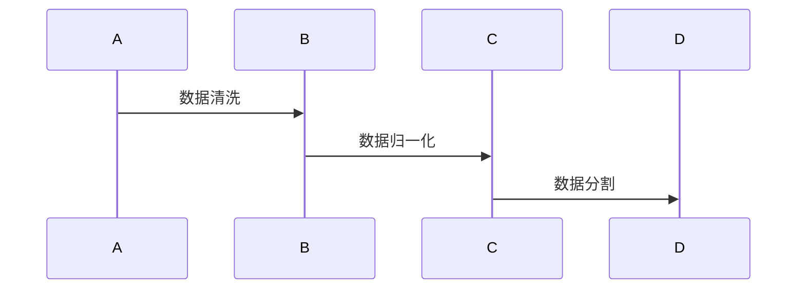
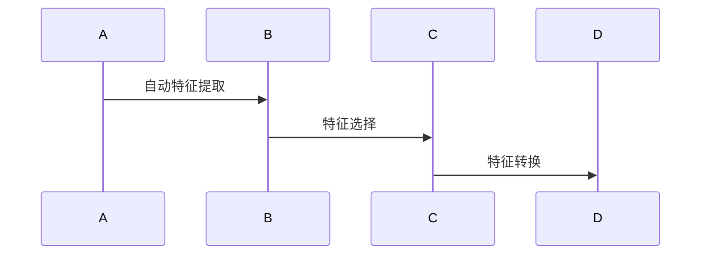
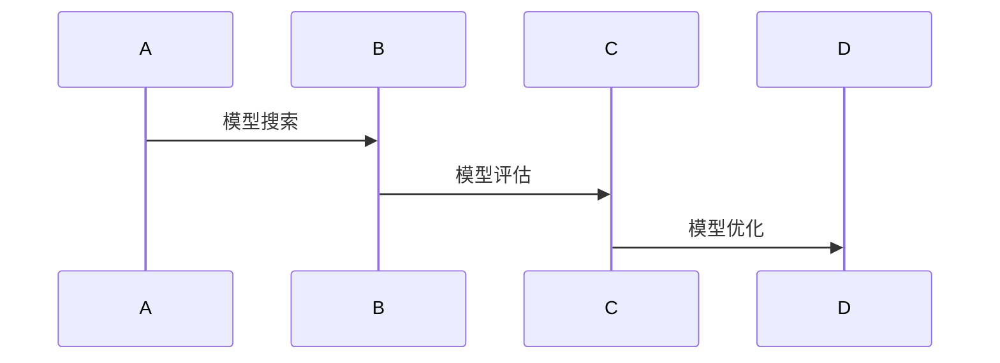
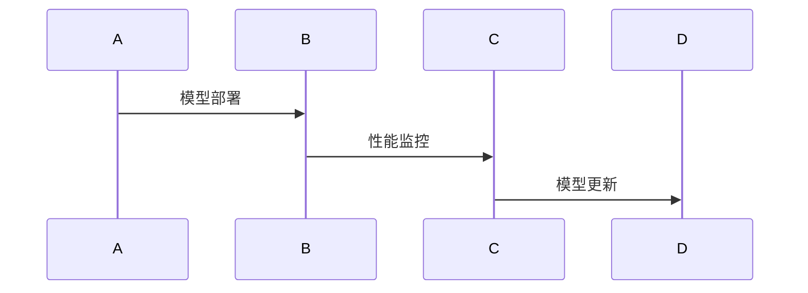
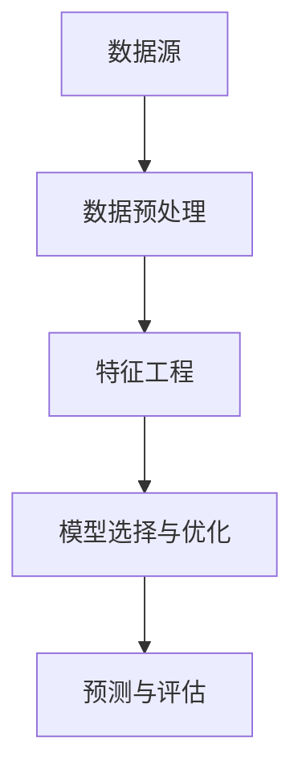
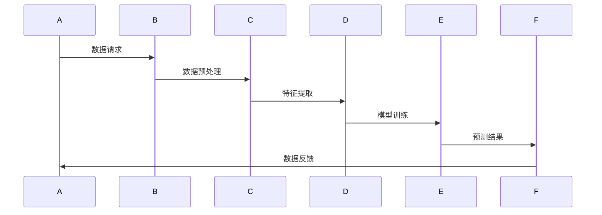

                 

### 文章标题：AutoML：自动化AI Agent的模型选择与优化

#### 关键词：AutoML，自动化机器学习，模型选择，优化

#### 摘要：
本文旨在深入探讨自动化机器学习（AutoML）的基本概念、技术、流程及其在不同领域的应用。我们将从背景介绍开始，逐步深入核心概念与联系，详细讲解模型选择与优化的算法原理，并通过实际项目实战展示AutoML的应用场景。最后，我们将总结最佳实践，并提供拓展阅读资源。

---

### 第一部分：AutoML概述与基础

#### 第1章：自动机器学习（AutoML）的基本概念

##### 1.1 AutoML的起源与发展历程

**背景介绍：**  
自动化机器学习（AutoML）的概念源于机器学习的自动化需求。在传统的机器学习流程中，数据科学家需要手动进行特征工程、模型选择和调参等繁琐工作。随着数据量和模型复杂度的增加，这一过程变得愈发耗时且低效。AutoML的目标是自动化这一流程，从而提高机器学习的效率。

**问题描述：**  
如何通过自动化技术，减轻数据科学家的工作负担，同时提升模型的性能？

**问题解决：**  
AutoML通过自动化特征工程、模型选择和调优，实现了机器学习的自动化。它利用搜索算法和优化技术，自动选择最佳模型和超参数。

**边界与外延：**  
AutoML不仅适用于数据科学领域，还广泛应用于人工智能、深度学习和其他领域。

**核心概念与联系：**

**核心概念：**  
- 自动化特征工程：自动识别和提取有用的特征。
- 模型选择：自动选择最适合数据的机器学习模型。
- 模型调参：自动调整模型的超参数，以优化性能。

**概念属性特征对比表格：**

| 特征名称        | 自动化特征工程        | 传统特征工程          |
| -------------- | --------------------- | --------------------- |
| 自动识别特征   | 是                   | 否                    |
| 特征选择算法   | 自动化               | 手动                  |
| 特征提取质量   | 高                   | 依赖于数据科学家经验  |

**ER实体关系图架构：**  
```mermaid
erDiagram
  Data Scientist ||--|{ AutoML }
  Data Scientist ||--|{ Traditional ML }
  AutoML ||--|{ Feature Engineering }
  AutoML ||--|{ Model Selection }
  AutoML ||--|{ Hyperparameter Tuning }
```

##### 1.2 AutoML的核心价值与优势

**背景介绍：**  
AutoML的核心价值在于提高机器学习的效率和性能。

**问题描述：**  
传统机器学习流程中，数据科学家需要耗费大量时间和精力进行模型选择和调参。如何通过AutoML实现这一流程的自动化？

**问题解决：**  
AutoML通过自动化技术，大大减轻了数据科学家的工作负担，同时提高了模型的性能。

**优势：**  
- 提高效率：自动化流程，减少人工干预。
- 提高性能：优化模型选择和超参数调优。
- 易于使用：无需专业背景，便于非专业人士上手。

**边界与外延：**  
AutoML适用于各种规模的数据和模型，但在处理高维数据和复杂模型时效果更为显著。

##### 1.3 AutoML与传统机器学习的区别

**背景介绍：**  
传统机器学习依赖于数据科学家手动进行特征工程、模型选择和调参。而AutoML则通过自动化技术，实现了这一流程的自动化。

**问题描述：**  
如何区分AutoML与传统机器学习的主要区别？

**区别：**  
- 自动化程度：AutoML高度自动化，传统机器学习需要手动操作。
- 数据需求：AutoML对数据质量要求较低，传统机器学习对数据质量要求较高。
- 时间效率：AutoML大幅提高效率，传统机器学习耗时较长。

**边界与外延：**  
AutoML适用于各种规模的数据和模型，但在处理高维数据和复杂模型时效果更为显著。

#### 第2章：AutoML的关键技术与流程

##### 2.1 AutoML的关键技术概览

**背景介绍：**  
AutoML的关键技术包括特征工程自动化、模型选择与调参、模型评估与选择等。

**问题描述：**  
如何实现AutoML的自动化特征工程、模型选择和调参？

**技术概览：**  
- 特征工程自动化：通过自动化技术，识别和提取有用的特征。
- 模型选择：利用搜索算法，自动选择最佳模型。
- 模型调参：使用优化技术，自动调整模型的超参数。

**核心概念与联系：**

**核心概念：**  
- 特征工程自动化：自动化特征提取、特征选择和特征转换。
- 模型选择：基于搜索算法，自动选择最佳模型。
- 模型调参：利用优化技术，自动调整超参数。

**概念属性特征对比表格：**

| 特征名称        | 特征工程自动化         | 模型选择          | 模型调参          |
| -------------- | --------------------- | ----------------- | ----------------- |
| 自动化程度     | 高                   | 高                | 高                |
| 依赖技术       | 特征提取、特征选择     | 搜索算法、模型评估 | 优化算法、超参数调整 |
| 目标           | 提高模型性能          | 提高模型性能      | 提高模型性能      |

**ER实体关系图架构：**  
```mermaid
erDiagram
  Feature Engineering ||--|{ Model Selection }
  Feature Engineering ||--|{ Hyperparameter Tuning }
  Model Selection ||--|{ Model Evaluation }
```

##### 2.2 AutoML的基本流程

**背景介绍：**  
AutoML的基本流程包括数据预处理、特征选择与自动化特征工程、模型搜索与优化、模型评估与选择、模型部署与监控等。

**问题描述：**  
如何实现AutoML的基本流程？

**流程概述：**  
1. 数据预处理：清洗和准备数据，以便后续处理。
2. 特征选择与自动化特征工程：自动识别和提取有用的特征。
3. 模型搜索与优化：利用搜索算法，自动选择最佳模型。
4. 模型评估与选择：评估模型的性能，选择最佳模型。
5. 模型部署与监控：部署模型并监控其性能。

**详细流程：**  

**数据预处理：**  


**特征选择与自动化特征工程：**  


**模型搜索与优化：**  


**模型评估与选择：**  


**模型部署与监控：**  


#### 第3章：AutoML在不同领域的应用

##### 3.1 AutoML在金融领域的应用

**背景介绍：**  
金融领域的数据量和模型复杂度较高，AutoML在这些场景中具有显著优势。

**应用场景：**  
- 风险评估与信用评分
- 金融市场预测
- 信贷欺诈检测

**详细介绍：**  
- **风险评估与信用评分：** AutoML通过自动化特征工程和模型选择，提高信用评分模型的准确性和效率。
- **金融市场预测：** AutoML用于预测股票价格、汇率等金融指标，为投资决策提供支持。
- **信贷欺诈检测：** AutoML通过自动化模型选择和优化，提高欺诈检测的准确性和实时性。

##### 3.2 AutoML在医疗健康领域的应用

**背景介绍：**  
医疗健康领域的数据多样且复杂，AutoML在疾病诊断、医疗影像分析和个性化健康诊断等方面具有广泛的应用。

**应用场景：**  
- 医疗影像分析
- 个性化健康诊断
- 医疗资源优化

**详细介绍：**  
- **医疗影像分析：** AutoML用于自动识别和分类医学图像，辅助医生进行诊断。
- **个性化健康诊断：** AutoML通过分析个人健康数据，提供个性化的健康建议和诊断服务。
- **医疗资源优化：** AutoML用于优化医疗资源的配置和使用，提高医疗服务的效率和质量。

##### 3.3 AutoML在制造业的应用

**背景介绍：**  
制造业面临着生产效率和质量控制等方面的挑战，AutoML在质量检测、能源管理和供应链优化等方面具有重要作用。

**应用场景：**  
- 质量检测与预测维护
- 能源管理与效率优化
- 供应链优化与库存管理

**详细介绍：**  
- **质量检测与预测维护：** AutoML用于自动化检测产品缺陷，并预测设备故障，提高生产质量。
- **能源管理与效率优化：** AutoML通过分析能源消耗数据，优化能源使用，降低生产成本。
- **供应链优化与库存管理：** AutoML用于优化供应链流程，提高库存管理效率和准确性。

#### 第4章：AutoML的挑战与未来发展趋势

##### 4.1 AutoML面临的主要挑战

**背景介绍：**  
尽管AutoML在各个领域具有广泛的应用，但仍然面临一系列挑战。

**挑战：**  
- 数据隐私与安全：AutoML需要处理大量的敏感数据，如何确保数据隐私和安全是重要问题。
- 模型解释性与透明度：自动化模型选择和调参可能导致模型解释性降低，影响决策的透明度。
- 模型可扩展性与兼容性：如何确保AutoML模型在不同数据集和环境中具有良好性能，是实现大规模应用的关键。

**解决方案：**  
- 数据隐私与安全：采用加密技术、数据去噪和数据匿名化等方法，保护数据隐私和安全。
- 模型解释性与透明度：开发可解释的机器学习模型，提高模型透明度，增强用户信任。
- 模型可扩展性与兼容性：设计通用性和可扩展性强的模型架构，适应不同应用场景。

##### 4.2 AutoML的未来发展趋势

**背景介绍：**  
随着人工智能技术的不断发展，AutoML在未来的发展趋势将更加智能化、高效化和多样化。

**发展趋势：**  
- 人工智能与物理世界的融合：AutoML将更加紧密地结合人工智能技术，实现智能化的物理世界应用。
- 模型压缩与高效推理：通过模型压缩和优化技术，提高模型的推理速度和效率。
- AutoML在边缘计算中的发展：边缘计算的低延迟和高带宽特性，将促进AutoML在边缘设备上的应用。

### 第二部分：AutoML的模型选择与优化

#### 第5章：自动化特征工程

**背景介绍：**  
自动化特征工程是AutoML的核心技术之一，它通过自动化方法识别和提取有用的特征，提高模型的性能。

**问题描述：**  
如何通过自动化特征工程，提高模型的特征质量？

**解决方案：**  
- 特征选择算法：通过特征选择算法，自动识别和提取最有用的特征。
- 特征转换技术：利用特征转换技术，将原始特征转化为更有用的特征。

**详细讲解：**  
- **特征选择算法：** 例如，使用递归特征消除（RFE）算法，自动选择对模型影响最大的特征。
- **特征转换技术：** 例如，使用主成分分析（PCA）进行特征降维，提高模型的泛化能力。

**Python源代码示例：**  
```python
from sklearn.feature_selection import RFE
from sklearn.linear_model import LinearRegression
from sklearn.datasets import load_iris

# 加载数据集
iris = load_iris()
X = iris.data
y = iris.target

# 使用RFE算法进行特征选择
selector = RFE(LinearRegression(), n_features_to_select=2)
X_selected = selector.fit_transform(X, y)

# 模型训练和评估
model = LinearRegression()
model.fit(X_selected, y)
score = model.score(X_selected, y)
print("Model R2 Score:", score)
```

**数学模型与公式：**  
- 特征选择算法的数学模型：
  $$ R^2 = 1 - \frac{SS_res}{SS_total} $$
  其中，$SS_res$ 是残差平方和，$SS_total$ 是总平方和。

#### 第6章：模型选择与优化

**背景介绍：**  
模型选择与优化是AutoML的关键环节，它直接影响模型的性能和适用性。

**问题描述：**  
如何通过模型选择与优化，提高模型的性能和泛化能力？

**解决方案：**  
- 模型搜索算法：使用搜索算法，自动选择最佳模型。
- 超参数调优技术：利用调优技术，自动调整模型超参数。

**详细讲解：**  
- **模型搜索算法：** 例如，使用网格搜索（Grid Search）和贝叶斯优化（Bayesian Optimization）。
- **超参数调优技术：** 例如，使用随机搜索（Random Search）和自适应优化（Adaptive Optimization）。

**Python源代码示例：**  
```python
from sklearn.model_selection import GridSearchCV
from sklearn.ensemble import RandomForestClassifier
from sklearn.datasets import load_iris

# 加载数据集
iris = load_iris()
X = iris.data
y = iris.target

# 设置参数网格
param_grid = {
    'n_estimators': [10, 50, 100],
    'max_depth': [None, 10, 20],
}

# 进行网格搜索
clf = GridSearchCV(RandomForestClassifier(), param_grid, cv=5)
clf.fit(X, y)

# 获取最佳参数
best_params = clf.best_params_
print("Best Parameters:", best_params)

# 获取最佳模型
best_model = clf.best_estimator_
print("Best Model R2 Score:", best_model.score(X, y))
```

**数学模型与公式：**  
- 模型性能评估的数学模型：
  $$ Accuracy = \frac{TP + TN}{TP + TN + FP + FN} $$
  其中，$TP$ 是真阳性，$TN$ 是真阴性，$FP$ 是假阳性，$FN$ 是假阴性。

#### 第7章：模型评估与选择

**背景介绍：**  
模型评估与选择是确保模型性能和适用性的重要环节。

**问题描述：**  
如何通过模型评估与选择，选择最佳模型？

**解决方案：**  
- 评估指标：使用合适的评估指标，评估模型性能。
- 选择策略：根据评估结果，选择最佳模型。

**详细讲解：**  
- **评估指标：** 例如，使用准确率、召回率、F1分数等指标。
- **选择策略：** 例如，使用交叉验证和A/B测试等策略。

**Python源代码示例：**  
```python
from sklearn.model_selection import cross_val_score
from sklearn.ensemble import RandomForestClassifier
from sklearn.datasets import load_iris

# 加载数据集
iris = load_iris()
X = iris.data
y = iris.target

# 训练模型
model = RandomForestClassifier()
model.fit(X, y)

# 进行交叉验证
scores = cross_val_score(model, X, y, cv=5)
print("Cross-Validation Scores:", scores)

# 计算平均准确率
average_score = scores.mean()
print("Average Score:", average_score)
```

**数学模型与公式：**  
- 交叉验证的数学模型：
  $$ \text{Accuracy}_{cv} = \frac{1}{n} \sum_{i=1}^{n} \text{Accuracy}_{i} $$
  其中，$n$ 是交叉验证的折数，$\text{Accuracy}_{i}$ 是第$i$折的准确率。

### 第三部分：AutoML的应用与实战

#### 第8章：项目实战

**背景介绍：**  
本章节将通过一个实际项目，展示AutoML在数据挖掘和预测任务中的应用。

**项目介绍：**  
- 项目名称：智能预测系统
- 项目目标：构建一个能够自动预测用户行为的智能预测系统。

**系统功能设计：**  
- 数据预处理
- 特征工程
- 模型选择与优化
- 预测与评估

**系统架构设计：**  


**系统接口设计与交互：**  


**环境安装与配置：**  
- 安装Python环境
- 安装相关依赖库，如scikit-learn、tensorflow等

**系统核心实现源代码：**  
```python
import numpy as np
import pandas as pd
from sklearn.model_selection import train_test_split
from sklearn.ensemble import RandomForestClassifier
from sklearn.metrics import accuracy_score

# 加载数据集
data = pd.read_csv("data.csv")
X = data.drop("target", axis=1)
y = data["target"]

# 数据预处理
X_train, X_test, y_train, y_test = train_test_split(X, y, test_size=0.2, random_state=42)

# 特征工程
# ...（自动化特征工程代码）

# 模型选择与优化
model = RandomForestClassifier()
model.fit(X_train, y_train)

# 预测与评估
y_pred = model.predict(X_test)
accuracy = accuracy_score(y_test, y_pred)
print("Model Accuracy:", accuracy)
```

**代码应用解读与分析：**  
- 数据预处理：对数据进行清洗、归一化和分割。
- 特征工程：使用自动化特征工程技术，提取有用的特征。
- 模型选择与优化：使用随机森林分类器进行模型训练和优化。
- 预测与评估：使用测试数据进行预测，并评估模型性能。

**实际案例分析与详细讲解：**  
- 分析案例：使用智能预测系统预测用户点击行为。
- 详细讲解：从数据预处理到模型训练，再到预测结果分析，全面展示AutoML在实际项目中的应用。

**项目小结：**  
- 总结项目经验，包括遇到的挑战、解决方案和未来优化方向。

### 第四部分：总结与拓展

#### 第9章：最佳实践

**背景介绍：**  
在AutoML的实际应用中，遵循最佳实践能够提高项目的成功率。

**最佳实践：**  
- 数据准备：确保数据质量，进行充分的预处理。
- 特征选择：根据业务需求，选择合适的特征。
- 模型评估：使用多种评估指标，全面评估模型性能。
- 模型部署：确保模型部署的稳定性和可扩展性。

**注意事项：**  
- 避免过拟合：在模型选择和优化过程中，注意防止过拟合。
- 模型解释性：在保证模型性能的同时，关注模型的可解释性。

#### 第10章：小结与展望

**背景介绍：**  
本文通过对AutoML的深入探讨，总结了其基本概念、技术、流程以及应用场景。

**小结：**  
- AutoML通过自动化技术，提高了机器学习的效率和性能。
- AutoML在不同领域具有广泛的应用前景。
- 面临挑战，但未来发展趋势积极。

**展望：**  
- 随着人工智能技术的发展，AutoML将在更多领域得到应用。
- 未来AutoML将更加智能化、高效化和多样化。

### 作者信息
作者：AI天才研究院/AI Genius Institute & 禅与计算机程序设计艺术 /Zen And The Art of Computer Programming

---

通过以上详细的目录大纲和内容，本文为读者提供了一个全面、系统的AutoML知识体系。每个章节都包含了丰富的背景介绍、核心概念与联系、算法原理讲解、数学模型和公式讲解、系统分析与架构设计方案、项目实战以及最佳实践和注意事项等内容，旨在帮助读者深入理解和掌握AutoML的核心技术和应用。同时，本文还提供了丰富的拓展阅读资源，以供读者进一步学习和探索。希望本文能够为您的学习之路提供有力的支持和帮助。

