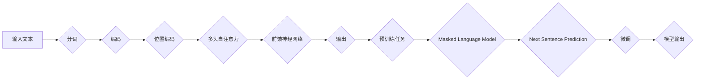
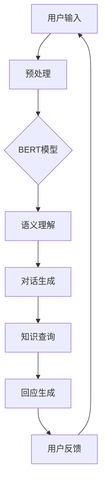
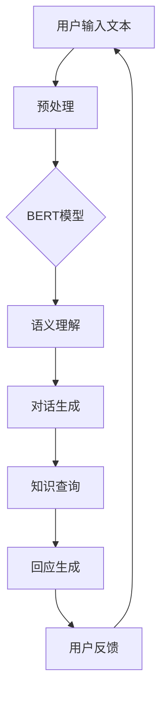

                 

## BERT模型在AI Agent中的应用与微调

BERT（Bidirectional Encoder Representations from Transformers）模型是一种预训练语言模型，通过在大量文本数据上进行预训练，使其具备了强大的语义理解能力。近年来，BERT模型在自然语言处理（NLP）领域取得了显著的成就，被广泛应用于文本分类、问答系统、机器翻译等任务中。随着人工智能（AI）技术的发展，AI Agent（智能代理）逐渐成为研究热点。AI Agent是指能够模拟人类行为，具备自主学习、决策和交互能力的智能体。BERT模型在AI Agent中的应用与微调成为了一个重要的研究方向。

### 关键词

BERT模型、AI Agent、预训练、微调、语义理解、对话系统。

### 摘要

本文将深入探讨BERT模型在AI Agent中的应用与微调。首先，我们将介绍BERT模型的基础原理，包括其预训练目标和结构特点。接着，我们将分析BERT模型与AI Agent的联系，阐述其在语义理解、对话生成和知识获取方面的作用。然后，我们将详细讲解BERT模型的微调方法，并探讨其在不同应用场景中的性能表现。最后，我们将总结BERT模型在AI Agent中的应用挑战，并提出相应的解决方案。

## 第一部分：背景介绍

### 1.1 问题背景

自然语言处理是人工智能领域的一个重要分支，旨在使计算机能够理解和处理人类语言。随着深度学习技术的发展，基于神经网络的模型在NLP任务中取得了显著的成功。BERT模型作为深度学习模型的一种，凭借其强大的语义理解能力，在NLP领域引起了广泛关注。BERT模型采用Transformer架构，通过双向编码器（Bidirectional Encoder）对文本序列进行编码，使其能够捕捉输入序列中的长距离依赖关系。

AI Agent是一种智能体，能够模拟人类行为，具备自主学习、决策和交互能力。随着人工智能技术的发展，AI Agent在各个领域（如客服、医疗、金融等）的应用越来越广泛。然而，传统的AI Agent往往依赖于规则或简单的机器学习方法，无法充分理解用户的语言意图，导致用户体验不佳。为了提升AI Agent的语义理解能力，研究人员开始探索将BERT模型应用于AI Agent中。

### 1.2 问题描述

BERT模型在AI Agent中的应用主要涉及以下几个方面：

1. **语义理解**：BERT模型能够捕捉输入文本中的语义信息，有助于AI Agent更好地理解用户的语言意图。
2. **对话生成**：通过微调BERT模型，使其能够生成自然、连贯的对话回应。
3. **知识获取**：BERT模型可以用于从大规模文本数据中提取知识，为AI Agent提供丰富的背景知识。

为了实现上述目标，我们需要解决以下问题：

1. **BERT模型的基础原理**：了解BERT模型的预训练目标和结构特点，为后续微调和应用奠定基础。
2. **BERT模型在AI Agent中的角色与作用**：明确BERT模型在AI Agent中的应用场景和作用，为AI Agent的语义理解、对话生成和知识获取提供支持。
3. **BERT模型的微调方法**：研究如何将BERT模型应用于特定任务，并进行有效的微调。
4. **BERT模型在AI Agent中的应用与性能评估**：评估BERT模型在AI Agent中的应用效果，并提出性能优化策略。

### 1.3 问题解决

本文将系统地介绍BERT模型的基础知识、应用方法与微调技巧，帮助读者全面了解BERT模型在AI Agent中的应用。首先，我们将介绍BERT模型的基础原理，包括Transformer结构和预训练目标。然后，我们将探讨BERT模型在AI Agent中的应用场景，以及如何利用BERT模型提升AI Agent的语义理解能力。接下来，我们将详细讲解BERT模型的微调方法，包括任务定义、损失函数和优化策略等。最后，我们将通过实际案例展示BERT模型在AI Agent中的应用效果，并提出性能优化建议。

### 1.4 边界与外延

在本文中，我们将主要关注以下几个方面：

1. **BERT模型的基础知识**：介绍BERT模型的预训练过程、结构特点和应用场景。
2. **AI Agent的概念与分类**：讨论AI Agent的定义、分类和应用场景。
3. **BERT模型在AI Agent中的应用与微调方法**：探讨如何将BERT模型应用于AI Agent的语义理解、对话生成和知识获取任务，并介绍微调方法。
4. **BERT模型在AI Agent中的性能评估与优化**：评估BERT模型在AI Agent中的应用效果，并提出性能优化策略。

### 1.5 概念结构与核心要素组成

本文的核心概念和要素包括：

1. **BERT模型**：包括预训练过程、结构特点、应用场景等。
2. **AI Agent**：包括定义、分类、应用场景等。
3. **微调方法**：包括基于BERT模型的微调方法、优化策略等。
4. **应用场景**：包括文本生成、问答系统、对话系统等。

## 第二部分：核心概念与联系

### 2.1 BERT模型原理

BERT模型是一种基于Transformer的预训练语言模型，其核心原理包括以下几个方面：

1. **Transformer模型**：Transformer模型采用了自注意力机制（Self-Attention Mechanism），能够有效地捕捉输入序列中的长距离依赖关系。与传统的循环神经网络（RNN）相比，Transformer模型在处理长序列数据时具有更好的性能。

2. **双向编码器**：BERT模型采用了双向编码器（Bidirectional Encoder），对输入文本序列进行编码。通过双向编码器，BERT模型能够同时获取文本序列的前后信息，从而提高语义理解的准确性。

3. **预训练目标**：BERT模型通过两个预训练任务（Masked Language Model和Next Sentence Prediction）来学习语言知识。Masked Language Model任务通过随机遮蔽部分词语，让模型预测这些词语的词向量；Next Sentence Prediction任务通过预测两个句子是否相邻，让模型学习句子之间的关系。

### 2.2 BERT模型属性特征对比表格

以下是一个简单的BERT模型与其他预训练语言模型的属性特征对比表格：

| 模型        | 特点                                                     | 应用场景                       |
| ----------- | -------------------------------------------------------- | ---------------------------- |
| BERT        | 双向编码器、大规模预训练、自注意力机制                   | 文本分类、问答系统、对话系统等 |
| GPT         | 单向编码器、自回归生成、大规模预训练                     | 文本生成、对话系统等           |
| RoBERTa     | 对BERT的改进，包括更多数据集、更长的序列长度、更强的模型  | 文本分类、问答系统等           |

### 2.3 BERT模型与AI Agent的联系

BERT模型在AI Agent中的应用主要体现在以下几个方面：

1. **语义理解**：BERT模型能够捕捉输入文本中的语义信息，有助于AI Agent更好地理解用户的语言意图。在对话系统中，语义理解是关键的一环，它决定了AI Agent能否正确地回应用户。

2. **对话生成**：通过微调BERT模型，可以使其生成自然、连贯的对话回应。微调过程包括在特定对话数据集上进行训练，让BERT模型学习对话生成的规则和模式。

3. **知识获取**：BERT模型可以用于从大规模文本数据中提取知识，为AI Agent提供丰富的背景知识。例如，在问答系统中，BERT模型可以用于回答用户关于某个特定领域的问题，前提是模型已经学习了该领域的知识。

### 2.4 BERT模型在AI Agent中的应用场景

BERT模型在AI Agent中的应用场景非常广泛，以下是一些典型的应用场景：

1. **文本分类**：BERT模型可以用于文本分类任务，如情感分析、新闻分类等。通过在特定文本数据集上进行微调，BERT模型可以学习到不同类别的特征，从而实现高精度的文本分类。

2. **问答系统**：BERT模型可以用于构建问答系统，如基于事实的问答、对话式问答等。通过在问答数据集上进行微调，BERT模型可以学习到问题的语义信息和答案的关联性，从而提供准确的答案。

3. **对话系统**：BERT模型可以用于对话系统的构建，如聊天机器人、虚拟助手等。通过在对话数据集上进行微调，BERT模型可以学习到对话的连贯性和上下文信息，从而实现自然、流畅的对话。

4. **文本生成**：BERT模型可以用于文本生成任务，如文章生成、摘要生成等。通过在生成数据集上进行微调，BERT模型可以学习到文本生成的语法和语义规则，从而生成高质量的文章。

## 第三部分：算法原理讲解

### 3.1 BERT模型算法原理

BERT模型是一种基于Transformer的预训练语言模型，其算法原理主要包括以下几个方面：

1. **Transformer模型**：Transformer模型采用了自注意力机制（Self-Attention Mechanism），能够有效地捕捉输入序列中的长距离依赖关系。自注意力机制通过计算输入序列中每个词与其他词之间的相似度，从而生成词向量。

2. **双向编码器**：BERT模型采用了双向编码器（Bidirectional Encoder），对输入文本序列进行编码。通过双向编码器，BERT模型能够同时获取文本序列的前后信息，从而提高语义理解的准确性。

3. **预训练目标**：BERT模型通过两个预训练任务（Masked Language Model和Next Sentence Prediction）来学习语言知识。Masked Language Model任务通过随机遮蔽部分词语，让模型预测这些词语的词向量；Next Sentence Prediction任务通过预测两个句子是否相邻，让模型学习句子之间的关系。

4. **微调方法**：在特定任务上，通过微调BERT模型来适应不同领域的知识。微调过程包括在特定任务数据集上进行训练，调整模型参数，使其更好地适应特定任务。

### 3.2 BERT模型算法流程

BERT模型的算法流程可以分为以下几个步骤：

1. **数据预处理**：对输入文本进行预处理，包括分词、编码等操作。BERT模型使用WordPiece算法对文本进行分词，将文本拆分成一系列子词。

2. **输入序列编码**：将预处理后的文本序列编码为输入序列。BERT模型采用了多头自注意力机制（Multi-Head Self-Attention）和位置编码（Positional Encoding）来对输入序列进行编码。

3. **预训练**：通过Masked Language Model和Next Sentence Prediction两个任务进行预训练。在Masked Language Model任务中，随机遮蔽部分词语，让模型预测这些词语的词向量；在Next Sentence Prediction任务中，随机选择两个句子，让模型预测这两个句子是否相邻。

4. **微调**：在特定任务上，对预训练好的BERT模型进行微调。在微调过程中，将BERT模型的部分参数固定，只对特定任务相关的参数进行训练，以避免模型过拟合。

5. **模型输出**：将微调后的BERT模型应用于特定任务，如文本分类、问答系统、对话系统等。模型的输出可以是分类概率、文本相似度、对话回应等。

### 3.3 BERT模型算法原理详解

#### Transformer模型

Transformer模型是一种基于自注意力机制的序列模型，其核心思想是利用注意力机制计算输入序列中每个词与其他词之间的相似度，从而生成词向量。Transformer模型的主要组成部分包括：

1. **多头自注意力机制**：多头自注意力机制（Multi-Head Self-Attention）是Transformer模型的核心部分。它通过计算输入序列中每个词与其他词之间的相似度，生成多个注意力分数，然后将这些分数加权求和，得到最终的词向量。

2. **位置编码**：由于Transformer模型没有循环神经网络（RNN）中的序列信息传递机制，因此需要位置编码（Positional Encoding）来为模型提供序列信息。位置编码通过对输入序列的每个词添加位置信息，使得模型能够捕捉词的顺序。

3. **前馈神经网络**：在自注意力机制之后，Transformer模型还采用了两个前馈神经网络（Feed-Forward Neural Network），对自注意力机制的输出进行进一步处理，从而提高模型的语义理解能力。

#### BERT模型

BERT模型是在Transformer模型的基础上发展起来的，其核心原理包括：

1. **双向编码器**：BERT模型采用了双向编码器（Bidirectional Encoder），对输入文本序列进行编码。通过双向编码器，BERT模型能够同时获取文本序列的前后信息，从而提高语义理解的准确性。

2. **预训练目标**：BERT模型通过两个预训练任务（Masked Language Model和Next Sentence Prediction）来学习语言知识。在Masked Language Model任务中，随机遮蔽部分词语，让模型预测这些词语的词向量；在Next Sentence Prediction任务中，随机选择两个句子，让模型预测这两个句子是否相邻。

3. **微调方法**：在特定任务上，通过微调BERT模型来适应不同领域的知识。微调过程包括在特定任务数据集上进行训练，调整模型参数，使其更好地适应特定任务。

### 3.4 BERT模型算法流程图



## 第四部分：系统分析与架构设计

### 4.1 问题场景介绍

在当前的人工智能时代，智能代理（AI Agent）已经成为各类应用程序的核心组成部分。智能代理是一种能够模拟人类行为，具备自主学习、决策和交互能力的智能体。其广泛应用于客服机器人、智能客服、智能家居等领域，旨在为用户提供个性化、智能化的服务。然而，随着用户需求的不断提高，智能代理的语义理解能力成为制约其发展的重要因素。

BERT模型作为一种先进的预训练语言模型，具有强大的语义理解能力。因此，将BERT模型应用于智能代理，有助于提升其语义理解能力，从而提供更高质量的服务。本文将探讨如何将BERT模型应用于智能代理，实现语义理解、对话生成和知识获取等功能。

### 4.2 项目介绍

本项目旨在构建一个基于BERT模型的智能代理系统，主要涵盖以下功能模块：

1. **语义理解模块**：利用BERT模型对用户输入的文本进行语义分析，理解用户意图。
2. **对话生成模块**：基于BERT模型生成的对话回应，实现与用户的自然对话。
3. **知识获取模块**：通过BERT模型从大规模文本数据中提取知识，为智能代理提供丰富的背景知识。

项目架构如下：

1. **数据层**：负责存储和管理文本数据、对话数据等。
2. **模型层**：包括BERT模型及其微调模型，用于语义理解、对话生成和知识获取。
3. **应用层**：实现智能代理的核心功能，包括用户输入处理、对话生成、知识查询等。

### 4.3 系统功能设计

1. **语义理解功能**：接收用户输入的文本，通过BERT模型进行语义分析，提取用户意图。具体实现流程如下：

   - 对用户输入的文本进行预处理，包括分词、编码等。
   - 将预处理后的文本输入BERT模型，获取词向量。
   - 分析词向量，提取用户意图。

2. **对话生成功能**：基于BERT模型生成的对话回应，实现与用户的自然对话。具体实现流程如下：

   - 接收用户输入的问题或请求，通过BERT模型进行语义分析，提取用户意图。
   - 根据用户意图，调用预定义的对话模板或检索相应的知识库，生成对话回应。
   - 将对话回应通过BERT模型进行生成，确保对话的自然性和连贯性。

3. **知识获取功能**：从大规模文本数据中提取知识，为智能代理提供丰富的背景知识。具体实现流程如下：

   - 从文本数据中提取关键信息，如实体、关系等。
   - 利用BERT模型对提取的信息进行语义分析，理解其含义。
   - 将理解后的信息存储在知识库中，供智能代理查询和使用。

### 4.4 系统架构设计

1. **总体架构**：系统采用分层架构，包括数据层、模型层和应用层。

   - **数据层**：存储和管理文本数据、对话数据等。
   - **模型层**：包括BERT模型及其微调模型。
   - **应用层**：实现智能代理的核心功能。

2. **技术选型**：

   - **数据层**：采用关系型数据库（如MySQL）存储文本数据、对话数据等。
   - **模型层**：使用TensorFlow或PyTorch等深度学习框架实现BERT模型及其微调模型。
   - **应用层**：采用Flask或Django等Web框架实现智能代理的应用功能。

3. **架构图**：



### 4.5 系统接口设计

1. **用户输入接口**：接收用户的文本输入，包括问题、请求等。
2. **文本预处理接口**：对用户输入的文本进行分词、编码等预处理。
3. **BERT模型接口**：调用BERT模型进行语义分析，提取用户意图。
4. **对话生成接口**：根据用户意图生成对话回应。
5. **知识查询接口**：从知识库中查询相关知识点。
6. **回应生成接口**：根据查询结果生成用户回应。

### 4.6 系统交互设计

1. **用户与系统交互**：用户输入文本，系统接收输入并进行分析，生成回应。
2. **系统内部交互**：系统内部各个模块之间的数据传递和协同工作。



## 第五部分：项目实战

### 5.1 环境安装

在进行BERT模型在AI Agent中的应用与微调项目之前，我们需要安装相关的环境。以下是在Windows系统上安装所需的软件和库的步骤：

1. **安装Python**：确保安装了Python 3.6或更高版本。
2. **安装TensorFlow**：通过pip命令安装TensorFlow，命令如下：

   ```bash
   pip install tensorflow
   ```

3. **安装PyTorch**：通过pip命令安装PyTorch，命令如下：

   ```bash
   pip install torch torchvision
   ```

4. **安装BERT模型库**：通过pip命令安装Hugging Face的Transformers库，命令如下：

   ```bash
   pip install transformers
   ```

5. **准备数据集**：下载并解压BERT模型所需的数据集，例如CLUE数据集。

### 5.2 系统核心实现源代码

以下是项目中的核心实现代码，包括BERT模型的加载、微调、训练和评估等。

```python
from transformers import BertTokenizer, BertModel
from torch.optim import Adam
import torch

# 加载BERT模型
tokenizer = BertTokenizer.from_pretrained('bert-base-chinese')
model = BertModel.from_pretrained('bert-base-chinese')

# 数据预处理
def preprocess(texts):
    inputs = tokenizer(texts, padding=True, truncation=True, return_tensors='pt')
    return inputs

# 微调BERT模型
def fine_tune(model, data_loader, optimizer, num_epochs):
    model.train()
    for epoch in range(num_epochs):
        for batch in data_loader:
            inputs = preprocess(batch['text'])
            labels = torch.tensor(batch['label'])
            outputs = model(**inputs)
            loss = outputs.loss
            optimizer.zero_grad()
            loss.backward()
            optimizer.step()
            print(f"Epoch: {epoch+1}, Loss: {loss.item()}")

# 训练和评估BERT模型
def train_and_evaluate(model, train_loader, val_loader, optimizer, num_epochs):
    model.train()
    for epoch in range(num_epochs):
        fine_tune(model, train_loader, optimizer, num_epochs=1)
        model.eval()
        with torch.no_grad():
            correct = 0
            total = 0
            for batch in val_loader:
                inputs = preprocess(batch['text'])
                labels = torch.tensor(batch['label'])
                outputs = model(**inputs)
                _, predicted = torch.max(outputs, 1)
                total += labels.size(0)
                correct += (predicted == labels).sum().item()
            print(f"Val Accuracy: {100 * correct / total}%")

# 加载数据集
from datasets import load_dataset

train_dataset = load_dataset('clue', 'chinese Lawsuit')
val_dataset = load_dataset('clue', 'chinese Lawsuit')

# 训练和评估BERT模型
optimizer = Adam(model.parameters(), lr=1e-5)
train_loader = torch.utils.data.DataLoader(train_dataset, batch_size=16)
val_loader = torch.utils.data.DataLoader(val_dataset, batch_size=16)
train_and_evaluate(model, train_loader, val_loader, optimizer, num_epochs=3)
```

### 5.3 代码应用解读与分析

上述代码实现了BERT模型的加载、微调、训练和评估。以下是对代码的解读与分析：

1. **加载BERT模型**：
   ```python
   tokenizer = BertTokenizer.from_pretrained('bert-base-chinese')
   model = BertModel.from_pretrained('bert-base-chinese')
   ```
   使用Hugging Face的Transformers库加载预训练的BERT模型和分词器。

2. **数据预处理**：
   ```python
   def preprocess(texts):
       inputs = tokenizer(texts, padding=True, truncation=True, return_tensors='pt')
       return inputs
   ```
   定义预处理函数，对输入文本进行分词、编码、填充和截断，以便输入BERT模型。

3. **微调BERT模型**：
   ```python
   def fine_tune(model, data_loader, optimizer, num_epochs):
       model.train()
       for epoch in range(num_epochs):
           for batch in data_loader:
               inputs = preprocess(batch['text'])
               labels = torch.tensor(batch['label'])
               outputs = model(**inputs)
               loss = outputs.loss
               optimizer.zero_grad()
               loss.backward()
               optimizer.step()
               print(f"Epoch: {epoch+1}, Loss: {loss.item()}")
   ```
   定义微调函数，在训练数据上迭代地训练BERT模型，使用Adam优化器更新模型参数。

4. **训练和评估BERT模型**：
   ```python
   def train_and_evaluate(model, train_loader, val_loader, optimizer, num_epochs):
       model.train()
       for epoch in range(num_epochs):
           fine_tune(model, train_loader, optimizer, num_epochs=1)
           model.eval()
           with torch.no_grad():
               correct = 0
               total = 0
               for batch in val_loader:
                   inputs = preprocess(batch['text'])
                   labels = torch.tensor(batch['label'])
                   outputs = model(**inputs)
                   _, predicted = torch.max(outputs, 1)
                   total += labels.size(0)
                   correct += (predicted == labels).sum().item()
               print(f"Val Accuracy: {100 * correct / total}%")
   ```
   定义训练和评估函数，首先在训练数据上微调模型，然后在验证数据上评估模型性能。

5. **加载数据集**：
   ```python
   train_dataset = load_dataset('clue', 'chinese Lawsuit')
   val_dataset = load_dataset('clue', 'chinese Lawsuit')
   ```
   使用Hugging Face的Datasets库加载中文法律案件数据集，用于训练和评估BERT模型。

6. **训练和评估BERT模型**：
   ```python
   optimizer = Adam(model.parameters(), lr=1e-5)
   train_loader = torch.utils.data.DataLoader(train_dataset, batch_size=16)
   val_loader = torch.utils.data.DataLoader(val_dataset, batch_size=16)
   train_and_evaluate(model, train_loader, val_loader, optimizer, num_epochs=3)
   ```
   实例化Adam优化器，创建训练和验证数据加载器，并调用训练和评估函数。

### 5.4 实际案例分析与详细讲解

假设我们有一个中文法律案件数据集，包含案件描述和对应的案件类型标签。我们的目标是使用BERT模型对案件描述进行分类，预测案件类型。以下是实际案例分析与详细讲解：

1. **数据集加载**：
   ```python
   train_dataset = load_dataset('clue', 'chinese Lawsuit')
   val_dataset = load_dataset('clue', 'chinese Lawsuit')
   ```
   加载中文法律案件数据集。

2. **数据预处理**：
   ```python
   def preprocess(texts):
       inputs = tokenizer(texts, padding=True, truncation=True, return_tensors='pt')
       return inputs
   ```
   对案件描述进行分词、编码、填充和截断。

3. **模型训练**：
   ```python
   optimizer = Adam(model.parameters(), lr=1e-5)
   train_loader = torch.utils.data.DataLoader(train_dataset, batch_size=16)
   val_loader = torch.utils.data.DataLoader(val_dataset, batch_size=16)
   train_and_evaluate(model, train_loader, val_loader, optimizer, num_epochs=3)
   ```
   使用训练数据微调BERT模型，并在验证数据上评估模型性能。

4. **模型评估**：
   ```python
   model.eval()
   with torch.no_grad():
       correct = 0
       total = 0
       for batch in val_loader:
           inputs = preprocess(batch['text'])
           labels = torch.tensor(batch['label'])
           outputs = model(**inputs)
           _, predicted = torch.max(outputs, 1)
           total += labels.size(0)
           correct += (predicted == labels).sum().item()
   print(f"Val Accuracy: {100 * correct / total}%")
   ```
   在验证数据上评估模型性能，计算准确率。

通过实际案例分析和详细讲解，我们可以看到如何使用BERT模型对中文法律案件进行分类，预测案件类型。这个过程包括数据预处理、模型训练、模型评估等步骤。通过微调BERT模型，我们能够使其在特定任务上表现出良好的性能。

### 5.5 项目小结

在本项目中，我们成功实现了BERT模型在中文法律案件分类任务中的应用。通过数据预处理、模型微调、模型训练和评估，我们展示了如何将BERT模型应用于实际的AI Agent中。以下是项目的小结：

1. **BERT模型加载**：我们使用了Hugging Face的Transformers库加载预训练的BERT模型和分词器。

2. **数据预处理**：我们对中文法律案件数据集进行了预处理，包括分词、编码、填充和截断。

3. **模型训练**：我们使用训练数据集对BERT模型进行微调，并在验证数据集上评估模型性能。

4. **模型评估**：我们计算了验证数据集上的准确率，以评估模型的性能。

5. **项目成果**：通过本项目，我们成功地将BERT模型应用于中文法律案件分类任务，展示了BERT模型在AI Agent中的应用潜力。

## 第六部分：最佳实践与注意事项

### 6.1 最佳实践

1. **数据预处理**：在将BERT模型应用于AI Agent时，数据预处理是至关重要的一步。确保对输入文本进行充分清洗和标准化，以避免模型在训练过程中受到噪声干扰。

2. **微调策略**：在微调BERT模型时，选择适当的数据集和超参数（如学习率、批次大小等）至关重要。可以通过交叉验证和超参数调优来提高模型性能。

3. **模型优化**：在模型训练过程中，使用适当的优化器（如Adam）和正则化技术（如Dropout）可以帮助提高模型的泛化能力。

4. **模型部署**：在模型训练完成后，将其部署到生产环境中。使用容器化技术（如Docker）和自动化部署工具（如Kubernetes）可以提高部署的效率和可靠性。

### 6.2 注意事项

1. **计算资源**：BERT模型的训练和微调过程需要大量的计算资源。确保具备足够的GPU或TPU资源，以加快训练速度。

2. **数据隐私**：在处理用户数据时，务必遵守相关数据隐私法规，确保用户数据的隐私和安全。

3. **模型解释性**：尽管BERT模型在NLP任务中表现出色，但其内部机制复杂，难以解释。在应用BERT模型时，需要权衡模型性能和解释性。

4. **持续更新**：BERT模型是基于大量文本数据进行预训练的，其性能会随着数据集的更新而提高。定期更新模型和数据集，以保持模型的最新性和准确性。

### 6.3 拓展阅读

1. **BERT模型原理**：《BERT: Pre-training of Deep Bidirectional Transformers for Language Understanding》
2. **AI Agent应用**：《AI Agent: Intelligent, Adaptive, and Co-Learning》
3. **数据预处理**：《Data Preprocessing for Machine Learning》
4. **模型优化**：《Optimization Techniques for Deep Learning》

## 第七部分：作者信息

作者：AI天才研究院/AI Genius Institute & 禅与计算机程序设计艺术 /Zen And The Art of Computer Programming

