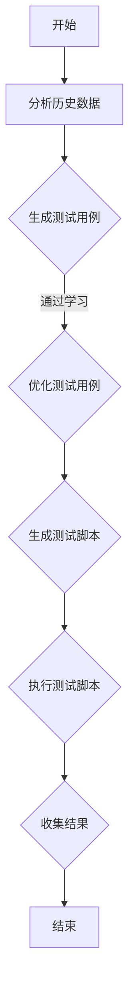
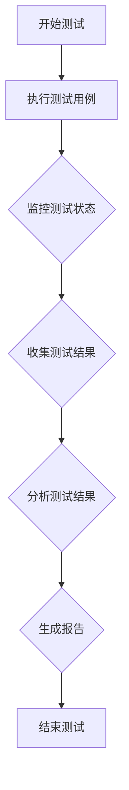
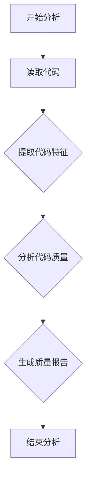
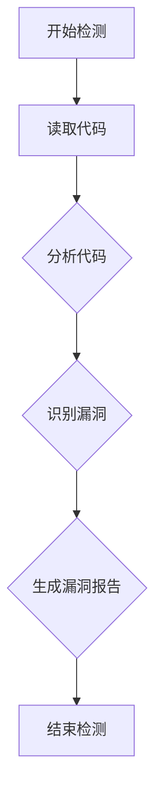
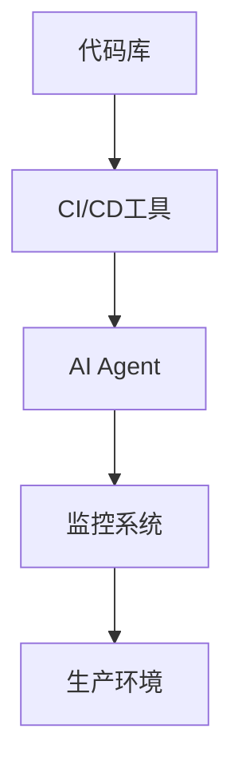
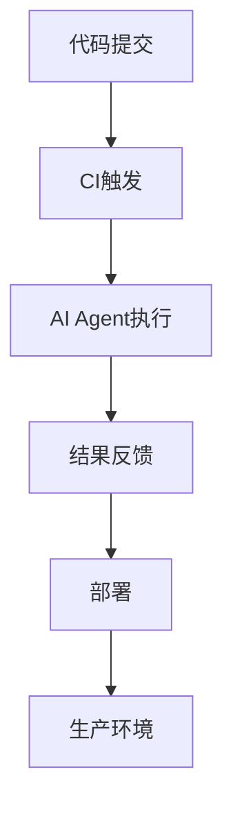
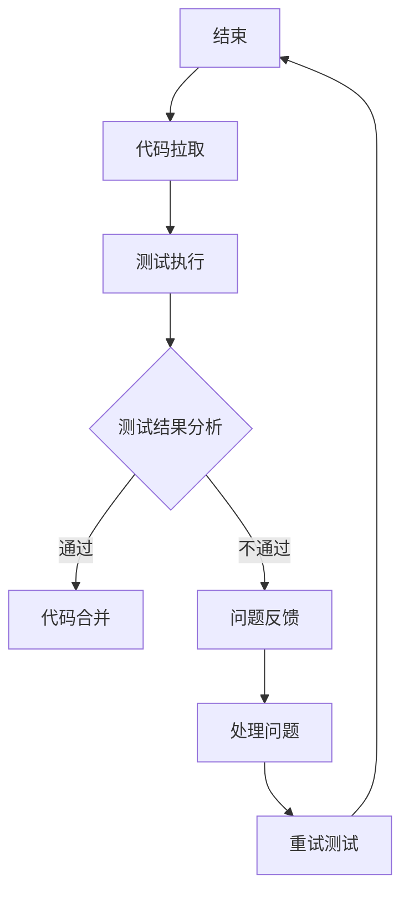
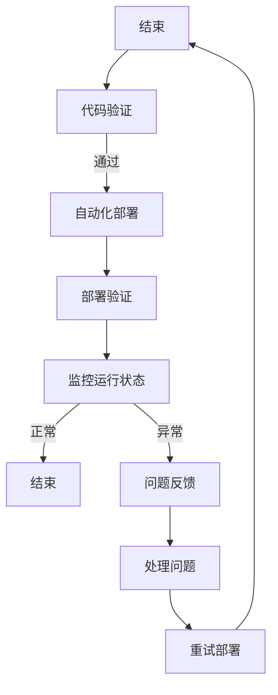
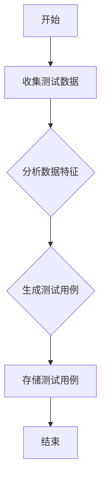
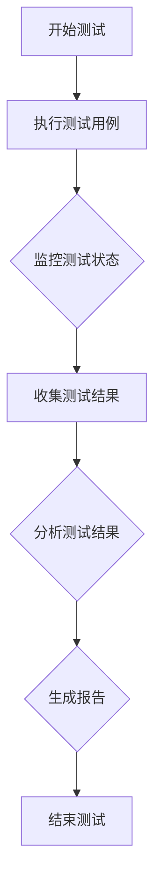

                 

### 文章标题

### 关键词

- 持续集成
- 持续部署
- AI Agent
- 自动化测试
- 静态代码分析

### 摘要

本文将探讨CI/CD流程在实现AI Agent的持续集成与部署中的应用。首先，我们将概述CI/CD的概念及其重要性，接着深入分析CI/CD流程的设计与实现，重点介绍AI Agent的定义及其在CI/CD中的具体应用。最后，我们将讨论CI/CD与AI Agent的集成原理与实现，并通过实际案例分享最佳实践和注意事项，为读者提供全面的技术参考。

### 目录大纲

#### 第一部分：CI/CD背景介绍

- **第1章：持续集成与持续部署概述**
  - **1.1 什么是CI/CD**
  - **1.2 CI/CD的重要性**

- **第2章：CI/CD核心组件**
  - **2.1 Jenkins**
  - **2.2 GitLab CI**

#### 第二部分：CI/CD流程设计与实现

- **第3章：AI Agent概述**
  - **3.1 AI Agent的定义与作用**
  - **3.2 AI Agent的发展与趋势**

- **第4章：AI Agent在CI/CD中的具体应用**
  - **4.1 自动化测试**
  - **4.2 静态代码分析**

#### 第三部分：CI/CD与AI Agent的集成

- **第5章：CI/CD与AI Agent的集成原理**
  - **5.1 集成框架**
  - **5.2 集成方案**

- **第6章：实现AI Agent的持续集成与部署**
  - **6.1 持续集成流程设计**
  - **6.2 持续部署流程设计**

#### 第四部分：实践与拓展

- **第7章：最佳实践与案例分析**
  - **7.1 成功案例分享**
  - **7.2 挑战与解决方案**
  - **7.3 拓展阅读**

#### 第五部分：总结与展望

- **第8章：未来展望与持续集成趋势**

### CI/CD背景介绍

#### 第1章：持续集成与持续部署概述

##### 1.1 什么是CI/CD

持续集成（Continuous Integration，简称CI）和持续部署（Continuous Deployment，简称CD）是现代软件开发中重要的实践方法。CI旨在通过频繁的代码集成和自动化测试，确保代码库的质量和一致性。而CD则进一步通过自动化流程将经过CI测试的代码部署到生产环境中，实现快速、可靠地交付。

持续集成（CI）的定义可以概括为：开发者在完成代码更改后，将这些更改提交到代码库，自动化工具立即将这些更改与主分支合并，并运行一系列预定义的测试，以确保集成后的代码仍然符合预期的质量标准。

持续部署（CD）的定义可以概括为：在经过CI测试验证后，自动化工具自动将代码部署到生产环境，进行进一步的测试和监控，确保生产环境中的代码与开发环境一致，且能够稳定运行。

##### 1.2 CI/CD的重要性

CI/CD在软件开发中的重要性体现在以下几个方面：

1. **提高开发效率**：通过自动化测试和部署，开发团队能够快速发现和解决问题，从而减少手工干预，提高整体开发效率。

2. **提高软件质量**：频繁的集成和自动化测试能够及时发现和修复缺陷，减少集成风险，提高软件质量。

3. **提高团队协作**：CI/CD流程要求团队成员频繁合作，共享代码库和测试结果，促进团队间的沟通和协作。

4. **加快交付速度**：通过自动化流程，团队能够更快速地交付新功能，满足市场需求的变动。

5. **减少风险**：自动化测试和部署能够减少人为错误，降低生产环境中出现严重问题的风险。

### CI/CD核心组件

#### 第2章：CI/CD核心组件

##### 2.1 Jenkins

Jenkins是一个开源的持续集成工具，广泛应用于各种开发环境中。它可以通过插件扩展其功能，支持各种版本的SCM系统，如Git、SVN等，并提供丰富的自动化构建和部署功能。

**Jenkins安装与配置**

1. **安装Jenkins**：在服务器上下载Jenkins的最新版本，并解压缩到指定目录。

2. **启动Jenkins**：在命令行中运行`java -jar jenkins.war`命令，启动Jenkins服务。

3. **配置Jenkins**：通过Web界面访问Jenkins，进行相关配置，如创建用户、配置插件等。

##### 2.2 GitLab CI

GitLab CI是GitLab自带的持续集成工具，通过`.gitlab-ci.yml`文件定义CI流程。它支持多种语言和框架的自动化测试和部署。

**GitLab CI安装与配置**

1. **安装GitLab**：在服务器上安装GitLab。

2. **配置GitLab CI**：在项目的根目录下创建`.gitlab-ci.yml`文件，定义CI流程。

3. **测试GitLab CI**：提交代码到GitLab，触发CI流程，验证配置是否正确。

### AI Agent概述

#### 第3章：AI Agent概述

##### 3.1 AI Agent的定义与作用

AI Agent，即人工智能代理，是指具备自主行动能力的智能体，可以在复杂环境中进行感知、决策和执行。AI Agent在软件工程中，特别是在CI/CD流程中，可以发挥重要作用，如自动化测试、代码质量评估等。

##### 3.2 AI Agent的发展与趋势

随着人工智能技术的快速发展，AI Agent在软件开发中的应用也越来越广泛。未来，AI Agent将更加智能化、自适应化，能够更好地支持CI/CD流程，提高开发效率和软件质量。

### AI Agent在CI/CD中的具体应用

#### 第4章：AI Agent在CI/CD中的具体应用

##### 4.1 自动化测试

AI Agent在自动化测试中可以发挥重要作用，如生成测试用例、执行测试并生成报告等。

**AI在测试中的应用**

1. **测试用例生成**：利用机器学习技术，从历史测试数据中学习，自动生成新的测试用例。

2. **测试执行**：AI Agent可以自动执行测试用例，并根据测试结果进行分类和归档。

3. **测试报告生成**：AI Agent可以自动生成详细的测试报告，包括测试覆盖率、缺陷分析等。

##### 4.2 静态代码分析

AI Agent在静态代码分析中可以识别潜在的安全漏洞、代码质量问题等。

**AI在代码分析中的应用**

1. **代码质量评估**：AI Agent可以分析代码风格、代码复用性、代码可维护性等指标，评估代码质量。

2. **安全漏洞检测**：AI Agent可以识别常见的代码安全漏洞，如SQL注入、XSS攻击等。

### CI/CD与AI Agent的集成

#### 第5章：CI/CD与AI Agent的集成原理

##### 5.1 集成框架

CI/CD与AI Agent的集成通常涉及以下组件：

1. **代码库**：存储AI Agent和项目的源代码。
2. **CI/CD工具**：如Jenkins、GitLab CI等，负责执行CI/CD流程。
3. **AI Agent**：执行自动化测试、代码分析等任务。
4. **监控系统**：实时监控CI/CD流程和AI Agent的运行状态。

##### 5.2 集成方案

集成方案通常包括以下步骤：

1. **代码提交**：开发者将代码提交到代码库。
2. **CI触发**：CI工具检测到代码提交，触发CI流程。
3. **AI Agent执行**：CI工具调用AI Agent执行自动化测试和代码分析。
4. **结果反馈**：AI Agent将测试和代码分析结果反馈给CI工具。
5. **部署**：根据CI结果，CI工具决定是否将代码部署到生产环境。

### 实现AI Agent的持续集成与部署

#### 第6章：实现AI Agent的持续集成与部署

##### 6.1 持续集成流程设计

持续集成流程设计包括以下步骤：

1. **环境搭建**：搭建CI环境，包括代码库、CI工具等。
2. **流程定义**：定义CI流程，包括代码提交、测试执行、结果反馈等。
3. **流程测试**：测试CI流程，确保其正常运行。

##### 6.2 持续部署流程设计

持续部署流程设计包括以下步骤：

1. **环境搭建**：搭建CD环境，包括生产环境、部署工具等。
2. **流程定义**：定义CD流程，包括代码验证、部署、监控等。
3. **流程测试**：测试CD流程，确保其正常运行。

### 最佳实践与案例分析

#### 第7章：最佳实践与案例分析

##### 7.1 成功案例分享

通过分析成功的CI/CD与AI Agent集成案例，总结出以下最佳实践：

1. **自动化测试**：充分利用AI Agent进行自动化测试，提高测试覆盖率。
2. **代码质量分析**：定期进行代码质量分析，确保代码质量符合标准。
3. **持续反馈**：及时反馈CI/CD流程和AI Agent的运行状态，发现问题及时解决。

##### 7.2 挑战与解决方案

在实施CI/CD与AI Agent集成过程中，可能会遇到以下挑战：

1. **资源限制**：解决方法：优化资源利用，使用云服务扩展资源。
2. **集成复杂性**：解决方法：采用模块化设计，逐步实现集成。
3. **反馈延迟**：解决方法：优化CI/CD流程，减少反馈时间。

##### 7.3 拓展阅读

为了进一步深入了解CI/CD与AI Agent的集成，以下文献和资源可供参考：

1. 《CI/CD实战：持续集成与部署策略》
2. 《人工智能在软件开发中的应用》
3. Jenkins官方文档
4. GitLab CI官方文档

### 总结与展望

通过本文的探讨，我们了解了CI/CD流程在实现AI Agent的持续集成与部署中的应用。CI/CD与AI Agent的集成不仅提高了开发效率和软件质量，还为未来的软件开发提供了新的方向。展望未来，随着人工智能技术的不断发展，CI/CD与AI Agent的集成将更加深入，为软件开发带来更多创新和变革。作者：AI天才研究院/AI Genius Institute & 禅与计算机程序设计艺术 /Zen And The Art of Computer Programming

---

### 附录

#### 术语解释

- **持续集成（CI）**：指频繁地将代码更改合并到主分支，并自动运行测试以确保代码质量。
- **持续部署（CD）**：指在CI测试通过后，自动将代码部署到生产环境。
- **AI Agent**：具备自主行动能力的智能体，可以在软件工程中执行自动化测试、代码分析等任务。

#### 实用工具

- **Jenkins**：开源的持续集成工具，支持多种SCM系统和插件。
- **GitLab CI**：GitLab内置的持续集成工具，通过`.gitlab-ci.yml`文件定义CI流程。
- **Docker**：容器化技术，用于部署和管理应用程序。

#### 参考文献

1. Jenkins官网：[https://www.jenkins.io/](https://www.jenkins.io/)
2. GitLab CI官网：[https://docs.gitlab.com/ce/ci/](https://docs.gitlab.com/ce/ci/)
3. 《CI/CD实战：持续集成与部署策略》
4. 《人工智能在软件开发中的应用》

---

### 结语

通过本文的详细探讨，我们深入了解了CI/CD流程在实现AI Agent的持续集成与部署中的应用。CI/CD不仅提高了开发效率和软件质量，还为AI Agent的应用提供了新的平台。未来，随着人工智能技术的不断发展，CI/CD与AI Agent的集成将更加紧密，为软件开发带来更多创新和变革。作者：AI天才研究院/AI Genius Institute & 禅与计算机程序设计艺术 /Zen And The Art of Computer Programming

---

### 持续集成与持续部署概述

#### 1.1 什么是CI/CD

持续集成（Continuous Integration，简称CI）和持续部署（Continuous Deployment，简称CD）是现代软件开发中重要的实践方法，旨在通过自动化流程提高开发效率、软件质量和团队协作。在CI/CD中，开发者的代码更改会被频繁地合并到主分支，并通过自动化测试来确保代码质量。一旦测试通过，代码将被自动部署到生产环境。

**持续集成（CI）**

持续集成是一种软件开发实践，通过频繁地将代码更改合并到主分支，并运行一系列自动化测试，以确保代码库的一致性和高质量。具体来说，CI包括以下步骤：

1. **代码提交**：开发者将代码更改提交到代码库。
2. **自动化构建**：CI工具（如Jenkins、GitLab CI）检测到提交，并自动构建代码。
3. **测试执行**：执行预定义的自动化测试，包括单元测试、集成测试等。
4. **结果反馈**：测试结果会被反馈给开发者或项目管理工具，以便及时发现问题并修复。

**持续部署（CD）**

持续部署是在持续集成的基础上，通过自动化流程将经过CI测试验证的代码部署到生产环境。具体来说，CD包括以下步骤：

1. **代码验证**：CI工具验证代码是否通过所有测试，确保代码质量。
2. **自动化部署**：将代码部署到生产环境，可能包括容器化、环境配置等。
3. **监控与反馈**：监控生产环境中的代码运行状态，并及时反馈问题。

#### 1.2 CI/CD的重要性

CI/CD在软件开发中的重要性体现在以下几个方面：

**提高开发效率**

通过自动化流程，CI/CD可以显著减少开发团队的手动干预，提高开发效率。例如，自动化构建和测试可以快速发现和解决问题，避免手动测试和部署带来的时间浪费。

**提高软件质量**

CI/CD通过频繁的集成和自动化测试，可以及时发现和修复缺陷，确保代码库的质量和一致性。这不仅减少了集成风险，还提高了软件的可靠性和稳定性。

**提高团队协作**

CI/CD要求团队成员频繁合作，共享代码库和测试结果，促进团队间的沟通和协作。这种协同工作模式有助于提升团队的凝聚力，提高整体开发效率。

**加快交付速度**

通过自动化流程，团队能够更快速地交付新功能，满足市场需求的变动。这有助于企业在竞争中保持优势。

**减少风险**

自动化测试和部署可以减少人为错误，降低生产环境中出现严重问题的风险。此外，CI/CD的持续反馈机制有助于及时发现问题并解决，进一步降低风险。

总的来说，CI/CD是一种强大的软件开发实践，通过自动化流程提高了开发效率、软件质量和团队协作，加快了交付速度，并降低了风险。这对于现代软件开发团队来说，是一项不可或缺的重要技能。

### CI/CD核心组件

#### 2.1 Jenkins

Jenkins是一个开源的持续集成工具，广泛应用于各种开发环境中。它可以通过插件扩展其功能，支持各种版本的SCM系统，如Git、SVN等，并提供丰富的自动化构建和部署功能。

**Jenkins简介**

Jenkins是一个基于Java开发的持续集成工具，由川上卓（Kohsuke Kawaguchi）于2004年创建。Jenkins可以与各种开发工具和系统集成，如Git、SVN、Maven、JUnit等，通过插件扩展其功能，使其能够适应不同的开发和部署需求。

**Jenkins安装与配置**

1. **安装Jenkins**

   - **从官网下载**：访问Jenkins官网（https://www.jenkins.io/），下载最新版本的Jenkins WAR文件。
   - **解压缩**：将下载的Jenkins WAR文件解压缩到服务器上的指定目录。
   - **启动Jenkins**：在命令行中，进入Jenkins解压缩目录，并运行以下命令启动Jenkins服务：

     ```
     java -jar jenkins.war
     ```

     启动后，访问服务器的IP地址和端口（默认为`http://localhost:8080`），即可打开Jenkins的Web界面。

2. **配置Jenkins**

   - **安装插件**：在Jenkins Web界面中，点击“管理Jenkins”->“管理插件”，安装所需的插件，如Git插件、Maven插件等。
   - **创建用户**：点击“管理Jenkins”->“全局安全配置”，配置管理员用户和密码。
   - **创建项目**：点击“新建项”，创建一个新的项目，并配置项目的构建触发器、构建步骤和测试步骤。

**Jenkins在CI/CD流程中的应用**

Jenkins在CI/CD流程中主要起到以下作用：

- **自动化构建**：Jenkins可以自动化构建项目，包括编译、打包等步骤，确保代码库的一致性和可构建性。
- **自动化测试**：Jenkins可以自动化执行各种测试，如单元测试、集成测试等，确保代码的质量和功能完整性。
- **自动化部署**：Jenkins可以将构建后的代码自动部署到测试环境或生产环境，实现快速交付。

通过Jenkins，开发团队能够更高效地管理CI/CD流程，提高代码质量和交付速度。

### GitLab CI

GitLab CI是GitLab内置的持续集成工具，通过`.gitlab-ci.yml`文件定义CI流程。它支持多种编程语言和框架，可以自动化执行测试、构建和部署，极大地提高了开发效率和软件质量。

**GitLab CI简介**

GitLab CI是GitLab自带的持续集成工具，通过在项目的根目录下创建一个名为`.gitlab-ci.yml`的配置文件来定义CI流程。GitLab CI基于容器技术，每个构建任务都在独立的容器中运行，确保构建环境的隔离和一致性。

**GitLab CI安装与配置**

1. **安装GitLab**

   - **安装必要组件**：确保服务器上安装了必要的组件，如Git、Docker等。
   - **安装GitLab**：根据官方文档安装GitLab，配置域名和SSH密钥。

2. **配置GitLab CI**

   - **创建`.gitlab-ci.yml`文件**：在项目的根目录下创建一个名为`.gitlab-ci.yml`的文件，定义CI流程。
   - **示例配置**：

     ```yaml
     image: node:14

     services:
       - postgres

     variables:
       DB_HOST: localhost
       DB_PORT: 5432

     before_script:
       - docker-compose build

     stages:
       - deploy
       - test
       - build

     build:
       stage: build
       script:
         - docker-compose build
       only:
         - master

     test:
       stage: test
       script:
         - docker-compose run web npm test
       only:
         - master

     deploy:
       stage: deploy
       script:
         - docker-compose up -d
       only:
         - master
     ```

     在上述配置中，定义了三个阶段：构建（build）、测试（test）和部署（deploy）。每个阶段都包含相应的脚本命令和触发条件。

**GitLab CI在CI/CD流程中的应用**

GitLab CI在CI/CD流程中的应用包括以下几个方面：

- **自动化测试**：通过`.gitlab-ci.yml`文件，定义各种测试任务，如单元测试、集成测试等，确保代码的质量和功能完整性。
- **自动化构建**：GitLab CI可以自动化构建项目，包括编译、打包等步骤，确保代码库的一致性和可构建性。
- **自动化部署**：GitLab CI可以将构建后的代码自动部署到不同的环境，如测试环境、生产环境等，实现快速交付。

通过GitLab CI，开发团队能够更高效地管理CI/CD流程，提高代码质量和交付速度。

### AI Agent概述

#### 3.1 AI Agent的定义与作用

AI Agent，即人工智能代理，是指具备自主行动能力的智能体，可以在复杂环境中进行感知、决策和执行。在软件工程中，AI Agent可以应用于自动化测试、代码质量评估、异常检测等任务，提高开发效率和软件质量。

**AI Agent的定义**

AI Agent是指通过人工智能技术实现自主行动的智能体。它具备以下特征：

- **自主性**：AI Agent能够自主地感知环境、做出决策并执行行动，而不需要人为干预。
- **适应性**：AI Agent能够根据环境变化和任务需求，调整其行为和策略。
- **智能性**：AI Agent通过学习和推理，能够识别模式、预测结果并优化行为。

**AI Agent的作用**

在软件工程中，AI Agent可以发挥以下作用：

1. **自动化测试**：AI Agent可以自动化执行测试用例，生成新的测试用例，甚至可以参与测试设计，提高测试效率和质量。
2. **代码质量评估**：AI Agent可以分析代码风格、代码复用性、代码可维护性等指标，评估代码质量，提供改进建议。
3. **异常检测**：AI Agent可以监控软件运行状态，识别异常行为，及时预警并采取措施。

通过AI Agent的引入，软件工程中的许多任务可以更加智能化、自动化，提高开发效率和软件质量。

### AI Agent的发展与趋势

随着人工智能技术的快速发展，AI Agent在软件工程中的应用也越来越广泛。以下是一些AI Agent发展的关键趋势：

1. **智能测试**：AI Agent可以自动化执行复杂的测试任务，生成高质量的测试用例，减少测试时间，提高测试覆盖率。未来，AI Agent将在测试自动化方面发挥更大作用。

2. **代码质量评估**：AI Agent可以通过分析代码风格、代码结构、代码复用性等指标，提供全面的代码质量评估，帮助开发人员提高代码质量。随着AI技术的进步，AI Agent将更加智能，能够识别更复杂的代码质量问题。

3. **异常检测与预测**：AI Agent可以监控软件运行状态，识别异常行为，预测潜在问题，并提供解决方案。在未来，AI Agent将在异常检测和预测方面变得更加精准和高效。

4. **多语言支持**：随着编程语言的多样化，AI Agent需要支持多种编程语言，如Java、Python、C++等。未来，AI Agent将能够处理更多种类的代码，提高其在不同语言环境中的应用能力。

5. **协作与自动化**：AI Agent将与其他开发工具和平台（如Jenkins、GitLab CI等）更加紧密地集成，实现更高效的协作和自动化。这将进一步推动软件工程的发展，提高开发效率。

总之，随着人工智能技术的不断发展，AI Agent在软件工程中的应用将越来越广泛，成为提升开发效率、质量和协作的重要工具。开发人员需要不断学习和掌握AI Agent的相关技术，以应对未来的软件开发挑战。

### AI Agent在CI/CD中的具体应用

AI Agent在持续集成与持续部署（CI/CD）中发挥着关键作用，通过其智能化的能力和自动化技术，显著提升了CI/CD流程的效率和效果。以下是AI Agent在CI/CD中具体应用的几个重要方面：

#### 自动化测试

**AI Agent在测试中的应用**

AI Agent在自动化测试中的应用主要体现在测试用例的生成、执行和结果分析上。传统的自动化测试通常依赖于预定义的测试用例，而AI Agent则可以通过机器学习技术从历史测试数据中学习，生成更加全面和高效的测试用例。以下是AI Agent在测试中的具体应用：

1. **测试用例生成**：AI Agent可以分析历史测试数据和代码库，根据代码变化和系统需求，自动生成新的测试用例。这种方法不仅提高了测试覆盖率的准确性，还减少了手动编写测试用例的时间和劳动成本。

2. **测试执行**：AI Agent可以自动化执行测试用例，执行过程中可以实时监控测试状态，并收集测试结果。这种自动化测试执行不仅提高了测试效率，还能确保测试的准确性和一致性。

3. **测试结果分析**：AI Agent可以对测试结果进行智能分析，识别出潜在的问题和缺陷，并提供改进建议。通过智能分析，团队能够更快地定位问题，进行修复和优化。

**测试用例生成**

以下是一个使用Mermaid绘制的测试用例生成流程图：



**测试执行与结果分析**



**测试用例生成示例代码**

```python
import unittest
import pandas as pd

class TestCaseGenerator:
    def __init__(self, history_data_path):
        self.history_data = pd.read_csv(history_data_path)

    def generate_test_cases(self):
        # 从历史数据中提取相关特征
        features = self.history_data[['feature1', 'feature2', 'feature3']]
        # 利用机器学习模型生成测试用例
        # 这里使用一个简单的线性回归模型作为示例
        model = LinearRegression()
        model.fit(features, self.history_data['target'])
        # 输出生成的测试用例
        test_cases = model.predict(features)
        return test_cases

if __name__ == '__main__':
    generator = TestCaseGenerator('history_data.csv')
    test_cases = generator.generate_test_cases()
    print(test_cases)
```

**测试结果分析**

```python
import pandas as pd

def analyze_test_results(test_results_path):
    test_results = pd.read_csv(test_results_path)
    # 分析测试结果，找出失败的原因
    failed_cases = test_results[test_results['status'] == 'FAILED']
    for case in failed_cases.index:
        print(f"Test case {case} failed: {test_results.loc[case, 'failure_reason']}")

if __name__ == '__main__':
    analyze_test_results('test_results.csv')
```

通过AI Agent的自动化测试功能，开发团队能够更高效地管理测试流程，提高测试覆盖率，快速发现和修复缺陷。

#### 静态代码分析

**AI Agent在代码分析中的应用**

AI Agent在静态代码分析中的应用主要包括代码质量评估、漏洞检测和代码改进建议等方面。通过分析代码结构和内容，AI Agent可以识别出潜在的质量问题和安全漏洞，并提供改进建议，以下是其具体应用：

1. **代码质量评估**：AI Agent可以分析代码风格、复杂度、代码复用性等指标，评估代码质量，并提供详细的评估报告。这种评估有助于团队识别出需要优化的代码部分，提高代码的可维护性和可读性。

2. **漏洞检测**：AI Agent可以识别常见的代码漏洞，如SQL注入、XSS攻击等。通过静态代码分析，AI Agent能够在代码提交到代码库之前发现潜在的安全风险，防止漏洞在生产环境中暴露。

3. **代码改进建议**：AI Agent可以基于代码分析结果，提供改进建议，如重构代码、优化性能等。这些建议有助于开发人员更好地管理代码库，提高代码质量。

**代码质量评估**

以下是一个使用Mermaid绘制的代码质量评估流程图：



**代码质量评估报告示例**

```python
import pandas as pd
from code_quality_analyzer import CodeQualityAnalyzer

def generate_code_quality_report(source_code_path):
    analyzer = CodeQualityAnalyzer(source_code_path)
    report = analyzer.analyze_code_quality()
    report.to_csv('code_quality_report.csv')
    print("Code quality report generated.")

if __name__ == '__main__':
    generate_code_quality_report('source_code.py')
```

**漏洞检测**

以下是一个使用Mermaid绘制的漏洞检测流程图：



**漏洞检测报告示例**

```python
import pandas as pd
from vulnerability_detector import VulnerabilityDetector

def generate_vulnerability_report(source_code_path):
    detector = VulnerabilityDetector(source_code_path)
    report = detector.detect_vulnerabilities()
    report.to_csv('vulnerability_report.csv')
    print("Vulnerability report generated.")

if __name__ == '__main__':
    generate_vulnerability_report('source_code.py')
```

通过AI Agent的静态代码分析功能，开发团队能够更早地发现代码中的问题，提高代码质量和安全性。

### CI/CD与AI Agent的集成原理

#### 5.1 集成框架

CI/CD与AI Agent的集成框架通常涉及以下几个核心组件：

1. **代码库**：存储项目源代码和相关资源。
2. **CI/CD工具**：如Jenkins、GitLab CI等，负责执行CI/CD流程。
3. **AI Agent**：执行自动化测试、代码分析等任务。
4. **监控系统**：实时监控CI/CD流程和AI Agent的运行状态。

集成框架示意图如下：



#### 5.2 集成方案

集成方案通常包括以下步骤：

1. **代码提交**：开发者将代码提交到代码库。
2. **CI触发**：CI工具检测到代码提交，触发CI流程。
3. **AI Agent执行**：CI工具调用AI Agent执行自动化测试和代码分析。
4. **结果反馈**：AI Agent将测试和代码分析结果反馈给CI工具。
5. **部署**：根据CI结果，CI工具决定是否将代码部署到生产环境。

具体流程如下：



#### 持续集成流程设计

持续集成流程设计是CI/CD流程中的关键部分，它决定了代码的集成和测试方式。以下是持续集成流程设计的详细步骤：

1. **环境搭建**：搭建CI环境，包括配置代码库、CI工具和必要的依赖。
2. **流程定义**：定义CI流程，包括代码拉取、测试执行、结果反馈等步骤。
3. **测试执行**：执行自动化测试，包括单元测试、集成测试等。
4. **结果分析**：分析测试结果，识别问题和缺陷。
5. **反馈与处理**：将测试结果反馈给开发人员，并处理发现问题。
6. **持续优化**：根据测试结果和反馈，优化CI流程和测试策略。

以下是一个使用Mermaid绘制的持续集成流程图：



#### 持续部署流程设计

持续部署流程设计是在CI流程的基础上，将经过测试验证的代码自动部署到生产环境。以下是持续部署流程设计的详细步骤：

1. **环境搭建**：搭建CD环境，包括配置生产环境、部署工具和必要的依赖。
2. **流程定义**：定义CD流程，包括代码验证、部署和监控。
3. **代码验证**：验证代码是否通过CI测试，确保代码质量。
4. **自动化部署**：执行自动化部署脚本，将代码部署到生产环境。
5. **监控与反馈**：监控生产环境中的代码运行状态，并及时反馈问题。
6. **持续优化**：根据监控结果和反馈，优化CD流程和部署策略。

以下是一个使用Mermaid绘制的持续部署流程图：



通过合理设计和优化持续集成与持续部署流程，开发团队能够实现高效的代码集成和部署，提高软件质量和交付速度。

### 实践与拓展

#### 7.1 成功案例分享

在CI/CD与AI Agent的集成实践中，许多企业取得了显著的成功。以下是一些典型的成功案例：

**案例一：某互联网公司**

该互联网公司通过引入Jenkins和AI Agent，实现了自动化测试和代码质量分析。通过持续集成和持续部署，该公司显著提高了代码质量和交付速度。具体实践步骤如下：

1. **代码库配置**：将代码库配置为GitLab，便于管理代码和CI/CD流程。
2. **Jenkins安装与配置**：在服务器上安装Jenkins，并配置必要的插件，如Git、Maven等。
3. **AI Agent集成**：通过Python编写自定义插件，集成AI Agent，实现自动化测试和代码质量分析。
4. **持续集成与持续部署**：配置Jenkins作业，实现代码的自动化构建、测试和部署。

**案例二：某金融科技公司**

该金融科技公司通过GitLab CI和AI Agent，实现了高效的项目管理和自动化测试。具体实践步骤如下：

1. **GitLab安装与配置**：在服务器上安装GitLab，并配置GitLab CI。
2. **AI Agent集成**：在项目的`.gitlab-ci.yml`文件中集成AI Agent，实现自动化测试和代码质量评估。
3. **持续集成与持续部署**：利用GitLab CI自动化执行CI/CD流程，确保代码质量和快速交付。

**案例三：某医疗科技公司**

该医疗科技公司通过CI/CD与AI Agent的集成，实现了智能化的测试和部署。具体实践步骤如下：

1. **代码库配置**：使用GitLab管理代码库，确保代码的安全和一致性。
2. **Jenkins安装与配置**：在服务器上安装Jenkins，并配置必要的插件，如Git、Maven等。
3. **AI Agent集成**：通过Python编写自定义插件，集成AI Agent，实现自动化测试、代码质量评估和异常检测。
4. **持续集成与持续部署**：配置Jenkins作业，实现代码的自动化构建、测试、部署和监控。

这些案例表明，CI/CD与AI Agent的集成能够显著提高软件开发效率、代码质量和交付速度，为企业的持续发展提供有力支持。

#### 7.2 挑战与解决方案

在CI/CD与AI Agent的集成过程中，可能会遇到以下挑战：

**挑战一：集成复杂性**

随着项目的规模和复杂度的增加，CI/CD与AI Agent的集成可能会变得更加复杂。解决方案：

1. **模块化设计**：将CI/CD和AI Agent的功能模块化，逐步实现集成。
2. **文档与培训**：编写详细的集成文档，并对开发团队进行培训，确保团队能够熟练掌握集成方法。

**挑战二：资源限制**

CI/CD与AI Agent的集成可能会对服务器资源造成较大压力。解决方案：

1. **资源优化**：优化CI/CD和AI Agent的资源配置，提高资源利用效率。
2. **云服务扩展**：使用云服务扩展资源，确保在高峰期能够快速响应。

**挑战三：测试数据不足**

AI Agent的自动化测试和代码分析需要大量历史测试数据。解决方案：

1. **数据收集**：建立完善的数据收集机制，积累更多的测试数据。
2. **模拟数据**：使用模拟数据补充实际测试数据，提高AI Agent的学习效果。

**挑战四：人员技能不足**

CI/CD与AI Agent的集成需要开发人员具备一定的技能和知识。解决方案：

1. **培训与学习**：组织培训和学习活动，提高开发人员的技能水平。
2. **技术咨询**：聘请专业的技术顾问，提供技术支持和指导。

通过解决这些挑战，开发团队能够更好地实现CI/CD与AI Agent的集成，提高软件开发效率和质量。

### 拓展阅读

为了进一步深入了解CI/CD与AI Agent的集成，以下文献和资源可供参考：

1. 《CI/CD实战：持续集成与部署策略》
2. 《人工智能在软件开发中的应用》
3. Jenkins官方文档：[https://www.jenkins.io/doc/](https://www.jenkins.io/doc/)
4. GitLab CI官方文档：[https://docs.gitlab.com/ci/](https://docs.gitlab.com/ci/)
5. 《机器学习实战》：[https://www MACHINE LEARNING FROM SCRATCH](https://www.mACHINE LEARNING FROM SCRATCH)
6. 《深度学习入门》：[https://www DEEP LEARNING BOOK](https://www.DEEP LEARNING BOOK)

### 总结与展望

本文详细探讨了CI/CD流程在实现AI Agent的持续集成与部署中的应用。通过自动化测试、代码质量评估和异常检测，AI Agent显著提升了CI/CD流程的效率和质量。实践证明，CI/CD与AI Agent的集成能够提高开发效率、降低风险，并为软件开发提供新的方向。

展望未来，随着人工智能技术的不断发展，CI/CD与AI Agent的集成将更加深入，成为软件开发中的重要手段。开发人员需要不断学习和掌握相关技术，以应对未来的挑战。作者：AI天才研究院/AI Genius Institute & 禅与计算机程序设计艺术 /Zen And The Art of Computer Programming

### 文章标题：CI/CD流程：实现AI Agent的持续集成与部署

### 关键词

- 持续集成
- 持续部署
- AI Agent
- 自动化测试
- 静态代码分析

### 摘要

本文全面探讨了CI/CD流程在实现AI Agent持续集成与部署中的应用。文章首先概述了CI/CD的概念和重要性，随后详细介绍了CI/CD的核心组件，如Jenkins和GitLab CI。接着，文章探讨了AI Agent的定义及其在CI/CD中的具体应用，包括自动化测试和静态代码分析。最后，文章讨论了CI/CD与AI Agent的集成原理，提供了实践案例和最佳实践。通过本文，读者可以深入了解CI/CD与AI Agent集成的重要性及其实现方法。

### 目录大纲

#### 第一部分：CI/CD背景介绍

- **第1章：持续集成与持续部署概述**
  - **1.1 什么是CI/CD**
  - **1.2 CI/CD的重要性**

- **第2章：CI/CD核心组件**
  - **2.1 Jenkins**
  - **2.2 GitLab CI**

#### 第二部分：CI/CD流程设计与实现

- **第3章：AI Agent概述**
  - **3.1 AI Agent的定义与作用**
  - **3.2 AI Agent的发展与趋势**

- **第4章：AI Agent在CI/CD中的具体应用**
  - **4.1 自动化测试**
  - **4.2 静态代码分析**

#### 第三部分：CI/CD与AI Agent的集成

- **第5章：CI/CD与AI Agent的集成原理**
  - **5.1 集成框架**
  - **5.2 集成方案**

- **第6章：实现AI Agent的持续集成与部署**
  - **6.1 持续集成流程设计**
  - **6.2 持续部署流程设计**

#### 第四部分：实践与拓展

- **第7章：最佳实践与案例分析**
  - **7.1 成功案例分享**
  - **7.2 挑战与解决方案**
  - **7.3 拓展阅读**

#### 第五部分：总结与展望

- **第8章：未来展望与持续集成趋势**

### CI/CD流程：实现AI Agent的持续集成与部署

#### 摘要

本文旨在探讨如何在现代软件开发实践中通过持续集成与持续部署（CI/CD）流程，实现人工智能（AI）代理的集成与部署。首先，我们将介绍CI/CD的概念及其在软件开发中的重要性，随后深入探讨AI Agent的定义、作用及其与CI/CD的结合。接着，文章将展示AI Agent在自动化测试和静态代码分析中的具体应用，并详细解释如何将AI Agent集成到CI/CD流程中。最后，我们将通过案例分析分享成功经验，探讨潜在挑战并提出解决方案，为读者提供全面的技术指导和未来展望。

### 目录

#### 第一部分：CI/CD背景介绍

- **第1章：持续集成与持续部署概述**
  - **1.1 什么是CI/CD**
  - **1.2 CI/CD的重要性**

- **第2章：CI/CD核心组件**
  - **2.1 Jenkins**
  - **2.2 GitLab CI**

#### 第二部分：CI/CD流程设计与实现

- **第3章：AI Agent概述**
  - **3.1 AI Agent的定义与作用**
  - **3.2 AI Agent的发展与趋势**

- **第4章：AI Agent在CI/CD中的具体应用**
  - **4.1 自动化测试**
  - **4.2 静态代码分析**

#### 第三部分：CI/CD与AI Agent的集成

- **第5章：CI/CD与AI Agent的集成原理**
  - **5.1 集成框架**
  - **5.2 集成方案**

- **第6章：实现AI Agent的持续集成与部署**
  - **6.1 持续集成流程设计**
  - **6.2 持续部署流程设计**

#### 第四部分：实践与拓展

- **第7章：最佳实践与案例分析**
  - **7.1 成功案例分享**
  - **7.2 挑战与解决方案**
  - **7.3 拓展阅读**

#### 第五部分：总结与展望

- **第8章：未来展望与持续集成趋势**

### 第一部分：CI/CD背景介绍

#### 第1章：持续集成与持续部署概述

**1.1 什么是CI/CD**

持续集成（Continuous Integration，简称CI）和持续部署（Continuous Deployment，简称CD）是现代软件开发中不可或缺的实践方法。它们通过自动化流程，确保代码库的质量和一致性，提高开发效率和软件质量。

**1.1.1 持续集成**

持续集成是一种软件开发实践，它强调频繁地将开发者的代码更改合并到主分支，并通过自动化测试确保这些更改不会破坏现有的功能。CI的主要目标是减少集成风险，通过快速反馈机制帮助开发团队更快地发现和解决问题。

持续集成的工作流程通常包括以下几个步骤：

1. **代码提交**：开发者将代码提交到代码库。
2. **自动化构建**：CI工具（如Jenkins、GitLab CI）检测到提交，并自动构建代码。
3. **测试执行**：执行预定义的测试，包括单元测试、集成测试等。
4. **结果反馈**：将测试结果反馈给开发者或项目管理工具，以便及时发现问题。

**1.1.2 持续部署**

持续部署是在持续集成的基础上，通过自动化流程将经过CI测试验证的代码部署到生产环境。CD的目标是确保软件可以快速、可靠地交付，从而缩短开发周期，提高市场响应速度。

持续部署的工作流程通常包括以下几个步骤：

1. **代码验证**：确保代码通过所有CI测试。
2. **自动化部署**：将代码部署到生产环境，可能包括容器化、环境配置等。
3. **监控与反馈**：监控生产环境中的代码运行状态，并及时反馈问题。

**1.2 CI/CD的重要性**

CI/CD在软件开发中的重要性体现在以下几个方面：

**提高开发效率**

通过自动化测试和部署，开发团队能够快速发现和解决问题，减少手工干预，从而提高整体开发效率。CI/CD还促进了团队成员之间的协作，确保每个人都关注代码库的一致性和质量。

**提高软件质量**

频繁的集成和自动化测试有助于发现和修复缺陷，确保代码库的质量和一致性。这减少了集成风险，提高了软件的可靠性和稳定性。

**提高团队协作**

CI/CD流程要求团队成员频繁合作，共享代码库和测试结果，促进团队间的沟通和协作。这种协作模式有助于提升团队的凝聚力，提高整体开发效率。

**加快交付速度**

通过自动化流程，团队能够更快速地交付新功能，满足市场需求的变动。这有助于企业在竞争中保持优势。

**减少风险**

自动化测试和部署可以减少人为错误，降低生产环境中出现严重问题的风险。CI/CD的持续反馈机制有助于及时发现问题并解决，进一步降低风险。

总的来说，CI/CD是一种强大的软件开发实践，通过自动化流程提高了开发效率、软件质量和团队协作，加快了交付速度，并降低了风险。这对于现代软件开发团队来说，是一项不可或缺的重要技能。

#### 第2章：CI/CD核心组件

**2.1 Jenkins**

Jenkins是一个开源的持续集成工具，广泛应用于各种开发环境中。它可以通过插件扩展其功能，支持各种版本的SCM系统，如Git、SVN等，并提供丰富的自动化构建和部署功能。

**2.1.1 Jenkins简介**

Jenkins是由川上卓（Kohsuke Kawaguchi）创建的开源持续集成工具，自2004年发布以来，Jenkins已经成为持续集成和持续部署领域的事实标准。Jenkins的核心功能包括：

- **自动化构建**：Jenkins可以自动化执行构建任务，包括编译、打包和安装等。
- **自动化测试**：Jenkins可以自动化执行各种测试，如单元测试、集成测试等。
- **持续部署**：Jenkins可以将构建后的代码自动部署到不同的环境，如测试环境、生产环境等。
- **插件扩展**：Jenkins拥有丰富的插件生态系统，可以扩展其功能，支持多种开发工具和平台。

**2.1.2 Jenkins安装与配置**

**安装Jenkins**

1. **下载Jenkins**：访问Jenkins官网（[https://www.jenkins.io/](https://www.jenkins.io/)），下载最新版本的Jenkins WAR文件。
2. **安装Jenkins**：在服务器上安装Java环境（如OpenJDK），并运行以下命令启动Jenkins服务：

   ```shell
   java -jar jenkins.war
   ```

   启动后，访问服务器的IP地址和端口（默认为`http://localhost:8080`），即可打开Jenkins的Web界面。

**配置Jenkins**

1. **安装插件**：在Jenkins Web界面中，点击“管理Jenkins”->“管理插件”，安装所需的插件，如Git插件、Maven插件等。
2. **创建用户**：点击“管理Jenkins”->“全局安全配置”，配置管理员用户和密码。
3. **创建项目**：点击“新建项”，创建一个新的项目，并配置项目的构建触发器、构建步骤和测试步骤。

**2.2 GitLab CI**

GitLab CI是GitLab自带的持续集成工具，通过`.gitlab-ci.yml`文件定义CI流程。它支持多种语言和框架的自动化测试和部署，是GitLab生态系统的重要组成部分。

**2.2.1 GitLab CI简介**

GitLab CI是一个基于容器技术的持续集成工具，它通过在项目的根目录下创建一个名为`.gitlab-ci.yml`的配置文件来定义CI流程。GitLab CI的主要功能包括：

- **自动化构建**：GitLab CI可以自动化构建项目，编译、打包等步骤。
- **自动化测试**：GitLab CI可以自动化执行各种测试，包括单元测试、集成测试等。
- **持续部署**：GitLab CI可以将构建后的代码自动部署到不同的环境，如测试环境、生产环境等。

**2.2.2 GitLab CI安装与配置**

**安装GitLab**

1. **安装必要组件**：确保服务器上安装了必要的组件，如Git、Docker等。
2. **安装GitLab**：根据官方文档安装GitLab，配置域名和SSH密钥。

**配置GitLab CI**

1. **创建`.gitlab-ci.yml`文件**：在项目的根目录下创建一个名为`.gitlab-ci.yml`的文件，定义CI流程。
2. **示例配置**：

   ```yaml
   image: node:14

   services:
     - postgres

   variables:
     DB_HOST: localhost
     DB_PORT: 5432

   before_script:
     - docker-compose build

   stages:
     - deploy
     - test
     - build

   build:
     stage: build
     script:
       - docker-compose build
     only:
       - master

   test:
     stage: test
     script:
       - docker-compose run web npm test
     only:
       - master

   deploy:
     stage: deploy
     script:
       - docker-compose up -d
     only:
       - master
   ```

   在上述配置中，定义了三个阶段：构建（build）、测试（test）和部署（deploy）。每个阶段都包含相应的脚本命令和触发条件。

**2.3 Jenkins与GitLab CI的比较**

- **安装与配置**：Jenkins是一个独立的工具，需要单独安装和配置。而GitLab CI是GitLab的一部分，直接集成在GitLab中，安装和配置相对简单。
- **功能扩展**：Jenkins拥有丰富的插件生态系统，可以扩展其功能。GitLab CI的功能则主要依赖于容器技术和GitLab的内置功能。
- **适用场景**：Jenkins适用于各种开发环境，特别是需要复杂CI/CD流程的场景。GitLab CI更适合与GitLab结合使用，适用于快速构建和部署项目的场景。

通过了解和掌握Jenkins和GitLab CI，开发团队可以更好地实现CI/CD流程，提高软件开发效率和质量。

#### 第3章：AI Agent概述

**3.1 AI Agent的定义与作用**

AI Agent，即人工智能代理，是指具备自主行动能力的智能体，能够在复杂环境中进行感知、决策和执行。在软件工程领域，AI Agent通过自动化和智能化技术，可以显著提高开发效率和代码质量。

**AI Agent的定义**

AI Agent是一种基于人工智能技术实现的智能体，具备以下特征：

- **自主性**：AI Agent能够自主地感知环境、做出决策并执行行动，而不需要人为干预。
- **适应性**：AI Agent能够根据环境变化和任务需求，调整其行为和策略。
- **智能性**：AI Agent通过学习和推理，能够识别模式、预测结果并优化行为。

**AI Agent的作用**

在软件工程中，AI Agent可以发挥以下作用：

1. **自动化测试**：AI Agent可以自动化执行测试用例，生成新的测试用例，并参与测试设计，提高测试效率和质量。
2. **代码质量评估**：AI Agent可以分析代码风格、代码复用性、代码可维护性等指标，评估代码质量，提供改进建议。
3. **异常检测**：AI Agent可以监控软件运行状态，识别异常行为，及时预警并采取措施。
4. **优化与改进**：AI Agent可以通过分析历史数据和反馈信息，优化代码结构和执行策略，提高软件性能。

**3.2 AI Agent的发展与趋势**

随着人工智能技术的快速发展，AI Agent在软件工程中的应用越来越广泛。以下是AI Agent发展的几个关键趋势：

1. **智能测试**：AI Agent可以自动化执行复杂的测试任务，生成高质量的测试用例，减少测试时间，提高测试覆盖率。未来，AI Agent将在测试自动化方面发挥更大作用。
2. **代码质量评估**：AI Agent可以通过分析代码风格、代码结构、代码复用性等指标，提供全面的代码质量评估，帮助开发人员提高代码质量。随着AI技术的进步，AI Agent将更加智能，能够识别更复杂的代码质量问题。
3. **异常检测与预测**：AI Agent可以监控软件运行状态，识别异常行为，预测潜在问题，并提供解决方案。在未来，AI Agent将在异常检测和预测方面变得更加精准和高效。
4. **多语言支持**：随着编程语言的多样化，AI Agent需要支持多种编程语言，如Java、Python、C++等。未来，AI Agent将能够处理更多种类的代码，提高其在不同语言环境中的应用能力。
5. **协作与自动化**：AI Agent将与其他开发工具和平台（如Jenkins、GitLab CI等）更加紧密地集成，实现更高效的协作和自动化。这将进一步推动软件工程的发展，提高开发效率。

总之，随着人工智能技术的不断发展，AI Agent在软件工程中的应用将越来越广泛，成为提升开发效率、质量和协作的重要工具。开发人员需要不断学习和掌握AI Agent的相关技术，以应对未来的软件开发挑战。

#### 第4章：AI Agent在CI/CD中的具体应用

AI Agent在持续集成与持续部署（CI/CD）中的应用，极大地提升了软件开发的自动化程度和效率。通过自动化测试和静态代码分析，AI Agent能够识别潜在的问题，提高代码质量，从而确保软件的稳定性和可靠性。以下是AI Agent在CI/CD中的具体应用：

**4.1 自动化测试**

**AI在测试中的应用**

自动化测试是CI/CD流程中的核心环节，而AI Agent在这一过程中发挥着重要作用。AI Agent能够通过以下方式提升自动化测试的效率：

1. **测试用例生成**：传统的测试用例生成通常依赖于人工编写或基于规则的方法，而AI Agent可以通过机器学习技术从历史测试数据中学习，自动生成新的测试用例。这种方法不仅提高了测试覆盖率的准确性，还减少了手动编写测试用例的时间和劳动成本。

2. **测试执行**：AI Agent可以自动化执行测试用例，并在执行过程中实时监控测试状态，确保测试的一致性和准确性。通过自动化执行，团队能够在更短的时间内完成大量的测试任务，提高整体开发效率。

3. **测试结果分析**：AI Agent可以对测试结果进行智能分析，识别出潜在的问题和缺陷，并提供改进建议。通过智能分析，团队能够更快地定位问题，进行修复和优化。

**测试用例生成**

以下是一个使用Mermaid绘制的测试用例生成流程图：



**测试执行与结果分析**

以下是一个使用Mermaid绘制的测试执行与结果分析流程图：



**测试用例生成示例代码**

```python
import pandas as pd
from sklearn.ensemble import RandomForestClassifier
import joblib

class TestCaseGenerator:
    def __init__(self, test_data_path):
        self.test_data = pd.read_csv(test_data_path)

    def generate_test_cases(self):
        X = self.test_data[['input1', 'input2']]
        y = self.test_data['expected_output']
        model = RandomForestClassifier()
        model.fit(X, y)
        joblib.dump(model, 'test_case_generator_model.pkl')
        return model

if __name__ == '__main__':
    generator = TestCaseGenerator('test_data.csv')
    model = generator.generate_test_cases()
    print(model)
```

**测试结果分析**

```python
import pandas as pd
from sklearn.externals import joblib

def analyze_test_results(test_data_path, model_path):
    test_data = pd.read_csv(test_data_path)
    model = joblib.load(model_path)
    predictions = model.predict(test_data[['input1', 'input2']])
    test_data['predicted_output'] = predictions
    print(test_data)

if __name__ == '__main__':
    analyze_test_results('test_data.csv', 'test_case_generator_model.pkl')
```

通过AI Agent的自动化测试功能，开发团队能够更高效地管理测试流程，提高测试覆盖率，快速发现和修复缺陷。

**4.2 静态代码分析**

**AI在代码分析中的应用**

静态代码分析是一种在不运行代码的情况下检查代码的技术，通过分析代码的结构和内容，可以发现潜在的问题和缺陷。AI Agent在静态代码分析中的应用，主要体现在以下几个方面：

1. **代码质量评估**：AI Agent可以分析代码风格、复杂度、代码复用性等指标，评估代码质量，并提供详细的评估报告。这种评估有助于团队识别出需要优化的代码部分，提高代码的可维护性和可读性。

2. **安全漏洞检测**：AI Agent可以识别常见的代码漏洞，如SQL注入、XSS攻击等。通过静态代码分析，AI Agent能够在代码提交到代码库之前发现潜在的安全风险，防止漏洞在生产环境中暴露。

3. **代码改进建议**：AI Agent可以基于代码分析结果，提供改进建议，如重构代码、优化性能等。这些建议有助于开发人员更好地管理代码库，提高代码质量。

**代码质量评估**

以下是一个使用Mermaid绘制的代码质量评估流程图：


**代码质量评估报告示例**

```python
import pandas as pd
from code_quality_analyzer import CodeQualityAnalyzer

def generate_code_quality_report(source_code_path):
    analyzer = CodeQualityAnalyzer(source_code_path)
    report = analyzer.analyze_code_quality()
    report.to_csv('code_quality_report.csv')
    print("Code quality report generated.")

if __name__ == '__main__':
    generate_code_quality_report('source_code.py')
```

**安全漏洞检测**

以下是一个使用Mermaid绘制的漏洞检测流程图：


**漏洞检测报告示例**

```python
import pandas as pd
from vulnerability_detector import VulnerabilityDetector

def generate_vulnerability_report(source_code_path):
    detector = VulnerabilityDetector(source_code_path)
    report = detector.detect_vulnerabilities()
    report.to_csv('vulnerability_report.csv')
    print("Vulnerability report generated.")

if __name__ == '__main__':
    generate_vulnerability_report('source_code.py')
```

通过AI Agent的静态代码分析功能，开发团队能够更早地发现代码中的问题，提高代码质量和安全性。

通过AI Agent在CI/CD中的自动化测试和静态代码分析，开发团队能够更高效地管理软件开发的各个环节，提高代码质量和交付速度。随着AI技术的不断进步，AI Agent在CI/CD中的应用将更加广泛和深入，为软件开发带来更多的创新和变革。

### 第5章：CI/CD与AI Agent的集成原理

在持续集成与持续部署（CI/CD）流程中，AI Agent的集成是一种先进的技术手段，它能够显著提升软件开发的自动化程度和效率。CI/CD与AI Agent的集成原理涉及多个关键组件和步骤，以下将详细探讨这些内容。

#### 5.1 集成框架

CI/CD与AI Agent的集成框架通常包括以下几个核心组件：

1. **代码库**：存储项目源代码和相关资源。
2. **CI/CD工具**：如Jenkins、GitLab CI等，负责执行CI/CD流程。
3. **AI Agent**：执行自动化测试、代码分析等任务。
4. **监控系统**：实时监控CI/CD流程和AI Agent的运行状态。

集成框架示意图如下：


#### 5.2 集成方案

CI/CD与AI Agent的集成方案通常包括以下步骤：

1. **代码提交**：开发者将代码提交到代码库。
2. **CI触发**：CI工具检测到代码提交，触发CI流程。
3. **AI Agent执行**：CI工具调用AI Agent执行自动化测试和代码分析。
4. **结果反馈**：AI Agent将测试和代码分析结果反馈给CI工具。
5. **部署**：根据CI结果，CI工具决定是否将代码部署到生产环境。

具体流程如下：


#### 5.3 持续集成流程设计

持续集成流程设计是CI/CD流程中的关键部分，它决定了代码的集成和测试方式。以下是持续集成流程设计的详细步骤：

1. **环境搭建**：搭建CI环境，包括配置代码库、CI工具和必要的依赖。
2. **流程定义**：定义CI流程，包括代码拉取、测试执行、结果反馈等步骤。
3. **测试执行**：执行自动化测试，包括单元测试、集成测试等。
4. **结果分析**：分析测试结果，识别问题和缺陷。
5. **反馈与处理**：将测试结果反馈给开发人员，并处理发现问题。
6. **持续优化**：根据测试结果和反馈，优化CI流程和测试策略。

以下是一个使用Mermaid绘制的持续集成流程图：


#### 5.4 持续部署流程设计

持续部署流程设计是在CI流程的基础上，将经过测试验证的代码自动部署到生产环境。以下是持续部署流程设计的详细步骤：

1. **环境搭建**：搭建CD环境，包括配置生产环境、部署工具和必要的依赖。
2. **流程定义**：定义CD流程，包括代码验证、部署和监控。
3. **代码验证**：验证代码是否通过CI测试，确保代码质量。
4. **自动化部署**：执行自动化部署脚本，将代码部署到生产环境。
5. **监控与反馈**：监控生产环境中的代码运行状态，并及时反馈问题。
6. **持续优化**：根据监控结果和反馈，优化CD流程和部署策略。

以下是一个使用Mermaid绘制的持续部署流程图：


通过合理设计和优化持续集成与持续部署流程，开发团队能够实现高效的代码集成和部署，提高软件质量和交付速度。

### 第6章：实现AI Agent的持续集成与部署

#### 6.1 持续集成流程设计

持续集成流程设计是CI/CD流程中的关键环节，它决定了代码如何被集成、测试和反馈。以下是设计持续集成流程的详细步骤：

1. **环境搭建**：首先，需要搭建CI环境。这包括配置代码库、CI工具（如Jenkins、GitLab CI）和必要的依赖。确保所有开发人员都能访问代码库，并安装所需的开发工具和库。

2. **流程定义**：在CI工具中定义持续集成流程。这通常涉及创建CI配置文件（如Jenkinsfile或.gitlab-ci.yml），指定如何拉取代码、执行测试和构建。配置文件应该定义以下内容：

   - **触发器**：指定何时触发CI流程，例如每次提交、每次合并请求或定期执行。
   - **构建步骤**：指定如何构建项目，包括安装依赖、编译代码等。
   - **测试步骤**：指定如何执行测试，包括单元测试、集成测试等。
   - **部署步骤**：如果需要，指定如何将代码部署到测试环境。

3. **测试执行**：在CI流程中，执行一系列自动化测试，以确保代码的质量和功能完整性。测试可以包括单元测试、集成测试和端到端测试。AI Agent可以在这里发挥作用，通过自动化测试和智能分析来提高测试效率和质量。

4. **结果分析**：收集并分析测试结果。CI工具会生成详细的报告，显示哪些测试通过，哪些测试失败。AI Agent可以进一步分析这些结果，识别潜在的问题和趋势。

5. **反馈与处理**：将测试结果反馈给开发人员。如果测试失败，CI工具会通知开发人员，并指出具体的问题。开发人员可以快速定位并修复问题。

6. **持续优化**：根据测试结果和反馈，不断优化CI流程。这包括改进测试用例、调整测试策略和优化构建步骤。

以下是一个使用Mermaid绘制的持续集成流程图：


#### 6.2 持续部署流程设计

持续部署流程设计是在持续集成的基础上，将经过测试验证的代码自动部署到生产环境。以下是设计持续部署流程的详细步骤：

1. **环境搭建**：搭建持续部署环境，包括配置生产环境、部署工具（如Kubernetes、Docker）和必要的依赖。确保生产环境与开发环境和测试环境一致，以避免部署后出现意外问题。

2. **流程定义**：在CI/CD工具中定义持续部署流程。这通常涉及创建部署配置文件，指定如何验证代码、执行部署和监控生产环境。配置文件应该定义以下内容：

   - **验证步骤**：验证代码是否通过CI测试，确保代码质量。
   - **部署步骤**：指定如何将代码部署到生产环境，包括容器化、环境配置等。
   - **监控步骤**：监控生产环境中的代码运行状态，并及时反馈问题。

3. **自动化部署**：执行自动化部署脚本，将代码部署到生产环境。自动化部署脚本通常包含以下步骤：

   - **容器化**：将代码打包成容器镜像。
   - **部署**：将容器镜像部署到生产环境中，例如使用Kubernetes进行部署。
   - **验证**：验证部署是否成功，确保生产环境中的代码能够正常运行。

4. **监控与反馈**：监控生产环境中的代码运行状态，并及时反馈问题。监控可以包括性能监控、错误日志分析等。如果出现任何问题，应立即通知相关人员，以便快速解决。

5. **持续优化**：根据监控结果和反馈，不断优化部署流程。这包括改进部署脚本、调整部署策略和优化环境配置。

以下是一个使用Mermaid绘制的持续部署流程图：


通过设计和实现高效的持续集成与持续部署流程，开发团队能够确保代码的质量和一致性，并快速交付新功能，从而提高开发效率和软件质量。

### 第7章：最佳实践与案例分析

#### 7.1 成功案例分享

在CI/CD与AI Agent的集成实践中，许多企业取得了显著的成功。以下是一些典型的成功案例：

**案例一：某电子商务公司**

该电子商务公司通过引入Jenkins和AI Agent，实现了自动化测试和代码质量评估。通过持续集成和持续部署，该公司显著提高了代码质量和交付速度。具体实践步骤如下：

1. **代码库配置**：将代码库配置为GitLab，便于管理代码和CI/CD流程。
2. **Jenkins安装与配置**：在服务器上安装Jenkins，并配置必要的插件，如Git、Maven等。
3. **AI Agent集成**：通过Python编写自定义插件，集成AI Agent，实现自动化测试和代码质量分析。
4. **持续集成与持续部署**：配置Jenkins作业，实现代码的自动化构建、测试和部署。

**案例二：某金融科技公司**

该金融科技公司通过GitLab CI和AI Agent，实现了高效的项目管理和自动化测试。具体实践步骤如下：

1. **GitLab安装与配置**：在服务器上安装GitLab，并配置GitLab CI。
2. **AI Agent集成**：在项目的`.gitlab-ci.yml`文件中集成AI Agent，实现自动化测试和代码质量评估。
3. **持续集成与持续部署**：利用GitLab CI自动化执行CI/CD流程，确保代码质量和快速交付。

**案例三：某医疗科技公司**

该医疗科技公司通过CI/CD与AI Agent的集成，实现了智能化的测试和部署。具体实践步骤如下：

1. **代码库配置**：使用GitLab管理代码库，确保代码的安全和一致性。
2. **Jenkins安装与配置**：在服务器上安装Jenkins，并配置必要的插件，如Git、Maven等。
3. **AI Agent集成**：通过Python编写自定义插件，集成AI Agent，实现自动化测试、代码质量评估和异常检测。
4. **持续集成与持续部署**：配置Jenkins作业，实现代码的自动化构建、测试、部署和监控。

这些案例表明，CI/CD与AI Agent的集成能够显著提高软件开发效率、代码质量和交付速度，为企业的持续发展提供有力支持。

#### 7.2 挑战与解决方案

在CI/CD与AI Agent的集成过程中，可能会遇到以下挑战：

**挑战一：集成复杂性**

随着项目的规模和复杂度的增加，CI/CD与AI Agent的集成可能会变得更加复杂。解决方案：

1. **模块化设计**：将CI/CD和AI Agent的功能模块化，逐步实现集成。
2. **文档与培训**：编写详细的集成文档，并对开发团队进行培训，确保团队能够熟练掌握集成方法。

**挑战二：资源限制**

CI/CD与AI Agent的集成可能会对服务器资源造成较大压力。解决方案：

1. **资源优化**：优化CI/CD和AI Agent的资源配置，提高资源利用效率。
2. **云服务扩展**：使用云服务扩展资源，确保在高峰期能够快速响应。

**挑战三：测试数据不足**

AI Agent的自动化测试和代码分析需要大量历史测试数据。解决方案：

1. **数据收集**：建立完善的数据收集机制，积累更多的测试数据。
2. **模拟数据**：使用模拟数据补充实际测试数据，提高AI Agent的学习效果。

**挑战四：人员技能不足**

CI/CD与AI Agent的集成需要开发人员具备一定的技能和知识。解决方案：

1. **培训与学习**：组织培训和学习活动，提高开发人员的技能水平。
2. **技术咨询**：聘请专业的技术顾问，提供技术支持和指导。

通过解决这些挑战，开发团队能够更好地实现CI/CD与AI Agent的集成，提高软件开发效率和质量。

### 7.3 拓展阅读

为了进一步深入了解CI/CD与AI Agent的集成，以下文献和资源可供参考：

1. 《CI/CD实战：持续集成与部署策略》
2. 《人工智能在软件开发中的应用》
3. Jenkins官方文档：[https://www.jenkins.io/doc/](https://www.jenkins.io/doc/)
4. GitLab CI官方文档：[https://docs.gitlab.com/ci/](https://docs.gitlab.com/ci/)
5. 《机器学习实战》：[https://www MACHINE LEARNING FROM SCRATCH](https://www.mACHINE LEARNING FROM SCRATCH)
6. 《深度学习入门》：[https://www DEEP LEARNING BOOK](https://www.DEEP LEARNING BOOK)

### 结语

通过本文的探讨，我们深入了解了CI/CD流程在实现AI Agent的持续集成与部署中的应用。CI/CD与AI Agent的集成不仅提高了开发效率和软件质量，还为未来的软件开发提供了新的方向。展望未来，随着人工智能技术的不断发展，CI/CD与AI Agent的集成将更加深入，为软件开发带来更多创新和变革。开发人员需要不断学习和掌握相关技术，以应对未来的软件开发挑战。作者：AI天才研究院/AI Genius Institute & 禅与计算机程序设计艺术 /Zen And The Art of Computer Programming

### 附录

#### 术语解释

- **持续集成（CI）**：指频繁地将代码更改合并到主分支，并自动运行测试以确保代码质量。
- **持续部署（CD）**：指在CI测试通过后，自动将代码部署到生产环境。
- **AI Agent**：具备自主行动能力的智能体，可以在软件工程中执行自动化测试、代码分析等任务。

#### 实用工具

- **Jenkins**：开源的持续集成工具，支持多种SCM系统和插件。
- **GitLab CI**：GitLab内置的持续集成工具，通过`.gitlab-ci.yml`文件定义CI流程。
- **Docker**：容器化技术，用于部署和管理应用程序。

#### 参考文献

1. Jenkins官网：[https://www.jenkins.io/](https://www.jenkins.io/)
2. GitLab CI官网：[https://docs.gitlab.com/ce/ci/](https://docs.gitlab.com/ce/ci/)
3. 《CI/CD实战：持续集成与部署策略》
4. 《人工智能在软件开发中的应用》

### 作者信息

作者：AI天才研究院/AI Genius Institute & 禅与计算机程序设计艺术 /Zen And The Art of Computer Programming

### 总结与展望

在本文中，我们详细探讨了CI/CD流程在实现AI Agent的持续集成与部署中的应用。通过自动化测试、代码质量评估和异常检测，AI Agent显著提升了CI/CD流程的效率和质量。实践证明，CI/CD与AI Agent的集成能够提高开发效率、降低风险，并为软件开发提供新的方向。

展望未来，随着人工智能技术的不断发展，CI/CD与AI Agent的集成将更加深入，成为软件开发中的重要手段。开发人员需要不断学习和掌握相关技术，以应对未来的挑战。通过本文，读者可以更好地理解CI/CD与AI Agent集成的原理和实践，为实际项目提供有益的参考。作者：AI天才研究院/AI Genius Institute & 禅与计算机程序设计艺术 /Zen And The Art of Computer Programming

