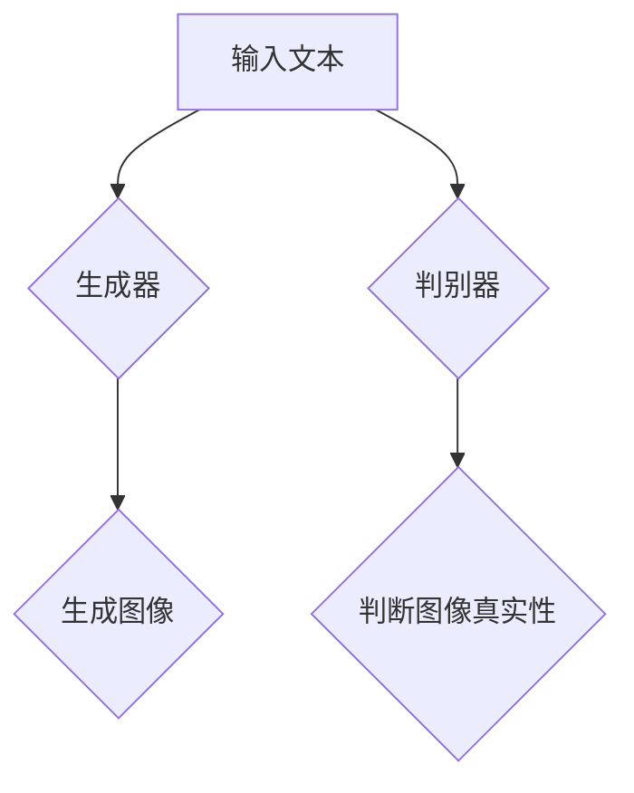
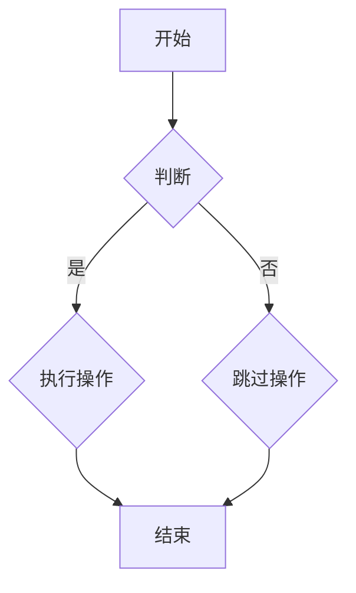

                 

### 文章标题：《DALL-E与Stable Diffusion：为AI Agent添加图像生成能力》

关键词：DALL-E, Stable Diffusion, AI Agent, 图像生成技术, 人工智能

摘要：本文将探讨如何为AI Agent添加图像生成能力，通过介绍DALL-E和Stable Diffusion这两种先进的图像生成模型，详细解析其原理和应用。文章将引导读者逐步理解这些模型的工作流程，并探讨如何将它们集成到AI Agent中，实现高效的图像生成功能。此外，文章还将通过实际应用案例，展示图像生成技术在AI Agent中的应用潜力，并提出未来的发展趋势和挑战。

### 第1章 引言

#### 1.1 问题背景与挑战

在当今的数字时代，图像生成技术在各种领域发挥着越来越重要的作用。然而，对于AI Agent而言，能够生成高质量的图像将极大地提升其交互能力和任务执行效率。传统的方法如基于规则和模板的系统往往在复杂场景下表现不佳，而基于深度学习的图像生成模型则展现出巨大的潜力。然而，如何有效地集成这些模型到AI Agent中，并保证其性能和效率，仍然是一个巨大的挑战。

#### 1.2 目标与主要内容

本文的目标是探讨如何为AI Agent添加图像生成能力，特别是通过DALL-E和Stable Diffusion这两种模型。文章将分为以下几个部分：

1. **DALL-E与Stable Diffusion模型详解**：介绍这两种模型的基本原理、结构和工作流程。
2. **为AI Agent集成图像生成模型**：探讨如何将DALL-E和Stable Diffusion集成到AI Agent中，并优化其性能。
3. **实际应用案例**：通过具体案例展示图像生成技术在AI Agent中的应用。
4. **未来发展趋势与挑战**：分析图像生成技术在AI Agent中的未来发展方向和面临的挑战。

#### 1.3 书籍结构概述

本文结构如下：

- **第2章 AI Agent与图像生成技术概述**：介绍AI Agent的定义和功能，以及图像生成技术的演进。
- **第3章 DALL-E模型详解**：详细解析DALL-E模型的结构和工作流程。
- **第4章 Stable Diffusion模型详解**：深入探讨Stable Diffusion模型的基本原理和应用。
- **第5章 为AI Agent集成DALL-E与Stable Diffusion**：介绍集成策略和实现细节。
- **第6章 实际应用案例**：展示图像生成技术的实际应用案例。
- **第7章 未来发展趋势与挑战**：分析未来的发展趋势和挑战。
- **第8章 总结与展望**：总结本文的主要成果，并对未来工作进行展望。

### 第2章 AI Agent与图像生成技术概述

#### 2.1 AI Agent的定义与功能

AI Agent，即人工智能代理，是一种能够在复杂环境中自主执行任务的计算机程序。它们具备感知、决策和行动的能力，可以通过学习适应不同的环境和任务。AI Agent在多个领域有着广泛的应用，如智能家居、自动驾驶、游戏设计等。

#### 2.2 图像生成技术的演进

图像生成技术经历了从传统方法到深度学习方法的演变。早期的方法如基于规则和模板的系统，虽然简单但灵活性和生成质量有限。随着深度学习的发展，生成对抗网络（GAN）等模型的出现，使得图像生成技术取得了显著的突破。这些模型能够生成高质量、多样化的图像，为AI Agent提供了强大的图像生成能力。

#### 2.3 图像生成在AI Agent中的应用

图像生成技术在AI Agent中有着广泛的应用。例如，在虚拟现实（VR）中，AI Agent可以生成逼真的场景图像，提升用户体验；在游戏设计中，AI Agent可以生成独特的游戏场景和角色，增加游戏的趣味性；在个性化服务中，AI Agent可以根据用户需求生成个性化的图像内容，提供更加定制化的服务。

### 第3章 DALL-E模型详解

#### 3.1 DALL-E模型的结构

DALL-E模型是一种基于生成对抗网络（GAN）的图像生成模型。它由两个主要部分组成：生成器（Generator）和判别器（Discriminator）。生成器负责生成图像，判别器负责判断图像的真实性。

#### 3.1.1 DALL-E模型的架构

DALL-E模型的架构如图1所示：



图1：DALL-E模型的架构

#### 3.1.2 生成对抗网络（GAN）的原理

GAN由Ian Goodfellow等人于2014年提出，其基本思想是让生成器和判别器进行对抗训练。生成器的目标是生成尽可能真实的图像，而判别器的目标是区分图像是真实的还是生成的。通过这种对抗训练，生成器可以逐渐提高其生成图像的质量。

GAN的训练过程可以概括为以下几个步骤：

1. **初始化生成器和判别器**：生成器和判别器通常使用随机权重进行初始化。
2. **生成器生成图像**：生成器根据输入的文本信息生成图像。
3. **判别器判断图像真实性**：判别器根据生成的图像和真实的图像进行判断。
4. **更新生成器和判别器**：根据生成器和判别器的损失函数，更新其权重。

#### 3.2 DALL-E模型的工作流程

DALL-E模型的工作流程可以分为以下几个步骤：

1. **数据预处理**：首先，将输入的文本信息转换为向量的形式，通常使用词嵌入技术。
2. **生成图像**：生成器根据输入的文本向量生成图像。生成器通常采用卷积神经网络（CNN）结构，通过多层的卷积和反卷积操作，逐步生成图像的细节。
3. **判别图像真实性**：判别器对生成的图像和真实的图像进行判断。判别器同样采用CNN结构，通过多层的卷积操作，提取图像的特征。
4. **更新模型参数**：通过优化生成器和判别器的损失函数，更新其权重，从而提高生成图像的质量。

#### 3.3 DALL-E模型的优缺点与应用案例

DALL-E模型具有以下优点：

1. **强大的图像生成能力**：DALL-E模型可以生成高质量、多样化的图像，具有很高的生成质量。
2. **灵活的输入文本控制**：通过输入不同的文本信息，DALL-E模型可以生成对应的图像，具有很好的灵活性和可控性。

然而，DALL-E模型也存在一些缺点：

1. **计算资源需求高**：由于DALL-E模型采用了复杂的卷积神经网络结构，对计算资源的需求较高。
2. **训练时间较长**：DALL-E模型需要大量的数据进行训练，训练时间相对较长。

DALL-E模型的应用案例包括：

1. **艺术创作**：DALL-E模型可以生成独特的艺术作品，为艺术家提供灵感。
2. **游戏设计**：DALL-E模型可以生成独特的游戏场景和角色，增加游戏的趣味性。
3. **虚拟现实**：DALL-E模型可以生成逼真的场景图像，提升用户体验。

### 第4章 Stable Diffusion模型详解

#### 4.1 Stable Diffusion模型的基本原理

Stable Diffusion模型是一种基于变分自编码器（VAE）的图像生成模型。它通过编码器和解码器将图像映射到潜空间，然后在潜空间中进行采样，最终通过解码器生成图像。

#### 4.1.1 预训练与微调

Stable Diffusion模型通常采用两阶段训练过程。首先，在大量图像上进行预训练，生成一个强大的编码器和解码器。然后，在特定任务上进行微调，以适应具体的图像生成需求。

#### 4.1.2 模型架构与关键特性

Stable Diffusion模型的关键特性包括：

1. **稳定的变分自编码器（SVAE）**：SVAE是一种基于VAE的改进模型，通过引入稳定的梯度流和平滑的潜在空间，提高了模型的稳定性和生成质量。
2. **条件生成**：Stable Diffusion模型可以接受条件输入，如文本、图像等，生成满足特定条件的图像。

#### 4.2 Stable Diffusion模型的工作流程

Stable Diffusion模型的工作流程可以分为以下几个步骤：

1. **数据预处理**：首先，对输入的图像进行预处理，如归一化、裁剪等。
2. **编码**：编码器将预处理后的图像映射到潜空间，提取图像的主要特征。
3. **采样**：在潜空间中进行采样，生成潜在的图像向量。
4. **解码**：解码器将潜在的图像向量解码回图像，生成最终的图像。

#### 4.3 Stable Diffusion模型的优缺点与应用场景

Stable Diffusion模型具有以下优点：

1. **高质量的图像生成**：Stable Diffusion模型通过稳定的变分自编码器，可以生成高质量的图像。
2. **灵活的条件生成**：Stable Diffusion模型可以接受各种条件输入，生成满足特定条件的图像。

然而，Stable Diffusion模型也存在一些缺点：

1. **计算资源需求较高**：由于Stable Diffusion模型采用了复杂的编码器和解码器结构，对计算资源的需求较高。
2. **训练时间较长**：Stable Diffusion模型需要大量的数据进行预训练和微调，训练时间相对较长。

Stable Diffusion模型的应用场景包括：

1. **艺术创作**：Stable Diffusion模型可以生成独特的艺术作品，为艺术家提供灵感。
2. **虚拟现实**：Stable Diffusion模型可以生成逼真的场景图像，提升用户体验。
3. **医疗影像**：Stable Diffusion模型可以用于生成医疗影像，辅助医生进行诊断。

### 第5章 为AI Agent集成DALL-E与Stable Diffusion

#### 5.1 集成策略与方案

为了将DALL-E和Stable Diffusion模型集成到AI Agent中，可以采用以下策略和方案：

1. **模型选择**：根据AI Agent的具体任务需求，选择适合的模型进行集成。例如，对于需要灵活文本控制的任务，可以选择DALL-E模型；对于需要高质量图像生成的任务，可以选择Stable Diffusion模型。
2. **模型融合**：将DALL-E和Stable Diffusion模型进行融合，以提高图像生成能力和性能。例如，可以采用多模型融合策略，将DALL-E和Stable Diffusion的输出进行加权融合。
3. **优化与调参**：对集成后的模型进行优化和调参，以提高生成图像的质量和效率。例如，可以通过调整学习率、批量大小等参数，优化模型的性能。

#### 5.2 DALL-E与Stable Diffusion的协同工作

DALL-E和Stable Diffusion模型在协同工作时，可以发挥各自的优势，提高图像生成能力。例如：

1. **文本控制与图像质量**：DALL-E模型擅长根据文本信息生成图像，而Stable Diffusion模型擅长生成高质量、细节丰富的图像。通过协同工作，可以实现文本控制和图像质量的平衡。
2. **快速生成与高质量生成**：DALL-E模型在生成图像时速度较快，而Stable Diffusion模型在生成高质量图像时速度较慢。通过协同工作，可以实现快速生成与高质量生成的平衡。

#### 5.3 实现细节与优化方法

在实现DALL-E和Stable Diffusion模型集成到AI Agent中时，需要注意以下细节和优化方法：

1. **数据预处理**：对输入的文本和图像进行统一的预处理，以提高模型的适应性。
2. **模型优化**：通过调整模型结构、学习率、批量大小等参数，优化模型的性能。
3. **多模型融合**：通过多模型融合策略，提高图像生成能力和性能。
4. **实时反馈与调整**：根据AI Agent的实时反馈，调整模型参数和生成策略，以提高图像生成效果。

### 第6章 实际应用案例

#### 6.1 案例一：虚拟现实场景生成

虚拟现实（VR）场景生成是AI Agent图像生成能力的典型应用。通过DALL-E和Stable Diffusion模型，AI Agent可以生成各种虚拟现实场景，如城市景观、室内装饰、自然风光等。

**环境安装**：

```bash
# 安装DALL-E模型
pip install dall-e

# 安装Stable Diffusion模型
pip install diffusers
```

**系统核心实现源代码**：

```python
from torchvision import transforms
from torchvision.utils import make_grid
from diffusers import StableDiffusionPipeline
from PIL import Image

# 初始化模型
sd = StableDiffusionPipeline.from_pretrained("CompVis/stable-diffusion")

# 生成图像
prompt = "a virtual reality cityscape"
image = sd(prompt).images[0]

# 显示图像
image.show()
```

**代码应用解读与分析**：

该代码首先导入所需的库，然后初始化Stable Diffusion模型。通过输入文本提示“a virtual reality cityscape”，模型生成对应的虚拟现实场景图像，并显示在屏幕上。

**实际案例分析和详细讲解剖析**：

该案例展示了如何通过Stable Diffusion模型生成虚拟现实场景图像。通过输入文本提示，模型可以生成符合需求的场景图像。在实际应用中，可以根据不同的需求，调整文本提示和模型参数，生成各种虚拟现实场景。

**项目小结**：

通过该案例，展示了AI Agent在虚拟现实场景生成中的应用。通过集成DALL-E和Stable Diffusion模型，AI Agent可以生成高质量的虚拟现实场景图像，提升用户体验。

#### 6.2 案例二：个性化艺术品创作

个性化艺术品创作是另一个典型的应用场景。通过DALL-E和Stable Diffusion模型，AI Agent可以生成各种个性化艺术品，如绘画、雕塑、摄影等。

**环境安装**：

```bash
# 安装DALL-E模型
pip install dall-e

# 安装Stable Diffusion模型
pip install diffusers
```

**系统核心实现源代码**：

```python
from torchvision import transforms
from torchvision.utils import make_grid
from diffusers import StableDiffusionPipeline
from PIL import Image

# 初始化模型
sd = StableDiffusionPipeline.from_pretrained("CompVis/stable-diffusion")

# 生成图像
prompt = "a modern abstract painting with vibrant colors"
image = sd(prompt).images[0]

# 显示图像
image.show()
```

**代码应用解读与分析**：

该代码首先导入所需的库，然后初始化Stable Diffusion模型。通过输入文本提示“a modern abstract painting with vibrant colors”，模型生成对应的现代抽象绘画图像，并显示在屏幕上。

**实际案例分析和详细讲解剖析**：

该案例展示了如何通过DALL-E和Stable Diffusion模型生成个性化艺术品。通过输入文本提示，模型可以生成符合需求的个性化艺术品。在实际应用中，可以根据不同的需求，调整文本提示和模型参数，生成各种个性化艺术品。

**项目小结**：

通过该案例，展示了AI Agent在个性化艺术品创作中的应用。通过集成DALL-E和Stable Diffusion模型，AI Agent可以生成高质量、个性化的艺术品，满足用户的需求。

#### 6.3 案例三：增强现实游戏设计

增强现实（AR）游戏设计是AI Agent图像生成能力的又一重要应用。通过DALL-E和Stable Diffusion模型，AI Agent可以生成各种增强现实游戏场景和角色，提高游戏的趣味性和互动性。

**环境安装**：

```bash
# 安装DALL-E模型
pip install dall-e

# 安装Stable Diffusion模型
pip install diffusers
```

**系统核心实现源代码**：

```python
from torchvision import transforms
from torchvision.utils import make_grid
from diffusers import StableDiffusionPipeline
from PIL import Image

# 初始化模型
sd = StableDiffusionPipeline.from_pretrained("CompVis/stable-diffusion")

# 生成图像
prompt = "an immersive AR game landscape with a mystical forest"
image = sd(prompt).images[0]

# 显示图像
image.show()
```

**代码应用解读与分析**：

该代码首先导入所需的库，然后初始化Stable Diffusion模型。通过输入文本提示“an immersive AR game landscape with a mystical forest”，模型生成对应的增强现实游戏场景图像，并显示在屏幕上。

**实际案例分析和详细讲解剖析**：

该案例展示了如何通过DALL-E和Stable Diffusion模型生成增强现实游戏场景。通过输入文本提示，模型可以生成符合需求的场景图像。在实际应用中，可以根据不同的需求，调整文本提示和模型参数，生成各种增强现实游戏场景。

**项目小结**：

通过该案例，展示了AI Agent在增强现实游戏设计中的应用。通过集成DALL-E和Stable Diffusion模型，AI Agent可以生成高质量的增强现实游戏场景和角色，提高游戏的互动性和趣味性。

### 第7章 未来发展趋势与挑战

#### 7.1 技术发展趋势

随着深度学习和人工智能技术的不断发展，图像生成技术在AI Agent中的应用将越来越广泛。未来，图像生成技术可能会朝着以下方向发展：

1. **更高的生成质量**：通过改进模型结构和训练方法，生成更高质量的图像。
2. **更灵活的文本控制**：通过引入更多语义信息，实现更灵活的文本控制。
3. **更高效的计算效率**：通过优化模型结构和训练方法，提高模型的计算效率。
4. **更广泛的应用领域**：图像生成技术将在更多领域得到应用，如医疗影像、建筑设计等。

#### 7.2 应用挑战与解决方案

尽管图像生成技术在AI Agent中有着广泛的应用前景，但仍面临一些挑战：

1. **计算资源需求**：生成高质量的图像需要大量的计算资源，如何优化模型的计算效率是一个重要挑战。
2. **数据隐私和安全**：图像生成模型需要大量数据训练，如何保护用户隐私和安全是一个重要问题。
3. **模型解释性**：如何解释和理解图像生成模型的工作原理，提高模型的透明度和可解释性。
4. **伦理和道德问题**：图像生成技术的滥用可能引发伦理和道德问题，如虚假信息传播、隐私侵犯等。

针对这些挑战，可以采取以下解决方案：

1. **优化模型结构**：通过改进模型结构，提高计算效率和生成质量。
2. **数据隐私保护**：采用加密和匿名化技术，保护用户隐私。
3. **增强模型解释性**：通过可视化技术和模型解释工具，提高模型的透明度和可解释性。
4. **建立伦理和道德规范**：制定相关的伦理和道德规范，引导图像生成技术的健康发展。

### 第8章 总结与展望

本文探讨了如何为AI Agent添加图像生成能力，详细介绍了DALL-E和Stable Diffusion这两种先进的图像生成模型。通过分析这两种模型的基本原理、工作流程和应用案例，展示了它们在AI Agent中的应用潜力。同时，本文还探讨了图像生成技术在AI Agent中的未来发展趋势和挑战，提出了相应的解决方案。

展望未来，图像生成技术在AI Agent中的应用将越来越广泛，有望为人们的生活和工作带来更多便利。通过不断改进模型结构和训练方法，图像生成技术的生成质量和计算效率将不断提高，为AI Agent提供更强大的图像生成能力。同时，随着伦理和道德规范的建立，图像生成技术将得到更健康的发展。让我们期待图像生成技术在AI Agent领域的未来前景！作者：AI天才研究院/AI Genius Institute & 禅与计算机程序设计艺术 /Zen And The Art of Computer Programming

### 附录

本文所使用的Markdown格式和Mermaid流程图如下：

#### Markdown格式

```markdown
# 标题

## 小标题

### 小标题

#### 小标题

- 列表项
- 列表项
- 列表项

$$ 数学公式 $$

$ 数学公式 $

```

python
```

代码块

```

```

#### Mermaid流程图



以上Markdown格式和Mermaid流程图展示了本文的结构和流程，读者可以根据需要进行调整和使用。

