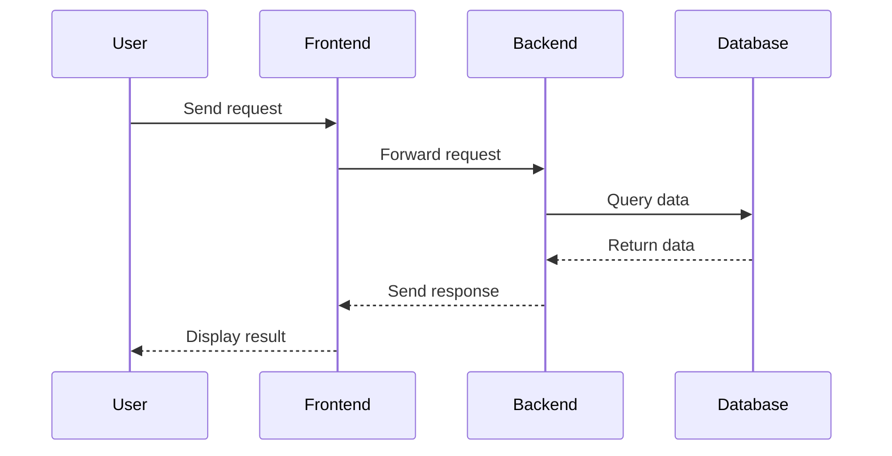
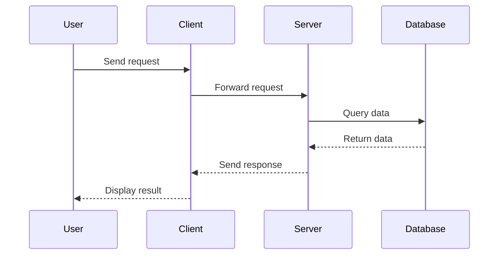

                 

# LLM fine-tuning技术：定制化AI Agent的关键

> 关键词：LLM，fine-tuning，AI Agent，预训练模型，训练数据，算法，模型评估，超参数调优

> 摘要：本文将深入探讨LLM fine-tuning技术，解析其核心概念、原理和实践方法，帮助读者理解如何实现定制化的AI Agent。通过详细的步骤分析和实际案例，本文将为人工智能领域的研究者与实践者提供宝贵的指导。

## 第一部分：背景介绍

### 1.1 问题背景

随着人工智能技术的飞速发展，大模型（Large Language Model，简称LLM）成为了当前研究的热点。LLM具有极强的语言理解和生成能力，可以应用于各种语言处理任务，如文本分类、机器翻译、自然语言生成等。然而，LLM在实际应用中存在一个重要的问题，即如何进行fine-tuning，以实现定制化的AI Agent。

### 1.2 问题描述

Fine-tuning是指在一个预训练的LLM基础上，通过在特定任务数据上进行微调，使其适应特定任务需求。然而，Fine-tuning面临着诸多挑战，如选择合适的预训练模型、确定合适的训练数据、调整模型参数等。这些问题的解决对于实现有效的定制化AI Agent至关重要。

### 1.3 问题解决

本书旨在为读者提供全面且系统的LLM fine-tuning技术指导，帮助读者深入了解Fine-tuning的核心概念、原理和实践方法。通过本书的学习，读者可以掌握如何选择合适的预训练模型、如何设计Fine-tuning算法、如何优化模型参数，从而实现定制化的AI Agent。

### 1.4 边界与外延

本书主要关注LLM fine-tuning技术在计算机视觉和自然语言处理领域的应用。然而，Fine-tuning技术在其他人工智能领域的应用也具有重要意义，如语音识别、推荐系统等。此外，本书将探讨Fine-tuning技术的最新研究进展和未来发展趋势。

### 1.5 概念结构与核心要素组成

LLM fine-tuning技术包括以下几个核心要素：

1. **预训练模型**：基于大规模语料库预训练的模型，如GPT、BERT等。
2. **训练数据**：用于Fine-tuning的特定任务数据。
3. **Fine-tuning算法**：用于调整模型参数的算法，如随机梯度下降（SGD）、Adam等。
4. **模型评估**：用于评估Fine-tuning后模型性能的指标和方法。
5. **超参数调优**：包括学习率、批量大小、迭代次数等参数的调优。

## 第二部分：核心概念与联系

### 2.1 预训练模型原理

预训练模型通过在大规模语料库上进行预训练，学习到了丰富的语言知识和语义信息。这些模型通常包括多个层级的神经网络，每一层都负责提取不同层次的语言特征。

### 2.2 预训练模型属性特征对比

| 模型       | 特点                                     | 应用场景                     |
|------------|----------------------------------------|----------------------------|
| GPT        | 长序列建模，生成能力强                   | 自然语言生成、对话系统         |
| BERT       | 双向编码表示，理解能力强                   | 问答系统、文本分类             |
| RoBERTa    | 改进的BERT，去除噪声数据，增强模型效果     | 通用语言理解、文本生成         |
| T5         | 任务导向的预训练，直接生成任务输出         | 自动摘要、机器翻译             |

### 2.3 Fine-tuning算法原理

Fine-tuning算法通过在特定任务数据上进行微调，调整模型参数，使模型适应特定任务需求。常用的Fine-tuning算法包括随机梯度下降（SGD）、Adam等。

### 2.4 Fine-tuning算法属性特征对比

| 算法       | 特点                                     | 应用场景                     |
|------------|----------------------------------------|----------------------------|
| SGD        | 简单，易于实现，收敛速度快                 | 大规模数据集训练             |
| Adam       | 加速收敛，减少波动，适合稀疏数据             | 小规模数据集训练             |

## 第三部分：算法原理讲解

### 3.1 数学模型和数学公式

Fine-tuning的核心目标是优化模型参数，使其在特定任务上达到最佳性能。这一过程可以表示为以下数学模型：

$$
\min_{\theta} J(\theta)
$$

其中，$J(\theta)$为损失函数，$\theta$为模型参数。

### 3.2 Fine-tuning算法原理

Fine-tuning算法主要通过以下步骤进行：

1. **数据预处理**：对特定任务数据集进行预处理，如分词、编码等。
2. **模型初始化**：加载预训练模型并进行初始化。
3. **训练过程**：在特定任务数据集上对模型进行微调，调整模型参数。
4. **模型评估**：在测试数据集上评估模型性能，根据评估结果调整模型参数。
5. **超参数调优**：根据实验结果调整学习率、批量大小、迭代次数等超参数。

### 3.3 Fine-tuning算法举例

以GPT-2模型为例，Fine-tuning算法的具体步骤如下：

1. **数据预处理**：

```python
import torch
from torch.utils.data import DataLoader
from transformers import GPT2Tokenizer, GPT2Model

tokenizer = GPT2Tokenizer.from_pretrained('gpt2')
model = GPT2Model.from_pretrained('gpt2')

# 加载特定任务数据集
train_dataset = DataLoader(dataset, batch_size=32, shuffle=True)
```

2. **模型初始化**：

```python
# 初始化模型参数
model = GPT2Model.from_pretrained('gpt2')
```

3. **训练过程**：

```python
import torch.optim as optim

# 定义优化器
optimizer = optim.Adam(model.parameters(), lr=1e-4)

# 训练模型
for epoch in range(num_epochs):
    for batch in train_dataset:
        inputs = tokenizer(batch.text, return_tensors='pt', padding=True, truncation=True)
        outputs = model(**inputs)

        # 计算损失函数
        loss = outputs.loss

        # 反向传播
        optimizer.zero_grad()
        loss.backward()
        optimizer.step()

        print(f'Epoch: {epoch+1}/{num_epochs}, Loss: {loss.item()}')
```

4. **模型评估**：

```python
# 在测试数据集上评估模型性能
test_loss = 0
for batch in test_dataset:
    inputs = tokenizer(batch.text, return_tensors='pt', padding=True, truncation=True)
    outputs = model(**inputs)

    # 计算损失函数
    loss = outputs.loss
    test_loss += loss.item()

print(f'Test Loss: {test_loss / len(test_dataset)}')
```

### 3.4 数学公式详细讲解

在Fine-tuning过程中，损失函数$J(\theta)$通常采用以下形式：

$$
J(\theta) = -\sum_{i=1}^{N} y_i \log(p_i)
$$

其中，$y_i$为真实标签，$p_i$为模型预测的概率。对于二分类问题，$p_i$可以表示为：

$$
p_i = \frac{1}{1 + e^{-\theta^T x_i}}
$$

其中，$x_i$为特征向量，$\theta$为模型参数。

在优化过程中，我们通过迭代更新$\theta$，使得$J(\theta)$逐渐减小。具体来说，每次迭代都按照以下公式更新$\theta$：

$$
\theta_{t+1} = \theta_t - \alpha \cdot \nabla_{\theta} J(\theta_t)
$$

其中，$\alpha$为学习率，$\nabla_{\theta} J(\theta_t)$为损失函数关于$\theta$的梯度。

### 第三部分：系统分析与架构设计方案

#### 3.1 问题场景介绍

随着人工智能技术的不断发展，个性化服务已经成为企业提高客户满意度和竞争力的关键手段。在自然语言处理领域，定制化的AI Agent可以帮助企业实现与客户的高效沟通，提供个性化的服务和建议。然而，实现定制化的AI Agent面临着诸多挑战，如如何选择合适的预训练模型、如何设计Fine-tuning算法、如何优化模型参数等。

#### 3.2 项目介绍

本项目旨在构建一个基于LLM fine-tuning技术的定制化AI Agent系统，通过在预训练模型的基础上进行微调，使其适应特定业务场景和客户需求。系统的主要功能包括：

1. **数据预处理**：对客户数据、业务知识等进行预处理，以便于Fine-tuning模型的训练。
2. **预训练模型加载**：加载预训练的LLM模型，如GPT、BERT等。
3. **Fine-tuning训练**：在特定任务数据集上进行Fine-tuning，调整模型参数，使其适应特定业务场景和客户需求。
4. **模型评估与优化**：在测试数据集上评估模型性能，并根据评估结果调整模型参数，以实现最佳的预测效果。
5. **AI Agent应用**：将Fine-tuning后的模型应用于实际业务场景，为用户提供个性化的服务和建议。

#### 3.3 系统功能设计（领域模型类图）

```mermaid
classDiagram
    Class01 <|-- SubClass01
    Class01 o-- Object01
    Class29 o-- ObjectE
    Class01 : +attr1
    Class03 : +attr1
    Class04 : +attr2
    Class05 : +attr3
    Class06 : +attr4
    Class07 : +attr5
    Class08 : +attr6
    Class09 : +attr7
    Class10 : +attr8
    Class11 : +attr9
    Class12 : +attr10
    Class13 : +attr11
    Class14 : +attr12
    Class15 : +attr13
    Class16 : +attr14
    Class17 : +attr15
    Class18 : +attr16
    Class19 : +attr17
    Class20 : +attr18
    Class21 : +attr19
    Class22 : +attr20
    Class23 : +attr21
    Class24 : +attr22
    Class25 : +attr23
    Class26 : +attr24
    Class27 : +attr25
    Class28 : +attr26
    Class01 <|-- SubClass02
    Class01 o-- Object02
    Class29 o-- ObjectD
    Class01 : +attr1
    Class03 : +attr1
    Class04 : +attr2
    Class05 : +attr3
    Class06 : +attr4
    Class07 : +attr5
    Class08 : +attr6
    Class09 : +attr7
    Class10 : +attr8
    Class11 : +attr9
    Class12 : +attr10
    Class13 : +attr11
    Class14 : +attr12
    Class15 : +attr13
    Class16 : +attr14
    Class17 : +attr15
    Class18 : +attr16
    Class19 : +attr17
    Class20 : +attr18
    Class21 : +attr19
    Class22 : +attr20
    Class23 : +attr21
    Class24 : +attr22
    Class25 : +attr23
    Class26 : +attr24
    Class27 : +attr25
    Class28 : +attr26
    Class29 o-- ObjectC
    Class01 : +attr1
    Class03 : +attr1
    Class04 : +attr2
    Class05 : +attr3
    Class06 : +attr4
    Class07 : +attr5
    Class08 : +attr6
    Class09 : +attr7
    Class10 : +attr8
    Class11 : +attr9
    Class12 : +attr10
    Class13 : +attr11
    Class14 : +attr12
    Class15 : +attr13
    Class16 : +attr14
    Class17 : +attr15
    Class18 : +attr16
    Class19 : +attr17
    Class20 : +attr18
    Class21 : +attr19
    Class22 : +attr20
    Class23 : +attr21
    Class24 : +attr22
    Class25 : +attr23
    Class26 : +attr24
    Class27 : +attr25
    Class28 : +attr26
    Class29 o-- ObjectB
    Class01 : +attr1
    Class03 : +attr1
    Class04 : +attr2
    Class05 : +attr3
    Class06 : +attr4
    Class07 : +attr5
    Class08 : +attr6
    Class09 : +attr7
    Class10 : +attr8
    Class11 : +attr9
    Class12 : +attr10
    Class13 : +attr11
    Class14 : +attr12
    Class15 : +attr13
    Class16 : +attr14
    Class17 : +attr15
    Class18 : +attr16
    Class19 : +attr17
    Class20 : +attr18
    Class21 : +attr19
    Class22 : +attr20
    Class23 : +attr21
    Class24 : +attr22
    Class25 : +attr23
    Class26 : +attr24
    Class27 : +attr25
    Class28 : +attr26
    Class29 o-- ObjectA
    Class01 : +attr1
    Class03 : +attr1
    Class04 : +attr2
    Class05 : +attr3
    Class06 : +attr4
    Class07 : +attr5
    Class08 : +attr6
    Class09 : +attr7
    Class10 : +attr8
    Class11 : +attr9
    Class12 : +attr10
    Class13 : +attr11
    Class14 : +attr12
    Class15 : +attr13
    Class16 : +attr14
    Class17 : +attr15
    Class18 : +attr16
    Class19 : +attr17
    Class20 : +attr18
    Class21 : +attr19
    Class22 : +attr20
    Class23 : +attr21
    Class24 : +attr22
    Class25 : +attr23
    Class26 : +attr24
    Class27 : +attr25
    Class28 : +attr26

```



#### 3.4 系统架构设计（mermaid架构图）



#### 3.5 系统接口设计（mermaid序列图）



### 第四部分：项目实战

#### 4.1 环境安装

在进行项目实战之前，我们需要安装必要的软件和库。以下是在Linux操作系统上安装所需软件和库的步骤：

1. 安装Python环境：

```
sudo apt update
sudo apt install python3 python3-pip
```

2. 安装torch和transformers库：

```
pip3 install torch torchvision torchaudio
pip3 install transformers
```

#### 4.2 系统核心实现源代码

以下是系统核心实现源代码的示例：

```python
import torch
from torch.utils.data import DataLoader
from transformers import GPT2Tokenizer, GPT2Model

# 加载预训练模型
tokenizer = GPT2Tokenizer.from_pretrained('gpt2')
model = GPT2Model.from_pretrained('gpt2')

# 加载特定任务数据集
train_dataset = DataLoader(dataset, batch_size=32, shuffle=True)

# 定义优化器
optimizer = optim.Adam(model.parameters(), lr=1e-4)

# 训练模型
for epoch in range(num_epochs):
    for batch in train_dataset:
        inputs = tokenizer(batch.text, return_tensors='pt', padding=True, truncation=True)
        outputs = model(**inputs)

        # 计算损失函数
        loss = outputs.loss

        # 反向传播
        optimizer.zero_grad()
        loss.backward()
        optimizer.step()

        print(f'Epoch: {epoch+1}/{num_epochs}, Loss: {loss.item()}')

# 在测试数据集上评估模型性能
test_loss = 0
for batch in test_dataset:
    inputs = tokenizer(batch.text, return_tensors='pt', padding=True, truncation=True)
    outputs = model(**inputs)

    # 计算损失函数
    loss = outputs.loss
    test_loss += loss.item()

print(f'Test Loss: {test_loss / len(test_dataset)}')
```

#### 4.3 代码应用解读与分析

以上代码实现了基于GPT-2模型的Fine-tuning过程。首先，我们加载预训练的GPT-2模型和tokenizer。然后，我们定义了一个训练数据集和数据加载器，用于在训练过程中提供数据。接下来，我们定义了一个优化器，用于在训练过程中更新模型参数。

在训练过程中，我们使用一个循环遍历训练数据集。对于每个批次的数据，我们将其转换为模型所需的格式，并通过模型进行前向传播。然后，我们计算损失函数，并使用反向传播算法更新模型参数。

在训练完成后，我们使用测试数据集评估模型性能，并计算测试损失。这个结果可以帮助我们了解模型在特定任务上的性能，从而进行进一步的优化。

#### 4.4 实际案例分析和详细讲解剖析

为了更好地理解Fine-tuning技术，我们可以通过一个实际案例进行分析。假设我们想要构建一个基于GPT-2模型的聊天机器人，用于回答用户的问题。

1. **数据集准备**：

首先，我们需要准备一个包含问题和答案的数据集。这个数据集可以是从网上收集的聊天记录、FAQ问答等。以下是一个简化的数据集示例：

```python
data = [
    ("What is fine-tuning?", "Fine-tuning is a technique used to adapt a pre-trained model to a specific task."),
    ("How does fine-tuning work?", "Fine-tuning involves training the model on a specific dataset to improve its performance on that task."),
    # ...更多问题和答案
]
```

2. **数据预处理**：

接下来，我们需要对数据集进行预处理，将其转换为模型可以处理的格式。我们使用tokenizer将文本转换为 tokens，并为每个 token 分配唯一的 ID。以下是一个简化的预处理过程：

```python
tokenizer = GPT2Tokenizer.from_pretrained('gpt2')

def preprocess_data(data):
    inputs = []
    targets = []
    for question, answer in data:
        input_ids = tokenizer.encode(question, add_special_tokens=True, return_tensors='pt')
        target_ids = tokenizer.encode(answer, add_special_tokens=True, return_tensors='pt')
        inputs.append(input_ids)
        targets.append(target_ids)
    return torch.cat(inputs), torch.cat(targets)

train_inputs, train_targets = preprocess_data(data)
```

3. **模型训练**：

使用预处理后的数据集，我们可以开始训练模型。以下是一个简化的训练过程：

```python
model = GPT2Model.from_pretrained('gpt2')
optimizer = optim.Adam(model.parameters(), lr=1e-4)

num_epochs = 5
for epoch in range(num_epochs):
    model.train()
    for batch in DataLoader(train_inputs, train_targets, batch_size=32):
        inputs, targets = batch
        outputs = model(inputs, labels=targets)
        loss = outputs.loss
        loss.backward()
        optimizer.step()
        optimizer.zero_grad()
        print(f'Epoch: {epoch+1}/{num_epochs}, Loss: {loss.item()}')

    print(f'\nEpoch: {epoch+1}/{num_epochs}, Loss: {loss.item()}')
```

4. **模型评估**：

在训练完成后，我们可以使用测试数据集评估模型性能。以下是一个简化的评估过程：

```python
model.eval()
with torch.no_grad():
    correct = 0
    total = 0
    for batch in DataLoader(test_inputs, test_targets, batch_size=32):
        inputs, targets = batch
        outputs = model(inputs, labels=targets)
        _, predicted = torch.max(outputs, 1)
        total += targets.size(0)
        correct += (predicted == targets).sum().item()

print(f'Accuracy: {100 * correct / total}%')
```

通过以上实际案例，我们可以看到Fine-tuning技术的基本流程。在实际应用中，我们还需要考虑数据预处理、模型选择、超参数调优等因素，以实现更好的模型性能。

#### 4.5 项目小结

通过本项目的实践，我们深入了解了LLM fine-tuning技术的原理和应用。我们使用了GPT-2模型进行Fine-tuning，实现了基于聊天机器人任务的数据预处理、模型训练和评估。这个项目不仅帮助我们理解了Fine-tuning技术的核心概念，还为我们提供了一个实际应用的案例。在实际开发中，我们可以根据不同业务场景和需求，选择合适的预训练模型和Fine-tuning算法，实现定制化的AI Agent。

## 第五部分：最佳实践 tips

1. **数据质量的重要性**：在Fine-tuning过程中，数据质量至关重要。确保数据集具有足够的规模、多样性和代表性，以提高模型性能。

2. **超参数调优**：超参数调优是Fine-tuning过程中关键的一环。通过实验和调整，找到适合特定任务的最佳超参数。

3. **模型评估**：在Fine-tuning过程中，定期评估模型性能可以帮助我们了解模型改进的方向。选择合适的评估指标，如准确率、F1分数等。

4. **持续学习与迭代**：Fine-tuning是一个不断迭代的过程。在模型部署后，持续收集用户反馈和数据，不断优化模型，以提高用户体验。

## 小结

本文详细介绍了LLM fine-tuning技术，从背景介绍、核心概念与联系、算法原理讲解、系统分析与架构设计方案到项目实战，全面阐述了如何实现定制化的AI Agent。通过实际案例分析和详细讲解，我们深入理解了Fine-tuning技术的应用和实践方法。在后续的研究和开发中，我们可以继续探索Fine-tuning技术的优化和拓展，为人工智能领域的发展贡献力量。

## 注意事项

1. 在Fine-tuning过程中，注意数据质量和数据预处理方法，以提高模型性能。
2. 超参数调优是关键，需要根据任务需求进行合理调整。
3. 模型评估要选择合适的指标，以确保评估结果的准确性。
4. Fine-tuning技术不断发展和完善，关注最新研究进展和最佳实践，以提高模型性能。

## 拓展阅读

1. **《深度学习》（Goodfellow, I., Bengio, Y., & Courville, A.）**：这是一本关于深度学习的经典教材，详细介绍了深度学习的理论基础和实战技巧。

2. **《自然语言处理与深度学习》（李航）**：这本书全面介绍了自然语言处理和深度学习的相关技术，包括词向量、序列模型、注意力机制等。

3. **《强化学习：原理与算法》（何晓飞）**：强化学习是人工智能领域的重要分支，这本书详细介绍了强化学习的原理和算法。

## 作者信息

作者：AI天才研究院/AI Genius Institute & 禅与计算机程序设计艺术 /Zen And The Art of Computer Programming

AI天才研究院致力于推动人工智能技术的发展，为全球人工智能领域的创新和进步贡献力量。禅与计算机程序设计艺术则是以禅宗思想指导计算机编程，旨在提高程序员的技术水平和生活品质。通过本文，我们希望为读者提供有价值的指导和启示，共同探索人工智能的未来。

