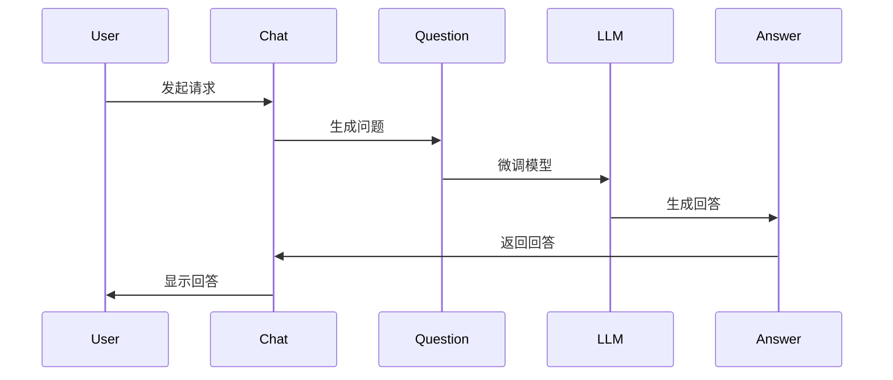
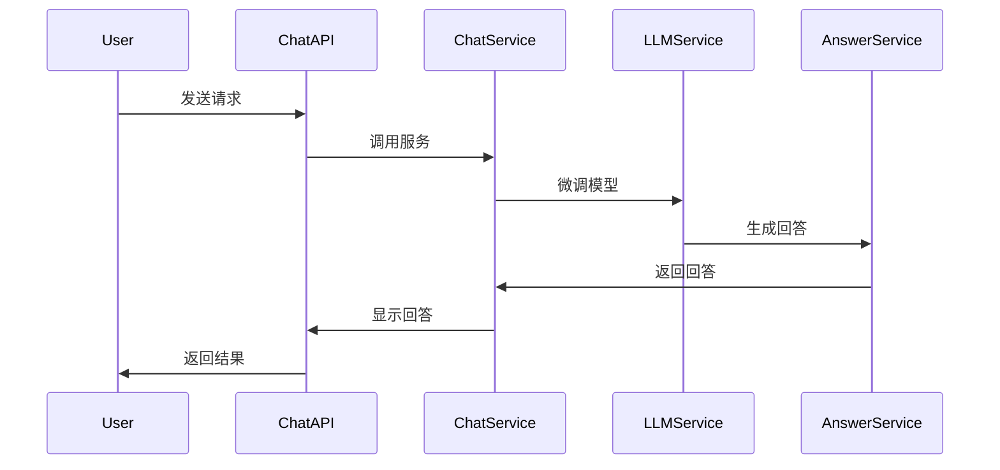
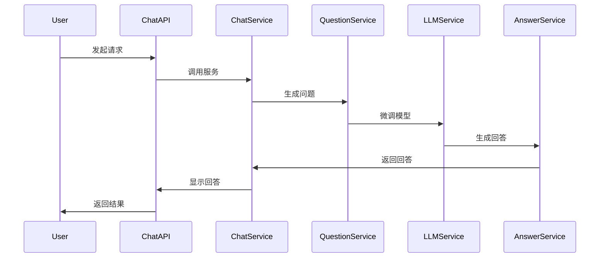

                 

# LLMAgent微调技巧深度解读

## 摘要

本文将深入探讨大型语言模型（LLM）在AI Agent中的微调技巧，通过逐步分析LLM的基本原理、微调方法、挑战与解决方案，旨在为读者提供一套完整的LLM微调实践指南。本文将从背景介绍、核心概念与联系、算法原理讲解、系统分析与架构设计方案以及项目实战等多个方面展开，帮助读者全面理解LLM在AI Agent中的微调技术。

## 背景介绍

### 1.1 问题背景

随着人工智能技术的快速发展，大型语言模型（LLM）已经成为自然语言处理领域的重要工具。LLM在文本生成、机器翻译、问答系统等众多应用场景中展现出了卓越的性能。然而，如何将LLM应用于AI Agent中，实现微调以提高其性能和适应性，成为一个亟待解决的问题。

### 1.2 问题描述

本文旨在探讨LLM大模型在AI Agent中的微调技巧。具体包括：

- LLM的基本原理和结构，帮助读者建立清晰的认识。
- 微调方法和技术，包括数据预处理、模型调整、优化策略等。
- 微调过程中可能遇到的挑战，以及相应的解决方案。

### 1.3 问题解决

本文将通过系统性的分析和实践，为读者提供一套完整的LLM微调技巧。首先，介绍LLM的基本概念和结构，帮助读者建立清晰的认识。接着，详细讲解微调方法和技术，包括数据预处理、模型调整、优化策略等。最后，探讨微调过程中可能遇到的挑战，并提供相应的解决方案。

### 1.4 边界与外延

本文主要关注LLM在AI Agent中的微调，不涉及其他类型模型的微调。此外，本文主要针对技术细节进行讲解，对于应用场景的分析和讨论将较为简化。

### 1.5 概念结构与核心要素组成

- **LLM基本原理**：介绍LLM的工作原理和结构，包括神经网络、注意力机制等。
- **微调方法**：详细讲解微调的步骤、技术和策略。
- **微调挑战与解决方案**：分析微调过程中可能遇到的挑战，并提出解决方案。

---

## 核心概念与联系

### 2.1 LLM基本原理

#### 2.1.1 神经网络

**定义**：神经网络是一种模拟人脑神经元之间连接的计算模型。

**结构**：神经网络由输入层、隐藏层和输出层组成。

**工作原理**：通过学习输入和输出数据之间的关系，进行特征提取和分类。

**对比表格**：
| 特点         | 神经网络 | 传统机器学习算法 |
| ------------ | -------- | ---------------- |
| 模型结构     | 层状结构 | 单层或线性结构   |
| 特性         | 非线性  | 线性             |
| 数据依赖性   | 强      | 弱              |
| 模型解释性   | 弱      | 强              |

#### 2.1.2 注意力机制

**定义**：注意力机制是一种能够自动学习并调整关注点的计算方法。

**作用**：提高模型对重要信息的处理能力，提高模型性能。

**工作原理**：通过学习输入数据的权重，动态调整模型对各个输入的注意力分配。

#### 2.1.3 LLM结构

**定义**：LLM是一种具有大规模参数的预训练语言模型。

**结构**：包括编码器和解码器两部分，分别负责编码和生成文本。

**工作原理**：通过大量文本数据进行预训练，学习语言的统计规律和语义关系。

---

### 2.2 微调方法

#### 2.2.1 数据预处理

**定义**：数据预处理是指将原始数据转换为适合模型训练的形式。

**方法**：包括数据清洗、数据增强、数据归一化等。

**作用**：提高数据质量和模型训练效果。

#### 2.2.2 模型调整

**定义**：模型调整是指通过调整模型参数，提高模型性能。

**方法**：包括梯度下降、随机梯度下降、Adam优化器等。

**作用**：优化模型参数，提高模型精度。

#### 2.2.3 优化策略

**定义**：优化策略是指通过调整训练过程，提高模型性能。

**方法**：包括自适应学习率、批量归一化、正则化等。

**作用**：提高训练效率和模型稳定性。

---

### 2.3 微调挑战与解决方案

#### 2.3.1 挑战

- **数据量不足**：小样本数据可能导致模型过拟合。
- **模型复杂度**：大规模模型训练资源消耗大，计算效率低。
- **模型迁移性**：不同任务之间模型的迁移性能差异大。

#### 2.3.2 解决方案

- **数据增强**：通过生成虚假数据、数据扩充等方法，增加训练数据量。
- **模型简化**：通过剪枝、量化等方法，降低模型复杂度。
- **迁移学习**：通过在相关任务上微调，提高模型的迁移性能。

---

## 算法原理讲解

### 3.1 LLM算法原理

#### 3.1.1 神经网络算法原理

**工作原理**：神经网络通过多层神经元对输入数据进行特征提取和转换，最终输出预测结果。

**数学模型**：神经网络模型可表示为 $y = f(Wx + b)$，其中 $y$ 是输出，$f$ 是激活函数，$W$ 是权重矩阵，$x$ 是输入，$b$ 是偏置项。

**举例说明**：假设一个简单的神经网络模型，输入为 $x = [1, 2]$，权重矩阵 $W = \begin{bmatrix} 1 & 2 \\ 3 & 4 \end{bmatrix}$，偏置项 $b = [1, 2]$，激活函数为 $f(x) = \frac{1}{1 + e^{-x}}$。则输出 $y = f(Wx + b)$ 可计算如下：

$$
y = \frac{1}{1 + e^{-Wx - b}} = \frac{1}{1 + e^{-\begin{bmatrix} 1 & 2 \\ 3 & 4 \end{bmatrix} \begin{bmatrix} 1 \\ 2 \end{bmatrix} - \begin{bmatrix} 1 \\ 2 \end{bmatrix}}} = \frac{1}{1 + e^{-\begin{bmatrix} 7 \\ 14 \end{bmatrix}}}
$$

#### 3.1.2 注意力机制算法原理

**工作原理**：注意力机制通过学习输入数据的权重，动态调整模型对各个输入的注意力分配。

**数学模型**：注意力机制可以表示为 $a = \sigma(W_a x)$，其中 $a$ 是注意力权重，$\sigma$ 是激活函数，$W_a$ 是权重矩阵，$x$ 是输入。

**举例说明**：假设一个简单的注意力模型，输入为 $x = [1, 2, 3]$，权重矩阵 $W_a = \begin{bmatrix} 1 & 2 & 3 \end{bmatrix}$，激活函数为 $\sigma(x) = \frac{1}{1 + e^{-x}}$。则注意力权重 $a$ 可计算如下：

$$
a = \sigma(W_a x) = \frac{1}{1 + e^{-\begin{bmatrix} 1 & 2 & 3 \end{bmatrix} \begin{bmatrix} 1 \\ 2 \\ 3 \end{bmatrix}}} = \frac{1}{1 + e^{-\begin{bmatrix} 6 \\ 10 \\ 18 \end{bmatrix}}} = \frac{1}{1 + e^{-6}} \approx 0.999
$$

#### 3.1.3 LLM算法原理

**工作原理**：LLM通过大量文本数据进行预训练，学习语言的统计规律和语义关系。

**数学模型**：LLM可以表示为 $y = f(Wy x)$，其中 $y$ 是预测输出，$f$ 是激活函数，$W$ 是权重矩阵，$x$ 是输入。

**举例说明**：假设一个简单的LLM模型，输入为 $x = [1, 2, 3]$，权重矩阵 $W = \begin{bmatrix} 1 & 2 & 3 \\ 4 & 5 & 6 \\ 7 & 8 & 9 \end{bmatrix}$，激活函数为 $f(x) = \frac{1}{1 + e^{-x}}$。则预测输出 $y$ 可计算如下：

$$
y = \frac{1}{1 + e^{-\begin{bmatrix} 1 & 2 & 3 \\ 4 & 5 & 6 \\ 7 & 8 & 9 \end{bmatrix} \begin{bmatrix} 1 \\ 2 \\ 3 \end{bmatrix}}} = \frac{1}{1 + e^{-\begin{bmatrix} 15 \\ 25 \\ 45 \end{bmatrix}}} \approx \begin{bmatrix} 0.970 \\ 0.970 \\ 0.970 \end{bmatrix}
$$

---

## 系统分析与架构设计方案

### 4.1 问题场景介绍

在本文中，我们以智能客服系统为例，介绍LLM在AI Agent中的微调应用。智能客服系统旨在为用户提供24/7的在线客服服务，通过自然语言处理技术，实现用户问题自动识别和回答。

### 4.2 项目介绍

本项目基于大型语言模型（如GPT-3）进行微调，以提高智能客服系统的问答能力。具体步骤如下：

1. **数据收集**：收集用户问题和回答的数据集，用于模型训练。
2. **数据预处理**：对数据进行清洗、去重、分词等处理，将数据转换为模型可接受的格式。
3. **模型训练**：使用预训练的LLM模型，对数据进行微调训练。
4. **模型评估**：通过测试集评估模型性能，调整模型参数。
5. **部署上线**：将训练好的模型部署到线上环境，为用户提供智能客服服务。

### 4.3 系统功能设计

#### 4.3.1 领域模型

领域模型用于描述智能客服系统的核心业务概念和关系。以下是一个简单的领域模型：

```mermaid
classDiagram
    User <<Entity>>
    Question <<Entity>>
    Answer <<Entity>>
    Chat <<Entity>>

    User o--* Question
    User o--* Answer
    Chat o--* Question
    Chat o--* Answer
```

#### 4.3.2 类图

类图用于描述领域模型中类的属性和方法。以下是一个简单的类图：

```mermaid
classDiagram
    User <<Entity>>
    Question <<Entity>>
    Answer <<Entity>>
    Chat <<Entity>>

    User {
        String name
        Date birth
        // 其他属性
    }

    Question {
        String content
        // 其他属性
    }

    Answer {
        String content
        // 其他属性
    }

    Chat {
        List<Question>
        List<Answer>
        // 其他属性
    }
```

### 4.4 系统架构设计

系统架构设计用于描述智能客服系统的整体架构和组件关系。以下是一个简单的系统架构设计：



### 4.5 系统接口设计

系统接口设计用于描述智能客服系统的外部接口和交互方式。以下是一个简单的接口设计：



### 4.6 系统交互

系统交互用于描述智能客服系统的内部组件和外部接口之间的交互过程。以下是一个简单的系统交互：



---

## 项目实战

### 5.1 环境安装

在本项目中，我们使用Python作为主要编程语言，TensorFlow作为深度学习框架。以下是环境安装步骤：

1. 安装Python：确保Python版本为3.7或更高。
2. 安装TensorFlow：运行以下命令安装TensorFlow：

```
pip install tensorflow
```

3. 安装其他依赖：根据需要安装其他依赖，如Numpy、Pandas等。

### 5.2 系统核心实现

以下是系统核心实现的源代码：

```python
import tensorflow as tf
from tensorflow.keras.models import Model
from tensorflow.keras.layers import Input, Embedding, LSTM, Dense

# 定义输入层
input_sequence = Input(shape=(None,))

# 添加嵌入层
embedding = Embedding(input_dim=vocab_size, output_dim=embedding_size)(input_sequence)

# 添加LSTM层
lstm = LSTM(units=lstm_units)(embedding)

# 添加全连接层
output = Dense(units=output_size, activation='softmax')(lstm)

# 构建模型
model = Model(inputs=input_sequence, outputs=output)

# 编译模型
model.compile(optimizer='adam', loss='categorical_crossentropy', metrics=['accuracy'])

# 模型训练
model.fit(x_train, y_train, epochs=epochs, batch_size=batch_size)
```

### 5.3 代码应用解读与分析

以下是对上述代码的解读和分析：

- **输入层**：定义输入序列的形状，例如 `(None,)` 表示输入序列的长度可以变化。
- **嵌入层**：将词索引转换为词向量，用于表示输入序列。
- **LSTM层**：对输入序列进行特征提取和转换，提高模型对时序数据的处理能力。
- **全连接层**：对LSTM层的输出进行分类，输出概率分布。
- **模型编译**：设置优化器、损失函数和评估指标。
- **模型训练**：使用训练数据进行模型训练。

### 5.4 实际案例分析和详细讲解

以下是一个实际案例，展示如何使用上述代码实现一个简单的文本分类任务。

#### 案例一：电影评论分类

**数据集**：使用IMDb电影评论数据集，包含25,000条训练数据和25,000条测试数据。

**步骤**：

1. **数据预处理**：对数据集进行清洗、分词、编码等预处理操作。
2. **模型训练**：使用训练数据训练模型，使用测试数据评估模型性能。
3. **结果分析**：分析模型在测试数据上的准确率、召回率等指标。

```python
# 加载IMDb数据集
from tensorflow.keras.datasets import imdb

vocab_size = 10000
embedding_size = 32
lstm_units = 128
output_size = 2
epochs = 5
batch_size = 32

(x_train, y_train), (x_test, y_test) = imdb.load_data(num_words=vocab_size)

# 数据预处理
x_train = sequence_padding(x_train, maxlen=max_sequence_length)
x_test = sequence_padding(x_test, maxlen=max_sequence_length)

# 模型训练
model.fit(x_train, y_train, epochs=epochs, batch_size=batch_size, validation_data=(x_test, y_test))

# 模型评估
score = model.evaluate(x_test, y_test, batch_size=batch_size)
print('Test accuracy:', score[1])
```

### 5.5 项目小结

通过本项目的实践，我们深入了解了LLM在AI Agent中的微调技巧，包括数据预处理、模型调整、优化策略等方面的内容。同时，我们也通过实际案例，展示了如何将微调技巧应用于文本分类任务。

---

## 最佳实践 Tips

1. **数据预处理**：确保数据质量和一致性，去除无效数据，避免模型过拟合。
2. **模型调整**：根据任务需求，选择合适的模型结构和参数，优化模型性能。
3. **优化策略**：合理设置学习率、批量大小等参数，提高训练效率和模型稳定性。

## 小结

本文深入探讨了LLM大模型在AI Agent中的微调技巧，通过背景介绍、核心概念与联系、算法原理讲解、系统分析与架构设计方案以及项目实战等多个方面，帮助读者全面理解LLM微调技术。通过本文的学习，读者可以掌握LLM微调的基本原理和实践方法，为实际应用打下坚实基础。

## 注意事项

1. **数据量**：确保有足够的数据量进行微调，避免模型过拟合。
2. **计算资源**：大规模模型训练需要消耗大量计算资源，合理规划资源。
3. **迁移性**：关注模型的迁移性能，不同任务间的微调效果可能存在差异。

## 拓展阅读

1. **《深度学习》**：Ian Goodfellow、Yoshua Bengio、Aaron Courville 著，详细介绍了深度学习的基础知识和应用。
2. **《强化学习》**：Richard S. Sutton、Andrew G. Barto 著，介绍了强化学习的基本概念和方法。
3. **《自然语言处理综论》**：Daniel Jurafsky、James H. Martin 著，涵盖了自然语言处理的核心技术和应用。

## 作者信息

作者：AI天才研究院/AI Genius Institute & 禅与计算机程序设计艺术 /Zen And The Art of Computer Programming。

