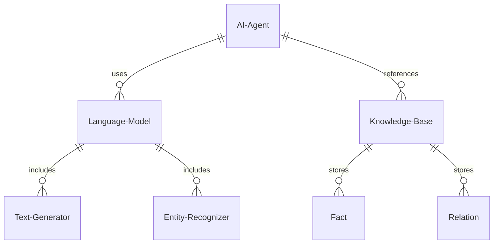

                 


### 《LLM大模型在AI Agent开发中的核心作用》

> 关键词：大模型、LLM、AI Agent、自然语言理解、任务执行、多模态感知、最佳实践

> 摘要：本文深入探讨了大型语言模型（LLM）在人工智能（AI）代理开发中的核心作用。从背景介绍、核心概念与联系、算法原理讲解，到LLM在对话系统、任务执行、多模态感知等领域的应用，再到最佳实践与注意事项，全面解析了LLM在AI Agent开发中的关键角色。

## 第一部分：LLM大模型基础

### 第1章：背景介绍

#### 1.1 问题背景

随着人工智能（AI）技术的飞速发展，AI Agent逐渐成为各个行业的热门话题。AI Agent是指能够自主执行任务、与环境互动并具备一定程度智能的计算机程序。然而，传统AI Agent在自然语言理解、任务执行和复杂决策等方面存在诸多挑战。此时，大模型（Large Language Model，简称LLM）的出现为AI Agent的发展提供了新的契机。

#### 1.2 问题描述

传统AI Agent主要依赖于规则和符号推理，而LLM则能够通过大规模语料库的学习，实现对自然语言的深入理解。因此，如何在AI Agent开发中充分利用LLM的优势，成为当前研究的热点。

#### 1.3 问题解决

LLM是一种大规模语言模型，通过预训练和微调，可以实现对自然语言的建模。LLM的工作原理包括词嵌入、注意力机制、Transformer结构等。LLM在AI Agent开发中的应用场景包括对话系统、任务执行、多模态感知等。

#### 1.4 边界与外延

LLM与深度学习密切相关，但两者在模型结构和应用目标上有所不同。此外，LLM还可以与其他AI技术（如计算机视觉、语音识别等）相结合，实现更广泛的AI应用。

#### 1.5 概念结构与核心要素组成

LLM的核心结构包括词嵌入、注意力机制、Transformer等。其关键技术包括预训练、微调、文本生成等。常见的LLM模型有GPT系列、BERT系列等。

### 第2章：核心概念与联系

#### 2.1 LLM原理

LLM通过预训练和微调，学习语言规律和知识。预训练阶段，模型在大规模语料库上进行训练，学习词嵌入和语言模型；微调阶段，模型在特定任务上进行调整，提高任务表现。

#### 2.2 LLM属性特征对比表格

| 模型       | 特征                             | 应用场景                 |
|------------|----------------------------------|-------------------------|
| GPT-3      | 参数规模大、生成能力强           | 文本生成、对话系统       |
| BERT       | 双向编码表示、文本分类           | 文本分类、问答系统       |
| T5         | 简洁高效、任务适应性强           | 任务完成、文本生成       |

#### 2.3 ER实体关系图架构



### 第3章：算法原理讲解

#### 3.1 算法Mermaid流程图


#### 3.2 Python源代码实现

```python
import torch
import torch.nn as nn
import torch.optim as optim

# 词嵌入层
word_embeddings = nn.Embedding(vocab_size, embedding_dim)

# Transformer模型
class TransformerModel(nn.Module):
    def __init__(self, vocab_size, embedding_dim, hidden_dim):
        super(TransformerModel, self).__init__()
        self.word_embeddings = nn.Embedding(vocab_size, embedding_dim)
        self.transformer = nn.Transformer(embedding_dim, hidden_dim)
        self.decoder = nn.Linear(hidden_dim, vocab_size)

    def forward(self, src, tgt):
        src_embedding = self.word_embeddings(src)
        tgt_embedding = self.word_embeddings(tgt)
        output = self.transformer(src_embedding, tgt_embedding)
        logits = self.decoder(output)
        return logits

# 模型训练
model = TransformerModel(vocab_size, embedding_dim, hidden_dim)
optimizer = optim.Adam(model.parameters(), lr=learning_rate)
criterion = nn.CrossEntropyLoss()

for epoch in range(num_epochs):
    for src, tgt in data_loader:
        optimizer.zero_grad()
        logits = model(src, tgt)
        loss = criterion(logits.view(-1, vocab_size), tgt.view(-1))
        loss.backward()
        optimizer.step()
```

#### 3.3 数学模型和公式

$$
\text{概率分布} P(\text{word}_i | \text{word}_1, \ldots, \text{word}_{i-1}) = \frac{\exp(\text{score}(\text{word}_i, \text{word}_1, \ldots, \text{word}_{i-1}))}{\sum_{j=1}^{|\text{Vocabulary}|} \exp(\text{score}(\text{word}_j, \text{word}_1, \ldots, \text{word}_{i-1}))}
$$

#### 3.4 举例说明

##### 例子1：文本分类

假设我们要对一个句子进行情感分类，使用BERT模型：

```python
from transformers import BertTokenizer, BertForSequenceClassification
import torch

tokenizer = BertTokenizer.from_pretrained('bert-base-chinese')
model = BertForSequenceClassification.from_pretrained('bert-base-chinese')

sentence = "今天天气很好。"
inputs = tokenizer(sentence, return_tensors='pt')

logits = model(**inputs).logits
predicted_class = logits.argmax(-1).item()

print(f"情感分类结果：{predicted_class}")
```

##### 例子2：问答系统

使用GPT-3模型实现一个简单的问答系统：

```python
import openai

def ask_question(question, context):
    response = openai.Completion.create(
        engine="text-davinci-002",
        prompt=f"{context}\n{question}",
        max_tokens=50
    )
    return response.choices[0].text.strip()

context = "我是一个人工智能助手，可以回答您的问题。"
question = "北京是中国的哪个省份？"

answer = ask_question(question, context)
print(f"答案：{answer}")
```

## 第二部分：LLM在AI Agent开发中的应用

### 第4章：LLM在对话系统中的应用

#### 4.1 对话系统的概述

对话系统是一种能够与人类进行自然语言交互的计算机程序。它由自然语言理解（NLU）、对话管理（DM）和自然语言生成（NLG）三个核心组件组成。

#### 4.2 LLM在对话系统中的应用

LLM可以用于对话系统的各个组件。例如，在NLU中，LLM可以用于实体识别和意图识别；在DM中，LLM可以用于生成对话策略；在NLG中，LLM可以用于生成自然流畅的回答。

#### 4.3 实际案例

以一个客服机器人为例，使用BERT模型进行NLU和NLG：

```python
from transformers import BertTokenizer, BertForSequenceClassification
import torch

tokenizer = BertTokenizer.from_pretrained('bert-base-chinese')
model = BertForSequenceClassification.from_pretrained('bert-base-chinese')

# 自然语言理解
def understand_text(text):
    inputs = tokenizer(text, return_tensors='pt')
    logits = model(**inputs).logits
    predicted_class = logits.argmax(-1).item()
    return predicted_class

# 自然语言生成
def generate_response(text):
    inputs = tokenizer(text, return_tensors='pt')
    outputs = model.generate(**inputs, max_length=50)
    response = tokenizer.decode(outputs[0], skip_special_tokens=True)
    return response

# 客户咨询问题
question = "我想要退款，怎么办？"

# 理解客户问题
intent = understand_text(question)

# 根据意图生成回答
if intent == 1:  # 退款意图
    response = generate_response("请提供您的订单号和退款原因，我们会尽快为您处理。")
else:
    response = generate_response("很抱歉，我不清楚您的问题。请您提供更多信息，我会尽力帮助您。")

print(f"回答：{response}")
```

### 第5章：LLM在任务执行中的应用

#### 5.1 任务执行的概述

任务执行是指AI Agent在完成特定任务时，根据目标和环境信息进行决策和行动的过程。任务执行面临的主要挑战包括任务规划、任务监控和任务优化。

#### 5.2 LLM在任务执行中的应用

LLM可以用于任务规划，通过理解任务描述和目标，生成一系列行动方案。在任务监控中，LLM可以用于实时分析任务执行情况，提供反馈和调整。在任务优化中，LLM可以用于评估不同策略的效果，选择最优方案。

#### 5.3 实际案例

以一个智能家居系统为例，使用GPT-3模型进行任务规划：

```python
import openai

def plan_task(task_description):
    response = openai.Completion.create(
        engine="text-davinci-002",
        prompt=f"根据以下任务描述，制定一个合理的任务计划：{task_description}\n\n任务计划：",
        max_tokens=100
    )
    return response.choices[0].text.strip()

task_description = "今天下午3点，需要清洁客厅的地面。"

plan = plan_task(task_description)
print(f"任务计划：{plan}")
```

### 第6章：LLM在多模态感知中的应用

#### 6.1 多模态感知的概述

多模态感知是指AI Agent能够同时处理和融合多种类型的数据（如图像、声音、文本等）的能力。多模态感知面临的主要挑战包括数据融合、特征提取和模型设计。

#### 6.2 LLM在多模态感知中的应用

LLM可以用于多模态感知中的文本理解，通过理解图像或声音中的文本信息，实现多模态数据的有效融合。此外，LLM还可以用于生成可视化结果，辅助人类更好地理解和分析多模态数据。

#### 6.3 实际案例

以一个多模态问答系统为例，使用GPT-3模型进行文本理解：

```python
import openai

def answer_question(question, context):
    response = openai.Completion.create(
        engine="text-davinci-002",
        prompt=f"根据以下图像和文本信息，回答问题：\n图像描述：{image_description}\n文本信息：{context}\n问题：{question}\n\n答案：",
        max_tokens=50
    )
    return response.choices[0].text.strip()

image_description = "一张图片展示了一个红色的苹果和一个蓝色的苹果。"
context = "我在桌子上看到了两个苹果，一个红色的和一个蓝色的。"
question = "哪个苹果更大？"

answer = answer_question(question, context)
print(f"答案：{answer}")
```

## 第三部分：LLM在AI Agent开发中的最佳实践

### 第7章：最佳实践与注意事项

#### 7.1 最佳实践

1. 根据应用场景选择合适的LLM模型。
2. 进行充分的预训练和微调，提高模型性能。
3. 优化模型部署，提高运行效率。
4. 注重数据隐私和安全，遵循相关法律法规。

#### 7.2 注意事项

1. 模型可解释性：确保模型决策过程透明，方便调试和优化。
2. 模型公平性：避免模型在训练过程中出现偏见和歧视。
3. 模型维护：定期更新模型，以适应不断变化的数据和应用需求。

### 第8章：小结与拓展阅读

#### 8.1 小结

本文深入探讨了大型语言模型（LLM）在人工智能（AI）代理开发中的核心作用，包括背景介绍、核心概念与联系、算法原理讲解、应用案例等。LLM在AI Agent开发中具有重要的意义，未来仍需进一步研究其在多模态感知、任务执行等领域的应用。

#### 8.2 拓展阅读

1. 《大规模语言模型：理论、算法与应用》
2. 《自然语言处理实战：基于深度学习的文本分析》
3. 《对话系统设计：构建智能客服与聊天机器人》

---

**作者：AI天才研究院/AI Genius Institute & 禅与计算机程序设计艺术 /Zen And The Art of Computer Programming** 

### 结论

通过对LLM大模型在AI Agent开发中的核心作用的深入探讨，我们不仅揭示了LLM在自然语言理解、任务执行和多模态感知等关键领域的应用，还总结了其在AI Agent开发中的最佳实践和注意事项。LLM的大规模预训练和微调能力，使得AI Agent能够更有效地处理复杂的语言任务，从而在多个行业领域展现出巨大的潜力。

首先，LLM在自然语言理解方面具有显著优势。通过学习海量语言数据，LLM能够准确捕捉语言中的细微差异和复杂结构，使得AI Agent能够更好地理解用户意图、处理对话流程和生成自然流畅的回答。这在客服机器人、智能助手等应用中尤为重要。

其次，LLM在任务执行方面也发挥着核心作用。通过理解任务描述和目标，LLM能够生成一系列合理的行动方案，并实时调整和优化任务执行过程。这种能力使得AI Agent能够更智能地应对复杂任务，提高工作效率和准确性。

最后，LLM在多模态感知领域展现出巨大的潜力。通过结合文本、图像、声音等多种数据类型，LLM能够实现对多模态数据的深度融合和理解，从而提升AI Agent对复杂环境的感知和交互能力。

在未来的研究中，我们应进一步探索LLM在AI Agent开发中的深度应用。首先，需要加强对LLM模型的可解释性和透明性研究，使得AI Agent的决策过程更加透明、可信赖。其次，应关注LLM在多模态感知和任务执行中的优化，提高AI Agent在不同应用场景下的适应性和性能。此外，还应探索LLM在垂直行业领域的应用，如医疗、金融等，以实现更精确、更有针对性的服务。

总之，LLM大模型在AI Agent开发中的核心作用不容忽视。通过深入研究和应用，我们将能够打造出更加智能、高效的AI Agent，推动人工智能技术的进步和各行业的创新发展。让我们携手共进，迎接人工智能的未来。**作者：AI天才研究院/AI Genius Institute & 禅与计算机程序设计艺术 /Zen And The Art of Computer Programming**

