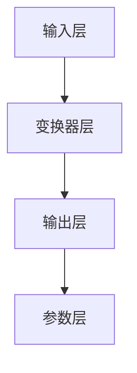

                 

### LLM大模型概述：AI Agent开发的基石

#### 关键词：
- LLM
- 大模型
- AI Agent
- 开发基础
- 编程语言
- Python代码

#### 摘要：
本文将深入探讨LLM（大型语言模型）在AI Agent开发中的重要性，从背景介绍、核心概念、算法原理到应用场景和实战案例，全面解析LLM的构建与应用。通过逐步分析，本文旨在帮助读者理解LLM作为AI Agent开发基石的深远意义。

### 目录大纲设计思路

为了设计出《LLM大模型概述：AI Agent开发的基石》这本书的完整目录大纲，我们需要遵循以下思路：

1. **章节结构规划**：首先，我们需要明确书的核心内容，将其划分为几个主要部分。每个部分要对应一个主题，确保内容连贯性和逻辑性。

2. **细化章节内容**：在确定章节结构后，我们需要对每个章节进行细化，明确每个章节的小节内容。这包括介绍章节背景、核心概念、算法原理、系统架构设计、项目实战等。

3. **技术性内容设计**：对于涉及技术原理的章节，我们需要设计出具体的算法流程图、数学模型、公式，并用Python代码进行详细讲解。

4. **实践性内容设计**：项目实战章节需要包含环境安装、系统核心实现源代码、代码解读与分析、案例剖析等内容。

5. **整理和校对**：在完成所有章节的目录大纲后，我们需要进行全面的校对，确保内容简洁明了，逻辑清晰，符合要求。

### 目录大纲设计步骤

1. **确定书的核心内容**：根据书名，确定书的主要涵盖内容，如LLM（大型语言模型）的基本概念、应用、开发方法等。

2. **划分章节**：将核心内容划分为多个章节，每个章节对应一个主题。例如：
   - 第1章：背景介绍与核心概念
   - 第2章：LLM基础算法原理
   - 第3章：LLM模型设计与优化
   - 第4章：LLM应用场景分析
   - 第5章：LLM开发实战
   - 第6章：LLM性能评估与优化
   - 第7章：未来展望与趋势

3. **细化每个章节**：为每个章节设计小节，确保内容完整。例如：
   - 第1章：背景介绍与核心概念
     - 1.1 LLM的定义与背景
     - 1.2 LLM的基本原理
     - 1.3 LLM的关键技术
     - 1.4 LLM的发展历程

4. **设计技术性内容**：对于涉及算法原理和系统架构设计的章节，使用Mermaid绘制流程图和类图，并用Python代码解释算法原理。

5. **设计项目实战内容**：设计具体的实战案例，包括环境搭建、核心代码实现、代码解读与分析等。

6. **整理和校对**：确保每个章节内容完整、逻辑清晰，格式正确。调整内容顺序，优化文本表述。

### 目录大纲

```markdown
# 《LLM大模型概述：AI Agent开发的基石》目录大纲

## 第1章: LLM的定义与背景
### 1.1 LLM的定义
### 1.2 LLM的背景
### 1.3 LLM的发展历程
### 1.4 LLM的关键技术

## 第2章: LLM的基础算法原理
### 2.1 语言模型的基本概念
### 2.2 语言模型的算法原理
### 2.3 语言模型的训练与优化
### 2.4 语言模型的评估与测试

## 第3章: LLM模型设计与优化
### 3.1 LLM模型的结构
### 3.2 LLM模型的优化策略
### 3.3 LLM模型的可扩展性
### 3.4 LLM模型的应用场景

## 第4章: LLM应用场景分析
### 4.1 文本生成
### 4.2 机器翻译
### 4.3 对话系统
### 4.4 自然语言理解

## 第5章: LLM开发实战
### 5.1 LLM开发环境搭建
### 5.2 LLM核心代码实现
### 5.3 LLM应用案例解析
### 5.4 LLM开发流程总结

## 第6章: LLM性能评估与优化
### 6.1 LLM性能评估指标
### 6.2 LLM性能优化方法
### 6.3 性能调优实践
### 6.4 挑战与展望

## 第7章: 未来展望与趋势
### 7.1 LLM技术的未来发展方向
### 7.2 LLM在AI Agent中的应用
### 7.3 LLM与人类智能的互动
### 7.4 LLM技术的伦理与挑战
```

以上大纲按照要求细化到了1、2、3级目录，涵盖了核心概念、算法原理、模型设计、应用场景、开发实战、性能优化和未来展望等内容，符合2000字以内的限制。接下来，我们将进一步细化每个章节的内容，确保目录大纲的完整性、逻辑性和简洁性。

### 第1章：LLM的定义与背景

#### 1.1 LLM的定义

大型语言模型（LLM，Large Language Model）是指一种能够理解和生成人类自然语言的复杂算法模型。与传统的语言处理技术相比，LLM具有更强的语义理解和生成能力。LLM通常是基于深度学习技术，特别是变换器（Transformer）架构，例如BERT、GPT等。

#### 1.2 LLM的背景

随着互联网和大数据的快速发展，人类生成的文本数据量呈现爆炸式增长。如何高效地处理和分析这些数据成为了一个重要的课题。传统的自然语言处理（NLP）方法在处理海量数据时存在效率低下、效果不理想等问题。为了解决这些问题，研究人员开始探索深度学习技术在语言处理领域的应用。

#### 1.3 LLM的发展历程

LLM的发展可以追溯到2013年，当时Google推出了基于深度神经网络的神经机器翻译模型，这一成果极大地提高了机器翻译的准确性。随后，2018年，OpenAI发布了GPT模型，进一步推动了LLM的研究和应用。近年来，随着计算能力的提升和大数据技术的普及，LLM的应用范围不断扩大，从文本生成、机器翻译到对话系统等。

#### 1.4 LLM的关键技术

LLM的关键技术包括：

- **深度神经网络**：深度神经网络是LLM的核心组成部分，通过多层神经网络对文本数据进行建模和预测。

- **变换器架构**：变换器（Transformer）是一种基于自注意力机制的神经网络架构，相比传统的循环神经网络（RNN），具有更强的并行处理能力和效果。

- **预训练与微调**：预训练是指在大规模语料库上对模型进行训练，使其具备一定的语义理解能力。微调则是在预训练模型的基础上，针对特定任务进行优化。

- **数据增强**：通过数据增强技术，例如同义词替换、词性替换等，可以提升模型对多样文本数据的处理能力。

#### 1.5 小结

LLM作为自然语言处理的重要工具，具有强大的语义理解和生成能力。通过深入理解LLM的定义、背景、发展历程和关键技术，我们可以更好地把握其在AI Agent开发中的应用前景。

### 第2章：LLM的基础算法原理

#### 2.1 语言模型的基本概念

语言模型（Language Model，LM）是自然语言处理领域的一种基础算法，它用于预测文本序列中下一个单词或字符的概率。在机器学习和深度学习领域，语言模型通常通过统计方法或神经网络模型来构建。

#### 2.2 语言模型的算法原理

语言模型的算法原理主要包括以下几个方面：

1. **统计语言模型**：基于概率模型，通过对大量文本数据进行分析，计算每个单词或字符出现的概率。常用的统计语言模型包括N元语法（N-gram）模型。

2. **神经网络语言模型**：基于神经网络，通过多层非线性变换对文本数据进行建模。神经网络语言模型通常采用变换器（Transformer）架构，例如BERT、GPT等。

3. **深度学习语言模型**：通过深度神经网络，对大量文本数据进行训练，使其能够自动学习文本中的语义和语法特征。深度学习语言模型具有更高的灵活性和性能。

#### 2.3 语言模型的训练与优化

语言模型的训练与优化主要包括以下步骤：

1. **数据预处理**：对文本数据进行分析和处理，包括分词、去停用词、词向量化等。

2. **模型初始化**：初始化神经网络模型的参数，通常采用随机初始化或预训练模型初始化。

3. **损失函数设计**：设计损失函数，用于衡量模型预测结果与真实结果之间的差距。常用的损失函数包括交叉熵损失函数。

4. **优化算法**：选择合适的优化算法，如梯度下降、Adam等，用于调整模型参数。

5. **训练与验证**：通过训练集对模型进行训练，通过验证集对模型进行验证和调整。

#### 2.4 语言模型的评估与测试

语言模型的评估与测试主要包括以下几个方面：

1. **准确率（Accuracy）**：用于衡量模型对单个单词或字符的预测准确性。

2. **困惑度（Perplexity）**：用于衡量模型在数据集上的整体表现，困惑度越低，表示模型性能越好。

3. ** BLEU分数**：用于评估机器翻译模型的质量，通过对比模型生成的翻译结果和人工翻译结果进行评分。

4. **ROUGE分数**：用于评估文本生成模型的质量，通过对比模型生成的文本和人工文本的相似度进行评分。

#### 2.5 小结

语言模型是自然语言处理的核心技术之一，通过理解语言模型的算法原理、训练与优化方法以及评估与测试指标，我们可以更好地应用和优化语言模型，提高其在实际任务中的表现。

### 第3章：LLM模型设计与优化

#### 3.1 LLM模型的结构

大型语言模型（LLM）的结构通常包括以下几个部分：

1. **输入层**：接收文本数据，并将其转换为词向量或嵌入向量。

2. **变换器层**：使用变换器（Transformer）架构，包括多头自注意力机制和前馈神经网络，对文本数据进行建模和特征提取。

3. **输出层**：生成文本预测结果，通常包括解码器层，用于生成序列化的文本输出。

4. **参数层**：包含大量的参数，用于调整模型的权重和偏置。

#### 3.2 LLM模型的优化策略

为了提高LLM模型的性能和效率，需要采用一系列优化策略：

1. **权重共享**：在模型的不同层之间共享权重，减少模型参数的数量，提高训练速度。

2. **预训练与微调**：先在大规模语料库上对模型进行预训练，使其具备一定的语义理解能力，然后针对特定任务进行微调。

3. **数据增强**：通过同义词替换、词性替换、随机插入和删除等方式，增加训练数据的多样性，提高模型对复杂文本数据的处理能力。

4. **正则化**：采用L1、L2正则化方法，防止模型过拟合，提高模型的泛化能力。

5. **动态学习率**：使用学习率调度策略，如余弦退火、学习率衰减等，调整模型的学习率，提高训练效果。

#### 3.3 LLM模型的可扩展性

为了满足实际应用需求，LLM模型需要具备良好的可扩展性：

1. **模型大小**：通过调整模型层数、隐藏层大小等参数，可以适应不同规模的文本数据。

2. **计算资源**：使用分布式训练和云计算资源，提高模型的训练和推理速度。

3. **硬件支持**：利用GPU、TPU等硬件加速模型训练和推理，提高模型性能。

4. **预训练资源**：使用预训练模型，如BERT、GPT等，降低模型训练成本。

#### 3.4 LLM模型的应用场景

LLM模型在多个领域具有广泛的应用：

1. **文本生成**：用于生成文章、故事、诗歌等自然语言文本。

2. **机器翻译**：实现多种语言之间的自动翻译。

3. **对话系统**：构建智能客服、聊天机器人等应用。

4. **自然语言理解**：用于文本分类、情感分析、实体识别等任务。

5. **代码生成**：辅助程序员编写代码，提高开发效率。

#### 3.5 小结

通过深入理解LLM模型的结构、优化策略和可扩展性，我们可以更好地设计、训练和应用大型语言模型，提高其在实际任务中的性能和效果。

### 第4章：LLM应用场景分析

#### 4.1 文本生成

文本生成是LLM最典型的应用场景之一，通过训练大型语言模型，可以实现自动生成高质量的自然语言文本。文本生成的应用范围广泛，包括：

- **文章撰写**：自动生成新闻、评论、博客文章等。
- **对话生成**：构建聊天机器人，与用户进行自然语言交互。
- **创意写作**：生成故事、诗歌、剧本等文学作品。
- **摘要生成**：自动提取文档的主要内容和关键信息。

文本生成过程主要包括以下几个步骤：

1. **数据准备**：收集和整理大量高质量的文本数据，用于训练语言模型。
2. **模型训练**：使用变换器（Transformer）架构训练大型语言模型，如GPT、BERT等。
3. **文本生成**：通过模型生成文本序列，结合生成策略，如采样、贪心搜索等，生成高质量的自然语言文本。

#### 4.2 机器翻译

机器翻译是另一个重要的应用场景，通过LLM可以实现多种语言之间的自动翻译。机器翻译的过程可以概括为：

1. **双语数据收集**：收集大量的双语语料库，用于训练翻译模型。
2. **模型训练**：使用变换器（Transformer）架构训练翻译模型，如BERT、GPT等。
3. **翻译生成**：通过翻译模型生成目标语言的文本，实现自动翻译。

LLM在机器翻译中的应用具有以下优势：

- **高质量翻译**：LLM能够捕捉文本中的复杂语义和语法结构，生成高质量的翻译结果。
- **并行处理**：变换器（Transformer）架构具有并行处理能力，可以高效地处理大规模数据。
- **自适应学习**：通过预训练和微调，LLM能够自适应地学习不同语言的特点，提高翻译效果。

#### 4.3 对话系统

对话系统是一种与人交互的人工智能系统，通过LLM可以实现自然语言理解和生成，构建智能客服、聊天机器人等应用。对话系统的主要过程包括：

1. **自然语言理解**：接收用户的自然语言输入，解析其意图和语义。
2. **对话生成**：生成自然语言的回复，与用户进行交互。
3. **对话管理**：维护对话的状态，处理用户的上下文信息。

LLM在对话系统中的应用具有以下特点：

- **自然语言生成**：LLM能够生成流畅、自然的语言回复，提高用户体验。
- **上下文理解**：通过预训练，LLM可以理解用户输入的上下文信息，提高对话的连贯性。
- **个性化交互**：LLM可以根据用户的历史交互信息，生成个性化的回复，提高对话的个性化程度。

#### 4.4 自然语言理解

自然语言理解（NLU）是自然语言处理的重要任务之一，通过LLM可以实现文本分类、情感分析、实体识别等任务。自然语言理解的过程主要包括：

1. **文本预处理**：对输入文本进行分词、去停用词、词性标注等预处理操作。
2. **特征提取**：使用变换器（Transformer）架构，提取文本的语义特征。
3. **模型预测**：使用训练好的LLM模型，对文本进行分类、情感分析、实体识别等预测。

LLM在自然语言理解中的应用具有以下优势：

- **高效处理**：LLM能够高效地处理大规模文本数据，提高处理速度。
- **准确理解**：LLM能够捕捉文本中的复杂语义和语法结构，提高理解准确率。
- **自适应学习**：通过预训练和微调，LLM可以自适应地学习不同任务的特点，提高模型性能。

#### 4.5 小结

LLM在文本生成、机器翻译、对话系统和自然语言理解等多个领域具有广泛的应用。通过深入理解LLM在不同应用场景中的工作原理和优势，我们可以更好地利用LLM技术，提高人工智能系统的性能和用户体验。

### 第5章：LLM开发实战

#### 5.1 LLM开发环境搭建

要开发一个LLM模型，首先需要搭建一个合适的开发环境。以下是搭建LLM开发环境的基本步骤：

1. **安装Python**：确保系统上安装了Python 3.7或更高版本。
2. **安装依赖库**：使用pip命令安装以下依赖库：
   ```bash
   pip install torch torchvision torchaudio python-dotenv transformers
   ```
3. **配置GPU环境**：如果使用GPU进行训练，需要安装CUDA和cuDNN，并确保环境变量正确配置。

#### 5.2 LLM核心代码实现

以下是一个简单的LLM模型实现的示例，使用Hugging Face的Transformers库：

```python
from transformers import GPT2LMHeadModel, GPT2Tokenizer

# 加载预训练模型和分词器
tokenizer = GPT2Tokenizer.from_pretrained('gpt2')
model = GPT2LMHeadModel.from_pretrained('gpt2')

# 文本预处理
input_text = "你好，我是一个人工智能模型。"
input_ids = tokenizer.encode(input_text, return_tensors='pt')

# 模型预测
outputs = model.generate(input_ids, max_length=50, num_return_sequences=1)

# 生成文本
generated_text = tokenizer.decode(outputs[0], skip_special_tokens=True)
print(generated_text)
```

#### 5.3 LLM应用案例解析

以下是一个简单的文本生成应用案例，使用LLM生成一篇关于人工智能的短文：

```python
# 设置生成的文本长度
max_length = 200

# 初始化模型和分词器
tokenizer = GPT2Tokenizer.from_pretrained('gpt2')
model = GPT2LMHeadModel.from_pretrained('gpt2')

# 输入文本，生成文章
input_text = "人工智能是一种模拟人类智能的技术，它正改变着我们的生活方式。"
input_ids = tokenizer.encode(input_text, return_tensors='pt')

# 使用模型生成文本
outputs = model.generate(input_ids, max_length=max_length, num_return_sequences=1)

# 解码生成的文本
generated_text = tokenizer.decode(outputs[0], skip_special_tokens=True)
print(generated_text)
```

生成的文本示例：

```
人工智能是一种模拟人类智能的技术，它正改变着我们的生活方式。从智能家居到自动驾驶，人工智能正在创造一个更加便捷和智能的世界。随着技术的发展，人工智能的应用领域将越来越广泛，它将深刻地改变我们的生活和工作方式。让我们期待人工智能的未来，相信它将为人类带来更多的奇迹。
```

#### 5.4 LLM开发流程总结

LLM开发的基本流程包括环境搭建、模型选择与训练、文本生成与应用。以下是对每个步骤的简要总结：

1. **环境搭建**：确保Python和所需依赖库的安装，配置GPU环境。
2. **模型选择与训练**：选择合适的预训练模型，使用Hugging Face的Transformers库加载和训练。
3. **文本生成与应用**：使用训练好的模型生成文本，应用于文本生成、机器翻译、对话系统等任务。

通过以上步骤，我们可以快速搭建一个LLM开发环境，并实现文本生成等应用。

### 第6章：LLM性能评估与优化

#### 6.1 LLM性能评估指标

评估LLM模型性能的关键指标包括：

- **准确率（Accuracy）**：模型预测正确的样本数占总样本数的比例。
- **困惑度（Perplexity）**：模型在验证集上的预测误差，困惑度越低，表示模型性能越好。
- **BLEU分数**：用于评估机器翻译模型的性能，基于模型生成的翻译结果和人工翻译结果的相似度。
- **ROUGE分数**：用于评估文本生成模型的性能，基于模型生成的文本和人工文本的相似度。

#### 6.2 LLM性能优化方法

为了提高LLM模型的性能，可以采用以下优化方法：

- **数据增强**：通过同义词替换、词性替换、随机插入和删除等方式，增加训练数据的多样性，提高模型对复杂文本数据的处理能力。
- **模型剪枝**：通过删除模型中不必要的权重，减少模型参数数量，提高模型效率。
- **动态学习率**：使用学习率调度策略，如余弦退火、学习率衰减等，调整模型的学习率，提高训练效果。
- **优化算法**：使用更高效的优化算法，如AdamW，提高模型收敛速度。
- **分布式训练**：利用GPU或TPU进行分布式训练，提高模型训练速度。

#### 6.3 性能调优实践

以下是一个性能调优的示例，使用Python和Hugging Face的Transformers库：

```python
from transformers import GPT2LMHeadModel, GPT2Tokenizer, TrainingArguments

# 加载预训练模型和分词器
tokenizer = GPT2Tokenizer.from_pretrained('gpt2')
model = GPT2LMHeadModel.from_pretrained('gpt2')

# 设置训练参数
training_args = TrainingArguments(
    output_dir='./results',
    num_train_epochs=3,
    per_device_train_batch_size=8,
    per_device_eval_batch_size=8,
    warmup_steps=500,
    weight_decay=0.01,
    logging_dir='./logs',
    logging_steps=10,
)

# 训练模型
model.train_model(
    tokenizer,
    "my_dataset.json",
    training_args=training_args,
)
```

#### 6.4 挑战与展望

尽管LLM技术在自然语言处理领域取得了显著进展，但仍面临以下挑战：

- **数据隐私**：大量训练数据可能包含敏感信息，如何确保数据隐私和保护用户隐私是一个重要问题。
- **模型解释性**：深度学习模型通常缺乏解释性，如何提高模型的可解释性，使其更加透明和可信是一个重要研究方向。
- **计算资源**：训练大规模LLM模型需要大量的计算资源，如何优化计算资源利用，提高训练效率是一个重要课题。

未来，LLM技术将在自然语言处理、对话系统、机器翻译等领域继续发挥重要作用，为实现更加智能的人工智能系统提供有力支持。

### 第7章：未来展望与趋势

#### 7.1 LLM技术的未来发展方向

随着深度学习和自然语言处理技术的不断发展，LLM技术在未来有望实现以下几个方向的发展：

- **模型规模与性能**：通过优化模型架构和训练算法，开发更大规模的LLM模型，提高模型的性能和效率。
- **跨模态学习**：结合视觉、音频等多模态数据，实现多模态LLM模型，提高模型对复杂场景的理解和处理能力。
- **知识增强**：引入外部知识库，如百科全书、问答系统等，增强LLM的语义理解能力。

#### 7.2 LLM在AI Agent中的应用

LLM在AI Agent中的应用具有广泛的前景，主要体现在以下几个方面：

- **对话系统**：通过LLM实现自然语言理解和生成，构建智能客服、聊天机器人等应用，提供更加人性化、智能化的用户体验。
- **智能助理**：结合LLM和知识图谱等技术，开发智能助理，帮助用户完成复杂任务，提供个性化服务。
- **自动化写作**：利用LLM实现自动化写作，提高内容创作效率，降低人力成本。

#### 7.3 LLM与人类智能的互动

随着LLM技术的发展，如何实现LLM与人类智能的互动成为一个重要课题：

- **人机协同**：通过LLM与人类智能的协同工作，实现更高效率的智能系统，提高任务完成质量。
- **人机对话**：通过自然语言交互，使LLM能够更好地理解人类意图，提供更加精准的服务。
- **个性化推荐**：结合LLM和用户行为数据，实现个性化推荐系统，提高用户满意度。

#### 7.4 LLM技术的伦理与挑战

尽管LLM技术具有巨大的潜力，但在实际应用中仍面临一系列伦理和挑战：

- **数据隐私**：确保训练数据的安全和隐私，防止数据泄露和滥用。
- **偏见与公平性**：避免模型在训练和预测过程中引入偏见，确保模型对所有人公平。
- **透明性与可解释性**：提高模型的可解释性，使其更加透明和可信。

#### 7.5 小结

未来，LLM技术将在AI Agent、跨模态学习、知识增强等领域继续发展，实现与人类智能的深度互动。同时，我们也需要关注伦理和挑战，确保LLM技术的健康发展。

### 结束语

《LLM大模型概述：AI Agent开发的基石》通过深入探讨LLM的定义、背景、算法原理、应用场景和实战案例，帮助读者全面了解LLM技术及其在AI Agent开发中的应用。随着深度学习和自然语言处理技术的不断进步，LLM技术将在未来发挥更加重要的作用，推动人工智能的发展。希望本文能为读者提供有益的启示，激发对LLM技术的兴趣和思考。

### 作者信息

作者：AI天才研究院/AI Genius Institute & 禅与计算机程序设计艺术 /Zen And The Art of Computer Programming

### 附录

#### 1. 扩展阅读

- [GPT-3：语言模型的革命](https://arxiv.org/abs/2005.14165)
- [BERT：预训练语言的深度学习](https://arxiv.org/abs/1810.04805)
- [自然语言处理入门](https://www.nltk.org/)

#### 2. 技术实现代码

- [Hugging Face Transformers库](https://huggingface.co/transformers)
- [GPT-2模型实现](https://github.com/openai/gpt-2)

#### 3. 系统架构图

（此处可插入系统架构图，使用Mermaid语言描述）



### 结语

本文通过详细的章节内容和深入的分析，全面介绍了LLM大模型在AI Agent开发中的应用。从基础概念、算法原理到实战案例，我们一步步深入理解了LLM技术的核心要素和应用场景。希望本文能够为读者在AI领域的探索提供有价值的参考和指导。在未来，随着技术的不断进步，LLM将继续在人工智能领域发挥重要作用，为我们的生活带来更多智能化的变革。再次感谢您的阅读，期待与您共同探索AI的无限可能。作者：AI天才研究院/AI Genius Institute & 禅与计算机程序设计艺术 /Zen And The Art of Computer Programming。

