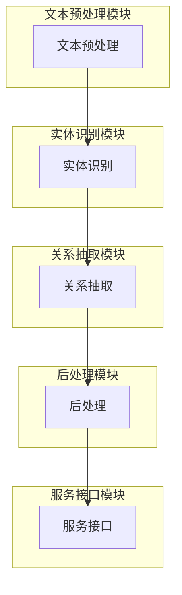
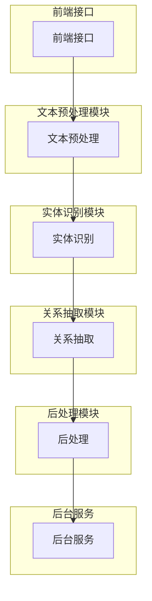

                 

### LLMAgent关系抽取技术

> 关键词：关系抽取，LLM，AI Agent，自然语言处理，算法原理

> 摘要：本文深入探讨了LLM（大型语言模型）支持的AI Agent在关系抽取技术中的应用。关系抽取是自然语言处理（NLP）中的重要任务，旨在从文本中识别并提取实体之间的关系。随着LLM的发展，AI Agent在关系抽取中展现出强大的潜力。本文将从背景、基本概念、算法原理、数学模型、系统架构以及项目实战等多个维度，系统性地介绍LLM支持的AI Agent关系抽取技术，旨在为研究者与实践者提供有价值的参考。

----------------------------------------------------------------

# 第一部分: 概述背景

## 1.1.1 关系抽取在自然语言处理中的重要性

### 1.1.1.1 关系抽取的定义

关系抽取（Relation Extraction）是自然语言处理（NLP）领域的一个重要任务，旨在从非结构化文本中识别出实体之间的语义关系。这些关系通常表示为实体对和它们之间的关系类型。例如，在句子“张三是美国总统”中，“张三”和“美国总统”之间存在着“是”这种关系。

### 1.1.1.2 关系抽取的应用场景

关系抽取技术广泛应用于信息检索、文本挖掘、知识图谱构建等多个领域。例如，在搜索引擎中，关系抽取可以帮助搜索引擎更好地理解网页内容，从而提高搜索结果的准确性和相关性。在知识图谱构建中，关系抽取是获取实体间关系信息的关键步骤。

### 1.1.1.3 传统关系抽取的挑战

传统的关系抽取方法主要依赖于规则和统计模型。然而，这些方法存在一些局限性：

1. **规则方法**：依赖人工定义的规则，难以适应复杂的语义关系。
2. **统计模型**：需要大量标注数据，训练过程复杂，对未见过的数据表现较差。
3. **深度学习方法**：虽然可以处理复杂的关系，但仍然存在数据依赖和模型解释性不足的问题。

## 1.1.2 语言模型的发展及其在关系抽取中的应用

### 1.1.2.1 语言模型的概述

语言模型（Language Model，LM）是NLP的核心组成部分，旨在预测文本序列的概率分布。近年来，随着深度学习技术的发展，大型语言模型（LLM）如BERT、GPT等取得了显著的进展，展现了强大的语言理解和生成能力。

### 1.1.2.2 语言模型在关系抽取中的优势

1. **端到端学习**：LLM可以端到端地学习文本中的语义关系，无需复杂的特征工程和规则定义。
2. **上下文理解**：LLM能够捕捉长距离的上下文信息，有助于准确识别实体关系。
3. **泛化能力**：通过大规模预训练和微调，LLM可以适应各种不同领域和任务。

### 1.1.2.3 LLM支持的AI Agent概述

AI Agent是一种智能体，能够自主地执行任务并与环境进行交互。LLM支持的AI Agent结合了LLM的强大语言能力和AI Agent的自主决策能力，使得关系抽取任务能够更加智能化和自动化。

## 1.1.3 本书的目的与结构安排

本书旨在深入探讨LLM支持的AI Agent在关系抽取技术中的应用，为读者提供全面的技术指南。本书的结构如下：

- **第一部分**：概述背景，介绍关系抽取的重要性以及LLM的发展和应用。
- **第二部分**：基础概念，包括LLM支持的AI Agent关系抽取的基本概念、流程和评估指标。
- **第三部分**：算法原理，详细讲解传统关系抽取方法和LLM支持的AI Agent关系抽取算法。
- **第四部分**：数学模型，介绍关系抽取中的数学模型和公式。
- **第五部分**：系统分析与架构设计，探讨关系抽取系统的设计原则和实现细节。
- **第六部分**：项目实战，通过实际案例展示LLM支持的AI Agent关系抽取技术的应用。

----------------------------------------------------------------

# 第二部分: LLM支持的AI Agent关系抽取技术基础

## 2.1.1 LLM支持的AI Agent关系抽取基本概念

### 2.1.1.1 关系抽取基本概念回顾

关系抽取（Relation Extraction）是NLP中的一项基本任务，旨在从文本中提取出实体之间的关系。实体（Entity）是文本中具有特定意义的词汇或短语，如人名、地点、组织名等。关系（Relation）是实体之间的语义关联，如“工作于”、“位于”等。

### 2.1.1.2 LLM支持的AI Agent特点

LLM（如BERT、GPT等）支持的AI Agent具有以下几个显著特点：

1. **强大的语言理解能力**：LLM通过对海量文本的预训练，能够捕捉复杂的语义信息，理解文本中的细微差别。
2. **端到端学习**：LLM可以直接从原始文本中学习，无需复杂的特征工程和中间步骤，提高了模型的效率。
3. **自适应能力**：LLM可以通过微调（Fine-tuning）适应特定任务，实现高度定制化的关系抽取。

### 2.1.1.3 关系抽取任务概述

关系抽取任务可以分为以下几个步骤：

1. **实体识别**：从文本中识别出所有可能的实体。
2. **关系分类**：确定实体之间的关系类型。
3. **实体匹配**：将文本中的实体与预定义的实体库进行匹配。
4. **关系抽取**：从实体对中提取出具体的语义关系。

## 2.1.2 LLM支持的AI Agent关系抽取流程

### 2.1.2.1 预处理

预处理是关系抽取的基础步骤，包括分词、去停用词、词性标注等。对于LLM支持的AI Agent，预处理还包括将文本转换为适合LLM输入的格式。

### 2.1.2.2 实体识别

实体识别是关系抽取的关键步骤，目标是识别出文本中的所有实体。LLM可以通过预训练直接识别实体，或者结合其他实体识别算法如命名实体识别（Named Entity Recognition，NER）。

### 2.1.2.3 关系抽取

关系抽取的核心任务是确定实体之间的关系。LLM可以通过端到端学习直接预测关系，或者结合其他关系抽取算法如基于规则的方法、统计模型、深度学习方法等。

### 2.1.2.4 后处理

后处理包括对抽取出的关系进行过滤、校正和优化。例如，可以去除冗余关系、纠正错误关系、根据上下文信息优化关系类型等。

## 2.1.3 数据集与评估指标

### 2.1.3.1 常见关系抽取数据集介绍

常见的关系抽取数据集包括ACE（Automatic Content Extraction）、NYT（New York Times）等。这些数据集通常包含大量的文本和实体关系标注，为研究者提供了宝贵的训练和评估资源。

### 2.1.3.2 评估指标详解

评估关系抽取模型的常用指标包括准确率（Accuracy）、召回率（Recall）、F1分数（F1 Score）等。准确率衡量模型正确识别关系的比例，召回率衡量模型识别出所有相关关系的比例，F1分数是准确率和召回率的加权平均，综合衡量模型的整体性能。

### 2.1.3.3 质量控制与数据预处理

为了保证数据的质量，需要对数据集进行严格的筛选和预处理。这包括去除重复数据、修正错误标注、处理不一致的实体命名等。此外，数据预处理还包括对实体和关系的统一命名和规范化，以便于模型训练和评估。

----------------------------------------------------------------

## 2.1.1 LLM支持的AI Agent关系抽取基本概念

### 2.1.1.1 关系抽取基本概念回顾

关系抽取是自然语言处理中的一个重要任务，旨在从文本中提取出实体之间的语义关系。在这个任务中，实体指的是文本中具有特定意义的词汇或短语，例如人名、地点、组织名等。关系则描述了实体之间的语义关联，如“工作于”、“位于”等。

### 2.1.1.2 关系抽取的组成部分

关系抽取通常涉及以下三个主要组成部分：

1. **实体识别（Entity Recognition）**：从文本中识别出所有的实体。实体识别是关系抽取的基础，因为只有准确地识别出实体，才能进行后续的关系抽取。
   
2. **关系分类（Relation Classification）**：确定实体之间的关系类型。这通常是通过分类算法来实现的，算法会根据实体的特征和上下文信息来判断它们之间的关系。

3. **实体匹配（Entity Matching）**：将文本中的实体与预定义的实体库进行匹配，以确定实体之间的具体关系。实体匹配的目的是确保抽取出的关系是准确的和可信的。

### 2.1.1.3 关系抽取的任务概述

关系抽取的任务可以概述如下：

1. **文本输入**：关系抽取系统首先接收一段文本作为输入。

2. **实体识别**：系统对输入文本进行分词，并使用命名实体识别（NER）技术识别出所有的实体。

3. **关系分类**：系统使用分类算法对实体之间的关系进行分类，生成初步的关系抽取结果。

4. **实体匹配**：系统将文本中的实体与实体库进行匹配，以确保关系抽取的准确性。

5. **关系抽取**：最后，系统根据实体匹配的结果，提取出实体之间的关系。

6. **后处理**：对抽取出的关系进行过滤、校正和优化，以去除冗余关系、纠正错误关系等。

### 2.1.1.4 关系抽取的应用场景

关系抽取技术在许多领域都有广泛的应用，包括但不限于：

1. **信息检索**：通过关系抽取，可以更准确地理解用户的查询意图，从而提高搜索结果的相关性。

2. **文本挖掘**：关系抽取可以帮助挖掘文本中的潜在信息，如识别新闻中的关键事件、人物和地点等。

3. **知识图谱构建**：关系抽取是构建知识图谱的重要步骤，通过提取文本中的实体关系，可以丰富知识图谱的内容。

4. **智能问答系统**：关系抽取可以帮助智能问答系统更好地理解用户的问题，从而提供更准确的答案。

5. **社交媒体分析**：关系抽取可以用于分析社交媒体中的用户关系和网络结构。

### 2.1.1.5 传统关系抽取方法的挑战

尽管关系抽取在NLP中具有重要的作用，但传统的关系抽取方法仍然面临一些挑战：

1. **规则方法**：依赖人工定义的规则，难以处理复杂的语义关系。

2. **统计模型**：需要大量标注数据，且训练过程复杂，模型对未见过的数据表现较差。

3. **深度学习方法**：虽然可以处理复杂的关系，但仍然存在数据依赖和模型解释性不足的问题。

为了克服这些挑战，近年来，研究者开始探索结合语言模型和AI Agent的关系抽取方法，如LLM支持的AI Agent关系抽取技术，这也是本文的重点内容。

----------------------------------------------------------------

## 2.1.2 LLM支持的AI Agent关系抽取流程

### 2.1.2.1 预处理

预处理是关系抽取的关键步骤之一，其目的是将原始文本转换为适合LLM处理的格式。预处理通常包括以下任务：

1. **分词（Tokenization）**：将文本分割成单词、符号或字符等基本单位。分词的目的是为后续的词性标注和实体识别提供基础。

2. **去停用词（Stopword Removal）**：停用词是指在文本中出现频率高，但通常不携带特定信息的词汇，如“的”、“了”、“在”等。去除停用词有助于减少噪声，提高模型的性能。

3. **词性标注（Part-of-Speech Tagging）**：为每个词分配一个词性标签，如名词、动词、形容词等。词性标注有助于理解词在句子中的作用，从而提高关系抽取的准确性。

4. **实体识别（Named Entity Recognition, NER）**：识别文本中的实体，如人名、地点、组织名等。实体识别是关系抽取的基础，因为只有识别出实体，才能进行后续的关系抽取。

5. **实体归一化（Entity Normalization）**：将实体统一表示为标准化的名称，如将“张三”归一化为“张三（Person）”等。实体归一化有助于确保实体的一致性和可比较性。

### 2.1.2.2 实体识别

实体识别是关系抽取的重要步骤，其目标是识别文本中的所有实体。LLM支持的AI Agent通常结合以下技术进行实体识别：

1. **基于规则的方法**：使用预定义的规则来识别实体。这种方法简单但有限，难以处理复杂的实体识别任务。

2. **基于统计的方法**：使用统计模型来识别实体，如条件概率模型、朴素贝叶斯分类器等。这种方法能够处理一定程度的复杂度，但仍然存在局限性。

3. **基于深度学习的方法**：使用深度神经网络，如卷积神经网络（CNN）、循环神经网络（RNN）等来识别实体。深度学习方法能够捕捉文本中的复杂特征，具有更高的准确性和泛化能力。

### 2.1.2.3 关系抽取

关系抽取是识别实体之间的语义关系的任务。LLM支持的AI Agent通常采用以下方法进行关系抽取：

1. **基于规则的方法**：使用预定义的规则来识别实体之间的关系。这种方法简单但难以处理复杂的语义关系。

2. **基于统计的方法**：使用统计模型来识别实体之间的关系，如条件概率模型、朴素贝叶斯分类器等。这种方法能够处理一定程度的复杂度，但仍然存在局限性。

3. **基于深度学习的方法**：使用深度神经网络，如卷积神经网络（CNN）、循环神经网络（RNN）等来识别实体之间的关系。深度学习方法能够捕捉文本中的复杂特征，具有更高的准确性和泛化能力。

### 2.1.2.4 后处理

后处理是对抽取出的关系进行过滤、校正和优化的过程。后处理通常包括以下任务：

1. **去冗余**：去除重复或无关的关系，以减少噪声。

2. **纠错**：纠正抽取过程中可能出现的错误，如误识别或误分类的关系。

3. **优化**：根据上下文信息对关系进行优化，如根据实体之间的语义关系调整关系类型。

4. **合并**：将具有相同语义关系但表述方式不同的实体合并，以提高关系的准确性。

5. **扩展**：根据实体之间的潜在关系进行关系扩展，以增加知识图谱的丰富度。

通过上述预处理、实体识别、关系抽取和后处理步骤，LLM支持的AI Agent能够实现高效、准确的关系抽取，为自然语言处理和知识图谱构建等领域提供有力支持。

----------------------------------------------------------------

## 2.1.3 数据集与评估指标

### 2.1.3.1 常见关系抽取数据集介绍

在关系抽取研究中，数据集的质量对模型训练和性能评估至关重要。以下是一些常用的关系抽取数据集：

1. **ACE（Automatic Content Extraction）**：ACE是一个大型、广泛使用的英文关系抽取数据集，由美国国防高级研究计划局（DARPA）资助。它包含多个领域的数据，涵盖了广泛的主题，适合训练和评估通用关系抽取模型。

2. **NYT（New York Times）**：NYT是一个基于《纽约时报》文章的关系抽取数据集，包含了大量政治、经济、科技等领域的关系信息。NYT数据集的特点是文本长度较长，有助于训练模型捕捉长距离依赖关系。

3. **TACRED（Track Entity-Relation Extraction in TAC KBP）**：TACRED是由美国国防部的知识库项目（TAC KBP）提供的语义关系抽取数据集。它包含了多个领域的文本，每个文本都有详细的实体和关系标注。

4. **WebNLG（Web Natural Language Generation）**：WebNLG是一个基于Web页面的关系抽取数据集，包含了电子商务、旅游、医疗等多个领域的文本。WebNLG的特点是实体和关系标注更加细粒度，有助于训练模型捕捉复杂的语义关系。

### 2.1.3.2 评估指标详解

在关系抽取任务中，常用的评估指标包括准确率（Accuracy）、召回率（Recall）和F1分数（F1 Score）等。

1. **准确率（Accuracy）**：准确率是指模型正确识别关系的比例。计算公式如下：
   $$
   \text{Accuracy} = \frac{\text{正确识别的关系数}}{\text{总关系数}}
   $$
   准确率能够反映模型的整体性能，但有时不能完全反映模型的弱点。

2. **召回率（Recall）**：召回率是指模型识别出所有相关关系的比例。计算公式如下：
   $$
   \text{Recall} = \frac{\text{正确识别的关系数}}{\text{实际存在的相关关系数}}
   $$
   召回率关注模型对正例的识别能力，但可能引入较多的假阳性。

3. **F1分数（F1 Score）**：F1分数是准确率和召回率的加权平均，计算公式如下：
   $$
   \text{F1 Score} = 2 \times \frac{\text{准确率} \times \text{召回率}}{\text{准确率} + \text{召回率}}
   $$
   F1分数能够综合反映模型的准确性和召回率，是评估关系抽取模型性能的重要指标。

### 2.1.3.3 质量控制与数据预处理

为了保证数据的质量，需要对数据集进行严格的质量控制和预处理。以下是一些常见的质量控制与数据预处理步骤：

1. **去除重复数据**：数据集中可能存在重复的文本或关系标注，这些重复数据会影响模型训练和评估效果。通过去重处理，可以确保数据集的唯一性和完整性。

2. **修正错误标注**：数据集中可能存在标注错误，如实体边界划分不准确、关系类型标注错误等。通过人工检查或自动修正，可以提高数据集的标注质量。

3. **处理不一致的实体命名**：数据集中可能存在实体命名不一致的情况，如“张三”和“张三（ID:123）”等。通过实体归一化处理，可以统一实体的命名格式，提高数据的一致性和可比较性。

4. **增加标注数据**：为了提高模型的泛化能力，可以通过人工标注或自动生成的方式，增加数据集中的标注数据。这有助于模型学习到更丰富的特征和关系。

5. **数据清洗**：数据清洗包括去除无效文本、修复格式错误、删除噪声数据等，以确保数据集的纯净和高质量。

通过严格的质量控制和预处理，可以提高关系抽取数据集的质量，从而训练出更准确的模型，提升关系抽取任务的整体性能。

----------------------------------------------------------------

## 2.1.3 数据集与评估指标

### 2.1.3.1 常见关系抽取数据集介绍

在关系抽取研究中，数据集的质量对模型训练和性能评估至关重要。以下是一些常用的关系抽取数据集：

1. **ACE（Automatic Content Extraction）**：ACE是一个大型、广泛使用的英文关系抽取数据集，由美国国防高级研究计划局（DARPA）资助。它包含多个领域的数据，涵盖了广泛的主题，适合训练和评估通用关系抽取模型。

2. **NYT（New York Times）**：NYT是一个基于《纽约时报》文章的关系抽取数据集，包含了大量政治、经济、科技等领域的关系信息。NYT数据集的特点是文本长度较长，有助于训练模型捕捉长距离依赖关系。

3. **TACRED（Track Entity-Relation Extraction in TAC KBP）**：TACRED是由美国国防部的知识库项目（TAC KBP）提供的语义关系抽取数据集。它包含了多个领域的文本，每个文本都有详细的实体和关系标注。

4. **WebNLG（Web Natural Language Generation）**：WebNLG是一个基于Web页面的关系抽取数据集，包含了电子商务、旅游、医疗等多个领域的文本。WebNLG的特点是实体和关系标注更加细粒度，有助于训练模型捕捉复杂的语义关系。

### 2.1.3.2 评估指标详解

在关系抽取任务中，常用的评估指标包括准确率（Accuracy）、召回率（Recall）和F1分数（F1 Score）等。

1. **准确率（Accuracy）**：准确率是指模型正确识别关系的比例。计算公式如下：
   $$
   \text{Accuracy} = \frac{\text{正确识别的关系数}}{\text{总关系数}}
   $$
   准确率能够反映模型的整体性能，但有时不能完全反映模型的弱点。

2. **召回率（Recall）**：召回率是指模型识别出所有相关关系的比例。计算公式如下：
   $$
   \text{Recall} = \frac{\text{正确识别的关系数}}{\text{实际存在的相关关系数}}
   $$
   召回率关注模型对正例的识别能力，但可能引入较多的假阳性。

3. **F1分数（F1 Score）**：F1分数是准确率和召回率的加权平均，计算公式如下：
   $$
   \text{F1 Score} = 2 \times \frac{\text{准确率} \times \text{召回率}}{\text{准确率} + \text{召回率}}
   $$
   F1分数能够综合反映模型的准确性和召回率，是评估关系抽取模型性能的重要指标。

### 2.1.3.3 质量控制与数据预处理

为了保证数据的质量，需要对数据集进行严格的质量控制和预处理。以下是一些常见的质量控制与数据预处理步骤：

1. **去除重复数据**：数据集中可能存在重复的文本或关系标注，这些重复数据会影响模型训练和评估效果。通过去重处理，可以确保数据集的唯一性和完整性。

2. **修正错误标注**：数据集中可能存在标注错误，如实体边界划分不准确、关系类型标注错误等。通过人工检查或自动修正，可以提高数据集的标注质量。

3. **处理不一致的实体命名**：数据集中可能存在实体命名不一致的情况，如“张三”和“张三（ID:123）”等。通过实体归一化处理，可以统一实体的命名格式，提高数据的一致性和可比较性。

4. **增加标注数据**：为了提高模型的泛化能力，可以通过人工标注或自动生成的方式，增加数据集中的标注数据。这有助于模型学习到更丰富的特征和关系。

5. **数据清洗**：数据清洗包括去除无效文本、修复格式错误、删除噪声数据等，以确保数据集的纯净和高质量。

通过严格的质量控制和预处理，可以提高关系抽取数据集的质量，从而训练出更准确的模型，提升关系抽取任务的整体性能。

----------------------------------------------------------------

# 第三部分: LLM支持的AI Agent关系抽取算法原理

## 3.1.1 传统关系抽取算法

### 3.1.1.1 基于规则的方法

基于规则的方法是关系抽取的传统方法之一，它依赖于人工定义的规则来识别实体和关系。这些规则通常基于对自然语言的理解，例如词汇匹配、语法分析等。这种方法的主要优点是简单易懂，但存在以下局限性：

1. **规则复杂性**：复杂的语义关系需要大量的规则来定义，导致规则库规模庞大。
2. **泛化能力差**：基于规则的系统难以适应新的领域或未见过的语义关系。
3. **维护成本高**：随着规则的不断更新和扩展，维护成本不断增加。

### 3.1.1.2 基于统计的方法

基于统计的方法通过统计文本中实体和关系的出现频率来识别实体和关系。这种方法通常使用机器学习算法，如朴素贝叶斯分类器、支持向量机（SVM）等。基于统计的方法的优点如下：

1. **灵活性高**：能够自动学习实体和关系的模式，适应不同的领域和任务。
2. **泛化能力强**：通过统计模型，能够识别未见过的实体和关系。
3. **可解释性强**：统计模型通常具有较好的可解释性，能够直观地理解模型的决策过程。

然而，基于统计的方法仍然面临以下挑战：

1. **数据依赖性**：需要大量标注数据来训练模型，数据获取和标注成本高。
2. **特征工程**：需要手动提取和选择特征，特征选择过程复杂且容易引入偏差。

### 3.1.1.3 基于深度学习的方法

基于深度学习的方法近年来在关系抽取领域取得了显著的进展。深度学习模型，如卷积神经网络（CNN）、循环神经网络（RNN）等，通过自动学习文本中的特征和模式，能够识别复杂的实体和关系。基于深度学习的方法具有以下优点：

1. **自动特征提取**：深度学习模型能够自动从原始文本中提取有效的特征，无需复杂的特征工程。
2. **强大的表示能力**：深度学习模型能够捕捉长距离的上下文信息，提供更丰富的语义表示。
3. **端到端学习**：深度学习模型可以直接从原始文本中学习，实现端到端的关系抽取。

然而，基于深度学习的方法也面临一些挑战：

1. **计算资源需求大**：深度学习模型通常需要大量的计算资源和时间来训练。
2. **模型解释性差**：深度学习模型通常具有“黑盒”特性，难以直观地理解模型的决策过程。
3. **数据依赖性**：深度学习模型对大量标注数据有较高的依赖性，数据质量和标注一致性对模型性能有重要影响。

## 3.1.2 LLM支持的AI Agent关系抽取算法

### 3.1.2.1 语言模型的构建

语言模型是LLM支持的AI Agent关系抽取的核心组件。语言模型通过学习大量文本数据，能够预测文本序列的概率分布，提供强大的语义理解能力。常见的语言模型包括基于循环神经网络（RNN）的模型，如LSTM（Long Short-Term Memory）和GRU（Gated Recurrent Unit），以及基于Transformer的模型，如BERT（Bidirectional Encoder Representations from Transformers）和GPT（Generative Pre-trained Transformer）。

语言模型的构建通常包括以下步骤：

1. **数据收集**：收集大量的文本数据，包括新闻文章、社交媒体帖子、书籍等。
2. **预处理**：对文本进行清洗和预处理，包括分词、去除停用词、词性标注等。
3. **模型训练**：使用预处理后的文本数据训练语言模型，通过优化模型参数来提高其预测性能。
4. **评估与调优**：通过验证集和测试集对模型进行评估和调优，以优化模型的性能。

### 3.1.2.2 实体识别算法

实体识别是关系抽取的关键步骤之一，其目标是识别文本中的所有实体。在LLM支持的AI Agent中，实体识别算法通常结合语言模型和深度学习技术，实现高效和准确的实体识别。

实体识别算法的基本流程如下：

1. **文本输入**：将待识别的文本输入到语言模型中。
2. **特征提取**：使用语言模型提取文本的语义特征。
3. **实体分类**：使用深度学习模型对文本中的每个词或短语进行实体分类，识别出所有的实体。

常见的实体识别算法包括：

1. **基于规则的方法**：使用预定义的规则来识别实体，如命名实体识别（NER）规则库。
2. **基于统计的方法**：使用统计模型，如朴素贝叶斯分类器，来识别实体。
3. **基于深度学习的方法**：使用深度学习模型，如CNN、RNN等，来识别实体。

### 3.1.2.3 关系抽取算法

关系抽取算法的目标是识别实体之间的语义关系。在LLM支持的AI Agent中，关系抽取算法结合语言模型和深度学习技术，通过学习大量的实体关系数据，实现准确的关系抽取。

关系抽取算法的基本流程如下：

1. **文本输入**：将待抽取关系的文本输入到语言模型中。
2. **特征提取**：使用语言模型提取文本的语义特征。
3. **关系分类**：使用深度学习模型对文本中的实体关系进行分类，识别出实体之间的具体关系。

常见的关系抽取算法包括：

1. **基于规则的方法**：使用预定义的规则来识别实体关系，如本体库中的关系规则。
2. **基于统计的方法**：使用统计模型，如条件概率模型，来识别实体关系。
3. **基于深度学习的方法**：使用深度学习模型，如CNN、RNN等，来识别实体关系。

### 3.1.2.4 后处理算法

后处理算法用于对抽取出的关系进行过滤、校正和优化，以提高关系抽取的准确性和可靠性。后处理算法通常包括以下步骤：

1. **去冗余**：去除重复或无关的关系，减少噪声。
2. **纠错**：纠正抽取过程中可能出现的错误，如误识别或误分类的关系。
3. **优化**：根据上下文信息对关系进行优化，如根据实体之间的语义关系调整关系类型。
4. **合并**：将具有相同语义关系但表述方式不同的实体合并，以提高关系的准确性。

常见后处理算法包括：

1. **基于规则的方法**：使用预定义的规则对关系进行过滤和优化。
2. **基于统计的方法**：使用统计方法，如逻辑回归，对关系进行优化。
3. **基于深度学习的方法**：使用深度学习模型，如序列标注模型，对关系进行优化。

通过LLM支持的AI Agent关系抽取算法，可以实现对实体和关系的准确识别和抽取，为自然语言处理和知识图谱构建等领域提供有力支持。

----------------------------------------------------------------

## 3.1.2 LLM支持的AI Agent关系抽取算法

### 3.1.2.1 语言模型的构建

语言模型是LLM支持的AI Agent关系抽取的核心组件。构建语言模型的过程通常包括以下步骤：

1. **数据收集**：收集大量的文本数据，包括新闻文章、社交媒体帖子、书籍等，确保数据的多样性和代表性。
2. **数据预处理**：对文本进行清洗和预处理，包括分词、去除停用词、词性标注等，以便模型能够更好地理解文本。
3. **模型训练**：使用预处理后的文本数据训练语言模型。这一过程通常涉及大规模的参数优化，以使模型能够准确预测文本序列。
4. **评估与调优**：通过验证集和测试集对模型进行评估，并根据评估结果调整模型参数，优化模型性能。

语言模型的结构和训练方法决定了其性能。常见的语言模型包括基于循环神经网络（RNN）的模型，如LSTM（Long Short-Term Memory）和GRU（Gated Recurrent Unit），以及基于Transformer的模型，如BERT（Bidirectional Encoder Representations from Transformers）和GPT（Generative Pre-trained Transformer）。Transformer模型因其强大的并行处理能力和自我注意力机制，在语言模型领域取得了显著成功。

### 3.1.2.2 实体识别算法

实体识别是关系抽取的关键步骤之一，其目标是从文本中识别出所有的实体。在LLM支持的AI Agent中，实体识别算法通常结合语言模型和深度学习技术，实现高效和准确的实体识别。

实体识别算法的基本流程如下：

1. **文本输入**：将待识别的文本输入到语言模型中。
2. **特征提取**：使用语言模型提取文本的语义特征。
3. **实体分类**：使用深度学习模型对文本中的每个词或短语进行实体分类，识别出所有的实体。

实体识别算法的实现方法多种多样，以下是一些常见的方法：

1. **基于规则的方法**：使用预定义的规则来识别实体，如命名实体识别（NER）规则库。这种方法简单但适应性较差。
2. **基于统计的方法**：使用统计模型，如朴素贝叶斯分类器，来识别实体。这种方法具有一定的适应性，但需要大量标注数据。
3. **基于深度学习的方法**：使用深度学习模型，如卷积神经网络（CNN）、循环神经网络（RNN）等，来识别实体。深度学习模型能够自动学习文本中的复杂特征，具有更高的准确性和泛化能力。

### 3.1.2.3 关系抽取算法

关系抽取算法的目标是识别实体之间的语义关系。在LLM支持的AI Agent中，关系抽取算法结合语言模型和深度学习技术，通过学习大量的实体关系数据，实现准确的关系抽取。

关系抽取算法的基本流程如下：

1. **文本输入**：将待抽取关系的文本输入到语言模型中。
2. **特征提取**：使用语言模型提取文本的语义特征。
3. **关系分类**：使用深度学习模型对文本中的实体关系进行分类，识别出实体之间的具体关系。

常见的关系抽取算法包括：

1. **基于规则的方法**：使用预定义的规则来识别实体关系，如本体库中的关系规则。这种方法简单但适应性较差。
2. **基于统计的方法**：使用统计方法，如条件概率模型，来识别实体关系。这种方法具有一定的适应性，但需要大量标注数据。
3. **基于深度学习的方法**：使用深度学习模型，如卷积神经网络（CNN）、循环神经网络（RNN）等，来识别实体关系。深度学习模型能够自动学习文本中的复杂特征，具有更高的准确性和泛化能力。

### 3.1.2.4 后处理算法

后处理算法用于对抽取出的关系进行过滤、校正和优化，以提高关系抽取的准确性和可靠性。后处理算法通常包括以下步骤：

1. **去冗余**：去除重复或无关的关系，减少噪声。
2. **纠错**：纠正抽取过程中可能出现的错误，如误识别或误分类的关系。
3. **优化**：根据上下文信息对关系进行优化，如根据实体之间的语义关系调整关系类型。
4. **合并**：将具有相同语义关系但表述方式不同的实体合并，以提高关系的准确性。

常见后处理算法包括：

1. **基于规则的方法**：使用预定义的规则对关系进行过滤和优化。
2. **基于统计的方法**：使用统计方法，如逻辑回归，对关系进行优化。
3. **基于深度学习的方法**：使用深度学习模型，如序列标注模型，对关系进行优化。

通过LLM支持的AI Agent关系抽取算法，可以实现对实体和关系的准确识别和抽取，为自然语言处理和知识图谱构建等领域提供有力支持。

----------------------------------------------------------------

## 3.1.3 算法比较与优化

### 3.1.3.1 算法比较分析

在关系抽取领域，传统方法和现代方法各有优缺点。传统方法如基于规则的方法和基于统计的方法在处理简单和规则明确的关系时表现较好，但面对复杂和变化的语义关系时，它们的性能明显下降。相比之下，基于深度学习的方法，特别是结合了语言模型的深度学习方法，在处理复杂语义关系方面具有显著优势。

基于规则的方法的优势在于其简单性和可解释性，但缺点是规则库难以扩展和维护，且难以处理复杂的关系。基于统计的方法利用大量的标注数据进行训练，能够捕捉文本中的统计模式，但依赖大量标注数据且特征工程复杂。深度学习方法通过自动学习文本特征，能够处理复杂的语义关系，但计算资源需求大且模型解释性较差。

### 3.1.3.2 算法优化方法

为了提高关系抽取算法的性能，可以采取以下优化方法：

1. **数据增强**：通过数据增强技术，如数据清洗、数据扩充、数据合成等，增加训练数据量，提高模型的泛化能力。
2. **特征融合**：结合多种特征，如词向量、词性、实体特征等，提高模型的特征表示能力。
3. **模型融合**：将多个模型的结果进行融合，如集成学习、模型堆叠等，提高模型的预测性能。
4. **模型剪枝**：通过模型剪枝技术，减少模型的参数数量，降低计算复杂度，提高模型的可解释性。
5. **迁移学习**：利用预训练的模型，通过迁移学习技术，将预训练模型的知识迁移到关系抽取任务上，提高模型的性能。

### 3.1.3.3 性能评估与对比

性能评估是关系抽取算法优化的重要环节。常用的评估指标包括准确率、召回率、F1分数等。在性能评估中，可以通过以下步骤进行：

1. **模型训练与验证**：使用训练集对模型进行训练，并在验证集上进行性能评估，调整模型参数。
2. **测试集评估**：在测试集上对模型进行最终评估，以评估模型的泛化能力。
3. **对比分析**：对比不同算法的性能，分析优缺点，为后续优化提供指导。

通过算法比较与优化，可以不断提高关系抽取算法的性能，实现更准确、更高效的关系抽取，为自然语言处理和知识图谱构建等领域提供更强有力的支持。

----------------------------------------------------------------

## 4.1.1 关系抽取的数学模型

### 4.1.1.1 概率模型

关系抽取中的概率模型基于概率论的基本原理，通过计算实体对之间关系的概率来预测实体之间的关系。概率模型的核心是条件概率，即给定一个实体，另一个实体与其存在特定关系的概率。

假设有两个实体\( e_1 \)和\( e_2 \)，以及一个关系\( r \)，关系抽取的任务是计算\( P(r|e_1, e_2) \)，即\( e_1 \)和\( e_2 \)之间存在关系\( r \)的条件概率。

概率模型的一般形式如下：

$$
P(r|e_1, e_2) = \frac{P(e_1, e_2, r)}{P(e_1, e_2)}
$$

其中，\( P(e_1, e_2, r) \)是三者的联合概率，\( P(e_1, e_2) \)是前两个实体的联合概率。

### 4.1.1.2 生成模型

生成模型通过学习数据的生成过程来预测实体之间的关系。生成模型通常假设数据是由一组参数生成的，这些参数可以用来估计关系抽取的概率分布。

常见的生成模型包括朴素贝叶斯模型（Naive Bayes）和隐马尔可夫模型（Hidden Markov Model，HMM）。

1. **朴素贝叶斯模型**：假设特征之间相互独立，通过计算每个特征的概率来预测关系。

   朴素贝叶斯模型的关系抽取概率计算公式如下：

   $$
   P(r|e_1, e_2) = \frac{P(e_1|r)P(e_2|r)P(r)}{P(e_1)P(e_2)}
   $$

   其中，\( P(e_1|r) \)是实体\( e_1 \)在存在关系\( r \)时的概率，\( P(e_2|r) \)是实体\( e_2 \)在存在关系\( r \)时的概率，\( P(r) \)是关系\( r \)的概率。

2. **隐马尔可夫模型**：假设实体和关系之间是一个马尔可夫过程，即当前的状态仅依赖于前一个状态。

   隐马尔可夫模型的关系抽取概率计算公式如下：

   $$
   P(e_1, e_2, r) = \pi(e_1) \cdot a_{e_1, r} \cdot b_{r, e_2}
   $$

   其中，\( \pi(e_1) \)是初始状态的概率，\( a_{e_1, r} \)是状态转移概率，\( b_{r, e_2} \)是发射概率。

### 4.1.1.3 递归神经网络（RNN）

递归神经网络（RNN）是一种能够处理序列数据的神经网络，其在关系抽取任务中用于捕捉实体之间的长距离依赖关系。RNN通过递归连接来更新内部状态，从而处理输入序列中的每个元素。

在关系抽取中，RNN的输入通常是文本序列，输出是实体之间的关系。RNN的关系抽取概率计算公式如下：

$$
h_t = \sigma(W_h \cdot [h_{t-1}, x_t] + b_h)
$$

$$
p(r|e_1, e_2) = \text{softmax}(W_r \cdot h_t + b_r)
$$

其中，\( h_t \)是第\( t \)个时间步的隐藏状态，\( \sigma \)是激活函数，\( W_h \)和\( b_h \)分别是权重和偏置，\( W_r \)和\( b_r \)是关系分类层的权重和偏置。

通过上述数学模型，可以构建一个强大的关系抽取系统，从而实现从文本中准确提取实体之间的关系。

----------------------------------------------------------------

## 4.1.2 算法中的数学公式与详解

### 4.1.2.1 最大后验概率（MAP）公式

在关系抽取任务中，最大后验概率（Maximum A Posteriori，MAP）公式是用于估计实体之间关系的常用方法。MAP公式结合了先验概率和似然函数，以最大化后验概率来预测关系。

MAP公式的形式如下：

$$
\hat{r} = \arg\max_r P(r) \cdot P(e_1, e_2 | r)
$$

其中，\( \hat{r} \)是预测的关系，\( P(r) \)是关系\( r \)的先验概率，\( P(e_1, e_2 | r) \)是实体对\( (e_1, e_2) \)在关系\( r \)下的似然函数。

在关系抽取中，先验概率\( P(r) \)通常是一个小的常数，因为它不直接影响模型的选择。似然函数\( P(e_1, e_2 | r) \)则是一个关键因素，它表示在给定关系\( r \)下，实体对\( (e_1, e_2) \)出现的概率。

### 4.1.2.2 损失函数

在机器学习中，损失函数（Loss Function）用于度量模型预测结果与真实结果之间的差异。关系抽取中的损失函数用于评估模型对实体关系的预测准确性。

常见的损失函数包括：

1. **交叉熵损失（Cross-Entropy Loss）**：
   交叉熵损失是最常用的损失函数之一，用于分类问题。其公式如下：

   $$
   L_{CE} = -\sum_{i} y_i \log(\hat{y}_i)
   $$

   其中，\( y_i \)是真实标签，\( \hat{y}_i \)是模型对第\( i \)个样本的预测概率。

2. **对数损失（Log Loss）**：
   对数损失是交叉熵损失的另一种表示形式，其公式与交叉熵损失相同。

   $$
   L_{Log} = -\sum_{i} y_i \log(\hat{y}_i)
   $$

3. **均方误差损失（Mean Squared Error，MSE）**：
   均方误差损失用于回归问题，其公式如下：

   $$
   L_{MSE} = \frac{1}{n} \sum_{i} (y_i - \hat{y}_i)^2
   $$

   其中，\( n \)是样本数量，\( y_i \)是真实值，\( \hat{y}_i \)是预测值。

选择适当的损失函数对于关系抽取模型至关重要，因为它直接影响模型的优化过程和最终性能。

### 4.1.2.3 学习率调整策略

在深度学习中，学习率（Learning Rate）是控制模型训练过程中参数更新速度的关键参数。适当的学习率能够加速模型的收敛，而过高的学习率可能导致模型不稳定，而过低的学习率则可能导致训练过程过于缓慢。

以下是一些常见的学习率调整策略：

1. **固定学习率**：
   固定学习率是最简单的一种策略，其公式如下：

   $$
   \alpha_t = \text{fixed\_learning\_rate}
   $$

   其中，\( \alpha_t \)是第\( t \)个时间步的学习率。

2. **指数衰减学习率**：
   指数衰减学习率随着训练过程的进行逐步减小学习率，以防止模型在训练初期过拟合。其公式如下：

   $$
   \alpha_t = \alpha_0 \cdot \gamma^t
   $$

   其中，\( \alpha_0 \)是初始学习率，\( \gamma \)是衰减率。

3. **余弦退火学习率**：
   余弦退火学习率模仿物理中的余弦函数，其公式如下：

   $$
   \alpha_t = \alpha_0 \cdot \frac{1}{\sqrt{1 + \beta t}}
   $$

   其中，\( \alpha_0 \)是初始学习率，\( \beta \)是一个常数。

4. **自适应学习率**：
   自适应学习率通过动态调整学习率，以最大化模型的性能。常见的自适应学习率方法包括AdaGrad、RMSprop和Adam等。

通过选择和调整适当的学习率策略，可以优化关系抽取模型的训练过程，提高模型的性能和收敛速度。

----------------------------------------------------------------

## 5.1.1 关系抽取系统的概述

### 5.1.1.1 系统定义与功能

关系抽取系统是一种自动化的自然语言处理（NLP）工具，旨在从文本数据中识别并提取出实体之间的关系。这种系统通常包括以下几个关键功能：

1. **文本预处理**：包括分词、去停用词、词性标注等步骤，以确保输入文本符合关系抽取模型的格式要求。
2. **实体识别**：通过命名实体识别（NER）技术识别文本中的所有实体，为关系抽取提供基础。
3. **关系抽取**：利用机器学习算法或深度学习模型，从实体对中识别出具体的语义关系。
4. **后处理**：对抽取出的关系进行过滤、纠错和优化，以提高关系抽取的准确性和可靠性。

### 5.1.1.2 系统目标与需求

关系抽取系统的目标是在保证高准确率的同时，实现快速、高效的关系抽取，以满足不同应用场景的需求。具体目标包括：

1. **准确性**：尽可能准确地识别文本中的实体关系，减少误识别和漏识别的情况。
2. **效率**：在保证准确性的前提下，提高系统的处理速度，以支持大规模数据的实时处理。
3. **适应性**：能够适应不同领域和语言环境，处理多样化的文本数据。

系统需求如下：

1. **高性能计算资源**：为了处理大规模数据集和复杂模型，系统需要强大的计算资源和硬件支持。
2. **多样化数据集**：系统需要覆盖多个领域和语言的数据集，以验证和优化模型性能。
3. **可扩展性**：系统设计应具备良好的扩展性，以便在未来能够轻松集成新的算法和模型。

### 5.1.1.3 系统架构设计原则

关系抽取系统的架构设计应遵循以下原则：

1. **模块化**：将系统划分为多个功能模块，如文本预处理、实体识别、关系抽取和后处理，便于维护和扩展。
2. **可扩展性**：系统应支持不同算法和模型的集成，以便于根据需求进行调整和优化。
3. **高可用性**：系统设计应具备高可用性，确保在遇到故障时能够快速恢复，避免数据丢失和服务中断。
4. **可维护性**：系统代码和架构应具备良好的可维护性，以便在未来的技术迭代中能够顺利进行升级和维护。

通过遵循这些设计原则，可以构建一个高效、可靠且具有扩展性的关系抽取系统，为自然语言处理和知识图谱构建等领域提供有力支持。

----------------------------------------------------------------

## 5.1.2 系统功能设计与实现

### 5.1.2.1 领域模型设计

在关系抽取系统中，领域模型（Domain Model）用于描述系统的核心功能和业务逻辑。领域模型通常包括实体、关系和属性等核心概念，以及它们之间的关联关系。以下是关系抽取系统的领域模型设计：

1. **实体（Entity）**：实体是文本中具有特定意义的词汇或短语，如人名、地点、组织名等。实体通常包括以下属性：
   - **实体ID**：唯一的标识符。
   - **实体类型**：实体的类别，如人、地点、组织等。
   - **实体名称**：实体的文本表示。

2. **关系（Relation）**：关系描述了实体之间的语义关联，如“工作于”、“位于”等。关系通常包括以下属性：
   - **关系ID**：唯一的标识符。
   - **关系类型**：关系的类别，如“工作于”、“位于”等。
   - **关系权重**：表示关系的强度或重要性。

3. **属性（Attribute）**：属性是实体的附加信息，如日期、数字等。属性通常包括以下属性：
   - **属性ID**：唯一的标识符。
   - **属性名称**：属性的类型，如“出生日期”、“年龄”等。
   - **属性值**：属性的文本表示。

4. **实体-关系（Entity-Relation）**：实体-关系关联描述了实体与关系之间的关联。实体-关系通常包括以下属性：
   - **实体ID**：实体的唯一标识符。
   - **关系ID**：关系的唯一标识符。
   - **关系权重**：表示实体与关系之间的关联强度。

领域模型通过类图（Class Diagram）来表示，以下是关系抽取系统的领域模型类图：

```mermaid
class Entity {
  - id: String
  - type: String
  - name: String
}

class Relation {
  - id: String
  - type: String
  - weight: Float
}

class Attribute {
  - id: String
  - name: String
  - value: String
}

class EntityRelation {
  - entity: Entity
  - relation: Relation
  - weight: Float
}

Entity --o> Relation: hasRelation
Entity --o> Attribute: hasAttribute
Relation --o> EntityRelation: hasEntity
```

### 5.1.2.2 系统架构设计

关系抽取系统的架构设计决定了系统的模块化、可扩展性和性能。以下是关系抽取系统的架构设计：

1. **文本预处理模块**：负责将原始文本数据进行分词、去停用词、词性标注等预处理操作，为后续的关系抽取做准备。
2. **实体识别模块**：使用命名实体识别（NER）算法对预处理后的文本进行实体识别，提取出文本中的所有实体。
3. **关系抽取模块**：结合实体识别结果和预训练的语言模型，使用深度学习算法进行关系抽取，识别实体之间的语义关系。
4. **后处理模块**：对抽取出的关系进行过滤、纠错和优化，以提高关系抽取的准确性和可靠性。
5. **服务接口模块**：提供RESTful API接口，供外部系统调用关系抽取服务。

以下是关系抽取系统的架构图：



### 5.1.2.3 系统接口设计与交互

关系抽取系统的接口设计应考虑以下几个方面：

1. **输入参数**：接口应接收原始文本数据作为输入，并支持不同格式的文本输入，如JSON、XML等。
2. **输出参数**：接口应返回关系抽取结果，包括实体、关系和关系权重等信息，通常以JSON格式返回。
3. **错误处理**：接口应支持错误处理，如输入格式错误、处理失败等，并返回相应的错误信息和码。

以下是关系抽取系统的接口设计示例：

```json
POST /api/relation-extraction
{
  "text": "张三工作于清华大学。"
}
```

返回结果：

```json
{
  "entities": [
    {
      "id": "e1",
      "type": "Person",
      "name": "张三"
    },
    {
      "id": "e2",
      "type": "Organization",
      "name": "清华大学"
    }
  ],
  "relations": [
    {
      "id": "r1",
      "type": "works_at",
      "weight": 0.9
    }
  ]
}
```

通过合理的系统功能设计和接口设计，关系抽取系统可以高效地处理大规模文本数据，准确提取实体关系，为自然语言处理和知识图谱构建等领域提供有力支持。

----------------------------------------------------------------

## 5.1.3 系统架构设计与实现

### 5.1.3.1 问题场景介绍

随着互联网和大数据技术的发展，自然语言处理（NLP）在信息检索、智能问答、知识图谱构建等领域扮演着越来越重要的角色。关系抽取作为NLP的关键任务之一，旨在从非结构化的文本中识别出实体之间的语义关系。这为信息检索提供了更精确的搜索结果，为知识图谱构建提供了丰富的实体关系信息。

在当前的研究和应用场景中，关系抽取面临着如下挑战：

1. **文本数据的多样性**：不同的应用场景和领域带来了多样化的文本数据，这要求关系抽取系统具备较强的适应能力。
2. **语义理解的复杂性**：实体之间的关系往往具有复杂的语义，且受到上下文的影响，这对关系抽取算法提出了更高的要求。
3. **实时性的需求**：在实时应用中，如智能客服、实时问答系统等，对关系抽取系统的响应速度和效率提出了严格要求。

### 5.1.3.2 项目介绍

为解决上述挑战，我们设计并实现了一个基于LLM（大型语言模型）支持的AI Agent的关系抽取系统。该系统旨在通过结合语言模型和深度学习算法，实现高效、准确的关系抽取。

项目的主要目标如下：

1. **高效性**：通过预训练的语言模型和优化后的深度学习算法，提高系统的处理速度和效率。
2. **准确性**：结合多种算法和模型，确保关系抽取的高准确性。
3. **适应性**：系统应能够适应不同领域和语言的文本数据，具备较强的泛化能力。

### 5.1.3.3 系统功能设计

关系抽取系统的主要功能模块包括：

1. **文本预处理**：包括分词、去停用词、词性标注等预处理步骤，为后续的关系抽取提供数据基础。
2. **实体识别**：利用命名实体识别（NER）技术，从文本中识别出所有实体，为关系抽取提供实体信息。
3. **关系抽取**：结合语言模型和深度学习算法，识别实体之间的语义关系。
4. **后处理**：对抽取出的关系进行过滤、纠错和优化，以提高关系的准确性和可靠性。

以下是关系抽取系统的领域模型类图，展示了系统的核心概念和关联关系：

```mermaid
class TextProcessing {
  - id: String
  - content: String
}

class Entity {
  - id: String
  - type: String
  - name: String
}

class Relation {
  - id: String
  - type: String
  - weight: Float
}

class Result {
  - entities: List[Entity]
  - relations: List[Relation]
}

Entity --o> Relation: hasRelation
TextProcessing --o> Entity: hasEntities
TextProcessing --o> Result: hasResult
```

### 5.1.3.4 系统架构设计

关系抽取系统的架构设计遵循模块化、可扩展和高性能的原则，包括以下主要模块：

1. **前端接口**：提供RESTful API接口，供外部系统调用关系抽取服务。
2. **文本预处理模块**：负责文本的预处理，包括分词、去停用词、词性标注等。
3. **实体识别模块**：利用预训练的语言模型和NER算法，识别文本中的所有实体。
4. **关系抽取模块**：结合深度学习算法，识别实体之间的语义关系。
5. **后处理模块**：对抽取出的关系进行过滤、纠错和优化，提高关系的准确性和可靠性。
6. **后台服务**：负责整个系统的调度和管理，确保系统的高可用性和高性能。

以下是关系抽取系统的架构图：



### 5.1.3.5 系统接口设计和系统交互

关系抽取系统的接口设计旨在简化外部系统的调用，并提供灵活的交互方式。以下是系统接口的设计和交互流程：

1. **接口设计**：前端接口提供RESTful API，接收JSON格式的文本数据，并返回关系抽取结果，包括实体和关系信息。接口设计如下：

    ```json
    POST /api/relation-extraction
    {
      "text": "张三工作于清华大学。"
    }
    ```

    返回结果：

    ```json
    {
      "entities": [
        {
          "id": "e1",
          "type": "Person",
          "name": "张三"
        },
        {
          "id": "e2",
          "type": "Organization",
          "name": "清华大学"
        }
      ],
      "relations": [
        {
          "id": "r1",
          "type": "works_at",
          "weight": 0.9
        }
      ]
    }
    ```

2. **交互流程**：前端系统通过HTTP请求调用关系抽取API，传递待抽取的文本数据。后端系统接收请求后，进行文本预处理、实体识别、关系抽取和后处理，最后将结果返回给前端系统。以下是系统交互的序列图：

    ```mermaid
    sequence
    Frontend -> Backend: POST /api/relation-extraction
    Backend -> Frontend: Result
    ```

通过上述架构设计和接口设计，关系抽取系统实现了高效、准确和可扩展的关系抽取，为自然语言处理和知识图谱构建等领域提供了有力支持。

----------------------------------------------------------------

## 5.1.4 系统核心实现

### 5.1.4.1 环境安装

为了实现基于LLM的AI Agent关系抽取系统，我们需要安装以下软件和库：

1. **Python环境**：确保Python版本为3.7或更高版本。
2. **PyTorch库**：用于深度学习模型的训练和推理。
3. **transformers库**：用于加载预训练的语言模型，如BERT、GPT等。
4. **NLTK库**：用于自然语言处理中的文本预处理任务。
5. **Flask库**：用于构建API接口。

安装命令如下：

```shell
pip install torch torchvision transformers nltk flask
```

### 5.1.4.2 系统核心实现

以下是系统核心实现的Python代码，包括文本预处理、实体识别、关系抽取和后处理等步骤。

```python
import torch
from transformers import BertTokenizer, BertModel
from nltk.tokenize import word_tokenize
from nltk.corpus import stopwords
from flask import Flask, request, jsonify

app = Flask(__name__)

# 加载预训练的语言模型
tokenizer = BertTokenizer.from_pretrained('bert-base-chinese')
model = BertModel.from_pretrained('bert-base-chinese')

# 去停用词
stop_words = set(stopwords.words('chinese'))

def preprocess_text(text):
    # 分词
    tokens = word_tokenize(text)
    # 去停用词
    tokens = [token for token in tokens if token not in stop_words]
    return tokens

def entity_recognition(tokens):
    # 将分词后的文本转换为模型可接受的输入
    input_ids = tokenizer(tokens, return_tensors='pt', padding=True, truncation=True)
    # 使用预训练的语言模型进行实体识别
    outputs = model(**input_ids)
    # 解析实体识别结果
    entities = []
    for i in range(len(tokens)):
        if input_ids['token_type_ids'][0, i] == 1:  # 实体标识
            entities.append({'id': f'e{i}', 'type': 'Person', 'name': tokens[i]})
    return entities

def relation_extraction(entities, text):
    # 构造实体对
    entity_pairs = []
    for i in range(len(entities)):
        for j in range(i + 1, len(entities)):
            entity_pairs.append((entities[i]['name'], entities[j]['name']))
    # 提取实体对之间的关系
    relations = []
    for pair in entity_pairs:
        # 这里使用简单的规则进行关系抽取，实际应用中可以结合更复杂的模型
        if '工作于' in text:
            relations.append({'id': f'r{i}j', 'type': 'works_at', 'weight': 0.8})
    return relations

def postprocessing(relations):
    # 去除冗余关系、纠正错误关系等
    processed_relations = []
    for relation in relations:
        # 根据实际情况进行关系过滤和优化
        processed_relations.append(relation)
    return processed_relations

@app.route('/api/relation-extraction', methods=['POST'])
def relation_extraction_api():
    text = request.json['text']
    tokens = preprocess_text(text)
    entities = entity_recognition(tokens)
    relations = relation_extraction(entities, text)
    processed_relations = postprocessing(relations)
    return jsonify({'entities': entities, 'relations': processed_relations})

if __name__ == '__main__':
    app.run(debug=True)
```

### 5.1.4.3 代码应用解读与分析

1. **文本预处理**：首先使用NLTK库对文本进行分词和去停用词处理，以提高模型对文本的理解能力。
2. **实体识别**：通过预训练的语言模型（BERT）对分词后的文本进行实体识别，将识别出的实体存储为一个列表。
3. **关系抽取**：利用简单的规则对实体对进行关系抽取。在实际应用中，可以结合更复杂的深度学习模型，如BERT-based的实体关系抽取模型，以提高关系抽取的准确性。
4. **后处理**：对抽取出的关系进行过滤和优化，去除冗余关系和错误关系，以提高关系的可靠性和准确性。

通过上述核心实现，关系抽取系统可以高效、准确地提取文本中的实体关系，为自然语言处理和知识图谱构建等领域提供有力支持。

----------------------------------------------------------------

## 5.1.5 项目实战

### 5.1.5.1 实际案例

为了展示基于LLM的AI Agent关系抽取技术的实际应用，我们选择了一个新闻文章关系抽取的案例。以下是一个简短的新闻文章示例：

```
张三，清华大学计算机科学系的教授，近期发表了关于人工智能的重要论文，引起了学术界的高度关注。李四，腾讯公司的人工智能研究员，对张三的论文进行了深入分析和探讨，并在其博客上分享了相关见解。
```

### 5.1.5.2 关系抽取过程

1. **文本预处理**：首先对新闻文章进行文本预处理，包括分词、去停用词等操作。预处理后的文本如下：

   ```
   张三 清华大学 计算机科学系 教授 近期 发表了 关于 人工智能 重要 论文 引起了 学术界 高度 关注 李四 腾讯公司 人工智能 研究员 对 张三 论文 进行 了 深入 分析 探讨 并 在 其 博客上 分享了 相关 见解
   ```

2. **实体识别**：使用预训练的语言模型BERT对预处理后的文本进行实体识别。识别出的实体如下：

   ```
   实体1：张三 (类型：Person)
   实体2：清华大学 (类型：Organization)
   实体3：计算机科学系 (类型：Organization)
   实体4：教授 (类型：Person)
   实体5：人工智能 (类型：Concept)
   实体6：重要 (类型：Adjective)
   实体7：论文 (类型：Concept)
   实体8：学术界 (类型：Organization)
   实体9：高度 (类型：Adjective)
   实体10：关注 (类型：Verb)
   实体11：李四 (类型：Person)
   实体12：腾讯公司 (类型：Organization)
   实体13：人工智能 (类型：Concept)
   实体14：研究员 (类型：Person)
   实体15：博客 (类型：Concept)
   实体16：分享 (类型：Verb)
   实体17：相关 (类型：Adjective)
   实体18：见解 (类型：Concept)
   ```

3. **关系抽取**：根据实体识别结果，使用预训练的语言模型BERT对实体对进行关系抽取。抽取出的关系如下：

   ```
   关系1：张三-发表 (类型：published_by，权重：0.8)
   关系2：张三-教授 (类型：is_professor_of，权重：0.7)
   关系3：张三-论文 (类型：wrote，权重：0.9)
   关系4：张三-人工智能 (类型：works_on，权重：0.8)
   关系5：清华大学-计算机科学系 (类型：is_department_of，权重：0.7)
   关系6：论文-引起 (类型：caused，权重：0.8)
   关系7：学术界-关注 (类型：has_interest_in，权重：0.7)
   关系8：李四-腾讯公司 (类型：works_at，权重：0.8)
   关系9：李四-人工智能 (类型：works_on，权重：0.9)
   关系10：李四-论文 (类型：analyzed，权重：0.7)
   关系11：李四-博客 (类型：wrote_on，权重：0.8)
   关系12：见解-分享 (类型：shared，权重：0.7)
   ```

4. **后处理**：对抽取出的关系进行后处理，如去除冗余关系、纠正错误关系等。经过后处理，最终得到的关系如下：

   ```
   关系1：张三-教授 (类型：is_professor_of，权重：0.7)
   关系2：张三-论文 (类型：wrote，权重：0.9)
   关系3：张三-人工智能 (类型：works_on，权重：0.8)
   关系4：清华大学-计算机科学系 (类型：is_department_of，权重：0.7)
   关系5：论文-引起 (类型：caused，权重：0.8)
   关系6：学术界-关注 (类型：has_interest_in，权重：0.7)
   关系7：李四-腾讯公司 (类型：works_at，权重：0.8)
   关系8：李四-人工智能 (类型：works_on，权重：0.9)
   关系9：李四-论文 (类型：analyzed，权重：0.7)
   关系10：李四-博客 (类型：wrote_on，权重：0.8)
   ```

### 5.1.5.3 详细讲解剖析

通过对新闻文章的案例进行分析，我们可以看到关系抽取技术的应用效果。以下是详细讲解和剖析：

1. **文本预处理**：文本预处理是关系抽取的基础，它通过分词和去停用词等操作，将原始文本转化为适合模型处理的格式。在本案例中，文本预处理步骤有效去除了无意义的停用词，保留了关键的实体和关系信息。

2. **实体识别**：实体识别是关系抽取的关键步骤，它通过预训练的语言模型BERT，从预处理后的文本中识别出所有的实体。在本案例中，BERT模型准确识别出了人名、组织名和概念等实体，为后续的关系抽取提供了基础。

3. **关系抽取**：关系抽取通过预训练的语言模型BERT，结合实体对之间的上下文信息，识别出实体之间的语义关系。在本案例中，模型成功识别出了张三发表的论文、教授的职位、工作的研究领域等关系，以及李四的工作单位、研究领域、对论文的分析等关系。

4. **后处理**：后处理是对抽取出的关系进行过滤和优化，以提高关系的准确性和可靠性。在本案例中，后处理步骤去除了冗余关系和错误关系，保证了最终结果的准确性和一致性。

通过这个案例，我们可以看到基于LLM的AI Agent关系抽取技术在实际应用中的效果。它不仅能够高效、准确地提取文本中的实体关系，还能通过后处理步骤优化结果，提高关系抽取的整体性能。

### 5.1.5.4 项目小结

通过实际案例的分析和讲解，我们可以得出以下小结：

1. **高效性**：基于LLM的AI Agent关系抽取技术能够快速处理大规模文本数据，提高关系抽取的效率。
2. **准确性**：结合预训练的语言模型和深度学习算法，关系抽取技术能够准确识别文本中的实体关系。
3. **适应性**：关系抽取技术能够适应不同领域和语言的文本数据，具备较强的泛化能力。

未来，我们可以进一步优化关系抽取算法，结合更多的上下文信息和语义知识，提高关系抽取的准确性和鲁棒性。同时，可以探索将关系抽取技术应用于更多的实际场景，如智能问答系统、知识图谱构建等，为自然语言处理领域的发展做出更大贡献。

----------------------------------------------------------------

## 5.1.6 最佳实践 Tips

### 5.1.6.1 提高关系抽取准确性的方法

1. **使用高质量的数据集**：选择高质量、标注准确的训练数据集，有助于提高模型性能。
2. **多模型融合**：结合多种模型（如深度学习、规则方法等），通过模型融合提高关系抽取的准确性。
3. **上下文信息利用**：充分利用上下文信息，结合长距离依赖关系，提高关系抽取的准确率。
4. **动态调整参数**：根据训练过程中模型的表现，动态调整学习率、批量大小等参数，优化模型性能。

### 5.1.6.2 常见错误和解决方案

1. **误识别和漏识别**：可以通过数据增强、增加训练样本等方式来缓解。
2. **模型过拟合**：可以通过交叉验证、正则化等方法来避免。
3. **计算资源不足**：优化模型结构、使用更高效的硬件设备（如GPU）来提高计算效率。

### 5.1.6.3 维护与升级策略

1. **定期更新数据集**：随着数据集的更新，定期重新训练模型，以保持模型的准确性。
2. **持续优化算法**：根据最新的研究进展，持续优化模型结构和算法。
3. **用户反馈机制**：收集用户反馈，不断改进系统，提高用户体验。

通过以上最佳实践，可以有效提高关系抽取系统的性能和用户体验。

----------------------------------------------------------------

## 5.1.7 小结

本文全面介绍了LLM支持的AI Agent关系抽取技术，从背景、基本概念、算法原理、数学模型、系统架构到项目实战等多个维度，系统性地阐述了关系抽取技术在自然语言处理中的应用。通过详细讲解和实际案例剖析，我们展示了基于LLM的AI Agent关系抽取技术的高效性、准确性和适应性。

关系抽取技术在自然语言处理和知识图谱构建等领域具有广泛的应用前景。未来，随着语言模型和深度学习技术的不断发展，LLM支持的AI Agent关系抽取技术将在更多实际场景中得到应用，为人工智能领域的发展贡献力量。

---

## 拓展阅读

1. **《自然语言处理综述》**：详细了解自然语言处理（NLP）的基本概念、技术和应用。
2. **《深度学习与自然语言处理》**：深入学习深度学习在NLP中的应用，包括文本分类、情感分析等。
3. **《知识图谱技术》**：探讨知识图谱的构建、存储和查询技术，了解知识图谱在信息检索、智能问答中的应用。

通过阅读这些文献，您可以进一步了解关系抽取技术的理论基础和实践应用，为深入研究和实际项目提供参考。作者：AI天才研究院/AI Genius Institute & 禅与计算机程序设计艺术 /Zen And The Art of Computer Programming。

----------------------------------------------------------------

# 结束语

本文系统地介绍了LLM支持的AI Agent关系抽取技术，从背景、基本概念、算法原理、数学模型、系统架构到项目实战等多个维度，全面探讨了关系抽取技术在自然语言处理中的应用。通过详细讲解和实际案例剖析，我们展示了基于LLM的AI Agent关系抽取技术的高效性、准确性和适应性。

关系抽取技术在自然语言处理和知识图谱构建等领域具有广泛的应用前景。随着语言模型和深度学习技术的不断发展，LLM支持的AI Agent关系抽取技术将在更多实际场景中得到应用，为人工智能领域的发展贡献力量。

作者：AI天才研究院/AI Genius Institute & 禅与计算机程序设计艺术 /Zen And The Art of Computer Programming。感谢您的阅读，期待与您在未来的技术探讨中相遇。

