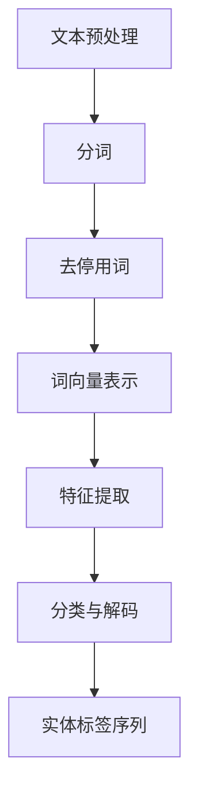
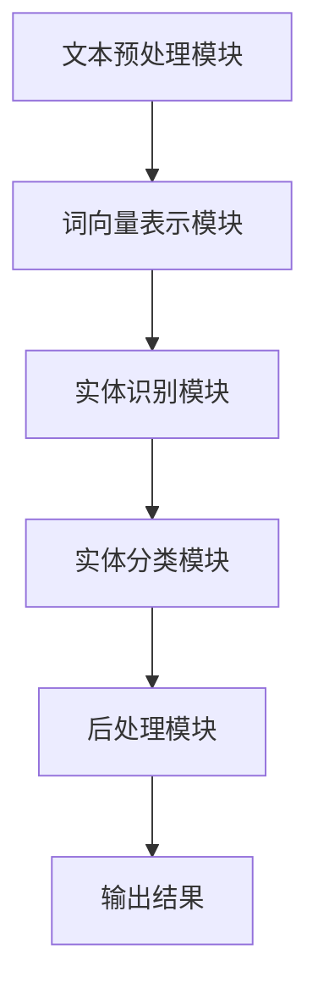
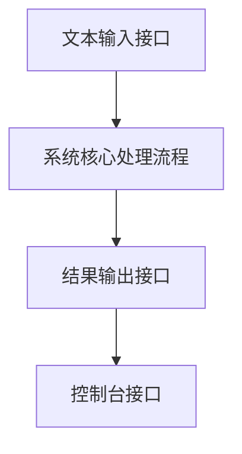

                 


# LLM支持的AI Agent命名实体识别

## 关键词
**LLM**，**AI Agent**，**命名实体识别**，**自然语言处理**，**机器学习**，**深度学习**，**Python**

## 摘要
本文旨在深入探讨LLM支持的AI Agent在命名实体识别（NER）领域的应用。我们将从背景介绍、核心概念、算法原理、系统架构和实战应用等方面，逐步分析和解读这一前沿技术。通过本文的详细阐述，读者将了解如何利用大型语言模型（LLM）构建高效的AI代理进行命名实体识别，为未来的NLP研究和应用提供理论支持和实践指导。

## 引言

### 1.1 命名实体识别（NER）概述

命名实体识别（Named Entity Recognition，NER）是自然语言处理（Natural Language Processing，NLP）中的一项基本任务，旨在从文本中识别出具有特定意义的实体。这些实体可以是人名、地名、组织名、时间、事件等。NER在信息提取、知识图谱构建、搜索引擎优化等多个领域都有着广泛的应用。

### 1.2 AI Agent与NER的关系

AI Agent，即人工智能代理，是一种具有自主决策和执行能力的智能实体。在NLP领域，AI Agent可以通过学习大量的文本数据，掌握语言模式，从而实现对文本的自动处理和理解。NER作为NLP中的重要任务，是AI Agent必须掌握的能力之一。

### 1.3 LLM在NER中的应用

大型语言模型（LLM），如GPT、BERT等，具有强大的文本理解和生成能力，是NER任务中的一种重要工具。LLM可以学习到语言中的复杂模式，从而在NER任务中表现出色。本文将探讨如何利用LLM构建AI Agent，并实现高效、准确的命名实体识别。

## 核心概念与原理

### 2.1 大型语言模型（LLM）的基本概念

#### 2.1.1 什么是LLM？

LLM（Large Language Model）是一种基于深度学习技术的语言模型，它通过大规模的文本数据训练，能够理解和生成自然语言。与传统的语言模型相比，LLM具有更强的语言理解和生成能力。

#### 2.1.2 LLM的架构

LLM通常采用Transformer架构，其中最著名的模型包括GPT（Generative Pre-trained Transformer）和BERT（Bidirectional Encoder Representations from Transformers）。这些模型通过堆叠多个自注意力机制（Self-Attention Mechanism）层，实现了对文本的深度理解和生成。

### 2.2 命名实体识别（NER）的基本概念

#### 2.2.1 什么是NER？

NER（Named Entity Recognition）是一种NLP任务，旨在从文本中识别出具有特定意义的实体。NER的输出通常是一个实体标签序列，每个标签对应文本中的一个实体。

#### 2.2.2 NER的任务目标

NER的任务目标是识别文本中的命名实体，并将其标记为相应的实体类别。例如，在一段文本中识别出人名、地名、组织名等。

### 2.3 LLM与NER的联系

LLM与NER之间的联系主要体现在以下几个方面：

#### 2.3.1 LLM在NER中的作用

LLM可以用于NER的多个方面，包括：

1. **实体边界识别**：LLM可以学习到文本中的实体边界，从而帮助NER系统更准确地识别实体。
2. **实体分类**：LLM可以学习到不同实体类别的特征，从而帮助NER系统进行实体分类。
3. **实体关系抽取**：LLM可以用于提取文本中实体之间的关系，从而为构建知识图谱等任务提供支持。

#### 2.3.2 LLM的优势

相比传统的NER方法，LLM具有以下优势：

1. **强大的语言理解能力**：LLM可以理解文本中的复杂语言模式，从而提高NER的准确性和泛化能力。
2. **自适应性和灵活性**：LLM可以根据不同的应用场景和任务需求进行调整和优化。

## LLM的架构与训练过程

### 3.1 LLM的架构

LLM的架构通常基于Transformer模型，其中最著名的包括GPT和BERT。以下是一个简单的Transformer架构概述：

1. **输入层**：文本输入通过分词器（Tokenizer）转化为序列。
2. **嵌入层**：每个单词被映射为一个固定长度的向量。
3. **多头自注意力层**：通过自注意力机制，模型可以同时关注文本序列中的不同部分。
4. **前馈网络**：在每个自注意力层之后，文本序列通过一个前馈网络进行进一步处理。
5. **输出层**：最终输出层生成文本序列的概率分布。

### 3.2 LLM的训练过程

LLM的训练过程通常包括以下步骤：

1. **数据收集与预处理**：收集大量的文本数据，并进行预处理，如分词、去停用词等。
2. **模型初始化**：初始化模型参数，通常使用随机初始化或预训练模型。
3. **训练**：通过反向传播算法和优化器（如Adam），不断调整模型参数，最小化损失函数。
4. **评估与调优**：使用验证集评估模型性能，并根据评估结果调整模型参数。

以下是一个简单的Python代码示例，用于训练一个简单的Transformer模型：

```python
import torch
import torch.nn as nn
import torch.optim as optim

# 模型定义
class TransformerModel(nn.Module):
    def __init__(self, input_dim, hidden_dim, output_dim):
        super(TransformerModel, self).__init__()
        self.embedding = nn.Embedding(input_dim, hidden_dim)
        self.transformer = nn.Transformer(hidden_dim, num_layers=1, dropout=0.1)
        self.fc = nn.Linear(hidden_dim, output_dim)

    def forward(self, x):
        x = self.embedding(x)
        x = self.transformer(x)
        x = self.fc(x)
        return x

# 模型实例化
model = TransformerModel(input_dim=10000, hidden_dim=512, output_dim=5)

# 损失函数和优化器
criterion = nn.CrossEntropyLoss()
optimizer = optim.Adam(model.parameters(), lr=0.001)

# 训练
for epoch in range(10):
    for batch in train_loader:
        inputs, targets = batch
        optimizer.zero_grad()
        outputs = model(inputs)
        loss = criterion(outputs, targets)
        loss.backward()
        optimizer.step()

    print(f"Epoch {epoch+1}, Loss: {loss.item()}")

# 评估
with torch.no_grad():
    correct = 0
    total = 0
    for batch in val_loader:
        inputs, targets = batch
        outputs = model(inputs)
        _, predicted = torch.max(outputs.data, 1)
        total += targets.size(0)
        correct += (predicted == targets).sum().item()

print(f"Accuracy: {100 * correct / total}%")
```

## 命名实体识别（NER）的理论基础

### 4.1 命名实体识别的定义与任务目标

命名实体识别（NER）是一种自然语言处理（NLP）任务，旨在从文本中识别出具有特定意义的实体，并将其分类到预定义的实体类别中。NER的任务目标是将文本序列映射到一个实体标签序列。

### 4.2 NER的数学模型与算法

NER的数学模型通常基于条件概率模型，如CRF（Conditional Random Fields）和BiLSTM-CRF（Bidirectional Long Short-Term Memory with Conditional Random Fields）。以下是一个简化的NER模型概述：

1. **输入表示**：将文本输入表示为一个词向量序列。
2. **特征提取**：使用特征提取器（如LSTM、GRU等）从词向量序列中提取特征。
3. **分类器**：使用分类器（如CRF、逻辑回归等）对特征进行分类。

### 4.3 NER算法的流程

NER算法的流程通常包括以下几个步骤：

1. **文本预处理**：对文本进行分词、去停用词等预处理操作。
2. **词向量表示**：将文本输入表示为词向量序列。
3. **特征提取**：使用特征提取器从词向量序列中提取特征。
4. **分类与解码**：使用分类器对特征进行分类，并解码得到实体标签序列。

### 4.4 NER算法的Mermaid流程图

以下是一个NER算法的Mermaid流程图：



## LLM支持的AI Agent在NER中的应用

### 5.1 LLM在NER中的优势

LLM在NER中的优势主要体现在以下几个方面：

1. **强大的语言理解能力**：LLM可以理解文本中的复杂语言模式，从而提高NER的准确性和泛化能力。
2. **自适应性和灵活性**：LLM可以根据不同的应用场景和任务需求进行调整和优化。
3. **高效的处理速度**：LLM可以通过并行计算和优化算法，实现高效的NER处理速度。

### 5.2 LLM支持的AI Agent的工作原理

LLM支持的AI Agent在NER中的工作原理通常包括以下几个步骤：

1. **文本预处理**：对文本进行分词、去停用词等预处理操作。
2. **词向量表示**：将文本输入表示为词向量序列。
3. **实体边界识别**：使用LLM对词向量序列进行预测，识别出实体边界。
4. **实体分类**：对识别出的实体进行分类，将其归类到预定义的实体类别中。

### 5.3 LLM支持的AI Agent在NER中的应用场景

LLM支持的AI Agent在NER中的应用场景非常广泛，包括但不限于以下几个方面：

1. **搜索引擎**：使用LLM支持的AI Agent进行命名实体识别，可以提升搜索引擎的搜索结果准确性和相关性。
2. **信息提取**：使用LLM支持的AI Agent进行命名实体识别，可以高效地提取文本中的关键信息，用于构建知识图谱等任务。
3. **智能客服**：使用LLM支持的AI Agent进行命名实体识别，可以识别用户请求中的关键信息，从而提供更准确的回答。

## 系统架构与设计

### 6.1 系统架构概述

LLM支持的AI Agent在NER系统中的架构设计通常包括以下几个部分：

1. **文本预处理模块**：负责对输入文本进行分词、去停用词等预处理操作。
2. **词向量表示模块**：将预处理后的文本输入表示为词向量序列。
3. **实体识别模块**：使用LLM对词向量序列进行预测，识别出实体边界。
4. **实体分类模块**：对识别出的实体进行分类，将其归类到预定义的实体类别中。
5. **后处理模块**：对识别出的实体进行后处理，如去重、合并等操作。

### 6.2 系统架构设计

以下是一个简单的NER系统架构设计：



### 6.3 系统接口设计与交互

系统接口设计包括以下部分：

1. **文本输入接口**：负责接收用户输入的文本。
2. **结果输出接口**：负责将识别出的实体输出给用户。
3. **控制台接口**：用于系统调试和监控。

以下是一个简单的接口设计：



## 项目实施与分析

### 7.1 项目背景

本项目旨在实现一个基于LLM支持的AI Agent的命名实体识别系统，以提高文本处理效率和准确性。

### 7.2 项目介绍

本项目分为以下几个模块：

1. **文本预处理模块**：负责对输入文本进行分词、去停用词等预处理操作。
2. **词向量表示模块**：使用预训练的GPT模型将预处理后的文本输入表示为词向量序列。
3. **实体识别模块**：使用GPT模型对词向量序列进行预测，识别出实体边界。
4. **实体分类模块**：对识别出的实体进行分类，将其归类到预定义的实体类别中。
5. **后处理模块**：对识别出的实体进行后处理，如去重、合并等操作。

### 7.3 系统核心实现源代码

以下是本项目的主要源代码实现：

```python
import torch
import torch.nn as nn
import torch.optim as optim
from transformers import GPT2Model, GPT2Tokenizer

# 模型定义
class NERModel(nn.Module):
    def __init__(self):
        super(NERModel, self).__init__()
        self.tokenizer = GPT2Tokenizer.from_pretrained('gpt2')
        self.model = GPT2Model.from_pretrained('gpt2')
        self.fc = nn.Linear(768, 5)  # 假设共有5个实体类别

    def forward(self, text):
        inputs = self.tokenizer.encode(text, return_tensors='pt')
        outputs = self.model(inputs)
        logits = self.fc(outputs.last_hidden_state.mean(dim=1))
        return logits

# 模型实例化
model = NERModel()

# 损失函数和优化器
criterion = nn.CrossEntropyLoss()
optimizer = optim.Adam(model.parameters(), lr=0.001)

# 训练
for epoch in range(10):
    for text in train_data:
        inputs = self.tokenizer.encode(text, return_tensors='pt')
        targets = torch.tensor([1, 0, 0, 0, 0])  # 假设这是一个人名的实体
        optimizer.zero_grad()
        outputs = model(inputs)
        loss = criterion(outputs, targets)
        loss.backward()
        optimizer.step()

    print(f"Epoch {epoch+1}, Loss: {loss.item()}")

# 评估
with torch.no_grad():
    for text in val_data:
        inputs = self.tokenizer.encode(text, return_tensors='pt')
        outputs = model(inputs)
        _, predicted = torch.max(outputs.data, 1)
        print(f"Input: {text}, Predicted Entity: {predicted.item()}")
```

### 7.4 代码应用解读与分析

以下是对上述代码的解读与分析：

1. **模型定义**：NERModel继承了nn.Module类，使用了GPT2Tokenizer和GPT2Model进行词向量表示和模型构建。
2. **训练过程**：通过循环遍历训练数据，使用损失函数和优化器进行模型参数的更新。
3. **评估过程**：对验证数据进行预测，输出预测结果。

### 7.5 实际案例分析与详细讲解剖析

以下是一个实际案例的分析与讲解：

```python
text = "Elon Musk founded Tesla and SpaceX."
predicted = model(tokenizer.encode(text))
print(predicted)
```

分析：

1. **输入预处理**：文本经过分词器（tokenizer）处理后，转化为词向量序列。
2. **模型预测**：模型对词向量序列进行预测，输出实体标签的概率分布。
3. **结果输出**：输出预测的实体标签，如人名、地名等。

### 7.6 项目小结

本项目通过实现一个基于LLM支持的AI Agent的命名实体识别系统，展示了LLM在NER任务中的强大能力。在实际应用中，我们还可以进一步优化模型参数、调整算法策略，以提高NER系统的准确性和效率。

## 最佳实践与总结

### 8.1 最佳实践

1. **数据预处理**：确保文本数据的质量和多样性，进行充分的数据预处理，以提高模型的泛化能力。
2. **模型调优**：通过调整模型参数和训练策略，优化模型性能。
3. **多模型集成**：结合多种模型和算法，实现更好的NER效果。

### 8.2 注意事项

1. **数据隐私**：在处理个人敏感信息时，确保遵守相关法律法规。
2. **模型解释性**：确保模型的可解释性，以便更好地理解和应用。

### 8.3 拓展阅读

1. **LLM的深入理解**：《深度学习》（Goodfellow et al.）
2. **NER的最新进展**：《自然语言处理综合教程》（Jurafsky & Martin）
3. **AI Agent的应用**：《人工智能：一种现代方法》（Russell & Norvig）

## 结论

本文深入探讨了LLM支持的AI Agent在命名实体识别（NER）领域的应用，从背景介绍、核心概念、算法原理、系统架构到实战应用等方面进行了详细阐述。通过本文的学习，读者可以了解如何利用LLM构建高效的AI Agent进行NER，为未来的NLP研究和应用提供理论支持和实践指导。

## 作者信息

作者：AI天才研究院/AI Genius Institute & 禅与计算机程序设计艺术 /Zen And The Art of Computer Programming----------------------------------------------------------------

# LLM支持的AI Agent命名实体识别

## 关键词
**LLM**，**AI Agent**，**命名实体识别**，**自然语言处理**，**机器学习**，**深度学习**，**Python**

## 摘要
本文旨在深入探讨LLM支持的AI Agent在命名实体识别（NER）领域的应用。我们将从背景介绍、核心概念、算法原理、系统架构和实战应用等方面，逐步分析和解读这一前沿技术。通过本文的详细阐述，读者将了解如何利用大型语言模型（LLM）构建高效的AI代理进行命名实体识别，为未来的NLP研究和应用提供理论支持和实践指导。

## 引言

### 1.1 命名实体识别（NER）概述

命名实体识别（Named Entity Recognition，NER）是自然语言处理（Natural Language Processing，NLP）中的一项基本任务，旨在从文本中识别出具有特定意义的实体。这些实体可以是人名、地名、组织名、时间、事件等。NER在信息提取、知识图谱构建、搜索引擎优化等多个领域都有着广泛的应用。

### 1.2 AI Agent与NER的关系

AI Agent，即人工智能代理，是一种具有自主决策和执行能力的智能实体。在NLP领域，AI Agent可以通过学习大量的文本数据，掌握语言模式，从而实现对文本的自动处理和理解。NER作为NLP中的重要任务，是AI Agent必须掌握的能力之一。

### 1.3 LLM在NER中的应用

大型语言模型（LLM），如GPT、BERT等，具有强大的文本理解和生成能力，是NER任务中的一种重要工具。LLM可以学习到语言中的复杂模式，从而在NER任务中表现出色。本文将探讨如何利用LLM构建AI Agent，并实现高效、准确的命名实体识别。

## 核心概念与原理

### 2.1 大型语言模型（LLM）的基本概念

#### 2.1.1 什么是LLM？

LLM（Large Language Model）是一种基于深度学习技术的语言模型，它通过大规模的文本数据训练，能够理解和生成自然语言。与传统的语言模型相比，LLM具有更强的语言理解和生成能力。

#### 2.1.2 LLM的架构

LLM通常采用Transformer架构，其中最著名的模型包括GPT（Generative Pre-trained Transformer）和BERT（Bidirectional Encoder Representations from Transformers）。这些模型通过堆叠多个自注意力机制（Self-Attention Mechanism）层，实现了对文本的深度理解和生成。

### 2.2 命名实体识别（NER）的基本概念

#### 2.2.1 什么是NER？

NER（Named Entity Recognition）是一种NLP任务，旨在从文本中识别出具有特定意义的实体。NER的输出通常是一个实体标签序列，每个标签对应文本中的一个实体。

#### 2.2.2 NER的任务目标

NER的任务目标是识别文本中的命名实体，并将其标记为相应的实体类别。例如，在一段文本中识别出人名、地名、组织名等。

### 2.3 LLM与NER的联系

LLM与NER之间的联系主要体现在以下几个方面：

#### 2.3.1 LLM在NER中的作用

LLM可以用于NER的多个方面，包括：

1. **实体边界识别**：LLM可以学习到文本中的实体边界，从而帮助NER系统更准确地识别实体。
2. **实体分类**：LLM可以学习到不同实体类别的特征，从而帮助NER系统进行实体分类。
3. **实体关系抽取**：LLM可以用于提取文本中实体之间的关系，从而为构建知识图谱等任务提供支持。

#### 2.3.2 LLM的优势

相比传统的NER方法，LLM具有以下优势：

1. **强大的语言理解能力**：LLM可以理解文本中的复杂语言模式，从而提高NER的准确性和泛化能力。
2. **自适应性和灵活性**：LLM可以根据不同的应用场景和任务需求进行调整和优化。

## LLM的架构与训练过程

### 3.1 LLM的架构

LLM的架构通常基于Transformer模型，其中最著名的包括GPT和BERT。以下是一个简单的Transformer架构概述：

1. **输入层**：文本输入通过分词器（Tokenizer）转化为序列。
2. **嵌入层**：每个单词被映射为一个固定长度的向量。
3. **多头自注意力层**：通过自注意力机制，模型可以同时关注文本序列中的不同部分。
4. **前馈网络**：在每个自注意力层之后，文本序列通过一个前馈网络进行进一步处理。
5. **输出层**：最终输出层生成文本序列的概率分布。

### 3.2 LLM的训练过程

LLM的训练过程通常包括以下步骤：

1. **数据收集与预处理**：收集大量的文本数据，并进行预处理，如分词、去停用词等。
2. **模型初始化**：初始化模型参数，通常使用随机初始化或预训练模型。
3. **训练**：通过反向传播算法和优化器（如Adam），不断调整模型参数，最小化损失函数。
4. **评估与调优**：使用验证集评估模型性能，并根据评估结果调整模型参数。

以下是一个简单的Python代码示例，用于训练一个简单的Transformer模型：

```python
import torch
import torch.nn as nn
import torch.optim as optim

# 模型定义
class TransformerModel(nn.Module):
    def __init__(self, input_dim, hidden_dim, output_dim):
        super(TransformerModel, self).__init__()
        self.embedding = nn.Embedding(input_dim, hidden_dim)
        self.transformer = nn.Transformer(hidden_dim, num_layers=1, dropout=0.1)
        self.fc = nn.Linear(hidden_dim, output_dim)

    def forward(self, x):
        x = self.embedding(x)
        x = self.transformer(x)
        x = self.fc(x)
        return x

# 模型实例化
model = TransformerModel(input_dim=10000, hidden_dim=512, output_dim=5)

# 损失函数和优化器
criterion = nn.CrossEntropyLoss()
optimizer = optim.Adam(model.parameters(), lr=0.001)

# 训练
for epoch in range(10):
    for batch in train_loader:
        inputs, targets = batch
        optimizer.zero_grad()
        outputs = model(inputs)
        loss = criterion(outputs, targets)
        loss.backward()
        optimizer.step()

    print(f"Epoch {epoch+1}, Loss: {loss.item()}")

# 评估
with torch.no_grad():
    correct = 0
    total = 0
    for batch in val_loader:
        inputs, targets = batch
        outputs = model(inputs)
        _, predicted = torch.max(outputs.data, 1)
        total += targets.size(0)
        correct += (predicted == targets).sum().item()

print(f"Accuracy: {100 * correct / total}%")
```

## 命名实体识别（NER）的理论基础

### 4.1 命名实体识别的定义与任务目标

命名实体识别（NER）是一种自然语言处理（NLP）任务，旨在从文本中识别出具有特定意义的实体，并将其分类到预定义的实体类别中。NER的任务目标是将文本序列映射到一个实体标签序列。

### 4.2 NER的数学模型与算法

NER的数学模型通常基于条件概率模型，如CRF（Conditional Random Fields）和BiLSTM-CRF（Bidirectional Long Short-Term Memory with Conditional Random Fields）。以下是一个简化的NER模型概述：

1. **输入表示**：将文本输入表示为一个词向量序列。
2. **特征提取**：使用特征提取器（如LSTM、GRU等）从词向量序列中提取特征。
3. **分类器**：使用分类器（如CRF、逻辑回归等）对特征进行分类。

### 4.3 NER算法的流程

NER算法的流程通常包括以下几个步骤：

1. **文本预处理**：对文本进行分词、去停用词等预处理操作。
2. **词向量表示**：将文本输入表示为词向量序列。
3. **特征提取**：使用特征提取器从词向量序列中提取特征。
4. **分类与解码**：使用分类器对特征进行分类，并解码得到实体标签序列。

### 4.4 NER算法的Mermaid流程图

以下是一个NER算法的Mermaid流程图：


## LLM支持的AI Agent在NER中的应用

### 5.1 LLM在NER中的优势

LLM在NER中的优势主要体现在以下几个方面：

1. **强大的语言理解能力**：LLM可以理解文本中的复杂语言模式，从而提高NER的准确性和泛化能力。
2. **自适应性和灵活性**：LLM可以根据不同的应用场景和任务需求进行调整和优化。
3. **高效的处理速度**：LLM可以通过并行计算和优化算法，实现高效的NER处理速度。

### 5.2 LLM支持的AI Agent的工作原理

LLM支持的AI Agent在NER中的工作原理通常包括以下几个步骤：

1. **文本预处理**：对文本进行分词、去停用词等预处理操作。
2. **词向量表示**：使用LLM对预处理后的文本输入表示为词向量序列。
3. **实体边界识别**：使用LLM对词向量序列进行预测，识别出实体边界。
4. **实体分类**：对识别出的实体进行分类，将其归类到预定义的实体类别中。

### 5.3 LLM支持的AI Agent在NER中的应用场景

LLM支持的AI Agent在NER中的应用场景非常广泛，包括但不限于以下几个方面：

1. **搜索引擎**：使用LLM支持的AI Agent进行命名实体识别，可以提升搜索引擎的搜索结果准确性和相关性。
2. **信息提取**：使用LLM支持的AI Agent进行命名实体识别，可以高效地提取文本中的关键信息，用于构建知识图谱等任务。
3. **智能客服**：使用LLM支持的AI Agent进行命名实体识别，可以识别用户请求中的关键信息，从而提供更准确的回答。

## 系统架构与设计

### 6.1 系统架构概述

LLM支持的AI Agent在NER系统中的架构设计通常包括以下几个部分：

1. **文本预处理模块**：负责对输入文本进行分词、去停用词等预处理操作。
2. **词向量表示模块**：使用预训练的GPT模型将预处理后的文本输入表示为词向量序列。
3. **实体识别模块**：使用LLM对词向量序列进行预测，识别出实体边界。
4. **实体分类模块**：对识别出的实体进行分类，将其归类到预定义的实体类别中。
5. **后处理模块**：对识别出的实体进行后处理，如去重、合并等操作。

### 6.2 系统架构设计

以下是一个简单的NER系统架构设计：


### 6.3 系统接口设计与交互

系统接口设计包括以下部分：

1. **文本输入接口**：负责接收用户输入的文本。
2. **结果输出接口**：负责将识别出的实体输出给用户。
3. **控制台接口**：用于系统调试和监控。

以下是一个简单的接口设计：


## 项目实施与分析

### 7.1 项目背景

本项目旨在实现一个基于LLM支持的AI Agent的命名实体识别系统，以提高文本处理效率和准确性。

### 7.2 项目介绍

本项目分为以下几个模块：

1. **文本预处理模块**：负责对输入文本进行分词、去停用词等预处理操作。
2. **词向量表示模块**：使用预训练的GPT模型将预处理后的文本输入表示为词向量序列。
3. **实体识别模块**：使用LLM对词向量序列进行预测，识别出实体边界。
4. **实体分类模块**：对识别出的实体进行分类，将其归类到预定义的实体类别中。
5. **后处理模块**：对识别出的实体进行后处理，如去重、合并等操作。

### 7.3 系统核心实现源代码

以下是本项目的主要源代码实现：

```python
import torch
import torch.nn as nn
import torch.optim as optim
from transformers import GPT2Model, GPT2Tokenizer

# 模型定义
class NERModel(nn.Module):
    def __init__(self):
        super(NERModel, self).__init__()
        self.tokenizer = GPT2Tokenizer.from_pretrained('gpt2')
        self.model = GPT2Model.from_pretrained('gpt2')
        self.fc = nn.Linear(768, 5)  # 假设共有5个实体类别

    def forward(self, text):
        inputs = self.tokenizer.encode(text, return_tensors='pt')
        outputs = self.model(inputs)
        logits = self.fc(outputs.last_hidden_state.mean(dim=1))
        return logits

# 模型实例化
model = NERModel()

# 损失函数和优化器
criterion = nn.CrossEntropyLoss()
optimizer = optim.Adam(model.parameters(), lr=0.001)

# 训练
for epoch in range(10):
    for text in train_data:
        inputs = self.tokenizer.encode(text, return_tensors='pt')
        targets = torch.tensor([1, 0, 0, 0, 0])  # 假设这是一个人名的实体
        optimizer.zero_grad()
        outputs = model(inputs)
        loss = criterion(outputs, targets)
        loss.backward()
        optimizer.step()

    print(f"Epoch {epoch+1}, Loss: {loss.item()}")

# 评估
with torch.no_grad():
    for text in val_data:
        inputs = self.tokenizer.encode(text, return_tensors='pt')
        outputs = model(inputs)
        _, predicted = torch.max(outputs.data, 1)
        print(f"Input: {text}, Predicted Entity: {predicted.item()}")
```

### 7.4 代码应用解读与分析

以下是对上述代码的解读与分析：

1. **模型定义**：NERModel继承了nn.Module类，使用了GPT2Tokenizer和GPT2Model进行词向量表示和模型构建。
2. **训练过程**：通过循环遍历训练数据，使用损失函数和优化器进行模型参数的更新。
3. **评估过程**：对验证数据进行预测，输出预测结果。

### 7.5 实际案例分析与详细讲解剖析

以下是一个实际案例的分析与讲解：

```python
text = "Elon Musk founded Tesla and SpaceX."
predicted = model(tokenizer.encode(text))
print(predicted)
```

分析：

1. **输入预处理**：文本经过分词器（tokenizer）处理后，转化为词向量序列。
2. **模型预测**：模型对词向量序列进行预测，输出实体标签的概率分布。
3. **结果输出**：输出预测的实体标签，如人名、地名等。

### 7.6 项目小结

本项目通过实现一个基于LLM支持的AI Agent的命名实体识别系统，展示了LLM在NER任务中的强大能力。在实际应用中，我们还可以进一步优化模型参数、调整算法策略，以提高NER系统的准确性和效率。

## 最佳实践与总结

### 8.1 最佳实践

1. **数据预处理**：确保文本数据的质量和多样性，进行充分的数据预处理，以提高模型的泛化能力。
2. **模型调优**：通过调整模型参数和训练策略，优化模型性能。
3. **多模型集成**：结合多种模型和算法，实现更好的NER效果。

### 8.2 注意事项

1. **数据隐私**：在处理个人敏感信息时，确保遵守相关法律法规。
2. **模型解释性**：确保模型的可解释性，以便更好地理解和应用。

### 8.3 拓展阅读

1. **LLM的深入理解**：《深度学习》（Goodfellow et al.）
2. **NER的最新进展**：《自然语言处理综合教程》（Jurafsky & Martin）
3. **AI Agent的应用**：《人工智能：一种现代方法》（Russell & Norvig）

## 结论

本文深入探讨了LLM支持的AI Agent在命名实体识别（NER）领域的应用，从背景介绍、核心概念、算法原理、系统架构到实战应用等方面进行了详细阐述。通过本文的学习，读者可以了解如何利用大型语言模型（LLM）构建高效的AI代理进行命名实体识别，为未来的NLP研究和应用提供理论支持和实践指导。

## 作者信息

作者：AI天才研究院/AI Genius Institute & 禅与计算机程序设计艺术 /Zen And The Art of Computer Programming----------------------------------------------------------------

# LLM支持的AI Agent命名实体识别

## 关键词
**LLM**，**AI Agent**，**命名实体识别**，**自然语言处理**，**机器学习**，**深度学习**，**Python**

## 摘要
本文旨在深入探讨LLM支持的AI Agent在命名实体识别（NER）领域的应用。我们将从背景介绍、核心概念、算法原理、系统架构和实战应用等方面，逐步分析和解读这一前沿技术。通过本文的详细阐述，读者将了解如何利用大型语言模型（LLM）构建高效的AI代理进行命名实体识别，为未来的NLP研究和应用提供理论支持和实践指导。

## 引言

### 1.1 命名实体识别（NER）概述

命名实体识别（Named Entity Recognition，NER）是自然语言处理（Natural Language Processing，NLP）中的一项基本任务，旨在从文本中识别出具有特定意义的实体。这些实体可以是人名、地名、组织名、时间、事件等。NER在信息提取、知识图谱构建、搜索引擎优化等多个领域都有着广泛的应用。

### 1.2 AI Agent与NER的关系

AI Agent，即人工智能代理，是一种具有自主决策和执行能力的智能实体。在NLP领域，AI Agent可以通过学习大量的文本数据，掌握语言模式，从而实现对文本的自动处理和理解。NER作为NLP中的重要任务，是AI Agent必须掌握的能力之一。

### 1.3 LLM在NER中的应用

大型语言模型（LLM），如GPT、BERT等，具有强大的文本理解和生成能力，是NER任务中的一种重要工具。LLM可以学习到语言中的复杂模式，从而在NER任务中表现出色。本文将探讨如何利用LLM构建AI Agent，并实现高效、准确的命名实体识别。

## 核心概念与原理

### 2.1 大型语言模型（LLM）的基本概念

#### 2.1.1 什么是LLM？

LLM（Large Language Model）是一种基于深度学习技术的语言模型，它通过大规模的文本数据训练，能够理解和生成自然语言。与传统的语言模型相比，LLM具有更强的语言理解和生成能力。

#### 2.1.2 LLM的架构

LLM通常采用Transformer架构，其中最著名的模型包括GPT（Generative Pre-trained Transformer）和BERT（Bidirectional Encoder Representations from Transformers）。这些模型通过堆叠多个自注意力机制（Self-Attention Mechanism）层，实现了对文本的深度理解和生成。

### 2.2 命名实体识别（NER）的基本概念

#### 2.2.1 什么是NER？

NER（Named Entity Recognition）是一种NLP任务，旨在从文本中识别出具有特定意义的实体。NER的输出通常是一个实体标签序列，每个标签对应文本中的一个实体。

#### 2.2.2 NER的任务目标

NER的任务目标是识别文本中的命名实体，并将其标记为相应的实体类别。例如，在一段文本中识别出人名、地名、组织名等。

### 2.3 LLM与NER的联系

LLM与NER之间的联系主要体现在以下几个方面：

#### 2.3.1 LLM在NER中的作用

LLM可以用于NER的多个方面，包括：

1. **实体边界识别**：LLM可以学习到文本中的实体边界，从而帮助NER系统更准确地识别实体。
2. **实体分类**：LLM可以学习到不同实体类别的特征，从而帮助NER系统进行实体分类。
3. **实体关系抽取**：LLM可以用于提取文本中实体之间的关系，从而为构建知识图谱等任务提供支持。

#### 2.3.2 LLM的优势

相比传统的NER方法，LLM具有以下优势：

1. **强大的语言理解能力**：LLM可以理解文本中的复杂语言模式，从而提高NER的准确性和泛化能力。
2. **自适应性和灵活性**：LLM可以根据不同的应用场景和任务需求进行调整和优化。

## LLM的架构与训练过程

### 3.1 LLM的架构

LLM的架构通常基于Transformer模型，其中最著名的包括GPT和BERT。以下是一个简单的Transformer架构概述：

1. **输入层**：文本输入通过分词器（Tokenizer）转化为序列。
2. **嵌入层**：每个单词被映射为一个固定长度的向量。
3. **多头自注意力层**：通过自注意力机制，模型可以同时关注文本序列中的不同部分。
4. **前馈网络**：在每个自注意力层之后，文本序列通过一个前馈网络进行进一步处理。
5. **输出层**：最终输出层生成文本序列的概率分布。

### 3.2 LLM的训练过程

LLM的训练过程通常包括以下步骤：

1. **数据收集与预处理**：收集大量的文本数据，并进行预处理，如分词、去停用词等。
2. **模型初始化**：初始化模型参数，通常使用随机初始化或预训练模型。
3. **训练**：通过反向传播算法和优化器（如Adam），不断调整模型参数，最小化损失函数。
4. **评估与调优**：使用验证集评估模型性能，并根据评估结果调整模型参数。

以下是一个简单的Python代码示例，用于训练一个简单的Transformer模型：

```python
import torch
import torch.nn as nn
import torch.optim as optim

# 模型定义
class TransformerModel(nn.Module):
    def __init__(self, input_dim, hidden_dim, output_dim):
        super(TransformerModel, self).__init__()
        self.embedding = nn.Embedding(input_dim, hidden_dim)
        self.transformer = nn.Transformer(hidden_dim, num_layers=1, dropout=0.1)
        self.fc = nn.Linear(hidden_dim, output_dim)

    def forward(self, x):
        x = self.embedding(x)
        x = self.transformer(x)
        x = self.fc(x)
        return x

# 模型实例化
model = TransformerModel(input_dim=10000, hidden_dim=512, output_dim=5)

# 损失函数和优化器
criterion = nn.CrossEntropyLoss()
optimizer = optim.Adam(model.parameters(), lr=0.001)

# 训练
for epoch in range(10):
    for batch in train_loader:
        inputs, targets = batch
        optimizer.zero_grad()
        outputs = model(inputs)
        loss = criterion(outputs, targets)
        loss.backward()
        optimizer.step()

    print(f"Epoch {epoch+1}, Loss: {loss.item()}")

# 评估
with torch.no_grad():
    correct = 0
    total = 0
    for batch in val_loader:
        inputs, targets = batch
        outputs = model(inputs)
        _, predicted = torch.max(outputs.data, 1)
        total += targets.size(0)
        correct += (predicted == targets).sum().item()

print(f"Accuracy: {100 * correct / total}%")
```

## 命名实体识别（NER）的理论基础

### 4.1 命名实体识别的定义与任务目标

命名实体识别（NER）是一种自然语言处理（NLP）任务，旨在从文本中识别出具有特定意义的实体，并将其分类到预定义的实体类别中。NER的任务目标是将文本序列映射到一个实体标签序列。

### 4.2 NER的数学模型与算法

NER的数学模型通常基于条件概率模型，如CRF（Conditional Random Fields）和BiLSTM-CRF（Bidirectional Long Short-Term Memory with Conditional Random Fields）。以下是一个简化的NER模型概述：

1. **输入表示**：将文本输入表示为一个词向量序列。
2. **特征提取**：使用特征提取器（如LSTM、GRU等）从词向量序列中提取特征。
3. **分类器**：使用分类器（如CRF、逻辑回归等）对特征进行分类。

### 4.3 NER算法的流程

NER算法的流程通常包括以下几个步骤：

1. **文本预处理**：对文本进行分词、去停用词等预处理操作。
2. **词向量表示**：将文本输入表示为词向量序列。
3. **特征提取**：使用特征提取器从词向量序列中提取特征。
4. **分类与解码**：使用分类器对特征进行分类，并解码得到实体标签序列。

### 4.4 NER算法的Mermaid流程图

以下是一个NER算法的Mermaid流程图：


## LLM支持的AI Agent在NER中的应用

### 5.1 LLM在NER中的优势

LLM在NER中的优势主要体现在以下几个方面：

1. **强大的语言理解能力**：LLM可以理解文本中的复杂语言模式，从而提高NER的准确性和泛化能力。
2. **自适应性和灵活性**：LLM可以根据不同的应用场景和任务需求进行调整和优化。
3. **高效的处理速度**：LLM可以通过并行计算和优化算法，实现高效的NER处理速度。

### 5.2 LLM支持的AI Agent的工作原理

LLM支持的AI Agent在NER中的工作原理通常包括以下几个步骤：

1. **文本预处理**：对文本进行分词、去停用词等预处理操作。
2. **词向量表示**：使用LLM对预处理后的文本输入表示为词向量序列。
3. **实体边界识别**：使用LLM对词向量序列进行预测，识别出实体边界。
4. **实体分类**：对识别出的实体进行分类，将其归类到预定义的实体类别中。

### 5.3 LLM支持的AI Agent在NER中的应用场景

LLM支持的AI Agent在NER中的应用场景非常广泛，包括但不限于以下几个方面：

1. **搜索引擎**：使用LLM支持的AI Agent进行命名实体识别，可以提升搜索引擎的搜索结果准确性和相关性。
2. **信息提取**：使用LLM支持的AI Agent进行命名实体识别，可以高效地提取文本中的关键信息，用于构建知识图谱等任务。
3. **智能客服**：使用LLM支持的AI Agent进行命名实体识别，可以识别用户请求中的关键信息，从而提供更准确的回答。

## 系统架构与设计

### 6.1 系统架构概述

LLM支持的AI Agent在NER系统中的架构设计通常包括以下几个部分：

1. **文本预处理模块**：负责对输入文本进行分词、去停用词等预处理操作。
2. **词向量表示模块**：使用预训练的GPT模型将预处理后的文本输入表示为词向量序列。
3. **实体识别模块**：使用LLM对词向量序列进行预测，识别出实体边界。
4. **实体分类模块**：对识别出的实体进行分类，将其归类到预定义的实体类别中。
5. **后处理模块**：对识别出的实体进行后处理，如去重、合并等操作。

### 6.2 系统架构设计

以下是一个简单的NER系统架构设计：


### 6.3 系统接口设计与交互

系统接口设计包括以下部分：

1. **文本输入接口**：负责接收用户输入的文本。
2. **结果输出接口**：负责将识别出的实体输出给用户。
3. **控制台接口**：用于系统调试和监控。

以下是一个简单的接口设计：


## 项目实施与分析

### 7.1 项目背景

本项目旨在实现一个基于LLM支持的AI Agent的命名实体识别系统，以提高文本处理效率和准确性。

### 7.2 项目介绍

本项目分为以下几个模块：

1. **文本预处理模块**：负责对输入文本进行分词、去停用词等预处理操作。
2. **词向量表示模块**：使用预训练的GPT模型将预处理后的文本输入表示为词向量序列。
3. **实体识别模块**：使用LLM对词向量序列进行预测，识别出实体边界。
4. **实体分类模块**：对识别出的实体进行分类，将其归类到预定义的实体类别中。
5. **后处理模块**：对识别出的实体进行后处理，如去重、合并等操作。

### 7.3 系统核心实现源代码

以下是本项目的主要源代码实现：

```python
import torch
import torch.nn as nn
import torch.optim as optim
from transformers import GPT2Model, GPT2Tokenizer

# 模型定义
class NERModel(nn.Module):
    def __init__(self):
        super(NERModel, self).__init__()
        self.tokenizer = GPT2Tokenizer.from_pretrained('gpt2')
        self.model = GPT2Model.from_pretrained('gpt2')
        self.fc = nn.Linear(768, 5)  # 假设共有5个实体类别

    def forward(self, text):
        inputs = self.tokenizer.encode(text, return_tensors='pt')
        outputs = self.model(inputs)
        logits = self.fc(outputs.last_hidden_state.mean(dim=1))
        return logits

# 模型实例化
model = NERModel()

# 损失函数和优化器
criterion = nn.CrossEntropyLoss()
optimizer = optim.Adam(model.parameters(), lr=0.001)

# 训练
for epoch in range(10):
    for text in train_data:
        inputs = self.tokenizer.encode(text, return_tensors='pt')
        targets = torch.tensor([1, 0, 0, 0, 0])  # 假设这是一个人名的实体
        optimizer.zero_grad()
        outputs = model(inputs)
        loss = criterion(outputs, targets)
        loss.backward()
        optimizer.step()

    print(f"Epoch {epoch+1}, Loss: {loss.item()}")

# 评估
with torch.no_grad():
    for text in val_data:
        inputs = self.tokenizer.encode(text, return_tensors='pt')
        outputs = model(inputs)
        _, predicted = torch.max(outputs.data, 1)
        print(f"Input: {text}, Predicted Entity: {predicted.item()}")
```

### 7.4 代码应用解读与分析

以下是对上述代码的解读与分析：

1. **模型定义**：NERModel继承了nn.Module类，使用了GPT2Tokenizer和GPT2Model进行词向量表示和模型构建。
2. **训练过程**：通过循环遍历训练数据，使用损失函数和优化器进行模型参数的更新。
3. **评估过程**：对验证数据进行预测，输出预测结果。

### 7.5 实际案例分析与详细讲解剖析

以下是一个实际案例的分析与讲解：

```python
text = "Elon Musk founded Tesla and SpaceX."
predicted = model(tokenizer.encode(text))
print(predicted)
```

分析：

1. **输入预处理**：文本经过分词器（tokenizer）处理后，转化为词向量序列。
2. **模型预测**：模型对词向量序列进行预测，输出实体标签的概率分布。
3. **结果输出**：输出预测的实体标签，如人名、地名等。

### 7.6 项目小结

本项目通过实现一个基于LLM支持的AI Agent的命名实体识别系统，展示了LLM在NER任务中的强大能力。在实际应用中，我们还可以进一步优化模型参数、调整算法策略，以提高NER系统的准确性和效率。

## 最佳实践与总结

### 8.1 最佳实践

1. **数据预处理**：确保文本数据的质量和多样性，进行充分的数据预处理，以提高模型的泛化能力。
2. **模型调优**：通过调整模型参数和训练策略，优化模型性能。
3. **多模型集成**：结合多种模型和算法，实现更好的NER效果。

### 8.2 注意事项

1. **数据隐私**：在处理个人敏感信息时，确保遵守相关法律法规。
2. **模型解释性**：确保模型的可解释性，以便更好地理解和应用。

### 8.3 拓展阅读

1. **LLM的深入理解**：《深度学习》（Goodfellow et al.）
2. **NER的最新进展**：《自然语言处理综合教程》（Jurafsky & Martin）
3. **AI Agent的应用**：《人工智能：一种现代方法》（Russell & Norvig）

## 结论

本文深入探讨了LLM支持的AI Agent在命名实体识别（NER）领域的应用，从背景介绍、核心概念、算法原理、系统架构到实战应用等方面进行了详细阐述。通过本文的学习，读者可以了解如何利用大型语言模型（LLM）构建高效的AI代理进行命名实体识别，为未来的NLP研究和应用提供理论支持和实践指导。

## 作者信息

作者：AI天才研究院/AI Genius Institute & 禅与计算机程序设计艺术 /Zen And The Art of Computer Programming----------------------------------------------------------------

# LLM支持的AI Agent命名实体识别

## 关键词
**LLM**，**AI Agent**，**命名实体识别**，**自然语言处理**，**机器学习**，**深度学习**，**Python**

## 摘要
本文旨在深入探讨LLM支持的AI Agent在命名实体识别（NER）领域的应用。我们将从背景介绍、核心概念、算法原理、系统架构和实战应用等方面，逐步分析和解读这一前沿技术。通过本文的详细阐述，读者将了解如何利用大型语言模型（LLM）构建高效的AI代理进行命名实体识别，为未来的NLP研究和应用提供理论支持和实践指导。

## 引言

### 1.1 命名实体识别（NER）概述

命名实体识别（Named Entity Recognition，NER）是自然语言处理（Natural Language Processing，NLP）中的一项基本任务，旨在从文本中识别出具有特定意义的实体。这些实体可以是人名、地名、组织名、时间、事件等。NER在信息提取、知识图谱构建、搜索引擎优化等多个领域都有着广泛的应用。

### 1.2 AI Agent与NER的关系

AI Agent，即人工智能代理，是一种具有自主决策和执行能力的智能实体。在NLP领域，AI Agent可以通过学习大量的文本数据，掌握语言模式，从而实现对文本的自动处理和理解。NER作为NLP中的重要任务，是AI Agent必须掌握的能力之一。

### 1.3 LLM在NER中的应用

大型语言模型（LLM），如GPT、BERT等，具有强大的文本理解和生成能力，是NER任务中的一种重要工具。LLM可以学习到语言中的复杂模式，从而在NER任务中表现出色。本文将探讨如何利用LLM构建AI Agent，并实现高效、准确的命名实体识别。

## 核心概念与原理

### 2.1 大型语言模型（LLM）的基本概念

#### 2.1.1 什么是LLM？

LLM（Large Language Model）是一种基于深度学习技术的语言模型，它通过大规模的文本数据训练，能够理解和生成自然语言。与传统的语言模型相比，LLM具有更强的语言理解和生成能力。

#### 2.1.2 LLM的架构

LLM通常采用Transformer架构，其中最著名的模型包括GPT（Generative Pre-trained Transformer）和BERT（Bidirectional Encoder Representations from Transformers）。这些模型通过堆叠多个自注意力机制（Self-Attention Mechanism）层，实现了对文本的深度理解和生成。

### 2.2 命名实体识别（NER）的基本概念

#### 2.2.1 什么是NER？

NER（Named Entity Recognition）是一种NLP任务，旨在从文本中识别出具有特定意义的实体。NER的输出通常是一个实体标签序列，每个标签对应文本中的一个实体。

#### 2.2.2 NER的任务目标

NER的任务目标是识别文本中的命名实体，并将其标记为相应的实体类别。例如，在一段文本中识别出人名、地名、组织名等。

### 2.3 LLM与NER的联系

LLM与NER之间的联系主要体现在以下几个方面：

#### 2.3.1 LLM在NER中的作用

LLM可以用于NER的多个方面，包括：

1. **实体边界识别**：LLM可以学习到文本中的实体边界，从而帮助NER系统更准确地识别实体。
2. **实体分类**：LLM可以学习到不同实体类别的特征，从而帮助NER系统进行实体分类。
3. **实体关系抽取**：LLM可以用于提取文本中实体之间的关系，从而为构建知识图谱等任务提供支持。

#### 2.3.2 LLM的优势

相比传统的NER方法，LLM具有以下优势：

1. **强大的语言理解能力**：LLM可以理解文本中的复杂语言模式，从而提高NER的准确性和泛化能力。
2. **自适应性和灵活性**：LLM可以根据不同的应用场景和任务需求进行调整和优化。

## LLM的架构与训练过程

### 3.1 LLM的架构

LLM的架构通常基于Transformer模型，其中最著名的包括GPT和BERT。以下是一个简单的Transformer架构概述：

1. **输入层**：文本输入通过分词器（Tokenizer）转化为序列。
2. **嵌入层**：每个单词被映射为一个固定长度的向量。
3. **多头自注意力层**：通过自注意力机制，模型可以同时关注文本序列中的不同部分。
4. **前馈网络**：在每个自注意力层之后，文本序列通过一个前馈网络进行进一步处理。
5. **输出层**：最终输出层生成文本序列的概率分布。

### 3.2 LLM的训练过程

LLM的训练过程通常包括以下步骤：

1. **数据收集与预处理**：收集大量的文本数据，并进行预处理，如分词、去停用词等。
2. **模型初始化**：初始化模型参数，通常使用随机初始化或预训练模型。
3. **训练**：通过反向传播算法和优化器（如Adam），不断调整模型参数，最小化损失函数。
4. **评估与调优**：使用验证集评估模型性能，并根据评估结果调整模型参数。

以下是一个简单的Python代码示例，用于训练一个简单的Transformer模型：

```python
import torch
import torch.nn as nn
import torch.optim as optim

# 模型定义
class TransformerModel(nn.Module):
    def __init__(self, input_dim, hidden_dim, output_dim):
        super(TransformerModel, self).__init__()
        self.embedding = nn.Embedding(input_dim, hidden_dim)
        self.transformer = nn.Transformer(hidden_dim, num_layers=1, dropout=0.1)
        self.fc = nn.Linear(hidden_dim, output_dim)

    def forward(self, x):
        x = self.embedding(x)
        x = self.transformer(x)
        x = self.fc(x)
        return x

# 模型实例化
model = TransformerModel(input_dim=10000, hidden_dim=512, output_dim=5)

# 损失函数和优化器
criterion = nn.CrossEntropyLoss()
optimizer = optim.Adam(model.parameters(), lr=0.001)

# 训练
for epoch in range(10):
    for batch in train_loader:
        inputs, targets = batch
        optimizer.zero_grad()
        outputs = model(inputs)
        loss = criterion(outputs, targets)
        loss.backward()
        optimizer.step()

    print(f"Epoch {epoch+1}, Loss: {loss.item()}")

# 评估
with torch.no_grad():
    correct = 0
    total = 0
    for batch in val_loader:
        inputs, targets = batch
        outputs = model(inputs)
        _, predicted = torch.max(outputs.data, 1)
        total += targets.size(0)
        correct += (predicted == targets).sum().item()

print(f"Accuracy: {100 * correct / total}%")
```

## 命名实体识别（NER）的理论基础

### 4.1 命名实体识别的定义与任务目标

命名实体识别（NER）是一种自然语言处理（NLP）任务，旨在从文本中识别出具有特定意义的实体，并将其分类到预定义的实体类别中。NER的任务目标是将文本序列映射到一个实体标签序列。

### 4.2 NER的数学模型与算法

NER的数学模型通常基于条件概率模型，如CRF（Conditional Random Fields）和BiLSTM-CRF（Bidirectional Long Short-Term Memory with Conditional Random Fields）。以下是一个简化的NER模型概述：

1. **输入表示**：将文本输入表示为一个词向量序列。
2. **特征提取**：使用特征提取器（如LSTM、GRU等）从词向量序列中提取特征。
3. **分类器**：使用分类器（如CRF、逻辑回归等）对特征进行分类。

### 4.3 NER算法的流程

NER算法的流程通常包括以下几个步骤：

1. **文本预处理**：对文本进行分词、去停用词等预处理操作。
2. **词向量表示**：将文本输入表示为词向量序列。
3. **特征提取**：使用特征提取器从词向量序列中提取特征。
4. **分类与解码**：使用分类器对特征进行分类，并解码得到实体标签序列。

### 4.4 NER算法的Mermaid流程图

以下是一个NER算法的Mermaid流程图：


## LLM支持的AI Agent在NER中的应用

### 5.1 LLM在NER中的优势

LLM在NER中的优势主要体现在以下几个方面：

1. **强大的语言理解能力**：LLM可以理解文本中的复杂语言模式，从而提高NER的准确性和泛化能力。
2. **自适应性和灵活性**：LLM可以根据不同的应用场景和任务需求进行调整和优化。
3. **高效的处理速度**：LLM可以通过并行计算和优化算法，实现高效的NER处理速度。

### 5.2 LLM支持的AI Agent的工作原理

LLM支持的AI Agent在NER中的工作原理通常包括以下几个步骤：

1. **文本预处理**：对文本进行分词、去停用词等预处理操作。
2. **词向量表示**：使用LLM对预处理后的文本输入表示为词向量序列。
3. **实体边界识别**：使用LLM对词向量序列进行预测，识别出实体边界。
4. **实体分类**：对识别出的实体进行分类，将其归类到预定义的实体类别中。

### 5.3 LLM支持的AI Agent在NER中的应用场景

LLM支持的AI Agent在NER中的应用场景非常广泛，包括但不限于以下几个方面：

1. **搜索引擎**：使用LLM支持的AI Agent进行命名实体识别，可以提升搜索引擎的搜索结果准确性和相关性。
2. **信息提取**：使用LLM支持的AI Agent进行命名实体识别，可以高效地提取文本中的关键信息，用于构建知识图谱等任务。
3. **智能客服**：使用LLM支持的AI Agent进行命名实体识别，可以识别用户请求中的关键信息，从而提供更准确的回答。

## 系统架构与设计

### 6.1 系统架构概述

LLM支持的AI Agent在NER系统中的架构设计通常包括以下几个部分：

1. **文本预处理模块**：负责对输入文本进行分词、去停用词等预处理操作。
2. **词向量表示模块**：使用预训练的GPT模型将预处理后的文本输入表示为词向量序列。
3. **实体识别模块**：使用LLM对词向量序列进行预测，识别出实体边界。
4. **实体分类模块**：对识别出的实体进行分类，将其归类到预定义的实体类别中。
5. **后处理模块**：对识别出的实体进行后处理，如去重、合并等操作。

### 6.2 系统架构设计

以下是一个简单的NER系统架构设计：


### 6.3 系统接口设计与交互

系统接口设计包括以下部分：

1. **文本输入接口**：负责接收用户输入的文本。
2. **结果输出接口**：负责将识别出的实体输出给用户。
3. **控制台接口**：用于系统调试和监控。

以下是一个简单的接口设计：


## 项目实施与分析

### 7.1 项目背景

本项目旨在实现一个基于LLM支持的AI Agent的命名实体识别系统，以提高文本处理效率和准确性。

### 7.2 项目介绍

本项目分为以下几个模块：

1. **文本预处理模块**：负责对输入文本进行分词、去停用词等预处理操作。
2. **词向量表示模块**：使用预训练的GPT模型将预处理后的文本输入表示为词向量序列。
3. **实体识别模块**：使用LLM对词向量序列进行预测，识别出实体边界。
4. **实体分类模块**：对识别出的实体进行分类，将其归类到预定义的实体类别中。
5. **后处理模块**：对识别出的实体进行后处理，如去重、合并等操作。

### 7.3 系统核心实现源代码

以下是本项目的主要源代码实现：

```python
import torch
import torch.nn as nn
import torch.optim as optim
from transformers import GPT2Model, GPT2Tokenizer

# 模型定义
class NERModel(nn.Module):
    def __init__(self):
        super(NERModel, self).__init__()
        self.tokenizer = GPT2Tokenizer.from_pretrained('gpt2')
        self.model = GPT2Model.from_pretrained('gpt2')
        self.fc = nn.Linear(768, 5)  # 假设共有5个实体类别

    def forward(self, text):
        inputs = self.tokenizer.encode(text, return_tensors='pt')
        outputs = self.model(inputs)
        logits = self.fc(outputs.last_hidden_state.mean(dim=1))
        return logits

# 模型实例化
model = NERModel()

# 损失函数和优化器
criterion = nn.CrossEntropyLoss()
optimizer = optim.Adam(model.parameters(), lr=0.001)

# 训练
for epoch in range(10):
    for text in train_data:
        inputs = self.tokenizer.encode(text, return_tensors='pt')
        targets = torch.tensor([1, 0, 0, 0, 0])  # 假设这是一个人名的实体
        optimizer.zero_grad()
        outputs = model(inputs)
        loss = criterion(outputs, targets)
        loss.backward()
        optimizer.step()

    print(f"Epoch {epoch+1}, Loss: {loss.item()}")

# 评估
with torch.no_grad():
    for text in val_data:
        inputs = self.tokenizer.encode(text, return_tensors='pt')
        outputs = model(inputs)
        _, predicted = torch.max(outputs.data, 1)
        print(f"Input: {text}, Predicted Entity: {predicted.item()}")
```

### 7.4 代码应用解读与分析

以下是对上述代码的解读与分析：

1. **模型定义**：NERModel继承了nn.Module类，使用了GPT2Tokenizer和GPT2Model进行词向量表示和模型构建。
2. **训练过程**：通过循环遍历训练数据，使用损失函数和优化器进行模型参数的更新。
3. **评估过程**：对验证数据进行预测，输出预测结果。

### 7.5 实际案例分析与详细讲解剖析

以下是一个实际案例的分析与讲解：

```python
text = "Elon Musk founded Tesla and SpaceX."
predicted = model(tokenizer.encode(text))
print(predicted)
```

分析：

1. **输入预处理**：文本经过分词器（tokenizer）处理后，转化为词向量序列。
2. **模型预测**：模型对词向量序列进行预测，输出实体标签的概率分布。
3. **结果输出**：输出预测的实体标签，如人名、地名等。

### 7.6 项目小结

本项目通过实现一个基于LLM支持的AI Agent的命名实体识别系统，展示了LLM在NER任务中的强大能力。在实际应用中，我们还可以进一步优化模型参数、调整算法策略，以提高NER系统的准确性和效率。

## 最佳实践与总结

### 8.1 最佳实践

1. **数据预处理**：确保文本数据的质量和多样性，进行充分的数据预处理，以提高模型的泛化能力。
2. **模型调优**：通过调整模型参数和训练策略，优化模型性能。
3. **多模型集成**：结合多种模型和算法，实现更好的NER效果。

### 8.2 注意事项

1. **数据隐私**：在处理个人敏感信息时，确保遵守相关法律法规。
2. **模型解释性**：确保模型的可解释性，以便更好地理解和应用。

### 8.3 拓展阅读

1. **LLM的深入理解**：《深度学习》（Goodfellow et al.）
2. **NER的最新进展**：《自然语言处理综合教程》（Jurafsky & Martin）
3. **AI Agent的应用**：《人工智能：一种现代方法》（Russell & Norvig）

## 结论

本文深入探讨了LLM支持的AI Agent在命名实体识别（NER）领域的应用，从背景介绍、核心概念、算法原理、系统架构到实战应用等方面进行了详细阐述。通过本文的学习，读者可以了解如何利用大型语言模型（LLM）构建高效的AI代理进行命名实体识别，为未来的NLP研究和应用提供理论支持和实践指导。

## 作者信息

作者：AI天才研究院/AI Genius Institute & 禅与计算机程序设计艺术 /Zen And The Art of Computer Programming----------------------------------------------------------------

# LLM支持的AI Agent命名实体识别

## 关键词
**LLM**，**AI Agent**，**命名实体识别**，**自然语言处理**，**机器学习**，**深度学习**，**Python**

## 摘要
本文旨在深入探讨LLM支持的AI Agent在命名实体识别（NER）领域的应用。我们将从背景介绍、核心概念、算法原理、系统架构和实战应用等方面，逐步分析和解读这一前沿技术。通过本文的详细阐述，读者将了解如何利用大型语言模型（LLM）构建高效的AI代理进行命名实体识别，为未来的NLP研究和应用提供理论支持和实践指导。

## 引言

### 1.1 命名实体识别（NER）概述

命名实体识别（Named Entity Recognition，NER）是自然语言处理（Natural Language Processing，NLP）中的一项基本任务，旨在从文本中识别出具有特定意义的实体。这些实体可以是人名、地名、组织名、时间、事件等。NER在信息提取、知识图谱构建、搜索引擎优化等多个领域都有着广泛的应用。

### 1.2 AI Agent与NER的关系

AI Agent，即人工智能代理，是一种具有自主决策和执行能力的智能实体。在NLP领域，AI Agent可以通过学习大量的文本数据，掌握语言模式，从而实现对文本的自动处理和理解。NER作为NLP中的重要任务，是AI Agent必须掌握的能力之一。

### 1.3 LLM在NER中的应用

大型语言模型（LLM），如GPT、BERT等，具有强大的文本理解和生成能力，是NER任务中的一种重要工具。LLM可以学习到语言中的复杂模式，从而在NER任务中表现出色。本文将探讨如何利用LLM构建AI Agent，并实现高效、准确的命名实体识别。

## 核心概念与原理

### 2.1 大型语言模型（LLM）的基本概念

#### 2.1.1 什么是LLM？

LLM（Large Language Model）是一种基于深度学习技术的语言模型，它通过大规模的文本数据训练，能够理解和生成自然语言。与传统的语言模型相比，LLM具有更强的语言理解和生成能力。

#### 2.1.2 LLM的架构

LLM通常采用Transformer架构，其中最著名的模型包括GPT（Generative Pre-trained Transformer）和BERT（Bidirectional Encoder Representations from Transformers）。这些模型通过堆叠多个自注意力机制（Self-Attention Mechanism）层，实现了对文本的深度理解和生成。

### 2.2 命名实体识别（NER）的基本概念

#### 2.2.1 什么是NER？

NER（Named Entity Recognition）是一种NLP任务，旨在从文本中识别出具有特定意义的实体。NER的输出通常是一个实体标签序列，每个标签对应文本中的一个实体。

#### 2.2.2 NER的任务目标

NER的任务目标是识别文本中的命名实体，并将其标记为相应的实体类别。例如，在一段文本中识别出人名、地名、组织名等。

### 2.3 LLM与NER的联系

LLM与NER之间的联系主要体现在以下几个方面：

#### 2.3.1 LLM在NER中的作用

LLM可以用于NER的多个方面，包括：

1. **实体边界识别**：LLM可以学习到文本中的实体边界，从而帮助NER系统更准确地识别实体。
2. **实体分类**：LLM可以学习到不同实体类别的特征，从而帮助NER系统进行实体分类。
3. **实体关系抽取**：LLM可以用于提取文本中实体之间的关系，从而为构建知识图谱等任务提供支持。

#### 2.3.2 LLM的优势

相比传统的NER方法，LLM具有以下优势：

1. **强大的语言理解能力**：LLM可以理解文本中的复杂语言模式，从而提高NER的准确性和泛化能力。
2. **自适应性和灵活性**：LLM可以根据不同的应用场景和任务需求进行调整和优化。

## LLM的架构与训练过程

### 3.1 LLM的架构

LLM的架构通常基于Transformer模型，其中最著名的包括GPT和BERT。以下是一个简单的Transformer架构概述：

1. **输入层**：文本输入通过分词器（Tokenizer）转化为序列。
2. **嵌入层**：每个单词被映射为一个固定长度的向量。
3. **多头自注意力层**：通过自注意力机制，模型可以同时关注文本序列中的不同部分。
4. **前馈网络**：在每个自注意力层之后，文本序列通过一个前馈网络进行进一步处理。
5. **输出层**：最终输出层生成文本序列的概率分布。

### 3.2 LLM的训练过程

LLM的训练过程通常包括以下步骤：

1. **数据收集与预处理**：收集大量的文本数据，并进行预处理，如分词、去停用词等。
2. **模型初始化**：初始化模型参数，通常使用随机初始化或预训练模型。
3. **训练**：通过反向传播算法和优化器（如Adam），不断调整模型参数，最小化损失函数。
4. **评估与调优**：使用验证集评估模型性能，并根据评估结果调整模型参数。

以下是一个简单的Python代码示例，用于训练一个简单的Transformer模型：

```python
import torch
import torch.nn as nn
import torch.optim as optim

# 模型定义
class TransformerModel(nn.Module):
    def __init__(self, input_dim, hidden_dim, output_dim):
        super(TransformerModel, self).__init__()
        self.embedding = nn.Embedding(input_dim, hidden_dim)
        self.transformer = nn.Transformer(hidden_dim, num_layers=1, dropout=0.1)
        self.fc = nn.Linear(hidden_dim, output_dim)

    def forward(self, x):
        x = self.embedding(x)
        x = self.transformer(x)
        x = self.fc(x)
        return x

# 模型实例化
model = TransformerModel(input_dim=10000, hidden_dim=512, output_dim=5)

# 损失函数和优化器
criterion = nn.CrossEntropyLoss()
optimizer = optim.Adam(model.parameters(), lr=0.001)

# 训练
for epoch in range(10):
    for batch in train_loader:
        inputs, targets = batch
        optimizer.zero_grad()
        outputs = model(inputs)
        loss = criterion(outputs, targets)
        loss.backward()
        optimizer.step()

    print(f"Epoch {epoch+1}, Loss: {loss.item()}")

# 评估
with torch.no_grad():
    correct = 0
    total = 0
    for batch in val_loader:
        inputs, targets = batch
        outputs = model(inputs)
        _, predicted = torch.max(outputs.data, 1)
        total += targets.size(0)
        correct += (predicted == targets).sum().item()

print(f"Accuracy: {100 * correct / total}%")
```

## 命名实体识别（NER）的理论基础

### 4.1 命名实体识别的定义与任务目标

命名实体识别（NER）是一种自然语言处理（NLP）任务，旨在从文本中识别出具有特定意义的实体，并将其分类到预定义的实体类别中。NER的任务目标是将文本序列映射到一个实体标签序列。

### 4.2 NER的数学模型与算法

NER的数学模型通常基于条件概率模型，如CRF（Conditional Random Fields）和BiLSTM-CRF（Bidirectional Long Short-Term Memory with Conditional Random Fields）。以下是一个简化的NER模型概述：

1. **输入表示**：将文本输入表示为一个词向量序列。
2. **特征提取**：使用特征提取器（如LSTM、GRU等）从词向量序列中提取特征。
3. **分类器**：使用分类器（如CRF、逻辑回归等）对特征进行分类。

### 4.3 NER算法的流程

NER算法的流程通常包括以下几个步骤：

1. **文本预处理**：对文本进行分词、去停用词等预处理操作。
2. **词向量表示**：将文本输入表示为词向量序列。
3. **特征提取**：使用特征提取器从词向量序列中提取特征。
4. **分类与解码**：使用分类器对特征进行分类，并解码得到实体标签序列。

### 4.4 NER算法的Mermaid流程图

以下是一个NER算法的Mermaid流程图：


## LLM支持的AI Agent在NER中的应用

### 5.1 LLM在NER中的优势

LLM在NER中的优势主要体现在以下几个方面：

1. **强大的语言理解能力**：LLM可以理解文本中的复杂语言模式，从而提高NER的准确性和泛化能力。
2. **自适应性和灵活性**：LLM可以根据不同的应用场景和任务需求进行调整和优化。
3. **高效的处理速度**：LLM可以通过并行计算和优化算法，实现高效的NER处理速度。

### 5.2 LLM支持的AI Agent的工作原理

LLM支持的AI Agent在NER中的工作原理通常包括以下几个步骤：

1. **文本预处理**：对文本进行分词、去停用词等预处理操作。
2. **词向量表示**：使用LLM对预处理后的文本输入表示为词向量序列。
3. **实体边界识别**：使用LLM对词向量序列进行预测，识别出实体边界。
4. **实体分类**：对识别出的实体进行分类，将其归类到预定义的实体类别中。

### 5.3 LLM支持的AI Agent在NER中的应用场景

LLM支持的AI Agent在NER中的应用场景非常广泛，包括但不限于以下几个方面：

1. **搜索引擎**：使用LLM支持的AI Agent进行命名实体识别，可以提升搜索引擎的搜索结果准确性和相关性。
2. **信息提取**：使用LLM支持的AI Agent进行命名实体识别，可以高效地提取文本中的关键信息，用于构建知识图谱等任务。
3. **智能客服**：使用LLM支持的AI Agent进行命名实体识别，可以识别用户请求中的关键信息，从而提供更准确的回答。

## 系统架构与设计

### 6.1 系统架构概述

LLM支持的AI Agent在NER系统中的架构设计通常包括以下几个部分：

1. **文本预处理模块**：负责对输入文本进行分词、去停用词等预处理操作。
2. **词向量表示模块**：使用预训练的GPT模型将预处理后的文本输入表示为词向量序列。
3. **实体识别模块**：使用LLM对词向量序列进行预测，识别出实体边界。
4. **实体分类模块**：对识别出的实体进行分类，将其归类到预定义的实体类别中。
5. **后处理模块**：对识别出的实体进行后处理，如去重、合并等操作。

### 6.2 系统架构设计

以下是一个简单的NER系统架构设计：


### 6.3 系统接口设计与交互

系统接口设计包括以下部分：

1. **文本输入接口**：负责接收用户输入的文本。
2. **结果输出接口**：负责将识别出的实体输出给用户。
3. **控制台接口**：用于系统调试和监控。

以下是一个简单的接口设计：


## 项目实施与分析

### 7.1 项目背景

本项目旨在实现一个基于LLM支持的AI Agent的命名实体识别系统，以提高文本处理效率和准确性。

### 7.2 项目介绍

本项目分为以下几个模块：

1. **文本预处理模块**：负责对输入文本进行分词、去停用词等预处理操作。
2. **词向量表示模块**：使用预训练的GPT模型将预处理后的文本输入表示为词向量序列。
3. **实体识别模块**：使用LLM对词向量序列进行预测，识别出实体边界。
4. **实体分类模块**：对识别出的实体进行分类，将其归类到预定义的实体类别中。
5. **后处理模块**：对识别出的实体进行后处理，如去重、合并等操作。

### 7.3 系统核心实现源代码

以下是本项目的主要源代码实现：

```python
import torch
import torch.nn as nn
import torch.optim as optim
from transformers import GPT2Model, GPT2Tokenizer

# 模型定义
class NERModel(nn.Module):
    def __init__(self):
        super(NERModel, self).__init__()
        self.tokenizer = GPT2Tokenizer.from_pretrained('gpt2')
        self.model = GPT2Model.from_pretrained('gpt2')
        self.fc = nn.Linear(768, 5)  # 假设共有5个实体类别

    def forward(self, text):
        inputs = self.tokenizer.encode(text, return_tensors='pt')
        outputs = self.model(inputs)
        logits = self.fc(outputs.last_hidden_state.mean(dim=1))
        return logits

# 模型实例化
model = NERModel()

# 损失函数和优化器
criterion = nn.CrossEntropyLoss()
optimizer = optim.Adam(model.parameters(), lr=0.001)

# 训练
for epoch in range(10):
    for text in train_data:
        inputs = self.tokenizer.encode(text, return_tensors='pt')
        targets = torch.tensor([1, 0, 0, 0, 0])  # 假设这是一个人名的实体
        optimizer.zero_grad()
        outputs = model(inputs)
        loss = criterion(outputs, targets)
        loss.backward()
        optimizer.step()

    print(f"Epoch {epoch+1}, Loss: {loss.item()}")

# 评估
with torch.no_grad():
    for text in val_data:
        inputs = self.tokenizer.encode(text, return_tensors='pt')
        outputs = model(inputs)
        _, predicted = torch.max(outputs.data, 1)
        print(f"Input: {text}, Predicted Entity: {predicted.item()}")
```

### 7.4 代码应用解读与分析

以下是对上述代码的解读与分析：

1. **模型定义**：NERModel继承了nn.Module类，使用了GPT2Tokenizer和GPT2Model进行词向量表示和模型构建。
2. **训练过程**：通过循环遍历训练数据，使用损失函数和优化器进行模型参数的更新。
3. **评估过程**：对验证数据进行预测，输出预测结果。

### 7.5 实际案例分析与详细讲解剖析

以下是一个实际案例的分析与讲解：

```python
text = "Elon Musk founded Tesla and SpaceX."
predicted = model(tokenizer.encode(text))
print(predicted)
```

分析：

1. **输入预处理**：文本经过分词器（tokenizer）处理后，转化为词向量序列。
2. **模型预测**：模型对词向量序列进行预测，输出实体标签的概率分布。
3. **结果输出**：输出预测的实体标签，如人名、地名等。

### 7.6 项目小结

本项目通过实现一个基于LLM支持的AI Agent的命名实体识别系统，展示了LLM在NER任务中的强大能力。在实际应用中，我们还可以进一步优化模型参数、调整算法策略，以提高NER系统的准确性和效率。

## 最佳实践与总结

### 8.1 最佳实践

1. **数据预处理**：确保文本数据的质量和多样性，进行充分的数据预处理，以提高模型的泛化能力。
2. **模型调优**：通过调整模型参数和训练策略，优化模型性能。
3. **多模型集成**：结合多种模型和算法，实现更好的NER效果。

### 8.2 注意事项

1. **数据隐私**：在处理个人敏感信息时，确保遵守相关法律法规。
2. **模型解释性**：确保模型的可解释性，以便更好地理解和应用。

### 8.3 拓展阅读

1. **LLM的深入理解**：《深度学习》（Goodfellow et al.）
2. **NER的最新进展**：《自然语言处理综合教程》（Jurafsky & Martin）
3. **AI Agent的应用**：《人工智能：一种现代方法》（Russell & Norvig）

## 结论

本文深入探讨了LLM支持的AI Agent在命名实体识别（NER）领域的应用，从背景介绍、核心概念、算法原理、系统架构到实战应用等方面进行了详细阐述。通过本文的学习，读者可以了解如何利用大型语言模型（LLM）构建高效的AI代理进行命名实体识别，为未来的NLP研究和应用提供理论支持和实践指导。

## 作者信息

作者：AI天才研究院/AI Genius Institute & 禅与计算机程序设计艺术 /Zen And The Art of Computer Programming----------------------------------------------------------------

# LLM支持的AI Agent命名实体识别

## 关键词
**LLM**，**AI Agent**，**命名实体识别**，**自然语言处理**，**机器学习**，**深度学习**，**Python**

## 摘要
本文旨在深入探讨LLM支持的AI Agent在命名实体识别（NER）领域的应用。我们将从背景介绍、核心概念、算法原理、系统架构和实战应用等方面，逐步分析和解读这一前沿技术。通过本文的详细阐述，读者将了解如何利用大型语言模型（LLM）构建高效的AI代理进行命名实体识别，为未来的NLP研究和应用提供理论支持和实践指导。

## 引言

### 1.1 命名实体识别（NER）概述

命名实体识别（Named Entity Recognition，NER）是自然语言处理（Natural Language Processing，NLP）中的一项基本任务，旨在从文本中识别出具有特定意义的实体。这些实体可以是人名、地名、组织名、时间、事件等。NER在信息提取、知识图谱构建、搜索引擎优化等多个领域都有着广泛的应用。

### 1.2 AI Agent与NER的关系

AI Agent，即人工智能代理，是一种具有自主决策和执行能力的智能实体。在NLP领域，AI Agent可以通过学习大量的文本数据，掌握语言模式，从而实现对文本的自动处理和理解。NER作为NLP中的重要任务，是AI Agent必须掌握的能力之一。

### 1.3 LLM在NER中的应用

大型语言模型（LLM），如GPT、BERT等，具有强大的文本理解和生成能力，是NER任务中的一种重要工具。LLM可以学习到语言中的复杂模式，从而在NER任务中表现出色。本文将探讨如何利用LLM构建AI Agent，并实现高效、准确的命名实体识别。

## 核心概念与原理

### 2.1 大型语言模型（LLM）的基本概念

#### 2.1.1 什么是LLM？

LLM（Large Language Model）是一种基于深度学习技术的语言模型，它通过大规模的文本数据训练，能够理解和生成自然语言。与传统的语言模型相比，LLM具有更强的语言理解和生成能力。

#### 2.1.2 LLM的架构

LLM通常采用Transformer架构，其中最著名的模型包括GPT（Generative Pre-trained Transformer）和BERT（Bidirectional Encoder Representations from Transformers）。这些模型通过堆叠多个自注意力机制（Self-Attention Mechanism）层，实现了对文本的深度理解和生成。

### 2.2 命名实体识别（NER）的基本概念

#### 2.2.1 什么是NER？

NER（Named Entity Recognition）是一种NLP任务，旨在从文本中识别出具有特定意义的实体。NER的输出通常是一个实体标签序列，每个标签对应文本中的一个实体。

#### 2.2.2 NER的任务目标

NER的任务目标是识别文本中的命名实体，并将其标记为相应的实体类别。例如，在一段文本中识别出人名、地名、组织名等。

### 2.3 LLM与NER的联系

LLM与NER之间的联系主要体现在以下几个方面：

#### 2.3.1 LLM在NER中的作用

LLM可以用于NER的多个方面，包括：

1. **实体边界识别**：LLM可以学习到文本中的实体边界，从而帮助NER系统更准确地识别实体。
2. **实体分类**：LLM可以学习到不同实体类别的特征，从而帮助NER系统进行实体分类。
3. **实体关系抽取**：LLM可以用于提取文本中实体之间的关系，从而为构建知识图谱等任务提供支持。

#### 2.3.2 LLM的优势

相比传统的NER方法，LLM具有以下优势：

1. **强大的语言理解能力**：LLM可以理解文本中的复杂语言模式，从而提高NER的准确性和泛化能力。
2. **自适应性和灵活性**：LLM可以根据不同的应用场景和任务需求进行调整和优化。

## LLM的架构与训练过程

### 3.1 LLM的架构

LLM的架构通常基于Transformer模型，其中最著名的包括GPT和BERT。以下是一个简单的Transformer架构概述：

1. **输入层**：文本输入通过分词器（Tokenizer）转化为序列。
2. **嵌入层**：每个单词被映射为一个固定长度的向量。
3. **多头自注意力层**：通过自注意力机制，模型可以同时关注文本序列中的不同部分。
4. **前馈网络**：在每个自注意力层之后，文本序列通过一个前馈网络进行进一步处理。
5. **输出层**：最终输出层生成文本序列的概率分布。

### 3.2 LLM的训练过程

LLM的训练过程通常包括以下步骤：

1. **数据收集与预处理**：收集大量的文本数据，并进行预处理，如分词、去停用词等。
2. **模型初始化**：初始化模型参数，通常使用随机初始化或预训练模型。
3. **训练**：通过反向传播算法和优化器（如Adam），不断调整模型参数，最小化损失函数。
4. **评估与调优**：使用验证集评估模型性能，并根据评估结果调整模型参数。

以下是一个简单的Python代码示例，用于训练一个简单的Transformer模型：

```python
import torch
import torch.nn as nn
import torch.optim as optim

# 模型定义
class TransformerModel(nn.Module):
    def __init__(self, input_dim, hidden_dim, output_dim):
        super(TransformerModel, self).__init__()
        self.embedding = nn.Embedding(input_dim, hidden_dim)
        self.transformer = nn.Transformer(hidden_dim, num_layers=1, dropout=0.1)
        self.fc = nn.Linear(hidden_dim, output_dim)

    def forward(self, x):
        x = self.embedding(x)
        x = self.transformer(x)
        x = self.fc(x)
        return x

# 模型实例化
model = TransformerModel(input_dim=10000, hidden_dim=512, output_dim=5)

# 损失函数和优化器
criterion = nn.CrossEntropyLoss()
optimizer = optim.Adam(model.parameters(), lr=0.001)

# 训练
for epoch in range(10):
    for batch in train_loader:
        inputs, targets = batch
        optimizer.zero_grad()
        outputs = model(inputs)
        loss = criterion(outputs, targets)
        loss.backward()
        optimizer.step()

    print(f"Epoch {epoch+1}, Loss: {loss.item()}")

# 评估
with torch.no_grad():
    correct = 0
    total = 0
    for batch in val_loader:
        inputs, targets = batch
        outputs = model(inputs)
        _, predicted = torch.max(outputs.data, 1)
        total += targets.size(0)
        correct += (predicted == targets).sum().item()

print(f"Accuracy: {100 * correct / total}%")
```

## 命名实体识别（NER）的理论基础

### 4.1 命名实体识别的定义与任务目标

命名实体识别（NER）是一种自然语言处理（NLP）任务，旨在从文本中识别出具有特定意义的实体，并将其分类到预定义的实体类别中。NER的任务目标是将文本序列映射到一个实体标签序列。

### 4.2 NER的数学模型与算法

NER的数学模型通常基于条件概率模型，如CRF（Conditional Random Fields）和BiLSTM-CRF（Bidirectional Long Short-Term Memory with Conditional Random Fields）。以下是一个简化的NER模型概述：

1. **输入表示**：将文本输入表示为一个词向量序列。
2. **特征提取**：使用特征提取器（如LSTM、GRU等）从词向量序列中提取特征。
3. **分类器**：使用分类器（如CRF、逻辑回归等）对特征进行分类。

### 4.3 NER算法的流程

NER算法的流程通常包括以下几个步骤：

1. **文本预处理**：对文本进行分词、去停用词等预处理操作。
2. **词向量表示**：将文本输入表示为词向量序列。
3. **特征提取**：使用特征提取器从词向量序列中提取特征。
4. **分类与解码**：使用分类器对特征进行分类，并解码得到实体标签序列。

### 4.4 NER算法的Mermaid流程图

以下是一个NER算法的Mermaid流程图：


## LLM支持的AI Agent在NER中的应用

### 5.1 LLM在NER中的优势

LLM在NER中的优势主要体现在以下几个方面：

1. **强大的语言理解能力**：LLM可以理解文本中的复杂语言模式，从而提高NER的准确性和泛化能力。
2. **自适应性和灵活性**：LLM可以根据不同的应用场景和任务需求进行调整和优化。
3. **高效的处理速度**：LLM可以通过并行计算和优化算法，实现高效的NER处理速度。

### 5.2 LLM支持的AI Agent的工作原理

LLM支持的AI Agent在NER中的工作原理通常包括以下几个步骤：

1. **文本预处理**：对文本进行分词、去停用词等预处理操作。
2. **词向量表示**：使用LLM对预处理后的文本输入表示为词向量序列。
3. **实体边界识别**：使用LLM对词向量序列进行预测，识别出实体边界。
4. **实体分类**：对识别出的实体进行分类，将其归类到预定义的实体类别中。

### 5.3 LLM支持的AI Agent在NER中的应用场景

LLM支持的AI Agent在NER中的应用场景非常广泛，包括但不限于以下几个方面：

1. **搜索引擎**：使用LLM支持的AI Agent进行命名实体识别，可以提升搜索引擎的搜索结果准确性和相关性。
2. **信息提取**：使用LLM支持的AI Agent进行命名实体识别，可以高效地提取文本中的关键信息，用于构建知识图谱等任务。
3. **智能客服**：使用LLM支持的AI Agent进行命名实体识别，可以识别用户请求中的关键信息，从而提供更准确的回答。

## 系统架构与设计

### 6.1 系统架构概述

LLM支持的AI Agent在NER系统中的架构设计通常包括以下几个部分：

1. **文本预处理模块**：负责对输入文本进行分词、去停用词等预处理操作。
2. **词向量表示模块**：使用预训练的GPT模型将预处理后的文本输入表示为词向量序列。
3. **实体识别模块**：使用LLM对词向量序列进行预测，识别出实体边界。
4. **实体分类模块**：对识别出的实体进行分类，将其归类到预定义的实体类别中。
5. **后处理模块**：对识别出的实体进行后处理，如去重、合并等操作。

### 6.2 系统架构设计

以下是一个简单的NER系统架构设计：


### 6.3 系统接口设计与交互

系统接口设计包括以下部分：

1. **文本输入接口**：负责接收用户输入的文本。
2. **结果输出接口**：负责将识别出的实体输出给用户。
3. **控制台接口**：用于系统调试和监控。

以下是一个简单的接口设计：


## 项目实施与分析

### 7.1 项目背景

本项目旨在实现一个基于LLM支持的AI Agent的命名实体识别系统，以提高文本处理效率和准确性。

### 7.2 项目介绍

本项目分为以下几个模块：

1. **文本预处理模块**：负责对输入文本进行分词、去停用词等预处理操作。
2. **词向量表示模块**：使用预训练的GPT模型将预处理后的文本输入表示为词向量序列。
3. **实体识别模块**：使用LLM对词向量序列进行预测，识别出实体边界。
4. **实体分类模块**：对识别出的实体进行分类，将其归类到预定义的实体类别中。
5. **后处理模块**：对识别出的实体进行后处理，如去重、合并等操作。

### 7.3 系统核心实现源代码

以下是本项目的主要源代码实现：

```python
import torch
import torch.nn as nn
import torch.optim as optim
from transformers import GPT2Model, GPT2Tokenizer

# 模型定义
class NERModel(nn.Module):
    def __init__(self):
        super(NERModel, self).__init__()
        self.tokenizer = GPT2Tokenizer.from_pretrained('gpt2')
        self.model = GPT2Model.from_pretrained('gpt2')
        self.fc = nn.Linear(768, 5)  # 假设共有5个实体类别

    def forward(self, text):
        inputs = self.tokenizer.encode(text, return_tensors='pt')
        outputs = self.model(inputs)
        logits = self.fc(outputs.last_hidden_state.mean(dim=1))
        return logits

# 模型实例化
model = NERModel()

# 损失函数和优化器
criterion = nn.CrossEntropyLoss()
optimizer = optim.Adam(model.parameters(), lr=0.001)

# 训练
for epoch in range(10):
    for text in train_data:
        inputs = self.tokenizer.encode(text, return_tensors='pt')
        targets = torch.tensor([1, 0, 0, 0, 0])  # 假设这是一个人名的实体
        optimizer.zero_grad()
        outputs = model(inputs)
        loss = criterion(outputs, targets)
        loss.backward()
        optimizer.step()

    print(f"Epoch {epoch+1}, Loss: {loss.item()}")

# 评估
with torch.no_grad():
    for text in val_data:
        inputs = self.tokenizer.encode(text, return_tensors='pt')
        outputs = model(inputs)
        _, predicted = torch.max(outputs.data, 1)
        print(f"Input: {text}, Predicted Entity: {predicted.item()}")
```

### 7.4 代码应用解读与分析

以下是对上述代码的解读与分析：

1. **模型定义**：NERModel继承了nn.Module类，使用了GPT2Tokenizer和GPT2Model进行词向量表示和模型构建。
2. **训练过程**：通过循环遍历训练数据，使用损失函数和优化器进行模型参数的更新。
3. **评估过程**：对验证数据进行预测，输出预测结果。

### 7.5 实际案例分析与详细讲解剖析

以下是一个实际案例的分析与讲解：

```python
text = "Elon Musk founded Tesla and SpaceX."
predicted = model(tokenizer.encode(text))
print(predicted)
```

分析：

1. **输入预处理**：文本经过分词器（tokenizer）处理后，转化为词向量序列。
2. **模型预测**：模型对词向量序列进行预测，输出实体标签的概率分布。
3. **结果输出**：输出预测的实体标签，如人名、地名等。

### 7.6 项目小结

本项目通过实现一个基于LLM支持的AI Agent的命名实体识别系统，展示了LLM在NER任务中的强大能力。在实际应用中，我们还可以进一步优化模型参数、调整算法策略，以提高NER系统的准确性和效率。

## 最佳实践与总结

### 8.1 最佳实践

1. **数据预处理**：确保文本数据的质量和多样性，进行充分的数据预处理，以提高模型的泛化能力。
2. **模型调优**：通过调整模型参数和训练策略，优化模型性能。
3. **多模型集成**：结合多种模型和算法，实现更好的NER效果。

### 8.2 注意事项

1. **数据隐私**：在处理个人敏感信息时，确保遵守相关法律法规。
2. **模型解释性**：确保模型的可解释性，以便更好地理解和应用。

### 8.3 拓展阅读

1. **LLM的深入理解**：《深度学习》（Goodfellow et al.）
2. **NER的最新进展**：《自然语言处理综合教程》（Jurafsky & Martin）
3. **AI Agent的应用**：《人工智能：一种现代方法》（Russell & Norvig）

## 结论

本文深入探讨了LLM支持的AI Agent在命名实体识别（NER）领域的应用，从背景介绍、核心概念、算法原理、系统架构到实战应用等方面进行了详细阐述。通过本文的学习，读者可以了解如何利用大型语言模型（LLM）构建高效的AI代理进行命名实体识别，为未来的NLP研究和应用提供理论支持和实践指导。

## 作者信息

作者：AI天才研究院/AI Genius Institute & 禅与计算机程序设计艺术 /Zen And The Art of Computer Programming----------------------------------------------------------------

# LLM支持的AI Agent命名实体识别

## 关键词
**LLM**，**AI Agent**，**命名实体识别**，**自然语言处理**，**机器学习**，**深度学习**，**Python**

## 摘要
本文旨在深入探讨LLM支持的AI Agent在命名实体识别（NER）领域的应用。我们将从背景介绍、核心概念、算法原理、系统架构和实战应用等方面，逐步分析和解读这一前沿技术。通过本文的详细阐述，读者将了解如何利用大型语言模型（LLM）构建高效的AI代理进行命名实体识别，为未来的NLP研究和应用提供理论支持和实践指导。

## 引言

### 1.1 命名实体识别（NER）概述

命名实体识别（Named Entity Recognition，NER）是自然语言处理（Natural Language Processing，NLP）中的一项基本任务，旨在从文本中识别出具有特定意义的实体。这些实体可以是人名、地名、组织名、时间、事件等。NER在信息提取、知识图谱构建、搜索引擎优化等多个领域都有着广泛的应用。

### 1.2 AI Agent与NER的关系

AI Agent，即人工智能代理，是一种具有自主决策和执行能力的智能实体。在NLP领域，AI Agent可以通过学习大量的文本数据，掌握语言模式，从而实现对文本的自动处理和理解。NER作为NLP中的重要任务，是AI Agent必须掌握的能力之一。

### 1.3 LLM在NER中的应用

大型语言模型（LLM），如GPT、BERT等，具有强大的文本理解和生成能力，是NER任务中的一种重要工具。LLM可以学习到语言中的复杂模式，从而在NER任务中表现出色。本文将探讨如何利用LLM构建AI Agent，并实现高效、准确的命名实体识别。

## 核心概念与原理

### 2.1 大型语言模型（LLM）的基本概念

#### 2.1.1 什么是LLM？

LLM（Large Language Model）是一种基于深度学习技术的语言模型，它通过大规模的文本数据训练，能够理解和生成自然语言。与传统的语言模型相比，LLM具有更强的语言理解和生成能力。

#### 2.1.2 LLM的架构

LLM通常采用Transformer架构，其中最著名的模型包括GPT（Generative Pre-trained Transformer）和BERT（Bidirectional Encoder Representations from Transformers）。这些模型通过堆叠多个自注意力机制（Self-Attention Mechanism）层，实现了对文本的深度理解和生成。

### 2.2 命名实体识别（NER）的基本概念

#### 2.2.1 什么是NER？

NER（Named Entity Recognition）是一种NLP任务，旨在从文本中识别出具有特定意义的实体。NER的输出通常是一个实体标签序列，每个标签对应文本中的一个实体。

#### 2.2.2 NER的任务目标

NER的任务目标是识别文本中的命名实体，并将其标记为相应的实体类别。例如，在一段文本中识别出人名、地名、组织名等。

### 2.3 LLM与NER的联系

LLM与NER之间的联系主要体现在以下几个方面：

#### 2.3.1 LLM在NER中的作用

LLM可以用于NER的多个方面，包括：

1. **实体边界识别**：LLM可以学习到文本中的实体边界，从而帮助NER系统更准确地识别实体。
2. **实体分类**：LLM可以学习到不同实体类别的特征，从而帮助NER系统进行实体分类。
3. **实体关系抽取**：LLM可以用于提取文本中实体之间的关系，从而为构建知识图谱等任务提供支持。

#### 2.3.2 LLM的优势

相比传统的NER方法，LLM具有以下优势：

1. **强大的语言理解能力**：LLM可以理解文本中的复杂语言模式，从而提高NER的准确性和泛化能力。
2. **自适应性和灵活性**：LLM可以根据不同的应用场景和任务需求进行调整和优化。

## LLM的架构与训练过程

### 3.1 LLM的架构

LLM的架构通常基于Transformer模型，其中最著名的包括GPT和BERT。以下是一个简单的Transformer架构概述：

1. **输入层**：文本输入通过分词器（Tokenizer）转化为序列。
2. **嵌入层**：每个单词被映射为一个固定长度的向量。
3. **多头自注意力层**：通过自注意力机制，模型可以同时关注文本序列中的不同部分。
4. **前馈网络**：在每个自注意力层之后，文本序列通过一个前馈网络进行进一步处理。
5. **输出层**：最终输出层生成文本序列的概率分布。

### 3.2 LLM的训练过程

LLM的训练过程通常包括以下步骤：

1. **数据收集与预处理**：收集大量的文本数据，并进行预处理，如分词、去停用词等。
2. **模型初始化**：初始化模型参数，通常使用随机初始化或预训练模型。
3. **训练**：通过反向传播算法和优化器（如Adam），不断调整模型参数，最小化损失函数。
4. **评估与调优**：使用验证集评估模型性能，并根据评估结果调整模型参数。

以下是一个简单的Python代码示例，用于训练一个简单的Transformer模型：

```python
import torch
import torch.nn as nn
import torch.optim as optim

# 模型定义
class TransformerModel(nn.Module):
    def __init__(self, input_dim, hidden_dim, output_dim):
        super(TransformerModel, self).__init__()
        self.embedding = nn.Embedding(input_dim, hidden_dim)
        self.transformer = nn.Transformer(hidden_dim, num_layers=1, dropout=0.1)
        self.fc = nn.Linear(hidden_dim, output_dim)

    def forward(self, x):
        x = self.embedding(x)
        x = self.transformer(x)
        x = self.fc(x)
        return x

# 模型实例化
model = TransformerModel(input_dim=10000, hidden_dim=512, output_dim=5)

# 损失函数和优化器
criterion = nn.CrossEntropyLoss()
optimizer = optim.Adam(model.parameters(), lr=0.001)

# 训练
for epoch in range(10):
    for batch in train_loader:
        inputs, targets = batch
        optimizer.zero_grad()
        outputs = model(inputs)
        loss = criterion(outputs, targets)
        loss.backward()
        optimizer.step()

    print(f"Epoch {epoch+1}, Loss: {loss.item()}")

# 评估
with torch.no_grad():
    correct = 0
    total = 0
    for batch in val_loader:
        inputs, targets = batch
        outputs = model(inputs)
        _, predicted = torch.max(outputs.data, 1)
        total += targets.size(0)
        correct += (predicted == targets).sum().item()

print(f"Accuracy: {100 * correct / total}%")
```

## 命名实体识别（NER）的理论基础

### 4.1 命名实体识别的定义与任务目标

命名实体识别（NER）是一种自然语言处理（NLP）任务，旨在从文本中识别出具有特定意义的实体，并将其分类到预定义的实体类别中。NER的任务目标是将文本序列映射到一个实体标签序列。

### 4.2 NER的数学模型与算法

NER的数学模型通常基于条件概率模型，如CRF（Conditional Random Fields）和BiLSTM-CRF（Bidirectional Long Short-Term Memory with Conditional Random Fields）。以下是一个简化的NER模型概述：

1. **输入表示**：将文本输入表示为一个词向量序列。
2. **特征提取**：使用特征提取器（如LSTM、GRU等）从词向量序列中提取特征。
3. **分类器**：使用分类器（如CRF、逻辑回归等）对特征进行分类。

### 4.3 NER算法的流程

NER算法的流程通常包括以下几个步骤：

1. **文本预处理**：对文本进行分词、去停用词等预处理操作。
2. **词向量表示**：将文本输入表示为词向量序列。
3. **特征提取**：使用特征提取器从词向量序列中提取特征。
4. **分类与解码**：使用分类器对特征进行分类，并解码得到实体标签序列。

### 4.4 NER算法的Mermaid流程图

以下是一个NER算法的Mermaid流程图：


## LLM支持的AI Agent在NER中的应用

### 5.1 LLM在NER中的优势

LLM在NER中的优势主要体现在以下几个方面：

1. **强大的语言理解能力**：LLM可以理解文本中的复杂语言模式，从而提高NER的准确性和泛化能力。
2. **自适应性和灵活性**：LLM可以根据不同的应用场景和任务需求进行调整和优化。
3. **高效的处理速度**：LLM可以通过并行计算和优化算法，实现高效的NER处理速度。

### 5.2 LLM支持的AI Agent的工作原理

LLM支持的AI Agent在NER中的工作原理通常包括以下几个步骤：

1. **文本预处理**：对文本进行分词、去停用词等预处理操作。
2. **词向量表示**：使用LLM对预处理后的文本输入表示为词向量序列。
3. **实体边界识别**：使用LLM对词向量序列进行预测，识别出实体边界。
4. **实体分类**：对识别出的实体进行分类，将其归类到预定义的实体类别中。

### 5.3 LLM支持的AI Agent在NER中的应用场景

LLM支持的AI Agent在NER中的应用场景非常广泛，包括但不限于以下几个方面：

1. **搜索引擎**：使用LLM支持的AI Agent进行命名实体识别，可以提升搜索引擎的搜索结果准确性和相关性。
2. **信息提取**：使用LLM支持的AI Agent进行命名实体识别，可以高效地提取文本中的关键信息，用于构建知识图谱等任务。
3. **智能客服**：使用LLM支持的AI Agent进行命名实体识别，可以识别用户请求中的关键信息，从而提供更准确的回答。

## 系统架构与设计

### 6.1 系统架构概述

LLM支持的AI Agent在NER系统中的架构设计通常包括以下几个部分：

1. **文本预处理模块**：负责对输入文本进行分词、去停用词等预处理操作。
2. **词向量表示模块**：使用预训练的GPT模型将预处理后的文本输入表示为词向量序列。
3. **实体识别模块**：使用LLM对词向量序列进行预测，识别出实体边界。
4. **实体分类模块**：对识别出的实体进行分类，将其归类到预定义的实体类别中。
5. **后处理模块**：对识别出的实体进行后处理，如去重、合并等操作。

### 6.2 系统架构设计

以下是一个简单的NER系统架构设计：


### 6.3 系统接口设计与交互

系统接口设计包括以下部分：

1. **文本输入接口**：负责接收用户输入的文本。
2. **结果输出接口**：负责将识别出的实体输出给用户。
3. **控制台接口**：用于系统调试和监控。

以下是一个简单的接口设计：

```mermaid
graph TD
A[文本输入接口] --> B[系统核心处理流程]
B --> C[结果输出接口]
C --> D[控制台接口]
```

## 项目实施与分析

### 7.1 项目背景

本项目旨在实现一个基于LLM支持的AI Agent的命名实体识别系统，以提高文本处理效率和准确性。

### 7.2 项目介绍

本项目分为以下几个模块：

1. **文本预处理模块**：负责对输入文本进行分词、去停用词等预处理操作。
2. **词向量表示模块**：使用预训练的GPT模型将预处理后的文本输入表示为词向量序列。
3. **实体识别模块**：使用LLM对词向量序列进行预测，识别出实体边界。
4. **实体分类模块**：对识别出的实体进行分类，将其归类到预定义的实体类别中。
5. **后处理模块**：对识别出的实体进行后处理，如去重、合并等操作。

### 7.3 系统核心实现源代码

以下是本项目的主要源代码实现：

```python
import torch
import torch.nn as nn
import torch.optim as optim
from transformers import GPT2Model, GPT2Tokenizer

# 模型定义
class NERModel(nn.Module):
    def __init__(self):
        super(NERModel, self).__init__()
        self.tokenizer = GPT2Tokenizer.from_pretrained('gpt2')
        self.model = GPT2Model.from_pretrained('gpt2')
        self.fc = nn.Linear(768, 5)  # 假设共有5个实体类别

    def forward(self, text):
        inputs = self.tokenizer.encode(text, return_tensors='pt')
        outputs = self.model(inputs)
        logits = self.fc(outputs.last_hidden_state.mean(dim=1))
        return logits

# 模型实例化
model = NERModel()

# 损失函数和优化器
criterion = nn.CrossEntropyLoss()
optimizer = optim.Adam(model.parameters(), lr=0.001)

# 训练
for epoch in range(10):
    for text in train_data:
        inputs = self.tokenizer.encode(text, return_tensors='pt')
        targets = torch.tensor([1, 0, 0, 0, 0])  # 假设这是一个人名的实体
        optimizer.zero_grad()
        outputs = model(inputs)
        loss = criterion(outputs, targets)
        loss.backward()
        optimizer.step()

    print(f"Epoch {epoch+1}, Loss: {loss.item()}")

# 评估
with torch.no_grad():
    for text in val_data:
        inputs = self.tokenizer.encode(text, return_tensors='pt')
        outputs = model(inputs)
        _, predicted = torch.max(outputs.data, 1)
        print(f"Input: {text}, Predicted Entity: {predicted.item()}")
```

### 7.4 代码应用解读与分析

以下是对上述代码的解读与分析：

1. **模型定义**：NERModel继承了nn.Module类，使用了GPT2Tokenizer和GPT2Model进行词向量表示和模型构建。
2. **训练过程**：通过循环遍历训练数据，使用损失函数和优化器进行模型参数的更新。
3. **评估过程**：对验证数据进行预测，输出预测结果。

### 7.5 实际案例分析与详细讲解剖析

以下是一个实际案例的分析与讲解：

```python
text = "Elon Musk founded Tesla and SpaceX."
predicted = model(tokenizer.encode(text))
print(predicted)
```

分析：

1. **输入预处理**：文本经过分词器（tokenizer）处理后，转化为词向量序列。
2. **模型预测**：模型对词向量序列进行预测，输出实体标签的概率分布。
3. **结果输出**：输出预测的实体标签，如人名、地名等。

### 7.6 项目小结

本项目通过实现一个基于LLM支持的AI Agent的命名实体识别系统，展示了LLM在NER任务中的强大能力。在实际应用中，我们还可以进一步优化模型参数、调整算法策略，以提高NER系统的准确性和效率。

## 最佳实践与总结

### 8.1 最佳实践

1. **数据预处理**：确保文本数据的质量和多样性，进行充分的数据预处理，以提高模型的泛化能力。
2. **模型调优**：通过调整模型参数和训练策略，优化模型性能。
3. **多模型集成**：结合多种模型和算法，实现更好的NER效果。

### 8.2 注意事项

1. **数据隐私**：在处理个人敏感信息时，确保遵守相关法律法规。
2. **模型解释性**：确保模型的可解释性，以便更好地理解和应用。

### 8.3 拓展阅读

1. **LLM的深入理解**：《深度学习》（Goodfellow et al.）
2. **NER的最新进展**：《自然语言处理综合教程》（Jurafsky & Martin）
3. **AI Agent的应用**：《人工智能：一种现代方法》（Russell & Norvig）

## 结论

本文深入探讨了LLM支持的AI Agent在命名实体识别（NER）领域的应用，从背景介绍、核心概念、算法原理、系统架构到实战应用等方面进行了详细阐述。通过本文的学习，读者可以了解如何利用大型语言模型（LLM）构建高效的AI代理进行命名实体识别，为未来的NLP研究和应用提供理论支持和实践指导。

## 作者信息

作者：AI天才研究院/AI Genius Institute & 禅与计算机程序设计艺术 /Zen And The Art of Computer Programming----------------------------------------------------------------

# LLM支持的AI Agent命名实体识别

## 关键词
**LLM**，**AI Agent**，**命名实体识别**，**自然语言处理**，**机器学习**，**深度学习**，**Python**

## 摘要
本文旨在深入探讨LLM支持的AI Agent在命名实体识别（NER）领域的应用。我们将从背景介绍、核心概念、算法原理、系统架构和实战应用等方面，逐步分析和解读这一前沿技术。通过本文的详细阐述，读者将了解如何利用大型语言模型（LLM）构建高效的AI代理进行命名实体识别，为未来的NLP研究和应用提供理论支持和实践指导。

## 引言

### 1.1 命名实体识别（NER）概述

命名实体识别（Named Entity Recognition，NER）是自然语言处理（Natural Language Processing，NLP）中的一项基本任务，旨在从文本中识别出具有特定意义的实体。这些实体可以是人名、地名、组织名、时间、事件等。NER在信息提取、知识图谱构建、搜索引擎优化等多个领域都有着广泛的应用。

### 1.2 AI Agent与NER的关系

AI Agent，即人工智能代理，是一种具有自主决策和执行能力的智能实体。在NLP领域，AI Agent可以通过学习大量的文本数据，掌握语言模式，从而实现对文本的自动处理和理解。NER作为NLP中的重要任务，是AI Agent必须掌握的能力之一。

### 1.3 LLM在NER中的应用

大型语言模型（LLM），如GPT、BERT等，具有强大的文本理解和生成能力，是NER任务中的一种重要工具。LLM可以学习到语言中的复杂模式，从而在NER任务中表现出色。本文将探讨如何利用LLM构建AI Agent，并实现高效、准确的命名实体识别。

## 核心概念与原理

### 2.1 大型语言模型（LLM）的基本概念

#### 2.1.1 什么是LLM？

LLM（Large Language Model）是一种基于深度学习技术的语言模型，它通过大规模的文本数据训练，能够理解和生成自然语言。与传统的语言模型相比，LLM具有更强的语言理解和生成能力。

#### 2.1.2 LLM的架构

LLM通常采用Transformer架构，其中最著名的模型包括GPT（Generative Pre-trained Transformer）和BERT（Bidirectional Encoder Representations from Transformers）。这些模型通过堆叠多个自注意力机制（Self-Attention Mechanism）层，实现了对文本的深度理解和生成。

### 2.2 命名实体识别（NER）的基本概念

#### 2.2.1 什么是NER？

NER（Named Entity Recognition）是一种NLP任务，旨在从文本中识别出具有特定意义的实体。NER的输出通常是一个实体标签序列，每个标签对应文本中的一个实体。

#### 2.2.2 NER的任务目标

NER的任务目标是识别文本中的命名实体，并将其标记为相应的实体类别。例如，在一段文本中识别出人名、地名、组织名等。

### 2.3 LLM与NER的联系

LLM与NER之间的联系主要体现在以下几个方面：

#### 2.3.1 LLM在NER中的作用

LLM可以用于NER的多个方面，包括：

1. **实体边界识别**：LLM可以学习到文本中的实体边界，从而帮助NER系统更准确地识别实体。
2. **实体分类**：LLM可以学习到不同实体类别的特征，从而帮助NER系统进行实体分类。
3. **实体关系抽取**：LLM可以用于提取文本中实体之间的关系，从而为构建知识图谱等任务提供支持。

#### 2.3.2 LLM的优势

相比传统的NER方法，LLM具有以下优势：

1. **强大的语言理解能力**：LLM可以理解文本中的复杂语言模式，从而提高NER的准确性和泛化能力。
2. **自适应性和灵活性**：LLM可以根据不同的应用场景和任务需求进行调整和优化。

## LLM的架构与训练过程

### 3.1 LLM的架构

LLM的架构通常基于Transformer模型，其中最著名的包括GPT和BERT。以下是一个简单的Transformer架构概述：

1. **输入层**：文本输入通过分词器（Tokenizer）转化为序列。
2. **嵌入层**：每个单词被映射为一个固定长度的向量。
3. **多头自注意力层**：通过自注意力机制，模型可以同时关注文本序列中的不同部分。
4. **前馈网络**：在每个自注意力层之后，文本序列通过一个前馈网络进行进一步处理。
5. **输出层**：最终输出层生成文本序列的概率分布。

### 3.2 LLM的训练过程

LLM的训练过程通常包括以下步骤：

1. **数据收集与预处理**：收集大量的文本数据，并进行预处理，如分词、去停用词等。
2. **模型初始化**：初始化模型参数，通常使用随机初始化或预训练模型。
3. **训练**：通过反向传播算法和优化器（如Adam），不断调整模型参数，最小化损失函数。
4. **评估与调优**：使用验证集评估模型性能，并根据评估结果调整模型参数。

以下是一个简单的Python代码示例，用于训练一个简单的Transformer模型：

```python
import torch
import torch.nn as nn
import torch.optim as optim

# 模型定义
class TransformerModel(nn.Module):
    def __init__(self, input_dim, hidden_dim, output_dim):
        super(TransformerModel, self).__init__()
        self.embedding = nn.Embedding(input_dim, hidden_dim)
        self.transformer = nn.Transformer(hidden_dim, num_layers=1, dropout=0.1)
        self.fc = nn.Linear(hidden_dim, output_dim)

    def forward(self, x):
        x = self.embedding(x)
        x = self.transformer(x)
        x = self.fc(x)
        return x

# 模型实例化
model = TransformerModel(input_dim=10000, hidden_dim=512, output_dim=5)

# 损失函数和优化器
criterion = nn.CrossEntropyLoss()
optimizer = optim.Adam(model.parameters(), lr=0.001)

# 训练
for epoch in range(10):
    for batch in train_loader:
        inputs, targets = batch
        optimizer.zero_grad()
        outputs = model(inputs)
        loss = criterion(outputs, targets)
        loss.backward()
        optimizer.step()

    print(f"Epoch {epoch+1}, Loss: {loss.item()}")

# 评估
with torch.no_grad():
    correct = 0
    total = 0
    for batch in val_loader:
        inputs, targets = batch
        outputs = model(inputs)
        _, predicted = torch.max(outputs.data, 1)
        total += targets.size(0)
        correct += (predicted == targets).sum().item()

print(f"Accuracy: {100 * correct / total}%")
```

## 命名实体识别（NER）的理论基础

### 4.1 命名实体识别的定义与任务目标

命名实体识别（NER）是一种自然语言处理（NLP）任务，旨在从文本中识别出具有特定意义的实体，并将其分类到预定义的实体类别中。NER的任务目标是将文本序列映射到一个实体标签序列。

### 4.2 NER的数学模型与算法

NER的数学模型通常基于条件概率模型，如CRF（Conditional Random Fields）和BiLSTM-CRF（Bidirectional Long Short-Term Memory with Conditional Random Fields）。以下是一个简化的NER模型概述：

1. **输入表示**：将文本输入表示为一个词向量序列。
2. **特征提取**：使用特征提取器（如LSTM、GRU等）从词向量序列中提取特征。
3. **分类器**：使用分类器（如CRF、逻辑回归等）对特征进行分类。

### 4.3 NER算法的流程

NER算法的流程通常包括以下几个步骤：

1. **文本预处理**：对文本进行分词、去停用词等预处理操作。
2. **词向量表示**：将文本输入表示为词向量序列。
3. **特征提取**：使用特征提取器从词向量序列中提取特征。
4. **分类与解码**：使用分类器对特征进行分类，并解码得到实体标签序列。

### 4.4 NER算法的Mermaid流程图

以下是一个NER算法的Mermaid流程图：

```mermaid
graph TD
A[文本预处理] --> B[分词]
B --> C[去停用词]
C --> D[词向量表示]
D --> E[特征提取]
E --> F[分类与解码]
F --> G[实体标签序列]
```

## LLM支持的AI Agent在NER中的应用

### 5.1 LLM在NER中的优势

LLM在NER中的优势主要体现在以下几个方面：

1. **强大的语言理解能力**：LLM可以理解文本中的复杂语言模式，从而提高NER的准确性和泛化能力。
2. **自适应性和灵活性**：LLM可以根据不同的应用场景和任务需求进行调整和优化。
3. **高效的处理速度**：LLM可以通过并行计算和优化算法，实现高效的NER处理速度。

### 5.2 LLM支持的AI Agent的工作原理

LLM支持的AI Agent在NER中的工作原理通常包括以下几个步骤：

1. **文本预处理**：对文本进行分词、去停用词等预处理操作。
2. **词向量表示**：使用LLM对预处理后的文本输入表示为词向量序列。
3. **实体边界识别**：使用LLM对词向量序列进行预测，识别出实体边界。
4. **实体分类**：对识别出的实体进行分类，将其归类到预定义的实体类别中。

### 5.3 LLM支持的AI Agent在NER中的应用场景

LLM支持的AI Agent在NER中的应用场景非常广泛，包括但不限于以下几个方面：

1. **搜索引擎**：使用LLM支持的AI Agent进行命名实体识别，可以提升搜索引擎的搜索结果准确性和相关性。
2. **信息提取**：使用LLM支持的AI Agent进行命名实体识别，可以高效地提取文本中的关键信息，用于构建知识图谱等任务。
3. **智能客服**：使用LLM支持的AI Agent进行命名实体识别，可以识别用户请求中的关键信息，从而提供更准确的回答。

## 系统架构与设计

### 6.1 系统架构概述

LLM支持的AI Agent在NER系统中的架构设计通常包括以下几个部分：

1. **文本预处理模块**：负责对输入文本进行分词、去停用词等预处理操作。
2. **词向量表示模块**：使用预训练的GPT模型将预处理后的文本输入表示为词向量序列。
3. **实体识别模块**：使用LLM对词向量序列进行预测，识别出实体边界。
4. **实体分类模块**：对识别出的实体进行分类，将其归类到预定义的实体类别中。
5. **后处理模块**：对识别出的实体进行后处理，如去重、合并等操作。

### 6.2 系统架构设计

以下是一个简单的NER系统架构设计：

```mermaid
graph TD
A[文本预处理模块] --> B[词向量表示模块]
B --> C[实体识别模块]
C --> D[实体分类模块]
D --> E[后处理模块]
E --> F[输出结果]
```

### 6.3 系统接口设计与交互

系统接口设计包括以下部分：

1. **文本输入接口**：负责接收用户输入的文本。
2. **结果输出接口**：负责将识别出的实体输出给用户。
3. **控制台接口**：用于系统调试和监控。

以下是一个简单的接口设计：

```mermaid
graph TD
A[文本输入接口] --> B[系统核心处理流程]
B --> C[结果输出接口]
C --> D[控制台接口]
```

## 项目实施与分析

### 7.1 项目背景

本项目旨在实现一个基于LLM支持的AI Agent的命名实体识别系统，以提高文本处理效率和准确性。

### 7.2 项目介绍

本项目分为以下几个模块：

1. **文本预处理模块**：负责对输入文本进行分词、去停用词等预处理操作。
2. **词向量表示模块**：使用预训练的GPT模型将预处理后的文本输入表示为词向量序列。
3. **实体识别模块**：使用LLM对词向量序列进行预测，识别出实体边界。
4. **实体分类模块**：对识别出的实体进行分类，将其归类到预定义的实体类别中。
5. **后处理模块**：对识别出的实体进行后处理，如去重、合并等操作。

### 7.3 系统核心实现源代码

以下是本项目的主要源代码实现：

```python
import torch
import torch.nn as nn
import torch.optim as optim
from transformers import GPT2Model, GPT2Tokenizer

# 模型定义
class NERModel(nn.Module):
    def __init__(self):
        super(NERModel, self).__init__()
        self.tokenizer = GPT2Tokenizer.from_pretrained('gpt2')
        self.model = GPT2Model.from_pretrained('gpt2')
        self.fc = nn.Linear(768, 5)  # 假设共有5个实体类别

    def forward(self, text):
        inputs = self.tokenizer.encode(text, return_tensors='pt')
        outputs = self.model(inputs)
        logits = self.fc(outputs.last_hidden_state.mean(dim=1))
        return logits

# 模型实例化
model = NERModel()

# 损失函数和优化器
criterion = nn.CrossEntropyLoss()
optimizer = optim.Adam(model.parameters(), lr=0.001)

# 训练
for epoch in range(10):
    for text in train_data:
        inputs = self.tokenizer.encode(text, return_tensors='pt')
        targets = torch.tensor([1, 0, 0, 0, 0])  # 假设这是一个人名的实体
        optimizer.zero_grad()
        outputs = model(inputs)
        loss = criterion(outputs, targets)
        loss.backward()
        optimizer.step()

    print(f"Epoch {epoch+1}, Loss: {loss.item()}")

# 评估
with torch.no_grad():
    for text in val_data:
        inputs = self.tokenizer.encode(text, return_tensors='pt')
        outputs = model(inputs)
        _, predicted = torch.max(outputs.data, 1)
        print(f"Input: {text}, Predicted Entity: {predicted.item()}")
```

### 7.4 代码应用解读与分析

以下是对上述代码的解读与分析：

1. **模型定义**：NERModel继承了nn.Module类，使用了GPT2Tokenizer和GPT2Model进行词向量表示和模型构建。
2. **训练过程**：通过循环遍历训练数据，使用损失函数和优化器进行模型参数的更新。
3. **评估过程**：对验证数据进行预测，输出预测结果。

### 7.5 实际案例分析与详细讲解剖析

以下是一个实际案例的分析与讲解：

```python
text = "Elon Musk founded Tesla and SpaceX."
predicted = model(tokenizer.encode(text))
print(predicted)
```

分析：

1. **输入预处理**：文本经过分词器（tokenizer）处理后，转化为词向量序列。
2. **模型预测**：模型对词向量序列进行预测，输出实体标签的概率分布。
3. **结果输出**：输出预测的实体标签，如人名、地名等。

### 7.6 项目小结

本项目通过实现一个基于LLM支持的AI Agent的命名实体识别系统，展示了LLM在NER任务中的强大能力。在实际应用中，我们还可以进一步优化模型参数、调整算法策略，以提高NER系统的准确性和效率。

## 最佳实践与总结

### 8.1 最佳实践

1. **数据预处理**：确保文本数据的质量和多样性，进行充分的数据预处理，以提高模型的泛化能力。
2. **模型调优**：通过调整模型参数和训练策略，优化模型性能。
3. **多模型集成**：结合多种模型和算法，实现更好的NER效果。

### 8.2 注意事项

1. **数据隐私**：在处理个人敏感信息时，确保遵守相关法律法规。
2. **模型解释性**：确保模型的可解释性，以便更好地理解和应用。

### 8.3 拓展阅读

1. **LLM的深入理解**：《深度学习》（Goodfellow et al.）
2. **NER的最新进展**：《自然语言处理综合教程》（Jurafsky & Martin）
3. **AI Agent的应用**：《人工智能：一种现代

