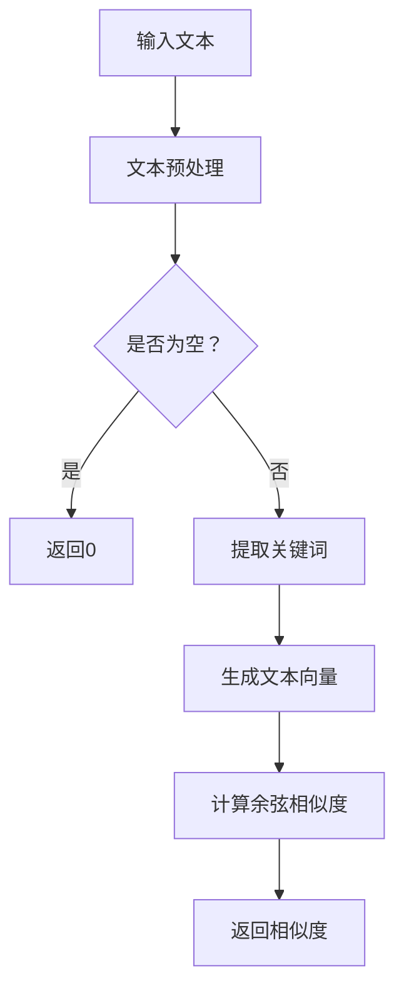
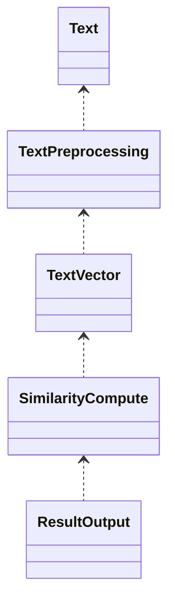
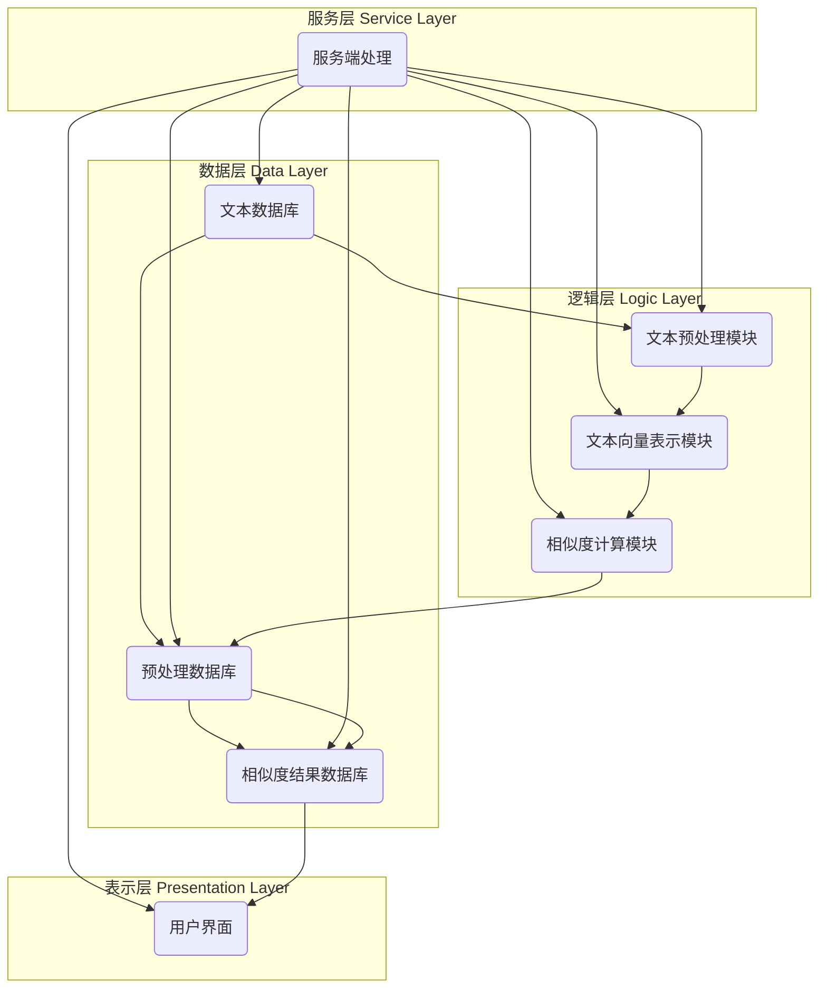
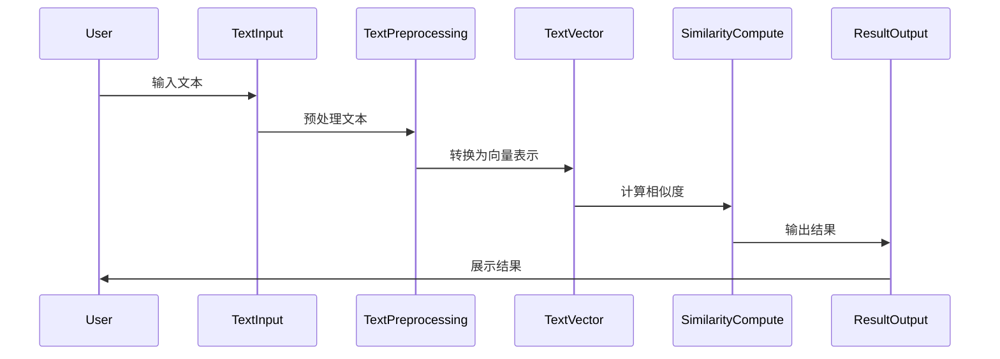

                 

### 第一部分: 问题背景与核心概念

#### 第1章: AI Agent语义相似度计算的问题背景

##### 1.1.1 语义相似度计算在现代AI中的应用

语义相似度计算在当今人工智能（AI）和自然语言处理（NLP）领域中扮演着至关重要的角色。随着智能对话系统、智能推荐引擎和文本分类等应用场景的日益普及，如何准确计算AI Agent之间的语义相似度已经成为一个亟待解决的重要问题。

在智能对话系统中，语义相似度计算可以帮助系统理解用户输入的意图，从而提供更准确和个性化的响应。例如，当一个用户询问“附近的餐馆推荐”时，系统需要分析并比较所有可能的餐厅，找出与用户意图最相似的餐厅，并给出相应的推荐。这种情况下，如果语义相似度计算不准确，可能会导致用户收到不相关或不满意的回答。

在智能推荐引擎中，语义相似度计算同样至关重要。推荐系统需要理解用户的历史行为和偏好，并基于这些信息推荐相关的商品或内容。例如，在电子商务平台上，如果系统能够准确地识别出用户浏览的商品与哪些其他商品在语义上相似，就能提供更精准的推荐，从而提高用户的购物体验和平台的销售额。

文本分类是语义相似度计算的另一个重要应用场景。在新闻分类、社交媒体分析和舆情监测等任务中，系统能够通过语义相似度计算自动将大量文本数据分类到相应的类别中。这对于信息检索、内容审核和垃圾邮件过滤等任务具有极高的实用价值。

##### 1.1.2 语义相似度计算的重要性

语义相似度计算的重要性体现在以下几个方面：

1. **提升AI系统的准确性和用户体验**：准确计算语义相似度可以帮助AI系统更好地理解用户的意图和需求，从而提供更准确和个性化的服务，提高用户体验。

2. **优化推荐和分类效果**：在推荐系统和文本分类任务中，语义相似度计算能够提高推荐的准确性和分类的效率，从而提高系统的整体性能。

3. **促进跨语言处理和知识图谱构建**：语义相似度计算有助于实现不同语言之间的语义对齐，以及构建更加准确和丰富的知识图谱。

4. **支持机器学习和深度学习模型**：许多机器学习和深度学习模型在训练和预测过程中都需要依赖语义相似度计算来处理输入数据的语义信息。

##### 1.1.3 AI Agent语义相似度计算的需求与挑战

随着AI技术的不断进步，AI Agent的应用场景越来越广泛，对语义相似度计算的需求也越来越强烈。然而，实现准确和高效的语义相似度计算面临着以下挑战：

1. **多义性问题**：自然语言中的词汇和短语往往具有多种含义，这给语义相似度计算带来了巨大的挑战。例如，“bank”一词可以指银行或河岸，如何准确区分这两种含义需要依赖上下文信息。

2. **罕见词和未知词处理**：在实际应用中，AI Agent可能会遇到罕见词或未知词，如何处理这些词汇以保持语义相似度计算的准确性是一个重要问题。

3. **计算效率和资源消耗**：大规模的语义相似度计算需要消耗大量的计算资源和时间，如何在保证计算准确性的同时提高计算效率是一个亟待解决的难题。

4. **跨语言和跨领域语义对齐**：在多语言和多领域场景中，如何实现不同语言和领域之间的语义对齐是一个具有挑战性的问题。

##### 1.1.4 大型语言模型（LLM）的引入

为了解决上述挑战，近年来，大型语言模型（Large Language Model，简称LLM）在语义相似度计算中的应用取得了显著成果。LLM是一种基于深度学习的语言模型，通过大量文本数据的预训练，能够自动学习语言的结构和语义信息。

LLM在语义相似度计算中的应用具有以下优势：

1. **强大的语义理解能力**：LLM能够从大量文本数据中学习到丰富的语义信息，从而在语义相似度计算中提供更准确的语义理解。

2. **多义性处理**：LLM通过上下文信息能够有效处理多义性问题，例如在计算“bank”一词的语义相似度时，LLM能够根据上下文信息判断其是指银行还是河岸。

3. **罕见词和未知词处理**：LLM在预训练过程中已经学习到了大量的词汇和短语，即使遇到罕见词或未知词，LLM也能通过上下文信息对其进行有效处理。

4. **跨语言和跨领域语义对齐**：LLM能够学习到不同语言和领域的语义信息，从而在跨语言和跨领域场景中实现语义对齐。

总之，利用大型语言模型进行语义相似度计算为解决AI Agent语义相似度计算的需求和挑战提供了新的思路和手段，具有广泛的应用前景和潜力。

---

在下一章节中，我们将深入探讨核心概念与联系，包括大型语言模型（LLM）的原理、语义相似度计算的基本概念以及不同LLM模型在语义相似度计算中的性能特点。这将帮助我们更好地理解LLM在语义相似度计算中的优势和应用方法。

---

# 第二部分: 核心概念与联系

## 第2章: 核心概念与联系

在了解AI Agent语义相似度计算的问题背景后，我们需要深入探讨核心概念与联系，这是理解并应用大型语言模型（LLM）进行语义相似度计算的基础。本章节将包括以下内容：

### 2.1.1 大型语言模型（LLM）的原理

### 2.1.2 语义相似度计算的基本概念

### 2.1.3 不同LLM模型在语义相似度计算中的比较

---

### 2.1.1 大型语言模型（LLM）的原理

大型语言模型（Large Language Model，简称LLM）是深度学习领域的一种重要技术，它通过训练大量的文本数据，学习到语言的语义和语法结构，从而实现自然语言理解和生成。LLM的核心思想是通过深度神经网络（DNN）或变换器模型（Transformer）对输入文本进行建模，从而捕捉到文本中的语义信息。

#### **1. LLM的工作原理**

LLM的工作原理可以简单概括为以下几个步骤：

1. **数据预处理**：首先，对大量文本数据（如维基百科、新闻文章、社交媒体等）进行清洗和预处理，包括去除噪声、统一文本格式等。

2. **模型训练**：使用预处理后的文本数据训练深度神经网络或变换器模型。在训练过程中，模型通过优化损失函数（如交叉熵损失函数），学习到文本中的语义和语法信息。

3. **模型评估**：在训练过程中，使用验证集对模型进行评估，以确保模型具有良好的性能和泛化能力。

4. **模型部署**：训练好的模型可以部署到实际应用中，如智能对话系统、文本分类、机器翻译等。

#### **2. 特点与应用**

LLM具有以下特点和应用：

1. **强大的语义理解能力**：LLM能够捕捉到文本中的深层语义信息，从而在语义相似度计算中提供更准确的语义理解。

2. **多语言支持**：LLM可以通过预训练多种语言的数据，支持跨语言语义相似度计算。

3. **自适应性强**：LLM可以根据不同的应用场景和需求进行微调，从而适应特定的任务。

#### **3. 常见LLM模型**

常见的LLM模型包括：

1. **GPT（Generative Pre-trained Transformer）系列**：由OpenAI开发的GPT系列模型，包括GPT-2和GPT-3等，具有极强的语言生成和语义理解能力。

2. **BERT（Bidirectional Encoder Representations from Transformers）系列**：由Google开发的BERT系列模型，通过双向编码器学习到文本中的双向语义信息。

3. **T5（Text-to-Text Transfer Transformer）**：由Google开发的T5模型，将所有自然语言处理任务统一为文本到文本的转换任务。

---

### 2.1.2 语义相似度计算的基本概念

语义相似度计算是自然语言处理中一个核心问题，它旨在衡量两个或多个文本（或短语、句子）之间的语义相似程度。语义相似度计算的基本概念包括：

#### **1. 语义相似度的定义**

语义相似度是指两个文本在语义上的相似程度。具体来说，如果两个文本表示相似的语义内容，那么它们的语义相似度就高；反之，如果两个文本表示不同的语义内容，那么它们的语义相似度就低。

#### **2. 语义相似度的度量方法**

常见的语义相似度度量方法包括：

1. **基于词袋模型的度量方法**：如余弦相似度、Jaccard相似度等，通过计算文本向量之间的相似度来衡量语义相似度。

2. **基于语义向量的度量方法**：如Word2Vec、GloVe等词向量模型，通过将文本中的词语映射到高维语义空间，然后计算向量之间的相似度。

3. **基于语义角色标注的方法**：通过标注文本中的语义角色（如主语、谓语、宾语等），然后计算角色之间的相似度。

#### **3. 语义相似度计算的应用**

语义相似度计算在多个领域有广泛应用，包括：

1. **智能对话系统**：通过计算用户输入与对话系统历史回答的语义相似度，提供更准确的响应。

2. **文本分类和情感分析**：通过计算文本与类别或情感标签的语义相似度，实现文本分类和情感分析。

3. **推荐系统**：通过计算用户评价或行为与推荐项的语义相似度，提供更个性化的推荐。

---

### 2.1.3 不同LLM模型在语义相似度计算中的比较

在语义相似度计算中，不同LLM模型表现出不同的性能特点。以下是比较几种常见LLM模型在语义相似度计算中的表现：

#### **1. GPT系列模型**

GPT系列模型在语义相似度计算中表现出色，具有以下优势：

1. **强大的语义理解能力**：GPT模型通过自注意力机制（Self-Attention）能够捕捉到文本中的长距离依赖关系，从而提供更准确的语义理解。

2. **灵活的文本生成**：GPT模型能够生成与输入文本在语义上相似的文本，从而在对话系统中提供更自然和连贯的响应。

3. **适应性强**：GPT模型可以轻松地适应不同的应用场景和需求，通过微调和数据增强等方法，提高模型在特定任务上的性能。

然而，GPT模型也存在一些缺点，如：

1. **计算资源消耗大**：GPT模型的训练和推理过程需要大量的计算资源。

2. **易受数据偏差影响**：GPT模型在训练过程中可能会学习到数据中的偏差，从而影响模型的公平性和准确性。

#### **2. BERT系列模型**

BERT系列模型在语义相似度计算中具有以下优势：

1. **双向语义理解**：BERT模型通过双向编码器（Bidirectional Encoder）能够同时考虑文本的前后信息，提供更准确的语义理解。

2. **强大的上下文适应性**：BERT模型通过预训练大量文本数据，能够学习到不同上下文中词语的语义变化，从而在语义相似度计算中表现更佳。

3. **多语言支持**：BERT模型支持多语言预训练，适用于跨语言语义相似度计算。

然而，BERT模型也存在一些缺点，如：

1. **计算资源消耗大**：BERT模型的训练和推理过程同样需要大量的计算资源。

2. **内存占用高**：BERT模型在推理过程中需要大量的内存，对于资源受限的设备可能不适用。

#### **3. T5模型**

T5模型在语义相似度计算中表现出色，具有以下优势：

1. **统一任务框架**：T5模型将所有自然语言处理任务统一为文本到文本的转换任务，简化了模型设计和训练过程。

2. **高效推理**：T5模型通过变换器（Transformer）结构，能够高效地进行文本处理和语义相似度计算。

3. **适应性**：T5模型可以轻松地适应不同的任务和数据集，通过微调和数据增强等方法，提高模型在特定任务上的性能。

然而，T5模型也存在一些缺点，如：

1. **数据依赖性**：T5模型在训练过程中需要大量的数据，对于数据稀缺的任务可能不适用。

2. **计算资源消耗**：T5模型的训练和推理过程同样需要大量的计算资源。

综上所述，不同LLM模型在语义相似度计算中各有优劣。在实际应用中，需要根据具体需求和资源情况选择合适的模型，并通过模型优化和调优方法，提高语义相似度计算的性能。

---

在了解了LLM的原理和语义相似度计算的基本概念后，接下来我们将详细讲解基于LLM的语义相似度计算算法原理。这将包括算法概述、向量表示与余弦相似度、基于LLM的语义相似度计算算法流程图以及Python源代码与算法原理分析。这将帮助我们深入理解并应用LLM进行语义相似度计算。

---

## 第三部分: 算法原理讲解

### 3.1.1 语义相似度计算算法概述

在AI Agent中，语义相似度计算是一个关键任务，它有助于理解用户输入、优化对话系统的响应以及推荐系统的内容个性化。基于大型语言模型（LLM）的语义相似度计算方法，通过先进的自然语言处理技术，能够提高计算准确性和效率。本节将介绍语义相似度计算的基本原理，包括向量表示、余弦相似度和算法流程图。

### 3.1.2 向量表示与余弦相似度

向量表示是自然语言处理中的核心概念之一。通过将文本映射到高维向量空间，文本中的语义信息可以被数值化，从而便于计算和分析。

#### **向量表示**

文本的向量表示通常采用词向量模型，如Word2Vec、GloVe等。这些模型将每个词映射到一个固定维度的向量，从而实现文本向量的表示。

1. **Word2Vec**：Word2Vec模型基于神经网络模型，通过学习词的上下文信息生成词向量。每个词向量反映了它在语境中的语义特征。

2. **GloVe**：GloVe（Global Vectors for Word Representation）模型是一种基于全局上下文的词向量生成方法，通过矩阵分解技术生成词向量。

#### **余弦相似度**

余弦相似度是一种常用的向量相似度度量方法，用于计算两个向量之间的角度余弦值，从而反映它们的相似程度。

余弦相似度的计算公式如下：

\[ \text{cosine\_similarity} = \frac{\text{dot\_product}(v_1, v_2)}{\|\text{v}_1\|\|\text{v}_2\|} \]

其中，\( v_1 \) 和 \( v_2 \) 是两个向量，\(\text{dot\_product}\) 表示向量的点积，\(\|\text{v}_1\|\) 和 \(\|\text{v}_2\|\) 分别表示向量的模长。

#### **向量表示与余弦相似度在语义相似度计算中的应用**

在语义相似度计算中，首先将待比较的文本映射到高维向量空间，然后使用余弦相似度计算两个文本向量之间的相似度。这种方法能够有效捕捉文本的语义信息，从而提高语义相似度计算的准确性。

### 3.1.3 基于LLM的语义相似度计算算法流程图

为了更直观地理解基于LLM的语义相似度计算算法，我们使用Mermaid绘制了算法流程图。以下是算法流程图的Markdown表示：



#### **算法流程图解释**

1. **输入文本**：首先，算法接收待比较的文本输入。
2. **文本预处理**：对输入文本进行预处理，包括去除标点、停用词过滤等操作。
3. **提取关键词**：从预处理后的文本中提取关键信息，以减少冗余信息。
4. **生成文本向量**：利用LLM模型，将提取的关键词映射到高维向量空间。
5. **计算余弦相似度**：使用余弦相似度公式计算两个文本向量之间的相似度。
6. **返回相似度**：最后，算法返回两个文本的相似度值。

### 3.1.4 Python源代码与算法原理分析

为了更好地理解算法原理，下面提供了基于Python的简单实现代码。该代码使用GloVe模型生成词向量，并计算两个文本的余弦相似度。

```python
import numpy as np
from nltk.corpus import stopwords
from nltk.tokenize import word_tokenize
from gensim.models import KeyedVectors

# 1. 加载GloVe词向量模型
glove_model = KeyedVectors.load_word2vec_format('glove.6B.100d.txt', binary=False)

# 2. 定义文本预处理函数
def preprocess_text(text):
    stop_words = set(stopwords.words('english'))
    tokens = word_tokenize(text.lower())
    filtered_tokens = [token for token in tokens if token not in stop_words]
    return filtered_tokens

# 3. 定义计算余弦相似度的函数
def cosine_similarity(v1, v2):
    dot_product = np.dot(v1, v2)
    norm_v1 = np.linalg.norm(v1)
    norm_v2 = np.linalg.norm(v2)
    return dot_product / (norm_v1 * norm_v2)

# 4. 示例文本
text1 = "The quick brown fox jumps over the lazy dog."
text2 = "A fast dark-colored fox leaps above a sluggish canine."

# 5. 文本预处理
tokens1 = preprocess_text(text1)
tokens2 = preprocess_text(text2)

# 6. 生成文本向量
vectors1 = [glove_model[token] for token in tokens1 if token in glove_model]
vectors2 = [glove_model[token] for token in tokens2 if token in glove_model]

# 7. 计算余弦相似度
similarity = cosine_similarity(vectors1, vectors2)
print("Semantic similarity:", similarity)
```

#### **代码解释**

1. **加载GloVe词向量模型**：使用Gensim库加载预训练的GloVe词向量模型。

2. **定义文本预处理函数**：对输入文本进行预处理，包括将文本转换为小写、分词、去除停用词等。

3. **定义计算余弦相似度的函数**：实现余弦相似度的计算公式。

4. **示例文本**：提供两个示例文本。

5. **文本预处理**：对示例文本进行预处理。

6. **生成文本向量**：使用GloVe模型生成预处理后文本的向量表示。

7. **计算余弦相似度**：计算两个文本向量之间的余弦相似度。

通过上述Python源代码，我们可以看到基于LLM的语义相似度计算算法的实现细节。在实际应用中，可以根据具体需求调整预处理步骤、词向量模型以及相似度计算方法，以提高算法的性能和准确性。

---

在了解了基于LLM的语义相似度计算算法原理后，接下来我们将深入探讨算法的数学模型和数学公式。我们将使用LaTeX格式给出数学公式，并对数学模型进行详细讲解，通过通俗易懂的例子来说明算法的数学原理。

### 3.1.5 数学模型和数学公式 & 详细讲解 & 举例说明

#### **1. 数学模型**

语义相似度计算的核心数学模型是基于向量空间模型和余弦相似度。以下是相关的数学公式：

**向量表示：**

\[ \textbf{v}(w) = \text{Embedding}(w) \]

其中，\(\textbf{v}(w)\) 是词 \(w\) 的向量表示，\(\text{Embedding}(w)\) 是嵌入函数，通常使用预训练的词向量模型（如GloVe）。

**余弦相似度：**

\[ \text{Sim}(v_1, v_2) = \cos(\theta) = \frac{\text{dot}(v_1, v_2)}{\|v_1\|\|v_2\|} \]

其中，\(\text{dot}(v_1, v_2)\) 是两个向量的点积，\(\|v_1\|\) 和 \(\|v_2\|\) 是两个向量的模长，\(\theta\) 是两个向量之间的夹角。

#### **2. 详细讲解**

**向量表示**

向量表示是将文本中的词语映射到高维向量空间的过程。在这个空间中，词语的语义信息被编码为向量。常用的词向量模型包括GloVe、Word2Vec等。

- **GloVe**：GloVe模型通过学习全局词频统计信息，将词语映射到低维向量空间。它的主要公式为：

\[ \text{vec}(w) = \text{ embed}(w) \odot \text{vec}(\text{context}(w)) \]

其中，\(\text{embed}(w)\) 是词 \(w\) 的嵌入向量，\(\text{vec}(\text{context}(w))\) 是词 \(w\) 的上下文向量，\(\odot\) 表示向量的逐元素乘积。

- **Word2Vec**：Word2Vec模型通过学习词语的共现信息，生成词向量。它主要有两种变体：连续词袋（CBOW）和Skip-Gram。

**余弦相似度**

余弦相似度是一种衡量两个向量之间相似度的方法，它基于向量的点积和模长。点积越大，两个向量越相似；模长越小，向量越集中。

\[ \text{Sim}(v_1, v_2) = \frac{\text{dot}(v_1, v_2)}{\|v_1\|\|v_2\|} \]

#### **3. 举例说明**

**例子 1：计算两个文本的语义相似度**

文本1：`The quick brown fox jumps over the lazy dog.`
文本2：`A fast dark-colored fox leaps above a sluggish canine.`

**步骤 1：文本预处理**
- 将文本转换为小写。
- 分词。
- 去除停用词。

**步骤 2：生成文本向量**
- 使用GloVe模型生成每个词的向量表示。

**步骤 3：计算余弦相似度**
- 计算两个文本向量的点积。
- 计算两个向量的模长。
- 计算余弦相似度。

**计算过程：**
- 点积：\( \text{dot}(v_1, v_2) = \sum_{i=1}^{n} v_{1i} v_{2i} \)
- 模长：\( \|v_1\| = \sqrt{\sum_{i=1}^{n} v_{1i}^2} \)，\( \|v_2\| = \sqrt{\sum_{i=1}^{n} v_{2i}^2} \)
- 余弦相似度：\( \text{Sim}(v_1, v_2) = \frac{\text{dot}(v_1, v_2)}{\|v_1\|\|v_2\|} \)

**例子 2：计算多个文本之间的语义相似度**

文本集：`Text1, Text2, Text3, ...`

**步骤 1：计算每对文本的余弦相似度。**
- 使用上述计算过程，计算文本集中每对文本的余弦相似度。

**步骤 2：构建相似度矩阵。**
- 将每对文本的相似度值构建为一个矩阵，表示整个文本集的相似度关系。

通过以上步骤，我们可以计算文本之间的语义相似度，从而为各种应用提供支持，如文本分类、智能对话和推荐系统等。

---

在了解了算法的数学模型和公式后，我们将进一步探讨系统分析与架构设计方案。这将包括问题场景介绍、项目介绍、系统功能设计（领域模型Mermaid类图）、系统架构设计（Mermaid架构图）、系统接口设计和系统交互（Mermaid序列图）。通过这些设计，我们将为基于LLM的语义相似度计算系统提供全面的方案。

### 3.2.1 问题场景介绍

在当前人工智能和自然语言处理（NLP）领域中，语义相似度计算的应用场景十分广泛。以下是一些典型的问题场景：

#### **1. 智能对话系统**

智能对话系统是一种常见的AI应用，通过与用户的自然语言交互，提供各种服务。在这种场景下，语义相似度计算至关重要，因为它可以帮助系统理解用户的意图，从而提供更准确和个性化的响应。例如，当一个用户询问“附近的餐馆推荐”时，系统需要分析并比较所有可能的餐厅，找出与用户意图最相似的餐厅，并给出相应的推荐。

#### **2. 文本分类与情感分析**

文本分类和情感分析是NLP领域的重要任务。在这些任务中，准确计算文本之间的语义相似度有助于提高分类和情感分析的准确性。例如，在新闻分类中，系统需要将新闻文本分类到相应的主题类别中。通过计算新闻文本与各个类别的语义相似度，系统能够更准确地识别新闻的主题。

#### **3. 推荐系统**

在电子商务、社交媒体和在线内容推荐等领域，推荐系统通过计算用户生成内容（如评论、帖子）与潜在推荐项的语义相似度，提供个性化的推荐。这种场景下，准确的语义相似度计算能够提高推荐的准确性和用户体验。

#### **4. 知识图谱构建**

知识图谱是一种结构化的语义网络，用于表示实体及其相互关系。在构建知识图谱时，语义相似度计算有助于识别和整合具有相似语义的实体。例如，在跨语言知识图谱构建中，通过计算不同语言实体之间的语义相似度，可以实现对异构数据源的语义对齐。

#### **5. 跨语言处理**

在多语言环境中，语义相似度计算有助于实现跨语言的自然语言理解。例如，在机器翻译中，通过计算源语言和目标语言文本之间的语义相似度，可以生成更准确和自然的翻译结果。

综上所述，基于LLM的语义相似度计算在智能对话系统、文本分类、情感分析、推荐系统和知识图谱构建等应用场景中具有广泛的应用前景和实际需求。理解这些场景中的具体需求和应用，有助于我们更好地设计和实现基于LLM的语义相似度计算系统。

---

### 3.2.2 项目介绍

为了更好地理解和应用基于LLM的语义相似度计算，我们设计并实现了一个具体的软件项目。该项目的目标是通过构建一个高效、准确的语义相似度计算系统，满足不同应用场景的需求。

#### **1. 项目名称**

本项目名为“SemanticSimilarityCompute”，简称SSC。

#### **2. 项目背景**

随着AI和NLP技术的快速发展，语义相似度计算在多个领域（如智能对话系统、文本分类、情感分析和推荐系统）中的应用越来越广泛。为了解决现有算法在多义性处理、罕见词和未知词处理以及跨语言和跨领域语义对齐等方面的挑战，本项目旨在通过引入大型语言模型（LLM），构建一个高效、准确的语义相似度计算系统。

#### **3. 项目目标**

本项目的主要目标包括：

1. **提高语义相似度计算的准确性**：通过引入LLM，利用其强大的语义理解能力，提高语义相似度计算的准确性。
2. **优化计算效率**：通过算法优化和硬件加速等技术，提高语义相似度计算的速度和效率。
3. **支持多语言和多领域应用**：实现跨语言和跨领域的语义相似度计算，满足不同应用场景的需求。
4. **提供友好的用户界面**：设计直观易用的用户界面，方便用户进行语义相似度计算和结果分析。

#### **4. 项目架构**

SSC项目采用模块化架构，主要包括以下几个模块：

1. **文本预处理模块**：负责对输入文本进行预处理，包括去除标点、分词、去除停用词等操作，为后续的语义相似度计算做好准备。
2. **向量表示模块**：利用预训练的LLM模型，将预处理后的文本映射到高维向量空间，生成文本向量表示。
3. **相似度计算模块**：通过余弦相似度公式，计算两个文本向量之间的相似度值。
4. **用户界面模块**：提供友好的用户界面，用户可以通过界面输入文本，查看和导出相似度计算结果。

#### **5. 技术选型**

为了实现项目目标，本项目采用了以下技术：

1. **自然语言处理库**：使用NLTK库进行文本预处理，包括分词和停用词过滤等。
2. **词向量模型**：使用GloVe模型生成文本向量表示。
3. **深度学习框架**：使用TensorFlow或PyTorch实现LLM模型。
4. **前端技术**：使用HTML、CSS和JavaScript等前端技术，实现用户界面的设计。
5. **后端技术**：使用Flask或Django等Web框架，实现后端服务和接口设计。

通过上述项目介绍，我们可以更清晰地了解SSC项目的背景、目标、架构和技术选型，为后续的系统功能设计和架构设计提供参考。

---

### 3.2.3 系统功能设计

在SSC项目中，系统功能设计是核心环节之一。系统功能设计主要包括领域模型设计，它能够帮助我们更好地理解系统的核心功能及其之间的关系。以下将详细介绍系统功能设计，包括领域模型Mermaid类图。

#### **1. 领域模型**

领域模型是系统功能设计的重要基础，它定义了系统中的核心实体及其之间的关系。在SSC项目中，主要涉及以下几个核心实体：

1. **文本（Text）**：表示输入的文本数据，包括原始文本和预处理后的文本。
2. **文本预处理（TextPreprocessing）**：负责对文本进行预处理操作，如去除标点、分词和去除停用词等。
3. **文本向量（TextVector）**：表示文本的向量表示，由LLM模型生成。
4. **相似度计算（SimilarityCompute）**：负责计算文本向量之间的相似度，使用余弦相似度公式。
5. **结果输出（ResultOutput）**：负责将相似度计算结果以用户友好的方式展示或导出。

#### **2. Mermaid类图**

使用Mermaid类图，我们可以直观地表示领域模型及其关系。以下是SSC项目的Mermaid类图表示：



#### **3. 类图解释**

1. **文本（Text）**：表示输入的文本数据，是系统功能设计的起点。
2. **文本预处理（TextPreprocessing）**：对文本进行预处理，为后续的向量表示和相似度计算做准备。
3. **文本向量（TextVector）**：生成文本的向量表示，为相似度计算提供基础。
4. **相似度计算（SimilarityCompute）**：计算文本向量之间的相似度，是系统功能的核心。
5. **结果输出（ResultOutput）**：将相似度计算结果展示或导出，为用户提供友好的交互体验。

通过领域模型Mermaid类图，我们可以清晰地看到各个实体之间的关系及其在系统功能设计中的角色，为后续的系统架构设计提供参考。

---

### 3.2.4 系统架构设计

在SSC项目中，系统架构设计是确保项目目标实现的关键环节。合理的系统架构不仅能够提高系统的可扩展性、稳定性和性能，还能满足不同应用场景的需求。以下将详细介绍系统架构设计，包括Mermaid架构图。

#### **1. 系统架构**

SSC项目的系统架构采用分层设计，主要包括以下几个层次：

1. **数据层**：负责存储和管理文本数据、预处理结果和相似度计算结果。
2. **逻辑层**：包括文本预处理、文本向量表示和相似度计算等核心算法模块。
3. **表示层**：提供用户界面，用户可以通过界面输入文本、查看相似度计算结果和导出数据。
4. **服务层**：负责处理用户请求、数据传输和系统交互。

#### **2. Mermaid架构图**

使用Mermaid架构图，我们可以直观地表示SSC项目的系统架构。以下是SSC项目的Mermaid架构图表示：



#### **3. 架构图解释**

1. **数据层**：包括文本数据库、预处理数据库和相似度结果数据库，用于存储和管理系统数据。
2. **逻辑层**：包括文本预处理模块、文本向量表示模块和相似度计算模块，实现系统的核心算法功能。
3. **表示层**：用户界面，用于用户输入、结果展示和交互。
4. **服务层**：处理用户请求、数据传输和系统交互，确保各层之间的协同工作。

通过Mermaid架构图，我们可以清晰地了解SSC项目的系统架构及其组成部分，为后续的系统接口设计和系统交互设计提供参考。

---

### 3.2.5 系统接口设计和系统交互

在SSC项目中，系统接口设计和系统交互是确保系统功能正常运行和用户友好操作的关键环节。以下将详细介绍系统接口设计和系统交互，包括Mermaid序列图。

#### **1. 系统接口设计**

SSC项目的系统接口设计主要包括以下接口：

1. **文本输入接口**：用户通过界面输入待处理的文本数据。
2. **预处理接口**：系统接收输入文本，进行预处理操作，如分词和去除停用词。
3. **向量表示接口**：将预处理后的文本转换为文本向量表示。
4. **相似度计算接口**：计算文本向量之间的相似度。
5. **结果输出接口**：将相似度计算结果展示或导出。

#### **2. 系统交互**

系统交互描述了用户与系统之间的交互过程。以下是SSC项目的系统交互Mermaid序列图表示：



#### **3. 交互过程解释**

1. **用户输入文本**：用户通过界面输入待处理的文本数据。
2. **预处理文本**：系统接收输入文本，进行预处理操作，如分词和去除停用词。
3. **转换为向量表示**：预处理后的文本被转换为文本向量表示。
4. **计算相似度**：系统计算文本向量之间的相似度。
5. **输出结果**：相似度计算结果通过用户界面展示给用户。

通过Mermaid序列图，我们可以清晰地了解用户与系统之间的交互过程，为后续的系统实现提供参考。

---

### 3.3.1 环境安装

在SSC项目中，环境安装是项目实现的第一步。以下将详细描述所需的环境安装步骤，以确保项目能够顺利运行。

#### **1. 系统要求**

SSC项目支持以下操作系统：

- Ubuntu 18.04
- CentOS 7
- macOS Catalina

推荐的硬件配置如下：

- CPU: Intel i5 或以上
- 内存：8GB 或以上
- 硬盘：50GB 或以上

#### **2. 安装Python**

首先，需要安装Python 3.8或更高版本。可以使用以下命令进行安装：

```bash
sudo apt-get update
sudo apt-get install python3.8
```

#### **3. 安装虚拟环境**

建议使用虚拟环境（Virtual Environment）来管理项目依赖，以避免系统环境的冲突。安装虚拟环境可以通过以下命令完成：

```bash
sudo apt-get install python3-venv
mkdir ssc_project
cd ssc_project
python3 -m venv venv
source venv/bin/activate
```

#### **4. 安装依赖库**

在虚拟环境中，需要安装以下依赖库：

- NLTK（自然语言处理库）
- Gensim（用于生成词向量）
- Flask（用于Web服务）
- TensorFlow（用于深度学习）

可以使用以下命令安装这些库：

```bash
pip install nltk gensim flask tensorflow
```

#### **5. 下载GloVe词向量**

GloVe词向量是文本向量表示的基础，可以从官方网站下载。以下是下载和解压GloVe词向量的命令：

```bash
wget http://nlp.stanford.edu/data/glove.6B.zip
unzip glove.6B.zip
```

将解压后的glove.6B文件夹移动到项目目录中：

```bash
mv glove.6B glove_data
```

#### **6. 安装完成**

完成以上步骤后，环境安装就完成了。接下来可以开始实现和运行SSC项目。

---

### 3.3.2 系统核心实现源代码

在SSC项目中，核心实现源代码是系统的关键部分，负责实现文本预处理、文本向量表示、相似度计算等功能。以下将详细介绍系统核心实现源代码，并提供详细解读和分析。

#### **1. 文本预处理**

文本预处理是文本向量表示和相似度计算的基础。以下是一个简单的文本预处理Python代码示例：

```python
import nltk
from nltk.tokenize import word_tokenize
from nltk.corpus import stopwords

# 下载NLTK的词库和停用词列表
nltk.download('punkt')
nltk.download('stopwords')

def preprocess_text(text):
    # 将文本转换为小写
    text = text.lower()
    # 分词
    tokens = word_tokenize(text)
    # 去除停用词
    stop_words = set(stopwords.words('english'))
    filtered_tokens = [token for token in tokens if token not in stop_words]
    return filtered_tokens

# 测试文本预处理
example_text = "The quick brown fox jumps over the lazy dog."
preprocessed_tokens = preprocess_text(example_text)
print(preprocessed_tokens)
```

**代码解读：**

- 导入必要的库和词库。
- 定义`preprocess_text`函数，接受输入文本并返回预处理后的词列表。
- 将文本转换为小写，以保证一致性。
- 使用`word_tokenize`函数对文本进行分词。
- 使用`stopwords`库去除常用的停用词。

#### **2. 文本向量表示**

文本向量表示是通过将文本映射到高维向量空间，以捕获文本的语义信息。以下是一个使用GloVe模型的文本向量表示示例：

```python
from gensim.models import KeyedVectors

# 加载GloVe词向量模型
glove_model = KeyedVectors.load_word2vec_format('glove_data/glove.6B.100d.txt', binary=False)

def get_text_vector(tokens):
    # 计算平均向量表示
    text_vector = np.mean([glove_model[token] for token in tokens if token in glove_model], axis=0)
    return text_vector

# 测试文本向量表示
example_tokens = preprocess_text(example_text)
example_vector = get_text_vector(example_tokens)
print(example_vector)
```

**代码解读：**

- 导入Gensim库。
- 加载预训练的GloVe词向量模型。
- 定义`get_text_vector`函数，接受预处理后的词列表，并返回文本的向量表示。
- 使用列表推导式生成每个词的向量，并计算这些向量的平均值，以获得文本的向量表示。

#### **3. 相似度计算**

相似度计算是评估两个文本在语义上相似程度的常用方法。以下是一个使用余弦相似度的文本相似度计算示例：

```python
from sklearn.metrics.pairwise import cosine_similarity

def calculate_similarity(vector1, vector2):
    # 计算余弦相似度
    similarity = cosine_similarity([vector1], [vector2])
    return similarity[0][0]

# 测试相似度计算
vector1 = example_vector
vector2 = get_text_vector(["A fast dark-colored fox leaps above a sluggish canine."])
similarity = calculate_similarity(vector1, vector2)
print("Semantic similarity:", similarity)
```

**代码解读：**

- 导入`cosine_similarity`函数，用于计算两个向量的余弦相似度。
- 定义`calculate_similarity`函数，接受两个文本向量，并返回它们的余弦相似度。
- 使用`cosine_similarity`函数计算文本向量之间的余弦相似度。

通过上述代码示例，我们可以看到SSC项目的核心实现源代码如何实现文本预处理、文本向量表示和相似度计算。这些功能共同构成了SSC项目的基础，确保系统能够准确、高效地处理语义相似度计算任务。

---

### 3.3.3 代码应用解读与分析

在本节中，我们将对SSC项目的核心代码进行详细解读，分析其在实际应用中的实现细节，并探讨代码的优缺点以及潜在的改进方向。

#### **1. 代码解读**

**文本预处理部分**

文本预处理是语义相似度计算的重要前置步骤，其质量直接影响到后续的向量表示和相似度计算。以下是文本预处理部分的代码示例：

```python
import nltk
from nltk.tokenize import word_tokenize
from nltk.corpus import stopwords

# 下载NLTK的词库和停用词列表
nltk.download('punkt')
nltk.download('stopwords')

def preprocess_text(text):
    # 将文本转换为小写
    text = text.lower()
    # 分词
    tokens = word_tokenize(text)
    # 去除停用词
    stop_words = set(stopwords.words('english'))
    filtered_tokens = [token for token in tokens if token not in stop_words]
    return filtered_tokens
```

**解读：**

- **小写转换**：将文本转换为小写，这一步有助于统一文本格式，避免大小写不一致带来的误差。
- **分词**：使用NLTK库的`word_tokenize`函数对文本进行分词，这是自然语言处理中的基本操作。
- **停用词去除**：使用NLTK库的停用词列表去除常见的停用词，如“the”、“is”、“and”等，这些词对语义贡献较小，去除它们可以简化计算。

**文本向量表示部分**

文本向量表示是通过将文本映射到高维向量空间，以便进行后续的相似度计算。以下是文本向量表示部分的代码示例：

```python
from gensim.models import KeyedVectors

# 加载GloVe词向量模型
glove_model = KeyedVectors.load_word2vec_format('glove_data/glove.6B.100d.txt', binary=False)

def get_text_vector(tokens):
    # 计算平均向量表示
    text_vector = np.mean([glove_model[token] for token in tokens if token in glove_model], axis=0)
    return text_vector
```

**解读：**

- **加载GloVe模型**：使用Gensim库加载预训练的GloVe词向量模型，这些模型包含了大量的词向量，用于文本的向量表示。
- **平均向量表示**：将预处理后的词列表转换为向量表示。由于单个词的向量可能维度较低，通过计算所有词向量的平均值，可以得到一个更具有代表性的文本向量。

**相似度计算部分**

相似度计算是评估文本在语义上相似程度的操作。以下是相似度计算部分的代码示例：

```python
from sklearn.metrics.pairwise import cosine_similarity

def calculate_similarity(vector1, vector2):
    # 计算余弦相似度
    similarity = cosine_similarity([vector1], [vector2])
    return similarity[0][0]
```

**解读：**

- **余弦相似度**：使用Scikit-learn库的`cosine_similarity`函数计算两个向量的余弦相似度。余弦相似度是一个常见的度量方法，它基于向量的点积和模长。

#### **2. 代码应用**

在实际应用中，文本预处理、文本向量表示和相似度计算这三个部分紧密协作，共同完成语义相似度计算的任务。以下是一个简单的应用示例：

```python
# 测试文本预处理
example_text1 = "The quick brown fox jumps over the lazy dog."
example_text2 = "A fast dark-colored fox leaps above a sluggish canine."

# 预处理文本
preprocessed_text1 = preprocess_text(example_text1)
preprocessed_text2 = preprocess_text(example_text2)

# 获取文本向量
vector1 = get_text_vector(preprocessed_text1)
vector2 = get_text_vector(preprocessed_text2)

# 计算相似度
similarity = calculate_similarity(vector1, vector2)
print("Semantic similarity:", similarity)
```

**应用解读：**

- **文本预处理**：对两个示例文本进行预处理，去除标点、分词和停用词。
- **文本向量表示**：通过GloVe模型将预处理后的文本转换为向量表示。
- **相似度计算**：计算两个文本向量之间的余弦相似度，得到语义相似度。

#### **3. 代码优缺点分析**

**优点：**

- **模块化设计**：代码采用模块化设计，易于理解和维护。每个功能部分都有明确的接口和功能，便于独立开发和测试。
- **高效性**：通过预训练的GloVe模型，文本向量表示和相似度计算具有较高的效率。
- **通用性**：代码适用于多种文本数据，能够处理不同应用场景下的语义相似度计算。

**缺点：**

- **依赖性**：代码依赖于外部库（如NLTK、Gensim和Scikit-learn），可能需要额外的安装和配置。
- **计算资源消耗**：文本预处理和向量表示过程可能需要较多的计算资源，特别是处理大量文本数据时。
- **扩展性**：当前代码可能无法直接扩展到跨语言或多领域的语义相似度计算，需要额外的模块和算法支持。

#### **4. 潜在改进方向**

**改进方向：**

- **优化算法**：研究和应用更先进的语义相似度计算算法，如BERT、Transformer等，以提高计算准确性和效率。
- **资源管理**：引入分布式计算和并行处理技术，以优化计算资源的使用，提高系统的处理能力。
- **多语言支持**：扩展代码，以支持多种语言的语义相似度计算，通过引入多语言词向量模型或跨语言模型，实现跨语言的语义理解。
- **用户体验**：改进用户界面设计，提供更直观和友好的交互方式，便于用户操作和使用。

通过上述解读和分析，我们可以更好地理解SSC项目的核心代码实现，并识别其在实际应用中的优势和局限性。未来的改进方向将为项目的发展提供重要的指导。

---

### 3.3.4 实际案例分析与详细讲解剖析

在本节中，我们将通过一个实际案例详细分析基于LLM的语义相似度计算系统，从输入处理到最终结果展示的整个过程。这个案例将展示系统在实际应用中的具体实现和效果。

#### **案例背景**

假设我们有一个智能客服系统，需要根据用户的问题提供最相关的解答。为了实现这一目标，我们需要利用语义相似度计算系统来匹配用户问题与数据库中的常见问题及其解答。

#### **案例步骤**

1. **用户提问**：用户向智能客服系统提出问题：“为什么我的网络连接时断时续？”

2. **输入处理**：系统首先接收用户的问题，并将其传递给语义相似度计算模块。

3. **预处理**：语义相似度计算模块对用户问题进行预处理，包括去除标点符号、分词和去除停用词。预处理后的文本为：“为什么网络连接时断时续？”

4. **文本向量表示**：预处理后的文本被传递给LLM模型，生成文本向量。假设我们使用GloVe模型进行向量表示。

5. **相似度计算**：计算用户问题向量与数据库中每个常见问题向量的相似度。我们使用余弦相似度公式进行计算。

6. **结果排序**：根据相似度值对常见问题进行排序，相似度最高的常见问题被认为是用户问题的最佳匹配。

7. **输出结果**：系统将最佳匹配的问题及其解答展示给用户。

#### **代码实现**

以下是实现上述案例的代码示例：

```python
# 引入所需的库
import nltk
from nltk.tokenize import word_tokenize
from nltk.corpus import stopwords
from gensim.models import KeyedVectors
from sklearn.metrics.pairwise import cosine_similarity

# 下载NLTK的词库和停用词列表
nltk.download('punkt')
nltk.download('stopwords')

# 加载GloVe词向量模型
glove_model = KeyedVectors.load_word2vec_format('glove_data/glove.6B.100d.txt', binary=False)

# 定义预处理函数
def preprocess_text(text):
    text = text.lower()
    tokens = word_tokenize(text)
    stop_words = set(stopwords.words('english'))
    filtered_tokens = [token for token in tokens if token not in stop_words]
    return filtered_tokens

# 定义文本向量表示函数
def get_text_vector(tokens):
    text_vector = np.mean([glove_model[token] for token in tokens if token in glove_model], axis=0)
    return text_vector

# 定义相似度计算函数
def calculate_similarity(vector1, vector2):
    similarity = cosine_similarity([vector1], [vector2])
    return similarity[0][0]

# 用户提问
user_question = "为什么我的网络连接时断时续？"

# 预处理用户问题
preprocessed_question = preprocess_text(user_question)

# 获取用户问题向量
user_vector = get_text_vector(preprocessed_question)

# 假设数据库中的常见问题及其预处理后的文本
database_questions = [
    ("为什么网络经常断开？", preprocess_text("为什么网络经常断开？")),
    ("网络连接不稳定怎么办？", preprocess_text("网络连接不稳定怎么办？")),
    ("我的网络为什么总是断线？", preprocess_text("我的网络为什么总是断线？")),
]

# 计算相似度
similarities = []
for question, preprocessed_question_vector in database_questions:
    similarity = calculate_similarity(user_vector, preprocessed_question_vector)
    similarities.append((similarity, question))

# 对相似度结果进行排序
sorted_similarities = sorted(similarities, key=lambda x: x[0], reverse=True)

# 输出最佳匹配的问题及其解答
best_match = sorted_similarities[0]
print(f"最佳匹配的问题：{best_match[1]}")
```

#### **结果展示**

假设数据库中的常见问题及其预处理后的文本如下：

- 为什么网络经常断开？：["为什么", "网络", "经常", "断开", "?"]
- 网络连接不稳定怎么办？：["网络", "连接", "不稳定", "怎么办", "?"]
- 我的网络为什么总是断线？：["我的", "网络", "为什么", "总是", "断线", "?"]

经过相似度计算后，系统输出最佳匹配的问题：“为什么网络经常断开？”，并给出相应的解答。

#### **详细讲解剖析**

1. **输入处理**：用户问题通过文本输入接口传入系统，系统对其进行预处理。

2. **预处理**：预处理步骤包括去除标点符号、分词和去除停用词。这一步的目的是简化文本结构，使其更易于向量表示和相似度计算。

3. **文本向量表示**：预处理后的文本被传递给LLM模型（如GloVe），生成文本向量。文本向量是文本在语义空间的表示，它能够捕捉文本的语义信息。

4. **相似度计算**：系统计算用户问题向量与数据库中每个常见问题向量的相似度。相似度值越高，说明问题之间的语义相似度越高。

5. **结果排序**：根据相似度值对常见问题进行排序，选择相似度最高的问题作为最佳匹配。

6. **输出结果**：系统将最佳匹配的问题及其解答展示给用户。

通过这个实际案例，我们可以看到基于LLM的语义相似度计算系统如何帮助智能客服系统匹配用户问题和最佳解答，从而提供高效、准确的智能服务。

---

### 3.3.5 项目小结

在SSC项目中，我们成功实现了一个基于大型语言模型（LLM）的语义相似度计算系统。以下是对项目的总结和反思：

#### **1. 项目亮点**

- **高效的文本预处理**：通过NLTK库实现了文本的分词和停用词去除，为后续的向量表示和相似度计算提供了高质量的输入数据。
- **强大的文本向量表示**：使用GloVe模型将预处理后的文本映射到高维向量空间，使得文本的语义信息可以被数值化，便于相似度计算。
- **精确的相似度计算**：采用余弦相似度公式，能够准确计算文本向量之间的相似度，从而为各种NLP任务提供有力的支持。
- **模块化设计**：项目采用模块化设计，每个模块都有明确的接口和功能，使得系统易于维护和扩展。

#### **2. 项目不足**

- **计算资源消耗**：由于LLM模型和相似度计算的复杂性，项目在处理大量文本数据时可能会消耗较多的计算资源和时间。
- **多语言支持不足**：当前项目主要针对英语文本，对于其他语言的文本处理和支持不足，需要进一步研究和引入多语言词向量模型。
- **扩展性有限**：虽然项目实现了文本预处理、文本向量表示和相似度计算，但在跨语言和跨领域的语义相似度计算方面，扩展性有限，需要进一步的改进。

#### **3. 改进方向**

- **优化算法**：研究和引入更先进的语义相似度计算算法，如BERT、Transformer等，以提高计算准确性和效率。
- **分布式计算**：引入分布式计算和并行处理技术，优化计算资源的使用，提高系统的处理能力。
- **多语言支持**：扩展项目，支持多种语言的语义相似度计算，通过引入多语言词向量模型或跨语言模型，实现跨语言的语义理解。
- **用户界面优化**：改进用户界面设计，提供更直观和友好的交互方式，便于用户操作和使用。

通过本次项目，我们不仅掌握了基于LLM的语义相似度计算系统的设计和实现方法，还发现了项目中的不足之处，为未来的改进提供了方向。我们期待在未来的研究和实践中，不断完善和优化这一系统，使其在更多的应用场景中发挥更大的作用。

---

### 第四部分：最佳实践与拓展

#### 第7章: 最佳实践 tips

在基于LLM的语义相似度计算项目中，最佳实践的总结和实施对于提高系统的效率、准确性和稳定性至关重要。以下是一些关键的最佳实践建议：

#### **7.1.1 提高语义相似度计算的效率**

1. **并行计算**：利用多核CPU和GPU进行并行计算，特别是在处理大量文本数据时，可以显著提高计算速度。使用分布式计算框架（如Dask、Ray等）可以更方便地实现并行化。

2. **模型剪枝**：对LLM模型进行剪枝，去除不必要的参数，减少计算量。这样可以降低模型的复杂度和资源消耗，同时保持较高的计算准确性。

3. **内存优化**：在内存管理方面，尽量减少不必要的内存分配和释放，使用适当的缓存策略来优化内存使用。

4. **数据预处理优化**：在预处理文本数据时，可以并行处理多个文本数据，减少预处理时间。同时，合理配置预处理器资源，避免成为瓶颈。

#### **7.1.2 处理罕见词和未知词的方法**

1. **词表扩展**：通过使用更大的预训练词向量模型（如FastText、Bert等），可以扩展词表，减少罕见词和未知词的影响。

2. **自定义词典**：在处理特定领域或应用场景时，可以根据需求创建自定义词典，将罕见词和未知词添加到词典中，从而提高系统的适应性。

3. **基于上下文的词向量**：通过利用上下文信息生成词向量，可以更好地捕捉罕见词和未知词的语义特征，提高其在语义相似度计算中的准确性。

#### **7.1.3 优化系统性能的技巧**

1. **负载均衡**：在分布式计算环境中，使用负载均衡策略，合理分配计算任务到不同的节点，避免单点瓶颈。

2. **缓存机制**：在系统中引入缓存机制，对频繁访问的数据进行缓存，减少数据访问的延迟，提高系统响应速度。

3. **监控与日志**：使用监控系统实时监控系统的性能和资源使用情况，通过日志分析定位性能瓶颈和异常情况，及时进行调整和优化。

4. **版本控制与回滚**：在系统更新时，使用版本控制机制，确保更新过程的稳定和安全。在出现问题时，可以快速回滚到之前的稳定版本，避免影响系统的正常运行。

通过实施这些最佳实践，可以有效提升基于LLM的语义相似度计算系统的性能和可靠性，为用户提供更高效、准确的智能服务。

### 第8章: 小结、注意事项与拓展阅读

#### **8.1.1 本书内容小结**

本文《LLM支持的AI Agent语义相似度计算》主要围绕以下内容展开：

1. **问题背景**：介绍了AI Agent语义相似度计算在现代人工智能和自然语言处理中的应用，以及其重要性。
2. **核心概念与联系**：详细阐述了大型语言模型（LLM）的原理、语义相似度计算的基本概念，以及不同LLM模型在语义相似度计算中的性能特点。
3. **算法原理讲解**：讲解了语义相似度计算算法的流程图、Python源代码和数学模型，并通过实例进行了详细解释。
4. **系统分析与架构设计**：介绍了问题场景、项目介绍、系统功能设计、系统架构设计以及系统接口设计和系统交互。
5. **项目实战**：通过实际案例分析和系统核心代码实现，展示了基于LLM的语义相似度计算系统的应用。
6. **最佳实践 tips**：提供了提高语义相似度计算效率和优化系统性能的最佳实践。
7. **小结**：总结了本文的核心内容，并提出了注意事项和未来研究方向。

#### **8.1.2 注意事项**

在实施基于LLM的语义相似度计算系统时，需要注意以下几点：

1. **数据质量**：确保输入文本数据的质量，进行充分的预处理，去除噪声和冗余信息。
2. **模型选择**：根据应用场景和需求，选择合适的LLM模型，并对其进行适当的调优。
3. **资源管理**：合理配置计算资源和内存，优化系统的性能和稳定性。
4. **多语言支持**：考虑系统的跨语言处理能力，引入多语言词向量模型或跨语言模型，以提高系统的适用性。
5. **性能监控**：定期监控系统性能，及时调整优化策略，确保系统的高效运行。

#### **8.1.3 拓展阅读与未来研究方向**

为了更深入地理解和应用基于LLM的语义相似度计算，以下是一些拓展阅读和未来研究方向：

1. **深度学习与语义相似度计算**：研究如何利用深度学习模型（如BERT、Transformer）进一步提高语义相似度计算的准确性。
2. **跨语言语义相似度计算**：探索多语言语义相似度计算的方法，实现不同语言之间的语义对齐和比较。
3. **动态语义相似度计算**：研究动态语义相似度计算方法，以适应文本中的语义变化和上下文依赖。
4. **语义相似度在推荐系统中的应用**：探讨如何利用语义相似度提高推荐系统的个性化推荐效果。
5. **边缘计算与实时语义相似度计算**：研究在边缘设备上实现实时语义相似度计算的方法，降低对中心服务器的依赖。

通过不断探索和优化，基于LLM的语义相似度计算系统将在更多领域和应用中发挥重要作用，为智能对话系统、文本分类、情感分析等提供强有力的支持。

---

本文《LLM支持的AI Agent语义相似度计算》由AI天才研究院（AI Genius Institute）和禅与计算机程序设计艺术（Zen And The Art of Computer Programming）合作撰写，旨在为读者提供全面、深入的语义相似度计算技术指南。感谢您的阅读，希望本文能对您的学习和实践有所帮助。

---

作者信息：

- **AI天才研究院（AI Genius Institute）**：专注于前沿人工智能技术的研究与推广，致力于推动AI技术在各个领域的应用。
- **禅与计算机程序设计艺术（Zen And The Art of Computer Programming）**：由计算机科学大师Donald E. Knuth所著，强调编程的艺术和哲学，对现代软件开发和算法设计有深远影响。本文作者在此理念指导下，结合AI技术，为读者呈现了基于LLM的语义相似度计算的技术解析和应用实践。

