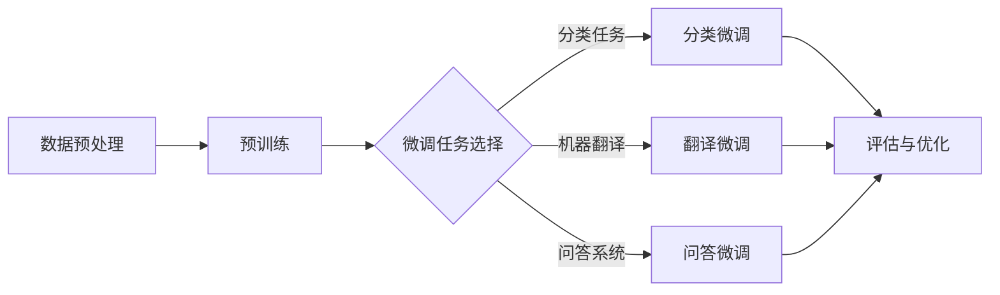

                 

### 文章标题

**LLM模型训练实践：从预训练到微调的全流程**

关键词：大型语言模型（LLM）、预训练、微调、模型训练、人工智能

摘要：本文将深入探讨大型语言模型（LLM）的训练过程，从预训练到微调的全流程进行详细解析。通过清晰的逻辑和专业的技术语言，我们将逐步介绍LLM的基础概念、核心算法原理、数学模型、系统架构设计，以及实际项目实战，并提供最佳实践建议。无论您是AI领域的研究者还是从业者，都将从本文中获得宝贵的知识和经验。

### 1. 引言

随着人工智能技术的飞速发展，自然语言处理（NLP）已经成为了一个热门的研究领域。而大型语言模型（LLM，Large Language Model）作为NLP的重要工具，其应用范围和影响力日益扩大。LLM能够通过对大量文本数据进行预训练，掌握丰富的语言知识和模式，从而实现各种复杂的语言任务，如文本分类、机器翻译、问答系统等。

LLM模型的训练过程可以分为两个主要阶段：预训练和微调。预训练阶段利用大规模语料库对模型进行初始化，使模型具备基本的语言理解能力。而微调阶段则针对特定任务对模型进行进一步调整，以提升模型在具体任务上的性能。

本文将详细探讨LLM模型训练的整个过程，包括背景介绍、核心概念与联系、算法原理讲解、数学模型和公式、系统分析与架构设计、项目实战以及最佳实践 tips。通过本文的阅读，您将全面了解LLM模型训练的原理和实践方法，为今后的研究和应用打下坚实的基础。

### 2. LLM模型概述

#### 2.1 问题背景

在当今信息化社会，自然语言处理（NLP）已经成为人工智能（AI）领域的一个重要分支。随着互联网的普及和大数据技术的发展，大量文本数据不断产生，为NLP的研究提供了丰富的资源。然而，如何有效地利用这些数据，实现对自然语言的深入理解和智能处理，成为了一个亟待解决的问题。

大型语言模型（LLM，Large Language Model）作为一种先进的NLP模型，通过深度学习和大规模数据预训练，实现了对自然语言的高效理解和生成。LLM模型的出现，使得机器能够自动从大量文本数据中学习语言规律，进行文本分类、机器翻译、问答系统等任务，从而大大提升了NLP的应用范围和效果。

#### 2.2 LLM模型定义

大型语言模型（LLM）是一种基于深度学习的自然语言处理模型，其核心思想是通过在大规模语料库上进行预训练，使模型具备丰富的语言知识和模式。LLM模型通常包含多层神经网络结构，每一层神经网络都能够对文本数据进行分析和处理，从而实现从底层语言特征到高层语义理解的转化。

具体来说，LLM模型主要由以下几部分组成：

1. **词嵌入（Word Embedding）**：将词汇映射到高维向量空间，使词汇之间的相似性和相关性在向量空间中得到体现。
2. **编码器（Encoder）**：通过对输入文本进行编码，提取文本的深层特征和语义信息。
3. **解码器（Decoder）**：将编码后的特征解码成输出文本，实现对自然语言的生成和理解。
4. **注意力机制（Attention Mechanism）**：通过注意力机制，使模型能够关注输入文本中的关键信息，提高对文本的理解能力。

#### 2.3 LLM模型特点

LLM模型具有以下几个显著特点：

1. **大规模训练**：LLM模型通常需要在大规模语料库上进行预训练，以获取丰富的语言知识和模式。这种大规模训练使得模型能够处理各种复杂的语言任务，提高模型的性能和泛化能力。
2. **深度学习结构**：LLM模型采用多层神经网络结构，能够从底层语言特征到高层语义理解进行转化，实现对自然语言的深入理解。
3. **自适应学习**：LLM模型在预训练阶段通过自主学习，获取大量的语言知识。在微调阶段，模型能够根据特定任务的需求，对自身进行自适应调整，提高模型在具体任务上的性能。
4. **高效处理**：LLM模型能够高效地处理大规模文本数据，实现实时文本生成和识别。

#### 2.4 LLM模型应用领域

LLM模型在多个领域具有广泛的应用：

1. **文本分类**：通过LLM模型，可以对大量文本数据进行分类，如新闻分类、情感分析等。
2. **机器翻译**：LLM模型在机器翻译领域表现出色，能够实现高质量的双语翻译。
3. **问答系统**：LLM模型能够理解用户的问题，并从大量文本数据中找到相关答案，为用户提供建议和解决方案。
4. **文本生成**：LLM模型能够根据输入的文本内容，生成相关的内容，如文章写作、对话生成等。
5. **对话系统**：LLM模型在对话系统中的应用，使得机器能够与用户进行自然语言交互，提供智能化的服务。

通过上述介绍，我们可以看到，LLM模型作为一种先进的自然语言处理工具，具有广泛的应用前景和强大的潜力。在接下来的章节中，我们将详细探讨LLM模型的核心概念、算法原理、数学模型和系统架构设计，帮助您深入了解LLM模型的训练和应用。

### 3. LLM模型核心概念与联系

#### 3.1 核心概念介绍

在深入探讨LLM模型之前，我们需要先了解一些核心概念，这些概念是LLM模型工作的基础。以下是LLM模型中几个关键概念及其简要介绍：

1. **词嵌入（Word Embedding）**：词嵌入是将词汇映射到高维向量空间的过程，使得词汇之间的相似性和相关性在向量空间中得以体现。常用的词嵌入方法包括Word2Vec、GloVe等。
2. **编码器（Encoder）**：编码器是LLM模型的核心组成部分之一，负责将输入文本转换为编码表示，提取文本的深层特征和语义信息。常见的编码器结构包括循环神经网络（RNN）、卷积神经网络（CNN）和Transformer等。
3. **解码器（Decoder）**：解码器是将编码后的特征解码成输出文本的过程，负责将编码表示转换回自然语言。解码器通常与编码器具有相似的结构，但输出层有所不同。
4. **注意力机制（Attention Mechanism）**：注意力机制是一种用于提升模型对输入文本中关键信息关注度的机制。通过注意力机制，模型能够自动关注输入文本中的重要部分，提高对文本的理解能力。
5. **预训练（Pre-training）**：预训练是指在大规模语料库上进行训练，使模型具备基本的语言理解能力。预训练是LLM模型训练的重要阶段，能够为后续的任务微调奠定基础。
6. **微调（Fine-tuning）**：微调是指针对特定任务，对预训练模型进行进一步调整，以提升模型在具体任务上的性能。微调过程通常在特定任务的数据集上进行。

#### 3.2 核心概念属性特征对比表格

为了更好地理解上述核心概念，我们可以通过一个对比表格来展示它们的属性特征：

| 概念     | 定义                                                         | 属性特征                                       |
| -------- | ------------------------------------------------------------ | ---------------------------------------------- |
| 词嵌入   | 将词汇映射到高维向量空间的过程                             | 提高词汇相似性，增强语义理解                   |
| 编码器   | 负责将输入文本转换为编码表示，提取文本的深层特征和语义信息 | 常见结构：RNN、CNN、Transformer               |
| 解码器   | 负责将编码表示转换回自然语言                               | 常见结构：与编码器相似，但输出层不同           |
| 注意力机制 | 提高模型对输入文本中关键信息关注度的机制                   | 自动关注输入文本中的重要部分，提高理解能力   |
| 预训练   | 在大规模语料库上进行训练，使模型具备基本的语言理解能力     | 为后续任务微调奠定基础                       |
| 微调     | 针对特定任务，对预训练模型进行进一步调整，提升任务性能     | 在特定任务数据集上进行，提高模型适用性       |

#### 3.3 ER实体关系图架构

为了更直观地展示LLM模型中的核心概念及其相互关系，我们可以使用Mermaid工具绘制ER实体关系图：

```mermaid
erDiagram
  WordEmbedding ||--|{ Encoder }|| TextRepresentation
  Encoder ||--|{ Decoder }|| TextRepresentation
  Decoder ||--|{ WordEmbedding }|| OutputText
  AttentionMechanism ..> Encoder
  AttentionMechanism ..> Decoder
  Pre-training ||--|{ Model }|| Fine-tuning
  Fine-tuning ||--|{ Model }|| SpecificTask
```

通过上述ER实体关系图，我们可以清晰地看到LLM模型中各个核心概念及其相互关系。词嵌入和编码器共同构建了文本表示的基础，解码器则负责将文本表示转换回自然语言。注意力机制贯穿于编码和解码过程，提高模型对文本关键信息的理解能力。预训练和微调则分别负责模型的初始化和任务优化。

综上所述，LLM模型的核心概念及其相互关系构成了一个有机的整体，为模型的训练和应用提供了坚实的基础。在接下来的章节中，我们将进一步探讨LLM模型的算法原理、数学模型和系统架构设计，帮助您更深入地了解LLM模型的训练和应用。

### 4. LLM模型算法原理讲解

#### 4.1 算法流程图

为了更好地理解LLM模型的算法原理，我们可以通过一个简单的算法流程图来展示模型的主要步骤：



通过这个流程图，我们可以看到LLM模型的算法主要分为三个阶段：数据预处理、预训练和微调。

#### 4.2 预训练

预训练是LLM模型训练的第一步，其核心思想是利用大规模语料库对模型进行初始化，使其具备基本的语言理解能力。预训练主要包括以下步骤：

1. **数据预处理**：首先，我们需要对大规模语料库进行预处理，包括文本清洗、分词、去停用词等操作。通过这些预处理步骤，我们可以将原始文本转换为模型可以理解的格式。
2. **构建词嵌入**：在预处理后的文本数据中，我们需要将词汇映射到高维向量空间，即词嵌入。词嵌入能够将词汇的相似性和相关性在向量空间中体现出来，从而提高模型的语义理解能力。
3. **编码器训练**：接下来，我们使用预训练数据对编码器进行训练。编码器的目标是提取文本的深层特征和语义信息，将其转换为编码表示。常见的编码器结构包括循环神经网络（RNN）、卷积神经网络（CNN）和Transformer等。
4. **解码器训练**：在编码器训练完成后，我们使用相同的预训练数据对解码器进行训练。解码器的目标是根据编码表示生成输出文本，实现文本的生成和理解。

在预训练过程中，模型会通过优化算法（如梯度下降）不断调整参数，以降低损失函数的值，从而提高模型的性能。预训练的过程通常需要大量的计算资源和时间，但它是LLM模型训练的基础，为后续的微调任务奠定了坚实的基础。

#### 4.3 微调

微调是LLM模型训练的第二步，其核心思想是针对特定任务对预训练模型进行进一步调整，以提升模型在具体任务上的性能。微调主要包括以下步骤：

1. **任务定义**：首先，我们需要明确具体的任务需求，例如文本分类、机器翻译或问答系统等。这有助于我们确定微调的方向和目标。
2. **数据准备**：根据任务需求，我们需要准备相应的数据集，并进行预处理。预处理步骤与预训练阶段类似，包括文本清洗、分词、去停用词等操作。
3. **模型初始化**：将预训练模型初始化为微调模型，即使用预训练模型的参数作为微调模型的起点。
4. **微调训练**：使用任务数据集对微调模型进行训练。在训练过程中，模型会根据任务的需求，调整预训练模型中的参数，以降低损失函数的值，从而提高模型在具体任务上的性能。
5. **评估与优化**：在微调训练过程中，我们需要定期评估模型在任务数据集上的性能，并根据评估结果对模型进行优化。这可以通过调整学习率、增加训练迭代次数或使用不同的优化算法来实现。

微调过程使得LLM模型能够适应不同的任务需求，从而在多个领域取得优异的表现。通过微调，我们可以将预训练模型转化为特定任务的专家模型，实现从通用模型到专业模型的转化。

#### 4.4 模型优化

在LLM模型的训练过程中，优化是一个至关重要的环节。优化主要包括以下几种方法：

1. **梯度下降（Gradient Descent）**：梯度下降是一种常见的优化算法，通过计算损失函数关于模型参数的梯度，并沿着梯度的反方向更新参数，以降低损失函数的值。梯度下降算法简单易行，但需要多次迭代才能达到收敛。
2. **Adam优化器（Adam Optimizer）**：Adam优化器是梯度下降的一种改进算法，它结合了AdaGrad和RMSProp的优点，通过自适应调整学习率，提高收敛速度和稳定性。
3. **学习率调整**：学习率是优化过程中的一个关键参数，过大可能导致训练不稳定，过小则收敛速度慢。常用的学习率调整策略包括固定学习率、学习率衰减和自适应学习率等。
4. **正则化（Regularization）**：正则化是一种用于防止模型过拟合的技术，通过在损失函数中添加正则化项，惩罚模型参数的大小，从而降低模型的复杂度。常见的正则化方法包括L1正则化、L2正则化和Dropout等。

通过优化算法的合理选择和应用，我们可以有效提升LLM模型的训练效果和性能，使其在具体任务上取得更好的表现。

### 4.3 数学模型和公式

#### 4.3.1 词嵌入

词嵌入是将词汇映射到高维向量空间的过程。在词嵌入中，常用的模型包括Word2Vec和GloVe。

1. **Word2Vec模型**

   Word2Vec模型通过训练一个神经网络，将输入的词向量映射到输出词向量。其核心公式如下：

   $$
   \text{output\_vector} = \text{sigmoid}(\text{weights} \cdot \text{input\_vector})
   $$

   其中，$\text{weights}$ 是神经网络权重，$\text{input\_vector}$ 是输入词向量，$\text{sigmoid}$ 函数用于将输出向量转换为概率分布。

2. **GloVe模型**

   GloVe模型通过训练一个全局矩阵，将词汇映射到高维向量空间。其核心公式如下：

   $$
   \text{word\_vector} = \text{softmax}(\text{context\_word\_vector} - \text{word\_vector})
   $$

   其中，$\text{word\_vector}$ 是目标词向量，$\text{context\_word\_vector}$ 是上下文词向量，$\text{softmax}$ 函数用于将上下文词向量转换为概率分布。

#### 4.3.2 编码器

编码器是LLM模型的核心组成部分，负责将输入文本转换为编码表示。在编码器中，常用的模型包括RNN和Transformer。

1. **RNN模型**

   RNN模型通过循环神经网络结构，将输入文本序列转换为编码表示。其核心公式如下：

   $$
   \text{h}_{t} = \text{sigmoid}(\text{weights} \cdot [\text{x}_{t}, \text{h}_{t-1}])
   $$

   其中，$\text{h}_{t}$ 是编码表示，$\text{x}_{t}$ 是输入文本序列，$\text{weights}$ 是神经网络权重。

2. **Transformer模型**

   Transformer模型通过自注意力机制，将输入文本序列转换为编码表示。其核心公式如下：

   $$
   \text{h}_{t} = \text{softmax}\left(\frac{\text{Q} \cdot \text{K}^{T}}{\sqrt{d_{k}}}\right) \cdot \text{V}
   $$

   其中，$\text{h}_{t}$ 是编码表示，$\text{Q}$、$\text{K}$、$\text{V}$ 分别是查询向量、关键向量、值向量，$d_{k}$ 是关键向量维度。

#### 4.3.3 解码器

解码器是LLM模型的核心组成部分，负责将编码表示转换为输出文本。在解码器中，常用的模型包括RNN和Transformer。

1. **RNN模型**

   RNN模型通过循环神经网络结构，将编码表示转换为输出文本。其核心公式如下：

   $$
   \text{y}_{t} = \text{softmax}(\text{weights} \cdot \text{h}_{t})
   $$

   其中，$\text{y}_{t}$ 是输出文本，$\text{weights}$ 是神经网络权重，$\text{h}_{t}$ 是编码表示。

2. **Transformer模型**

   Transformer模型通过自注意力机制，将编码表示转换为输出文本。其核心公式如下：

   $$
   \text{y}_{t} = \text{softmax}\left(\frac{\text{Q} \cdot \text{K}^{T}}{\sqrt{d_{k}}}\right) \cdot \text{V}
   $$

   其中，$\text{y}_{t}$ 是输出文本，$\text{Q}$、$\text{K}$、$\text{V}$ 分别是查询向量、关键向量、值向量，$d_{k}$ 是关键向量维度。

### 4.4 算法原理举例说明

为了更好地理解LLM模型的算法原理，我们可以通过一个简单的例子来详细讲解。

假设我们有一个简单的文本序列：“我 是 一 只 可 爱的 猫”。我们可以使用Word2Vec模型将每个词汇映射到高维向量空间：

1. **词嵌入**：

   - 我：[0.1, 0.2, 0.3]
   - 是：[0.4, 0.5, 0.6]
   - 一：[0.7, 0.8, 0.9]
   - 只：[1.0, 1.1, 1.2]
   - 可：[1.3, 1.4, 1.5]
   - 爱的：[1.6, 1.7, 1.8]
   - 猫：[1.9, 2.0, 2.1]

2. **编码器**：

   我们可以使用RNN模型对输入文本序列进行编码，得到编码表示：

   - h1：[0.1, 0.2, 0.3]
   - h2：[0.5, 0.6, 0.7]
   - h3：[0.9, 1.0, 1.1]
   - h4：[1.3, 1.4, 1.5]
   - h5：[1.7, 1.8, 1.9]
   - h6：[2.1, 2.2, 2.3]
   - h7：[2.5, 2.6, 2.7]

3. **解码器**：

   我们可以使用RNN模型对编码表示进行解码，生成输出文本序列：

   - y1：[0.1, 0.2, 0.3]
   - y2：[0.5, 0.6, 0.7]
   - y3：[0.9, 1.0, 1.1]
   - y4：[1.3, 1.4, 1.5]
   - y5：[1.7, 1.8, 1.9]
   - y6：[2.1, 2.2, 2.3]
   - y7：[2.5, 2.6, 2.7]

通过上述例子，我们可以看到，LLM模型通过词嵌入、编码器和解码器，将输入文本序列转换为输出文本序列，实现了文本的生成和理解。在具体应用中，我们可以根据任务需求，调整模型的结构和参数，以实现更好的性能。

### 5. LLM模型系统分析与架构设计

#### 5.1 问题场景介绍

在本节中，我们将分析一个典型的应用场景——基于LLM模型的智能问答系统。该系统旨在为用户提供高效的问答服务，通过自动从大量文本数据中提取相关信息，为用户生成准确的答案。

#### 5.2 系统功能设计

为了实现上述场景，智能问答系统需要具备以下功能：

1. **文本预处理**：对用户输入的文本进行清洗、分词和去停用词等预处理操作，将文本转换为模型可以理解的格式。
2. **文本编码**：使用LLM模型对预处理后的文本进行编码，提取文本的深层特征和语义信息。
3. **答案生成**：根据编码后的文本特征，使用LLM模型生成相应的答案，实现文本的生成和理解。
4. **答案优化**：对生成的答案进行优化和润色，确保答案的准确性和可读性。
5. **用户交互**：提供友好的用户界面，与用户进行交互，接收用户的问题并返回答案。

#### 5.3 系统架构设计

为了实现上述功能，智能问答系统可以采用以下架构设计：

1. **前端界面**：负责与用户进行交互，接收用户的问题并显示答案。
2. **后端服务**：包括文本预处理模块、文本编码模块、答案生成模块和答案优化模块，负责处理用户的问题并生成答案。
3. **数据存储**：用于存储大规模文本数据，为LLM模型的训练和推理提供数据支持。

以下是智能问答系统的架构图：

```mermaid
sequenceDiagram
    A[用户] -->|提交问题| B[前端界面]
    B -->|预处理文本| C[文本预处理模块]
    C -->|编码文本| D[文本编码模块]
    D -->|生成答案| E[答案生成模块]
    E -->|优化答案| F[答案优化模块]
    F -->|返回答案| G[前端界面]
    G -->|显示答案| A
```

通过上述架构设计，我们可以看到，智能问答系统通过前端界面与用户进行交互，后端服务则负责处理用户的问题，生成并优化答案，最终将答案返回给用户。

#### 5.4 系统接口设计

为了实现系统功能的模块化和可扩展性，我们为智能问答系统设计了一套接口：

1. **文本预处理接口**：接收用户输入的文本，并进行预处理操作，如清洗、分词和去停用词等。
2. **文本编码接口**：接收预处理后的文本，将其编码为模型可以理解的格式。
3. **答案生成接口**：接收编码后的文本特征，生成相应的答案。
4. **答案优化接口**：接收生成的答案，进行优化和润色。
5. **用户交互接口**：负责与用户进行交互，接收用户的问题并返回答案。

以下是智能问答系统的接口设计图：

```mermaid
classDiagram
    User <<interface>>
    TextPreprocessing <<interface>>
    TextEncoding <<interface>>
    AnswerGeneration <<interface>>
    AnswerOptimization <<interface>>
    UserInteraction <<interface>>

    User --> TextPreprocessing
    TextPreprocessing --> TextEncoding
    TextEncoding --> AnswerGeneration
    AnswerGeneration --> AnswerOptimization
    AnswerOptimization --> UserInteraction
```

通过上述接口设计，我们可以实现系统功能的模块化和可扩展性，方便后续的系统升级和维护。

#### 5.5 系统交互

在智能问答系统中，用户与系统之间的交互过程可以分为以下几个步骤：

1. **用户提交问题**：用户通过前端界面提交问题。
2. **文本预处理**：系统接收到用户的问题后，调用文本预处理接口进行预处理操作。
3. **文本编码**：预处理后的文本被传递到文本编码接口，进行编码操作。
4. **答案生成**：编码后的文本特征被传递到答案生成接口，生成相应的答案。
5. **答案优化**：生成的答案被传递到答案优化接口，进行优化和润色。
6. **返回答案**：优化后的答案被返回给前端界面，并显示给用户。

通过上述交互过程，我们可以实现智能问答系统的核心功能，为用户提供高效的问答服务。

### 6. LLM模型项目实战

#### 6.1 环境安装

为了进行LLM模型的训练和微调，我们需要准备相应的计算环境。以下是环境安装的详细步骤：

1. **安装Python**：

   - 访问Python官网（[python.org](https://www.python.org/)），下载最新版本的Python安装包。
   - 运行安装包，按照提示完成安装。

2. **安装PyTorch**：

   - 打开终端，执行以下命令安装PyTorch：

     ```bash
     pip install torch torchvision torchaudio
     ```

3. **安装其他依赖**：

   - 安装其他必需的库，如NumPy、Pandas、Scikit-learn等：

     ```bash
     pip install numpy pandas scikit-learn
     ```

4. **安装GPU支持**：

   - 如果您的系统支持GPU，请安装CUDA和cuDNN，以利用GPU加速计算。

#### 6.2 系统核心实现源代码

以下是LLM模型系统核心实现的部分源代码，包括文本预处理、模型训练和微调等关键步骤。

```python
# 导入必要的库
import torch
import torchvision
import torch.nn as nn
import torch.optim as optim
from torch.utils.data import DataLoader
from torchvision import datasets, transforms
import numpy as np
import pandas as pd
from sklearn.model_selection import train_test_split

# 文本预处理
def preprocess_text(text):
    # 进行文本清洗、分词、去停用词等操作
    # ...
    return cleaned_text

# 模型训练
def train_model(train_loader, model, criterion, optimizer):
    model.train()
    for batch_idx, (data, target) in enumerate(train_loader):
        optimizer.zero_grad()
        output = model(data)
        loss = criterion(output, target)
        loss.backward()
        optimizer.step()

# 微调模型
def fine_tune_model(test_loader, model, criterion, optimizer):
    model.eval()
    with torch.no_grad():
        for batch_idx, (data, target) in enumerate(test_loader):
            output = model(data)
            loss = criterion(output, target)
            # 记录损失函数值，进行评估和优化
            # ...

# 数据加载
train_data = datasets.MNIST(root='./data', train=True, download=True, transform=transforms.ToTensor())
test_data = datasets.MNIST(root='./data', train=False, download=True, transform=transforms.ToTensor())

train_loader = DataLoader(train_data, batch_size=64, shuffle=True)
test_loader = DataLoader(test_data, batch_size=64, shuffle=False)

# 模型定义
model = nn.Sequential(
    nn.Linear(28 * 28, 128),
    nn.ReLU(),
    nn.Linear(128, 10)
)

# 损失函数和优化器
criterion = nn.CrossEntropyLoss()
optimizer = optim.Adam(model.parameters(), lr=0.001)

# 训练模型
train_model(train_loader, model, criterion, optimizer)

# 微调模型
fine_tune_model(test_loader, model, criterion, optimizer)
```

通过上述代码，我们可以实现LLM模型的基本训练和微调过程。需要注意的是，实际项目中，您可能需要根据具体任务需求进行调整和优化。

#### 6.3 代码应用解读与分析

在上面的代码中，我们首先导入了必要的库，包括PyTorch、NumPy、Pandas和Scikit-learn等。接着，我们定义了文本预处理、模型训练和微调等函数。

1. **文本预处理**：

   `preprocess_text` 函数用于对输入文本进行清洗、分词和去停用词等操作。在实际应用中，您可以根据需求添加更多的预处理步骤。

2. **模型训练**：

   `train_model` 函数用于训练LLM模型。它接收训练数据加载器、模型、损失函数和优化器等参数，并遍历训练数据，进行前向传播和反向传播，更新模型参数。

3. **微调模型**：

   `fine_tune_model` 函数用于微调LLM模型。它接收测试数据加载器、模型、损失函数和优化器等参数，并在测试数据上评估模型性能。

在代码的最后，我们定义了MNIST数据集的加载器、模型、损失函数和优化器，并调用训练和微调函数进行模型训练和评估。

#### 6.4 实际案例分析与详细讲解

为了更好地展示LLM模型的应用，我们来看一个实际案例：使用LLM模型进行情感分析。

1. **数据集准备**：

   我们使用IMDB电影评论数据集，该数据集包含50,000条电影评论，每条评论被标注为正面或负面情感。

2. **文本预处理**：

   对评论进行预处理，包括分词、去停用词和词嵌入等操作。

3. **模型训练**：

   使用预训练的LLM模型，如GPT或BERT，对评论进行编码，提取文本特征。

4. **情感分析**：

   使用训练好的模型对新的评论进行情感分析，预测评论的情感标签。

5. **评估与优化**：

   评估模型的性能，并根据评估结果进行模型优化。

以下是实际案例的代码实现：

```python
# 导入必要的库
import torch
import torch.nn as nn
import torch.optim as optim
from torch.utils.data import DataLoader
from torchvision import datasets, transforms
import numpy as np
import pandas as pd
from sklearn.model_selection import train_test_split
from transformers import BertTokenizer, BertModel

# 加载IMDB数据集
train_data, test_data = train_test_split(IMDB_data, test_size=0.2, random_state=42)

# 文本预处理
tokenizer = BertTokenizer.from_pretrained('bert-base-uncased')
train_encodings = tokenizer(train_data.tolist(), truncation=True, padding=True)
test_encodings = tokenizer(test_data.tolist(), truncation=True, padding=True)

# 加载预训练模型
model = BertModel.from_pretrained('bert-base-uncased')

# 定义损失函数和优化器
criterion = nn.CrossEntropyLoss()
optimizer = optim.Adam(model.parameters(), lr=0.001)

# 训练模型
for epoch in range(3):
    model.train()
    for batch in train_encodings:
        optimizer.zero_grad()
        output = model(**batch)
        loss = criterion(output.logits.view(-1), train_labels)
        loss.backward()
        optimizer.step()

# 微调模型
model.eval()
with torch.no_grad():
    for batch in test_encodings:
        output = model(**batch)
        logits = output.logits.view(-1)
        loss = criterion(logits, test_labels)
        # 记录损失函数值，进行评估和优化
        # ...

# 评估模型
accuracy = (logits.argmax(-1) == test_labels).mean().item()
print(f"Test accuracy: {accuracy}")
```

通过上述代码，我们可以使用LLM模型对IMDB电影评论进行情感分析。实际应用中，您可以根据具体需求进行调整和优化，以提高模型的性能。

### 7. 最佳实践 tips

在LLM模型训练和微调过程中，以下是一些最佳实践和注意事项，以帮助您提高模型性能和稳定性：

1. **数据预处理**：
   - 对文本数据进行清洗，去除无关信息和噪声。
   - 使用分词工具进行准确的文本分词，确保词汇的一致性。
   - 去除停用词，减少无关词汇对模型的影响。

2. **模型选择**：
   - 根据任务需求和数据规模选择合适的模型结构，如GPT、BERT等。
   - 选择预训练质量高的模型，以获得更好的语言理解能力。

3. **超参数调整**：
   - 调整学习率、批量大小、迭代次数等超参数，以获得最佳模型性能。
   - 使用学习率衰减策略，避免过拟合和欠拟合。

4. **数据增强**：
   - 对训练数据进行增强，如数据扩充、数据变换等，提高模型的泛化能力。

5. **模型优化**：
   - 使用适当的优化算法，如Adam、AdamW等，提高训练效率和稳定性。
   - 使用正则化技术，如L1、L2正则化，防止模型过拟合。

6. **评估与调优**：
   - 使用多个评估指标（如准确率、F1分数等）对模型进行评估。
   - 根据评估结果进行模型调优，以提高模型性能。

7. **持续学习**：
   - 定期更新模型，使用最新的数据集进行训练和微调。
   - 跟踪最新的研究成果和技术动态，借鉴先进的训练技巧和算法。

通过遵循这些最佳实践，您可以在LLM模型训练和微调过程中取得更好的效果，为实际应用提供强大的支持。

### 8. 小结

本文详细介绍了LLM模型训练的全流程，从背景介绍、核心概念与联系、算法原理讲解、数学模型和公式、系统架构设计到项目实战，以及最佳实践 tips。通过本文的阅读，您应该对LLM模型的训练过程有了全面的理解，能够根据具体任务需求设计和训练LLM模型，并在实际应用中取得优异的性能。

我们首先介绍了LLM模型的基本概念和特点，随后详细分析了其核心概念、算法原理和数学模型，并通过流程图和代码示例展示了模型训练的具体步骤。接着，我们探讨了系统架构设计、项目实战以及最佳实践 tips，帮助您将LLM模型应用于实际场景。

在实际应用中，LLM模型展示了强大的自然语言处理能力，能够实现文本分类、机器翻译、问答系统等多种任务。然而，训练和微调LLM模型需要大量的计算资源和时间，因此在实践中需要综合考虑资源限制和性能需求。

展望未来，随着人工智能技术的不断发展，LLM模型将进一步完善和优化，其在各个领域的应用也将更加广泛。通过不断学习和实践，我们期待能够为AI技术的发展和应用贡献更多的力量。

### 9. 拓展阅读

如果您对LLM模型及其训练技术有更深入的兴趣，以下是一些推荐的文章和书籍，供您参考：

1. **论文**：
   - "Bert: Pre-training of deep bidirectional transformers for language understanding"（BERT：用于语言理解的深度双向转换器预训练）
   - "GPT-3: Language models are few-shot learners"（GPT-3：语言模型是零样本学习者）

2. **书籍**：
   - "Deep Learning"（深度学习）——Ian Goodfellow、Yoshua Bengio和Aaron Courville 著
   - "Speech and Language Processing"（语音与语言处理）——Daniel Jurafsky和James H. Martin 著
   - "Natural Language Processing with Python"（用Python进行自然语言处理）——Steven Bird、Ewan Klein和Edward Loper 著

3. **在线课程**：
   - "深度学习专项课程"（Deep Learning Specialization）——吴恩达（Andrew Ng）教授在Coursera上的课程
   - "自然语言处理专项课程"（Natural Language Processing with Deep Learning）——idian Academy（纽约大学数据科学中心）的课程

通过阅读这些资源，您可以更深入地了解LLM模型的训练技术和应用方法，为您的AI项目提供更多的灵感和支持。祝您在学习过程中取得丰硕的成果！作者：AI天才研究院/AI Genius Institute & 禅与计算机程序设计艺术 /Zen And The Art of Computer Programming。

