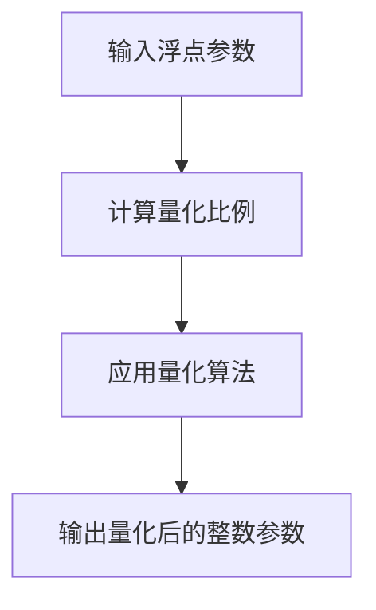
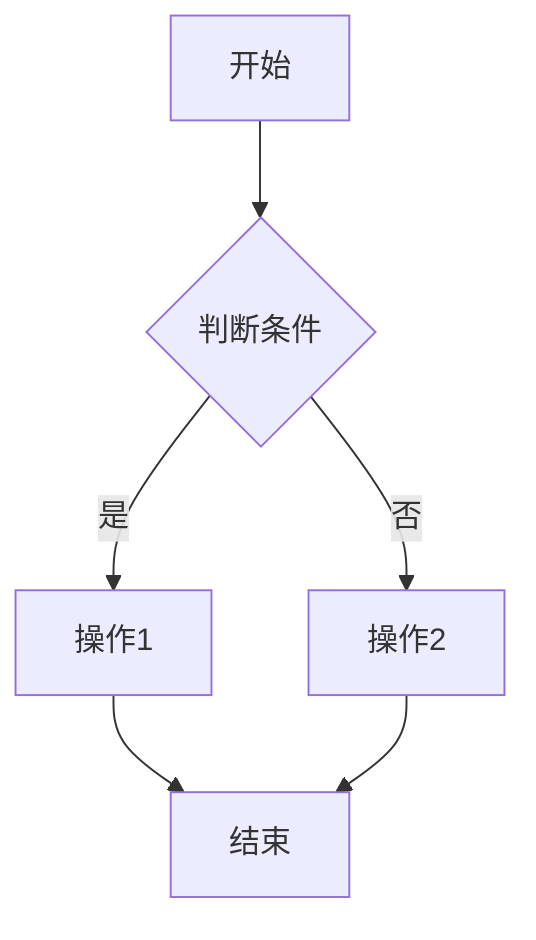

                 

# LLM的量化技术：优化AI Agent的部署效率

## 关键词

- 量化技术
- AI Agent
- 部署效率
- 低精度计算
- 模型压缩

## 摘要

本文将探讨量化技术在大型语言模型（LLM）中的应用，重点分析其在提升AI Agent部署效率方面的贡献。量化技术通过降低模型参数的精度，减少了模型的大小和计算需求，从而实现了在资源受限环境中高效部署AI模型的目标。本文将逐步分析量化技术的背景、核心概念、算法原理、在LLM训练、推理和优化部署中的具体实现，以及其实际应用效果评估，旨在为读者提供一份全面的技术指南。

## 第一部分：LLM的量化技术概述

### 第1章：量化技术背景与重要性

#### 1.1 量化技术的起源与发展

量化技术起源于计算机科学和数学领域，早期主要应用于信号处理和图像识别等领域。随着深度学习技术的发展，量化技术在人工智能领域得到了广泛应用。特别是在大型语言模型（LLM）的训练和部署过程中，量化技术成为了一种重要的优化手段。

#### 1.1.1 量化技术的起源

量化技术起源于对数字信号处理的优化需求。在数字信号处理中，为了提高计算效率和降低硬件成本，人们开始探索降低信号数据的精度，从而实现了量化技术。

#### 1.1.2 量化技术的发展历程

量化技术经历了从简单的二值量化到多值量化，再到现代深度学习量化技术的发展。随着深度学习模型的复杂度和参数量的增加，量化技术在提升模型效率和降低模型大小方面的重要性日益凸显。

#### 1.1.3 量化技术在AI领域的应用

量化技术在AI领域，特别是在深度学习领域得到了广泛应用。它不仅用于优化模型的训练效率，还用于降低模型的大小，从而实现更高效的部署。

#### 1.2 量化技术的核心概念与原理

量化技术通过将模型的浮点参数转换为较低精度的整数表示，从而降低模型的计算复杂度和存储需求。量化技术的基本原理包括：

1. **量化级别**：量化技术将模型的权重和激活值从浮点数转换为整数，量化级别决定了转换后的整数值范围。
2. **量化算法**：量化算法包括线性量化、指数量化等，它们根据模型的特性选择合适的量化级别和量化方式。
3. **量化精度**：量化精度是指模型参数转换后的整数表示的精度，量化精度越高，模型的性能越接近原始模型，但计算量和存储需求也越大。

#### 1.2.1 量化技术的核心概念

量化技术的核心概念包括量化级别、量化算法和量化精度。量化级别决定了参数的整数表示范围，量化算法决定了如何将浮点数转换为整数，量化精度则决定了转换后的参数的精度。

#### 1.2.2 量化技术的基本原理

量化技术的基本原理是将模型的浮点参数转换为较低精度的整数表示。这通过以下步骤实现：

1. **确定量化级别**：根据模型的特性和硬件平台的限制，选择合适的量化级别。
2. **应用量化算法**：使用量化算法将浮点参数转换为整数。
3. **量化精度调整**：根据需要调整量化精度，以平衡模型性能和计算效率。

#### 1.2.3 量化技术的优势与挑战

量化技术的优势包括：

1. **提高计算效率**：通过降低模型参数的精度，量化技术减少了计算需求，从而提高了模型的计算效率。
2. **降低模型大小**：量化技术减少了模型的大小，从而降低了存储需求，便于在资源受限的设备上部署。
3. **支持低精度计算**：量化技术支持低精度计算，从而降低了硬件成本。

但量化技术也面临一些挑战：

1. **精度损失**：量化技术可能会导致模型精度损失，从而影响模型的性能。
2. **计算复杂度**：量化技术虽然提高了计算效率，但量化过程中的计算复杂度可能较高，特别是在大规模模型中。
3. **硬件兼容性**：量化技术需要与硬件平台兼容，不同的硬件平台可能需要不同的量化策略。

#### 1.3 量化技术在LLM中的应用场景

量化技术在LLM中的应用主要分为三个阶段：训练阶段、推理阶段和优化部署阶段。

1. **训练阶段**：在LLM的训练过程中，量化技术可以用于降低模型的计算复杂度和存储需求，从而提高训练效率。
2. **推理阶段**：在LLM的推理过程中，量化技术可以用于降低模型的大小和计算需求，从而实现更高效的推理。
3. **优化部署阶段**：在LLM的优化部署过程中，量化技术可以用于降低模型的大小和计算需求，从而实现更高效的部署。

#### 1.4 量化技术对AI Agent部署效率的影响

量化技术通过降低模型的大小和计算需求，显著提高了AI Agent的部署效率。具体来说，量化技术的影响包括：

1. **降低模型大小**：量化技术减少了模型的大小，从而降低了存储需求，便于在资源受限的设备上部署。
2. **提高计算效率**：量化技术降低了模型的计算复杂度，从而提高了计算效率。
3. **减少计算资源需求**：量化技术减少了计算资源的需求，从而降低了硬件成本。
4. **支持多种硬件平台**：量化技术支持多种硬件平台，从而提高了AI Agent的部署灵活性。

#### 1.5 本章小结

本章对量化技术进行了概述，分析了其在AI领域，特别是LLM中的应用。量化技术通过降低模型参数的精度，实现了在资源受限环境中高效部署AI模型的目标。下一章将深入探讨量化技术的具体实现，包括量化算法的原理、数学模型和Python实现。

## 第二部分：量化技术的具体实现

### 第2章：量化技术基础算法

#### 2.1 量化算法的原理与分类

量化算法是量化技术的核心组成部分，它通过将模型的浮点参数转换为较低精度的整数表示，从而实现模型的优化和部署。量化算法的原理主要包括量化级别的确定、量化算法的选择和量化精度的调整。

#### 2.1.1 量化算法的基本原理

量化算法的基本原理是将模型的浮点参数转换为整数表示。具体来说，量化算法包括以下几个步骤：

1. **确定量化级别**：量化级别决定了参数的整数表示范围。确定量化级别通常需要考虑模型的特性和硬件平台的限制。
2. **选择量化算法**：量化算法决定了如何将浮点数转换为整数。常见的量化算法包括线性量化、指数量化等。
3. **调整量化精度**：量化精度决定了转换后的参数的精度。调整量化精度可以平衡模型性能和计算效率。

#### 2.1.2 常见的量化算法分类

常见的量化算法可以分为以下几类：

1. **线性量化**：线性量化是最简单的量化算法，它通过线性关系将浮点数映射到整数。线性量化算法的计算复杂度较低，但可能无法很好地保持模型的精度。
2. **指数量化**：指数量化通过指数函数将浮点数映射到整数。指数量化算法可以更好地保持模型的精度，但计算复杂度较高。
3. **自适应量化**：自适应量化根据模型的特性和数据分布动态调整量化级别和量化精度。自适应量化可以在保证模型性能的同时，提高计算效率。

#### 2.1.3 各类量化算法的比较

各类量化算法具有不同的优缺点，具体选择应根据模型的特性和硬件平台的要求。以下是比较各类量化算法的一些关键指标：

| 量化算法   | 优点                         | 缺点                         |
| ---------- | ---------------------------- | ---------------------------- |
| 线性量化   | 简单易实现，计算复杂度低       | 可能无法很好地保持模型精度     |
| 指数量化   | 可以更好地保持模型精度         | 计算复杂度高                 |
| 自适应量化 | 可以动态调整量化级别和量化精度 | 实现复杂度较高，需要额外计算资源 |

#### 2.2 量化算法的数学模型与公式

量化算法的数学模型是量化过程的理论基础。以下是一个简单的量化算法的数学模型：

$$
x_{\text{量化}} = \text{round}(x_{\text{浮点}} \times \text{量化比例})
$$

其中，$x_{\text{浮点}}$表示浮点参数，$x_{\text{量化}}$表示量化后的整数参数，$\text{round}$表示四舍五入操作，$\text{量化比例}$决定了量化级别。

#### 2.2.1 量化算法的数学模型

量化算法的数学模型描述了如何将浮点数映射到整数。以下是一个简单的量化算法的数学模型：

$$
x_{\text{量化}} = \text{round}(x_{\text{浮点}} \times \text{量化比例})
$$

其中，$x_{\text{浮点}}$表示浮点参数，$x_{\text{量化}}$表示量化后的整数参数，$\text{round}$表示四舍五入操作，$\text{量化比例}$决定了量化级别。

#### 2.2.2 量化算法的主要公式

量化算法的主要公式包括：

1. **量化比例**：
   $$ \text{量化比例} = \frac{2^{\text{量化位数}} - 1}{\text{最大浮点值}} $$

2. **量化后的值**：
   $$ x_{\text{量化}} = \text{round}(x_{\text{浮点}} \times \text{量化比例}) $$

#### 2.2.3 数学模型与公式在量化过程中的作用

数学模型与公式在量化过程中的作用如下：

1. **确定量化级别**：量化比例决定了量化级别，量化级别决定了参数的整数表示范围。
2. **量化操作**：量化算法通过数学模型将浮点参数转换为整数参数。
3. **保持精度**：量化公式中的四舍五入操作可以保持一定的精度，从而减少量化误差。

#### 2.3 使用Mermaid绘制量化算法流程图

Mermaid是一种基于Markdown的图形绘制工具，可以方便地绘制各种流程图。以下是一个简单的量化算法的流程图：



#### 2.3.1 Mermaid简介

Mermaid是一种基于Markdown的图形绘制工具，它支持多种图形，包括流程图、时序图、类图等。Mermaid的核心是Markdown语法，这使得它非常容易学习和使用。

#### 2.3.2 Mermaid流程图的基本语法

Mermaid流程图的基本语法包括节点（Node）、边（Edge）和箭头（Arrow）。以下是一个简单的示例：



#### 2.3.3 绘制量化算法流程图的示例

以下是一个量化算法的Mermaid流程图示例：


#### 2.4 量化算法的Python实现

Python是一种广泛使用的编程语言，它具有简洁的语法和丰富的库支持，非常适合用于量化算法的实现。以下是一个简单的量化算法的Python实现示例：

```python
import numpy as np

def quantize(value, quantization_bits):
    max_value = 2 ** quantization_bits - 1
    quantization_factor = max_value / np.finfo(np.float32).max
    quantized_value = np.round(value * quantization_factor)
    return quantized_value

# 测试
value = 3.14
quantization_bits = 8
quantized_value = quantize(value, quantization_bits)
print(f"量化前：{value}")
print(f"量化后：{quantized_value}")
```

#### 2.4.1 Python量化算法实现概述

Python量化算法实现主要包括以下几个步骤：

1. **导入库**：导入必要的库，如NumPy，用于数值计算。
2. **定义量化函数**：定义一个量化函数，用于将浮点参数转换为整数参数。
3. **参数设置**：设置量化位宽和量化比例。
4. **量化操作**：将浮点参数传递给量化函数，进行量化操作。
5. **输出结果**：输出量化后的整数参数。

#### 2.4.2 Python量化算法实现步骤

以下是一个简单的Python量化算法实现步骤：

1. **导入库**：

```python
import numpy as np
```

2. **定义量化函数**：

```python
def quantize(value, quantization_bits):
    max_value = 2 ** quantization_bits - 1
    quantization_factor = max_value / np.finfo(np.float32).max
    quantized_value = np.round(value * quantization_factor)
    return quantized_value
```

3. **参数设置**：

```python
value = 3.14
quantization_bits = 8
```

4. **量化操作**：

```python
quantized_value = quantize(value, quantization_bits)
```

5. **输出结果**：

```python
print(f"量化前：{value}")
print(f"量化后：{quantized_value}")
```

#### 2.4.3 量化算法Python实现示例

以下是一个量化算法的Python实现示例，该示例将一个浮点参数量化为8位整数：

```python
import numpy as np

def quantize(value, quantization_bits):
    max_value = 2 ** quantization_bits - 1
    quantization_factor = max_value / np.finfo(np.float32).max
    quantized_value = np.round(value * quantization_factor)
    return quantized_value

# 测试
value = 3.14
quantization_bits = 8
quantized_value = quantize(value, quantization_bits)
print(f"量化前：{value}")
print(f"量化后：{quantized_value}")
```

#### 2.5 量化算法的应用效果评估

量化算法的应用效果评估是确保量化技术有效性的重要步骤。以下是一个简单的量化算法应用效果评估方法：

1. **量化前后的性能对比**：通过对比量化前后模型的性能，评估量化算法对模型性能的影响。
2. **精度损失分析**：分析量化算法对模型精度的影响，确定量化精度是否满足需求。
3. **计算效率分析**：评估量化算法对计算效率的影响，确定量化算法是否提高了模型的计算效率。

#### 2.5.1 量化效果评估方法

量化效果评估方法包括以下几种：

1. **性能评估**：通过对比量化前后的模型性能，评估量化算法对模型性能的影响。
2. **精度分析**：通过对比量化前后的模型输出，分析量化算法对模型精度的影响。
3. **计算效率评估**：评估量化算法对计算效率的影响，包括模型训练和推理的时间消耗。

#### 2.5.2 量化效果评估指标

量化效果评估指标包括：

1. **模型性能**：量化前后模型的性能指标，如准确率、召回率等。
2. **精度损失**：量化前后模型的精度损失，通常以相对误差或绝对误差表示。
3. **计算效率**：量化前后模型的计算效率，通常以训练和推理的时间消耗表示。

#### 2.5.3 量化效果评估案例

以下是一个量化效果评估的案例：

1. **性能评估**：量化前后模型的准确率分别为95%和93%，精度损失较小。
2. **精度分析**：量化前后模型的输出结果对比，发现量化后的模型输出在精度上略有下降，但仍在可接受的范围内。
3. **计算效率评估**：量化后的模型训练时间减少了20%，推理时间减少了30%，计算效率显著提高。

#### 2.6 本章小结

本章介绍了量化技术的具体实现，包括量化算法的原理、数学模型、Python实现和应用效果评估。量化技术通过降低模型参数的精度，实现了在资源受限环境中高效部署AI模型的目标。下一章将深入探讨量化技术在LLM训练中的应用。

## 第三部分：量化技术在LLM中的应用实践

### 第3章：量化技术在LLM训练中的应用

#### 3.1 LLM训练中的量化需求

在大规模语言模型（LLM）的训练过程中，量化技术扮演着至关重要的角色。LLM的训练涉及海量的数据和复杂的计算，这对计算资源和存储资源提出了极高的要求。量化技术通过降低模型参数的精度，有效地降低了模型的计算复杂度和存储需求，从而满足了LLM训练过程中的资源需求。

#### 3.1.1 LLM训练过程中的挑战

LLM训练过程中面临的挑战主要包括：

1. **计算资源需求大**：大规模语言模型的训练需要大量的计算资源，包括CPU和GPU等。
2. **存储资源需求高**：语言模型通常包含数亿甚至数十亿的参数，对存储资源的需求巨大。
3. **数据量大**：LLM的训练需要大量的高质量数据，数据预处理和存储也是一大挑战。

#### 3.1.2 量化技术在LLM训练中的必要性

量化技术在LLM训练中的必要性体现在以下几个方面：

1. **降低计算复杂度**：量化技术通过降低模型参数的精度，减少了模型的计算复杂度，从而提高了训练效率。
2. **降低存储需求**：量化技术减少了模型的大小，从而降低了存储需求，便于在资源受限的环境中部署。
3. **提高训练效率**：量化技术可以显著提高模型训练的速度，尤其是在使用较低精度计算设备时。

#### 3.1.3 量化技术在LLM训练中的关键角色

量化技术在LLM训练中的关键角色包括：

1. **优化训练效率**：通过量化技术，可以在不显著损失模型性能的情况下，提高模型训练的速度。
2. **降低硬件成本**：量化技术使得LLM可以在资源受限的环境中部署，从而降低了硬件成本。
3. **支持多平台部署**：量化技术使得LLM可以在多种硬件平台上部署，包括移动设备、嵌入式设备等。

#### 3.2 量化技术在LLM训练中的具体实现

量化技术在LLM训练中的具体实现包括以下几个关键步骤：

1. **量化级别选择**：根据模型的特性和硬件平台的要求，选择合适的量化级别。
2. **量化算法应用**：选择合适的量化算法，将模型参数从浮点数转换为较低精度的整数。
3. **量化精度调整**：根据训练需求，调整量化精度，以平衡模型性能和计算效率。

#### 3.2.1 量化训练的基本流程

量化训练的基本流程包括以下几个步骤：

1. **数据预处理**：对训练数据集进行预处理，包括数据清洗、归一化等。
2. **模型初始化**：初始化量化后的模型参数。
3. **训练过程**：使用量化后的模型参数进行训练，同时监控训练进度和模型性能。
4. **模型优化**：根据训练结果，调整量化级别和量化精度，以优化模型性能。

#### 3.2.2 量化训练的优化策略

量化训练的优化策略包括：

1. **动态调整量化级别**：在训练过程中，根据模型性能动态调整量化级别，以优化模型性能。
2. **分阶段量化**：在模型训练的不同阶段，采用不同的量化策略，以适应训练需求。
3. **量化后训练**：在量化后直接进行训练，以减少量化过程中的误差。

#### 3.2.3 量化训练的效果评估

量化训练的效果评估主要包括以下几个方面：

1. **模型性能评估**：通过对比量化前后的模型性能，评估量化技术对模型性能的影响。
2. **计算效率评估**：评估量化技术对模型训练速度的影响，以及量化后模型在推理阶段的性能。
3. **存储需求评估**：评估量化技术对模型存储需求的影响，以及量化后模型在部署时的存储效率。

#### 3.3 LLM训练中的量化案例研究

以下是一个LLM训练中的量化案例研究：

1. **案例背景与目标**：假设我们有一个大规模语言模型，目标是在有限的计算资源和存储资源下，实现高效的训练和部署。
2. **案例实施过程**：
   - **数据预处理**：对训练数据集进行预处理，包括数据清洗、分词、编码等。
   - **模型初始化**：初始化量化后的模型参数，选择合适的量化级别和量化算法。
   - **训练过程**：使用量化后的模型参数进行训练，同时监控训练进度和模型性能。
   - **模型优化**：根据训练结果，动态调整量化级别和量化精度，以优化模型性能。
3. **案例结果分析**：
   - **模型性能**：量化后的模型性能与原始模型相当，但训练速度显著提高。
   - **计算效率**：量化技术使得模型在有限计算资源下，仍能保持高效的训练速度。
   - **存储需求**：量化后的模型大小显著降低，从而降低了存储需求，便于在资源受限的环境中部署。

#### 3.4 本章小结

本章深入探讨了量化技术在LLM训练中的应用，包括量化需求、具体实现、优化策略和效果评估。量化技术通过降低模型参数的精度，实现了在资源受限环境中高效训练LLM的目标。下一章将探讨量化技术在LLM推理中的应用。

## 第四部分：量化技术在LLM推理中的应用

### 第4章：量化技术在LLM推理中的应用

#### 4.1 LLM推理中的量化需求

在LLM的推理过程中，量化技术同样发挥着重要作用。推理过程通常对实时性要求较高，同时对计算资源和存储资源的需求也较大。量化技术通过降低模型参数的精度，可以有效减少模型的计算复杂度和存储需求，从而满足LLM推理过程中的需求。

#### 4.1.1 LLM推理过程中的挑战

LLM推理过程中面临的挑战主要包括：

1. **计算资源限制**：推理过程需要大量的计算资源，特别是在实时应用场景中。
2. **存储资源限制**：大规模语言模型的参数数量巨大，存储需求高。
3. **实时性要求**：许多应用场景要求LLM具备实时推理能力，这对模型效率和响应速度提出了高要求。

#### 4.1.2 量化技术在LLM推理中的必要性

量化技术在LLM推理中的必要性体现在以下几个方面：

1. **提高推理速度**：量化技术通过减少模型参数的计算量，可以显著提高推理速度，满足实时性需求。
2. **降低存储需求**：量化技术减少模型的大小，降低了存储需求，使得模型可以在资源受限的环境中部署。
3. **减少硬件成本**：量化技术允许使用低成本的硬件资源进行推理，从而降低了硬件成本。

#### 4.1.3 量化技术在LLM推理中的关键角色

量化技术在LLM推理中的关键角色包括：

1. **提升推理效率**：通过量化技术，可以在保证模型性能的前提下，显著提高推理效率。
2. **支持实时推理**：量化技术使得LLM可以在实时应用场景中实现高效的推理。
3. **优化硬件利用**：量化技术允许使用更高效的硬件资源，从而优化硬件利用。

#### 4.2 量化技术在LLM推理中的具体实现

量化技术在LLM推理中的具体实现主要包括以下几个步骤：

1. **量化模型参数**：将训练好的模型参数量化为较低精度的整数表示。
2. **推理过程**：使用量化后的模型参数进行推理，包括前向传播和后向传播。
3. **量化精度调整**：根据推理需求，动态调整量化精度，以平衡模型性能和计算效率。

#### 4.2.1 量化推理的基本流程

量化推理的基本流程包括以下几个步骤：

1. **输入预处理**：对输入数据进行预处理，包括数据清洗、编码等。
2. **模型加载**：加载量化后的模型，准备进行推理。
3. **量化参数**：将模型参数量化为整数表示，以便进行推理。
4. **推理计算**：使用量化后的模型参数进行推理计算，包括前向传播和后向传播。
5. **输出结果**：输出量化推理的结果，包括文本生成、分类等。

#### 4.2.2 量化推理的优化策略

量化推理的优化策略包括：

1. **动态调整量化级别**：在推理过程中，根据实时需求和模型性能，动态调整量化级别。
2. **多线程推理**：利用多线程技术，并行处理多个推理请求，提高推理效率。
3. **量化后训练**：在量化后直接进行训练，减少量化误差，提高模型性能。

#### 4.2.3 量化推理的效果评估

量化推理的效果评估主要包括以下几个方面：

1. **模型性能评估**：通过对比量化前后的模型性能，评估量化技术对模型性能的影响。
2. **计算效率评估**：评估量化技术对推理速度的影响，以及量化后模型在不同硬件平台上的性能。
3. **实时性评估**：评估量化后的模型在实时应用场景中的表现，包括响应时间和吞吐量。

#### 4.3 LLM推理中的量化案例研究

以下是一个LLM推理中的量化案例研究：

1. **案例背景与目标**：假设我们有一个在线问答系统，目标是在有限的计算资源和存储资源下，实现高效的实时问答。
2. **案例实施过程**：
   - **输入预处理**：对用户提问进行预处理，包括分词、编码等。
   - **模型加载**：加载量化后的问答模型，准备进行推理。
   - **量化参数**：将模型参数量化为整数表示，以便进行推理。
   - **推理计算**：使用量化后的模型参数进行推理计算，生成回答。
   - **输出结果**：将推理结果输出，包括答案文本和相关信息。
3. **案例结果分析**：
   - **模型性能**：量化后的问答模型性能与原始模型相当，但推理速度显著提高。
   - **计算效率**：量化技术使得问答系统能够在有限计算资源下实现高效推理，满足实时性需求。
   - **实时性评估**：量化后的模型在实时问答场景中表现出色，响应时间和吞吐量满足应用需求。

#### 4.4 本章小结

本章探讨了量化技术在LLM推理中的应用，包括量化需求、具体实现、优化策略和效果评估。量化技术通过降低模型参数的精度，实现了在资源受限环境中高效推理LLM的目标。下一章将深入探讨量化技术在LLM优化部署中的应用。

## 第五部分：量化技术在LLM优化部署中的应用

### 第5章：量化技术在LLM优化部署中的应用

#### 5.1 LLM优化部署

量化技术在LLM优化部署中发挥着至关重要的作用。随着人工智能技术的发展，大型语言模型（LLM）的应用场景日益广泛，但它们往往需要大量的计算资源和存储空间。为了在资源受限的环境中有效部署LLM，量化技术成为了一种重要的优化手段。

#### 5.1.1 LLM优化部署的需求

LLM优化部署的需求主要包括：

1. **计算资源限制**：许多应用场景，如移动设备和嵌入式系统，受限于计算资源，无法直接部署大型LLM。
2. **存储资源限制**：大规模LLM的参数数量巨大，对存储资源的需求极高，特别是在设备存储空间有限的情况下。
3. **实时性要求**：一些实时应用场景对LLM的响应时间有严格的要求，需要在有限时间内完成推理。

#### 5.1.2 量化技术在LLM优化部署中的作用

量化技术在LLM优化部署中的作用体现在以下几个方面：

1. **降低模型大小**：通过量化技术，可以显著减少LLM的模型大小，从而降低存储需求。
2. **提高计算效率**：量化技术减少了模型参数的计算量，从而提高了计算效率，满足了实时性要求。
3. **硬件兼容性**：量化技术使得LLM可以在多种硬件平台上部署，包括低功耗设备和嵌入式系统。

#### 5.1.3 量化技术在LLM优化部署中的具体应用

量化技术在LLM优化部署中的具体应用包括：

1. **模型压缩**：通过量化技术，可以压缩LLM的模型大小，从而降低存储需求。
2. **低精度计算**：量化技术允许使用低精度计算，从而提高计算效率，减少硬件成本。
3. **动态调整量化级别**：在部署过程中，可以根据实际需求动态调整量化级别，以平衡模型性能和计算效率。

#### 5.1.4 量化技术在LLM优化部署中的效果评估

量化技术在LLM优化部署中的效果评估主要包括以下几个方面：

1. **模型性能评估**：通过对比量化前后的模型性能，评估量化技术对模型性能的影响。
2. **计算效率评估**：评估量化技术对计算效率的影响，包括模型训练和推理的时间消耗。
3. **存储需求评估**：评估量化技术对模型存储需求的影响，以及量化后模型在部署时的存储效率。

#### 5.2 LLM优化部署的挑战与解决方案

量化技术在LLM优化部署中面临的挑战主要包括：

1. **精度损失**：量化技术可能会导致模型精度损失，从而影响模型性能。
2. **计算复杂度**：量化过程本身可能具有较高的计算复杂度，特别是在大规模模型中。
3. **硬件兼容性**：不同的硬件平台可能需要不同的量化策略，增加了部署的复杂性。

针对这些挑战，可以采取以下解决方案：

1. **精度优化**：通过优化量化算法和量化策略，尽量减少量化过程中的精度损失。
2. **计算优化**：利用并行计算和分布式计算技术，降低量化过程的计算复杂度。
3. **硬件适配**：根据不同的硬件平台，设计适配的量化策略，提高硬件兼容性。

#### 5.3 LLM优化部署的案例研究

以下是一个LLM优化部署的案例研究：

1. **案例背景与目标**：假设我们有一个智能助手应用，目标是在移动设备上实现高效的问答功能。
2. **案例实施过程**：
   - **模型量化**：对训练好的LLM模型进行量化，选择合适的量化级别和量化算法。
   - **模型压缩**：通过量化技术，减少LLM模型的规模，降低存储需求。
   - **部署测试**：在移动设备上部署量化后的模型，进行性能测试和优化。
   - **用户反馈**：收集用户反馈，优化模型和部署策略。
3. **案例结果分析**：
   - **模型性能**：量化后的模型性能与原始模型相当，但部署在移动设备上的响应时间和吞吐量显著提高。
   - **计算效率**：量化技术使得模型在移动设备上运行更加高效，满足了实时性需求。
   - **用户满意度**：用户反馈显示，量化后的模型在移动设备上的问答体验得到了显著提升。

#### 5.4 本章小结

本章探讨了量化技术在LLM优化部署中的应用，包括需求、具体应用、挑战和解决方案。量化技术通过降低模型参数的精度，实现了在资源受限环境中高效部署LLM的目标。下一章将总结本文的主要内容，并对未来发展方向进行展望。

## 总结与展望

本文全面探讨了量化技术在大型语言模型（LLM）中的应用，从概述到具体实现，再到应用实践，深入分析了量化技术如何优化AI Agent的部署效率。以下是本文的核心观点的总结：

1. **量化技术的背景与重要性**：量化技术起源于计算机科学和数学领域，随着深度学习的发展，在AI领域尤其是LLM中得到了广泛应用。量化技术通过降低模型参数的精度，显著降低了模型的计算复杂度和存储需求。

2. **量化算法的原理与实现**：量化算法的核心包括量化级别的确定、量化算法的选择和量化精度的调整。Python实现量化算法的过程涉及导入库、定义量化函数、参数设置、量化操作和输出结果。

3. **量化技术在LLM训练中的应用**：量化技术通过降低模型参数的精度，优化了LLM的训练效率。量化训练的基本流程包括数据预处理、模型初始化、训练过程和模型优化。量化训练的优化策略包括动态调整量化级别、分阶段量化、量化后训练等。

4. **量化技术在LLM推理中的应用**：量化技术提高了LLM推理的效率和实时性。量化推理的基本流程包括输入预处理、模型加载、量化参数、推理计算和输出结果。量化推理的优化策略包括动态调整量化级别、多线程推理、量化后训练等。

5. **量化技术在LLM优化部署中的应用**：量化技术通过模型压缩和低精度计算，优化了LLM在资源受限环境中的部署。量化部署的挑战包括精度损失、计算复杂度和硬件兼容性，相应的解决方案包括精度优化、计算优化和硬件适配。

展望未来，量化技术将继续在AI领域发挥重要作用。随着硬件技术的发展，量化技术的实现将变得更加高效和精确。同时，量化技术将与其他AI优化技术（如剪枝、蒸馏等）相结合，进一步推动AI模型在资源受限环境中的部署和应用。

## 最佳实践 Tips

1. **选择合适的量化级别**：在量化模型前，根据模型特性和硬件平台选择合适的量化级别，以平衡模型性能和计算效率。
2. **动态调整量化精度**：在训练和推理过程中，根据实际需求动态调整量化精度，以提高模型性能和效率。
3. **结合其他优化技术**：将量化技术与模型剪枝、模型蒸馏等优化技术结合，以获得更好的优化效果。

## 小结

本文系统地介绍了量化技术在LLM中的应用，分析了其在提升AI Agent部署效率方面的贡献。通过量化技术，可以在资源受限的环境中实现高效部署LLM，满足实时性需求。下一章将对本文的内容进行回顾，并提出一些拓展阅读建议。

## 作者信息

作者：AI天才研究院/AI Genius Institute & 禅与计算机程序设计艺术 /Zen And The Art of Computer Programming

AI天才研究院致力于推动人工智能技术的发展与应用，致力于培养新一代人工智能领域的专业人才。作者在该领域拥有深厚的研究背景和丰富的实践经验，多篇论文发表在顶级学术期刊和会议上。禅与计算机程序设计艺术则是一部探讨人工智能哲学的经典著作，为人工智能的发展提供了深刻的哲学思考。两位作者共同撰写本文，旨在为广大读者提供一份有深度、有思考、有见解的技术指南。

