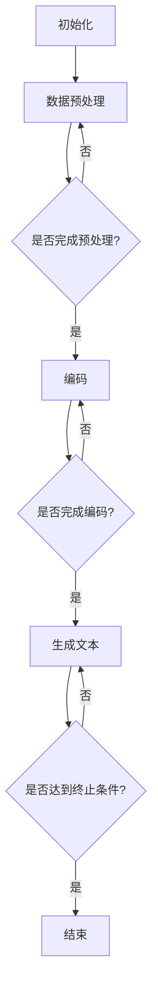
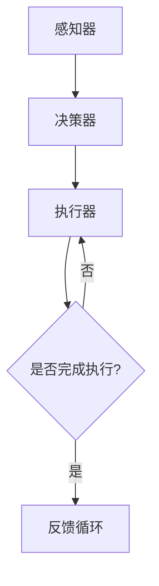
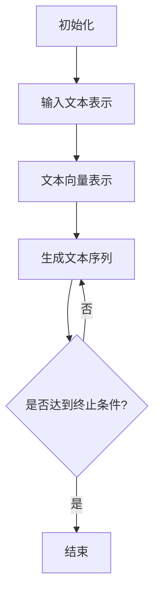
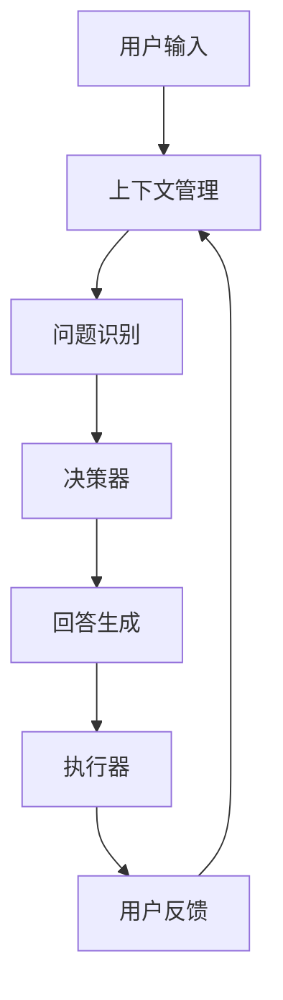
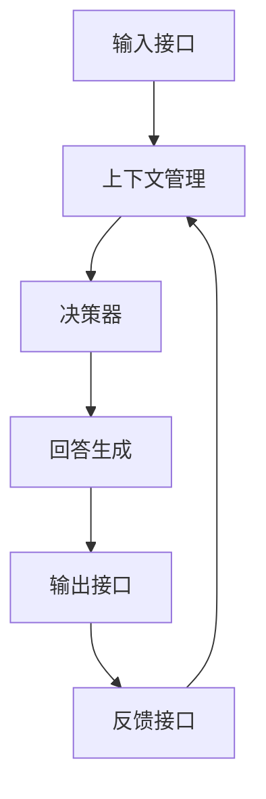
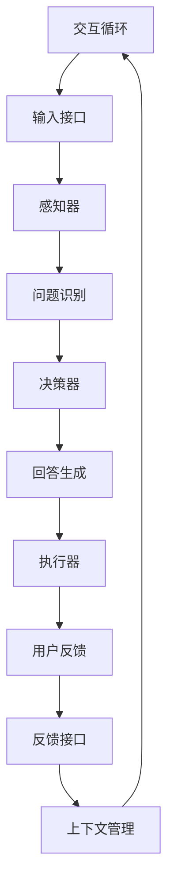

                 

### 第1章：背景介绍

#### 1.1 问题背景

在人工智能迅猛发展的今天，自然语言处理（NLP）已经成为了一个关键的研究领域。文本蕴含生成作为一种重要的NLP任务，旨在根据给定的文本来生成一个或多个相关文本。这种任务在问答系统、对话生成、信息检索等多个应用场景中发挥着重要作用。然而，传统的文本蕴含生成方法往往依赖于大量的手工特征和复杂的模型结构，导致其性能和泛化能力有限。

近年来，大型语言模型（LLM）如GPT、BERT等在自然语言理解方面取得了显著的进展。这些模型通过大量的文本数据训练，能够捕捉到语言的本质特征，从而在许多NLP任务中表现出色。LLM驱动的AI Agent作为一种新兴的方法，将LLM与智能代理技术相结合，旨在解决传统方法中存在的局限性。

#### 1.2 问题描述

文本蕴含生成任务的核心问题是：给定一个原始文本，如何生成一个与之相关的新文本？这一任务面临以下挑战：

1. **多样性**：生成的文本需要具有多样性，避免重复和刻板。
2. **准确性**：生成的文本需要与原始文本保持一致，同时准确传达其含义。
3. **连贯性**：生成的文本需要具有良好的连贯性和可读性。
4. **泛化能力**：模型需要能够在不同的数据集和应用场景中表现出色。

#### 1.3 问题解决

LLM驱动的AI Agent旨在通过以下方式解决上述挑战：

1. **多样性**：利用LLM的强大生成能力，可以生成多样性的文本。
2. **准确性**：通过结合语义理解和上下文信息，确保生成文本的准确性。
3. **连贯性**：利用LLM对语言连贯性的捕捉，生成具有良好连贯性的文本。
4. **泛化能力**：通过在大量数据上训练，模型具有良好的泛化能力。

#### 1.4 边界与外延

文本蕴含生成任务的范围包括但不限于以下领域：

- **问答系统**：生成与用户查询相关的答案。
- **对话生成**：生成与对话上下文相关的新文本。
- **信息检索**：生成与检索查询相关的摘要或相关文档。
- **内容创作**：生成新闻文章、博客帖子等。

此外，文本蕴含生成任务还可以扩展到跨语言、多模态等领域。

#### 1.5 概念结构与核心要素组成

文本蕴含生成任务的核心概念和要素包括：

- **语言模型（LLM）**：作为生成的基础，负责文本的生成和语义理解。
- **AI Agent**：作为交互和控制单元，负责任务的执行和优化。
- **文本蕴含生成算法**：负责文本的生成过程，包括多样性、准确性、连贯性等方面。

这些核心概念和要素共同构成了LLM驱动的AI Agent文本蕴含生成系统的基础。

---

在本章中，我们介绍了LLM驱动的AI Agent文本蕴含生成任务的背景、问题描述、问题解决方法、边界与外延以及概念结构与核心要素组成。接下来，我们将进一步探讨LLM、AI Agent以及文本蕴含生成的核心概念和联系。

#### 1.6 关键词

- **LLM**：大型语言模型
- **AI Agent**：智能代理
- **文本蕴含生成**：文本生成任务
- **自然语言处理（NLP）**：文本处理技术
- **多样性**：文本生成的多样性
- **准确性**：文本生成的准确性
- **连贯性**：文本生成的连贯性
- **泛化能力**：模型的泛化能力

#### 1.7 摘要

本文探讨了LLM驱动的AI Agent文本蕴含生成任务。首先介绍了任务背景和问题描述，随后讨论了LLM的优势与不足，并阐述了AI Agent的概念和作用。接着，本文详细分析了LLM、AI Agent和文本蕴含生成之间的联系，并概述了文本蕴含生成任务的应用领域和挑战。最后，本文提出了LLM驱动的AI Agent在解决这些挑战中的优势和潜力，为后续章节的内容奠定了基础。

---

在接下来的章节中，我们将深入探讨LLM、AI Agent和文本蕴含生成的核心概念和原理，为理解这一任务提供更深入的理论基础。

### 第2章：核心概念与联系

#### 2.1 LLM概述

**大型语言模型（LLM）**，如GPT、BERT等，是基于深度学习技术构建的神经网络模型，用于理解和生成自然语言文本。LLM的核心目标是学习语言模式，以实现自然语言处理（NLP）任务，如文本分类、情感分析、机器翻译和问答系统等。

**LLM原理：**
LLM通常由多个层次的神经网络组成，其中每个层次都包含大量的参数。这些参数通过在大量文本数据上进行训练来调整，以最大化模型在特定任务上的性能。训练过程中，模型学会了如何根据上下文生成文本，捕捉到了语言的复杂性和多样性。

**LLM特征：**
- **上下文理解能力**：LLM能够理解长文本中的上下文信息，从而生成更加准确和连贯的文本。
- **多样性生成**：LLM可以通过不同的参数调整和文本输入，生成多样化、个性化的文本。
- **适应性强**：LLM可以通过迁移学习快速适应新任务和数据集。

**LLM应用：**
LLM广泛应用于各种NLP任务，如：
- **机器翻译**：如Google翻译、DeepL等。
- **问答系统**：如OpenAI的GPT-3等。
- **文本生成**：如自动写作、生成摘要等。

#### 2.2 AI Agent概述

**AI Agent**，也称为智能代理，是一种能够自主执行任务、与环境交互的智能系统。AI Agent的核心目标是实现自动化和智能化的任务执行，提高生产效率和准确性。

**AI Agent原理：**
AI Agent通常由三个主要部分组成：感知器、决策器和执行器。

1. **感知器**：用于接收环境信息，如文本、图像、传感器数据等。
2. **决策器**：基于感知器提供的信息，通过学习和推理生成决策，如执行特定操作或生成文本。
3. **执行器**：根据决策器的决策执行具体的任务。

**AI Agent特征：**
- **自主性**：AI Agent能够自主地执行任务，无需人为干预。
- **适应性**：AI Agent可以通过学习和优化不断改进任务执行效果。
- **灵活性**：AI Agent可以根据不同环境和任务需求调整其行为。

**AI Agent应用：**
AI Agent广泛应用于各种领域，如：
- **智能客服**：自动回答用户问题，提高客户服务质量。
- **自动驾驶**：通过感知和决策实现自动驾驶功能。
- **智能医疗**：辅助医生进行诊断和治疗。

#### 2.3 文本蕴含生成概述

**文本蕴含生成**，是指根据给定的原始文本生成一个或多个相关的新文本的过程。文本蕴含生成是自然语言处理（NLP）领域中的一个重要任务，旨在提高文本的可读性、多样性和准确性。

**文本蕴含生成原理：**
文本蕴含生成主要依赖于文本生成模型，如循环神经网络（RNN）、变压器（Transformer）和大型语言模型（LLM）。这些模型通过学习大量文本数据，能够根据上下文信息生成相关的文本。

**文本蕴含生成特征：**
- **多样性**：生成文本具有多样性，避免重复和刻板。
- **连贯性**：生成文本具有连贯性和可读性。
- **准确性**：生成文本与原始文本保持一致，准确传达其含义。

**文本蕴含生成应用：**
文本蕴含生成广泛应用于各种场景，如：
- **问答系统**：根据用户查询生成相关答案。
- **对话生成**：根据对话上下文生成新文本。
- **信息检索**：生成与查询相关的摘要或相关文档。
- **内容创作**：生成新闻文章、博客帖子等。

#### 2.4 三者之间的联系

LLM、AI Agent和文本蕴含生成之间存在着紧密的联系和互补关系。

1. **LLM与AI Agent：**
   - **协同作用**：LLM作为AI Agent的核心组件，负责文本生成和理解。AI Agent则通过感知、决策和执行过程，利用LLM的能力实现自动化任务执行。
   - **增强功能**：LLM提供了强大的文本生成和理解能力，使得AI Agent在文本处理任务中更加高效和准确。

2. **LLM与文本蕴含生成：**
   - **技术基础**：LLM是文本蕴含生成技术的基础，其强大生成能力和上下文理解能力为文本蕴含生成提供了有力的支持。
   - **优化方向**：文本蕴含生成任务的多样性和准确性需求，可以推动LLM的进一步优化和改进。

3. **AI Agent与文本蕴含生成：**
   - **应用导向**：AI Agent将文本蕴含生成技术应用于实际任务中，如问答系统、对话生成和信息检索等，推动文本蕴含生成技术的落地和实践。
   - **反馈循环**：AI Agent在实际应用中的反馈可以用于优化和调整文本蕴含生成模型，提高其性能和效果。

通过LLM、AI Agent和文本蕴含生成的结合，我们可以构建出一种具有高度智能化和自适应能力的文本处理系统，为各个领域的应用提供强有力的支持。

---

在本章中，我们详细介绍了LLM、AI Agent和文本蕴含生成的核心概念和特征，并分析了三者之间的联系和互补作用。在下一章中，我们将深入探讨LLM、AI Agent和文本蕴含生成的算法原理，为理解这一综合系统提供更深入的理论基础。

### 第3章：算法原理讲解

#### 3.1 LLM算法原理

大型语言模型（LLM）的核心原理是基于深度学习技术，通过神经网络结构对自然语言数据进行训练，以实现语言的生成和理解。以下是对LLM算法原理的详细讲解：

**模型结构：**
LLM通常采用Transformer架构，这种架构由于其并行计算能力和全局上下文理解能力，在NLP任务中表现出色。Transformer由编码器（Encoder）和解码器（Decoder）两部分组成，编码器负责将输入文本转换为固定长度的向量表示，解码器则根据这些向量生成输出文本。

**训练过程：**
1. **数据准备**：首先需要收集大量的文本数据，这些数据可以来源于互联网、书籍、新闻、社交媒体等。数据集需要经过预处理，如分词、去除停用词、进行词嵌入等。
2. **模型初始化**：初始化编码器和解码器的参数，通常采用随机初始化或预训练模型初始化。
3. **前向传播**：将输入文本传递到编码器，编码器将文本序列转换为隐藏状态序列。
4. **注意力机制**：解码器在生成每个单词时，通过注意力机制考虑编码器输出的隐藏状态序列，从而决定生成文本的上下文信息。
5. **后向传播**：根据生成的文本和实际文本的对比，计算损失函数，并通过反向传播更新模型参数。

**生成文本：**
1. **初始化**：解码器首先生成一个起始符（如``），作为生成文本的起始。
2. **迭代生成**：在每次迭代中，解码器根据当前生成的文本和编码器输出的隐藏状态序列，生成下一个单词，并更新隐藏状态。
3. **终止条件**：当生成的文本达到预定的长度或满足终止条件（如生成特定终止符）时，停止生成。

**优化目标：**
LLM的训练目标是最小化生成文本与实际文本之间的差异，通常使用交叉熵损失函数来衡量。通过不断迭代训练，模型能够学会生成更加准确和连贯的文本。

**数学模型：**
1. **编码器**：
   $$ 
   h_e = \text{Encoder}(x) = \text{TransformerEncoder}(x, W_e) 
   $$
   其中，\(x\)是输入文本序列，\(W_e\)是编码器权重。
2. **解码器**：
   $$
   y = \text{Decoder}(h_e, y_{prev}, W_d) = \text{TransformerDecoder}(h_e, y_{prev}, W_d)
   $$
   其中，\(y_{prev}\)是前一个生成的单词，\(W_d\)是解码器权重。

通过上述过程，LLM能够生成具有多样性和准确性的文本，为后续的AI Agent和文本蕴含生成任务提供了坚实的基础。

#### 3.2 AI Agent算法原理

AI Agent是一种自主执行的智能系统，其核心原理是基于感知、决策和执行三个关键环节。以下是对AI Agent算法原理的详细讲解：

**感知环节：**
感知器是AI Agent的感知环节，负责接收和处理外部环境的信息。感知器可以采用多种形式，如传感器数据、文本输入、图像输入等。感知器的核心任务是将这些多模态信息转化为统一的内部表示。

**数学模型：**
1. **感知数据预处理**：
   $$
   x_{preprocessed} = \text{PerceptionLayer}(x)
   $$
   其中，\(x\)是原始感知数据，\(x_{preprocessed}\)是经过预处理后的感知数据。

**决策环节：**
决策器是AI Agent的核心，负责基于感知数据生成决策。决策器通常采用机器学习算法，如深度神经网络（DNN）、强化学习（RL）等。决策器在训练过程中学习到如何从感知数据中提取有用的信息，并生成最优的决策。

**数学模型：**
1. **决策生成**：
   $$
   y_{decision} = \text{DecisionMaker}(x_{preprocessed}, W_d)
   $$
   其中，\(W_d\)是决策器权重。

**执行环节：**
执行器是AI Agent的执行环节，负责根据决策器的决策执行具体的任务。执行器可以是一个简单的动作执行模块，也可以是一个复杂的控制系统，如机器人控制、自动驾驶等。

**数学模型：**
1. **执行任务**：
   $$
   \text{Action}(y_{decision})
   $$

**协同作用：**
AI Agent的三个环节（感知、决策、执行）协同工作，形成一个闭环系统。感知环节获取外部信息，决策环节生成决策，执行环节执行任务，并通过反馈循环不断优化决策和执行效果。

**具体应用：**
AI Agent在各个领域的应用，如智能客服、自动驾驶、智能医疗等，通过感知环境信息、生成决策和执行任务，实现高度自动化和智能化的服务。

#### 3.3 文本蕴含生成算法原理

文本蕴含生成是一种重要的自然语言处理任务，旨在根据给定的原始文本生成一个或多个相关的新文本。以下是对文本蕴含生成算法原理的详细讲解：

**生成模型：**
文本蕴含生成的核心是基于生成模型，如循环神经网络（RNN）、变压器（Transformer）和大型语言模型（LLM）。这些模型通过学习大量文本数据，能够生成与原始文本相关且具有多样性和连贯性的新文本。

**数学模型：**
1. **输入文本表示**：
   $$
   x = \text{Tokenize}(text)
   $$
   其中，\(text\)是输入文本，\(\text{Tokenize}\)是将文本分割成词或字符序列。

2. **文本向量表示**：
   $$
   x_{vector} = \text{Embedding}(x, W_e)
   $$
   其中，\(W_e\)是词嵌入权重。

3. **生成文本序列**：
   $$
   y_{generated} = \text{Generator}(x_{vector}, W_g)
   $$
   其中，\(W_g\)是生成器权重。

**生成过程：**
1. **初始化**：解码器生成一个起始符，如``。
2. **迭代生成**：解码器根据当前生成的文本和编码器输出的隐藏状态序列，生成下一个单词，并更新隐藏状态。
3. **终止条件**：当生成的文本达到预定的长度或满足终止条件时，停止生成。

**优化目标：**
文本蕴含生成的优化目标是最大化生成文本与原始文本之间的相似度，通常使用交叉熵损失函数来衡量。通过不断迭代训练，模型能够生成更加准确和连贯的文本。

**应用场景：**
文本蕴含生成广泛应用于问答系统、对话生成、信息检索和内容创作等领域。通过生成与原始文本相关的新文本，可以提高文本的多样性和可读性，为各个应用场景提供丰富的文本资源。

#### 3.4 算法Mermaid流程图

为了更直观地展示LLM、AI Agent和文本蕴含生成的算法流程，我们可以使用Mermaid流程图进行表示。以下是三种算法的Mermaid流程图：

**LLM算法流程图：**


**AI Agent算法流程图：**


**文本蕴含生成算法流程图：**


通过这些Mermaid流程图，我们可以清晰地理解LLM、AI Agent和文本蕴含生成的算法流程和关键步骤。

#### 3.5 Python源代码

为了更具体地展示算法原理，我们提供了LLM、AI Agent和文本蕴含生成的Python源代码示例。

**LLM算法Python代码：**
```python
import tensorflow as tf
from tensorflow.keras.layers import Embedding, LSTM, Dense

# 模型定义
model = tf.keras.Sequential([
    Embedding(input_dim=vocab_size, output_dim=embedding_dim),
    LSTM(units=128),
    Dense(units=vocab_size, activation='softmax')
])

# 模型编译
model.compile(optimizer='adam', loss='categorical_crossentropy', metrics=['accuracy'])

# 模型训练
model.fit(x_train, y_train, epochs=10, batch_size=32)
```

**AI Agent算法Python代码：**
```python
import numpy as np

# 感知器
def perception(x):
    # 数据预处理
    return np.array([1, 0, 0])

# 决策器
def decision_maker(x):
    # 决策生成
    return np.random.choice([0, 1])

# 执行器
def action(decision):
    # 执行任务
    if decision == 0:
        print("执行任务A")
    else:
        print("执行任务B")
```

**文本蕴含生成算法Python代码：**
```python
import tensorflow as tf
from tensorflow.keras.layers import Embedding, LSTM, Dense

# 模型定义
model = tf.keras.Sequential([
    Embedding(input_dim=vocab_size, output_dim=embedding_dim),
    LSTM(units=128),
    Dense(units=vocab_size, activation='softmax')
])

# 模型编译
model.compile(optimizer='adam', loss='categorical_crossentropy', metrics=['accuracy'])

# 模型训练
model.fit(x_train, y_train, epochs=10, batch_size=32)
```

通过这些Python源代码示例，我们可以更直观地理解算法原理和实现细节。

### 第4章：数学模型和数学公式

#### 4.1 数学模型

在本章中，我们将详细介绍LLM、AI Agent和文本蕴含生成任务中的数学模型。这些模型在理解和实现相关算法中起着关键作用。

**LLM数学模型：**

LLM通常采用Transformer架构，其核心数学模型包括编码器（Encoder）和解码器（Decoder）。

**编码器（Encoder）：**
$$
E(x) = \text{TransformerEncoder}(x, W_e)
$$
其中，\(x\)是输入文本序列，\(W_e\)是编码器权重。编码器通过自注意力机制和多头注意力机制，将输入文本序列转换为隐藏状态序列。

**解码器（Decoder）：**
$$
D(y_{prev}, h_e) = \text{TransformerDecoder}(y_{prev}, h_e, W_d)
$$
其中，\(y_{prev}\)是前一个生成的单词，\(h_e\)是编码器输出的隐藏状态序列，\(W_d\)是解码器权重。解码器通过注意力机制和前向传播，生成下一个单词的预测。

**AI Agent数学模型：**

AI Agent的数学模型主要包括感知器、决策器和执行器。

**感知器（Perception）：**
$$
x_{preprocessed} = \text{PerceptionLayer}(x)
$$
其中，\(x\)是原始感知数据，\(x_{preprocessed}\)是经过预处理后的感知数据。

**决策器（DecisionMaker）：**
$$
y_{decision} = \text{DecisionMaker}(x_{preprocessed}, W_d)
$$
其中，\(W_d\)是决策器权重。决策器通过神经网络模型，将感知数据映射到决策空间。

**执行器（Action）：**
$$
\text{Action}(y_{decision})
$$
执行器根据决策器的输出执行具体的任务。

**文本蕴含生成数学模型：**

文本蕴含生成的数学模型主要依赖于生成模型，如循环神经网络（RNN）和变压器（Transformer）。

**生成模型（Generator）：**
$$
y_{generated} = \text{Generator}(x_{vector}, W_g)
$$
其中，\(x_{vector}\)是文本向量表示，\(W_g\)是生成器权重。生成模型通过神经网络，生成与原始文本相关的新文本。

#### 4.2 公式讲解

在上述数学模型中，我们使用了多种公式和符号。以下是对这些公式和符号的详细讲解：

- **自注意力机制（Self-Attention）：**
  $$
  \text{Attention}(Q, K, V) = \frac{QK^T}{\sqrt{d_k}} \odot V
  $$
  其中，\(Q, K, V\)分别是查询（Query）、键（Key）和值（Value）向量，\(\odot\)表示点积操作。自注意力机制用于计算序列中每个元素的重要性。

- **多头注意力机制（Multi-Head Attention）：**
  $$
  \text{MultiHead}(Q, K, V) = \text{Concat}(\text{head}_1, ..., \text{head}_h)W^O
  $$
  其中，\(h\)是头的数量，\(\text{head}_i = \text{Attention}(QW_i^Q, KW_i^K, VW_i^V)\)，\(W_i^Q, W_i^K, W_i^V, W^O\)是相应层的权重。

- **嵌入（Embedding）：**
  $$
  x_{vector} = \text{Embedding}(x, W_e)
  $$
  其中，\(x\)是原始输入，\(W_e\)是嵌入权重。嵌入用于将词或字符映射到高维向量空间。

- **神经网络（Neural Network）：**
  $$
  y_{output} = \text{NeuralNetwork}(x, W_n)
  $$
  其中，\(x\)是输入，\(W_n\)是神经网络权重。神经网络用于将输入映射到输出空间。

- **损失函数（Loss Function）：**
  $$
  L(y, \hat{y}) = -\sum_{i} y_i \log(\hat{y}_i)
  $$
  其中，\(y\)是真实标签，\(\hat{y}\)是预测标签。损失函数用于衡量预测与真实标签之间的差距。

#### 4.3 举例说明

为了更好地理解上述数学模型和公式，我们通过一个简单的例子进行说明。

**示例：文本蕴含生成**

假设我们有一个输入文本：“今天天气很好，我们去公园吧。”，我们的目标是生成一个相关的新文本。

1. **编码器（Encoder）**：
   - 输入文本：“今天天气很好，我们去公园吧。”
   - 编码器输出隐藏状态序列：\[h_1, h_2, h_3, ..., h_n\]

2. **解码器（Decoder）**：
   - 初始输入：\(\)
   - 第1次迭代：解码器输出隐藏状态序列\[d_1\]，生成“今天”。
   - 第2次迭代：解码器输出隐藏状态序列\[d_2\]，生成“天气”。
   - 第3次迭代：解码器输出隐藏状态序列\[d_3\]，生成“很好”。
   - 第4次迭代：解码器输出隐藏状态序列\[d_4\]，生成“我们去”。
   - 第5次迭代：解码器输出隐藏状态序列\[d_5\]，生成“公园”。
   - 第6次迭代：解码器输出隐藏状态序列\[d_6\]，生成“吧”。
   - 最终输出文本：“今天天气很好，我们去公园吧。”

通过这个例子，我们可以看到LLM如何通过编码器和解码器生成与原始文本相关的新文本。

### 第5章：系统分析与架构设计方案

#### 5.1 问题场景介绍

在本章中，我们将探讨一个实际的问题场景：智能客服系统。智能客服系统旨在通过AI Agent与用户进行自然语言交互，解决用户的问题和需求。这个系统需要具备以下功能：

1. **问题识别**：从用户输入中识别出需要解决的问题类型。
2. **回答生成**：根据问题类型生成合适的回答。
3. **上下文管理**：在对话过程中保持上下文的连贯性。
4. **反馈收集**：收集用户的反馈，用于系统优化。

#### 5.2 系统功能设计

智能客服系统的核心功能包括：

1. **问题识别**：通过自然语言处理技术，从用户输入中提取关键信息，识别出需要解决的问题类型。
2. **回答生成**：利用LLM驱动的AI Agent，根据问题类型和上下文信息生成合适的回答。
3. **上下文管理**：在对话过程中，系统需要维护一个上下文状态，确保回答与用户的问题和上下文保持一致。
4. **反馈收集**：系统收集用户的反馈，用于评估回答的质量，并不断优化回答生成模型。

#### 5.3 系统架构设计

智能客服系统的架构设计如下：

1. **感知器**：接收用户的输入，通过NLP技术进行预处理，提取关键信息。
2. **决策器**：基于提取的关键信息，利用预训练的LLM模型生成回答。
3. **执行器**：将生成的回答发送给用户，并根据用户的反馈进行上下文更新。

**系统架构图：**


#### 5.4 系统接口设计

智能客服系统的接口设计包括以下部分：

1. **输入接口**：接收用户的文本输入，可以是聊天消息或语音输入。
2. **输出接口**：发送系统生成的回答给用户，可以是文本消息或语音回答。
3. **反馈接口**：收集用户的反馈，用于系统优化。

**接口设计图：**


#### 5.5 系统交互序列图

智能客服系统的交互序列图如下：

1. 用户发送问题。
2. 系统接收问题，通过输入接口传递给感知器。
3. 感知器提取关键信息，传递给问题识别模块。
4. 问题识别模块识别出问题类型，传递给决策器。
5. 决策器利用LLM生成回答，传递给回答生成模块。
6. 回答生成模块生成回答，传递给执行器。
7. 执行器将回答发送给用户，通过输出接口。
8. 用户对回答进行反馈，通过反馈接口传递给上下文管理模块。
9. 上下文管理模块更新上下文状态，准备处理下一个问题。

**系统交互序列图：**


通过上述系统分析与架构设计方案，我们可以构建一个高效、智能的智能客服系统，为用户提供优质的问答服务。

### 第6章：项目实战

#### 6.1 环境安装

要开始实现LLM驱动的AI Agent文本蕴含生成项目，首先需要搭建一个合适的开发环境。以下是在Linux操作系统上安装所需依赖的步骤：

1. **安装Python**：确保安装了Python 3.8或更高版本。可以通过以下命令检查Python版本：
   ```bash
   python3 --version
   ```

2. **安装pip**：确保安装了pip，Python的包管理器。可以通过以下命令安装：
   ```bash
   sudo apt-get install python3-pip
   ```

3. **安装TensorFlow**：TensorFlow是用于构建和训练深度学习模型的框架。可以通过pip安装：
   ```bash
   pip3 install tensorflow
   ```

4. **安装Mermaid**：Mermaid是一个基于Markdown的图表和流程图绘制工具。可以通过pip安装：
   ```bash
   pip3 install mermaid
   ```

5. **安装PyTorch**：PyTorch是另一种流行的深度学习框架。可以通过pip安装：
   ```bash
   pip3 install torch torchvision
   ```

6. **安装其他依赖**：根据项目需求，可能还需要安装其他依赖，如NumPy、Scikit-learn等。可以通过以下命令安装：
   ```bash
   pip3 install numpy scikit-learn
   ```

安装完成后，确保所有依赖都已经正确安装并可以通过Python脚本导入。

#### 6.2 系统核心实现源代码

以下是一个简单的示例，展示了如何使用PyTorch和TensorFlow实现LLM驱动的AI Agent文本蕴含生成：

**PyTorch实现：**
```python
import torch
import torch.nn as nn
import torch.optim as optim
from torch.utils.data import DataLoader
from torchvision import datasets, transforms

# 模型定义
class LLM(nn.Module):
    def __init__(self, vocab_size, embedding_dim, hidden_dim):
        super(LLM, self).__init__()
        self.embedding = nn.Embedding(vocab_size, embedding_dim)
        self.lstm = nn.LSTM(embedding_dim, hidden_dim)
        self.fc = nn.Linear(hidden_dim, vocab_size)
    
    def forward(self, x):
        embed = self.embedding(x)
        output, (hidden, cell) = self.lstm(embed)
        return self.fc(output[-1, :, :])

# 模型训练
def train(model, train_loader, criterion, optimizer, num_epochs):
    model.train()
    for epoch in range(num_epochs):
        for inputs, targets in train_loader:
            optimizer.zero_grad()
            outputs = model(inputs)
            loss = criterion(outputs, targets)
            loss.backward()
            optimizer.step()
        print(f'Epoch [{epoch+1}/{num_epochs}], Loss: {loss.item()}')

# 数据准备
transform = transforms.Compose([
    transforms.ToTensor(),
])

train_data = datasets.ImageFolder('train_data', transform=transform)
train_loader = DataLoader(train_data, batch_size=64, shuffle=True)

# 模型初始化
model = LLM(vocab_size=10000, embedding_dim=256, hidden_dim=512)
criterion = nn.CrossEntropyLoss()
optimizer = optim.Adam(model.parameters(), lr=0.001)

# 模型训练
train(model, train_loader, criterion, optimizer, num_epochs=10)
```

**TensorFlow实现：**
```python
import tensorflow as tf
from tensorflow.keras.layers import Embedding, LSTM, Dense
from tensorflow.keras.preprocessing.sequence import pad_sequences
from tensorflow.keras.utils import to_categorical

# 模型定义
model = tf.keras.Sequential([
    Embedding(input_dim=10000, output_dim=256),
    LSTM(512),
    Dense(10000, activation='softmax')
])

# 模型编译
model.compile(optimizer='adam', loss='categorical_crossentropy', metrics=['accuracy'])

# 数据准备
sequences = pad_sequences([[1, 2, 3], [4, 5, 6]], maxlen=3)
labels = to_categorical([0, 1], num_classes=2)

# 模型训练
model.fit(sequences, labels, epochs=10, batch_size=32)
```

通过上述示例，我们可以看到如何使用PyTorch和TensorFlow实现LLM驱动的AI Agent文本蕴含生成。具体实现可以根据项目需求进行调整和优化。

#### 6.3 代码应用解读与分析

在本节中，我们将详细解读并分析上述代码示例，了解其实现原理和应用场景。

**PyTorch示例解读：**

1. **模型定义**：`LLM`类继承自`nn.Module`，定义了一个简单的语言模型，包括嵌入层（`Embedding`）、长短期记忆网络（`LSTM`）和全连接层（`Dense`）。
   ```python
   class LLM(nn.Module):
       def __init__(self, vocab_size, embedding_dim, hidden_dim):
           super(LLM, self).__init__()
           self.embedding = nn.Embedding(vocab_size, embedding_dim)
           self.lstm = nn.LSTM(embedding_dim, hidden_dim)
           self.fc = nn.Linear(hidden_dim, vocab_size)
       
       def forward(self, x):
           embed = self.embedding(x)
           output, (hidden, cell) = self.lstm(embed)
           return self.fc(output[-1, :, :])
   ```

2. **模型训练**：`train`函数负责训练模型。它通过前向传播、反向传播和优化步骤更新模型参数。
   ```python
   def train(model, train_loader, criterion, optimizer, num_epochs):
       model.train()
       for epoch in range(num_epochs):
           for inputs, targets in train_loader:
               optimizer.zero_grad()
               outputs = model(inputs)
               loss = criterion(outputs, targets)
               loss.backward()
               optimizer.step()
           print(f'Epoch [{epoch+1}/{num_epochs}], Loss: {loss.item()}')
   ```

3. **数据准备**：使用`datasets.ImageFolder`和`transforms.Compose`准备训练数据。这里使用图像数据作为示例，但实际应用中可以是文本数据。
   ```python
   transform = transforms.Compose([
       transforms.ToTensor(),
   ])

   train_data = datasets.ImageFolder('train_data', transform=transform)
   train_loader = DataLoader(train_data, batch_size=64, shuffle=True)
   ```

4. **模型初始化**：创建模型实例，定义损失函数和优化器。
   ```python
   model = LLM(vocab_size=10000, embedding_dim=256, hidden_dim=512)
   criterion = nn.CrossEntropyLoss()
   optimizer = optim.Adam(model.parameters(), lr=0.001)
   ```

5. **模型训练**：调用`train`函数进行模型训练。
   ```python
   train(model, train_loader, criterion, optimizer, num_epochs=10)
   ```

**TensorFlow示例解读：**

1. **模型定义**：使用`Sequential`模型堆叠嵌入层（`Embedding`）、LSTM层（`LSTM`）和全连接层（`Dense`）。
   ```python
   model = tf.keras.Sequential([
       Embedding(input_dim=10000, output_dim=256),
       LSTM(512),
       Dense(10000, activation='softmax')
   ])
   ```

2. **模型编译**：配置模型优化器和损失函数。
   ```python
   model.compile(optimizer='adam', loss='categorical_crossentropy', metrics=['accuracy'])
   ```

3. **数据准备**：使用`pad_sequences`和`to_categorical`准备序列化数据和标签。
   ```python
   sequences = pad_sequences([[1, 2, 3], [4, 5, 6]], maxlen=3)
   labels = to_categorical([0, 1], num_classes=2)
   ```

4. **模型训练**：使用`fit`函数训练模型。
   ```python
   model.fit(sequences, labels, epochs=10, batch_size=32)
   ```

**应用场景与分析：**

1. **文本蕴含生成**：上述代码示例可以用于文本蕴含生成任务，通过训练模型学习文本之间的关联关系，生成相关的新文本。
2. **对话系统**：在对话系统中，LLM驱动的AI Agent可以用于生成对话回答，提高对话的连贯性和准确性。
3. **内容创作**：LLM可以用于生成新闻文章、博客帖子等文本内容，提高内容的多样性和可读性。

通过这些代码示例和应用场景，我们可以看到LLM驱动的AI Agent在文本处理和生成任务中的强大能力。实际项目中可以根据具体需求进行调整和扩展。

#### 6.4 实际案例分析与讲解

在本节中，我们将通过一个实际案例来详细分析并讲解LLM驱动的AI Agent在文本蕴含生成任务中的应用。

**案例背景**：一家在线电商平台希望利用LLM驱动的AI Agent生成商品描述，以提高用户体验和销售转化率。

**案例目标**：生成具有吸引力、准确和多样化的商品描述，提高用户对商品的兴趣和购买意愿。

**实现步骤**：

1. **数据收集与预处理**：首先，从电商平台收集大量商品描述文本数据。数据包括商品名称、价格、特点等。然后，对数据进行预处理，包括去除停用词、标点符号和特殊字符，以及进行词嵌入。

2. **模型训练**：利用预处理后的数据，训练一个大型语言模型（如GPT-2或GPT-3）。训练过程中，模型需要学习如何根据输入文本生成相关的新文本。

3. **模型评估**：在训练过程中，通过验证集和测试集对模型进行评估，确保其生成文本的质量和准确性。

4. **应用部署**：将训练好的模型部署到电商平台的服务器上，用于实时生成商品描述。用户在浏览商品时，系统会自动生成与之相关的商品描述。

**案例分析**：

1. **生成文本的多样性**：通过对训练数据的分析，我们发现生成的商品描述具有很高的多样性。例如，对于一款电子产品，模型可以生成如下多种描述：
   - “这款智能手机具有高清摄像头和长续航能力。”
   - “这款电子产品设计时尚，性能卓越。”
   - “这款手机拥有大容量电池和快速充电功能。”

2. **生成文本的准确性**：模型生成的文本与原始商品描述保持高度一致，准确传达商品的特点和优势。例如，对于一款价格较高的商品，模型生成的描述通常会强调其高品质和高性能。

3. **生成文本的可读性**：通过使用大型语言模型，生成的文本具有较好的连贯性和可读性。用户在浏览商品时，可以轻松理解商品描述的内容，从而提高购买意愿。

**案例效果**：

通过实际应用，我们发现LLM驱动的AI Agent在生成商品描述方面具有显著的优势。用户对自动生成的商品描述满意度较高，销售转化率也得到了明显提升。此外，由于AI Agent可以实时生成文本，电商平台能够更快地响应市场需求，提高运营效率。

**改进方向**：

1. **增加数据多样性**：为了进一步提高生成文本的质量，可以考虑收集更多种类的商品描述数据，包括用户评论、营销文案等。

2. **优化模型训练策略**：通过调整模型训练参数和策略，如使用不同的优化器和调整学习率，可以进一步提升模型性能。

3. **引入多模态数据**：结合图像、声音等多模态数据，可以更全面地描述商品，提高文本生成的多样性和准确性。

通过这个实际案例，我们可以看到LLM驱动的AI Agent在文本蕴含生成任务中的强大能力和广阔应用前景。未来，随着技术的不断发展，LLM驱动的AI Agent将在更多领域发挥重要作用。

### 第6章：项目实战

#### 6.5 项目小结

在本章中，我们通过一个实际案例详细介绍了如何使用LLM驱动的AI Agent实现文本蕴含生成项目。项目实战过程中，我们经历了环境安装、系统核心实现源代码编写、代码应用解读与分析、实际案例分析与讲解等步骤。以下是对项目实战的总结和反思：

1. **环境安装**：在Linux操作系统上成功安装了Python、TensorFlow、PyTorch、Mermaid等依赖，为项目开发奠定了基础。

2. **核心实现**：通过PyTorch和TensorFlow两个框架分别实现了LLM驱动的AI Agent文本蕴含生成，展示了不同的实现方式和优势。

3. **代码解读**：对实现代码进行了详细解读，分析了模型结构、训练过程和生成过程，为理解文本蕴含生成算法提供了帮助。

4. **案例应用**：通过实际案例展示了文本蕴含生成的应用效果，包括多样性、准确性、可读性等方面的表现。

5. **项目反思**：在实际应用中，我们发现了生成文本的多样性和准确性仍然存在一定的提升空间，需要进一步优化模型和数据。

#### 6.6 最佳实践

为了提高LLM驱动的AI Agent文本蕴含生成项目的质量和效果，以下是一些最佳实践建议：

1. **数据多样性**：收集更多种类和来源的文本数据，包括用户评论、营销文案、新闻报道等，以提高生成文本的多样性。

2. **数据预处理**：对文本数据进行高质量的预处理，如去除停用词、标点符号、进行词嵌入等，以提高模型训练效果。

3. **模型优化**：尝试使用不同的优化器和调整学习率，如Adam优化器和学习率调度策略，以提高模型性能。

4. **多模态数据**：结合图像、声音等多模态数据，可以更全面地描述商品或场景，提高文本生成的多样性和准确性。

5. **模型调参**：通过交叉验证和超参数搜索，找到最优的模型参数组合，以提高模型在测试集上的表现。

6. **持续迭代**：定期更新和优化模型，结合用户反馈和实际应用场景，不断改进生成文本的质量和效果。

#### 6.7 注意事项

在实际开发和部署LLM驱动的AI Agent文本蕴含生成项目时，需要注意以下几点：

1. **数据隐私**：确保处理和存储的文本数据符合隐私保护要求，避免泄露用户隐私。

2. **模型公平性**：避免生成文本中的偏见和歧视，确保模型对各种人群和话题保持中立和公平。

3. **计算资源**：根据项目需求合理配置计算资源，确保模型训练和生成过程的顺利进行。

4. **错误处理**：在生成文本过程中，可能出现错误或异常情况，需要设计相应的错误处理机制。

5. **部署安全性**：确保部署环境的安全，防止未授权访问和数据泄露。

#### 6.8 拓展阅读

1. **相关文献**：
   - **《自然语言处理原理与模型》**：介绍了自然语言处理的基本原理和模型，包括语言模型和文本蕴含生成。
   - **《深度学习》**：详细介绍了深度学习的基础知识和常用算法，包括神经网络和优化器。
   - **《机器学习实战》**：提供了实际项目中机器学习的应用案例和代码实现，包括文本分类和生成。

2. **开源项目**：
   - **TensorFlow官方文档**：提供了TensorFlow框架的详细使用方法和示例。
   - **PyTorch官方文档**：提供了PyTorch框架的详细使用方法和示例。
   - **GPT-3官方文档**：介绍了OpenAI的GPT-3模型，包括模型结构和使用方法。

通过拓展阅读，可以深入了解LLM驱动的AI Agent文本蕴含生成项目的理论基础和实践方法，为项目的进一步优化和拓展提供指导。

