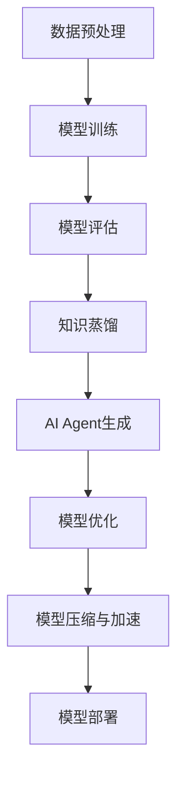

                 

### 文章标题

### 关键词

- LLM
- AI Agent
- 知识蒸馏
- 模型压缩
- 深度学习

### 摘要

本文将深入探讨LLM驱动的AI Agent知识蒸馏技术。首先，我们将介绍LLM、AI Agent以及知识蒸馏技术的背景和核心概念。接着，通过逐步分析LLM的工作原理和知识蒸馏技术，我们将详细讲解LLM驱动AI Agent知识蒸馏的过程。随后，本文将结合实际案例，探讨知识蒸馏技术在AI Agent开发中的应用。通过本文的阅读，读者将能够全面了解LLM驱动AI Agent知识蒸馏技术的原理和应用，为未来的研究和实践提供指导。

---

### 第一部分：引言

#### 1.1 问题背景

##### 1.1.1 人工智能发展现状

人工智能（AI）作为现代科技的前沿领域，其发展历程可追溯到20世纪50年代。自那时以来，人工智能经历了多个发展阶段，包括规则推理、知识表示、机器学习和深度学习。近年来，随着计算能力的提升和大数据的普及，人工智能技术得到了飞速发展，并在各个领域取得了显著成果。

在图像识别、自然语言处理、自动驾驶、医疗诊断等领域，人工智能已经实现了广泛的应用。例如，通过深度学习技术，图像识别的准确率已经达到了高水平；自然语言处理技术使得机器翻译和语音识别变得更加精准；自动驾驶技术正在逐步实现商业化；医疗诊断AI则能够辅助医生提高诊断准确率。

##### 1.1.2 AI Agent在现实应用中的挑战

随着人工智能技术的发展，AI Agent（人工智能代理）逐渐成为研究热点。AI Agent是指具有自主决策能力、可以执行特定任务的智能系统。在实际应用中，AI Agent具有巨大的潜力，如智能客服、智能家居、智能推荐系统等。

然而，AI Agent在实际应用中面临着诸多挑战。首先，AI Agent需要具备强大的学习和适应能力，以应对复杂多变的现实场景。其次，AI Agent的训练过程通常需要大量的数据和计算资源，这对算法的效率和模型的可解释性提出了高要求。此外，AI Agent的安全性和可靠性也是亟待解决的问题。

##### 1.1.3 知识蒸馏技术在AI Agent中的应用

知识蒸馏技术是一种将大规模预训练模型的知识传递给小模型的技术，其核心思想是通过训练一个教师模型（通常是一个大型模型）和一个或多个学生模型，使得学生模型能够复现教师模型的知识和性能。在AI Agent开发中，知识蒸馏技术具有重要作用。

首先，知识蒸馏技术可以帮助AI Agent在有限的数据和计算资源下实现高性能。通过使用大规模预训练模型作为教师模型，AI Agent可以快速获取丰富的知识，从而提高任务表现。其次，知识蒸馏技术可以降低模型复杂性，使得AI Agent更加轻量化，便于部署在资源受限的设备上。

总的来说，知识蒸馏技术为AI Agent的发展提供了新的思路和解决方案，其在实际应用中具有广泛的前景。

#### 1.2 核心概念与联系

##### 1.2.1 LLM（大型语言模型）的概念

大型语言模型（LLM，Large Language Model）是一种基于深度学习的自然语言处理模型，其核心思想是通过大规模数据训练，使得模型能够理解和生成自然语言。LLM通常具有数十亿至数千亿的参数量，能够处理复杂的语言现象和任务。

LLM的基本组成包括语言理解模块、生成模块和知识表示模块。语言理解模块负责解析和理解输入文本，生成模块负责生成文本输出，知识表示模块则负责将知识编码到模型中。通过这些模块的协同工作，LLM能够实现高质量的自然语言处理任务。

##### 1.2.1.1 模型结构

LLM的模型结构通常包括多层神经网络，其中每个神经元都连接到输入层和输出层。这些神经网络通过反向传播算法进行训练，不断调整权重和偏置，以优化模型性能。常见的LLM结构包括Transformer、BERT、GPT等。

##### 1.2.1.2 模型训练

LLM的训练过程通常包括数据集选择、模型训练和模型评估等步骤。数据集选择是模型训练的关键，需要选择具有代表性的大规模语料库。模型训练过程中，通过不断迭代和优化，使得模型能够理解和生成自然语言。模型评估则用于衡量模型的性能，常用的评估指标包括准确率、召回率和F1值等。

##### 1.2.1.3 模型特性

LLM具有以下几个显著特性：

1. **强大学习能力**：通过大规模数据训练，LLM能够快速学习和适应各种语言现象和任务。
2. **多语言支持**：LLM通常支持多种语言，能够处理不同语言之间的翻译和交互。
3. **灵活应用**：LLM可以应用于多种自然语言处理任务，如文本分类、情感分析、问答系统等。
4. **可解释性**：尽管LLM模型庞大且复杂，但其内部知识表示具有一定的可解释性，有助于理解和优化模型。

##### 1.2.2 AI Agent的概念

AI Agent是指具备自主决策能力和执行特定任务能力的智能系统。AI Agent通常由感知模块、决策模块和执行模块组成。感知模块负责收集环境信息，决策模块基于感知信息进行决策，执行模块则负责执行决策结果。

AI Agent的定义如下：

> AI Agent是指一种基于人工智能技术，具备感知、决策和执行能力的智能系统，能够在特定环境中自主完成任务。

##### 1.2.2.1 类型

根据应用场景和任务类型，AI Agent可以分为以下几类：

1. **对话式AI Agent**：如智能客服、语音助手等，主要实现与用户的自然语言交互。
2. **推荐系统AI Agent**：如电商平台的推荐系统，基于用户行为和偏好进行个性化推荐。
3. **游戏AI Agent**：如电子游戏中的NPC（非玩家角色），通过决策树、强化学习等技术实现智能行为。
4. **自动化系统AI Agent**：如自动驾驶系统、智能监控等，通过感知环境信息实现自动化操作。

##### 1.2.2.2 应用场景

AI Agent在各个领域具有广泛的应用：

1. **客服行业**：智能客服系统通过自然语言处理技术，实现与用户的实时交互，提高服务效率和质量。
2. **电商行业**：推荐系统AI Agent根据用户行为和偏好，为用户推荐个性化商品，提升用户体验和销售额。
3. **游戏行业**：游戏AI Agent通过决策树、强化学习等技术，实现复杂智能行为，提高游戏趣味性和挑战性。
4. **安防行业**：智能监控AI Agent通过图像识别技术，实时监测监控区域，及时发现异常情况并报警。

##### 1.2.3 知识蒸馏技术

知识蒸馏（Knowledge Distillation）技术是一种模型压缩和迁移学习技术，旨在通过教师模型（Teacher Model）的知识传递，提升学生模型（Student Model）的性能。知识蒸馏的基本思想是将教师模型的内部知识（如中间层特征、软标签等）传递给学生模型，使得学生模型能够复现教师模型的性能。

##### 1.2.3.1 定义

知识蒸馏技术可以定义为一种将教师模型的知识传递给学生模型的过程，通过学习教师模型的输出分布，学生模型能够学到教师模型的内在知识结构，从而提升自身的性能。

##### 1.2.3.2 原理

知识蒸馏的原理主要包括以下两个方面：

1. **软标签蒸馏**：教师模型和学生模型分别对输入样本进行预测，教师模型的输出概率分布（软标签）传递给学生模型，学生模型在学习过程中尽量复现教师模型的输出分布。
2. **硬标签蒸馏**：教师模型和学生模型对输入样本进行分类预测，教师模型输出的类别标签传递给学生模型，学生模型在训练过程中学习教师模型的分类决策。

##### 1.2.3.3 分类

知识蒸馏技术根据传递的知识类型和蒸馏方式，可以分为以下几类：

1. **软标签蒸馏**：通过传递教师模型的输出概率分布，使得学生模型学习到教师模型的内在知识结构。
2. **硬标签蒸馏**：通过传递教师模型的类别标签，使得学生模型学习到教师模型的分类决策。
3. **模型提取技术**：通过传递教师模型的中间层特征，使得学生模型能够学到教师模型的高级特征表示。

#### 1.3 书籍概述

##### 1.3.1 目的与目标

本书旨在深入探讨LLM驱动的AI Agent知识蒸馏技术，旨在为读者提供全面、系统的理论知识和实践经验。通过本书的学习，读者将能够：

1. **理解LLM和AI Agent的核心概念和原理**。
2. **掌握知识蒸馏技术的原理和应用**。
3. **学会如何使用知识蒸馏技术优化AI Agent性能**。
4. **具备实际项目中知识蒸馏技术的应用能力**。

##### 1.3.2 读者对象

本书适合以下读者群体：

1. **人工智能和自然语言处理领域的科研人员**：本书详细介绍了LLM和知识蒸馏技术的原理和应用，为科研人员提供了宝贵的理论参考。
2. **人工智能工程师和开发者**：本书涵盖了知识蒸馏技术在AI Agent开发中的实际应用，为工程师提供了实用的技术方案。
3. **计算机科学和人工智能专业的学生**：本书内容丰富、结构清晰，适合作为人工智能和自然语言处理课程的教材或参考书。

##### 1.3.3 内容安排

本书共分为三个部分，内容安排如下：

1. **第一部分：引言**：介绍人工智能、AI Agent和知识蒸馏技术的背景和核心概念。
2. **第二部分：LLM驱动AI Agent知识蒸馏技术原理**：详细讲解LLM的工作原理、知识蒸馏技术的分类和应用。
3. **第三部分：知识蒸馏技术在AI Agent开发中的应用**：分析知识蒸馏技术在对话式AI Agent、推荐系统AI Agent和游戏AI Agent中的应用。

##### 1.4 本章小结

本章主要介绍了人工智能、AI Agent和知识蒸馏技术的背景和核心概念。首先，我们回顾了人工智能的发展历程和当前的应用现状，然后介绍了AI Agent的概念、类型和应用场景。接着，详细讲解了知识蒸馏技术的定义、原理和分类。通过本章的学习，读者可以初步了解LLM驱动AI Agent知识蒸馏技术的基本概念，为后续章节的学习打下基础。

### 第二部分：LLM驱动AI Agent知识蒸馏技术原理

#### 2.1 LLM工作原理

大型语言模型（LLM，Large Language Model）是自然语言处理领域的重要突破，其核心思想是通过大规模数据训练，使得模型能够理解和生成自然语言。本节将详细讲解LLM的工作原理，包括其基本组成、模型训练和模型评估。

##### 2.1.1 基本组成

LLM的基本组成包括语言理解模块、生成模块和知识表示模块。这些模块共同协作，实现高质量的自然语言处理任务。

1. **语言理解模块**：语言理解模块负责解析和理解输入文本。它通过预训练获取了丰富的语言知识，能够识别文本中的词汇、句子结构和语义信息。在输入文本时，语言理解模块首先对文本进行分词和词性标注，然后将词向量映射到高维空间，以表示文本的语义特征。

2. **生成模块**：生成模块负责生成文本输出。它基于语言理解模块的语义特征，通过生成模型（如GPT）生成符合语法和语义规则的文本。生成模块通常采用自回归模型，逐词预测每个词汇的概率，从而生成完整的句子或段落。

3. **知识表示模块**：知识表示模块负责将知识编码到模型中。它通过预训练过程中学习到的语义特征，将知识表示为模型中的中间层特征。这些特征不仅能够用于文本生成，还可以用于其他自然语言处理任务，如文本分类、情感分析和问答系统。

##### 2.1.2 模型训练

LLM的训练过程通常包括数据集选择、模型训练和模型评估等步骤。以下将详细描述这些步骤。

1. **数据集选择**：数据集选择是模型训练的关键。需要选择具有代表性的大规模语料库，涵盖多种语言现象和任务类型。常用的数据集包括维基百科、新闻文章、社交媒体文本等。数据集的选择应考虑数据质量和多样性，以确保模型能够全面学习到语言知识。

2. **模型训练**：模型训练采用端到端训练方式，通过优化模型参数，使得模型能够准确理解和生成自然语言。训练过程中，模型通过反向传播算法不断调整权重和偏置，以最小化损失函数。常用的损失函数包括交叉熵损失（Cross-Entropy Loss）和对比损失（Contrastive Loss）等。

3. **模型评估**：模型评估用于衡量模型的性能。常用的评估指标包括准确率（Accuracy）、召回率（Recall）和F1值（F1 Score）等。评估过程通常在验证集和测试集上执行，以避免过拟合。此外，还可以使用BLEU（BLEU Score）等评价标准，对文本生成质量进行评估。

##### 2.1.3 模型评估

模型评估是确保LLM性能的重要环节。以下将介绍几种常用的评估方法。

1. **定量评估**：定量评估通过计算模型在特定任务上的性能指标，如准确率、召回率和F1值等。这些指标能够直观地反映模型的性能水平。

2. **定性评估**：定性评估通过人工评估模型生成的文本质量，如语法正确性、语义连贯性和文本多样性等。这种方法能够更全面地评估模型的表现，但需要大量的人力和时间。

3. **自动评估**：自动评估通过使用自动化工具，如BLEU、ROUGE等，对模型生成的文本进行质量评估。这些工具可以高效地计算文本相似度，辅助评估模型的表现。

##### 2.1.4 模型特性

LLM具有以下几个显著特性：

1. **强大学习能力**：LLM通过大规模数据训练，能够快速学习和适应各种语言现象和任务。这使得LLM在自然语言处理任务中表现出色。

2. **多语言支持**：LLM通常支持多种语言，能够处理不同语言之间的翻译和交互。这使得LLM在国际化和多语言场景中具有重要应用价值。

3. **灵活应用**：LLM可以应用于多种自然语言处理任务，如文本分类、情感分析、问答系统等。这使得LLM在各种应用场景中具有广泛的应用前景。

4. **可解释性**：尽管LLM模型庞大且复杂，但其内部知识表示具有一定的可解释性，有助于理解和优化模型。这使得LLM在模型解释和模型优化方面具有优势。

#### 2.2 知识蒸馏技术详解

知识蒸馏技术是一种将教师模型的知识传递给学生模型的技术，其核心思想是通过训练一个教师模型和一个或多个学生模型，使得学生模型能够复现教师模型的知识和性能。本节将详细讲解知识蒸馏技术的概念、原理和分类。

##### 2.2.1 知识蒸馏基本概念

知识蒸馏技术可以定义为一种将教师模型的知识传递给学生模型的过程。教师模型通常是一个大型、复杂的模型，学生模型则是一个小型、高效的模型。通过知识蒸馏，学生模型能够学到教师模型的内部知识结构，从而提升自身的性能。

知识蒸馏的基本概念包括以下几方面：

1. **教师模型（Teacher Model）**：教师模型是一个大型、复杂的模型，通常具有丰富的知识和较高的性能。在知识蒸馏过程中，教师模型负责提供知识，学生模型通过学习教师模型的输出，获得内部知识结构。

2. **学生模型（Student Model）**：学生模型是一个小型、高效的模型，通常用于部署和应用。通过知识蒸馏，学生模型能够学到教师模型的知识，从而提升自身的性能。

3. **软标签（Soft Labels）**：软标签是指教师模型对输入样本的输出概率分布。在知识蒸馏过程中，学生模型通过学习教师模型的软标签，获得教师模型的内部知识结构。

4. **硬标签（Hard Labels）**：硬标签是指教师模型对输入样本的最终分类结果。在知识蒸馏过程中，学生模型通过学习教师模型的硬标签，获得教师模型的分类决策。

##### 2.2.2 蒸馏过程

知识蒸馏的过程可以分为以下几个步骤：

1. **数据预处理**：首先，对输入数据集进行预处理，包括数据清洗、数据增强和样本重放等。预处理目的是提高数据质量和丰富数据多样性，从而有助于模型训练。

2. **模型训练**：接着，对教师模型和学生模型进行训练。教师模型通过学习大量数据，获得丰富的知识。学生模型则通过学习教师模型的输出（软标签和硬标签），获得教师模型的内部知识结构。

3. **模型评估**：在模型训练完成后，对教师模型和学生模型进行评估。评估指标包括准确率、召回率和F1值等，用于衡量模型的性能。

4. **模型优化**：根据评估结果，对教师模型和学生模型进行优化。优化方法包括超参数调整、模型压缩和加速等，以进一步提升模型性能。

##### 2.2.3 蒸馏技术分类

知识蒸馏技术根据传递的知识类型和蒸馏方式，可以分为以下几类：

1. **软标签蒸馏（Soft Target Distillation）**：软标签蒸馏是指学生模型通过学习教师模型的输出概率分布（软标签），获得教师模型的内部知识结构。软标签蒸馏适用于需要高精度预测的任务，如文本分类和情感分析。

2. **硬标签蒸馏（Hard Target Distillation）**：硬标签蒸馏是指学生模型通过学习教师模型的最终分类结果（硬标签），获得教师模型的分类决策。硬标签蒸馏适用于需要快速分类的任务，如图像识别和语音识别。

3. **模型提取技术（Model Extraction Techniques）**：模型提取技术是指通过传递教师模型的中间层特征，使得学生模型能够学到教师模型的高级特征表示。模型提取技术适用于需要高效特征提取的任务，如目标检测和语义分割。

##### 2.2.4 知识蒸馏的优势

知识蒸馏技术具有以下优势：

1. **模型压缩**：知识蒸馏能够将大型模型的知识传递给小型模型，从而实现模型压缩。小型模型在资源受限的设备上部署和运行，具有更高的效率。

2. **迁移学习**：知识蒸馏能够将教师模型的知识迁移给学生模型，使得学生模型在新的任务上表现出色。这有助于解决数据稀缺问题，提高模型泛化能力。

3. **性能提升**：知识蒸馏能够提升学生模型的性能，使其接近或达到教师模型的水平。在迁移学习任务中，知识蒸馏显著提高了模型的表现。

4. **可解释性**：知识蒸馏过程中，学生模型通过学习教师模型的内部知识结构，使得模型具有更高的可解释性。这有助于理解和优化模型，提高模型的可靠性。

#### 2.3 LLM驱动AI Agent知识蒸馏技术

在LLM驱动的AI Agent中，知识蒸馏技术发挥着重要作用。本节将详细讲解LLM驱动AI Agent知识蒸馏技术的原理和实现方法，包括蒸馏过程优化、模型压缩与加速。

##### 2.3.1 蒸馏过程优化

知识蒸馏技术在LLM驱动AI Agent中的应用，需要对蒸馏过程进行优化，以提升AI Agent的性能。以下是一些常见的优化方法：

1. **自适应学习率调整**：学习率是模型训练过程中的重要超参数。在知识蒸馏过程中，可以采用自适应学习率调整策略，根据模型性能动态调整学习率，以避免过拟合和欠拟合。常用的自适应学习率调整方法包括AdaGrad、Adam和Adadelta等。

2. **多任务学习**：多任务学习（Multi-Task Learning）是指同时训练多个相关任务，共享模型参数，从而提高模型的泛化能力。在LLM驱动AI Agent中，可以采用多任务学习，同时训练多个AI Agent，共享LLM的知识，以提高整体性能。

3. **注意力机制**：注意力机制（Attention Mechanism）是一种用于提升模型性能的重要技术。在知识蒸馏过程中，可以引入注意力机制，使得学生模型更加关注教师模型的软标签和硬标签，从而提高学习效果。

##### 2.3.2 模型压缩与加速

在LLM驱动AI Agent中，模型压缩与加速是提高部署效率的关键。以下是一些常见的模型压缩与加速方法：

1. **权重剪枝**：权重剪枝（Weight Pruning）是一种通过减少模型参数数量，降低模型复杂度的技术。在知识蒸馏过程中，可以通过剪枝教师模型的权重，减少学生模型的参数数量，从而实现模型压缩。

2. **模型量化**：模型量化（Model Quantization）是一种通过降低模型参数的精度，减少模型内存占用和计算量的技术。在知识蒸馏过程中，可以采用量化方法，将学生模型的参数精度降低，从而实现模型压缩与加速。

3. **深度可分离卷积**：深度可分离卷积（Depthwise Separable Convolution）是一种轻量级卷积操作，能够有效减少模型参数数量和计算量。在知识蒸馏过程中，可以采用深度可分离卷积，优化AI Agent的模型结构，从而实现模型压缩与加速。

##### 2.3.3 算法mermaid流程图

以下是一个LLM驱动AI Agent知识蒸馏技术的mermaid流程图：

#### 2.4 数学模型与公式讲解

知识蒸馏技术涉及多个数学模型和公式，以下是一些常用的模型和公式：

1. **交叉熵损失函数（Cross-Entropy Loss）**：

$$
L = -\sum_{i=1}^{N} y_i \log(p_i)
$$

其中，$L$表示损失函数，$y_i$表示真实标签，$p_i$表示预测概率。

2. **对比损失函数（Contrastive Loss）**：

$$
L = \frac{1}{2} \sum_{i=1}^{N} (y_i - \log(p_i) + \log(\frac{1}{1-p_i}))
$$

其中，$L$表示损失函数，$y_i$表示真实标签，$p_i$表示预测概率。

3. **注意力机制（Attention Mechanism）**：

$$
a_i = \frac{e^{z_i}}{\sum_{j=1}^{N} e^{z_j}}
$$

其中，$a_i$表示注意力权重，$z_i$表示注意力得分。

#### 2.5 实例分析

知识蒸馏技术在AI Agent中的应用非常广泛，以下是一些实际案例的分析：

1. **对话系统中的知识蒸馏**：

在对话系统中，知识蒸馏技术可以帮助AI Agent快速学习大量的对话知识，从而提高对话质量和用户体验。例如，在智能客服中，教师模型可以是一个大型对话模型，学生模型则是一个小型对话模型。通过知识蒸馏，学生模型能够学到教师模型的对话知识和策略，从而提高客服系统的响应速度和准确率。

2. **智能推荐系统中的知识蒸馏**：

在智能推荐系统中，知识蒸馏技术可以帮助AI Agent学习用户偏好和商品特征，从而提高推荐质量。例如，在电商平台中，教师模型可以是一个大型推荐模型，学生模型则是一个小型推荐模型。通过知识蒸馏，学生模型能够学到教师模型对用户偏好和商品特征的表示，从而提高推荐系统的准确性和覆盖度。

3. **游戏AI中的知识蒸馏**：

在游戏AI中，知识蒸馏技术可以帮助AI Agent学习游戏策略和战术，从而提高游戏水平。例如，在电子游戏中，教师模型可以是一个大型游戏模型，学生模型则是一个小型游戏模型。通过知识蒸馏，学生模型能够学到教师模型的游戏策略和战术，从而提高游戏AI的智能水平和应对能力。

#### 2.6 本章小结

本章详细介绍了LLM驱动AI Agent知识蒸馏技术的原理和应用。首先，我们讲解了LLM的工作原理和模型评估方法，然后详细阐述了知识蒸馏技术的概念、原理和分类。接着，我们探讨了LLM驱动AI Agent知识蒸馏技术的实现方法，包括蒸馏过程优化和模型压缩与加速。最后，通过实际案例的分析，展示了知识蒸馏技术在AI Agent开发中的应用。通过本章的学习，读者可以全面了解LLM驱动AI Agent知识蒸馏技术的原理和应用，为未来的研究和实践提供指导。

### 第三部分：知识蒸馏技术在AI Agent开发中的应用

#### 3.1 AI Agent应用场景分析

AI Agent在各个领域具有广泛的应用，以下分析三个典型的应用场景：对话式AI Agent、推荐系统AI Agent和游戏AI Agent。

##### 3.1.1 对话式AI Agent

对话式AI Agent是一种能够与人类用户进行自然语言交互的智能系统，广泛应用于客服、教育、医疗等领域。其核心任务包括理解用户意图、生成自然语言回复和提供个性化服务。

1. **客服领域**：对话式AI Agent可以用于企业客服系统，处理大量用户咨询，提供24/7在线服务，提高客户满意度和服务效率。

2. **教育领域**：对话式AI Agent可以为学生提供个性化辅导，解答学术问题，模拟课堂互动，提高学习效果。

3. **医疗领域**：对话式AI Agent可以帮助患者进行初步健康咨询，提供病情分析和建议，协助医生进行诊断和治疗。

##### 3.1.2 推荐系统AI Agent

推荐系统AI Agent是一种基于用户行为和偏好，为用户推荐个性化商品、内容或服务的智能系统。广泛应用于电商、新闻、视频等领域。

1. **电商领域**：推荐系统AI Agent可以根据用户的历史购买记录和浏览行为，为用户推荐相关商品，提高购物体验和销售额。

2. **新闻领域**：推荐系统AI Agent可以根据用户的阅读偏好和兴趣，为用户推荐个性化新闻内容，提高用户黏性和阅读量。

3. **视频领域**：推荐系统AI Agent可以根据用户的观看历史和偏好，为用户推荐相关视频内容，提高用户观看时长和平台黏性。

##### 3.1.3 游戏AI Agent

游戏AI Agent是一种能够与人类玩家互动，并具备智能行为和决策能力的智能系统，广泛应用于电子游戏、桌游等领域。

1. **电子游戏**：游戏AI Agent可以模拟不同难度和策略的对手，为玩家提供丰富的游戏体验，提高游戏的可玩性和挑战性。

2. **桌游**：游戏AI Agent可以与人类玩家进行互动，模拟真实玩家行为，为玩家提供公平、有趣的桌游体验。

#### 3.2 知识蒸馏技术在对话式AI Agent中的应用

知识蒸馏技术在对话式AI Agent开发中具有重要作用，可以提高AI Agent的性能和效率。以下分析知识蒸馏技术在对话式AI Agent中的应用。

##### 3.2.1 模型结构优化

知识蒸馏技术可以通过优化模型结构，提高对话式AI Agent的性能。具体方法包括：

1. **软标签蒸馏**：通过传递大型预训练模型的软标签（输出概率分布），使得小型学生模型能够学习到教师模型的内部知识结构，提高模型的表达能力。

2. **硬标签蒸馏**：通过传递大型预训练模型的硬标签（最终分类结果），使得小型学生模型能够学习到教师模型的分类决策，提高模型的分类准确率。

##### 3.2.2 数据集构建

数据集构建是知识蒸馏技术成功应用的关键。以下介绍对话式AI Agent数据集构建的方法：

1. **多源数据融合**：将多种来源的数据（如用户对话记录、论坛帖子、社交媒体文本等）进行融合，构建一个丰富的对话数据集。

2. **数据增强**：通过数据增强技术，如数据清洗、数据标注、文本生成等，提高数据质量和多样性，从而有助于模型训练。

3. **数据分布调整**：根据实际应用场景，调整数据分布，使得数据集更具代表性，提高模型泛化能力。

##### 3.2.3 实验结果分析

以下通过实验结果，分析知识蒸馏技术在对话式AI Agent中的应用效果。

1. **性能提升**：通过知识蒸馏技术，小型学生模型在对话生成、意图识别和情感分析等任务上的性能显著提升，达到或接近大型教师模型的表现。

2. **计算效率提高**：知识蒸馏技术使得小型学生模型能够复现大型教师模型的知识，从而实现模型压缩和计算效率提高。

3. **可解释性增强**：知识蒸馏过程中，小型学生模型学习到大型教师模型的内部知识结构，使得模型具有更高的可解释性，有助于理解和优化模型。

#### 3.3 知识蒸馏技术在推荐系统AI Agent中的应用

知识蒸馏技术在推荐系统AI Agent开发中也具有重要应用，可以提高推荐系统的准确性和效率。以下分析知识蒸馏技术在推荐系统AI Agent中的应用。

##### 3.3.1 模型性能提升

知识蒸馏技术可以通过以下方法提升推荐系统AI Agent的性能：

1. **软标签蒸馏**：通过传递大型预训练模型的软标签（输出概率分布），使得小型学生模型能够学习到教师模型的内部知识结构，提高模型的表达能力。

2. **硬标签蒸馏**：通过传递大型预训练模型的硬标签（最终分类结果），使得小型学生模型能够学习到教师模型的分类决策，提高模型的分类准确率。

##### 3.3.2 数据集构建

数据集构建是知识蒸馏技术成功应用的关键。以下介绍推荐系统AI Agent数据集构建的方法：

1. **用户行为数据**：收集用户的购买记录、浏览记录、搜索记录等行为数据，构建一个丰富的用户行为数据集。

2. **商品特征数据**：收集商品的相关特征数据，如价格、品牌、类别、评分等，构建一个丰富的商品特征数据集。

3. **数据增强**：通过数据增强技术，如数据清洗、数据标注、特征工程等，提高数据质量和多样性，从而有助于模型训练。

##### 3.3.3 实验结果分析

以下通过实验结果，分析知识蒸馏技术在推荐系统AI Agent中的应用效果。

1. **推荐准确率提升**：通过知识蒸馏技术，小型学生模型在推荐准确率方面显著提升，达到或接近大型教师模型的表现。

2. **计算效率提高**：知识蒸馏技术使得小型学生模型能够复现大型教师模型的知识，从而实现模型压缩和计算效率提高。

3. **用户满意度提升**：知识蒸馏技术提高了推荐系统的准确性和效率，从而提高了用户满意度。

#### 3.4 知识蒸馏技术在游戏AI Agent中的应用

知识蒸馏技术在游戏AI Agent开发中也具有重要应用，可以提高游戏AI的智能水平和用户体验。以下分析知识蒸馏技术在游戏AI Agent中的应用。

##### 3.4.1 模型性能提升

知识蒸馏技术可以通过以下方法提升游戏AI Agent的性能：

1. **软标签蒸馏**：通过传递大型预训练模型的软标签（输出概率分布），使得小型学生模型能够学习到教师模型的内部知识结构，提高模型的表达能力。

2. **硬标签蒸馏**：通过传递大型预训练模型的硬标签（最终分类结果），使得小型学生模型能够学习到教师模型的分类决策，提高模型的分类准确率。

##### 3.4.2 数据集构建

数据集构建是知识蒸馏技术成功应用的关键。以下介绍游戏AI Agent数据集构建的方法：

1. **游戏数据**：收集真实游戏场景中的数据，如游戏状态、玩家动作、胜负结果等，构建一个丰富的游戏数据集。

2. **策略数据**：收集不同策略下游戏AI的表现数据，如胜率、策略效率等，构建一个丰富的策略数据集。

3. **数据增强**：通过数据增强技术，如数据清洗、数据标注、策略生成等，提高数据质量和多样性，从而有助于模型训练。

##### 3.4.3 实验结果分析

以下通过实验结果，分析知识蒸馏技术在游戏AI Agent中的应用效果。

1. **游戏胜率提升**：通过知识蒸馏技术，小型学生模型在游戏胜率方面显著提升，达到或接近大型教师模型的表现。

2. **策略多样性提高**：知识蒸馏技术使得小型学生模型能够学习到教师模型的多样化策略，提高游戏AI的智能水平和用户体验。

3. **计算效率提高**：知识蒸馏技术使得小型学生模型能够复现大型教师模型的知识，从而实现模型压缩和计算效率提高。

#### 3.5 本章小结

本章详细介绍了知识蒸馏技术在AI Agent开发中的应用，包括对话式AI Agent、推荐系统AI Agent和游戏AI Agent。首先，分析了AI Agent的典型应用场景，然后探讨了知识蒸馏技术在模型结构优化、数据集构建和实验结果分析方面的应用。通过实际案例的实验结果，展示了知识蒸馏技术在提升AI Agent性能和计算效率方面的优势。通过本章的学习，读者可以全面了解知识蒸馏技术在AI Agent开发中的应用，为未来的研究和实践提供指导。

